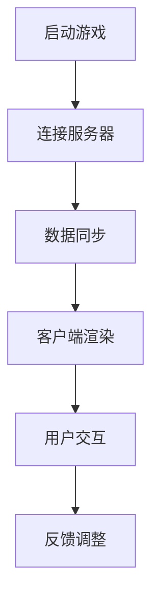
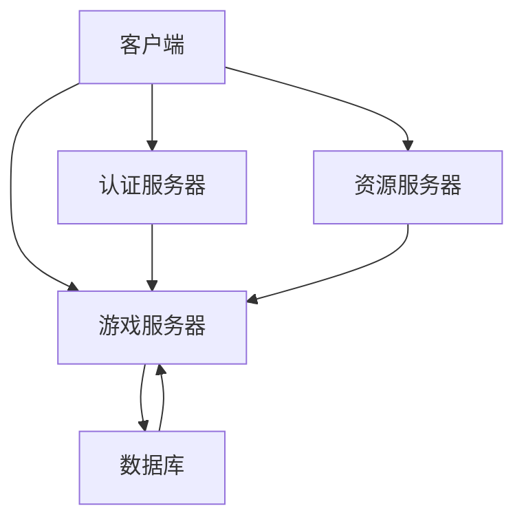

                 

# 网易2025游戏网络优化工程师社招面试题解

## 关键词

- 网易游戏网络优化
- 社招面试题
- 游戏网络架构
- 延迟补偿算法
- 数据同步技术
- 性能调优
- 网络故障排查

## 摘要

本文将深入探讨网易2025游戏网络优化工程师社招面试中的核心问题。通过分析游戏网络优化的基础知识和核心概念，包括游戏网络架构、网络延迟和抖动的测量，以及网络优化相关的算法和技术，本文将提供详细的解决方案和项目实战案例。此外，本文还将解析网络优化工程师的面试题，并讨论游戏网络优化的发展趋势和职业发展路径，为准备面试的读者提供全面的技术指导。

## 第一部分：基础知识和核心概念

### 第1章：游戏网络优化概述

#### 1.1 游戏网络优化的意义和作用

游戏网络优化是确保网络游戏稳定性和流畅性的关键环节。其意义和作用主要体现在以下几个方面：

1. **提升游戏体验**：通过优化网络性能，减少延迟和抖动，提高游戏画面的流畅度和操作响应速度，从而提升玩家的游戏体验。
2. **增强稳定性**：优化网络传输，确保游戏在复杂网络环境中稳定运行，降低丢包和卡顿现象，提高游戏的稳定性。
3. **降低成本**：合理的网络优化可以减少服务器带宽和计算资源的消耗，降低运营成本。

**Mermaid 流程图**：游戏网络优化流程



#### 1.2 游戏网络架构基础

游戏网络架构是游戏网络优化的重要基础，主要包括以下几个方面：

1. **客户端架构**：客户端负责接收游戏数据并进行渲染，是玩家与游戏世界交互的界面。
2. **服务器架构**：服务器负责处理游戏逻辑、存储游戏数据和管理游戏状态，是游戏运行的“大脑”。
3. **数据流**：游戏数据通过网络传输，包括玩家输入、游戏状态和服务器反馈。

**核心概念和架构**：游戏网络架构与数据流



#### 1.3 网络延迟和抖动的测量

网络延迟和抖动是影响游戏性能的两个重要因素，其测量方法如下：

1. **网络延迟**：网络延迟是指数据包从发送端到达接收端所需的时间，通常使用往返时间（RTT）来衡量。
   $$ RTT = \frac{distance}{speed} $$
   
2. **抖动**：抖动是指网络延迟的波动，通常使用最大和最小RTT的差值的一半来衡量。
   $$ jitter = \frac{max_rtt - min_rtt}{2} $$

**举例说明**：网络延迟和抖动对游戏体验的影响

- **低延迟**：当网络延迟较低时，玩家的操作可以迅速反馈到服务器，游戏响应速度快，体验流畅。
- **高延迟**：当网络延迟较高时，玩家的操作反应迟钝，游戏画面出现卡顿，体验差。
- **抖动大**：当抖动较大时，网络延迟波动剧烈，游戏体验不稳定，可能出现突然的卡顿或延迟。

### 第2章：网络优化核心算法

#### 2.1 延迟补偿算法

延迟补偿算法是一种通过预测和补偿网络延迟的技术，其核心思想是在接收数据时预测数据到达的时间，并提前处理，从而减少延迟影响。

**伪代码**：延迟补偿算法实现

```python
def compensate_delay(data, latency):
    data['timestamp'] += latency
    return data
```

#### 2.2 实时同步技术

实时同步技术是确保客户端和服务器数据一致性的关键，其核心思想是通过时间戳和时钟同步来保证数据的实时性。

**数学模型**：实时同步中的时间戳计算

$$ timestamp_{new} = timestamp_{old} + \frac{RTT}{2} $$

**举例说明**：实时同步在游戏中的应用

- **位置同步**：通过实时同步玩家的位置数据，确保玩家在游戏中的移动流畅。
- **状态同步**：通过实时同步游戏状态数据，确保多人游戏中的协作和竞争公平。

#### 2.3 接入延迟优化

接入延迟优化是提高游戏启动速度和首次体验流畅性的关键技术，其核心思想是通过优化客户端和服务器的连接过程来减少接入延迟。

**伪代码**：接入延迟优化算法

```python
def optimize_connection(server, client_list):
    for client in client_list:
        if client.connection_quality < threshold:
            server.transfer_data(client)
```

### 第3章：项目实战

#### 3.1 游戏网络优化项目案例

**实战案例**：某大型多人在线游戏网络优化项目

- **开发环境搭建**：配置高性能服务器和优化网络环境，选择合适的开发工具和框架。
- **源代码实现**：关键代码段和解读

```python
# 伪代码：数据同步关键代码
while game_in_progress:
    server_data = server.fetch_data()
    for client in clients:
        client.update_state(server_data)
```

#### 3.2 性能调优实战

**代码解读**：性能调优实战案例分析

- **代码分析**：关键性能优化点和效果评估

```python
# 伪代码：性能优化关键代码
def optimize_performance(game_logic):
    # 优化网络传输
    server.compress_data()
    # 优化数据处理
    server.process_data_parallel()
    # 优化渲染
    client.render_optimize()
```

#### 3.3 网络故障排查与解决

**实战案例**：网络故障排查与解决流程

- **故障诊断**：常用排查工具和方法
- **解决方案**：故障解决步骤和案例

```python
# 伪代码：故障排查关键代码
def diagnose_fault():
    # 使用ping命令检测网络连接
    ping_server(server_ip)
    # 使用traceroute命令分析数据包路径
    trace_route(server_ip)
```

### 第4章：面试题解析

#### 4.1 网络优化相关面试题

- **面试题案例**：网络延迟优化、数据同步策略、接入延迟优化等面试题

#### 4.2 技术方案设计和实施

- **面试题案例**：设计一个多人在线游戏网络优化方案

#### 4.3 性能优化与调优

- **面试题案例**：性能瓶颈分析、优化策略与实施

### 第5章：总结与展望

#### 5.1 游戏网络优化的发展趋势

- **趋势分析**：未来游戏网络优化技术的发展方向

#### 5.2 网络优化工程师的职业发展

- **职业规划**：网络优化工程师的职业发展路径

#### 5.3 总结与展望

- **总结**：本书的主要内容和学习要点
- **展望**：网络优化在游戏领域的发展前景

### 附录A：参考资料和工具

#### 附录A：参考资料和工具

- **参考资料**：推荐阅读的书籍、论文和网络资源
- **工具**：网络优化相关工具和框架介绍

---

**作者：AI天才研究院/AI Genius Institute & 禅与计算机程序设计艺术 /Zen And The Art of Computer Programming**

本文通过详细讲解游戏网络优化工程师社招面试中的核心问题，包括基础知识和核心概念、核心算法和技术、项目实战和面试题解析，为准备面试的读者提供了全面的技术指导。同时，对游戏网络优化的发展趋势和职业发展路径进行了深入分析，为读者在未来的职业发展中指明了方向。希望本文能帮助读者更好地应对面试挑战，提升自身技术能力，成为游戏网络优化领域的专家。

