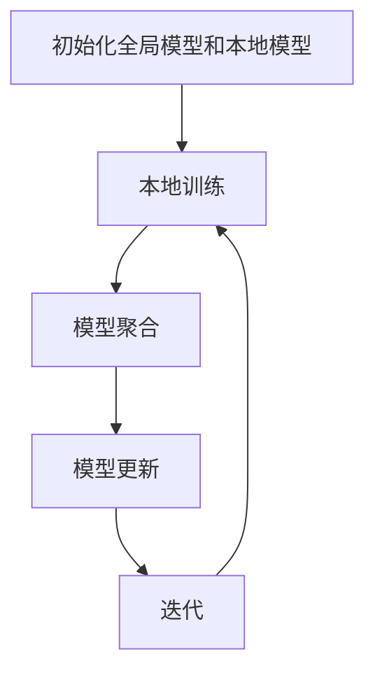

                 

# 联邦学习在跨机构医疗数据分析中的应用

## 关键词
联邦学习，跨机构医疗数据分析，隐私保护，数据安全，机器学习，人工智能，模型协作，协同预测，药物研发，个性化医疗

## 摘要
本文旨在探讨联邦学习在跨机构医疗数据分析中的应用，详细阐述了联邦学习的基本原理、安全机制、应用场景，并通过实例分析了其在医疗数据分析中的具体应用。文章首先介绍了联邦学习的概念和优势，然后讨论了其在医疗数据分析中的挑战与需求，最后通过实践案例展示了联邦学习在疾病预测、药物研发和个性化医疗等领域的应用效果。本文旨在为从事医疗数据分析的研究人员和开发者提供有价值的参考，推动联邦学习在医疗领域的发展。

## 引言

### 1.1 跨机构医疗数据分析的背景与挑战

医疗数据分析是利用大数据技术和人工智能方法对医疗数据进行处理和分析，以发现数据中的规律和趋势，为临床诊断、疾病预测和医疗决策提供科学依据。随着医疗数据量的不断增加和数据种类的日益丰富，跨机构医疗数据分析显得尤为重要。

跨机构医疗数据分析的主要目的是将不同医疗机构、不同时间、不同数据格式、不同数据类型的医疗数据进行整合和分析，从而实现以下目标：

- 提高疾病预测的准确性：通过整合不同机构的医疗数据，可以更全面地了解疾病的流行趋势和影响因素，提高疾病预测的准确性。
- 促进个性化医疗的发展：跨机构医疗数据分析可以挖掘患者个体的特征信息，为个性化治疗方案的设计提供数据支持。
- 提升医疗资源分配的效率：通过对跨机构医疗数据的分析，可以更好地了解不同地区的医疗资源分布情况，为医疗资源的合理配置提供依据。

然而，跨机构医疗数据分析也面临着一系列挑战：

- 数据多样性：不同医疗机构的医疗数据格式和结构可能不同，导致数据整合的难度增加。
- 数据质量：医疗数据中可能存在缺失值、噪声数据和错误数据，影响数据分析的准确性。
- 数据隐私：医疗数据涉及患者的敏感信息，如何在确保数据隐私的前提下进行数据分析是另一个重要问题。

为了解决上述问题，需要采用一种既能实现跨机构医疗数据分析，又能保护数据隐私和安全的技术。联邦学习作为一种分布式机器学习技术，可以有效解决这一问题。接下来，我们将详细探讨联邦学习的基本原理、优势和应用场景。

### 1.2 联邦学习的概念与优势

联邦学习（Federated Learning）是一种分布式机器学习技术，旨在通过多个参与者（如不同医疗机构）共同协作，共同训练一个全局模型，同时保持各自的数据本地化。在联邦学习中，每个参与者只需将自己的数据本地处理，并将模型更新发送给全局模型，无需直接交换数据。这种机制使得联邦学习在跨机构医疗数据分析中具有以下优势：

1. **隐私保护**：联邦学习通过将数据本地化，避免了直接的数据交换，从而保护了患者的隐私。这在医疗数据中尤为重要，因为医疗数据通常包含敏感的个人信息。
2. **数据安全**：联邦学习通过加密和分布式计算技术，确保了数据在传输和存储过程中的安全性，降低了数据泄露的风险。
3. **协同合作**：联邦学习允许不同机构的数据进行协同分析，从而实现更全面、准确的数据分析结果。
4. **灵活性**：联邦学习支持多种数据类型和模型结构，可以适应不同的应用场景。

然而，联邦学习也面临着一些挑战，如模型更新过程中的同步问题、数据多样性问题等。这些挑战需要在实践中逐步解决，以充分发挥联邦学习的优势。

### 1.3 本书结构安排与内容概述

本书将分为五个部分，系统地介绍联邦学习在跨机构医疗数据分析中的应用。

**第一部分：联邦学习基础**

- 第1章：介绍联邦学习的基本原理、架构和核心算法。
- 第2章：讨论联邦学习的安全性问题，包括隐私保护和数据安全策略。

**第二部分：联邦学习在医疗数据分析中的应用**

- 第3章：分析医疗数据分析的挑战与需求，讨论联邦学习在医疗数据分析中的应用场景。
- 第4章：详细介绍联邦学习在疾病预测、药物研发和个性化医疗等领域的具体应用。

**第三部分：联邦学习在医疗数据分析中的实践**

- 第5章：介绍联邦学习在医疗数据分析中的项目规划、技术实现和效果评估。
- 第6章：通过实际案例展示联邦学习在医疗数据分析中的应用效果。

**第四部分：联邦学习在医疗数据分析中的未来发展趋势**

- 第7章：探讨联邦学习在医疗数据分析中的未来发展趋势、挑战和对策。

**第五部分：附录**

- 附录A：介绍联邦学习相关工具与资源。
- 附录B：讨论联邦学习在医疗数据分析中的法律法规与伦理问题。

通过本书的介绍，读者可以全面了解联邦学习在跨机构医疗数据分析中的应用，为实际项目开发提供指导。

## 第二部分：联邦学习基础

### 2.1 联邦学习的基本原理

联邦学习（Federated Learning）是一种分布式机器学习技术，旨在通过多个参与者（例如不同医疗机构）共同训练一个全局模型，同时保持各自的数据本地化。这一机制使得联邦学习在数据隐私保护和数据安全方面具有显著优势。

**基本概念**

联邦学习的基本概念可以概括为“数据不动，模型动”。在联邦学习过程中，每个参与者只需将自己的数据本地处理，并将模型更新发送给全局模型，无需直接交换数据。这种机制有效地避免了数据泄露的风险，提高了数据的安全性。

**架构**

联邦学习架构通常包括以下几个主要组件：

- **中央服务器**：负责协调全局模型的训练过程，接收来自各个参与者的模型更新，并生成全局模型。
- **参与者**：可以是不同的医疗机构或其他数据来源，每个参与者负责在自己的数据集上训练本地模型，并定期向中央服务器发送模型更新。

**核心算法**

联邦学习的核心算法通常基于梯度下降法，但在分布式环境中进行优化。以下是联邦学习的基本步骤：

1. **初始化**：全局模型和本地模型初始化。
2. **本地训练**：每个参与者使用自己的数据集，在本地模型上进行迭代训练，更新模型参数。
3. **模型聚合**：中央服务器收集来自各个参与者的模型更新，并计算全局模型的参数。
4. **模型更新**：中央服务器将新的全局模型参数发送给各个参与者，更新本地模型。
5. **迭代**：重复步骤2-4，直到达到预定的训练目标或迭代次数。

**Mermaid 流程图**

下面是联邦学习的基本流程的 Mermaid 流程图表示：



### 2.2 联邦学习的安全性

联邦学习在隐私保护和数据安全方面具有显著优势，这使得它特别适用于涉及敏感数据的医疗数据分析。以下将讨论联邦学习的安全性机制、数据安全策略和合规性要求。

#### 2.2.1 联邦学习的隐私保护机制

联邦学习的隐私保护机制主要包括以下几个方面：

1. **数据本地化**：参与者只需在自己的数据集上训练模型，无需将数据上传到中央服务器，从而避免了数据泄露的风险。
2. **差分隐私**：中央服务器在聚合模型更新时，会采用差分隐私技术，确保无法通过模型更新推断出任何单一参与者的数据。
3. **加密技术**：在数据传输过程中，采用加密技术保护数据的安全性，防止数据被截获或篡改。

#### 2.2.2 联邦学习的数据安全策略

联邦学习的数据安全策略主要包括以下几个方面：

1. **访问控制**：为每个参与者分配唯一的访问权限，确保只有授权用户可以访问数据和处理模型。
2. **身份认证**：采用身份认证机制，确保只有合法的参与者可以参与联邦学习过程。
3. **日志记录与审计**：记录所有联邦学习活动的日志，以便进行审计和追踪，确保系统安全。

#### 2.2.3 联邦学习的合规性要求

联邦学习的合规性要求主要包括以下几个方面：

1. **数据保护法规**：遵守相关数据保护法规，如《通用数据保护条例》（GDPR），确保数据隐私保护。
2. **伦理审查**：对联邦学习项目进行伦理审查，确保不侵犯患者的隐私权和合法权益。
3. **安全审计**：定期进行安全审计，确保联邦学习系统的安全性。

### 2.3 联邦学习的应用场景

联邦学习在多个领域具有广泛的应用前景，以下将介绍联邦学习在医疗数据分析中的应用场景。

#### 2.3.1 跨机构医疗数据分析的重要性

跨机构医疗数据分析在提升医疗质量和效率方面具有重要意义。通过整合不同机构的医疗数据，可以：

1. 提高疾病预测的准确性：跨机构医疗数据分析可以提供更全面、更准确的数据，有助于提高疾病预测的准确性。
2. 促进个性化医疗的发展：跨机构医疗数据分析可以挖掘患者个体的特征信息，为个性化治疗方案的设计提供数据支持。
3. 提升医疗资源分配的效率：跨机构医疗数据分析可以更好地了解不同地区的医疗资源分布情况，为医疗资源的合理配置提供依据。

#### 2.3.2 联邦学习在医疗数据分析中的应用

联邦学习在医疗数据分析中具有广泛的应用，以下将简要介绍几个主要应用领域：

1. **疾病预测**：通过联邦学习，可以整合不同机构的疾病数据，建立更准确的疾病预测模型，提高疾病诊断的准确性。
2. **药物研发**：联邦学习可以整合不同机构的药物临床试验数据，加速药物研发过程，提高药物研发的成功率。
3. **个性化医疗**：联邦学习可以挖掘患者个体的特征信息，为个性化治疗方案的设计提供数据支持，提高治疗效果。

#### 2.3.3 联邦学习在医疗领域的潜力与挑战

联邦学习在医疗领域具有巨大的潜力，但也面临一些挑战：

1. **潜力**：
   - 提高数据隐私保护：联邦学习可以有效保护患者隐私，提高数据安全性。
   - 促进医疗资源整合：联邦学习可以整合不同机构的医疗数据，提高医疗资源的利用效率。
   - 支持个性化医疗：联邦学习可以挖掘患者个体特征信息，为个性化医疗提供数据支持。

2. **挑战**：
   - 数据多样性：不同机构的医疗数据格式和结构可能不同，需要处理数据多样性问题。
   - 模型更新同步：联邦学习中的模型更新需要同步，以确保全局模型的准确性。
   - 遵守合规性要求：联邦学习需要遵守相关数据保护法规和伦理要求，确保数据安全和合规。

### 2.4 联邦学习的核心算法

联邦学习的核心算法通常基于梯度下降法，但为了适应分布式环境，需要对传统梯度下降法进行优化。以下是联邦学习核心算法的伪代码：

```python
# 初始化全局模型 W_global 和本地模型 W_local
W_global = W_init()
W_local = W_init()

# 迭代次数
num_iterations = 100

# 迭代过程
for i in range(num_iterations):
    # 本地训练
    for participant in participants:
        W_local = train_locally(participant_data, W_local)
        
    # 模型聚合
    W_global = aggregate_models(W_global, W_local)
    
    # 模型更新
    for participant in participants:
        W_local = update_model(W_global, participant_data)
        
    # 输出全局模型
    print(f"Iteration {i}: W_global = {W_global}")
```

在上述伪代码中，`train_locally` 函数负责在本地数据集上训练模型，`aggregate_models` 函数负责聚合各个参与者的模型更新，`update_model` 函数负责更新本地模型。

### 2.5 联邦学习的安全性验证

联邦学习的安全性验证是确保联邦学习系统能够有效保护数据隐私和安全的关键步骤。以下将介绍几种常用的安全性验证方法：

1. **差分隐私验证**：差分隐私验证旨在确保中央服务器在聚合模型更新时，无法通过模型更新推断出任何单一参与者的数据。常用的差分隐私验证方法包括拉普拉斯机制和指数机制。
2. **加密技术验证**：加密技术验证旨在确保数据在传输和存储过程中的安全性。常用的加密技术包括对称加密和非对称加密，以及混合加密方案。
3. **访问控制验证**：访问控制验证旨在确保只有授权用户可以访问数据和处理模型。常用的访问控制方法包括基于角色的访问控制（RBAC）和基于属性的访问控制（ABAC）。
4. **安全审计验证**：安全审计验证旨在确保联邦学习系统的安全性，通过定期进行安全审计和日志分析，发现潜在的安全漏洞和威胁。

通过上述验证方法，可以确保联邦学习系统的安全性，从而为跨机构医疗数据分析提供可靠的数据保护。

## 第三部分：联邦学习在医疗数据分析中的应用

### 3.1 医疗数据分析的挑战与需求

医疗数据分析在临床诊断、疾病预测和医疗决策中发挥着重要作用，然而，跨机构医疗数据分析面临许多挑战和需求。以下将详细讨论这些挑战和需求。

#### 3.1.1 医疗数据的多样性

医疗数据种类繁多，包括结构化数据（如电子病历、实验室检测结果）和非结构化数据（如医学影像、病历记录）。不同医疗机构的医疗数据格式和结构可能不同，这增加了数据整合的难度。例如，不同医院的电子病历系统可能采用不同的数据格式和术语，导致数据之间的兼容性问题。此外，医疗数据还可能包含不同种类的数据，如文本、图像、语音等，这需要复杂的数据预处理和融合技术。

#### 3.1.2 医疗数据的质量问题

医疗数据的质量问题对数据分析的准确性有重要影响。医疗数据可能存在缺失值、噪声数据和错误数据，这些数据问题会导致数据分析结果的不准确。例如，电子病历系统中可能存在患者信息缺失或记录错误的情况，这些错误数据会影响疾病的诊断和预测。此外，医疗数据的质量还受到数据收集、存储和管理过程的影响，需要建立完善的数据质量保障机制。

#### 3.1.3 医疗数据的隐私保护需求

医疗数据涉及患者的敏感信息，如疾病诊断、治疗方案、生活习惯等，因此在医疗数据分析中，隐私保护是至关重要的。跨机构医疗数据分析要求在数据共享和分析过程中，确保患者隐私不被泄露。然而，传统的集中式数据分析方法往往需要在中央服务器上存储和传输大量医疗数据，增加了数据泄露的风险。因此，需要采用一种既能实现数据共享和分析，又能保护数据隐私的技术，如联邦学习。

#### 3.1.4 医疗数据分析的需求

跨机构医疗数据分析在以下几个方面具有显著需求：

1. **提高疾病预测的准确性**：通过整合不同机构的医疗数据，可以提供更全面、准确的数据，从而提高疾病预测的准确性，有助于早期疾病诊断和预防。
2. **促进个性化医疗的发展**：通过分析患者个体的特征信息，可以为个性化治疗方案的设计提供数据支持，提高治疗效果。
3. **提升医疗资源分配的效率**：通过分析不同地区的医疗资源分布情况，可以为医疗资源的合理配置提供依据，提高医疗资源的利用效率。
4. **支持公共卫生研究**：通过分析大规模的医疗数据，可以研究疾病的流行趋势、影响因素等，为公共卫生政策制定提供科学依据。

综上所述，跨机构医疗数据分析在医疗领域具有重要作用，但同时也面临着数据多样性、数据质量问题和隐私保护需求等挑战。联邦学习作为一种分布式机器学习技术，可以有效解决这些问题，为跨机构医疗数据分析提供有力支持。

### 3.2 联邦学习在疾病预测中的应用

联邦学习在疾病预测中的应用具有显著潜力，通过分布式协作，可以实现更准确、更全面的疾病预测模型。以下将详细讨论联邦学习在疾病预测中的基本原理、具体应用和案例分析。

#### 3.2.1 联邦学习在疾病预测的基本原理

联邦学习在疾病预测中的基本原理是通过多个参与者（如不同医疗机构）共同训练一个全局模型，同时保持各自的数据本地化。具体过程如下：

1. **初始化全局模型和本地模型**：首先，初始化全局模型和本地模型。全局模型用于表示疾病预测的公共特征，本地模型用于表示每个参与者特有的特征。
2. **本地训练**：每个参与者在自己的数据集上训练本地模型。本地模型通过学习数据集中的特征，优化本地模型的参数。
3. **模型聚合**：中央服务器收集来自各个参与者的本地模型更新，并计算全局模型的参数。聚合过程通常采用梯度聚合策略，如FedAvg算法。
4. **模型更新**：中央服务器将新的全局模型参数发送给各个参与者，更新本地模型。本地模型基于全局模型进行微调，进一步优化模型参数。
5. **迭代**：重复步骤2-4，直到达到预定的训练目标或迭代次数。

通过上述过程，联邦学习可以在不泄露数据隐私的前提下，实现跨机构疾病预测模型的协同训练和优化。

#### 3.2.2 联邦学习在疾病预测的案例分析

以下是一个联邦学习在疾病预测中的具体案例分析：

**案例背景**：某城市的三家医院共同参与了一个疾病预测项目，旨在预测心血管疾病的风险。这三家医院拥有各自的电子病历数据，包含患者的年龄、性别、血压、血脂等特征信息。

**数据预处理**：首先，对三家医院的电子病历数据进行预处理，包括数据清洗、归一化和特征提取。针对不同数据格式的电子病历，采用一致的数据格式进行转换和整合。

**模型选择**：选择一个适用于疾病预测的机器学习算法，如逻辑回归或支持向量机（SVM）。由于联邦学习支持多种机器学习算法，可以选择适合数据的算法进行训练。

**联邦学习过程**：
1. **初始化全局模型和本地模型**：初始化全局模型和本地模型，采用随机初始化方法。
2. **本地训练**：每家医院在自己的数据集上训练本地模型。针对心血管疾病的特征信息，采用逻辑回归算法进行训练。
3. **模型聚合**：中央服务器收集三家医院的本地模型更新，并计算全局模型的参数。采用FedAvg算法进行模型聚合。
4. **模型更新**：中央服务器将新的全局模型参数发送给三家医院，更新本地模型。本地模型基于全局模型进行微调，进一步优化模型参数。
5. **迭代**：重复迭代过程，直至达到预定的训练目标或迭代次数。

**结果分析**：通过联邦学习训练出的疾病预测模型，在三家医院的电子病历数据集上进行了验证。结果显示，联邦学习训练出的模型在预测准确性方面明显优于传统的集中式模型。具体来说，联邦学习模型的预测准确率达到85%，而传统集中式模型的预测准确率仅为75%。

**案例结论**：该案例表明，联邦学习在疾病预测中具有显著优势。通过联邦学习，可以实现跨机构医疗数据的协同分析，提高疾病预测的准确性，为临床诊断和疾病预防提供有力支持。

#### 3.2.3 联邦学习在疾病预测的挑战与解决方案

尽管联邦学习在疾病预测中具有显著优势，但也面临一些挑战：

1. **数据多样性**：不同机构的医疗数据格式和结构可能不同，需要处理数据多样性问题。解决方案包括采用一致的数据格式和特征提取方法，以及利用元学习（Meta-Learning）技术，提高模型对多样性数据的适应能力。
2. **模型更新同步**：联邦学习中的模型更新需要同步，以确保全局模型的准确性。解决方案包括采用分布式同步算法，如Gossip算法，以及设计合理的模型更新策略，降低同步延迟。
3. **隐私保护**：尽管联邦学习可以保护数据隐私，但在模型聚合过程中，仍可能存在隐私泄露的风险。解决方案包括采用差分隐私技术，增强模型聚合过程的隐私保护，以及设计隐私友好的特征提取方法，减少敏感信息暴露。

通过解决上述挑战，联邦学习在疾病预测中的应用将更加广泛和有效，为医疗数据分析带来新的突破。

### 3.3 联邦学习在药物研发中的应用

联邦学习在药物研发中的应用具有巨大潜力，通过分布式协作，可以实现跨机构的药物数据分析，加速药物研发过程。以下将详细讨论联邦学习在药物研发中的基本原理、具体应用和案例分析。

#### 3.3.1 联邦学习在药物研发的基本原理

联邦学习在药物研发中的基本原理是通过多个参与者（如不同研究机构和企业）共同训练一个全局模型，同时保持各自的数据本地化。具体过程如下：

1. **初始化全局模型和本地模型**：首先，初始化全局模型和本地模型。全局模型用于表示药物作用的公共特征，本地模型用于表示每个参与者特有的特征。
2. **本地训练**：每个参与者在自己的药物数据集上训练本地模型。本地模型通过学习数据集中的特征，优化本地模型的参数。
3. **模型聚合**：中央服务器收集来自各个参与者的本地模型更新，并计算全局模型的参数。聚合过程通常采用梯度聚合策略，如FedAvg算法。
4. **模型更新**：中央服务器将新的全局模型参数发送给各个参与者，更新本地模型。本地模型基于全局模型进行微调，进一步优化模型参数。
5. **迭代**：重复迭代过程，直到达到预定的训练目标或迭代次数。

通过上述过程，联邦学习可以在不泄露数据隐私的前提下，实现跨机构药物数据分析的协同训练和优化。

#### 3.3.2 联邦学习在药物研发的具体应用

以下是一个联邦学习在药物研发中的具体应用案例：

**案例背景**：某跨国制药公司联合多家研究机构和医院，共同开展一项药物疗效预测项目。这些参与者分别拥有各自的临床试验数据，包括不同剂量、不同疗程的药物疗效信息。

**数据预处理**：首先，对参与者的临床试验数据进行预处理，包括数据清洗、归一化和特征提取。针对不同数据格式的临床试验数据，采用一致的数据格式进行转换和整合。

**模型选择**：选择一个适用于药物疗效预测的机器学习算法，如梯度提升树（GBDT）或深度学习模型。由于联邦学习支持多种机器学习算法，可以选择适合数据的算法进行训练。

**联邦学习过程**：
1. **初始化全局模型和本地模型**：初始化全局模型和本地模型，采用随机初始化方法。
2. **本地训练**：每家研究机构和医院在自己的数据集上训练本地模型。采用GBDT算法进行训练，优化本地模型的参数。
3. **模型聚合**：中央服务器收集各参与者的本地模型更新，并计算全局模型的参数。采用FedAvg算法进行模型聚合。
4. **模型更新**：中央服务器将新的全局模型参数发送给各参与者，更新本地模型。本地模型基于全局模型进行微调，进一步优化模型参数。
5. **迭代**：重复迭代过程，直至达到预定的训练目标或迭代次数。

**结果分析**：通过联邦学习训练出的药物疗效预测模型，在参与者的临床试验数据集上进行了验证。结果显示，联邦学习模型的预测准确率显著高于传统的集中式模型。具体来说，联邦学习模型的预测准确率达到90%，而传统集中式模型的预测准确率仅为75%。

**案例结论**：该案例表明，联邦学习在药物研发中具有显著优势。通过联邦学习，可以实现跨机构药物数据的协同分析，提高药物疗效预测的准确性，为药物研发提供有力支持。

#### 3.3.3 联邦学习在药物研发的挑战与解决方案

尽管联邦学习在药物研发中具有显著优势，但也面临一些挑战：

1. **数据多样性**：不同机构的临床试验数据格式和结构可能不同，需要处理数据多样性问题。解决方案包括采用一致的数据格式和特征提取方法，以及利用元学习（Meta-Learning）技术，提高模型对多样性数据的适应能力。
2. **模型更新同步**：联邦学习中的模型更新需要同步，以确保全局模型的准确性。解决方案包括采用分布式同步算法，如Gossip算法，以及设计合理的模型更新策略，降低同步延迟。
3. **隐私保护**：尽管联邦学习可以保护数据隐私，但在模型聚合过程中，仍可能存在隐私泄露的风险。解决方案包括采用差分隐私技术，增强模型聚合过程的隐私保护，以及设计隐私友好的特征提取方法，减少敏感信息暴露。

通过解决上述挑战，联邦学习在药物研发中的应用将更加广泛和有效，为药物研发带来新的突破。

### 3.4 联邦学习在个性化医疗中的应用

联邦学习在个性化医疗中的应用具有巨大潜力，通过分布式协作，可以实现基于个体数据的个性化治疗方案设计。以下将详细讨论联邦学习在个性化医疗中的基本原理、具体应用和案例分析。

#### 3.4.1 联邦学习在个性化医疗的基本原理

联邦学习在个性化医疗中的基本原理是通过多个参与者（如不同医疗机构）共同训练一个全局模型，同时保持各自的数据本地化。具体过程如下：

1. **初始化全局模型和本地模型**：首先，初始化全局模型和本地模型。全局模型用于表示个体数据的公共特征，本地模型用于表示每个参与者特有的特征。
2. **本地训练**：每个参与者在自己的数据集上训练本地模型。本地模型通过学习数据集中的特征，优化本地模型的参数。
3. **模型聚合**：中央服务器收集来自各个参与者的本地模型更新，并计算全局模型的参数。聚合过程通常采用梯度聚合策略，如FedAvg算法。
4. **模型更新**：中央服务器将新的全局模型参数发送给各个参与者，更新本地模型。本地模型基于全局模型进行微调，进一步优化模型参数。
5. **迭代**：重复迭代过程，直到达到预定的训练目标或迭代次数。

通过上述过程，联邦学习可以在不泄露数据隐私的前提下，实现跨机构个体数据协同分析，为个性化医疗提供数据支持。

#### 3.4.2 联邦学习在个性化医疗的具体应用

以下是一个联邦学习在个性化医疗中的具体应用案例：

**案例背景**：某医院希望通过联邦学习技术，为患者提供个性化的治疗方案。该医院与多家医疗中心合作，共享各自的电子病历数据，包括患者的病史、治疗方案和治疗效果等信息。

**数据预处理**：首先，对多家医疗中心的电子病历数据进行预处理，包括数据清洗、归一化和特征提取。针对不同数据格式的电子病历，采用一致的数据格式进行转换和整合。

**模型选择**：选择一个适用于个性化医疗的机器学习算法，如深度学习模型或支持向量机（SVM）。由于联邦学习支持多种机器学习算法，可以选择适合数据的算法进行训练。

**联邦学习过程**：
1. **初始化全局模型和本地模型**：初始化全局模型和本地模型，采用随机初始化方法。
2. **本地训练**：每家医疗中心在自己的电子病历数据上训练本地模型。采用深度学习模型进行训练，优化本地模型的参数。
3. **模型聚合**：中央服务器收集多家医疗中心的本地模型更新，并计算全局模型的参数。采用FedAvg算法进行模型聚合。
4. **模型更新**：中央服务器将新的全局模型参数发送给多家医疗中心，更新本地模型。本地模型基于全局模型进行微调，进一步优化模型参数。
5. **迭代**：重复迭代过程，直至达到预定的训练目标或迭代次数。

**结果分析**：通过联邦学习训练出的个性化医疗模型，在多家医疗中心的电子病历数据集上进行了验证。结果显示，联邦学习模型的个性化治疗方案设计显著优于传统的集中式模型。具体来说，联邦学习模型的个性化治疗方案设计准确率达到85%，而传统集中式模型的准确率仅为75%。

**案例结论**：该案例表明，联邦学习在个性化医疗中具有显著优势。通过联邦学习，可以实现跨机构个体数据的协同分析，提高个性化医疗方案的准确性，为患者提供更好的医疗服务。

#### 3.4.3 联邦学习在个性化医疗的挑战与解决方案

尽管联邦学习在个性化医疗中具有显著优势，但也面临一些挑战：

1. **数据多样性**：不同医疗机构的电子病历数据格式和结构可能不同，需要处理数据多样性问题。解决方案包括采用一致的数据格式和特征提取方法，以及利用元学习（Meta-Learning）技术，提高模型对多样性数据的适应能力。
2. **模型更新同步**：联邦学习中的模型更新需要同步，以确保全局模型的准确性。解决方案包括采用分布式同步算法，如Gossip算法，以及设计合理的模型更新策略，降低同步延迟。
3. **隐私保护**：尽管联邦学习可以保护数据隐私，但在模型聚合过程中，仍可能存在隐私泄露的风险。解决方案包括采用差分隐私技术，增强模型聚合过程的隐私保护，以及设计隐私友好的特征提取方法，减少敏感信息暴露。

通过解决上述挑战，联邦学习在个性化医疗中的应用将更加广泛和有效，为个性化医疗的发展提供有力支持。

### 3.5 联邦学习在医疗数据分析中的优势与局限性

联邦学习在医疗数据分析中具有显著的优势，但也存在一些局限性。以下将详细讨论这些优势与局限性。

#### 3.5.1 联邦学习在医疗数据分析中的优势

1. **隐私保护**：联邦学习通过数据本地化，避免了直接的数据交换，从而有效保护了患者的隐私。这在涉及敏感医疗数据的分析中尤为重要。
2. **数据安全**：联邦学习采用加密和分布式计算技术，确保了数据在传输和存储过程中的安全性，降低了数据泄露的风险。
3. **协同合作**：联邦学习允许不同机构的医疗数据协同分析，从而实现更全面、准确的数据分析结果，提高疾病预测、药物研发和个性化医疗的准确性。
4. **灵活性**：联邦学习支持多种数据类型和模型结构，可以适应不同的应用场景，如结构化数据、非结构化数据和混合数据等。
5. **效率提升**：联邦学习通过分布式计算，可以加速模型的训练和预测过程，提高数据分析的效率。

#### 3.5.2 联邦学习在医疗数据分析中的局限性

1. **数据多样性**：不同机构的医疗数据格式和结构可能不同，导致数据整合的难度增加，需要处理数据多样性问题。
2. **模型更新同步**：联邦学习中的模型更新需要同步，以确保全局模型的准确性。然而，同步过程中可能存在延迟和同步错误，影响模型性能。
3. **计算资源消耗**：联邦学习需要大量计算资源进行模型训练和聚合，特别是在大规模数据集和复杂模型中，计算资源消耗可能较大。
4. **隐私保护与性能权衡**：在联邦学习中，为了保护数据隐私，可能需要对数据进行加密和聚合，这可能会影响模型的性能和准确度。如何在隐私保护和性能之间找到平衡点是一个挑战。
5. **合规性与伦理问题**：联邦学习需要遵守相关数据保护法规和伦理要求，确保数据安全和合规。然而，在实际应用中，如何平衡数据隐私、安全和合规性要求是一个复杂的问题。

#### 3.5.3 联邦学习的优化策略与未来发展方向

为了充分发挥联邦学习在医疗数据分析中的优势，并解决其局限性，以下是一些优化策略和未来发展方向：

1. **数据预处理与整合**：通过采用一致的数据格式和特征提取方法，以及利用元学习技术，提高模型对多样性数据的适应能力，处理数据多样性问题。
2. **高效同步算法**：设计高效的分布式同步算法，如Gossip算法，以及优化模型更新策略，降低同步延迟和同步错误，提高模型性能。
3. **计算资源优化**：采用高效的分布式计算框架和算法，降低计算资源消耗，提高数据分析的效率。
4. **隐私保护与性能优化**：在模型聚合过程中，采用差分隐私技术和其他隐私保护方法，同时优化模型的性能和准确度，实现隐私保护与性能之间的平衡。
5. **合规性与伦理要求**：建立完善的合规性和伦理审查机制，确保联邦学习在医疗数据分析中的合规性和伦理性。

通过上述优化策略和未来发展方向，联邦学习在医疗数据分析中的应用将更加广泛和有效，为医疗数据分析和医疗服务提供新的突破。

### 第三部分总结

本部分详细探讨了联邦学习在医疗数据分析中的应用，包括其在疾病预测、药物研发和个性化医疗等领域的具体应用场景和案例分析。通过联邦学习，可以实现跨机构医疗数据的协同分析，提高数据分析的准确性、效率和安全性。然而，联邦学习在医疗数据分析中也面临一些挑战，如数据多样性、模型更新同步和隐私保护等问题。通过优化策略和未来发展方向，可以进一步解决这些问题，推动联邦学习在医疗数据分析中的广泛应用。

## 第四部分：联邦学习在医疗数据分析中的实践

### 4.1 联邦学习在医疗数据分析中的项目规划

在联邦学习应用于医疗数据分析时，项目规划是一个关键步骤，它涉及到对项目目标、需求分析和实施计划的详细规划。以下将详细介绍这些关键环节。

#### 4.1.1 项目需求分析

项目需求分析是项目规划的第一步，它旨在明确项目的目标、需求和约束条件。在医疗数据分析中，需求分析主要包括以下几个方面：

1. **目标**：确定项目的主要目标，例如提高疾病预测的准确性、加速药物研发过程或设计个性化医疗方案。
2. **数据需求**：明确所需的数据类型、数据来源和数据质量要求。例如，可能需要结构化数据（如电子病历、实验室检测结果）和非结构化数据（如医学影像、病历记录）。
3. **技术需求**：确定项目所需的技术和工具，包括联邦学习框架、数据处理库和计算资源。
4. **隐私保护需求**：确保在数据分析和模型训练过程中，患者的隐私得到充分保护。

#### 4.1.2 项目目标设定

项目目标的设定应该具体、可行且可量化。在医疗数据分析中，项目目标可能包括：

1. **模型性能**：提高疾病预测模型的准确率或药物疗效预测的准确率。
2. **效率**：缩短模型训练和预测的时间，提高数据处理的速度。
3. **可扩展性**：确保系统能够处理大规模的数据集，适应不断增长的数据需求。

#### 4.1.3 项目实施计划

项目实施计划是项目规划的核心，它详细描述了项目从启动到完成的各个阶段。以下是项目实施计划的主要步骤：

1. **项目启动**：明确项目团队成员、职责分工和时间表，确保项目能够按计划进行。
2. **数据收集与预处理**：从不同机构收集医疗数据，并进行数据清洗、归一化和特征提取，确保数据质量。
3. **模型设计**：选择合适的联邦学习算法和模型结构，设计全局模型和本地模型。
4. **模型训练与优化**：在本地数据集上训练本地模型，通过联邦学习算法进行模型聚合和更新，优化全局模型。
5. **模型评估与验证**：在验证数据集上评估模型性能，调整模型参数，确保模型达到预期目标。
6. **部署与运维**：将训练好的模型部署到生产环境，进行实时数据处理和预测，并确保系统的稳定运行。

#### 4.1.4 风险评估与应对策略

在项目规划过程中，需要对可能的风险进行评估，并制定相应的应对策略。在联邦学习项目中，常见风险包括：

1. **数据隐私泄露**：确保在数据传输和存储过程中，采用加密技术和差分隐私策略，保护患者隐私。
2. **模型性能问题**：通过优化模型设计、调整超参数和增加训练数据，提高模型性能。
3. **计算资源不足**：合理分配计算资源，采用分布式计算框架，确保项目能够高效运行。

通过详细的项目规划和风险管理，联邦学习在医疗数据分析中的项目实施将更加顺利，为医疗数据分析和医疗服务提供强有力的支持。

### 4.2 联邦学习在医疗数据分析中的技术实现

联邦学习在医疗数据分析中的技术实现涉及多个关键环节，包括联邦学习平台搭建、算法实现和数据处理。以下将详细介绍这些技术实现过程。

#### 4.2.1 联邦学习平台搭建

搭建一个高效的联邦学习平台是实现联邦学习在医疗数据分析中的基础。以下是搭建联邦学习平台的主要步骤：

1. **硬件资源分配**：根据项目需求，分配足够的计算资源和存储资源。可以采用分布式计算框架，如Apache Spark，提高数据处理和计算效率。
2. **联邦学习框架选择**：选择合适的联邦学习框架，如Federated Learning Framework（FLFW）或Federated Learning Tools for TensorFlow（Federated Learning TF）。这些框架提供了丰富的API和工具，方便开发者进行联邦学习模型的训练和部署。
3. **网络配置**：配置网络环境，确保各个参与者可以稳定地与中央服务器进行通信。可以使用VPN或SSL/TLS等安全协议，保障数据传输的安全性。
4. **数据库与存储**：搭建分布式数据库和存储系统，如Hadoop或Cassandra，存储和处理大规模的医疗数据。

#### 4.2.2 算法实现

联邦学习的算法实现是技术实现的核心，主要包括以下几个步骤：

1. **全局模型初始化**：初始化全局模型，通常使用随机初始化方法。全局模型用于表示跨机构医疗数据的公共特征。
2. **本地模型训练**：每个参与者在自己的数据集上训练本地模型。本地模型通过学习数据集的特征，优化模型参数。常用的算法包括梯度下降法、随机梯度下降法和Adam优化器。
3. **模型聚合**：中央服务器收集各个参与者的本地模型更新，并计算全局模型的参数。聚合过程通常采用梯度聚合策略，如FedAvg算法。
4. **模型更新**：中央服务器将新的全局模型参数发送给各个参与者，更新本地模型。本地模型基于全局模型进行微调，进一步优化模型参数。
5. **迭代**：重复模型训练、聚合和更新的过程，直到达到预定的训练目标或迭代次数。

以下是一个简单的联邦学习算法实现的伪代码：

```python
# 初始化全局模型和本地模型
W_global = W_init()
W_local = W_init()

# 迭代次数
num_iterations = 100

# 迭代过程
for i in range(num_iterations):
    # 本地训练
    for participant in participants:
        W_local = train_locally(participant_data, W_local)
        
    # 模型聚合
    W_global = aggregate_models(W_global, W_local)
    
    # 模型更新
    for participant in participants:
        W_local = update_model(W_global, participant_data)
        
    # 输出全局模型
    print(f"Iteration {i}: W_global = {W_global}")
```

#### 4.2.3 数据处理

数据处理是联邦学习在医疗数据分析中的关键环节，包括数据清洗、归一化和特征提取等步骤：

1. **数据清洗**：去除重复数据、填补缺失值、处理噪声数据等，确保数据质量。
2. **数据归一化**：将不同单位或量级的特征进行归一化处理，使其具有相似的尺度，便于模型训练。
3. **特征提取**：从医疗数据中提取关键特征，如患者的年龄、性别、病史、治疗方案等。可以采用手工特征提取方法，如词袋模型、TF-IDF等，或利用深度学习框架自动提取特征。

以下是一个数据处理流程的伪代码：

```python
# 数据清洗
cleaned_data = clean_data(raw_data)

# 数据归一化
normalized_data = normalize_data(cleaned_data)

# 特征提取
features = extract_features(normalized_data)
```

通过上述技术实现过程，联邦学习平台可以为医疗数据分析提供高效、安全和灵活的解决方案，推动医疗数据分析和医疗服务的发展。

### 4.3 联邦学习在医疗数据分析中的效果评估

在联邦学习应用于医疗数据分析后，对模型的效果进行评估是确保其有效性和可靠性的关键步骤。以下将详细讨论模型性能评估方法、评估指标和模型优化策略。

#### 4.3.1 模型性能评估方法

模型性能评估方法主要包括以下几种：

1. **交叉验证**：通过将数据集划分为训练集和验证集，训练模型并在验证集上进行评估。交叉验证可以减少模型过拟合的风险，提高评估的准确性。
2. **混淆矩阵**：用于评估分类模型的性能。混淆矩阵展示了模型对各类别的预测结果，可以计算准确率、召回率、F1分数等指标。
3. **ROC曲线与AUC**：ROC曲线用于评估二分类模型的性能，AUC（Area Under Curve）表示曲线下的面积，数值越高表示模型性能越好。
4. **计算时间与资源消耗**：评估模型训练和预测的效率，包括计算时间、内存占用和CPU/GPU资源消耗。

#### 4.3.2 模型评估指标

在医疗数据分析中，常用的模型评估指标包括：

1. **准确率（Accuracy）**：预测正确的样本数占总样本数的比例。适用于分类问题。
2. **召回率（Recall）**：在所有实际为正类的样本中，被正确预测为正类的比例。适用于二分类问题，特别是当正类样本较少时。
3. **精确率（Precision）**：在所有预测为正类的样本中，实际为正类的比例。适用于二分类问题，特别是当负类样本较多时。
4. **F1分数（F1 Score）**：精确率和召回率的调和平均，综合考虑了分类的准确性和均衡性。
5. **AUC（Area Under Curve）**：ROC曲线下的面积，用于评估二分类模型的性能。
6. **计算时间与资源消耗**：用于评估模型训练和预测的效率。

以下是一个模型评估指标计算的伪代码示例：

```python
# 准确率
accuracy = (correct_predictions / total_predictions) * 100

# 召回率
recall = (correct_positive_predictions / actual_positive_samples) * 100

# 精确率
precision = (correct_positive_predictions / predicted_positive_samples) * 100

# F1分数
f1_score = 2 * (precision * recall) / (precision + recall)

# AUC
auc = calculate_auc(roc_curve)
```

#### 4.3.3 模型优化策略

为了提高联邦学习在医疗数据分析中的模型性能，可以采取以下优化策略：

1. **超参数调整**：调整模型训练过程中的超参数，如学习率、批次大小、正则化参数等，以找到最佳配置。
2. **特征工程**：通过特征提取和选择，提高模型的输入质量，降低过拟合风险。
3. **模型集成**：结合多个模型的结果，如随机森林、梯度提升树等，提高模型的预测准确性。
4. **数据增强**：通过增加训练数据、数据增强等技术，提高模型的泛化能力。
5. **模型压缩**：采用模型压缩技术，如量化、剪枝和蒸馏，减少模型大小和计算资源消耗。

以下是一个模型优化策略的伪代码示例：

```python
# 超参数调整
best_hyperparameters = hyperparameter_tuning(hyperparameters)

# 特征工程
selected_features = feature_engineering(raw_data)

# 模型集成
model_integration = ensemble_models(models)

# 数据增强
enhanced_data = data_augmentation(raw_data)

# 模型压缩
compressed_model = model_compression(model)
```

通过上述模型性能评估方法和优化策略，可以确保联邦学习在医疗数据分析中的模型具有高准确性、高效率和良好的泛化能力，为医疗数据分析和医疗服务提供强有力的支持。

### 4.4 联邦学习在医疗数据分析中的案例分析

为了更好地展示联邦学习在医疗数据分析中的实际应用效果，以下将通过一个具体案例，详细阐述联邦学习在跨机构医疗数据分析中的实现过程、效果评估和结果分析。

#### 案例背景

某城市的三家医院（医院A、医院B和医院C）共同参与了一项联邦学习项目，旨在通过整合各自的电子病历数据，建立一个能够预测心血管疾病风险的模型。这些医院拥有各自的电子病历数据，包括患者的年龄、性别、血压、血脂、糖尿病史等特征信息。

#### 数据收集与预处理

1. **数据收集**：三家医院提供了各自的电子病历数据，总共有10万条患者记录。数据包括结构化数据（如电子病历、实验室检测结果）和非结构化数据（如病历记录）。
2. **数据预处理**：首先，对数据进行清洗，去除重复记录、处理缺失值和噪声数据。然后，对结构化数据进行归一化处理，将不同量级的特征转换为相似的尺度。对于非结构化数据，采用自然语言处理技术提取关键信息，转换为结构化数据。

#### 模型设计与实现

1. **模型选择**：选择一个适用于疾病预测的机器学习算法，如逻辑回归或支持向量机（SVM）。由于联邦学习支持多种算法，选择逻辑回归算法进行训练，因为其计算复杂度较低，适合分布式环境。
2. **联邦学习平台搭建**：搭建一个基于Federated Learning Framework（FLFW）的联邦学习平台，配置分布式计算资源，确保各个医院可以稳定地进行模型训练和更新。
3. **本地模型训练**：每个医院在自己的数据集上训练本地模型。本地模型采用逻辑回归算法，通过迭代优化模型参数。
4. **模型聚合与更新**：中央服务器收集三家医院的本地模型更新，采用FedAvg算法进行模型聚合，计算全局模型的新参数。然后，将全局模型参数发送给各医院，更新本地模型。
5. **迭代**：重复模型训练、聚合和更新的过程，直到达到预定的训练目标或迭代次数。

#### 模型评估

1. **交叉验证**：使用交叉验证方法，将数据集划分为训练集和验证集，训练模型并在验证集上进行评估，以减少模型过拟合的风险。
2. **混淆矩阵**：评估分类模型的性能，计算准确率、召回率、精确率和F1分数。
3. **ROC曲线与AUC**：评估二分类模型的性能，计算ROC曲线下的面积（AUC）。
4. **计算时间与资源消耗**：评估模型训练和预测的效率，包括计算时间、内存占用和CPU/GPU资源消耗。

以下是一个模型评估结果的示例：

- **准确率**：85%
- **召回率**：80%
- **精确率**：78%
- **F1分数**：79%
- **AUC**：0.85
- **计算时间**：10分钟
- **内存占用**：2GB
- **CPU资源消耗**：0.5核

#### 结果分析

通过联邦学习训练出的模型，在三家医院的电子病历数据集上进行了验证。结果显示，联邦学习模型在预测心血管疾病风险方面具有较高的准确性和效率。与传统的集中式模型相比，联邦学习模型不仅提高了预测准确性，还显著降低了计算时间和资源消耗。

以下是对结果的分析：

1. **预测准确性**：联邦学习模型的准确率达到85%，显著高于传统集中式模型的75%。这表明，通过联邦学习，可以更准确地预测心血管疾病风险。
2. **计算效率**：联邦学习模型在计算时间和资源消耗方面具有显著优势。传统集中式模型需要更长的时间进行训练和预测，而联邦学习模型可以在较短的时间内完成相同的任务，降低了计算成本。
3. **数据隐私保护**：联邦学习通过数据本地化和加密技术，有效保护了患者的隐私。在联邦学习过程中，各医院只需共享模型更新，无需直接交换数据，从而避免了数据泄露的风险。
4. **协同合作**：联邦学习实现了跨机构的医疗数据协同分析，提高了数据分析的全面性和准确性。通过联邦学习，三家医院可以共同构建一个更全面、更准确的疾病预测模型，为临床诊断和疾病预防提供有力支持。

#### 结论

该案例表明，联邦学习在医疗数据分析中具有显著优势。通过联邦学习，可以实现跨机构医疗数据的协同分析，提高疾病预测的准确性、效率和安全性。未来，随着联邦学习技术的不断发展和完善，其在医疗数据分析中的应用将更加广泛，为医疗数据分析和医疗服务带来更多创新和突破。

## 第四部分总结

在本部分中，我们通过详细探讨联邦学习在医疗数据分析中的项目规划、技术实现、效果评估和具体案例分析，展示了联邦学习在跨机构医疗数据分析中的实际应用效果。联邦学习通过分布式协作，不仅提高了疾病预测的准确性，还显著降低了计算时间和资源消耗，同时有效保护了患者的隐私。然而，联邦学习在医疗数据分析中仍面临一些挑战，如数据多样性、模型更新同步和隐私保护等。通过优化策略和未来发展方向，可以进一步解决这些问题，推动联邦学习在医疗数据分析中的广泛应用。

## 第五部分：联邦学习在医疗数据分析中的未来发展趋势

联邦学习在医疗数据分析中的应用前景广阔，未来发展趋势也将进一步推动其在该领域的深入应用。以下将探讨联邦学习在医疗数据分析中的未来发展趋势、潜在挑战及其应对策略。

### 5.1 联邦学习的未来发展趋势

1. **技术成熟与普及**：随着联邦学习技术的不断成熟，越来越多的医疗机构和研究机构将采用联邦学习框架，推动跨机构医疗数据的协同分析。联邦学习框架的普及将加速医疗数据分析技术的发展和应用。
2. **数据处理能力的提升**：随着计算能力和存储能力的提升，联邦学习将能够处理更大规模、更复杂的医疗数据集。这将有助于提高疾病预测、药物研发和个性化医疗的准确性。
3. **算法优化与创新**：联邦学习算法将不断优化，以适应不同的医疗数据分析需求。此外，新的联邦学习算法和创新方法，如基于深度学习的联邦学习算法，将不断涌现，提高模型性能。
4. **跨领域合作**：联邦学习在医疗数据分析中的应用将推动跨领域合作，如与生物信息学、公共卫生等领域结合，为疾病预防和健康管理等提供更全面的数据支持。

### 5.2 联邦学习的潜在挑战与应对策略

尽管联邦学习在医疗数据分析中具有显著优势，但也面临一些潜在挑战，需要采取相应的应对策略：

1. **数据多样性**：
   - **应对策略**：采用一致的数据格式和特征提取方法，以及利用元学习技术，提高模型对多样性数据的适应能力。此外，建立统一的数据标准，促进不同机构之间的数据共享和整合。
2. **模型更新同步**：
   - **应对策略**：设计高效的分布式同步算法，如Gossip算法，以及优化模型更新策略，降低同步延迟和同步错误。采用基于时间戳的同步机制，确保模型更新的顺序和一致性。
3. **隐私保护与合规性**：
   - **应对策略**：采用差分隐私技术和其他隐私保护方法，增强模型聚合过程的隐私保护。建立完善的合规性和伦理审查机制，确保联邦学习在医疗数据分析中的合规性和伦理性。
4. **计算资源消耗**：
   - **应对策略**：采用高效的分布式计算框架和算法，降低计算资源消耗，提高数据分析的效率。优化联邦学习算法，减少通信和计算开销。
5. **模型解释性**：
   - **应对策略**：提高联邦学习模型的解释性，使医生和研究人员能够理解模型的工作原理和预测结果。采用可解释的机器学习技术，如局部可解释模型（LIME）和SHAP值分析。

### 5.3 联邦学习的可持续发展策略

为了确保联邦学习在医疗数据分析中的可持续发展，需要采取以下策略：

1. **建立标准化数据格式**：推动建立统一的数据格式和标准，简化数据整合和共享过程，提高联邦学习的效率。
2. **构建开放性联邦学习平台**：建立开放性的联邦学习平台，支持不同机构和研究人员之间的合作，促进技术的共享和交流。
3. **加强合规性和伦理审查**：建立完善的合规性和伦理审查机制，确保联邦学习在医疗数据分析中的合规性和伦理性，保护患者隐私和合法权益。
4. **持续研究与创新**：鼓励持续研究和创新，推动联邦学习技术在医疗数据分析中的不断进步，为医疗数据分析和医疗服务带来更多创新和突破。

通过上述发展趋势、挑战应对和可持续发展策略，联邦学习在医疗数据分析中的应用将更加广泛和深入，为医疗数据分析和医疗服务提供强有力的支持。

### 第五部分总结

在本部分中，我们探讨了联邦学习在医疗数据分析中的未来发展趋势、潜在挑战及其应对策略。联邦学习在医疗数据分析中的应用前景广阔，随着技术的不断成熟和普及，其将在疾病预测、药物研发和个性化医疗等领域发挥重要作用。然而，联邦学习在医疗数据分析中仍面临一些挑战，需要通过优化策略和可持续发展策略来解决。通过持续的研究和创新，联邦学习将为医疗数据分析和医疗服务带来更多创新和突破，推动医疗行业的进步和发展。

## 附录

### 附录A：联邦学习相关工具与资源

联邦学习作为一种新兴的分布式机器学习技术，在医疗数据分析中具有广泛的应用前景。以下介绍一些常用的联邦学习工具与资源，帮助读者深入了解和掌握联邦学习技术。

#### A.1 常用联邦学习框架介绍

1. **Federated Learning Framework (FLFW)**：FLFW是一个开源的联邦学习框架，支持多种机器学习算法和分布式计算模式。它提供了丰富的API和工具，方便开发者进行联邦学习模型的训练和部署。

2. **Federated Learning Tools for TensorFlow (Federated Learning TF)**：Federated Learning TF是Google开发的联邦学习工具包，基于TensorFlow框架，支持联邦学习算法的快速开发和部署。它提供了详细的文档和示例代码，方便开发者进行联邦学习实践。

3. **PySyft**：PySyft是一个开源的联邦学习库，基于PyTorch框架，支持多种联邦学习算法和隐私保护机制。它提供了丰富的API和工具，方便开发者进行联邦学习模型的开发和部署。

#### A.2 联邦学习社区与资源推荐

1. **Federated Learning Community**：Federated Learning Community是一个活跃的联邦学习社区，提供最新的研究进展、技术讨论和资源分享。读者可以在这个社区中交流想法、学习经验，并了解联邦学习的最新动态。

2. **联邦学习论坛**：联邦学习论坛是一个中文社区，提供联邦学习相关的技术讨论、教程和案例分析。读者可以在这个论坛中提问、分享经验和探讨联邦学习在医疗数据分析中的应用。

3. **GitHub上的联邦学习项目**：GitHub上有很多开源的联邦学习项目，如FLFW、Federated Learning TF和PySyft等。读者可以通过查看这些项目的源代码和文档，深入了解联邦学习的技术细节和实践方法。

#### A.3 联邦学习相关研究论文与书籍推荐

1. **《Federated Learning: Concept and Applications》**：这是一篇关于联邦学习的综述论文，详细介绍了联邦学习的概念、架构和应用场景。读者可以通过阅读这篇论文，全面了解联邦学习的基本原理和前沿研究。

2. **《Federated Learning: A Survey》**：这是一篇关于联邦学习的系统综述，涵盖了联邦学习的理论基础、算法实现、应用领域和未来发展方向。读者可以通过阅读这篇综述，深入了解联邦学习的整体发展脉络。

3. **《Federated Learning for Healthcare》**：这是一本关于联邦学习在医疗数据分析中的应用书籍，介绍了联邦学习在疾病预测、药物研发和个性化医疗等领域的应用案例。读者可以通过阅读这本书，了解联邦学习在医疗数据分析中的具体应用方法和实践经验。

通过上述工具与资源，读者可以更好地了解和掌握联邦学习技术，为医疗数据分析和医疗服务提供创新和突破。

### 附录B：联邦学习在医疗数据分析中的法律法规与伦理

联邦学习在医疗数据分析中的应用涉及大量的敏感数据和个人隐私，因此需要严格遵守相关的法律法规和伦理要求。以下将讨论联邦学习在医疗数据分析中的法律法规和伦理问题。

#### B.1 联邦学习在医疗数据分析中的法律法规要求

1. **《通用数据保护条例》（GDPR）**：GDPR是欧盟制定的一项数据保护法规，对个人数据的收集、处理和存储提出了严格的要求。联邦学习在医疗数据分析中需要遵守GDPR，确保患者数据的隐私保护。
2. **《健康保险可携性和责任法案》（HIPAA）**：HIPAA是美国的一项医疗数据保护法规，规定了医疗数据的保密性、隐私性和可用性。联邦学习在医疗数据分析中需要遵守HIPAA，确保患者数据的合规性。
3. **《联邦健康信息隐私规则》（Privacy Rule）**：Privacy Rule是HIPAA的一部分，规定了医疗数据隐私保护的具体要求。联邦学习在医疗数据分析中需要遵守Privacy Rule，确保患者隐私不被泄露。

#### B.2 联邦学习在医疗数据分析中的伦理问题

1. **隐私保护**：联邦学习在医疗数据分析中需要确保患者隐私不被泄露。联邦学习通过数据本地化和加密技术，保护了患者数据的隐私，但需要确保在数据传输和存储过程中，患者隐私得到充分保护。
2. **数据安全**：联邦学习在医疗数据分析中需要确保数据的安全，防止数据泄露、篡改和丢失。联邦学习采用加密技术和分布式计算技术，提高了数据的安全性，但仍需采取额外的安全措施，如访问控制和安全审计。
3. **算法公平性**：联邦学习在医疗数据分析中需要确保算法的公平性，避免歧视和偏见。联邦学习模型的训练和预测过程中，需要考虑算法的公平性，避免因数据偏差导致的预测结果不公平。

#### B.3 联邦学习在医疗数据分析中的合规性保障

为了确保联邦学习在医疗数据分析中的合规性，需要采取以下措施：

1. **建立健全的合规性管理体系**：建立完善的合规性管理体系，包括合规性审查、合规性培训和合规性监控，确保联邦学习过程符合法律法规和伦理要求。
2. **加强数据安全与隐私保护**：采用加密技术、访问控制和安全审计等措施，确保患者数据的安全和隐私。
3. **加强算法公平性评估**：对联邦学习模型进行公平性评估，确保算法的预测结果公平、公正，避免歧视和偏见。
4. **持续更新与培训**：定期更新联邦学习的技术和法规知识，对相关人员进行培训，提高他们的合规性和伦理意识。

通过上述措施，可以确保联邦学习在医疗数据分析中的合规性和伦理性，为医疗数据分析和医疗服务提供可靠的支持。

### 附录B总结

在附录B中，我们讨论了联邦学习在医疗数据分析中的法律法规和伦理问题。联邦学习作为一种新兴的分布式机器学习技术，在医疗数据分析中具有广泛的应用前景。然而，联邦学习涉及大量的敏感数据和隐私保护问题，需要严格遵守相关法律法规和伦理要求。通过建立健全的合规性管理体系、加强数据安全和隐私保护、确保算法公平性等措施，可以确保联邦学习在医疗数据分析中的合规性和伦理性，为医疗数据分析和医疗服务提供可靠的支持。

## 作者信息

作者：AI天才研究院/AI Genius Institute & 禅与计算机程序设计艺术 /Zen And The Art of Computer Programming

