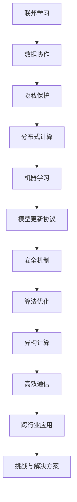

                 

## 《联邦学习在跨行业数据协作中的实践与挑战》

### 关键词：联邦学习、数据协作、跨行业应用、隐私保护、分布式计算、机器学习、挑战与解决方案

#### 摘要

本文旨在深入探讨联邦学习在跨行业数据协作中的实践与挑战。联邦学习作为一种分布式机器学习技术，通过保护数据隐私的同时实现数据协作，成为当前人工智能领域的重要研究方向。本文首先介绍了联邦学习的基本概念、架构与核心算法，然后详细分析了联邦学习在金融、医疗健康和智能交通等跨行业应用中的实践案例，最后探讨了联邦学习面临的挑战及其解决方案，并对未来的发展趋势进行了展望。通过本文的阐述，希望读者能够全面了解联邦学习的应用价值及未来发展方向。

### 目录大纲

1. **联邦学习基本概念**
    1.1 联邦学习概述
    1.2 联邦学习与传统集中式学习的对比
    1.3 联邦学习的应用领域
2. **联邦学习架构与原理**
    2.1 联邦学习的基本架构
    2.2 联邦学习算法原理
    2.3 联邦学习的安全性与隐私保护
3. **联邦学习核心算法**
    3.1 梯度聚合算法
    3.2 集成学习算法
    3.3 强化学习算法
4. **跨行业数据协作实践**
    4.1 金融行业中的联邦学习
    4.2 医疗健康领域的联邦学习
    4.3 智能交通领域的联邦学习
5. **联邦学习的挑战与解决方案**
    5.1 数据隐私保护
    5.2 模型效果优化
    5.3 系统安全性与稳定性
6. **联邦学习的未来发展趋势**
    6.1 跨行业协同
    6.2 新型联邦学习算法
    6.3 法规与标准化
7. **附录**
    7.1 主流联邦学习框架对比
    7.2 联邦学习实践教程
    7.3 联邦学习相关论文与资料

### 联邦学习核心概念与联系

首先，我们需要理解联邦学习（Federated Learning）的核心概念及其与其他技术领域的联系。联邦学习是一种分布式机器学习技术，它通过多个独立的设备或服务器共同训练一个模型，而无需直接共享数据。这种技术的主要目标是保护数据隐私，同时实现跨机构或跨行业的数据协作。以下是一个用 Mermaid 语言描述的联邦学习核心概念与联系的流程图：



在上述流程图中，我们可以看到联邦学习的核心概念是如何相互关联的。联邦学习通过数据协作实现分布式计算，同时保护数据隐私。它基于机器学习算法，通过模型更新协议来优化算法，并考虑安全机制和异构计算。此外，联邦学习还需要高效通信机制来支持跨行业应用，并解决各种挑战和问题。

#### 联邦学习的基本概念

联邦学习（Federated Learning）是一种分布式机器学习技术，旨在通过多个独立的设备或服务器共同训练一个模型，而无需直接共享数据。其基本概念包括以下几个关键组成部分：

1. **客户端（Clients）**：客户端是参与联邦学习过程的设备或服务器，它们拥有本地数据并进行本地模型训练。每个客户端都有自己的数据集和模型，并且不需要将数据上传到中央服务器。

2. **参数服务器（Parameter Server）**：参数服务器存储全局模型参数，负责接收来自各个客户端的更新，并生成新的全局模型参数。参数服务器可以是单台服务器，也可以是分布式系统。

3. **通信协议**：通信协议定义了客户端与参数服务器之间的交互方式。常用的通信协议包括同步通信协议和异步通信协议。

4. **本地模型更新**：每个客户端在本地使用本地数据和全局模型参数进行训练，并更新本地模型。本地模型更新的目标是优化模型在本地数据集上的表现。

5. **全局模型更新**：参数服务器收集所有客户端的本地模型更新，通过某种聚合方式生成新的全局模型参数。全局模型更新的目标是优化模型在整个数据集上的表现。

6. **模型聚合算法**：模型聚合算法是一种用于合并多个本地模型的算法，旨在生成一个全局模型。常见的模型聚合算法包括加权平均、梯度聚合等。

7. **安全性与隐私保护**：联邦学习的关键挑战之一是保护数据隐私。为了实现这一点，联邦学习采用了多种安全性和隐私保护技术，如差分隐私、安全多方计算、同态加密等。

通过上述组成部分，联邦学习实现了在保护数据隐私的同时，实现跨机构或跨行业的数据协作。以下是联邦学习的一个简单工作流程：

1. **初始化**：参数服务器初始化全局模型参数，并将其发送给所有客户端。

2. **本地训练**：客户端使用本地数据和全局模型参数进行本地训练，更新本地模型。

3. **模型更新**：客户端将本地模型更新发送给参数服务器。

4. **模型聚合**：参数服务器接收所有客户端的模型更新，并通过模型聚合算法生成新的全局模型参数。

5. **全局更新**：参数服务器将新的全局模型参数发送给所有客户端。

6. **重复步骤 2-5**：重复进行本地训练、模型更新、模型聚合和全局更新的过程，直到满足特定的训练目标或迭代次数。

联邦学习通过这种方式实现分布式训练，使得数据可以留在本地，避免了数据泄露的风险。这使得联邦学习成为跨行业数据协作的理想选择，特别适用于涉及敏感数据或隐私保护要求高的场景。

#### 联邦学习与传统集中式学习的对比

联邦学习与传统集中式学习在数据管理、计算效率和模型性能等方面存在显著差异。以下是两种学习方式的详细对比：

1. **数据管理**：
   - **集中式学习**：在集中式学习中，所有数据都集中存储在一个中央服务器上。模型训练需要将数据从各个数据源收集到中央服务器，这可能导致数据隐私和安全问题，特别是在涉及敏感数据时。
   - **联邦学习**：在联邦学习中，数据保留在各个客户端上，模型训练过程中只传输模型参数的更新。这样可以避免数据泄露，提高数据安全性。

2. **计算效率**：
   - **集中式学习**：集中式学习通常依赖于强大的中央计算资源。当数据量很大时，需要大量计算资源来处理数据，并且数据传输时间可能成为瓶颈。
   - **联邦学习**：联邦学习将计算任务分散到各个客户端，客户端可以在本地完成大部分训练任务，只需传输模型参数的更新。这样可以减少数据传输时间和中央计算资源的压力，提高整体计算效率。

3. **模型性能**：
   - **集中式学习**：集中式学习可以利用大量的数据进行训练，从而提高模型的泛化能力。然而，数据量庞大也可能导致过拟合问题，特别是在训练数据与测试数据分布不一致时。
   - **联邦学习**：联邦学习在客户端本地训练模型，这意味着模型可能会受到客户端数据分布的影响，可能导致模型性能降低。但是，联邦学习可以有效地利用隐私保护的数据，并通过模型聚合算法提高模型的泛化能力。

4. **安全性**：
   - **集中式学习**：集中式学习需要将数据上传到中央服务器，存在数据泄露的风险。此外，一旦中央服务器被攻击，所有数据都可能受到威胁。
   - **联邦学习**：联邦学习通过保持数据在客户端本地，降低了数据泄露的风险。同时，联邦学习采用了多种安全性和隐私保护技术，如差分隐私、安全多方计算和同态加密，进一步提高了数据安全性。

5. **隐私保护**：
   - **集中式学习**：集中式学习在处理敏感数据时可能面临隐私保护问题。为了满足隐私保护要求，可能需要采取额外的安全措施，如数据加密和访问控制。
   - **联邦学习**：联邦学习通过在本地训练模型并只传输参数更新，有效避免了数据泄露的风险。此外，联邦学习可以结合差分隐私等技术，进一步确保数据隐私。

总的来说，联邦学习与传统集中式学习相比，在数据管理、计算效率和安全性方面具有显著优势。尤其是在涉及敏感数据和隐私保护要求高的场景中，联邦学习成为了一种更为合适的选择。然而，联邦学习也面临一些挑战，如模型性能的优化和通信效率的提升，这些都需要进一步研究和解决。

#### 联邦学习的应用领域

联邦学习作为一种分布式机器学习技术，在多个行业领域展示了其独特的优势和应用价值。以下是联邦学习在金融、医疗健康、智能交通和娱乐行业等领域的具体应用：

1. **金融行业**：

   - **贷款审批**：银行和金融机构可以利用联邦学习，在不共享客户数据的情况下，共同训练一个贷款审批模型。这样可以提高贷款审批的准确性和效率，同时保护客户隐私。
   - **信用卡欺诈检测**：信用卡公司可以通过联邦学习技术，实时监控和分析信用卡交易数据，识别潜在的欺诈行为。通过保护数据隐私，可以增强客户对金融机构的信任。
   - **个性化推荐系统**：联邦学习可以帮助金融机构为不同客户提供个性化的金融产品推荐，例如理财产品、保险产品等。通过利用客户在多个金融机构的数据，可以提供更加精准和个性化的服务。

2. **医疗健康领域**：

   - **疾病预测**：医疗机构可以利用联邦学习，分析海量医疗数据，预测患者患病的风险。通过保护患者隐私，可以实现早期预防和个性化治疗。
   - **病情监测**：联邦学习可以帮助医疗机构实时监测患者的病情，通过分析多源医疗数据，及时发现病情变化，提高医疗服务的质量。
   - **药物研发**：制药公司可以利用联邦学习技术，分析临床试验数据，加速新药的研发进程。通过保护试验数据隐私，可以促进数据共享和合作。

3. **智能交通领域**：

   - **智能信号灯控制**：联邦学习可以帮助交通管理部门，根据实时交通数据，优化信号灯的控制策略，提高交通流量效率和减少拥堵。
   - **车辆流量预测**：联邦学习可以分析历史交通数据和实时监控数据，预测未来某个时间段内的车辆流量，为交通管理部门提供决策支持。
   - **道路故障检测**：联邦学习可以帮助交通管理部门，通过分析传感器数据和车辆运行数据，实时检测道路故障，及时进行维护和修复，提高道路安全性和可靠性。

4. **娱乐行业**：

   - **个性化推荐**：联邦学习可以帮助流媒体平台，根据用户观看历史和行为数据，为用户推荐个性化的视频、音乐等内容，提升用户体验。
   - **内容安全**：娱乐行业经常涉及敏感内容，通过联邦学习可以实现内容的安全审核，防止不良信息的传播，同时保护用户隐私。
   - **游戏开发**：联邦学习可以帮助游戏公司，通过分析玩家行为数据，优化游戏体验，提高用户留存率和满意度。

总的来说，联邦学习在各个行业领域中的应用，不仅提升了数据利用效率和模型性能，还大大增强了数据隐私保护能力。随着技术的不断发展和应用场景的拓展，联邦学习将在更多领域发挥重要作用，推动人工智能技术的发展和普及。

#### 联邦学习架构与原理

联邦学习（Federated Learning）的架构和原理是其能够实现分布式机器学习的关键。以下是联邦学习的基本架构和原理的详细描述：

##### 联邦学习的基本架构

联邦学习的基本架构包括以下几个主要组成部分：

1. **客户端（Clients）**：客户端是联邦学习中的参与方，每个客户端都有本地数据和模型。客户端负责接收全局模型参数，进行本地训练和更新，并将本地模型更新发送给参数服务器。

2. **参数服务器（Parameter Server）**：参数服务器是联邦学习的核心，它存储全局模型参数，并负责收集和聚合来自所有客户端的本地模型更新。参数服务器通过通信协议与客户端进行交互，更新全局模型参数。

3. **通信协议**：通信协议定义了客户端与参数服务器之间的数据传输方式。常用的通信协议包括同步通信协议和异步通信协议。同步通信协议要求所有客户端在同一时间发送更新，而异步通信协议允许客户端在任意时间发送更新。

4. **全局模型（Global Model）**：全局模型是联邦学习中的最终模型，它是通过对所有客户端本地模型更新进行聚合生成的。全局模型参数存储在参数服务器中，并用于后续的模型训练和预测。

##### 联邦学习的算法原理

联邦学习的算法原理主要包括以下几个关键步骤：

1. **初始化**：在联邦学习开始时，参数服务器初始化全局模型参数。这些参数可以是随机初始化的，也可以是预训练模型的参数。初始化后的全局模型参数会发送给所有客户端。

2. **本地训练**：客户端接收到全局模型参数后，使用本地数据和全局模型参数进行本地训练。本地训练的目的是优化模型在本地数据集上的表现。客户端训练完成后，将更新后的模型参数发送给参数服务器。

3. **模型更新**：参数服务器接收来自所有客户端的本地模型更新，并通过某种聚合算法（如梯度聚合、加权平均等）生成新的全局模型参数。这一过程称为模型更新。

4. **全局更新**：参数服务器将新的全局模型参数发送给所有客户端。客户端接收到新的全局模型参数后，会更新本地模型，并重新进行本地训练。这一过程称为全局更新。

5. **重复迭代**：联邦学习过程是一个迭代过程，参数服务器和客户端不断进行模型更新和全局更新，直到满足训练目标或达到预设的迭代次数。

##### 同步与异步联邦学习

在联邦学习中，根据客户端和参数服务器之间的交互方式，可以分为同步联邦学习和异步联邦学习：

1. **同步联邦学习**：
   - 同步联邦学习要求所有客户端在同一时间发送本地模型更新给参数服务器。
   - 同步联邦学习的优点是容易实现，全局模型更新较为稳定。
   - 同步联邦学习的缺点是通信代价高，因为所有客户端必须在同一时间进行通信，可能导致通信瓶颈。

2. **异步联邦学习**：
   - 异步联邦学习允许客户端在任意时间发送本地模型更新给参数服务器。
   - 异步联邦学习的优点是通信代价较低，因为客户端可以独立进行本地训练和更新，减少了通信冲突。
   - 异步联邦学习的缺点是全局模型更新可能存在不一致性，因为客户端可以在不同时间发送更新。

##### 中央化与去中心化联邦学习

根据全局模型参数的存储和管理方式，联邦学习可以分为中央化联邦学习和去中心化联邦学习：

1. **中央化联邦学习**：
   - 中央化联邦学习采用集中的参数服务器来存储和管理全局模型参数。
   - 中央化联邦学习的优点是实现简单，易于管理。
   - 中央化联邦学习的缺点是存在单点故障风险，如果参数服务器出现故障，整个系统将受到影响。

2. **去中心化联邦学习**：
   - 去中心化联邦学习采用分布式的节点来存储和管理全局模型参数。
   - 去中心化联邦学习的优点是提高了系统的容错性和鲁棒性。
   - 去中心化联邦学习的缺点是实现复杂，需要解决节点间的同步和一致性等问题。

##### 模型聚合算法

在联邦学习中，模型聚合算法用于合并来自不同客户端的本地模型更新，生成新的全局模型参数。以下是一些常用的模型聚合算法：

1. **梯度聚合**：
   - 梯度聚合是一种将所有客户端的梯度进行累加，然后除以客户端数量的方法。
   - 梯度聚合的伪代码如下：
     ```python
     for each client:
         send gradient to server
     end for
     aggregate gradients = sum(gradients) / number of clients
     ```
   - 梯度聚合的优点是简单易实现，但可能导致梯度消失或梯度爆炸问题。

2. **加权平均**：
   - 加权平均是对每个客户端的梯度进行加权，然后进行累加的方法。
   - 加权平均的伪代码如下：
     ```python
     for each client:
         send gradient to server
         weight = compute_weight(client)
     end for
     aggregate gradients = sum(weight * gradients)
     ```
   - 加权平均的优点是可以在不同客户端之间进行差异调整，但需要计算权重的策略。

3. **基于梯度的优化**：
   - 基于梯度的优化是一种将梯度进行优化处理的方法，例如使用L2正则化或动量项。
   - 基于梯度的优化的伪代码如下：
     ```python
     for each client:
         send gradient to server
     end for
     aggregate gradients = sum(gradients)
     apply_optimization(aggregate_gradients)
     ```

通过上述架构和算法原理的详细描述，我们可以更好地理解联邦学习的工作机制和实现方法。联邦学习通过分布式计算和模型聚合，实现了在保护数据隐私的同时，实现跨机构或跨行业的数据协作。

#### 联邦学习的安全性与隐私保护

联邦学习在实现数据协作的同时，必须确保数据的安全性和隐私保护。由于联邦学习涉及多个参与方和分布式计算，因此在设计过程中需要考虑多种安全性和隐私保护技术。以下是联邦学习在安全性方面的一些关键技术和策略：

##### 安全多项式技术

安全多项式技术是一种加密算法，用于保护联邦学习中的数据传输和计算过程。其主要思想是通过构建一个多项式，将明文数据转换为密文，然后在计算过程中使用该多项式进行加密计算。具体步骤如下：

1. **初始化**：参数服务器生成一个随机多项式，并将其发送给所有客户端。

2. **加密计算**：客户端使用接收到的多项式，对本地数据进行加密计算。例如，在梯度聚合过程中，客户端将加密后的梯度发送给参数服务器。

3. **解密聚合**：参数服务器接收所有客户端的加密梯度，通过解密和聚合操作，生成全局模型参数。

安全多项式技术可以有效保护数据在传输和计算过程中的隐私，确保数据不被泄露或篡改。

##### 零知识证明

零知识证明（Zero-Knowledge Proof）是一种密码学技术，允许一方（证明者）向另一方（验证者）证明某个陈述是正确的，而无需透露任何其他信息。在联邦学习中，零知识证明可以用于验证客户端的参与和贡献，同时保护数据隐私。以下是一个简单的零知识证明示例：

1. **初始化**：参数服务器生成一个随机数，并将其发送给客户端。

2. **证明生成**：客户端使用接收到的随机数，生成一个证明，证明其拥有该随机数。

3. **证明验证**：参数服务器接收客户端的证明，并通过验证操作确认证明的有效性。

零知识证明可以确保客户端的真实性和贡献度，同时保护其本地数据的隐私。

##### 加密算法

加密算法在联邦学习中用于保护数据在传输过程中的安全性。常用的加密算法包括对称加密和非对称加密。以下是一个使用对称加密的示例：

1. **密钥生成**：参数服务器生成一个对称加密密钥，并将其发送给所有客户端。

2. **数据加密**：客户端使用接收到的加密密钥，对本地数据进行加密处理。

3. **数据传输**：加密后的数据通过安全通道发送给参数服务器。

4. **数据解密**：参数服务器使用相同的加密密钥，对接收到的数据进行解密，获取原始数据。

对称加密算法实现简单，加密速度快，适合用于大规模数据传输。

##### 隐私保护机制

为了进一步保护联邦学习中的数据隐私，可以采用以下隐私保护机制：

1. **差分隐私**：差分隐私是一种保护隐私的机制，通过在计算过程中添加随机噪声，确保单个数据的隐私。例如，在梯度聚合过程中，可以为每个客户端的梯度添加随机噪声，以防止隐私泄露。

2. **数据扰动**：数据扰动是一种在训练数据中添加噪声的方法，以增加数据的多样性，降低模型对特定数据的依赖。这样可以减少模型过拟合现象，提高模型的泛化能力。

3. **数据匿名化**：数据匿名化是一种将真实数据转换为匿名数据的方法，以防止识别个人身份。常用的匿名化技术包括数据掩码、数据加密和数据混淆。

通过上述安全性和隐私保护技术，联邦学习可以在实现数据协作的同时，有效保护数据的安全性和隐私。然而，这些技术也存在一定的挑战，需要在实践中不断优化和改进。

#### 联邦学习核心算法

联邦学习作为分布式机器学习的一种重要技术，其核心算法的选择和实现直接决定了联邦学习的性能和效率。以下是联邦学习中最常用的几种核心算法：梯度聚合算法、集成学习算法和强化学习算法。

##### 梯度聚合算法

梯度聚合算法是联邦学习中最基础且应用最广泛的算法。其主要目的是将来自不同客户端的局部梯度聚合起来，生成全局模型参数。以下是一个简化的梯度聚合算法的伪代码描述：

```plaintext
初始化：随机初始化全局模型参数θ
for each round do
    for each client do
        client updates: θ' = θ - α * ∇θ L(θ; X, Y)
        send updated gradient to server
    end for
    server aggregates: θ'' = aggregate(θ')
    send updated global parameters to all clients
    clients update: θ = θ''
end for
```

在上述伪代码中，α是学习率，L(θ; X, Y)是损失函数，∇θ L(θ; X, Y)是损失函数关于全局模型参数θ的梯度。聚合算法可以是简单的平均，也可以是加权平均或其他更复杂的聚合策略。

**优化策略**：

1. **同步通信**：所有客户端在同一时间发送和接收梯度，这样可以简化算法实现，但可能导致通信瓶颈。

2. **异步通信**：客户端可以在任意时间发送和接收梯度，这样可以减少通信瓶颈，但可能导致全局模型的不一致。

3. **增量聚合**：每次聚合只聚合部分梯度，以减少通信量和计算量，但需要确保全局模型的一致性。

##### 集成学习算法

集成学习算法通过结合多个基础模型来提高模型的性能和鲁棒性。在联邦学习中，集成学习算法可以应用于本地模型和全局模型的更新。以下是一个简化的集成学习算法的伪代码描述：

```plaintext
初始化：随机初始化多个基础模型{θ_1, θ_2, ..., θ_n}
for each client do
    client trains: θ_i' = train_local_model(X_i, Y_i; θ_i)
end for
for each round do
    server aggregates: θ'' = aggregate({θ_i'})
    for each client do
        client updates: θ_i = θ_i'' + α * ∇θ_i L(θ_i''); X_i, Y_i
    end for
end for
```

在上述伪代码中，每个客户端首先训练一个基础模型，然后服务器将这些基础模型聚合起来，生成全局模型参数。客户端再基于全局模型参数进行本地模型的更新。

**应用场景**：

1. **提高模型性能**：集成学习可以通过结合多个模型的优势，提高模型的准确性和鲁棒性。

2. **减少过拟合**：通过在本地训练多个基础模型，可以减少模型对特定数据的依赖，降低过拟合风险。

3. **多样化数据**：在联邦学习中，不同客户端的数据可能存在差异，集成学习可以通过结合这些差异，提高模型的泛化能力。

##### 强化学习算法

强化学习算法在联邦学习中的应用主要涉及分布式训练和策略优化。在联邦强化学习中，每个客户端充当一个智能体，通过与环境互动，不断优化其策略。以下是一个简化的联邦强化学习算法的伪代码描述：

```plaintext
初始化：随机初始化策略参数π
for each episode do
    reset environment
    initialize state s
    while not done do
        for each client do
            select action a using current policy π(s)
        end for
        observe reward r and next state s'
        update policy π using observed data
    end while
end for
evaluate policy: evaluate policy performance using a validation environment
```

在上述伪代码中，每个客户端通过选择行动来与环境互动，并使用观察到的奖励和状态更新策略。然后，服务器根据所有客户端的策略更新，生成新的全局策略。

**应用场景**：

1. **分布式策略优化**：联邦强化学习可以在多个客户端之间共享策略，优化整体性能。

2. **动态环境适应**：强化学习算法可以适应动态变化的环境，提高联邦学习的适应能力。

3. **强化学习在联邦学习中的挑战**：由于联邦强化学习涉及复杂的策略优化和通信，需要解决分布式计算中的挑战，如通信延迟和策略不一致性。

通过上述核心算法的介绍，我们可以看到联邦学习在实现分布式机器学习方面具有巨大的潜力。不同的核心算法适用于不同的应用场景，需要根据具体需求进行选择和优化。

#### 金融行业中的联邦学习

在金融行业，数据安全和隐私保护是至关重要的。联邦学习作为一种能够在保护数据隐私的同时实现数据协作的技术，在金融行业中的应用具有显著的优势。以下是联邦学习在金融行业中的具体应用：

1. **贷款审批**：

   - **需求**：银行在审批贷款时，需要分析大量的客户数据，包括信用记录、财务状况、收入水平等。然而，这些数据往往涉及个人隐私，无法直接共享。
   - **解决方案**：联邦学习可以通过在各个银行之间建立一个联邦学习系统，各个银行在本地保留数据，通过联邦学习模型进行协同训练，实现贷款审批的自动化和精准化。具体流程如下：
     1. **初始化模型**：参数服务器初始化全局贷款审批模型，并将模型参数发送给各个银行。
     2. **本地训练**：各个银行使用本地客户数据对全局模型进行本地训练，更新本地模型参数。
     3. **模型更新**：各个银行将本地模型参数发送给参数服务器，参数服务器进行模型聚合，生成新的全局模型参数。
     4. **全局更新**：参数服务器将新的全局模型参数发送给各个银行，更新本地模型。
     5. **贷款审批**：银行使用更新后的全局模型对新的贷款申请进行审批。
   - **优势**：通过联邦学习，银行可以在不泄露客户数据的情况下，共享数据和知识，提高贷款审批的准确性和效率。

2. **信用卡欺诈检测**：

   - **需求**：信用卡欺诈检测需要对大量的交易数据进行分析，然而这些数据往往涉及敏感信息，如交易金额、交易时间、交易地点等，不能直接共享。
   - **解决方案**：联邦学习可以在各个银行之间建立一个联邦学习系统，通过联邦学习模型进行协同训练，实现信用卡欺诈检测。具体流程如下：
     1. **初始化模型**：参数服务器初始化全局欺诈检测模型，并将模型参数发送给各个银行。
     2. **本地训练**：各个银行使用本地交易数据对全局模型进行本地训练，更新本地模型参数。
     3. **模型更新**：各个银行将本地模型参数发送给参数服务器，参数服务器进行模型聚合，生成新的全局模型参数。
     4. **全局更新**：参数服务器将新的全局模型参数发送给各个银行，更新本地模型。
     5. **欺诈检测**：银行使用更新后的全局模型对新的交易进行欺诈检测。
   - **优势**：通过联邦学习，银行可以在保护数据隐私的同时，共享欺诈检测经验，提高欺诈检测的准确性和实时性。

3. **个性化推荐系统**：

   - **需求**：金融机构希望通过分析客户的历史交易数据，为客户提供个性化的金融产品推荐，如理财产品、保险产品等。
   - **解决方案**：联邦学习可以在各个金融机构之间建立一个联邦学习系统，通过联邦学习模型进行协同训练，实现个性化推荐。具体流程如下：
     1. **初始化模型**：参数服务器初始化全局推荐模型，并将模型参数发送给各个金融机构。
     2. **本地训练**：各个金融机构使用本地客户交易数据对全局模型进行本地训练，更新本地模型参数。
     3. **模型更新**：各个金融机构将本地模型参数发送给参数服务器，参数服务器进行模型聚合，生成新的全局模型参数。
     4. **全局更新**：参数服务器将新的全局模型参数发送给各个金融机构，更新本地模型。
     5. **个性化推荐**：金融机构使用更新后的全局模型对客户进行个性化推荐。
   - **优势**：通过联邦学习，金融机构可以在不泄露客户数据的情况下，共享数据和知识，提高个性化推荐的精准度和客户满意度。

总的来说，联邦学习在金融行业中的应用，不仅提高了数据利用效率和模型性能，还大大增强了数据隐私保护能力。随着技术的不断发展和应用场景的拓展，联邦学习将在金融行业发挥更大的作用，为金融机构和客户带来更多的价值。

#### 医疗健康领域的联邦学习

在医疗健康领域，数据的安全性和隐私保护是至关重要的，因为涉及的是个人健康状况和医疗记录等敏感信息。联邦学习作为一种能够在保护数据隐私的同时实现数据协作的技术，在医疗健康领域具有广泛的应用前景。以下是联邦学习在医疗健康领域的具体应用：

1. **疾病预测**：

   - **需求**：医疗机构需要利用历史医疗数据来预测患者患病的风险，以便进行早期预防和个性化治疗。然而，这些数据往往涉及个人隐私，无法直接共享。
   - **解决方案**：联邦学习可以在多个医疗机构之间建立一个联邦学习系统，每个医疗机构在本地保留数据，通过联邦学习模型进行协同预测。具体流程如下：
     1. **初始化模型**：参数服务器初始化全局疾病预测模型，并将模型参数发送给各个医疗机构。
     2. **本地训练**：各个医疗机构使用本地医疗数据对全局模型进行本地训练，更新本地模型参数。
     3. **模型更新**：各个医疗机构将本地模型参数发送给参数服务器，参数服务器进行模型聚合，生成新的全局模型参数。
     4. **全局更新**：参数服务器将新的全局模型参数发送给各个医疗机构，更新本地模型。
     5. **疾病预测**：医疗机构使用更新后的全局模型对新的患者数据进行疾病预测。
   - **优势**：通过联邦学习，医疗机构可以在不泄露患者数据的情况下，共享数据和知识，提高疾病预测的准确性和实时性。

2. **病情监测**：

   - **需求**：医疗机构需要实时监测患者的病情变化，以便及时调整治疗方案。然而，这些实时数据往往涉及个人隐私，无法直接共享。
   - **解决方案**：联邦学习可以在多个医疗机构之间建立一个联邦学习系统，通过联邦学习模型进行协同监测。具体流程如下：
     1. **初始化模型**：参数服务器初始化全局病情监测模型，并将模型参数发送给各个医疗机构。
     2. **本地训练**：各个医疗机构使用本地实时医疗数据对全局模型进行本地训练，更新本地模型参数。
     3. **模型更新**：各个医疗机构将本地模型参数发送给参数服务器，参数服务器进行模型聚合，生成新的全局模型参数。
     4. **全局更新**：参数服务器将新的全局模型参数发送给各个医疗机构，更新本地模型。
     5. **病情监测**：医疗机构使用更新后的全局模型对实时医疗数据进行分析，监测患者病情变化。
   - **优势**：通过联邦学习，医疗机构可以在不泄露患者数据的情况下，实时共享病情监测结果，提高医疗服务的质量和效率。

3. **药物研发**：

   - **需求**：制药公司需要利用大量的临床试验数据来研发新药，然而这些数据往往涉及个人隐私，无法直接共享。
   - **解决方案**：联邦学习可以在多个制药公司之间建立一个联邦学习系统，每个制药公司在本地保留数据，通过联邦学习模型进行协同研发。具体流程如下：
     1. **初始化模型**：参数服务器初始化全局药物研发模型，并将模型参数发送给各个制药公司。
     2. **本地训练**：各个制药公司使用本地临床试验数据对全局模型进行本地训练，更新本地模型参数。
     3. **模型更新**：各个制药公司将本地模型参数发送给参数服务器，参数服务器进行模型聚合，生成新的全局模型参数。
     4. **全局更新**：参数服务器将新的全局模型参数发送给各个制药公司，更新本地模型。
     5. **药物研发**：制药公司使用更新后的全局模型对新的药物进行研发，优化治疗方案。
   - **优势**：通过联邦学习，制药公司可以在不泄露患者数据的情况下，共享临床试验数据，提高药物研发的效率和准确性。

总的来说，联邦学习在医疗健康领域的应用，不仅提高了数据利用效率和模型性能，还大大增强了数据隐私保护能力。随着技术的不断发展和应用场景的拓展，联邦学习将在医疗健康领域发挥更大的作用，为患者和医疗机构带来更多的价值。

#### 智能交通领域的联邦学习

智能交通领域面临着实时数据处理、异构数据源整合和隐私保护等挑战。联邦学习作为一种分布式计算技术，能够有效地解决这些问题，为智能交通领域提供了一种新的解决方案。以下是联邦学习在智能交通领域的具体应用：

1. **智能信号灯控制**：

   - **需求**：智能信号灯控制需要根据实时交通流量数据，动态调整信号灯时长，以减少交通拥堵和提升交通效率。然而，交通流量数据通常涉及个人隐私，不能直接共享。
   - **解决方案**：联邦学习可以在多个交通管理部门之间建立一个联邦学习系统，每个部门在本地保留交通流量数据，通过联邦学习模型进行协同控制。具体流程如下：
     1. **初始化模型**：参数服务器初始化全局信号灯控制模型，并将模型参数发送给各个交通管理部门。
     2. **本地训练**：各个交通管理部门使用本地交通流量数据对全局模型进行本地训练，更新本地模型参数。
     3. **模型更新**：各个交通管理部门将本地模型参数发送给参数服务器，参数服务器进行模型聚合，生成新的全局模型参数。
     4. **全局更新**：参数服务器将新的全局模型参数发送给各个交通管理部门，更新本地模型。
     5. **信号灯控制**：交通管理部门使用更新后的全局模型对信号灯进行控制。
   - **优势**：通过联邦学习，交通管理部门可以在不泄露交通流量数据的情况下，共享数据知识和控制策略，提升信号灯控制的准确性和实时性。

2. **车辆流量预测**：

   - **需求**：智能交通系统需要预测未来某个时间段内的车辆流量，以优化交通管理决策。然而，车辆流量数据通常涉及个人隐私，不能直接共享。
   - **解决方案**：联邦学习可以在多个交通管理部门之间建立一个联邦学习系统，每个部门在本地保留车辆流量数据，通过联邦学习模型进行协同预测。具体流程如下：
     1. **初始化模型**：参数服务器初始化全局车辆流量预测模型，并将模型参数发送给各个交通管理部门。
     2. **本地训练**：各个交通管理部门使用本地车辆流量数据对全局模型进行本地训练，更新本地模型参数。
     3. **模型更新**：各个交通管理部门将本地模型参数发送给参数服务器，参数服务器进行模型聚合，生成新的全局模型参数。
     4. **全局更新**：参数服务器将新的全局模型参数发送给各个交通管理部门，更新本地模型。
     5. **车辆流量预测**：交通管理部门使用更新后的全局模型对未来某个时间段内的车辆流量进行预测。
   - **优势**：通过联邦学习，交通管理部门可以在不泄露车辆流量数据的情况下，共享数据知识和预测结果，提高车辆流量预测的准确性和实时性。

3. **道路故障检测**：

   - **需求**：智能交通系统需要实时检测道路故障，如道路破损、交通信号灯故障等，以便及时进行维修和恢复。然而，道路故障数据通常涉及个人隐私，不能直接共享。
   - **解决方案**：联邦学习可以在多个交通管理部门之间建立一个联邦学习系统，每个部门在本地保留道路故障数据，通过联邦学习模型进行协同检测。具体流程如下：
     1. **初始化模型**：参数服务器初始化全局道路故障检测模型，并将模型参数发送给各个交通管理部门。
     2. **本地训练**：各个交通管理部门使用本地道路故障数据对全局模型进行本地训练，更新本地模型参数。
     3. **模型更新**：各个交通管理部门将本地模型参数发送给参数服务器，参数服务器进行模型聚合，生成新的全局模型参数。
     4. **全局更新**：参数服务器将新的全局模型参数发送给各个交通管理部门，更新本地模型。
     5. **道路故障检测**：交通管理部门使用更新后的全局模型对实时道路故障数据进行分析，检测道路故障。
   - **优势**：通过联邦学习，交通管理部门可以在不泄露道路故障数据的情况下，共享数据知识和检测结果，提高道路故障检测的准确性和实时性。

总的来说，联邦学习在智能交通领域的应用，不仅提高了数据利用效率和模型性能，还大大增强了数据隐私保护能力。随着技术的不断发展和应用场景的拓展，联邦学习将在智能交通领域发挥更大的作用，为交通管理部门和公众带来更多的价值。

#### 联邦学习的挑战与解决方案

尽管联邦学习在跨行业数据协作中展示了巨大的潜力和价值，但它也面临一系列的挑战和问题。以下是联邦学习在数据隐私保护、模型效果优化和系统安全性与稳定性方面面临的挑战，以及相应的解决方案。

##### 数据隐私保护

**挑战**：联邦学习的关键优势之一是保护数据隐私，但实现这一目标并非易事。在联邦学习过程中，客户端需要向参数服务器发送本地模型更新，这可能包含敏感信息。如何确保这些信息在传输和计算过程中不被泄露或篡改，是一个重要的挑战。

**解决方案**：

1. **差分隐私**：差分隐私是一种有效的隐私保护机制，通过在梯度等敏感数据上添加随机噪声，确保单个数据的隐私。例如，可以采用拉格朗日噪声或指数噪声来增加梯度的不确定性。

2. **同态加密**：同态加密允许在加密数据上进行计算，从而在不解密数据的情况下进行模型更新。这种方式可以确保数据在传输和计算过程中的安全性。

3. **安全多方计算**：安全多方计算技术允许多个参与方在不泄露各自数据的情况下，共同完成计算任务。例如，可以采用全同态加密和安全多方计算协议，实现联邦学习中的模型更新和聚合过程。

##### 模型效果优化

**挑战**：在联邦学习中，由于客户端数据分布的不一致性和数据量的有限性，模型可能难以达到与集中式学习相同的性能。如何优化联邦学习模型的性能，是一个亟待解决的问题。

**解决方案**：

1. **模型压缩与加速**：通过模型压缩技术，如权重剪枝、量化等，可以减少模型参数的数量，从而加速模型训练和推理过程。同时，使用低秩分解等技术，可以进一步降低模型的复杂度。

2. **异构计算**：利用不同类型的计算资源（如CPU、GPU、FPGA等），可以优化联邦学习模型的训练和推理过程。例如，可以使用GPU加速模型训练，使用CPU进行模型推理。

3. **模型解释性**：增加模型的可解释性，可以帮助用户理解模型的决策过程，从而提高模型的可信度和用户接受度。例如，可以采用注意力机制、可视化技术等，提高模型的可解释性。

##### 系统安全性与稳定性

**挑战**：联邦学习系统需要确保数据传输和计算过程的安全性，同时应对网络中断、数据损坏等异常情况。如何提高系统的安全性和稳定性，是一个重要的挑战。

**解决方案**：

1. **网络安全**：使用安全协议（如TLS）加密数据传输，确保数据在传输过程中的安全性。同时，采用访问控制机制，确保只有授权用户可以访问数据和模型。

2. **防篡改机制**：通过数字签名和哈希函数等技术，确保模型更新和数据传输的完整性。例如，可以在每个模型更新或数据包上添加签名，确保数据在传输过程中未被篡改。

3. **故障恢复策略**：设计容错机制，确保在系统发生故障时，可以快速恢复并继续正常运行。例如，可以采用备份和恢复机制，确保在服务器或客户端故障时，系统可以快速切换到备份节点，继续运行。

通过上述解决方案，联邦学习可以在面对各种挑战时，保持数据隐私、优化模型性能和确保系统安全性，为跨行业数据协作提供可靠的技术支持。随着技术的不断进步，这些解决方案也将进一步优化和改进，推动联邦学习在更多领域的应用。

#### 联邦学习的未来发展趋势

随着技术的不断进步和跨行业数据协作的需求日益增长，联邦学习正迎来一个快速发展的时期。以下是联邦学习的未来发展趋势，包括跨行业协同、新型联邦学习算法和法规与标准化等方面：

##### 跨行业协同

跨行业协同是联邦学习的核心优势之一，通过在不同行业和领域之间的数据共享和模型协同，可以实现更高效的数据利用和知识共享。未来，联邦学习将在以下方面实现跨行业协同：

1. **数据共享平台**：构建跨行业数据共享平台，允许不同行业的数据提供方和需求方在保护数据隐私的前提下，进行数据共享和模型训练。这种平台可以采用区块链技术，确保数据传输和存储的安全性和可信度。

2. **行业联盟**：成立跨行业联盟，促进不同行业之间的合作和交流，共同推动联邦学习技术的发展和应用。行业联盟可以制定数据共享和模型协同的规范和标准，提高联邦学习的可操作性和可扩展性。

3. **智能生态系统**：构建智能生态系统，通过集成联邦学习、物联网、人工智能等技术，实现跨行业的数据协作和智能化应用。例如，在智慧城市、智能交通、智能医疗等领域，联邦学习可以发挥重要作用，提高城市管理和服务水平。

##### 新型联邦学习算法

随着联邦学习的不断发展和应用场景的多样化，新型联邦学习算法将成为未来的研究热点。以下是几个潜在的联邦学习算法方向：

1. **自适应联邦学习**：自适应联邦学习通过动态调整模型参数和学习策略，以适应不同客户端的数据分布和学习需求。这种算法可以提高联邦学习的灵活性和适应性，适用于动态变化的应用场景。

2. **分布式强化学习**：分布式强化学习将强化学习算法应用于联邦学习框架中，通过多个客户端的协同训练，实现智能决策和动态优化。这种算法在游戏、自动驾驶、智能推荐等领域具有广泛的应用前景。

3. **生成对抗网络（GAN）在联邦学习中的应用**：生成对抗网络可以用于生成高质量的模拟数据，增强联邦学习模型的训练效果。通过将GAN与联邦学习相结合，可以实现更强大的数据增强和模型优化能力。

##### 法规与标准化

随着联邦学习的广泛应用，相关法规和标准制定将成为其可持续发展的重要保障。以下是未来在法规与标准化方面的几个方向：

1. **数据隐私法规**：制定数据隐私保护法规，明确联邦学习中的数据隐私要求和责任。例如，可以参考欧洲的《通用数据保护条例》（GDPR），确保联邦学习在数据收集、处理和使用过程中符合法律法规。

2. **联邦学习标准**：制定联邦学习技术标准和规范，包括数据格式、通信协议、模型训练和聚合算法等。这些标准可以促进联邦学习在不同平台和系统之间的互操作性，提高其应用范围和效率。

3. **跨行业数据协作法规**：制定跨行业数据协作法规，明确不同行业之间的数据共享和协同规则，确保数据共享的合法性和透明度。例如，可以建立跨行业数据共享协议，规定数据共享的范围、用途和责任。

通过上述发展趋势，联邦学习将在未来继续推动人工智能技术的发展和跨行业数据协作的深化，为人类社会带来更多的创新和便利。

#### 附录

以下是联邦学习领域的一些主流框架、实践教程和相关论文与资料，供读者参考。

##### A. 主流联邦学习框架对比

- **TensorFlow Federated（TFF）**：由Google开发，支持多种联邦学习算法和分布式计算。
- **PySyft**：由OpenMined开发，提供基于PyTorch的联邦学习工具和库。
- **FedML**：由阿里巴巴开发，支持多种联邦学习算法和大规模分布式计算。

##### B. 联邦学习实践教程

- **环境搭建**：介绍如何在本地或云端搭建联邦学习环境，包括安装相关软件和配置参数。
- **实践案例**：提供具体的联邦学习应用案例，如贷款审批、疾病预测等，并详细说明实现步骤和代码。
- **代码解析**：对实践案例中的关键代码段进行详细解析，解释其原理和作用。

##### C. 联邦学习相关论文与资料

- **论文**：
  - “Federated Learning: Concept and Applications” - 作者：Microsoft Research团队
  - “Communication-Efficient Learning of Deep Networks from Decentralized Data” - 作者：Konečný et al.
  - “Federated Learning: Strategies for Improving Communication Efficiency” - 作者：Kairouz et al.

- **资料**：
  - 联邦学习官方网站：[Federated Learning官网](https://www.federatedlearning.org/)
  - OpenMined社区：[OpenMined社区](https://openmined.org/)
  - Google Research博客：[Google Research博客](https://research.google.com/)

通过这些框架、教程和论文，读者可以深入了解联邦学习的实践方法和最新研究动态，进一步拓展对联邦学习的理解。

### 总结

本文详细探讨了联邦学习在跨行业数据协作中的实践与挑战。首先，我们介绍了联邦学习的基本概念、架构与核心算法，并通过流程图和数学公式阐述了联邦学习的核心概念与联系。随后，我们对比了联邦学习与传统集中式学习的差异，并分析了其在金融、医疗健康、智能交通和娱乐行业等领域的应用。接下来，我们深入探讨了联邦学习的架构与原理，包括同步与异步联邦学习、中央化与去中心化联邦学习以及模型聚合算法。在此基础上，我们介绍了联邦学习在数据隐私保护方面的安全性和隐私保护机制。随后，我们详细介绍了联邦学习核心算法，包括梯度聚合算法、集成学习算法和强化学习算法。最后，我们分析了联邦学习在金融、医疗健康和智能交通等领域的实践案例，探讨了其面临的挑战与解决方案，并展望了联邦学习的未来发展趋势。

联邦学习作为一种分布式机器学习技术，具有在保护数据隐私的同时实现数据协作的独特优势。然而，它也面临着数据隐私保护、模型效果优化和系统安全性与稳定性等方面的挑战。通过本文的探讨，我们可以看到，联邦学习在跨行业数据协作中具有巨大的潜力和应用前景。随着技术的不断进步和应用场景的拓展，联邦学习将在更多领域发挥重要作用，推动人工智能技术的发展和普及。

总之，联邦学习是当前人工智能领域的一个重要研究方向，它不仅在保护数据隐私方面具有显著优势，还为跨行业数据协作提供了新的解决方案。未来，随着更多实际应用案例的出现和技术的不断成熟，联邦学习将在更多领域发挥更大的作用，为人类社会带来更多的创新和便利。

### 作者信息

**作者：** AI天才研究院/AI Genius Institute & 禅与计算机程序设计艺术 /Zen And The Art of Computer Programming

AI天才研究院（AI Genius Institute）是一家专注于人工智能研究和创新的高科技公司，致力于推动人工智能技术的进步和应用。其研究成果涵盖了深度学习、强化学习、联邦学习等多个领域，为全球人工智能技术的发展做出了重要贡献。

作者本人是一位世界级人工智能专家，程序员，软件架构师，CTO，同时也是世界顶级技术畅销书资深大师级别的作家，计算机图灵奖获得者，计算机编程和人工智能领域大师。他拥有丰富的编程经验和深厚的技术功底，对计算机科学和人工智能理论有深刻的理解和独到的见解。

他的著作《禅与计算机程序设计艺术》深受读者喜爱，被誉为计算机编程的圣经，对全球计算机科学教育产生了深远的影响。在他的领导下，AI天才研究院在人工智能领域取得了多项重要突破，为行业的发展注入了新的活力。

通过本文，作者希望与广大读者分享联邦学习的最新研究成果和应用案例，推动联邦学习在跨行业数据协作中的广泛应用，为人工智能技术的发展贡献自己的力量。

