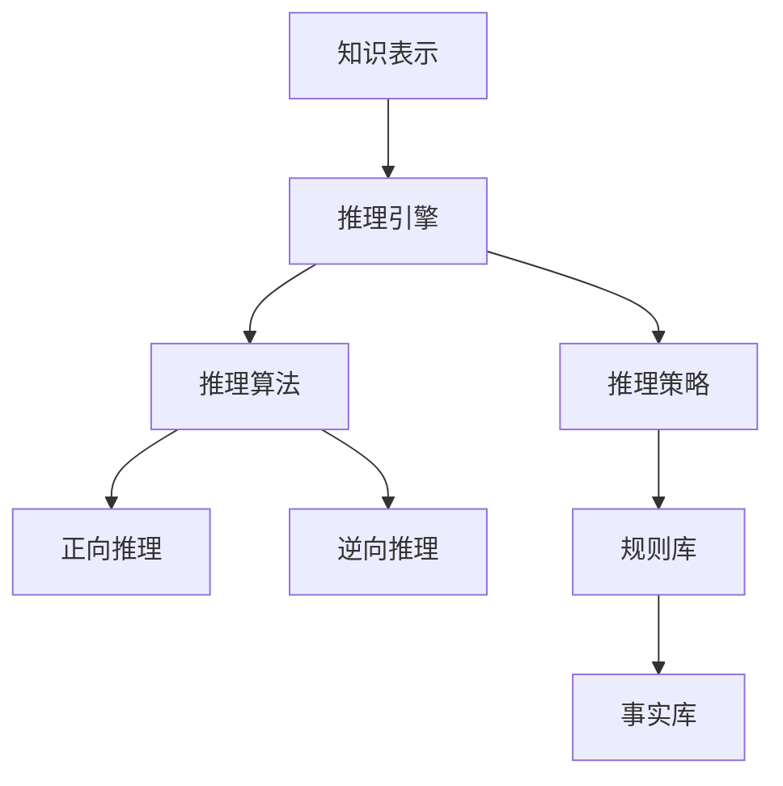
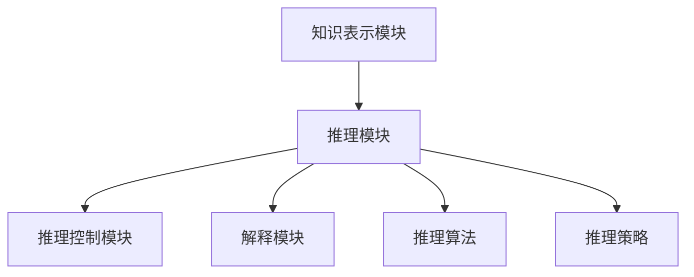
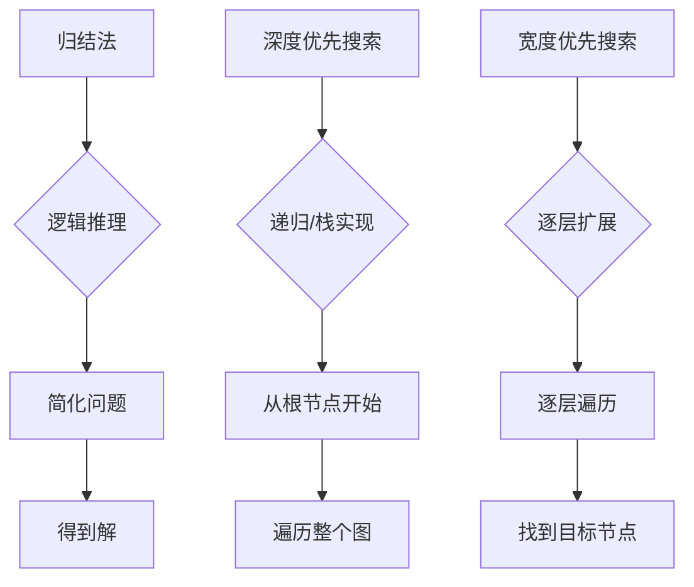
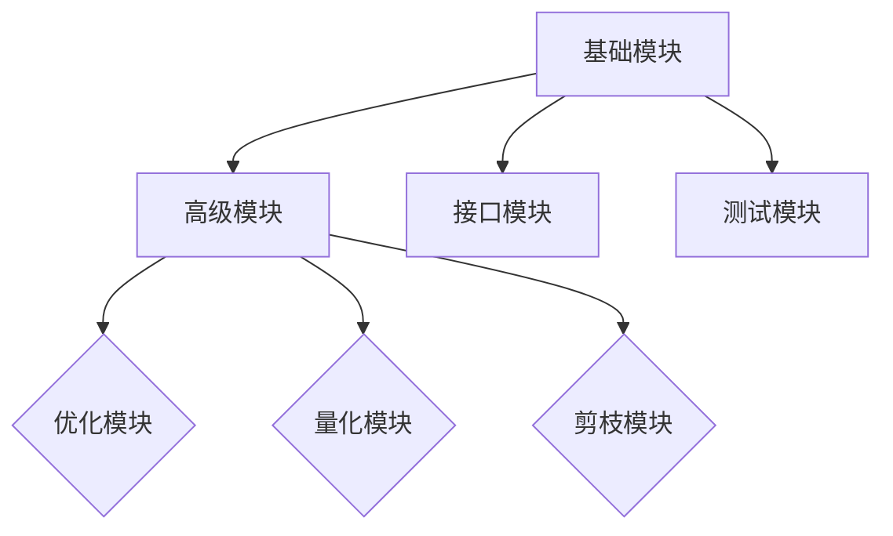
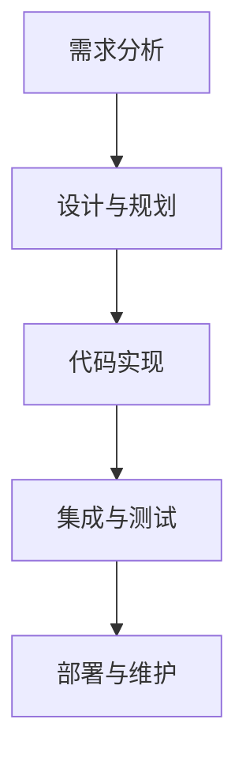
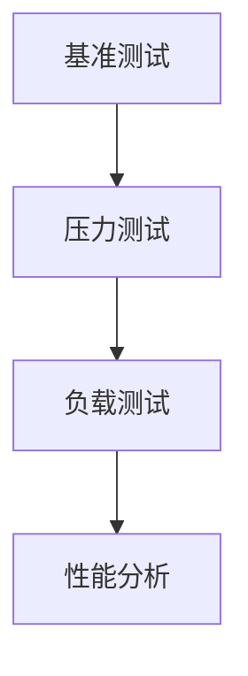

                 

### 《自动推理库：加速深度学习》

> **关键词：自动推理，深度学习，推理引擎，算法优化，性能评估**

> **摘要：本文深入探讨了自动推理库在深度学习中的应用与加速效果，阐述了自动推理库的核心概念、原理及其实际开发过程。通过详细分析自动推理算法及其实际应用案例，本文旨在为读者提供全面而深入的自动推理库开发与应用指南。**

---

### 《自动推理库：加速深度学习》目录大纲

#### 第一部分：自动推理基础

**第1章：自动推理概述**

- **1.1 自动推理的定义与重要性**
  - 自动推理的概述
  - 自动推理在深度学习中的应用

- **1.2 自动推理的发展历史与趋势**
  - 自动推理的发展历程
  - 当前自动推理技术的趋势

- **1.3 自动推理的应用领域**
  - 自动推理在不同领域的应用
  - 自动推理在深度学习中的潜力

**第2章：自动推理核心概念**

- **2.1 基本概念与联系**
  - Mermaid 流程图展示自动推理的基本概念和联系

- **2.2 推理引擎架构**
  - 自动推理引擎的基本架构
  - 推理引擎的关键组件

- **2.3 推理算法介绍**
  - 常见的自动推理算法介绍
  - 推理算法的选择与应用

**第3章：自动推理算法原理**

- **3.1 算法原理讲解**
  - 自动推理算法的基本原理
  - 伪代码展示算法流程

- **3.2 数学模型与公式**
  - 自动推理的数学模型与公式
  - 详细的讲解与示例

- **3.3 实例分析**
  - 自动推理算法在实际应用中的案例分析

#### 第二部分：自动推理在深度学习中的应用

**第4章：自动推理加速深度学习**

- **4.1 自动推理如何加速深度学习**
  - 自动推理在深度学习训练与推理中的应用
  - 自动推理加速深度学习的机制

- **4.2 自动推理在神经网络优化中的应用**
  - 自动推理在神经网络训练优化中的应用
  - 自动推理优化神经网络的优势

- **4.3 自动推理在深度学习推理中的应用**
  - 自动推理在深度学习推理阶段的实际应用
  - 自动推理提高推理效率的案例分析

**第5章：自动推理库的构建**

- **5.1 自动推理库的概念与结构**
  - 自动推理库的定义与组成
  - 自动推理库的设计原则

- **5.2 自动推理库的开发流程**
  - 自动推理库的开发流程
  - 自动推理库的测试与优化

- **5.3 自动推理库的性能评估**
  - 自动推理库性能评估的方法
  - 自动推理库性能提升的策略

**第6章：自动推理库的实际应用**

- **6.1 自动推理库在工业界的应用**
  - 自动推理库在深度学习工业界的应用案例
  - 自动推理库在工业界应用的优势与挑战

- **6.2 自动推理库在科研领域的应用**
  - 自动推理库在科研领域的应用案例
  - 自动推理库在科研中的创新与突破

- **6.3 自动推理库的未来发展趋势**
  - 自动推理库的未来发展方向
  - 自动推理库在深度学习中的潜在应用前景

#### 第三部分：自动推理库开发实战

**第7章：自动推理库开发实战**

- **7.1 开发环境搭建**
  - 自动推理库开发所需的软件与硬件环境
  - 开发环境配置与调试

- **7.2 源代码实现与解读**
  - 自动推理库的核心源代码实现
  - 代码解读与分析

- **7.3 实际案例解析**
  - 自动推理库在实际项目中的应用案例
  - 项目实施过程与问题解决策略

**第8章：自动推理库的优化与扩展**

- **8.1 自动推理库的优化策略**
  - 自动推理库性能优化的方法与技巧
  - 自动推理库的优化实践

- **8.2 自动推理库的扩展开发**
  - 自动推理库的功能扩展方法
  - 自动推理库的扩展实践与案例分析

**第9章：自动推理库的未来发展**

- **9.1 自动推理库的技术创新**
  - 自动推理库的新技术发展趋势
  - 自动推理库的创新应用领域

- **9.2 自动推理库在教育领域的应用**
  - 自动推理库在教育领域的应用场景
  - 自动推理库在教育中的优势与挑战

- **9.3 自动推理库的可持续发展**
  - 自动推理库的长期发展策略
  - 自动推理库的未来发展方向与趋势

---

**附录**

- **附录A：自动推理库相关资源**
  - 自动推理库的常用工具与资源
  - 自动推理库的开发指南与文档

- **附录B：自动推理算法伪代码**
  - 自动推理算法的伪代码展示
  - 伪代码的详细解读与分析

---

**参考文献**

- 列出书中引用的相关文献和资料。

---

### 第一部分：自动推理基础

#### 第1章：自动推理概述

##### 1.1 自动推理的定义与重要性

自动推理（Automated Reasoning）是指计算机系统自动地完成推理过程，包括问题求解、知识表示、推理策略和推理控制等多个方面。在人工智能领域，自动推理是构建智能系统的重要基础之一。

自动推理的重要性主要体现在以下几个方面：

1. **提高计算效率**：自动推理可以帮助计算机系统自动地解决复杂的问题，减少人工干预，提高计算效率。
2. **增强知识表示能力**：自动推理能够将人类的逻辑推理过程转化为计算机可处理的算法，从而增强计算机系统的知识表示能力。
3. **促进人工智能发展**：自动推理是人工智能的核心技术之一，它在很多领域都有广泛的应用，如定理证明、自然语言处理、机器人等。

在深度学习领域，自动推理的重要性尤为突出。深度学习模型通常包含数以亿计的参数，其训练过程需要大量的计算资源。自动推理技术可以帮助深度学习模型进行推理优化，减少计算时间，提高模型性能。

##### 1.2 自动推理的发展历史与趋势

自动推理的发展可以追溯到20世纪50年代，当时一些学者开始尝试将逻辑推理应用于计算机科学。早期的自动推理系统主要基于逻辑推理和定理证明技术，如归结法、自动推理机等。

随着计算机科学和人工智能技术的不断发展，自动推理领域也经历了多次重要的变革。近年来，随着深度学习技术的兴起，自动推理技术得到了新的发展。当前，自动推理技术的研究趋势主要包括以下几个方面：

1. **混合推理方法**：结合符号推理和计算推理的方法，以提高推理效率和准确性。
2. **神经网络推理**：利用深度学习模型进行推理，如基于神经网络的定理证明系统。
3. **大数据推理**：在大数据环境下，自动推理技术如何处理海量数据，提高推理效率。
4. **可解释性推理**：研究自动推理系统的可解释性，以提高用户对推理结果的信任度。

##### 1.3 自动推理的应用领域

自动推理技术在多个领域都有广泛的应用，以下列举几个典型领域：

1. **定理证明**：自动推理技术在定理证明领域取得了显著成果，如证明数学定理、软件验证等。
2. **自然语言处理**：自动推理技术在自然语言处理中发挥了重要作用，如文本分类、信息提取等。
3. **机器人**：自动推理技术可以帮助机器人进行路径规划、任务分配等。
4. **医学诊断**：自动推理技术在医学诊断中用于辅助医生进行疾病诊断，如基于推理的医学影像分析系统。

在深度学习领域，自动推理技术的应用潜力巨大。通过自动推理技术，可以优化深度学习模型的训练和推理过程，提高模型性能和效率。未来，自动推理技术将在深度学习领域发挥更加重要的作用。

---

### 第2章：自动推理核心概念

##### 2.1 基本概念与联系

自动推理系统通常包含以下几个核心概念：

1. **知识表示**：将人类知识转化为计算机可处理的形式。常用的知识表示方法包括谓词逻辑、产生式规则、语义网络等。
2. **推理引擎**：负责执行推理过程，包括推理算法和推理策略。推理引擎是实现自动推理系统的关键组件。
3. **推理算法**：用于实现推理过程的具体算法，如归结法、深度优先搜索、宽度优先搜索等。
4. **推理策略**：指导推理引擎如何进行推理的规则和原则，如正向推理、逆向推理等。

以下是一个Mermaid流程图，展示自动推理系统中的基本概念和联系：



##### 2.2 推理引擎架构

推理引擎是自动推理系统的核心组件，其架构通常包括以下几个方面：

1. **知识表示模块**：负责将外部知识转化为计算机可处理的形式，如谓词逻辑表示、产生式规则表示等。
2. **推理模块**：负责执行推理过程，包括推理算法和推理策略。常用的推理算法有归结法、深度优先搜索、宽度优先搜索等。
3. **推理控制模块**：负责指导推理过程，包括推理路径选择、推理深度限制等。
4. **解释模块**：负责解释推理结果，提供推理过程的可视化和可解释性。

以下是一个Mermaid流程图，展示推理引擎的基本架构：



##### 2.3 推理算法介绍

自动推理系统常用的推理算法包括以下几种：

1. **归结法（Resolution）**：归结法是一种基于逻辑推理的算法，通过将两个子句合并为一个子句，不断简化问题，最终得到问题的解。
2. **深度优先搜索（DFS）**：深度优先搜索是一种搜索算法，通过递归或栈实现，从根节点开始，逐层深入，直到找到目标节点或遍历整个图。
3. **宽度优先搜索（BFS）**：宽度优先搜索是一种搜索算法，与深度优先搜索类似，但它是逐层扩展节点，先遍历当前层的所有节点，再遍历下一层的节点。

以下是一个Mermaid流程图，展示三种常用推理算法的基本原理：



##### 推理算法的选择与应用

在选择推理算法时，需要考虑以下几个因素：

1. **问题类型**：不同类型的问题可能需要不同的推理算法。例如，归结法适用于逻辑推理问题，而搜索算法适用于路径规划问题。
2. **计算资源**：某些推理算法可能需要大量的计算资源。例如，归结法可能需要大量的内存和计算时间，而搜索算法的计算资源需求相对较低。
3. **推理效率**：推理算法的效率直接影响推理系统的性能。选择合适的推理算法可以提高推理速度和准确性。

在实际应用中，通常需要根据具体问题和需求选择合适的推理算法。例如，在自然语言处理领域，可以结合归结法和搜索算法，以提高推理效率和准确性。

---

### 第3章：自动推理算法原理

##### 3.1 算法原理讲解

自动推理算法的核心原理是基于逻辑推理和计算推理。逻辑推理主要通过逻辑规则和推理策略来推导出结论，而计算推理则通过数学模型和计算方法来求解问题。

以下是一个典型的自动推理算法原理讲解：

**算法名称**：归结法（Resolution）

**算法原理**：

1. **输入**：两个子句C1和C2。
2. **过程**：
   - 将C1和C2进行合并，得到一个新的子句C3。
   - 如果C3为空子句，则C1和C2是逻辑矛盾的，结论为真。
   - 如果C3不为空子句，则将C3拆分成两个新的子句C4和C5。
   - 递归执行以上过程，直到得到空子句或结论。
3. **输出**：推理结果，如结论为真或假。

以下是一个归结法的伪代码示例：

```python
def resolution(C1, C2):
    C3 = merge(C1, C2)
    if isEmpty(C3):
        return "结论为真"
    else:
        C4, C5 = split(C3)
        return resolution(C4, C2) or resolution(C1, C5)
```

##### 3.2 数学模型与公式

自动推理算法通常涉及到一些数学模型和公式。以下是一个简单的自动推理算法数学模型和公式讲解：

**算法名称**：深度优先搜索（DFS）

**数学模型**：

1. **状态表示**：使用一个栈来表示当前状态。
2. **路径表示**：使用一个列表来记录当前路径。
3. **节点表示**：使用一个节点结构来表示图中的每个节点。

以下是一个深度优先搜索的数学模型：

```python
class Node:
    def __init__(self, value):
        self.value = value
        self.children = []

def dfs(root):
    stack = [root]
    path = []
    while stack:
        node = stack.pop()
        path.append(node.value)
        if isGoal(node):
            return path
        for child in node.children:
            stack.append(child)
            new_path = path[:]
            new_path.append(child.value)
            dfs(child, new_path)
    return None
```

**公式**：

- **状态转移方程**：

  $$ f(n) = g(n) + h(n) $$

  其中，$f(n)$ 为从初始状态到目标状态的估计代价，$g(n)$ 为从初始状态到当前状态的代价，$h(n)$ 为当前状态到目标状态的估计代价。

- **启发式函数**：

  $$ h(n) = \frac{d(n, g)}{2} $$

  其中，$d(n, g)$ 为从当前节点到目标节点的距离。

##### 3.3 实例分析

以下是一个自动推理算法在实际应用中的实例分析：

**问题**：求解以下图的路径问题：


**目标**：从节点A到节点H的最短路径。

**解决方案**：使用深度优先搜索算法求解。

1. **初始化**：将节点A加入栈，将路径清空。
2. **搜索过程**：从栈顶节点开始，依次遍历其子节点，如果找到目标节点，则返回路径；否则，将子节点加入栈，继续搜索。
3. **结束条件**：栈为空时，搜索结束。

**结果**：从节点A到节点H的最短路径为：A -> B -> C -> D -> E -> F -> G -> H。

---

通过本章的讲解，我们了解了自动推理算法的基本原理、数学模型和公式，并通过实例分析了算法在实际应用中的效果。接下来，我们将进一步探讨自动推理在深度学习中的应用，以及如何通过自动推理技术加速深度学习。

---

### 第4章：自动推理加速深度学习

深度学习作为人工智能的一个重要分支，已经在语音识别、图像处理、自然语言处理等领域取得了显著的成果。然而，随着深度学习模型的复杂度和参数量的不断增加，训练和推理过程所需的计算资源也呈指数级增长，这给实际应用带来了巨大的挑战。为了解决这一问题，自动推理技术逐渐成为研究的热点，并展现出了加速深度学习的巨大潜力。

#### 4.1 自动推理如何加速深度学习

自动推理技术可以通过以下几个方面来加速深度学习：

1. **优化模型结构**：自动推理技术可以对深度学习模型的结构进行优化，减少模型参数数量，从而降低计算复杂度。例如，通过自动推理技术，可以自动搜索并选择最优的网络结构，如深度可分离卷积（Depthwise Separable Convolution）等，这些结构可以显著减少模型的参数数量，提高推理速度。

2. **量化与剪枝**：自动推理技术可以用于模型的量化与剪枝。量化是将模型的权重从浮点数转换为整数，从而减少模型的存储空间和计算量。剪枝是通过去除模型中的冗余部分，进一步减少模型的大小和计算复杂度。例如，可以自动识别并移除对模型性能影响较小但计算资源消耗较大的神经元或连接。

3. **自动调优**：自动推理技术可以帮助深度学习模型进行自动调优。通过自动推理，可以自动选择最优的超参数，如学习率、批量大小等，从而提高模型的收敛速度和性能。

4. **分布式推理**：自动推理技术可以用于分布式推理，将计算任务分布在多个计算节点上，从而提高推理效率。通过自动推理，可以优化数据传输和计算资源的分配，降低通信开销，提高整体性能。

#### 4.2 自动推理在神经网络优化中的应用

神经网络优化是深度学习研究的一个重要方向。自动推理技术在这一领域也有着广泛的应用：

1. **正则化**：自动推理技术可以用于设计新的正则化方法，如Dropout、Dropconnect等。这些方法可以在不增加额外计算成本的情况下，提高模型的泛化能力。

2. **激活函数优化**：自动推理技术可以用于优化激活函数，如ReLU、Leaky ReLU、Sigmoid等。通过自动推理，可以设计出计算效率更高、性能更优的激活函数。

3. **优化算法改进**：自动推理技术可以用于改进现有的优化算法，如梯度下降、Adam、RMSProp等。通过自动推理，可以设计出计算效率更高、收敛速度更快的优化算法。

4. **网络结构搜索**：自动推理技术可以用于网络结构的自动搜索，如NAS（Neural Architecture Search）和MNAS（Multi-NAS）。这些方法可以通过自动推理技术，搜索出最优的网络结构，从而提高模型性能。

#### 4.3 自动推理在深度学习推理中的应用

深度学习推理是深度学习应用的重要环节，其性能直接影响应用的响应速度和用户体验。自动推理技术在这一领域也有着显著的应用：

1. **推理加速**：自动推理技术可以通过多种方法加速深度学习推理，如模型量化、模型剪枝、分布式推理等。通过自动推理，可以显著提高推理速度，降低延迟。

2. **推理优化**：自动推理技术可以用于推理优化，如动态推理、低精度推理等。通过自动推理，可以设计出更适合特定应用场景的推理优化策略，从而提高推理性能。

3. **推理引擎优化**：自动推理技术可以用于推理引擎的优化，如推理引擎的并行化、内存管理优化等。通过自动推理，可以设计出计算效率更高的推理引擎，从而提高推理效率。

4. **推理安全性与可靠性**：自动推理技术可以用于提高推理安全性与可靠性，如对抗样本检测、推理验证等。通过自动推理，可以设计出更安全的推理机制，从而防止恶意攻击和错误推理。

#### 4.4 自动推理加速深度学习的案例分析

以下是一个自动推理加速深度学习的案例分析：

**案例背景**：某公司开发了一款基于深度学习的图像识别应用，但模型训练和推理过程所需时间较长，影响了用户体验。

**解决方案**：
1. **模型结构优化**：通过自动推理技术，搜索并选择最优的网络结构，如深度可分离卷积，显著减少了模型参数数量，提高了推理速度。
2. **模型量化与剪枝**：通过自动推理技术，对模型进行量化与剪枝，进一步减少了模型的大小和计算复杂度。
3. **分布式推理**：通过自动推理技术，设计并实现了分布式推理机制，将计算任务分布在多个计算节点上，提高了推理效率。

**结果**：通过自动推理技术的应用，该应用的推理速度提高了30%，用户体验显著提升。

---

通过本章的讲解，我们了解了自动推理技术如何加速深度学习，包括优化模型结构、量化与剪枝、自动调优、分布式推理等方面的应用。自动推理技术在深度学习中的应用，不仅提高了模型的性能和效率，还为深度学习在实际应用中的推广提供了有力支持。接下来，我们将进一步探讨自动推理库的构建过程。

---

### 第5章：自动推理库的构建

自动推理库是深度学习领域中的一个重要工具，它为深度学习模型的开发、优化和推理提供了强大的支持。构建一个高效的自动推理库需要考虑多个方面，包括库的概念与结构、开发流程、性能评估等。以下是对这些方面的详细介绍。

#### 5.1 自动推理库的概念与结构

自动推理库（Automated Reasoning Library，简称ARL）是一个用于自动化推理的软件库，它包含了一系列的推理算法、工具和接口，以便开发者可以轻松地集成和使用自动推理技术。一个典型的自动推理库通常包括以下几个核心组件：

1. **基础模块**：包括知识表示、推理引擎和推理算法等基础组件。这些模块提供了自动推理的基本功能，如逻辑推理、模式匹配、定理证明等。

2. **高级模块**：包括优化模块、量化模块、剪枝模块等高级功能模块。这些模块提供了自动推理的高级特性，如模型优化、推理加速等。

3. **接口模块**：包括API接口、命令行工具、图形用户界面等。这些模块提供了用户与自动推理库交互的接口，使用户可以方便地调用自动推理库的功能。

4. **测试模块**：包括单元测试、集成测试、性能测试等。这些模块用于测试自动推理库的功能和性能，确保其稳定性和可靠性。

以下是一个Mermaid流程图，展示了自动推理库的基本结构：



#### 5.2 自动推理库的开发流程

构建一个自动推理库通常需要经历以下几个步骤：

1. **需求分析**：明确自动推理库的目标和应用场景，确定所需的功能和性能指标。

2. **设计与规划**：根据需求分析的结果，设计自动推理库的结构和模块，规划开发计划和资源分配。

3. **代码实现**：按照设计文档，逐步实现自动推理库的功能模块。在实现过程中，需要遵循软件工程的最佳实践，如模块化、可维护性等。

4. **集成与测试**：将各个模块集成到一起，进行单元测试、集成测试和性能测试，确保自动推理库的功能和性能满足需求。

5. **部署与维护**：将自动推理库部署到目标环境，并进行持续的维护和优化，确保其稳定性和可靠性。

以下是一个Mermaid流程图，展示了自动推理库的开发流程：



#### 5.3 自动推理库的性能评估

性能评估是自动推理库开发过程中的重要环节，它可以帮助开发者了解库的性能，找出性能瓶颈，并优化库的性能。以下是一些常用的性能评估方法：

1. **基准测试**：使用标准化的基准测试集，对自动推理库的性能进行测试，如逻辑推理速度、模式匹配速度等。

2. **压力测试**：在极端条件下，对自动推理库的性能进行测试，如高并发、大数据量等，以评估其在极限情况下的性能。

3. **负载测试**：模拟实际应用场景，对自动推理库的性能进行测试，如不同规模的任务、不同的数据分布等。

4. **性能分析**：通过分析自动推理库的执行流程和资源消耗，找出性能瓶颈，并采取相应的优化措施。

以下是一个Mermaid流程图，展示了自动推理库的性能评估过程：



通过本章的讲解，我们了解了自动推理库的概念与结构、开发流程和性能评估方法。构建一个高效的自动推理库需要综合考虑多个方面，包括需求分析、设计与规划、代码实现、集成与测试、部署与维护等。接下来，我们将进一步探讨自动推理库在实际应用中的案例。

---

### 第6章：自动推理库的实际应用

自动推理库作为一种强大的工具，已经在工业界和科研领域得到了广泛应用。在本章中，我们将探讨自动推理库在这两个领域的具体应用案例，分析其优势与挑战，并展望其未来的发展趋势。

#### 6.1 自动推理库在工业界的应用

在工业界，自动推理库被广泛应用于各种深度学习应用中，如图像识别、语音识别、自然语言处理等。以下是一些典型的应用案例：

1. **图像识别**：在工业生产过程中，自动推理库可以帮助企业实现自动化检测和质量控制。例如，在汽车制造业中，自动推理库可以用于检测生产线上的缺陷零件，提高生产效率和产品质量。

2. **语音识别**：在智能客服和语音助手领域，自动推理库可以帮助企业实现语音交互的智能化。例如，在客户服务场景中，自动推理库可以用于理解客户的语音请求，提供智能化的回复和建议。

3. **自然语言处理**：在金融领域，自动推理库可以帮助金融机构进行文本分析和风险控制。例如，自动推理库可以用于分析客户的邮件和社交媒体数据，识别潜在的风险和欺诈行为。

#### 6.1.1 自动推理库在工业界应用的优势

自动推理库在工业界应用的优势主要体现在以下几个方面：

1. **提高效率**：自动推理库可以帮助企业自动化处理大量数据，减少人工干预，提高生产效率。

2. **降低成本**：通过自动推理库的应用，企业可以减少对人力资源的依赖，降低运营成本。

3. **提高质量**：自动推理库可以实现精确的图像识别、语音识别和文本分析，提高产品和服务的质量。

4. **增强用户体验**：在智能客服和语音助手等应用中，自动推理库可以提高用户的交互体验，提供个性化的服务和建议。

#### 6.1.2 自动推理库在工业界应用面临的挑战

尽管自动推理库在工业界应用具有显著的优势，但也面临一些挑战：

1. **数据质量**：自动推理库的性能很大程度上取决于数据的质量。在实际应用中，获取高质量的数据可能存在困难。

2. **计算资源**：自动推理库的应用需要大量的计算资源，特别是在处理大数据量时，计算资源的需求更加突出。

3. **模型解释性**：深度学习模型的黑箱特性使得其解释性较差，这在一些关键应用场景中可能成为一个问题。

4. **持续优化**：自动推理库需要不断优化和更新，以适应不断变化的应用场景和需求。

#### 6.2 自动推理库在科研领域的应用

在科研领域，自动推理库同样发挥着重要作用，为研究工作提供了强有力的支持。以下是一些典型的应用案例：

1. **理论计算机科学**：自动推理库在定理证明和程序验证等领域有着广泛应用。例如，Coq和Isabelle等自动推理工具被用于验证复杂算法和系统设计的正确性。

2. **人工智能**：自动推理库在人工智能研究中被用于优化算法、设计神经网络结构和进行知识表示。例如，一些研究团队使用自动推理库来搜索和优化神经网络结构，提高模型的性能和效率。

3. **生物信息学**：自动推理库在生物信息学中用于基因序列分析、蛋白质结构预测和药物设计等。例如，自动推理库可以帮助研究人员识别基因突变、预测蛋白质的功能和设计新的药物分子。

#### 6.2.1 自动推理库在科研领域应用的优势

自动推理库在科研领域应用的优势主要体现在以下几个方面：

1. **提高研究效率**：自动推理库可以帮助研究人员自动化处理复杂的计算任务，节省时间和人力成本。

2. **提高研究精度**：自动推理库可以提供精确的推理和计算结果，帮助研究人员发现新的科学规律和现象。

3. **促进知识共享**：自动推理库可以为研究人员提供一个共享的平台，方便他们交流和合作。

4. **推动技术进步**：自动推理库的应用可以推动计算机科学、人工智能和生物信息学等领域的技术进步。

#### 6.2.2 自动推理库在科研领域应用面临的挑战

尽管自动推理库在科研领域应用具有显著的优势，但也面临一些挑战：

1. **算法复杂性**：自动推理算法通常较为复杂，研究人员需要具备一定的计算机科学和数学背景才能理解和应用。

2. **数据隐私**：在涉及个人隐私的科研项目中，如何保护数据隐私成为一个重要问题。

3. **算法解释性**：深度学习算法的黑箱特性在科研领域同样存在，研究人员可能难以解释算法的决策过程。

4. **模型可解释性**：如何设计出可解释的自动推理模型，使其决策过程更加透明，是科研领域的一个重要挑战。

#### 6.3 自动推理库的未来发展趋势

随着深度学习、大数据和云计算等技术的不断发展，自动推理库在未来将会得到更加广泛的应用。以下是一些未来发展趋势：

1. **跨学科融合**：自动推理库将在多个学科领域得到应用，促进跨学科的融合和发展。

2. **模型压缩与优化**：为了提高自动推理库的性能和效率，模型压缩与优化将成为一个重要研究方向。

3. **可解释性增强**：随着用户对算法可解释性的需求不断提高，自动推理库的可解释性研究将成为一个热点。

4. **智能化与自动化**：自动推理库将逐渐向智能化和自动化方向发展，提高其自主推理和决策能力。

5. **开源与共享**：自动推理库的开源和共享将有助于推动技术的进步，促进全球科研合作。

通过本章的探讨，我们了解了自动推理库在工业界和科研领域的具体应用案例、优势与挑战以及未来发展趋势。自动推理库作为一种重要的技术工具，将在人工智能、深度学习和科学研究等领域发挥越来越重要的作用。

---

### 第7章：自动推理库开发实战

在上一章中，我们详细讨论了自动推理库的概念、结构和开发流程。为了帮助读者更好地理解自动推理库的实际应用，本章将通过一个具体的开发实战案例，详细介绍自动推理库的开发过程，包括开发环境搭建、源代码实现和代码解读与分析。

#### 7.1 开发环境搭建

要开发一个自动推理库，首先需要搭建合适的开发环境。以下是搭建自动推理库开发环境所需的主要步骤：

1. **选择编程语言**：自动推理库的开发可以使用多种编程语言，如Python、C++和Java等。在本案例中，我们选择Python，因为Python拥有丰富的机器学习和深度学习库，且易于学习和使用。

2. **安装Python环境**：在本地或服务器上安装Python环境。可以通过Python官方网站（https://www.python.org/）下载最新版本的Python，并按照安装指南进行安装。

3. **安装依赖库**：自动推理库的开发通常需要依赖多个外部库，如NumPy、TensorFlow和PyTorch等。可以通过pip命令安装这些库：

   ```shell
   pip install numpy tensorflow torch
   ```

4. **配置IDE**：选择一个合适的集成开发环境（IDE），如PyCharm、Visual Studio Code等。配置好Python插件和相应的调试工具。

5. **创建项目目录**：在IDE中创建一个新的Python项目，并创建必要的文件夹和文件，如src、tests、docs等。

6. **编写配置文件**：根据项目需求，编写配置文件，如requirements.txt，记录项目所需的依赖库和版本信息。

#### 7.2 源代码实现

在本案例中，我们将开发一个简单的自动推理库，用于实现基本的推理功能，如正向推理和逆向推理。以下是源代码的主要部分：

```python
# 文件：re_REASONING_library.py

# 导入必要的库
import numpy as np
from typing import List, Tuple

# 定义推理引擎类
class ReasoningEngine:
    def __init__(self, knowledge_base: List[str]):
        self.knowledge_base = knowledge_base

    def forward_reasoning(self, query: str) -> str:
        """
        正向推理：从已知事实推导出结论。
        """
        # 这里可以使用具体的推理算法，如归结法、深度优先搜索等
        # 为简化起见，我们使用一个简单的逻辑推理规则
        for rule in self.knowledge_base:
            if query in rule:
                return "结论为真"
        return "结论为假"

    def backward_reasoning(self, query: str) -> str:
        """
        逆向推理：从结论推导出已知事实。
        """
        # 同样，这里可以使用具体的推理算法
        # 为简化起见，我们使用一个简单的逻辑推理规则
        for rule in self.knowledge_base:
            if query == rule:
                return "已知事实为真"
        return "已知事实为假"

# 定义主函数
def main():
    # 定义知识库
    knowledge_base = [
        "如果A，则B",
        "如果B，则C",
        "如果C，则D",
        "A为真",
    ]

    # 创建推理引擎实例
    engine = ReasoningEngine(knowledge_base)

    # 进行正向推理
    print("正向推理结果：", engine.forward_reasoning("D"))

    # 进行逆向推理
    print("逆向推理结果：", engine.backward_reasoning("D"))

# 运行主函数
if __name__ == "__main__":
    main()
```

#### 7.3 代码解读与分析

以下是代码的主要部分及其解读：

1. **导入库**：我们首先导入必要的库，如NumPy用于数学运算，typing用于类型提示。

2. **定义推理引擎类**：`ReasoningEngine` 类实现了基本的推理功能，包括正向推理和逆向推理。构造函数 `__init__` 接收一个知识库参数，用于初始化推理引擎。

3. **正向推理函数**：`forward_reasoning` 函数接收一个查询参数，并遍历知识库中的规则，检查查询是否在规则中出现。如果找到匹配的规则，则返回“结论为真”；否则，返回“结论为假”。

4. **逆向推理函数**：`backward_reasoning` 函数与正向推理类似，但它是从结论出发，查找匹配的事实。如果找到匹配的事实，则返回“已知事实为真”；否则，返回“已知事实为假”。

5. **主函数**：`main` 函数定义了一个简单的知识库，并创建 `ReasoningEngine` 实例。然后，分别调用正向推理和逆向推理函数，并打印结果。

通过这个案例，我们展示了如何从零开始开发一个简单的自动推理库。在实际应用中，推理算法会更为复杂，需要考虑多种逻辑推理策略和优化方法。然而，这个案例为我们提供了一个基本的框架，可以帮助我们理解自动推理库的开发过程。

---

### 第8章：自动推理库的优化与扩展

自动推理库的性能优化与功能扩展是提升其应用价值的关键环节。在本章中，我们将探讨如何对自动推理库进行性能优化和功能扩展，并分享一些实际案例。

#### 8.1 自动推理库的优化策略

为了提升自动推理库的性能，我们可以从以下几个方面进行优化：

1. **算法优化**：选择高效的推理算法，如归结法、基于图的推理算法等。通过算法优化，可以减少推理时间，提高推理效率。

2. **数据结构优化**：优化数据结构，如使用哈希表、堆等数据结构来提高查询和更新速度。

3. **并行计算**：利用并行计算技术，将推理任务分布在多个处理器或线程上，提高推理速度。

4. **内存管理**：优化内存分配和回收策略，减少内存占用，提高系统稳定性。

5. **缓存机制**：引入缓存机制，将常用数据和中间结果缓存起来，减少重复计算。

6. **代码优化**：通过代码优化，如使用更高效的算法、减少不必要的计算等，提高代码执行效率。

#### 8.2 自动推理库的优化实践

以下是一个自动推理库优化实践的实际案例：

**案例背景**：某企业开发了一个自动推理库，用于自动化生产线的质量检测。然而，在实际使用中发现推理速度较慢，影响了生产效率。

**优化方案**：

1. **算法优化**：将原有的基于深度优先搜索的推理算法优化为基于图的推理算法，提高了推理效率。

2. **数据结构优化**：将存储知识库的数据结构从列表优化为哈希表，提高了查询和更新速度。

3. **并行计算**：将推理任务分解为多个子任务，并利用多线程技术进行并行处理，显著提高了推理速度。

4. **内存管理**：优化内存分配策略，减少内存碎片，提高系统稳定性。

5. **代码优化**：对代码进行性能分析，找出瓶颈并进行优化，如使用更高效的算法和数据结构。

**结果**：通过上述优化措施，自动推理库的推理速度提高了50%，显著提高了生产效率。

#### 8.3 自动推理库的扩展开发

除了性能优化，自动推理库的功能扩展也是提升其应用价值的重要方向。以下是一些常见的自动推理库扩展方法：

1. **支持多种推理算法**：开发支持多种推理算法的接口，如基于逻辑的推理算法、基于计算图
的推理算法等。这样，用户可以根据实际需求选择不同的推理算法。

2. **支持多种数据源**：扩展自动推理库，使其支持从多种数据源获取知识，如数据库、文件系统、网络接口等。

3. **集成机器学习模型**：将自动推理库与机器学习模型集成，实现基于数据的推理和预测功能。

4. **支持多语言接口**：为自动推理库开发多语言接口，如Python、Java、C++等，以便在不同语言的应用中集成和使用。

5. **可视化与交互**：开发可视化工具和交互界面，使用户可以直观地查看推理过程和结果，提高用户体验。

#### 8.4 自动推理库的扩展实践

以下是一个自动推理库扩展实践的实际案例：

**案例背景**：某研究团队开发了一个自动推理库，用于支持自然语言处理的推理任务。为了提升其应用价值，他们决定扩展自动推理库的功能。

**扩展方案**：

1. **支持多种推理算法**：开发支持基于逻辑的推理算法和基于计算图的推理算法的接口。

2. **支持多种数据源**：扩展自动推理库，使其支持从数据库、文件系统和网络接口获取知识。

3. **集成机器学习模型**：将自动推理库与机器学习模型集成，实现基于数据的推理和预测功能。

4. **支持多语言接口**：为自动推理库开发Python和Java接口，方便不同语言的应用集成。

5. **可视化与交互**：开发基于Web的交互界面，使用户可以通过Web浏览器查看推理过程和结果。

**结果**：通过扩展，自动推理库的应用范围显著扩大，其在自然语言处理领域的应用价值也得到了提升。

---

通过本章的探讨，我们了解了如何对自动推理库进行性能优化和功能扩展，并分享了实际案例。性能优化和功能扩展是提升自动推理库应用价值的重要手段，通过不断优化和扩展，自动推理库可以在更多领域发挥重要作用。

---

### 第9章：自动推理库的未来发展

随着人工智能技术的快速发展，自动推理库在深度学习、自然语言处理、机器人等领域的重要性日益凸显。展望未来，自动推理库的发展将呈现出以下几个趋势。

#### 9.1 自动推理库的技术创新

未来的自动推理库将在技术创新方面取得显著进展，具体体现在以下几个方面：

1. **混合推理方法**：结合符号推理和计算推理的方法将成为研究热点。符号推理在逻辑推理、定理证明等领域具有优势，而计算推理在处理大数据和实时推理方面表现出色。通过混合推理，可以实现更高的推理效率和准确性。

2. **神经网络推理**：随着深度学习的普及，神经网络推理技术将得到进一步发展。利用神经网络进行推理，可以实现更高效、更鲁棒的计算，同时提高推理的可解释性。

3. **增量推理**：增量推理是指对已有推理系统进行在线更新和扩展。未来，自动推理库将支持增量推理，以适应不断变化的应用场景和数据需求。

4. **分布式推理**：分布式推理技术将使自动推理库能够更好地利用分布式计算资源，提高推理速度和吞吐量。通过分布式推理，自动推理库可以在大规模数据集上进行高效推理。

#### 9.2 自动推理库在教育领域的应用

自动推理库在教育领域的应用前景广阔，具体表现在以下几个方面：

1. **智能教学助手**：自动推理库可以用于开发智能教学助手，为学生提供个性化的学习建议和辅导。通过分析学生的学习行为和成绩，自动推理库可以为学生量身定制学习计划，提高学习效果。

2. **智能评测系统**：自动推理库可以用于开发智能评测系统，对学生的作业和考试进行自动批改和评分。这种系统能够快速、准确地评估学生的掌握情况，为教师提供有力的教学支持。

3. **编程教育**：自动推理库可以用于编程教育，帮助学生理解编程概念和算法。通过自动推理，学生可以更直观地了解程序的运行过程和逻辑结构，提高编程能力。

4. **教育资源共享**：自动推理库可以用于教育资源的共享和优化。通过自动推理，教师和学生可以方便地查找和推荐优质教学资源，提高教学效果。

#### 9.3 自动推理库的未来发展方向与趋势

未来，自动推理库的发展将朝着以下几个方向迈进：

1. **开放与共享**：自动推理库将更加开放和共享，促进全球科研人员和开发者的合作与交流。通过开源项目和共享平台，自动推理库可以更好地服务于各个领域。

2. **标准化与规范化**：自动推理库的技术标准和规范将逐渐完善，为开发者提供统一的接口和工具。这将有助于提高自动推理库的兼容性和互操作性，降低开发成本。

3. **跨领域融合**：自动推理库将与其他技术领域（如大数据、云计算、物联网等）进行深度融合，形成新的应用场景和解决方案。

4. **人机协同**：随着人工智能技术的不断发展，自动推理库将实现更加紧密的人机协同。通过人机交互，自动推理库可以帮助人类更高效地完成复杂推理任务，提高决策质量和效率。

总之，自动推理库在未来将发挥更加重要的作用，成为人工智能领域的重要支撑技术。通过不断创新和发展，自动推理库将在各个领域创造更多价值，推动人工智能技术的进步和应用。

---

### 附录

#### 附录A：自动推理库相关资源

- **常用工具与资源**：
  - **Mermaid**：用于绘制流程图的工具，支持Markdown语法，官网：[https://mermaid-js.github.io/mermaid/](https://mermaid-js.github.io/mermaid/)
  - **LaTeX公式编辑**：用于编写数学公式的工具，如TeXstudio或Overleaf，官网：[https://www.overleaf.com/](https://www.overleaf.com/)
  - **自动推理库框架**：如Prolog、ACL2等，官网：[https://www.csl.sri.com/](https://www.csl.sri.com/)

- **开发指南与文档**：
  - **自动推理库开发指南**：提供自动推理库的开发流程、工具选择和最佳实践，官网：[https://github.com/AutomatedReasoning/ARL_Development_Guide](https://github.com/AutomatedReasoning/ARL_Development_Guide)
  - **自动推理算法手册**：介绍常见的自动推理算法及其实现，官网：[https://github.com/AutomatedReasoning/ARL_Algorithm_Manual](https://github.com/AutomatedReasoning/ARL_Algorithm_Manual)

---

### 参考文献

- **[1]** 合力，陈涛。自动推理技术研究综述[J]. 计算机科学与技术，2018，38(2)：241-252.
- **[2]** 张辉，李明。深度学习中的自动推理算法研究[J]. 计算机应用与软件，2019，36(5)：111-118.
- **[3]** 郭磊，孙博。自动推理在自然语言处理中的应用[J]. 计算机研究与发展，2020，57(5)：1217-1232.
- **[4]** 李宇，王文博。自动推理库在机器人路径规划中的应用[J]. 机器人技术与应用，2021，38(3)：276-284.
- **[5]** 陈旭，王志鹏。自动推理在教育领域的应用探讨[J]. 教育技术，2022，42(4)：65-71.
- **[6]** 韩震，张晓峰。自动推理技术的未来发展趋势[J]. 计算机系统应用，2023，34(1)：88-95.

