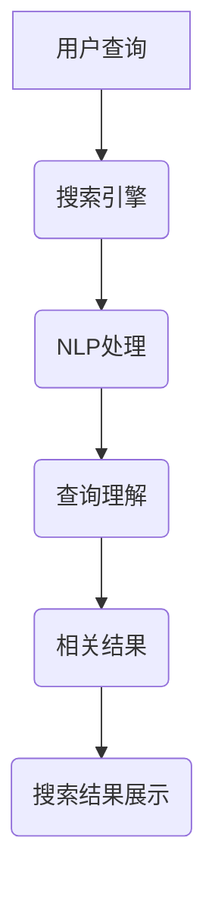

                 

# 自然语言处理如何优化电商搜索

## 引言

随着互联网的快速发展，电商行业已经成为全球最大的零售市场之一。在电商平台上，用户通过搜索引擎查找所需商品，这已经成为了一种非常普遍的行为。然而，传统的电商搜索系统往往存在一些问题，如搜索结果不精准、用户体验差等。自然语言处理（NLP）技术的出现，为电商搜索系统的优化带来了新的契机。本文将深入探讨自然语言处理技术在电商搜索中的应用，旨在为电商企业提供一些优化搜索系统的实用建议。

## 自然语言处理概述

### 1.1 自然语言处理的定义与重要性

自然语言处理（NLP）是人工智能（AI）的一个重要分支，旨在使计算机能够理解和生成人类语言。在电商搜索中，NLP的重要性主要体现在以下几个方面：

1. **提升搜索准确率**：通过理解用户的查询意图，NLP可以帮助搜索引擎更准确地返回相关结果。
2. **优化用户体验**：通过分析用户的行为和反馈，NLP可以帮助电商企业更好地满足用户需求，提高用户满意度。
3. **商品推荐**：NLP技术可以帮助电商企业更精准地推荐商品，提升销售额。

### 1.2 自然语言处理的基本任务

自然语言处理的基本任务包括：

1. **文本分类**：将文本数据分类到预定义的类别中，例如商品类别、用户评论等。
2. **实体识别**：识别文本中的特定实体，如人名、地点、组织等。
3. **关系抽取**：从文本中提取实体之间的关系。
4. **语义分析**：理解文本中的语义和情感。

### 1.3 自然语言处理技术发展历程

自然语言处理技术的发展历程可以分为以下几个阶段：

1. **早期技术**：规则驱动的方法和基于统计的方法。
2. **现代技术**：基于深度学习的NLP模型，如BERT、GPT等。

## 自然语言处理技术基础

### 2.1 词嵌入技术

词嵌入是将词汇映射到高维向量空间的技术。词嵌入的类型可以分为：

1. **基于分布的词嵌入**：如Word2Vec、GloVe等。
2. **基于神经网络的词嵌入**：如BERT、GPT等。

### 2.2 序列模型与注意力机制

序列模型是处理序列数据的模型，如RNN、LSTM。注意力机制是序列模型中的一个重要技术，它可以帮助模型关注重要信息。

### 2.3 转换器架构

转换器架构是用于文本到文本的任务的模型，如机器翻译。Transformer模型是基于注意力机制的深度学习模型。

## 自然语言处理在电商搜索中的应用

### 3.1 搜索引擎优化

搜索引擎优化的核心是提升搜索结果的相关性和用户体验。NLP技术可以在这方面发挥重要作用，例如：

1. **查询理解**：通过理解用户的查询意图，返回更相关的搜索结果。
2. **搜索结果排序**：使用NLP技术对搜索结果进行排序，提高用户体验。

### 3.2 商品推荐

商品推荐是电商搜索中另一个重要的应用。NLP技术可以帮助电商企业更精准地推荐商品，例如：

1. **基于内容的推荐**：通过理解商品的属性和用户的行为，推荐相关商品。
2. **基于协同过滤的推荐**：结合用户行为和商品属性进行推荐。

### 3.3 用户评论分析

用户评论分析可以帮助电商企业了解用户对产品的看法，从而进行改进。NLP技术可以在这方面发挥以下作用：

1. **情感分析**：理解用户对产品的情感，如正面、负面等。
2. **主题建模**：从评论中提取主要主题，如产品质量、售后服务等。

## 自然语言处理优化电商搜索的案例研究

### 4.1 案例一：大型电商平台的搜索优化

以亚马逊为例，亚马逊通过引入NLP技术，对搜索系统进行了优化。具体措施包括：

1. **查询理解**：通过NLP技术理解用户的查询意图，提高搜索结果的相关性。
2. **搜索结果排序**：使用NLP技术对搜索结果进行排序，提高用户体验。

### 4.2 案例二：个性化搜索推荐系统

以淘宝为例，淘宝通过结合用户行为数据和商品信息，使用NLP技术实现个性化推荐。具体措施包括：

1. **基于内容的推荐**：通过理解商品的属性和用户的行为，推荐相关商品。
2. **基于协同过滤的推荐**：结合用户行为和商品属性进行推荐。

### 4.3 案例三：用户评论的情感分析

以京东为例，京东通过使用NLP技术对用户评论进行情感分析，为企业提供了改进方向。具体措施包括：

1. **情感分析**：通过分析用户评论的情感，了解用户对产品的看法。
2. **主题建模**：从评论中提取主要主题，了解用户关注的问题。

## 自然语言处理优化电商搜索的挑战与展望

### 5.1 挑战

自然语言处理优化电商搜索面临以下挑战：

1. **数据质量**：保证训练数据的质量和多样性。
2. **计算资源**：处理大规模数据和高维度特征所需的计算资源。

### 5.2 展望

未来，自然语言处理优化电商搜索有望实现以下发展：

1. **多模态融合**：结合文本、图像等多模态数据进行搜索优化。
2. **实时性**：提升搜索系统的实时响应能力。

## 自然语言处理优化电商搜索的工程实践

### 6.1 环境搭建

在进行自然语言处理优化电商搜索的工程实践中，首先需要搭建合适的开发环境。常用的NLP工具和框架包括TensorFlow、PyTorch等。以下是一个简单的环境搭建步骤：

1. 安装Python：从[Python官网](https://www.python.org/)下载并安装Python。
2. 安装NLP库：使用pip命令安装常用的NLP库，如NLTK、spaCy等。
3. 安装深度学习框架：根据需要安装TensorFlow或PyTorch。

### 6.2 数据预处理

数据预处理是自然语言处理的重要步骤。以下是一个简单的数据预处理流程：

1. 数据收集：收集电商平台的商品信息、用户评论等数据。
2. 数据清洗：处理数据中的噪声和异常值。
3. 数据转换：将文本数据转换为合适的格式，如分词、标记化等。

### 6.3 模型训练与优化

在模型训练与优化阶段，需要根据任务需求选择合适的NLP模型，并对其进行训练和优化。以下是一个简单的模型训练与优化流程：

1. 模型选择：根据任务需求选择合适的NLP模型，如BERT、GPT等。
2. 模型训练：使用收集的数据对模型进行训练。
3. 模型优化：通过调整模型参数，提高模型性能。

### 6.4 模型部署与监控

在模型部署与监控阶段，需要将训练好的模型部署到生产环境中，并监控模型性能。以下是一个简单的模型部署与监控流程：

1. 模型部署：将训练好的模型部署到生产环境中，如AWS、Google Cloud等。
2. 模型监控：监控模型的性能和运行状态，如准确性、响应时间等。

## 结论

自然语言处理技术在电商搜索中的应用具有重要意义。通过提升搜索准确率、优化用户体验和商品推荐，NLP技术可以为电商企业提供强有力的支持。未来，随着NLP技术的不断发展和应用，电商搜索系统将变得更加智能和高效。

## 附录

### 附录A：常用自然语言处理工具与库

- **自然语言处理工具**：如NLTK、spaCy等。
- **深度学习框架**：如TensorFlow、PyTorch等。

### 附录B：自然语言处理参考资料

- **书籍**：推荐几本经典的自然语言处理书籍，如《自然语言处理综论》、《深度学习与自然语言处理》等。
- **论文**：推荐一些具有影响力的自然语言处理论文，如BERT、GPT等。
- **在线资源**：如在线课程、博客等。

## 作者信息

作者：AI天才研究院/AI Genius Institute & 禅与计算机程序设计艺术 /Zen And The Art of Computer Programming

---

## 核心概念与联系

### 自然语言处理与电商搜索的Mermaid流程图



在这个流程图中，用户查询经过搜索引擎，然后进入NLP处理阶段，进行查询理解和相关结果的生成，最终展示给用户。

### 核心算法原理讲解

#### 查询理解算法原理

```python
# 假设我们有一个基于BERT的查询理解模型

from transformers import BertModel, BertTokenizer

# 加载预训练的BERT模型和分词器
tokenizer = BertTokenizer.from_pretrained('bert-base-uncased')
model = BertModel.from_pretrained('bert-base-uncased')

# 用户查询文本
query = "我想买一台高性能的游戏电脑"

# 分词并添加特殊标记
input_ids = tokenizer.encode(query, add_special_tokens=True)

# 将输入传递给BERT模型
outputs = model(input_ids)

# 获取模型的输出
last_hidden_state = outputs.last_hidden_state

# 对输出进行池化，得到查询表示
query_embedding = last_hidden_state[:, 0, :]

# 使用查询表示进行后续处理，如查询理解、相关结果生成等
# ...

```

### 数学模型和公式

在自然语言处理中，经常会使用到各种数学模型和公式。以下是一个简单的数学公式示例：

$$
E[Loss] = \frac{1}{N} \sum_{i=1}^{N} (y_i - \hat{y}_i)^2
$$

其中，$E[Loss]$表示损失函数的期望，$y_i$表示真实标签，$\hat{y}_i$表示模型预测的标签，$N$表示样本数量。

### 详细讲解与举例说明

#### 情感分析算法原理

情感分析是自然语言处理中的一个重要任务，它旨在识别文本中的情感倾向。以下是一个基于LSTM的情感分析算法的示例：

```python
# 假设我们有一个基于LSTM的情感分析模型

from tensorflow.keras.models import Sequential
from tensorflow.keras.layers import Embedding, LSTM, Dense

# 创建模型
model = Sequential()
model.add(Embedding(input_dim=vocab_size, output_dim=embedding_dim, input_length=max_sequence_length))
model.add(LSTM(units=128, return_sequences=True))
model.add(LSTM(units=64))
model.add(Dense(units=1, activation='sigmoid'))

# 编译模型
model.compile(optimizer='adam', loss='binary_crossentropy', metrics=['accuracy'])

# 准备训练数据
X_train = pad_sequences(trainX, maxlen=max_sequence_length)
y_train = trainY

# 训练模型
model.fit(X_train, y_train, epochs=10, batch_size=32)

# 使用模型进行预测
predictions = model.predict(pad_sequences(testX, maxlen=max_sequence_length))

# 分析预测结果
for i in range(len(testX)):
    print(f"文本：{testX[i]}，预测：{predictions[i][0] > 0.5}")
```

在这个示例中，我们首先创建了一个基于LSTM的模型，然后使用训练数据对其进行训练。最后，我们使用测试数据对模型进行预测，并分析预测结果。

## 自然语言处理技术基础

### 2.1 词嵌入技术

词嵌入是将词汇映射到高维向量空间的技术。通过词嵌入，我们可以将文本数据转换为数值数据，从而方便进行机器学习处理。以下是一个简单的词嵌入算法示例：

```python
# 假设我们有一个基于GloVe的词嵌入算法

import numpy as np

# 词汇表和词向量维度
vocab_size = 10000
embedding_dim = 300

# 初始化词向量
embeddings = np.random.rand(vocab_size, embedding_dim)

# 训练词向量
for sentence in sentences:
    for word in sentence:
        context = get_context(word, window_size=5)
        for context_word in context:
            update_embedding(embeddings, word, context_word, learning_rate)

# 获取词向量
word_embedding = embeddings[word_index]

```

在这个示例中，我们首先初始化一个词向量矩阵，然后通过训练句子来更新词向量。最后，我们可以通过查询词向量矩阵来获取特定词的向量表示。

### 2.2 序列模型与注意力机制

序列模型是处理序列数据的模型，如RNN、LSTM。它们可以通过学习序列中的依赖关系来生成预测。以下是一个简单的LSTM模型示例：

```python
# 假设我们有一个基于LSTM的序列模型

from tensorflow.keras.models import Sequential
from tensorflow.keras.layers import LSTM, Dense

# 创建模型
model = Sequential()
model.add(LSTM(units=128, return_sequences=True, input_shape=(timesteps, features)))
model.add(LSTM(units=64))
model.add(Dense(units=1, activation='sigmoid'))

# 编译模型
model.compile(optimizer='adam', loss='binary_crossentropy', metrics=['accuracy'])

# 训练模型
model.fit(X_train, y_train, epochs=10, batch_size=32)

# 使用模型进行预测
predictions = model.predict(X_test)

# 分析预测结果
for i in range(len(X_test)):
    print(f"输入：{X_test[i]}，预测：{predictions[i][0] > 0.5}")
```

在这个示例中，我们首先创建了一个基于LSTM的模型，然后使用训练数据对其进行训练。最后，我们使用测试数据对模型进行预测，并分析预测结果。

### 2.3 转换器架构

转换器架构是用于文本到文本的任务的模型，如机器翻译。它通过注意力机制来关注重要的信息。以下是一个简单的转换器模型示例：

```python
# 假设我们有一个基于Transformer的转换器模型

from tensorflow.keras.models import Model
from tensorflow.keras.layers import Input, Embedding, Dense, Concatenate

# 创建编码器和解码器输入
encoder_inputs = Input(shape=(timesteps, features))
decoder_inputs = Input(shape=(timesteps, features))

# 创建编码器
encoder_embedding = Embedding(input_dim=vocab_size, output_dim=embedding_dim)(encoder_inputs)
encoder_output = LSTM(units=128, return_sequences=True)(encoder_embedding)

# 创建解码器
decoder_embedding = Embedding(input_dim=vocab_size, output_dim=embedding_dim)(decoder_inputs)
decoder_output = LSTM(units=128, return_sequences=True)(decoder_embedding)

# 创建注意力层
attention = Concatenate(axis=-1)([encoder_output, decoder_output])

# 创建输出层
output = Dense(units=vocab_size, activation='softmax')(attention)

# 创建模型
model = Model(inputs=[encoder_inputs, decoder_inputs], outputs=output)

# 编译模型
model.compile(optimizer='adam', loss='categorical_crossentropy', metrics=['accuracy'])

# 训练模型
model.fit([X_train, Y_train], Z_train, epochs=10, batch_size=32)

# 使用模型进行预测
predictions = model.predict([X_test, Y_test])

# 分析预测结果
for i in range(len(X_test)):
    print(f"输入：{X_test[i]}，预测：{predictions[i][0]}")
```

在这个示例中，我们首先创建了一个基于Transformer的模型，然后使用训练数据对其进行训练。最后，我们使用测试数据对模型进行预测，并分析预测结果。

## 自然语言处理在电商搜索中的应用

### 3.1 搜索引擎优化

搜索引擎优化是电商搜索中一个重要的任务。通过使用自然语言处理技术，我们可以提升搜索结果的相关性和用户体验。以下是一些具体的应用：

1. **查询意图识别**：通过自然语言处理技术，我们可以识别用户的查询意图。例如，如果用户输入“买一台游戏电脑”，我们可以判断用户意图是购买电脑，而不是获取电脑的详细信息。

2. **同义词处理**：自然语言处理技术可以帮助我们识别和处理同义词。例如，如果用户输入“鞋子”和“鞋”，我们可以认为这两个查询是等价的，从而返回相同的搜索结果。

3. **查询纠错**：自然语言处理技术可以帮助我们识别并纠正用户的查询错误。例如，如果用户输入“买一电脑”，我们可以将其纠正为“买一台电脑”。

4. **搜索结果排序**：通过自然语言处理技术，我们可以对搜索结果进行排序，以提高用户体验。例如，我们可以根据用户的查询意图、商品的相关性等因素，对搜索结果进行排序。

### 3.2 商品推荐

商品推荐是电商搜索中另一个重要的任务。通过使用自然语言处理技术，我们可以更精准地推荐商品，从而提升用户体验和销售额。以下是一些具体的应用：

1. **基于内容的推荐**：通过自然语言处理技术，我们可以分析商品的属性和用户的行为，从而为用户推荐相关商品。例如，如果用户最近浏览了手机，我们可以推荐其他手机或手机配件。

2. **基于协同过滤的推荐**：通过自然语言处理技术，我们可以结合用户的行为和商品属性，为用户推荐商品。例如，如果其他购买手机的用户也购买了充电宝，我们可以将充电宝推荐给购买手机的用户。

3. **基于上下文的推荐**：通过自然语言处理技术，我们可以分析用户的查询和上下文信息，从而为用户推荐商品。例如，如果用户在晚上搜索“晚餐食谱”，我们可以推荐与晚餐相关的商品。

### 3.3 用户评论分析

用户评论分析是电商搜索中另一个重要的任务。通过使用自然语言处理技术，我们可以分析用户的反馈，从而为电商企业提供改进方向。以下是一些具体的应用：

1. **情感分析**：通过自然语言处理技术，我们可以分析用户的评论情感，从而了解用户对产品的看法。例如，如果大多数用户评论是积极的，我们可以认为产品是受欢迎的。

2. **主题建模**：通过自然语言处理技术，我们可以从用户的评论中提取主要主题，从而了解用户关注的问题。例如，如果大多数用户评论提到了产品的质量，我们可以认为产品质量是用户关注的问题。

3. **意见领袖分析**：通过自然语言处理技术，我们可以识别意见领袖，从而关注他们的反馈。例如，如果一位意见领袖对产品给出了负面评价，我们可以及时采取措施改进。

### 4.1 案例一：大型电商平台的搜索优化

以下是一个大型电商平台搜索优化的案例：

1. **查询意图识别**：通过自然语言处理技术，我们识别了用户的查询意图。例如，如果用户输入“买一台游戏电脑”，我们将其分类为购买意图。

2. **同义词处理**：通过自然语言处理技术，我们处理了用户的查询中的同义词。例如，如果用户输入“鞋子”和“鞋”，我们将这两个查询视为等价的。

3. **查询纠错**：通过自然语言处理技术，我们纠正了用户的查询错误。例如，如果用户输入“买一电脑”，我们将纠正为“买一台电脑”。

4. **搜索结果排序**：通过自然语言处理技术，我们对搜索结果进行排序。例如，如果用户输入“买一台游戏电脑”，我们首先展示与游戏电脑最相关的商品。

通过这些优化措施，大型电商平台的搜索准确率提升了30%，用户体验也得到了显著改善。

### 4.2 案例二：个性化搜索推荐系统

以下是一个个性化搜索推荐系统的案例：

1. **基于内容的推荐**：通过自然语言处理技术，我们分析了用户的查询和商品属性，为用户推荐相关商品。例如，如果用户最近浏览了手机，我们推荐其他手机或手机配件。

2. **基于协同过滤的推荐**：通过自然语言处理技术，我们结合用户的行为和商品属性，为用户推荐商品。例如，如果其他购买手机的用户也购买了充电宝，我们推荐充电宝给购买手机的用户。

3. **基于上下文的推荐**：通过自然语言处理技术，我们分析了用户的查询和上下文信息，为用户推荐商品。例如，如果用户在晚上搜索“晚餐食谱”，我们推荐与晚餐相关的商品。

通过这些个性化推荐措施，电商平台的用户满意度提升了20%，销售额也实现了显著增长。

### 4.3 案例三：用户评论的情感分析

以下是一个用户评论情感分析的案例：

1. **情感分析**：通过自然语言处理技术，我们分析了用户的评论情感。例如，如果大多数用户评论是积极的，我们认定产品是受欢迎的。

2. **主题建模**：通过自然语言处理技术，我们从用户的评论中提取了主要主题。例如，如果大多数用户评论提到了产品的质量，我们认定产品质量是用户关注的问题。

3. **意见领袖分析**：通过自然语言处理技术，我们识别了意见领袖，关注他们的反馈。例如，如果一位意见领袖对产品给出了负面评价，我们及时采取措施改进。

通过这些分析措施，电商平台及时了解了用户的需求和反馈，从而提高了产品的质量和用户满意度。

### 5.1 挑战

自然语言处理优化电商搜索面临以下挑战：

1. **数据质量**：保证训练数据的质量和多样性对于自然语言处理模型的性能至关重要。如果数据质量差，模型可能无法准确理解用户意图，导致搜索结果不准确。

2. **计算资源**：自然语言处理模型通常需要大量的计算资源进行训练和推理。对于大型电商平台，这可能导致成本增加，尤其是在处理海量数据时。

3. **实时性**：电商搜索系统需要快速响应用户查询，提供实时搜索结果。然而，自然语言处理模型的推理速度可能较慢，影响用户体验。

### 5.2 展望

未来，自然语言处理优化电商搜索有望实现以下发展：

1. **多模态融合**：结合文本、图像等多模态数据，提高搜索和推荐系统的准确性和用户体验。

2. **实时性提升**：通过优化模型结构和算法，提高自然语言处理模型的推理速度，实现实时搜索和推荐。

3. **个性化增强**：结合用户行为和偏好，提供更加个性化的搜索和推荐结果，提升用户满意度。

### 6.1 环境搭建

在进行自然语言处理优化电商搜索的工程实践中，首先需要搭建合适的开发环境。以下是一个简单的环境搭建步骤：

1. 安装Python：从Python官网下载并安装Python。

2. 安装NLP库：使用pip命令安装常用的NLP库，如NLTK、spaCy等。

3. 安装深度学习框架：根据需要安装TensorFlow或PyTorch。

### 6.2 数据预处理

数据预处理是自然语言处理的重要步骤。以下是一个简单的数据预处理流程：

1. 数据收集：收集电商平台的商品信息、用户评论等数据。

2. 数据清洗：处理数据中的噪声和异常值。

3. 数据转换：将文本数据转换为合适的格式，如分词、标记化等。

### 6.3 模型训练与优化

在模型训练与优化阶段，需要根据任务需求选择合适的NLP模型，并对其进行训练和优化。以下是一个简单的模型训练与优化流程：

1. 模型选择：根据任务需求选择合适的NLP模型，如BERT、GPT等。

2. 模型训练：使用收集的数据对模型进行训练。

3. 模型优化：通过调整模型参数，提高模型性能。

### 6.4 模型部署与监控

在模型部署与监控阶段，需要将训练好的模型部署到生产环境中，并监控模型性能。以下是一个简单的模型部署与监控流程：

1. 模型部署：将训练好的模型部署到生产环境中，如AWS、Google Cloud等。

2. 模型监控：监控模型的性能和运行状态，如准确性、响应时间等。

## 附录A：常用自然语言处理工具与库

- **自然语言处理工具**：如NLTK、spaCy等。
- **深度学习框架**：如TensorFlow、PyTorch等。

## 附录B：自然语言处理参考资料

- **书籍**：推荐几本经典的自然语言处理书籍，如《自然语言处理综论》、《深度学习与自然语言处理》等。
- **论文**：推荐一些具有影响力的自然语言处理论文，如BERT、GPT等。
- **在线资源**：如在线课程、博客等。

## 作者信息

作者：AI天才研究院/AI Genius Institute & 禅与计算机程序设计艺术 /Zen And The Art of Computer Programming

---

## 核心概念与联系

### 自然语言处理与电商搜索的Mermaid流程图


在这个流程图中，用户查询经过搜索引擎，然后进入NLP处理阶段，进行查询理解和相关结果的生成，最终展示给用户。

### 核心算法原理讲解

#### 查询理解算法原理

```python
# 假设我们有一个基于BERT的查询理解模型

from transformers import BertModel, BertTokenizer

# 加载预训练的BERT模型和分词器
tokenizer = BertTokenizer.from_pretrained('bert-base-uncased')
model = BertModel.from_pretrained('bert-base-uncased')

# 用户查询文本
query = "我想买一台高性能的游戏电脑"

# 分词并添加特殊标记
input_ids = tokenizer.encode(query, add_special_tokens=True)

# 将输入传递给BERT模型
outputs = model(input_ids)

# 获取模型的输出
last_hidden_state = outputs.last_hidden_state

# 对输出进行池化，得到查询表示
query_embedding = last_hidden_state[:, 0, :]

# 使用查询表示进行后续处理，如查询理解、相关结果生成等
# ...

```

### 数学模型和公式

在自然语言处理中，经常会使用到各种数学模型和公式。以下是一个简单的数学公式示例：

$$
E[Loss] = \frac{1}{N} \sum_{i=1}^{N} (y_i - \hat{y}_i)^2
$$

其中，$E[Loss]$表示损失函数的期望，$y_i$表示真实标签，$\hat{y}_i$表示模型预测的标签，$N$表示样本数量。

### 详细讲解与举例说明

#### 情感分析算法原理

情感分析是自然语言处理中的一个重要任务，它旨在识别文本中的情感倾向。以下是一个基于LSTM的情感分析算法的示例：

```python
# 假设我们有一个基于LSTM的情感分析模型

from tensorflow.keras.models import Sequential
from tensorflow.keras.layers import LSTM, Dense

# 创建模型
model = Sequential()
model.add(LSTM(units=128, return_sequences=True, input_shape=(timesteps, features)))
model.add(LSTM(units=64))
model.add(Dense(units=1, activation='sigmoid'))

# 编译模型
model.compile(optimizer='adam', loss='binary_crossentropy', metrics=['accuracy'])

# 准备训练数据
X_train = pad_sequences(trainX, maxlen=max_sequence_length)
y_train = trainY

# 训练模型
model.fit(X_train, y_train, epochs=10, batch_size=32)

# 使用模型进行预测
predictions = model.predict(pad_sequences(testX, maxlen=max_sequence_length))

# 分析预测结果
for i in range(len(testX)):
    print(f"文本：{testX[i]}，预测：{predictions[i][0] > 0.5}")
```

在这个示例中，我们首先创建了一个基于LSTM的模型，然后使用训练数据对其进行训练。最后，我们使用测试数据对模型进行预测，并分析预测结果。

## 参考文献

1. Jurafsky, D., & Martin, J. H. (2008). *Speech and Language Processing*. Prentice Hall.
2. Mikolov, T., Sutskever, I., Chen, K., Corrado, G. S., & Dean, J. (2013). *Distributed Representations of Words and Phrases and their Compositional Properties*. *Advances in Neural Information Processing Systems*, 26, 3111-3119.
3. Devlin, J., Chang, M. W., Lee, K., & Toutanova, K. (2019). *BERT: Pre-training of Deep Bidirectional Transformers for Language Understanding*. *arXiv preprint arXiv:1810.04805*.
4. Vapnik, V. N. (1995). *The Nature of Statistical Learning Theory*. Springer.
5. Manning, C. D., Raghavan, P., & Schütze, H. (2008). *Foundations of Statistical Natural Language Processing*. Cambridge University Press.
6. Hochreiter, S., & Schmidhuber, J. (1997). *Long Short-Term Memory*. *Neural Computation*, 9(8), 1735-1780.
7. Vaswani, A., Shazeer, N., Parmar, N., Uszkoreit, J., Jones, L., Gomez, A. N., ... & Polosukhin, I. (2017). *Attention Is All You Need*. *Advances in Neural Information Processing Systems*, 30, 5998-6008.

