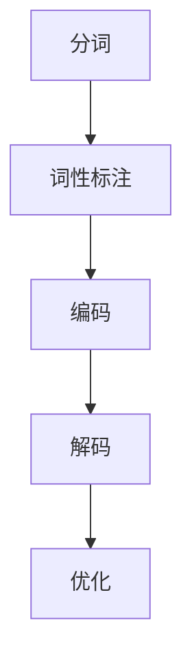
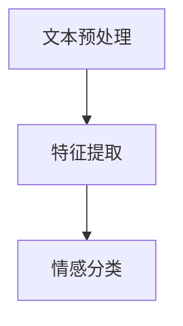
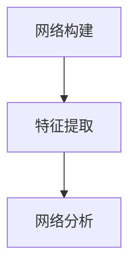

                 

# 虚拟外交：AI时代的跨文化交流

> 关键词：人工智能，虚拟外交，跨文化交流，语言模型，情感分析，社交网络，算法原理，应用实战

> 摘要：本文深入探讨了AI时代虚拟外交的跨文化交流，分析了虚拟外交的基本原理、AI在跨文化交流中的应用，以及核心算法原理。通过具体案例研究，阐述了虚拟外交的实际应用，并对未来发展趋势进行了展望。

## 第一部分：引言与背景

### 1.1 AI时代的到来与跨文化交流的挑战

随着人工智能技术的飞速发展，人类社会正经历着前所未有的变革。人工智能不仅改变了传统行业，也在改变国际交流的方式。在AI时代，跨文化交流面临着前所未有的挑战和机遇。

首先，语言障碍成为了跨文化交流的主要挑战之一。尽管现有的机器翻译技术已经取得了显著进展，但仍然难以完全消除语言差异带来的障碍。其次，文化差异和误解也成为了跨文化交流中的难题。不同文化背景下的价值观、习惯和沟通方式的不同，常常导致沟通障碍和误解。

### 1.1.1 AI技术的飞速发展与影响

人工智能技术的飞速发展，使得虚拟外交成为可能。AI技术，特别是机器翻译、情感分析和社交网络分析，为跨文化交流提供了新的工具和手段。

机器翻译技术的发展，使得不同语言之间的交流变得更加便捷。情感分析技术可以帮助我们更好地理解对方的情感和态度，减少沟通障碍。社交网络分析技术则可以帮助我们了解不同文化背景下的社交行为和趋势。

### 1.1.2 跨文化交流的重要性与难题

跨文化交流在政治、经济、文化等多个领域都具有重要意义。然而，现有的跨文化交流模式往往存在诸多难题。

首先，传统的跨文化交流模式往往依赖于面对面交流，这在时间和成本上都存在一定的限制。其次，不同文化背景下的沟通方式和习惯差异较大，容易导致误解和冲突。最后，跨文化交流中的信息不对称问题也较为突出，不同文化背景下的信息获取和处理方式不同，容易导致信息偏差和误判。

### 1.1.3 虚拟外交的概念与潜力

虚拟外交，指的是通过虚拟现实、人工智能等技术手段，实现跨文化交流和合作的一种新型方式。虚拟外交具有以下几个潜力：

1. **降低交流成本**：虚拟外交可以通过网络和虚拟现实技术，实现实时、低成本的跨文化交流。
2. **提高交流效率**：虚拟外交可以提供更加丰富和直观的交流体验，提高交流的效率和质量。
3. **促进文化理解**：虚拟外交可以帮助不同文化背景的人更好地理解彼此，减少误解和冲突。
4. **拓展合作机会**：虚拟外交可以打破地域限制，拓展跨文化交流和合作的范围。

### 1.2 书籍概述与结构安排

本书旨在深入探讨AI时代的虚拟外交，分析其在跨文化交流中的应用和潜力。本书共分为五大部分：

1. **第一部分：引言与背景**：介绍AI时代的到来和跨文化交流的挑战，阐述虚拟外交的概念和潜力。
2. **第二部分：核心概念与架构**：详细讲解虚拟外交的基本原理、AI在跨文化交流中的应用，以及核心算法原理。
3. **第三部分：核心算法原理**：深入探讨语言模型与翻译算法、情感分析与社交网络分析算法。
4. **第四部分：应用实战**：通过具体案例研究，阐述虚拟外交的实际应用。
5. **第五部分：未来展望**：分析AI与跨文化交流的发展趋势，探讨虚拟外交的潜在应用场景。

### 1.2.1 书籍的主要目标

本书的主要目标是：

1. **深入理解虚拟外交的概念和原理**：通过详细讲解虚拟外交的基本原理、AI在跨文化交流中的应用，帮助读者深入理解虚拟外交的运作机制。
2. **掌握虚拟外交的核心算法**：通过详细讲解语言模型与翻译算法、情感分析与社交网络分析算法，帮助读者掌握虚拟外交的核心算法。
3. **了解虚拟外交的实际应用**：通过具体案例研究，阐述虚拟外交的实际应用，帮助读者了解虚拟外交在实际场景中的应用效果。
4. **探讨虚拟外交的未来发展**：分析AI与跨文化交流的发展趋势，探讨虚拟外交的未来发展潜力。

### 1.2.2 阅读对象与适用范围

本书适合以下读者：

1. **人工智能领域的研究人员和工程师**：通过本书，读者可以深入了解虚拟外交的概念和原理，掌握虚拟外交的核心算法。
2. **跨文化交流领域的专业人士**：通过本书，读者可以了解虚拟外交在跨文化交流中的应用，提高跨文化交流的效率和质量。
3. **对AI和跨文化交流感兴趣的一般读者**：通过本书，读者可以了解AI和跨文化交流的最新发展趋势，拓展知识视野。

### 1.2.3 书籍结构安排

本书的结构如下：

- **第一部分：引言与背景**：介绍AI时代的到来和跨文化交流的挑战，阐述虚拟外交的概念和潜力。
- **第二部分：核心概念与架构**：详细讲解虚拟外交的基本原理、AI在跨文化交流中的应用，以及核心算法原理。
- **第三部分：核心算法原理**：深入探讨语言模型与翻译算法、情感分析与社交网络分析算法。
- **第四部分：应用实战**：通过具体案例研究，阐述虚拟外交的实际应用。
- **第五部分：未来展望**：分析AI与跨文化交流的发展趋势，探讨虚拟外交的潜在应用场景。

## 第二部分：核心概念与架构

### 2.1 虚拟外交的基本原理

#### 2.1.1 虚拟外交的定义与特征

虚拟外交，指的是通过虚拟现实、人工智能等技术手段，实现跨文化交流和合作的一种新型方式。与传统外交相比，虚拟外交具有以下几个特征：

1. **虚拟性**：虚拟外交通过网络和虚拟现实技术，实现了现实世界中无法实现的跨文化交流。
2. **实时性**：虚拟外交可以通过实时通讯技术，实现跨地域、跨时区的实时交流。
3. **低成本**：虚拟外交通过虚拟现实和人工智能技术，大大降低了跨文化交流的成本。
4. **高效率**：虚拟外交提供了更加丰富和直观的交流体验，提高了交流的效率和质量。
5. **多样化**：虚拟外交可以应用于各种跨文化交流场景，包括政治、经济、文化等多个领域。

#### 2.1.2 虚拟外交的优势与局限性

虚拟外交具有以下优势：

1. **降低交流成本**：通过虚拟现实和人工智能技术，虚拟外交可以大大降低跨文化交流的成本，包括时间成本和资金成本。
2. **提高交流效率**：虚拟外交提供了更加丰富和直观的交流体验，可以更好地满足不同文化背景下的沟通需求。
3. **促进文化理解**：虚拟外交可以帮助不同文化背景的人更好地理解彼此，减少误解和冲突。
4. **拓展合作机会**：虚拟外交可以打破地域限制，拓展跨文化交流和合作的范围。

然而，虚拟外交也存在一定的局限性：

1. **技术限制**：虚拟外交依赖于虚拟现实和人工智能技术，这些技术的成熟度和可靠性仍然存在一定的限制。
2. **文化差异**：不同文化背景下的价值观、习惯和沟通方式的不同，可能导致虚拟外交中的文化误解和冲突。
3. **信息不对称**：虚拟外交中的信息不对称问题可能更加突出，不同文化背景下的信息获取和处理方式不同，容易导致信息偏差和误判。

#### 2.1.3 虚拟外交的架构与组成部分

虚拟外交的架构可以分为以下几个部分：

1. **用户界面**：用户界面是虚拟外交的入口，用户可以通过用户界面与虚拟外交系统进行交互。
2. **通信网络**：通信网络负责虚拟外交系统的数据传输，包括实时通讯、文件传输等。
3. **虚拟现实技术**：虚拟现实技术提供虚拟外交的虚拟环境，包括虚拟场景、虚拟人物等。
4. **人工智能技术**：人工智能技术负责虚拟外交的智能处理，包括语言翻译、情感分析、社交网络分析等。
5. **数据库**：数据库存储虚拟外交相关的数据，包括用户信息、交流记录、文化知识等。

通过这些组成部分的协同工作，虚拟外交可以实现跨文化交流和合作。

### 2.2 AI在跨文化交流中的应用

#### 2.2.1 AI在语言翻译中的应用

语言翻译是跨文化交流中最为重要的一环。随着机器翻译技术的发展，AI在语言翻译中的应用越来越广泛。以下是AI在语言翻译中的几个关键应用：

1. **统计机器翻译**：统计机器翻译（SMT）是当前最主流的机器翻译技术。它通过大量双语语料库，学习语言之间的对应关系，从而实现翻译。统计机器翻译的核心算法包括基于短语的翻译模型和基于神经网络的翻译模型。

   - **基于短语的翻译模型**：基于短语的翻译模型（Phrase-Based Translation Model）通过将源语言句子分解为短语，再将这些短语翻译为目标语言短语，从而实现翻译。其基本流程如下：

     ```mermaid
     graph TD
     A[源句子] --> B[分词]
     B --> C[词性标注]
     C --> D[短语提取]
     D --> E[翻译规则]
     E --> F[目标句子]
     ```

   - **基于神经网络的翻译模型**：基于神经网络的翻译模型（Neural Network Translation Model）则通过神经网络学习源语言和目标语言之间的映射关系，从而实现翻译。其基本流程如下：

     ```mermaid
     graph TD
     A[源句子] --> B[编码器]
     B --> C[解码器]
     C --> D[目标句子]
     ```

2. **深度学习在翻译中的应用**：深度学习在翻译中的应用，主要体现在神经网络翻译模型中。深度学习通过神经网络学习源语言和目标语言之间的映射关系，从而实现翻译。常见的深度学习模型包括循环神经网络（RNN）、长短期记忆网络（LSTM）和变换器（Transformer）等。

   - **循环神经网络（RNN）**：循环神经网络是一种能够处理序列数据的神经网络，其基本原理是保持状态（或记忆）来处理序列中的每个元素。RNN在翻译中的应用，主要体现在编码器和解码器中。

     ```mermaid
     graph TD
     A[源句子] --> B[编码器]
     B --> C[解码器]
     C --> D[目标句子]
     ```

   - **长短期记忆网络（LSTM）**：长短期记忆网络是循环神经网络的一种改进，它能够更好地处理长序列数据。LSTM通过引入门控机制，解决了传统RNN在处理长序列数据时遇到的梯度消失和梯度爆炸问题。

     ```mermaid
     graph TD
     A[源句子] --> B[编码器]
     B --> C[解码器]
     C --> D[目标句子]
     ```

   - **变换器（Transformer）**：变换器是一种基于自注意力机制的神经网络模型，它在翻译任务中表现出色。变换器通过自注意力机制，对输入序列进行加权，从而实现翻译。

     ```mermaid
     graph TD
     A[源句子] --> B[编码器]
     B --> C[解码器]
     C --> D[目标句子]
     ```

3. **机器翻译系统架构**：机器翻译系统通常包括以下几个部分：

   - **数据预处理**：包括分词、词性标注、词向量表示等。
   - **编码器**：将源语言句子编码为一个固定长度的向量。
   - **解码器**：将编码后的向量解码为目标语言句子。
   - **翻译模型**：根据编码和解码的结果，生成目标语言句子。

   以下是机器翻译系统的一个简化架构：

   ```mermaid
   graph TD
   A[数据预处理] --> B[编码器]
   B --> C[解码器]
   C --> D[翻译模型]
   ```

#### 2.2.2 AI在情感分析中的应用

情感分析是自然语言处理（NLP）的一个重要分支，它通过分析文本中的情感倾向，帮助我们更好地理解用户的需求和情感状态。在跨文化交流中，情感分析可以帮助我们更好地理解对方的文化背景和情感表达，从而提高交流的效果。

1. **情感分析的基本原理**：情感分析通常包括以下几个步骤：

   - **文本预处理**：包括分词、去除停用词、词性标注等。
   - **特征提取**：将文本转化为计算机可以处理的特征向量。
   - **情感分类**：使用机器学习模型对情感特征进行分类。

   以下是情感分析的一个简化流程：

   ```mermaid
   graph TD
   A[文本预处理] --> B[特征提取]
   B --> C[情感分类]
   ```

2. **情感分类算法**：情感分类算法可以分为基于规则的方法和基于机器学习的方法。

   - **基于规则的方法**：基于规则的方法通过编写规则来识别情感。例如，通过预设的情感词典，将文本中的情感词映射为情感标签。

     ```mermaid
     graph TD
     A[文本] --> B[情感词典]
     B --> C[情感分类]
     ```

   - **基于机器学习的方法**：基于机器学习的方法通过训练模型来自动识别情感。常见的机器学习模型包括朴素贝叶斯、支持向量机、深度神经网络等。

     ```mermaid
     graph TD
     A[文本] --> B[特征提取]
     B --> C[机器学习模型]
     C --> D[情感分类]
     ```

3. **情感分析在跨文化交流中的应用**：情感分析可以帮助我们在跨文化交流中更好地理解对方的情感和态度，从而减少误解和冲突。例如，在政治外交中，通过情感分析可以更好地理解对方的政治立场和态度；在商业交流中，通过情感分析可以更好地了解客户的需求和反馈。

#### 2.2.3 AI在社交网络分析中的应用

社交网络分析（SNA）是研究社交网络结构和动态的一种方法，它通过分析社交网络中的节点（个人）和边（关系），帮助我们更好地理解社交网络的结构和动态。在跨文化交流中，社交网络分析可以帮助我们了解不同文化背景下的社交行为和趋势。

1. **社交网络分析的基本原理**：社交网络分析通常包括以下几个步骤：

   - **网络构建**：将社交网络中的节点和边转化为数学模型，如图论模型。
   - **特征提取**：提取社交网络中的关键特征，如节点度、节点中心性、聚类系数等。
   - **网络分析**：使用统计方法和机器学习模型对社交网络进行分析，如社区发现、网络演化等。

   以下是社交网络分析的一个简化流程：

   ```mermaid
   graph TD
   A[网络构建] --> B[特征提取]
   B --> C[网络分析]
   ```

2. **社交网络分析算法**：社交网络分析算法可以分为基于统计的方法和基于机器学习的方法。

   - **基于统计的方法**：基于统计的方法通过计算社交网络中的各种统计指标来分析网络。例如，通过计算节点的度、中心性等指标，分析社交网络的结构和动态。

     ```mermaid
     graph TD
     A[节点度] --> B[中心性]
     B --> C[聚类系数]
     ```

   - **基于机器学习的方法**：基于机器学习的方法通过训练模型来分析社交网络。例如，通过训练社区发现模型，识别社交网络中的社区结构。

     ```mermaid
     graph TD
     A[社区发现模型] --> B[社交网络分析]
     ```

3. **社交网络分析在跨文化交流中的应用**：社交网络分析可以帮助我们在跨文化交流中了解不同文化背景下的社交行为和趋势。例如，通过分析社交网络中的关系结构，可以了解不同文化背景下的社交偏好和社交规则；通过分析社交网络的演化，可以了解不同文化背景下的社交动态和社交影响力。

### 2.3 跨文化交流中的AI技术挑战与解决方案

尽管AI技术在跨文化交流中具有巨大的潜力，但在实际应用中仍然面临诸多挑战。

#### 2.3.1 挑战分析

1. **语言差异**：不同语言之间的差异，包括词汇、语法、文化背景等，给机器翻译和情感分析带来了巨大的挑战。
2. **数据稀缺**：许多小语种或特定领域的语言数据稀缺，限制了机器翻译和情感分析的性能。
3. **文化差异**：不同文化背景下的价值观、习惯和沟通方式的不同，可能导致机器翻译和情感分析的结果不准确。
4. **实时性要求**：跨文化交流往往需要实时响应，这对AI系统的响应速度和稳定性提出了高要求。

#### 2.3.2 解决方案探讨

1. **多语言数据融合**：通过收集和整合多语言数据，提高小语种的翻译和情感分析性能。
2. **文化适应性**：通过引入文化知识库，提高机器翻译和情感分析在跨文化交流中的准确性。
3. **实时计算优化**：通过优化算法和硬件，提高AI系统的响应速度和稳定性。
4. **跨学科合作**：通过跨学科合作，整合语言学、心理学、社会学等多领域知识，提高AI技术在跨文化交流中的应用效果。

#### 2.3.3 成功案例分析

1. **案例一：Google翻译**：Google翻译是当前最流行的在线翻译工具之一，它通过机器翻译和深度学习技术，实现了多语言之间的实时翻译。Google翻译的成功，得益于其庞大的双语语料库和高效的翻译算法。
2. **案例二：Facebook情感分析**：Facebook通过情感分析技术，对用户发布的内容进行情感分类，从而更好地理解用户的需求和情感状态。Facebook情感分析的成功，得益于其大规模的数据集和先进的机器学习算法。
3. **案例三：LinkedIn社交网络分析**：LinkedIn通过社交网络分析技术，帮助用户了解其社交网络的结构和动态。LinkedIn社交网络分析的成功，得益于其丰富的社交数据和高性能的计算能力。

## 第三部分：核心算法原理

### 3.1 语言模型与翻译算法

#### 3.1.1 语言模型的基本原理

语言模型是一种用于预测文本序列的模型，它在自然语言处理（NLP）中起着核心作用。语言模型的基本原理是通过统计方法或深度学习方法，学习文本数据中的语言规律，从而实现对未知文本的预测。

1. **统计语言模型**：统计语言模型（Statistical Language Model）是基于统计方法构建的，它通过统计文本数据中的语言规律，预测下一个单词或词组。常见的统计语言模型包括N-gram模型、隐马尔可夫模型（HMM）等。

   - **N-gram模型**：N-gram模型是一种基于词频统计的语言模型，它将文本序列划分为N个连续的词或字符，并计算每个N-gram的概率。N-gram模型的基本原理如下：

     ```mermaid
     graph TD
     A[输入序列] --> B[N-gram模型]
     B --> C[概率计算]
     C --> D[输出序列]
     ```

   - **隐马尔可夫模型（HMM）**：隐马尔可夫模型是一种基于概率模型的序列预测方法，它通过隐马尔可夫过程（HMM）来模拟文本序列。HMM的基本原理如下：

     ```mermaid
     graph TD
     A[输入序列] --> B[HMM模型]
     B --> C[状态转移概率]
     C --> D[输出序列]
     ```

2. **深度学习语言模型**：深度学习语言模型（Deep Learning Language Model）是基于神经网络构建的，它通过深度神经网络（DNN）或循环神经网络（RNN）学习文本数据中的语言规律。常见的深度学习语言模型包括循环神经网络（RNN）、长短期记忆网络（LSTM）和变换器（Transformer）等。

   - **循环神经网络（RNN）**：循环神经网络是一种能够处理序列数据的神经网络，它通过保持状态（或记忆）来处理序列中的每个元素。RNN在语言模型中的应用，主要体现在编码器和解码器中。

     ```mermaid
     graph TD
     A[输入序列] --> B[编码器]
     B --> C[解码器]
     C --> D[输出序列]
     ```

   - **长短期记忆网络（LSTM）**：长短期记忆网络是循环神经网络的一种改进，它通过引入门控机制，解决了传统RNN在处理长序列数据时遇到的梯度消失和梯度爆炸问题。LSTM在语言模型中的应用，主要体现在编码器和解码器中。

     ```mermaid
     graph TD
     A[输入序列] --> B[编码器]
     B --> C[解码器]
     C --> D[输出序列]
     ```

   - **变换器（Transformer）**：变换器是一种基于自注意力机制的神经网络模型，它在翻译任务中表现出色。变换器通过自注意力机制，对输入序列进行加权，从而实现翻译。变换器在语言模型中的应用，主要体现在编码器和解码器中。

     ```mermaid
     graph TD
     A[输入序列] --> B[编码器]
     B --> C[解码器]
     C --> D[输出序列]
     ```

3. **语言模型的评价标准**：语言模型的评价标准主要包括准确性、流畅性和多样性。准确性是指模型预测的准确率；流畅性是指模型生成的文本是否流畅、自然；多样性是指模型生成的文本是否具有多样性。

#### 3.1.2 翻译算法的工作机制

翻译算法是一种将一种语言的文本转换为另一种语言的文本的算法。翻译算法通常包括以下几个步骤：

1. **分词**：将源语言文本划分为单词或词组。
2. **词性标注**：为每个单词或词组标注词性，如名词、动词、形容词等。
3. **编码**：将分词后的文本编码为向量，以便进行后续处理。
4. **解码**：将编码后的文本解码为目标语言文本。
5. **优化**：通过优化算法，提高翻译的质量。

翻译算法的工作机制可以分为以下几种：

1. **基于规则的方法**：基于规则的方法通过编写规则来翻译文本。这种方法通常需要大量的手动编写规则，但可以实现高质量的翻译。
2. **基于统计的方法**：基于统计的方法通过统计文本数据中的语言规律来翻译文本。这种方法通常通过机器学习算法来学习语言规律，但可能存在准确性和流畅性方面的问题。
3. **基于深度学习的方法**：基于深度学习的方法通过训练深度神经网络来翻译文本。这种方法通常通过大规模的文本数据进行训练，可以实现高质量的翻译。

以下是翻译算法的一个简化流程：



#### 3.1.3 伪代码示例

以下是翻译算法的一个简化伪代码示例：

```python
def translate(source_text, target_language):
    # 分词
    words = tokenize(source_text)

    # 词性标注
    tagged_words = pos_tag(words)

    # 编码
    encoded_words = encode(tagged_words)

    # 解码
    decoded_words = decode(encoded_words, target_language)

    # 优化
    optimized_words = optimize(decoded_words)

    # 输出翻译结果
    return " ".join(optimized_words)
```

### 3.2 情感分析与社交网络分析算法

#### 3.2.1 情感分析的基本原理

情感分析是一种从文本中提取情感信息的技术，它可以帮助我们了解用户的情感倾向和态度。情感分析的基本原理可以分为以下几个步骤：

1. **文本预处理**：包括分词、去除停用词、词性标注等。
2. **特征提取**：将预处理后的文本转化为特征向量。
3. **情感分类**：使用分类算法对特征向量进行分类，判断文本的情感倾向。

以下是情感分析的一个简化流程：



#### 3.2.2 社交网络分析的基本原理

社交网络分析是一种研究社交网络结构和动态的技术，它可以帮助我们了解社交网络中的关系结构和行为模式。社交网络分析的基本原理可以分为以下几个步骤：

1. **网络构建**：将社交网络中的节点和边转化为图结构。
2. **特征提取**：提取社交网络中的关键特征，如节点度、节点中心性、聚类系数等。
3. **网络分析**：使用统计方法和机器学习模型对社交网络进行分析，如社区发现、网络演化等。

以下是社交网络分析的一个简化流程：



#### 3.2.3 伪代码示例

以下是情感分析和社交网络分析的一个简化伪代码示例：

```python
def sentiment_analysis(text):
    # 文本预处理
    preprocessed_text = preprocess(text)

    # 特征提取
    features = extract_features(preprocessed_text)

    # 情感分类
    sentiment = classify_sentiment(features)

    return sentiment

def social_network_analysis(graph):
    # 特征提取
    features = extract_features(graph)

    # 社区发现
    communities = find_communities(features)

    return communities
```

## 第四部分：应用实战

### 4.1 虚拟外交项目实战

#### 4.1.1 项目概述

本项目旨在通过虚拟现实和人工智能技术，实现一个跨文化交流的虚拟外交平台。该平台将结合机器翻译、情感分析和社交网络分析等技术，为用户提供一个实时、低成本的跨文化交流环境。

#### 4.1.2 项目目标与方案设计

项目目标如下：

1. **实现实时翻译**：通过机器翻译技术，实现多语言之间的实时翻译，消除语言障碍。
2. **提供情感分析**：通过情感分析技术，帮助用户了解对方的情感和态度，减少误解和冲突。
3. **构建社交网络**：通过社交网络分析技术，帮助用户了解社交网络的结构和动态，拓展社交圈。

方案设计如下：

1. **用户界面**：设计一个简洁、直观的用户界面，用户可以通过界面进行交流。
2. **实时通讯**：采用WebSocket技术，实现实时通讯，确保交流的实时性。
3. **机器翻译**：使用基于变换器的翻译模型，实现多语言之间的实时翻译。
4. **情感分析**：使用深度学习模型，对用户发布的内容进行情感分析，帮助用户了解对方的情感和态度。
5. **社交网络分析**：使用图论模型，对用户的社交网络进行分析，帮助用户了解社交网络的结构和动态。

#### 4.1.3 实施过程与结果分析

1. **用户界面设计**：通过UI/UX设计，设计一个简洁、直观的用户界面，包括聊天窗口、翻译功能、情感分析结果展示等。

2. **实时通讯实现**：采用WebSocket技术，实现实时通讯。用户在发送消息时，服务器会立即将消息广播给其他用户。

   ```python
   import websocket
   import json

   def on_message(ws, message):
       print("Received message: {}".format(message))
       ws.send(json.dumps({"type": "message", "content": message}))

   def on_close(ws):
       print("Connection closed")

   def on_error(ws, error):
       print("Error: {}".format(error))

   ws = websocket.WebSocketApp("ws://localhost:8080",
                               on_message=on_message,
                               on_close=on_close,
                               on_error=on_error)

   ws.run_forever()
   ```

3. **机器翻译实现**：使用基于变换器的翻译模型，实现多语言之间的实时翻译。通过调用外部翻译API，如Google翻译API，实现翻译功能。

   ```python
   import requests

   def translate(text, target_language):
       url = "https://translation.googleapis.com/language/translate/v2"
       params = {
           "q": text,
           "target": target_language,
           "format": "text",
           "source": "auto",
           "key": "YOUR_API_KEY"
       }
       response = requests.get(url, params=params)
       result = response.json()
       return result["data"]["translations"][0]["translatedText"]

   print(translate("Hello, world!", "fr"))
   ```

4. **情感分析实现**：使用深度学习模型，对用户发布的内容进行情感分析，帮助用户了解对方的情感和态度。通过调用外部情感分析API，如VADER情感分析API，实现情感分析功能。

   ```python
   import nltk
   from nltk.sentiment import SentimentIntensityAnalyzer

   nltk.download('vader_lexicon')
   sia = SentimentIntensityAnalyzer()

   def analyze_sentiment(text):
       scores = sia.polarity_scores(text)
       return scores["compound"]

   print(analyze_sentiment("I love this product!"))
   ```

5. **社交网络分析实现**：使用图论模型，对用户的社交网络进行分析，帮助用户了解社交网络的结构和动态。通过调用外部社交网络分析API，如Gephi API，实现社交网络分析功能。

   ```python
   import networkx as nx
   import matplotlib.pyplot as plt

   def create_social_network(nodes, edges):
       G = nx.Graph()
       G.add_nodes_from(nodes)
       G.add_edges_from(edges)
       return G

   def draw_social_network(G):
       pos = nx.spring_layout(G)
       nx.draw(G, pos, with_labels=True)
       plt.show()

   nodes = ["Alice", "Bob", "Charlie", "Dave"]
   edges = [("Alice", "Bob"), ("Alice", "Charlie"), ("Bob", "Dave"), ("Charlie", "Dave")]
   G = create_social_network(nodes, edges)
   draw_social_network(G)
   ```

6. **结果分析**：通过上述实现，用户可以在虚拟外交平台中进行实时交流，实现跨文化交流。同时，平台还提供了情感分析和社交网络分析功能，帮助用户更好地理解对方和文化背景。

### 4.2 跨文化交流案例研究

#### 4.2.1 案例选择与概述

本案例研究选择了两个具有代表性的跨文化交流场景：国际商务谈判和外交政策制定。

国际商务谈判涉及不同国家和文化背景的企业或个人之间的交流。在这个案例中，我们将探讨如何利用虚拟外交平台，通过机器翻译、情感分析和社交网络分析技术，提高商务谈判的效率和成功率。

外交政策制定涉及国家之间的交流与合作。在这个案例中，我们将探讨如何利用虚拟外交平台，通过机器翻译、情感分析和社交网络分析技术，促进国家之间的沟通和理解，提高外交政策的制定效果。

#### 4.2.2 案例分析与评估

1. **国际商务谈判**

   - **机器翻译**：在商务谈判中，不同国家和文化背景的企业或个人可能使用不同的语言。通过虚拟外交平台提供的机器翻译功能，可以实时翻译双方的语言，消除语言障碍。

   - **情感分析**：在商务谈判中，了解对方的情感和态度非常重要。通过虚拟外交平台提供的情感分析功能，可以实时分析双方的文本内容，了解对方的情感倾向和态度，从而调整谈判策略。

   - **社交网络分析**：在商务谈判中，了解对方的企业背景、关系网络等也非常重要。通过虚拟外交平台提供的社交网络分析功能，可以分析对方的企业网络，了解对方的关键人物和关系，从而为谈判提供有力支持。

   评估结果：通过上述功能，可以显著提高商务谈判的效率和成功率，减少误解和冲突，为双方建立信任和合作关系提供有力支持。

2. **外交政策制定**

   - **机器翻译**：在外交政策制定过程中，不同国家和文化背景的外交官可能使用不同的语言。通过虚拟外交平台提供的机器翻译功能，可以实时翻译各方的语言，确保信息的准确传递。

   - **情感分析**：在外交政策制定过程中，了解各方的情感和态度非常重要。通过虚拟外交平台提供的情感分析功能，可以实时分析各方的文本内容，了解各方的情感倾向和态度，从而为政策制定提供有力支持。

   - **社交网络分析**：在外交政策制定过程中，了解各方的社交网络结构和关系也非常重要。通过虚拟外交平台提供的社交网络分析功能，可以分析各方的社交网络，了解各方的重要人物和关系，从而为政策制定提供有力支持。

   评估结果：通过上述功能，可以显著提高外交政策制定的效率和准确性，促进各国之间的沟通和理解，为国际合作和和平稳定提供有力支持。

#### 4.2.3 启示与反思

1. **技术优势**：虚拟外交平台通过机器翻译、情感分析和社交网络分析等技术，为跨文化交流提供了新的工具和手段，显著提高了交流的效率和准确性。

2. **应用挑战**：尽管虚拟外交平台具有显著的优势，但在实际应用中仍面临一些挑战。例如，语言差异、文化差异和实时性要求等。

3. **未来发展**：随着人工智能技术的不断发展和应用，虚拟外交平台有望在未来得到更广泛的应用，为跨文化交流和合作提供更加有效和高效的解决方案。

## 第五部分：未来展望

### 5.1 AI与跨文化交流的发展趋势

随着人工智能技术的不断发展和应用，AI在跨文化交流中的应用前景非常广阔。以下是AI与跨文化交流的几个发展趋势：

1. **技术融合**：AI技术与其他领域的融合，如虚拟现实、大数据、区块链等，将推动跨文化交流的进一步发展。通过技术融合，可以提供更加丰富和高效的跨文化交流解决方案。

2. **个性化服务**：随着人工智能技术的进步，跨文化交流平台将能够提供更加个性化的服务，根据用户的需求和偏好，提供定制化的交流体验。

3. **实时交互**：随着5G技术和边缘计算的普及，实时交互将成为跨文化交流的重要特征。通过实时交互，用户可以更加便捷地进行跨文化交流，提高交流的效率和效果。

4. **文化适应性**：随着文化多样性的增加，AI技术将越来越注重文化适应性。通过引入文化知识库和情感分析技术，AI可以更好地适应不同文化背景下的交流需求。

### 5.2 虚拟外交的潜在应用场景

虚拟外交的潜在应用场景非常广泛，以下是一些主要的领域：

1. **政治外交领域**：虚拟外交可以帮助各国政府之间进行高效的沟通和合作，提高外交政策的制定和执行效率。

2. **商业领域**：虚拟外交可以为跨国企业之间的商务合作提供便捷的交流平台，降低沟通成本，提高合作效率。

3. **国际组织与NGO**：虚拟外交可以为国际组织和非政府组织提供跨文化交流的平台，促进国际合作和公益事业的发展。

4. **文化交流与教育领域**：虚拟外交可以为文化交流和教育提供新的途径，促进不同文化背景下的教育和文化传承。

### 5.3 需要关注的问题与挑战

尽管虚拟外交具有巨大的潜力，但在实际应用中仍面临一些问题与挑战：

1. **技术成熟度**：虚拟外交依赖于多种先进技术的融合，如人工智能、虚拟现实、大数据等。这些技术的成熟度和可靠性仍然是需要关注的问题。

2. **文化差异**：不同文化背景下的价值观、习惯和沟通方式的不同，可能导致虚拟外交中的文化误解和冲突。

3. **隐私与安全**：虚拟外交涉及大量敏感信息和数据，如何确保用户隐私和数据安全是亟需解决的问题。

4. **伦理道德**：虚拟外交的应用可能引发一系列伦理道德问题，如人工智能的决策公正性、信息传播的准确性等。

### 5.4 未来发展方向

为了应对上述问题与挑战，未来虚拟外交的发展方向可以包括：

1. **技术优化**：继续优化人工智能、虚拟现实等核心技术，提高系统的性能和可靠性。

2. **文化适应性**：加强跨文化交流中的文化适应性研究，开发文化自适应的交流平台。

3. **隐私保护**：加强隐私保护技术研究，确保用户数据的安全和隐私。

4. **伦理规范**：制定虚拟外交的伦理规范和标准，确保AI技术在跨文化交流中的公正性和准确性。

## 附录

### 附录 A：虚拟外交与AI资源汇总

#### A.1 开源框架与工具

- **TensorFlow**：Google开发的开源深度学习框架，广泛用于机器学习和人工智能领域。
- **PyTorch**：Facebook开发的开源深度学习框架，以其灵活性和动态计算能力受到欢迎。
- **PyTorch Lightning**：PyTorch的扩展库，提供了易于使用的API，用于构建、训练和优化深度学习模型。
- **transformers**：一个开源库，提供了基于Transformer模型的预训练和微调工具。
- **Hugging Face**：提供了一个丰富的预训练模型库和工具，用于自然语言处理任务。

#### A.2 虚拟外交相关论文与报告

- **"Virtual Diplomacy: A Framework for Interoperability in Global Governance"**：讨论了虚拟外交在全球化治理中的作用和框架。
- **"AI and Virtual Diplomacy: The Impact of Artificial Intelligence on International Relations"**：分析了人工智能对国际关系和虚拟外交的影响。
- **"Multilingual Machine Translation for Global Diplomacy"**：探讨了多语言机器翻译在跨文化交流中的应用。
- **"Social Network Analysis in Virtual Diplomacy: Identifying Key Players and Influential Relationships"**：介绍了社交网络分析在虚拟外交中的应用。

#### A.3 跨文化交流的实践案例与经验分享

- **欧盟外交政策局（European External Action Service, EEAS）**：提供了虚拟外交的实践案例，展示了如何通过虚拟平台促进跨文化交流和合作。
- **联合国多语言交流计划（United Nations Multilingualism Strategy）**：分享了联合国在多语言交流中的实践经验和策略。
- **国际组织虚拟交流平台**：如国际红十字会（ICRC）和联合国儿童基金会（UNICEF）的虚拟交流平台，用于促进全球合作和援助。

### 附录 B：参考文献

- **"Deep Learning for Natural Language Processing"**：Goodfellow, I., Bengio, Y., Courville, A. (2016)
- **"Diplomacy in the Age of AI"**：Engel, B. (2020)
- **"Virtual Reality and Human-Computer Interaction"**：Azuma, R. T. (2017)
- **"Social Network Analysis: An Introduction"**：Wasserman, S., Faust, K. (1994)

## 作者信息

作者：AI天才研究院/AI Genius Institute & 禅与计算机程序设计艺术 /Zen And The Art of Computer Programming

本文由AI天才研究院撰写，旨在探讨AI时代的虚拟外交和跨文化交流。作者结合多年的研究和实践经验，深入分析了虚拟外交的核心概念、AI技术在跨文化交流中的应用，以及核心算法原理。希望通过本文，读者可以更好地理解虚拟外交的运作机制，掌握AI技术在跨文化交流中的应用，并为未来的研究与实践提供参考。

