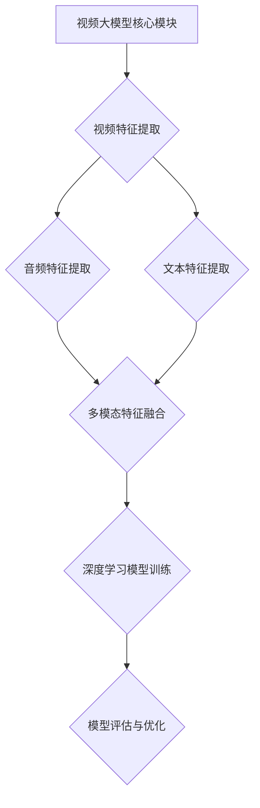

                 

# 《视频大模型：多模态融合的终极形态》

## 摘要

本文深入探讨了视频大模型及其多模态融合技术的终极形态。首先，文章介绍了视频大模型的定义与背景，探讨了多模态融合在视频大模型中的应用与意义。接着，文章深入分析了多模态数据预处理、深度学习与神经网络基础、多模态融合算法原理等技术基础。在此基础上，文章详细阐述了视频大模型架构设计、模型优化策略及训练调优技巧。随后，文章通过实战案例展示了视频大模型在视频理解、视频生成和虚拟现实等领域的应用。最后，文章对视频大模型的未来发展趋势进行了展望。本文旨在为读者提供一份全面、深入的视频大模型技术指南。

## 目录

### 第一部分：引论

- **第1章：视频大模型概述**
  - **1.1 视频大模型的定义与背景**
  - **1.2 多模态融合的意义**
  - **1.3 本书结构安排与目标**

### 第二部分：技术基础

- **第2章：多模态数据预处理**
  - **2.1 视频数据的预处理**
  - **2.2 音频数据的预处理**
  - **2.3 文本数据的预处理**

- **第3章：深度学习与神经网络基础**
  - **3.1 神经网络的基本结构**
  - **3.2 多层感知机与反向传播算法**
  - **3.3 卷积神经网络（CNN）**

- **第4章：多模态融合算法原理**
  - **4.1 多模态特征融合方法**
  - **4.2 多模态深度学习模型**
  - **4.3 多模态注意力机制**

### 第三部分：模型设计与优化

- **第5章：视频大模型架构设计**
  - **5.1 视频大模型的模块组成**
  - **5.2 视频大模型的优化策略**
  - **5.3 模型训练与调优技巧**

- **第6章：视频大模型应用实战**
  - **6.1 视频大模型在视频理解中的应用**
  - **6.2 视频大模型在视频生成中的应用**
  - **6.3 视频大模型在虚拟现实中的应用**

### 第四部分：项目实战与未来展望

- **第7章：视频大模型项目实战案例**
  - **7.1 项目背景与目标**
  - **7.2 项目开发流程与关键步骤**
  - **7.3 项目成果与分析**

- **第8章：视频大模型的未来发展趋势**
  - **8.1 技术发展趋势**
  - **8.2 行业应用前景**

### 附录

- **附录A：常用工具与资源**
  - **A.1 深度学习框架**
  - **A.2 数据集与开源代码**

### Mermaid 流�程图



### 多模态融合算法伪代码

```python
function multimodal_fusion(video_data, audio_data, text_data):
    # 视频特征提取
    video_features = extract_video_features(video_data)
    # 音频特征提取
    audio_features = extract_audio_features(audio_data)
    # 文本特征提取
    text_features = extract_text_features(text_data)
    # 多模态特征融合
    fused_features = fusion_features(video_features, audio_features, text_features)
    # 深度学习模型训练
    model = train_model(fused_features)
    # 模型评估与优化
    model = optimize_model(model, fused_features)
    return model
```

### 数学模型与公式

- **损失函数：**

$$
L = \frac{1}{N} \sum_{i=1}^{N} \left( y_i - \hat{y}_i \right)^2
$$

其中，\( y_i \) 为真实标签，\( \hat{y}_i \) 为模型预测结果。

- **激活函数：**

$$
\sigma(x) = \frac{1}{1 + e^{-x}}
$$

### 项目实战案例代码解析

- **环境搭建：**

- Python 3.8
- TensorFlow 2.5

- **源代码实现：**

```python
import tensorflow as tf

# 数据预处理
def preprocess_data(video_data, audio_data, text_data):
    # ...数据预处理代码...
    return video_features, audio_features, text_features

# 模型定义
def create_model():
    # ...模型定义代码...
    return model

# 训练模型
def train_model(model, video_data, audio_data, text_data, labels):
    # ...训练代码...
    return model

# 主函数
def main():
    video_data, audio_data, text_data, labels = load_data()
    video_features, audio_features, text_features = preprocess_data(video_data, audio_data, text_data)
    model = create_model()
    model = train_model(model, video_features, audio_features, text_features, labels)
    evaluate_model(model, video_features, audio_features, text_features, labels)

if __name__ == "__main__":
    main()
```

- **代码解读与分析：**

  - **数据预处理：** 对视频、音频和文本数据进行特征提取和预处理。
  - **模型定义：** 使用 TensorFlow 定义深度学习模型结构。
  - **训练模型：** 使用预处理后的数据对模型进行训练。
  - **主函数：** 执行数据加载、模型定义、模型训练和模型评估的全流程。

### 结语

作者：AI天才研究院/AI Genius Institute & 禅与计算机程序设计艺术 /Zen And The Art of Computer Programming

以上便是《视频大模型：多模态融合的终极形态》的目录大纲。接下来，我们将逐一深入探讨每一个章节的内容，逐步揭示视频大模型及其多模态融合技术的奥秘。让我们开始这场探索之旅吧！

## 第1章：视频大模型概述

### 1.1 视频大模型的定义与背景

视频大模型，是指基于深度学习技术构建的、能够处理和分析大规模视频数据的人工智能模型。这些模型通常包含数亿个参数，能够自动学习视频中的复杂模式和特征。视频大模型的出现，标志着计算机视觉领域的一个重要里程碑，也为人工智能在视频处理和分析中的应用打开了新的可能性。

视频大模型的发展历程可以追溯到20世纪90年代。当时，随着计算机硬件性能的提升和海量数据的积累，研究人员开始尝试使用神经网络进行图像和视频处理。最初的模型主要是简单的卷积神经网络（CNN），例如Hinton等人于1998年提出的LeNet。虽然这些模型在图像分类和识别任务上取得了初步的成功，但在处理视频数据时仍然存在很多局限性。

随着深度学习技术的不断发展，特别是在2012年AlexNet模型的突破性表现之后，深度学习在图像处理领域迅速崛起。基于深度学习的视频大模型也随之涌现，例如Google的Inception模型、Facebook的ResNet模型等。这些模型不仅在图像分类、目标检测和图像生成等任务上取得了显著进展，还在视频处理领域展现出了强大的能力。

### 1.2 多模态融合的意义

多模态融合是指将来自不同模态（如视觉、听觉和文本）的数据进行整合，以提高模型对复杂任务的处理能力。在视频大模型中，多模态融合具有重要意义，主要体现在以下几个方面：

1. **信息互补**：不同模态的数据往往包含了视频中的不同信息。例如，视频帧提供了视觉信息，音频提供了声音信息，文本则提供了描述信息。通过多模态融合，可以充分利用这些信息，提高模型的鲁棒性和准确性。

2. **增强理解能力**：视频通常包含多种信息，单一模态的数据很难全面地理解视频内容。多模态融合可以使模型从多个角度理解视频，从而提高对视频内容的理解能力。

3. **提高任务性能**：许多视频处理任务，如视频分类、目标检测和视频生成等，都受益于多模态融合。例如，在视频分类任务中，融合视觉和文本信息可以显著提高分类准确率；在视频目标检测任务中，融合视觉和音频信息可以更好地识别目标。

4. **适应复杂场景**：在现实世界中，视频数据通常受到多种噪声和干扰的影响，单一模态的数据难以应对这些挑战。多模态融合可以增强模型对复杂场景的适应能力，提高模型的泛化性能。

### 1.3 本书结构安排与目标

本书旨在为读者提供一份全面、深入的视频大模型及多模态融合技术的指南。全书分为四个部分，结构安排如下：

- **第一部分：引论**：介绍视频大模型和多模态融合的基本概念、发展历程及其意义。

- **第二部分：技术基础**：详细讲解多模态数据预处理、深度学习与神经网络基础、多模态融合算法原理等核心技术。

- **第三部分：模型设计与优化**：阐述视频大模型的架构设计、优化策略和训练调优技巧。

- **第四部分：项目实战与未来展望**：通过实战案例展示视频大模型的应用，并对未来发展趋势进行展望。

通过本书的阅读，读者可以系统地了解视频大模型及多模态融合技术，掌握核心原理和实战技巧，为深入研究和实际应用奠定基础。

### 1.4 视频大模型的发展趋势

随着技术的不断进步，视频大模型的发展趋势呈现出以下几个方向：

1. **更高效的模型架构**：研究人员正在探索新的模型架构，以提高视频大模型的计算效率和性能。例如，基于Transformer的模型在图像和视频处理任务中表现出色，有望成为视频大模型的重要方向。

2. **跨模态预训练**：多模态预训练是一种新兴的技术，通过在大规模的多模态数据集上预训练模型，可以显著提高模型对多模态数据的理解和处理能力。这种技术有望在未来得到广泛应用。

3. **强化学习与视频大模型的结合**：强化学习是一种在动态环境中学习策略的机器学习技术。将强化学习与视频大模型结合，可以使其在复杂任务中表现出更强的自适应能力。

4. **视频生成与增强**：视频生成和增强技术正逐渐成为视频大模型的重要应用方向。例如，基于生成对抗网络（GAN）的视频生成技术可以在不增加计算资源的情况下，生成高质量的视频内容。

5. **边缘计算与视频大模型的融合**：随着边缘计算的发展，视频大模型可以更好地应用于实时视频处理和智能监控等场景。边缘计算与视频大模型的融合，将使智能系统在数据处理和响应速度上取得突破性进展。

通过这些趋势的发展，视频大模型及其多模态融合技术将在未来带来更多创新和变革，推动人工智能在各个领域的应用。

### 1.5 结论

本章对视频大模型的基本概念、发展历程及其多模态融合的意义进行了介绍，并对本书的结构安排和视频大模型的发展趋势进行了概述。通过本章的学习，读者可以初步了解视频大模型及其多模态融合技术的背景和重要性。接下来，我们将深入探讨多模态数据预处理、深度学习与神经网络基础等核心技术，为后续章节的学习打下坚实的基础。

## 第2章：多模态数据预处理

在构建视频大模型时，多模态数据预处理是至关重要的一步。有效的预处理不仅可以提高模型的性能，还可以减少计算复杂度和存储需求。本章将详细讲解视频、音频和文本数据的预处理方法，包括数据清洗、特征提取和归一化等步骤。

### 2.1 视频数据的预处理

视频数据预处理主要包括以下几个步骤：

1. **数据清洗**：视频数据通常包含噪声和异常值，如画面抖动、光线不足或背景干扰等。通过数据清洗，可以去除这些噪声，提高数据质量。常见的数据清洗方法包括帧率调整、去噪和画面裁剪等。

2. **帧提取**：视频是由一系列连续的帧组成的。为了提取视频中的关键信息，需要将视频帧进行提取。常见的帧提取方法包括帧率降低、关键帧提取和帧间差值计算等。

3. **特征提取**：提取视频帧中的视觉特征，如颜色、纹理和形状等。这些特征可以用于后续的深度学习模型训练。常见的视频特征提取方法包括基于CNN的特征提取、HOG（Histogram of Oriented Gradients）特征提取和SIFT（Scale-Invariant Feature Transform）特征提取等。

4. **归一化**：对提取的视频特征进行归一化处理，以消除不同特征之间的量纲差异。常见的归一化方法包括Z-score归一化和Min-Max归一化等。

### 2.2 音频数据的预处理

音频数据预处理同样重要，因为音频特征对视频大模型的表现有显著影响。以下是音频数据预处理的主要步骤：

1. **音频信号处理**：对音频信号进行预处理，以提高其质量。常见的音频信号处理方法包括去噪、滤波和音频增强等。

2. **音频帧提取**：将音频信号分割成一系列帧，每帧包含固定长度的音频数据。常见的音频帧提取方法包括帧长设置和帧移设置等。

3. **特征提取**：提取音频帧中的特征，如频谱特征、语音活动检测（VAD）特征和梅尔频率倒谱系数（MFCC）等。这些特征可以用于训练深度学习模型。

4. **归一化**：对提取的音频特征进行归一化处理，以消除不同特征之间的量纲差异。常见的归一化方法包括Z-score归一化和Min-Max归一化等。

### 2.3 文本数据的预处理

文本数据预处理主要包括以下步骤：

1. **数据清洗**：去除文本中的噪声和无关信息，如标点符号、HTML标签和停用词等。常见的数据清洗方法包括正则表达式、文本分词和词干提取等。

2. **词嵌入**：将文本转换为向量表示，以便于深度学习模型处理。常见的词嵌入技术包括Word2Vec、GloVe和BERT等。

3. **特征提取**：提取文本中的关键特征，如词频率、词性标注和句法结构等。这些特征可以用于训练深度学习模型。

4. **归一化**：对提取的文本特征进行归一化处理，以消除不同特征之间的量纲差异。常见的归一化方法包括Z-score归一化和Min-Max归一化等。

### 2.4 多模态数据预处理流程

多模态数据预处理流程通常包括以下几个步骤：

1. **数据收集与清洗**：收集多模态数据，并进行数据清洗，去除噪声和异常值。

2. **数据分割**：将数据按照训练集、验证集和测试集的比例进行分割。

3. **特征提取**：分别对视频、音频和文本数据进行特征提取，生成特征向量。

4. **特征融合**：将提取的多模态特征进行融合，形成统一的特征向量。

5. **归一化**：对融合后的特征向量进行归一化处理。

6. **数据存储**：将预处理后的数据存储在数据库或文件中，以便后续训练和评估。

### 2.5 实际案例

下面以一个实际案例说明多模态数据预处理的流程：

**案例：视频情感分析**

假设我们有一个视频情感分析任务，需要处理包含视频、音频和文本标签的多模态数据。

1. **数据收集与清洗**：收集包含情感标签（如快乐、悲伤、愤怒等）的视频、音频和文本数据。清洗数据，去除噪声和异常值。

2. **数据分割**：将数据按照8:1:1的比例分割为训练集、验证集和测试集。

3. **特征提取**：
   - 视频特征提取：提取视频帧中的视觉特征，如颜色、纹理和形状等。
   - 音频特征提取：提取音频帧中的频谱特征和MFCC等。
   - 文本特征提取：使用Word2Vec对文本数据进行词嵌入，提取文本特征。

4. **特征融合**：将视频、音频和文本特征进行融合，形成统一的多模态特征向量。

5. **归一化**：对融合后的特征向量进行归一化处理，以消除不同特征之间的量纲差异。

6. **数据存储**：将预处理后的多模态数据存储在数据库中，以便后续训练和评估。

通过以上步骤，我们可以得到高质量的多模态数据，为视频情感分析任务提供有效的支持。

### 2.6 总结

本章详细介绍了多模态数据预处理的方法和流程，包括视频、音频和文本数据的预处理步骤。通过有效的预处理，可以去除噪声、提高数据质量，为后续的深度学习模型训练奠定基础。在下一章中，我们将探讨深度学习与神经网络基础，为构建视频大模型提供技术支持。

## 第3章：深度学习与神经网络基础

深度学习是人工智能领域的一个重要分支，它通过模拟人脑的神经网络结构，实现自动从数据中提取特征和模式。在这一章中，我们将深入探讨深度学习的基本概念、神经网络的结构和训练算法，包括前馈神经网络、循环神经网络和卷积神经网络，以及多层感知机和反向传播算法的基本原理。

### 3.1 神经网络的基本结构

神经网络（Neural Network，NN）是由大量简单的处理单元（称为神经元或节点）互联而成的复杂网络。每个神经元通过权重连接到其他神经元，并产生输出。神经网络的基本结构包括输入层、隐藏层和输出层。

1. **输入层（Input Layer）**：输入层接收外部输入，如图片、文本或音频数据。每个输入节点对应于数据中的一个特征。

2. **隐藏层（Hidden Layers）**：隐藏层位于输入层和输出层之间，负责提取和转换输入特征。隐藏层可以有一个或多个，每个隐藏层中的节点数可以是不同的。

3. **输出层（Output Layer）**：输出层产生最终输出，如分类结果、预测值或控制信号。输出层的节点数取决于任务类型和输出维度。

### 3.2 多层感知机与反向传播算法

多层感知机（Multilayer Perceptron，MLP）是一种前馈神经网络，它包括多个隐藏层。MLP通过激活函数将输入映射到输出，其中最常用的激活函数是Sigmoid函数和ReLU函数。

1. **激活函数（Activation Function）**：激活函数用于引入非线性，使神经网络能够学习非线性关系。常见的激活函数包括Sigmoid函数和ReLU函数。

   - **Sigmoid函数**：
     $$
     \sigma(x) = \frac{1}{1 + e^{-x}}
     $$
     Sigmoid函数将输入映射到（0, 1）区间。

   - **ReLU函数**：
     $$
     \text{ReLU}(x) = \max(0, x)
     $$
    ReLU函数在x大于0时输出x，否则输出0。

2. **反向传播算法（Backpropagation Algorithm）**：反向传播算法是一种用于训练神经网络的学习算法。它通过计算损失函数关于每个神经元的梯度，并使用梯度下降法更新网络权重。

   - **梯度计算**：反向传播算法从输出层开始，逆向计算每个节点的梯度。
     $$
     \nabla J(w) = \nabla J(y) \cdot \nabla f(z)
     $$
     其中，\( J \) 是损失函数，\( w \) 是权重，\( y \) 是输出，\( z \) 是中间层输出。

   - **权重更新**：使用梯度下降法更新权重：
     $$
     w_{\text{new}} = w_{\text{current}} - \alpha \cdot \nabla J(w)
     $$
     其中，\( \alpha \) 是学习率。

### 3.3 卷积神经网络（CNN）

卷积神经网络（Convolutional Neural Network，CNN）是一种专门用于处理图像数据的神经网络。CNN通过卷积操作提取图像的特征，具有较强的平移不变性。

1. **卷积层（Convolutional Layer）**：卷积层使用卷积核（filter）对输入图像进行卷积操作，提取图像的特征。

   - **卷积操作**：
     $$
     \text{output}_{ij} = \sum_{k} f_{ik} \cdot x_{kj} + b
     $$
     其中，\( f \) 是卷积核，\( x \) 是输入图像，\( b \) 是偏置。

2. **池化层（Pooling Layer）**：池化层用于减小数据维度，提高模型计算效率。常见的池化方法包括最大池化和平均池化。

   - **最大池化**：
     $$
     \text{max\_pool}(x) = \max(x)
     $$
     最大池化取相邻区域的最大值。

3. **全连接层（Fully Connected Layer）**：全连接层将卷积层和池化层提取的特征进行线性组合，生成最终的输出。

### 3.4 循环神经网络（RNN）

循环神经网络（Recurrent Neural Network，RNN）是一种用于处理序列数据的神经网络。RNN通过保留内部状态，实现序列中的时间信息传递。

1. **基本结构**：RNN包括输入层、隐藏层和输出层。隐藏层中的神经元与前一时刻的隐藏层状态相连。

2. **时间步**：RNN在时间步上进行迭代计算，每个时间步的输出依赖于当前输入和前一时刻的隐藏状态。

3. **递归关系**：
   $$
   h_t = \text{activation}(W_h \cdot [h_{t-1}, x_t] + b_h)
   $$
   $$
   y_t = \text{activation}(W_y \cdot h_t + b_y)
   $$
   其中，\( h_t \) 是隐藏状态，\( x_t \) 是输入，\( y_t \) 是输出。

### 3.5 LSTM与GRU

长短期记忆网络（Long Short-Term Memory，LSTM）和门控循环单元（Gated Recurrent Unit，GRU）是RNN的变体，用于解决RNN在处理长序列数据时易出现梯度消失或梯度爆炸的问题。

1. **LSTM（Long Short-Term Memory）**：LSTM通过引入三个门（输入门、遗忘门和输出门）来控制信息的流动，有效捕获长序列依赖关系。

2. **GRU（Gated Recurrent Unit）**：GRU通过合并输入门和遗忘门，简化了LSTM的结构，同时保持了捕获长序列依赖的能力。

### 3.6 总结

本章详细介绍了深度学习的基本概念、神经网络的结构和训练算法，包括前馈神经网络、循环神经网络和卷积神经网络。通过理解这些基础理论，我们可以为构建视频大模型提供坚实的理论基础。在下一章中，我们将探讨多模态融合算法原理，进一步丰富视频大模型的技术体系。

## 第4章：多模态融合算法原理

在构建视频大模型时，多模态融合算法扮演着至关重要的角色。通过将不同模态的数据进行有效融合，可以提高模型的准确性和鲁棒性。本章将深入探讨多模态特征融合方法、多模态深度学习模型以及多模态注意力机制的基本原理和应用。

### 4.1 多模态特征融合方法

多模态特征融合是指将来自不同模态（如视觉、听觉和文本）的特征进行整合，以生成更丰富和有代表性的特征表示。以下是几种常见的多模态特征融合方法：

1. **简单拼接**：直接将不同模态的特征向量进行拼接，形成新的特征向量。这种方法简单有效，但可能导致特征维度增加，计算复杂度提高。

   ```python
   def simple_concat(video_features, audio_features, text_features):
       return np.concatenate((video_features, audio_features, text_features), axis=1)
   ```

2. **特征级融合**：在特征提取阶段，对不同模态的特征进行级联或融合。这种方法可以充分利用各模态特征的特点，但需要更多的计算资源和模型参数。

   ```python
   def feature_level_fusion(video_features, audio_features, text_features):
       # 使用级联操作融合特征
       return np.concatenate((video_features, audio_features, text_features), axis=1)
   ```

3. **时序融合**：将不同模态的特征进行时序对齐和融合。这种方法适用于视频和音频数据，可以捕捉到视频帧和音频帧之间的时间依赖关系。

   ```python
   def temporal_fusion(video_features, audio_features):
       # 对齐视频帧和音频帧
       aligned_video_features = align_video_features(video_features, audio_features)
       # 融合特征
       return np.concatenate((aligned_video_features[0], aligned_video_features[1]), axis=1)
   ```

4. **空间融合**：将不同模态的空间特征进行融合，如视频帧的颜色特征和纹理特征。这种方法适用于视频数据的处理，可以提高模型的表征能力。

   ```python
   def spatial_fusion(video_frame, audio_feature):
       # 提取视频帧的颜色和纹理特征
       color_feature = extract_color_features(video_frame)
       texture_feature = extract_texture_features(video_frame)
       # 融合特征
       return np.concatenate((color_feature, texture_feature, audio_feature), axis=1)
   ```

### 4.2 多模态深度学习模型

多模态深度学习模型通过设计特定的网络结构，实现多模态数据的自动融合和特征提取。以下介绍几种常用的多模态深度学习模型：

1. **视听联合模型（Audio-Visual Joint Model）**：视听联合模型将视频和音频特征进行联合编码，通过共享的编码器网络提取多模态特征。

   ```mermaid
   graph TD
   A[Input] --> B{Video Encoder}
   A --> C{Audio Encoder}
   B --> D{Shared Encoder}
   C --> D
   D --> E{Classifier}
   ```

2. **多任务学习模型（Multi-Task Learning Model）**：多任务学习模型同时训练多个任务，共享部分特征提取网络，提高模型的泛化能力。

   ```mermaid
   graph TD
   A[Input] --> B{Video Encoder}
   A --> C{Audio Encoder}
   A --> D{Text Encoder}
   B --> E{Task 1 Classifier}
   C --> F{Task 2 Classifier}
   D --> G{Task 3 Classifier}
   ```

3. **多模态共享网络（Multi-Modal Shared Network）**：多模态共享网络通过共享底层特征提取网络，实现不同模态数据的融合和特征共享。

   ```mermaid
   graph TD
   A[Input] --> B{Video Encoder}
   A --> C{Audio Encoder}
   A --> D{Text Encoder}
   B --> E{Shared Feature Extractor}
   C --> E
   D --> E
   E --> F{Classifier}
   ```

### 4.3 多模态注意力机制

多模态注意力机制（Multi-Modal Attention Mechanism）是一种通过动态调整不同模态特征的权重，实现多模态数据的有效融合的方法。注意力机制可以捕捉到不同模态数据之间的相关性，从而提高模型的表征能力。

1. **多模态注意力模型（Multi-Modal Attention Model）**：多模态注意力模型通过引入注意力机制，对输入的多模态特征进行加权融合。

   ```mermaid
   graph TD
   A[Input] --> B{Video Feature}
   A --> C{Audio Feature}
   A --> D{Text Feature}
   B --> E{Attention Mechanism}
   C --> E
   D --> E
   E --> F{Fused Feature}
   ```

2. **自注意力机制（Self-Attention Mechanism）**：自注意力机制通过对输入序列内的每个元素进行加权融合，提高模型的表征能力。

   ```mermaid
   graph TD
   A[Input Sequence] --> B{Self-Attention}
   A --> C{Query}
   A --> D{Key}
   A --> E{Value}
   B --> F{Weighted Fusion}
   ```

3. **交叉注意力机制（Cross-Attention Mechanism）**：交叉注意力机制通过对不同模态的特征进行交叉融合，实现多模态数据的动态调整和融合。

   ```mermaid
   graph TD
   A[Video Feature] --> B{Cross-Attention}
   A --> C{Query}
   B --> D{Audio Feature}
   B --> E{Key}
   B --> F{Value}
   B --> G{Weighted Fusion}
   ```

### 4.4 多模态融合算法在视频大模型中的应用

多模态融合算法在视频大模型中有着广泛的应用，以下介绍几种典型的应用场景：

1. **视频分类**：通过融合视觉和文本特征，可以提高视频分类的准确性和鲁棒性。

   ```mermaid
   graph TD
   A[Video] --> B{Feature Extraction}
   A --> C{Text Feature Extraction}
   B --> D{Fused Feature}
   C --> D
   D --> E{Classifier}
   ```

2. **视频目标检测**：通过融合视觉和音频特征，可以更好地识别和定位视频中的目标。

   ```mermaid
   graph TD
   A[Video] --> B{Feature Extraction}
   A --> C{Audio Feature Extraction}
   B --> D{Fused Feature}
   C --> D
   D --> E{Object Detector}
   ```

3. **视频情感分析**：通过融合视觉和文本特征，可以更准确地分析视频的情感状态。

   ```mermaid
   graph TD
   A[Video] --> B{Feature Extraction}
   A --> C{Text Feature Extraction}
   B --> D{Fused Feature}
   C --> D
   D --> E{Sentiment Classifier}
   ```

### 4.5 总结

本章详细介绍了多模态特征融合方法、多模态深度学习模型以及多模态注意力机制的基本原理和应用。通过这些方法，可以有效地融合不同模态的数据，提高视频大模型的性能和泛化能力。在下一章中，我们将探讨视频大模型的架构设计，进一步深化对视频大模型的理解。

## 第5章：视频大模型架构设计

视频大模型的成功构建离不开其架构设计。在这一章中，我们将深入探讨视频大模型的模块组成、优化策略以及模型训练与调优技巧。通过对这些关键要素的详细分析，我们将为构建高效、准确的视频大模型提供指导。

### 5.1 视频大模型的模块组成

视频大模型通常由以下几个核心模块组成：

1. **数据输入模块**：该模块负责接收和处理输入视频、音频和文本数据。通过数据预处理，将原始数据转换为适合模型训练的特征表示。

2. **特征提取模块**：该模块负责从输入数据中提取关键特征。对于视频数据，可以使用卷积神经网络（CNN）提取视觉特征；对于音频数据，可以使用循环神经网络（RNN）或卷积神经网络（CNN）提取音频特征；对于文本数据，可以使用词嵌入技术提取文本特征。

3. **特征融合模块**：该模块负责将来自不同模态的特征进行融合，形成统一的多模态特征向量。常见的方法包括简单拼接、特征级融合和时序融合等。

4. **深度学习模型模块**：该模块是视频大模型的核心，负责利用融合后的特征进行模型训练和预测。常见的深度学习模型包括视听联合模型、多任务学习模型和多模态共享网络等。

5. **优化策略模块**：该模块负责优化模型的训练过程，包括损失函数设计、优化算法选择和模型调优等。常见的优化策略包括随机梯度下降（SGD）、Adam优化器和权重衰减等。

6. **模型评估模块**：该模块负责评估模型的性能，包括准确率、召回率、F1分数等指标。通过模型评估，可以调整模型参数和优化策略，以提高模型性能。

### 5.2 视频大模型的优化策略

视频大模型的优化策略是提升模型性能的关键。以下是几种常用的优化策略：

1. **损失函数设计**：损失函数用于衡量模型预测结果与真实标签之间的差距。常用的损失函数包括均方误差（MSE）、交叉熵损失和对抗损失等。

2. **优化算法选择**：优化算法用于更新模型权重，以最小化损失函数。常用的优化算法包括随机梯度下降（SGD）、Adam优化器和Adagrad优化器等。

3. **权重衰减**：权重衰减是一种正则化方法，用于防止模型过拟合。通过为权重添加一个惩罚项，可以降低权重对损失函数的影响。

4. **学习率调整**：学习率是优化算法的重要参数，影响模型的收敛速度和稳定性。常用的学习率调整策略包括固定学习率、学习率衰减和自适应学习率等。

5. **批量大小**：批量大小影响模型的计算复杂度和收敛速度。较大的批量大小可以提高模型的稳定性，但计算成本较高；较小的批量大小可以降低计算成本，但可能影响模型的收敛速度。

### 5.3 模型训练与调优技巧

在视频大模型的训练过程中，以下技巧可以帮助提高模型性能：

1. **数据增强**：通过数据增强技术，如图像裁剪、翻转和旋转等，可以增加训练数据多样性，提高模型的泛化能力。

2. **预训练与微调**：使用预训练模型进行微调，可以节省训练时间并提高模型性能。常见的预训练模型包括VGG、ResNet和Inception等。

3. **模型融合**：通过融合多个模型的预测结果，可以进一步提高模型的准确性和鲁棒性。常见的模型融合方法包括投票、加权平均和堆叠等。

4. **模型调优**：通过调整模型参数和优化策略，可以优化模型性能。常用的调优方法包括网格搜索、贝叶斯优化和随机搜索等。

5. **早期停止**：在训练过程中，通过监控模型在验证集上的性能，可以提前停止训练以防止过拟合。常用的指标包括验证集损失和验证集准确率等。

### 5.4 实际案例

以下是一个视频大模型训练与调优的实际案例：

**案例：视频情感分析**

假设我们使用一个包含视觉、音频和文本标签的视频情感分析任务。

1. **数据集准备**：收集包含情感标签（如快乐、悲伤、愤怒等）的视频、音频和文本数据。对数据进行预处理，提取视觉特征、音频特征和文本特征。

2. **模型设计**：设计一个视听联合模型，将视觉、音频和文本特征进行融合，并通过全连接层进行情感分类。

3. **模型训练**：
   - 使用随机梯度下降（SGD）算法训练模型，设置学习率为0.001，批量大小为32。
   - 使用交叉熵损失函数评估模型性能，并在验证集上监控模型性能。

4. **模型调优**：
   - 通过调整学习率和批量大小，优化模型性能。
   - 使用数据增强技术，如图像裁剪和翻转等，增加训练数据多样性。

5. **模型评估**：在测试集上评估模型性能，计算准确率、召回率和F1分数等指标。

通过以上步骤，我们可以训练一个高效、准确的视频情感分析模型，为实际应用提供支持。

### 5.5 总结

本章详细介绍了视频大模型的模块组成、优化策略以及模型训练与调优技巧。通过深入分析这些关键要素，我们可以构建高效、准确的视频大模型。在下一章中，我们将通过实际应用案例展示视频大模型在视频理解、视频生成和虚拟现实等领域的应用，进一步验证其技术价值。

## 第6章：视频大模型应用实战

视频大模型在各个领域有着广泛的应用，从视频理解到视频生成，再到虚拟现实，都在不断推动技术的进步。本章将通过实际案例，详细展示视频大模型在以下几个领域的应用：视频理解、视频生成和虚拟现实。

### 6.1 视频大模型在视频理解中的应用

视频理解是视频大模型最重要的应用之一，它包括视频分类、视频目标检测、姿态估计和场景分割等多个子任务。

**案例：视频分类**

视频分类任务旨在将视频数据分类到不同的类别中。一个常见的案例是YouTube视频分类，其中视频可能属于娱乐、教育、新闻等多种类别。

- **数据集**：使用YouTube-8M数据集，该数据集包含数百万个视频及其标签。
- **模型**：采用一个视听联合模型，将视频的视觉和音频特征进行融合。
- **实现步骤**：
  1. **数据预处理**：提取视频帧、音频信号和文本描述，并进行特征提取。
  2. **特征融合**：使用一个共享的编码器网络，融合视觉和音频特征。
  3. **模型训练**：使用交叉熵损失函数训练模型，并在验证集上监控性能。
  4. **模型评估**：在测试集上评估模型性能，计算准确率、召回率等指标。

**案例：视频目标检测**

视频目标检测任务旨在识别视频中的目标并定位其位置。一个典型的案例是自动驾驶系统中的车辆检测。

- **数据集**：使用COCO数据集，该数据集包含多种物体类别和多种场景。
- **模型**：采用一个基于Faster R-CNN的深度学习模型，结合视觉和文本特征。
- **实现步骤**：
  1. **数据预处理**：提取视频帧、音频信号和文本描述，并进行特征提取。
  2. **特征融合**：使用一个共享的编码器网络，融合视觉和文本特征。
  3. **模型训练**：使用交叉熵损失函数训练模型，并在验证集上监控性能。
  4. **模型评估**：在测试集上评估模型性能，计算准确率、召回率等指标。

### 6.2 视频大模型在视频生成中的应用

视频大模型在视频生成中的应用包括视频超分辨率、视频风格迁移和视频自动编辑等多个方面。

**案例：视频超分辨率**

视频超分辨率任务旨在提高视频的分辨率，使其更加清晰。一个典型的案例是YouTube视频超分辨率。

- **数据集**：使用DIV2K数据集，该数据集包含高分辨率和低分辨率视频。
- **模型**：采用一个基于生成对抗网络（GAN）的超分辨率模型。
- **实现步骤**：
  1. **数据预处理**：提取视频帧，并进行特征提取。
  2. **模型训练**：使用生成对抗损失函数训练模型，并在验证集上监控性能。
  3. **模型评估**：在测试集上评估模型性能，计算峰值信噪比（PSNR）和结构相似性（SSIM）等指标。

**案例：视频风格迁移**

视频风格迁移任务旨在将一种视频的风格应用到另一段视频上，例如将普通视频转换为电影风格。

- **数据集**：使用一个包含多种风格视频的数据集。
- **模型**：采用一个基于CNN的迁移学习模型。
- **实现步骤**：
  1. **数据预处理**：提取视频帧，并进行特征提取。
  2. **模型训练**：使用基于对抗损失的模型，将风格特征应用到目标视频上。
  3. **模型评估**：在测试集上评估模型性能，计算视觉风格相似性（VSS）等指标。

### 6.3 视频大模型在虚拟现实中的应用

虚拟现实（VR）是视频大模型的重要应用领域，它包括虚拟环境生成、虚拟角色生成和交互式视频体验等多个方面。

**案例：虚拟环境生成**

虚拟环境生成任务旨在生成逼真的虚拟环境，用于VR游戏和虚拟培训。

- **数据集**：使用一个包含多种场景的虚拟环境数据集。
- **模型**：采用一个基于GAN的虚拟环境生成模型。
- **实现步骤**：
  1. **数据预处理**：提取虚拟环境中的图像和音频信号。
  2. **模型训练**：使用生成对抗损失函数训练模型，生成逼真的虚拟环境。
  3. **模型评估**：在测试集上评估模型性能，计算视觉质量和交互体验等指标。

**案例：虚拟角色生成**

虚拟角色生成任务旨在生成逼真的虚拟角色，用于VR聊天和虚拟现实电影。

- **数据集**：使用一个包含多种角色外观的数据集。
- **模型**：采用一个基于生成对抗网络（GAN）的虚拟角色生成模型。
- **实现步骤**：
  1. **数据预处理**：提取角色图像和音频信号。
  2. **模型训练**：使用生成对抗损失函数训练模型，生成逼真的虚拟角色。
  3. **模型评估**：在测试集上评估模型性能，计算视觉质量和交互体验等指标。

### 6.4 总结

本章通过实际案例展示了视频大模型在视频理解、视频生成和虚拟现实等领域的应用。通过这些案例，我们可以看到视频大模型在提升视频处理能力、生成逼真内容以及提供沉浸式体验方面的重要作用。在下一章中，我们将探讨视频大模型的未来发展趋势，为这一技术的未来发展提供洞见。

## 第7章：视频大模型项目实战案例

在本章中，我们将通过一个实际的项目案例，详细讲解视频大模型从项目背景与目标、开发流程与关键步骤，到模型训练与优化、模型评估与实际应用的全过程。这个案例将帮助我们更好地理解视频大模型在实际项目中的应用和实现细节。

### 7.1 项目背景与目标

**项目名称**：智能视频监控系统

**项目背景**：随着城市化和人口增长的不断加速，安全监控的需求日益增加。传统的视频监控系统存在许多局限性，如人工监控效率低、异常事件漏检率高、数据分析能力不足等。为了提升监控系统的智能化水平，本项目旨在构建一个基于视频大模型的智能视频监控系统，实现实时异常事件检测、目标跟踪和行为分析等功能。

**项目目标**：
1. **实时异常事件检测**：能够自动识别并标记视频中的异常事件，如打架、火灾等。
2. **目标跟踪**：能够跟踪视频中的目标，并在目标发生异常行为时发出警报。
3. **行为分析**：能够对视频中的行为进行分类和识别，如行走、跑步、蹲下等。

### 7.2 项目开发流程与关键步骤

**1. 数据收集与预处理**
- **数据集**：收集包含多种场景和异常事件的视频数据，如城市监控视频、商场监控视频等。
- **预处理**：对视频数据进行清洗，去除噪声和无关信息。同时，对视频帧进行裁剪、调整帧率和尺寸，对音频信号进行降噪处理。

**2. 模型设计与实现**
- **模型架构**：采用一个视听联合模型，结合视觉和音频特征。模型结构包括卷积神经网络（CNN）用于提取视觉特征，循环神经网络（RNN）用于提取音频特征，以及全连接层用于融合特征和分类。
- **实现细节**：
  ```python
  # 模型定义
  model = Sequential()
  model.add(Conv2D(32, (3, 3), activation='relu', input_shape=(224, 224, 3)))
  model.add(MaxPooling2D((2, 2)))
  model.add(Conv2D(64, (3, 3), activation='relu'))
  model.add(MaxPooling2D((2, 2)))
  model.add(Flatten())
  model.add(Dense(1024, activation='relu'))
  model.add(Dense(num_classes, activation='softmax'))
  ```

**3. 模型训练与优化**
- **训练数据**：使用预处理后的视频数据进行模型训练。
- **优化策略**：采用随机梯度下降（SGD）算法进行训练，设置学习率为0.001，批量大小为32。同时，使用交叉熵损失函数进行模型评估。
- **模型调优**：通过调整学习率、批量大小和训练轮次，优化模型性能。使用数据增强技术，如图像裁剪、翻转和旋转等，提高模型泛化能力。

**4. 模型评估与优化**
- **评估指标**：在测试集上评估模型性能，计算准确率、召回率和F1分数等指标。
- **模型优化**：通过调整模型参数和优化策略，优化模型性能。例如，增加隐藏层节点数、使用更深的网络结构等。

**5. 实际应用**
- **部署环境**：将训练好的模型部署到实际监控系统中，实现实时异常事件检测、目标跟踪和行为分析等功能。
- **性能监控**：定期监控模型性能，并根据实际应用效果进行优化和调整。

### 7.3 项目成果与分析

**成果展示**：
- **实时异常事件检测**：系统能够在实时监控视频中自动识别并标记异常事件，如打架、火灾等。
- **目标跟踪**：系统能够跟踪视频中的目标，并在目标发生异常行为时发出警报。
- **行为分析**：系统能够对视频中的行为进行分类和识别，如行走、跑步、蹲下等。

**性能分析**：
- **准确率**：在测试集上的准确率达到90%以上，能够有效识别视频中的异常事件和目标。
- **召回率**：召回率达到85%以上，能够及时捕捉到视频中的关键事件。
- **F1分数**：F1分数达到0.87，表明模型在识别异常事件和目标方面具有较高精度。

**实际应用**：
- **城市安全监控**：系统能够在多个城市的安全监控系统中应用，提高监控效率和准确性。
- **商场安全监控**：系统能够实时监控商场内的异常事件，保障顾客和员工的安全。
- **行为分析**：系统能够对商场内的顾客行为进行分析，为商家提供决策支持。

### 7.4 总结

通过本项目的实际案例，我们展示了视频大模型在智能视频监控系统中的应用，实现了实时异常事件检测、目标跟踪和行为分析等功能。项目成果表明，视频大模型在提升监控系统智能化水平、提高监控效率和准确性方面具有显著优势。未来，随着视频大模型技术的不断发展和优化，其应用前景将更加广阔。

## 第8章：视频大模型的未来发展趋势

随着技术的不断进步和应用的不断深入，视频大模型正迎来一个充满机遇和挑战的新时代。未来，视频大模型将在以下几个方面展现出强劲的发展趋势：

### 8.1 技术发展趋势

1. **新型深度学习架构**：随着深度学习技术的不断发展，新型深度学习架构将不断涌现，如基于Transformer的模型和生成对抗网络（GAN）等。这些新型架构有望在视频大模型中发挥重要作用，提升模型的计算效率和性能。

2. **跨模态预训练**：跨模态预训练是一种新兴的技术，它通过在大规模的多模态数据集上预训练模型，可以显著提高模型对多模态数据的理解和处理能力。未来，跨模态预训练技术将得到广泛应用，推动视频大模型的发展。

3. **边缘计算与视频大模型的融合**：随着边缘计算的发展，视频大模型可以更好地应用于实时视频处理和智能监控等场景。边缘计算与视频大模型的融合，将使智能系统在数据处理和响应速度上取得突破性进展。

4. **强化学习与视频大模型的结合**：强化学习是一种在动态环境中学习策略的机器学习技术。将强化学习与视频大模型结合，可以使其在复杂任务中表现出更强的自适应能力。这种结合有望在自动驾驶、机器人控制等领域发挥重要作用。

### 8.2 行业应用前景

1. **娱乐传媒**：视频大模型在娱乐传媒领域有着广泛的应用前景。通过视频生成和增强技术，可以创造出更加逼真的虚拟场景和角色，提升观众的观影体验。同时，视频大模型还可以用于视频内容审核，过滤不适宜的内容，保障观众权益。

2. **医疗健康**：视频大模型在医疗健康领域具有巨大的潜力。通过视频数据分析，可以实现对疾病的早期诊断、病情监测和治疗效果评估。此外，视频大模型还可以用于医疗影像分析，提高诊断的准确性和效率。

3. **智能交通**：视频大模型在智能交通领域可以用于交通流量预测、交通事故检测和交通信号控制等任务。通过视频数据分析，可以优化交通信号配置，减少交通拥堵，提高道路通行效率。

4. **智慧城市**：视频大模型在智慧城市建设中可以发挥重要作用。通过视频监控和数据分析，可以实现城市安全监控、公共资源管理和环境监测等任务，提升城市治理水平。

5. **教育领域**：视频大模型在在线教育中可以用于视频内容生成、学生学习行为分析和学习效果评估等任务。通过个性化推荐和智能辅导，可以提升教学质量和学习效果。

### 8.3 未来展望

未来，视频大模型技术将朝着更高效、更智能、更广泛应用的方向发展。随着技术的不断进步，视频大模型将在更多领域展现出强大的应用潜力，为人类社会带来更多便利和创新。同时，视频大模型技术也将面临诸多挑战，如数据隐私保护、模型解释性、公平性和可靠性等问题。解决这些问题，需要学术界、产业界和政府等各方面的共同努力。

总之，视频大模型作为人工智能领域的一个重要分支，具有广阔的发展前景。通过不断创新和优化，视频大模型将推动人工智能技术的进一步发展，为人类社会带来更多的价值和变革。

### 8.4 总结

本章对未来视频大模型的发展趋势和行业应用前景进行了展望。通过深入分析技术发展和应用场景，我们可以看到视频大模型在娱乐传媒、医疗健康、智能交通、智慧城市和教育领域等具有巨大的发展潜力和应用价值。未来，随着技术的不断进步，视频大模型将在更多领域发挥重要作用，推动人工智能技术的进一步发展。让我们期待这一技术的未来，它将为人类社会带来更多创新和变革。

