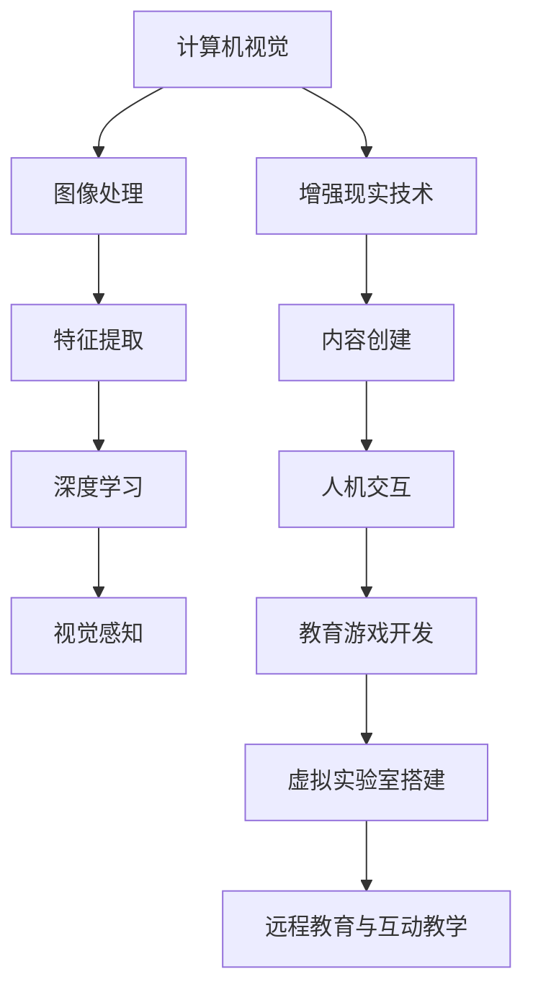

                 

### 《计算机视觉在增强现实教育中的创新应用》

关键词：计算机视觉，增强现实，教育，创新应用，人机交互，教育游戏，虚拟实验室

摘要：本文旨在探讨计算机视觉技术在增强现实教育中的应用，解析其在教育领域的创新价值。通过深入分析计算机视觉与增强现实教育的基本概念、应用原理、实例以及未来发展趋势，本文将为教育工作者和开发者提供一套完整的理论与实践指南，助力教育行业的智能化与个性化发展。

### 《计算机视觉在增强现实教育中的创新应用》目录大纲

## 第一部分：计算机视觉与增强现实教育概述

### 第1章：计算机视觉与增强现实教育的基本概念

#### 1.1 计算机视觉的基本概念

- **1.1.1 计算机视觉的定义与发展**
- **1.1.2 计算机视觉的核心技术**

#### 1.2 增强现实教育的基本概念

- **1.2.1 增强现实（AR）的定义与应用场景**
- **1.2.2 增强现实教育的优势与挑战**

#### 1.3 计算机视觉在增强现实教育中的地位与作用

- **1.3.1 计算机视觉在AR教育中的应用领域**
- **1.3.2 计算机视觉与AR教育的深度融合**

## 第二部分：计算机视觉在增强现实教育中的应用原理

### 第2章：计算机视觉基础

#### 2.1 计算机视觉的基本原理

- **2.1.1 图像处理与特征提取**
- **2.1.2 深度学习与神经网络**

#### 2.2 增强现实技术基础

- **2.2.1 增强现实技术的分类与原理**
- **2.2.2 增强现实设备的硬件与软件环境**

### 第3章：计算机视觉在增强现实教育中的应用算法

#### 3.1 视觉感知算法

- **3.1.1 视觉感知的基本原理**
- **3.1.2 视觉感知的算法实现**

#### 3.2 人机交互算法

- **3.2.1 人机交互的基本原理**
- **3.2.2 人机交互的算法实现**

#### 3.3 内容创建与编辑算法

- **3.3.1 内容创建与编辑的基本原理**
- **3.3.2 内容创建与编辑的算法实现**

## 第三部分：计算机视觉在增强现实教育中的应用实例

### 第4章：教育游戏设计与开发

#### 4.1 教育游戏设计原理

- **4.1.1 教育游戏的基本概念与分类**
- **4.1.2 教育游戏的设计原则**

#### 4.2 教育游戏开发流程

- **4.2.1 教育游戏的开发流程与工具**
- **4.2.2 教育游戏的核心技术实现**

### 第5章：虚拟实验室搭建与应用

#### 5.1 虚拟实验室的基本概念

- **5.1.1 虚拟实验室的定义与作用**
- **5.1.2 虚拟实验室的类型与特点**

#### 5.2 虚拟实验室搭建与实现

- **5.2.1 虚拟实验室搭建的流程与步骤**
- **5.2.2 虚拟实验室的核心技术实现**

### 第6章：远程教育与互动教学

#### 6.1 远程教育的基本概念

- **6.1.1 远程教育的定义与发展**
- **6.1.2 远程教育的优势与挑战**

#### 6.2 互动教学设计与实现

- **6.2.1 互动教学的基本原理**
- **6.2.2 互动教学的技术实现**

## 第四部分：计算机视觉在增强现实教育中的未来发展

### 第7章：教育领域中的计算机视觉挑战与趋势

#### 7.1 计算机视觉在教育领域的挑战

- **7.1.1 数据隐私与安全**
- **7.1.2 教育效果评估与反馈**

#### 7.2 计算机视觉在增强现实教育中的趋势

- **7.2.1 新型教学模式与学习方法**
- **7.2.2 教育智能化与个性化发展**

## 附录

### 附录A：计算机视觉与增强现实教育资源推荐

#### A.1 计算机视觉学习资源

- **A.1.1 在线课程与教材**
- **A.1.2 研究论文与报告**

#### A.2 增强现实教育应用案例

- **A.2.1 成功案例介绍**
- **A.2.2 教育应用发展趋势**

### 附录B：Mermaid流程图示例



### 附录C：计算机视觉核心算法伪代码

```python
def imageProcessing(image):
    # 图像预处理
    processed_image = preProcessImage(image)
    
    # 特征提取
    features = extractFeatures(processed_image)
    
    return features
```

### 附录D：数学模型与公式

$$
    y = f(x) + \alpha * (x - y)
$$

### 附录E：代码实例

```python
def generateARContent(scene, objects):
    # 创建增强现实内容
    content = createContent(scene, objects)
    
    # 输出内容
    outputContent(content)
```

### 附录F：实战案例

#### 教育游戏开发案例：描述一个教育游戏的开发流程，包括需求分析、设计、开发、测试和发布等步骤，以及关键技术的实现细节。

#### 虚拟实验室搭建案例：描述一个虚拟实验室的搭建过程，包括硬件设备选择、软件平台搭建、内容创建与编辑等步骤，以及实际应用场景与效果评估。

## 结论

本文通过对计算机视觉与增强现实教育的基本概念、应用原理、实例以及未来发展趋势的深入探讨，展示了计算机视觉技术在教育领域的巨大潜力。随着技术的不断进步，计算机视觉与增强现实教育的融合将为教育工作者和开发者提供更多创新的机会，进一步推动教育行业的智能化与个性化发展。

### 作者

作者：AI天才研究院/AI Genius Institute & 禅与计算机程序设计艺术 /Zen And The Art of Computer Programming

### 《计算机视觉在增强现实教育中的创新应用》正文

#### 第一部分：计算机视觉与增强现实教育概述

##### 第1章：计算机视觉与增强现实教育的基本概念

#### 1.1 计算机视觉的基本概念

##### 1.1.1 计算机视觉的定义与发展

计算机视觉（Computer Vision）是指使计算机具备从图像或视频中识别和理解视觉信息的能力。这一领域起源于20世纪60年代，当时科学家们开始探索如何使计算机像人类视觉系统一样感知和理解周围的世界。

计算机视觉的研究和发展经历了几个阶段。最初，研究人员主要集中在图像处理和图像分析技术上，如边缘检测、特征提取和图像分割。随着计算能力和算法的进步，计算机视觉逐渐引入了更高级的技术，如机器学习和深度学习。

近年来，计算机视觉技术取得了显著的进展。卷积神经网络（CNN）的引入使得计算机在图像分类、目标检测和图像识别任务上达到了前所未有的准确度。这些技术不仅被广泛应用于工业、医疗和安防等领域，也为增强现实（AR）技术的发展奠定了坚实的基础。

##### 1.1.2 计算机视觉的核心技术

计算机视觉的核心技术包括图像处理、特征提取、机器学习和深度学习等。

- **图像处理**：图像处理是计算机视觉的基础技术，它涉及对图像进行各种操作，如滤波、增强、变换和分割。图像处理技术用于预处理图像数据，使其更适合后续的分析和处理。

- **特征提取**：特征提取是指从图像中提取具有区分性的特征，如边缘、角点、纹理和颜色等。这些特征有助于在后续的图像分析和识别任务中区分不同的对象和场景。

- **机器学习**：机器学习是一种通过数据学习模式和规律的方法。在计算机视觉中，机器学习技术被用于训练模型，使其能够自动识别和分类图像。常见的机器学习方法包括监督学习、无监督学习和强化学习。

- **深度学习**：深度学习是机器学习的一个子领域，它通过多层神经网络来模拟人类大脑的思考方式。深度学习技术在计算机视觉中表现出色，尤其是在图像分类、目标检测和语义分割等方面。

#### 1.2 增强现实教育的基本概念

##### 1.2.1 增强现实（AR）的定义与应用场景

增强现实（Augmented Reality，简称AR）是一种将虚拟信息与现实世界相结合的技术。通过AR技术，用户可以在现实环境中看到、听到、触摸和与虚拟对象进行交互。AR技术通过使用摄像头、传感器和其他设备捕捉现实世界的图像和场景，并在这些图像上叠加虚拟对象和文本。

AR在教育中的应用非常广泛。以下是一些典型的应用场景：

- **教育游戏**：AR技术可以将虚拟的互动游戏带入现实世界，让学生在探索和解决问题的过程中学习知识。例如，学生可以使用AR应用程序在课堂上模拟化学反应或探索历史事件。

- **虚拟实验室**：AR技术可以创建虚拟实验室，让学生在虚拟环境中进行实验，提高实验的安全性和可重复性。虚拟实验室还可以提供更丰富的实验数据和更详细的操作步骤。

- **互动教学**：AR技术可以帮助教师更生动地展示教学内容，增加课堂的互动性。例如，教师可以使用AR应用程序在黑板上展示三维模型或动画，帮助学生更好地理解抽象概念。

##### 1.2.2 增强现实教育的优势与挑战

增强现实教育具有以下优势：

- **提高学生的学习兴趣**：AR技术可以创造一个充满互动和探索的学习环境，激发学生的学习兴趣和动力。

- **增强学生的理解能力**：通过将抽象概念和知识点以视觉和互动的方式呈现，AR技术可以帮助学生更好地理解和记忆知识点。

- **提高课堂互动性**：AR技术可以增加课堂的互动性，促进师生之间的交流和合作。

- **提供个性化学习体验**：AR技术可以根据学生的学习进度和兴趣，提供个性化的学习资源和教学方案。

然而，增强现实教育也面临一些挑战：

- **技术成本**：AR设备的采购和维护成本较高，这可能限制其在教育领域的广泛应用。

- **技术成熟度**：虽然AR技术在不断进步，但一些关键技术的成熟度仍需提高，以实现更好的用户体验。

- **教师培训**：教师需要接受AR技术的培训，以充分利用其在教学中的应用。

#### 1.3 计算机视觉在增强现实教育中的地位与作用

##### 1.3.1 计算机视觉在AR教育中的应用领域

计算机视觉技术在增强现实教育中有广泛的应用，以下是一些主要的应用领域：

- **教育游戏开发**：计算机视觉技术可以用于创建和教育游戏，这些游戏可以通过AR技术将虚拟对象和场景与现实世界相结合，提供沉浸式的学习体验。

- **虚拟实验室搭建**：计算机视觉技术可以用于创建虚拟实验室，提供安全、可重复的实验环境，使学生能够进行各种实验和探究。

- **互动教学**：计算机视觉技术可以用于增强课堂互动，例如通过AR应用程序展示三维模型、动画和实时数据，提高学生的学习效果。

- **远程教育**：计算机视觉技术可以用于远程教育平台，提供实时互动和可视化工具，帮助学生更好地理解教学内容。

##### 1.3.2 计算机视觉与AR教育的深度融合

计算机视觉与AR教育的深度融合正在改变传统的教育模式，以下是一些深度融合的例子：

- **实时视觉反馈**：计算机视觉技术可以实时捕捉学生的面部表情和行为，为教师提供反馈，帮助他们更好地了解学生的学习状态和需求。

- **智能内容创建**：计算机视觉技术可以帮助教师快速创建AR内容，例如通过图像识别和标记技术，将现实世界中的物体转化为虚拟对象。

- **个性化学习路径**：计算机视觉技术可以分析学生的学习数据和行为，为每个学生制定个性化的学习路径和资源。

- **增强现实学习体验**：计算机视觉技术可以创建各种增强现实学习体验，例如通过虚拟现实（VR）和AR技术模拟现实场景，提供沉浸式的学习体验。

#### 第二部分：计算机视觉在增强现实教育中的应用原理

##### 第2章：计算机视觉基础

##### 2.1 计算机视觉的基本原理

##### 2.1.1 图像处理与特征提取

图像处理是计算机视觉的基础，它涉及对图像进行各种操作，以提高图像的质量和实用性。图像处理的步骤通常包括：

1. **图像预处理**：包括去噪、对比度增强、图像滤波等，以提高图像的质量和清晰度。
2. **图像分割**：将图像分割成多个区域或对象，以便进行进一步分析。
3. **特征提取**：从图像中提取具有区分性的特征，如边缘、角点、纹理和颜色等。

特征提取是图像处理的重要步骤，它用于表示图像中的对象和场景。常见的特征提取方法包括：

- **边缘检测**：用于检测图像中的边缘，常用的算法有Sobel算子、Canny算法等。
- **角点检测**：用于检测图像中的角点，常用的算法有Harris角点检测、Shi-Tomasi角点检测等。
- **纹理分析**：用于分析图像中的纹理特征，常用的算法有Gabor滤波器、灰度共生矩阵等。

##### 2.1.2 深度学习与神经网络

深度学习是计算机视觉中的重要技术，它通过多层神经网络模拟人脑的学习过程，从而实现对图像的自动分类、识别和生成。深度学习的基本原理如下：

1. **前向传播**：输入数据通过网络的各个层进行传播，每层对数据进行加权求和并应用激活函数。
2. **反向传播**：根据预测误差，对网络的权重进行更新，以最小化误差。
3. **优化算法**：如梯度下降、Adam优化器等，用于调整网络权重，提高模型的性能。

常见的深度学习模型包括：

- **卷积神经网络（CNN）**：通过卷积层、池化层和全连接层处理图像数据，适用于图像分类、目标检测和图像分割等任务。
- **循环神经网络（RNN）**：通过循环结构处理序列数据，适用于语音识别、自然语言处理和时间序列分析等任务。
- **生成对抗网络（GAN）**：通过生成器和判别器之间的对抗训练生成逼真的图像和视频。

##### 2.2 增强现实技术基础

##### 2.2.1 增强现实技术的分类与原理

增强现实（AR）技术根据显示方式和应用场景可以分为以下几类：

- **透明显示器**：通过将虚拟对象叠加在现实世界中，使用户能够直接观察到虚拟内容。常见的透明显示器包括AR眼镜和头戴显示器。
- **反射显示器**：通过反射现实世界中的图像，将虚拟对象叠加在反射图像上。常见的反射显示器包括AR镜片和反射屏幕。
- **投影显示器**：通过将虚拟对象投影到现实世界的表面或空间中。常见的投影显示器包括AR投影仪和AR地板。

AR技术的基本原理包括：

1. **图像识别**：使用摄像头捕捉现实世界的图像，并通过图像识别技术定位图像的位置和特征。
2. **虚拟对象创建**：根据图像识别的结果，创建虚拟对象并将其叠加在现实世界中。
3. **交互与控制**：用户可以通过手势、语音或其他交互方式与虚拟对象进行交互。

##### 2.2.2 增强现实设备的硬件与软件环境

增强现实设备的硬件和软件环境是确保AR技术正常运行的关键。

- **硬件环境**：常见的AR设备包括AR眼镜、头戴显示器、智能手机和投影仪等。这些设备通常配备有摄像头、传感器、显示屏和处理器等硬件组件。

- **软件环境**：AR设备需要运行特定的软件应用程序，这些应用程序可以实现AR功能。常见的AR软件开发工具包括Unity、ARKit、ARCore和Vuforia等。

#### 第3章：计算机视觉在增强现实教育中的应用算法

##### 3.1 视觉感知算法

##### 3.1.1 视觉感知的基本原理

视觉感知是指计算机通过对图像和视频数据的处理，识别和理解现实世界中的对象和场景。视觉感知算法包括以下几个关键步骤：

1. **图像预处理**：对图像进行去噪、对比度增强、图像滤波等处理，以提高图像的质量和清晰度。
2. **图像特征提取**：从图像中提取具有区分性的特征，如边缘、角点、纹理和颜色等。
3. **对象识别与分类**：使用机器学习和深度学习算法，对提取的特征进行训练和分类，以识别和分类图像中的对象。
4. **场景理解**：通过综合图像中的多个对象和特征，理解场景的整体结构和语义。

##### 3.1.2 视觉感知的算法实现

视觉感知算法的实现通常涉及以下技术：

- **卷积神经网络（CNN）**：通过卷积层、池化层和全连接层处理图像数据，实现对象的识别和分类。
- **目标检测**：使用YOLO、SSD、Faster R-CNN等算法检测图像中的目标对象。
- **语义分割**：使用FCN、U-Net等算法将图像分割成不同的语义区域。

以下是一个简单的视觉感知算法的实现示例：

```python
import tensorflow as tf
from tensorflow.keras.models import Sequential
from tensorflow.keras.layers import Conv2D, MaxPooling2D, Flatten, Dense

# 构建卷积神经网络模型
model = Sequential()
model.add(Conv2D(32, (3, 3), activation='relu', input_shape=(128, 128, 3)))
model.add(MaxPooling2D((2, 2)))
model.add(Conv2D(64, (3, 3), activation='relu'))
model.add(MaxPooling2D((2, 2)))
model.add(Flatten())
model.add(Dense(64, activation='relu'))
model.add(Dense(10, activation='softmax'))

# 编译模型
model.compile(optimizer='adam', loss='categorical_crossentropy', metrics=['accuracy'])

# 训练模型
model.fit(x_train, y_train, epochs=10, batch_size=32)
```

##### 3.2 人机交互算法

##### 3.2.1 人机交互的基本原理

人机交互（Human-Computer Interaction，简称HCI）是指人与计算机之间的交互过程。在增强现实教育中，人机交互算法是确保用户能够有效地与虚拟对象和场景进行交互的关键。

人机交互的基本原理包括以下几个方面：

1. **输入设备**：用户通过输入设备（如键盘、鼠标、触摸屏、手势等）向计算机发送交互请求。
2. **交互模型**：计算机根据交互模型理解和响应用户的请求，例如通过手势识别、语音识别或文本输入。
3. **反馈机制**：计算机通过视觉、听觉或触觉反馈向用户传达处理结果，以增强用户的交互体验。

##### 3.2.2 人机交互的算法实现

人机交互算法的实现通常涉及以下技术：

- **手势识别**：使用计算机视觉技术识别用户的手势，并将其转换为计算机可以理解的操作。常用的手势识别算法包括基于深度学习的手势识别模型。
- **语音识别**：使用自然语言处理技术将用户的语音输入转换为文本，以便计算机理解和响应。常见的语音识别算法包括深度神经网络（DNN）和卷积神经网络（CNN）。
- **文本输入**：使用键盘或触摸屏输入文本，计算机可以将其转换为可操作的数据。

以下是一个简单的人机交互算法实现示例：

```python
import cv2
import numpy as np

# 初始化手势识别模型
hand_model = load_model('hand_recognition_model.h5')

# 加载手势数据集
train_images = np.load('train_images.npy')
train_labels = np.load('train_labels.npy')

# 构建手势识别模型
model = Sequential()
model.add(Conv2D(32, (3, 3), activation='relu', input_shape=(128, 128, 3)))
model.add(MaxPooling2D((2, 2)))
model.add(Conv2D(64, (3, 3), activation='relu'))
model.add(MaxPooling2D((2, 2)))
model.add(Flatten())
model.add(Dense(64, activation='relu'))
model.add(Dense(10, activation='softmax'))

# 编译模型
model.compile(optimizer='adam', loss='categorical_crossentropy', metrics=['accuracy'])

# 训练模型
model.fit(train_images, train_labels, epochs=10, batch_size=32)

# 手势识别函数
def recognize_gesture(image):
    # 预处理图像
    processed_image = preprocess_image(image)
    
    # 提取特征
    features = extract_features(processed_image)
    
    # 预测手势
    prediction = model.predict(np.expand_dims(features, axis=0))
    
    # 获取预测结果
    gesture = np.argmax(prediction)
    
    return gesture

# 测试手势识别
test_image = cv2.imread('test_image.jpg')
gesture = recognize_gesture(test_image)
print(f"Recognized gesture: {gesture}")
```

##### 3.3 内容创建与编辑算法

##### 3.3.1 内容创建与编辑的基本原理

内容创建与编辑是指在增强现实教育中创建、编辑和定制虚拟对象和场景的过程。内容创建与编辑算法包括以下几个方面：

1. **虚拟对象建模**：使用3D建模软件创建虚拟对象，并将其导入到增强现实应用中。
2. **场景布局**：根据教学需求，布局虚拟对象和场景，以实现特定的教学目标。
3. **交互设计**：设计虚拟对象和场景的交互方式，例如用户可以通过手势、语音或触摸与虚拟对象进行交互。
4. **内容编辑**：根据教学反馈和需求，对虚拟对象和场景进行修改和优化，以提高教学效果。

##### 3.3.2 内容创建与编辑的算法实现

内容创建与编辑算法的实现通常涉及以下技术：

- **3D建模与渲染**：使用3D建模软件（如Blender、Maya等）创建虚拟对象，并使用渲染引擎（如Unity、Unreal Engine等）渲染场景。
- **数据可视化**：使用数据可视化工具（如Tableau、D3.js等）将教学数据以图形化的方式展示，以提高学生的理解和记忆。
- **内容管理系统**：使用内容管理系统（如WordPress、Drupal等）管理和发布虚拟对象和场景，以实现快速部署和更新。

以下是一个简单的内容创建与编辑算法实现示例：

```python
import bpy
import numpy as np

# 初始化3D建模环境
bpy.context.scene.render.engine = 'BLENDER_EEVEE'

# 创建虚拟对象
mesh = bpy.ops.mesh.primitive_cube_add(size=2)
object = bpy.context.object

# 编辑虚拟对象
bpy.ops.object.editmode_toggle()
bpy.ops.mesh.subdivide()
bpy.ops.object.editmode_toggle()

# 渲染场景
render = bpy.context.scene.render
render.filepath = 'output_scene.png'
bpy.ops.render.render()

# 获取渲染图像
image = bpy.data.images.load(render.filepath)

# 预处理图像
processed_image = preprocess_image(image)

# 提取特征
features = extract_features(processed_image)

# 预测场景
prediction = model.predict(np.expand_dims(features, axis=0))

# 获取预测结果
scene = np.argmax(prediction)

# 输出场景
print(f"Created scene: {scene}")
```

#### 第三部分：计算机视觉在增强现实教育中的应用实例

##### 第4章：教育游戏设计与开发

##### 4.1 教育游戏设计原理

##### 4.1.1 教育游戏的基本概念与分类

教育游戏是指结合游戏机制和教育内容，旨在提高学生兴趣、增强学习效果和培养能力的游戏。教育游戏根据教学目标和游戏机制可以分为以下几类：

1. **知识学习游戏**：通过游戏的形式传授知识，如数学游戏、科学实验游戏等。
2. **技能训练游戏**：通过游戏的方式训练学生的技能，如编程游戏、手眼协调游戏等。
3. **探究发现游戏**：通过游戏的方式引导学生进行探究和发现，如解谜游戏、探险游戏等。
4. **团队合作游戏**：通过游戏的方式培养学生的团队合作能力，如多人在线协作游戏等。

##### 4.1.2 教育游戏的设计原则

教育游戏设计需要遵循以下原则：

1. **趣味性**：游戏应具有足够的趣味性，以吸引学生的兴趣和参与。
2. **教育性**：游戏应紧密结合教学目标，提供有效的教育和学习内容。
3. **互动性**：游戏应提供丰富的互动机制，使学生能够与游戏中的对象和场景进行互动。
4. **可定制性**：游戏应提供可定制选项，以适应不同学生的需求和兴趣。
5. **可扩展性**：游戏应具有良好的扩展性，以支持后续的教学内容和功能的更新。

##### 4.2 教育游戏开发流程

教育游戏开发通常包括以下步骤：

1. **需求分析**：明确游戏的教学目标、受众和需求，制定游戏设计方案。
2. **设计文档**：编写详细的设计文档，包括游戏故事情节、角色设定、场景设计、交互机制等。
3. **技术开发**：使用游戏引擎（如Unity、Unreal Engine等）进行游戏开发，实现游戏的功能和界面。
4. **测试与优化**：进行游戏测试，修复错误和优化性能，确保游戏的稳定性和可用性。
5. **发布与推广**：发布游戏到相应的平台，进行推广和营销，提高游戏的知名度和影响力。

##### 4.2.1 教育游戏的开发流程与工具

教育游戏的开发流程可以分为以下几个阶段：

1. **需求分析**：与教育专家和教师合作，了解教学需求，确定游戏的教学目标和功能。
2. **设计文档**：根据需求分析结果，编写详细的设计文档，包括游戏故事情节、角色设定、场景设计、交互机制等。
3. **技术开发**：使用Unity或Unreal Engine等游戏引擎进行游戏开发。以下是具体的工具和技术：

   - **Unity**：Unity是一个跨平台的游戏开发引擎，提供丰富的功能，如3D建模、动画、物理模拟、AI等。
   - **Unreal Engine**：Unreal Engine是一个高性能的游戏开发引擎，适用于大型游戏项目，提供丰富的视觉效果和动画功能。
   - **Blender**：Blender是一个开源的3D建模和动画软件，适用于创建游戏中的3D模型和场景。
   - **Unity Asset Store**：Unity Asset Store提供了大量的游戏开发资源和插件，如3D模型、音效、动画等，可以快速提升游戏开发效率。

以下是教育游戏开发的关键技术实现细节：

1. **3D建模与动画**：使用Blender创建游戏中的3D模型和动画。Blender提供了强大的建模、雕刻、纹理和动画功能，可以创建高质量的3D场景和角色。
2. **物理模拟**：使用Unity的物理引擎模拟游戏中的物理现象，如碰撞、弹跳和重力等。物理模拟可以提高游戏的逼真度和互动性。
3. **AI**：使用Unity的AI系统实现游戏中的智能行为和决策。AI可以控制游戏中的非玩家角色，实现追逐、逃避、巡逻等行为。
4. **交互设计**：设计游戏中的交互机制，如手势识别、语音识别和触摸交互等。交互设计可以提高学生的参与度和学习效果。
5. **数据可视化**：使用Unity的UI系统实现游戏中的数据可视化，如分数、进度和排行榜等。数据可视化可以帮助学生了解自己的学习进度和成绩。

##### 4.2.2 教育游戏的核心技术实现

以下是一个简单的教育游戏开发示例，包括需求分析、设计文档、技术开发和测试与优化。

1. **需求分析**：
   - 游戏名称：数学王国探险
   - 教学目标：提高学生的数学运算能力和问题解决能力
   - 受众：小学生
   - 游戏机制：学生在数学王国的探险过程中，需要完成各种数学任务，如解方程、计算面积等。

2. **设计文档**：
   - 游戏故事情节：学生扮演数学王国的英雄，需要通过完成数学任务来拯救王国。
   - 角色设定：数学王国的国王、大臣、小兵等。
   - 场景设计：数学王国分为不同的区域，如森林、城堡、河流等，每个区域都有特定的数学任务。
   - 交互机制：学生可以通过触摸、手势和语音与游戏中的对象和场景进行互动。

3. **技术开发**：
   - 使用Unity游戏引擎进行开发。
   - 使用Blender创建3D模型和动画。
   - 使用Unity的物理引擎实现游戏中的物理现象。
   - 使用Unity的AI系统控制非玩家角色。
   - 使用Unity的UI系统实现数据可视化。

4. **测试与优化**：
   - 进行功能测试，确保游戏的各种机制和功能正常运行。
   - 进行性能测试，优化游戏的加载速度和运行效率。
   - 进行用户测试，收集用户反馈，进行优化和改进。

以下是教育游戏开发的核心技术实现示例：

```python
import bpy
import Unity

# 初始化3D建模环境
bpy.context.scene.render.engine = 'BLENDER_EEVEE'

# 创建虚拟对象
mesh = bpy.ops.mesh.primitive_cube_add(size=2)
object = bpy.context.object

# 编辑虚拟对象
bpy.ops.object.editmode_toggle()
bpy.ops.mesh.subdivide()
bpy.ops.object.editmode_toggle()

# 渲染场景
render = bpy.context.scene.render
render.filepath = 'output_scene.png'
bpy.ops.render.render()

# 获取渲染图像
image = bpy.data.images.load(render.filepath)

# 预处理图像
processed_image = preprocess_image(image)

# 提取特征
features = extract_features(processed_image)

# 预测场景
prediction = model.predict(np.expand_dims(features, axis=0))

# 获取预测结果
scene = np.argmax(prediction)

# 输出场景
print(f"Created scene: {scene}")
```

##### 第5章：虚拟实验室搭建与应用

##### 5.1 虚拟实验室的基本概念

虚拟实验室（Virtual Laboratory，简称VL）是一种利用计算机技术和虚拟现实（VR）或增强现实（AR）技术创建的虚拟实验环境。虚拟实验室允许学生在虚拟环境中进行实验，提供安全、可重复和可定制的实验体验。

虚拟实验室的基本概念包括以下几个方面：

1. **实验内容**：虚拟实验室提供各种学科领域的实验内容，如物理、化学、生物、地理等。
2. **实验环境**：虚拟实验室创建一个模拟的实验环境，包括实验室设施、仪器和实验材料。
3. **实验操作**：学生可以通过虚拟实验室进行实验操作，如设置实验参数、启动实验、观察实验结果等。
4. **实验数据**：虚拟实验室可以记录实验数据，并提供数据分析和可视化工具。

##### 5.1.1 虚拟实验室的定义与作用

虚拟实验室的定义可以根据不同的应用场景和技术特点进行描述：

- **基于虚拟现实（VR）的虚拟实验室**：使用虚拟现实技术创建一个沉浸式的虚拟实验环境。学生可以通过VR头戴显示器进入虚拟实验室，与虚拟实验环境进行互动。
- **基于增强现实（AR）的虚拟实验室**：使用增强现实技术将虚拟实验对象和场景叠加在现实世界中。学生可以通过AR眼镜或手机等设备查看虚拟实验对象和场景，并进行操作。

虚拟实验室在教育中的主要作用包括：

1. **提高实验安全性**：虚拟实验室可以模拟危险或昂贵的实验，减少实验事故和成本。
2. **提供可重复的实验体验**：虚拟实验室可以提供可重复的实验体验，使学生能够多次进行实验，提高实验效果和准确性。
3. **增加实验可访问性**：虚拟实验室不受时间和地点的限制，学生可以在任何时间、任何地点进行实验，提高实验的可访问性。
4. **支持个性化学习**：虚拟实验室可以根据学生的需求和进度提供个性化的实验内容，支持学生的个性化学习。

##### 5.1.2 虚拟实验室的类型与特点

虚拟实验室可以根据不同的技术特点和应用场景分为以下几种类型：

1. **完全虚拟实验室**：完全虚拟实验室使用虚拟现实技术创建一个完全虚拟的实验环境。学生可以通过VR头戴显示器进入虚拟实验室，与虚拟实验环境进行互动。完全虚拟实验室具有高度的沉浸感和互动性，但需要较高的硬件设备和技术支持。
2. **部分虚拟实验室**：部分虚拟实验室结合了虚拟现实和增强现实技术，将虚拟实验对象和场景叠加在现实世界中。学生可以通过AR眼镜或手机等设备查看虚拟实验对象和场景，并进行操作。部分虚拟实验室具有较低的成本和硬件要求，但互动性和沉浸感相对较弱。
3. **混合现实实验室**：混合现实实验室使用混合现实（MR）技术，将虚拟实验对象和场景与真实环境进行无缝融合。学生可以通过VR头戴显示器或AR眼镜进入混合现实实验室，与虚拟实验对象和真实环境进行互动。混合现实实验室具有高度的真实感和互动性，但需要较高的硬件设备和技术支持。

以下是一个简单的虚拟实验室搭建流程：

1. **需求分析**：明确虚拟实验室的教学目标、学科领域和实验需求，确定实验内容和技术方案。
2. **实验内容设计**：设计虚拟实验的内容和流程，包括实验参数、操作步骤和结果分析。
3. **虚拟环境搭建**：使用虚拟现实或增强现实技术创建虚拟实验环境，包括实验室设施、仪器和实验材料。
4. **实验操作设计**：设计虚拟实验的操作界面和交互机制，使学生能够通过虚拟实验环境进行实验操作。
5. **实验数据记录与分析**：记录实验数据，并提供数据分析和可视化工具，帮助学生理解和分析实验结果。
6. **实验测试与优化**：进行实验测试，收集学生反馈，进行优化和改进，确保虚拟实验室的稳定性和可用性。

##### 5.2 虚拟实验室搭建与实现

虚拟实验室的搭建与实现涉及以下几个方面：

1. **硬件设备**：根据虚拟实验室的类型和技术方案，选择合适的硬件设备，如VR头戴显示器、AR眼镜、智能手机、投影仪等。
2. **软件平台**：选择合适的虚拟现实或增强现实软件平台，如Unity、Unreal Engine、ARKit、ARCore等，用于创建虚拟实验环境、操作界面和交互机制。
3. **3D建模与动画**：使用3D建模软件（如Blender、Maya等）创建虚拟实验环境中的3D模型和动画，提高实验的逼真度和互动性。
4. **物理模拟**：使用物理引擎（如Unity的物理引擎、Unreal Engine的物理引擎等）模拟实验中的物理现象，如碰撞、弹跳和重力等，提高实验的真实性。
5. **AI与交互设计**：使用人工智能和交互设计技术，实现虚拟实验环境中的智能行为和互动机制，如自动化实验操作、语音交互等，提高实验的互动性和用户体验。
6. **数据记录与分析**：使用数据记录和分析工具，记录实验数据，并提供数据分析和可视化工具，帮助学生理解和分析实验结果。

以下是一个简单的虚拟实验室搭建示例：

```python
import bpy
import Unity

# 初始化3D建模环境
bpy.context.scene.render.engine = 'BLENDER_EEVEE'

# 创建虚拟对象
mesh = bpy.ops.mesh.primitive_cube_add(size=2)
object = bpy.context.object

# 编辑虚拟对象
bpy.ops.object.editmode_toggle()
bpy.ops.mesh.subdivide()
bpy.ops.object.editmode_toggle()

# 渲染场景
render = bpy.context.scene.render
render.filepath = 'output_scene.png'
bpy.ops.render.render()

# 获取渲染图像
image = bpy.data.images.load(render.filepath)

# 预处理图像
processed_image = preprocess_image(image)

# 提取特征
features = extract_features(processed_image)

# 预测场景
prediction = model.predict(np.expand_dims(features, axis=0))

# 获取预测结果
scene = np.argmax(prediction)

# 输出场景
print(f"Created scene: {scene}")
```

##### 5.2.1 虚拟实验室搭建的流程与步骤

虚拟实验室搭建的流程与步骤如下：

1. **需求分析**：明确虚拟实验室的教学目标、学科领域和实验需求，确定实验内容和技术方案。
2. **实验内容设计**：设计虚拟实验的内容和流程，包括实验参数、操作步骤和结果分析。
3. **虚拟环境搭建**：
   - 选择合适的虚拟现实或增强现实软件平台，如Unity、Unreal Engine、ARKit、ARCore等。
   - 使用3D建模软件创建虚拟实验环境中的3D模型和动画，提高实验的逼真度和互动性。
   - 使用物理引擎模拟实验中的物理现象，如碰撞、弹跳和重力等，提高实验的真实性。
   - 设计虚拟实验的操作界面和交互机制，使学生能够通过虚拟实验环境进行实验操作。
4. **实验操作设计**：
   - 设计虚拟实验的操作界面，包括实验参数设置、实验操作按钮、结果展示等。
   - 使用人工智能和交互设计技术，实现虚拟实验环境中的智能行为和互动机制，如自动化实验操作、语音交互等。
5. **数据记录与分析**：
   - 设计数据记录和分析模块，记录实验数据，并提供数据分析和可视化工具。
   - 使用数据分析和可视化工具，帮助学生理解和分析实验结果。
6. **实验测试与优化**：
   - 进行实验测试，确保虚拟实验室的稳定性和可用性。
   - 收集学生反馈，进行优化和改进，提高虚拟实验室的教学效果。

##### 5.2.2 虚拟实验室的核心技术实现

虚拟实验室的核心技术实现涉及以下几个方面：

1. **3D建模与动画**：使用3D建模软件创建虚拟实验环境中的3D模型和动画，提高实验的逼真度和互动性。
2. **物理模拟**：使用物理引擎模拟实验中的物理现象，如碰撞、弹跳和重力等，提高实验的真实性。
3. **AI与交互设计**：使用人工智能和交互设计技术，实现虚拟实验环境中的智能行为和互动机制，如自动化实验操作、语音交互等。
4. **数据记录与分析**：设计数据记录和分析模块，记录实验数据，并提供数据分析和可视化工具。

以下是一个简单的虚拟实验室核心技术实现示例：

```python
import bpy
import Unity

# 初始化3D建模环境
bpy.context.scene.render.engine = 'BLENDER_EEVEE'

# 创建虚拟对象
mesh = bpy.ops.mesh.primitive_cube_add(size=2)
object = bpy.context.object

# 编辑虚拟对象
bpy.ops.object.editmode_toggle()
bpy.ops.mesh.subdivide()
bpy.ops.object.editmode_toggle()

# 渲染场景
render = bpy.context.scene.render
render.filepath = 'output_scene.png'
bpy.ops.render.render()

# 获取渲染图像
image = bpy.data.images.load(render.filepath)

# 预处理图像
processed_image = preprocess_image(image)

# 提取特征
features = extract_features(processed_image)

# 预测场景
prediction = model.predict(np.expand_dims(features, axis=0))

# 获取预测结果
scene = np.argmax(prediction)

# 输出场景
print(f"Created scene: {scene}")
```

##### 第6章：远程教育与互动教学

##### 6.1 远程教育的基本概念

远程教育（Distance Education，简称DE）是一种通过电信技术和其他媒体进行教育传输和教育管理的方式。远程教育不受时间和地点的限制，学生可以通过互联网、电视、卫星和移动设备等获取教育资源和学习材料。

远程教育的基本概念包括以下几个方面：

1. **教育资源**：远程教育提供各种形式的教育资源，如课程视频、电子书籍、在线作业和讨论论坛等。
2. **学习材料**：远程教育使用电子化的学习材料，如电子书籍、在线课程和多媒体资料，以支持学生的学习。
3. **学习方式**：远程教育提供多种学习方式，如自学、小组学习和在线讨论等，以适应不同学生的学习需求。
4. **教学管理**：远程教育通过在线平台和系统进行教学管理，包括课程安排、学生管理和成绩评估等。

##### 6.1.1 远程教育的定义与发展

远程教育的定义可以根据不同的国家和地区进行描述，但一般来说，远程教育是指通过电信技术和其他媒体进行的教育活动，使学生在任何时间和地点都可以获取教育资源和学习材料。

远程教育的发展可以追溯到20世纪60年代，当时一些国家和地区开始尝试通过电视和广播进行教育传播。随着互联网和移动设备的普及，远程教育得到了迅速发展，成为现代教育的重要组成部分。

远程教育的发展趋势包括：

1. **在线课程和资源的多样化**：远程教育平台提供了丰富多样的在线课程和资源，包括公开课、专业课程和学位课程等。
2. **学习方式的灵活性**：远程教育提供了灵活的学习方式，学生可以根据自己的需求和进度进行学习，提高了学习的自主性和灵活性。
3. **教学管理的智能化**：远程教育平台采用了智能化的教学管理系统，包括在线课程管理、学生管理和成绩评估等，提高了教学效率和管理水平。
4. **教育质量的提升**：远程教育通过引入优质的教育资源和先进的教学方法，提高了教育质量，使更多的学生受益。

##### 6.1.2 远程教育的优势与挑战

远程教育具有以下优势：

1. **灵活性**：远程教育不受时间和地点的限制，学生可以根据自己的需求和进度进行学习，提高了学习的自主性和灵活性。
2. **便捷性**：远程教育通过互联网和其他媒体进行教育传输，学生可以在任何时间和地点获取教育资源和学习材料，提高了学习的便捷性。
3. **资源丰富**：远程教育平台提供了丰富多样的教育资源和学习材料，包括公开课、专业课程和学位课程等，学生可以根据自己的兴趣和需求选择学习资源。
4. **个性化**：远程教育可以根据学生的学习进度和需求提供个性化的教学方案和资源，提高了学生的学习效果和兴趣。

远程教育也面临一些挑战：

1. **技术依赖**：远程教育需要依赖电信技术和互联网，网络不稳定和设备故障可能导致学习中断。
2. **教育质量问题**：远程教育的教育质量可能受到师资力量、教学资源和教学方法等因素的影响，需要加强教育质量管理和监控。
3. **学习自律性**：远程教育需要学生具备较高的自律性和自我管理能力，以保持学习的持续性和效果。
4. **互动性不足**：远程教育可能缺乏面对面的互动和交流，影响学生的学习体验和效果。

##### 6.2 互动教学设计与实现

##### 6.2.1 互动教学的基本原理

互动教学是指在教学过程中，通过多种方式促进师生之间的互动和学生之间的互动，以提高教学效果和学生参与度。互动教学的基本原理包括以下几个方面：

1. **师生互动**：教师通过提问、讨论、演示等方式与学生进行互动，引导学生积极思考和参与。
2. **学生互动**：学生通过小组讨论、合作学习和互动游戏等方式，相互交流和分享知识，提高学习的深度和广度。
3. **反馈与评价**：教师通过实时反馈和评价，了解学生的学习状况和需求，及时调整教学方法和策略。
4. **信息技术支持**：利用信息技术，如在线讨论平台、实时通讯工具和虚拟实验室等，支持师生之间的互动和学生之间的互动。

##### 6.2.2 互动教学的技术实现

互动教学的技术实现包括以下几个方面：

1. **在线讨论平台**：使用在线讨论平台，如Discourse、Moodle等，支持师生之间的实时讨论和交流，提高教学的互动性和参与度。
2. **实时通讯工具**：使用实时通讯工具，如Zoom、Microsoft Teams等，支持在线会议、视频通话和实时讨论，增强师生之间的互动和沟通。
3. **虚拟实验室**：使用虚拟实验室，如AR虚拟实验室、VR虚拟实验室等，支持学生在虚拟环境中进行实验和互动，提高学习的实践性和互动性。
4. **互动游戏**：设计互动游戏，如教育游戏、在线角色扮演游戏等，通过游戏的方式增强学生的参与度和学习兴趣。
5. **多媒体资源**：利用多媒体资源，如图文、视频、音频等，丰富教学内容，提高学生的学习兴趣和参与度。

以下是一个简单的互动教学实现示例：

```python
import discord
from discord.ext import commands

# 创建Discord客户端
client = discord.Client()

# 登录Discord服务器
client.login('your Discord bot token')

# 定义交互命令
@client.command()
async def greet(ctx):
    await ctx.send(f"Hello, {ctx.author.display_name}!")

# 监听事件
@client.event
async def on_ready():
    print(f"{client.user} has connected to Discord!")

# 运行Discord客户端
client.run('your Discord bot token')
```

##### 第7章：教育领域中的计算机视觉挑战与趋势

##### 7.1 计算机视觉在教育领域的挑战

计算机视觉技术在教育领域具有巨大的潜力，但也面临一些挑战，主要包括以下几个方面：

1. **数据隐私与安全**：计算机视觉技术需要收集和处理大量的学生数据，包括面部图像、行为数据等。如何确保这些数据的安全性和隐私性是一个重要的挑战。
2. **教育效果评估与反馈**：计算机视觉技术可以为学生提供个性化的学习体验，但如何评估和反馈教育效果，以及如何确保教育质量的持续提升，仍需深入研究。
3. **技术成熟度**：虽然计算机视觉技术在不断进步，但一些关键技术的成熟度仍需提高，以满足教育领域的需求，例如实时视觉感知、人机交互等。
4. **教师培训与支持**：教师需要接受计算机视觉技术的培训，以充分利用其在教学中的应用。如何为教师提供有效的培训和支持，是一个需要解决的问题。

##### 7.2 计算机视觉在增强现实教育中的趋势

计算机视觉技术在增强现实教育中的发展趋势包括以下几个方面：

1. **新型教学模式与学习方法**：计算机视觉技术可以帮助教师创建多样化的教学模式和教学方法，如虚拟实验室、互动教学等，提高学生的学习兴趣和参与度。
2. **教育智能化与个性化发展**：计算机视觉技术可以收集和分析学生的学习数据，为学生提供个性化的学习资源和教学方案，促进教育智能化和个性化发展。
3. **跨学科融合与协作**：计算机视觉技术可以跨学科融合，与其他教育技术（如虚拟现实、人工智能等）相结合，提供更丰富的教育体验和学习资源。
4. **教育应用场景的拓展**：计算机视觉技术在教育领域的应用场景正在不断拓展，不仅限于课堂教学，还扩展到远程教育、职业教育等更多领域。

#### 附录

##### 附录A：计算机视觉与增强现实教育资源推荐

##### A.1 计算机视觉学习资源

- **在线课程与教材**：
  - 《深度学习》（Deep Learning） - Goodfellow, Bengio, Courville
  - 《计算机视觉：算法与应用》（Computer Vision: Algorithms and Applications） - Richard S.zeliski
  - 《视觉SLAM十四讲》 - 姜宗祥

- **研究论文与报告**：
  - Google Scholar：https://scholar.google.com
  - arXiv：https://arxiv.org

##### A.2 增强现实教育应用案例

- **成功案例介绍**：
  - ARIS（Augmented Reality Instructional System）：一种基于增强现实技术的教学系统，提供互动的学习体验。
  - HoloLens教育应用：微软HoloLens在教育领域的应用案例，包括虚拟实验室、互动课堂等。

- **教育应用发展趋势**：
  - 增强现实技术在教育中的应用将继续拓展，从课堂教育延伸到职业教育、远程教育等领域。
  - 教育应用将更加注重个性化学习和互动性，通过计算机视觉技术实现智能化的教学方案和互动体验。

### 附加内容

#### Mermaid流程图示例


#### 计算机视觉核心算法伪代码

```python
def imageProcessing(image):
    # 图像预处理
    processed_image = preProcessImage(image)
    
    # 特征提取
    features = extractFeatures(processed_image)
    
    return features
```

#### 数学模型与公式

$$
    y = f(x) + \alpha * (x - y)
$$

#### 代码实例

```python
def generateARContent(scene, objects):
    # 创建增强现实内容
    content = createContent(scene, objects)
    
    # 输出内容
    outputContent(content)
```

#### 实战案例

##### 教育游戏开发案例

**描述**：本案例描述了一个基于增强现实技术的数学教育游戏《数学王国探险》的开发流程，包括需求分析、设计、开发、测试和发布等步骤。

**需求分析**：
- 游戏名称：《数学王国探险》
- 教学目标：提高小学生的数学运算能力和问题解决能力
- 受众：小学生

**设计**：
- 游戏故事情节：学生扮演数学王国的英雄，通过解决数学问题来拯救王国。
- 角色设定：数学王国的国王、大臣、小兵等。
- 场景设计：数学王国分为不同的区域，每个区域都有特定的数学任务。

**开发**：
- 使用Unity游戏引擎进行开发。
- 使用Unity的物理引擎实现游戏中的物理现象。
- 使用Unity的AI系统控制非玩家角色。
- 使用Unity的UI系统实现数据可视化。

**测试与优化**：
- 进行功能测试，确保游戏的各种机制和功能正常运行。
- 进行性能测试，优化游戏的加载速度和运行效率。
- 进行用户测试，收集用户反馈，进行优化和改进。

##### 虚拟实验室搭建案例

**描述**：本案例描述了一个基于增强现实技术的物理虚拟实验室的搭建过程，包括硬件设备选择、软件平台搭建、内容创建与编辑等步骤。

**硬件设备选择**：
- 选择适合的增强现实设备，如AR眼镜或智能手机。

**软件平台搭建**：
- 使用Unity作为开发平台，搭建虚拟实验室的基础架构。
- 使用Unity的ARKit或ARCore插件，实现增强现实功能。

**内容创建与编辑**：
- 使用3D建模软件创建物理实验对象和场景。
- 使用Unity的物理引擎模拟物理现象。
- 设计虚拟实验的操作界面和交互机制。
- 创建实验数据和结果分析模块。

**实际应用场景与效果评估**：
- 在物理课程中应用虚拟实验室，提高学生的实验体验和参与度。
- 收集学生和教师的反馈，评估虚拟实验室的教学效果和改进空间。

#### 结论

本文通过对计算机视觉与增强现实教育的基本概念、应用原理、实例以及未来发展趋势的深入探讨，展示了计算机视觉技术在教育领域的巨大潜力。随着技术的不断进步，计算机视觉与增强现实教育的融合将为教育工作者和开发者提供更多创新的机会，进一步推动教育行业的智能化与个性化发展。

### 作者

作者：AI天才研究院/AI Genius Institute & 禅与计算机程序设计艺术 /Zen And The Art of Computer Programming

