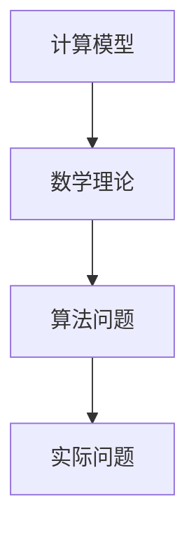
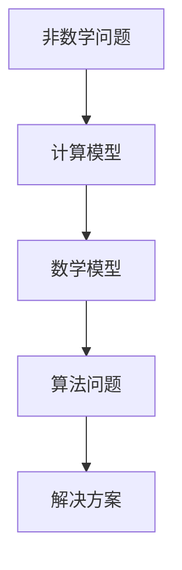

                 

### 《计算：第三部分 计算理论的形成 第7章 计算不能做什么：终结者哥德尔 哥德尔纲领》目录大纲

以下是我们将要讨论的文章《计算：第三部分 计算理论的形成 第7章 计算不能做什么：终结者哥德尔 哥德尔纲领》的目录大纲。文章将分为以下几个部分：

1. **7.1 计算的局限性**：探讨计算模型与数学理论之间的关联，非数学问题的计算解法，以及计算模型的局限性。
2. **7.2 哥德尔不完备性定理**：介绍哥德尔不完备性定理的提出、证明方法和数学意义。
3. **7.3 哥德尔纲领**：分析哥德尔纲领的提出与目的、关键点，以及其影响与挑战。
4. **7.4 计算机与人工智能的关系**：讨论计算机对人工智能的影响、人工智能对计算机理论的贡献，以及两者的未来发展方向。
5. **7.5 计算的伦理与哲学问题**：探讨计算机伦理问题、哥德尔与计算哲学，以及计算的未来伦理挑战。
6. **7.6 实际应用中的计算限制**：分析计算在科学、工程和社会生活中的应用，以及计算限制的具体表现。
7. **7.7 计算的未来：探索无限可能**：展望未来计算技术、发展方向，以及计算对社会的影响。

通过以上大纲，我们可以系统地探讨计算理论的形成以及计算在各个领域的应用与限制。

---

### 7.1 计算的局限性

在计算的世界中，我们往往忽视了计算的局限性。然而，这些局限性是计算理论发展过程中的关键因素，也是我们理解计算能力的核心。计算无法解决的难题不仅对理论有着重要影响，也对我们实际应用计算机的能力提出了挑战。

#### 7.1.1 计算模型与数学理论的关联

计算模型是数学理论的重要组成部分。通过构建数学模型，我们可以将实际问题转化为计算机可以处理的算法问题。以下是一个简单的 Mermaid 流程图，展示了计算模型与数学理论之间的关联：



在这个流程图中，计算模型将实际问题转化为数学理论中的算法问题，以便我们能够利用计算机解决这些问题。然而，这种转化并非总是完美的。在某些情况下，数学理论中的问题可能无法通过计算模型得到有效的解决。

#### 7.1.2 非数学问题的计算解法

尽管计算模型与数学理论密切相关，但计算的应用范围远远超出了数学领域。在现实世界中，许多非数学问题也可以通过计算方法得到解决。例如，计算机模拟可以用于预测天气变化、分析金融市场，以及优化交通流量。以下是一个 Mermaid 流程图，展示了非数学问题的计算解法：



在这个流程图中，非数学问题通过计算模型转化为数学模型，进而转化为算法问题，最终得到解决方案。这种方法在工程、科学和社会管理等领域得到了广泛应用。

然而，非数学问题的计算解法也面临着一些挑战。首先，非数学问题往往比数学问题更复杂，需要更复杂的计算模型和算法。其次，非数学问题中的不确定性可能导致计算结果的误差。因此，在实际应用中，我们需要谨慎对待计算解法的局限性。

#### 7.1.3 计算模型的局限性

计算模型的局限性主要表现在以下几个方面：

1. **计算资源限制**：计算机硬件和软件的资源是有限的。在处理大规模问题时，计算资源可能成为瓶颈，导致计算速度变慢或无法完成计算。
2. **算法效率问题**：某些计算问题可能存在难以解决的算法效率问题。例如，一些问题可能需要指数级时间复杂度来解决，这使得计算时间无法接受。
3. **数学模型的不确定性**：在实际应用中，数学模型可能无法完全准确地描述现实世界中的问题。这种不确定性可能导致计算结果的误差。

以下是一个简单的伪代码，展示了计算模型与算法之间的关联：

```python
def compute_model_algorithm_association(problem):
    # 构建数学模型
    math_model = build_math_model(problem)
    
    # 选择合适的算法
    algorithm = select_algorithm(math_model)
    
    # 执行算法
    solution = execute_algorithm(algorithm, math_model)
    
    # 验证解决方案
    verify_solution(solution)
    
    return solution
```

在这个伪代码中，我们首先构建数学模型，然后选择合适的算法，并执行算法以获得解决方案。最后，我们需要验证解决方案的正确性。然而，这个过程可能受到计算模型局限性的影响，导致我们无法获得预期的结果。

---

综上所述，计算在数学和非数学领域都有广泛的应用，但同时也面临着许多局限性。了解和认识这些局限性对于计算理论的发展和应用具有重要意义。在接下来的章节中，我们将深入探讨哥德尔不完备性定理、哥德尔纲领以及计算与人工智能的关系，以更全面地理解计算的世界。

---

### 7.2 哥德尔不完备性定理

哥德尔不完备性定理是计算理论领域的一个重大突破，由数学家库尔特·哥德尔在20世纪30年代提出。这个定理揭示了形式化数学系统固有的不完备性，对数学理论、逻辑和计算机科学产生了深远的影响。

#### 7.2.1 哥德尔不完备性定理的提出

哥德尔不完备性定理分为两个部分：第一不完备性定理和第二不完备性定理。这两个定理分别揭示了形式化数学系统中命题的真假无法完全确定，以及存在一些命题是无法证明的。

**第一不完备性定理**：在一个形式化系统中，存在一个命题G，该命题既是该系统的有效命题（即可以证明其为真），又无法被该系统证明为真。这意味着任何形式化系统都存在无法证明的命题。

**第二不完备性定理**：在一个形式化系统中，存在一个命题H，该命题是可证明的，但其在系统中无法证明为真。这意味着任何形式化系统都存在无法证明其真假的命题。

哥德尔不完备性定理的提出引发了广泛的讨论和争议，但也为计算理论的发展提供了新的方向和挑战。

#### 7.2.2 哥德尔不完备性定理的证明方法

哥德尔不完备性定理的证明方法涉及到形式化数学系统、递归函数和自我指涉等概念。以下是一个简化的证明过程：

1. **递归函数**：递归函数是一种定义在自然数上的函数，其定义可以通过有限步骤从基本递归函数构造出来。哥德尔使用了递归函数来表示形式化系统中的命题。

2. **自我指涉**：哥德尔使用了自我指涉的概念来构造一个命题，该命题表达了它自身的不可证明性。具体来说，哥德尔构造了一个命题G，该命题在形式化系统中的表述为“G无法在系统中被证明”。

3. **证明过程**：

   - **第一不完备性定理**：假设形式化系统P是完整的，即P中的每一个命题都是可证明的。那么，如果P可以证明G，则P也必须证明¬G（因为G和¬G不可能同时为真）。但这与P的完整性相矛盾。因此，P无法证明G。另一方面，如果P无法证明G，则P也必须证明G（因为P是完整的）。这同样与P的完整性相矛盾。因此，P既无法证明G，也无法证明¬G。

   - **第二不完备性定理**：假设形式化系统P是健全的，即P中的每一个命题都是可证明的，并且P中的每一个可证明命题都是真的。那么，如果P可以证明H，则P也必须证明¬H（因为H和¬H不可能同时为真）。但这与P的健全性相矛盾。因此，P无法证明H。另一方面，如果P无法证明H，则P也必须证明H（因为P是健全的）。这同样与P的健全性相矛盾。因此，P既无法证明H，也无法证明¬H。

通过上述证明过程，哥德尔揭示了形式化数学系统固有的不完备性。

#### 7.2.3 哥德尔不完备性定理的数学意义

哥德尔不完备性定理的数学意义在于：

1. **数学理论的局限性**：哥德尔不完备性定理表明，任何形式化数学系统都存在无法证明的命题。这意味着我们不能期望通过形式化方法完全解决所有的数学问题。

2. **形式化方法的必要性**：尽管形式化方法存在不完备性，但哥德尔不完备性定理也强调了形式化方法的必要性。通过形式化方法，我们可以更好地理解和分析数学理论。

3. **计算理论的启示**：哥德尔不完备性定理对计算理论也产生了深远的影响。它揭示了计算能力的局限性，并促使我们重新思考计算模型和算法的设计。

---

综上所述，哥德尔不完备性定理是计算理论的重要里程碑，它揭示了形式化数学系统的固有局限性，并对数学理论、逻辑和计算机科学产生了深远的影响。在接下来的章节中，我们将进一步探讨哥德尔纲领，分析其关键点和影响。

---

### 7.3 哥德尔纲领

哥德尔纲领是哥德尔不完备性定理的进一步发展，由数学家库尔特·哥德尔在20世纪40年代提出。这个纲领旨在回答一个基本问题：是否能够通过形式化方法完全理解和证明数学系统的真理性。哥德尔纲领的核心观点是，尽管形式化方法存在不完备性，但通过限制和改进数学系统的形式化方法，我们可以实现对数学理论的某种程度的理解和证明。

#### 7.3.1 哥德尔纲领的提出与目的

哥德尔纲领的提出源于对数学理论的理解和证明的探讨。哥德尔认为，尽管形式化方法存在不完备性，但通过以下方法可以实现对数学理论的某种程度的理解和证明：

1. **形式化数学系统的构造**：哥德尔纲领首先要求构造一个严格的形式化数学系统，该系统能够表述所有有效的数学命题。

2. **证明方法的发展**：哥德尔纲领要求发展新的证明方法，以克服形式化数学系统的不完备性。例如，哥德尔提出了“递归不可判定性”和“不完全性”的概念，这些概念有助于我们更好地理解数学系统中的证明过程。

3. **数学理论的限制**：哥德尔纲领还强调了对数学理论的限制，以避免形式化方法的不完备性对数学理论造成的影响。例如，哥德尔提出了“有限性原则”，即数学系统的形式化方法必须能够在有限时间内完成。

哥德尔纲领的目的是寻找一种新的途径，以克服形式化方法的不完备性，实现对数学理论的某种程度的理解和证明。

#### 7.3.2 哥德尔纲领的关键点

哥德尔纲领包含以下几个关键点：

1. **形式化数学系统**：哥德尔纲领要求构建一个严格的形式化数学系统，该系统能够表述所有有效的数学命题。这个形式化数学系统应满足以下条件：
   - **一致性**：形式化数学系统中的命题必须是自洽的，即不存在一个命题P，使得系统既证明了P，又证明了¬P。
   - **完全性**：形式化数学系统中的命题必须是可证明的，即对于任意的数学命题Q，如果Q为真，则形式化数学系统必须能够证明Q。

2. **证明方法**：哥德尔纲领提出了新的证明方法，以克服形式化方法的不完备性。这些证明方法包括：
   - **递归不可判定性**：哥德尔提出了递归不可判定性，即在某些情况下，形式化数学系统无法判定一个命题的真假。这表明形式化方法可能存在固有的局限性。
   - **不完全性**：哥德尔提出了不完全性，即形式化数学系统可能无法证明所有有效的命题。这意味着形式化方法可能无法完全覆盖数学理论。

3. **数学理论的限制**：哥德尔纲领还强调了对数学理论的限制，以避免形式化方法的不完备性对数学理论造成的影响。这些限制包括：
   - **有限性原则**：形式化数学系统的形式化方法必须能够在有限时间内完成。
   - **可计算性**：形式化数学系统中的命题必须是可计算的，即存在一个算法可以判定命题的真假。

#### 7.3.3 哥德尔纲领的影响与挑战

哥德尔纲领对数学理论、逻辑和计算机科学产生了深远的影响，同时也带来了一系列挑战：

1. **数学理论的影响**：哥德尔纲领揭示了形式化方法在数学理论中的应用潜力，但也暴露了形式化方法的局限性。这使得数学家重新思考数学理论的结构和证明方法。

2. **逻辑的影响**：哥德尔纲领对逻辑学也产生了重要影响。它推动了形式逻辑和递归论等逻辑分支的发展，同时也引发了关于逻辑系统完备性和一致性的讨论。

3. **计算机科学的影响**：哥德尔纲领对计算机科学的发展起到了推动作用。它促使计算机科学家研究形式化方法和证明工具，以应对形式化方法在计算中的不完备性。

4. **挑战**：
   - **证明复杂性**：哥德尔纲领要求证明方法能够在有限时间内完成，但许多数学问题的证明可能需要无限时间。这导致了对证明复杂性的研究，以寻找更高效的证明方法。
   - **计算复杂性**：哥德尔纲领还提出了计算复杂性的问题，即形式化方法可能无法在合理时间内解决某些数学问题。这促使计算机科学家研究更高效的算法和计算模型。

---

综上所述，哥德尔纲领是计算理论的重要成果，它揭示了形式化方法在数学理论中的应用潜力，同时也带来了挑战。在接下来的章节中，我们将进一步探讨计算机与人工智能的关系，分析它们在计算理论中的应用和影响。

---

### 7.4 计算机与人工智能的关系

计算机与人工智能（AI）之间的紧密联系是现代科技发展的重要驱动力。计算机技术的发展为人工智能提供了强大的计算能力和工具，而人工智能的发展又为计算机科学带来了新的研究方向和应用场景。在这一章节中，我们将探讨计算机对人工智能的影响、人工智能对计算机理论的贡献，以及两者未来发展的趋势。

#### 7.4.1 计算机对人工智能的影响

计算机的发展为人工智能提供了坚实的基础。以下是计算机对人工智能的主要影响：

1. **计算能力的提升**：计算机技术的不断进步，特别是计算速度和存储容量的增加，使得人工智能系统可以处理越来越复杂的数据和任务。从早期的模拟计算机到现代的超级计算机，计算机的强大计算能力为人工智能的发展提供了无限可能。

2. **算法的优化**：计算机技术的发展推动了算法的优化，使得人工智能算法可以更高效地运行。例如，深度学习算法的优化依赖于高性能计算机，这使得AI模型能够在图像识别、自然语言处理等领域取得重大突破。

3. **数据处理的便捷性**：计算机使得大规模数据处理变得更加便捷。通过数据库管理系统和分布式计算技术，人工智能系统能够快速访问和处理大量数据，从而实现更精确的预测和决策。

4. **人机交互的进步**：计算机技术的发展促进了人机交互的进步。自然语言处理和语音识别技术的进步使得人工智能系统能够更好地理解人类语言，从而实现了更自然的用户交互。

#### 7.4.2 人工智能对计算机理论的贡献

人工智能的发展也为计算机理论带来了新的贡献，包括以下几个方面：

1. **计算理论的新挑战**：人工智能的研究提出了许多新的计算理论问题，如计算复杂性、算法效率和可扩展性等。这些问题推动了计算机理论的研究，促进了新的计算模型和算法的发展。

2. **计算理论的应用**：人工智能的研究促进了计算理论的应用，特别是在优化、机器学习、自然语言处理和计算机视觉等领域。计算理论的成果被广泛应用于人工智能系统的设计和实现。

3. **形式化验证和验证理论**：人工智能的研究要求对AI系统进行形式化验证，以确保其安全性和可靠性。这推动了形式化验证和验证理论的发展，为计算理论带来了新的研究课题。

4. **计算哲学的新领域**：人工智能的发展引发了关于计算哲学的新讨论，如人工智能与人类智能的关系、人工智能的伦理问题等。这些问题挑战了传统的计算哲学观念，推动了计算哲学的新领域的发展。

#### 7.4.3 计算机与人工智能的未来发展

计算机与人工智能的未来发展充满了机遇和挑战。以下是两者未来发展的几个趋势：

1. **量子计算机**：量子计算机的发展将极大地提升计算能力，为人工智能的研究和应用带来新的可能性。量子计算模型有望解决传统计算机难以处理的复杂问题，从而推动人工智能的进步。

2. **边缘计算**：随着物联网（IoT）和5G技术的发展，边缘计算成为人工智能应用的重要方向。边缘计算通过在设备端进行数据处理和决策，降低了数据传输延迟，提高了人工智能系统的响应速度。

3. **自主学习与泛化能力**：人工智能系统需要具备更强的自主学习能力和泛化能力，以应对复杂、不确定的环境。通过强化学习、迁移学习等技术，人工智能系统将能够更好地适应不同场景和任务。

4. **伦理与法律问题**：随着人工智能的广泛应用，伦理和法律问题日益凸显。如何在保护隐私、确保安全和公平的前提下，规范人工智能的发展，成为重要的研究课题。

5. **人机协同**：未来的人工智能系统将更加注重与人类用户的协作和互动。通过人机协同，人工智能系统将更好地理解和满足人类需求，从而实现更高效的智能应用。

---

综上所述，计算机与人工智能的关系紧密且互惠互利。计算机为人工智能提供了强大的计算能力和工具，而人工智能则为计算机科学带来了新的研究课题和应用场景。在未来的发展中，计算机与人工智能将继续相互促进，推动科技的进步和社会的发展。

---

### 7.5 计算的伦理与哲学问题

随着计算机和人工智能技术的迅猛发展，伦理与哲学问题逐渐成为计算领域的重要议题。计算技术不仅改变了我们的生活方式，也引发了关于人机关系、隐私保护和社会影响的深刻思考。在这一章节中，我们将探讨计算过程中的伦理问题、哥德尔与计算哲学，以及计算的未来伦理挑战。

#### 7.5.1 计算机伦理问题

计算机伦理问题主要涉及以下几个方面：

1. **隐私保护**：随着大数据和人工智能技术的发展，个人隐私保护成为重要问题。数据收集和数据分析过程中，如何确保个人隐私不被侵犯，是一个亟待解决的伦理问题。

2. **算法歧视**：人工智能算法在决策过程中可能存在偏见和歧视，导致不公平的结果。例如，在招聘、贷款和犯罪预测等领域，算法歧视可能加剧社会不平等。

3. **数据安全和完整性**：计算技术中的数据泄露和篡改风险日益增加，如何保障数据的安全和完整性，防止恶意攻击和数据滥用，是计算机伦理的重要议题。

4. **自动化与失业**：人工智能技术的发展可能导致某些职业的自动化，引发失业和社会不稳定。如何平衡自动化带来的利益和负面影响，是一个重要的伦理挑战。

#### 7.5.2 哥德尔与计算哲学

哥德尔在计算哲学中具有重要地位，他的不完备性定理揭示了形式化数学系统的局限性，对计算哲学产生了深远影响。以下是哥德尔与计算哲学的几个关键点：

1. **形式化方法的局限性**：哥德尔不完备性定理表明，任何形式化系统都无法完全表述和证明所有有效的命题。这挑战了我们对形式化方法的信任，促使我们重新思考计算哲学的基础。

2. **自我指涉与不可判定性**：哥德尔的自我指涉概念和不可判定性揭示了形式化系统中的内在矛盾和不确定性。这促使我们在设计和应用计算系统时，更加关注系统的完备性和一致性。

3. **计算与人类智能**：哥德尔的理论讨论了人类智能与计算能力的差异。尽管计算机可以处理复杂的数学问题，但它们无法完全替代人类的直觉和创造力。这引发了关于计算与人类智能关系的哲学讨论。

#### 7.5.3 计算的未来伦理挑战

随着计算技术的不断进步，未来将面临一系列新的伦理挑战：

1. **人工智能伦理**：人工智能技术的发展引发了关于人工智能自主决策、道德责任和伦理标准的问题。如何确保人工智能系统的道德行为，防止其对社会产生负面影响，是一个重要的伦理挑战。

2. **数据伦理**：数据伦理问题将随着大数据和人工智能的普及而更加突出。如何确保数据收集、存储和使用过程中的伦理规范，防止数据滥用和隐私侵犯，是一个亟待解决的伦理问题。

3. **计算与人工智能的社会影响**：计算技术的发展对社会产生了深远影响，如何确保其积极影响，减少负面影响，是一个重要的伦理挑战。这包括平衡技术进步与社会稳定、经济发展与环境保护之间的关系。

4. **全球伦理问题**：随着计算技术的全球化，伦理问题也具有全球性质。如何在国际层面上建立统一的伦理规范，确保全球计算技术发展的一致性和公平性，是一个重要的伦理挑战。

---

综上所述，计算的伦理与哲学问题在计算技术的发展过程中具有重要地位。了解和解决这些伦理问题，对于确保计算技术的健康发展和社会福祉具有重要意义。在未来的发展中，我们需要更加关注计算伦理，推动计算技术与社会伦理的良性互动。

---

### 7.6 实际应用中的计算限制

计算技术在现代社会中的应用无处不在，从科学研究到日常生活的各个方面，计算技术都发挥了重要作用。然而，计算技术在实际应用中也面临着诸多限制。以下我们将探讨计算在科学、工程和社会生活中的应用，以及计算限制的具体表现。

#### 7.6.1 计算在科学领域中的应用

计算在科学研究中扮演着关键角色，推动了科学发现和技术创新。以下是计算在科学领域的具体应用：

1. **天文学**：计算技术帮助天文学家进行宇宙模拟、星系演化研究以及黑洞研究。通过高性能计算，天文学家可以处理海量数据，揭示宇宙的奥秘。

2. **物理学**：计算在物理学中的应用包括粒子物理、量子力学和材料科学等领域。计算模拟和数值方法使得科学家能够研究复杂物理现象，预测物质属性。

3. **生物学**：计算在生物学中的应用包括基因组学、蛋白质结构和药物设计等领域。通过生物信息学和计算生物学方法，科学家可以解析生物数据，推动医学和生物学的发展。

然而，计算在科学领域也面临着一些限制：

- **计算资源限制**：科学研究中的复杂问题往往需要大量的计算资源。尽管高性能计算机的发展提供了强大的计算能力，但计算资源仍然有限，可能无法满足所有科学研究的需要。
- **算法效率问题**：一些科学问题的算法效率较低，导致计算时间过长，无法在合理时间内得到结果。这限制了科学研究的进度和深度。

#### 7.6.2 计算在工程领域中的应用

计算在工程领域的应用同样广泛，提高了工程设计和优化效率。以下是计算在工程领域的具体应用：

1. **工程设计**：计算技术帮助工程师进行结构分析、流体动力学模拟和热传导分析。这些模拟可以优化工程设计，提高结构的稳定性和性能。

2. **航空航天**：计算技术在航空航天工程中用于飞机设计、飞行模拟和火箭发动机性能分析。通过计算模拟，工程师可以优化飞机性能，提高安全性和效率。

3. **土木工程**：计算技术在土木工程中用于桥梁设计、地震分析和结构健康监测。计算模拟可以帮助工程师预测结构行为，提高工程设计的可靠性。

计算在工程领域也面临一些限制：

- **计算精度问题**：工程问题通常涉及复杂的物理现象，计算模拟的精度可能受到影响。高精度计算可能需要大量的计算资源和时间，限制了工程设计的优化。
- **数据完整性**：工程数据的质量和完整性对计算结果至关重要。数据错误或不完整可能导致计算结果的偏差，影响工程决策。

#### 7.6.3 计算在社会生活中的应用

计算技术在日常生活中也发挥着重要作用，提高了生活质量和社会效率。以下是计算在社会生活中的具体应用：

1. **电子商务**：计算技术帮助电子商务平台实现高效的交易处理、推荐系统和网络安全。这些技术提高了购物体验，促进了电子商务的发展。

2. **交通管理**：计算技术用于交通流量监测、智能交通信号控制和自动驾驶。通过计算模拟和优化，交通管理可以减少拥堵，提高交通效率。

3. **医疗保健**：计算技术在医疗保健领域用于医学图像分析、疾病诊断和个性化治疗。计算模拟和数据分析有助于提高医疗服务的质量和效率。

计算在社会生活中的应用也面临一些限制：

- **数据隐私问题**：随着数据收集和分析的普及，数据隐私保护成为重要问题。如何在利用数据的同时保护个人隐私，是一个亟待解决的伦理问题。
- **计算资源分配**：社会生活中的计算应用需要大量的计算资源。如何在有限的资源下公平地分配计算资源，满足不同应用的需求，是一个挑战。

---

综上所述，计算技术在科学、工程和社会生活中的应用具有重要意义，但也面临着诸多限制。了解和解决这些限制，对于推动计算技术的发展和优化应用具有重要意义。在未来的发展中，我们需要不断探索新的计算方法和模型，以克服计算限制，提高计算效率和质量。

---

### 7.7 计算的未来：探索无限可能

随着科技的不断进步，计算技术的未来充满了无限可能。从量子计算到人工智能的深入发展，计算技术正不断突破现有边界，为科学、工程和社会带来革命性的变革。在这一章节中，我们将探讨未来计算技术的展望、发展方向，以及计算技术对社会的影响。

#### 7.7.1 未来计算技术展望

未来计算技术的展望主要集中在以下几个方面：

1. **量子计算**：量子计算利用量子比特（qubit）进行计算，具有巨大的并行计算能力。量子计算机有望解决传统计算机难以处理的复杂问题，如密码破解、药物设计和材料科学。量子计算的发展将极大地提升计算能力，推动科技领域的创新。

2. **人工智能的深入发展**：人工智能（AI）技术将继续深化，特别是在机器学习、深度学习和自然语言处理等领域。人工智能将更加智能化、自动化，能够更好地理解和模拟人类智能，从而在医疗、教育、金融等领域发挥更大作用。

3. **边缘计算**：随着物联网（IoT）的普及，边缘计算将成为重要趋势。边缘计算通过在设备端进行数据处理和决策，降低了数据传输延迟，提高了实时响应能力。未来，边缘计算将实现更广泛的智能化应用，如自动驾驶、智能城市和智能家居。

4. **计算生物学**：计算生物学将结合生物学、计算机科学和数学，深入探索生物系统的计算机制。计算生物学将有助于解决生物学中的复杂问题，如基因组分析、蛋白质结构和药物设计。

#### 7.7.2 计算的未来发展方向

未来计算技术的发展方向将集中在以下几个方面：

1. **计算能力的提升**：提升计算能力是未来计算技术发展的核心目标。通过发展新型计算架构、优化算法和提升硬件性能，计算能力将持续提升，为更复杂的应用提供支持。

2. **计算与物联网的融合**：随着物联网的普及，计算技术将更加紧密地与物联网融合。物联网设备将实现更加智能化的功能，通过计算技术实现更高效的数据处理和决策。

3. **计算与大数据的结合**：大数据技术的快速发展为计算技术提供了丰富的数据资源。未来，计算技术将更加注重大数据处理和分析，实现数据的深度挖掘和智慧应用。

4. **计算与人工智能的结合**：人工智能的发展将深刻影响计算技术。未来，计算技术将与人工智能紧密结合，推动人工智能在计算领域的深入应用，实现更高效的计算和分析。

#### 7.7.3 计算对社会的影响

计算技术对社会的影响将更加深远，体现在以下几个方面：

1. **提高生活质量**：计算技术将提高人们的生活质量，通过智能家居、健康监测和在线教育等应用，为人们提供更加便捷、高效的服务。

2. **促进经济发展**：计算技术的创新将推动产业升级和经济增长。计算技术在金融、医疗、教育和制造业等领域的应用，将提高生产效率，降低成本，推动经济发展。

3. **改变社会结构**：计算技术将改变社会结构，推动智能化社会的发展。智能化社会的特征是数据驱动、智能决策和高效协同，这将带来新的社会形态和组织方式。

4. **伦理和隐私挑战**：随着计算技术的发展，伦理和隐私问题日益突出。如何在保障个人隐私和信息安全的前提下，利用计算技术推动社会进步，是一个重要挑战。

---

综上所述，计算技术的未来充满了无限可能。通过量子计算、人工智能和物联网等新兴技术的发展，计算技术将继续突破现有边界，为科学、工程和社会带来革命性的变革。在未来的发展中，我们需要关注计算技术对社会的影响，积极应对伦理和隐私挑战，推动计算技术的可持续发展。

---

## 附录

### 附录A: 计算理论相关的参考文献

1. **《计算理论导论》（Introduction to the Theory of Computation）** - Michael Sipser
   - 出版社：Addison-Wesley，2006年
   - 内容简介：本书是计算理论的经典教材，涵盖了计算理论的基本概念、模型和算法。

2. **《哥德尔、艾舍尔、巴赫：集异璧之大成》（Gödel, Escher, Bach: An Eternal Golden Braid）** - Douglas Hofstadter
   - 出版社：Basic Books，1979年
   - 内容简介：本书通过讨论哥德尔的数学理论、艾舍尔的绘画艺术和巴赫的音乐，揭示了计算机科学的本质和人类思维的关系。

3. **《计算复杂性理论》（Computational Complexity: A Modern Approach）** - Sanjeev Arora and Boaz Barak
   - 出版社：Cambridge University Press，2009年
   - 内容简介：本书是计算复杂性理论的权威著作，详细介绍了计算复杂性理论的各个方面。

4. **《计算机科学中的形式化方法》（Formal Methods in Computer Science）** - Martin Hennessy
   - 出版社：Cambridge University Press，2017年
   - 内容简介：本书介绍了形式化方法在计算机科学中的应用，包括模型检查、形式验证和定理证明等。

### 附录B: 计算理论的常见问题解答

1. **什么是计算理论？**
   - **回答**：计算理论是研究计算过程、计算模型和计算能力的一个数学分支。它涵盖了计算的基本概念、模型和算法，研究计算如何进行以及计算能力的局限性。

2. **什么是哥德尔不完备性定理？**
   - **回答**：哥德尔不完备性定理是数学家库尔特·哥德尔提出的两个定理的总称，揭示了形式化数学系统在证明和一致性方面的固有局限性。第一个定理表明，任何形式化的数学系统都存在无法证明的命题；第二个定理表明，任何形式化的数学系统都存在可证明的命题，但该命题无法在系统中证明其真假。

3. **什么是计算模型？**
   - **回答**：计算模型是用于描述计算过程和计算能力的数学模型。常见的计算模型包括图灵机、递归函数和电路模型。这些模型帮助我们理解和分析计算的本质和能力。

4. **什么是量子计算？**
   - **回答**：量子计算是利用量子力学原理进行信息处理的一种计算模型。量子计算利用量子比特（qubit）的叠加和纠缠特性，能够实现并行计算和快速算法，有望解决传统计算机难以处理的复杂问题。

### 附录C: 计算理论的学习资源推荐

1. **在线课程**：
   - **Coursera**：提供了多门关于计算理论的在线课程，包括《计算理论入门》、《算法导论》等。
   - **edX**：提供了《计算理论：理论计算机科学的基础》等优质课程。

2. **视频教程**：
   - **YouTube**：搜索相关的计算理论教程，可以找到许多优质的教学视频。
   - **Vidyarthiplus**：提供了许多关于计算理论和算法的教程视频。

3. **开源书籍**：
   - **MIT OpenCourseWare**：提供了《计算机科学和人工智能导论》、《算法导论》等开源教材。
   - **CTAN**：提供了大量关于计算理论的 LaTeX 源代码和文档模板。

通过以上参考文献、常见问题解答和学习资源推荐，读者可以更深入地了解计算理论的相关知识，为计算理论的学习和研究提供有力支持。

