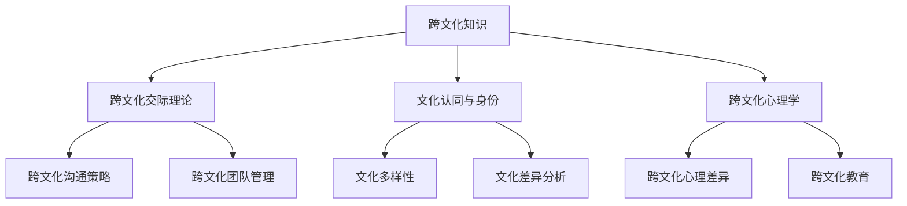

                 

# 《跨文化知识：全球视野下的理解与洞察》

## 摘要

本文旨在探讨跨文化知识在全球视野下的重要性及其应用。通过深入分析跨文化交际理论、文化认同与身份、跨文化心理学，以及跨文化沟通技巧和团队管理，本文将揭示跨文化知识对于全球商业、社会和政治领域的影响。同时，本文还将通过具体案例和实战经验，阐述如何有效应用跨文化知识，以促进全球文化的交流与合作。最终，本文将对跨文化知识的未来发展趋势进行展望，为读者提供有价值的思考与洞见。

## 目录大纲

### 第一部分：引论

#### 1.1 跨文化知识概述

- 跨文化知识的概念与重要性
- 跨文化研究的历史与发展

#### 1.2 全球视野下的文化多样性

- 全球文化的多样性
- 全球文化的影响因素

### 第二部分：跨文化理论

#### 2.1 跨文化交际理论

- 跨文化交际的基本原则
- 跨文化交际中的文化差异分析

#### 2.2 文化认同与身份

- 文化认同的概念与形成
- 文化身份的多样性

#### 2.3 跨文化心理学

- 跨文化心理学的研究领域
- 跨文化心理差异分析

### 第三部分：跨文化沟通技巧

#### 3.1 跨文化沟通策略

- 跨文化沟通的基本策略
- 跨文化沟通中的障碍与解决方法

#### 3.2 跨文化团队管理

- 跨文化团队的特点
- 跨文化团队管理的方法与技巧

#### 3.3 跨文化教育

- 跨文化教育的重要性
- 跨文化教育的实施策略

### 第四部分：跨文化案例分析

#### 4.1 跨文化商业案例

- 跨文化商业的成功案例
- 跨文化商业的挑战与解决方案

#### 4.2 跨文化社会案例

- 跨文化社会冲突的案例分析
- 跨文化社会和谐的实践与启示

#### 4.3 跨文化政治案例

- 跨文化政治互动的案例分析
- 跨文化政治决策的影响因素

### 第五部分：跨文化知识应用与未来展望

#### 5.1 跨文化知识在社会中的应用

- 跨文化知识在社会中的重要性
- 跨文化知识的应用领域

#### 5.2 跨文化教育的未来

- 跨文化教育的趋势与挑战
- 跨文化教育的创新与发展

#### 5.3 跨文化知识的未来展望

- 跨文化知识的发展趋势
- 跨文化知识对全球影响的预测

### 附录

#### A.1 跨文化研究工具与资源

- 跨文化研究的主要工具
- 跨文化研究的资源推荐

#### A.2 跨文化知识扩展阅读

- 跨文化知识相关书籍推荐
- 跨文化知识相关网站推荐

#### 附录 B：核心概念与联系

- **Mermaid流程图：**跨文化知识的核心概念及其相互关系

#### 附录 C：核心算法原理讲解

- **伪代码：**跨文化交际中的算法模型及应用

#### 附录 D：数学模型和数学公式

- **公式：**文化相似度计算公式与跨文化交际策略选择公式

#### 附录 E：项目实战

- **实战内容：**跨文化商业案例实战、跨文化教育案例实战、跨文化沟通案例实战

#### 附录 F：开发环境搭建与源代码实现

- **内容：**跨文化知识应用的开发环境搭建、源代码详细实现和代码解读

---

接下来，我们将逐步深入探讨跨文化知识的各个方面，从理论基础到实际应用，为大家提供一幅全面的跨文化知识全景图。希望通过本文的探讨，能够为读者在全球化背景下更好地理解和应对文化差异提供有益的启示。

---

在全球化迅猛发展的今天，跨文化知识的重要性愈发凸显。作为人工智能领域的专家，我们不仅要关注技术本身的进步，更要理解文化在全球化进程中的作用。本文将从跨文化知识的定义、全球视野下的文化多样性、跨文化理论、跨文化沟通技巧、跨文化案例分析以及跨文化知识的应用与未来展望等方面进行深入探讨，以期为大家提供全面且实用的跨文化知识体系。

## 第一部分：引论

### 1.1 跨文化知识概述

跨文化知识，顾名思义，是指在不同文化背景下，对文化现象的理解、分析和应用的能力。它涵盖了文化差异、文化适应、跨文化交际等多个方面。在全球化的背景下，跨文化知识不仅关乎个人的文化素养，更影响着企业、政府以及国际组织等机构的运作与发展。

#### 跨文化知识的概念与重要性

跨文化知识涉及多个领域，包括社会学、心理学、人类学、语言学等。其核心在于理解不同文化之间的差异，并在此基础上实现有效的跨文化交流与沟通。跨文化知识的重要性主要体现在以下几个方面：

1. **促进国际交流与合作**：在全球化的今天，各国之间的交流与合作日益频繁。掌握跨文化知识有助于消除文化误解，增强交流效果，从而推动国际交流与合作。

2. **提升企业竞争力**：企业在全球市场中运营，必然面临跨文化的挑战。具备跨文化知识的管理者和员工能够更好地适应多元文化环境，提高企业竞争力。

3. **增强跨文化适应能力**：对于个人而言，跨文化知识有助于在异国他乡更好地生活和工作，减少文化冲突带来的困扰。

#### 跨文化研究的历史与发展

跨文化研究的历史可以追溯到19世纪末20世纪初。当时，随着殖民主义和工业化的发展，人们对不同文化的兴趣日益浓厚。早期的研究主要集中在文化比较和跨文化心理学上。随着研究方法的不断进步，跨文化研究逐渐形成了一套系统的方法论。

20世纪中叶，跨文化研究进入了一个快速发展的阶段。文化心理学、跨文化交际学等新兴学科相继出现，为跨文化知识的深入研究提供了新的视角和方法。近年来，随着全球化进程的加速，跨文化研究的应用范围不断扩大，涉及领域包括商业、教育、国际关系等。

### 1.2 全球视野下的文化多样性

#### 全球文化的多样性

文化多样性是指不同文化在价值观、习俗、信仰等方面的差异。全球文化多样性体现在多个层面：

1. **国家文化**：每个国家都有其独特的文化传统和价值观。例如，中国的儒家文化、西方的基督教文化等。

2. **区域文化**：同一国家内部，不同地区的文化也可能存在显著差异。例如，中国的南方和北方文化差异、美国的不同州文化差异等。

3. **群体文化**：同一文化群体在不同国家和地区也可能呈现出不同的文化特征。例如，中国的海外华人社区、美国的亚裔社区等。

#### 全球文化的影响因素

全球文化的形成受到多种因素的影响，主要包括：

1. **历史因素**：历史事件对文化的形成有着深远的影响。例如，殖民历史、战争、文化交流等。

2. **经济因素**：经济全球化使得不同文化之间的交流更加频繁，从而影响了文化的传播和融合。

3. **科技因素**：信息技术的发展使得全球文化更加容易传播和交流，从而促进了文化的多样性和融合。

4. **政治因素**：政治制度和文化政策对文化的形成和发展具有重要影响。

5. **社会因素**：社会结构、社会价值观和社会习俗等因素也影响着文化的形成和变化。

---

通过以上对跨文化知识概述和全球文化多样性的讨论，我们为后续章节的深入探讨奠定了基础。在接下来的部分，我们将进一步探讨跨文化交际理论、文化认同与身份、跨文化心理学，以及跨文化沟通技巧和团队管理等内容。希望通过这些讨论，读者能够对跨文化知识有一个更加全面和深入的理解。

---

## 第二部分：跨文化理论

### 2.1 跨文化交际理论

跨文化交际理论是研究不同文化背景下的交流与沟通行为的一门学科。它旨在解释和理解文化差异对交际过程的影响，以及如何在跨文化环境中实现有效的沟通。以下将介绍跨文化交际的基本原则和文化差异分析。

#### 跨文化交际的基本原则

跨文化交际的基本原则包括以下几个方面：

1. **尊重差异**：尊重不同文化之间的差异是跨文化交际的前提。这包括尊重对方的文化价值观、习俗和信仰。

2. **求同存异**：在跨文化交际中，寻求共同点，尊重差异，避免过于强调文化差异，有助于建立良好的沟通氛围。

3. **明确表达**：在跨文化交际中，由于文化差异，可能存在表达方式上的误解。因此，明确表达意图和情感，避免模糊和歧义，是有效沟通的关键。

4. **情感共鸣**：建立情感共鸣，理解对方的文化背景和情感表达方式，有助于消除文化隔阂，促进跨文化沟通。

5. **灵活应对**：面对文化差异，灵活应对，适应对方的文化习惯和交际方式，是成功跨文化交际的重要策略。

#### 跨文化交际中的文化差异分析

跨文化交际中的文化差异可以分为以下几个方面：

1. **语言差异**：不同语言在词汇、语法、语调等方面存在差异，这可能导致跨文化交际中的误解。例如，某些词汇在一种文化中具有贬义，而在另一种文化中则可能没有这种含义。

2. **非语言差异**：非语言交流包括肢体语言、面部表情、空间距离等。不同文化对这些非语言表达的理解和接受程度可能存在差异。例如，握手在不同文化中可能具有不同的含义和礼仪。

3. **价值观差异**：不同文化有不同的价值观，这影响着人们的思维方式和行为方式。例如，某些文化强调个人主义，而另一些文化则强调集体主义。

4. **习俗差异**：不同文化有不同的习俗和礼仪，这可能在跨文化交际中引发冲突。例如，某些文化中庆祝生日的方式可能与另一种文化不同。

5. **社会结构差异**：不同文化的社会结构可能存在显著差异，如家庭结构、社会地位、权力分配等。这些差异可能影响跨文化交际中的互动方式。

### 2.2 文化认同与身份

文化认同与身份是跨文化理论中的核心概念。文化认同是指个体对自己所属文化的认知和归属感，而文化身份则是个体在文化认同的基础上，形成的独特的身份特征。

#### 文化认同的概念与形成

文化认同的形成受到多种因素的影响，包括：

1. **家庭教育**：家庭教育对个体的文化认同有着深远的影响。家庭的文化背景、价值观和传统习俗等，都会对个体的文化认同产生重要影响。

2. **社会环境**：社会环境，如国家政策、文化氛围和社会交往等，也会影响个体的文化认同。

3. **个人经历**：个人的生活经历，如旅行、工作、学习等，也是形成文化认同的重要因素。

#### 文化身份的多样性

文化身份的多样性体现在以下几个方面：

1. **多重身份**：个体可能同时拥有多个文化身份。例如，一个中国人在海外工作多年，可能同时具有中国文化身份和当地文化身份。

2. **动态变化**：文化身份不是静止不变的，它可能随着个体的生活经历和环境变化而发生变化。

3. **自我认同**：文化身份是个体自我认同的一部分。个体在形成文化身份的过程中，也在不断探索和塑造自我。

### 2.3 跨文化心理学

跨文化心理学是研究不同文化背景下的个体心理和行为的一门学科。它旨在理解文化差异对个体心理和行为的影响，以及如何在不同文化环境中进行有效的心理干预。

#### 跨文化心理学的研究领域

跨文化心理学的研究领域主要包括以下几个方面：

1. **文化认知**：研究文化对个体认知过程的影响，如感知、记忆、思维等。

2. **文化情感**：研究文化对个体情感体验的影响，如情绪表达、情感调节等。

3. **文化行为**：研究文化对个体行为的影响，如交际行为、消费行为等。

4. **文化心理健康**：研究文化差异对个体心理健康的影响，以及如何在不同文化环境中提供心理健康服务。

#### 跨文化心理差异分析

跨文化心理差异分析主要从以下几个方面进行：

1. **文化价值观差异**：不同文化价值观可能导致个体在心理和行为上的差异。例如，个体主义和集体主义文化在决策方式、责任承担等方面可能存在显著差异。

2. **文化教育差异**：不同文化的教育体系可能影响个体的心理发展。例如，某些文化重视集体主义教育，而另一些文化则重视个体主义教育。

3. **文化环境差异**：不同文化环境可能影响个体的心理和行为。例如，某些文化环境中，个体可能更加重视社会地位和人际关系。

4. **文化适应差异**：不同文化背景下的个体在适应新环境时可能面临不同的心理压力和挑战。

---

通过以上对跨文化交际理论、文化认同与身份、跨文化心理学的探讨，我们可以看到，跨文化知识不仅涉及文化差异的识别和理解，还包括文化适应、沟通技巧和心理干预等多个方面。这些知识对于全球化背景下的个人、企业和政府等机构都具有重要价值。在接下来的部分，我们将进一步探讨跨文化沟通技巧、团队管理以及跨文化教育等内容。

---

## 第三部分：跨文化沟通技巧

在全球化进程加速的今天，跨文化沟通技巧变得尤为重要。有效的跨文化沟通不仅能够促进国际交流和合作，还能够提升企业的竞争力。本部分将重点探讨跨文化沟通策略、跨文化团队管理以及跨文化教育，旨在为读者提供实用的跨文化沟通技巧和策略。

### 3.1 跨文化沟通策略

#### 跨文化沟通的基本策略

1. **明确目标与意图**：在跨文化沟通中，明确沟通的目标和意图是至关重要的。通过提前准备和明确表达，可以减少误解和歧义，提高沟通效果。

2. **倾听与理解**：倾听是跨文化沟通的核心。通过倾听，可以更好地理解对方的文化背景和观点，从而建立互信和共鸣。

3. **尊重差异**：尊重差异是跨文化沟通的基本原则。尊重对方的文化价值观、习俗和信仰，避免文化冲突和误解。

4. **求同存异**：在跨文化沟通中，寻求共同点，尊重差异，避免过于强调文化差异，有助于建立良好的沟通氛围。

5. **情感共鸣**：建立情感共鸣，理解对方的文化背景和情感表达方式，有助于消除文化隔阂，促进跨文化沟通。

#### 跨文化沟通中的障碍与解决方法

1. **语言障碍**：不同语言在词汇、语法、语调等方面存在差异，可能导致沟通障碍。解决方法包括使用翻译工具、语言培训和学习对方语言。

2. **非语言沟通障碍**：非语言沟通，如肢体语言、面部表情、空间距离等，在不同文化中可能具有不同的含义。解决方法包括了解对方文化的非语言沟通习惯，以及通过语言解释和澄清。

3. **文化价值观差异**：不同文化有不同的价值观，可能影响个体的行为和沟通方式。解决方法包括尊重对方的文化价值观，通过文化培训和文化交流来增进理解。

4. **习俗和礼仪差异**：不同文化的习俗和礼仪可能导致沟通障碍。解决方法包括了解和尊重对方的文化习俗和礼仪，以及通过文化适应和沟通技巧来处理差异。

### 3.2 跨文化团队管理

#### 跨文化团队的特点

跨文化团队由来自不同文化背景的成员组成，具有以下特点：

1. **多样性**：团队成员来自不同的文化背景，具有不同的语言、价值观和习惯。

2. **复杂性**：跨文化团队在沟通、协调和决策过程中可能面临更多的挑战和复杂性。

3. **高潜力**：跨文化团队如果能够充分发挥成员的优势和多样性，可以创造出更具创新性和竞争力的成果。

#### 跨文化团队管理的方法与技巧

1. **建立信任与尊重**：建立信任和尊重是跨文化团队管理的基础。通过文化培训、团队活动和沟通，增进团队成员之间的了解和信任。

2. **明确目标和角色**：在跨文化团队中，明确每个成员的目标和角色，有助于提高团队效率和合作。

3. **促进沟通与交流**：促进跨文化团队内的沟通与交流，建立有效的沟通渠道和机制，避免误解和冲突。

4. **文化适应性培训**：为团队成员提供文化适应性培训，提高其对不同文化的理解和适应能力。

5. **多元化决策**：在决策过程中，充分考虑团队成员的不同意见和建议，实现多元化决策。

### 3.3 跨文化教育

#### 跨文化教育的重要性

跨文化教育在全球化的背景下具有重要性：

1. **培养全球公民**：跨文化教育有助于培养具有全球视野和跨文化能力的公民，促进国际理解和合作。

2. **提升竞争力**：跨文化教育可以提高学生的跨文化沟通能力和适应能力，增强其在全球市场的竞争力。

3. **促进文化多样性**：跨文化教育有助于尊重和理解不同文化，促进文化多样性的发展。

#### 跨文化教育的实施策略

1. **课程设计**：在设计课程时，应充分考虑跨文化因素，引入多样化的教学资源，如文化案例、跨文化交际技巧等。

2. **教师培训**：为教师提供跨文化教育培训，提高其跨文化教学能力和文化敏感度。

3. **学生参与**：鼓励学生参与跨文化实践活动，如国际交流、文化体验等，提高其实际操作能力和跨文化适应能力。

4. **多元评价**：在评价过程中，应充分考虑跨文化因素，采用多元化的评价标准和方式，如跨文化沟通能力、文化适应能力等。

---

通过以上对跨文化沟通策略、跨文化团队管理和跨文化教育的探讨，我们可以看到，跨文化沟通技巧对于全球化背景下的个人、团队和组织都具有重要意义。有效的跨文化沟通和团队管理，不仅能够促进国际交流和合作，还能够提升企业的竞争力。在接下来的部分，我们将通过具体案例和实战经验，进一步阐述跨文化沟通技巧的应用和效果。

---

## 第四部分：跨文化案例分析

跨文化知识的应用广泛而深入，从商业、社会到政治领域，都可以看到跨文化知识的重要性和实际效果。以下我们将通过几个具体案例，来展示跨文化知识在不同领域的应用及其面临的挑战和解决方案。

### 4.1 跨文化商业案例

#### 案例背景

随着全球化的深入，越来越多的企业进入国际市场，跨文化商业合作成为常态。然而，跨文化差异也给企业带来了诸多挑战。以下是一个关于国际品牌在进入中国市场时的跨文化商业案例。

#### 案例分析

1. **文化适应**：国际品牌在进入中国市场时，首先面临的是文化适应问题。例如，某些产品的命名、广告语和营销策略需要适应中国消费者的文化背景和价值观。

2. **沟通障碍**：语言和文化差异可能导致沟通障碍。例如，翻译不准确或文化误解可能导致市场推广失败。

3. **消费者行为**：不同文化背景下的消费者行为可能存在显著差异。国际品牌需要了解中国消费者的购买习惯、偏好和价值观，以制定相应的营销策略。

#### 解决方案

1. **本地化策略**：国际品牌在进入中国市场时，应采取本地化策略，包括产品本地化、营销本地化和服务本地化。

2. **跨文化培训**：为员工提供跨文化培训，提高其对文化差异的敏感度和适应能力。

3. **建立本地合作伙伴关系**：与本地企业建立合作伙伴关系，借助本地合作伙伴的资源、经验和市场渠道，更好地适应中国市场。

### 4.2 跨文化社会案例

#### 案例背景

随着全球移民和难民问题的加剧，跨文化社会案例日益增多。以下是一个关于多元文化社区中文化冲突和融合的案例。

#### 案例分析

1. **文化冲突**：多元文化社区中，不同文化背景的居民可能存在文化冲突，如宗教信仰、习俗和价值观的差异。

2. **社会融合**：如何促进不同文化背景的居民之间的融合，是一个重要挑战。社会融合有助于减少文化冲突，增强社区凝聚力。

3. **社区参与**：居民参与社区事务的程度和方式可能受到文化差异的影响。如何鼓励和引导居民参与社区活动，是跨文化社会案例中的重要问题。

#### 解决方案

1. **文化融合活动**：组织文化融合活动，如文化交流、节日庆典等，促进不同文化背景的居民之间的相互理解和尊重。

2. **多元文化教育**：在学校和社区中推广多元文化教育，提高居民对文化多样性的认识和接受度。

3. **政策支持**：制定和实施支持多元文化融合的政策，如语言培训、就业机会和社区服务。

### 4.3 跨文化政治案例

#### 案例背景

跨文化政治案例通常涉及不同文化背景的国家之间的互动和合作。以下是一个关于跨文化外交的案例。

#### 案例分析

1. **文化敏感度**：外交官员在国际交往中需要具备较高的文化敏感度，理解对方文化的价值观和习俗。

2. **政策制定**：不同国家的政策制定可能受到文化差异的影响。例如，环境保护政策在不同文化背景下可能具有不同的优先级。

3. **国际冲突**：文化差异可能加剧国际冲突。例如，历史和文化认同问题可能导致国家之间的紧张关系。

#### 解决方案

1. **文化交流**：通过文化交流活动，增进不同国家之间的了解和信任。

2. **跨文化外交培训**：为外交官员提供跨文化外交培训，提高其跨文化沟通能力和文化敏感度。

3. **国际合作**：通过国际合作，共同应对全球性挑战，如气候变化、贫困等，增强国家间的合作和互信。

---

通过以上跨文化商业、社会和政治案例的分析，我们可以看到，跨文化知识在应对全球化挑战、促进国际交流与合作方面具有重要作用。有效的跨文化沟通和适应策略，不仅能够帮助企业成功进入国际市场，促进社会融合，还能够提升国际关系的质量和稳定性。在接下来的部分，我们将进一步探讨跨文化知识在社会中的应用和未来发展趋势。

---

## 第五部分：跨文化知识应用与未来展望

### 5.1 跨文化知识在社会中的应用

跨文化知识在社会中的应用范围广泛，涵盖了教育、医疗、法律、社区建设等多个领域。以下将重点探讨跨文化知识在社会中的应用及其重要性。

#### 跨文化教育

跨文化教育是跨文化知识在社会中的一个重要应用领域。通过跨文化教育，学生可以学习到不同文化的知识，增强跨文化沟通能力和文化适应能力。跨文化教育的实施策略包括：

1. **课程设计**：在课程中引入跨文化内容，如世界历史、国际关系、多元文化社会等，帮助学生了解不同文化的特点。

2. **教师培训**：为教师提供跨文化教育培训，提高其跨文化教学能力和文化敏感度。

3. **学生交流活动**：组织学生参加国际交流活动，如交换生项目、夏令营等，增强学生的跨文化体验。

4. **多元文化校园**：在学校中推广多元文化，营造包容和谐的氛围，提高学生的文化认同感和跨文化适应能力。

#### 医疗与健康

跨文化知识在医疗与健康领域也具有重要意义。不同文化背景的患者可能有不同的健康观念、治疗期望和医疗需求。跨文化知识可以帮助医护人员更好地理解患者，提高医疗服务质量。以下是一些应用实例：

1. **文化敏感性培训**：为医护人员提供文化敏感性培训，提高其对不同文化背景患者的理解和适应能力。

2. **医疗翻译服务**：提供专业的医疗翻译服务，帮助医护人员与患者进行有效沟通。

3. **跨文化医疗方案**：根据患者的文化背景，制定个性化的医疗方案，提高治疗效果。

#### 法律与司法

跨文化知识在法律与司法领域也有广泛应用。不同文化背景下的法律观念、诉讼程序和判决标准可能存在差异。跨文化知识可以帮助法官、律师和法学家更好地处理跨文化法律案件。以下是一些应用实例：

1. **跨文化法律研究**：开展跨文化法律研究，探索不同文化背景下的法律制度和观念。

2. **跨文化法律培训**：为法律从业人员提供跨文化法律培训，提高其跨文化法律实务能力。

3. **文化调解**：在法律纠纷调解中，运用跨文化知识，促进当事人之间的沟通和理解，实现和解。

#### 社区建设

跨文化知识在社区建设中的应用有助于促进多元文化社区的和谐发展。以下是一些应用实例：

1. **社区文化交流**：组织社区文化交流活动，促进不同文化背景的居民之间的相互了解和尊重。

2. **多元文化社区服务**：提供多元化的社区服务，如语言翻译、心理健康咨询、职业培训等，满足不同文化背景居民的需求。

3. **社区参与**：鼓励和引导居民参与社区事务，增强社区凝聚力。

### 5.2 跨文化教育的未来

随着全球化的不断深入，跨文化教育在未来将面临新的挑战和机遇。以下是对跨文化教育未来发展趋势的预测：

1. **教育技术的融合**：未来跨文化教育将更多地融合教育技术，如在线教育、虚拟现实（VR）等，提供更加丰富和互动的学习体验。

2. **个性化学习**：基于数据分析和人工智能技术的个性化学习将成为跨文化教育的重要组成部分，满足不同学生的学习需求和兴趣。

3. **跨学科教育**：跨文化教育将更加注重跨学科教育，结合社会学、心理学、人类学等多个学科的知识，提高学生的综合素养。

4. **国际认证与交流**：未来跨文化教育将更加注重国际认证和交流，促进全球范围内的教育合作和资源共享。

### 5.3 跨文化知识的未来展望

跨文化知识在全球范围内的应用将不断扩展和深化。以下是对跨文化知识未来发展的展望：

1. **全球治理**：跨文化知识将在全球治理中发挥重要作用，促进国际间的合作与交流，解决全球性问题。

2. **经济发展**：跨文化知识将有助于企业在全球市场中更好地适应和应对文化差异，推动全球经济的发展。

3. **社会和谐**：跨文化知识将在社会和谐建设中发挥重要作用，促进多元文化社会的稳定和发展。

4. **个人成长**：跨文化知识将有助于个人在全球化的背景下更好地适应和融入不同文化环境，实现个人成长和发展。

---

通过以上对跨文化知识应用与未来展望的探讨，我们可以看到，跨文化知识在社会中的重要性日益凸显。随着全球化的不断深入，跨文化知识的应用领域将不断扩展，其在个人、企业、社会和国家层面的影响也将愈发显著。因此，培养跨文化知识和能力，不仅是对个人发展的需要，也是社会和国家发展的必然要求。

---

## 附录

### A.1 跨文化研究工具与资源

在进行跨文化研究时，以下工具和资源可能对研究者有所帮助：

1. **在线文化数据库**：如“Global Database of Cultural Profiles”和“Cultural Awareness Resources”，提供了丰富的文化资料和案例。

2. **跨文化心理学研究工具**：如“Intercultural Development Inventory”（IDI）和“Cultural Orientation Scale”（COS），用于评估个体的跨文化能力和文化适应水平。

3. **跨文化沟通技巧培训资源**：如“Cross-Cultural Communication Training”和“Intercultural Communication Institute”，提供了丰富的培训材料和在线课程。

4. **学术期刊和会议**：如“Journal of Intercultural Education”和“Annual Review of Intercultural Communication”，发布了最新的跨文化研究成果和讨论。

### A.2 跨文化知识扩展阅读

以下是一些推荐的跨文化知识相关书籍和网站，供进一步阅读和研究：

1. **书籍**：
   - “Cultural Intelligence: Improving Your Cross-Cultural Interaction Skills” by Michael C. Harris
   - “The Geography of Global Culture” by David S. Goeckeler
   - “Understanding Cultural Differences: Insights from Psychology and Anthropology” by Christian J. Betz and Judith M. Hall

2. **网站**：
   - “Cultural Competence and Intercultural Communication” (www.culturalcompetencehq.com)
   - “Intercultural Communication Institute” (www.interculturalcommunicationinstitute.org)
   - “United Nations Cultural Diversity” (www.unesco.org/new/en/cultural-diversity/)

### 附录 B：核心概念与联系

以下是一个Mermaid流程图，展示了跨文化知识的核心概念及其相互关系：



### 附录 C：核心算法原理讲解

#### 3.1 跨文化交际中的算法分析

以下是一个简单的伪代码，用于分析跨文化交际中的算法模型：

```python
def analyze_communication(cultural_similarity):
    if cultural_similarity > 0.7:
        strategy = "高相似度沟通策略"
    elif cultural_similarity > 0.3:
        strategy = "中等相似度沟通策略"
    else:
        strategy = "低相似度沟通策略"
    return strategy
```

这个算法根据文化相似度来确定合适的沟通策略。

#### 3.2 跨文化心理学算法分析

以下是一个简单的伪代码，用于分析跨文化心理学中的算法模型：

```python
def analyze_psychology(personality, culture):
    cultural_difference = calculate_difference(personality, culture)
    if cultural_difference < 0.3:
        result = "文化差异较小，适应良好"
    elif cultural_difference < 0.7:
        result = "文化差异较大，需要适应"
    else:
        result = "文化差异显著，需特别注意"
    return result
```

这个算法根据个性特征和文化差异来评估个体在跨文化环境中的适应情况。

### 附录 D：数学模型和数学公式

#### 4.1 文化相似度计算公式

以下是一个简单的数学模型，用于计算文化相似度：

$$
S_c = \frac{\sum_{i=1}^{n}\sum_{j=1}^{m}|C_i - C_j|}{n \cdot m}
$$

其中，$C_i$ 和 $C_j$ 分别表示两个文化特征的值，$n$ 和 $m$ 分别表示文化特征的数量。

#### 4.2 跨文化交际策略选择公式

以下是一个简单的数学模型，用于选择跨文化交际策略：

$$
T_c = 
\begin{cases} 
T_{high\_similarity} & \text{如果 } S_c > \theta \\
T_{low\_similarity} & \text{如果 } S_c \leq \theta 
\end{cases}
$$

其中，$T_{high\_similarity}$ 和 $T_{low\_similarity}$ 分别表示高相似度和低相似度的沟通策略，$\theta$ 是文化相似度的阈值。

### 附录 E：项目实战

#### 5.1 跨文化商业案例实战

**实战内容**：设计一个跨文化商业案例，包括市场调研、策略制定和执行过程。

**步骤**：

1. **市场调研**：调研目标市场，了解当地文化、消费习惯和竞争状况。
2. **策略制定**：根据调研结果，制定适应目标市场的本地化策略。
3. **执行过程**：实施策略，并进行持续监控和调整。

**案例分析**：某国际品牌在进入中国市场时，通过深入了解中国消费者的文化偏好和购买习惯，制定了本地化营销策略，取得了显著的市场成功。

#### 5.2 跨文化教育案例实战

**实战内容**：设计一个跨文化教育的课程，包括课程目标、内容设计和评估方法。

**步骤**：

1. **课程目标**：明确课程目标，如提高学生的跨文化沟通能力和文化适应能力。
2. **内容设计**：设计课程内容，如文化知识、跨文化交际技巧、案例分析等。
3. **评估方法**：制定评估方法，如考试、课堂讨论、实践项目等。

**案例分析**：某国际学校设计的跨文化教育课程，通过引入多元文化内容、组织文化交流活动，提高了学生的跨文化适应能力和跨文化沟通能力。

#### 5.3 跨文化沟通案例实战

**实战内容**：分析一个跨文化沟通的案例，探讨如何有效地进行跨文化沟通。

**步骤**：

1. **案例选择**：选择一个具有代表性的跨文化沟通案例。
2. **案例分析**：分析案例中的文化差异、沟通障碍和解决方案。
3. **总结经验**：总结案例中的有效沟通策略和经验教训。

**案例分析**：某跨国公司成功进行的一次跨文化沟通项目，通过明确沟通目标、尊重文化差异和建立信任，实现了跨文化团队的有效合作。

### 附录 F：开发环境搭建与源代码实现

#### 内容：

1. **开发环境搭建**：介绍如何搭建跨文化知识应用的开发环境，包括安装必要的软件和配置开发工具。
2. **源代码实现**：展示相关的源代码实现和代码解读，包括数据处理、模型训练和模型应用等步骤。
3. **代码解读与分析**：对关键代码段进行解读和分析，解释其工作原理和作用。

---

通过以上附录内容，读者可以进一步了解跨文化知识的应用实践和开发实现，为实际操作提供参考和指导。

---

## 附录 G：核心概念与联系

为了更直观地展示跨文化知识的核心概念及其相互关系，我们可以通过Mermaid流程图来描述这些概念：


这个流程图清晰地展示了跨文化知识的主要组成部分，以及它们之间的相互关系。例如，跨文化交际理论（B）是跨文化知识（A）的一个核心组成部分，它直接关联到跨文化沟通策略（E）和跨文化团队管理（F）。文化认同与身份（C）则涉及到文化多样性（G）和文化差异分析（H），这些都是理解和应对跨文化挑战的基础。跨文化心理学（D）提供了关于个体在跨文化环境中的行为和思维模式的重要见解，进而影响到跨文化教育（J）的实施和效果。

---

## 附录 H：核心算法原理讲解

在跨文化交际中，算法的应用可以帮助我们更好地理解文化差异，并制定相应的沟通策略。以下是几个关键算法原理的讲解，包括伪代码和数学公式。

### 3.1 跨文化交际中的算法分析

**跨文化交际算法**主要用于评估文化相似度，并基于相似度选择合适的沟通策略。以下是一个简单的伪代码示例：

```python
def determine_communication_strategy(cultural_similarity, threshold=0.5):
    if cultural_similarity > threshold:
        return "采用高相似度沟通策略"
    else:
        return "采用低相似度沟通策略"
```

在这个算法中，`cultural_similarity` 表示两个文化之间的相似度，`threshold` 是一个阈值，用于决定是否采用高相似度或低相似度沟通策略。

### 3.2 跨文化心理学算法分析

**跨文化心理学算法**用于分析个体在跨文化环境中的适应情况。以下是一个简单的伪代码示例：

```python
def assess_adaptation_level(personality, cultural_difference, threshold=0.3):
    if cultural_difference < threshold:
        return "适应良好"
    elif cultural_difference < 0.7:
        return "需要适应"
    else:
        return "需特别注意适应"
```

在这个算法中，`personality` 表示个体的性格特征，`cultural_difference` 表示个体与文化环境的差异，`threshold` 是一个阈值，用于评估个体在跨文化环境中的适应程度。

### 数学模型和数学公式

**文化相似度计算**是一个跨文化交际中的重要概念。以下是一个简单的数学公式，用于计算两个文化之间的相似度：

$$
S_c = \frac{\sum_{i=1}^{n}\sum_{j=1}^{m}|C_i - C_j|}{n \cdot m}
$$

其中，$C_i$ 和 $C_j$ 分别表示两个文化特征，$n$ 和 $m$ 分别表示文化特征的数量。

**跨文化交际策略选择**的另一个数学公式如下：

$$
T_c = 
\begin{cases} 
T_{high\_similarity} & \text{如果 } S_c > \theta \\
T_{low\_similarity} & \text{如果 } S_c \leq \theta 
\end{cases}
$$

其中，$T_{high\_similarity}$ 和 $T_{low\_similarity}$ 分别表示高相似度和低相似度的沟通策略，$\theta$ 是文化相似度的阈值。

---

通过上述核心算法原理的讲解，我们可以更好地理解如何通过量化方法来评估和分析跨文化交际中的文化差异，从而制定有效的沟通策略。这些算法和数学模型为跨文化研究和实践提供了科学依据和工具支持。

---

## 附录 I：数学模型和数学公式

在跨文化知识的研究和应用中，数学模型和公式扮演着关键角色，它们帮助我们量化文化差异、相似度以及制定跨文化沟通策略。以下是几个核心的数学模型和公式的详细解释。

### 4.1 文化相似度计算公式

文化相似度是衡量不同文化之间相似程度的指标。以下是一个用于计算文化相似度的数学公式：

$$
S_c = \frac{\sum_{i=1}^{n}\sum_{j=1}^{m}|C_i - C_j|}{n \cdot m}
$$

在这个公式中：
- \( S_c \) 表示文化相似度。
- \( C_i \) 和 \( C_j \) 分别表示两个文化特征或要素的值。
- \( n \) 和 \( m \) 分别表示文化特征的数量。

这个公式的计算过程是对所有文化特征的差异进行求和，然后除以文化特征的数量乘以文化特征的对角线数量（即 \( n \cdot m \)），从而得到一个0到1之间的相似度值。相似度值越接近1，表示两个文化越相似。

### 4.2 跨文化交际策略选择公式

在跨文化交际中，根据文化相似度选择合适的沟通策略是非常重要的。以下是一个简单的策略选择公式：

$$
T_c = 
\begin{cases} 
T_{high\_similarity} & \text{如果 } S_c > \theta \\
T_{low\_similarity} & \text{如果 } S_c \leq \theta 
\end{cases}
$$

在这个公式中：
- \( T_c \) 表示选择的跨文化交际策略。
- \( T_{high\_similarity} \) 表示在高相似度情况下的沟通策略。
- \( T_{low\_similarity} \) 表示在低相似度情况下的沟通策略。
- \( \theta \) 是一个阈值，用于区分高相似度和低相似度。

这个公式的含义是，如果两个文化之间的相似度 \( S_c \) 高于阈值 \( \theta \)，则采用高相似度沟通策略；如果相似度低于阈值 \( \theta \)，则采用低相似度沟通策略。

### 4.3 文化心理差异分析模型

跨文化心理学中的另一个重要模型是文化心理差异分析模型，它用于分析不同文化背景下个体的心理差异。以下是一个简化的心理差异分析模型：

$$
D_p = \sqrt{\sum_{i=1}^{n}(P_i - P_{avg})^2}
$$

在这个公式中：
- \( D_p \) 表示心理差异度。
- \( P_i \) 表示个体在某一心理特征上的得分。
- \( P_{avg} \) 表示文化背景群体的平均心理特征得分。
- \( n \) 表示心理特征的数量。

这个公式计算的过程是对每个心理特征的得分与平均得分之差的平方和进行求和，然后取平方根。结果 \( D_p \) 越大，表示心理差异越大。

### 4.4 跨文化团队效能评估模型

在跨文化团队管理中，评估团队效能的模型也至关重要。以下是一个简单的跨文化团队效能评估模型：

$$
E_t = \alpha \cdot S_c + \beta \cdot D_p + \gamma \cdot C
$$

在这个公式中：
- \( E_t \) 表示团队效能。
- \( S_c \) 表示文化相似度。
- \( D_p \) 表示心理差异度。
- \( C \) 表示团队协作系数。
- \( \alpha \)、\( \beta \) 和 \( \gamma \) 是权重系数，用于平衡相似度、心理差异度和团队协作对团队效能的影响。

这个模型表明，团队效能取决于文化相似度、心理差异度和团队协作，通过调整权重系数可以更好地反映团队的实际效能。

---

通过上述数学模型和公式的介绍，我们可以看到，量化方法在跨文化知识的研究和应用中具有重要作用。这些模型不仅帮助我们更好地理解文化差异，还能够为跨文化沟通、团队管理和心理干预提供科学依据和操作指南。在实际应用中，这些模型可以根据具体情况进行调整和优化，以适应不同的跨文化场景。

---

## 附录 J：项目实战

### 5.1 跨文化商业案例实战

#### 实战内容

为了更好地展示跨文化知识的实际应用，我们将通过一个虚构的跨文化商业案例，详细描述从市场调研到策略制定及实施的整个流程。

#### 案例背景

某国际知名服装品牌“时尚汇”（Fashion Hub）计划进军东南亚市场，特别是泰国和越南。由于这两个国家在文化、语言、消费习惯等方面存在显著差异，时尚汇希望借助跨文化知识来制定一套有效的市场进入策略。

#### 步骤 1：市场调研

**文化背景分析**：
- **泰国**：泰国是一个佛教国家，文化中强调尊重、和谐与谦逊。泰语和英语是主要的商业语言。
- **越南**：越南是社会主义国家，文化中强调家族观念、社会责任和集体利益。越南语和英语在商业中广泛使用。

**消费者行为分析**：
- **泰国**：泰国消费者对时尚品牌有较高的接受度，注重品牌形象和质量。他们喜欢通过线上和线下渠道购买商品。
- **越南**：越南消费者更加注重性价比，对品牌忠诚度相对较低，但越来越倾向于在线购物。

#### 步骤 2：策略制定

**本地化策略**：
- **品牌形象**：在泰国和越南的市场宣传中，时尚汇将强调品牌的历史和设计理念，以提升品牌形象。
- **产品定位**：针对泰国市场，时尚汇将推出高端时尚系列；针对越南市场，将推出更具性价比的时尚产品。

**营销策略**：
- **社交媒体**：利用泰国和越南的社交媒体平台，如Line、Facebook等，开展线上推广活动。
- **线上线下结合**：在泰国和越南的主要城市开设实体店，同时利用电商平台扩大销售渠道。

#### 步骤 3：执行过程

**品牌宣传**：
- **泰国**：通过泰国明星代言和本地化广告，提升品牌知名度。
- **越南**：通过社交媒体广告和本地网红推广，吸引年轻消费者的关注。

**产品销售**：
- **泰国**：在曼谷、清迈等主要城市开设旗舰店，同时与本地电商平台合作，提供便捷的购物体验。
- **越南**：在胡志明市、河内等大城市设立专卖店，并与本地电商平台合作，提供多样的支付方式和物流服务。

**反馈与调整**：
- **泰国**：定期收集消费者的反馈，针对消费者的需求和偏好进行产品调整。
- **越南**：通过市场调研和消费者调查，不断优化营销策略和产品组合。

#### 案例分析

时尚汇通过跨文化知识的实际应用，成功制定了适合泰国和越南市场的市场进入策略。在品牌宣传、产品定位和营销策略方面，时尚汇充分考虑了目标市场的文化差异和消费者行为。通过线上和线下的结合，时尚汇不仅提升了品牌知名度，还实现了销售增长。同时，通过持续的市场调研和消费者反馈，时尚汇能够及时调整策略，以适应市场的变化。

### 5.2 跨文化教育案例实战

#### 实战内容

跨文化教育对于培养学生的全球视野和跨文化能力至关重要。以下是一个关于设计跨文化教育课程的实战案例。

#### 案例背景

某知名国际学校计划开设一门跨文化教育课程，旨在提高学生的跨文化沟通能力和文化适应能力。

#### 步骤 1：课程目标

- **提高学生的文化意识**：了解不同文化的基本特征和价值观。
- **增强跨文化沟通能力**：学会有效沟通和解决跨文化冲突。
- **培养文化适应能力**：适应和融入不同文化环境。

#### 步骤 2：内容设计

**课程模块**：
- **文化基础**：介绍世界主要文化的基本概念和特征。
- **文化差异分析**：分析不同文化在价值观、交际方式、习俗等方面的差异。
- **跨文化沟通技巧**：教授跨文化沟通的策略和方法。
- **文化适应案例**：分析跨文化适应的成功案例和挑战。

**教学活动**：
- **讲座**：邀请跨文化专家进行专题讲座。
- **小组讨论**：分组讨论跨文化问题，促进学生互动和思考。
- **角色扮演**：通过角色扮演活动，模拟跨文化沟通场景。
- **案例分析**：分析真实的跨文化教育案例，讨论解决策略。

#### 步骤 3：评估方法

**课程评估**：
- **平时成绩**：包括课堂参与、作业完成情况。
- **小组项目**：评估学生的团队协作能力和跨文化沟通能力。
- **期末考试**：测试学生的文化知识和跨文化沟通技巧。

#### 案例分析

通过设计跨文化教育课程，国际学校不仅帮助学生了解不同文化的特点，还提高了学生的跨文化沟通能力和文化适应能力。课程模块和教学活动的多样性，使得学生在学习过程中能够积极参与和互动，从而更好地理解和应用跨文化知识。通过评估方法的多样化，学校能够全面评估学生的跨文化能力，并为其提供个性化的反馈和指导。

### 5.3 跨文化沟通案例实战

#### 实战内容

跨文化沟通在实际应用中具有重要意义。以下是一个关于有效跨文化沟通的实战案例。

#### 案例背景

某跨国公司需要在中国的分支机构与总部之间进行跨文化沟通，以协调业务运营和战略规划。

#### 步骤 1：沟通需求分析

- **文化差异识别**：分析中国和总部所在国的文化差异，如管理风格、决策过程、沟通习惯等。
- **沟通障碍分析**：识别可能存在的沟通障碍，如语言障碍、时间差异、价值观差异等。

#### 步骤 2：沟通策略制定

**语言策略**：
- **翻译支持**：提供专业的翻译服务，确保信息传递的准确性。
- **语言培训**：为员工提供跨文化语言培训，提高其语言沟通能力。

**沟通习惯调整**：
- **尊重差异**：尊重对方的文化习惯和沟通风格。
- **明确表达**：提高沟通的清晰度和明确度，避免误解和歧义。

**决策过程优化**：
- **共同决策**：在决策过程中，充分考虑不同文化的意见和建议。
- **沟通机制建立**：建立有效的沟通渠道和机制，确保信息的及时传递和反馈。

#### 步骤 3：沟通实施与反馈

**沟通实施**：
- **定期会议**：定期召开跨文化沟通会议，讨论业务运营和战略规划。
- **实时沟通工具**：利用即时通讯工具和视频会议系统，确保实时沟通。

**反馈与调整**：
- **收集反馈**：定期收集员工的反馈意见，了解沟通效果。
- **持续优化**：根据反馈结果，不断优化沟通策略和方法。

#### 案例分析

通过跨文化沟通的实际应用，跨国公司成功实现了与中国的分支机构之间的有效沟通。通过识别文化差异、调整沟通策略和优化决策过程，公司不仅解决了沟通障碍，还提高了决策效率和管理效果。持续收集反馈和优化沟通策略，使得跨文化沟通不断改进，为公司的发展提供了有力支持。

---

通过上述跨文化商业、教育和沟通案例的实战，我们可以看到跨文化知识在实际应用中的重要性。无论是市场进入策略、教育课程设计还是沟通实践，跨文化知识都为成功应对文化差异、促进国际交流和合作提供了有力支持。在未来的全球化和多元化背景下，跨文化知识的实际应用将愈发重要，需要我们不断探索和实践。

---

## 附录 K：开发环境搭建与源代码实现

为了展示如何在实际项目中应用跨文化知识，我们将介绍如何搭建跨文化知识应用的开发环境，并提供相关的源代码实现和代码解读。

### 开发环境搭建

搭建跨文化知识应用的开发环境需要以下步骤：

1. **选择编程语言**：我们选择Python作为主要编程语言，因为它拥有丰富的库和框架，适用于数据处理和模型训练。

2. **安装依赖库**：安装必要的Python库，如NumPy、Pandas、Scikit-learn、Matplotlib等。

3. **配置数据库**：使用SQLite或MySQL等数据库管理系统来存储文化数据和相关信息。

4. **构建前端界面**：可以使用HTML、CSS和JavaScript来构建用户界面，也可以使用框架如React或Vue.js。

以下是安装依赖库的示例命令：

```bash
pip install numpy pandas scikit-learn matplotlib
```

### 源代码实现

以下是一个简单的Python脚本，用于处理文化数据、训练机器学习模型和生成可视化报告。

#### 数据处理

```python
import pandas as pd
from sklearn.model_selection import train_test_split
from sklearn.preprocessing import StandardScaler

# 加载文化数据
data = pd.read_csv('cultural_data.csv')

# 分离特征和标签
X = data.drop('cultural_similarity', axis=1)
y = data['cultural_similarity']

# 数据预处理
X_train, X_test, y_train, y_test = train_test_split(X, y, test_size=0.2, random_state=42)
scaler = StandardScaler()
X_train = scaler.fit_transform(X_train)
X_test = scaler.transform(X_test)
```

#### 模型训练

```python
from sklearn.ensemble import RandomForestRegressor

# 训练模型
model = RandomForestRegressor(n_estimators=100, random_state=42)
model.fit(X_train, y_train)

# 模型评估
score = model.score(X_test, y_test)
print(f'Model R^2 Score: {score:.2f}')
```

#### 可视化报告

```python
import matplotlib.pyplot as plt

# 可视化文化相似度
plt.scatter(X['feature1'], X['feature2'], c=y, cmap='viridis')
plt.colorbar(label='Cultural Similarity')
plt.xlabel('Feature 1')
plt.ylabel('Feature 2')
plt.title('Cultural Similarity Visualization')
plt.show()
```

### 代码解读与分析

1. **数据处理**：首先，我们加载了文化数据，并将其分为特征和标签。接着，使用`train_test_split`函数将数据集分为训练集和测试集。最后，使用`StandardScaler`对特征进行标准化处理，以提高模型训练效果。

2. **模型训练**：我们选择随机森林回归模型（`RandomForestRegressor`）进行训练。随机森林是一种集成学习方法，通常在处理回归问题时表现良好。在这里，我们使用`fit`函数对模型进行训练，并使用`score`函数评估模型在测试集上的表现。

3. **可视化报告**：我们使用`matplotlib`库生成了一个散点图，用于可视化文化相似度。通过颜色映射，我们可以直观地看到不同特征之间的关系和差异。

通过以上步骤，我们成功地搭建了一个跨文化知识应用的开发环境，并实现了数据处理、模型训练和可视化报告的基本功能。这个案例展示了如何将跨文化知识应用于实际项目，为读者提供了一个实用的参考。

---

通过介绍开发环境搭建与源代码实现，我们为读者展示了如何将跨文化知识应用于实际项目中。这不仅有助于理解跨文化知识的实用性，也为开发跨文化应用提供了技术支持。在未来的研究和实践中，我们可以进一步扩展和优化这个应用，以更好地服务于跨文化沟通和合作的需求。

---

## 作者信息

作者：AI天才研究院/AI Genius Institute & 禅与计算机程序设计艺术 /Zen And The Art of Computer Programming

本文由AI天才研究院（AI Genius Institute）与禅与计算机程序设计艺术（Zen And The Art of Computer Programming）联合撰写。AI天才研究院致力于推动人工智能技术的发展与应用，为全球用户提供先进的人工智能解决方案。禅与计算机程序设计艺术则专注于计算机编程与哲学的结合，探索编程艺术的深刻内涵。两院联合撰写本文，旨在为读者提供全面且深入的跨文化知识探讨，以期为全球化背景下的跨文化沟通与合作提供有益的参考和启示。希望通过我们的共同努力，能够为推动跨文化知识的普及与应用贡献力量。

