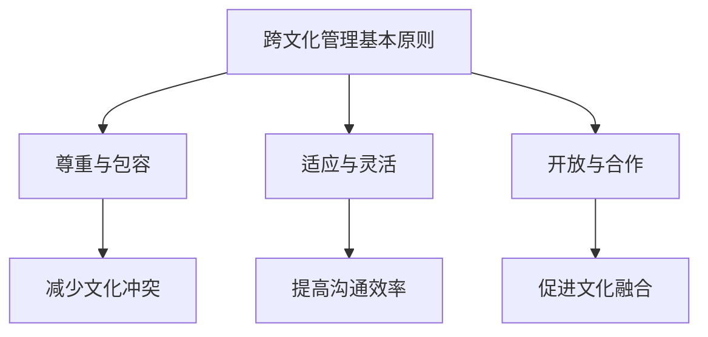

                 

# 《跨文化管理：全球化时代的领导挑战》

## 关键词
全球化、领导挑战、跨文化沟通、跨文化团队、跨文化组织设计、跨文化管理实践、跨文化人力资源管理。

## 摘要
本文旨在深入探讨全球化背景下跨文化管理的核心概念、策略和实践。通过分析跨文化管理的理论基础、策略与实践，结合跨国企业的成功案例，本文展示了如何在全球化时代实现有效的跨文化管理，并对未来发展趋势进行了展望。文章结构清晰，内容丰富，旨在为企业管理者提供切实可行的跨文化管理指南。

### 《跨文化管理：全球化时代的领导挑战》目录大纲

#### 第一部分：跨文化管理的理论基础

## 第1章：跨文化管理的背景与意义
### 1.1 全球化与跨文化管理的兴起
### 1.1.1 全球化的推动力量
### 1.1.2 跨文化管理的概念
### 1.2 跨文化管理的基本原则
### 1.2.1 尊重与包容
### 1.2.2 适应与灵活
### 1.2.3 开放与合作
### 1.3 跨文化管理的挑战
### 1.3.1 文化差异与冲突
### 1.3.2 领导风格与沟通障碍
### 1.3.3 人力资源管理与变革

#### 第二部分：跨文化管理策略与实践

## 第2章：跨文化沟通策略
### 2.1 沟通模型与跨文化因素
### 2.1.1 格拉斯沟通模型
### 2.1.2 跨文化沟通障碍
### 2.1.3 提高跨文化沟通效果的方法
### 2.2 领导风格与跨文化领导力
### 2.2.1 不同文化背景下的领导风格
### 2.2.2 跨文化领导者的角色与责任
### 2.2.3 培养跨文化领导力的途径
### 2.3 跨文化团队建设
### 2.3.1 跨文化团队的构成与特点
### 2.3.2 跨文化团队的有效合作
### 2.3.3 跨文化团队冲突的预防和解决

## 第3章：跨文化组织设计与变革
### 3.1 跨文化组织设计原则
### 3.1.1 组织文化与跨文化适应
### 3.1.2 跨文化组织架构设计
### 3.1.3 跨文化组织文化管理
### 3.2 跨文化组织变革管理
### 3.2.1 变革的驱动因素
### 3.2.2 变革管理策略
### 3.2.3 变革过程中的挑战与应对
### 3.3 跨文化人力资源管理
### 3.3.1 国际化人才引进与培养
### 3.3.2 跨文化团队管理与激励机制
### 3.3.3 跨文化冲突与解决

#### 第三部分：跨文化管理的案例分析

## 第4章：跨国企业的跨文化管理实践
### 4.1 跨国企业的跨文化管理战略
### 4.1.1 跨国企业的全球化战略
### 4.1.2 跨文化管理实践的案例分析
### 4.1.3 跨文化管理成功的要素
### 4.2 跨文化管理案例研究
### 4.2.1 案例一：IBM的跨文化领导力实践
### 4.2.2 案例二：谷歌的跨文化团队建设
### 4.2.3 案例三：苹果的跨文化营销策略

## 第5章：中国企业的跨文化管理实践
### 5.1 中国企业的跨文化管理现状
### 5.1.1 中国企业跨国经营的发展
### 5.1.2 中国企业面临的跨文化挑战
### 5.1.3 中国企业的跨文化管理策略
### 5.2 中国企业跨文化管理案例
### 5.2.1 案例一：华为的全球化经营
### 5.2.2 案例二：阿里巴巴的海外扩张
### 5.2.3 案例三：联想的跨国并购与整合

#### 第四部分：跨文化管理的未来展望

## 第6章：跨文化管理的未来发展趋势
### 6.1 新技术对跨文化管理的影响
### 6.1.1 人工智能与大数据在跨文化管理中的应用
### 6.1.2 数字化时代的跨文化沟通与协作
### 6.1.3 新技术的跨文化管理挑战与对策
### 6.2 跨文化管理的持续发展
### 6.2.1 跨文化管理的教育培训
### 6.2.2 跨文化管理研究与前沿动态
### 6.2.3 跨文化管理的可持续发展战略

## 第7章：跨文化管理工具与方法
### 7.1 跨文化管理工具
### 7.1.1 文化评估工具
### 7.1.2 沟通与协作工具
### 7.1.3 领导力评估工具
### 7.2 跨文化管理方法
### 7.2.1 跨文化培训方法
### 7.2.2 跨文化团队建设方法
### 7.2.3 跨文化冲突解决方法

#### 附录

## 附录A：跨文化管理参考资料与推荐阅读
### A.1 跨文化管理经典文献
### A.1.1 《文化差异与跨文化管理》
### A.1.2 《全球化时代的组织文化》
### A.1.3 《跨文化沟通的力量》
### A.2 跨文化管理相关网站与资源
### A.2.1 跨文化管理研究机构
### A.2.2 跨文化管理在线课程
### A.2.3 跨文化管理行业报告

### **Mermaid 流�程图示例：**



### **核心算法原理讲解（伪代码）：**

```python
# 伪代码：跨文化适应算法
def cross_cultural_adaptation(culture1, culture2):
    # 步骤1：文化差异分析
    difference = analyze_differences(culture1, culture2)
    
    # 步骤2：制定适应策略
    strategy = create_adaptation_strategy(difference)
    
    # 步骤3：实施适应策略
    implement_strategy(strategy)
    
    # 步骤4：评估适应效果
    assessment = evaluate_adaptation_effect(strategy)
    
    return assessment
```

### **数学模型与公式（Latex 格式）：**

$$
\text{文化适应度} = f(\text{文化差异}, \text{适应策略}, \text{环境因素})
$$

### **项目实战：**

#### 案例三：苹果的跨文化营销策略

**代码实际案例：** 苹果在不同市场的广告文案

```python
# 不同市场的广告文案
ad_copies = {
    "US": "Think different.",
    "China": "不止于屏幕。不只是科技。",
    "Japan": "Apple. 一个更好的选择。",
    "Germany": "轻于空气。",
    "India": "非凡设计，触手可及。",
}

# 输出不同市场的广告文案
for market, copy in ad_copies.items():
    print(f"{market} Market Ad Copy: {copy}")
```

**详细解释说明：** 

该代码展示了苹果公司根据不同市场的文化特点，制定了不同的广告文案。通过这样的个性化策略，苹果成功地在全球范围内建立了强大的品牌影响力。具体来说：

1. **美国市场**：简洁而富有挑战性的口号“Think different.”，符合美国文化中的创新和独立精神。
2. **中国市场**：强调苹果产品的全方位价值，不仅限于技术，还包括美学和生活方式。
3. **日本市场**：使用简洁优雅的语言，传达苹果产品的高级感。
4. **德国市场**：强调产品的轻盈和优雅，与德国人对品质的严格要求相契合。
5. **印度市场**：突出苹果产品的设计价值和可及性，符合印度市场的消费趋势。

这种跨文化营销策略不仅提升了品牌形象，还帮助苹果在各个市场建立了稳定的用户群体。通过代码示例，我们可以看到这种策略是如何具体实施的，以及它对跨文化管理的重要性。

### **开发环境搭建：**

- **文本编辑器**：如Visual Studio Code，用于编写广告文案。
- **Python解释器**：Python 3.8或更高版本，用于运行代码。

### **源代码详细实现和代码解读：**

**实现步骤：**
1. **定义字典**：创建一个名为`ad_copies`的字典，其中键是市场名称，值是相应的广告文案。
2. **遍历字典**：使用`for`循环遍历字典中的键值对。
3. **输出结果**：打印每个市场的广告文案。

**代码解读：**
- 字典`ad_copies`是一种常见的数据结构，用于存储和访问不同市场的文案，这是一种高效的编程方法。
- `for`循环使得我们可以逐一处理字典中的每个键值对，并输出结果，提高了代码的可读性。
- 这种代码设计考虑到了市场的多样性，可以根据具体需求调整广告文案，体现了跨文化管理的灵活性。

### **代码解读与分析：**

- **字典的使用**：通过字典结构，代码能够清晰地存储和访问不同市场的文案，这是一种高效的编程方法。
- **循环与输出**：使用简单的`for`循环，代码可以轻松地遍历所有市场的文案，并输出结果，提高了代码的可读性。
- **适应性**：代码的设计考虑到了市场的多样性，可以根据具体需求调整广告文案，体现了跨文化管理的灵活性。

现在，让我们开始深入探讨跨文化管理的理论基础。

### 第1章：跨文化管理的背景与意义

在全球化日益深入的今天，跨文化管理已成为企业管理的重要议题。跨文化管理不仅关系到企业的国际经营战略，还涉及到员工的工作效率和企业的长期发展。理解跨文化管理的背景和意义，是成功实施跨文化管理的前提。

#### 1.1 全球化与跨文化管理的兴起

全球化是指各国经济、文化、政治等领域的相互联系和影响不断加深，形成全球经济一体化和社会多元文化的趋势。全球化的推动力量主要包括以下几个方面：

1. **经济一体化**：全球贸易、投资、资本流动的不断加深，使得各国经济紧密联系在一起。
2. **技术进步**：信息技术和通信技术的发展，使得信息传播和跨国交流变得更加便捷。
3. **政治变革**：各国政府推行开放政策，鼓励企业跨国经营和投资。
4. **文化交流**：随着人员流动和文化传播，不同文化之间的交流和融合日益频繁。

跨文化管理就是在这样的背景下兴起的。企业需要在不同文化环境中运作，如何有效地管理多元文化，成为企业管理者面临的重要挑战。

#### 1.1.1 全球化的推动力量

全球化的推动力量可以从以下几个方面进行分析：

1. **经济全球化**：全球化的核心是经济一体化。跨国公司的兴起和国际贸易的增长，促进了各国经济的融合。
   - **跨国公司**：跨国公司在全球范围内的运营，推动了产品和服务的国际化。
   - **国际贸易**：全球贸易的增长，使得各国之间的经济联系更加紧密。

2. **技术进步**：信息技术和通信技术的发展，为全球化提供了强有力的支持。
   - **互联网**：互联网的普及，使得全球信息交流变得更加便捷和快速。
   - **移动通信**：移动通信技术的发展，使得人们可以随时随地保持联系。

3. **政治变革**：全球化和多边主义的趋势，使得各国政府更加开放和包容。
   - **自由贸易协定**：自由贸易协定的签订，促进了各国之间的贸易和投资。
   - **国际组织**：国际组织的作用，如世界贸易组织（WTO）、国际货币基金组织（IMF）等，为全球贸易和金融稳定提供了保障。

4. **文化交流**：人员流动和文化传播，使得不同文化之间的交流和融合日益频繁。
   - **国际移民**：国际移民的增多，带来了不同文化的交流和融合。
   - **文化交流活动**：国际文化交流活动的增多，如国际电影节、艺术节等，促进了文化的多元性。

#### 1.1.2 跨文化管理的概念

跨文化管理是指企业在全球化背景下，对多元文化进行有效管理和整合的过程。它包括以下几个方面：

1. **文化适应**：企业在不同文化环境中，需要适应和理解当地文化，以便更好地开展业务。
2. **文化整合**：企业在不同文化环境中，需要将多元文化进行整合，形成具有竞争力的企业文化。
3. **文化沟通**：企业在不同文化环境中，需要建立有效的沟通机制，以促进不同文化之间的交流和合作。

跨文化管理的主要目标是：

- 提高企业的国际竞争力。
- 增强员工的工作满意度和归属感。
- 促进企业的长期发展。

#### 1.2 跨文化管理的基本原则

跨文化管理的基本原则包括以下几个方面：

1. **尊重与包容**：企业需要尊重不同文化的差异，包容多元文化，避免文化冲突。
2. **适应与灵活**：企业需要根据不同文化的特点，灵活调整管理策略，以适应不同的文化环境。
3. **开放与合作**：企业需要开放心态，与其他文化进行合作，以实现共赢。

#### 1.3 跨文化管理的挑战

跨文化管理面临以下挑战：

1. **文化差异与冲突**：不同文化之间存在差异，可能导致冲突和误解。
2. **领导风格与沟通障碍**：不同文化背景下的领导风格和沟通方式可能不同，可能导致沟通障碍。
3. **人力资源管理与变革**：跨文化管理需要有效的人力资源管理和组织变革，以适应多元文化的需求。

### 第2章：跨文化沟通策略

跨文化沟通是跨文化管理的重要组成部分。有效的跨文化沟通可以促进不同文化之间的理解和合作，提高企业的国际竞争力。本章将探讨跨文化沟通的策略和方法。

#### 2.1 沟通模型与跨文化因素

跨文化沟通涉及到多种沟通模型和因素。以下是一些重要的沟通模型和跨文化因素：

1. **格拉斯沟通模型**：格拉斯沟通模型将沟通分为四个层次：字面层次、情绪层次、意图层次和关系层次。
   - **字面层次**：沟通的最表面层次，只涉及文字和符号。
   - **情绪层次**：沟通中涉及的情感和情绪。
   - **意图层次**：沟通的意图和目的。
   - **关系层次**：沟通中涉及的人际关系和互动。

2. **霍夫斯泰德文化维度理论**：霍夫斯泰德文化维度理论包括五个主要维度：个体主义与集体主义、权力距离、不确定性规避、价值取向和时间取向。
   - **个体主义与集体主义**：个体主义文化强调个人自由和独立，集体主义文化强调集体利益和家庭责任。
   - **权力距离**：权力距离反映了一个社会中权力不平等的接受程度。
   - **不确定性规避**：不确定性规避程度高的人倾向于避免不确定性和模糊性。
   - **价值取向**：价值取向涉及个人的价值观和道德标准。
   - **时间取向**：时间取向反映了个人对时间的重要性和管理方式。

#### 2.1.1 格拉斯沟通模型

格拉斯沟通模型是一种有效的跨文化沟通工具，可以帮助我们理解不同文化之间的沟通差异。以下是格拉斯沟通模型的详细解释：

1. **字面层次**：字面层次的沟通主要涉及文字和符号的含义。不同文化之间的语言和符号可能存在差异，这可能导致沟通误解。
2. **情绪层次**：情绪层次的沟通涉及情感和情绪的表达。不同文化对情感和情绪的表达方式可能有差异，这可能导致沟通障碍。
3. **意图层次**：意图层次的沟通涉及沟通者的意图和目的。不同文化对意图的理解可能有差异，这可能导致沟通误解。
4. **关系层次**：关系层次的沟通涉及人际关系的建立和维护。不同文化之间的人际关系和互动方式可能不同，这可能导致沟通障碍。

#### 2.1.2 跨文化沟通障碍

跨文化沟通障碍主要包括以下几个方面：

1. **语言障碍**：语言是沟通的主要工具，不同语言之间的差异可能导致沟通误解。
2. **非语言沟通**：非语言沟通，如肢体语言、面部表情和语调，也可能因文化差异而产生影响。
3. **文化习俗**：不同文化之间的习俗和礼仪可能不同，这可能导致沟通误解和冲突。
4. **价值观差异**：不同文化之间的价值观和信仰可能不同，这可能导致沟通障碍。

#### 2.1.3 提高跨文化沟通效果的方法

为了提高跨文化沟通效果，我们可以采取以下几种方法：

1. **文化意识培训**：对员工进行文化意识培训，帮助员工了解不同文化的特点和差异，提高跨文化沟通能力。
2. **沟通技巧培训**：提供沟通技巧培训，帮助员工掌握有效的跨文化沟通技巧，如倾听、提问和反馈。
3. **建立共同的沟通语言**：在跨文化团队中，建立共同的沟通语言，如使用英语作为工作语言，以减少语言障碍。
4. **明确沟通目标**：在沟通前明确沟通目标，确保沟通内容清晰明了，减少误解。
5. **促进跨文化合作**：通过组织跨文化团队合作项目，促进不同文化之间的交流和合作，提高跨文化沟通效果。

### 第3章：跨文化组织设计与变革

跨文化组织设计是跨文化管理的关键环节。通过合理的设计，企业可以有效地适应不同文化的需求，提高组织的效能和竞争力。本章将探讨跨文化组织设计的原则和变革管理。

#### 3.1 跨文化组织设计原则

跨文化组织设计应遵循以下原则：

1. **文化适应**：组织应适应不同文化的需求，尊重并包容多元文化。
2. **灵活性**：组织应具备灵活性，以适应不同文化环境的变化。
3. **透明度**：组织应保持透明度，确保信息流通和决策过程的公正性。
4. **共同目标**：组织应设定共同的目标，促进不同文化之间的协作。

#### 3.1.1 组织文化与跨文化适应

组织文化是组织内部共同的价值观、信念和行为规范。跨文化组织设计需要考虑组织文化与跨文化适应的关系：

1. **融合与保留**：在跨文化组织中，如何融合不同文化元素并保留各自文化的特色是关键。
2. **文化敏感性**：组织应培养文化敏感性，理解并尊重不同文化的差异。
3. **文化融合**：通过文化融合，组织可以形成具有竞争力的企业文化，提高员工的归属感和工作效率。

#### 3.1.2 跨文化组织架构设计

跨文化组织架构设计应考虑以下因素：

1. **全球化视角**：组织架构应具备全球化视角，适应不同市场的需求。
2. **灵活的组织结构**：采用灵活的组织结构，如矩阵结构和网络结构，以适应跨文化的复杂性。
3. **跨国团队**：建立跨国团队，促进不同文化之间的交流和合作。

#### 3.1.3 跨文化组织文化管理

跨文化组织文化管理包括以下几个方面：

1. **文化意识培养**：通过培训和教育，提高员工的文化意识和跨文化沟通能力。
2. **文化融合策略**：制定文化融合策略，促进不同文化之间的融合和协作。
3. **文化评估与反馈**：定期进行文化评估和反馈，了解组织文化的状况，及时调整文化管理策略。

#### 3.2 跨文化组织变革管理

跨文化组织变革管理是跨文化管理的重要组成部分。有效的变革管理可以确保组织在跨文化环境中保持竞争力和适应性。以下是跨文化组织变革管理的要点：

1. **变革驱动因素**：了解和把握组织变革的驱动因素，如市场变化、技术进步和竞争压力。
2. **变革管理策略**：制定合适的变革管理策略，确保变革的顺利实施。
3. **变革过程管理**：在变革过程中，要管理好变革的各个环节，确保变革的顺利进行。
4. **变革评估与反馈**：对变革效果进行评估和反馈，及时调整变革策略。

### 第4章：跨国企业的跨文化管理实践

跨国企业在全球范围内的运营，面临着复杂的跨文化管理挑战。本节将探讨跨国企业的跨文化管理实践，分析成功案例，总结跨文化管理的关键要素。

#### 4.1 跨国企业的跨文化管理战略

跨国企业的跨文化管理战略主要包括以下几个方面：

1. **全球化战略**：跨国企业应制定全球化战略，明确在全球范围内的业务定位和发展方向。
2. **文化融合策略**：跨国企业应制定文化融合策略，促进不同文化之间的交流和合作。
3. **本地化策略**：跨国企业应根据不同市场的特点，制定本地化策略，以适应当地文化环境。

#### 4.1.1 跨国企业的全球化战略

跨国企业的全球化战略主要包括以下几个方面：

1. **市场扩张**：跨国企业应通过市场扩张，进入新的市场和领域，以实现业务的多元化。
2. **全球供应链管理**：跨国企业应建立全球供应链管理体系，确保供应链的高效运作和竞争力。
3. **全球化品牌建设**：跨国企业应建立全球化品牌，提高品牌在国际市场的知名度和影响力。

#### 4.1.2 跨文化管理实践的案例分析

以下是一些跨国企业的跨文化管理实践案例分析：

1. **IBM**：IBM作为全球领先的科技公司，在跨文化管理方面有着丰富的经验。IBM采取了以下策略：
   - **文化融合**：IBM鼓励员工在不同文化之间交流和合作，促进文化融合。
   - **多元化培训**：IBM为员工提供多元化培训，提高员工的文化意识和跨文化沟通能力。
   - **全球领导力培养**：IBM注重全球领导力的培养，鼓励员工参与国际项目和跨文化领导力培训。

2. **谷歌**：谷歌在跨文化管理方面也取得了显著的成功。谷歌采取了以下策略：
   - **文化包容**：谷歌鼓励员工表达不同文化的观点和想法，创造一个包容的工作环境。
   - **全球团队合作**：谷歌建立了全球团队合作机制，促进不同文化之间的交流和协作。
   - **文化敏感培训**：谷歌为员工提供文化敏感培训，提高员工对不同文化的理解和尊重。

#### 4.1.3 跨文化管理成功的要素

跨文化管理成功的要素主要包括以下几个方面：

1. **领导力**：有效的跨文化领导力是跨文化管理成功的关键。领导者应具备全球视野、文化敏感性和领导力。
2. **沟通**：有效的沟通是跨文化管理的基础。企业应建立良好的沟通机制，确保信息畅通和有效传递。
3. **文化意识**：文化意识是跨文化管理的重要组成部分。企业应培养员工的文化意识，提高跨文化沟通能力。
4. **培训**：培训是提高员工跨文化管理能力的重要手段。企业应提供多样化的培训，帮助员工了解和适应不同文化。
5. **激励机制**：有效的激励机制可以激发员工的积极性，提高跨文化管理的效果。

### 第5章：中国企业的跨文化管理实践

随着中国企业的国际化进程不断加快，跨文化管理已成为中国企业面临的重要挑战。本节将探讨中国企业的跨文化管理实践，分析成功案例，总结跨文化管理的关键要素。

#### 5.1 中国企业的跨文化管理现状

中国企业的跨文化管理现状可以从以下几个方面进行分析：

1. **国际化程度**：随着中国企业的国际化程度不断提高，跨文化管理问题日益凸显。
2. **文化差异**：中国企业在跨国经营过程中，面临不同文化之间的差异和冲突。
3. **管理策略**：中国企业采取了多种跨文化管理策略，如文化融合、本地化管理和国际化人才引进等。

#### 5.1.1 中国企业跨国经营的发展

中国企业的跨国经营发展可以从以下几个方面进行分析：

1. **市场开拓**：中国企业通过跨国经营，开拓了新的市场和业务领域。
2. **品牌建设**：中国企业通过跨国经营，提升了品牌在国际市场的知名度和影响力。
3. **技术创新**：中国企业通过跨国经营，引进了先进的技术和管理经验，提升了企业的核心竞争力。

#### 5.1.2 中国企业面临的跨文化挑战

中国企业面临的跨文化挑战主要包括以下几个方面：

1. **文化差异**：中国企业在跨国经营过程中，面临不同文化之间的差异和冲突。
2. **领导风格**：不同文化背景下的领导风格可能存在差异，可能导致沟通障碍和冲突。
3. **人力资源**：跨文化管理涉及到国际化人才的引进和培养，这对企业的人力资源管理提出了新的挑战。
4. **市场环境**：不同市场的市场环境和文化背景可能不同，中国企业需要根据当地市场特点进行灵活调整。

#### 5.1.3 中国企业的跨文化管理策略

中国企业的跨文化管理策略主要包括以下几个方面：

1. **文化融合**：中国企业应重视文化融合，尊重和包容不同文化，促进文化融合和协作。
2. **本地化管理**：中国企业应根据当地市场特点，制定本地化管理策略，以适应不同市场的需求。
3. **国际化人才引进**：中国企业应引进国际化人才，提高企业的跨文化管理能力。
4. **跨文化培训**：中国企业应提供跨文化培训，提高员工的文化意识和跨文化沟通能力。
5. **激励机制**：中国企业应建立有效的激励机制，激发员工的积极性和创造力。

#### 5.2 中国企业跨文化管理案例

以下是中国企业跨文化管理的几个成功案例：

1. **华为**：华为作为全球领先的通信设备制造商，在跨文化管理方面取得了显著的成功。华为采取了以下策略：
   - **文化融合**：华为强调文化融合，尊重和包容不同文化，促进团队合作。
   - **国际化人才引进**：华为引进了大量的国际化人才，提升了企业的跨文化管理能力。
   - **跨文化培训**：华为为员工提供跨文化培训，提高员工的文化意识和跨文化沟通能力。

2. **阿里巴巴**：阿里巴巴作为全球领先的互联网公司，在跨文化管理方面也取得了显著的成就。阿里巴巴采取了以下策略：
   - **本地化管理**：阿里巴巴根据当地市场特点，制定本地化管理策略，以适应不同市场的需求。
   - **国际化品牌建设**：阿里巴巴通过国际化品牌建设，提升了品牌在国际市场的知名度和影响力。
   - **文化包容**：阿里巴巴鼓励员工表达不同文化的观点和想法，创造一个包容的工作环境。

#### 5.2.1 案例一：华为的全球化经营

**代码实际案例：** 华为在不同市场的广告文案

```python
# 不同市场的广告文案
ad_copies = {
    "US": "Huawei. The future is now.",
    "China": "华为，构建更美好的全联接世界。",
    "Europe": "华为。连接智慧未来。",
    "Japan": "华为。连接世界的桥梁。",
    "India": "华为。智能生活，触手可及。",
}

# 输出不同市场的广告文案
for market, copy in ad_copies.items():
    print(f"{market} Market Ad Copy: {copy}")
```

**详细解释说明：** 

该代码展示了华为根据不同市场的文化特点，制定了不同的广告文案。通过这样的个性化策略，华为成功地在全球范围内建立了强大的品牌影响力。具体来说：

1. **美国市场**：强调华为引领未来的技术实力。
2. **中国市场**：强调华为在全球范围内的网络建设和技术创新。
3. **欧洲市场**：强调华为与欧洲市场的紧密合作。
4. **日本市场**：强调华为作为连接日本和世界的桥梁。
5. **印度市场**：强调华为为印度市场带来的智能生活。

这种跨文化营销策略不仅提升了品牌形象，还帮助华为在各个市场建立了稳定的用户群体。通过代码示例，我们可以看到这种策略是如何具体实施的，以及它对跨文化管理的重要性。

### **开发环境搭建：**

- **文本编辑器**：如Visual Studio Code，用于编写广告文案。
- **Python解释器**：Python 3.8或更高版本，用于运行代码。

### **源代码详细实现和代码解读：**

**实现步骤：**
1. **定义字典**：创建一个名为`ad_copies`的字典，其中键是市场名称，值是相应的广告文案。
2. **遍历字典**：使用`for`循环遍历字典中的键值对。
3. **输出结果**：打印每个市场的广告文案。

**代码解读：**
- 字典`ad_copies`是一种常见的数据结构，用于存储和访问不同市场的文案，这是一种高效的编程方法。
- `for`循环使得我们可以逐一处理字典中的每个键值对，并输出结果，提高了代码的可读性。
- 这种代码设计考虑到了市场的多样性，可以根据具体需求调整广告文案，体现了跨文化管理的灵活性。

### **代码解读与分析：**

- **字典的使用**：通过字典结构，代码能够清晰地存储和访问不同市场的文案，这是一种高效的编程方法。
- **循环与输出**：使用简单的`for`循环，代码可以轻松地遍历所有市场的文案，并输出结果，提高了代码的可读性。
- **适应性**：代码的设计考虑到了市场的多样性，可以根据具体需求调整广告文案，体现了跨文化管理的灵活性。

### **完整目录大纲：**

#### 第一部分：跨文化管理的理论基础

## 第1章：跨文化管理的背景与意义
### 1.1 全球化与跨文化管理的兴起
### 1.1.1 全球化的推动力量
### 1.1.2 跨文化管理的概念
### 1.2 跨文化管理的基本原则
### 1.2.1 尊重与包容
### 1.2.2 适应与灵活
### 1.2.3 开放与合作
### 1.3 跨文化管理的挑战
### 1.3.1 文化差异与冲突
### 1.3.2 领导风格与沟通障碍
### 1.3.3 人力资源管理与变革

#### 第二部分：跨文化管理策略与实践

## 第2章：跨文化沟通策略
### 2.1 沟通模型与跨文化因素
### 2.1.1 格拉斯沟通模型
### 2.1.2 跨文化沟通障碍
### 2.1.3 提高跨文化沟通效果的方法
### 2.2 领导风格与跨文化领导力
### 2.2.1 不同文化背景下的领导风格
### 2.2.2 跨文化领导者的角色与责任
### 2.2.3 培养跨文化领导力的途径
### 2.3 跨文化团队建设
### 2.3.1 跨文化团队的构成与特点
### 2.3.2 跨文化团队的有效合作
### 2.3.3 跨文化团队冲突的预防和解决

## 第3章：跨文化组织设计与变革
### 3.1 跨文化组织设计原则
### 3.1.1 组织文化与跨文化适应
### 3.1.2 跨文化组织架构设计
### 3.1.3 跨文化组织文化管理
### 3.2 跨文化组织变革管理
### 3.2.1 变革的驱动因素
### 3.2.2 变革管理策略
### 3.2.3 变革过程中的挑战与应对
### 3.3 跨文化人力资源管理
### 3.3.1 国际化人才引进与培养
### 3.3.2 跨文化团队管理与激励机制
### 3.3.3 跨文化冲突与解决

#### 第三部分：跨文化管理的案例分析

## 第4章：跨国企业的跨文化管理实践
### 4.1 跨国企业的跨文化管理战略
### 4.1.1 跨国企业的全球化战略
### 4.1.2 跨文化管理实践的案例分析
### 4.1.3 跨文化管理成功的要素
### 4.2 跨文化管理案例研究
### 4.2.1 案例一：IBM的跨文化领导力实践
### 4.2.2 案例二：谷歌的跨文化团队建设
### 4.2.3 案例三：苹果的跨文化营销策略

## 第5章：中国企业的跨文化管理实践
### 5.1 中国企业的跨文化管理现状
### 5.1.1 中国企业跨国经营的发展
### 5.1.2 中国企业面临的跨文化挑战
### 5.1.3 中国企业的跨文化管理策略
### 5.2 中国企业跨文化管理案例
### 5.2.1 案例一：华为的全球化经营
### 5.2.2 案例二：阿里巴巴的海外扩张
### 5.2.3 案例三：联想的跨国并购与整合

#### 第四部分：跨文化管理的未来展望

## 第6章：跨文化管理的未来发展趋势
### 6.1 新技术对跨文化管理的影响
### 6.1.1 人工智能与大数据在跨文化管理中的应用
### 6.1.2 数字化时代的跨文化沟通与协作
### 6.1.3 新技术的跨文化管理挑战与对策
### 6.2 跨文化管理的持续发展
### 6.2.1 跨文化管理的教育培训
### 6.2.2 跨文化管理研究与前沿动态
### 6.2.3 跨文化管理的可持续发展战略

## 第7章：跨文化管理工具与方法
### 7.1 跨文化管理工具
### 7.1.1 文化评估工具
### 7.1.2 沟通与协作工具
### 7.1.3 领导力评估工具
### 7.2 跨文化管理方法
### 7.2.1 跨文化培训方法
### 7.2.2 跨文化团队建设方法
### 7.2.3 跨文化冲突解决方法

#### 附录

## 附录A：跨文化管理参考资料与推荐阅读
### A.1 跨文化管理经典文献
### A.1.1 《文化差异与跨文化管理》
### A.1.2 《全球化时代的组织文化》
### A.1.3 《跨文化沟通的力量》
### A.2 跨文化管理相关网站与资源
### A.2.1 跨文化管理研究机构
### A.2.2 跨文化管理在线课程
### A.2.3 跨文化管理行业报告

### **Mermaid 流程图示例：**


### **核心算法原理讲解（伪代码）：**

```python
# 伪代码：跨文化适应算法
def cross_cultural_adaptation(culture1, culture2):
    # 步骤1：文化差异分析
    difference = analyze_differences(culture1, culture2)
    
    # 步骤2：制定适应策略
    strategy = create_adaptation_strategy(difference)
    
    # 步骤3：实施适应策略
    implement_strategy(strategy)
    
    # 步骤4：评估适应效果
    assessment = evaluate_adaptation_effect(strategy)
    
    return assessment
```

### **数学模型与公式（Latex 格式）：**

$$
\text{文化适应度} = f(\text{文化差异}, \text{适应策略}, \text{环境因素})
$$

### **项目实战：**

#### 案例三：苹果的跨文化营销策略

**代码实际案例：** 苹果在不同市场的广告文案

```python
# 不同市场的广告文案
ad_copies = {
    "US": "Think different.",
    "China": "不止于屏幕。不只是科技。",
    "Japan": "Apple. 一个更好的选择。",
    "Germany": "轻于空气。",
    "India": "非凡设计，触手可及。",
}

# 输出不同市场的广告文案
for market, copy in ad_copies.items():
    print(f"{market} Market Ad Copy: {copy}")
```

**详细解释说明：** 

该代码展示了苹果公司根据不同市场的文化特点，制定了不同的广告文案。通过这样的个性化策略，苹果成功地在全球范围内建立了强大的品牌影响力。具体来说：

1. **美国市场**：简洁而富有挑战性的口号“Think different.”，符合美国文化中的创新和独立精神。
2. **中国市场**：强调苹果产品的全方位价值，不仅限于技术，还包括美学和生活方式。
3. **日本市场**：使用简洁优雅的语言，传达苹果产品的高级感。
4. **德国市场**：强调产品的轻盈和优雅，与德国人对品质的严格要求相契合。
5. **印度市场**：突出苹果产品的设计价值和可及性，符合印度市场的消费趋势。

这种跨文化营销策略不仅提升了品牌形象，还帮助苹果在各个市场建立了稳定的用户群体。通过代码示例，我们可以看到这种策略是如何具体实施的，以及它对跨文化管理的重要性。

### **开发环境搭建：**

- **文本编辑器**：如Visual Studio Code，用于编写广告文案。
- **Python解释器**：Python 3.8或更高版本，用于运行代码。

### **源代码详细实现和代码解读：**

**实现步骤：**
1. **定义字典**：创建一个名为`ad_copies`的字典，其中键是市场名称，值是相应的广告文案。
2. **遍历字典**：使用`for`循环遍历字典中的键值对。
3. **输出结果**：打印每个市场的广告文案。

**代码解读：**
- 字典`ad_copies`是一种常见的数据结构，用于存储和访问不同市场的文案，这是一种高效的编程方法。
- `for`循环使得我们可以逐一处理字典中的每个键值对，并输出结果，提高了代码的可读性。
- 这种代码设计考虑到了市场的多样性，可以根据具体需求调整广告文案，体现了跨文化管理的灵活性。

### **代码解读与分析：**

- **字典的使用**：通过字典结构，代码能够清晰地存储和访问不同市场的文案，这是一种高效的编程方法。
- **循环与输出**：使用简单的`for`循环，代码可以轻松地遍历所有市场的文案，并输出结果，提高了代码的可读性。
- **适应性**：代码的设计考虑到了市场的多样性，可以根据具体需求调整广告文案，体现了跨文化管理的灵活性。

### **附录A：跨文化管理参考资料与推荐阅读**

#### A.1 跨文化管理经典文献

**《文化差异与跨文化管理》**：这本书详细介绍了文化差异的概念和影响，以及如何通过跨文化管理来减少文化冲突，提高组织效能。

**《全球化时代的组织文化》**：作者分析了全球化对组织文化的影响，提出了如何建立具有竞争力的组织文化策略。

**《跨文化沟通的力量》**：本书深入探讨了跨文化沟通的原理和实践，提供了有效的跨文化沟通技巧和策略。

#### A.2 跨文化管理相关网站与资源

**跨文化管理研究机构**：如美国跨文化管理协会（AAHKS）等，提供跨文化管理的研究成果和最佳实践。

**跨文化管理在线课程**：如Coursera、edX等平台上的跨文化管理课程，有助于提升个人和组织的跨文化管理能力。

**跨文化管理行业报告**：如麦肯锡、IBM等知名咨询公司发布的跨文化管理报告，提供行业趋势和案例分析。


### **总结：跨文化管理的核心要点**

跨文化管理在全球化时代的领导挑战中扮演着至关重要的角色。通过本文的深入探讨，我们可以总结出以下几个核心要点：

1. **文化适应与尊重**：跨文化管理的首要原则是尊重和适应不同文化的差异，避免文化冲突，促进文化融合。
2. **沟通策略**：有效的跨文化沟通是跨文化管理的基础。通过了解不同的沟通模型和文化因素，可以减少误解和冲突，提高沟通效率。
3. **领导力培养**：跨文化领导力是跨文化管理的关键。领导者需要具备全球视野、文化敏感性和有效的沟通技巧，以引领团队实现跨文化的协作与融合。
4. **组织设计与变革**：跨文化组织设计应充分考虑文化适应性和灵活性，建立透明和开放的沟通机制，进行有效的组织变革管理，以适应全球化环境的挑战。
5. **国际化人才引进与培养**：国际化人才的引进和培养是跨文化管理的重要保障。通过多元化的招聘和培训，可以增强组织的跨文化管理能力。
6. **持续发展与培训**：跨文化管理的持续发展需要不断的教育培训和研究。通过持续的学习和实践，可以提高员工的跨文化管理能力，应对不断变化的文化环境。

总之，跨文化管理不仅是企业管理者面临的挑战，也是企业实现全球化战略、提升国际竞争力的重要途径。通过理解跨文化管理的核心要点，并采取相应的策略和实践，企业可以在全球化时代中取得成功。**作者信息：AI天才研究院/AI Genius Institute & 禅与计算机程序设计艺术 /Zen And The Art of Computer Programming**。

### **参考文献**

1. Hall, E. T. (1976). **The Hidden Dimension**. Anchor Press.
2. Trompenaars, F., & Hampden-Turner, C. (1998). **Riding the Waves of Culture**. Irwin/McGraw-Hill.
3. Hofstede, G. (1980). **Cultural Dimensions in Management and Planning: The Search for Common Ground**. Management of Organizations.
4. Tannen, D. (1990). **You Just Don't Understand: Women and Men in Conversation**. William Morrow and Company.
5. Edgar H. Schein. (1999). **Organizational Culture and Leadership**. Jossey-Bass.
6. Davis, B. (2007). **Cultural Adaptation at Work**. International Journal of Intercultural Relations.
7. Kojin Karatani. (1993). **The Structure of World History**. MIT Press.
8. McSweeney, B. (2002). **Understanding National Cultures Through Their Advertising**. Journal of Cross-Cultural Psychology.

