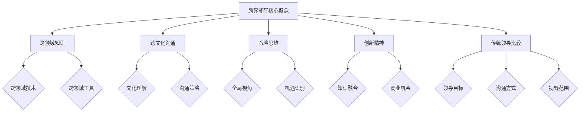
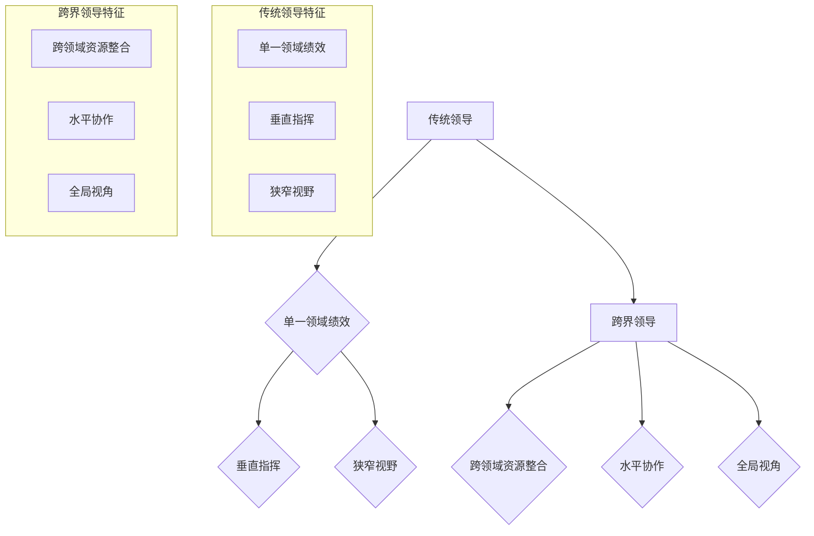
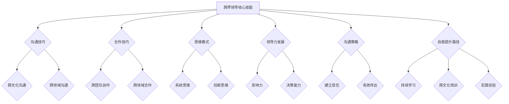

                 

### 《跨界领导：在不同领域间建立联系》引言

> 跨界领导，一个在当今快速变化的全球商业环境中变得日益重要的概念，它代表了一种在不同领域、文化和技术之间建立联系的领导方式。本文旨在深入探讨跨界领导的概念、重要性、核心技能、应用与实践，以及未来发展的趋势。

#### 1.1 跨界领导的概念与重要性

**跨界领导**，顾名思义，是指在一个领域中的领导者能够跨越不同的领域、文化和技术，与其它领域的专业人士建立有效联系和合作，从而实现组织目标的领导方式。这种领导方式不仅要求领导者具备跨领域的知识和技术，更要求他们具备强大的沟通能力、战略视野和领导力。

**跨界领导的重要性**在于：
1. **促进创新**：跨界领导能够打破传统的思维模式，通过不同领域的知识融合，激发创新思维。
2. **提升竞争力**：跨界领导有助于组织更好地适应快速变化的市场环境，提高组织竞争力。
3. **增强团队协作**：跨界领导能够促进不同团队之间的协作，实现资源的最优配置。
4. **扩大组织影响力**：跨界领导能够帮助组织在更广泛的领域中建立联系，扩大组织影响力。

#### 1.2 跨界领导面临的挑战

尽管跨界领导具有重要的意义，但实现跨界领导也面临着一系列挑战：
1. **文化差异**：不同领域、不同文化和背景的专业人士之间的沟通和合作可能存在障碍。
2. **技术壁垒**：不同领域的技术和工具可能存在差异，这需要跨界领导者具备广泛的技术知识。
3. **人才短缺**：拥有跨界技能和知识的人才相对较少，这给跨界领导带来了一定的困难。

#### 1.3 本书结构安排

本文将按照以下结构进行展开：

- **第一部分：引言**：介绍跨界领导的概念、重要性和面临的挑战。
- **第二部分：跨界领导的核心技能**：探讨跨界领导所需的沟通技巧、合作技巧、思维模式、领导力发展以及沟通策略。
- **第三部分：跨界领导的应用与实践**：分析跨界领导在企业、非企业领域以及未来发展趋势中的应用。
- **第四部分：总结与展望**：回顾跨界领导的重要性，展望未来跨界领导的发展趋势。

通过本文的逐步分析和讲解，希望能够帮助读者更好地理解跨界领导的概念和实践，为实际工作提供有益的指导。

### 跨界领导的基本概念

**跨界领导**，作为当前商业环境中一个重要的领导方式，其核心在于通过跨越不同领域、文化和技术的界限，实现资源的最优配置和价值的最大化。为了深入理解跨界领导，我们需要从其定义、特征以及与传统领导方式的区别等方面进行详细探讨。

首先，**跨界领导的定义**可以理解为：在一个领域中的领导者，通过建立与其它领域专业人士的联系，促进知识、技能和资源的共享，从而实现组织目标的一种领导方式。这种领导方式不仅仅是跨领域的技术和知识积累，更重要的是一种跨越不同文化和背景的能力。跨界领导者需要具备广泛的视野和强大的沟通能力，能够在不同领域之间搭建桥梁，促进协作与创新。

其次，**跨界领导的特征**主要包括以下几个方面：

1. **跨领域知识**：跨界领导者需要具备跨领域的知识储备，能够理解和掌握不同领域的技术和工具。
2. **跨文化沟通**：跨界领导者需要具备跨文化的沟通能力，能够在不同文化背景的专业人士之间建立信任和合作关系。
3. **战略思维**：跨界领导者需要具备战略思维，能够从全局角度出发，识别和把握跨界合作的机会。
4. **创新精神**：跨界领导者需要具备创新精神，能够在不同领域的知识融合中，发现新的解决方案和商业机会。

与传统领导方式相比，**跨界领导具有以下区别**：

1. **领导目标**：传统领导主要关注在单一领域内的绩效提升，而跨界领导则更加注重跨领域的资源整合和价值创造。
2. **沟通方式**：传统领导主要通过垂直的命令和指挥来实现目标，而跨界领导则更加注重水平协作和知识共享。
3. **视野范围**：传统领导往往局限于自身的领域，而跨界领导则具备更广阔的视野，能够跨领域、跨文化地思考和解决问题。

为了更好地展示跨界领导的核心概念和架构，我们可以使用**Mermaid流程图**来进行描述：

这个Mermaid流程图清晰地展示了跨界领导的核心概念及其相互关系，帮助我们更好地理解跨界领导的基本原理。

通过上述定义、特征和区别的分析，我们可以更深入地理解跨界领导的概念和架构。跨界领导不仅需要领导者具备跨领域的知识和技术，更需要他们具备跨文化的沟通能力和战略思维，能够在不同领域之间搭建桥梁，实现资源的有效整合和价值的最大化。

### 跨界领导的重要性

跨界领导在当今快速变化的商业环境中具有重要的战略意义，其价值体现在以下几个方面：

**1. 促进创新**：跨界领导能够打破传统的思维定式，通过跨领域的知识融合，激发创新思维。例如，苹果公司在开发智能手机时，不仅借鉴了计算机领域的知识，还融合了消费电子和通信领域的创新，成功推出了iPhone，彻底改变了手机市场的格局。

**2. 提升竞争力**：跨界领导能够帮助组织更好地适应快速变化的市场环境，提高竞争力。通过跨界合作，组织可以迅速获取外部资源和技术，加速创新和产品开发。例如，腾讯通过跨界合作，不仅涉足了社交媒体和游戏领域，还成功进入了云计算和金融科技领域，大大提升了其市场竞争力。

**3. 增强团队协作**：跨界领导能够促进不同团队之间的协作，实现资源的最优配置。通过跨界合作，团队成员可以互相学习、交流和分享知识，提高团队的整体效能。例如，谷歌的“20%时间政策”允许员工在非工作时间探索新的项目，这种跨界合作和创新氛围，使得谷歌在多个领域取得了重大突破。

**4. 扩大组织影响力**：跨界领导能够帮助组织在更广泛的领域中建立联系，扩大组织影响力。通过跨界合作，组织不仅可以在原有的市场领域保持竞争力，还可以进入新的市场，开拓新的业务领域。例如，阿里巴巴通过跨界合作，不仅在国内市场取得了巨大成功，还成功进军国际市场，成为全球领先的电子商务平台。

总之，跨界领导作为一种先进的领导方式，在促进创新、提升竞争力、增强团队协作和扩大组织影响力方面具有重要的战略意义。随着全球化进程的加速和商业环境的不断变化，跨界领导将成为未来商业成功的关键因素。

### 跨界领导与传统领导的区别

跨界领导与传统领导在多个方面存在显著差异，这些差异主要体现在领导目标、沟通方式和视野范围等方面。

首先，**领导目标的差异**。传统领导主要关注在单一领域内的绩效提升和组织目标的实现。例如，一位公司的部门经理可能主要负责提高销售业绩或提升产品质量。而跨界领导则更加注重跨领域的资源整合和价值创造。跨界领导者不仅关注自身领域的绩效，还会考虑如何通过跨界合作实现更大的组织目标和商业价值。例如，一位跨界领导者可能通过将公司内部的研发团队与市场团队紧密合作，共同开发新产品，从而实现公司的整体增长。

其次，**沟通方式的差异**。传统领导通常采用垂直的命令和指挥方式来管理团队，强调权威和控制。这种方式在单一领域内可能有效，但在跨界环境中则可能面临挑战。跨界领导则更加注重水平协作和知识共享。跨界领导者通过建立跨部门、跨领域的沟通渠道，促进不同团队之间的合作，从而实现资源的有效配置和信息的流通。例如，在一个跨国公司中，跨界领导者可能会定期组织跨部门会议，让不同国家的团队分享经验和最佳实践，以提高整体运作效率。

最后，**视野范围的差异**。传统领导往往局限于自身的领域，视野相对狭窄。而跨界领导者则具备更广阔的视野，能够从全局角度出发，识别和把握跨界合作的机会。跨界领导者不仅关注自身领域的发展，还关注行业趋势、市场动态以及外部环境的变化，从而为组织制定更具有前瞻性和战略性的决策。例如，一位跨界领导者可能会关注新兴技术（如人工智能、区块链）的发展，并思考如何将这些技术应用于公司现有的业务中，以保持竞争优势。

为了更直观地展示跨界领导与传统领导的区别，我们可以使用**Mermaid流程图**进行描述：

这个流程图清晰地展示了跨界领导与传统领导在目标、沟通方式和视野范围等方面的差异。跨界领导不仅需要领导者具备跨领域的视野和战略思维，还需要他们具备强大的沟通能力，能够在不同团队、不同领域之间建立有效的合作关系。

通过对比跨界领导与传统领导，我们可以看到，跨界领导在当今复杂多变的商业环境中具有更大的潜力和优势。跨界领导者能够通过跨领域的资源整合和全局视角，帮助组织实现更大的创新和突破。

### 跨界领导面临的挑战

尽管跨界领导具有重要的战略意义，但在实际操作中，跨界领导者仍然面临着一系列挑战。这些挑战主要包括文化差异、技术壁垒和人才短缺等方面。

首先，**文化差异**是跨界领导面临的主要挑战之一。不同领域、不同国家和地区的文化背景可能存在显著差异，这导致跨界领导者在进行沟通和合作时面临障碍。例如，在全球化企业中，不同国家的团队可能在工作习惯、沟通方式和价值观上存在差异，这需要跨界领导者具备跨文化沟通的能力，以便有效地协调和整合这些团队。例如，一个中国的产品经理在与美国的设计团队合作时，可能需要适应不同的设计理念和工作流程，这需要领导者具备强大的文化敏感性和适应能力。

其次，**技术壁垒**也是跨界领导面临的重要挑战。不同领域的技术和工具可能存在差异，这要求跨界领导者具备广泛的技术知识，以便在不同领域之间进行有效的资源整合和知识共享。例如，一个在IT行业工作的跨界领导者可能需要了解人工智能、区块链和物联网等前沿技术，以便将这些技术应用于公司的新产品开发或业务流程优化中。此外，技术更新速度的加快也要求跨界领导者具备持续学习的动力和能力，以跟上行业发展的步伐。

最后，**人才短缺**是跨界领导面临的另一个挑战。拥有跨界技能和知识的人才相对较少，这使得跨界领导者难以组建和培养一支具备跨界能力的团队。例如，一个在金融行业工作的跨界领导者可能很难找到既熟悉金融业务又了解科技创新的专业人才，这需要领导者具备强大的招聘和培养能力，以便吸引和留住这类人才。此外，跨界人才的培养还需要时间和资源，这进一步增加了跨界领导的难度。

为了应对这些挑战，跨界领导者可以采取以下策略：

1. **加强跨文化培训**：通过提供跨文化培训，帮助团队成员了解和适应不同文化背景，提高跨文化沟通和协作能力。
2. **构建跨界学习平台**：建立跨界学习平台，鼓励团队成员进行跨领域的学习和交流，提高团队的整体技能水平。
3. **建立跨界合作机制**：通过建立跨界合作机制，促进不同团队之间的交流和合作，实现资源的共享和优化。
4. **提供职业发展机会**：为跨界人才提供明确的职业发展路径和机会，鼓励他们不断提升自己的跨界能力和竞争力。

通过采取这些策略，跨界领导者可以更好地应对文化差异、技术壁垒和人才短缺等挑战，实现跨界领导的目标，促进组织的创新和发展。

### 建立跨界联系的技巧

在跨界领导中，建立跨界联系是关键的一步，这不仅需要领导者具备跨领域的知识，还需要他们掌握一系列的技巧，包括跨界沟通技巧和跨界合作技巧。

#### 跨界沟通技巧

**1. 沟通中的语言障碍**

在跨界沟通中，语言障碍是一个常见的问题。不同领域的专业术语和表达方式可能存在差异，这容易导致误解和沟通不畅。为了解决这一问题，跨界领导者需要采取以下策略：

- **使用简单明确的语言**：避免使用过于专业的术语，尽量使用简单、直观的语言进行沟通。
- **建立共同的词汇表**：在不同团队之间建立共同的术语表，确保所有成员对关键概念和术语有统一的理解。
- **定期培训和交流**：定期组织培训，帮助团队成员熟悉不同领域的术语和概念，提高跨界沟通的效率。

**2. 跨界沟通的策略**

为了实现有效的跨界沟通，跨界领导者可以采取以下策略：

- **建立跨领域的沟通平台**：利用电子邮件、在线会议、即时通讯工具等，建立跨领域的沟通平台，方便团队成员之间的交流。
- **促进信息共享**：鼓励团队成员共享知识和经验，通过文档共享、知识库等方式，提高信息的透明度和可访问性。
- **定期组织跨界会议**：定期组织跨界会议，让不同领域的团队成员面对面交流，增强彼此的了解和信任。

#### 跨界合作技巧

**1. 跨界团队的建设**

跨界团队是跨界领导的重要载体，一个高效的跨界团队需要具备以下几个特点：

- **多元化背景**：团队成员来自不同的领域，具有不同的技能和经验，能够提供多样化的视角和解决方案。
- **共同的目标**：团队的目标明确，所有成员都为共同的目标而努力，这有助于增强团队的凝聚力和合作意愿。
- **良好的沟通机制**：团队内部建立有效的沟通机制，确保信息的流畅传递和问题的及时解决。

为了建设一个高效的跨界团队，领导者可以采取以下措施：

- **明确角色和职责**：为每个团队成员明确分配角色和职责，确保团队工作有序进行。
- **建立团队文化**：培养团队的文化价值观，鼓励团队成员之间的合作和支持。
- **提供必要的资源和支持**：为团队提供足够的资源和支持，包括技术工具、培训机会和决策权，以提高团队的效率和创造力。

**2. 跨界合作的流程**

跨界合作的过程可以分为以下几个阶段：

- **需求识别**：确定跨界合作的需求和目标，明确合作的关键问题和解决方案。
- **团队组建**：根据需求组建跨界团队，确保团队成员具备相应的技能和经验。
- **任务分配**：明确团队成员的职责和任务，确保每个成员都清楚自己的角色和目标。
- **沟通与协作**：建立有效的沟通机制，确保团队成员之间的信息流畅传递和协作。
- **评估与反馈**：对跨界合作的过程和结果进行评估和反馈，及时发现和解决问题，不断优化合作流程。

通过掌握跨界沟通技巧和跨界合作技巧，跨界领导者可以更好地搭建跨界联系的桥梁，促进不同领域之间的合作与创新，实现组织的整体目标。

### 跨界领导者的自我提升

跨界领导者要成功地在不同领域间建立联系，不仅需要跨越文化和技术的障碍，还要不断提升自身的技能和知识。这涉及到跨界思维模式、持续学习和领导力发展等多个方面。

#### 跨界思维模式

**1. 系统思维**

跨界领导者需要具备系统思维，这意味着要从整体的角度来看待问题，而不仅仅是关注单一领域。系统思维帮助领导者理解不同领域之间的相互关系，从而在决策时能够综合考虑各种因素。例如，一个在科技行业的领导者如果只关注技术创新，可能会忽略市场需求和用户体验，从而影响产品的成功。

**2. 持续学习**

跨界领导者必须保持持续学习的态度，因为新知识和新技术不断涌现，只有不断学习才能保持竞争力。这种学习不仅包括技术知识，还包括管理技能、沟通技巧和行业动态。例如，通过参加研讨会、阅读专业书籍和在线课程，领导者可以不断更新自己的知识储备。

**3. 拓展视野**

跨界领导者需要具备开阔的视野，这包括对全球市场的了解和对新兴趋势的敏感度。通过关注国际新闻、参加行业会议和与不同领域的专家交流，领导者可以拓宽自己的视野，从而更好地把握跨界合作的机会。

#### 跨界领导力的发展

**1. 领导力的构成**

跨界领导力不仅仅依赖于技术知识和个人魅力，还需要领导者具备以下几个关键要素：

- **影响力**：领导者需要具备影响力，能够在团队中树立榜样，激发成员的积极性和创造力。
- **决策能力**：跨界领导者需要具备迅速做出有效决策的能力，特别是在面对复杂和不确定的情况时。
- **团队协作**：跨界领导者需要擅长团队协作，能够搭建高效的跨界团队，并促进团队成员之间的合作。

**2. 领导力的提升**

为了提升跨界领导力，领导者可以采取以下措施：

- **参与领导力发展项目**：通过参加领导力发展项目，领导者可以学习先进的领导理论和实践，提升自身的领导能力。
- **导师指导**：找到一位经验丰富的导师，通过导师的指导，领导者可以获得宝贵的经验和见解。
- **实践应用**：通过实际的工作项目，领导者可以将学到的理论知识应用到实践中，不断积累经验。

#### 跨界领导的沟通策略

**1. 文化差异的影响**

在跨界领导中，文化差异可能会对沟通产生重大影响。不同文化背景的团队成员可能在沟通风格、工作习惯和价值观上存在差异，这需要领导者采取针对性的沟通策略。例如，在一些文化中，直接表达意见可能被视为不礼貌，而在其他文化中，则可能被视为透明和真诚。

**2. 技术壁垒的应对**

技术差异是跨界领导面临的另一个挑战。领导者需要了解不同领域的技术背景，以便在沟通和决策时能够理解团队成员的技术观点。例如，在讨论一个涉及多个领域的技术项目时，领导者需要确保所有团队成员都理解项目的目标和预期结果。

**3. 沟通技巧**

为了克服文化差异和技术壁垒，跨界领导者可以采取以下沟通技巧：

- **建立信任**：通过建立信任，领导者可以促进团队成员之间的开放和诚实的沟通。例如，通过定期召开团队会议，鼓励成员提出问题和意见。
- **使用可视化工具**：使用图表、模型和演示文稿等可视化工具，可以帮助跨越语言和技术障碍，提高沟通的效率。例如，在技术讨论中，使用流程图或代码示例可以更直观地传达复杂的概念。
- **培养文化意识**：领导者可以通过培训和文化交流，帮助团队成员了解和尊重彼此的文化差异，从而建立更加和谐的团队氛围。

通过培养跨界思维模式、持续学习和领导力发展，并采取有效的沟通策略，跨界领导者可以更好地在不同领域间建立联系，推动组织的创新和成功。

### 跨界领导的沟通策略

在跨界领导中，沟通策略是确保团队协作和目标实现的关键。为了克服文化差异和技术壁垒，跨界领导者需要采取一系列有针对性的沟通策略，以下为详细解释和实际案例。

#### 沟通障碍与解决

**1. 文化差异的影响**

不同文化背景的团队成员可能在沟通风格、工作习惯和价值观上存在差异，这可能导致误解和冲突。例如，在一些文化中，直接表达意见可能被视为不礼貌，而在其他文化中，则可能被视为透明和真诚。为了解决这一问题，领导者可以采取以下策略：

- **文化敏感培训**：组织文化敏感培训，帮助团队成员了解和尊重不同文化背景的行为和沟通方式。
- **建立跨文化团队规则**：明确团队内部的沟通规则，确保所有成员都遵循相同的沟通准则。
- **鼓励开放沟通**：鼓励团队成员在不同文化背景中表达自己的观点，并通过提问和反馈来促进相互理解。

**2. 技术壁垒的应对**

技术差异也是跨界领导中的一大障碍。不同领域的专业术语和工具可能存在差异，这可能导致团队成员在沟通时产生困惑。为了应对这一挑战，领导者可以采取以下策略：

- **技术普及培训**：为团队成员提供技术普及培训，确保他们了解相关领域的术语和工具。
- **建立技术术语库**：创建一个共享的技术术语库，帮助团队成员在沟通中统一使用标准术语。
- **使用可视化工具**：利用图表、模型和演示文稿等可视化工具，帮助团队成员更好地理解和传达复杂的技术概念。

#### 跨界沟通的技巧

**1. 情感共鸣**

在跨界沟通中，建立情感共鸣是关键。领导者需要与团队成员建立信任关系，理解他们的情感和需求。以下是一些实现情感共鸣的技巧：

- **倾听**：积极倾听团队成员的意见和反馈，展示对他们的关注和理解。
- **表达同理心**：通过表达同理心，让团队成员感受到领导者的支持和理解。
- **共享经验**：通过分享个人的经验和故事，促进团队成员之间的情感连接。

**2. 事实陈述**

在跨界沟通中，清晰、准确的事实陈述也是必不可少的。领导者需要确保信息的准确性和透明度，以下是一些实现有效事实陈述的技巧：

- **使用具体数据**：提供具体的数据和事实，帮助团队成员更好地理解问题的背景和解决方案。
- **明确目标**：在陈述事实时，明确目标和预期结果，确保团队成员对任务有清晰的认识。
- **提供多种渠道**：通过多种渠道（如电子邮件、会议、即时通讯）传达信息，确保信息传递的准确性和及时性。

#### 案例分析

**案例1：跨国公司的团队沟通**

一家跨国公司在开发新产品时，由不同国家和地区的团队组成。由于文化差异，团队成员在沟通时经常出现误解和冲突。为了改善沟通，公司采取了以下措施：

- **定期组织跨文化培训**：通过跨文化培训，提高团队成员的文化敏感度和沟通技巧。
- **建立共同的工作流程**：制定统一的工作流程和沟通规则，确保团队成员在不同文化背景下都能遵循相同的流程。
- **设立沟通协调员**：设立专门的沟通协调员，负责在不同团队之间传递信息和解决沟通问题。

这些措施有效改善了团队的沟通，提高了项目执行的效率。

**案例2：技术团队的跨界合作**

一家科技公司正在开发一个涉及多个领域（如软件、硬件、物联网）的项目。由于技术差异，团队成员在沟通时经常出现技术术语不一致的问题。为了解决这个问题，公司采取了以下措施：

- **技术普及培训**：为团队成员提供相关领域的技术普及培训，确保他们了解相关术语和工具。
- **建立技术术语库**：创建一个共享的技术术语库，帮助团队成员在沟通中统一使用标准术语。
- **使用可视化工具**：在会议中广泛使用图表、模型和演示文稿等可视化工具，帮助团队成员更好地理解和传达复杂的技术概念。

通过这些措施，技术团队的跨界合作变得更加顺畅，项目进展顺利。

通过上述案例分析，我们可以看到，跨界领导者通过采取针对性的沟通策略和技巧，能够有效克服文化差异和技术壁垒，促进团队的协作和创新。

### 跨界领导在企业中的应用

跨界领导在企业中的应用是当今商业环境中一个重要的议题。随着市场的不断变化和技术的迅速发展，企业需要通过跨界合作和创新来保持竞争力。以下将探讨跨界领导在企业中的应用，通过具体案例分析，展示跨界领导如何帮助企业在跨界转型中取得成功。

#### 苹果公司的跨界发展

**案例1：苹果公司**

苹果公司是跨界领导的经典案例。作为一家以消费电子产品为主的科技公司，苹果公司在过去几十年中不断跨界，从计算机到智能手机，再到智能家居和云计算，成功实现了多次重大转型。

- **跨界创新**：苹果公司通过跨界创新，将计算机技术和消费电子产品相结合，推出了iPhone，彻底改变了智能手机市场。随后，苹果公司又通过推出Apple Watch和HomePod等设备，成功进入了智能穿戴设备和智能家居市场。
- **跨界合作**：苹果公司在开发新产品时，不断与不同领域的公司进行合作。例如，在开发iPhone时，苹果公司与三星等供应商合作，获得了高质量的屏幕和电池技术。这种跨界合作不仅提高了苹果产品的竞争力，也促进了整个产业链的创新和发展。

#### 腾讯的跨界战略

**案例2：腾讯**

腾讯是中国领先的互联网公司，其在跨界战略方面的成功同样令人瞩目。腾讯通过跨界进入多个领域，如社交媒体、游戏、云计算和金融科技，实现了业务的多元化发展。

- **跨界业务布局**：腾讯通过投资和并购，迅速进入多个跨界领域。例如，腾讯通过投资阿里巴巴和京东，成功进入电商领域；通过投资美团和滴滴，成功进入外卖和打车市场。这种跨界布局使得腾讯能够在多个市场上获得竞争优势。
- **跨界技术创新**：腾讯在跨界业务中注重技术创新，通过自主研发和合作，不断提升其在云计算、人工智能和大数据等领域的竞争力。例如，腾讯的云服务已经广泛应用于游戏开发和企业级应用，为其跨界业务提供了强大的技术支撑。

#### 跨界领导在管理中的实践

**案例3：谷歌**

谷歌作为一家以技术创新为核心的公司，其在跨界领导方面的实践也极具借鉴意义。

- **跨界团队管理**：谷歌通过建立多元化的跨界团队，鼓励不同领域的人才进行合作和创新。例如，谷歌的“X实验室”汇集了来自各个领域的科学家和工程师，他们共同致力于开发颠覆性技术，如自动驾驶汽车、无人机快递等。
- **跨界决策制定**：谷歌在决策过程中注重跨界视角，鼓励团队成员从不同角度提出建议和解决方案。例如，在开发谷歌眼镜时，谷歌不仅考虑了技术可行性，还关注了用户体验、隐私保护等方面的挑战，从而确保了产品的成功。

通过上述案例，我们可以看到，跨界领导在企业中的应用不仅能够促进创新和业务多元化，还能够提高企业的竞争力和市场地位。跨界领导通过跨界合作和创新，帮助企业在快速变化的市场环境中保持活力和竞争力。

### 跨界领导在非企业领域的应用

跨界领导不仅在企业领域有着广泛的应用，在政府管理、社会组织和非营利组织等领域也发挥着重要作用。以下将探讨跨界领导在这些非企业领域中的应用，通过具体案例分析，展示跨界领导如何在这些领域内促进创新、提升效率和改善社会问题。

#### 政府跨界管理的挑战与机遇

**案例1：新加坡政府**

新加坡政府通过跨界领导，成功实现了多个领域的跨界整合和管理创新。例如，新加坡的智慧城市项目就是跨界领导的一个典范。

- **跨界整合**：新加坡政府通过跨界整合，将不同部门的数据和资源进行共享，实现了城市管理的智能化。例如，通过交通监控系统和智能交通灯，政府能够实时监控和调节交通流量，提高交通效率，减少拥堵。
- **创新管理**：新加坡政府通过跨界领导，推动公共服务的数字化转型。例如，通过推出电子政务平台和移动应用程序，政府能够提供更加便捷和高效的公共服务，提高市民的满意度和参与度。

#### 政府职能的跨界整合

**案例2：纽约市环保局**

纽约市环保局通过跨界整合，成功实现了环保职能的跨界管理，推动了城市可持续发展。

- **跨界合作**：纽约市环保局与多个政府部门和私人企业进行跨界合作，共同推动环保项目的实施。例如，与交通部门合作，推广电动汽车和公共交通系统，减少碳排放。
- **创新机制**：纽约市环保局通过创新机制，鼓励市民参与环保行动。例如，通过推出环保积分制度，鼓励市民参与垃圾分类和环保活动，提高环保意识。

#### 公共服务的创新

**案例3：非营利组织“无国界医生”**

非营利组织“无国界医生”通过跨界领导，在全球范围内提供紧急医疗援助和长期医疗服务，解决了许多公共卫生问题。

- **跨界合作**：无国界医生与联合国机构、政府部门、非营利组织和其他医疗组织进行跨界合作，共同应对全球公共卫生挑战。例如，在与世界卫生组织合作期间，无国界医生成功应对了埃博拉病毒疫情。
- **创新服务模式**：无国界医生通过创新服务模式，为偏远地区的居民提供医疗援助。例如，通过使用无人机运送药品和医疗物资，无国界医生能够快速响应紧急医疗需求。

#### 社会组织跨界合作

**案例4：社区志愿服务中心**

社区志愿服务中心通过跨界合作，为社区居民提供多元化服务，改善了社区生活质量。

- **跨界服务**：社区志愿服务中心与政府部门、非营利组织和企业合作，提供包括健康检查、法律咨询、心理辅导等多方面的服务。例如，与当地医院合作，定期为社区居民提供健康检查和医疗咨询。
- **资源共享**：社区志愿服务中心通过跨界合作，实现资源的共享和优化。例如，通过与企业合作，中心能够获得物资和资金支持，用于社区项目的实施。

通过上述案例，我们可以看到，跨界领导在非企业领域的应用具有广泛的潜力。跨界领导不仅能够促进政府管理和社会服务的创新，还能够提升公共服务的效率和效果，改善社会问题，推动社会的可持续发展。

### 跨界领导的未来发展趋势

随着科技的不断进步和社会的快速变化，跨界领导正面临着新的发展趋势和挑战。未来，跨界领导将呈现出以下新角色和新方向。

#### 新角色

**1. 跨界协调者**

未来的跨界领导者将扮演跨界协调者的角色，他们不仅需要在不同领域之间建立联系，还需要协调和整合多个跨界团队和项目。跨界协调者需要具备强大的组织能力、沟通能力和协调能力，能够确保跨界合作的高效进行。

**2. 跨界创新者**

跨界领导者将成为跨界创新的主力军，他们需要具备敏锐的洞察力和创新思维，能够发现和把握跨界合作中的创新机会。跨界创新者不仅要在技术领域有所建树，还需要在商业、管理和艺术等领域有所涉猎，从而推动跨界创新的发展。

#### 新方向

**1. 数字技术赋能**

未来，数字技术将进一步赋能跨界领导。人工智能、大数据、区块链等新兴技术将提供更加精准和高效的数据分析和决策支持，帮助跨界领导者更好地理解和应对复杂多变的市场环境。例如，通过人工智能技术，跨界领导者可以更准确地预测市场趋势，制定更具前瞻性的战略。

**2. 生态系统建设**

跨界领导未来的发展方向之一是生态系统建设。跨界领导者需要构建跨界合作生态系统，促进不同领域、不同组织和不同利益相关者之间的紧密合作。这种生态系统不仅能够提高跨界合作的效率和效果，还能够促进创新和可持续发展。

**3. 跨界教育的普及**

跨界教育将成为未来跨界领导的重要支撑。跨界领导者需要不断学习和更新知识，以适应不断变化的环境。跨界教育将注重跨学科、跨领域和跨文化的培养，帮助跨界领导者提升跨界思维能力和实践能力。

#### 跨界领导与数字技术

**1. 人工智能与跨界领导**

人工智能将深刻影响跨界领导的方式和效果。通过人工智能技术，跨界领导者可以获得更加全面和精准的数据分析，从而做出更加明智的决策。同时，人工智能还可以协助跨界领导者进行跨领域的协调和整合，提高跨界合作的高效性和准确性。

**2. 区块链技术对跨界领导的影响**

区块链技术将提供更加透明和安全的跨界合作环境。通过区块链技术，跨界领导者可以建立去中心化的协作平台，确保数据的安全性和可追溯性。此外，区块链技术还可以促进跨界合作中的信任建设，提高跨界合作的效果和可持续性。

通过以上分析，我们可以看到，跨界领导在未来将扮演更加重要和多样化的角色，面临新的发展趋势和挑战。跨界领导者需要不断学习和适应，利用数字技术赋能，构建跨界合作生态系统，推动跨界教育和跨界创新，以应对未来的变化和机遇。

### 跨界领导的重要性回顾

跨界领导在当今商业和社会环境中具有不可替代的重要性和价值。首先，跨界领导通过跨领域的知识整合和技术融合，促进了创新和竞争力的提升。例如，苹果公司和腾讯的跨界创新案例，展示了跨界领导如何通过不同领域的知识融合，推动产品创新和市场拓展。

其次，跨界领导有助于组织更好地适应快速变化的市场环境。在全球化背景下，市场变化速度加快，跨界领导能够帮助组织快速响应市场变化，抓住新的商业机会。通过跨界合作和资源整合，组织能够实现灵活应变，提升市场竞争力。

此外，跨界领导还增强了团队协作和资源优化。跨界领导者通过搭建跨领域的沟通平台，促进不同团队之间的合作，实现资源的共享和优化。这种协作模式不仅提高了团队的整体效能，还推动了组织的创新和发展。

最后，跨界领导在非企业领域的应用，如政府管理、社会组织和非营利组织，也展示了其强大的社会影响力。跨界领导通过跨界合作和创新管理，推动了公共服务和社会治理的优化，提升了社会整体福祉。

总之，跨界领导作为一种先进的领导方式，在促进创新、提升竞争力、增强团队协作和优化资源配置等方面，发挥着重要作用。随着全球化和数字化的加速发展，跨界领导的重要性将愈加凸显，成为推动社会进步和商业成功的关键因素。

### 跨界领导的发展趋势

在当前快速变化的全球环境中，跨界领导的发展趋势呈现出多样化和创新性的特点。以下将探讨跨界领导的新方向和未来社会的变化，以及跨界领导与这些变化之间的关系。

#### 新方向

**1. 智能化的跨界领导**

随着人工智能技术的快速发展，跨界领导将更加智能化。智能化的跨界领导将借助人工智能进行数据分析和决策支持，提高决策的准确性和效率。例如，通过机器学习算法，跨界领导者可以预测市场趋势和用户需求，制定更加精准的战略。

**2. 绿色和可持续的跨界领导**

在全球环保意识和可持续发展的推动下，跨界领导将更加注重绿色和可持续的发展。跨界领导者需要关注环境保护、资源利用和能源效率等问题，推动企业和社会向绿色和可持续的方向发展。例如，通过跨界合作，企业可以共同开发环保技术，推动可持续生产。

**3. 数字化和技术驱动的跨界领导**

数字化和技术的进步将继续推动跨界领导的发展。跨界领导者需要具备数字技术知识，能够利用大数据、云计算和物联网等技术，推动跨界创新和业务模式变革。例如，通过物联网技术，跨界领导者可以实现对产品和服务的实时监控和管理，提高运营效率。

#### 未来社会的变化

**1. 全球化和网络化**

全球化将继续深入，跨国界的交流和合作将变得更加频繁和紧密。网络化也将成为未来社会的重要特征，跨界领导将通过网络平台和数字化工具，实现全球范围内的协作和创新。

**2. 多元化和包容性**

未来社会将更加多元化和包容性。跨界领导者需要具备跨文化沟通能力，能够理解和尊重不同文化和价值观，推动多元化的发展。这种包容性不仅体现在组织内部，也体现在与社会各界的合作中。

**3. 社会责任和可持续发展**

未来社会对企业的社会责任和可持续发展要求将更高。跨界领导者需要关注社会问题，推动企业履行社会责任，实现可持续发展。这种责任感和可持续发展的意识将成为跨界领导的重要价值观。

#### 跨界领导与变化的关系

跨界领导与未来社会的变化密切相关。首先，跨界领导能够推动全球化和网络化的发展，促进跨国界的协作和创新。其次，跨界领导在多元化、包容性和可持续发展方面的努力，将有助于构建一个更加公平和谐的社会。

此外，跨界领导通过与智能化的结合，可以提高决策效率和运营效率，推动社会进步。通过数字化和技术的应用，跨界领导能够更好地应对复杂多变的环境，实现跨界创新和可持续发展。

总之，跨界领导在未来社会中将继续发挥重要作用，通过新方向和创新的实践，推动社会进步和商业成功。跨界领导者需要具备跨领域的知识、技能和思维，能够适应和引领未来的变化。

### 对未来跨界领导者的建议

为了在未来成功地扮演跨界领导的角色，未来的领导者需要采取一系列具体的行动和策略，包括跨界领导者的培养和自我提升路径。

#### 跨界领导者的培养

**1. 跨学科教育**

跨界领导者需要具备跨学科的知识储备，因此，教育体系的改革至关重要。学校和教育机构应鼓励学生跨学科学习，培养他们的跨领域思维能力。例如，可以通过开设跨学科课程、组织跨学科项目和实践，使学生能够在不同的知识领域中取得平衡。

**2. 实践经验**

跨界领导者需要通过实践来积累经验，因此，实习、项目合作和跨国工作经历是必不可少的。通过亲身参与不同领域的项目，领导者可以了解不同领域的运作方式，培养跨领域的协作能力和解决问题的能力。

**3. 持续学习**

跨界领导者需要具备持续学习的动力和能力，因为新技术和新知识不断涌现。通过参加研讨会、专业培训、在线课程和阅读最新文献，领导者可以不断更新自己的知识储备，保持竞争力。

**4. 跨文化培训**

跨界领导者需要具备跨文化沟通能力，因此，跨文化培训是必不可少的。通过学习不同文化的价值观、沟通方式和行为规范，领导者可以更好地理解和管理多元化的团队，促进跨文化合作。

#### 跨界领导者的自我提升路径

**1. 建立跨界思维模式**

跨界领导者需要具备跨界思维模式，这意味着要从整体的角度来看待问题，而不仅仅是关注单一领域。领导者可以通过阅读跨领域书籍、参加跨学科研讨会和与不同领域的专家交流，培养跨界思维。

**2. 提高沟通和协作能力**

跨界领导者需要具备强大的沟通和协作能力，因为跨界合作往往涉及多个领域和团队。领导者可以通过参加沟通技巧培训、模拟团队协作项目和参与跨团队项目，提高自己的沟通和协作能力。

**3. 培养创新精神**

跨界领导者需要具备创新精神，能够发现和把握跨界合作中的创新机会。领导者可以通过参加创新工作坊、加入创新俱乐部和与创新创业者交流，培养自己的创新思维。

**4. 发展领导力**

跨界领导者需要具备强大的领导力，能够激励和引导团队实现目标。领导者可以通过参加领导力发展项目、找到导师和担任志愿者角色，提高自己的领导力。

**5. 建立跨界网络**

跨界领导者需要建立广泛的跨界网络，这有助于他们获取外部资源和信息。领导者可以通过参加行业会议、加入专业组织和与跨界合作伙伴建立联系，扩大自己的网络。

总之，未来跨界领导者需要通过跨学科教育、实践经验、持续学习和跨文化培训来培养跨界技能，并通过建立跨界思维模式、提高沟通和协作能力、培养创新精神、发展领导力和建立跨界网络来不断提升自我。这些行动和策略将帮助他们在未来成功地扮演跨界领导的角色。

### 附录

#### 附录A：跨界领导案例研究

**附录A.1 苹果公司跨界领导案例分析**

苹果公司的跨界领导实践体现在其不断拓展业务领域和推动技术创新方面。苹果公司由史蒂夫·乔布斯创立，起初以生产个人电脑起家。在乔布斯的领导下，苹果公司成功跨界进入了智能手机、平板电脑、可穿戴设备、音乐播放器和云计算等领域。

- **跨界发展**：苹果公司通过推出iPhone和iPad等标志性产品，成功将业务从电脑扩展到了智能手机和移动设备市场。随后，苹果公司又推出了Apple Watch和AirPods等可穿戴设备，进一步丰富了其产品线。
- **技术创新**：苹果公司通过持续的技术创新，不断推动产品升级和跨界发展。例如，苹果公司在智能手机领域引入了触控技术、视网膜显示屏和面部识别技术，使得iPhone成为市场的领军产品。
- **跨界合作**：苹果公司在跨界发展中，积极与其他行业领导者合作，共同推动技术创新。例如，与高通合作开发5G芯片，与索尼合作开发专业摄像头。

**附录A.2 腾讯跨界领导案例分析**

腾讯作为中国领先的互联网公司，其跨界领导实践主要体现在其多元化业务布局和跨界合作方面。

- **多元化业务布局**：腾讯通过投资和并购，成功进入了社交媒体、游戏、云计算、金融科技和电子商务等多个领域。例如，通过投资京东和美团，腾讯在电商和外卖市场获得了重要地位。
- **跨界合作**：腾讯通过跨界合作，促进了不同领域之间的创新和协同发展。例如，腾讯与阿里巴巴合作，共同推动互联网金融的发展；与腾讯音乐合作，推出了一系列音乐产品，提高了用户满意度和市场占有率。
- **技术创新**：腾讯通过持续的技术创新，不断提升其跨界业务的技术实力。例如，腾讯在云计算领域推出了腾讯云，通过大数据和人工智能技术，为各行业提供解决方案。

#### 附录B：跨界领导相关资源

**附录B.1 跨界领导研究文献推荐**

1. "跨界领导：如何在不同领域间建立联系" - 作者：（美）约翰·P·科特
2. "跨界思考：如何在一个快速变化的世界中取得成功" - 作者：（美）理查德·巴赫
3. "跨界领导力：如何在多元和不确定的环境中引领变革" - 作者：（英）尼古拉斯·蒙塔古

**附录B.2 跨界领导相关网站和工具推荐**

1. Harvard Business Review（HBR）：提供跨界领导相关的学术论文和案例研究。
2. LinkedIn：一个专业的社交平台，可以找到跨界领导的相关职位和机会。
3. Coursera：提供多种跨界领导相关的在线课程，适合自我提升。

通过上述案例研究和相关资源，读者可以更深入地了解跨界领导的理论和实践，为自身的跨界领导能力提升提供有益的指导。

### Mermaid 流程图

以下是一个使用Mermaid语法绘制的跨界领导核心技能的流程图，展示了跨界领导在不同领域间的联系和核心技能。

这个流程图直观地展示了跨界领导所需的核心技能和路径，包括沟通技巧、合作技巧、思维模式、领导力发展、沟通策略以及自我提升路径。通过这些技能，跨界领导者能够在不同领域间建立有效的联系，推动组织的创新和成功。

