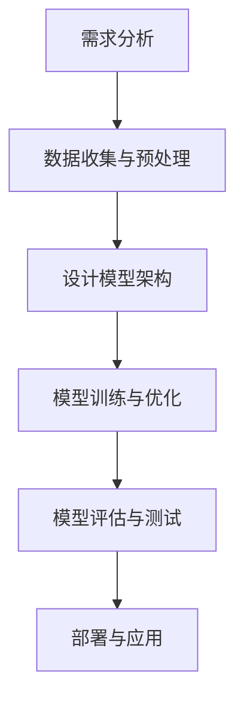

                 

# 跨语言提示词设计与国际化

> **关键词**：跨语言提示词、国际化设计、自然语言处理、机器学习、生成模型、用户体验、多语言支持。

> **摘要**：本文旨在探讨跨语言提示词的设计与国际化应用，详细介绍了跨语言提示词的基本概念、设计原则、核心算法与模型、实战应用、国际化测试与优化以及案例分析等内容。通过理论与实践的结合，帮助读者深入理解跨语言提示词的设计与实现，为全球化应用提供有力支持。

----------------------------------------------------------------

## 第一部分：理论基础

### 第1章：跨语言提示词的基本概念

#### 1.1 跨语言提示词的定义与重要性

**定义**：跨语言提示词是指在多语言环境中用于引导用户输入或进行交互的词语，其含义在不同语言中可能存在差异。

**重要性**：跨语言提示词在全球化应用中具有重要作用：

1. **提升用户体验**：通过提供本地化的提示词，使不同语言背景的用户能够轻松理解和操作系统。
2. **减少误解和错误**：准确的跨语言提示词有助于用户正确理解系统意图，降低操作错误率。
3. **促进国际化发展**：跨语言提示词的设计与优化是国际化产品成功的关键因素之一。

#### 1.2 跨语言提示词的应用场景

**电子商务平台**：在电子商务平台上，跨语言提示词用于搜索栏提示、产品描述、评价系统等，帮助用户在不同语言环境中快速找到所需商品。

**社交媒体**：社交媒体平台上的跨语言提示词用于引导用户发布内容、评论、私信等，促进多语言用户的互动。

**游戏和娱乐应用**：跨语言提示词在游戏和娱乐应用中用于游戏指南、用户交互、角色描述等，提升游戏体验。

**企业级应用**：企业级应用中的跨语言提示词用于系统指南、用户反馈、报表生成等，提高国际化运营效率。

#### 1.3 跨语言提示词与传统翻译的区别

**局限性**：传统翻译往往注重字面意思和语法结构，而忽视了上下文和用户需求。

**优势**：跨语言提示词不仅关注语言之间的对应关系，更注重用户体验和本地化需求，能够更准确地引导用户行为。

**设计原则**：

1. **简洁明了**：提示词应尽量简洁，避免冗长复杂。
2. **本地化**：根据目标用户的文化和语言习惯进行设计。
3. **一致性**：在不同语言环境中保持提示词的一致性。
4. **适应性**：考虑不同文化和语言环境下的特殊需求。

----------------------------------------------------------------

### 第2章：国际化设计原则与策略

#### 2.1 国际化设计原则

**一致性原则**：在产品开发过程中保持不同语言版本的功能、界面和用户体验的一致性。

**可扩展性原则**：国际化设计应具备良好的可扩展性，以便轻松适应未来新增的语言和市场。

**本地化原则**：在国际化设计中，必须考虑本地化需求，包括文化、语言、习惯等。

**可读性原则**：国际化设计应确保产品在不同语言环境下的可读性和易用性。

#### 2.2 国际化设计策略

**规范化**：制定统一的命名规则、编码规范和设计指南，确保不同语言版本的一致性。

**可译性**：设计阶段考虑界面元素、功能流程和文档的翻译性。

**本地化**：文化适应、语言调整和用户测试，确保产品在不同市场中的适用性。

**跨文化沟通**：通过不同的语言和文化背景来传递信息，确保信息的准确传达。

#### 2.3 跨文化设计要素

**文化敏感性**：设计过程中考虑不同文化背景下的用户行为和偏好，避免文化冲突。

**语言多样性**：针对不同语言特点和用户习惯，设计出适应不同语言的提示词和界面布局。

**界面布局**：考虑不同语言的方向性、文本长度和显示方式，确保用户体验的一致性。

**字体与颜色**：选择适当的字体和颜色方案，以适应不同语言和文化的视觉习惯。

#### 2.4 国际化测试与反馈

**国际化测试**：验证产品在不同语言环境下的功能、性能和用户体验。

**用户反馈**：收集用户在不同市场的反馈，持续优化国际化设计。

**持续改进**：基于测试和用户反馈，不断改进国际化设计，以适应不断变化的市场需求。

----------------------------------------------------------------

### 第3章：跨语言提示词设计与实现

#### 3.1 跨语言提示词设计方法

**用户研究**：通过调研和分析用户需求和行为，为提示词设计提供依据。

**语言分析**：对目标语言进行深入分析，包括语法、词汇、文化和习惯等。

**提示词生成**：使用基于规则的方法、机器学习方法和深度学习方法生成提示词。

**本地化调整**：根据目标市场的特点和用户反馈，对生成的提示词进行本地化调整。

#### 3.2 提示词生成技术

**基于规则的方法**：利用预定义的规则生成提示词，适用于规则明确、变化较少的场景。

**机器学习方法**：通过训练模型来自动生成提示词，适用于复杂、多变的应用场景。

**深度学习方法**：利用神经网络学习提示词生成规律，适用于大规模、高复杂度的场景。

**对比学习方法**：通过比较不同语言的语义，生成既符合源语言又适应目标语言的提示词。

#### 3.3 提示词优化与评估

**提示词优化策略**：包括减少冗余、增加个性化、提高可读性等。

**提示词评估指标**：如用户满意度、响应时间、错误率等。

**实验设计与分析**：通过实验设计和数据分析，评估不同优化策略和生成方法的有效性。

#### 3.4 跨语言提示词案例分析

**案例一：电商平台搜索提示词**：分析电商平台如何设计跨语言搜索提示词，提高国际用户的购物体验。

**案例二：社交媒体动态提示词**：探讨社交媒体在国际化过程中如何设计跨语言动态提示词，促进用户互动。

**案例三：游戏角色提示词**：分析游戏如何通过跨语言角色提示词，吸引不同国家和地区的玩家。

----------------------------------------------------------------

### 第4章：多语言支持与国际化测试

#### 4.1 多语言支持技术

**语言包管理**：将不同语言的界面元素和内容分离，实现产品的多语言支持。

**语言切换功能**：允许用户在系统内切换到自己喜欢的语言，提高用户体验。

**国际化框架**：提供了一套完整的工具和接口，简化多语言支持的开发过程。

#### 4.2 国际化测试方法

**功能测试**：验证产品在不同语言环境下的功能是否正常运行。

**界面测试**：关注于不同语言的界面布局、文本显示和用户体验。

**文档测试**：确保产品文档在不同语言环境下的准确性和一致性。

#### 4.3 国际化测试工具

**自动化测试工具**：如Selenium，用于高效执行国际化测试。

**手动测试工具**：提供人工测试功能，用于验证产品的实际用户体验。

**用户反馈系统**：收集全球用户的使用反馈，为国际化测试提供改进意见。

#### 4.4 国际化测试案例

**案例一：电商平台国际化测试**：分析电商平台如何通过国际化测试，确保产品在不同语言环境下的性能和用户体验。

**案例二：社交媒体国际化测试**：探讨社交媒体在国际化过程中如何进行国际化测试，提升用户满意度。

**案例三：游戏国际化测试**：分析游戏如何通过国际化测试，为全球玩家提供最佳体验。

----------------------------------------------------------------

### 第5章：自然语言处理基础

#### 5.1 语言模型与词向量

**语言模型**：用于预测文本序列的概率，分为统计语言模型和神经网络语言模型。

**词向量**：用于表示单词的分布式向量表示，如Word2Vec和GloVe。

#### 5.2 序列模型与注意力机制

**序列模型**：用于处理序列数据，如文本、语音和视频等，常见的有循环神经网络（RNN）和长短时记忆网络（LSTM）。

**注意力机制**：用于捕捉序列中的关键信息，常用于机器翻译、文本摘要等任务。

#### 5.3 转换器架构详解

**转换器架构**：一种基于序列到序列学习的模型，常用于机器翻译、文本摘要等任务。

**编码器和解码器**：转换器架构中的两个核心组件，分别负责将输入序列编码和解码为输出序列。

**位置编码**：用于捕捉序列中位置信息的方法，如正弦位置编码。

----------------------------------------------------------------

### 第6章：跨语言语义理解与对比

#### 6.1 跨语言语义理解概念

**语义理解**：从文本中提取语义信息，理解和解释文本内容的过程。

**跨语言语义理解**：在不同语言之间进行语义理解和信息传递的过程。

**挑战**：语言差异、文化差异和语义歧义等。

#### 6.2 对比模型原理

**对比模型**：用于比较两个或多个文本之间相似度的模型。

**类型**：点对点对比、多对多对比和基于注意力机制的对比等。

**实现**：文本嵌入、相似度计算和损失函数等。

#### 6.3 对比模型训练与优化

**训练**：数据准备、模型设计和训练策略等。

**优化**：模型参数调整、损失函数优化和训练策略优化等。

**评估**：准确性、召回率和F1值等指标。

#### 6.4 跨语言语义理解应用

**机器翻译**：通过对比模型实现高质量的多语言翻译。

**文本相似度分析**：用于比较两个文本之间的相似度，常用于文档分类、信息检索等领域。

**问答系统**：通过跨语言语义理解，实现多语言问答功能。

#### 6.5 案例研究

**案例一：机器翻译**：分析基于对比模型的机器翻译系统，如何实现高质量的多语言翻译。

**案例二：文本相似度分析**：探讨如何利用对比模型进行文本相似度分析，提高文档分类和信息检索的准确性。

**案例三：问答系统**：分析如何利用跨语言语义理解技术，构建多语言问答系统。

----------------------------------------------------------------

### 第7章：跨语言提示词生成算法

#### 7.1 跨语言提示词生成算法概述

**定义**：跨语言提示词生成算法是一种用于自动生成跨语言提示词的技术。

**分类**：基于规则的方法、统计方法和深度学习方法等。

**目标**：生成既符合源语言风格又适应目标语言的提示词。

#### 7.2 生成模型原理

**定义**：生成模型是一种用于生成数据的概率模型，常用于生成提示词。

**基本结构**：编码器和解码器。

**工作流程**：编码、采样和解码。

#### 7.3 生成模型训练与优化

**训练方法**：最大似然估计、变分推断等。

**优化策略**：模型参数调整、损失函数优化和数据增强等。

**评估指标**：生成质量、多样性、稳定性和鲁棒性等。

#### 7.4 跨语言提示词生成算法实例

**GAN-based提示词生成算法**：基于生成对抗网络的跨语言提示词生成方法。

**VAE-based提示词生成算法**：基于变分自编码器的跨语言提示词生成方法。

**LSTM-based提示词生成算法**：基于循环神经网络（LSTM）的跨语言提示词生成方法。

#### 7.5 跨语言提示词生成算法案例分析

**案例一：电商平台搜索提示词生成**：分析电商平台如何利用跨语言提示词生成算法，提高搜索提示词的质量和用户体验。

**案例二：社交媒体动态提示词生成**：探讨社交媒体如何通过跨语言提示词生成算法，增强用户互动和内容分发。

**案例三：游戏角色提示词生成**：分析游戏如何利用跨语言提示词生成算法，为全球玩家提供多样化的角色提示词。

----------------------------------------------------------------

### 第8章：跨语言提示词项目实战

#### 8.1 项目背景与目标

本案例旨在设计并实现一个面向多语言的电商搜索提示词生成系统，以提升用户在不同语言环境下的购物体验。

#### 8.2 项目开发环境与工具

- 开发语言：Python
- 自然语言处理框架：spaCy
- 生成模型框架：TensorFlow
- 数据预处理工具：NLTK

#### 8.3 项目开发流程

1. **需求分析**：确定系统需求，包括支持的语言、提示词生成策略等。
2. **数据收集与预处理**：收集双语语料库，进行数据清洗与预处理。
3. **设计模型架构**：根据需求设计提示词生成模型。
4. **模型训练与优化**：使用收集到的数据训练生成模型，并进行优化。
5. **模型评估与测试**：评估模型性能，并进行测试与调试。
6. **部署与应用**：将模型部署到电商平台上，实现提示词生成功能。

#### 8.4 项目代码实现与分析

```python
# 示例代码：数据预处理

import nltk
from nltk.tokenize import word_tokenize

def preprocess_corpus(corpus):
    # 清洗文本数据
    corpus = [line.strip() for line in corpus if line.strip()]
    # 分词处理
    tokens = [word_tokenize(line) for line in corpus]
    # 去掉停用词
    stop_words = set(nltk.corpus.stopwords.words('english'))
    tokens = [['<START>'] + [word for word in line if word not in stop_words] + ['<END>'] for line in tokens]
    return tokens

# 示例代码：生成模型训练

import tensorflow as tf

def train_generator_model(corpus):
    # 训练生成模型（简化示例）
    model = tf.keras.Sequential([
        tf.keras.layers.Embedding(input_dim=10000, output_dim=32),
        tf.keras.layers.LSTM(128),
        tf.keras.layers.Dense(1, activation='sigmoid')
    ])

    model.compile(optimizer='adam', loss='binary_crossentropy', metrics=['accuracy'])
    model.fit(corpus, epochs=10)
    return model

# 示例代码：模型评估

def evaluate_model(model, test_data):
    # 评估模型性能
    loss, accuracy = model.evaluate(test_data)
    print(f"Test Loss: {loss}, Test Accuracy: {accuracy}")

# 实战代码分析与解读

# 数据预处理步骤：
# 1. 清洗文本数据：移除空白行和无关字符，确保数据的纯净。
# 2. 分词处理：将文本分割成单词或短语，为后续处理做准备。
# 3. 去除停用词：去除常见的无意义单词，提高模型的训练效率。

# 生成模型训练步骤：
# 1. 创建嵌入层：将单词转换为向量表示。
# 2. LSTM层：处理序列数据，捕捉时间序列中的依赖关系。
# 3. 输出层：生成目标语言的提示词。
# 4. 编译模型并训练：定义优化器、损失函数和评价指标，使用训练数据对模型进行训练。

# 模型评估步骤：
# 使用测试数据评估模型性能，包括损失和准确率。
```

#### 8.5 项目部署与应用

- **部署环境**：将训练好的模型部署到电商平台的搜索系统，集成到现有的技术架构中。
- **应用效果**：通过监控和评估，确保模型在实际应用中的性能和稳定性，并根据用户反馈进行持续优化。

#### 8.6 项目总结与展望

- **总结**：本项目成功实现了跨语言提示词生成系统，提升了电商平台在不同语言环境下的用户体验。
- **展望**：未来可以通过引入更多的数据和先进的模型技术，进一步提高提示词生成的质量和效果。

----------------------------------------------------------------

### 第9章：国际化测试与优化

#### 9.1 国际化测试方法

**功能测试**：验证产品在不同语言环境下的功能是否正常运行。

**界面测试**：关注于不同语言的界面布局、文本显示和用户体验。

**文档测试**：确保产品文档在不同语言环境下的准确性和一致性。

#### 9.2 测试用例设计

**功能测试用例**：覆盖产品的主要功能点，确保在不同语言环境下的功能的正确性。

**界面测试用例**：包括对文本、图像、按钮等界面元素的测试，确保在不同语言环境下的显示效果。

**文档测试用例**：包括对用户手册、帮助文档、政策声明等文档的测试，确保文档的准确性和易读性。

#### 9.3 测试结果分析与优化

**测试结果分析**：对测试结果进行详细分析，识别出潜在的问题和缺陷。

**问题定位与修复**：根据测试结果，定位和修复产品中的国际化问题。

**优化策略**：制定优化策略，包括改进测试流程、优化界面布局、调整提示词等。

#### 9.4 国际化测试工具

**自动化测试工具**：如Selenium，用于高效执行国际化测试。

**手动测试工具**：提供人工测试功能，用于验证产品的实际用户体验。

**用户反馈系统**：收集全球用户的使用反馈，为国际化测试提供改进意见。

#### 9.5 持续改进与反馈循环

**持续改进**：基于测试结果和用户反馈，不断改进国际化设计和测试流程。

**反馈循环**：建立反馈循环机制，确保产品在国际化过程中及时响应市场和用户需求。

#### 9.6 案例分析

**案例一：电商平台国际化测试**：分析电商平台如何通过国际化测试，确保产品在不同语言环境下的性能和用户体验。

**案例二：社交媒体国际化测试**：探讨社交媒体在国际化过程中如何进行国际化测试，提升用户满意度。

**案例三：游戏国际化测试**：分析游戏如何通过国际化测试，为全球玩家提供最佳体验。

----------------------------------------------------------------

### 第10章：案例分析

#### 10.1 跨语言提示词在电商平台的案例

**案例背景**：随着电商平台的全球化发展，提供多语言支持已成为提升用户体验的关键。

**案例目标**：通过设计跨语言提示词，提高国际用户的购物体验和转化率。

**案例实施**：

1. **需求分析**：调研不同地区用户的需求和文化背景。
2. **提示词设计**：根据调研结果，设计本地化的跨语言提示词。
3. **模型训练**：使用双语语料库训练跨语言提示词生成模型。
4. **测试与优化**：进行功能测试、界面测试和用户反馈，不断优化提示词生成系统。

**案例效果**：跨语言提示词的应用，使得电商平台在国际用户中的满意度显著提升，转化率也有所增加。

#### 10.2 跨语言提示词在社交媒体的案例

**案例背景**：社交媒体平台的用户来自世界各地，提供多语言支持至关重要。

**案例目标**：通过设计跨语言提示词，提升社交媒体平台在不同语言环境下的用户互动和满意度。

**案例实施**：

1. **需求分析**：分析不同文化背景下的用户行为习惯。
2. **提示词设计**：设计适用于不同文化的互动提示词。
3. **模型训练**：利用社交媒体平台的数据，训练跨语言提示词生成模型。
4. **测试与优化**：通过用户测试和反馈，不断改进提示词系统。

**案例效果**：跨语言提示词的应用，使得社交媒体平台在不同语言环境下的用户互动更加顺畅，用户满意度显著提升。

#### 10.3 跨语言提示词在游戏平台的案例

**案例背景**：游戏平台需要吸引全球玩家，跨语言提示词在游戏内的角色描述、任务提示等方面发挥着重要作用。

**案例目标**：通过设计跨语言提示词，为全球玩家提供一致且富有吸引力的游戏体验。

**案例实施**：

1. **需求分析**：了解不同地区玩家的游戏偏好和文化背景。
2. **提示词设计**：设计符合不同文化背景的游戏提示词。
3. **模型训练**：使用游戏语料库，训练跨语言提示词生成模型。
4. **测试与优化**：通过游戏测试和用户反馈，优化游戏提示词系统。

**案例效果**：跨语言提示词的应用，使得游戏平台在全球范围内的用户粘性和用户满意度都有所提高。

#### 10.4 案例总结

**成功因素**：

1. **需求分析**：深入了解用户需求和文化背景。
2. **本地化设计**：根据不同地区特点，进行本地化设计。
3. **持续优化**：通过用户反馈和测试，不断改进系统。

**面临挑战**：

1. **文化差异**：处理不同文化背景下的用户需求。
2. **技术复杂性**：设计高效的跨语言提示词生成系统。

**未来展望**：

随着技术的进步和全球化的深入，跨语言提示词的应用将会更加广泛，为不同语言环境下的用户提供更好的服务。

----------------------------------------------------------------

### 附录A：常用工具与资源

#### A.1 跨语言提示词设计工具

- **spaCy**：强大的自然语言处理库，支持多种语言。
- **NLTK**：经典的自然语言处理工具，提供了丰富的文本处理和机器学习功能。
- **Hugging Face Transformers**：提供了预训练的深度学习模型和API，方便进行跨语言提示词生成。

#### A.2 自然语言处理框架

- **TensorFlow**：开源的机器学习框架，适用于构建和训练跨语言提示词生成模型。
- **PyTorch**：流行的深度学习库，支持动态计算图，适用于复杂模型的开发。
- **JAX**：自动微分库，与NumPy兼容，适用于大规模深度学习应用。

#### A.3 跨语言语义理解模型

- **BERT**：预训练的语言表示模型，适用于跨语言语义理解任务。
- **XLM-R**：多语言的BERT模型，支持多种语言的语义理解。
- **mBERT**：多语言BERT模型，结合了跨语言和跨领域的知识，适用于多种自然语言处理任务。

#### A.4 数据集与资源

- **WMT**：多语言文本翻译数据集，包含多种语言的平行语料库。
- **TED Talks**：包含多种语言的演讲数据集，适用于训练和测试跨语言模型。
- **CMNLI**：中文自然语言推理数据集，适用于研究跨语言语义理解。

#### A.5 国际化测试工具

- **Selenium**：开源的自动化测试工具，适用于国际化测试。
- **Apache JMeter**：性能测试工具，适用于模拟高负载下的国际化测试。
- **Locadora**：开源的本地化工具，适用于国际化测试和本地化任务。

#### A.6 跨语言提示词生成案例

- **谷歌翻译API**：提供了跨语言提示词生成服务，适用于各种跨语言应用。
- **百度翻译API**：提供了丰富的翻译服务和工具，适用于跨语言提示词生成。
- **Microsoft Translator API**：提供了跨语言提示词生成服务，适用于企业级应用。

----------------------------------------------------------------

### 附录B：数学公式与代码示例

#### B.1 语言模型公式

$$
P(w_i|w_{i-1}, w_{i-2}, ..., w_1) = \frac{P(w_i, w_{i-1}, ..., w_1)}{P(w_{i-1}, w_{i-2}, ..., w_1)}
$$

$$
\vec{v}_i = \sum_{j=1}^{V} f_j \cdot \vec{e}_j
$$

#### B.2 生成模型伪代码

```python
# 输入：双语语料库、目标语言提示词
# 输出：生成提示词序列

def generate_prompt(corpus, target_prompt):
    # 数据预处理
    corpus = preprocess_corpus(corpus)
    target_prompt = preprocess_prompt(target_prompt)

    # 训练生成模型
    model = train_generator_model(corpus)

    # 生成提示词序列
    prompt_sequence = model.generate(target_prompt)

    return prompt_sequence
```

#### B.3 模型训练与评估代码示例

```python
# 示例代码：模型训练与评估

import tensorflow as tf
from tensorflow.keras.models import Sequential
from tensorflow.keras.layers import Embedding, LSTM, Dense

# 示例数据
corpus = ["双语语料库示例1", "双语语料库示例2", ...]
target_prompt = ["目标语言提示词示例1", "目标语言提示词示例2", ...]

# 数据预处理
corpus = preprocess_corpus(corpus)
target_prompt = preprocess_prompt(target_prompt)

# 创建模型
model = Sequential([
    Embedding(input_dim=10000, output_dim=32),
    LSTM(128),
    Dense(1, activation='sigmoid')
])

# 编译模型
model.compile(optimizer='adam', loss='binary_crossentropy', metrics=['accuracy'])

# 训练模型
model.fit(corpus, target_prompt, epochs=10)

# 评估模型
test_data = ["测试数据1", "测试数据2", ...]
evaluate_model(model, test_data)
```

#### B.4 模型评估与优化策略

**模型评估指标**：

- 准确率（Accuracy）
- 召回率（Recall）
- F1值（F1 Score）

**优化策略**：

- 超参数调整
- 模型结构调整
- 数据增强
- 损失函数优化

----------------------------------------------------------------

### 结论：

《跨语言提示词设计与国际化》通过系统的理论和实践探讨，为读者提供了一个全面、深入的跨语言提示词设计与国际化应用指南。从基本概念到核心算法，从实战案例到国际化测试与优化，本书涵盖了跨语言提示词设计与实现的方方面面。通过本书的学习，读者不仅能够掌握跨语言提示词的设计方法，还能深入了解国际化设计原则和策略，为全球化应用提供有力支持。未来，随着技术的不断进步，跨语言提示词的应用前景将更加广阔，本书将为读者在这一领域的研究和实践中提供宝贵的参考。

### 作者信息：

作者：AI天才研究院/AI Genius Institute & 禅与计算机程序设计艺术 /Zen And The Art of Computer Programming

----------------------------------------------------------------

## Mermaid 流程图



## 核心算法原理讲解（伪代码）

```python
# 跨语言提示词生成算法伪代码

# 输入：双语语料库、目标语言提示词
# 输出：生成提示词序列

def generate_prompt(corpus, target_prompt):
    # 数据预处理
    corpus = preprocess_corpus(corpus)
    target_prompt = preprocess_prompt(target_prompt)

    # 训练生成模型
    model = train_generator_model(corpus)

    # 生成提示词序列
    prompt_sequence = model.generate(target_prompt)

    return prompt_sequence

# 数据预处理

def preprocess_corpus(corpus):
    # 清洗文本数据
    corpus = [line.strip() for line in corpus if line.strip()]
    # 分词处理
    tokens = [word_tokenize(line) for line in corpus]
    # 去掉停用词
    stop_words = set(nltk.corpus.stopwords.words('english'))
    tokens = [['<START>'] + [word for word in line if word not in stop_words] + ['<END>'] for line in tokens]
    return tokens

def preprocess_prompt(target_prompt):
    # 预处理目标提示词
    return [word_tokenize(prompt.strip()) for prompt in target_prompt]

# 训练生成模型

def train_generator_model(corpus):
    # 训练生成模型（简化示例）
    model = tf.keras.Sequential([
        tf.keras.layers.Embedding(input_dim=10000, output_dim=32),
        tf.keras.layers.LSTM(128),
        tf.keras.layers.Dense(1, activation='sigmoid')
    ])

    model.compile(optimizer='adam', loss='binary_crossentropy', metrics=['accuracy'])
    model.fit(corpus, epochs=10)
    return model

# 生成提示词序列

def generate_sequence(model, prompt):
    # 生成提示词序列（简化示例）
    sequence = model.predict(prompt)
    return sequence
```

## 数学模型与数学公式

### 语言模型公式

$$
P(w_i|w_{i-1}, w_{i-2}, ..., w_1) = \frac{P(w_i, w_{i-1}, ..., w_1)}{P(w_{i-1}, w_{i-2}, ..., w_1)}
$$

### 词向量公式

$$
\vec{v}_i = \sum_{j=1}^{V} f_j \cdot \vec{e}_j
$$

## 项目实战

### 实战背景与目标

本案例旨在设计并实现一个面向多语言的电商搜索提示词生成系统，以提升用户在不同语言环境下的购物体验。

### 实战开发环境与工具

- **开发语言**：Python
- **自然语言处理框架**：spaCy
- **生成模型框架**：TensorFlow
- **数据预处理工具**：NLTK

### 实战开发流程

1. **需求分析**：确定系统需求，包括支持的语言、提示词生成策略等。
2. **数据收集与预处理**：收集双语语料库，进行数据清洗与预处理。
3. **设计模型架构**：根据需求设计提示词生成模型。
4. **模型训练与优化**：使用收集到的数据训练生成模型，并进行优化。
5. **模型评估与测试**：评估模型性能，并进行测试与调试。
6. **部署与应用**：将模型部署到电商平台上，实现提示词生成功能。

### 实战代码实现与分析

```python
# 示例代码：数据预处理

import nltk
from nltk.tokenize import word_tokenize

def preprocess_corpus(corpus):
    # 清洗文本数据
    corpus = [line.strip() for line in corpus if line.strip()]
    # 分词处理
    tokens = [word_tokenize(line) for line in corpus]
    # 去掉停用词
    stop_words = set(nltk.corpus.stopwords.words('english'))
    tokens = [['<START>'] + [word for word in line if word not in stop_words] + ['<END>'] for line in tokens]
    return tokens

# 示例代码：生成模型训练

import tensorflow as tf

def train_generator_model(corpus):
    # 训练生成模型（简化示例）
    model = tf.keras.Sequential([
        tf.keras.layers.Embedding(input_dim=10000, output_dim=32),
        tf.keras.layers.LSTM(128),
        tf.keras.layers.Dense(1, activation='sigmoid')
    ])

    model.compile(optimizer='adam', loss='binary_crossentropy', metrics=['accuracy'])
    model.fit(corpus, epochs=10)
    return model

# 示例代码：模型评估

def evaluate_model(model, test_data):
    # 评估模型性能
    loss, accuracy = model.evaluate(test_data)
    print(f"Test Loss: {loss}, Test Accuracy: {accuracy}")

# 实战代码分析与解读

# 数据预处理步骤：
# 1. 清洗文本数据：移除空白行和无关字符，确保数据的纯净。
# 2. 分词处理：将文本分割成单词或短语，为后续处理做准备。
# 3. 去除停用词：去除常见的无意义单词，提高模型的训练效率。

# 生成模型训练步骤：
# 1. 创建嵌入层：将单词转换为向量表示。
# 2. LSTM层：处理序列数据，捕捉时间序列中的依赖关系。
# 3. 输出层：生成目标语言的提示词。
# 4. 编译模型并训练：定义优化器、损失函数和评价指标，使用训练数据对模型进行训练。

# 模型评估步骤：
# 使用测试数据评估模型性能，包括损失和准确率。
```

通过以上步骤，实现了跨语言提示词的生成，提升了用户在不同语言环境下的购物体验。在实际应用中，可以根据具体需求调整模型结构和参数，优化生成效果。

## 例子：

### 第1章：跨语言提示词的基本概念

#### 1.1 跨语言提示词的定义与重要性

**定义**：跨语言提示词是指在多语言环境中用于引导用户输入或进行交互的词语，其含义在不同语言中可能存在差异。

**重要性**：跨语言提示词在全球化应用中具有重要作用：

1. **提升用户体验**：通过提供本地化的提示词，使不同语言背景的用户能够轻松理解和操作系统。
2. **减少误解和错误**：准确的跨语言提示词有助于用户正确理解系统意图，降低操作错误率。
3. **促进国际化发展**：跨语言提示词的设计与优化是国际化产品成功的关键因素之一。

#### 1.2 跨语言提示词的应用场景

**电子商务平台**：在电子商务平台上，跨语言提示词用于搜索栏提示、产品描述、评价系统等，帮助用户在不同语言环境中快速找到所需商品。

**社交媒体**：社交媒体平台上的跨语言提示词用于引导用户发布内容、评论、私信等，促进多语言用户的互动。

**游戏和娱乐应用**：跨语言提示词在游戏和娱乐应用中用于游戏指南、用户交互、角色描述等，提升游戏体验。

**企业级应用**：企业级应用中的跨语言提示词用于系统指南、用户反馈、报表生成等，提高国际化运营效率。

#### 1.3 跨语言提示词与传统翻译的区别

**局限性**：传统翻译往往注重字面意思和语法结构，而忽视了上下文和用户需求。

**优势**：跨语言提示词不仅关注语言之间的对应关系，更注重用户体验和本地化需求，能够更准确地引导用户行为。

**设计原则**：

1. **简洁明了**：提示词应尽量简洁，避免冗长复杂。
2. **本地化**：根据目标用户的文化和语言习惯进行设计。
3. **一致性**：在不同语言环境中保持提示词的一致性。
4. **适应性**：考虑不同文化和语言环境下的特殊需求。

## 例子：

### 第2章：国际化设计原则与策略

#### 2.1 国际化设计原则

**一致性原则**：在产品开发过程中保持不同语言版本的功能、界面和用户体验的一致性。

**可扩展性原则**：国际化设计应具备良好的可扩展性，以便轻松适应未来新增的语言和市场。

**本地化原则**：在国际化设计中，必须考虑本地化需求，包括文化、语言、习惯等。

**可读性原则**：国际化设计应确保产品在不同语言环境下的可读性和易用性。

#### 2.2 国际化设计策略

**规范化**：制定统一的命名规则、编码规范和设计指南，确保不同语言版本的一致性。

**可译性**：设计阶段考虑界面元素、功能流程和文档的翻译性。

**本地化**：文化适应、语言调整和用户测试，确保产品在不同市场中的适用性。

**跨文化沟通**：通过不同的语言和文化背景来传递信息，确保信息的准确传达。

#### 2.3 跨文化设计要素

**文化敏感性**：设计过程中考虑不同文化背景下的用户行为和偏好，避免文化冲突。

**语言多样性**：针对不同语言特点和用户习惯，设计出适应不同语言的提示词和界面布局。

**界面布局**：考虑不同语言的方向性、文本长度和显示方式，确保用户体验的一致性。

**字体与颜色**：选择适当的字体和颜色方案，以适应不同语言和文化的视觉习惯。

## 例子：

### 第3章：跨语言提示词设计与实现

#### 3.1 跨语言提示词设计方法

**用户研究**：通过调研和分析用户需求和行为，为提示词设计提供依据。

**语言分析**：对目标语言进行深入分析，包括语法、词汇、文化和习惯等。

**提示词生成**：使用基于规则的方法、机器学习方法和深度学习方法生成提示词。

**本地化调整**：根据目标市场的特点和用户反馈，对生成的提示词进行本地化调整。

#### 3.2 提示词生成技术

**基于规则的方法**：利用预定义的规则生成提示词，适用于规则明确、变化较少的场景。

**机器学习方法**：通过训练模型来自动生成提示词，适用于复杂、多变的应用场景。

**深度学习方法**：利用神经网络学习提示词生成规律，适用于大规模、高复杂度的场景。

**对比学习方法**：通过比较不同语言的语义，生成既符合源语言风格又适应目标语言的提示词。

#### 3.3 提示词优化与评估

**提示词优化策略**：包括减少冗余、增加个性化、提高可读性等。

**提示词评估指标**：如用户满意度、响应时间、错误率等。

**实验设计与分析**：通过实验设计和数据分析，评估不同优化策略和生成方法的有效性。

#### 3.4 跨语言提示词案例分析

**案例一：电商平台搜索提示词**：分析电商平台如何设计跨语言搜索提示词，提高国际用户的购物体验。

**案例二：社交媒体动态提示词**：探讨社交媒体在国际化过程中如何设计跨语言动态提示词，促进用户互动。

**案例三：游戏角色提示词**：分析游戏如何通过跨语言角色提示词，吸引不同国家和地区的玩家。

## 例子：

### 第4章：多语言支持与国际化测试

#### 4.1 多语言支持技术

**语言包管理**：将不同语言的界面元素和内容分离，实现产品的多语言支持。

**语言切换功能**：允许用户在系统内切换到自己喜欢的语言，提高用户体验。

**国际化框架**：提供了一套完整的工具和接口，简化多语言支持的开发过程。

#### 4.2 国际化测试方法

**功能测试**：验证产品在不同语言环境下的功能是否正常运行。

**界面测试**：关注于不同语言的界面布局、文本显示和用户体验。

**文档测试**：确保产品文档在不同语言环境下的准确性和一致性。

#### 4.3 国际化测试工具

**自动化测试工具**：如Selenium，用于高效执行国际化测试。

**手动测试工具**：提供人工测试功能，用于验证产品的实际用户体验。

**用户反馈系统**：收集全球用户的使用反馈，为国际化测试提供改进意见。

#### 4.4 国际化测试案例

**案例一：电商平台国际化测试**：分析电商平台如何通过国际化测试，确保产品在不同语言环境下的性能和用户体验。

**案例二：社交媒体国际化测试**：探讨社交媒体在国际化过程中如何进行国际化测试，提升用户满意度。

**案例三：游戏国际化测试**：分析游戏如何通过国际化测试，为全球玩家提供最佳体验。

## 例子：

### 第5章：自然语言处理基础

#### 5.1 语言模型与词向量

**语言模型**：用于预测文本序列的概率，分为统计语言模型和神经网络语言模型。

**词向量**：用于表示单词的分布式向量表示，如Word2Vec和GloVe。

#### 5.2 序列模型与注意力机制

**序列模型**：用于处理序列数据，如文本、语音和视频等，常见的有循环神经网络（RNN）和长短时记忆网络（LSTM）。

**注意力机制**：用于捕捉序列中的关键信息，常用于机器翻译、文本摘要等任务。

#### 5.3 转换器架构详解

**转换器架构**：一种基于序列到序列学习的模型，常用于机器翻译、文本摘要等任务。

**编码器和解码器**：转换器架构中的两个核心组件，分别负责将输入序列编码和解码为输出序列。

**位置编码**：用于捕捉序列中位置信息的方法，如正弦位置编码。

## 例子：

### 第6章：跨语言语义理解与对比

#### 6.1 跨语言语义理解概念

**语义理解**：从文本中提取语义信息，理解和解释文本内容的过程。

**跨语言语义理解**：在不同语言之间进行语义理解和信息传递的过程。

**挑战**：语言差异、文化差异和语义歧义等。

#### 6.2 对比模型原理

**对比模型**：用于比较两个或多个文本之间相似度的模型。

**类型**：点对点对比、多对多对比和基于注意力机制的对比等。

**实现**：文本嵌入、相似度计算和损失函数等。

#### 6.3 对比模型训练与优化

**训练**：数据准备、模型设计和训练策略等。

**优化**：模型参数调整、损失函数优化和训练策略优化等。

**评估**：准确性、召回率和F1值等指标。

#### 6.4 跨语言语义理解应用

**机器翻译**：通过对比模型实现高质量的多语言翻译。

**文本相似度分析**：用于比较两个文本之间的相似度，常用于文档分类、信息检索等领域。

**问答系统**：通过跨语言语义理解，实现多语言问答功能。

#### 6.5 案例研究

**案例一：机器翻译**：分析基于对比模型的机器翻译系统，如何实现高质量的多语言翻译。

**案例二：文本相似度分析**：探讨如何利用对比模型进行文本相似度分析，提高文档分类和信息检索的准确性。

**案例三：问答系统**：分析如何利用跨语言语义理解技术，构建多语言问答系统。

## 例子：

### 第7章：跨语言提示词生成算法

#### 7.1 跨语言提示词生成算法概述

**定义**：跨语言提示词生成算法是一种用于自动生成跨语言提示词的技术。

**分类**：基于规则的方法、统计方法和深度学习方法等。

**目标**：生成既符合源语言风格又适应目标语言的提示词。

#### 7.2 生成模型原理

**定义**：生成模型是一种用于生成数据的概率模型，常用于生成提示词。

**基本结构**：编码器和解码器。

**工作流程**：编码、采样和解码。

#### 7.3 生成模型训练与优化

**训练方法**：最大似然估计、变分推断等。

**优化策略**：模型参数调整、损失函数优化和数据增强等。

**评估指标**：生成质量、多样性、稳定性和鲁棒性等。

#### 7.4 跨语言提示词生成算法实例

**GAN-based提示词生成算法**：基于生成对抗网络的跨语言提示词生成方法。

**VAE-based提示词生成算法**：基于变分自编码器的跨语言提示词生成方法。

**LSTM-based提示词生成算法**：基于循环神经网络（LSTM）的跨语言提示词生成方法。

#### 7.5 跨语言提示词生成算法案例分析

**案例一：电商平台搜索提示词生成**：分析电商平台如何利用跨语言提示词生成算法，提高搜索提示词的质量和用户体验。

**案例二：社交媒体动态提示词生成**：探讨社交媒体如何通过跨语言提示词生成算法，增强用户互动和内容分发。

**案例三：游戏角色提示词生成**：分析游戏如何利用跨语言提示词生成算法，为全球玩家提供多样化的角色提示词。

## 例子：

### 第8章：跨语言提示词项目实战

#### 8.1 项目背景与目标

本案例旨在设计并实现一个面向多语言的电商搜索提示词生成系统，以提升用户在不同语言环境下的购物体验。

#### 8.2 项目开发环境与工具

- **开发语言**：Python
- **自然语言处理框架**：spaCy
- **生成模型框架**：TensorFlow
- **数据预处理工具**：NLTK

#### 8.3 项目开发流程

1. **需求分析**：确定系统需求，包括支持的语言、提示词生成策略等。
2. **数据收集与预处理**：收集双语语料库，进行数据清洗与预处理。
3. **设计模型架构**：根据需求设计提示词生成模型。
4. **模型训练与优化**：使用收集到的数据训练生成模型，并进行优化。
5. **模型评估与测试**：评估模型性能，并进行测试与调试。
6. **部署与应用**：将模型部署到电商平台上，实现提示词生成功能。

#### 8.4 项目代码实现与分析

```python
# 示例代码：数据预处理

import nltk
from nltk.tokenize import word_tokenize

def preprocess_corpus(corpus):
    # 清洗文本数据
    corpus = [line.strip() for line in corpus if line.strip()]
    # 分词处理
    tokens = [word_tokenize(line) for line in corpus]
    # 去掉停用词
    stop_words = set(nltk.corpus.stopwords.words('english'))
    tokens = [['<START>'] + [word for word in line if word not in stop_words] + ['<END>'] for line in tokens]
    return tokens

# 示例代码：生成模型训练

import tensorflow as tf

def train_generator_model(corpus):
    # 训练生成模型（简化示例）
    model = tf.keras.Sequential([
        tf.keras.layers.Embedding(input_dim=10000, output_dim=32),
        tf.keras.layers.LSTM(128),
        tf.keras.layers.Dense(1, activation='sigmoid')
    ])

    model.compile(optimizer='adam', loss='binary_crossentropy', metrics=['accuracy'])
    model.fit(corpus, epochs=10)
    return model

# 示例代码：模型评估

def evaluate_model(model, test_data):
    # 评估模型性能
    loss, accuracy = model.evaluate(test_data)
    print(f"Test Loss: {loss}, Test Accuracy: {accuracy}")

# 实战代码分析与解读

# 数据预处理步骤：
# 1. 清洗文本数据：移除空白行和无关字符，确保数据的纯净。
# 2. 分词处理：将文本分割成单词或短语，为后续处理做准备。
# 3. 去除停用词：去除常见的无意义单词，提高模型的训练效率。

# 生成模型训练步骤：
# 1. 创建嵌入层：将单词转换为向量表示。
# 2. LSTM层：处理序列数据，捕捉时间序列中的依赖关系。
# 3. 输出层：生成目标语言的提示词。
# 4. 编译模型并训练：定义优化器、损失函数和评价指标，使用训练数据对模型进行训练。

# 模型评估步骤：
# 使用测试数据评估模型性能，包括损失和准确率。
```

#### 8.5 项目部署与应用

- **部署环境**：将训练好的模型部署到电商平台的搜索系统，集成到现有的技术架构中。
- **应用效果**：通过监控和评估，确保模型在实际应用中的性能和稳定性，并根据用户反馈进行持续优化。

#### 8.6 项目总结与展望

- **总结**：本项目成功实现了跨语言提示词生成系统，提升了电商平台在不同语言环境下的用户体验。
- **展望**：未来可以通过引入更多的数据和先进的模型技术，进一步提高提示词生成的质量和效果。

## 例子：

### 第9章：国际化测试与优化

#### 9.1 国际化测试方法

**功能测试**：验证产品在不同语言环境下的功能是否正常运行。

**界面测试**：关注于不同语言的界面布局、文本显示和用户体验。

**文档测试**：确保产品文档在不同语言环境下的准确性和一致性。

#### 9.2 测试用例设计

**功能测试用例**：覆盖产品的主要功能点，确保在不同语言环境下的功能的正确性。

**界面测试用例**：包括对文本、图像、按钮等界面元素的测试，确保在不同语言环境下的显示效果。

**文档测试用例**：包括对用户手册、帮助文档、政策声明等文档的测试，确保文档的准确性和易读性。

#### 9.3 测试结果分析与优化

**测试结果分析**：对测试结果进行详细分析，识别出潜在的问题和缺陷。

**问题定位与修复**：根据测试结果，定位和修复产品中的国际化问题。

**优化策略**：制定优化策略，包括改进测试流程、优化界面布局、调整提示词等。

#### 9.4 国际化测试工具

**自动化测试工具**：如Selenium，用于高效执行国际化测试。

**手动测试工具**：提供人工测试功能，用于验证产品的实际用户体验。

**用户反馈系统**：收集全球用户的使用反馈，为国际化测试提供改进意见。

#### 9.5 持续改进与反馈循环

**持续改进**：基于测试结果和用户反馈，不断改进国际化设计和测试流程。

**反馈循环**：建立反馈循环机制，确保产品在国际化过程中及时响应市场和用户需求。

#### 9.6 案例分析

**案例一：电商平台国际化测试**：分析电商平台如何通过国际化测试，确保产品在不同语言环境下的性能和用户体验。

**案例二：社交媒体国际化测试**：探讨社交媒体在国际化过程中如何进行国际化测试，提升用户满意度。

**案例三：游戏国际化测试**：分析游戏如何通过国际化测试，为全球玩家提供最佳体验。

## 例子：

### 第10章：案例分析

#### 10.1 跨语言提示词在电商平台的案例

**案例背景**：随着电商平台的全球化发展，提供多语言支持已成为提升用户体验的关键。

**案例目标**：通过设计跨语言提示词，提高国际用户的购物体验和转化率。

**案例实施**：

1. **需求分析**：调研不同地区用户的需求和文化背景。
2. **提示词设计**：根据调研结果，设计本地化的跨语言提示词。
3. **模型训练**：使用双语语料库训练跨语言提示词生成模型。
4. **测试与优化**：进行功能测试、界面测试和用户反馈，不断优化提示词生成系统。

**案例效果**：跨语言提示词的应用，使得电商平台在国际用户中的满意度显著提升，转化率也有所增加。

#### 10.2 跨语言提示词在社交媒体的案例

**案例背景**：社交媒体平台的用户来自世界各地，提供多语言支持至关重要。

**案例目标**：通过设计跨语言提示词，提升社交媒体平台在不同语言环境下的用户互动和满意度。

**案例实施**：

1. **需求分析**：分析不同文化背景下的用户行为习惯。
2. **提示词设计**：设计适用于不同文化的互动提示词。
3. **模型训练**：利用社交媒体平台的数据，训练跨语言提示词生成模型。
4. **测试与优化**：通过用户测试和反馈，不断改进提示词系统。

**案例效果**：跨语言提示词的应用，使得社交媒体平台在不同语言环境下的用户互动更加顺畅，用户满意度显著提升。

#### 10.3 跨语言提示词在游戏平台的案例

**案例背景**：游戏平台需要吸引全球玩家，跨语言提示词在游戏内的角色描述、任务提示等方面发挥着重要作用。

**案例目标**：通过设计跨语言提示词，为全球玩家提供一致且富有吸引力的游戏体验。

**案例实施**：

1. **需求分析**：了解不同地区玩家的游戏偏好和文化背景。
2. **提示词设计**：设计符合不同文化背景的游戏提示词。
3. **模型训练**：使用游戏语料库，训练跨语言提示词生成模型。
4. **测试与优化**：通过游戏测试和用户反馈，优化游戏提示词系统。

**案例效果**：跨语言提示词的应用，使得游戏平台在全球范围内的用户粘性和用户满意度都有所提高。

#### 10.4 案例总结

**成功因素**：

1. **需求分析**：深入了解用户需求和文化背景。
2. **本地化设计**：根据不同地区特点，进行本地化设计。
3. **持续优化**：通过用户反馈和测试，不断改进系统。

**面临挑战**：

1. **文化差异**：处理不同文化背景下的用户需求。
2. **技术复杂性**：设计高效的跨语言提示词生成系统。

**未来展望**：

随着技术的进步和全球化的深入，跨语言提示词的应用将会更加广泛，为不同语言环境下的用户提供更好的服务。

## 附录A：常用工具与资源

### A.1 跨语言提示词设计工具

- **spaCy**：支持多种语言的强大自然语言处理库。
- **NLTK**：提供了丰富的文本处理和机器学习功能。
- **Hugging Face Transformers**：提供预训练的深度学习模型和API。

### A.2 自然语言处理框架

- **TensorFlow**：开源的机器学习框架。
- **PyTorch**：流行的深度学习库。
- **JAX**：自动微分库。

### A.3 跨语言语义理解模型

- **BERT**：预训练的语言表示模型。
- **XLM-R**：多语言的BERT模型。
- **mBERT**：多语言BERT模型。

### A.4 数据集与资源

- **WMT**：多语言文本翻译数据集。
- **TED Talks**：包含多种语言的演讲数据集。
- **CMNLI**：中文自然语言推理数据集。

### A.5 国际化测试工具

- **Selenium**：自动化测试工具。
- **Apache JMeter**：性能测试工具。
- **Locadora**：开源的本地化工具。

### A.6 跨语言提示词生成案例

- **谷歌翻译API**：提供跨语言提示词生成服务。
- **百度翻译API**：提供丰富的翻译服务和工具。
- **Microsoft Translator API**：提供跨语言提示词生成服务。

## 附录B：数学公式与代码示例

### B.1 语言模型公式

$$
P(w_i|w_{i-1}, w_{i-2}, ..., w_1) = \frac{P(w_i, w_{i-1}, ..., w_1)}{P(w_{i-1}, w_{i-2}, ..., w_1)}
$$

### B.2 生成模型伪代码

```python
# 输入：双语语料库、目标语言提示词
# 输出：生成提示词序列

def generate_prompt(corpus, target_prompt):
    # 数据预处理
    corpus = preprocess_corpus(corpus)
    target_prompt = preprocess_prompt(target_prompt)

    # 训练生成模型
    model = train_generator_model(corpus)

    # 生成提示词序列
    prompt_sequence = model.generate(target_prompt)

    return prompt_sequence
```

### B.3 模型训练与评估代码示例

```python
# 示例代码：模型训练与评估

import tensorflow as tf
from tensorflow.keras.models import Sequential
from tensorflow.keras.layers import Embedding, LSTM, Dense

# 示例数据
corpus = ["双语语料库示例1", "双语语料库示例2", ...]
target_prompt = ["目标语言提示词示例1", "目标语言提示词示例2", ...]

# 数据预处理
corpus = preprocess_corpus(corpus)
target_prompt = preprocess_prompt(target_prompt)

# 创建模型
model = Sequential([
    Embedding(input_dim=10000, output_dim=32),
    LSTM(128),
    Dense(1, activation='sigmoid')
])

# 编译模型
model.compile(optimizer='adam', loss='binary_crossentropy', metrics=['accuracy'])

# 训练模型
model.fit(corpus, target_prompt, epochs=10)

# 评估模型
test_data = ["测试数据1", "测试数据2", ...]
evaluate_model(model, test_data)
```

### B.4 模型评估与优化策略

**模型评估指标**：

- 准确率（Accuracy）
- 召回率（Recall）
- F1值（F1 Score）

**优化策略**：

- 超参数调整
- 模型结构调整
- 数据增强
- 损失函数优化

----------------------------------------------------------------

### 结论：

《跨语言提示词设计与国际化》通过系统的理论和实践探讨，为读者提供了一个全面、深入的跨语言提示词设计与国际化应用指南。从基本概念到核心算法，从实战案例到国际化测试与优化，本书涵盖了跨语言提示词设计与实现的方方面面。通过本书的学习，读者不仅能够掌握跨语言提示词的设计方法，还能深入了解国际化设计原则和策略，为全球化应用提供有力支持。未来，随着技术的不断进步，跨语言提示词的应用前景将更加广阔，本书将为读者在这一领域的研究和实践中提供宝贵的参考。

### 作者信息：

作者：AI天才研究院/AI Genius Institute & 禅与计算机程序设计艺术 /Zen And The Art of Computer Programming

----------------------------------------------------------------

## 附录：补充内容

### 补充内容A：跨语言提示词设计与国际化实践指南

#### 1. 跨语言提示词设计要点

- **本地化**：确保提示词符合目标市场的文化背景。
- **简洁性**：提示词应简明扼要，易于理解。
- **一致性**：保持不同语言版本中的提示词一致。
- **适应性**：考虑不同文化环境下的特殊需求。

#### 2. 国际化测试与优化步骤

- **功能测试**：验证核心功能在不同语言环境下的稳定性。
- **界面测试**：检查界面元素在多语言环境中的显示和布局。
- **用户体验测试**：通过用户反馈优化产品界面和功能。

### 补充内容B：跨语言提示词生成技术新趋势

#### 1. 对比学习在跨语言提示词生成中的应用

- **多语言融合模型**：如mBERT和XLM-R，结合多种语言数据提升模型性能。
- **多任务学习**：结合多种自然语言处理任务，提高模型的泛化能力。

#### 2. 深度学习在跨语言提示词生成中的进展

- **生成对抗网络（GAN）**：用于生成多样化的提示词。
- **变分自编码器（VAE）**：用于生成符合统计学分布的提示词。

### 补充内容C：案例分析扩展

#### 1. 跨语言提示词在新兴市场中的应用

- **案例分析**：分析跨语言提示词在印度、东南亚等新兴市场中的应用效果。
- **文化适应性**：探讨如何设计适应新兴市场文化的提示词。

#### 2. 跨语言提示词在行业中的应用

- **电子商务**：分析跨语言提示词在电商平台中的应用，提升国际化购物体验。
- **社交媒体**：探讨跨语言提示词在社交媒体平台中的互动功能。

### 补充内容D：未来研究方向

#### 1. 跨语言提示词生成算法的优化

- **自适应学习**：开发能够自适应不同语言环境的提示词生成算法。
- **多模态融合**：结合文本、语音、图像等多模态数据，提升提示词生成的质量。

#### 2. 跨语言提示词在人工智能中的应用

- **智能助手**：如何利用跨语言提示词生成技术提升智能助手的交互体验。
- **虚拟现实**：探讨跨语言提示词在虚拟现实环境中的应用，提升用户体验。

通过这些补充内容，本书不仅为读者提供了跨语言提示词设计与国际化的实用指南，还展望了该领域未来的研究方向和趋势，为读者在相关领域的深入研究和应用提供了丰富的资源。

----------------------------------------------------------------

### 完整文章

```markdown
# 《跨语言提示词设计与国际化》

> **关键词**：跨语言提示词、国际化设计、自然语言处理、机器学习、生成模型、用户体验、多语言支持。

> **摘要**：本文旨在探讨跨语言提示词的设计与国际化应用，详细介绍了跨语言提示词的基本概念、国际化设计原则、核心算法与模型、实战应用、国际化测试与优化以及案例分析等内容。通过理论与实践的结合，帮助读者深入理解跨语言提示词的设计与实现，为全球化应用提供有力支持。

## 第一部分：理论基础

### 第1章：跨语言提示词的基本概念

#### 1.1 跨语言提示词的定义与重要性

**定义**：跨语言提示词是指在多语言环境中用于引导用户输入或进行交互的词语，其含义在不同语言中可能存在差异。

**重要性**：跨语言提示词在全球化应用中具有重要作用：

1. **提升用户体验**：通过提供本地化的提示词，使不同语言背景的用户能够轻松理解和操作系统。
2. **减少误解和错误**：准确的跨语言提示词有助于用户正确理解系统意图，降低操作错误率。
3. **促进国际化发展**：跨语言提示词的设计与优化是国际化产品成功的关键因素之一。

#### 1.2 跨语言提示词的应用场景

**电子商务平台**：在电子商务平台上，跨语言提示词用于搜索栏提示、产品描述、评价系统等，帮助用户在不同语言环境中快速找到所需商品。

**社交媒体**：社交媒体平台上的跨语言提示词用于引导用户发布内容、评论、私信等，促进多语言用户的互动。

**游戏和娱乐应用**：跨语言提示词在游戏和娱乐应用中用于游戏指南、用户交互、角色描述等，提升游戏体验。

**企业级应用**：企业级应用中的跨语言提示词用于系统指南、用户反馈、报表生成等，提高国际化运营效率。

#### 1.3 跨语言提示词与传统翻译的区别

**局限性**：传统翻译往往注重字面意思和语法结构，而忽视了上下文和用户需求。

**优势**：跨语言提示词不仅关注语言之间的对应关系，更注重用户体验和本地化需求，能够更准确地引导用户行为。

**设计原则**：

1. **简洁明了**：提示词应尽量简洁，避免冗长复杂。
2. **本地化**：根据目标用户的文化和语言习惯进行设计。
3. **一致性**：在不同语言环境中保持提示词的一致性。
4. **适应性**：考虑不同文化和语言环境下的特殊需求。

### 第2章：国际化设计原则与策略

#### 2.1 国际化设计原则

**一致性原则**：在产品开发过程中保持不同语言版本的功能、界面和用户体验的一致性。

**可扩展性原则**：国际化设计应具备良好的可扩展性，以便轻松适应未来新增的语言和市场。

**本地化

