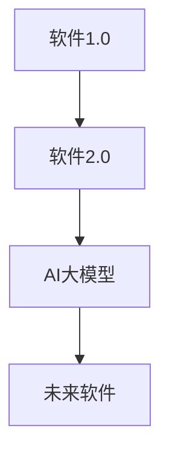

                 

# 《软件 2.0 的哲学思考：人工智能的本质》

> **关键词：** 软件哲学，人工智能，软件2.0，伦理问题，认知科学，数据管理，编程范式，软件开发实践。

> **摘要：** 本文将从软件哲学的角度探讨人工智能的本质，分析软件2.0时代的发展趋势及其在编程范式、数据管理和社会影响等方面的变革。通过深入剖析神经网络等核心算法原理，以及实际项目实战，本文旨在揭示人工智能在软件领域的广泛应用和未来发展潜力。

## 第一部分：软件哲学背景与AI本质

### 第1章：软件哲学概述

#### 1.1 软件发展的历史与趋势

软件的发展历程可以追溯到20世纪50年代，从最初的机器语言编程到高级编程语言的出现，再到软件工程学科的建立，软件的发展经历了多个阶段。其中，软件1.0时代主要关注代码的编写和维护，而软件2.0时代则强调软件系统的智能化和自适应能力。

软件2.0的核心在于将人工智能技术融入到软件系统中，使得软件能够自我学习和进化。这种变革不仅体现在技术层面，更涉及到哲学层面的思考。软件哲学关注软件的本质、价值以及与人类社会的互动关系。

#### 1.2 软件伦理与社会责任

随着软件技术的不断进步，软件的道德影响也逐渐凸显。软件伦理问题包括数据隐私、算法偏见、人工智能武器化等方面。在软件2.0时代，伦理问题更加复杂，需要从多个维度进行思考和解决。

软件伦理的决策框架包括以下几个方面：

1. **利益相关者分析**：确定软件系统的利益相关者，包括用户、开发者、企业、政府等。
2. **价值体系**：明确软件伦理的核心价值，如公正、透明、尊重用户隐私等。
3. **风险评估**：评估软件系统可能带来的风险，并制定相应的风险管理策略。
4. **法律法规**：遵循国家和国际的相关法律法规，确保软件系统的合法性和合规性。

#### 1.3 AI的基本哲学探讨

人工智能作为软件2.0时代的重要技术，其基本哲学探讨主要包括以下几个方面：

1. **AI的定义**：人工智能是指能够模拟人类智能行为的计算系统，包括感知、思考、决策、学习等方面。
2. **哲学背景**：人工智能的发展受到认知科学、心理学、哲学等领域的影响，其哲学背景涉及意识、认知、自由意志等问题。
3. **伦理问题**：人工智能的伦理问题主要包括歧视、隐私、安全等方面，需要从技术、法律、社会等多个层面进行探讨。

### 第2章：人工智能的本质

#### 2.1 人工智能的理论基础

人工智能的理论基础主要包括以下几个方面：

1. **计算机科学基础**：计算机科学为人工智能提供了算法、数据结构、计算理论等基础。
2. **机器学习与深度学习**：机器学习和深度学习是人工智能的核心技术，通过训练模型来模拟人类智能行为。
3. **自然语言处理**：自然语言处理使得人工智能能够理解和生成人类语言，是实现人机交互的重要手段。

#### 2.2 AI的认知与意识

人工智能的认知与意识问题是哲学领域的重要议题。目前，人工智能尚未达到真正的认知与意识水平，但其在某些方面已经展现出类似人类的智能行为。

1. **认知科学的视角**：认知科学关注人类思维过程和认知机制，为人工智能提供理论基础。
2. **意识与AI的关系**：意识是指个体对自己和外部世界的感知和认知，目前尚无明确的理论解释AI是否具有意识。

#### 2.3 人工智能的伦理挑战

人工智能的伦理挑战主要体现在以下几个方面：

1. **AI歧视问题**：人工智能模型可能因为训练数据中的偏见而导致歧视现象。
2. **自动驾驶安全**：自动驾驶技术涉及到人类生命安全，需要严格的安全保障措施。
3. **机器与人类共生的未来**：随着人工智能的发展，人类与机器的互动关系将发生深刻变化，需要探讨如何在共生中实现公平、和谐。

## 第二部分：软件哲学在AI中的应用

### 第3章：AI与编程范式变革

#### 3.1 传统编程与AI编程的差异

传统编程主要依赖于人类开发者编写代码，而AI编程则通过机器学习和深度学习等技术来自主生成代码。这种变革带来了编程逻辑的转变，使得软件开发过程更加智能化和自动化。

1. **编程逻辑的转变**：传统编程强调逻辑和算法，而AI编程则关注数据和模型。
2. **AI驱动的软件开发**：AI编程能够根据需求自动生成代码，提高开发效率和软件质量。

#### 3.2 软件工程与AI整合

AI技术在软件工程中的应用包括代码生成、自动化测试、性能优化等方面。AI驱动的软件开发能够大幅提高开发效率和质量，同时降低成本。

1. **AI驱动的代码生成**：AI技术能够根据需求自动生成代码，减少手工编写的工作量。
2. **自动化的软件开发流程**：AI技术可以自动化软件开发的各个环节，实现全程智能化。

#### 3.3 软件哲学在AI编程中的体现

软件哲学在AI编程中的体现主要包括以下几个方面：

1. **设计模式与AI的结合**：AI技术可以优化设计模式，提高软件系统的可维护性和扩展性。
2. **代码的可解释性与透明性**：AI编程需要确保代码的可解释性和透明性，以便开发者理解和调试。

### 第4章：人工智能时代的数据管理

#### 4.1 数据的本质与价值

数据是人工智能时代的核心资源，其本质是信息的载体。数据的价值主要体现在以下几个方面：

1. **数据的哲学思考**：数据不仅是信息的集合，还涉及到隐私、伦理等方面的问题。
2. **数据的价值评估**：数据的价值取决于其质量、可用性和独特性。

#### 4.2 大数据与AI的关系

大数据和人工智能技术的结合，使得数据处理和分析能力大幅提升。大数据为AI模型提供了丰富的训练数据，有助于提高模型的性能和准确性。

1. **大数据时代的挑战**：大数据带来了数据存储、处理和分析等方面的挑战。
2. **数据驱动的人工智能**：大数据和AI的结合，使得人工智能能够更好地应对复杂问题和大规模数据处理。

#### 4.3 数据伦理与隐私保护

数据伦理和隐私保护是人工智能时代的重要议题。数据伦理关注数据的收集、使用和保护，隐私保护则旨在确保个人数据的保密性和安全性。

1. **数据伦理问题**：数据伦理涉及数据所有权、知情同意、数据共享等方面。
2. **隐私保护法律框架**：隐私保护法律框架为数据管理和使用提供了法律依据和约束。

### 第5章：AI伦理与社会影响

#### 5.1 AI伦理的理论基础

AI伦理的理论基础包括以下几个方面：

1. **伦理决策框架**：AI伦理决策框架为处理AI伦理问题提供了理论指导。
2. **AI与人类价值观的冲突**：AI的发展可能对人类价值观产生冲击，需要探讨如何在两者之间实现平衡。

#### 5.2 社会责任与公平性

人工智能技术的发展对社会产生了深远的影响，需要关注社会责任和公平性问题。

1. **AI对劳动力市场的影响**：AI技术的发展可能对劳动力市场产生重大影响，需要制定相应的政策和社会保障措施。
2. **公平、透明、可解释的AI**：AI系统需要具备公平、透明和可解释性，以确保其对社会的影响是积极的。

#### 5.3 AI伦理的实施与监管

AI伦理的实施与监管是确保人工智能技术健康发展的重要环节。实施与监管需要从以下几个方面进行：

1. **全球AI伦理法规**：建立全球性的AI伦理法规，统一规范和标准。
2. **企业AI伦理管理实践**：企业应制定AI伦理管理政策，确保AI技术的研发和应用符合伦理要求。

## 第三部分：AI与软件未来

### 第6章：软件未来展望

#### 6.1 软件2.0的发展方向

软件2.0的发展方向包括以下几个方面：

1. **新兴技术与软件融合**：如物联网、云计算、区块链等新兴技术与软件的融合，将推动软件系统的智能化和协同化发展。
2. **软件智能化趋势**：软件将逐渐具备自我学习、自我优化和自适应能力，实现更加智能化的功能和服务。

#### 6.2 AI驱动的未来社会

AI驱动的未来社会将呈现出以下特点：

1. **未来的工作环境**：人工智能将改变传统的劳动力市场，出现新的职业和就业模式。
2. **生活与工作的智能化**：人工智能将渗透到人们生活的方方面面，提高生活质量和工作效率。

#### 6.3 软件哲学的未来思考

软件哲学的未来思考将关注以下几个方面：

1. **人类的角色与AI的协作**：在AI驱动的未来，人类与AI的协作将成为主流，实现人机共生。
2. **软件哲学的持续发展**：软件哲学将不断融合新的技术和社会变革，推动软件系统的进步和发展。

### 第7章：AI时代的软件开发实践

#### 7.1 AI驱动的软件开发方法

AI驱动的软件开发方法主要包括以下几个方面：

1. **实践案例分享**：通过分享实际项目案例，展示AI技术在软件开发中的应用和效果。
2. **AI在软件开发中的具体应用**：介绍AI技术在需求分析、代码生成、自动化测试等环节的具体应用。

#### 7.2 开发环境的构建与优化

开发环境的构建与优化是AI驱动的软件开发的关键环节。主要包括以下几个方面：

1. **工具与技术栈的选择**：选择合适的工具和技术栈，提高开发效率和软件质量。
2. **自动化与DevOps**：通过自动化和DevOps实践，实现快速迭代和持续集成，提高软件交付能力。

#### 7.3 AI时代的软件开发伦理

AI时代的软件开发伦理是确保人工智能技术健康发展的重要保障。主要包括以下几个方面：

1. **开发过程中的伦理问题**：在软件开发过程中，需要关注数据隐私、算法偏见、安全等方面的问题。
2. **AI伦理在开发实践中的应用**：将AI伦理理念融入软件开发过程中，确保软件系统的合法性和合规性。

## 附录

### 附录A：资源与工具推荐

#### A.1 主流AI框架介绍

- **TensorFlow**：Google开源的机器学习框架，广泛应用于深度学习和神经网络的开发。
- **PyTorch**：Facebook开源的机器学习框架，提供灵活的动态计算图，适用于研究和个人项目。
- **Keras**：Python编写的深度学习库，基于TensorFlow和Theano构建，提供简洁的API，适合快速原型设计。

#### A.2 AI伦理学习资源

- **伦理学经典书籍**：包括《人工智能伦理学》、《机器之心》等。
- **AI伦理课程推荐**：推荐在线课程和学习资源，如Coursera、edX等平台的相关课程。

#### A.3 实践项目与案例

- **AI驱动的软件项目案例**：介绍实际AI驱动的软件项目，展示项目的技术架构和实现细节。
- **深度学习与AI的实际应用案例**：分析深度学习和AI在不同领域的实际应用案例，探讨技术的优势和挑战。

---

**Mermaid 流程图：**



**核心算法原理讲解（以神经网络为例）：**

### 神经网络基础

神经网络是由大量简单单元（神经元）组成的复杂网络，这些神经元通过权重连接形成一个层次结构。以下是神经网络的基础概念：

#### 1. 神经元

神经元是神经网络的基本构建块。它接收输入信号，通过权重加权求和处理，然后通过激活函数产生输出。

$$
\text{神经元输出} = \sum_{i=1}^{n} w_{i} \cdot x_{i} + b
$$

其中，$w_{i}$ 是第 $i$ 个输入的权重，$x_{i}$ 是输入值，$b$ 是偏置项。

#### 2. 激活函数

激活函数用于将线性组合后的结果映射到非线性空间，使得神经网络能够学习复杂的函数。常见的激活函数有：

- **Sigmoid函数**：$1 / (1 + e^{-x})$
- **ReLU函数**：$max(0, x)$
- **Tanh函数**：$2 / (1 + e^{-2x}) - 1$

#### 3. 前向传播

前向传播是神经网络处理输入数据的过程。输入通过网络中的每个层次传递，直到最后输出。

```python
# 假设有一个简单的两层神经网络
# 输入层、隐藏层、输出层

# 前向传播
def forward_propagation(inputs, weights, biases):
    # 隐藏层输出
    hidden_output = np.dot(inputs, weights) + biases
    hidden_output = sigmoid(hidden_output)
    
    # 输出层输出
    output_output = np.dot(hidden_output, weights_output) + biases_output
    output_output = sigmoid(output_output)
    
    return output_output
```

**数学模型和数学公式：**

$$
\text{损失函数} = -\frac{1}{m} \sum_{i=1}^{m} y_{i} \cdot \log(a_{i}) + (1 - y_{i}) \cdot \log(1 - a_{i})
$$

其中，$m$ 是样本数量，$y_{i}$ 是真实标签，$a_{i}$ 是预测概率。

**项目实战：**

**代码实际案例：** 假设我们要构建一个简单的神经网络来对数字进行分类。

```python
# 导入库
import numpy as np

# 设置随机种子
np.random.seed(0)

# 初始化参数
input_size = 10
hidden_size = 5
output_size = 1

weights_input = np.random.randn(input_size, hidden_size)
weights_output = np.random.randn(hidden_size, output_size)

biases_input = np.random.randn(hidden_size)
biases_output = np.random.randn(output_size)

# 激活函数
def sigmoid(x):
    return 1 / (1 + np.exp(-x))

# 前向传播
def forward_propagation(x):
    hidden_layer_input = np.dot(x, weights_input) + biases_input
    hidden_layer_output = sigmoid(hidden_layer_input)
    
    output_layer_input = np.dot(hidden_layer_output, weights_output) + biases_output
    output_layer_output = sigmoid(output_layer_input)
    
    return output_layer_output

# 训练数据
x_train = np.array([[0, 0], [0, 1], [1, 0], [1, 1]])
y_train = np.array([[0], [1], [1], [0]])

# 训练神经网络
for i in range(10000):
    output = forward_propagation(x_train)

    # 反向传播（简化版）
    d_output = output - y_train
    d_hidden = d_output.dot(weights_output.T) * sigmoid_derivative(output)

    # 更新权重和偏置
    weights_output += hidden_layer_output.T.dot(d_output)
    weights_input += x_train.T.dot(d_hidden)
    biases_output += d_output
    biases_input += d_hidden

# 测试数据
x_test = np.array([[0.5, 0.5]])
output = forward_propagation(x_test)
print("预测结果：", output)
```

**代码解读与分析：**

- 在这个简单的神经网络中，我们使用了两个隐藏层。输入层有10个神经元，隐藏层有5个神经元，输出层有1个神经元。
- 我们初始化了权重和偏置，使用了随机数来初始化。
- 使用sigmoid函数作为激活函数，它可以将输出映射到0和1之间。
- 前向传播过程通过将输入乘以权重加上偏置，然后通过激活函数得到隐藏层的输出。再次重复这个过程，直到输出层得到最终输出。
- 我们使用简化版的后向传播来更新权重和偏置。通过计算输出误差，反向传播误差到隐藏层，然后使用链式法则更新参数。
- 在训练过程中，我们迭代10000次，每次迭代都更新参数，以最小化损失函数。

---

以上是《软件 2.0 的哲学思考：人工智能的本质》的完整目录大纲，包含核心概念、算法原理、数学模型、项目实战等内容。

## 作者信息

**作者：** AI天才研究院/AI Genius Institute & 禅与计算机程序设计艺术 /Zen And The Art of Computer Programming

---

文章标题：《软件 2.0 的哲学思考：人工智能的本质》

文章关键词：软件哲学，人工智能，软件2.0，伦理问题，认知科学，数据管理，编程范式

文章摘要：本文将从软件哲学的角度探讨人工智能的本质，分析软件2.0时代的发展趋势及其在编程范式、数据管理和社会影响等方面的变革。通过深入剖析神经网络等核心算法原理，以及实际项目实战，本文旨在揭示人工智能在软件领域的广泛应用和未来发展潜力。

