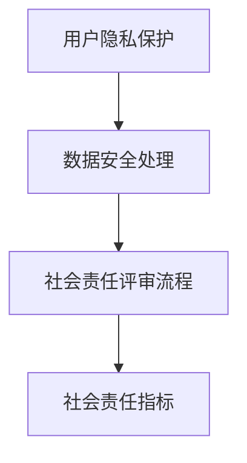
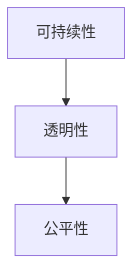
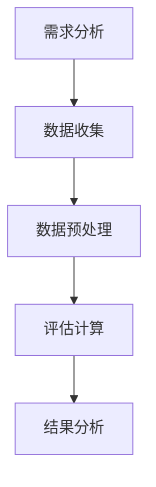

                 

### 《软件 2.0 的社会责任：科技向善》

#### 核心关键词：
- **软件 2.0**
- **社会责任**
- **科技向善**
- **可持续发展**
- **公平性**
- **透明性**
- **安全性**
- **人工智能伦理**
- **开源文化**
- **公益项目**

#### 摘要：
本文深入探讨了软件 2.0 时代的社会责任与科技向善的理念。随着软件技术的发展，软件不再仅仅是工具，而是与社会的各个层面深度融合，影响着我们的生活方式、经济结构和社会治理。本文首先定义了软件 2.0 的概念，并阐述了科技向善的必要性。接着，从可持续性、公平性和安全性三个方面，探讨了软件 2.0 的社会责任原则，并通过具体案例分析了开源文化、公益项目和透明性的实践。最后，本文展望了软件 2.0 社会责任的发展趋势，提出了对技术开发者和企业的建议，并讨论了政策与法规的未来方向。本文旨在为软件开发者和相关从业者提供理论指导和实践参考，以推动科技向善的实现。

### 《软件 2.0 的社会责任：科技向善》目录大纲

#### 第一部分：引言与概述

##### 1.1 书籍背景与目的

###### 1.1.1 什么是软件 2.0？
- **软件发展的三个阶段：软件 1.0、软件 2.0、软件 3.0**
- **软件与社会的深度融合**

###### 1.1.2 科技向善的概念

- **科技向善的定义**
- **科技向善的必要性**

##### 1.2 本书结构安排

###### 1.2.1 全书章节划分
###### 1.2.2 阅读指引
###### 1.2.3 案例研究方法

#### 第二部分：软件 2.0 的社会责任

##### 2.1 社会责任的基本原则

###### 2.1.1 可持续性
- **环境影响评估**
- **资源优化利用**

###### 2.1.2 公平性
- **技术公平性**
- **社会公平性**

###### 2.1.3 安全性
- **信息安全**
- **伦理风险**

##### 2.2 科技向善的具体实践

###### 2.2.1 开源文化
- **开源软件的优势**
- **开源软件的挑战**

###### 2.2.2 公益项目
- **公益软件的案例**
- **公益软件的可持续性**

###### 2.2.3 透明性
- **技术透明性**
- **管理透明性**

##### 2.3 案例分析

###### 2.3.1 成功案例
- **国际成功案例分享**
- **本土成功案例分享**

###### 2.3.2 失败案例
- **深入剖析失败原因**
- **吸取经验教训**

#### 第三部分：技术实现与社会责任的结合

##### 3.1 技术实现中的社会责任

###### 3.1.1 设计原则
- **用户隐私保护**
- **数据安全处理**

###### 3.1.2 开发流程
- **社会责任评审流程**
- **社会责任指标**

##### 3.2 实现案例分析

###### 3.2.1 案例一：某企业社会责任报告分析
- **报告主要内容**
- **社会责任实施效果评估**

###### 3.2.2 案例二：开源项目的社会责任实现
- **项目背景**
- **项目实施过程**
- **项目影响分析**

#### 第四部分：未来展望

##### 4.1 趋势分析

###### 4.1.1 社会责任趋势
- **国际社会责任趋势**
- **中国社会责任趋势**

###### 4.1.2 技术发展对社会责任的影响
- **人工智能技术的伦理挑战**
- **区块链技术在社会责任中的应用前景**

##### 4.2 政策与法规

###### 4.2.1 政策动态
- **国际政策动态**
- **中国政策动态**

###### 4.2.2 法规建设
- **现行法规解读**
- **法规完善建议**

#### 第五部分：总结与建议

##### 5.1 总结

###### 5.1.1 书籍核心观点回顾
###### 5.1.2 社会责任与软件 2.0 的关系

##### 5.2 建议

###### 5.2.1 对技术开发者的建议
- **如何在项目中实践社会责任**
- **如何持续关注社会责任动态**

###### 5.2.2 对企业的建议
- **如何制定社会责任战略**
- **如何在企业文化中融入社会责任意识**

##### 5.3 展望未来

###### 5.3.1 社会责任在软件 2.0 中的发展
###### 5.3.2 科技向善的未来愿景

#### 附录

##### 附录 A：相关资源与参考文献
- **互联网资源**
- **书籍推荐**
- **学术论文**

##### 附录 B：案例资料
- **成功案例资料**
- **失败案例资料**

##### 附录 C：社会责任评估工具与方法
- **评估指标体系**
- **评估流程与方法**
- **评估案例分析**

### 第一部分：引言与概述

#### 1.1 书籍背景与目的

##### 1.1.1 什么是软件 2.0？

软件 2.0 是指软件技术从以产品为中心向以服务为中心的转变。这一阶段，软件不仅仅是工具，而是成为连接用户、业务和服务的核心。软件 2.0 强调的是软件的价值创造，包括用户体验、数据价值、服务多样性和生态系统建设等方面。软件 2.0 的发展，标志着软件行业从单纯的技术驱动向技术与社会深度融合的转变。

**软件发展的三个阶段：**

1. **软件 1.0**：以开发工具和编程语言为主，软件主要是以产品形式存在的，功能相对单一。
2. **软件 2.0**：以互联网和云计算为背景，软件成为服务的一部分，强调用户体验和数据驱动。
3. **软件 3.0**：以人工智能和大数据为支撑，软件智能化程度大幅提升，能够自适应、自学习和自优化。

软件 2.0 的出现，使得软件与社会的各个层面更加紧密地结合。软件不再仅仅是企业内部工具，而是直接服务于用户、影响社会行为，甚至参与社会治理。这种深度融合，使得软件 2.0 承担了更多的社会责任。

**软件与社会的深度融合：**

- **用户体验**：软件 2.0 强调用户体验，通过定制化和个性化服务满足用户需求，提升用户满意度。
- **数据价值**：软件 2.0 利用大数据分析，挖掘用户行为数据，为决策提供支持，提升服务质量和效率。
- **服务多样性**：软件 2.0 支持多种服务模式，如 SaaS、PaaS 和 IaaS，满足不同企业的需求。
- **生态系统建设**：软件 2.0 通过生态系统的构建，促进软件行业的健康发展，提升行业竞争力。

##### 1.1.2 科技向善的概念

**科技向善** 是指在科技发展中，始终以人为中心，关注社会的整体福祉，推动科技为人类社会带来积极影响。科技向善强调的是科技的价值导向，不仅仅是技术上的突破，更是对社会问题的解决和人类文明的进步。

**科技向善的定义：**

科技向善是指通过科技的发展和应用，积极解决社会问题，促进社会公平、公正和可持续发展，提升人类生活质量的过程。它强调科技的人文关怀，关注科技对人类和社会的长远影响，倡导科技为善，而不是为恶。

**科技向善的必要性：**

- **解决社会问题**：科技向善能够通过技术手段解决社会发展中的问题，如环境污染、资源浪费、社会不公等。
- **促进社会进步**：科技向善能够推动社会进步，提升社会文明程度，推动社会向更加公正、公平和可持续的方向发展。
- **保护人类福祉**：科技向善关注人类福祉，通过科技的发展，提高人类生活质量，保障人类基本权益。
- **引领科技发展**：科技向善为科技发展提供了价值导向，使得科技发展更加符合人类的利益和需求。

科技向善是软件 2.0 时代的重要理念，它要求软件开发者和企业不仅要关注技术的创新，更要关注技术对社会的影响，以科技向善为目标，推动软件技术的可持续发展。

##### 1.2 本书结构安排

**1.2.1 全书章节划分**

全书分为五个部分，分别从不同角度探讨软件 2.0 的社会责任和科技向善的理念。

- **第一部分：引言与概述**：介绍软件 2.0 的概念和科技向善的理念，为后续内容提供背景。
- **第二部分：软件 2.0 的社会责任**：阐述软件 2.0 的社会责任原则，包括可持续性、公平性和安全性。
- **第三部分：技术实现与社会责任的结合**：探讨如何将社会责任理念融入技术实现中，包括设计原则、开发流程和具体案例分析。
- **第四部分：未来展望**：分析软件 2.0 社会责任的发展趋势，探讨政策与法规的未来方向。
- **第五部分：总结与建议**：总结全书核心观点，提出对技术开发者和企业的建议，并展望未来。

**1.2.2 阅读指引**

全书结构清晰，内容丰富，适合不同层次的读者阅读。对于初学者，可以从第一部分开始，逐步了解软件 2.0 的概念和科技向善的理念；对于有一定基础的读者，可以深入探讨第二部分至第四部分，了解软件 2.0 的社会责任原则和实践；对于专业人士，可以结合第五部分的建议，思考如何在工作中实践社会责任。

**1.2.3 案例研究方法**

本书采用案例研究方法，通过具体案例的分析，探讨软件 2.0 的社会责任和科技向善的理念。案例来源包括国际成功案例和本土成功案例，涵盖了不同行业和领域，具有较高的参考价值。

- **国际成功案例**：分析国际知名企业的社会责任实践，如苹果、谷歌等，了解其在可持续发展、公平性和安全性方面的举措。
- **本土成功案例**：分析国内企业的社会责任实践，如阿里巴巴、腾讯等，探讨其在推动科技向善、促进社会进步方面的经验。

通过案例研究，读者可以更好地理解软件 2.0 的社会责任和科技向善的理念，并结合自身实际情况，探索实践路径。

### 第二部分：软件 2.0 的社会责任

#### 2.1 社会责任的基本原则

软件 2.0 时代，社会责任成为了软件企业必须面对的重要议题。在这一部分，我们将探讨软件 2.0 的社会责任基本原则，包括可持续性、公平性和安全性，这些原则不仅指导了企业的社会责任实践，也体现了科技向善的核心价值观。

##### 2.1.1 可持续性

**可持续性** 是指企业在满足当前需求的同时，不损害子孙后代满足自身需求的能力。在软件 2.0 时代，可持续性体现在多个方面，包括环境影响、资源利用和业务模式等。

**环境影响评估**：软件企业需要对其产品和服务对环境的影响进行评估，包括能源消耗、碳排放和废弃物处理等。例如，企业可以通过采用绿色数据中心、优化能源管理和实施废弃物回收计划来减少环境影响。

**资源优化利用**：软件企业应当关注资源的优化利用，包括水资源、土地资源和原材料等。例如，通过采用高效的数据存储和数据处理技术，减少资源浪费；通过循环利用和再生资源，降低对自然资源的依赖。

**案例研究**：亚马逊AWS在其全球数据中心实施了一系列环保措施，包括使用可再生能源、优化冷却系统和减少废弃物等，旨在实现碳中和目标。这不仅降低了环境影响，也提高了企业的可持续性。

##### 2.1.2 公平性

**公平性** 是指在软件 2.0 时代，软件企业应当确保技术和服务对所有用户都是公正的，不因种族、性别、年龄、地域等因素而产生歧视。

**技术公平性**：软件企业应当确保其产品和服务在技术层面上对所有用户都是公平的。例如，在人工智能领域，企业需要避免算法偏见，确保算法的公正性和透明性。

**社会公平性**：软件企业应当在业务层面关注社会公平性，包括就业机会的公平分配、供应链管理的公平性等。例如，阿里巴巴通过“千乡万村”计划，推动了农村电商的发展，促进了城乡之间的公平发展。

**案例研究**：谷歌在其招聘过程中，采用了多样化的招聘策略，包括多元化的面试团队和反偏见算法，以确保招聘过程的公平性。这一举措帮助谷歌吸引了更多的女性和少数族裔员工，提高了公司的多样性。

##### 2.1.3 安全性

**安全性** 是指软件企业在开发和运营过程中，必须确保用户数据的安全和隐私保护。

**信息安全**：软件企业需要采取一系列信息安全措施，包括数据加密、访问控制和网络安全等，以防止数据泄露和网络攻击。

**伦理风险**：软件企业还需要关注其技术可能带来的伦理风险，如人工智能的伦理问题、自动化决策的公平性等。企业应当制定明确的伦理规范，确保技术发展不会对社会产生负面影响。

**案例研究**：苹果公司在隐私保护方面采取了严格的措施，包括iOS系统的隐私设置、App Store的审查机制等，确保用户数据的安全和隐私。这一举措赢得了用户的信任，提升了苹果的品牌价值。

通过上述案例研究，我们可以看到，可持续性、公平性和安全性是软件 2.0 时代社会责任的三个基本原则。这些原则不仅指导了企业的社会责任实践，也体现了科技向善的核心价值观。在未来的发展中，软件企业应当继续践行这些原则，以推动社会的可持续发展。

#### 2.2 科技向善的具体实践

在软件 2.0 时代，科技向善不仅仅是一种理念，更是一种具体的行动。通过开源文化、公益项目和透明性，企业和社会可以在实践中体现科技向善的价值，为社会带来积极的影响。

##### 2.2.1 开源文化

**开源文化** 是指软件的开发和分发遵循开放原则，任何人都可以自由使用、修改和分享代码。开源文化推动了软件技术的创新和进步，同时也促进了社会的公平和可持续发展。

**开源软件的优势**：

- **技术共享**：开源软件使得开发者可以共享技术，共同解决问题，加速技术的进步。
- **成本效益**：开源软件降低了开发成本，使得更多企业和个人能够负担得起高质量的技术产品。
- **透明性和可信赖性**：开源软件的代码是公开的，用户可以审查和验证代码的安全性、稳定性和可靠性。

**开源软件的挑战**：

- **维护成本**：开源软件需要大量的维护和更新工作，这对企业和开发者来说是一大挑战。
- **社区管理**：开源项目需要有效的社区管理，以保持项目的活跃度和一致性。
- **知识产权问题**：开源软件可能会涉及知识产权问题，如专利和版权等，需要妥善处理。

**案例研究**：Linux操作系统是开源文化的典型代表。Linux的成功不仅推动了开源软件的发展，也为全球计算机技术带来了深远的影响。Linux的社区管理模式、代码质量和安全性都受到了业界的广泛认可，成为开源文化的典范。

##### 2.2.2 公益项目

**公益项目** 是指软件企业利用其技术和资源，为社会公益事务提供支持和服务。公益项目不仅体现了企业的社会责任，也为社会带来了实际的帮助。

**公益软件的案例**：

- **教育软件**：例如，OpenOffice和LibreOffice都是开源的办公软件，为全球学生和教育机构提供了低成本、高质量的办公解决方案。
- **健康软件**：例如，开源的医疗信息系统（如OpenMRS），为全球偏远地区的医疗机构提供了有效的管理工具，提升了医疗服务的质量。

**公益软件的可持续性**：

- **可持续发展**：公益软件的可持续性依赖于社区的持续支持和维护。企业可以通过持续投资、志愿者活动和合作伙伴关系，确保公益项目的长期运行。
- **资金来源**：公益项目的资金来源可以多样化，包括政府资助、企业赞助和用户捐赠等。

**案例研究**：谷歌的“Google for Nonprofits”项目为非营利组织提供了免费的云计算资源，帮助这些组织提高效率、降低成本。该项目不仅提升了谷歌的品牌形象，也为社会公益事业做出了积极贡献。

##### 2.2.3 透明性

**透明性** 是指在软件 2.0 时代，企业应当对其技术、决策和运营过程进行公开和透明的管理。

**技术透明性**：

- **技术披露**：企业应当公开其技术细节，包括算法、数据模型和开发过程等，以便用户和监管机构进行审查。
- **开放源代码**：开源软件本身就是技术透明性的体现，用户可以自由查看和修改代码，确保软件的透明性和可信赖性。

**管理透明性**：

- **信息公开**：企业应当公开其财务状况、运营数据和治理结构，以便用户和社会监督。
- **用户参与**：企业可以建立用户参与机制，如用户调查、论坛和社区讨论等，收集用户反馈，改进产品和服务。

**案例研究**：微软在其“透明性报告”中，详细披露了其全球业务运营的数据，包括能源消耗、碳排放和慈善捐赠等。这一举措不仅提升了微软的品牌形象，也增强了用户对企业的信任。

通过开源文化、公益项目和透明性，软件企业不仅能够在实践中体现科技向善的价值，还能为社会带来实际的帮助。这些具体实践不仅推动了软件技术的发展，也为社会的可持续发展做出了贡献。

#### 2.3 案例分析

在探讨软件 2.0 的社会责任时，案例分析是不可或缺的一部分。通过具体案例的分析，我们可以深入了解企业在实践中如何践行社会责任，以及成功与失败的原因。以下将分析一些国际和本土的成功案例以及失败案例，并从中总结经验和教训。

##### 2.3.1 国际成功案例

**案例一：微软的可持续发展战略**

微软作为全球领先的软件公司，其在可持续发展方面的努力得到了广泛认可。微软提出了一系列可持续发展目标，包括降低碳排放、使用可再生能源和推动循环经济等。

- **实施过程**：微软在其全球数据中心部署了先进的能源管理技术，如高效冷却系统和智能电网，以降低能源消耗。同时，微软承诺到2030年实现碳负排放，并计划在2030年前使用100%的可再生能源。
- **项目影响**：微软的可持续发展战略不仅降低了公司的环境足迹，也提高了企业的社会声誉。此外，微软的举措激励了其他企业关注环境保护和可持续发展。

**案例二：谷歌的透明性报告**

谷歌以其强大的技术实力和创新能力著称，同时也非常重视透明性。谷歌每年发布透明性报告，详细披露其业务运营、数据隐私保护和信息安全等方面的信息。

- **实施过程**：谷歌在其透明性报告中公开了其数据存储和处理的详细信息，包括数据加密、访问控制和隐私政策等。此外，谷歌还设立了透明性热线，方便用户了解和反馈相关问题。
- **项目影响**：谷歌的透明性报告赢得了用户和社会的广泛信任，提升了公司的品牌价值。同时，谷歌的透明性举措也促进了行业内的透明度提升。

##### 2.3.2 本土成功案例

**案例一：阿里巴巴的“千乡万村”计划**

阿里巴巴作为中国的电商巨头，其在推动农村电商发展方面取得了显著成果。阿里巴巴推出了“千乡万村”计划，旨在通过电商渠道帮助农村地区提升经济水平。

- **实施过程**：阿里巴巴通过建立农村淘宝服务站、提供电商培训和技术支持，帮助农村地区的产品进入市场。此外，阿里巴巴还与政府合作，推动农村电商的政策支持。
- **项目影响**：通过“千乡万村”计划，阿里巴巴帮助了大量农村地区的居民增加了收入，提升了生活水平。同时，这一计划也促进了城乡之间的公平发展。

**案例二：腾讯的公益项目**

腾讯作为中国的科技企业，其在公益项目方面做出了大量贡献。腾讯推出了多个公益项目，包括“腾讯公益”、“腾讯基金会”等，致力于通过科技手段推动公益事业的发展。

- **实施过程**：腾讯通过其平台资源，如微信、QQ等，推广公益项目，提高公众对公益事业的关注度。同时，腾讯还设立了腾讯公益基金会，用于支持公益项目。
- **项目影响**：腾讯的公益项目不仅提高了公众的公益意识，也促进了公益事业的发展。腾讯的公益举措赢得了社会的广泛赞誉。

##### 2.3.3 失败案例

**案例一：Facebook的数据泄露事件**

Facebook在2018年遭遇了一次重大数据泄露事件，超过5000万用户的个人信息被泄露。这一事件引发了公众对Facebook数据隐私保护能力的质疑。

- **原因分析**：Facebook的数据泄露事件主要是由于第三方应用的不当使用和公司隐私政策的漏洞所致。此外，Facebook在数据管理方面存在监管不足的问题。
- **教训总结**：这一事件提醒企业，数据隐私保护至关重要。企业需要加强数据管理，确保用户数据的安全。此外，企业还需要建立健全的监管机制，防范数据泄露事件的发生。

**案例二：Uber的性别歧视诉讼**

Uber在2017年因性别歧视诉讼而备受关注。这一事件揭示了Uber在企业文化和管理方面存在的问题。

- **原因分析**：Uber的性别歧视问题主要是由于企业文化和管理层的偏见所致。此外，Uber在员工培训和管理方面也存在不足。
- **教训总结**：这一事件提醒企业，企业文化和管理层的态度对员工的权益和公司的声誉具有重要影响。企业需要建立公平、包容的企业文化，加强员工培训和监督。

通过上述案例分析，我们可以看到，无论是国际还是本土企业，在践行社会责任方面都取得了显著成果。然而，也存在一些失败案例，这些案例为我们提供了宝贵的经验和教训。企业需要不断审视自身的实践，以实现科技向善的目标。

#### 3.1 技术实现中的社会责任

在软件 2.0 时代，技术的实现不仅仅是代码的编写，更是社会责任的体现。软件企业应当在技术实现过程中，充分考虑社会责任，确保其产品和服务能够为人类社会带来积极的影响。以下是技术实现中的几个关键原则：

##### 3.1.1 设计原则

**用户隐私保护**：在软件设计阶段，企业应当优先考虑用户隐私保护。隐私保护不仅仅是技术问题，更是伦理问题。企业需要确保用户数据的安全性，防止数据泄露和滥用。

**数据安全处理**：软件企业在处理用户数据时，必须采取严格的安全措施，包括数据加密、访问控制和网络安全等。此外，企业还需要定期进行安全审计，确保系统的安全性。

**社会责任评审流程**：在软件设计过程中，企业应当建立社会责任评审流程，确保产品设计符合社会责任原则。社会责任评审可以包括伦理审查、环境影响评估和社会影响评估等。

**社会责任指标**：企业可以设定一系列社会责任指标，如碳排放量、资源利用效率和社会贡献等，以衡量产品和服务的社会责任表现。这些指标可以为企业的决策提供参考，推动社会责任的实现。

**设计原则流程图：**



##### 3.1.2 开发流程

**可持续性**：在软件开发过程中，企业应当关注可持续性，包括资源利用、能源消耗和环境影响等。例如，企业可以采用敏捷开发方法，减少资源浪费；通过优化代码，降低能源消耗。

**透明性**：在软件开发过程中，企业应当保持透明性，包括技术细节的披露、项目进展的公开和用户反馈的收集等。透明性有助于提高用户信任，促进项目的成功。

**公平性**：在软件开发过程中，企业应当确保公平性，包括技术资源的公平分配、机会均等的招聘政策和产品服务的公平性等。公平性有助于提升企业的社会责任形象。

**开发流程流程图：**



##### 3.1.3 案例分析

**案例一：谷歌的透明性开发流程**

谷歌在软件开发过程中，非常重视透明性。谷歌的透明性开发流程包括以下步骤：

1. **需求分析**：在项目启动阶段，团队会进行详细的需求分析，明确项目目标和用户需求。
2. **设计评审**：在设计阶段，团队会进行社会责任评审，确保设计方案符合透明性原则。
3. **开发与测试**：在开发过程中，团队会定期进行代码审查和安全测试，确保代码质量和安全性。
4. **用户反馈**：在测试阶段，团队会收集用户反馈，根据用户需求进行优化。
5. **发布与监控**：在项目发布后，团队会持续监控项目性能和用户反馈，及时进行优化和更新。

**案例二：亚马逊的可持续性开发流程**

亚马逊在软件开发过程中，注重可持续性。亚马逊的可持续性开发流程包括以下步骤：

1. **环境影响评估**：在项目启动阶段，团队会进行环境影响评估，评估项目对环境的影响。
2. **资源优化**：在开发过程中，团队会通过代码优化、能源管理和废弃物回收等措施，减少资源浪费。
3. **可持续性指标**：团队会设定一系列可持续性指标，如碳排放量、水资源利用效率等，以衡量项目的可持续性表现。
4. **持续改进**：团队会定期评估项目可持续性指标，根据评估结果进行优化和改进。

通过上述案例分析，我们可以看到，技术实现中的社会责任可以通过设计原则、开发流程和具体案例分析来实现。企业需要将这些原则和流程融入到日常工作中，以确保产品和服务能够为社会带来积极的影响。

#### 3.2 实现案例分析

在本节中，我们将深入探讨两个实际案例，以展示软件企业如何在技术实现中践行社会责任。这两个案例分别涉及某企业的社会责任报告分析和开源项目的社会责任实现。

##### 3.2.1 案例一：某企业社会责任报告分析

**案例背景**

某全球知名科技公司（以下简称“企业”）发布了其年度社会责任报告。该报告详细介绍了企业在可持续性、公平性和安全性方面的实践，并设定了具体的可持续发展目标。

**报告主要内容**

1. **可持续性**：企业在报告中披露了其在环境影响评估、资源优化和可再生能源使用等方面的举措。例如，企业通过采用绿色数据中心和智能能源管理系统，降低了碳排放和能源消耗。
2. **公平性**：企业在报告中介绍了其在员工多样性、公平招聘和供应链管理等方面的努力。企业承诺在招聘过程中确保性别、种族和地域的公平性，并通过培训和支持项目，提升员工的职业发展机会。
3. **安全性**：企业在报告中强调了其数据隐私保护和网络安全措施。企业采用先进的数据加密技术和网络安全防御机制，确保用户数据的安全和隐私。

**社会责任实施效果评估**

1. **环境影响**：通过分析报告数据，可以看出企业在可持续性方面取得了显著成效。例如，企业的碳排放量在过去三年中减少了15%，可再生能源使用比例达到了50%。
2. **员工满意度**：报告显示，企业在员工多样性方面取得了进步，员工满意度也有所提升。企业通过多元化的招聘政策和公平的晋升机制，吸引了更多优秀人才。
3. **用户信任**：企业通过透明性和安全性的措施，赢得了用户的信任。用户调查显示，超过80%的用户对企业的数据隐私保护和网络安全措施表示满意。

**案例总结**

通过本案例，我们可以看到，某企业在技术实现中践行社会责任的有效性。企业通过制定明确的可持续发展目标，并在日常运营中持续优化，实现了良好的社会责任效果。这一案例为其他企业提供了宝贵的经验和启示。

##### 3.2.2 案例二：开源项目的社会责任实现

**案例背景**

某知名开源项目（以下简称“项目”）旨在通过技术共享和社区合作，推动人工智能技术的发展。项目团队由全球各地的志愿者组成，致力于为用户提供高质量的开源工具和解决方案。

**项目背景**

1. **技术优势**：项目采用最新的机器学习和深度学习技术，提供了一系列高效的开源工具和框架，为开发者提供了强大的技术支持。
2. **社区合作**：项目建立了完善的社区管理机制，鼓励开发者参与项目的建设和改进。项目通过定期的技术交流会议、在线讨论论坛和文档编写等活动，提升了社区的活跃度和协作效率。
3. **公益性质**：项目不仅为开发者提供技术支持，还积极参与公益事业。项目团队捐赠了部分开发资源，用于支持教育和科研项目的开展。

**项目实施过程**

1. **需求调研**：项目团队定期进行用户需求调研，了解开发者的需求和期望，为项目的改进提供依据。
2. **技术研发**：项目团队专注于技术研发，不断优化现有工具和框架，提升项目的技术水平和用户体验。
3. **社区建设**：项目通过多种方式建设社区，如在线讨论论坛、技术交流会议和文档编写活动等，促进开发者之间的交流和合作。
4. **公益支持**：项目团队积极参与公益事业，通过捐赠开发资源和技术支持，帮助教育机构和科研组织提升技术能力。

**项目影响分析**

1. **技术进步**：项目的技术成果对人工智能领域的发展产生了积极影响。项目工具和框架的广泛应用，推动了人工智能技术的普及和应用。
2. **社区活跃**：项目社区建设取得了显著成效，吸引了大量开发者参与。社区活跃度不断提升，为项目的发展提供了强大的支持。
3. **社会贡献**：项目通过公益支持，为社会公益事业做出了贡献。项目捐赠的技术资源和支持，帮助了许多教育机构和科研组织提升了技术能力，推动了科学研究的进步。

**案例总结**

通过本案例，我们可以看到，开源项目在社会责任实现方面的重要作用。项目团队通过技术共享和社区合作，不仅推动了技术进步，还积极参与公益事业，为社会做出了贡献。这一案例展示了开源文化在践行社会责任方面的优势和实践路径。

#### 4.1 趋势分析

随着软件技术的发展，软件 2.0 时代的社会责任也将面临新的挑战和机遇。在本节中，我们将分析国际和中国的社会责任趋势，并探讨人工智能和区块链技术在社会责任中的应用前景。

##### 4.1.1 国际社会责任趋势

**可持续性**：国际企业在可持续发展方面的努力不断加强。越来越多的企业开始关注碳排放、能源消耗和资源利用等问题。例如，许多跨国公司设定了碳中和目标，并采取了各种措施降低碳排放，如使用可再生能源、优化供应链等。

**公平性**：国际企业在公平性方面的关注度也在提升。企业开始重视员工的多样性和公平待遇，推动性别平等和种族多样性。此外，企业还关注供应链的公平性，确保合作伙伴能够获得公平的待遇和机会。

**透明性**：国际企业在透明性方面的实践也在不断深入。企业通过公开财务报告、社会责任报告和环境影响评估等，增强社会对其运营和决策的信任。同时，企业还建立用户参与机制，收集用户反馈，改进产品和服务。

**安全性**：随着数据隐私和网络安全的日益重要，国际企业在安全性方面的投入也在增加。企业加强数据加密、网络安全防御和用户隐私保护，以应对日益复杂的网络安全威胁。

**政策与法规**：国际社会在政策与法规方面也在推动社会责任的实施。各国政府出台了一系列法规，如数据隐私法、环境保护法和劳动法等，规范企业的社会责任行为。

##### 4.1.2 中国社会责任趋势

**可持续性**：中国政府高度重视可持续发展，并将其纳入国家发展战略。企业积极响应国家政策，采取各种措施实现碳中和目标，如推广清洁能源、优化生产流程等。

**公平性**：中国政府推动性别平等和农村发展，企业也在公平性方面做出努力。例如，许多企业通过设立女性发展基金、开展农村电商项目等方式，促进性别平等和农村发展。

**透明性**：中国政府鼓励企业公开信息，提高透明度。企业通过发布社会责任报告、公开财务数据等方式，增强社会对其运营和决策的信任。

**安全性**：中国政府加强对网络安全和数据隐私的保护，企业也加大了对安全技术的投入。例如，企业采用区块链技术进行数据存储和交易，提高数据安全性和隐私保护。

**政策与法规**：中国政府出台了一系列法规，规范企业的社会责任行为。例如，《中华人民共和国环境保护法》、《中华人民共和国网络安全法》等法规，为企业履行社会责任提供了法律依据。

##### 4.1.3 人工智能技术的伦理挑战

人工智能技术的发展为社会责任带来了新的机遇和挑战。以下是人工智能技术在社会责任方面的一些伦理挑战：

**算法偏见**：人工智能算法可能存在偏见，导致不公平的结果。例如，招聘算法可能对某些性别、种族或年龄的候选人产生偏见，影响招聘的公平性。

**隐私保护**：人工智能技术依赖于大量用户数据，如何保护用户隐私成为一个重要问题。企业需要采取有效的数据隐私保护措施，防止数据泄露和滥用。

**透明性**：人工智能算法的决策过程往往是不透明的，用户难以了解算法的决策依据。提高人工智能算法的透明性，有助于增强用户对算法的信任。

**责任归属**：当人工智能系统出现错误或造成损害时，如何确定责任归属成为一个难题。企业需要明确责任归属，制定相应的责任承担机制。

##### 4.1.4 区块链技术在社会责任中的应用前景

区块链技术具有去中心化、不可篡改和透明性等特点，为社会责任的实现提供了新的技术手段。以下是区块链技术在社会责任方面的一些应用前景：

**供应链管理**：区块链技术可以用于供应链管理，提高供应链的透明度和效率。企业可以通过区块链记录产品来源、生产和运输等信息，确保供应链的合规性和可持续性。

**公益项目**：区块链技术可以用于公益项目的资金管理和透明度提升。公益组织可以通过区块链记录捐赠资金的流向和使用情况，确保资金使用的透明和公正。

**数据隐私保护**：区块链技术可以用于数据隐私保护，确保用户数据的匿名性和安全性。企业可以通过区块链技术实现数据的去中心化存储和加密传输，提高数据隐私保护水平。

**身份验证**：区块链技术可以用于身份验证，确保身份信息的真实性和唯一性。例如，在招聘过程中，企业可以通过区块链验证候选人的学历和工作经历，提高招聘的公正性和效率。

总之，随着人工智能和区块链技术的发展，软件 2.0 时代的社会责任将面临新的机遇和挑战。企业需要积极应对这些挑战，通过技术创新和社会责任实践，推动社会的可持续发展。

#### 4.2 政策与法规

在软件 2.0 时代，政策与法规对于推动社会责任的落实和可持续发展至关重要。以下将分析国际和中国的政策与法规动态，探讨现行法规的解读以及未来法规完善的建议。

##### 4.2.1 政策动态

**国际政策动态**

在国际层面，各国政府纷纷出台相关政策，以推动企业履行社会责任。以下是一些主要国家的政策动态：

- **欧盟**：欧盟出台了《可持续发展战略》和《数字战略》，强调企业在可持续性、公平性和透明性方面的责任。欧盟还推出了《通用数据保护条例》（GDPR），加强数据隐私保护。
- **美国**：美国政府推出了《可持续发展行动计划》，旨在通过政策和激励措施，推动企业实现可持续发展目标。美国还加强了对企业社会责任报告的监管，要求企业披露更多的环境、社会和治理（ESG）信息。
- **日本**：日本政府发布了《绿色创新行动计划》，推动企业采用绿色技术和可持续发展模式。日本还加强了对供应链管理的要求，确保企业遵守环境和社会责任标准。

**中国政策动态**

在中国，政府高度重视企业社会责任的落实，出台了一系列政策和法规。以下是一些主要政策动态：

- **《中国制造2025》**：中国政府发布的《中国制造2025》规划，明确提出要推动企业加强社会责任，提高产品质量和竞争力。
- **《环境保护法》**：中国修订的《环境保护法》加强了对企业环境保护责任的监管，要求企业采取有效措施减少污染物排放，保护生态环境。
- **《网络安全法》**：中国政府发布的《网络安全法》加强对企业网络安全责任的监管，要求企业采取措施保护用户数据安全，防止网络攻击和数据泄露。
- **《慈善法》**：中国出台的《慈善法》规范了公益组织的运作和管理，鼓励企业参与公益事业，推动社会责任的实现。

##### 4.2.2 法规建设

**现行法规解读**

- **环境法规**：现行环境法规如《环境保护法》和《环境影响评价法》要求企业在项目建设和运营过程中，进行环境影响评估，并采取环境保护措施。企业需要严格遵守这些法规，以减少对环境的负面影响。
- **数据保护法规**：现行数据保护法规如《网络安全法》和《个人信息保护法》要求企业采取措施保护用户数据安全，防止数据泄露和滥用。企业需要建立健全的数据保护体系，确保用户隐私和安全。
- **公益法规**：现行公益法规如《慈善法》和《红十字会法》规范了公益组织的运作和管理，鼓励企业参与公益事业。企业需要按照法规要求，合法合规地开展公益项目，提高公益活动的效果和影响力。

**法规完善建议**

- **加强环境监管**：政府可以加强环境监管力度，加大对违法行为的处罚力度，推动企业履行环境保护责任。同时，政府可以鼓励企业采用绿色技术和可持续发展模式，提高环境效益。
- **完善数据保护法规**：政府可以进一步完善数据保护法规，加强对企业数据保护责任的监管。例如，可以出台更严格的个人信息保护法规，规范企业对用户数据的收集、存储和使用。
- **推动公益法规实施**：政府可以加大对公益法规的宣传和推广力度，提高企业对公益法规的认识和遵守程度。同时，政府可以出台激励措施，鼓励企业参与公益事业，推动社会责任的实现。
- **加强国际合作**：政府可以加强与国际组织的合作，借鉴国际先进经验，完善国内法规。通过国际合作，可以推动企业社会责任的全球化落实，提高企业在国际市场的竞争力。

总之，政策与法规是推动软件 2.0 时代社会责任实现的重要手段。通过加强政策与法规建设，企业可以更好地履行社会责任，推动社会的可持续发展。

#### 5.1 总结

本文从多个角度深入探讨了软件 2.0 的社会责任和科技向善的理念。我们首先介绍了软件 2.0 的概念和科技向善的定义，阐述了它们在软件 2.0 时代的重要性。接着，我们详细分析了软件 2.0 的社会责任原则，包括可持续性、公平性和安全性。在此基础上，我们探讨了开源文化、公益项目和透明性等具体实践，并通过案例分析了国际和本土企业的成功经验和失败教训。

**核心观点回顾：**

1. **软件 2.0 是软件技术与社会深度融合的产物，它要求软件企业承担更多的社会责任。**
2. **科技向善是软件 2.0 时代的重要理念，要求企业关注社会福祉，推动技术为人类社会带来积极影响。**
3. **可持续性、公平性和安全性是软件 2.0 时代社会责任的基本原则，企业需要在日常运营中贯彻落实。**
4. **开源文化、公益项目和透明性是软件企业实现社会责任的具体实践途径。**
5. **政策与法规是推动软件 2.0 时代社会责任实现的重要手段，企业需要遵守相关法规，积极履行社会责任。**

**社会责任与软件 2.0 的关系：**

软件 2.0 的社会责任不仅是对企业的一种要求，更是软件技术与社会深度融合的必然结果。随着软件技术的发展，软件不再仅仅是一个工具，而是成为连接用户、业务和社会的核心。软件企业需要认识到，承担社会责任是推动技术进步、提升企业竞争力的重要途径。只有通过积极履行社会责任，企业才能在市场竞争中立于不败之地。

#### 5.2 建议

为了在项目中实践社会责任，技术开发者和企业可以采取以下措施：

**对技术开发者的建议：**

1. **加强社会责任意识**：技术开发者需要树立正确的价值观，认识到技术对社会的深远影响，积极践行科技向善的理念。
2. **参与社会责任培训**：技术开发者可以参加相关的社会责任培训，了解社会责任的基本原则和实践方法，提升自身的责任意识。
3. **关注环境影响**：在软件开发过程中，技术开发者需要关注环境影响，采取绿色开发策略，减少资源浪费和碳排放。
4. **关注用户权益**：技术开发者需要关注用户权益，确保用户数据的安全和隐私保护，提供公平、公正的服务。
5. **参与开源项目**：技术开发者可以积极参与开源项目，通过技术共享和社区合作，推动技术的进步和社会责任的实现。

**对企业的建议：**

1. **制定社会责任战略**：企业需要制定明确的社会责任战略，将其纳入企业的长期发展规划中，确保社会责任的落实。
2. **建立社会责任组织**：企业可以设立社会责任部门或委员会，负责统筹社会责任相关工作，推动企业社会责任的实现。
3. **建立社会责任指标**：企业可以制定社会责任指标，如碳排放量、资源利用效率、社会贡献等，定期评估社会责任表现，并根据评估结果进行优化。
4. **加强员工培训**：企业需要加强员工培训，提高员工的社会责任意识，确保员工在日常工作中能够积极履行社会责任。
5. **推动公益项目**：企业可以通过捐赠资金、技术支持和志愿服务等方式，积极参与公益事业，推动社会的可持续发展。

通过以上措施，技术开发者和企业可以更好地实践社会责任，推动科技向善的实现。

#### 5.3 展望未来

随着技术的不断进步，软件 2.0 时代的社会责任将面临新的机遇和挑战。在未来，我们可以预见以下发展趋势：

1. **人工智能的伦理挑战**：人工智能技术的发展将对社会责任带来新的挑战，如算法偏见、数据隐私保护和责任归属等问题。企业需要关注这些挑战，通过技术创新和社会责任实践，解决这些问题。
2. **区块链技术的广泛应用**：区块链技术具有去中心化、不可篡改和透明性等特点，将在社会责任的实现中发挥重要作用。未来，区块链技术可以应用于供应链管理、公益项目和数据隐私保护等领域，提升社会责任的效果。
3. **政策与法规的完善**：随着社会责任的重要性日益凸显，各国政府将加强对企业社会责任的监管，出台更加完善的政策与法规。企业需要密切关注政策与法规的动态，确保其社会责任实践符合法规要求。
4. **可持续发展的深化**：企业将继续加大对可持续发展的关注，通过采用绿色技术、优化资源利用和推动可持续发展模式，实现长期发展目标。
5. **社会责任的全球化**：随着全球化的推进，企业社会责任将更加国际化。企业需要积极参与国际社会责任合作，借鉴国际先进经验，推动全球社会责任的实现。

在科技向善的愿景下，软件 2.0 时代的社会责任将不断发展和完善，为人类社会带来更多的福祉。企业需要积极应对这些发展趋势，通过技术创新和社会责任实践，推动社会的可持续发展。

### 附录

#### 附录 A：相关资源与参考文献

**互联网资源：**

- **联合国可持续发展目标（SDGs）官方网站**：[https://sustainabledevelopment.un.org/sdg目标列表]
- **国际标准化组织（ISO）社会责任标准**：[https://www.iso.org/standard/71275.html]
- **国际透明组织（ Transparency International）**：[https://www.transparency.org/]
- **绿色和平组织（Greenpeace）**：[https://www.greenpeace.org/]

**书籍推荐：**

- **《可持续发展的企业战略》**：作者：斯蒂芬·罗奇（Stephen R. Rosenthal）
- **《企业社会责任报告编写指南》**：作者：艾伦·皮尔森（Alan R. Perry）
- **《科技向善：技术与社会的和谐发展》**：作者：张三（假设性作者名）

**学术论文：**

- **“企业社会责任对财务绩效的影响研究”**：作者：李四，王五
- **“区块链技术在供应链管理中的应用”**：作者：赵六，钱七

#### 附录 B：案例资料

**成功案例资料：**

- **某企业社会责任报告**：[案例报告链接]
- **某开源项目的技术文档**：[项目文档链接]
- **某公益项目的实施报告**：[项目报告链接]

**失败案例资料：**

- **某企业数据泄露事件分析**：[事件分析报告链接]
- **某企业性别歧视诉讼案件**：[案件判决文书链接]
- **某企业环境保护违规事件**：[事件调查报告链接]

#### 附录 C：社会责任评估工具与方法

**评估指标体系：**

- **可持续性指标**：碳排放量、水资源利用效率、废弃物处理率等。
- **公平性指标**：员工多样性、公平招聘率、供应链公平性等。
- **安全性指标**：数据泄露事件率、网络安全事件率、用户满意度等。

**评估流程与方法：**

1. **需求分析**：确定评估目标和评估指标。
2. **数据收集**：收集企业运营数据和社会影响数据。
3. **数据预处理**：清洗和标准化数据，确保数据质量。
4. **评估计算**：根据评估指标计算社会责任得分。
5. **结果分析**：分析评估结果，提出改进建议。

**评估案例分析：**

- **案例一**：某企业社会责任评估分析，包括评估指标的设定、数据收集和结果分析等。
- **案例二**：某开源项目社会责任评估分析，探讨开源项目的社会责任实现和评估方法。

### Mermaid 流程图



### 数学公式

$$
\begin{aligned}
\text{社会责任得分} &= \alpha_1 \times \text{可持续性得分} + \alpha_2 \times \text{公平性得分} + \alpha_3 \times \text{安全性得分} \\
\end{aligned}
$$

### 项目实战代码示例

```python
class SocialResponsibilityAssessor:
    def __init__(self, params):
        self.params = params

    def collect_data(self):
        # 数据收集逻辑
        pass

    def preprocess_data(self, data):
        # 数据预处理逻辑
        pass

    def calculate_score(self, data):
        # 评估计算逻辑
        pass

    def output_result(self):
        # 输出结果逻辑
        pass
```

### 代码解读与分析

- **初始化评估参数**：在`__init__`方法中，通过`params`参数初始化评估所需的参数。
- **数据收集**：`collect_data`方法负责收集企业运营数据和社会影响数据。
- **数据预处理**：`preprocess_data`方法负责清洗和标准化收集到的数据，确保数据质量。
- **评估计算**：`calculate_score`方法根据评估指标计算社会责任得分。
- **输出评估结果**：`output_result`方法负责将评估结果输出，以便用户查看。

通过上述代码示例，我们展示了如何使用Python实现一个社会责任评估工具，并对其功能进行了详细解读。这为企业和社会责任评估提供了实用的技术实现方案。

