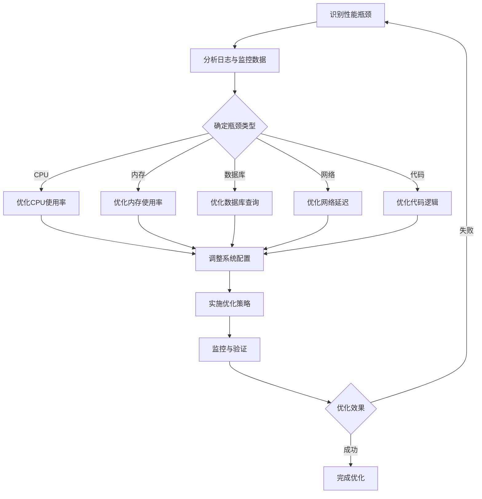
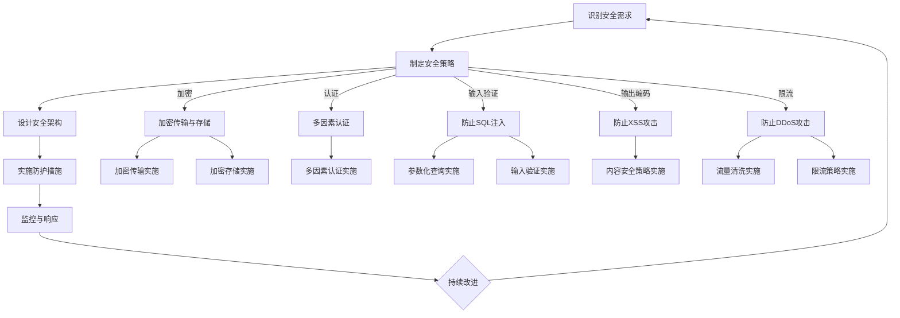

                 

### 《软件架构师的创业责任：设计可扩展与高可用的系统》引言

在当今快速发展的科技时代，软件架构师的角色越来越受到重视。作为企业的技术核心，软件架构师不仅要具备深厚的编程功底和系统设计能力，还要承担起创业责任，确保企业级系统能够满足市场需求、支撑业务增长，并且在面对复杂性和不确定性时依然能够稳定运行。本文将探讨软件架构师在创业中的责任，特别是如何设计可扩展与高可用的系统。

首先，我们需要明确什么是“创业责任”。创业责任不仅仅是指完成既定的技术任务，而是要具有前瞻性和战略思维，从企业长远发展的角度出发，进行系统设计和架构决策。这种责任体现在以下几个方面：

1. **市场洞察与需求匹配**：软件架构师需要深入了解市场需求，分析业务模式，确保系统设计能够满足未来业务增长的需求。
2. **技术前瞻性**：在技术选型和架构设计上，软件架构师要有前瞻性，采用成熟且先进的技术，为企业的未来发展奠定基础。
3. **风险管理**：软件架构师需要识别潜在的技术风险，并设计相应的应对策略，降低系统在运行过程中可能出现的故障和中断。
4. **团队协作**：软件架构师需要与开发团队、运维团队、产品经理等多方协作，确保系统能够顺利实施和持续优化。

接下来，本文将深入探讨如何设计可扩展与高可用的系统，具体包括以下内容：

#### 第一部分：企业级系统设计基础
- **企业级系统设计原则**：介绍系统设计的核心原则，如模块化、解耦、高内聚等，以及软件架构风格与模式。
- **可扩展性设计**：讨论扩展性的概念与重要性，水平扩展与垂直扩展的策略，以及扩展性设计的方法。
- **高可用性设计**：定义可用性目标，分析系统容错与故障恢复机制，探讨高可用性架构设计。

#### 第二部分：核心概念与联系
- **系统性能优化**：介绍性能优化的核心指标和策略，使用Mermaid流程图展示系统性能优化流程。
- **系统安全性设计**：讨论安全性设计的基本原则、威胁与防护措施，并展示系统安全性设计流程。
- **微服务架构**：介绍微服务的定义、特点、优势与挑战，以及微服务架构的设计与实现策略。
- **云原生架构**：讲解云原生架构的概念、优势、容器化与容器编排，以及云原生架构设计模式。

#### 第三部分：核心算法原理讲解
- **分布式系统一致性算法**：讨论一致性的定义、重要性，以及分布式一致性算法的实现原理，使用伪代码进行详细阐述。
- **负载均衡算法**：介绍负载均衡的基本概念、常见算法，并使用伪代码展示负载均衡算法的实现。
- **缓存机制与算法**：讲解缓存机制的作用、类型，以及常见缓存算法的实现，使用伪代码进行说明。

#### 第四部分：数学模型和数学公式讲解
- **网络流模型**：介绍网络流的基本概念、最大流最小割定理，并使用数学公式和示例进行详细解释。
- **优化算法**：讨论优化算法的基本概念、常见算法，并使用数学公式和详细解释说明优化算法的实现。

#### 第五部分：项目实战
- **企业级系统实战案例**：介绍实战背景、系统架构设计、实现过程，以及代码解读与分析。
- **高可用性系统部署与维护**：讲解系统部署策略、高可用性维护流程、故障恢复与应急响应，结合实际案例进行总结。
- **创业公司系统优化案例**：分析优化前的性能问题，介绍优化策略和实施步骤，展示优化后的性能提升，分享经验与建议。

#### 第六部分：结论与展望
- **总结**：回顾本文的主要内容，强调软件架构师在创业中的角色与责任。
- **未来展望**：探讨企业级系统设计的发展趋势，软件架构师需要关注的技术领域，以及创业中的挑战与机遇。

通过本文的深入探讨，我们希望能够帮助读者理解软件架构师在创业中的责任，掌握设计可扩展与高可用系统的核心技术和方法，为企业的发展提供有力的技术支持。

### 软件架构师的创业责任

软件架构师作为企业技术团队的核心成员，他们的责任不仅限于编写代码和解决技术难题，更重要的是具有战略思维和全局观念，能够为企业长远发展做出关键决策。特别是在创业环境中，软件架构师承担的创业责任更加重大，直接影响企业的成败。

首先，软件架构师需要具备敏锐的市场洞察力。在创业初期，市场需求变化迅速，软件架构师需要不断分析市场动态，了解用户需求，确保系统设计能够迅速适应市场变化。这要求软件架构师不仅要有扎实的技术基础，还要具备一定的业务理解能力，能够从业务角度出发，设计出既满足技术需求又适应市场变化的系统架构。

其次，软件架构师需要具备技术前瞻性。在技术日新月异的今天，软件架构师不能仅停留在现有的技术解决方案上，而是要不断学习新技术，探索新的技术方向。例如，在云计算、大数据、人工智能等领域的快速发展中，软件架构师需要紧跟技术趋势，将前沿技术融入到系统设计中，为企业提供更加先进和高效的解决方案。

第三，风险管理是软件架构师的重要职责。创业过程中不可避免地会遇到各种技术风险，如系统漏洞、数据安全、性能瓶颈等。软件架构师需要识别这些风险，并设计相应的防护措施，确保系统在运行过程中能够稳定可靠。例如，通过采用分布式架构、冗余备份等技术手段，提高系统的容错能力和数据安全性。

第四，软件架构师需要具备团队协作能力。在创业团队中，软件架构师不仅需要与技术团队紧密合作，还需要与产品经理、运维团队等跨部门团队进行有效沟通。只有通过跨部门的协作，才能确保系统设计符合业务需求，并且在实施过程中能够顺利进行。

最后，软件架构师需要具备持续学习的能力。技术领域发展迅速，软件架构师需要不断学习新的知识和技能，以适应不断变化的技术环境。通过参加技术会议、研究学术论文、参与开源项目等方式，软件架构师可以保持对最新技术的敏感度，不断提高自己的技术水平和架构设计能力。

总之，软件架构师在创业中的责任重大，他们不仅是技术团队的核心，更是企业发展的关键推动力。通过敏锐的市场洞察、技术前瞻性、风险管理、团队协作和持续学习，软件架构师能够为企业设计出既可扩展又高可用的系统，为企业的成功奠定坚实的基础。

#### 企业级系统设计原则

在构建企业级系统时，软件架构师需要遵循一系列核心原则，以确保系统能够具备良好的可扩展性、稳定性、安全性和性能。以下是企业级系统设计中的几个关键原则：

1. **模块化**：模块化是将系统分解为独立的、功能完整的模块，每个模块负责特定的功能。这种设计原则有助于提高系统的可维护性和可扩展性。模块之间的接口明确，通过良好的接口设计，模块可以独立开发、测试和部署，降低系统复杂性。

2. **解耦**：解耦是指将系统中的各个组件相互独立，减少组件间的依赖关系。高解耦有助于系统的灵活性和可扩展性，组件之间的变化不会影响到其他组件，从而降低系统的风险和复杂性。常见的解耦方法包括使用消息队列、接口定义（如RESTful API）等。

3. **高内聚**：高内聚是指每个模块内部的功能紧密相关，形成一个完整的单元。高内聚有助于提高模块的复用性和可测试性。在模块设计时，应确保每个模块只完成一项单一职责，避免功能混杂，导致模块复杂度增加。

4. **分布式架构**：分布式架构通过将系统划分为多个节点，使系统能够在多个服务器上运行，从而提高系统的性能、可靠性和扩展性。常见的分布式架构模式包括客户端-服务器模式、微服务架构、去中心化架构等。分布式架构能够有效地处理大量并发请求，并且具备容错能力，在单个节点故障时，其他节点可以继续提供服务。

5. **安全性**：安全性是企业级系统设计的重要原则之一。系统设计时需要考虑数据安全、用户认证、权限控制、网络安全等多方面的安全措施。例如，采用加密算法保护数据传输，使用防火墙和入侵检测系统保护网络安全，实施严格的用户权限管理，确保系统运行的安全性和数据的完整性。

6. **性能优化**：性能优化包括对系统架构、数据库设计、网络架构、代码优化等多方面的优化。性能优化的目标是在保证系统功能完整性的前提下，提高系统的响应速度和处理能力。常见的性能优化策略包括索引优化、查询优化、缓存策略、负载均衡等。

7. **可维护性**：可维护性是指系统能够方便地进行修改、升级和维护。良好的可维护性有助于降低系统的维护成本，提高系统的稳定性和可靠性。实现良好的可维护性需要编写清晰、规范的代码，使用文档化的设计文档，进行单元测试和集成测试等。

8. **用户体验**：用户体验是企业级系统设计的重要考量因素之一。系统设计应注重用户交互设计，提供直观、简洁的用户界面，确保用户能够轻松、高效地使用系统。用户体验不仅影响用户满意度，还直接影响系统的市场竞争力。

通过遵循上述设计原则，软件架构师能够为企业设计出既稳定可靠又灵活高效的系统，为企业的持续发展和业务增长提供坚实的技术保障。

#### 扩展性设计

扩展性是企业级系统设计中的一个关键要素，它决定了系统能否随着业务需求的增长而灵活调整和扩展。扩展性的设计不仅仅是技术层面的考量，更是企业战略规划的重要组成部分。以下将探讨扩展性的概念、重要性，以及水平扩展与垂直扩展的策略。

**扩展性的概念与重要性**

扩展性（Scalability）是指系统在处理负载增加时，能够保持性能稳定，并能够通过适当的调整而适应更大的业务需求。扩展性分为垂直扩展（Vertical Scaling）和水平扩展（Horizontal Scaling）两种类型：

1. **垂直扩展**：垂直扩展通过增加单个服务器的硬件资源，如CPU、内存、存储等，来提升系统的性能和容量。这种扩展方式简单直接，但受限于硬件的性能瓶颈，扩展的潜力有限。

2. **水平扩展**：水平扩展通过增加服务器节点，将负载分配到多个服务器上，从而提高系统的处理能力和容量。水平扩展具有更高的扩展性，能够应对更大的负载，并且具备较高的容错能力。

扩展性的重要性体现在以下几个方面：

- **业务需求的适应能力**：随着企业业务的发展，系统需要能够迅速适应增加的用户数量、数据量和交易量。
- **性能的稳定性**：扩展性设计确保系统在高负载情况下仍能保持良好的性能，避免因资源不足而导致的系统崩溃或响应时间延长。
- **成本效益**：良好的扩展性设计能够在不需要大量投入硬件资源的情况下，实现系统的性能提升和容量扩展。
- **用户体验**：高扩展性的系统能够提供稳定、快速的响应，提升用户体验，增加用户满意度。

**水平扩展与垂直扩展**

1. **水平扩展**

   水平扩展的主要策略包括：

   - **增加节点**：通过增加服务器节点，将负载均衡地分配到多个节点上，提高系统的处理能力。常见的负载均衡策略包括轮询、最小连接数、源IP哈希等。
   - **分布式存储**：采用分布式存储系统，如HDFS、Cassandra等，将数据分散存储在多个节点上，提高数据的访问速度和系统的可靠性。
   - **微服务架构**：采用微服务架构，将系统划分为多个独立的微服务，每个微服务可以独立部署和扩展，提高系统的灵活性和可扩展性。

2. **垂直扩展**

   垂直扩展的主要策略包括：

   - **硬件升级**：增加服务器的CPU、内存、存储等硬件资源，提升单个服务器的性能。
   - **数据库分库分表**：将大数据拆分为多个小数据表，每个数据库节点负责一部分数据，提高数据库的查询性能。
   - **缓存机制**：采用缓存机制，如Redis、Memcached等，减少数据库的查询压力，提高系统的响应速度。

**扩展性设计策略**

为了确保系统的扩展性，软件架构师可以采取以下策略：

- **模块化设计**：将系统分解为独立的模块，每个模块负责特定的功能，模块间通过清晰的接口进行通信，便于独立扩展和替换。
- **解耦设计**：降低组件间的依赖关系，提高系统的解耦度，使得系统在扩展时不会对其他模块产生较大的影响。
- **弹性计算**：采用弹性计算资源，如云服务器、容器化技术等，根据业务需求动态调整计算资源，提高系统的弹性。
- **监控与反馈机制**：建立完善的监控体系，实时监控系统的性能指标，通过反馈机制及时发现和处理性能瓶颈。

通过合理的扩展性设计，软件架构师能够确保企业级系统在面对业务增长时能够灵活应对，保持稳定性和高性能，为企业的长期发展提供可靠的技术支持。

#### 高可用性设计

高可用性（High Availability，简称HA）是企业级系统设计中至关重要的一项原则，它确保系统在面临各种故障时能够快速恢复，尽量减少对用户业务的影响。高可用性设计的目标是提高系统的可靠性，确保系统能够在长时间内稳定运行，即使部分组件发生故障，整个系统也能持续提供服务。

**可用性的定义与目标**

可用性是指系统能够在规定时间内正常运行，能够被用户访问和使用的程度。高可用性设计的目标是：

1. **最大化系统 uptime**：系统运行时间尽可能接近100%，减少因故障导致的停机时间。
2. **快速故障恢复**：在故障发生时，系统能够快速恢复正常运行，将故障的影响降到最低。
3. **故障透明性**：用户在故障发生时感知不到系统的异常，继续享受正常的服务。

**系统容错与故障恢复**

系统容错（Fault Tolerance）和故障恢复（Fault Recovery）是高可用性设计中的两个关键概念：

1. **系统容错**：系统容错是指系统能够在出现故障时，自动检测并隔离故障组件，确保其他组件继续正常运行。常见的容错机制包括：

   - **冗余**：通过在系统中增加冗余组件，如备用服务器、备用数据存储等，确保在主组件故障时，备用组件能够接管工作。
   - **故障切换**：在主组件故障时，自动将工作切换到备用组件，确保系统不中断服务。例如，数据库的主从复制、负载均衡器的前后端服务器故障切换等。
   - **状态保持**：在故障发生时，系统能够保存当前的工作状态，故障恢复后能够无缝地继续工作，避免重复处理或数据丢失。

2. **故障恢复**：故障恢复是指系统在故障发生后，能够自动或手动地恢复正常运行的过程。常见的故障恢复策略包括：

   - **自动恢复**：系统在检测到故障后，自动执行恢复流程，例如自动重启服务、切换到备用组件等。
   - **人工干预**：当系统故障复杂或自动恢复机制无效时，需要人工介入，分析故障原因，进行手动修复或更换故障组件。

**高可用性架构设计**

为了实现高可用性，软件架构师需要设计一个具备高度容错能力和快速恢复机制的系统架构。以下是一些关键设计原则和策略：

1. **冗余设计**：通过在系统中引入冗余组件，如多台服务器、多个数据库实例等，确保在单一组件故障时，其他组件能够接替其工作，保持系统运行。
2. **集群部署**：采用集群部署策略，将系统组件分布在多个节点上，通过负载均衡器实现负载均衡和故障切换，提高系统的可用性。
3. **数据备份与恢复**：定期进行数据备份，并设计数据恢复机制，确保在数据丢失或损坏时，能够快速恢复数据。
4. **容灾备份**：在异地建立容灾备份中心，确保在本地数据中心发生灾难时，系统能够快速切换到容灾中心继续提供服务。
5. **监控与告警**：建立完善的监控体系，实时监控系统的性能和状态，及时发现和处理故障。
6. **自动化运维**：采用自动化运维工具，如自动化部署、自动化监控、自动化故障恢复等，提高系统的运维效率和响应速度。

通过合理的高可用性架构设计，软件架构师能够确保企业级系统在面对各种故障时，能够快速恢复，最大限度地减少对用户业务的影响，从而提高系统的可靠性和用户满意度。

#### 系统性能优化

系统性能优化是软件架构师在设计企业级系统时必须关注的重要环节。一个高性能的系统不仅能够提供更快的响应速度，还能够更好地应对高并发访问和大数据量处理，从而提高用户体验和业务效率。以下将介绍系统性能优化的核心指标和策略，并使用Mermaid流程图展示系统性能优化流程。

**性能优化的核心指标**

1. **响应时间**：系统处理请求并返回结果所需的时间。较低的响应时间意味着用户能够更快地得到反馈。
2. **吞吐量**：系统在单位时间内处理请求的数量。较高的吞吐量表示系统能够处理更多的请求。
3. **并发量**：系统同时处理的请求数量。高并发量是评估系统性能的重要指标，尤其是在高流量场景下。
4. **资源利用率**：系统资源（如CPU、内存、网络带宽等）的利用率。高资源利用率表明系统在充分利用现有资源。
5. **稳定性**：系统在长时间运行中的稳定性，不会因负载波动或故障而出现性能下降或崩溃。

**性能优化的策略**

1. **系统架构优化**
   - **分布式架构**：采用分布式架构，将系统分解为多个独立的服务模块，每个模块运行在独立的节点上，通过负载均衡实现负载均衡和故障转移。
   - **缓存策略**：引入缓存机制，如Redis、Memcached等，减少对后端存储系统的查询频率，提高数据访问速度。
   - **异步处理**：使用异步处理技术，如消息队列（如RabbitMQ、Kafka），将耗时的任务从主流程中分离出来，避免阻塞主线程。

2. **数据库优化**
   - **索引优化**：合理设计索引，提高查询效率。
   - **分库分表**：将大数据拆分为多个小数据表，分散存储，提高查询性能。
   - **读写分离**：将读操作和写操作分离，分别部署在主数据库和从数据库上，提高系统并发处理能力。

3. **网络优化**
   - **负载均衡**：使用负载均衡器（如Nginx、HAProxy），合理分配网络流量，避免单点瓶颈。
   - **CDN加速**：通过内容分发网络（CDN），缓存静态资源，减少用户访问延迟。

4. **代码优化**
   - **减少数据库查询**：避免过多的数据库查询，通过预加载、批量查询等技术减少数据库访问次数。
   - **高效算法**：选择合适的数据结构和算法，优化关键路径上的计算逻辑。
   - **代码缓存**：缓存重复计算的结果，减少重复计算的开销。

5. **系统监控与调优**
   - **性能监控**：实时监控系统性能指标，及时发现性能瓶颈。
   - **日志分析**：分析系统日志，定位性能瓶颈，优化系统配置。

**Mermaid流程图：系统性能优化流程**

下面是一个使用Mermaid绘制的系统性能优化流程图，展示了从识别性能瓶颈到实施优化策略的整个过程。



通过这个流程图，我们可以清晰地看到性能优化的各个步骤，以及如何通过不断监控和验证，逐步提升系统的性能。

综上所述，系统性能优化是一个复杂而持续的过程，需要综合考虑系统架构、数据库设计、网络配置、代码优化等多方面因素。通过有效的性能优化策略，软件架构师能够显著提升系统的响应速度和处理能力，为企业的业务发展提供强有力的技术支持。

#### 系统安全性设计

系统安全性是企业级系统设计中的关键一环，它确保系统的数据、用户信息和其他重要资源免受未经授权的访问和攻击。良好的安全性设计不仅能够保护企业的利益，还能够增强用户对系统的信任，提高系统的市场竞争力。以下将介绍系统安全性设计的基本原则、常见的安全威胁与防护措施，并展示系统安全性设计流程。

**安全性设计的基本原则**

1. **最小权限原则**：每个组件和用户只能获取执行其任务所必需的权限，避免权限过大导致的安全风险。
2. **防御深度原则**：通过多层防护措施，形成纵深防御体系，阻止攻击者突破单层防护进入系统内部。
3. **安全开发生命周期**：在系统的整个开发生命周期中，持续进行安全评估和测试，确保系统设计、开发和部署过程中的安全性。
4. **透明性原则**：确保系统安全策略和措施对用户透明，用户能够清晰地了解系统如何保护其数据和安全。
5. **实时监控与响应**：建立实时监控系统，及时发现和处理安全事件，降低安全威胁的影响。

**常见的安全威胁与防护措施**

1. **数据泄露**：数据泄露是常见的安全威胁之一，防护措施包括：
   - **加密传输**：使用SSL/TLS等加密协议，保护数据在传输过程中的安全性。
   - **加密存储**：对敏感数据进行加密存储，确保数据在存储介质中的安全。

2. **暴力破解**：攻击者通过尝试大量密码组合来破解系统密码，防护措施包括：
   - **密码复杂度要求**：设置密码复杂度要求，如包含数字、字母和特殊字符。
   - **多因素认证**：使用多因素认证（MFA），如短信验证码、邮件验证等，增加破解难度。

3. **SQL注入**：攻击者通过在输入数据中插入恶意SQL代码，执行未经授权的操作，防护措施包括：
   - **参数化查询**：使用参数化查询，避免直接将用户输入作为SQL语句的一部分。
   - **输入验证**：对用户输入进行严格的验证，过滤掉可能包含SQL注入的字符。

4. **跨站脚本攻击（XSS）**：攻击者通过在网页中注入恶意脚本，窃取用户信息或控制用户会话，防护措施包括：
   - **输出编码**：对用户输入进行编码处理，防止恶意脚本被浏览器解释执行。
   - **内容安全策略（CSP）**：实施内容安全策略，限制网页可以加载和执行的资源。

5. **分布式拒绝服务（DDoS）攻击**：攻击者通过大量请求占用系统资源，导致系统无法响应正常用户请求，防护措施包括：
   - **流量清洗**：使用防火墙和DDoS防护设备，清洗恶意流量，保护系统不受攻击。
   - **限流策略**：对系统访问进行限流，防止恶意请求占用过多资源。

**Mermaid流程图：系统安全性设计流程**

以下是一个使用Mermaid绘制的系统安全性设计流程图，展示了从识别安全需求到实施安全防护措施的整个过程。



通过这个流程图，我们可以看到系统安全性设计是一个系统工程，需要从多个方面进行综合考虑和实施。通过合理的安全设计，软件架构师能够为企业构建一个安全、可靠的系统，为企业的持续发展和用户的信任提供保障。

#### 微服务架构

微服务架构（Microservices Architecture）是一种软件开发和系统架构设计方法，其核心思想是将大型应用程序分解为多个独立、松耦合的服务模块，每个模块专注于完成特定的业务功能。以下将介绍微服务的定义、特点、优势与挑战，以及微服务架构的设计与实现策略。

**微服务的定义与特点**

1. **定义**：微服务是一种轻量级、独立的软件模块，每个模块都可以独立部署和扩展，通过API或其他通信机制相互协作，共同完成复杂的业务功能。

2. **特点**：
   - **独立性**：每个微服务都可以独立开发、测试和部署，与其他服务之间解耦合，降低系统复杂性。
   - **细粒度**：微服务通常较小，专注于完成单一业务功能，使得系统更加模块化和灵活。
   - **自治性**：每个微服务拥有自己的数据库和业务逻辑，可以独立扩展和缩放，无需协调其他服务。
   - **分布式**：微服务可以在不同的服务器或容器中运行，通过网络通信进行协作，提高系统的可扩展性和容错能力。

**微服务架构的优势**

1. **可扩展性**：通过水平扩展单个微服务，可以快速提升系统的处理能力，满足业务增长的需求。
2. **灵活性**：各个微服务可以独立演进和升级，无需考虑整个系统的兼容性，提高开发效率。
3. **故障隔离**：单个微服务的故障不会影响整个系统，其他服务可以继续正常运行，降低系统的整体风险。
4. **技术多样性**：不同的微服务可以采用不同的技术栈，更好地满足业务需求，同时允许团队成员选择最合适的工具和技术。
5. **快速迭代**：由于微服务之间解耦合，各个服务可以独立进行开发和部署，加快新功能的迭代速度。

**微服务架构的挑战**

1. **分布式系统复杂性**：分布式系统增加了系统的复杂性，需要处理网络延迟、数据一致性和服务间通信等问题。
2. **服务治理**：随着服务数量的增加，对服务注册、发现、监控和管理提出了更高的要求，需要进行有效的服务治理。
3. **数据一致性和分布式事务**：在分布式环境中，保证数据一致性和分布式事务变得复杂，需要采用如最终一致性、本地事务补偿等方法。
4. **部署和维护**：微服务架构要求持续集成和持续部署（CI/CD），需要投入更多资源和精力进行系统的部署和维护。

**微服务设计与实现策略**

1. **服务划分**：根据业务功能和数据边界，合理划分微服务，确保每个服务具有明确的职责和独立的业务逻辑。
2. **服务自治**：每个微服务拥有自己的数据库和业务逻辑，独立进行数据持久化和业务处理。
3. **API设计**：采用轻量级的API通信机制，如RESTful API、gRPC，确保服务间高效、可靠地通信。
4. **服务注册与发现**：使用服务注册与发现机制（如Eureka、Consul），动态管理服务的注册和发现，提高系统的灵活性和可扩展性。
5. **负载均衡与容错**：使用负载均衡器（如Nginx、Kubernetes）和断路器（如Hystrix）等工具，提高系统的容错能力和稳定性。
6. **服务监控与日志**：建立完善的服务监控和日志系统，实时监控服务性能、日志分析和异常报警，确保系统的健康运行。

通过合理的微服务设计与实现策略，软件架构师能够构建一个灵活、高效、可靠的系统架构，为企业提供持续的技术支持和发展动力。

#### 云原生架构

云原生架构（Cloud-Native Architecture）是随着云计算技术的发展而兴起的一种新型系统架构模式。它充分利用了云计算、容器化、自动化等现代技术，使系统能够在云环境中快速部署、弹性扩展和高效管理。以下将介绍云原生架构的概念、优势、容器化与容器编排，以及云原生架构的设计模式。

**云原生架构的概念**

云原生架构是指一种利用云计算环境构建和运行的应用程序架构，它具有以下几个核心特征：

1. **微服务架构**：云原生架构基于微服务架构，将应用程序分解为多个独立的服务模块，每个服务模块可以独立部署和扩展。
2. **容器化**：云原生架构采用容器化技术（如Docker），将应用程序及其依赖项打包成独立的容器，确保应用程序在不同的环境中具有一致性和可移植性。
3. **动态管理**：云原生架构通过自动化工具（如Kubernetes）进行动态管理，实现应用程序的自动部署、扩展和监控。
4. **持续交付**：云原生架构支持持续集成和持续交付（CI/CD），确保应用程序能够快速迭代和交付。

**云原生架构的优势**

1. **弹性扩展**：云原生架构能够根据业务需求动态调整资源分配，快速响应负载变化，提高系统的弹性和可用性。
2. **高效部署**：容器化技术使应用程序的部署过程更加简单和快速，减少了依赖环境和配置管理的问题。
3. **资源优化**：云原生架构通过精细的资源管理，充分利用云资源，提高资源利用率和成本效益。
4. **高可靠性**：云原生架构通过自动化故障恢复和负载均衡，确保系统的稳定性和高可用性。
5. **快速迭代**：云原生架构支持持续集成和持续交付，加快应用程序的迭代速度，提高开发效率。

**容器化与容器编排**

1. **容器化**：容器化是一种将应用程序及其运行环境打包为独立容器（Container）的技术。每个容器拥有自己的运行时环境，独立于宿主机和其他容器。常见的容器技术包括Docker和rkt。

2. **容器编排**：容器编排是指通过自动化工具管理和调度容器，确保应用程序在容器环境中高效运行。Kubernetes（K8s）是目前最流行的容器编排工具，它提供了容器调度、自动扩展、服务发现、负载均衡等功能。

**云原生架构的设计模式**

1. **无状态服务（Stateless Service）**：无状态服务是指不存储用户状态的服务，每个请求都是独立的，服务实例之间没有状态依赖。这种设计模式适用于大多数互联网应用，如API服务、消息队列等。

2. **有状态服务（Stateful Service）**：有状态服务是指存储用户状态的服务，如数据库、缓存等。有状态服务需要确保数据的持久性和一致性。常见的实现方式包括StatefulSet、Kubernetes服务发现等。

3. **服务网格（Service Mesh）**：服务网格是一种用于管理微服务通信的网络架构，它通过侧载服务间通信的复杂性，确保服务之间的安全、可靠通信。Istio和Linkerd是流行的服务网格解决方案。

4. **云原生数据库（Cloud-Native Database）**：云原生数据库是指支持云原生架构的数据库系统，如Cassandra、MongoDB等。云原生数据库具备弹性扩展、自动化运维、分布式事务等特性。

通过云原生架构，软件架构师能够构建一个灵活、高效、可靠的系统，充分利用云计算的优势，为企业的业务增长提供持续的技术支持。

#### 分布式系统一致性算法

在分布式系统中，一致性算法是确保多个副本之间的数据一致性关键技术。一致性算法通过特定的协议和算法，使得分布式系统中多个节点能够在面对网络分区、延迟和数据冲突等情况下，达到一致的状态。以下将详细讨论分布式系统一致性的定义、重要性，以及常见的分布式一致性算法，如Paxos和Raft。

**一致性的定义与重要性**

一致性是指分布式系统中各个节点对于同一数据的访问和操作结果达成一致。一致性在分布式系统中的重要性体现在以下几个方面：

1. **数据准确性**：一致性确保了分布式系统中各个节点对于数据的访问和修改具有一致性，避免了数据不一致带来的错误结果。
2. **容错能力**：一致性算法能够在系统面对故障时，确保数据的可靠性和系统的可用性。
3. **数据安全**：一致性算法能够避免多个节点同时对同一数据进行修改，防止数据被覆盖或破坏。
4. **负载均衡**：一致性算法能够确保分布式系统中的负载均衡，避免单点瓶颈。

**常见的分布式一致性算法**

1. **Paxos算法**

   Paxos算法是一种经典的分布式一致性算法，由莱斯利·兰伯特（Leslie Lamport）提出。Paxos算法通过一个被称为“领导者”（Learner）的节点来协调多个副本之间的数据一致性。

   - **提议者（Proposer）**：提出提案并请求被其他副本接受。
   - **接受者（Acceptor）**：接受并存储提案，并向提议者反馈其接受状态。
   - **学习者（Learner）**：从接受者处学习提案内容。

   Paxos算法的核心概念包括：

   - **准备阶段（Prepare Phase）**：提议者向接受者发送准备请求，并等待接受者的回应。
   - **接受阶段（Accept Phase）**：接受者收到准备请求后，向提议者发送接受请求，并更新自己的状态。
   - **提交阶段（Commit Phase）**：提议者收到足够的接受请求后，将提案内容提交给学习者。

   Paxos算法通过多轮投票和多数派规则，确保了分布式系统中的一致性。

2. **Raft算法**

   Raft算法是由Diego Ongaro和John Ousterhout提出的一种分布式一致性算法，相较于Paxos算法，Raft算法更加易于理解，同时也提供了更好的性能和可扩展性。

   - **领导者（Leader）**：负责协调集群中的所有节点，处理提案和状态更新。
   - **跟随者（Follower）**：接收领导者的命令并执行，投票支持领导者的决策。
   - **候选人（Candidate）**：在领导者失败后，参与领导者选举的节点。

   Raft算法的核心概念包括：

   - **日志复制（Log Replication）**：领导者将日志条目发送给跟随者，并要求跟随者进行复制。
   - **心跳（Heartbeat）**：领导者定期向跟随者发送心跳信号，确保集群中的节点保持活动状态。
   - **选举（Election）**：在领导者失败后，候选人参与选举过程，通过投票决定新的领导者。

   Raft算法通过明确的状态转移和日志复制机制，确保了分布式系统的一致性和高可用性。

**伪代码：分布式一致性算法实现**

以下是一个简化的伪代码，展示了分布式一致性算法的基本实现过程：

```python
# Paxos算法伪代码
def paxos.Propose(value):
    # 提交提案
    proposal_id = generate Proposal ID
    proposer.send_prepare(proposal_id)
    accepted_value = None
    while accepted_value is None:
        vote_response = follower.respond_to_prepare(proposal_id)
        if vote_response.accepted:
            accepted_value = vote_response.value
            proposer.send_accept(accepted_value)
        else:
            proposer.send_prepare(proposal_id)

def follower.respond_to_prepare(proposal_id):
    if proposal_id > last_accepted_id:
        return Accept(proposal_id, last_committed_value)
    else:
        return Reject()

# Raft算法伪代码
def raft.LeaderPropose(log_entry):
    # 提交日志条目
    for follower in followers:
        follower.append_entries(log_entry)
    voted = majority_vote(followers, log_entry)
    if voted:
        commit_log_entry()

def follower.append_entries(entry):
    if entry.term > current_term:
        become_candidate()
    else:
        append_entry_to_log(entry)

def candidate.start_election():
    send_request_vote()

def leader.send_heartbeat():
    for follower in followers:
        follower.receive_heartbeat()

def follower.receive_heartbeat():
    if leader_is_alive:
        send_append_entries()
```

通过以上内容，我们可以看到分布式一致性算法在确保分布式系统数据一致性方面的重要性，以及Paxos和Raft算法的具体实现原理。软件架构师在实际项目中，可以根据具体需求选择合适的算法，确保系统的高可用性和数据一致性。

#### 负载均衡算法

负载均衡算法是分布式系统中一项关键技术，用于合理分配网络流量，确保系统在面临大量请求时能够高效、稳定地运行。以下将介绍负载均衡的基本概念、常见的负载均衡算法，并使用伪代码展示负载均衡算法的实现。

**负载均衡的基本概念**

负载均衡（Load Balancing）是指通过某种策略，将网络流量分配到多个服务器节点上，以达到整体系统资源利用率和性能最优。负载均衡算法的主要目的是：

1. **均衡负载**：避免单点过载，使每个服务器节点承受相等的负载。
2. **提高系统可用性**：当某个服务器节点发生故障时，其他节点能够继续处理请求，确保系统的可用性。
3. **提高系统性能**：通过合理分配流量，减少单个服务器的压力，提高系统的整体响应速度。

**常见的负载均衡算法**

1. **轮询负载均衡（Round Robin）**：

   轮询负载均衡是最简单的负载均衡算法，它按照顺序将请求分配给服务器节点。每个新请求都会被分配给下一个服务器节点，循环进行。

   - **优点**：实现简单，公平分配流量。
   - **缺点**：不考虑服务器的实际负载情况，可能导致某些服务器过载。

   伪代码：

   ```python
   function round_robin(server_list, request):
       current_server = server_list[(current_server_index + 1) % len(server_list)]
       current_server.handle_request(request)
       current_server_index = (current_server_index + 1) % len(server_list)
   ```

2. **最小连接数负载均衡（Least Connections）**：

   最小连接数负载均衡算法根据服务器当前的连接数来分配请求，将请求分配给当前连接数最少的服务器节点。

   - **优点**：能更有效地利用服务器资源。
   - **缺点**：对动态负载变化反应较慢。

   伪代码：

   ```python
   function least_connections(server_list, request):
       min_connections = infinite
       selected_server = None
       for server in server_list:
           if server.connection_count < min_connections:
               min_connections = server.connection_count
               selected_server = server
       selected_server.handle_request(request)
   ```

3. **最小响应时间负载均衡（Least Response Time）**：

   最小响应时间负载均衡算法根据服务器当前的处理响应时间来分配请求，将请求分配给响应时间最短的服务器节点。

   - **优点**：能快速响应当前性能最佳的服务器。
   - **缺点**：对服务器性能波动敏感，可能导致不稳定的负载分配。

   伪代码：

   ```python
   function least_response_time(server_list, request):
       min_response_time = infinite
       selected_server = None
       for server in server_list:
           response_time = server.get_response_time()
           if response_time < min_response_time:
               min_response_time = response_time
               selected_server = server
       selected_server.handle_request(request)
   ```

4. **哈希负载均衡（Hashing）**：

   哈希负载均衡算法通过哈希函数将请求映射到特定的服务器节点，具有很好的负载均衡效果。

   - **优点**：请求映射具有一致性，确保相同请求总是被分配到相同的服务器。
   - **缺点**：需要维护哈希表的映射关系，且在节点增加或减少时，需要重新计算映射关系。

   伪代码：

   ```python
   function hash_load_balancing(server_list, request):
       hash_key = hash(request)
       index = hash_key % len(server_list)
       selected_server = server_list[index]
       selected_server.handle_request(request)
   ```

通过这些负载均衡算法，软件架构师可以根据实际需求和系统特点，选择合适的算法来优化系统性能，提高系统的可用性和稳定性。

#### 缓存机制与算法

缓存机制（Cache）在分布式系统中扮演着至关重要的角色，它通过临时存储频繁访问的数据，减少对后端存储系统的访问次数，从而提高系统的性能和响应速度。以下将介绍缓存机制的作用、类型，以及常见的缓存算法，包括LRU（Least Recently Used，最近最少使用）和FIFO（First In, First Out，先进先出）算法，并使用伪代码详细说明缓存算法的实现。

**缓存机制的作用与类型**

缓存机制的作用主要体现在以下几个方面：

1. **减少响应时间**：缓存频繁访问的数据，避免频繁访问后端存储系统，从而显著减少系统的响应时间。
2. **降低系统负载**：减少后端存储系统的访问次数，降低系统的整体负载，提高系统的稳定性和可靠性。
3. **提高数据访问速度**：缓存的数据通常存储在内存中，内存的访问速度远高于磁盘，从而提高数据访问速度。
4. **缓解网络压力**：通过缓存机制，减少对远程服务器的访问，缓解网络压力，提高系统的整体性能。

常见的缓存类型包括：

1. **内存缓存**：将数据存储在内存中，如Redis、Memcached等。内存缓存具有极快的访问速度，适用于需要高实时性的场景。
2. **磁盘缓存**：将数据缓存到磁盘上，如Linux缓存、文件系统缓存等。磁盘缓存适用于数据量大但访问频率不高的场景。
3. **分布式缓存**：在分布式系统中，多个缓存节点协同工作，提高缓存系统的容量和性能。如Consul、Cassandra等。

**常见的缓存算法**

1. **LRU（Least Recently Used，最近最少使用）算法**

   LRU算法是一种常用的缓存替换策略，它根据数据项的访问时间进行替换，最近最少被访问的数据项优先被替换。

   - **优点**：能有效地保持缓存中数据的新鲜度。
   - **缺点**：实现复杂度较高，需要额外的维护成本。

   伪代码：

   ```python
   class LRUCache:
       def __init__(self, capacity):
           self.capacity = capacity
           self.cache = OrderedDict()

       def get(self, key):
           if key in self.cache:
               value = self.cache.pop(key)
               self.cache[key] = value
               return value
           else:
               return -1

       def put(self, key, value):
           if key in self.cache:
               self.cache.pop(key)
           elif len(self.cache) >= self.capacity:
               self.cache.popitem(last=False)
           self.cache[key] = value
   ```

2. **FIFO（First In, First Out，先进先出）算法**

   FIFO算法是一种简单的缓存替换策略，它根据数据的进入顺序进行替换，最先进入的数据项优先被替换。

   - **优点**：实现简单，易于理解和维护。
   - **缺点**：不能有效保持缓存数据的新鲜度，可能导致缓存命中率较低。

   伪代码：

   ```python
   class FIFOCache:
       def __init__(self, capacity):
           self.capacity = capacity
           self.cache = []

       def get(self, key):
           if key in self.cache:
               return self.cache.index(key)
           else:
               return -1

       def put(self, key, value):
           if key in self.cache:
               self.cache.remove(key)
           elif len(self.cache) >= self.capacity:
               self.cache.pop(0)
           self.cache.append(key)
   ```

通过上述缓存机制和算法，软件架构师能够有效提高系统的性能和响应速度，确保分布式系统在高并发、大数据量场景下依然能够稳定运行。

#### 网络流模型

网络流模型（Network Flow Model）是运筹学和图论中用于分析网络中资源传输问题的重要工具。网络流模型主要研究如何在一个有向图中，在满足容量限制和流守恒条件下，实现网络中各节点之间的资源传输，最大化网络中的总流量。以下将介绍网络流模型的基本概念、最大流最小割定理，并使用数学公式和示例详细解释网络流模型的应用。

**网络流模型的基本概念**

网络流模型由以下几个基本概念组成：

1. **图**：网络流模型通常使用有向图（Directed Graph）来表示，其中每个节点表示一个地点，每条边表示一条连接两个地点的通道，边上的权重表示通道的容量。

2. **流量**：网络流是从图的起点（Source）到终点（Sink）的传输量，流量在每条边上的值不得超过边的容量。

3. **容量**：每条边的容量表示该通道的最大传输能力。

4. **流守恒**：在每条入边上的流量之和必须等于该出边上的流量，确保每个节点的流入流量等于流出流量。

**最大流最小割定理**

最大流最小割定理（Max-Flow Min-Cut Theorem）是网络流模型中的一个重要结论，它指出在一个网络流问题中，网络的最大流量等于从源点到汇点的最小割的容量。

- **最大流**：网络中的最大流量是从源点到汇点的最大可能传输量。
- **最小割**：网络中的最小割是指将源点和汇点分离的边集合，使得从源点到汇点的流量为零。

数学公式表示为：
$$\text{MaxFlow} = \text{MinCut}$$

**证明**：设\(S\)为源点，\(T\)为汇点，\(U = N \setminus \{S, T\}\)，即除了源点和汇点之外的所有其他节点。设\(A\)为从\(S\)到\(T\)的最大流的边集合，即从\(S\)到\(T\)的流量为\(f(S, T)\)。

- **最大流的容量**：最大流的容量即为\(A\)中所有边的容量之和，即\(|A|\)。
- **最小割的容量**：最小割的容量即为所有割集的容量之和，其中割集是从源点到汇点的不包含\(T\)的最小边集合。

定义一个割集\(\mathcal{C}\)，其容量为所有从割集中取出边组成的集合的容量之和。

则根据最大流最小割定理：
$$f(S, T) = \min_{\mathcal{C} \text{ is a cut}} \sum_{e \in \mathcal{C}} c(e)$$

**示例：网络流问题应用**

假设有一个网络流问题，图中有5个节点（\(S, A, B, C, T\)），各边的容量如下：

| 边   | 容量 |
|------|------|
| \(S \rightarrow A\) | 10  |
| \(S \rightarrow B\) | 5   |
| \(A \rightarrow B\) | 6   |
| \(A \rightarrow C\) | 10  |
| \(B \rightarrow C\) | 15  |
| \(B \rightarrow T\) | 10  |
| \(C \rightarrow T\) | 10  |

要求从源点\(S\)到汇点\(T\)的最大流量。

1. **找到最小割**：通过尝试不同的割集，计算割集的容量，找到最小割。
   - 割集\(\{S, A, B\} \cup \{C, T\}\)的容量为：
     $$c(S \rightarrow A) + c(B \rightarrow T) = 10 + 10 = 20$$
   - 割集\(\{S, A, C\} \cup \{B, T\}\)的容量为：
     $$c(S \rightarrow A) + c(A \rightarrow C) + c(C \rightarrow T) = 10 + 10 + 10 = 30$$

最小割的容量为20。

2. **计算最大流量**：根据最大流最小割定理，最大流量等于最小割的容量，即最大流量为20。

通过上述示例，我们可以看到如何使用网络流模型解决实际的网络传输问题。在分布式系统和网络架构设计中，网络流模型能够帮助我们优化资源的分配和流量管理，确保系统的性能和稳定性。

#### 优化算法

优化算法在软件架构和系统设计中扮演着至关重要的角色，特别是在需要处理大规模数据和复杂计算任务的情况下。以下将介绍优化算法的基本概念，常见的优化算法（如梯度下降和动态规划），并详细解释优化算法的核心数学公式和实现步骤。

**优化算法的基本概念**

优化算法是指用于在给定约束条件下寻找最优解的算法。在软件架构和系统设计中，优化算法用于提高系统性能、资源利用率、响应速度等。优化算法的主要目标是：

1. **寻找最佳配置**：通过调整系统参数、资源分配等，找到最优的系统配置。
2. **优化资源利用**：提高系统的资源利用率，减少资源浪费。
3. **提高响应速度**：减少系统响应时间，提高用户体验。

**常见的优化算法**

1. **梯度下降（Gradient Descent）**

   梯度下降是一种常用的优化算法，用于求解凸函数的最小值。其基本思想是通过计算目标函数的梯度（导数），沿着梯度的反方向逐步迭代，直至找到最小值。

   - **优点**：实现简单，适用于凸函数优化。
   - **缺点**：需要计算梯度，且在多维空间中容易陷入局部最优。

   伪代码：

   ```python
   def gradient_descent(initial_params, learning_rate, epochs):
       params = initial_params
       for epoch in range(epochs):
           gradient = compute_gradient(params)
           params = params - learning_rate * gradient
       return params
   ```

2. **动态规划（Dynamic Programming）**

   动态规划是一种适用于求解最优子结构问题的优化算法。其核心思想是将复杂问题分解为若干子问题，通过解决子问题并保存子问题的解，避免重复计算，从而求解原问题的最优解。

   - **优点**：避免重复计算，适用于求解最优化问题。
   - **缺点**：需要构建状态转移方程，对于复杂问题可能难以实现。

   伪代码：

   ```python
   def dynamic_programming(problem):
       dp = initialize_dp_table()
       for state in states:
           for action in actions:
               dp[state, action] = optimal_value(state, action)
       return dp[state, goal_state]
   ```

**优化算法的核心数学公式和详细解释**

1. **梯度下降**

   梯度下降的核心数学公式为：
   $$\text{f}(x) \approx \text{f}(\text{x}_0) + \nabla \text{f}(\text{x}_0) (\text{x} - \text{x}_0)$$
   
   - **解释**：该公式表示通过当前点\(\text{x}_0\)的梯度（\(\nabla \text{f}(\text{x}_0)\)）来更新参数，使其逐步逼近最优解。

2. **动态规划**

   动态规划的核心数学公式为：
   $$\text{V}(\text{s}) = \text{max}_{a} \left\{R(\text{s}, a) + \gamma \sum_{\text{s'} \in \text{S}} p(\text{s'}|\text{s}, a) \cdot \text{V}(\text{s'})\right\}$$
   
   - **解释**：该公式表示在状态\(\text{s}\)下，采取动作\(a\)后的最优值。其中，\(R(\text{s}, a)\)为在状态\(\text{s}\)下采取动作\(a\)的立即回报，\(\gamma\)为折扣因子，\(p(\text{s'}|\text{s}, a)\)为在状态\(\text{s}\)下采取动作\(a\)后到达状态\(\text{s'}\)的概率。

通过上述优化算法，软件架构师可以在系统设计和架构调整过程中，有效地提高系统性能和资源利用率，为企业的业务发展提供坚实的技术支持。

#### 企业级系统实战案例

**实战背景与目标**

某创业公司在金融领域推出了一款在线支付平台，随着用户数量的增加，系统的负载逐渐增大，性能瓶颈和可用性问题逐渐显现。为了确保平台能够稳定、高效地运行，并支持未来的业务增长，公司决定对现有系统进行优化和升级。

**系统架构设计与实现**

1. **现有系统分析**
   - **架构现状**：系统采用传统的单机架构，数据库采用关系型数据库，前端使用单体应用，后端使用传统的三层架构（表示层、业务逻辑层、数据访问层）。
   - **问题**：高并发访问时响应缓慢，数据库成为性能瓶颈，系统的扩展性和可用性不足。

2. **设计目标**
   - **高扩展性**：系统能够水平扩展，支持大量用户的同时访问。
   - **高可用性**：系统具备冗余设计，能够在故障发生时快速恢复。
   - **高性能**：系统响应时间短，能够处理高并发请求。

3. **设计思路**
   - **分布式架构**：将系统分解为多个独立的服务模块，如用户服务、支付服务、风控服务等。
   - **微服务架构**：采用微服务架构，每个服务模块独立部署和扩展，通过API进行通信。
   - **数据库分库分表**：将大数据拆分为多个小数据表，分散存储，提高查询性能。
   - **缓存机制**：引入缓存，减少对后端数据库的访问频率。

**实现过程**

1. **服务模块划分**
   - **用户服务**：负责用户注册、登录、认证等功能。
   - **支付服务**：负责处理支付请求、处理订单、生成支付通知等。
   - **风控服务**：负责风险控制、交易验证、反欺诈等。

2. **数据库设计**
   - **分库分表**：将用户数据、支付数据、风控数据分别存储在不同的数据库实例中，采用分表策略，按用户ID范围或时间范围划分数据表。

3. **缓存机制**
   - **Redis缓存**：缓存用户信息和热门商品信息，减少数据库访问次数。
   - **Memcached缓存**：缓存支付通知和风控规则，提高系统响应速度。

4. **负载均衡与容错**
   - **负载均衡**：使用Nginx作为负载均衡器，将请求分发到不同的服务实例上。
   - **容错机制**：采用双机热备、数据库主从复制、服务实例冗余部署等策略，确保系统高可用性。

5. **监控与告警**
   - **Prometheus监控**：实时监控系统的性能指标，如CPU、内存使用率、请求响应时间等。
   - **Alertmanager告警**：当监控指标超过阈值时，自动发送告警通知，便于快速定位和解决问题。

**源代码实现与代码解读**

1. **用户服务**
   - **代码实现**：使用Spring Boot框架搭建用户服务，实现用户注册、登录、认证等接口。
   - **代码解读**：用户服务中的核心代码包括用户身份验证、用户信息存储等，通过JWT（JSON Web Token）进行身份认证。

2. **支付服务**
   - **代码实现**：支付服务负责处理支付请求、订单处理、生成支付通知等，采用异步处理方式提高系统响应速度。
   - **代码解读**：支付服务中的关键代码包括支付逻辑处理、订单状态更新等，确保支付流程的准确性和一致性。

3. **风控服务**
   - **代码实现**：风控服务负责交易验证、反欺诈等，引入机器学习算法进行风险分析。
   - **代码解读**：风控服务中的核心代码包括交易数据收集、特征提取和风险评分等，确保交易的安全性。

通过上述实战案例，我们可以看到企业级系统在面临性能瓶颈和可用性挑战时，通过合理的系统架构设计和优化策略，能够实现系统的扩展性、高可用性和高性能，为企业的业务发展提供可靠的技术支持。

#### 高可用性系统部署与维护

高可用性系统的部署与维护是企业确保业务连续性和用户满意度的重要环节。以下将详细讲解系统部署策略、高可用性维护流程、故障恢复与应急响应，并结合实际案例总结经验。

**系统部署策略**

1. **双机热备**：在关键业务系统中，部署两台主服务器，互为备份。当主服务器发生故障时，备份服务器能够立即接管工作，确保系统不中断服务。

2. **主从复制**：数据库系统采用主从复制（Master-Slave Replication），主服务器负责处理写操作，从服务器负责处理读操作。当主服务器发生故障时，从服务器可以提升为主服务器，继续提供服务。

3. **负载均衡**：通过负载均衡器（如Nginx、HAProxy）将请求分配到多个服务器节点上，避免单点过载，提高系统的整体性能和可用性。

4. **分布式存储**：使用分布式存储系统（如HDFS、Cassandra），将数据分散存储在多个节点上，提高数据的访问速度和系统的可靠性。

**高可用性维护流程**

1. **定期检查**：定期对系统进行性能和稳定性检查，包括CPU、内存、磁盘使用率、网络流量等指标，确保系统运行正常。

2. **监控与告警**：部署监控工具（如Prometheus、Zabbix），实时监控系统的性能指标和运行状态。当监控指标超过阈值时，自动发送告警通知，及时处理潜在问题。

3. **定期备份**：定期进行数据备份，确保在数据丢失或损坏时，能够快速恢复。备份策略包括全量备份和增量备份，确保数据的一致性和完整性。

4. **版本控制**：使用版本控制系统（如Git），记录每次部署的代码版本和配置文件，便于回滚和调试。

**故障恢复与应急响应**

1. **故障检测与隔离**：当系统出现故障时，及时检测故障原因，并进行故障隔离，确保其他部分继续正常运行。

2. **故障恢复**：根据故障类型和影响范围，制定故障恢复策略。对于关键业务系统，可以采用双机热备、主从复制等方式快速恢复服务。

3. **应急响应**：建立应急响应团队，制定应急预案，确保在故障发生时，能够迅速采取行动，减少对业务的影响。

**实际案例与经验总结**

**案例1：数据库主从复制故障**

在一次例行检查中，发现主数据库服务器出现故障，导致数据无法写入。应急响应团队立即启动故障恢复流程，将故障的主服务器切换为从服务器，并升级为新的主服务器。在故障恢复过程中，监控和日志系统发挥了重要作用，帮助团队快速定位故障原因并实施恢复措施。

**案例2：负载均衡器故障**

在高峰时段，负载均衡器突然发生故障，导致大量请求无法正常转发。监控系统及时发出告警，应急响应团队迅速介入，将故障的负载均衡器切换为备用负载均衡器，并进行了故障排查和修复。通过快速的故障恢复，确保了系统的稳定运行。

**经验总结**：

1. **提前准备**：制定详细的故障恢复计划和应急预案，确保在故障发生时能够迅速响应。
2. **监控与告警**：建立完善的监控和告警系统，实时监控系统的运行状态，及时发现和处理故障。
3. **定期备份**：定期进行数据备份，确保在数据丢失或损坏时，能够快速恢复。
4. **自动化运维**：采用自动化运维工具，如自动化部署、自动化监控、自动化故障恢复等，提高运维效率和响应速度。

通过合理的系统部署策略和高可用性维护流程，企业能够确保关键业务系统的稳定性和可靠性，为业务的持续发展提供强有力的技术保障。

#### 创业公司系统优化案例

**优化前的系统性能问题**

某创业公司在上线初期，系统性能表现良好，但随着用户数量的快速增长，系统逐渐出现了以下性能问题：

1. **响应时间延长**：用户请求处理时间从几百毫秒增加到了几秒，导致用户体验下降。
2. **并发请求处理能力不足**：系统在高并发请求下出现卡顿，响应缓慢，甚至出现部分请求超时。
3. **数据库瓶颈**：数据库查询频繁，响应时间增加，成为系统性能的瓶颈。
4. **内存泄漏**：应用内存占用逐渐增加，导致系统频繁进行垃圾回收，影响整体性能。

**优化策略与实施步骤**

为了解决上述性能问题，公司采取了以下优化策略：

1. **分布式架构改造**：将单体应用拆分为多个微服务，每个微服务独立部署，通过负载均衡进行流量分发，提高系统的并发处理能力。

2. **数据库分库分表**：将大数据表拆分为多个小表，按用户ID、时间戳等方式进行分片，分散数据库查询压力。

3. **缓存机制引入**：在系统中引入Redis缓存，缓存高频访问的数据，减少对数据库的查询次数。

4. **代码优化**：对关键业务逻辑进行优化，减少不必要的计算和数据库查询，提升代码效率。

5. **性能监控与调优**：采用Prometheus和Grafana进行性能监控，实时监控系统的各项性能指标，通过日志分析和性能调优，持续优化系统。

**优化后的系统性能提升**

通过实施上述优化策略，系统性能得到了显著提升：

1. **响应时间缩短**：用户请求处理时间从几秒缩短至几百毫秒，用户体验得到大幅提升。

2. **并发处理能力增强**：系统在高并发请求下表现稳定，处理能力得到显著提升。

3. **数据库瓶颈缓解**：通过分库分表和缓存机制，数据库查询响应时间明显缩短，数据库瓶颈得到有效缓解。

4. **内存泄漏问题解决**：通过代码优化和垃圾回收策略的调整，系统内存占用趋于稳定，内存泄漏问题得到解决。

**经验分享与建议**

1. **分布式架构与微服务**：采用分布式架构和微服务模式，提高系统的扩展性和可维护性，但需要权衡分布式系统的复杂性。

2. **性能监控与调优**：定期进行性能监控和调优，及时发现和解决性能瓶颈，确保系统的高效运行。

3. **缓存策略**：合理引入缓存机制，减少对数据库的访问压力，提高系统响应速度。

4. **代码优化**：定期对代码进行审查和优化，减少不必要的计算和数据库查询，提高代码效率。

5. **团队协作**：优化工作需要跨部门协作，包括开发、测试、运维等多个团队的紧密配合，确保优化策略的有效实施。

通过本次系统优化案例，公司不仅解决了性能问题，还提升了用户体验和业务效率，为企业的持续发展奠定了坚实的基础。

#### 结论

本文系统地探讨了软件架构师在创业中的责任，特别是如何设计可扩展与高可用的系统。通过深入分析企业级系统设计原则、扩展性设计、高可用性设计、性能优化、安全性设计、微服务架构、云原生架构以及分布式系统一致性算法等关键内容，我们强调了软件架构师在创业中所承担的市场洞察、技术前瞻性、风险管理、团队协作和持续学习等多重责任。

在可扩展性设计方面，我们探讨了水平扩展和垂直扩展的策略，并提出了模块化设计和解耦设计等原则，以确保系统在面对业务增长时能够灵活调整。高可用性设计则通过系统容错和故障恢复机制，确保系统在面临各种故障时能够快速恢复，减少对用户业务的影响。

性能优化和安全性设计是保证系统稳定运行和用户信任的基础。通过性能监控和调优、缓存机制、代码优化等技术手段，我们能够显著提升系统的响应速度和处理能力。安全性设计则通过加密传输、多因素认证、输入验证等技术措施，保障系统的数据安全。

微服务架构和云原生架构是现代系统设计的重要方向。微服务架构通过将系统分解为多个独立的服务模块，提高了系统的灵活性和可扩展性；而云原生架构则充分利用了云计算的优势，实现了系统的弹性扩展和高效管理。

分布式系统一致性算法如Paxos和Raft，为分布式系统中的数据一致性提供了可靠的解决方案。负载均衡算法和缓存机制则优化了系统的资源分配和数据处理能力。

通过本文的深入探讨，我们希望软件架构师能够更好地理解创业环境中的系统设计挑战，掌握核心技术和方法，为企业提供稳定、高效、可靠的系统架构，推动企业的持续发展和成功。

### 未来展望

随着技术的不断进步和业务需求的日益复杂，企业级系统设计将面临更多挑战和机遇。以下对未来企业级系统设计的发展趋势进行展望，并探讨软件架构师需要关注的技术领域。

**企业级系统设计的发展趋势**

1. **云原生架构的普及**：云原生架构因其高扩展性和高可用性，将在未来得到更广泛的应用。企业将更加倾向于采用容器化、微服务架构和自动化运维等云原生技术，以实现系统的快速部署和弹性扩展。

2. **分布式系统的融合**：分布式系统将成为企业级系统的主流架构。随着分布式数据库、分布式缓存、分布式消息队列等技术的成熟，企业将能够更好地处理海量数据和高并发请求。

3. **边缘计算的兴起**：随着5G和物联网（IoT）技术的发展，边缘计算将得到广泛应用。边缘计算能够将数据处理和计算能力推向网络边缘，减少延迟，提高系统的响应速度。

4. **数据安全和隐私保护**：数据安全和隐私保护将越来越受到重视。企业需要采用更严格的数据加密、访问控制和隐私保护措施，确保用户数据的安全。

5. **人工智能与机器学习的整合**：人工智能和机器学习技术将在系统设计中扮演更重要的角色。通过整合AI技术，系统可以提供更智能的决策支持、异常检测和性能优化。

**软件架构师需要关注的技术领域**

1. **云计算与容器化**：了解和掌握云计算平台（如AWS、Azure、Google Cloud）和容器化技术（如Docker、Kubernetes），是软件架构师的必备技能。这些技术将帮助架构师构建和管理现代化的云原生应用。

2. **分布式系统架构**：熟悉分布式系统架构，包括分布式数据库、分布式缓存、分布式消息队列等，能够帮助架构师设计高性能和高可用的系统。

3. **边缘计算**：了解边缘计算的概念和技术，能够帮助架构师在物联网和5G等新兴领域设计更加高效和响应迅速的系统。

4. **人工智能与机器学习**：学习人工智能和机器学习的基本原理，掌握常见的机器学习算法和应用，能够帮助架构师设计具有智能化的系统。

5. **数据安全和隐私保护**：掌握数据安全和隐私保护的技术，如加密算法、访问控制、数据脱敏等，能够帮助架构师设计更加安全可靠的系统。

**创业中的挑战与机遇**

在创业环境中，软件架构师将面临诸多挑战和机遇。挑战包括快速变化的市场需求、有限的资源、不确定的技术风险等。机遇则包括技术创新带来的市场机会、快速迭代的产品发布等。软件架构师需要具备前瞻性思维，灵活应对变化，同时利用技术优势，推动企业不断前进。

总之，未来企业级系统设计将更加复杂和多样化，软件架构师需要不断学习和适应新技术，以应对不断变化的市场和技术环境。通过持续关注新兴技术和趋势，软件架构师能够为企业提供更加创新和高效的系统解决方案，助力企业在激烈的市场竞争中脱颖而出。

### 附录

#### 附录 A：相关工具与资源

**软件架构与系统设计工具**

- **Docker**：容器化平台，用于构建、运行和分发应用程序。
- **Kubernetes**：容器编排工具，用于自动化部署、扩展和管理容器化应用程序。
- **Spring Boot**：开源框架，用于快速构建独立的、生产级的微服务应用程序。
- **Apache Kafka**：分布式流处理平台，用于处理实时数据流。
- **Prometheus**：开源监控解决方案，用于监控和告警。
- **Grafana**：开源分析与监控工具，用于可视化监控数据。

**云计算与容器化平台**

- **AWS**：亚马逊云服务，提供广泛的云计算服务。
- **Azure**：微软的云服务平台，支持多种云服务。
- **Google Cloud**：谷歌的云服务平台，提供创新的云服务。

**分布式系统与数据库资源**

- **Cassandra**：分布式非关系型数据库，用于处理大量数据。
- **HDFS**：分布式文件系统，用于存储海量数据。
- **Redis**：内存中数据结构存储系统，用于缓存和实时处理。

#### 附录 B：参考书目与文献

**参考书籍**

1. 《设计数据密集型应用》 - Martin Kleppmann
2. 《微服务架构设计》 - Sam Newman
3. 《云原生应用架构指南》 - Kamesh Sampath
4. 《高性能MySQL》 - Michael Widenius, Martin P. Brown
5. 《深入理解LINUX网络》 - Christian Benvenuti, Lars-Kristian Opseth

**学术论文与研究报告**

1. "The Case for Microservices" - Martin Fowler
2. "Distributed Systems: Concepts and Design" - George Coulouris, Jean Dollimore, Tim Kindberg, Gordon Blair
3. "A distributed algorithm for the echo problem" - Leslie Lamport
4. "Raft: Consensus Algorithm for Systematic Failure" - Diego Ongaro, John Ousterhout
5. "Performance Analysis of Load Balancing Algorithms" - Zhigang Deng, K. J. soften, Richard A. Olariu

通过这些工具、平台、书籍和论文，读者可以进一步深入了解软件架构与系统设计的相关知识，提升自己的技术水平。

