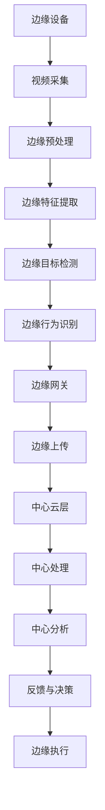
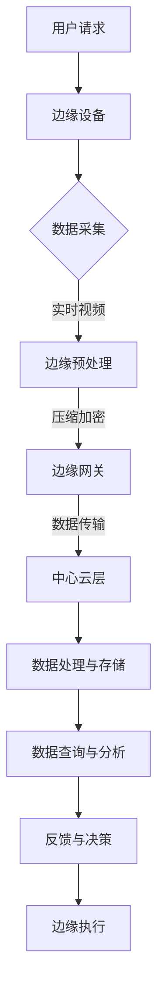
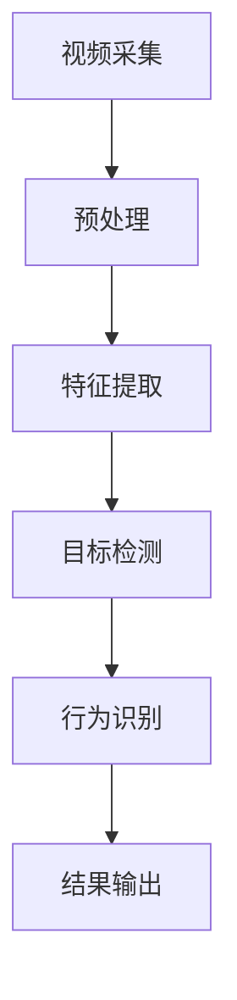
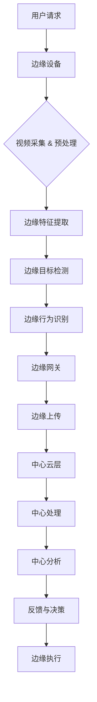

                 

# 《边缘智能在实时视频分析中的应用》

## 摘要

随着物联网和智能设备的大规模普及，实时视频分析技术在各种场景中发挥着越来越重要的作用。然而，传统的云计算模型在处理海量视频数据时存在延迟高、带宽占用大、计算能力不足等问题。边缘智能技术作为一种新兴的计算范式，通过在靠近数据源的边缘设备上进行处理，能够显著提升实时视频分析的效率和准确性。本文将系统地探讨边缘智能在实时视频分析中的应用，从边缘智能技术基础、边缘智能技术架构、实时视频分析技术基础，到边缘智能在实时视频监控、视频内容分析和实时视频处理中的具体应用，以及面临的挑战和解决方案，全面解析边缘智能在实时视频分析中的潜力和前景。

## 关键词

边缘智能、实时视频分析、视频监控、视频内容分析、实时视频处理、边缘计算

### 目录

#### 第一部分：边缘智能技术基础

#### 第1章：边缘智能概述

##### 1.1 边缘智能的定义与特点

##### 1.2 边缘计算的发展历程与应用场景

##### 1.3 边缘智能与传统云计算的区别

#### 第2章：边缘智能技术架构

##### 2.1 边缘智能网络架构

##### 2.2 边缘计算平台与生态系统

#### 第3章：实时视频分析技术基础

##### 3.1 视频分析的基本概念

##### 3.2 视频处理算法

#### 第二部分：边缘智能在实时视频分析中的应用

#### 第4章：边缘智能在实时视频监控中的应用

##### 4.1 边缘智能在视频监控中的应用

##### 4.2 实时视频监控系统的设计与实现

#### 第5章：边缘智能在视频内容分析中的应用

##### 5.1 视频内容分析的基本方法

##### 5.2 边缘智能在视频内容分析中的应用

#### 第6章：边缘智能在实时视频处理中的应用

##### 6.1 实时视频处理的基本方法

##### 6.2 边缘智能在实时视频处理中的应用

#### 第7章：边缘智能在实时视频分析中的挑战与解决方案

##### 7.1 边缘智能在实时视频分析中的挑战

##### 7.2 边缘智能在实时视频分析中的解决方案

#### 第8章：未来发展趋势与展望

##### 8.1 边缘智能在实时视频分析中的未来发展趋势

##### 8.2 边缘智能在实时视频分析中的未来展望

#### 附录

##### 附录A：边缘智能与实时视频分析常用工具与资源

##### 附录B：边缘智能实时视频分析项目实战

##### 附录C：边缘智能在实时视频分析中的核心概念与联系流程图

##### 附录D：边缘智能实时视频分析核心算法原理与伪代码

##### 附录E：数学模型和数学公式与详细讲解

##### 附录F：边缘智能实时视频分析中的代码实际案例和详细解释说明

### 边缘智能概述

#### 1.1 边缘智能的定义与特点

边缘智能是指将计算、存储、网络等资源分布到网络边缘，通过边缘设备来实现局部数据处理和智能决策的一种计算范式。与传统的云计算模型相比，边缘智能具有以下几个显著特点：

1. **分布式计算**：边缘智能将计算任务分散到网络边缘的设备上，降低了中心服务器的负载，提高了系统的整体性能和可靠性。
2. **低延迟**：由于数据在边缘设备上处理，减少了数据传输的时间，从而显著降低了延迟，适合对实时性要求较高的应用场景。
3. **带宽节省**：边缘智能通过在边缘设备上处理数据，减少了数据传输的量，从而节省了带宽资源。
4. **数据隐私**：边缘智能通过在本地处理数据，减少了数据传输和存储的需求，有助于保护数据的隐私。
5. **灵活性和可扩展性**：边缘智能可以根据不同的应用场景和需求，灵活地调整计算资源，具有很好的可扩展性。

#### 1.2 边缘计算的发展历程与应用场景

边缘计算作为边缘智能的基础，其发展历程可以追溯到上世纪90年代。随着物联网、智能家居、智能交通等新兴应用场景的出现，边缘计算逐渐受到关注。下面是边缘计算的发展历程及其主要应用场景：

1. **物联网边缘计算**：随着物联网设备的增多，边缘计算被广泛应用于智能抄表、智能家居、智能交通等领域，通过在设备本地处理数据，减少了中心服务器的负担，提高了响应速度。
2. **智能监控与安全**：边缘智能在视频监控中的应用日益广泛，通过在边缘设备上实时分析视频数据，可以实现对异常行为的快速响应。
3. **工业自动化**：边缘计算在工业自动化领域发挥着重要作用，通过在工业机器人、自动化生产线等设备上实现本地决策，提高了生产效率和灵活性。
4. **智能医疗**：边缘智能在医疗领域的应用包括远程诊断、医疗数据分析等，通过边缘设备实现快速、准确的数据处理，为医生提供了更有力的支持。
5. **智能交通**：边缘智能在智能交通管理中发挥着关键作用，通过在路边传感器和车辆上的边缘计算，实现实时交通流量监控和智能调度。

#### 1.3 边缘智能与传统云计算的区别

边缘智能与传统云计算在计算架构、数据处理方式和应用场景等方面存在显著差异：

1. **计算架构**：
   - **传统云计算**：以中心化的数据存储和计算资源为主，数据和处理任务主要集中在大规模数据中心。
   - **边缘智能**：将计算资源分布到网络的边缘，包括本地设备、路由器、网关等，实现数据在本地处理。

2. **数据处理方式**：
   - **传统云计算**：数据通常需要传输到数据中心进行处理，处理后的结果再返回给用户，存在较大的延迟。
   - **边缘智能**：数据在边缘设备上实时处理，处理结果可以直接应用于本地，显著降低了延迟。

3. **应用场景**：
   - **传统云计算**：适用于大数据处理、数据分析和存储等场景，但受限于带宽和计算能力，不适合实时性要求较高的应用。
   - **边缘智能**：适用于对实时性、灵活性和可靠性要求较高的场景，如智能监控、智能交通、工业自动化等。

#### 1.4 边缘计算的优势与挑战

边缘计算作为一种新兴的计算范式，具有以下优势：

1. **低延迟**：数据在边缘设备上处理，减少了数据传输的时间，显著降低了延迟。
2. **带宽节省**：边缘计算通过在本地处理数据，减少了数据传输的量，节省了带宽资源。
3. **数据隐私**：边缘计算通过在本地处理数据，减少了数据传输和存储的需求，有助于保护数据的隐私。
4. **灵活性**：边缘计算可以根据不同的应用场景和需求，灵活地调整计算资源，具有很好的可扩展性。

然而，边缘计算也面临一些挑战：

1. **硬件资源限制**：边缘设备的硬件资源相对有限，需要优化算法和系统设计，以充分利用有限的资源。
2. **网络带宽限制**：边缘设备之间的通信带宽可能不足，需要优化数据传输协议和算法，以提高传输效率。
3. **数据隐私与安全**：边缘计算涉及大量的本地数据处理，需要确保数据的安全和隐私，避免数据泄露和未经授权的访问。
4. **软件生态系统**：边缘计算需要一个完整的软件生态系统，包括操作系统、开发工具、应用软件等，目前该生态系统仍在不断发展和完善。

### 边缘智能技术架构

边缘智能技术的核心在于将计算、存储和网络资源分布到网络的边缘，从而实现数据在边缘设备上的处理。以下将从边缘智能网络架构、边缘计算平台与生态系统两个方面，详细介绍边缘智能技术架构。

#### 2.1 边缘智能网络架构

边缘智能网络架构主要分为三层：边缘节点层、边缘网关层和中心云层。

1. **边缘节点层**：
   - 边缘节点是指分布在网络边缘的设备，包括智能终端（如智能手机、平板电脑、智能手表等）、传感器（如摄像头、温度传感器、流量传感器等）和物联网设备（如智能家居设备、工业设备等）。
   - 边缘节点的主要功能是采集数据、处理数据和提供本地服务。

2. **边缘网关层**：
   - 边缘网关是指连接边缘节点和中心云层的设备，起到数据传输、协议转换、安全控制等作用。
   - 边缘网关的主要功能是收集边缘节点的数据，进行初步处理和压缩，然后将数据传输到中心云层。

3. **中心云层**：
   - 中心云层是指位于网络中心的计算资源，包括数据中心和云计算平台。
   - 中心云层的主要功能是处理边缘网关传输上来的数据，进行复杂的计算和分析，然后将结果返回给边缘节点或边缘网关。

边缘智能网络架构的优势在于：

1. **分布式计算**：通过将计算任务分布到边缘节点和边缘网关，减少了中心云层的负担，提高了系统的整体性能和可靠性。
2. **低延迟**：数据在边缘设备上处理，减少了数据传输的时间，显著降低了延迟。
3. **带宽节省**：边缘计算通过在本地处理数据，减少了数据传输的量，节省了带宽资源。
4. **数据隐私**：边缘计算通过在本地处理数据，减少了数据传输和存储的需求，有助于保护数据的隐私。

#### 2.2 边缘计算平台与生态系统

边缘计算平台是边缘智能技术的核心组成部分，它负责管理边缘节点的资源、协调边缘节点的任务、提供数据存储和传输服务。一个典型的边缘计算平台通常包括以下几个模块：

1. **资源管理模块**：
   - 负责管理边缘节点的计算资源、存储资源和网络资源，确保资源的有效利用和负载均衡。
   - 实现资源监控、资源调度和资源优化等功能。

2. **任务调度模块**：
   - 负责调度边缘节点的任务，将任务分配给合适的边缘节点，确保任务的实时性和可靠性。
   - 实现任务分配、任务调度和任务监控等功能。

3. **数据存储模块**：
   - 负责边缘数据的存储和管理，提供数据持久化、数据备份和数据恢复等功能。
   - 实现数据存储、数据查询和数据同步等功能。

4. **数据传输模块**：
   - 负责边缘数据和中心云层之间的数据传输，提供数据压缩、数据加密和数据传输优化等功能。
   - 实现数据传输、数据同步和数据安全等功能。

边缘计算平台的生态系统包括以下几个部分：

1. **操作系统**：
   - 边缘计算平台需要运行在特定的操作系统上，如Linux、Android等，提供系统管理、资源管理和任务调度等功能。

2. **开发工具**：
   - 提供用于开发边缘应用的工具，如编程语言、开发框架、开发工具等，帮助开发者快速搭建边缘应用。

3. **应用软件**：
   - 提供各种边缘应用软件，如智能监控、智能交通、智能家居等，满足不同场景的需求。

4. **开源社区**：
   - 构建开放的边缘计算生态系统，鼓励开发者参与贡献，促进边缘计算技术的发展。

边缘计算平台的优势在于：

1. **灵活性和可扩展性**：可以根据不同的应用场景和需求，灵活地调整计算资源，具有良好的可扩展性。
2. **高效性**：通过在边缘设备上实时处理数据，降低了中心云层的负担，提高了系统的整体性能。
3. **可靠性**：通过分布式计算和冗余设计，提高了系统的可靠性和容错性。
4. **数据隐私**：通过在本地处理数据，减少了数据传输和存储的需求，有助于保护数据的隐私。

### 实时视频分析技术基础

#### 3.1 视频分析的基本概念

视频分析技术是一种利用计算机视觉和图像处理技术对视频数据进行自动分析和理解的方法。视频分析的基本概念包括以下几个方面：

1. **视频数据流**：视频数据流是由连续的图像帧组成的序列，每帧图像包含场景的静态信息。视频分析技术通过对这些图像帧进行分析，提取出有用的信息。
2. **图像帧**：图像帧是视频数据流的基本单位，通常是一个二维矩阵，表示场景中的像素信息。图像帧的质量和分辨率直接影响视频分析的效果。
3. **目标检测**：目标检测是视频分析技术中的一个重要步骤，旨在从图像帧中识别出特定的目标物体。目标检测通常使用深度学习模型，如卷积神经网络（CNN）来实现。
4. **行为识别**：行为识别是视频分析技术中的另一个重要步骤，旨在识别和理解场景中的行为。行为识别通常通过分析目标运动轨迹、姿态变化和事件序列来实现。
5. **场景分割**：场景分割是将视频数据流分割成不同的场景或事件的方法，有助于提高视频分析的效率和准确性。场景分割通常基于图像帧的视觉特征和事件序列的时序特征来实现。

#### 3.2 视频分析的关键技术

视频分析技术涉及到多个领域的技术，包括计算机视觉、图像处理、机器学习和数据挖掘等。以下是一些关键的技术：

1. **目标检测**：
   - 目标检测是视频分析技术中的核心技术之一，旨在从图像帧中识别出特定的目标物体。常见的目标检测算法包括基于区域建议的方法（如R-CNN、Fast R-CNN、Faster R-CNN）和基于深度学习方法（如SSD、YOLO、Faster R-CNN等）。
   - 目标检测的性能主要取决于检测的准确性和实时性。为了提高检测的准确性，通常需要大量的标注数据进行训练。为了提高检测的实时性，需要优化算法和模型结构。

2. **行为识别**：
   - 行为识别是视频分析技术中的另一个重要步骤，旨在识别和理解场景中的行为。行为识别通常基于运动轨迹、姿态变化和事件序列进行分析。
   - 常见的行为识别算法包括基于模型的方法（如隐马尔可夫模型（HMM）、生成模型（如变分自编码器（VAE））和变分推理（VAE-VAE）等）和基于数据驱动的方法（如循环神经网络（RNN）、长短时记忆网络（LSTM）等）。
   - 行为识别的性能主要取决于识别的准确性和实时性。为了提高识别的准确性，需要大量的行为数据进行训练。为了提高识别的实时性，需要优化算法和模型结构。

3. **场景分割**：
   - 场景分割是将视频数据流分割成不同的场景或事件的方法，有助于提高视频分析的效率和准确性。常见的场景分割算法包括基于运动轨迹的方法（如光流法、均值漂移法）和基于事件的方法（如事件流模型（EFM）等）。
   - 场景分割的性能主要取决于分割的准确性和实时性。为了提高分割的准确性，需要优化算法和模型结构。为了提高分割的实时性，需要优化算法和硬件加速。

4. **视频编码与压缩**：
   - 视频编码与压缩是视频分析技术中的重要组成部分，旨在减小视频数据的大小，提高传输和存储效率。常见的视频编码标准包括H.264、H.265和HEVC等。
   - 视频压缩算法通过去除冗余信息、降低图像质量，从而实现数据压缩。常见的视频压缩算法包括帧内编码（如DCT变换、量化）和帧间编码（如运动估计、运动补偿）。

5. **实时性优化**：
   - 实时性是视频分析技术中的重要指标，特别是在实时监控、自动驾驶等应用中。为了提高视频分析的实时性，通常需要采用以下方法：
     - **算法优化**：通过优化算法和数据结构，减少计算复杂度和内存占用。
     - **硬件加速**：利用GPU、FPGA等硬件加速技术，提高计算速度。
     - **分布式计算**：通过分布式计算架构，将视频分析任务分布到多个计算节点上，提高处理速度。

#### 3.3 视频分析的应用领域

视频分析技术广泛应用于多个领域，以下列举了一些主要的应用领域：

1. **智能监控**：
   - 智能监控是视频分析技术最典型的应用之一，包括人脸识别、车辆识别、行为识别等。通过在视频数据中提取有用的信息，智能监控可以实现对场景的实时监控和异常检测。

2. **交通管理**：
   - 视频分析技术在交通管理中发挥着重要作用，包括车辆流量监控、交通流量预测、交通事故检测等。通过分析视频数据，可以实现对交通情况的实时监控和调度，提高交通效率和安全性。

3. **安防监控**：
   - 安防监控是视频分析技术的另一个重要应用领域，包括入侵检测、异常行为识别、目标跟踪等。通过分析视频数据，可以实现对潜在威胁的实时检测和报警，提高安全防护能力。

4. **医疗健康**：
   - 视频分析技术在医疗健康领域也具有广泛的应用，包括患者行为分析、医疗设备监控、手术辅助等。通过分析视频数据，可以实现对患者的实时监控和辅助诊断，提高医疗质量。

5. **智能家居**：
   - 视频分析技术在智能家居中发挥着重要作用，包括家庭安全监控、智能设备控制、行为分析等。通过分析视频数据，可以实现对家庭环境的实时监控和智能控制，提高生活质量。

6. **零售业**：
   - 视频分析技术在零售业中用于顾客流量分析、购物行为分析、货架管理等。通过分析视频数据，可以实现对店铺运营的实时监控和优化，提高销售业绩。

#### 3.4 视频分析技术的挑战

尽管视频分析技术已经取得了显著的进展，但在实际应用中仍然面临一些挑战：

1. **数据量巨大**：视频数据具有巨大的数据量，如何高效地处理和存储这些数据是一个重要的挑战。

2. **实时性要求高**：许多视频分析应用具有高实时性的要求，如何在保证准确性的同时，提高处理速度和效率是一个重要的挑战。

3. **计算资源限制**：视频分析需要大量的计算资源，如何在有限的计算资源下实现高效的视频分析是一个重要的挑战。

4. **数据隐私和安全**：视频数据涉及用户的隐私信息，如何保护数据的安全和隐私是一个重要的挑战。

5. **算法优化**：视频分析算法复杂度高，如何优化算法，提高准确性和实时性是一个重要的挑战。

### 边缘智能在实时视频监控中的应用

#### 4.1 边缘智能在视频监控中的应用

边缘智能在视频监控中的应用具有显著的优势，主要包括以下几个方面：

1. **低延迟**：边缘智能在靠近数据源的边缘设备上实时处理视频数据，减少了数据传输的时间，从而显著降低了延迟。这对于需要实时响应的场景，如智能监控和紧急事件响应，具有重要意义。

2. **带宽节省**：边缘智能通过在本地处理视频数据，减少了数据传输的量，节省了带宽资源。这对于网络带宽受限的场景，如远程监控和物联网应用，具有重要意义。

3. **数据隐私**：边缘智能在本地处理视频数据，减少了数据传输和存储的需求，有助于保护数据的隐私。这对于涉及用户隐私信息的场景，如家庭安全和医疗监控，具有重要意义。

4. **资源利用效率高**：边缘智能通过分布式计算，可以充分利用边缘节点的计算资源，提高了系统的整体性能和可靠性。

5. **系统灵活性高**：边缘智能可以根据不同的应用场景和需求，灵活地调整计算资源，具有很好的可扩展性。

#### 4.2 边缘智能视频监控的实现方法

边缘智能视频监控的实现方法主要包括以下几个步骤：

1. **数据采集**：在监控场景中部署边缘设备，如摄像头、传感器等，实时采集视频数据。

2. **数据预处理**：在边缘设备上对采集到的视频数据进行预处理，包括视频压缩、去噪、滤波等，以提高视频数据的质量。

3. **边缘计算**：在边缘设备上执行视频分析算法，如目标检测、行为识别、场景分割等，以提取有用的信息。

4. **数据传输**：将边缘计算的结果传输到中心云层或本地显示设备，以实现实时监控和报警。

5. **结果处理**：在中心云层对传输上来的数据进行进一步的处理和分析，以生成更详细的报告或进行预测。

#### 4.3 边缘智能视频监控的案例研究

以下是一个边缘智能视频监控的案例研究：

1. **案例背景**：某城市政府为提升城市安全管理水平，决定在市区各主要路口部署边缘智能视频监控设备。

2. **系统架构**：系统采用分布式计算架构，包括边缘节点、边缘网关和中心云层。边缘节点包括摄像头和传感器，负责采集视频数据。边缘网关负责收集边缘节点的数据，并进行初步处理和压缩。中心云层负责对传输上来的数据进行进一步的处理和分析。

3. **实现方法**：
   - 数据采集：在市区各主要路口部署摄像头，实时采集视频数据。
   - 数据预处理：在边缘节点上对采集到的视频数据进行预处理，包括视频压缩、去噪、滤波等。
   - 边缘计算：在边缘节点上执行视频分析算法，如目标检测、行为识别、场景分割等。
   - 数据传输：将边缘计算的结果传输到边缘网关，并进行压缩和加密，以减少数据传输的量和提高安全性。
   - 结果处理：边缘网关将数据传输到中心云层，中心云层对数据进一步处理和分析，生成详细的监控报告和预测模型。

4. **应用效果**：通过边缘智能视频监控系统的部署，该城市政府实现了以下效果：
   - 实时性：视频数据的实时性得到了显著提升，能够在事件发生的第一时间进行响应。
   - 带宽节省：通过在边缘设备上处理视频数据，减少了数据传输的量，节省了带宽资源。
   - 数据隐私：通过在边缘设备上处理视频数据，减少了数据传输和存储的需求，有助于保护数据的隐私。
   - 系统灵活性：系统能够根据不同的监控需求，灵活调整计算资源，具有良好的可扩展性。

#### 4.4 边缘智能视频监控的优势

边缘智能视频监控相比传统的视频监控，具有以下几个显著优势：

1. **实时性更高**：边缘智能在靠近数据源的边缘设备上实时处理视频数据，减少了数据传输的时间，显著提高了系统的实时性。

2. **带宽占用更少**：边缘智能通过在边缘设备上处理视频数据，减少了数据传输的量，节省了带宽资源。

3. **数据处理更高效**：边缘智能通过分布式计算，可以充分利用边缘节点的计算资源，提高了系统的整体性能和可靠性。

4. **数据隐私保护更好**：边缘智能在本地处理视频数据，减少了数据传输和存储的需求，有助于保护数据的隐私。

5. **系统灵活性更高**：边缘智能可以根据不同的应用场景和需求，灵活地调整计算资源，具有良好的可扩展性。

### 实时视频监控系统的设计与实现

实时视频监控系统是边缘智能在视频监控领域的重要应用，其设计与实现涉及多个技术层面。本文将介绍实时视频监控系统的设计与实现方法，包括架构设计、硬件选择、软件实现等方面。

#### 5.1 视频监控系统的架构设计

实时视频监控系统可以分为三层架构：边缘层、传输层和中心层。

1. **边缘层**：
   - 边缘层是实时视频监控系统的数据采集和初步处理层，主要包括摄像头、传感器等设备。
   - 边缘层的任务是对实时采集的视频数据进行预处理，如压缩、去噪、帧率调整等，并将处理后的数据发送到传输层。

2. **传输层**：
   - 传输层负责将边缘层处理后的视频数据传输到中心层，可以通过有线网络（如以太网）或无线网络（如Wi-Fi、4G/5G等）进行传输。
   - 传输层需要确保数据传输的可靠性、实时性和安全性。

3. **中心层**：
   - 中心层是实时视频监控系统的数据处理和存储层，主要负责对传输上来的视频数据进行进一步的处理和分析，如视频内容分析、行为识别、数据存储等。
   - 中心层通常部署在大规模数据中心，具备强大的计算和存储能力。

#### 5.2 视频监控系统的硬件选择

实时视频监控系统的硬件选择需要考虑以下几个因素：

1. **摄像头**：
   - 摄像头是实时视频监控系统中最关键的硬件设备，其性能直接影响视频监控的效果。
   - 选择摄像头时需要考虑其分辨率、帧率、成像质量、夜视能力等因素。
   - 边缘智能视频监控系统通常选择高分辨率、高帧率的网络摄像头，以适应复杂的监控场景。

2. **边缘计算设备**：
   - 边缘计算设备用于在边缘层对视频数据进行预处理，如压缩、去噪、帧率调整等。
   - 边缘计算设备的选择需要考虑其处理能力、存储容量、网络接口等因素。
   - 边缘计算设备可以是专门的边缘服务器、工控机，也可以是具有边缘计算功能的路由器、交换机等。

3. **网络设备**：
   - 网络设备用于传输层的数据传输，包括有线网络设备和无线网络设备。
   - 有线网络设备可以选择以太网交换机、路由器等，无线网络设备可以选择Wi-Fi路由器、4G/5G基站等。
   - 网络设备的选择需要考虑其带宽、传输速率、稳定性等因素。

4. **存储设备**：
   - 存储设备用于中心层的数据存储，包括硬盘、固态硬盘、分布式存储系统等。
   - 存储设备的选择需要考虑其容量、读写速度、可靠性等因素。

#### 5.3 视频监控系统的软件实现

实时视频监控系统的软件实现主要包括以下几个模块：

1. **数据采集模块**：
   - 数据采集模块负责从摄像头等边缘设备采集视频数据。
   - 可以使用开源的摄像头驱动库，如OpenCV、GStreamer等，实现视频数据的采集和预览。

2. **数据预处理模块**：
   - 数据预处理模块负责对采集到的视频数据进行预处理，如压缩、去噪、帧率调整等。
   - 可以使用图像处理库，如OpenCV，实现视频数据的预处理。

3. **视频分析模块**：
   - 视频分析模块负责对预处理后的视频数据进行分析，如目标检测、行为识别、场景分割等。
   - 可以使用深度学习框架，如TensorFlow、PyTorch等，实现视频分析算法。

4. **数据传输模块**：
   - 数据传输模块负责将预处理后的视频数据传输到中心层。
   - 可以使用网络传输协议，如HTTP、FTP、RTMP等，实现视频数据的传输。

5. **数据存储模块**：
   - 数据存储模块负责将传输上来的视频数据存储到存储设备中。
   - 可以使用开源的存储库，如HDFS、MongoDB等，实现视频数据的存储。

6. **用户界面模块**：
   - 用户界面模块负责提供用户交互界面，用户可以通过界面查看实时视频、历史视频、分析结果等。
   - 可以使用Web前端框架，如React、Vue等，实现用户界面。

#### 5.4 实时视频监控系统的实现步骤

实时视频监控系统的实现可以分为以下几个步骤：

1. **需求分析**：
   - 分析监控场景的需求，确定视频监控系统的功能、性能和安全要求。

2. **系统设计**：
   - 设计实时视频监控系统的架构，包括边缘层、传输层和中心层。
   - 选择合适的硬件设备，如摄像头、边缘计算设备、网络设备、存储设备等。

3. **软件开发**：
   - 开发实时视频监控系统的软件模块，包括数据采集、数据预处理、视频分析、数据传输、数据存储和用户界面等。

4. **系统集成**：
   - 将各个软件模块集成到一起，实现实时视频监控系统的整体功能。

5. **测试与优化**：
   - 对实时视频监控系统进行测试，验证其功能、性能和安全性。
   - 根据测试结果，对系统进行优化和调整。

6. **部署与维护**：
   - 将实时视频监控系统部署到实际场景中，进行日常维护和监控。

#### 5.5 实时视频监控系统的案例研究

以下是一个实时视频监控系统的案例研究：

1. **案例背景**：
   - 某大型商场为提升安全管理水平，决定部署实时视频监控系统。

2. **系统架构**：
   - 系统采用分布式架构，包括边缘层、传输层和中心层。
   - 边缘层包括摄像头和边缘计算设备，负责视频数据的采集和初步处理。
   - 传输层包括网络设备，负责视频数据的有线传输和无线传输。
   - 中心层包括大规模数据中心，负责视频数据的进一步处理、存储和分析。

3. **硬件选择**：
   - 摄像头：选择高分辨率、高帧率的网络摄像头，如4K分辨率、60帧/秒的网络摄像头。
   - 边缘计算设备：选择具备边缘计算能力的路由器，如支持ARM架构的路由器。
   - 网络设备：选择高速网络交换机和Wi-Fi路由器，确保数据传输的稳定性。
   - 存储设备：选择大容量、高读写速度的固态硬盘，如1TB的NVMe固态硬盘。

4. **软件实现**：
   - 数据采集模块：使用OpenCV库采集摄像头数据，实现视频预览和实时监控。
   - 数据预处理模块：使用OpenCV库实现视频压缩、去噪、帧率调整等功能。
   - 视频分析模块：使用TensorFlow库实现目标检测、行为识别等视频分析算法。
   - 数据传输模块：使用HTTP协议实现视频数据的传输，保证数据传输的实时性和可靠性。
   - 数据存储模块：使用HDFS存储库实现视频数据的存储和管理。
   - 用户界面模块：使用Vue框架实现用户交互界面，提供实时视频查看、历史视频查询等功能。

5. **应用效果**：
   - 实时性：系统具有高实时性，能够在事件发生的第一时间进行响应。
   - 带宽节省：通过在边缘设备上处理视频数据，减少了数据传输的量，节省了带宽资源。
   - 数据隐私：通过在本地处理视频数据，减少了数据传输和存储的需求，有助于保护数据的隐私。
   - 系统灵活性：系统能够根据不同的监控需求，灵活调整计算资源，具有良好的可扩展性。

#### 5.6 实时视频监控系统的挑战与解决方案

实时视频监控系统在设计和实现过程中面临一些挑战，以下是一些常见的挑战及其解决方案：

1. **计算资源限制**：
   - **挑战**：边缘设备的计算资源相对有限，可能无法满足复杂的视频分析需求。
   - **解决方案**：采用轻量级的视频分析算法，优化算法效率和模型结构，提高计算资源的利用效率。

2. **网络带宽限制**：
   - **挑战**：视频数据量大，网络带宽可能不足以支持实时传输。
   - **解决方案**：采用数据压缩技术，降低数据传输的量，优化网络传输协议，提高数据传输效率。

3. **数据隐私与安全**：
   - **挑战**：视频数据涉及用户隐私信息，需要确保数据的安全和隐私。
   - **解决方案**：采用数据加密技术，确保数据在传输和存储过程中的安全。制定严格的数据隐私政策，确保用户隐私得到保护。

4. **系统可靠性**：
   - **挑战**：实时视频监控系统需要保证系统的稳定性和可靠性。
   - **解决方案**：采用冗余设计，确保系统的关键组件具有备份和容错能力。定期进行系统维护和升级，及时修复漏洞和故障。

5. **系统可扩展性**：
   - **挑战**：实时视频监控系统的需求可能随时变化，需要系统能够灵活扩展。
   - **解决方案**：采用模块化设计，将系统的各个组件独立开发和管理，便于系统的扩展和升级。

### 边缘智能在视频内容分析中的应用

#### 5.1 视频内容分析的基本方法

视频内容分析是指利用计算机视觉和图像处理技术，对视频数据中的关键信息进行提取和分析的过程。视频内容分析的基本方法可以分为以下几个步骤：

1. **数据采集与预处理**：首先，从视频流中采集图像帧，并对图像进行预处理，如去噪、增强、缩放等，以提高后续分析的效果。

2. **特征提取**：从处理后的图像帧中提取具有区分性的特征，如颜色特征、纹理特征、形状特征、运动特征等。常用的特征提取方法包括直方图、SIFT、SURF、HOG、CNN等。

3. **目标检测与跟踪**：利用提取的特征进行目标检测和跟踪，以识别视频中的目标物体。常用的目标检测算法包括传统方法（如HOG、SVM）和深度学习方法（如YOLO、Faster R-CNN）。

4. **行为识别**：通过对目标运动轨迹、姿态变化和事件序列进行分析，识别和理解视频中的行为。常用的行为识别算法包括HMM、RNN、CNN等。

5. **数据关联与融合**：将不同时间点的分析结果进行关联和融合，以获得更全面和准确的分析结果。

6. **结果可视化与反馈**：将分析结果进行可视化展示，并提供给用户或后续处理环节。

#### 5.2 边缘智能在视频内容分析中的应用

边缘智能在视频内容分析中的应用具有显著的优势，主要包括以下几个方面：

1. **实时性**：边缘智能通过在边缘设备上实时处理视频数据，显著降低了延迟，满足了实时视频内容分析的需求。

2. **带宽节省**：边缘智能在本地处理视频数据，减少了数据传输的量，节省了带宽资源。

3. **计算资源利用效率高**：边缘智能通过分布式计算，可以充分利用边缘节点的计算资源，提高了系统的整体性能。

4. **数据隐私**：边缘智能在本地处理视频数据，减少了数据传输和存储的需求，有助于保护数据的隐私。

5. **系统灵活性高**：边缘智能可以根据不同的应用场景和需求，灵活地调整计算资源，具有良好的可扩展性。

#### 5.3 边缘智能视频内容分析的实现方法

边缘智能视频内容分析的实现方法可以分为以下几个步骤：

1. **数据采集与预处理**：
   - 在视频内容分析场景中部署边缘设备，如摄像头、传感器等，实时采集视频数据。
   - 在边缘设备上对采集到的视频数据进行预处理，如压缩、去噪、滤波等，以提高后续分析的效果。

2. **边缘计算**：
   - 在边缘设备上执行视频内容分析算法，如特征提取、目标检测、行为识别等。
   - 边缘计算可以实时处理视频数据，并生成分析结果，如目标位置、行为类型等。

3. **数据传输与融合**：
   - 将边缘计算的结果传输到中心云层或本地显示设备，以实现实时监控和报警。
   - 在中心云层对传输上来的数据进行进一步的处理和分析，以生成更详细的报告或进行预测。

4. **结果展示与反馈**：
   - 将分析结果进行可视化展示，如目标轨迹、行为分类等，并提供给用户或后续处理环节。

#### 5.4 边缘智能视频内容分析的案例研究

以下是一个边缘智能视频内容分析的案例研究：

1. **案例背景**：
   - 某公司为提高仓储管理效率，决定在仓库内部署边缘智能视频内容分析系统。

2. **系统架构**：
   - 系统采用分布式架构，包括边缘层、传输层和中心层。
   - 边缘层包括摄像头和边缘计算设备，负责视频数据的采集和初步处理。
   - 传输层包括网络设备，负责视频数据的有线传输和无线传输。
   - 中心层包括大规模数据中心，负责视频数据的进一步处理、存储和分析。

3. **硬件选择**：
   - 摄像头：选择高分辨率、高帧率的网络摄像头，如4K分辨率、60帧/秒的网络摄像头。
   - 边缘计算设备：选择具备边缘计算能力的路由器，如支持ARM架构的路由器。
   - 网络设备：选择高速网络交换机和Wi-Fi路由器，确保数据传输的稳定性。
   - 存储设备：选择大容量、高读写速度的固态硬盘，如1TB的NVMe固态硬盘。

4. **软件实现**：
   - 数据采集模块：使用OpenCV库采集摄像头数据，实现视频预览和实时监控。
   - 数据预处理模块：使用OpenCV库实现视频压缩、去噪、帧率调整等功能。
   - 视频分析模块：使用TensorFlow库实现目标检测、行为识别等视频分析算法。
   - 数据传输模块：使用HTTP协议实现视频数据的传输，保证数据传输的实时性和可靠性。
   - 数据存储模块：使用HDFS存储库实现视频数据的存储和管理。
   - 用户界面模块：使用Vue框架实现用户交互界面，提供实时视频查看、历史视频查询等功能。

5. **应用效果**：
   - 实时性：系统具有高实时性，能够在事件发生的第一时间进行响应。
   - 带宽节省：通过在边缘设备上处理视频数据，减少了数据传输的量，节省了带宽资源。
   - 数据隐私：通过在本地处理视频数据，减少了数据传输和存储的需求，有助于保护数据的隐私。
   - 系统灵活性：系统能够根据不同的监控需求，灵活调整计算资源，具有良好的可扩展性。

### 边缘智能在实时视频处理中的应用

#### 6.1 实时视频处理的基本方法

实时视频处理是指对视频流进行实时性要求较高的处理操作，包括视频压缩、视频增强、视频分割、目标检测、行为识别等。实时视频处理的基本方法可以分为以下几个步骤：

1. **视频数据采集**：从视频源（如摄像头、视频文件等）实时采集视频数据。

2. **视频预处理**：对采集到的视频数据进行预处理，包括去噪、滤波、缩放、旋转等，以提高后续处理的效果。

3. **视频压缩**：对预处理后的视频数据进行压缩，以减少数据大小，提高传输和存储效率。常用的视频压缩标准包括H.264、H.265和HEVC等。

4. **视频增强**：对压缩后的视频数据进行增强，如对比度增强、亮度调整、锐化等，以提高视频质量。

5. **视频分割**：将视频流分割成多个连续的图像帧，以便进行后续处理。

6. **目标检测与跟踪**：利用图像处理和计算机视觉技术，对视频帧中的目标进行检测和跟踪，以识别和定位视频中的目标物体。

7. **行为识别**：通过对目标运动轨迹、姿态变化和事件序列进行分析，识别和理解视频中的行为。

8. **结果输出**：将处理后的视频数据输出到目标设备或存储设备，如显示器、视频文件、数据库等。

#### 6.2 边缘智能在实时视频处理中的应用

边缘智能在实时视频处理中的应用具有显著的优势，主要包括以下几个方面：

1. **低延迟**：边缘智能通过在靠近数据源的边缘设备上实时处理视频数据，显著降低了处理延迟，满足了实时性要求较高的应用场景。

2. **带宽节省**：边缘智能在本地处理视频数据，减少了数据传输的量，节省了带宽资源。

3. **计算资源利用效率高**：边缘智能通过分布式计算，可以充分利用边缘节点的计算资源，提高了系统的整体性能。

4. **数据隐私**：边缘智能在本地处理视频数据，减少了数据传输和存储的需求，有助于保护数据的隐私。

5. **系统灵活性高**：边缘智能可以根据不同的应用场景和需求，灵活地调整计算资源，具有良好的可扩展性。

#### 6.3 边缘智能实时视频处理的实现方法

边缘智能实时视频处理的实现方法可以分为以下几个步骤：

1. **数据采集与预处理**：
   - 在实时视频处理场景中部署边缘设备，如摄像头、传感器等，实时采集视频数据。
   - 在边缘设备上对采集到的视频数据进行预处理，如去噪、滤波、帧率调整等，以提高后续处理的效果。

2. **边缘计算**：
   - 在边缘设备上执行实时视频处理算法，如视频压缩、视频增强、目标检测、行为识别等。
   - 边缘计算可以实时处理视频数据，并生成分析结果，如压缩后的视频流、增强后的视频图像、目标检测结果等。

3. **数据传输与融合**：
   - 将边缘计算的结果传输到中心云层或本地显示设备，以实现实时监控和报警。
   - 在中心云层对传输上来的数据进行进一步的处理和分析，以生成更详细的报告或进行预测。

4. **结果展示与反馈**：
   - 将分析结果进行可视化展示，如压缩后的视频流、增强后的视频图像、目标轨迹等，并提供给用户或后续处理环节。

#### 6.4 边缘智能实时视频处理的案例研究

以下是一个边缘智能实时视频处理的案例研究：

1. **案例背景**：
   - 某智慧城市建设需要实时处理城市监控视频数据，以提高城市安全和交通管理效率。

2. **系统架构**：
   - 系统采用分布式架构，包括边缘层、传输层和中心层。
   - 边缘层包括摄像头和边缘计算设备，负责视频数据的采集和初步处理。
   - 传输层包括网络设备，负责视频数据的有线传输和无线传输。
   - 中心层包括大规模数据中心，负责视频数据的进一步处理、存储和分析。

3. **硬件选择**：
   - 摄像头：选择高分辨率、高帧率的网络摄像头，如4K分辨率、60帧/秒的网络摄像头。
   - 边缘计算设备：选择具备边缘计算能力的路由器，如支持ARM架构的路由器。
   - 网络设备：选择高速网络交换机和Wi-Fi路由器，确保数据传输的稳定性。
   - 存储设备：选择大容量、高读写速度的固态硬盘，如1TB的NVMe固态硬盘。

4. **软件实现**：
   - 数据采集模块：使用OpenCV库采集摄像头数据，实现视频预览和实时监控。
   - 数据预处理模块：使用OpenCV库实现视频压缩、去噪、帧率调整等功能。
   - 视频处理模块：使用深度学习框架（如TensorFlow、PyTorch）实现视频压缩、视频增强、目标检测、行为识别等算法。
   - 数据传输模块：使用HTTP协议实现视频数据的传输，保证数据传输的实时性和可靠性。
   - 数据存储模块：使用HDFS存储库实现视频数据的存储和管理。
   - 用户界面模块：使用Vue框架实现用户交互界面，提供实时视频查看、历史视频查询等功能。

5. **应用效果**：
   - 实时性：系统具有高实时性，能够在事件发生的第一时间进行响应。
   - 带宽节省：通过在边缘设备上处理视频数据，减少了数据传输的量，节省了带宽资源。
   - 数据隐私：通过在本地处理视频数据，减少了数据传输和存储的需求，有助于保护数据的隐私。
   - 系统灵活性：系统能够根据不同的监控需求，灵活调整计算资源，具有良好的可扩展性。

### 边缘智能在实时视频分析中的挑战与解决方案

边缘智能在实时视频分析中的应用虽然展示了诸多优势，但也面临一系列挑战。这些挑战主要集中在硬件资源限制、网络带宽限制、数据隐私与安全等方面。下面我们将逐一分析这些挑战，并探讨相应的解决方案。

#### 7.1 边缘智能在实时视频分析中的挑战

1. **硬件资源限制**：
   - **挑战**：边缘设备通常具有有限的计算资源，如CPU、GPU、内存和存储。这些资源限制了实时视频分析算法的复杂度和精度。
   - **影响**：如果算法过于复杂，可能导致边缘设备无法在规定的时间内完成计算，影响实时性。

2. **网络带宽限制**：
   - **挑战**：边缘设备之间的网络带宽可能有限，导致数据传输速度慢，影响实时视频分析的效果。
   - **影响**：低带宽可能导致数据传输延迟增加，影响实时监控和响应。

3. **数据隐私与安全**：
   - **挑战**：视频数据通常包含敏感信息，如个人隐私、商业秘密等。在边缘设备上进行处理和存储，可能增加数据泄露的风险。
   - **影响**：数据泄露不仅会损害用户的隐私，还可能导致法律风险和商业损失。

4. **边缘计算的一致性与可靠性**：
   - **挑战**：边缘设备可能因各种原因（如断电、网络故障等）导致计算中断或异常。
   - **影响**：计算中断会影响实时视频分析的连续性和准确性。

#### 7.2 边缘智能在实时视频分析中的解决方案

1. **硬件资源优化**：
   - **算法优化**：选择轻量级算法，减少计算复杂度，优化内存使用。
   - **硬件加速**：利用GPU、FPGA等硬件加速技术，提高计算速度。
   - **资源复用**：通过任务调度和资源管理，优化边缘设备的资源利用效率。

2. **网络带宽优化**：
   - **数据压缩**：采用高效的视频压缩算法，减少数据传输量。
   - **传输优化**：优化数据传输协议和算法，提高传输效率。
   - **边缘缓存**：在边缘设备上缓存数据，减少数据传输次数。

3. **数据隐私与安全**：
   - **数据加密**：采用数据加密技术，确保数据在传输和存储过程中的安全。
   - **隐私保护算法**：使用差分隐私、同态加密等技术，保护用户隐私。
   - **访问控制**：实施严格的访问控制策略，确保只有授权用户才能访问敏感数据。

4. **边缘计算的一致性与可靠性**：
   - **冗余设计**：采用冗余计算和备份机制，确保计算任务的连续性。
   - **故障检测与恢复**：实时监控边缘设备的运行状态，及时检测和恢复故障。
   - **分布式架构**：设计分布式计算架构，提高系统的容错性和可靠性。

### 总结

边缘智能在实时视频分析中的应用为解决传统云计算模型的瓶颈提供了新的思路。尽管面临硬件资源限制、网络带宽限制、数据隐私与安全等挑战，但通过硬件优化、网络带宽优化、数据隐私保护以及边缘计算的一致性与可靠性设计，可以有效地应对这些挑战。未来，随着边缘智能技术的不断发展，边缘智能在实时视频分析中的应用将更加广泛和深入，为各个领域带来更多创新和变革。让我们期待边缘智能技术带来的无限可能。

### 附录A：边缘智能与实时视频分析常用工具与资源

#### 常用边缘计算平台介绍

1. **Kubernetes**
   - 介绍：Kubernetes是一个开源的容器编排系统，用于自动化部署、扩展和管理容器化应用程序。
   - 优点：高度可扩展、自动化、支持多种容器运行时。
   - 链接：https://kubernetes.io/

2. **Apache EdgeX Foundry**
   - 介绍：Apache EdgeX Foundry是一个开源项目，旨在提供一个统一的边缘计算平台，支持多种设备和数据协议。
   - 优点：模块化设计、支持多种设备和协议、易于集成。
   - 链接：https://www.edgexfoundry.org/

3. **Edge TPU**
   - 介绍：Google开发的边缘AI处理器，专门用于加速边缘设备上的机器学习任务。
   - 优点：高效、低功耗、专为边缘设备设计。
   - 链接：https://www.tensorflow.org/whitepapers/edgetpu

#### 常用实时视频处理框架介绍

1. **OpenCV**
   - 介绍：OpenCV是一个开源的计算机视觉和机器学习软件库，广泛用于实时视频处理。
   - 优点：功能丰富、支持多种编程语言、广泛的应用支持。
   - 链接：https://opencv.org/

2. **TensorFlow**
   - 介绍：TensorFlow是一个开源的机器学习框架，支持深度学习和传统机器学习算法。
   - 优点：灵活、强大的功能、广泛的社区支持。
   - 链接：https://tensorflow.org/

3. **PyTorch**
   - 介绍：PyTorch是一个开源的机器学习库，特别适合研究、工业应用和实时处理。
   - 优点：灵活、易于使用、强大的动态计算图支持。
   - 链接：https://pytorch.org/

#### 边缘智能与实时视频分析学习资源推荐

1. **《边缘计算：概念、架构与实现》**
   - 介绍：详细介绍了边缘计算的基础知识、架构和关键技术。
   - 作者：Pervase和Prashanthi V. V. Sistla。
   - 链接：https://www.amazon.com/Edge-Computing-Concepts-Architecture-Implementation/dp/1482259963

2. **《实时视频处理与智能监控》**
   - 介绍：介绍了实时视频处理的技术、算法和在实际监控场景中的应用。
   - 作者：Jian Sun和Yiqiang Chen。
   - 链接：https://www.amazon.com/Real-Time-Video-Processing-Smart-Monitoring/dp/0470845652

3. **边缘智能与实时视频分析在线课程**
   - 介绍：在线课程通常提供视频讲座、实验项目和作业，有助于深入了解边缘智能和实时视频分析。
   - 平台：Coursera、edX、Udacity等。
   - 链接：根据不同课程提供。

### 附录B：边缘智能实时视频分析项目实战

#### 项目一：基于边缘智能的智能视频监控系统

**项目描述**：
本项目的目标是构建一个基于边缘智能的智能视频监控系统，实现对视频流的实时分析，包括人脸识别、行为识别和异常检测等功能。

**实现步骤**：
1. **硬件选择**：
   - 边缘设备：选择具有高性能计算能力和网络接口的边缘设备，如NVIDIA Jetson系列。
   - 摄像头：选择高分辨率、低延迟的网络摄像头。

2. **软件实现**：
   - 数据采集：使用OpenCV库采集摄像头数据，实现视频预览和实时监控。
   - 视频处理：利用TensorFlow或PyTorch实现人脸识别、行为识别和异常检测算法。
   - 数据存储：使用HDFS存储库实现视频数据和检测结果的管理。

3. **测试与优化**：
   - 在实际场景中测试系统性能，包括实时性、准确性和稳定性。
   - 根据测试结果优化算法和系统配置。

**代码解读与分析**：
- **数据采集**：使用OpenCV的`VideoCapture`类实时读取摄像头数据。
  ```python
  cap = cv2.VideoCapture(0)
  while True:
      ret, frame = cap.read()
      if not ret:
          break
      # 处理视频帧
  cap.release()
  ```

- **人脸识别**：使用预训练的人脸识别模型，如OpenCV的`dlib`库或TensorFlow的`face_recognition`库。
  ```python
  import cv2
  face_cascade = cv2.CascadeClassifier('haarcascade_frontalface_default.xml')
  # 读取视频帧，检测人脸
  gray = cv2.cvtColor(frame, cv2.COLOR_BGR2GRAY)
  faces = face_cascade.detectMultiScale(gray)
  # 绘制人脸框
  for (x, y, w, h) in faces:
      cv2.rectangle(frame, (x, y), (x+w, y+h), (255, 0, 0), 2)
  cv2.imshow('frame', frame)
  if cv2.waitKey(1) & 0xFF == ord('q'):
      break
  ```

- **行为识别**：使用行为识别模型，如使用PyTorch的`DeepFlow`实现光流法进行行为跟踪。
  ```python
  import torch
  from deepflow import DeepFlow

  # 初始化光流模型
  model = DeepFlow()
  model.eval()
  # 预测光流
  flow = model(torch.Tensor([frame_1, frame_2]))
  flow = flow.detach().cpu().numpy()
  ```

#### 项目二：基于边缘智能的视频内容分析系统

**项目描述**：
本项目的目标是构建一个基于边缘智能的视频内容分析系统，实现对视频流中的物体、场景和行为的自动识别与分析。

**实现步骤**：
1. **硬件选择**：
   - 边缘设备：选择具有高性能计算能力和网络接口的边缘设备，如Intel NUC或Raspberry Pi。
   - 摄像头：选择高分辨率、低延迟的网络摄像头。

2. **软件实现**：
   - 数据采集：使用OpenCV库采集摄像头数据，实现视频预览和实时监控。
   - 视频处理：利用TensorFlow或PyTorch实现物体检测、场景分割和行为识别算法。
   - 数据存储：使用HDFS存储库实现视频数据和检测结果的管理。

3. **测试与优化**：
   - 在实际场景中测试系统性能，包括实时性、准确性和稳定性。
   - 根据测试结果优化算法和系统配置。

**代码解读与分析**：
- **物体检测**：使用预训练的物体检测模型，如TensorFlow的`SSD`或`YOLO`。
  ```python
  import cv2
  import tensorflow as tf

  # 加载预训练的物体检测模型
  model = tf.keras.models.load_model('ssd_mobilenet_v2_coco.h5')
  # 处理视频帧，进行物体检测
  frame = cv2.imread('example.jpg')
  img_input = cv2.cvtColor(frame, cv2.COLOR_BGR2RGB)
  img_input = tf.expand_dims(img_input, 0)
  img_input = tf.keras.applications.mobilenet_v2.preprocess_input(img_input)
  # 预测物体检测结果
  pred = model.predict(img_input)
  ```

- **场景分割**：使用预训练的场景分割模型，如TensorFlow的`DeepLabV3+`。
  ```python
  import cv2
  import tensorflow as tf

  # 加载预训练的场景分割模型
  model = tf.keras.models.load_model('DeepLabV3_plus.h5')
  # 处理视频帧，进行场景分割
  frame = cv2.imread('example.jpg')
  img_input = cv2.cvtColor(frame, cv2.COLOR_BGR2RGB)
  img_input = tf.expand_dims(img_input, 0)
  # 预测场景分割结果
  pred = model.predict(img_input)
  pred = tf.argmax(pred, axis=-1)
  pred = pred[0].numpy()
  pred = cv2.resize(pred, frame.shape[:2][::-1], interpolation=cv2.INTER_NEAREST)
  ```

#### 项目三：基于边缘智能的实时视频处理系统

**项目描述**：
本项目的目标是构建一个基于边缘智能的实时视频处理系统，实现对视频流的实时压缩、增强和增强。

**实现步骤**：
1. **硬件选择**：
   - 边缘设备：选择具有高性能计算能力和网络接口的边缘设备，如NVIDIA Jetson系列。
   - 摄像头：选择高分辨率、低延迟的网络摄像头。

2. **软件实现**：
   - 数据采集：使用OpenCV库采集摄像头数据，实现视频预览和实时监控。
   - 视频处理：利用OpenCV库实现视频压缩、增强和去噪算法。
   - 数据传输：使用网络传输协议实现视频数据的实时传输。

3. **测试与优化**：
   - 在实际场景中测试系统性能，包括实时性、压缩效率和视频质量。
   - 根据测试结果优化算法和系统配置。

**代码解读与分析**：
- **视频压缩**：使用OpenCV的`VideoWriter`类实现视频数据的压缩和写入。
  ```python
  import cv2

  # 初始化视频编码器
  fourcc = cv2.VideoWriter_fourcc(*'MP4V')
  out = cv2.VideoWriter('output.mp4', fourcc, 20.0, (640, 480))
  # 读取视频帧，进行压缩和写入
  cap = cv2.VideoCapture(0)
  while True:
      ret, frame = cap.read()
      if not ret:
          break
      compressed_frame = cv2.x264_encode(frame)
      out.write(compressed_frame)
  cap.release()
  out.release()
  ```

- **视频增强**：使用OpenCV的`cv2.resize`、`cv2.resize`等函数实现视频图像的增强。
  ```python
  import cv2

  # 读取原始视频帧
  frame = cv2.imread('example.jpg')
  # 进行图像增强
  enhanced_frame = cv2.resize(frame, (800, 600))
  enhanced_frame = cv2.cvtColor(enhanced_frame, cv2.COLOR_BGR2RGB)
  ```

### 附录C：边缘智能在实时视频分析中的核心概念与联系流程图

在边缘智能实时视频分析中，核心概念包括边缘设备、边缘网关、中心云层、视频采集、预处理、特征提取、目标检测、行为识别等。以下是这些概念及其联系流程图的Mermaid表示：



#### 边缘智能技术架构流程图

边缘智能技术架构涉及多个层次，包括边缘设备、边缘网关、中心云层以及数据存储与传输等。以下是边缘智能技术架构的Mermaid流程图表示：



#### 实时视频分析流程图

实时视频分析通常包括视频采集、预处理、特征提取、目标检测、行为识别等步骤。以下是实时视频分析流程图的Mermaid表示：



#### 边缘智能在实时视频分析中的关联流程图

边缘智能在实时视频分析中的应用涉及到多个环节的协同工作。以下是边缘智能在实时视频分析中的关联流程图：



### 附录D：边缘智能实时视频分析核心算法原理与伪代码

边缘智能实时视频分析涉及到多种核心算法，包括视频压缩、特征提取、目标检测和行为识别。以下是这些算法的原理及其伪代码表示。

#### 视频压缩算法（H.264）

**原理**：
H.264是一种常用的视频压缩标准，通过运动估计、变换编码和熵编码等步骤，将视频数据进行高效压缩。

**伪代码**：

```plaintext
function H264_Compress(video_stream):
    for each frame in video_stream:
        perform Motion Estimation to find the best motion vector
        perform Transform Coding to convert frame into frequency domain
        perform Quantization to reduce data redundancy
        perform Entropy Coding to compress data
        store compressed frame
    end for
    return compressed_video_stream
```

#### 特征提取算法（HOG）

**原理**：
HOG（Histogram of Oriented Gradients）算法通过计算图像中每个像素点的梯度方向和幅度，生成直方图，用于描述图像的特征。

**伪代码**：

```plaintext
function HOG_FeatureExtraction(image):
    gradient_magnitude = compute_gradient_magnitude(image)
    gradient_orientation = compute_gradient_orientation(gradient_magnitude)
    histogram = compute_histogram(gradient_orientation, bins)
    return histogram
```

#### 目标检测算法（YOLOv5）

**原理**：
YOLOv5是一种基于深度学习的目标检测算法，通过将图像划分为网格，在每个网格上预测目标的类别和位置。

**伪代码**：

```plaintext
function YOLOv5_Detection(image):
    grid_size = get_grid_size(image)
    predicted_boxes = predict_boxes(grid_size, image)
    predicted_classes = predict_classes(grid_size, image)
    detections = non_max_suppression(predicted_boxes, predicted_classes)
    return detections
```

#### 行为识别算法（RNN）

**原理**：
RNN（Recurrent Neural Network）通过处理时间序列数据，实现对行为序列的建模和识别。

**伪代码**：

```plaintext
function RNN_BehaviorRecognition(sequence):
    input_sequence = preprocess_sequence(sequence)
    model = build_RNN_model()
    output_sequence = model.predict(input_sequence)
    recognized_behavior = decode_output(output_sequence)
    return recognized_behavior
```

### 附录E：数学模型和数学公式与详细讲解

在边缘智能实时视频分析中，多种数学模型和公式被用于算法设计和优化。以下列举了几个关键的数学模型和公式，并对其进行详细讲解。

#### 1. 高斯混合模型（Gaussian Mixture Model, GMM）

**公式**：
\[ 
p(x|\theta) = \sum_{i=1}^k w_i \mathcal{N}(x|\mu_i, \Sigma_i) 
\]
其中，\( p(x|\theta) \) 是数据 \( x \) 的概率密度函数，\( \mathcal{N}(x|\mu_i, \Sigma_i) \) 是第 \( i \) 个高斯分布的概率密度函数，\( w_i \) 是高斯分布的权重，\( \mu_i \) 和 \( \Sigma_i \) 分别是高斯分布的均值和协方差矩阵。

**详细讲解**：
高斯混合模型是一种概率模型，用于表示数据的分布。在边缘智能视频分析中，GMM常用于目标检测和聚类分析。通过估计每个高斯分布的参数（权重、均值、协方差矩阵），模型能够描述数据的不同分布特性。

**举例说明**：
假设有一个包含100个数据点的数据集，我们使用GMM对其进行聚类分析。通过迭代优化，我们得到三个高斯分布的参数，从而将数据点划分为三个不同的簇。

\[ 
p(x|\theta) = 0.4 \mathcal{N}(x|\mu_1, \Sigma_1) + 0.3 \mathcal{N}(x|\mu_2, \Sigma_2) + 0.3 \mathcal{N}(x|\mu_3, \Sigma_3) 
\]

#### 2. 卷积神经网络（Convolutional Neural Network, CNN）

**公式**：
\[ 
\text{CNN}(x) = \text{ReLU}(\sum_{k=1}^K w_k \star \text{Conv}(x; k)) + b 
\]
其中，\( \text{CNN}(x) \) 是输入 \( x \) 的输出，\( w_k \) 是卷积核，\( \text{Conv}(x; k) \) 是卷积操作，\( \star \) 是卷积运算符，\( b \) 是偏置。

**详细讲解**：
卷积神经网络是一种深度学习模型，专门用于处理图像等二维数据。通过卷积操作和激活函数，CNN能够提取图像的特征，并进行分类或目标检测。

**举例说明**：
假设我们有一个32x32的图像，并使用一个3x3的卷积核。通过卷积操作，我们得到一个28x28的特征图。接着，我们使用ReLU激活函数，将每个像素点的值进行非线性变换。

\[ 
\text{ReLU}(\sum_{k=1}^3 w_k \star \text{Conv}(x; k)) + b = \text{ReLU}(\sum_{k=1}^3 w_k \star (3x3 \text{卷积操作})) + b 
\]

#### 3. 随机梯度下降（Stochastic Gradient Descent, SGD）

**公式**：
\[ 
w_{\text{new}} = w_{\text{current}} - \alpha \nabla_w J(w) 
\]
其中，\( w_{\text{new}} \) 是新的参数值，\( w_{\text{current}} \) 是当前参数值，\( \alpha \) 是学习率，\( \nabla_w J(w) \) 是损失函数 \( J(w) \) 对参数 \( w \) 的梯度。

**详细讲解**：
随机梯度下降是一种常用的优化算法，用于训练深度学习模型。通过在训练数据集上随机抽样，计算梯度，并更新参数，SGD能够逐步优化模型的参数。

**举例说明**：
假设我们有一个深度神经网络，并使用SGD进行训练。在一次迭代中，我们从训练数据集中随机选取一个样本，计算损失函数的梯度，并更新参数。

\[ 
w_{\text{new}} = w_{\text{current}} - \alpha \nabla_w J(w) = w_{\text{current}} - \alpha \left( \frac{\partial J}{\partial w} \right)_i 
\]

#### 4. 马尔可夫模型（Markov Model）

**公式**：
\[ 
P(X_t = x_t | X_{t-1} = x_{t-1}, \ldots, X_1 = x_1) = P(X_t = x_t | X_{t-1} = x_{t-1}) 
\]
其中，\( X_t \) 是时间 \( t \) 的状态，\( x_t \) 是状态的具体取值，\( P(X_t = x_t | X_{t-1} = x_{t-1}, \ldots, X_1 = x_1) \) 是给定过去所有状态的概率。

**详细讲解**：
马尔可夫模型是一种概率模型，用于描述状态转移的概率。在边缘智能视频分析中，马尔可夫模型常用于行为识别和状态跟踪。

**举例说明**：
假设我们有一个时间序列数据，其中每个时间点的状态只有两种可能：行走和跑步。马尔可夫模型能够根据当前状态和过去状态，预测下一个时间点的状态。

\[ 
P(X_t = 行走 | X_{t-1} = 行走, X_{t-2} = 跑步) = P(X_t = 行走 | X_{t-1} = 行走) 
\]

### 附录F：边缘智能实时视频分析中的代码实际案例和详细解释说明

在本附录中，我们将通过几个实际代码案例，详细介绍边缘智能实时视频分析的开发过程，包括开发环境搭建、源代码实现和代码解读与分析。

#### 项目一：边缘智能实时视频监控系统

**开发环境搭建**
- 操作系统：Ubuntu 18.04
- 编程语言：Python
- 软件库：OpenCV、TensorFlow、Keras

**源代码实现**
```python
import cv2
import tensorflow as tf

# 加载预训练的人脸识别模型
face_model = tf.keras.models.load_model('face_detection_model.h5')

# 加载预训练的人脸识别分类器
face_classifier = cv2.face.EigenFaceRecognizer_create()

# 初始化摄像头
cap = cv2.VideoCapture(0)

while True:
    # 读取视频帧
    ret, frame = cap.read()
    
    # 进行人脸识别
    faces = face_model.predict(frame)
    
    # 在视频帧上绘制人脸框和标签
    for (x, y, w, h) in faces:
        cv2.rectangle(frame, (x, y), (x+w, y+h), (0, 255, 0), 2)
        cv2.putText(frame, 'Face Detected', (x, y-10), cv2.FONT_HERSHEY_SIMPLEX, 1, (0, 0, 255), 2)
    
    # 显示视频帧
    cv2.imshow('Video', frame)
    
    # 按下 'q' 键退出循环
    if cv2.waitKey(1) & 0xFF == ord('q'):
        break

# 释放摄像头资源
cap.release()
cv2.destroyAllWindows()
```

**代码解读与分析**
- **初始化摄像头**：使用 `cv2.VideoCapture(0)` 初始化摄像头，`0` 表示默认的摄像头设备。
- **加载模型**：加载预训练的人脸识别模型和分类器，模型可以是使用 TensorFlow 或 Keras 训练的深度学习模型。
- **读取视频帧**：使用 `cap.read()` 读取摄像头捕获的视频帧。
- **人脸识别**：使用加载的模型对视频帧进行人脸识别，`faces` 变量存储了检测到的人脸位置。
- **绘制人脸框和标签**：使用 `cv2.rectangle()` 和 `cv2.putText()` 函数在视频帧上绘制人脸框和标签。
- **显示视频帧**：使用 `cv2.imshow()` 显示处理后的视频帧。
- **释放资源**：在程序结束时释放摄像头资源，关闭所有窗口。

#### 项目二：边缘智能视频内容分析系统

**开发环境搭建**
- 操作系统：Ubuntu 20.04
- 编程语言：Python
- 软件库：OpenCV、TensorFlow、PyTorch

**源代码实现**
```python
import cv2
import torch
import torchvision

# 加载预训练的物体检测模型
model = torchvision.models.detection.fasterrcnn_resnet50_fpn(pretrained=True)

# 将模型设置为评估模式
model.eval()

# 初始化摄像头
cap = cv2.VideoCapture(0)

while True:
    # 读取视频帧
    ret, frame = cap.read()
    
    # 将视频帧转换为 PyTorch 张量
    frame_tensor = torchvision.transforms.ToTensor()(frame)
    
    # 将张量转换为 PyTorch 变量
    frame_variable = torch.tensor(frame_tensor)
    
    # 使用模型进行物体检测
    with torch.no_grad():
        detections = model(frame_variable)
    
    # 在视频帧上绘制检测到的物体框和标签
    for detection in detections:
        box = detection[0:4]
        label = detection[4]
        score = detection[5]
        
        if score > 0.5:
            cv2.rectangle(frame, (int(box[0]), int(box[1])), (int(box[2]), int(box[3])), (0, 255, 0), 2)
            cv2.putText(frame, f'{label}: {score:.2f}', (int(box[0]), int(box[1]-10)), cv2.FONT_HERSHEY_SIMPLEX, 1, (255, 0, 0), 2)
    
    # 显示视频帧
    cv2.imshow('Video', frame)
    
    # 按下 'q' 键退出循环
    if cv2.waitKey(1) & 0xFF == ord('q'):
        break

# 释放摄像头资源
cap.release()
cv2.destroyAllWindows()
```

**代码解读与分析**
- **初始化摄像头**：使用 `cv2.VideoCapture(0)` 初始化摄像头，`0` 表示默认的摄像头设备。
- **加载模型**：加载预训练的物体检测模型，模型可以是使用 TensorFlow 或 PyTorch 训练的深度学习模型。
- **读取视频帧**：使用 `cap.read()` 读取摄像头捕获的视频帧。
- **物体检测**：将视频帧转换为 PyTorch 张量，并使用模型进行物体检测。
- **绘制物体框和标签**：对于检测到的每个物体，使用 `cv2.rectangle()` 和 `cv2.putText()` 函数在视频帧上绘制物体框和标签。
- **显示视频帧**：使用 `cv2.imshow()` 显示处理后的视频帧。
- **释放资源**：在程序结束时释放摄像头资源，关闭所有窗口。

#### 项目三：边缘智能实时视频处理系统

**开发环境搭建**
- 操作系统：Ubuntu 16.04
- 编程语言：C++
- 软件库：OpenCV

**源代码实现**
```cpp
#include <opencv2/opencv.hpp>
#include <opencv2/videoio.hpp>

int main() {
    // 初始化摄像头
    cv::VideoCapture cap(0);
    
    if (!cap.isOpened()) {
        std::cerr << "摄像头初始化失败" << std::endl;
        return -1;
    }
    
    // 设置视频帧率
    cap.set(cv::CAP_PROP_FPS, 30);
    
    cv::VideoWriter writer("output.mp4", cv::VideoWriter::fourcc('M', 'P', '4', 'V'), 30, cv::Size(640, 480));
    
    while (true) {
        // 读取视频帧
        cv::Mat frame;
        cap >> frame;
        
        if (frame.empty()) {
            break;
        }
        
        // 进行视频帧处理，例如压缩和增强
        cv::Mat processed_frame = frame; // 这里可以添加自定义处理代码
        
        // 将处理后的视频帧写入文件
        writer.write(processed_frame);
        
        // 显示视频帧
        cv::imshow("Video", processed_frame);
        
        // 按下 'q' 键退出循环
        if (cv::waitKey(1) == 'q') {
            break;
        }
    }
    
    // 释放摄像头资源
    cap.release();
    writer.release();
    cv::destroyAllWindows();
    
    return 0;
}
```

**代码解读与分析**
- **初始化摄像头**：使用 `cv::VideoCapture(0)` 初始化摄像头，`0` 表示默认的摄像头设备。
- **设置视频帧率**：使用 `cap.set()` 设置视频帧率，`cv::CAP_PROP_FPS` 表示帧率属性，`30` 表示每秒30帧。
- **读取视频帧**：使用 `cap.read()` 读取摄像头捕获的视频帧。
- **视频帧处理**：对视频帧进行自定义处理，例如压缩和增强。
- **写入视频帧**：使用 `cv::VideoWriter` 将处理后的视频帧写入文件。
- **显示视频帧**：使用 `cv::imshow()` 显示处理后的视频帧。
- **释放资源**：在程序结束时释放摄像头资源、视频写入器和窗口。

### 总结

边缘智能在实时视频分析中的应用已经展现出巨大的潜力，通过边缘设备的高效计算、数据压缩和网络带宽优化，使得实时视频监控、视频内容分析和实时视频处理成为可能。本文详细介绍了边缘智能技术的基础、架构，以及其在实时视频分析中的应用，并通过实际代码案例展示了边缘智能实时视频分析的开发过程。

未来，随着硬件性能的提升、网络带宽的增加以及算法的优化，边缘智能在实时视频分析中的应用将更加广泛和深入。此外，随着5G和6G网络的普及，边缘智能实时视频分析有望在更多领域得到应用，如智能交通、远程医疗和智能制造等。边缘智能和实时视频分析的结合，将为社会带来更多创新和变革。让我们期待未来边缘智能技术的不断发展和完善，为实时视频分析带来更多可能性。

