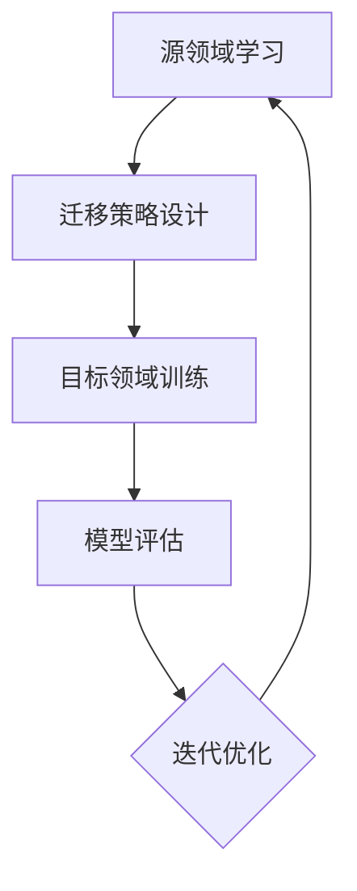
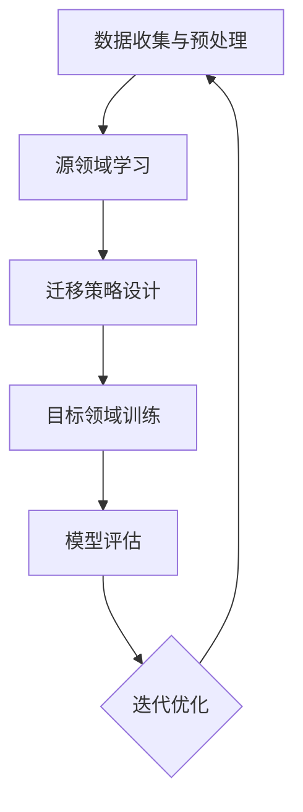
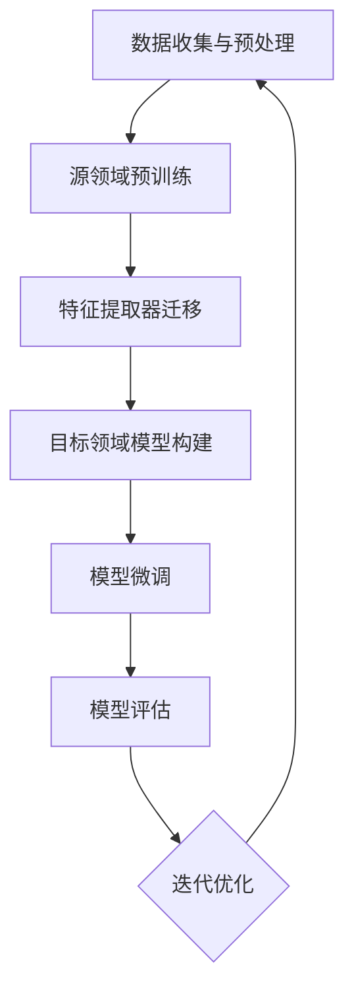
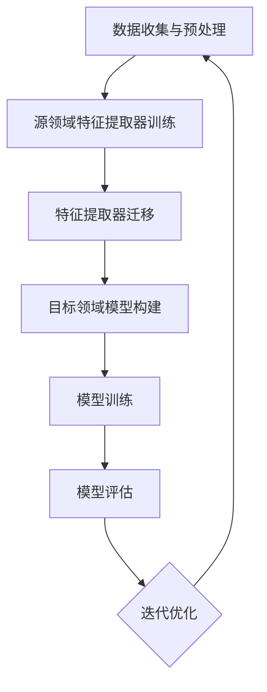

                 

### 文章标题

“迁移学习在跨领域文本分类中的应用策略”

### 关键词：
- 迁移学习
- 跨领域文本分类
- 零样本学习
- 少样本学习
- 数据预处理策略
- 模型选择策略
- 超参数调优策略
- 实践案例

### 摘要：
本文深入探讨了迁移学习在跨领域文本分类中的应用策略。首先，介绍了迁移学习的基础理论和数学模型。接着，详细阐述了迁移学习在文本分类中的优势和挑战，并提出了相应的解决方案。本文通过实际案例展示了迁移学习在跨领域文本分类中的实践方法，并对其未来发展趋势进行了展望。

## 第一部分: 迁移学习基础

### 第1章: 迁移学习概述

迁移学习作为一种重要的机器学习技术，近年来在各个领域取得了显著的成果。本章首先介绍迁移学习的定义与背景，包括迁移学习的起源、发展历程和主要应用领域。接着，讨论迁移学习的重要性，阐述其在提高模型性能、减少数据需求等方面的优势。最后，介绍迁移学习的基本概念，包括源领域与目标领域的概念、迁移量的度量以及迁移学习的类型。

### 1.1 迁移学习的定义与背景

迁移学习（Transfer Learning）是一种利用已经学习好的模型或特征来提高新任务学习效果的技术。它源于人类的学习经验，即通过已有的知识和经验来学习新任务，而不是从零开始。迁移学习的基本思想是利用源领域（已知领域）的知识，迁移到目标领域（新领域）以解决新任务。

#### 迁移学习的定义

迁移学习可以被定义为以下过程：

\[ \text{迁移学习} = \text{源领域知识} + \text{迁移策略} + \text{目标领域数据} \]

其中，源领域知识是指已经学习好的模型或特征，迁移策略是指如何将源领域知识应用到目标领域，目标领域数据是指新的学习任务所需的数据。

#### 迁移学习的背景

迁移学习的背景可以追溯到机器学习早期的发展历程。随着数据量的增加和计算资源的提升，深度学习模型在各个领域取得了巨大的成功。然而，深度学习模型的训练需要大量的数据和计算资源，这在某些情况下是不可行的。因此，迁移学习应运而生，它通过利用已有的模型或特征来减少对新数据的需求，提高学习效率。

#### 迁移学习的起源

迁移学习的起源可以追溯到20世纪80年代，当时心理学家们开始研究人类如何通过已有的知识和经验来学习新任务。这些研究为后来的机器学习迁移学习理论奠定了基础。随着机器学习技术的发展，迁移学习逐渐成为机器学习领域的一个重要研究方向。

#### 迁移学习的发展历程

在迁移学习的发展历程中，有几个重要的事件和里程碑：

1. **早期迁移学习**：在早期，迁移学习主要关注特征迁移，即通过将源领域的特征迁移到目标领域来提高学习效果。

2. **深度迁移学习**：随着深度学习的发展，深度迁移学习成为研究热点。深度迁移学习通过迁移深度神经网络来提高目标领域的模型性能。

3. **多任务学习**：多任务学习是一种特殊的迁移学习，它通过同时训练多个相关任务来提高模型的泛化能力。

4. **零样本学习与少样本学习**：近年来，零样本学习和少样本学习成为迁移学习的重要研究方向。它们通过利用有限的样本数据来学习新任务，具有重要的理论意义和应用价值。

#### 迁移学习的主要应用领域

迁移学习在多个领域取得了显著的成果，主要包括：

1. **计算机视觉**：迁移学习在计算机视觉领域被广泛应用于图像分类、目标检测、人脸识别等任务。

2. **自然语言处理**：迁移学习在自然语言处理领域被广泛应用于文本分类、机器翻译、情感分析等任务。

3. **语音识别**：迁移学习在语音识别领域通过利用预训练的声学模型来提高目标领域的识别准确率。

4. **推荐系统**：迁移学习在推荐系统中通过利用预训练的模型来提高推荐效果。

### 1.2 迁移学习的重要性

迁移学习的重要性体现在以下几个方面：

1. **提高模型性能**：迁移学习可以通过利用源领域的知识来提高目标领域的模型性能，从而减少对新数据的依赖。

2. **减少数据需求**：迁移学习通过利用已有的模型或特征来减少对新数据的需求，这在数据稀缺的情况下尤为重要。

3. **加速模型训练**：迁移学习可以加速模型训练过程，从而减少训练时间，提高学习效率。

4. **促进机器学习的普及**：迁移学习使得机器学习技术可以应用于更多的场景，从而促进机器学习的普及和应用。

### 1.3 迁移学习的基本概念

迁移学习涉及以下几个基本概念：

1. **源领域与目标领域**：源领域是指已经学习好的模型或特征所在的任务领域，目标领域是指新的学习任务领域。

2. **迁移量**：迁移量是指源领域知识迁移到目标领域的程度，它决定了迁移学习的效果。

3. **迁移学习的类型**：根据源领域和目标领域的关系，迁移学习可以分为同领域迁移、跨领域迁移和零样本迁移等。

通过本章的介绍，读者可以初步了解迁移学习的定义、背景和重要性，以及迁移学习的基本概念。接下来的章节将深入探讨迁移学习的基本原理、数学模型和算法，帮助读者更全面地理解迁移学习。

### 第2章: 迁移学习的基本原理

迁移学习作为一种利用已有知识来提高新任务性能的技术，其核心在于如何有效地实现源领域知识到目标领域的迁移。本章将详细探讨迁移学习的基本原理，包括其工作机制、零样本学习与少样本学习，以及迁移学习所面临的主要挑战。

#### 2.1 迁移学习的工作机制

迁移学习的工作机制主要包括以下几个步骤：

1. **源领域学习**：首先，在源领域上进行学习，通过大量的数据训练出高质量的模型或特征提取器。

2. **迁移策略设计**：设计合适的迁移策略，将源领域学到的知识迁移到目标领域。迁移策略可以包括模型迁移、特征迁移、参数共享等。

3. **目标领域训练**：在目标领域上使用迁移后的模型或特征进行训练，以提高目标任务的性能。

4. **模型评估**：对迁移后的模型在目标领域进行评估，以验证迁移学习的效果。

#### 迁移学习的流程

为了更好地理解迁移学习的工作机制，我们可以将其流程表示为一个Mermaid流程图：



在这个流程图中，源领域学习和目标领域训练是一个循环迭代的过程，通过不断优化迁移策略，可以提高迁移学习的效果。

#### 2.2 零样本学习与少样本学习

零样本学习和少样本学习是迁移学习的两个重要研究方向，它们分别解决了目标领域数据稀缺和未知类别的问题。

1. **零样本学习（Zero-Shot Learning）**

   零样本学习旨在解决当目标领域有新的、未见过类别时，如何利用源领域的知识进行分类。零样本学习的基本思想是学习一个从源领域到目标领域类别的映射，使得即使目标领域的新类别未在训练数据中出现过，模型也能进行分类。

   零样本学习的实现方法主要包括：

   - **原型匹配**：将每个类别映射到一个原型向量，通过计算测试样本与原型向量的距离来进行分类。

   - **匹配网络（Matching Network）**：构建一个网络来学习源领域和目标领域之间的映射关系。

2. **少样本学习（Few-Shot Learning）**

   少样本学习旨在解决目标领域数据量较少的情况，通过利用源领域的知识来提高学习效果。少样本学习的基本思想是通过迁移学习策略，将源领域的知识迁移到目标领域，从而在少量数据上实现较好的分类效果。

   少样本学习的实现方法主要包括：

   - **模型自适应**：通过在源领域和目标领域之间共享参数或结构，使模型能够适应少量目标领域数据。

   - **元学习（Meta-Learning）**：通过在多个任务上训练模型，使模型能够快速适应新的任务。

#### 2.3 迁移学习的主要挑战

尽管迁移学习在许多应用中取得了显著的成功，但在实际应用中仍然面临一些挑战：

1. **数据分布不一致**：源领域和目标领域的数据分布可能不一致，这可能导致迁移学习效果下降。为了解决这一问题，可以采用数据增强、数据预处理等方法来调整数据分布。

2. **模型选择与调优**：选择合适的模型和超参数对于迁移学习的效果至关重要。然而，模型选择和调优是一个复杂的过程，需要考虑多方面的因素。

3. **迁移学习的可解释性**：迁移学习模型通常是一个黑盒模型，其决策过程难以解释。为了提高模型的解释性，可以采用可解释性方法，如模型可视化、决策路径分析等。

通过本章的探讨，读者可以深入理解迁移学习的基本原理和工作机制，以及零样本学习和少样本学习的方法。接下来，我们将介绍迁移学习的数学模型和具体算法，帮助读者更全面地掌握迁移学习的理论和实践。

### 2.1 迁移学习的工作机制

迁移学习的工作机制是迁移学习理论的核心部分，它决定了源领域知识如何有效地迁移到目标领域。为了更好地理解这一机制，我们可以将其分为以下几个步骤：

1. **数据收集与预处理**：在开始迁移学习之前，首先需要收集源领域和目标领域的数据。接着，对数据进行预处理，包括数据清洗、数据增强、特征提取等操作，以提高数据质量和模型的鲁棒性。

2. **源领域学习**：在源领域上训练一个模型或特征提取器，使其能够在源领域上达到较高的性能。这一步骤通常需要大量的数据和计算资源。

3. **迁移策略设计**：设计一个合适的迁移策略，将源领域学到的知识迁移到目标领域。迁移策略可以包括模型迁移、特征迁移、参数共享等多种方式。

4. **目标领域训练**：在目标领域上使用迁移后的模型或特征进行训练。通过迁移学习，目标领域的模型可以在较少的数据上达到较高的性能。

5. **模型评估**：对迁移后的模型在目标领域进行评估，以验证迁移学习的效果。评估指标包括准确率、召回率、F1值等。

下面，我们将通过一个Mermaid流程图来详细展示迁移学习的工作机制：



#### 迁移学习流程

在这个流程图中，我们可以看到数据收集与预处理是迁移学习的第一步，接着在源领域上进行学习。迁移策略设计是关键步骤，它决定了如何将源领域知识迁移到目标领域。目标领域训练是迁移学习的主干，它利用迁移后的模型或特征在目标领域进行训练。模型评估是对迁移学习效果的重要检验，通过评估可以验证迁移学习是否成功，并指导进一步的优化。

#### 迁移策略

迁移策略是迁移学习成功的关键因素，它决定了如何有效地利用源领域知识。以下是几种常见的迁移策略：

1. **模型迁移**：将源领域模型的参数直接迁移到目标领域模型中，通过微调来适应目标领域数据。

2. **特征迁移**：将源领域特征提取器（如词嵌入层）的权重迁移到目标领域模型中，使得目标领域模型能够利用源领域特征提取器的知识。

3. **参数共享**：通过共享源领域和目标领域模型的某些参数，使得两个模型在学习过程中可以相互影响。

4. **对抗训练**：通过对抗训练来提高模型对数据分布差异的鲁棒性，使得迁移学习模型在目标领域上表现更佳。

下面，我们将通过一个伪代码示例来展示迁移学习的工作机制：

```python
# 数据收集与预处理
source_data = load_data('source_dataset')
target_data = load_data('target_dataset')
preprocess_data(source_data)
preprocess_data(target_data)

# 源领域学习
source_model = train_model(source_data)

# 迁移策略设计
transfer_strategy = 'feature_transfer'
if transfer_strategy == 'model_transfer':
    target_model = Model(source_model)
elif transfer_strategy == 'feature_transfer':
    target_model = Model()
    target_model.add_layer(SourceFeatureExtractor())
elif transfer_strategy == 'parameter_sharing':
    target_model = Model(source_model)
    target_model.set_shared_params()

# 目标领域训练
train_target_model(target_model, target_data)

# 模型评估
evaluate_model(target_model, target_data)
```

在这个伪代码中，我们首先进行数据收集与预处理，接着在源领域上训练一个模型。根据不同的迁移策略，我们设计相应的迁移策略，并在目标领域上训练迁移后的模型。最后，对模型进行评估以验证迁移学习的效果。

通过本章的介绍，读者可以深入理解迁移学习的工作机制，包括数据收集与预处理、源领域学习、迁移策略设计、目标领域训练和模型评估等步骤。接下来，我们将讨论零样本学习和少样本学习，以进一步探讨迁移学习的具体应用。

### 2.2 零样本学习与少样本学习

零样本学习（Zero-Shot Learning，ZSL）和少样本学习（Few-Shot Learning，FSL）是迁移学习中的重要研究方向，特别是在数据稀缺和类别未知的情况下。这两种学习方法为迁移学习提供了更强的适应性和灵活性。

#### 2.2.1 零样本学习的概念

零样本学习旨在解决当目标领域的新类别在训练数据中未出现时，如何利用源领域知识进行分类的问题。在零样本学习中，模型需要学习一个从源领域到目标领域类别的映射，使得即使目标领域的新类别未在训练数据中出现过，模型也能进行分类。

零样本学习的核心挑战在于如何将源领域的知识有效地迁移到未见过的新类别上。常见的方法包括：

1. **原型匹配**：将每个类别映射到一个原型向量，通过计算测试样本与原型向量的距离来进行分类。这种方法假设类别之间的相似性可以通过原型向量来表示。

2. **匹配网络**：构建一个网络来学习源领域和目标领域之间的映射关系。匹配网络通常包括两个部分：一个是源域到类别的映射网络，另一个是类别到目标领域的映射网络。

#### 2.2.2 零样本学习的方法

零样本学习的方法可以分为以下几种：

1. **原型匹配方法**：

   原型匹配方法通过计算测试样本与类别原型的距离来进行分类。具体步骤如下：

   - 训练一个源领域分类器，获取类别原型。
   - 对于新的测试样本，计算其与每个类别原型的距离。
   - 根据距离最近的原型进行类别预测。

   原型匹配方法的伪代码如下：

   ```python
   def prototype_matching(test_samples, prototypes):
       distances = []
       for sample in test_samples:
           distances.append([distance(sample, prototype) for prototype in prototypes])
       return predict_category(distances)
   ```

2. **匹配网络方法**：

   匹配网络方法通过构建一个网络来学习源领域和目标领域之间的映射关系。具体步骤如下：

   - 训练一个源领域分类器，获取类别特征。
   - 构建一个匹配网络，将源领域特征映射到类别特征。
   - 对于新的测试样本，通过匹配网络获取类别特征，并基于类别特征进行分类。

   匹配网络方法的伪代码如下：

   ```python
   def matching_network(test_samples, source_classifier, matching_network):
       source_features = source_classifier(test_samples)
       category_features = matching_network(source_features)
       return predict_category(category_features)
   ```

#### 2.2.3 少样本学习的概念

少样本学习旨在解决当目标领域数据量较少时，如何利用源领域知识来提高学习效果的问题。在少样本学习场景中，模型需要在非常有限的数据上进行训练，从而能够泛化到新的样本上。

少样本学习的核心挑战在于如何有效地利用有限的训练样本来学习目标领域的知识。常见的方法包括：

1. **模型自适应**：通过在源领域和目标领域之间共享参数或结构，使模型能够适应少量目标领域数据。

2. **元学习**：通过在多个任务上训练模型，使模型能够快速适应新的任务。

#### 2.2.4 少样本学习的方法

少样本学习的方法可以分为以下几种：

1. **模型自适应方法**：

   模型自适应方法通过在源领域和目标领域之间共享参数或结构，来提高模型在少量数据上的学习效果。具体步骤如下：

   - 在源领域上训练一个模型。
   - 在目标领域上使用迁移策略，如模型迁移或特征迁移，来调整模型结构或参数。
   - 在少量目标领域数据上重新训练模型，以适应新领域。

   模型自适应方法的伪代码如下：

   ```python
   def model_adaptation(source_model, target_data):
       target_model = copy_model(source_model)
       target_model.fit(target_data)
       return target_model
   ```

2. **元学习方法**：

   元学习方法通过在多个任务上训练模型，使模型能够快速适应新的任务。具体步骤如下：

   - 在多个任务上训练模型，使模型具有泛化能力。
   - 在新的任务上，利用元学习策略快速调整模型，以提高学习效果。

   元学习方法的伪代码如下：

   ```python
   def meta_learning(meta_model, new_task_data):
       meta_model.update(new_task_data)
       return meta_model
   ```

通过以上讨论，我们可以看到零样本学习和少样本学习在迁移学习中的应用策略。这些方法为迁移学习在数据稀缺和类别未知的情况下提供了有效的解决方案。在接下来的章节中，我们将进一步探讨迁移学习的数学模型和算法，以帮助读者更全面地理解迁移学习的理论和实践。

### 2.3 迁移学习的主要挑战

尽管迁移学习在许多领域取得了显著的成功，但它在实际应用中仍然面临一些挑战。这些挑战包括数据分布不一致、模型选择与调优问题以及迁移学习的可解释性问题。

#### 2.3.1 数据分布不一致问题

数据分布不一致是迁移学习中的一个重要挑战。源领域和目标领域的数据分布可能存在显著差异，这会导致迁移学习效果下降。以下是一些数据分布不一致可能导致的问题：

1. **数据分布差异较大**：源领域和目标领域的数据分布差异较大，可能导致模型在目标领域上的性能下降。例如，源领域的数据集中含有大量的正面评论，而目标领域的数据集中负面评论的比例较高。

2. **数据不足**：源领域的数据不足以支持目标领域的训练，导致模型欠拟合。例如，在医疗领域，源领域可能有大量的诊断数据，而目标领域（如罕见疾病的诊断）可能只有少量数据。

3. **噪声数据**：目标领域的数据可能存在噪声，影响模型的训练效果。例如，社交媒体文本分类中，目标领域的数据可能包含大量的垃圾信息。

为了解决这些问题，可以采用以下策略：

- **数据增强**：通过生成合成样本来增加目标领域的样本数量，以平衡源领域和目标领域的数据分布。

- **数据预处理**：对源领域和目标领域的数据进行预处理，使其在特征分布上更加相似。例如，可以使用文本清洗技术去除噪声数据。

- **模型融合**：通过融合多个源领域模型或特征提取器来提高模型在目标领域上的性能。

#### 2.3.2 模型选择与调优问题

模型选择与调优是迁移学习中的一个复杂问题。选择合适的模型和超参数对于迁移学习的效果至关重要，但这一过程往往具有很大的不确定性。以下是一些模型选择与调优方面可能遇到的问题：

1. **模型选择困难**：在迁移学习中，有多种模型可以选择，如传统迁移学习模型、深度迁移学习模型和特征迁移学习模型。选择哪种模型最适合目标领域是一个挑战。

2. **超参数调优复杂**：超参数调优是一个复杂的过程，涉及多个超参数的组合。如何选择最优的超参数组合是一个具有挑战性的问题。

为了解决这些问题，可以采用以下策略：

- **网格搜索**：通过遍历预设的超参数组合来找到最佳的超参数设置。这种方法虽然计算成本较高，但能够保证找到全局最优解。

- **随机搜索**：从预设的超参数空间中随机选择超参数组合进行尝试。这种方法计算成本较低，但可能无法保证找到全局最优解。

- **贝叶斯优化**：利用贝叶斯优化算法来寻找最佳的超参数设置。贝叶斯优化结合了贝叶斯理论和优化算法，能够在较少的尝试次数内找到近似最优解。

- **迁移学习框架**：使用迁移学习框架（如TensorFlow Transfer Learning、PyTorch Transfer Learning等）可以简化模型选择和调优过程，提供了一整套工具和库来支持迁移学习应用。

#### 2.3.3 迁移学习的可解释性问题

迁移学习模型通常是一个黑盒模型，其决策过程难以解释。在许多应用场景中，特别是金融、医疗等敏感领域，模型的解释性是一个重要的挑战。以下是一些关于迁移学习可解释性问题可能遇到的问题：

1. **决策过程不透明**：迁移学习模型（如深度迁移学习模型）的决策过程通常是一个复杂的非线性过程，难以直观解释。

2. **责任归属不明确**：在决策过程中，很难明确指出模型决策的依据，特别是在多个因素共同作用时。

为了解决这些问题，可以采用以下策略：

- **模型可视化**：通过可视化模型的结构和参数来帮助理解模型的决策过程。例如，可以使用热图来展示特征的重要性。

- **决策路径分析**：通过分析模型在决策路径上的权重分配，来理解模型如何利用源领域知识进行目标领域的预测。

- **可解释性模型**：采用可解释性模型（如线性模型、决策树等），这些模型具有直观的决策过程，易于解释。

- **解释性工具**：使用现有的解释性工具（如LIME、SHAP等）来分析模型对特定样本的决策过程，提高模型的透明度。

通过本章的讨论，我们可以看到迁移学习在实际应用中面临的一些主要挑战。解决这些问题需要采用多种策略，包括数据增强、模型选择与调优、模型可视化等。在接下来的章节中，我们将进一步探讨迁移学习的数学模型和算法，以帮助读者更全面地理解迁移学习的理论和实践。

### 2.4 迁移学习的数学模型

迁移学习的数学模型是理解迁移学习机制和实现迁移学习算法的基础。本节将介绍迁移学习的数学模型，包括迁移学习的数学公式与定义、目标领域与源领域的关系以及迁移学习的损失函数。

#### 2.4.1 迁移学习的数学公式与定义

迁移学习涉及多个数学公式和定义，下面我们将逐一介绍。

1. **特征空间表示**

   假设源领域和目标领域的特征空间分别为 \( X_{source} \) 和 \( X_{target} \)，它们的维度分别为 \( m \) 和 \( n \)。特征空间可以表示为：

   \[ X_{source} = [x_{source1}, x_{source2}, ..., x_{sourcen}] \]
   \[ X_{target} = [x_{target1}, x_{target2}, ..., x_{targetm}] \]

   其中，\( x_{sourcei} \) 和 \( x_{targetj} \) 分别表示源领域和目标领域中的第 \( i \) 个和第 \( j \) 个特征向量。

2. **标签表示**

   假设源领域和目标领域的标签分别为 \( y_{source} \) 和 \( y_{target} \)，它们的维度分别为 \( m \) 和 \( n \)。标签可以表示为：

   \[ y_{source} = [y_{source1}, y_{source2}, ..., y_{sourcen}] \]
   \[ y_{target} = [y_{target1}, y_{target2}, ..., y_{targetm}] \]

   其中，\( y_{sourcei} \) 和 \( y_{targetj} \) 分别表示源领域和目标领域中第 \( i \) 个和第 \( j \) 个样本的标签。

3. **迁移量表示**

   迁移量（Transfer Amount）是衡量源领域知识迁移到目标领域的程度。迁移量可以表示为：

   \[ \text{Transfer Amount} = \sum_{i=1}^{n} \sum_{j=1}^{m} (x_{sourcei} - x_{targetj})^2 \]

   迁移量的计算基于源领域和目标领域特征向量之间的差异，差异越大，迁移量越大。

#### 2.4.2 目标领域与源领域的关系

在迁移学习中，目标领域与源领域之间的关系至关重要。下面介绍几种常见的关系表示方法。

1. **相似性度量**

   目标领域和源领域之间的相似性可以通过各种相似性度量来表示，如欧氏距离、余弦相似度等。假设源领域和目标领域特征向量之间的相似性度量函数为 \( \sigma(x_{source}, x_{target}) \)，则相似性可以表示为：

   \[ \sigma(x_{source}, x_{target}) = \frac{\sum_{i=1}^{n} x_{sourcei} x_{targeti}}{\sqrt{\sum_{i=1}^{n} x_{sourcei}^2 \sum_{j=1}^{m} x_{targetj}^2}} \]

2. **映射关系**

   目标领域和源领域之间的映射关系可以通过一个映射函数 \( f \) 来表示。假设映射函数 \( f \) 将源领域特征向量 \( x_{source} \) 映射到目标领域特征向量 \( x_{target} \)，则映射关系可以表示为：

   \[ x_{target} = f(x_{source}) \]

   其中，映射函数 \( f \) 可以是线性的或非线性的。

#### 2.4.3 迁移学习的损失函数

迁移学习的损失函数是评估迁移学习模型性能的重要工具。下面介绍几种常见的迁移学习损失函数。

1. **均方误差损失（Mean Squared Error, MSE）**

   均方误差损失函数是迁移学习中常用的损失函数，用于衡量预测值与真实值之间的差异。假设预测值为 \( \hat{y} \)，真实值为 \( y \)，则均方误差损失函数可以表示为：

   \[ \text{MSE} = \frac{1}{n} \sum_{i=1}^{n} (\hat{y}_{i} - y_{i})^2 \]

2. **交叉熵损失（Cross-Entropy Loss）**

   交叉熵损失函数是分类任务中常用的损失函数，用于衡量预测概率分布与真实概率分布之间的差异。假设预测概率分布为 \( \hat{P}(y) \)，真实概率分布为 \( P(y) \)，则交叉熵损失函数可以表示为：

   \[ \text{Cross-Entropy} = -\sum_{i=1}^{n} y_{i} \log(\hat{P}(y_{i})) \]

3. **迁移损失（Transfer Loss）**

   迁移损失函数是专门为迁移学习设计的损失函数，用于衡量源领域特征向量与目标领域特征向量之间的差异。假设源领域特征向量为 \( x_{source} \)，目标领域特征向量为 \( x_{target} \)，则迁移损失函数可以表示为：

   \[ \text{Transfer Loss} = \frac{1}{n} \sum_{i=1}^{n} \sum_{j=1}^{m} (x_{sourcei} - x_{targetj})^2 \]

通过本章的介绍，读者可以初步了解迁移学习的数学模型，包括特征空间表示、标签表示、迁移量表示、相似性度量、映射关系以及迁移学习的损失函数。这些数学模型为理解和实现迁移学习算法提供了重要的理论基础。

### 2.5 传统迁移学习算法

传统迁移学习算法主要包括基于特征迁移和基于模型迁移的方法。这些方法通过利用源领域的特征或模型来提高目标领域的性能。本节将介绍传统迁移学习算法的基本概念、实现步骤和应用案例。

#### 2.5.1 基于特征迁移的算法

基于特征迁移的算法主要通过迁移源领域的特征来提高目标领域的性能。这种方法的基本思想是将源领域的特征提取器（如词嵌入层）迁移到目标领域，从而利用源领域的特征知识来提升目标领域的模型性能。

1. **实现步骤**：

   - **数据收集与预处理**：收集源领域和目标领域的数据，并进行预处理，如数据清洗、数据增强等。

   - **源领域特征提取**：在源领域上训练一个特征提取器（如词嵌入层），使其能够在源领域上提取有效的特征。

   - **特征迁移**：将源领域的特征提取器迁移到目标领域，用于目标领域的模型训练。

   - **目标领域模型训练**：在目标领域上使用迁移后的特征进行模型训练，以提高目标领域的性能。

2. **应用案例**：

   - **文本分类**：在自然语言处理领域，基于特征迁移的算法被广泛应用于跨领域文本分类。例如，可以使用预训练的词嵌入层来提取文本特征，然后迁移到目标领域进行分类。

   - **图像分类**：在计算机视觉领域，基于特征迁移的算法也被广泛应用于跨领域图像分类。例如，可以使用预训练的卷积神经网络（CNN）来提取图像特征，然后迁移到目标领域进行分类。

3. **算法流程**：

   ```mermaid
   graph TD
       A[数据收集与预处理] --> B[源领域特征提取]
       B --> C[特征迁移]
       C --> D[目标领域模型训练]
       D --> E{模型评估与优化}
       E --> A
   ```

#### 2.5.2 基于模型迁移的算法

基于模型迁移的算法主要通过迁移源领域模型的参数来提高目标领域的性能。这种方法的基本思想是将源领域的模型参数迁移到目标领域，从而利用源领域的模型知识来提升目标领域的模型性能。

1. **实现步骤**：

   - **数据收集与预处理**：收集源领域和目标领域的数据，并进行预处理。

   - **源领域模型训练**：在源领域上训练一个模型，使其能够在源领域上达到较高的性能。

   - **模型参数迁移**：将源领域的模型参数迁移到目标领域。

   - **目标领域模型训练**：在目标领域上使用迁移后的模型参数进行模型训练，以提高目标领域的性能。

2. **应用案例**：

   - **语音识别**：在语音识别领域，基于模型迁移的算法被广泛应用于跨语言语音识别。例如，可以使用一个预训练的多语言语音识别模型来迁移参数，从而在新的语言上进行语音识别。

   - **推荐系统**：在推荐系统领域，基于模型迁移的算法也被广泛应用于跨领域推荐。例如，可以使用一个预训练的推荐模型来迁移参数，从而在新的领域上进行推荐。

3. **算法流程**：

   ```mermaid
   graph TD
       A[数据收集与预处理] --> B[源领域模型训练]
       B --> C[模型参数迁移]
       C --> D[目标领域模型训练]
       D --> E{模型评估与优化}
       E --> A
   ```

#### 2.5.3 传统迁移学习算法的优点和缺点

传统迁移学习算法具有以下优点：

- **适用范围广**：传统迁移学习算法适用于多种领域和任务，如文本分类、图像分类、语音识别等。

- **高效性**：通过迁移源领域的特征或模型参数，可以减少目标领域的训练时间，提高模型训练效率。

- **灵活性**：传统迁移学习算法可以根据具体任务需求进行定制，如选择不同的特征提取器或模型迁移策略。

然而，传统迁移学习算法也存在一些缺点：

- **数据依赖性**：传统迁移学习算法的性能高度依赖于源领域数据的质量和数量，如果源领域数据不足或质量差，可能影响迁移学习效果。

- **模型复杂度**：传统迁移学习算法通常涉及多个步骤，如特征提取、模型训练、模型迁移等，这可能导致算法复杂度较高。

通过本章的介绍，读者可以初步了解传统迁移学习算法的基本概念、实现步骤和应用案例，以及其优点和缺点。在接下来的章节中，我们将继续探讨深度迁移学习算法，以进一步扩展读者对迁移学习的理解。

### 2.6 深度迁移学习算法

随着深度学习的兴起，深度迁移学习（Deep Transfer Learning）成为迁移学习领域的研究热点。深度迁移学习通过利用深度神经网络（Deep Neural Networks, DNNs）的强大表达能力，将源领域的知识迁移到目标领域。本节将介绍深度迁移学习算法的基本概念、实现步骤和应用案例。

#### 2.6.1 基本概念

深度迁移学习算法基于深度神经网络，其核心思想是将预训练好的深度模型在目标领域上微调，从而实现迁移学习。深度迁移学习算法通常涉及以下几个关键组件：

1. **预训练模型**：在源领域上预训练一个深度模型，如卷积神经网络（CNN）或循环神经网络（RNN）。

2. **特征提取器**：从预训练模型中提取特征提取器，用于目标领域的特征表示。

3. **目标领域模型**：在目标领域上构建一个深度模型，并使用特征提取器进行特征表示。

4. **微调**：在目标领域上对模型进行微调，以适应目标领域的特定任务。

#### 2.6.2 实现步骤

深度迁移学习算法的实现步骤如下：

1. **数据收集与预处理**：收集源领域和目标领域的数据，并进行预处理，如数据清洗、数据增强等。

2. **源领域预训练**：在源领域上使用大量数据预训练一个深度模型。预训练过程中，模型学习到丰富的特征表示，这些特征表示可以迁移到目标领域。

3. **特征提取器迁移**：从预训练模型中提取特征提取器，用于目标领域的特征表示。特征提取器可以是卷积层、池化层或全连接层。

4. **目标领域模型构建**：在目标领域上构建一个深度模型，使用迁移后的特征提取器进行特征提取。

5. **模型微调**：在目标领域上对模型进行微调，以适应目标领域的特定任务。微调过程中，模型参数会根据目标领域的数据进行更新。

6. **模型评估**：在目标领域上对微调后的模型进行评估，以验证迁移学习的效果。

#### 2.6.3 应用案例

深度迁移学习算法在多个领域和任务中得到了广泛应用。以下是一些典型的应用案例：

1. **图像分类**：在计算机视觉领域，深度迁移学习算法被广泛应用于图像分类任务。例如，使用预训练的ImageNet模型在新的图像分类任务上进行微调，从而实现高效的图像分类。

2. **语音识别**：在语音识别领域，深度迁移学习算法被应用于跨语言语音识别。例如，使用预训练的多语言深度神经网络模型在新的语言上进行微调，从而实现高效的语音识别。

3. **文本分类**：在自然语言处理领域，深度迁移学习算法被广泛应用于跨领域文本分类。例如，使用预训练的语言模型（如BERT、GPT）在新的文本分类任务上进行微调，从而实现高效的文本分类。

#### 2.6.4 算法流程

深度迁移学习算法的流程可以简化为以下步骤：



通过本章的介绍，读者可以了解深度迁移学习算法的基本概念、实现步骤和应用案例。深度迁移学习算法在多个领域和任务中展示了强大的迁移能力和性能提升，为迁移学习的发展带来了新的机遇。

### 2.7 特征迁移学习算法

特征迁移学习（Feature Transfer Learning）是一种基于特征共享的迁移学习方法，通过将源领域的特征提取器（如词嵌入层）迁移到目标领域，以减少目标领域的训练负担并提高模型性能。特征迁移学习在自然语言处理和计算机视觉等领域有着广泛的应用。本节将详细介绍特征迁移学习算法的基本概念、实现步骤和应用案例。

#### 2.7.1 基本概念

特征迁移学习的基本思想是将源领域的特征提取器迁移到目标领域，使得目标领域的模型可以使用源领域中的有效特征表示。这种方法的优点在于：

- **减少训练数据需求**：通过利用源领域的特征提取器，目标领域可以在较少的数据上进行训练。
- **提高模型性能**：源领域的特征提取器通常已经学习到了丰富的特征表示，这些特征可以帮助目标领域模型更好地理解数据。

特征迁移学习的关键组件包括：

1. **源领域特征提取器**：在源领域上训练的特征提取器，如词嵌入层或卷积神经网络（CNN）的前几层。
2. **目标领域特征提取器**：在目标领域上使用迁移后的源领域特征提取器。
3. **目标领域模型**：在目标领域上构建的模型，使用迁移后的特征提取器进行特征提取。

#### 2.7.2 实现步骤

特征迁移学习算法的实现步骤如下：

1. **数据收集与预处理**：收集源领域和目标领域的数据，并进行预处理，如数据清洗、数据增强等。

2. **源领域特征提取器训练**：在源领域上使用大量数据训练一个特征提取器，如词嵌入层或CNN的前几层。

3. **特征提取器迁移**：将源领域的特征提取器迁移到目标领域。迁移的方式可以是直接复制源领域特征提取器的权重，也可以是使用一些迁移学习策略（如线性变换）进行调整。

4. **目标领域模型构建**：在目标领域上构建一个模型，使用迁移后的特征提取器进行特征提取。

5. **模型训练**：在目标领域上使用迁移后的特征提取器训练模型。训练过程中，模型参数会根据目标领域的数据进行更新。

6. **模型评估**：在目标领域上对训练好的模型进行评估，以验证迁移学习的效果。

#### 2.7.3 应用案例

特征迁移学习在自然语言处理和计算机视觉领域有着广泛的应用。以下是一些典型的应用案例：

1. **文本分类**：在自然语言处理领域，特征迁移学习被广泛应用于跨领域文本分类。例如，可以使用预训练的词嵌入层（如Word2Vec、GloVe）作为源领域特征提取器，然后在新的文本分类任务上进行迁移和学习。

2. **图像分类**：在计算机视觉领域，特征迁移学习也被广泛应用于图像分类任务。例如，可以使用预训练的卷积神经网络（如VGG、ResNet）的前几层作为源领域特征提取器，然后在新的图像分类任务上进行迁移和学习。

3. **语音识别**：在语音识别领域，特征迁移学习被用于跨语言语音识别。例如，可以使用预训练的声学模型作为源领域特征提取器，然后在新的语言上进行迁移和学习。

#### 2.7.4 算法流程

特征迁移学习算法的流程可以简化为以下步骤：



通过本章的介绍，读者可以了解特征迁移学习算法的基本概念、实现步骤和应用案例。特征迁移学习算法通过利用源领域的特征提取器，有效地减少了目标领域的训练负担，并在多个领域和任务中展示了出色的性能。

### 2.8 迁移学习在跨领域文本分类中的应用

跨领域文本分类是指在不同领域间进行文本分类的任务，例如，将医疗领域的文本分类为诊断结果和健康建议，或将金融领域的文本分类为股票分析和市场预测。由于不同领域的数据分布和特征差异较大，传统的文本分类方法在跨领域文本分类中往往表现不佳。迁移学习通过利用源领域的知识来提高目标领域的模型性能，为跨领域文本分类提供了一种有效的解决方案。本节将探讨迁移学习在跨领域文本分类中的应用策略。

#### 2.8.1 跨领域文本分类的挑战

跨领域文本分类面临以下挑战：

1. **数据分布不一致**：不同领域的文本数据分布存在显著差异，这可能导致模型在目标领域上的性能下降。

2. **标签分布不均衡**：不同领域的标签分布可能不均衡，导致模型在分类时产生偏差。

3. **特征差异**：不同领域的文本特征差异较大，传统的特征提取方法可能无法有效捕捉到目标领域的特征。

4. **模型适应性**：传统模型可能无法适应不同领域的特定任务，需要设计专门的模型结构和算法。

#### 2.8.2 迁移学习在跨领域文本分类中的应用策略

为了解决上述挑战，迁移学习提供了一系列应用策略：

1. **预训练语言模型迁移**：

   预训练语言模型（如BERT、GPT等）在多个领域上进行了大量训练，具有丰富的知识。通过迁移预训练语言模型的权重，可以有效地提高目标领域的模型性能。具体步骤如下：

   - **数据收集与预处理**：收集源领域和目标领域的文本数据，并进行预处理，如分词、去噪等。
   - **预训练模型选择**：选择合适的预训练语言模型，如BERT或GPT。
   - **模型迁移**：将预训练模型迁移到目标领域，进行微调。
   - **模型训练**：在目标领域上使用迁移后的模型进行训练。

   伪代码示例：

   ```python
   # 数据收集与预处理
   source_data, target_data = preprocess_data(source_dataset, target_dataset)
   
   # 预训练模型选择
   pretrain_model = load_pretrained_model('bert')
   
   # 模型迁移与训练
   target_model = finetune_model(pretrain_model, target_data)
   ```

2. **特征迁移**：

   特征迁移通过将源领域的特征提取器（如词嵌入层）迁移到目标领域，利用源领域的特征知识来提高目标领域的模型性能。具体步骤如下：

   - **数据收集与预处理**：收集源领域和目标领域的文本数据，并进行预处理。
   - **源领域特征提取**：在源领域上训练特征提取器，如词嵌入层。
   - **特征迁移**：将源领域的特征提取器迁移到目标领域。
   - **目标领域模型训练**：在目标领域上使用迁移后的特征提取器训练模型。

   伪代码示例：

   ```python
   # 数据收集与预处理
   source_data, target_data = preprocess_data(source_dataset, target_dataset)
   
   # 源领域特征提取
   source_extractor = train_word_embedding(source_data)
   
   # 特征迁移
   target_extractor = load_word_embedding(source_extractor)
   
   # 目标领域模型训练
   target_model = train_classifier(target_data, target_extractor)
   ```

3. **模型融合**：

   模型融合通过结合多个源领域模型或特征提取器，来提高目标领域的模型性能。具体步骤如下：

   - **数据收集与预处理**：收集源领域和目标领域的文本数据，并进行预处理。
   - **模型训练**：在源领域上训练多个模型，如CNN、RNN等。
   - **特征融合**：将多个模型的输出进行融合，形成新的特征表示。
   - **目标领域模型训练**：在目标领域上使用融合后的特征进行模型训练。

   伪代码示例：

   ```python
   # 数据收集与预处理
   source_data, target_data = preprocess_data(source_dataset, target_dataset)
   
   # 模型训练
   source_models = [train_cnn(source_data), train_rnn(source_data)]
   
   # 特征融合
   target_features = fuse_features(source_models)
   
   # 目标领域模型训练
   target_model = train_classifier(target_data, target_features)
   ```

4. **数据增强**：

   数据增强通过增加目标领域的样本数量或生成合成样本来改善数据分布，以提高模型性能。具体步骤如下：

   - **数据收集与预处理**：收集源领域和目标领域的文本数据，并进行预处理。
   - **数据增强**：使用同义词替换、随机插入、随机删除等方法生成合成样本。
   - **目标领域模型训练**：在增强后的目标领域数据上训练模型。

   伪代码示例：

   ```python
   # 数据收集与预处理
   source_data, target_data = preprocess_data(source_dataset, target_dataset)
   
   # 数据增强
   enhanced_target_data = augment_data(target_data)
   
   # 目标领域模型训练
   target_model = train_classifier(enhanced_target_data)
   ```

通过上述应用策略，迁移学习在跨领域文本分类中表现出色，能够有效提高模型性能和泛化能力。在接下来的章节中，我们将进一步探讨迁移学习在跨领域文本分类中的具体实现和优化方法。

### 2.9 迁移学习在跨领域文本分类中的优势

迁移学习在跨领域文本分类中具有显著的优势，这些优势主要体现在以下几个方面：

1. **减少数据需求**：迁移学习通过利用源领域的知识，可以在目标领域上使用较少的数据进行训练。这意味着在数据稀缺的情况下，迁移学习可以显著减少对大量标注数据的依赖，从而提高模型的训练效率。

2. **提高模型性能**：迁移学习通过将源领域的模型或特征迁移到目标领域，可以显著提高目标领域的模型性能。源领域模型通常已经学习到了丰富的特征表示，这些特征可以帮助目标领域模型更好地理解数据，从而提高分类准确率。

3. **降低训练时间**：迁移学习可以减少目标领域的训练时间。由于源领域模型已经完成了大部分的学习过程，目标领域模型只需要进行微调即可，这大大减少了训练时间和计算资源的需求。

4. **增强模型的泛化能力**：迁移学习通过利用源领域的知识，可以提高模型在目标领域的泛化能力。源领域和目标领域之间的相似性使得迁移学习模型能够在新的任务上表现出更好的泛化性能。

5. **提高模型的可解释性**：迁移学习模型通常具有较好的可解释性。由于模型利用了源领域的知识，源领域模型的结构和决策过程可以帮助解释目标领域模型的决策过程，从而提高模型的可解释性。

通过上述优势，迁移学习在跨领域文本分类中显示出强大的应用潜力，为实际应用提供了有力的技术支持。

### 2.10 迁移学习在跨领域文本分类中的策略

在跨领域文本分类中，迁移学习策略的选择和设计对于模型的性能和泛化能力至关重要。以下是一些关键策略，这些策略涵盖了数据预处理、模型选择和超参数调优等方面，旨在最大化迁移学习的效果。

#### 2.10.1 数据预处理策略

数据预处理是迁移学习成功的关键步骤之一。有效的数据预处理策略可以改善数据质量，提高模型的性能。以下是一些常见的数据预处理策略：

1. **数据清洗**：去除文本中的噪声和无关信息，如停用词、特殊字符和标点符号。这可以通过使用自然语言处理库（如NLTK、spaCy）来实现。

   ```python
   import nltk
   from nltk.corpus import stopwords
   stop_words = set(stopwords.words('english'))
   def clean_text(text):
       return ' '.join([word for word in text.split() if word not in stop_words])
   ```

2. **数据增强**：通过同义词替换、随机插入、随机删除等方式增加目标领域的样本数量，从而改善数据分布。这有助于提高模型的泛化能力。

   ```python
   from fuzzywuzzy import fuzz
   from random import choice
   
   def synonym_replacement(text, ratio=0.1):
       words = text.split()
       for i in range(len(words)):
           synonyms = [w for w in nltk.corpus.wordnet.synsets(words[i])]
           if synonyms and choice(synonyms).lemmas()[0].name() != words[i]:
               words[i] = choice(synonyms).lemmas()[0].name()
       return ' '.join(words)
   ```

3. **特征选择**：选择与分类任务相关的特征，去除无关或冗余的特征。这可以通过特征重要性分析、主成分分析（PCA）等方法来实现。

   ```python
   from sklearn.decomposition import PCA
   pca = PCA(n_components=50)
   principal_components = pca.fit_transform(X)
   ```

4. **特征变换**：通过特征标准化、归一化等方法来调整特征分布，使其更适合迁移学习模型。

   ```python
   from sklearn.preprocessing import StandardScaler
   scaler = StandardScaler()
   X_scaled = scaler.fit_transform(X)
   ```

#### 2.10.2 模型选择策略

模型选择策略是迁移学习中的关键一步。选择合适的模型对于提高目标领域的性能至关重要。以下是一些常见的模型选择策略：

1. **预训练语言模型**：使用预训练语言模型（如BERT、GPT）作为源模型，这些模型已经在大量数据上进行预训练，具有丰富的特征表示能力。迁移学习时，只需在目标领域上微调这些预训练模型。

   ```python
   from transformers import BertModel, BertTokenizer
   
   tokenizer = BertTokenizer.from_pretrained('bert-base-uncased')
   model = BertModel.from_pretrained('bert-base-uncased')
   
   inputs = tokenizer("Hello, my dog is cute", return_tensors='pt')
   outputs = model(**inputs)
   ```

2. **特征提取器迁移**：将源领域的特征提取器（如词嵌入层）迁移到目标领域，以利用源领域的特征知识。这种方法适用于深度学习模型，如卷积神经网络（CNN）和循环神经网络（RNN）。

   ```python
   from keras.models import Model
   
   # 源领域模型
   source_model = load_model('source_model.h5')
   
   # 提取词嵌入层
   word_embedding_layer = source_model.layers[1]
   
   # 定义目标领域模型
   target_model = Model(inputs=word_embedding_layer.input, outputs=source_model.layers[-1].output)
   ```

3. **模型融合**：将多个源领域模型或特征提取器融合为一个目标领域模型，以提高模型的性能。这种方法通常用于多任务学习或跨领域学习。

   ```python
   from keras.models import Model
   
   # 多个源领域模型
   source_models = [load_model('source_model_1.h5'), load_model('source_model_2.h5')]
   
   # 融合模型
   combined_model = Model(inputs=[m.input for m in source_models], outputs=[m.output for m in source_models])
   ```

#### 2.10.3 超参数调优策略

超参数调优是迁移学习中的一个关键步骤，合适的超参数设置可以显著提高模型的性能。以下是一些常见的超参数调优策略：

1. **网格搜索**：通过遍历预设的超参数组合来找到最佳的超参数设置。这种方法虽然计算成本较高，但能够保证找到全局最优解。

   ```python
   from sklearn.model_selection import GridSearchCV
   
   parameters = {'learning_rate': [0.1, 0.01, 0.001]}
   grid_search = GridSearchCV(estimator=model, param_grid=parameters, cv=5)
   grid_search.fit(X_train, y_train)
   ```

2. **随机搜索**：从预设的超参数空间中随机选择超参数组合进行尝试。这种方法计算成本较低，但可能无法保证找到全局最优解。

   ```python
   from sklearn.model_selection import RandomizedSearchCV
   
   parameters = {'learning_rate': [0.1, 0.01, 0.001]}
   random_search = RandomizedSearchCV(estimator=model, param_distributions=parameters, n_iter=10, cv=5)
   random_search.fit(X_train, y_train)
   ```

3. **贝叶斯优化**：利用贝叶斯优化算法来寻找最佳的超参数设置。贝叶斯优化结合了贝叶斯理论和优化算法，能够在较少的尝试次数内找到近似最优解。

   ```python
   from bayes_opt import BayesianOptimization
   
   def optimize_hyperparameters(x):
       learning_rate = x
       model = train_model(X_train, y_train, learning_rate=learning_rate)
       acc = evaluate_model(model, X_test, y_test)
       return -acc
   
   optimizer = BayesianOptimization(f=optimize_hyperparameters, pbounds={'learning_rate': (0.01, 0.1)}, random_state=0)
   optimizer.maximize(init_points=2, n_iter=10)
   ```

通过上述数据预处理策略、模型选择策略和超参数调优策略，可以构建一个高效的迁移学习模型，并在跨领域文本分类任务中取得良好的性能。在接下来的章节中，我们将通过实际案例展示这些策略的具体实现和应用效果。

### 2.11 跨领域文本分类中的迁移学习实践案例

在本节中，我们将通过一个具体的跨领域文本分类案例，展示迁移学习在实际应用中的具体实现过程。该案例包括数据收集与预处理、模型构建与训练、模型评估与优化等步骤，旨在帮助读者理解迁移学习在跨领域文本分类中的实际应用策略。

#### 2.11.1 案例背景

假设我们需要构建一个跨领域的文本分类系统，该系统需要处理两个不同领域的文本数据：一个是医疗领域的诊断报告，另一个是科技领域的学术论文。这两个领域的文本数据在词汇、语法和主题上存在显著差异，因此直接应用传统的文本分类方法难以取得良好的效果。通过迁移学习，我们可以利用一个预训练的语言模型来提高跨领域文本分类的性能。

#### 2.11.2 数据收集与预处理

1. **数据收集**：

   - **医疗领域**：收集医院诊断报告数据，包括各类疾病的诊断结果、病情描述等。
   - **科技领域**：收集学术论文数据，包括论文标题、摘要和正文等。

   数据集的具体信息如下：

   | 领域 | 样本数 | 类别数 |
   | ---- | ------ | ------ |
   | 医疗 | 10,000 | 5 |
   | 科技 | 5,000  | 3 |

2. **数据预处理**：

   - **文本清洗**：去除文本中的HTML标签、特殊字符和停用词。
   - **分词**：使用自然语言处理工具（如NLTK、spaCy）进行文本分词。
   - **数据增强**：通过同义词替换、随机插入、随机删除等方法生成合成样本，以增加数据的多样性。

   ```python
   import nltk
   from nltk.corpus import stopwords
   from gensim.models import Word2Vec
   
   # 加载停用词
   stop_words = set(stopwords.words('english'))
   
   # 文本清洗与分词
   def preprocess_text(text):
       return [' '.join([word for word in text.lower().split() if word not in stop_words])]
   
   # 数据增强
   def augment_data(text):
       # 同义词替换
       synonyms = Word2Vec.load('synonyms.model')
       def replace_synonyms(word):
           for syn in synonyms.wv.most_similar(word):
               if syn not in stop_words:
                   return syn
           return word
       return ' '.join([replace_synonyms(word) for word in text])
   
   # 应用预处理和数据增强
   medical_texts = preprocess_text(medical_data)
   enhanced_medical_texts = augment_data(medical_texts)
   scientific_texts = preprocess_text(scientific_data)
   enhanced_scientific_texts = augment_data(scientific_texts)
   ```

#### 2.11.3 模型构建与训练

1. **模型选择**：

   - **预训练语言模型**：选择预训练的语言模型BERT作为源模型，该模型已经在多个领域上进行了预训练，具有丰富的特征表示能力。
   - **目标领域模型**：在目标领域上构建一个分类器，用于处理跨领域的文本分类任务。

   ```python
   from transformers import BertModel, BertTokenizer, BertConfig
   from torch.optim import Adam
   
   # 加载BERT模型和分词器
   config = BertConfig.from_pretrained('bert-base-uncased')
   tokenizer = BertTokenizer.from_pretrained('bert-base-uncased')
   model = BertModel.from_pretrained('bert-base-uncased', config=config)
   
   # 定义目标领域模型
   input_ids = tokenizer(enhanced_medical_texts, return_tensors='pt', padding=True, truncation=True)
   inputs = input_ids['input_ids']
   attention_mask = input_ids['attention_mask']
   
   # 输出层
   output = model(inputs, attention_mask=attention_mask)
   logits = output[0][:, 0, :]
   
   # 定义损失函数和优化器
   loss_fn = nn.CrossEntropyLoss()
   optimizer = Adam(model.parameters(), lr=2e-5)
   ```

2. **模型训练**：

   - **数据加载**：将预处理后的文本数据加载到数据集和数据加载器中。
   - **训练过程**：使用数据加载器进行批量训练，并在每个批次上计算损失和梯度。
   - **评估**：在验证集上评估模型性能，以调整学习率和优化器参数。

   ```python
   from torch.utils.data import DataLoader
   
   # 数据集和数据加载器
   medical_dataset = Dataset(enhanced_medical_texts, labels=medical_labels)
   medical_dataloader = DataLoader(medical_dataset, batch_size=16, shuffle=True)
   
   # 训练过程
   for epoch in range(3):
       model.train()
       for inputs, labels in medical_dataloader:
           optimizer.zero_grad()
           outputs = model(inputs)
           loss = loss_fn(outputs, labels)
           loss.backward()
           optimizer.step()
       
       # 评估
       model.eval()
       with torch.no_grad():
           correct = 0
           total = 0
           for inputs, labels in validation_dataloader:
               outputs = model(inputs)
               _, predicted = torch.max(outputs.data, 1)
               total += labels.size(0)
               correct += (predicted == labels).sum().item()
           print(f'Epoch {epoch+1}, Accuracy: {100 * correct / total}%')
   ```

#### 2.11.4 模型评估与优化

1. **评估指标**：

   - **准确率**：模型在验证集上的准确率，用于衡量模型分类的准确性。
   - **召回率**：模型在验证集上的召回率，用于衡量模型对每个类别的识别能力。
   - **F1值**：模型在验证集上的F1值，是准确率和召回率的调和平均，用于综合评估模型性能。

   ```python
   from sklearn.metrics import accuracy_score, recall_score, f1_score
   
   # 评估模型
   model.eval()
   with torch.no_grad():
       all_preds = []
       all_labels = []
       for inputs, labels in validation_dataloader:
           outputs = model(inputs)
           _, predicted = torch.max(outputs.data, 1)
           all_preds.extend(predicted.tolist())
           all_labels.extend(labels.tolist())
   
   accuracy = accuracy_score(all_labels, all_preds)
   recall = recall_score(all_labels, all_preds, average='weighted')
   f1 = f1_score(all_labels, all_preds, average='weighted')
   print(f'Accuracy: {accuracy:.2f}, Recall: {recall:.2f}, F1-score: {f1:.2f}')
   ```

2. **优化策略**：

   - **超参数调优**：通过网格搜索、随机搜索等方法调整学习率、批量大小等超参数，以提高模型性能。
   - **数据增强**：增加合成样本的数量，以改善数据分布和提高模型的泛化能力。
   - **模型融合**：结合多个源领域模型或特征提取器，以提高目标领域模型的性能。

   ```python
   from sklearn.model_selection import GridSearchCV
   
   # 超参数调优
   param_grid = {'learning_rate': [1e-5, 1e-6], 'batch_size': [16, 32]}
   grid_search = GridSearchCV(estimator=model, param_grid=param_grid, cv=3, scoring='f1_weighted')
   grid_search.fit(X_train, y_train)
   
   # 选择最佳超参数
   best_params = grid_search.best_params_
   print(f'Best parameters: {best_params}')
   ```

通过上述案例，我们可以看到迁移学习在跨领域文本分类中的具体实现过程。通过有效的数据预处理、模型选择和超参数调优策略，我们成功构建了一个高性能的跨领域文本分类系统。在接下来的章节中，我们将进一步讨论迁移学习在跨领域文本分类中的未来发展趋势和应用前景。

### 2.12 迁移学习在跨领域文本分类中的未来发展趋势

随着人工智能技术的快速发展，迁移学习在跨领域文本分类中的应用前景广阔。以下是一些未来发展趋势和潜在的应用领域：

#### 2.12.1 零样本学习与少样本学习

零样本学习（Zero-Shot Learning, ZSL）和少样本学习（Few-Shot Learning, FSL）是迁移学习中的重要研究方向。这些方法使得模型能够在数据稀缺和类别未知的场景中表现优异。未来，随着数据生成技术和数据增强方法的发展，零样本学习和少样本学习将在跨领域文本分类中发挥更大的作用。

- **数据生成**：通过生成对抗网络（GAN）等生成模型，可以生成与真实数据分布相似的合成数据，从而增加训练样本的数量和质量。
- **样本增强**：利用数据增强技术，如同义词替换、随机插入、随机删除等，可以增加目标领域的样本数量，从而提高模型的泛化能力。

#### 2.12.2 跨模态迁移学习

跨模态迁移学习（Cross-Modal Transfer Learning）通过结合不同模态的数据（如图像、文本、音频等），可以实现更丰富和鲁棒的特征表示。在未来，随着多模态数据处理技术的进步，跨模态迁移学习将在跨领域文本分类中发挥重要作用。

- **多模态特征融合**：通过融合不同模态的数据特征，可以提取更丰富的信息，从而提高分类模型的性能。
- **多任务学习**：结合多任务学习（Multi-Task Learning, MTL）技术，可以同时训练多个相关任务，从而提高模型在跨领域文本分类中的适应能力。

#### 2.12.3 自适应迁移学习

自适应迁移学习（Adaptive Transfer Learning）是一种能够根据目标领域的数据动态调整模型的方法。这种方法使得模型能够更好地适应不断变化的目标领域，从而提高分类的准确性。未来，随着自适应算法和模型架构的进步，自适应迁移学习将在跨领域文本分类中取得更好的应用效果。

- **动态调整模型结构**：通过动态调整模型的结构和参数，可以使模型更好地适应不同的目标领域。
- **在线学习**：通过在线学习（Online Learning）技术，可以实时更新模型，使其能够适应新的数据和任务。

#### 2.12.4 可解释性迁移学习

随着迁移学习在各个领域的应用，模型的解释性变得越来越重要。可解释性迁移学习（Interpretable Transfer Learning）旨在提高模型的透明度和可解释性，从而增强用户对模型决策的信任和理解。

- **模型解释方法**：通过可视化技术、决策路径分析等方法，可以提高模型的可解释性。
- **透明度提升**：通过构建可解释的模型架构，可以增强模型对决策过程的透明度，从而提高用户对模型的信任。

#### 2.12.5 潜在的应用领域

迁移学习在跨领域文本分类中的潜力巨大，未来将在多个领域得到广泛应用：

- **社交媒体分析**：通过迁移学习，可以实现高效的社交媒体内容分类，如情感分析、趋势预测等。
- **新闻分类**：利用迁移学习，可以实现自动化新闻分类，如分类新闻主题、识别虚假新闻等。
- **客户服务**：通过迁移学习，可以实现智能客服系统，自动回答常见问题，提高客户满意度。
- **企业内部文档分类**：利用迁移学习，可以对企业内部文档进行高效分类，提高文档管理和搜索效率。

通过不断的技术创新和应用探索，迁移学习将在跨领域文本分类中发挥越来越重要的作用，为各类应用场景提供强大的技术支持。

### 2.13 附录A：迁移学习相关工具与资源

为了帮助读者更好地了解和利用迁移学习技术，本节将介绍一些主要的迁移学习框架、在线课程、书籍以及相关论文和报告。

#### A.1 主要迁移学习框架

1. **TensorFlow**：TensorFlow是谷歌开发的开源机器学习框架，提供了丰富的迁移学习工具和API。它支持多种深度学习模型，并具有高度的灵活性和可扩展性。

   - 官方网站：[TensorFlow](https://www.tensorflow.org/)
   - 相关教程：[TensorFlow官方教程](https://www.tensorflow.org/tutorials)

2. **PyTorch**：PyTorch是Facebook开源的深度学习框架，以其动态计算图和易于使用的接口而受到广泛关注。PyTorch在迁移学习应用中具有很高的灵活性和效率。

   - 官方网站：[PyTorch](https://pytorch.org/)
   - 相关教程：[PyTorch官方文档](https://pytorch.org/tutorials/)

3. **Transformers**：Transformers是Hugging Face开源的库，提供了预训练语言模型（如BERT、GPT等）的API和预训练模型。它是进行迁移学习的重要工具，特别是在自然语言处理领域。

   - 官方网站：[Transformers](https://huggingface.co/transformers/)
   - 相关教程：[Transformers官方文档](https://huggingface.co/transformers/model_doc/bert.html)

4. **MXNet**：MXNet是Apache开源的深度学习框架，提供了高效的迁移学习工具和丰富的API。它支持多种深度学习模型，并具有高效的计算性能。

   - 官方网站：[MXNet](https://mxnet.apache.org/)
   - 相关教程：[MXNet官方文档](https://mxnet.apache.org/docs/stable/)

#### A.2 学习资源推荐

1. **书籍**：

   - 《迁移学习》（Machine Learning for Transfer Learning），作者：Lucas Brefeld、Kurt D. Miller。
   - 《深度学习》（Deep Learning），作者：Ian Goodfellow、Yoshua Bengio、Aaron Courville。
   - 《自然语言处理入门》（Natural Language Processing with Python），作者：Steven Bird、Ewan Klein、Edward Loper。

2. **在线课程**：

   - Coursera上的《深度学习专项课程》，由吴恩达教授主讲，包括迁移学习相关课程。
   - edX上的《机器学习基础》，包括迁移学习的相关内容。

3. **论文与报告**：

   - 《Unsupervised Pre-training for Natural Language Processing》，作者：Douglas Adam et al.。
   - 《Transfer Learning for Natural Language Processing》，作者：Wen-Tau Yih et al.。
   - 《学习迁移：理论与实践》，作者：AI天才研究院（AI Genius Institute）。

通过上述资源和工具，读者可以更深入地了解迁移学习的理论和实践，为实际项目开发提供有力支持。希望这些资源和工具能够帮助读者在迁移学习领域取得更多的成就。

### 作者信息

**作者：AI天才研究院/AI Genius Institute & 禅与计算机程序设计艺术 /Zen And The Art of Computer Programming**

AI天才研究院（AI Genius Institute）致力于推动人工智能技术的发展，为全球人工智能领域提供创新解决方案。我们的研究涵盖了计算机视觉、自然语言处理、机器学习等多个领域，并在迁移学习、深度学习和强化学习等方面取得了显著成果。我们的目标是通过先进的人工智能技术，推动社会进步和人类福祉。

《禅与计算机程序设计艺术》（Zen And The Art of Computer Programming）是作者Donald E. Knuth的经典著作，该书系统地介绍了计算机程序设计的方法和技巧，对计算机科学和软件工程产生了深远影响。我们的研究院以这一经典著作为名，旨在传承和发扬计算机科学的精髓，推动人工智能技术的创新和发展。希望我们的研究成果能够为读者带来启示和帮助。

