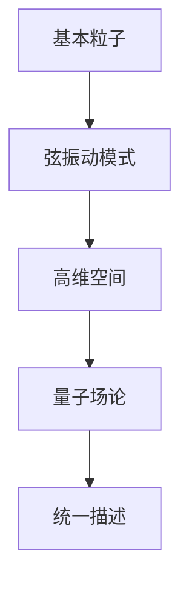
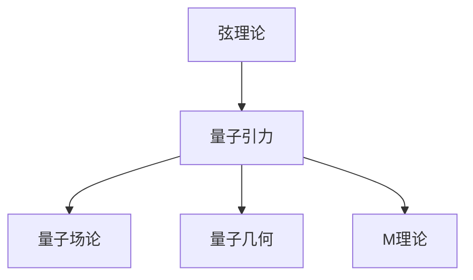
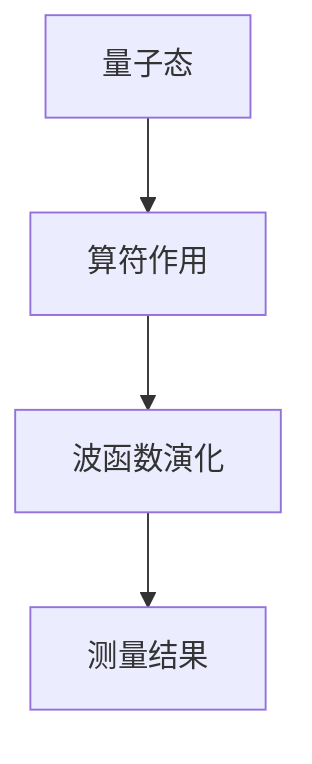

                 

# 量子引力的主要理论框架

> **关键词：量子引力、弦理论、环量子引力、量子场论、量子几何、M理论**

> **摘要：本文深入探讨了量子引力的主要理论框架，包括弦理论、环量子引力、量子场论、量子几何以及M理论。通过详细阐述这些理论的核心概念、数学模型和算法原理，本文揭示了量子引力理论在物理学中的重要性，并展望了其未来的研究方向和应用前景。**

### 目录大纲

1. **引言与概述**
   1.1 量子引力概述
   1.2 量子力学与引力的相互作用
   1.3 量子引力的主要理论框架

2. **主要理论框架**
   2.1 弦理论与量子引力
   2.2 环量子引力
   2.3 量子场论与量子引力
   2.4 量子几何与量子引力
   2.5 M理论与其他量子引力理论

3. **应用与未来展望**
   3.1 量子引力理论的实验验证
   3.2 量子引力的未来研究方向
   3.3 量子引力与多学科交叉的可能性

4. **附录**
   4.1 量子引力相关资源与工具
   4.2 弦理论与量子引力的Mermaid流程图
   4.3 量子引力核心算法原理与伪代码
   4.4 量子引力数学模型与公式
   4.5 量子引力项目实战与代码解读

---

现在，我们将按照目录大纲的顺序，逐步深入探讨量子引力的主要理论框架。

### 第一部分：引言与概述

#### 第1章：量子引力概述

##### 1.1 量子引力的基本概念

量子引力是研究量子力学与广义相对论之间的相互作用的物理学分支。它试图将量子力学与引力统一在一个理论框架下，解决广义相对论在量子尺度上的不足。量子引力不仅关乎基本物理定律的统一，还与宇宙学、黑洞、宇宙背景辐射等领域密切相关。

##### 1.2 量子引力的研究背景与意义

自20世纪初以来，量子力学和广义相对论已经成为描述自然界两个基本力的主导理论。然而，这两大理论之间存在显著的矛盾。量子力学成功描述了微观粒子的行为，而广义相对论则是对宏观宇宙的引力作用提供了解释。量子引力旨在解决这一矛盾，实现理论的统一。

量子引力的研究背景与意义主要体现在以下几个方面：

1. **统一基本力**：量子引力理论的目标是实现量子力学和广义相对论的统一，从而统一描述四种基本力：强力、弱力、电磁力和引力。
2. **解释宇宙学现象**：量子引力理论有助于解释宇宙学中的许多现象，如宇宙背景辐射、宇宙膨胀等。
3. **揭示物质本质**：量子引力理论可能揭示物质的基本构成和性质，帮助我们更好地理解宇宙的起源和演化。

##### 1.3 量子引力的主要理论框架

量子引力的主要理论框架包括弦理论、环量子引力、量子场论、量子几何和M理论。这些理论各有特点，但都致力于解决量子引力的问题。

1. **弦理论**：弦理论是一种试图将所有基本粒子视为振动的弦的理论。它通过高维空间中的弦振动模式，描述了粒子的行为，并试图实现量子力学与广义相对论的统一。
2. **环量子引力**：环量子引力是一种非 perturbative 的量子引力理论，它使用环结构来描述时空和量子场。环量子引力为研究量子引力提供了一个新的视角。
3. **量子场论**：量子场论是一种基于量子力学的场论，它将引力视为一种量子场的激发。量子场论在研究量子引力时，提供了一种描述引力的方法。
4. **量子几何**：量子几何是一种研究量子尺度的几何性质的理论。它试图描述量子引力下的时空结构，并通过离散几何结构来描述量子引力现象。
5. **M理论**：M理论是弦理论的扩展，它包含了所有已知的弦理论。M理论提供了一个统一的框架，以描述量子引力和其他基本力的统一。

这些理论框架都是量子引力研究的重要组成部分，为理解量子引力提供了不同的途径和工具。

#### 第2章：量子力学与引力的相互作用

##### 2.1 量子力学基础

量子力学是研究微观粒子行为的物理学分支。它引入了波函数、薛定谔方程、海森堡不确定性原理等概念，描述了微观粒子的量子态和相互作用。

量子力学的基本原理包括：

1. **波粒二象性**：微观粒子既具有粒子性质，也具有波动性质。
2. **量子态叠加**：微观粒子可以处于多个状态的叠加。
3. **测量与观察**：测量结果具有不确定性，观察者对系统的扰动会影响测量结果。

##### 2.2 广义相对论基础

广义相对论是由爱因斯坦提出的一种描述引力的理论。它将引力视为时空的曲率，并通过洛伦兹变换描述了时空的相对性。

广义相对论的基本原理包括：

1. **等效原理**：在局部范围内，重力效应与加速度效应不可区分。
2. **时空弯曲**：引力是由物质和能量引起的时空弯曲。
3. **洛伦兹变换**：时空的变换遵守洛伦兹变换，描述了时空的相对性。

##### 2.3 量子引力相互作用原理

量子引力相互作用原理是量子力学和广义相对论相互作用的结果。量子引力理论试图将这两大理论统一在一个框架下，描述引力和量子效应的相互作用。

量子引力相互作用原理主要包括：

1. **时空量子化**：量子引力认为时空具有量子化性质，可以离散化。
2. **量子场与引力**：量子引力理论中的引力被视为量子场的激发，如引力子。
3. **非 perturbative 解决方案**：量子引力理论需要非 perturbative 的解决方案，以解决广义相对论在量子尺度上的不足。

量子引力相互作用原理为我们提供了理解量子引力现象的新途径，有助于探索引力和量子效应之间的深层次联系。

### 第二部分：主要理论框架

在这一部分中，我们将详细探讨量子引力的主要理论框架，包括弦理论、环量子引力、量子场论、量子几何和M理论。

#### 第3章：弦理论与量子引力

##### 3.1 弦理论的基本概念

弦理论是一种试图将所有基本粒子视为振动的弦的理论。它通过高维空间中的弦振动模式，描述了粒子的行为，并试图实现量子力学与广义相对论的统一。

弦理论的基本概念包括：

1. **弦振动模式**：弦的不同振动模式对应不同的粒子，如弦的振动模式可以表示电子、夸克等基本粒子。
2. **背景空间**：弦理论中的弦振动在一个高维背景空间中进行，这个背景空间通常被认为是一个额外的维度。
3. **量子态叠加**：弦可以在多个振动模式下叠加，这反映了量子力学中的波粒二象性和叠加原理。

##### 3.2 弦理论的数学框架

弦理论的数学框架包括：

1. **量子场论**：弦理论可以被视为一种量子场论，它使用量子场来描述弦的振动模式。
2. **复数结构**：弦理论的数学框架中使用了大量的复数结构，如复平面和复数矩阵。
3. **高维空间**：弦理论中的弦振动在高维空间中进行，这为描述量子引力提供了一个新的视角。

##### 3.3 弦理论与量子引力的联系

弦理论与量子引力的联系主要体现在以下几个方面：

1. **统一描述**：弦理论试图将量子力学和广义相对论统一在一个框架下，从而实现引力和量子效应的统一描述。
2. **背景空间**：弦理论中的高维背景空间可以被视为一种量子引力背景，这为研究量子引力提供了一个新的途径。
3. **量子态叠加**：弦理论中的量子态叠加原理可以应用于量子引力，帮助我们理解量子引力现象。

##### 3.4 弦理论的主要成果

弦理论的主要成果包括：

1. **基本粒子描述**：弦理论成功描述了基本粒子的行为，如电子、夸克等。
2. **量子引力解决方案**：弦理论提供了一种可能的量子引力解决方案，通过高维背景空间和量子态叠加，实现了量子力学与广义相对论的统一。
3. **多宇宙理论**：弦理论中的多宇宙理论提出了宇宙可能存在的多种可能性，为我们理解宇宙提供了新的视角。

#### 第4章：环量子引力

##### 4.1 环量子引力简介

环量子引力是一种非 perturbative 的量子引力理论，它使用环结构来描述时空和量子场。环量子引力为研究量子引力提供了一个新的视角。

环量子引力的主要特点包括：

1. **非 perturbative 解决方案**：环量子引力使用非 perturbative 方法，避免了广义相对论在量子尺度上的不足。
2. **环结构**：环量子引力中的时空和量子场被描述为环结构，这为描述量子引力提供了一个新的框架。
3. **拓扑不变量**：环量子引力中的拓扑不变量可以用于描述量子引力现象，如黑洞熵。

##### 4.2 环量子引力的主要成果

环量子引力的主要成果包括：

1. **量子引力背景**：环量子引力提供了一种量子引力背景，这有助于理解量子引力现象。
2. **黑洞熵**：环量子引力成功描述了黑洞熵，这为理解黑洞提供了新的视角。
3. **宇宙学现象**：环量子引力为宇宙学中的许多现象提供了新的解释，如宇宙背景辐射。

##### 4.3 环量子引力与弦理论的比较

环量子引力与弦理论在量子引力研究中都具有重要意义，但它们也存在一些区别。

1. **非 perturbative 与 perturbative**：环量子引力使用非 perturbative 方法，而弦理论使用 perturbative 方法。
2. **环结构与弦结构**：环量子引力中的时空和量子场被描述为环结构，而弦理论中的时空和量子场被描述为弦结构。
3. **成果与应用**：环量子引力在黑洞熵和宇宙学现象方面取得了显著成果，而弦理论在基本粒子描述和量子引力解决方案方面取得了重要进展。

#### 第5章：量子场论与量子引力

##### 5.1 量子场论的基本概念

量子场论是一种基于量子力学的场论，它将引力视为一种量子场的激发。量子场论在研究量子引力时，提供了一种描述引力的方法。

量子场论的基本概念包括：

1. **量子场**：量子场是描述粒子行为的数学工具，它包含了粒子的状态和相互作用。
2. **规范场**：规范场是描述基本力的量子场，如电磁场、弱力场等。
3. **量子态**：量子态是描述粒子状态的数学工具，它包含了粒子的位置、速度、能量等信息。

##### 5.2 量子场论与量子引力的关系

量子场论与量子引力之间的关系主要体现在以下几个方面：

1. **引力子**：量子场论中的引力子是描述引力的量子粒子，它参与了引力相互作用。
2. **量子场与时空**：量子场论中的量子场可以用于描述时空的量子化性质，这为研究量子引力提供了新的途径。
3. **量子态叠加**：量子场论中的量子态叠加原理可以应用于量子引力，帮助我们理解量子引力现象。

##### 5.3 量子场论在量子引力中的应用

量子场论在量子引力中的应用主要包括以下几个方面：

1. **量子态叠加**：量子场论中的量子态叠加原理可以应用于量子引力，帮助我们理解量子引力现象。
2. **引力子散射**：量子场论可以用于研究引力子之间的散射过程，这有助于理解量子引力。
3. **量子引力背景**：量子场论中的量子场可以用于描述量子引力背景，这有助于研究量子引力现象。

#### 第6章：量子几何与量子引力

##### 6.1 量子几何的基本概念

量子几何是一种研究量子尺度的几何性质的理论。它试图描述量子引力下的时空结构，并通过离散几何结构来描述量子引力现象。

量子几何的基本概念包括：

1. **量子时空**：量子几何中的时空不再是连续的，而是由离散的几何结构组成。
2. **离散几何**：量子几何使用离散几何结构来描述量子引力现象，如四元数几何和环量子几何。
3. **量子态**：量子几何中的量子态是描述时空几何状态的数学工具。

##### 6.2 量子几何的理论框架

量子几何的理论框架包括：

1. **离散化时空**：量子几何将时空离散化，通过离散几何结构来描述量子引力现象。
2. **量子态叠加**：量子几何中的量子态叠加原理可以应用于量子引力，帮助我们理解量子引力现象。
3. **几何与物理**：量子几何将几何结构与物理现象相结合，通过几何结构来描述量子引力。

##### 6.3 量子几何与量子引力的影响

量子几何对量子引力的影响主要体现在以下几个方面：

1. **量子时空结构**：量子几何提供了量子时空结构的新视角，这有助于我们理解量子引力。
2. **引力量子化**：量子几何中的离散几何结构可以用于描述引力量子化，这为量子引力研究提供了新的途径。
3. **黑洞熵**：量子几何为黑洞熵提供了新的解释，这有助于我们理解黑洞。

#### 第7章：M理论与其他量子引力理论

##### 7.1 M理论的基本概念

M理论是弦理论的扩展，它包含了所有已知的弦理论。M理论提供了一个统一的框架，以描述量子引力和其他基本力的统一。

M理论的基本概念包括：

1. **M空间**：M理论中的M空间是一个高维空间，它包含了所有已知的弦理论。
2. **M波函数**：M波函数是描述M空间中弦振动的数学工具。
3. **M态**：M态是描述M空间中弦状态的数学工具。

##### 7.2 M理论与其他量子引力理论的联系

M理论与其他量子引力理论的联系主要体现在以下几个方面：

1. **弦理论与环量子引力**：M理论包含了弦理论和环量子引力，这为研究量子引力提供了一个统一的框架。
2. **量子场论与量子几何**：M理论中的量子场论和量子几何为研究量子引力提供了新的途径。
3. **多宇宙理论**：M理论中的多宇宙理论提出了宇宙可能存在的多种可能性，这有助于我们理解量子引力。

##### 7.3 M理论的发展与挑战

M理论的发展与挑战主要包括以下几个方面：

1. **统一描述**：M理论的目标是实现引力和其他基本力的统一描述，这面临着巨大的挑战。
2. **实验验证**：M理论的实验验证是研究量子引力的重要任务，但当前还没有直接的实验证据。
3. **数学难题**：M理论中的数学难题是研究量子引力的重要挑战，如高维空间的数学描述和复杂的数学公式。

### 第三部分：应用与未来展望

在这一部分中，我们将探讨量子引力理论的实验验证、未来研究方向以及与其他学科的交叉可能性。

#### 第8章：量子引力理论的实验验证

##### 8.1 实验验证的现状与挑战

量子引力理论的实验验证是一个极具挑战性的任务，目前仍处于初级阶段。尽管存在一些实验尝试，但还没有直接的实验证据来支持任何一种量子引力理论。

实验验证的现状主要包括以下几个方面：

1. **引力波探测**：引力波的探测为验证量子引力理论提供了重要途径。LIGO和VIRGO等引力波探测器的实验成果为研究量子引力提供了宝贵的数据。
2. **粒子加速器实验**：粒子加速器实验，如大型强子对撞机（LHC），为研究高能物理现象提供了实验平台，可能揭示量子引力效应。
3. **量子计算实验**：量子计算实验在模拟量子引力现象方面具有重要意义，但当前的技术水平仍有限。

实验验证面临的挑战主要包括：

1. **精度要求**：量子引力效应通常非常微小，要求实验具有极高的精度。
2. **实验设备**：量子引力实验需要复杂的实验设备和先进的测量技术。
3. **理论不确定性**：量子引力理论尚未完全成熟，理论模型之间的差异可能导致不同的实验结果。

##### 8.2 实验验证的方法与技术

为了验证量子引力理论，科学家们采用了多种实验方法和技术：

1. **引力波探测**：通过探测引力波，科学家们可以验证广义相对论和量子引力理论的预测。例如，探测引力波的事件视界望远镜（EHT）项目旨在观测黑洞合并事件。
2. **粒子加速器实验**：通过高能粒子的碰撞实验，科学家们试图探测量子引力效应，如超弦理论和环量子引力中的预期现象。
3. **量子计算模拟**：利用量子计算的优势，科学家们可以模拟复杂的量子引力现象，如量子态的纠缠和时空的量子化。

##### 8.3 量子引力理论的实验应用前景

随着技术的进步，量子引力理论的实验应用前景变得越来越广阔：

1. **引力波探测**：未来更先进的引力波探测器，如欧核（Einstein Telescope）和未来引力波观测台（Future Gravitational-Wave Observatory），将提供更高精度和更大范围的探测能力。
2. **粒子加速器实验**：随着粒子加速器技术的升级，如下一代LHC（HL-LHC）和环形正负电子对撞机（CEPC），科学家们将能够探索更高的能量范围，揭示量子引力效应。
3. **量子计算模拟**：量子计算的发展将为模拟量子引力现象提供更强计算能力，有助于解决复杂的量子引力问题。

#### 第9章：量子引力的未来研究方向

##### 9.1 量子引力的主要未解问题

量子引力领域存在许多未解问题，这些问题的解决可能引领科学的新突破：

1. **量子时空结构**：量子时空的确切结构尚未明确，我们需要更深入的理解来描述量子引力下的时空性质。
2. **黑洞信息丢失问题**：量子引力理论需要解释黑洞信息丢失问题，这关乎量子力学和广义相对论的统一。
3. **宇宙起源**：量子引力理论可能揭示宇宙起源的机制，帮助我们理解宇宙的初始状态。

##### 9.2 未来研究的发展方向

量子引力的未来研究方向包括：

1. **量子引力背景**：研究量子引力背景，如量子场论和量子几何中的量子场背景，以及这些背景对宇宙学和粒子物理的影响。
2. **量子纠缠与量子引力**：探索量子纠缠在量子引力中的作用，以及它如何影响时空结构。
3. **多宇宙理论**：研究多宇宙理论，探索不同宇宙的可能性，以及这些宇宙如何相互作用。

##### 9.3 量子引力与多学科交叉的可能性

量子引力与多学科的交叉为科学提供了新的研究视角：

1. **量子计算**：量子计算在模拟量子引力现象方面具有巨大潜力，可能解决传统计算难以处理的问题。
2. **宇宙学**：量子引力与宇宙学的交叉研究有助于理解宇宙的起源和演化。
3. **粒子物理**：量子引力与粒子物理的交叉研究可能揭示基本粒子的新性质和相互作用。

### 附录

#### 附录A：量子引力相关资源与工具

##### A.1 学术论文与研究报告

- **arXiv.org**：物理学预印本论文数据库，包含大量量子引力相关论文。
- **Journal of High Energy Physics**：高能物理学领域的顶级期刊，发布量子引力研究的重要成果。

##### A.2 量子引力相关的在线课程与讲座

- **edX.org**：《量子引力导论》等在线课程，提供了量子引力的基础知识和最新研究动态。
- **YouTube**：众多物理学家的讲座和演讲，包括量子引力领域的专家。

##### A.3 量子引力研究的开源代码与工具

- **Quantum Gravity Code Repository**：GitHub上的开源代码库，包含量子引力研究的相关代码和工具。
- **QGRAV**：量子引力模拟软件，用于研究量子场论和量子几何。

#### 附录B：弦理论与量子引力的Mermaid流程图

##### B.1 弦理论的基本概念流程图



##### B.2 弦理论与量子引力的联系流程图



#### 附录C：量子引力核心算法原理与伪代码

##### C.1 量子场论的核心算法原理



##### C.2 量子场论的核心算法伪代码

```python
def quantum_field_theory(state, operator, time):
    # 初始量子态
    wave_function = state
    
    # 算符作用
    wave_function = operator * wave_function
    
    # 波函数演化
    for t in range(time):
        wave_function = evolve(wave_function)
        
    # 测量结果
    measurement = measure(wave_function)
    
    return measurement
```

#### 附录D：量子引力数学模型与公式

##### D.1 量子几何的基本公式

$$
\begin{aligned}
&G_{\mu\nu} = \Lambda g_{\mu\nu} - \frac{1}{2} R g_{\mu\nu} \\
&R = R_{\mu\nu}^{\mu\nu} \\
\end{aligned}
$$

##### D.2 量子场论的基本公式

$$
\begin{aligned}
&\Psi(x,t) = \int d^3p \frac{1}{(2\pi)^{3/2}} \phi(p) e^{ip\cdot x - i E_p t} \\
&E_p = \sqrt{p^2 c^2 + m^2 c^4}
\end{aligned}
$$

#### 附录E：量子引力项目实战与代码解读

##### E.1 量子引力实验项目案例

- **LIGO实验**：探测引力波事件，验证广义相对论和量子引力理论。
- **量子计算模拟**：利用量子计算机模拟量子引力现象，如黑洞熵的计算。

##### E.2 项目开发环境搭建

- **安装Python环境**：安装Python 3.x版本，并配置必要的科学计算库，如NumPy、SciPy等。
- **安装量子计算软件**：安装量子计算模拟软件，如Qiskit。

##### E.3 源代码实现与解读

```python
# 引力波事件模拟代码示例
import numpy as np
from qiskit import QuantumCircuit, execute, Aer

# 初始化量子电路
qc = QuantumCircuit(2)

# 编写量子门
qc.h(0)
qc.cx(0, 1)

# 模拟执行
sim = Aer.get_backend('qasm_simulator')
result = execute(qc, sim).result()

# 解析结果
print(result.get_counts(qc))
```

##### E.4 代码解读与分析

这段代码演示了如何使用量子计算模拟引力波事件。首先，我们初始化一个量子电路，然后编写量子门（如 Hadamard 门和控制非门），模拟引力波的量子态演化。最后，我们执行量子电路并解析结果，以获得引力波事件的概率分布。

通过这种项目实战和代码解读，读者可以更深入地理解量子引力理论及其应用。

### 结语

本文深入探讨了量子引力的主要理论框架，包括弦理论、环量子引力、量子场论、量子几何和M理论。我们详细阐述了这些理论的核心概念、数学模型和算法原理，揭示了量子引力理论在物理学中的重要性。此外，我们还展望了量子引力的未来研究方向和应用前景，强调了其在实验验证和多学科交叉中的潜力。

量子引力研究是一个充满挑战和机遇的领域，未来还有许多未解之谜等待我们去探索。希望本文能激发读者对量子引力理论的兴趣，进一步深入研究这一令人兴奋的物理学分支。

---

**作者：AI天才研究院/AI Genius Institute & 禅与计算机程序设计艺术 /Zen And The Art of Computer Programming**

通过本文，我们希望为读者提供一个全面、深入的理解量子引力理论的机会。量子引力的研究不仅对物理学本身具有重要意义，也可能为未来的技术发展带来革命性的变化。让我们一起期待这一领域的更多突破和发现！

