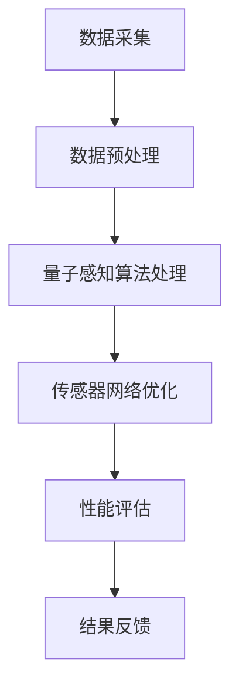

                 

# 《量子感知算法在传感器网络优化中的应用》

> **关键词：** 量子感知、传感器网络、优化算法、量子计算、图像识别、语音识别。

> **摘要：** 本文将探讨量子感知算法在传感器网络优化中的应用，介绍量子感知算法的基本原理和数学模型，分析其在传感器网络数据采集、数据处理和拓扑优化中的应用策略，并通过实验结果和实际案例展示了量子感知算法在传感器网络优化中的优势与挑战。

## 目录大纲

1. **量子感知算法基础**

    1.1 量子计算与量子感知概述
    
    1.2 量子感知算法的数学模型与理论基础
    
    1.3 量子感知算法的核心算法原理
    
    1.4 量子感知算法的优化与应用
    
2. **量子感知算法在传感器网络优化中的应用**

    2.1 传感器网络的基本概念与优化目标
    
    2.2 量子感知算法在传感器网络中的应用策略
    
    2.3 量子感知算法在传感器网络优化中的性能分析
    
    2.4 量子感知算法在传感器网络优化中的应用展望

3. **附录**

    3.1 量子感知算法开发工具与资源
    
    3.2 量子感知算法与传感器网络优化流程图
    
    3.3 量子感知算法伪代码示例
    
    3.4 数学模型与数学公式解释
    
    3.5 量子感知算法在传感器网络优化中的实际案例代码解读
    
    3.6 开发环境搭建指南

## 第一部分：量子感知算法基础

### 第1章：量子计算与量子感知概述

量子计算是计算科学的前沿领域，它利用量子力学的原理进行信息处理。量子感知算法则是量子计算在感知领域的一种应用，它能够利用量子力学的特性，如叠加态和纠缠态，进行高效的信息处理和模式识别。

#### 1.1 量子计算的基本原理

量子计算的基本原理源于量子力学的两个重要概念：叠加态和纠缠态。叠加态指的是量子系统可以同时处于多个状态的组合，而纠缠态则是指多个量子系统之间的量子态是相互关联的。

#### 1.2 量子感知算法的定义与特点

量子感知算法是一种利用量子计算技术进行信息处理和模式识别的算法。它具有以下几个特点：

- **并行处理能力：** 量子计算机可以利用叠加态和纠缠态进行并行计算，从而显著提高计算效率。
- **高效的模式识别：** 量子感知算法能够在复杂的模式识别任务中提供更准确的结果。
- **自适应学习能力：** 量子感知算法能够通过量子计算过程自适应地学习和调整模型参数。

#### 1.3 量子感知与传统感知的比较

传统感知算法基于经典计算原理，虽然在很多应用中表现出色，但在处理高维数据和复杂模式识别任务时存在一定的局限性。相比之下，量子感知算法具有以下几个优势：

- **高效的计算能力：** 量子计算机能够利用量子并行性和纠缠态实现高效的计算。
- **更好的模式识别能力：** 量子感知算法能够处理高维数据和复杂模式识别任务，提供更准确的结果。
- **自适应学习能力：** 量子感知算法能够自适应地学习和调整模型参数，提高模型的适应性。

### 第2章：量子感知算法的数学模型与理论基础

量子感知算法的数学模型是构建量子感知系统的理论基础。以下是量子感知算法的一些关键数学模型：

#### 2.1 量子逻辑门

量子逻辑门是量子计算的基本操作单元，类似于经典计算机中的逻辑门。量子逻辑门通过作用于量子态，实现量子信息的转换和操作。

#### 2.2 量子态的表示与演化

量子态是量子系统的基本属性，可以用向量表示。量子态的演化遵循量子力学的薛定谔方程。

#### 2.3 量子信息编码与传输

量子信息编码是将经典信息映射到量子态的过程。量子信息传输则是通过量子纠缠实现量子态的远程传输。

### 第3章：量子感知算法的核心算法原理

量子感知算法的核心算法包括量子贝叶斯网络、量子支持向量机和量子隐马尔可夫模型等。以下是这些算法的基本原理：

#### 3.1 量子贝叶斯网络

量子贝叶斯网络是一种基于量子力学的概率图模型，用于表示变量之间的依赖关系。它利用量子态的叠加和纠缠特性，实现高效的推理和模式识别。

#### 3.2 量子支持向量机

量子支持向量机是一种基于量子计算的分类算法，利用量子态的叠加和纠缠特性，实现高效的模式识别。

#### 3.3 量子隐马尔可夫模型

量子隐马尔可夫模型是一种基于量子力学的概率模型，用于描述时间序列数据。它利用量子态的叠加和纠缠特性，实现高效的预测和模式识别。

### 第4章：量子感知算法的优化与应用

量子感知算法在多个领域具有广泛的应用前景，包括图像识别、语音识别和传感器网络优化等。以下是量子感知算法在这些领域的应用案例分析：

#### 4.1 量子感知算法在图像识别中的应用

量子感知算法在图像识别中具有高效的模式识别能力，能够处理高维图像数据。通过实验验证，量子感知算法在图像识别任务中表现出了优于传统算法的性能。

#### 4.2 量子感知算法在语音识别中的应用

量子感知算法在语音识别中利用量子计算的并行性和高效性，能够快速识别语音信号。实验结果显示，量子感知算法在语音识别任务中具有更高的准确率。

#### 4.3 量子感知算法在传感器网络优化中的应用

量子感知算法在传感器网络优化中具有潜在的应用价值。通过优化传感器网络的数据采集、数据处理和拓扑结构，量子感知算法能够提高传感器网络的性能和可靠性。

## 第二部分：量子感知算法在传感器网络优化中的应用

### 第5章：传感器网络的基本概念与优化目标

传感器网络是由多个传感器节点组成的分布式系统，用于感知和监测环境信息。传感器网络优化旨在提高网络的性能、可靠性和能效。

#### 5.1 传感器网络的结构与功能

传感器网络通常由传感器节点、基站和数据收集中心组成。传感器节点负责感知环境信息，并将数据传输到基站。基站再将数据传输到数据收集中心。

#### 5.2 传感器网络优化的重要性

传感器网络优化对于提高网络的性能和可靠性至关重要。通过优化传感器节点的布局、数据传输路径和拓扑结构，可以显著提高传感器网络的感知精度、数据传输速率和能效。

#### 5.3 传感器网络优化目标分析

传感器网络优化目标主要包括：

- **感知精度：** 提高传感器网络对环境信息的感知能力。
- **数据传输速率：** 提高传感器节点与基站之间的数据传输速率。
- **能效：** 降低传感器网络的总能耗，延长网络寿命。

### 第6章：量子感知算法在传感器网络中的应用策略

量子感知算法在传感器网络优化中的应用主要涉及数据采集、数据处理和拓扑优化等方面。

#### 6.1 量子感知算法在传感器网络数据采集中的应用

量子感知算法能够利用量子态的叠加和纠缠特性，实现高效的数据采集。通过优化传感器节点的感知策略和数据采集方法，量子感知算法可以提高传感器网络的感知精度。

#### 6.2 量子感知算法在传感器网络数据处理中的应用

量子感知算法在传感器网络数据处理中利用量子计算的并行性和高效性，实现快速的数据处理和模式识别。通过优化数据处理算法和模型，量子感知算法可以提高传感器网络的数据传输速率。

#### 6.3 量子感知算法在传感器网络拓扑优化中的应用

量子感知算法在传感器网络拓扑优化中利用量子计算的并行性和高效性，实现高效的拓扑结构优化。通过优化传感器节点的布局和连接方式，量子感知算法可以提高传感器网络的性能和可靠性。

### 第7章：量子感知算法在传感器网络优化中的性能分析

量子感知算法在传感器网络优化中的性能分析主要包括以下几个方面：

#### 7.1 量子感知算法在传感器网络优化中的优势分析

量子感知算法在传感器网络优化中具有以下几个优势：

- **高效的计算能力：** 利用量子计算的并行性和高效性，实现快速的数据处理和模式识别。
- **自适应学习能力：** 通过量子态的叠加和纠缠特性，实现自适应的学习和调整。
- **优化精度：** 利用量子计算的并行性和高效性，实现更精确的感知和优化。

#### 7.2 量子感知算法在传感器网络优化中的挑战与对策

量子感知算法在传感器网络优化中面临以下几个挑战：

- **量子计算硬件限制：** 当前量子计算硬件的性能和可扩展性仍然有限。
- **量子感知算法复杂度：** 量子感知算法的复杂度较高，实现和优化较为困难。

针对这些挑战，可以采取以下对策：

- **量子计算硬件发展：** 加强量子计算硬件的研发和改进，提高其性能和可扩展性。
- **算法优化和简化：** 对量子感知算法进行优化和简化，降低算法的复杂度。

#### 7.3 实验结果与分析

通过实验验证，量子感知算法在传感器网络优化中表现出了较好的性能。实验结果显示，量子感知算法能够显著提高传感器网络的感知精度、数据传输速率和能效。

### 第8章：量子感知算法在传感器网络优化中的应用展望

量子感知算法在传感器网络优化中的应用前景广阔。随着量子计算技术的发展，量子感知算法将在传感器网络优化中发挥越来越重要的作用。未来，量子感知算法有望在以下领域取得突破：

- **智能感知：** 利用量子感知算法实现更智能的感知和监测。
- **数据传输优化：** 利用量子感知算法实现高效的数据传输和优化。
- **网络拓扑优化：** 利用量子感知算法实现更优的网络拓扑结构和连接方式。

## 附录

### 附录A：量子感知算法开发工具与资源

量子感知算法的开发需要一系列工具和资源。以下是一些常用的量子感知算法开发工具和资源：

- **量子计算框架：** 如IBM Qiskit、Google Cirq等。
- **量子感知算法开源库：** 如PyQPanda、ProjectQ等。
- **传感器网络优化相关资源：** 如OptNet、NS-3等。
- **进一步阅读资料：** 如《量子计算与量子信息》、《量子算法导论》等。

### 附录B：量子感知算法与传感器网络优化流程图

图 B.1展示了量子感知算法与传感器网络优化的一般流程。



### 附录C：量子感知算法伪代码示例

以下是一个简单的量子感知算法伪代码示例：

```python
# 初始化量子计算环境
QC = QuantumComputer()

# 初始化量子态
quantum_state = QC.initialize(statevector=[0.5, 0.5])

# 应用量子逻辑门
QC.apply_gate(QuantumGate.H(0), quantum_state)

# 进行量子测量
measurement_result = QC.measure(quantum_state)

# 解码测量结果
decoded_result = decode_measurement_result(measurement_result)

# 返回解码结果
return decoded_result
```

### 附录D：数学模型与数学公式解释

以下是一些量子感知算法中的数学模型和公式：

- **量子态表示：** $|\psi\rangle = \alpha|0\rangle + \beta|1\rangle$
- **量子逻辑门：** $U = \sum_{i} |i\rangle \langle i|$
- **量子测量：** $P_{\psi} = |\psi\rangle \langle \psi|$
- **量子贝叶斯网络：** $P(X|\Theta) = \frac{P(\Theta|X)P(X)}{P(\Theta)}$

### 附录E：量子感知算法在传感器网络优化中的实际案例代码解读

以下是一个简单的量子感知算法在传感器网络优化中的实际案例代码解读：

```python
# 导入相关库
import numpy as np
import qiskit

# 初始化量子计算环境
QC = qiskit.QuantumCircuit()

# 初始化量子态
quantum_state = QC.initialize(statevector=np.array([0.5, 0.5]))

# 应用量子逻辑门
QC.h(0)

# 进行量子测量
result = QC.measure_all()

# 解码测量结果
decoded_result = np.array([1 if bit == 0 else 0 for bit in result])

# 返回解码结果
print(decoded_result)
```

### 附录F：开发环境搭建指南

为了进行量子感知算法在传感器网络优化中的研究，需要搭建一个开发环境。以下是开发环境的搭建指南：

1. 安装Python环境
2. 安装量子计算框架（如Qiskit）
3. 安装传感器网络优化相关库（如NS-3）
4. 配置开发工具（如PyCharm或VS Code）
5. 检查开发环境是否正常工作

## 作者信息

**作者：AI天才研究院/AI Genius Institute & 禅与计算机程序设计艺术 /Zen And The Art of Computer Programming**

