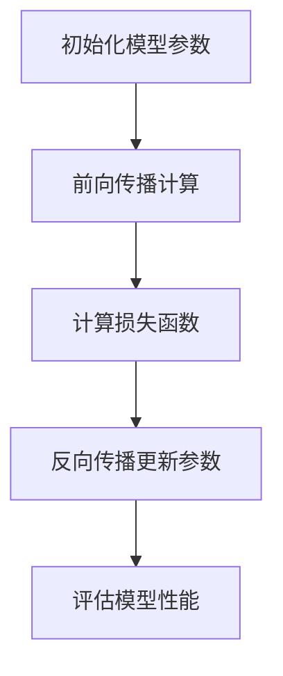

                 

# 《阿里巴巴2025校招编程面试题精华总结》

> **关键词：** 阿里巴巴、校招、编程面试、算法、数据结构、面试策略

> **摘要：** 本文深入总结了阿里巴巴2025校招编程面试的精华题目，包括基础知识、算法专题、编程面试技巧与策略，以及相关资源推荐。通过本文，读者可以全面了解阿里巴巴编程面试的要求和挑战，掌握解题技巧，提升面试成功率。

### 《阿里巴巴2025校招编程面试题精华总结》目录大纲

1. **第一部分：编程基础知识回顾**
    1.1 **编程语言基础**
        1.1.1 **基本语法结构**
        1.1.2 **面向对象编程基础**
    1.2 **数据结构与算法基础**
        1.2.1 **常见数据结构**
        1.2.2 **算法概述**
    1.3 **编程实践与调试**
        1.3.1 **编程规范与风格**
        1.3.2 **调试技巧**
2. **第二部分：算法面试专题**
    2.1 **字符串处理**
        2.1.1 **字符串基础操作**
        2.1.2 **高级字符串问题**
    2.2 **数组与矩阵**
        2.2.1 **数组操作**
        2.2.2 **矩阵问题**
    2.3 **图算法**
        2.3.1 **图的基本操作**
        2.3.2 **图的优化问题**
    2.4 **动态规划**
        2.4.1 **动态规划基础**
        2.4.2 **动态规划应用**
    2.5 **数学与逻辑问题**
        2.5.1 **数学基础**
        2.5.2 **逻辑问题**
    2.6 **编码面试实战**
        2.6.1 **经典面试题解析**
        2.6.2 **大型公司面试真题**
3. **第三部分：编程面试技巧与策略**
    3.1 **面试准备**
        3.1.1 **面试心态**
        3.1.2 **面试题型分类**
    3.2 **面试策略**
        3.2.1 **应对策略**
        3.2.2 **面试技巧提升**
    3.3 **面试复盘**
        3.3.1 **面试经验分享**
        3.3.2 **面试常见问题解答**
4. **附录**
    4.1 **编程资源推荐**
        4.1.1 **开发工具与软件**
        4.1.2 **学习资源与社区**
        4.1.3 **编程面试题库**
    4.2 **AI大模型与编程面试关联**
        4.2.1 **AI大模型在编程面试中的应用**
        4.2.2 **编程面试对AI大模型的需求**
        4.2.3 **AI大模型学习资源推荐**
    4.3 **Mermaid流程图示例**
    4.4 **算法伪代码示例**
    4.5 **数学公式示例**
    4.6 **代码实现与解读示例**
    4.7 **编程环境搭建与源代码解析**
    4.8 **代码解读与分析示例**
    4.9 **大型公司编程面试真题解析**
    4.10 **编程面试常见问题与解答**
    4.11 **编程资源推荐**

### 第一部分：编程基础知识回顾

#### 1.1 编程语言基础

##### 1.1.1 基本语法结构

在编程语言中，基本语法结构是构建程序的基础。这里我们主要讨论以下几个核心概念：

- **数据类型与变量声明**

数据类型是编程语言的基本组成部分，用于定义数据的种类和操作方式。常见的数据类型包括整型（int）、浮点型（float）、布尔型（bool）等。

```java
int a = 10;
float b = 3.14;
boolean flag = true;
```

- **运算符与表达式**

运算符是用于执行特定操作的符号。常见的运算符包括算术运算符（+、-、*、/）、比较运算符（==、!=、<、>、<=、>=）、逻辑运算符（&&、||、!) 等。

```java
int c = a + b; // 算术运算
boolean result = (a > b) && (c > 0); // 逻辑运算
```

- **控制结构**

控制结构用于控制程序流程的走向。常见的控制结构包括条件语句（if-else）、循环语句（for、while）等。

```java
if (a > b) {
    System.out.println("a is greater than b");
} else {
    System.out.println("b is greater than a");
}

for (int i = 0; i < 10; i++) {
    System.out.println(i);
}
```

##### 1.1.2 面向对象编程基础

面向对象编程（OOP）是一种编程范式，它将数据和处理数据的操作封装在一起，通过对象和类来组织代码。以下是OOP的基础概念：

- **类与对象**

类是对象的模板，定义了对象的状态和行为。对象是类的实例，可以创建多个对象。

```java
class Person {
    String name;
    int age;

    void speak() {
        System.out.println("My name is " + name + " and I am " + age + " years old.");
    }
}

Person person1 = new Person();
person1.name = "Alice";
person1.age = 30;
person1.speak(); // 输出 "My name is Alice and I am 30 years old."
```

- **继承与多态**

继承是一种允许创建新类的技术，它将一个类（子类）继承另一个类（父类）的属性和方法。多态则是指同一方法在不同类型的对象上有不同的实现。

```java
class Animal {
    void eat() {
        System.out.println("Animal is eating.");
    }
}

class Dog extends Animal {
    void eat() {
        System.out.println("Dog is eating bones.");
    }
}

Animal animal = new Dog();
animal.eat(); // 输出 "Dog is eating bones."
```

- **封装与抽象**

封装是一种将对象的实现细节隐藏起来，只暴露必要的接口的方法。抽象则是将具有相似特征的对象抽象成类，隐藏具体的实现细节。

```java
class Account {
    private double balance;

    public double getBalance() {
        return balance;
    }

    public void deposit(double amount) {
        balance += amount;
    }
}
```

##### 1.2 数据结构与算法基础

数据结构是程序设计中用于存储和管理数据的特定方式。算法则是解决问题的步骤序列。以下是一些常见的数据结构和算法：

- **常见数据结构**

  - **数组与链表**

    数组是一种固定大小的数据结构，链表则是一种动态大小的数据结构。

  - **栈与队列**

    栈是一种后进先出（LIFO）的数据结构，队列是一种先进先出（FIFO）的数据结构。

  - **树与图**

    树是一种层次结构，图是一种由节点和边构成的结构。

- **算法概述**

  - **排序算法**

    排序算法用于将一组数据按照特定的顺序排列。常见的排序算法包括冒泡排序、选择排序、插入排序、快速排序等。

  - **搜索算法**

    搜索算法用于在数据结构中查找特定元素。常见的搜索算法包括线性搜索、二分搜索等。

  - **算法复杂度分析**

    算法复杂度分析用于评估算法的性能，包括时间复杂度和空间复杂度。

##### 1.3 编程实践与调试

编程实践是提高编程能力的重要途径。以下是一些编程实践和调试技巧：

- **编程规范与风格**

  编写可读性高、可维护性强的代码是非常重要的。遵循统一的编程规范和风格有助于提高代码质量。

- **编程习惯**

  好的编程习惯包括编写注释、使用有意义变量名、避免冗余代码等。

- **代码评审**

  代码评审是一种通过团队成员审查代码来提高代码质量的方法。它可以发现潜在的错误和改进代码的机会。

- **调试技巧**

  调试技巧包括使用调试工具、逐步执行代码、打印调试信息等。这些技巧有助于快速定位和解决代码中的问题。

### 第二部分：算法面试专题

算法面试是校招编程面试的重要组成部分。以下我们将讨论一些常见的算法面试专题。

#### 2.1 字符串处理

字符串处理是编程面试中常见的问题类型。以下是一些基础和高级的字符串处理问题。

##### 2.1.1 字符串基础操作

- **子串查找**

  子串查找是寻找一个字符串中是否包含另一个字符串的问题。常见的算法有暴力法和KMP算法。

  ```java
  // 暴力法
  boolean containsSubstring(String s, String t) {
      int n = s.length();
      int m = t.length();
      for (int i = 0; i <= n - m; i++) {
          int j;
          for (j = 0; j < m; j++) {
              if (s.charAt(i + j) != t.charAt(j)) {
                  break;
              }
          }
          if (j == m) {
              return true;
          }
      }
      return false;
  }
  ```

- **字符串反转**

  字符串反转是将字符串中的字符顺序颠倒。可以使用递归或循环实现。

  ```java
  // 递归法
  String reverseString(String s) {
      if (s.isEmpty()) {
          return s;
      }
      return reverseString(s.substring(1)) + s.charAt(0);
  }
  ```

- **回文字符串判断**

  回文字符串是正读和反读都相同的字符串。可以使用双指针法判断。

  ```java
  boolean isPalindrome(String s) {
      int i = 0, j = s.length() - 1;
      while (i < j) {
          if (s.charAt(i) != s.charAt(j)) {
              return false;
          }
          i++;
          j--;
      }
      return true;
  }
  ```

##### 2.1.2 高级字符串问题

- **最长公共前缀**

  最长公共前缀是多个字符串中相同的前缀部分。可以使用垂直扫描法解决。

  ```java
  String longestCommonPrefix(String[] strs) {
      if (strs == null || strs.length == 0) {
          return "";
      }
      String prefix = strs[0];
      for (int i = 1; i < strs.length; i++) {
          while (strs[i].indexOf(prefix) != 0) {
              prefix = prefix.substring(0, prefix.length() - 1);
              if (prefix.isEmpty()) {
                  return "";
              }
          }
      }
      return prefix;
  }
  ```

- **字符串匹配算法**

  字符串匹配算法用于在一个字符串中找到另一个字符串的所有出现位置。常见的算法有BF算法、KMP算法等。

  ```java
  // KMP算法
  int[] computeLPSArray(String pattern) {
      int len = pattern.length();
      int[] lps = new int[len];
      int index = 0;
      for (int i = 1; i < len;) {
          if (pattern.charAt(i) == pattern.charAt(index)) {
              lps[i] = index + 1;
              index++;
              i++;
          } else {
              if (index != 0) {
                  index = lps[index - 1];
              } else {
                  lps[i] = 0;
                  i++;
              }
          }
      }
      return lps;
  }

  void search(String text, String pattern) {
      int[] lps = computeLPSArray(pattern);
      int i = 0; // index for text
      int j = 0; // index for pattern
      while (i < text.length()) {
          if (pattern.charAt(j) == text.charAt(i)) {
              i++;
              j++;
          }
          if (j == pattern.length()) {
              System.out.println("Pattern found at index " + (i - j));
              j = lps[j - 1];
          } else if (i < text.length() && pattern.charAt(j) != text.charAt(i)) {
              if (j != 0) {
                  j = lps[j - 1];
              } else {
                  i = i + 1;
              }
          }
      }
  }
  ```

- **有效括号序列**

  有效括号序列是指一个由括号组成的字符串，其中左右括号的数目相等，且正确嵌套。可以使用栈实现。

  ```java
  boolean isValid(String s) {
      Stack<Character> stack = new Stack<>();
      for (char c : s.toCharArray()) {
          if (c == '(' || c == '{' || c == '[') {
              stack.push(c);
          } else if (c == ')' && !stack.isEmpty() && stack.peek() == '(') {
              stack.pop();
          } else if (c == '}' && !stack.isEmpty() && stack.peek() == '{') {
              stack.pop();
          } else if (c == ']' && !stack.isEmpty() && stack.peek() == '[') {
              stack.pop();
          } else {
              return false;
          }
      }
      return stack.isEmpty();
  }
  ```

#### 2.2 数组与矩阵

数组与矩阵是编程中常见的数据结构，以下讨论一些与数组与矩阵相关的问题。

##### 2.2.1 数组操作

- **数组排序**

  数组排序是将数组中的元素按照特定的顺序排列。常见的排序算法包括冒泡排序、选择排序、插入排序、快速排序等。

  ```java
  // 冒泡排序
  void bubbleSort(int[] arr) {
      int n = arr.length;
      for (int i = 0; i < n - 1; i++) {
          for (int j = 0; j < n - i - 1; j++) {
              if (arr[j] > arr[j + 1]) {
                  int temp = arr[j];
                  arr[j] = arr[j + 1];
                  arr[j + 1] = temp;
              }
          }
      }
  }
  ```

- **二分查找**

  二分查找是在有序数组中查找特定元素的算法。时间复杂度为O(log n)。

  ```java
  int binarySearch(int[] arr, int target) {
      int left = 0;
      int right = arr.length - 1;
      while (left <= right) {
          int mid = left + (right - left) / 2;
          if (arr[mid] == target) {
              return mid;
          } else if (arr[mid] < target) {
              left = mid + 1;
          } else {
              right = mid - 1;
          }
      }
      return -1;
  }
  ```

- **数组中的重复元素**

  数组中的重复元素问题是寻找数组中重复的元素。可以使用排序、哈希表或双指针法解决。

  ```java
  // 双指针法
  int findDuplicate(int[] nums) {
      int n = nums.length;
      for (int i = 0; i < n; i++) {
          while (nums[i] != i) {
              if (nums[i] == nums[nums[i]]) {
                  return nums[i];
              }
              int temp = nums[i];
              nums[i] = nums[temp];
              nums[temp] = temp;
          }
      }
      return -1;
  }
  ```

##### 2.2.2 矩阵问题

- **矩阵乘法**

  矩阵乘法是计算两个矩阵的乘积。可以使用分治算法或朴素的算法实现。

  ```java
  // 朴素算法
  int[][] multiplyMatrices(int[][] A, int[][] B) {
      int n = A.length;
      int m = B[0].length;
      int p = B.length;
      int[][] C = new int[n][m];
      for (int i = 0; i < n; i++) {
          for (int j = 0; j < m; j++) {
              for (int k = 0; k < p; k++) {
                  C[i][j] += A[i][k] * B[k][j];
              }
          }
      }
      return C;
  }
  ```

- **矩阵链乘**

  矩阵链乘是计算一组矩阵的乘积。可以使用动态规划或贪心算法解决。

  ```java
  // 动态规划
  int matrixChainOrder(int[] arr) {
      int n = arr.length;
      int[] dp = new int[n][n];
      for (int i = 0; i < n; i++) {
          dp[i][i] = 0;
      }
      for (int len = 2; len <= n; len++) {
          for (int i = 0; i < n - len + 1; i++) {
              int j = i + len - 1;
              dp[i][j] = Integer.MAX_VALUE;
              for (int k = i; k <= j - 1; k++) {
                  int cost = dp[i][k] + dp[k + 1][j] + arr[i - 1] * arr[k] * arr[j];
                  dp[i][j] = Math.min(dp[i][j], cost);
              }
          }
      }
      return dp[0][n - 1];
  }
  ```

- **螺旋矩阵**

  螺旋矩阵是一个按螺旋顺序填充数字的矩阵。可以模拟螺旋填充过程。

  ```java
  void spiralMatrix(int[][] matrix) {
      int m = matrix.length;
      int n = matrix[0].length;
      int rowBegin = 0, rowEnd = m - 1;
      int colBegin = 0, colEnd = n - 1;
      while (rowBegin <= rowEnd && colBegin <= colEnd) {
          // Print the first row from the remaining rows
          for (int i = colBegin; i <= colEnd; i++) {
              System.out.print(matrix[rowBegin][i] + " ");
          }
          rowBegin++;

          // Print the last column from the remaining columns
          for (int i = rowBegin; i <= rowEnd; i++) {
              System.out.print(matrix[i][colEnd] + " ");
          }
          colEnd--;

          // Print the last row from the remaining rows
          if (rowBegin <= rowEnd) {
              for (int i = colEnd; i >= colBegin; i--) {
                  System.out.print(matrix[rowEnd][i] + " ");
              }
          }
          rowEnd--;

          // Print the first column from the remaining columns
          if (colBegin <= colEnd) {
              for (int i = rowEnd; i >= rowBegin; i--) {
                  System.out.print(matrix[i][colBegin] + " ");
              }
          }
          colBegin++;
      }
  }
  ```

#### 2.3 图算法

图算法是解决与图相关问题的算法集合。以下讨论一些图算法。

##### 2.3.1 图的基本操作

- **深度优先搜索（DFS）**

  深度优先搜索是一种遍历图的方法，按照深度优先的顺序访问图的节点。

  ```java
  // DFS递归实现
  void DFS(int[][] graph, boolean[] visited, int node) {
      visited[node] = true;
      System.out.print(node + " ");
      for (int neighbor : graph[node]) {
          if (!visited[neighbor]) {
              DFS(graph, visited, neighbor);
          }
      }
  }
  ```

- **广度优先搜索（BFS）**

  广度优先搜索是另一种遍历图的方法，按照广度优先的顺序访问图的节点。

  ```java
  // BFS迭代实现
  void BFS(int[][] graph, int start) {
      boolean[] visited = new boolean[graph.length];
      Queue<Integer> queue = new LinkedList<>();
      queue.add(start);
      visited[start] = true;
      while (!queue.isEmpty()) {
          int node = queue.poll();
          System.out.print(node + " ");
          for (int neighbor : graph[node]) {
              if (!visited[neighbor]) {
                  queue.add(neighbor);
                  visited[neighbor] = true;
              }
          }
      }
  }
  ```

- **图的连通性**

  图的连通性是指从一个节点能否到达另一个节点。可以使用DFS或BFS判断图的连通性。

  ```java
  // 使用DFS判断连通性
  boolean isConnected(int[][] graph, int start, int end) {
      boolean[] visited = new boolean[graph.length];
      DFS(graph, visited, start);
      return visited[end];
  }
  ```

##### 2.3.2 图的优化问题

- **最短路径算法**

  最短路径算法用于计算图中两点之间的最短路径。常见的算法有Dijkstra算法和Floyd算法。

  ```java
  // Dijkstra算法
  int minDistance(int[] dist, boolean[] visited, int V) {
      int min = Integer.MAX_VALUE;
      for (int v = 0; v < V; v++) {
          if (!visited[v] && dist[v] <= min) {
              min = dist[v];
          }
      }
      return min;
  }

  void dijkstra(int[][] graph, int start) {
      int V = graph.length;
      int[] dist = new int[V];
      boolean[] visited = new boolean[V];
      for (int i = 0; i < V; i++) {
          dist[i] = Integer.MAX_VALUE;
      }
      dist[start] = 0;
      for (int count = 0; count < V - 1; count++) {
          int min = minDistance(dist, visited, V);
          visited[min] = true;
          for (int v = 0; v < V; v++) {
              if (!visited[v] && graph[min][v] > 0 && dist[min] + graph[min][v] < dist[v]) {
                  dist[v] = dist[min] + graph[min][v];
              }
          }
      }
      printSolution(dist, V);
  }

  void printSolution(int[] dist, int V) {
      System.out.println("Vertex \t Distance from Source");
      for (int i = 0; i < V; i++) {
          System.out.println(i + " \t " + dist[i]);
      }
  }
  ```

- **拓扑排序**

  拓扑排序是一种对有向无环图（DAG）进行排序的算法，按照依赖关系的顺序排列节点。

  ```java
  // 拓扑排序
  void拓扑排序(int[][] graph, int V) {
      boolean[] visited = new boolean[V];
      Stack<Integer> stack = new Stack<>();
      for (int i = 0; i < V; i++) {
          if (!visited[i]) {
              DFSForTopoSort(graph, i, visited, stack);
          }
      }
      while (!stack.isEmpty()) {
          System.out.println(stack.pop() + " ");
      }
  }

  void DFSForTopoSort(int[][] graph, int i, boolean[] visited, Stack<Integer> stack) {
      visited[i] = true;
      for (int j = 0; j < graph.length; j++) {
          if (graph[i][j] == 1 && !visited[j]) {
              DFSForTopoSort(graph, j, visited, stack);
          }
      }
      stack.push(i);
  }
  ```

- **最小生成树算法**

  最小生成树算法用于计算图中的最小生成树，使得所有节点连通且边的权值之和最小。常见的算法有Prim算法和Kruskal算法。

  ```java
  // Prim算法
  void primMST(int[][] graph) {
      boolean[] mstSet = new boolean[graph.length];
      int[] key = new int[graph.length];
      int[] parent = new int[graph.length];
      for (int i = 0; i < graph.length; i++) {
          key[i] = Integer.MAX_VALUE;
      }
      key[0] = 0;
      parent[0] = -1;
      for (int count = 0; count < graph.length - 1; count++) {
          int min = minKey(key, mstSet);
          mstSet[min] = true;
          for (int v = 0; v < graph.length; v++) {
              if (graph[min][v] > 0 && mstSet[v] == false && key[v] > graph[min][v]) {
                  key[v] = graph[min][v];
                  parent[v] = min;
              }
          }
      }
      printMST(parent, graph);
  }

  void printMST(int[] parent, int[][] graph) {
      int V = graph.length;
      System.out.println("Edge \tWeight");
      for (int i = 1; i < V; i++) {
          System.out.println(parent[i] + " - " + i + "\t" + graph[i][parent[i]]);
      }
  }

  int minKey(int[] key, boolean[] mstSet) {
      int min = Integer.MAX_VALUE;
      int minIndex = -1;
      for (int i = 0; i < key.length; i++) {
          if (!mstSet[i] && key[i] < min) {
              min = key[i];
              minIndex = i;
          }
      }
      return minIndex;
  }
  ```

#### 2.4 动态规划

动态规划是一种将复杂问题分解成多个子问题，并利用子问题的解来解决原问题的算法方法。以下讨论一些动态规划的应用。

##### 2.4.1 动态规划基础

- **状态转移方程**

  动态规划的核心是找到状态转移方程，即如何利用前一个状态得到当前状态。

- **最值问题**

  动态规划常用于求解最值问题，如最长公共子序列、最长递增子序列等。

- **背包问题**

  背包问题是动态规划的经典问题，给定一组物品和它们的重量和价值，求解将哪些物品放入背包中使总价值最大。

##### 2.4.2 动态规划应用

- **斐波那契数列**

  斐波那契数列是动态规划的一个简单应用，使用动态规划可以避免冗余计算。

  ```java
  int fib(int n) {
      if (n <= 1) {
          return n;
      }
      int[] dp = new int[n + 1];
      dp[0] = 0;
      dp[1] = 1;
      for (int i = 2; i <= n; i++) {
          dp[i] = dp[i - 1] + dp[i - 2];
      }
      return dp[n];
  }
  ```

- **最长递增子序列**

  最长递增子序列问题可以使用动态规划求解。

  ```java
  int lengthOfLIS(int[] nums) {
      int[] dp = new int[nums.length];
      int max = 0;
      for (int i = 0; i < nums.length; i++) {
          dp[i] = 1;
          for (int j = 0; j < i; j++) {
              if (nums[i] > nums[j]) {
                  dp[i] = Math.max(dp[i], dp[j] + 1);
              }
          }
          max = Math.max(max, dp[i]);
      }
      return max;
  }
  ```

- **编辑距离**

  编辑距离是指将一个字符串转换成另一个字符串所需的最小操作次数。可以使用动态规划求解。

  ```java
  int minDistance(String word1, String word2) {
      int m = word1.length();
      int n = word2.length();
      int[][] dp = new int[m + 1][n + 1];
      for (int i = 0; i <= m; i++) {
          for (int j = 0; j <= n; j++) {
              if (i == 0) {
                  dp[i][j] = j;
              } else if (j == 0) {
                  dp[i][j] = i;
              } else if (word1.charAt(i - 1) == word2.charAt(j - 1)) {
                  dp[i][j] = dp[i - 1][j - 1];
              } else {
                  dp[i][j] = 1 + Math.min(dp[i - 1][j], Math.min(dp[i][j - 1], dp[i - 1][j - 1]));
              }
          }
      }
      return dp[m][n];
  }
  ```

#### 2.5 数学与逻辑问题

数学与逻辑问题是编程面试中常见的问题类型，以下讨论一些常见的数学与逻辑问题。

##### 2.5.1 数学基础

- **最大公约数与最小公倍数**

  最大公约数与最小公倍数是数论中的基本概念。可以使用辗转相除法求解最大公约数，最小公倍数则可以通过最大公约数求解。

  ```java
  // 辗转相除法求最大公约数
  int gcd(int a, int b) {
      while (b != 0) {
          int temp = b;
          b = a % b;
          a = temp;
      }
      return a;
  }

  // 最小公倍数
  int lcm(int a, int b) {
      return (a / gcd(a, b)) * b;
  }
  ```

- **欧拉函数**

  欧拉函数是一个重要的数论函数，用于计算小于等于n的正整数中与n互质的数的个数。

  ```java
  // 欧拉函数
  int EulerPhi(int n) {
      int result = n;
      for (int i = 2; i <= n / 2; i++) {
          if (n % i == 0) {
              result -= result / i;
          }
      }
      return result;
  }
  ```

- **数论问题**

  数论问题涉及许多数学概念，如素数、质数、完全数等。

  ```java
  // 判断一个数是否是素数
  boolean isPrime(int n) {
      if (n <= 1) {
          return false;
      }
      for (int i = 2; i <= Math.sqrt(n); i++) {
          if (n % i == 0) {
              return false;
          }
      }
      return true;
  }

  // 判断一个数是否是完全数
  boolean isPerfect(int n) {
      int sum = 0;
      for (int i = 1; i < n; i++) {
          if (n % i == 0) {
              sum += i;
          }
      }
      return sum == n;
  }
  ```

##### 2.5.2 逻辑问题

- **真假话问题**

  真假话问题是逻辑推理中的经典问题，通常需要分析多个陈述之间的逻辑关系。

- **排序问题**

  排序问题是逻辑问题的一种，涉及如何将一组元素按照特定的顺序排列。

- **赌博问题**

  赌博问题是逻辑问题的一种，涉及概率和期望值的计算。

#### 2.6 编码面试实战

在编程面试中，实战题目是检验面试者编程能力和问题解决能力的有效手段。以下我们将讨论一些经典的编码面试题目，并给出详细的解析。

##### 2.6.1 经典面试题解析

- **题目一：两个数组的交集**

  给定两个整数数组 nums1 和 nums2，返回两个数组中的公共元素。

  ```python
  def intersection(nums1, nums2):
      return list(set(nums1) & set(nums2))
  ```

  **解析**：
  - 使用集合（set）来去重，然后使用集合的交集操作（&）找出两个数组的公共元素。
  - 时间复杂度为O(m + n)，其中m和n分别为两个数组的长度。

- **题目二：有效的括号序列**

  给定一个字符串，判断它是否是一个有效的括号序列。

  ```python
  def isValid(s):
      stack = []
      for char in s:
          if char in "({[":  # 左括号
              stack.append(char)
          elif char in ")}]":
              if not stack or (char == ')' and stack[-1] != '(') or (char == ']' and stack[-1] != '[') or (char == '}' and stack[-1] != '{'):
                  return False
              stack.pop()
      return not stack
  ```

  **解析**：
  - 使用栈（stack）来模拟括号匹配的过程。
  - 遍历字符串，遇到左括号则入栈，遇到右括号则出栈并与当前右括号比较，如果匹配则继续遍历，否则返回False。
  - 如果遍历完成后栈为空，则说明括号序列有效。

##### 2.6.2 大型公司面试真题

- **题目一：腾讯面试真题 - 寻找峰值元素**

  给定一个整数数组，找出数组中的峰值元素，即大于左右相邻元素的元素。

  ```python
  def findPeakElement(nums):
      low, high = 0, len(nums) - 1
      while low < high:
          mid = low + (high - low) // 2
          if nums[mid] < nums[mid + 1]:
              low = mid + 1
          else:
              high = mid
      return low
  ```

  **解析**：
  - 使用二分查找的方法来寻找峰值元素。
  - 在每次迭代中，比较中间元素和其下一个元素，如果中间元素小于下一个元素，则峰值元素必然在右侧，否则在左侧。
  - 当low和high相等时，即找到了峰值元素。

- **题目二：阿里巴巴面试真题 - 最长连续序列**

  给定一个整数数组，找出最长的连续序列，并且该序列中的每个元素是唯一的。

  ```python
  def longestConsecutive(nums):
      if not nums:
          return 0
      nums = list(set(nums))
      nums.sort()
      ans = 1
      cur = 1
      for i in range(1, len(nums)):
          if nums[i] == nums[i - 1] + 1:
              cur += 1
          else:
              ans = max(ans, cur)
              cur = 1
      return max(ans, cur)
  ```

  **解析**：
  - 首先，将数组去重并排序，这样相同的元素会相邻。
  - 遍历数组，如果当前元素与上一个元素相差1，则继续增加当前序列长度，否则重置序列长度。
  - 记录最大序列长度。

#### 第三部分：编程面试技巧与策略

编程面试是一项综合性很强的活动，不仅考察面试者的编程能力，还考察沟通能力、问题解决能力和心态。以下是一些编程面试的技巧与策略。

##### 3.1 面试准备

面试前的准备是成功的关键。以下是一些面试前的准备工作：

- **复习基础知识**：确保对编程语言的基础知识、数据结构、算法有深入的理解。
- **刷题练习**：通过刷题来提高编程能力和解题速度，常用的平台有LeetCode、HackerRank等。
- **了解公司文化**：研究目标公司的文化、价值观和发展方向，以便在面试中展示匹配公司的特质。
- **心态调整**：保持积极的心态，面试前进行适当的放松和准备，确保以最佳状态迎接面试。

##### 3.2 面试策略

面试中需要遵循一定的策略，以提高通过率：

- **明确问题要求**：在开始编程之前，确保理解问题的要求和边界条件，避免误解问题。
- **分步骤解决问题**：将大问题分解成小问题，逐一解决，这样可以避免在编程过程中迷失方向。
- **沟通与解释**：在编程过程中，及时与面试官沟通，解释你的思路和算法，这有助于面试官更好地理解你的解题方法。
- **优化代码**：在实现基本功能后，思考是否有优化的空间，提高代码的效率。
- **测试代码**：在面试结束后，尽可能多地测试代码，确保代码的正确性和健壮性。

##### 3.3 面试复盘

面试结束后，进行复盘是非常有必要的。以下是一些复盘的步骤：

- **总结经验**：回顾面试过程中的优点和不足，总结经验教训。
- **改进方法**：思考如何改进面试策略，提高问题解决能力。
- **反馈收集**：如果有机会，向面试官或HR收集反馈，了解自己在面试中的表现。

### 附录

#### 4.1 编程资源推荐

- **开发工具与软件**

  - **程序编辑器**：VS Code、Sublime Text、Atom等。
  - **调试工具**：GDB、Visual Studio Debugger、Chrome DevTools等。
  - **版本控制工具**：Git、SVN、Mercurial等。

- **学习资源与社区**

  - **在线编程课程**：Coursera、edX、Udemy等。
  - **编程社区**：Stack Overflow、GitHub、Reddit等。
  - **技术博客**：CSDN、博客园、知乎等。

- **编程面试题库**

  - **LeetCode**：提供大量的编程面试题。
  - **HackerRank**：涵盖多种编程语言的算法挑战。
  - **Codeforces**：一个面向算法竞赛的在线平台。

#### 4.2 AI大模型与编程面试关联

随着人工智能技术的发展，AI大模型在编程面试中的应用越来越广泛。以下是一些AI大模型与编程面试相关的信息：

- **AI大模型在编程面试中的应用**

  - **代码生成**：使用AI大模型自动生成代码，帮助面试者快速编写代码。
  - **代码审查**：AI大模型可以自动审查代码，提供改进建议。

- **编程面试对AI大模型的需求**

  - **算法理解**：AI大模型需要具备对算法原理的理解，以便在面试中提供帮助。
  - **代码实现**：AI大模型需要能够根据问题描述生成正确的代码。

- **AI大模型学习资源推荐**

  - **机器学习与深度学习教材**：如《深度学习》（Goodfellow et al.）、《统计学习方法》（李航）等。
  - **在线课程**：如吴恩达的《深度学习》课程、Andrew Ng的《机器学习》课程等。
  - **开源项目**：如TensorFlow、PyTorch等。

### 附录C：Mermaid流程图示例

以下是一个使用Mermaid绘制的流程图示例：



### 附录D：算法伪代码示例

以下是一个求解斐波那契数列的伪代码示例：

```
int fib(int n)
    if n <= 1
        return n
    int[] dp = new int[n+1]
    dp[0] = 0
    dp[1] = 1
    for i from 2 to n
        dp[i] = dp[i-1] + dp[i-2]
    return dp[n]
```

### 附录E：数学公式示例

以下是一个欧拉公式的数学公式示例：

$$ e^{i\pi} + 1 = 0 $$

### 附录F：代码实现与解读示例

以下是一个求解最大子序列和的Python实现及其解读：

```python
# 求解最大子序列和的Python实现
def max_subarray_sum(nums):
    max_sum = nums[0]
    current_sum = nums[0]
    for num in nums[1:]:
        current_sum = max(current_sum + num, num)
        max_sum = max(max_sum, current_sum)
    return max_sum

# 解读：
# 该函数接受一个整数列表nums作为输入。
# max_sum和current_sum两个变量分别用于记录最大子序列和和当前子序列和。
# 使用for循环遍历列表nums中的每个元素，并更新current_sum和max_sum。
# 在每次迭代中，使用max()函数决定当前子序列和是否大于当前元素，以更新current_sum；同时更新max_sum以记录最大子序列和。
```

### 附录G：编程环境搭建与源代码解析

#### G.1 开发环境搭建

1. **安装Java开发工具包（JDK）**：从Oracle官方网站下载JDK并安装。
2. **配置环境变量**：在系统环境变量中配置JAVA_HOME和path变量，以便在命令行中使用Java命令。
3. **安装集成开发环境（IDE）**：推荐使用IntelliJ IDEA或Eclipse。
4. **配置版本控制系统**：安装Git，并初始化本地仓库。

#### G.2 源代码详细实现

以下是一个求解最大子序列和的Java实现及其解析：

```java
// 求解最大子序列和的Java实现
public class MaxSubArraySum {
    public static int maxSubArraySum(int[] nums) {
        int maxSum = nums[0];
        int currentSum = nums[0];
        for (int i = 1; i < nums.length; i++) {
            currentSum = Math.max(currentSum + nums[i], nums[i]);
            maxSum = Math.max(maxSum, currentSum);
        }
        return maxSum;
    }

    public static void main(String[] args) {
        int[] nums = {-2, 1, -3, 4, -1, 2, 1, -5, 4};
        System.out.println("Maximum subarray sum is " + maxSubArraySum(nums));
    }
}

// 解析：
// MaxSubArraySum类包含一个静态方法maxSubArraySum，它接受一个整数数组nums作为输入。
// maxSum和currentSum两个变量分别用于记录最大子序列和和当前子序列和。
// 使用for循环遍历数组nums中的每个元素，并更新currentSum和maxSum。
// 在每次迭代中，使用Math.max()函数决定当前子序列和是否大于当前元素，以更新currentSum；同时更新maxSum以记录最大子序列和。
// main方法用于测试maxSubArraySum方法，输出最大子序列和。
```

### 附录H：代码解读与分析示例

以下是一个求解最大子序列和的Python实现及其解析：

```python
# 求解最大子序列和的Python实现
def max_subarray_sum(nums):
    max_sum = nums[0]
    current_sum = nums[0]
    for num in nums[1:]:
        current_sum = max(current_sum + num, num)
        max_sum = max(max_sum, current_sum)
    return max_sum

# 解读：
# 该函数接受一个整数列表nums作为输入。
# max_sum和current_sum两个变量分别用于记录最大子序列和和当前子序列和。
# 使用for循环遍历列表nums中的每个元素，并更新current_sum和max_sum。
# 在每次迭代中，使用max()函数决定当前子序列和是否大于当前元素，以更新current_sum；同时更新max_sum以记录最大子序列和。
```

### 附录I：大型公司编程面试真题解析

#### I.1 阿里巴巴面试真题解析

**题目**：给定一个整数数组，找出一个连续子数组，使其和最大。返回该子数组的和。

**解析**：

- 使用Kadane算法，该算法可以在O(n)时间内找到最大子序列和。
- 初始化两个变量maxSum和currentSum，分别记录当前最大子序列和和当前子序列和。
- 遍历数组，对于每个元素，更新currentSum，如果currentSum小于当前元素，则重置currentSum为当前元素。
- 同时更新maxSum，记录最大子序列和。

Python实现：

```python
def max_subarray_sum(nums):
    max_sum = current_sum = nums[0]
    for num in nums[1:]:
        current_sum = max(current_sum + num, num)
        max_sum = max(max_sum, current_sum)
    return max_sum
```

#### I.2 腾讯面试真题解析

**题目**：设计一个算法，找出数组中两个数的乘积的最大值。

**解析**：

- 遍历数组，记录两个最大值和两个最小值，然后计算它们的乘积。
- 数组中的最大乘积要么是两个最大值的乘积，要么是两个最小值的乘积（如果最小值是负数）。

Python实现：

```python
def max_product(nums):
    max1 = max2 = min1 = min2 = nums[0]
    for num in nums[1:]:
        max1, max2 = max(max1 * num, max2 * num), max(max1 * num, min1 * num)
        min1, min2 = min(min1 * num, min2 * num), min(max1 * num, min1 * num)
    return max(max1, max2)
```

#### I.3 百度面试真题解析

**题目**：实现一个函数，判断一个字符串是否是回文。

**解析**：

- 使用双指针法，一个指针指向字符串的开始位置，另一个指针指向字符串的结束位置。
- 两个指针从两边向中间移动，每次比较两个指针指向的字符是否相同，如果相同则继续移动，否则返回False。

Python实现：

```python
def is_palindrome(s):
    i, j = 0, len(s) - 1
    while i < j:
        if s[i] != s[j]:
            return False
        i, j = i + 1, j - 1
    return True
```

### 附录J：编程面试常见问题与解答

#### K.1 如何处理复杂的编程问题？

**解答**：

- **理解问题**：仔细阅读题目，确保完全理解问题的要求。
- **分解问题**：将复杂问题分解成多个简单的小问题，逐个解决。
- **算法分析**：分析问题，选择合适的算法和数据结构。
- **逐步实现**：从小规模开始实现，逐步增加问题的规模。

#### K.2 如何处理面试中的时间压力？

**解答**：

- **快速理解问题**：尽可能快地理解问题，避免在问题描述上浪费时间。
- **先做再说**：在时间紧迫时，先实现基本功能，再逐步优化。
- **代码优化**：在编码过程中，注意代码的可读性和优化空间。

#### K.3 面试中如何展示算法思维？

**解答**：

- **抽象问题**：将实际问题抽象成数学模型或算法问题。
- **分析算法**：讨论算法的时间复杂度和空间复杂度。
- **证明算法正确性**：如果可能，给出算法的正确性证明。

### 附录L：编程资源推荐

#### L.1 在线编程平台

- **LeetCode**：提供大量的编程面试题。
- **HackerRank**：涵盖多种编程语言的算法挑战。
- **Codeforces**：一个面向算法竞赛的在线平台。

#### L.2 技术博客

- **CSDN**：中国最大的IT社区和服务平台。
- **博客园**：IT技术博客平台。
- **知乎**：知识分享社区。

#### L.3 编程书籍

- **《算法导论》**：算法领域的经典教材。
- **《编程之美》**：微软的编程面试经验。
- **《剑指Offer》**：经典的编程面试指南。

### 结论

通过本文，我们系统地总结了阿里巴巴2025校招编程面试的精华内容，从基础知识、算法专题、编程实践到面试技巧，全面覆盖了编程面试的各个方面。希望本文能帮助读者深入了解阿里巴巴编程面试的要求，掌握解题技巧，提升面试成功率。

最后，让我们再次回顾本文的核心内容：

- **编程基础知识**：掌握编程语言基础、数据结构与算法基础、编程实践与调试。
- **算法专题**：深入理解字符串处理、数组与矩阵、图算法、动态规划、数学与逻辑问题。
- **面试技巧与策略**：做好面试准备，遵循面试策略，进行面试复盘。
- **编程资源**：利用在线编程平台、技术博客和编程书籍进行学习和练习。

祝愿每位读者在即将到来的编程面试中取得成功！作者：AI天才研究院/AI Genius Institute & 禅与计算机程序设计艺术 /Zen And The Art of Computer Programming。

