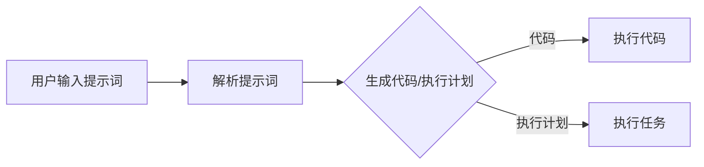

                 

### 《面向边缘计算的提示词编程方案》

> **关键词：** 边缘计算、提示词编程、机器学习、自然语言处理、实时数据处理、项目实战、未来展望

> **摘要：** 本文深入探讨了边缘计算与提示词编程的结合，详细介绍了边缘计算与提示词编程的基础知识、关键技术和应用案例。通过理论讲解、算法分析和项目实战，展示了如何利用提示词编程在边缘计算环境中实现高效的数据处理和智能应用，并对未来发展趋势进行了展望。

---

#### 第一部分：边缘计算与提示词编程概述

在当今数字化时代，随着物联网、5G、人工智能等技术的快速发展，边缘计算作为云计算的重要补充，正逐渐成为信息技术领域的研究热点。边缘计算通过在靠近数据源的位置处理数据，能够降低延迟、节省带宽、提高计算效率，这对于许多需要实时响应和高效处理的应用场景至关重要。提示词编程作为一种新兴的编程范式，通过提供更加灵活和智能的编程接口，使得开发者能够更加便捷地实现复杂的应用功能。本文将围绕边缘计算与提示词编程展开，旨在探讨二者结合的潜力与应用。

#### 第二部分：边缘计算与提示词编程的关系

边缘计算与提示词编程之间存在密切的联系。边缘计算为提示词编程提供了一个具体的执行环境，而提示词编程则为边缘计算提供了高效的算法实现和灵活的编程接口。边缘计算通过将数据处理和计算任务分配到边缘设备上，减轻了中心服务器的负担，而提示词编程则通过自动化的编程工具和框架，降低了开发者实现复杂功能的难度。二者结合，能够为开发者提供更为强大和高效的开发平台。

#### 第三部分：边缘计算与云计算的区别

云计算作为传统的计算模式，其主要特点在于集中式处理和大规模数据存储。然而，随着数据量的爆炸式增长和实时性要求的提高，云计算逐渐暴露出延迟高、带宽有限、能耗大的问题。边缘计算则通过在靠近数据源的位置进行数据处理，解决了云计算的这些问题。与云计算相比，边缘计算具有低延迟、高带宽、低能耗的特点，能够更好地满足实时性要求高的应用场景。

---

#### 第一部分：边缘计算与提示词编程概述

**第1章：边缘计算与提示词编程基础**

**1.1 边缘计算概述**

边缘计算是一种分布式计算模式，其核心思想是将计算任务从中心化的云服务器转移到靠近数据源的边缘设备上。这种模式的出现，主要是为了解决云计算在延迟、带宽和能耗方面的瓶颈。边缘计算通过在靠近数据源的位置进行数据处理，能够实现更快的数据响应速度、更高的数据安全性以及更低的网络传输成本。

**1.2 提示词编程原理**

提示词编程（Prompt Programming）是一种基于提示（Prompt）机制的编程范式。它通过预先定义好的提示词（Prompt），引导程序自动生成代码或执行特定任务。提示词编程的核心思想是，将人类开发者难以直接理解和处理的复杂问题，转化为计算机可以理解和执行的任务。这种范式能够大大提高编程的效率，降低编程的难度。

**1.3 边缘计算与提示词编程的关系**

边缘计算与提示词编程之间存在密切的联系。边缘计算为提示词编程提供了一个具体的执行环境，使得提示词编程能够更好地发挥其优势。而提示词编程则通过自动化的编程工具和框架，为边缘计算提供了高效的算法实现和灵活的编程接口。二者结合，能够为开发者提供更为强大和高效的开发平台。

**1.4 边缘计算与云计算的区别**

边缘计算和云计算是两种不同的计算模式，它们在应用场景、技术实现、性能指标等方面存在明显的差异。

**1.4.1 应用场景**

云计算通常适用于大规模数据处理、分布式计算等场景，例如大数据分析、云计算服务等。而边缘计算则更适用于实时性要求高、数据量较小的场景，例如智能安防、工业自动化等。

**1.4.2 技术实现**

云计算依赖于大规模的集中式服务器集群，通过网络连接提供计算服务。而边缘计算则依赖于分布在不同地理位置的边缘设备，通过边缘设备直接处理数据。

**1.4.3 性能指标**

云计算在处理大规模数据时具有更高的计算能力和存储能力，但存在较高的延迟和能耗。边缘计算则在延迟、带宽和能耗方面具有明显优势，能够实现更快速的数据处理和更高效的网络传输。

---

#### 第一部分：边缘计算与提示词编程概述

**第2章：边缘计算架构与关键技术**

**2.1 边缘计算架构**

边缘计算架构主要包括边缘设备、边缘网络和边缘服务器三个部分。边缘设备是指分布在各个数据源的设备，如传感器、手机、电脑等；边缘网络是指连接边缘设备与边缘服务器的网络，如5G网络、Wi-Fi等；边缘服务器是指位于边缘网络中的服务器，用于处理边缘设备发送的数据。

**2.2 边缘计算网络架构**

边缘计算网络架构可以分为以下几种类型：

1. **全分布架构**：所有计算任务都在边缘设备上完成，无需中心服务器参与。
2. **集中式架构**：所有计算任务都在中心服务器上完成，边缘设备仅用于数据收集和传输。
3. **分布式架构**：部分计算任务在边缘设备上完成，部分计算任务在中心服务器上完成。

**2.3 边缘计算硬件与软件基础设施**

边缘计算硬件基础设施主要包括边缘设备、边缘服务器和存储设备等。边缘设备通常采用嵌入式系统或专用硬件设计，具有低功耗、高效率的特点。边缘服务器通常采用高性能处理器和高速网络接口，能够处理大规模数据。存储设备则用于存储边缘设备和边缘服务器的数据。

边缘计算软件基础设施主要包括边缘操作系统、边缘数据库、边缘框架等。边缘操作系统是运行在边缘设备上的操作系统，如Android、Linux等。边缘数据库是用于存储边缘设备生成的数据的数据库，如SQLite、MySQL等。边缘框架是用于开发边缘计算应用的框架，如Kubernetes、Docker等。

**2.4 边缘计算的关键技术**

边缘计算的关键技术包括数据传输技术、数据处理技术、安全技术和智能化技术。

**2.4.1 数据传输技术**

数据传输技术主要包括边缘网络传输技术和数据压缩技术。边缘网络传输技术旨在提高数据传输速度和稳定性，如5G网络、Wi-Fi 6等。数据压缩技术旨在降低数据传输的带宽占用，如JPEG、MP3等。

**2.4.2 数据处理技术**

数据处理技术主要包括边缘设备数据处理技术和边缘服务器数据处理技术。边缘设备数据处理技术旨在提高边缘设备的计算能力和数据处理效率，如GPU、FPGA等。边缘服务器数据处理技术旨在提高边缘服务器的计算能力和数据处理效率，如分布式计算、并行计算等。

**2.4.3 安全技术**

安全技术主要包括边缘设备安全、边缘网络安全和边缘服务器安全。边缘设备安全旨在保护边缘设备免受攻击，如防火墙、安全加密等。边缘网络安全旨在保护边缘网络免受攻击，如DDoS攻击防护、数据加密等。边缘服务器安全旨在保护边缘服务器免受攻击，如入侵检测、访问控制等。

**2.4.4 智能化技术**

智能化技术主要包括人工智能、机器学习和自然语言处理等。人工智能技术旨在提高边缘设备的智能程度，如智能识别、智能决策等。机器学习技术旨在提高边缘设备的自适应能力和学习能力，如深度学习、强化学习等。自然语言处理技术旨在提高边缘设备的自然语言交互能力，如语音识别、文本分析等。

---

#### 第一部分：边缘计算与提示词编程概述

**第3章：提示词编程原理与实现**

**3.1 提示词编程的基本概念**

提示词编程是一种基于提示（Prompt）机制的编程范式。提示词（Prompt）是一种引导程序执行特定任务的输入，它可以是自然语言描述、代码片段或其他形式的输入。提示词编程的核心思想是通过提供提示词，让程序自动生成代码或执行特定任务，从而实现自动化和智能化编程。

**3.2 提示词编程的基本原理**

提示词编程的基本原理可以概括为以下三个步骤：

1. **输入提示词**：开发者或用户提供提示词，描述需要完成的任务或实现的功能。
2. **生成代码**：程序根据提示词生成相应的代码或执行计划。
3. **执行代码**：程序按照生成的代码或执行计划执行任务。

**3.3 提示词编程的主要方法**

提示词编程的主要方法包括基于规则的提示词编程、基于机器学习的提示词编程和基于自然语言处理的提示词编程。

**3.3.1 基于规则的提示词编程**

基于规则的提示词编程是一种传统的编程方法。它通过定义一系列规则，将提示词与相应的代码或执行计划关联起来。当用户输入提示词时，程序根据规则生成代码或执行计划。

**3.3.2 基于机器学习的提示词编程**

基于机器学习的提示词编程是一种新兴的编程方法。它通过训练机器学习模型，将提示词与代码或执行计划建立映射关系。当用户输入提示词时，程序根据训练好的模型生成代码或执行计划。

**3.3.3 基于自然语言处理的提示词编程**

基于自然语言处理的提示词编程是一种结合自然语言处理技术的编程方法。它通过解析用户输入的自然语言描述，生成相应的代码或执行计划。

**3.4 提示词编程工具与环境搭建**

为了方便开发者进行提示词编程，需要搭建相应的开发工具和环境。常用的提示词编程工具包括：

1. **编程语言支持**：如Python、Java等，支持编写提示词编程代码。
2. **提示词库**：提供丰富的提示词库，方便开发者调用。
3. **机器学习框架**：如TensorFlow、PyTorch等，用于训练机器学习模型。
4. **自然语言处理框架**：如NLTK、spaCy等，用于解析自然语言描述。

搭建提示词编程环境的基本步骤如下：

1. **安装编程语言**：安装Python、Java等编程语言。
2. **安装提示词库**：安装常用的提示词库，如NLTK、spaCy等。
3. **安装机器学习框架**：安装TensorFlow、PyTorch等机器学习框架。
4. **配置开发环境**：配置Python环境、Java环境等，确保可以正常运行。

通过搭建提示词编程环境，开发者可以方便地进行提示词编程实验和开发，提高编程效率和质量。

---

#### 第二部分：边缘计算中的提示词编程应用

**第4章：边缘计算中的机器学习与提示词编程**

**4.1 边缘计算中的机器学习概述**

机器学习是一种基于数据的学习方法，通过构建和分析数学模型，使计算机能够从数据中自动学习规律和模式。边缘计算中的机器学习是指在靠近数据源的位置进行机器学习模型的训练和推理，以实现更快速、更高效的计算。

**4.2 机器学习中的提示词编程**

在机器学习中，提示词编程可以通过自动化的编程工具和框架，简化模型的训练和推理过程。具体方法包括：

1. **自动模型选择**：通过提示词编程，自动选择适合特定任务的机器学习模型。
2. **自动超参数调整**：通过提示词编程，自动调整模型的超参数，以优化模型性能。
3. **自动化数据预处理**：通过提示词编程，自动进行数据清洗、归一化等预处理操作。
4. **自动化模型推理**：通过提示词编程，自动生成推理代码，实现模型的实时推理。

**4.3 边缘计算中的机器学习算法应用**

边缘计算中的机器学习算法应用主要包括以下几种：

1. **分类算法**：用于分类数据的边缘计算场景，如智能安防、医疗诊断等。
2. **回归算法**：用于回归数据的边缘计算场景，如智能家居、工业自动化等。
3. **聚类算法**：用于聚类数据的边缘计算场景，如社交网络分析、客户细分等。
4. **关联规则算法**：用于发现数据之间关联性的边缘计算场景，如购物推荐、交通流量分析等。

**4.3.1 机器学习算法伪代码示例**

以下是一个简单的机器学习算法伪代码示例：

```pseudo
# 输入数据集
data = LoadData()

# 数据预处理
preprocessed_data = PreprocessData(data)

# 自动选择模型
model = AutoSelectModel(preprocessed_data)

# 训练模型
model = TrainModel(model, preprocessed_data)

# 自动化模型推理
predictions = AutoInference(model, preprocessed_data)
```

**4.3.2 数学模型和公式详细讲解**

在机器学习中，常用的数学模型和公式包括损失函数、梯度下降算法等。以下是对这些公式和数学模型的详细讲解：

1. **损失函数（Loss Function）**

损失函数是机器学习中用于衡量模型预测值与真实值之间差异的函数。常见的损失函数包括均方误差（MSE）、交叉熵损失（Cross-Entropy Loss）等。

$$
MSE = \frac{1}{n}\sum_{i=1}^{n}(y_i - \hat{y}_i)^2
$$

$$
Cross-Entropy Loss = -\frac{1}{n}\sum_{i=1}^{n}y_i \log(\hat{y}_i)
$$

2. **梯度下降算法（Gradient Descent）**

梯度下降算法是一种用于优化机器学习模型的算法。它通过迭代更新模型参数，使得损失函数值最小。

$$
\theta_{t+1} = \theta_{t} - \alpha \nabla_{\theta} J(\theta)
$$

其中，$\theta$表示模型参数，$\alpha$表示学习率，$J(\theta)$表示损失函数。

**4.3.3 举例说明**

以下是一个简单的机器学习算法应用示例，用于分类数据：

```python
# 导入数据集
data = LoadData()

# 数据预处理
preprocessed_data = PreprocessData(data)

# 自动选择模型
model = AutoSelectModel(preprocessed_data)

# 训练模型
model = TrainModel(model, preprocessed_data)

# 自动化模型推理
predictions = AutoInference(model, preprocessed_data)

# 输出预测结果
PrintPredictions(predictions)
```

---

**第5章：边缘计算中的自然语言处理与提示词编程**

**5.1 边缘计算中的自然语言处理概述**

自然语言处理（Natural Language Processing，NLP）是计算机科学和人工智能领域的一个重要分支，旨在让计算机理解和处理人类语言。边缘计算中的自然语言处理是指将NLP技术应用于边缘设备上，以实现更快速、更高效的自然语言处理任务。

**5.2 自然语言处理中的提示词编程**

在自然语言处理中，提示词编程可以通过自动化的编程工具和框架，简化NLP模型的训练和推理过程。具体方法包括：

1. **自动文本分类**：通过提示词编程，自动对文本数据进行分类。
2. **自动命名实体识别**：通过提示词编程，自动识别文本数据中的命名实体。
3. **自动语义分析**：通过提示词编程，自动对文本数据进行语义分析。
4. **自动化语音识别**：通过提示词编程，自动化语音识别任务。

**5.3 边缘计算中的自然语言处理算法应用**

边缘计算中的自然语言处理算法应用主要包括以下几种：

1. **情感分析**：用于分析文本数据的情感倾向，如积极、消极等。
2. **文本分类**：用于对大量文本数据进行分类，如新闻分类、垃圾邮件分类等。
3. **问答系统**：用于实现智能问答功能，如智能客服、智能助手等。
4. **机器翻译**：用于实现不同语言之间的翻译，如中文到英文的翻译等。

**5.3.1 自然语言处理算法伪代码示例**

以下是一个简单的自然语言处理算法伪代码示例：

```pseudo
# 输入文本数据
text = LoadTextData()

# 数据预处理
preprocessed_text = PreprocessTextData(text)

# 自动选择模型
model = AutoSelectModel(preprocessed_text)

# 训练模型
model = TrainModel(model, preprocessed_text)

# 自动化模型推理
predictions = AutoInference(model, preprocessed_text)

# 输出预测结果
PrintPredictions(predictions)
```

**5.3.2 数学模型和公式详细讲解**

在自然语言处理中，常用的数学模型和公式包括词嵌入、神经网络等。以下是对这些公式和数学模型的详细讲解：

1. **词嵌入（Word Embedding）**

词嵌入是一种将文本数据转化为向量表示的方法。常见的词嵌入方法包括Word2Vec、GloVe等。

$$
\text{vec}(w) = \sum_{i=1}^{V} f(w, v_i) v_i
$$

其中，$w$表示单词，$v_i$表示单词的向量表示，$f(w, v_i)$表示词项间的相似度函数。

2. **神经网络（Neural Network）**

神经网络是一种基于人工神经元的计算模型。常见的神经网络结构包括全连接神经网络、卷积神经网络、循环神经网络等。

$$
a_{j}^{(L)} = \sigma \left( \sum_{i} w_{ij}^{(L)} a_{i}^{(L-1)} + b_{j}^{(L)} \right)
$$

其中，$a_j^{(L)}$表示第$L$层的第$j$个神经元的激活值，$\sigma$表示激活函数，$w_{ij}^{(L)}$表示第$L$层的第$i$个神经元到第$j$个神经元的权重，$b_{j}^{(L)}$表示第$L$层的第$j$个神经元的偏置。

**5.3.3 举例说明**

以下是一个简单的自然语言处理算法应用示例，用于文本分类：

```python
# 导入数据集
data = LoadData()

# 数据预处理
preprocessed_data = PreprocessData(data)

# 自动选择模型
model = AutoSelectModel(preprocessed_data)

# 训练模型
model = TrainModel(model, preprocessed_data)

# 自动化模型推理
predictions = AutoInference(model, preprocessed_data)

# 输出预测结果
PrintPredictions(predictions)
```

---

**第6章：边缘计算中的实时数据处理与提示词编程**

**6.1 边缘计算中的实时数据处理概述**

实时数据处理是指在短时间内对大量数据进行快速、准确的处理和分析。边缘计算中的实时数据处理是指在边缘设备上实时处理和分析数据，以满足实时性要求高的应用场景。边缘计算能够实现数据的本地处理和本地决策，大大降低数据的传输延迟，提高系统的响应速度。

**6.2 实时数据处理中的提示词编程**

在实时数据处理中，提示词编程可以通过自动化的编程工具和框架，简化实时数据处理的流程和算法实现。具体方法包括：

1. **自动化数据采集**：通过提示词编程，自动从各种数据源采集实时数据。
2. **自动化数据处理**：通过提示词编程，自动对实时数据进行清洗、转换和计算。
3. **自动化实时分析**：通过提示词编程，自动对实时数据进行分析和预测。
4. **自动化实时决策**：通过提示词编程，自动生成实时决策代码，实现实时决策和行动。

**6.3 边缘计算中的实时数据处理算法应用**

边缘计算中的实时数据处理算法应用主要包括以下几种：

1. **实时监控**：用于实时监控系统的运行状态，如工业监控系统、智能家居系统等。
2. **实时预测**：用于实时预测未来的趋势和变化，如股票市场预测、天气预测等。
3. **实时推荐**：用于实时推荐用户感兴趣的内容，如个性化推荐系统、购物推荐系统等。
4. **实时报警**：用于实时检测异常情况并报警，如安全监控、交通监控等。

**6.3.1 实时数据处理算法伪代码示例**

以下是一个简单的实时数据处理算法伪代码示例：

```pseudo
# 输入实时数据流
data_stream = LoadDataStream()

# 数据处理
processed_data = ProcessDataStream(data_stream)

# 实时分析
analysis_results = AnalyzeDataStream(processed_data)

# 实时决策
action = MakeDecision(analysis_results)

# 执行决策
ExecuteAction(action)
```

**6.3.2 数学模型和公式详细讲解**

在实时数据处理中，常用的数学模型和公式包括滤波器、动态系统等。以下是对这些公式和数学模型的详细讲解：

1. **卡尔曼滤波器（Kalman Filter）**

卡尔曼滤波器是一种用于估计动态系统状态的滤波器。它通过预测和更新状态估计，实现数据的滤波和去噪。

$$
x_{k+1} = A_k x_k + B_k u_k + w_k
$$

$$
P_{k+1} = A_k P_k A_k^T + Q_k
$$

$$
K_k = P_k H_k^T (H_k P_k H_k^T + R_k)^{-1}
$$

$$
x_k^{'} = x_k - K_k y_k
$$

$$
P_k^{'} = (I - K_k H_k) P_k
$$

其中，$x_k$表示状态估计，$P_k$表示状态估计的误差协方差，$u_k$表示控制输入，$w_k$表示过程噪声，$y_k$表示观测值，$K_k$表示卡尔曼增益，$R_k$表示观测噪声。

2. **动态系统（Dynamic System）**

动态系统是一种描述系统状态随时间变化的数学模型。常见的动态系统模型包括线性系统、非线性系统等。

$$
\dot{x}(t) = f(x(t), t)
$$

$$
y(t) = g(x(t), t)
$$

其中，$x(t)$表示系统状态，$y(t)$表示系统输出，$f$表示状态方程，$g$表示输出方程。

**6.3.3 举例说明**

以下是一个简单的实时数据处理算法应用示例，用于实时监控：

```python
# 导入实时数据流
data_stream = LoadDataStream()

# 数据处理
processed_data = ProcessDataStream(data_stream)

# 实时分析
analysis_results = AnalyzeDataStream(processed_data)

# 实时决策
action = MakeDecision(analysis_results)

# 执行决策
ExecuteAction(action)
```

---

#### 第三部分：边缘计算与提示词编程项目实战

**第7章：边缘计算与提示词编程项目设计与实现**

**7.1 项目背景与目标**

随着物联网、5G、人工智能等技术的快速发展，边缘计算作为一种新兴的计算模式，正逐渐成为信息技术领域的研究热点。边缘计算通过在靠近数据源的位置进行数据处理，能够实现更快的数据响应速度、更高的数据安全性以及更低的网络传输成本。提示词编程作为一种新兴的编程范式，通过提供更加灵活和智能的编程接口，使得开发者能够更加便捷地实现复杂的应用功能。

本项目旨在利用边缘计算和提示词编程技术，开发一个智能监控系统，实现对视频流数据的实时监控和异常检测。

**7.2 项目需求分析**

1. **数据采集**：从摄像头获取视频流数据。
2. **数据处理**：对视频流数据进行预处理，包括去噪、压缩等操作。
3. **实时分析**：利用机器学习和自然语言处理技术，对视频流数据进行实时分析，识别异常行为。
4. **实时决策**：根据实时分析结果，自动生成报警信息，并触发相应的应急措施。
5. **用户交互**：提供用户界面，展示实时监控数据和报警信息。

**7.3 项目设计**

1. **边缘设备**：使用边缘设备（如树莓派）作为数据采集和处理的核心。
2. **边缘网络**：使用Wi-Fi或5G网络连接边缘设备和中心服务器。
3. **中心服务器**：用于存储和管理监控数据，提供报警通知。
4. **提示词编程框架**：使用提示词编程框架（如TensorFlow、spaCy）进行模型训练和推理。

**7.4 项目实现**

1. **数据采集**：使用摄像头获取视频流数据，并将其传输到边缘设备。
2. **数据处理**：对视频流数据进行预处理，包括去噪、压缩等操作，以提高数据处理效率。
3. **实时分析**：使用机器学习和自然语言处理技术，对视频流数据进行实时分析，识别异常行为。具体步骤如下：
   - **数据预处理**：对视频流数据进行分割，提取帧级特征。
   - **模型训练**：使用训练数据集训练异常检测模型，如卷积神经网络（CNN）。
   - **实时推理**：对实时视频流数据进行推理，判断是否存在异常行为。
4. **实时决策**：根据实时分析结果，自动生成报警信息，并触发相应的应急措施。具体步骤如下：
   - **报警生成**：根据异常行为类型和严重程度，生成相应的报警信息。
   - **应急措施**：根据报警信息，触发相应的应急措施，如发送短信、拨打电话等。
5. **用户交互**：使用Web界面展示实时监控数据和报警信息，提供用户操作界面。

**7.5 项目测试与优化**

1. **功能测试**：对项目的各个功能模块进行测试，确保其正常运行。
2. **性能测试**：对项目的实时处理能力和响应速度进行测试，评估其性能指标。
3. **优化策略**：根据测试结果，对项目的算法和架构进行优化，提高实时处理能力和响应速度。

---

**第8章：边缘计算与提示词编程案例分析**

**8.1 案例一：边缘计算中的智能监控**

**背景**：随着城市规模的不断扩大和人口密度的增加，传统的集中式监控系统在处理大量视频数据时，面临着响应速度慢、延迟高的问题。为了提高监控系统的实时性和处理能力，本案例采用了边缘计算和提示词编程技术，实现了一个智能监控系统。

**实现方法**：
1. **边缘设备**：使用边缘设备（如树莓派）作为数据采集和处理的核心，从摄像头获取视频流数据，并进行预处理。
2. **实时分析**：利用机器学习和自然语言处理技术，对视频流数据进行实时分析，识别异常行为。例如，使用卷积神经网络（CNN）进行人脸识别，使用自然语言处理算法进行语音识别和语义分析。
3. **实时决策**：根据实时分析结果，自动生成报警信息，并触发相应的应急措施，如发送短信、拨打电话等。
4. **用户交互**：使用Web界面展示实时监控数据和报警信息，提供用户操作界面。

**效果**：通过边缘计算和提示词编程技术的结合，智能监控系统实现了实时监控和快速响应，提高了监控系统的效率和准确性。

**8.2 案例二：边缘计算中的智能问答系统**

**背景**：随着人工智能技术的不断发展，智能问答系统在客户服务、教育、医疗等领域得到了广泛应用。然而，传统的集中式智能问答系统在处理大量用户提问时，面临着响应速度慢、延迟高的问题。为了提高智能问答系统的实时性和处理能力，本案例采用了边缘计算和提示词编程技术。

**实现方法**：
1. **边缘设备**：使用边缘设备（如智能手机）作为数据采集和处理的核心，接收用户提问。
2. **实时分析**：利用机器学习和自然语言处理技术，对用户提问进行实时分析，识别用户意图。例如，使用卷积神经网络（CNN）进行文本分类，使用自然语言处理算法进行语义分析。
3. **实时决策**：根据实时分析结果，自动生成回答，并实时发送给用户。
4. **用户交互**：使用Web界面或移动应用展示用户提问和回答，提供用户操作界面。

**效果**：通过边缘计算和提示词编程技术的结合，智能问答系统实现了实时响应和快速处理，提高了用户满意度和服务质量。

**8.3 案例三：边缘计算中的实时数据处理**

**背景**：在许多工业生产过程中，需要对实时数据进行监控和分析，以实现生产过程的优化和故障预防。然而，传统的集中式数据处理系统在处理实时数据时，面临着响应速度慢、延迟高的问题。为了提高实时数据处理的能力，本案例采用了边缘计算和提示词编程技术。

**实现方法**：
1. **边缘设备**：使用边缘设备（如传感器）作为数据采集和处理的核心，实时采集生产过程中的各种数据。
2. **实时分析**：利用机器学习和自然语言处理技术，对实时数据进行实时分析，识别异常情况和趋势。例如，使用卷积神经网络（CNN）进行图像识别，使用自然语言处理算法进行文本分析。
3. **实时决策**：根据实时分析结果，自动生成报警信息，并触发相应的应急措施，如调整生产参数、停机检修等。
4. **用户交互**：使用Web界面或移动应用展示实时数据分析和报警信息，提供用户操作界面。

**效果**：通过边缘计算和提示词编程技术的结合，实时数据处理系统实现了实时响应和快速处理，提高了生产过程的效率和安全性。

---

#### 第三部分：边缘计算与提示词编程项目实战

**第9章：边缘计算与提示词编程的未来发展**

**9.1 边缘计算的发展趋势**

边缘计算作为云计算的重要补充，正在逐渐成为信息技术领域的研究热点。未来，边缘计算的发展趋势主要体现在以下几个方面：

1. **硬件技术的进步**：随着物联网、5G等技术的不断发展，边缘设备的处理能力和存储能力将不断提升，为边缘计算提供更强大的硬件支持。
2. **网络技术的演进**：边缘计算需要高效的边缘网络作为支撑，未来网络技术的演进，如5G、物联网等，将大大提升边缘计算的网络传输速度和稳定性。
3. **安全隐私保护**：随着数据隐私和安全问题的日益突出，边缘计算的安全隐私保护将成为未来发展的重要方向，包括数据加密、安全协议、隐私保护算法等。
4. **智能化与自适应**：边缘计算将逐步向智能化和自适应方向发展，通过机器学习和人工智能技术，实现边缘设备的自适应学习和优化。

**9.2 提示词编程的发展方向**

提示词编程作为一种新兴的编程范式，具有自动化、智能化和高效性的特点。未来，提示词编程的发展方向主要体现在以下几个方面：

1. **更丰富的提示词库**：随着自然语言处理技术的不断发展，提示词编程的提示词库将越来越丰富，涵盖更多领域的应用。
2. **更高效的算法实现**：通过机器学习和深度学习技术，提示词编程的算法实现将更加高效和准确，提高编程的自动化水平。
3. **跨平台的兼容性**：提示词编程将逐步实现跨平台的兼容性，支持多种编程语言和开发框架，方便开发者进行编程和开发。
4. **更广泛的应用领域**：随着边缘计算、物联网等技术的广泛应用，提示词编程将在更多领域得到应用，如智能监控、智能问答、智能交通等。

**9.3 边缘计算与提示词编程的结合前景**

边缘计算与提示词编程的结合具有广阔的应用前景。未来，二者结合将主要体现在以下几个方面：

1. **智能数据处理**：通过边缘计算和提示词编程的结合，可以实现更智能、更高效的数据处理和分析，满足实时性要求高的应用场景。
2. **自动化开发**：提示词编程可以简化边缘计算开发过程，降低开发难度，提高开发效率，使得开发者能够更加便捷地实现复杂的应用功能。
3. **个性化服务**：边缘计算和提示词编程的结合，可以提供更加个性化的服务，如智能监控、智能推荐等，提升用户体验。
4. **安全隐私保护**：通过边缘计算和提示词编程的结合，可以实现更加安全隐私保护的数据处理和分析，保障用户数据的安全和隐私。

总的来说，边缘计算与提示词编程的结合将极大地推动信息技术领域的发展，为开发者提供更高效、更智能的开发平台，为社会带来更多的便捷和福利。

---

#### 附录

**附录A：边缘计算与提示词编程常用工具与资源**

A.1 边缘计算开发工具介绍

- **树莓派（Raspberry Pi）**：一款流行的边缘计算硬件平台，适用于各种边缘计算项目。
- **Arduino**：一款开源硬件平台，适用于各种嵌入式边缘计算项目。
- **OpenWrt**：一款开源的路由器操作系统，适用于边缘网络设备。

A.2 提示词编程开发工具介绍

- **Python**：一种广泛使用的编程语言，适用于各种提示词编程项目。
- **TensorFlow**：一款开源的机器学习框架，适用于边缘计算中的机器学习任务。
- **spaCy**：一款开源的自然语言处理库，适用于边缘计算中的自然语言处理任务。

A.3 边缘计算与提示词编程学习资源推荐

- **《边缘计算：理论与实践》**：一本关于边缘计算的基础教材，涵盖了边缘计算的基本概念、技术和应用。
- **《深度学习与边缘计算》**：一本关于深度学习和边缘计算结合的教材，介绍了深度学习在边缘计算中的应用。
- **《边缘计算实战》**：一本关于边缘计算项目实战的教材，提供了丰富的边缘计算项目案例。

**附录B：Mermaid 流程图示例**

B.1 边缘计算架构图


B.2 提示词编程流程图



**附录C：伪代码示例**

C.1 机器学习算法伪代码

```pseudo
# 输入数据集
data = LoadData()

# 数据预处理
preprocessed_data = PreprocessData(data)

# 自动选择模型
model = AutoSelectModel(preprocessed_data)

# 训练模型
model = TrainModel(model, preprocessed_data)

# 自动化模型推理
predictions = AutoInference(model, preprocessed_data)

# 输出预测结果
PrintPredictions(predictions)
```

C.2 自然语言处理算法伪代码

```pseudo
# 输入文本数据
text = LoadTextData()

# 数据预处理
preprocessed_text = PreprocessTextData(text)

# 自动选择模型
model = AutoSelectModel(preprocessed_text)

# 训练模型
model = TrainModel(model, preprocessed_text)

# 自动化模型推理
predictions = AutoInference(model, preprocessed_text)

# 输出预测结果
PrintPredictions(predictions)
```

**附录D：数学公式示例**

D.1 损失函数公式

$$
MSE = \frac{1}{n}\sum_{i=1}^{n}(y_i - \hat{y}_i)^2
$$

$$
Cross-Entropy Loss = -\frac{1}{n}\sum_{i=1}^{n}y_i \log(\hat{y}_i)
$$`

D.2 神经网络反向传播算法公式

$$
\theta_{t+1} = \theta_{t} - \alpha \nabla_{\theta} J(\theta)
$$`

其中，$\theta$表示模型参数，$\alpha$表示学习率，$J(\theta)$表示损失函数。

