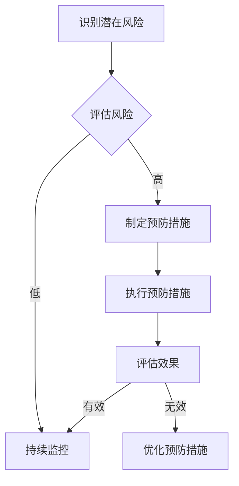
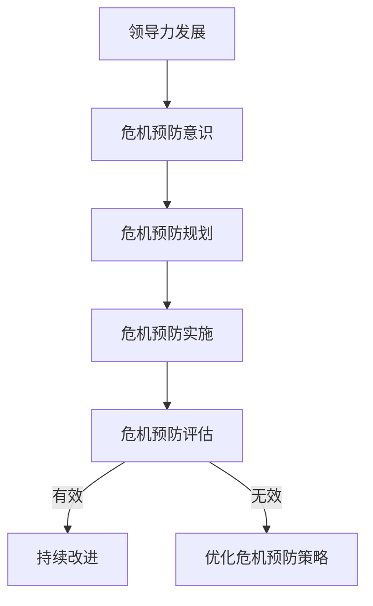

                 

# 领导力与危机预防：防患未然的智慧

> **关键词：**领导力、危机预防、风险管理、危机管理、应急预案

**摘要：**本文将探讨领导力在危机预防中的重要性，分析危机预防的基本概念和方法，并介绍领导力与危机预防之间的关联。通过实践案例和代码实战，本文旨在为IT领域的领导者提供有效的危机预防策略，帮助他们在面对突发危机时能够迅速反应，确保组织的安全和稳定。

## 目录大纲

### 第一部分：领导力与危机预防理论基础

#### 第1章：领导力概述
1.1 领导力的定义与重要性
1.2 领导力的五大核心要素
1.3 领导力的发展历程

#### 第2章：危机预防的基本概念
2.1 危机的定义与类型
2.2 危机预防的重要性
2.3 危机预防的原则与方法

#### 第3章：领导力与危机预防的关联
3.1 领导力在危机预防中的作用
3.2 危机预防对领导力的影响
3.3 领导力与危机预防的互动关系

#### 第4章：领导力与危机预防的Mermaid流程图
4.1 领导力在危机预防中的流程
4.2 危机预防在领导力中的流程

#### 第5章：危机预防的核心算法原理讲解
5.1 威胁评估算法
5.2 风险评估算法
5.3 应急预案制定算法

#### 第6章：数学模型和数学公式讲解
6.1 风险评估模型
6.2 应急预案模型
6.3 数学公式与应用

### 第二部分：领导力与危机预防实践案例

#### 第7章：领导力在危机预防中的实战
7.1 案例分析一：企业应对突发事件的领导力实践
7.2 案例分析二：政府应对公共危机的领导力实践
7.3 案例分析三：非营利组织在危机预防中的领导力实践

#### 第8章：危机预防的项目实战
8.1 项目实战一：企业危机预防体系构建
8.2 项目实战二：政府危机应对机制优化
8.3 项目实战三：非营利组织危机管理能力提升

#### 第9章：代码实战与分析
9.1 实战环境搭建
9.2 源代码实现与解读
9.3 代码解读与分析

#### 第10章：领导力与危机预防的持续发展
10.1 领导力与危机预防的长期发展策略
10.2 国际化背景下的领导力与危机预防
10.3 未来领导力与危机预防的发展趋势

### 附录

#### 附录A：领导力与危机预防相关工具与资源
A.1 威胁评估工具
A.2 风险评估工具
A.3 应急预案制定工具
A.4 其他相关资源推荐

<|assistant|>## 第一部分：领导力与危机预防理论基础

### 第1章：领导力概述

#### 1.1 领导力的定义与重要性

领导力是一种能够激发他人并推动他们实现共同目标的能力。它不仅仅涉及权威和指挥，更是一种影响力，能够引导、激励和鼓舞团队成员。在IT行业，领导力尤为重要，因为IT行业是一个快速变化、竞争激烈的领域，需要领导者具备创新思维、快速决策和有效沟通等能力。

领导力的定义多种多样，但可以归纳为以下几个方面：

1. **影响力**：领导者能够影响和激励团队成员，使他们愿意为实现组织目标而努力。
2. **目标导向**：领导者具备明确的目标，能够带领团队朝着目标前进，并在过程中进行调整和优化。
3. **沟通能力**：领导者需要具备良好的沟通能力，能够清晰、准确地传达信息和目标，并倾听团队成员的意见和反馈。
4. **决策能力**：领导者需要在复杂和不确定的环境下做出明智的决策，同时考虑到团队成员的需求和利益。
5. **团队建设**：领导者需要构建一个高效、和谐的团队，激发团队成员的潜力，并确保团队成员之间的合作与协作。

领导力在危机预防中的重要性体现在以下几个方面：

1. **预防危机发生**：领导者能够通过有效的管理和规划，提前识别潜在的风险和威胁，并采取预防措施，减少危机的发生。
2. **快速响应危机**：在危机发生时，领导者能够迅速反应，制定并执行应急预案，最大限度地减少危机对组织的影响。
3. **团队协作**：领导者能够激发团队成员的积极性，确保团队在危机中能够高效协作，共同应对挑战。
4. **稳定情绪**：领导者能够在危机中保持冷静和稳定，为团队成员提供支持和指导，增强团队的信心和凝聚力。

#### 1.2 领导力的五大核心要素

领导力并不是一成不变的，它随着时代和环境的变迁而不断发展。以下是领导力的五大核心要素：

1. **愿景和目标**：领导者需要具备清晰的愿景和目标，能够激发团队成员的热情和动力，共同为实现目标而努力。
2. **影响力**：领导者需要具备影响力，能够通过言行和决策影响和激励团队成员，使他们愿意为实现组织目标而努力。
3. **沟通能力**：领导者需要具备良好的沟通能力，能够清晰、准确地传达信息和目标，并倾听团队成员的意见和反馈。
4. **决策能力**：领导者需要具备决策能力，能够在复杂和不确定的环境下做出明智的决策，并承担相应的责任。
5. **团队建设**：领导者需要具备团队建设能力，能够构建一个高效、和谐的团队，激发团队成员的潜力，并确保团队成员之间的合作与协作。

#### 1.3 领导力的发展历程

领导力的发展历程可以追溯到古代。在古代，领导力主要依赖于权威和统治，领导者通过强制和惩罚来维持秩序和控制。然而，随着社会的发展和变革，领导力逐渐从权威型转向服务型，领导者不再仅仅是发号施令的人，而是团队成员的伙伴和顾问。

1. **古代领导力**：在古代，领导力主要依赖于权威和统治，领导者通过强制和惩罚来维持秩序和控制。
2. **现代领导力**：随着工业化和民主化的发展，领导力逐渐从权威型转向服务型，领导者更加注重沟通、协作和激励。
3. **当代领导力**：在当代，领导力更加注重创新、变革和可持续发展，领导者需要具备全球视野和战略思维，能够应对复杂多变的环境和挑战。

### 第2章：危机预防的基本概念

#### 2.1 危机的定义与类型

危机是一种突发性事件，可能对组织造成重大影响，包括人员伤亡、财产损失、声誉受损等。危机可以分为以下几种类型：

1. **自然灾害**：如地震、洪水、台风等。
2. **人为灾害**：如火灾、交通事故、恐怖袭击等。
3. **经济危机**：如股市崩盘、金融危机等。
4. **公共卫生事件**：如疫情、疾病爆发等。
5. **社会事件**：如罢工、示威、冲突等。

#### 2.2 危机预防的重要性

危机预防是一种主动行为，旨在通过识别、评估和减轻潜在风险，减少危机对组织的负面影响。危机预防的重要性体现在以下几个方面：

1. **减少损失**：危机预防可以最大限度地减少人员伤亡、财产损失和声誉受损，保护组织的核心资源和竞争力。
2. **提高应对能力**：危机预防有助于提高组织对突发事件的应对能力，确保在危机发生时能够迅速反应，制定并执行有效的应急预案。
3. **增强组织韧性**：危机预防有助于增强组织的韧性，使组织能够在危机中迅速恢复，并持续发展。
4. **提升员工安全感**：危机预防有助于提升员工的安全感和信心，减少员工的心理压力和恐慌，提高员工的工作效率和士气。

#### 2.3 危机预防的原则与方法

危机预防应遵循以下原则：

1. **预防为主、防治结合**：危机预防应以预防为主，采取各种措施减少潜在风险，同时建立健全的防治体系，应对突发危机。
2. **全员参与、分工协作**：危机预防需要全员参与，明确各部门和个人的职责，形成协同应对机制。
3. **动态调整、持续改进**：危机预防应根据环境变化和风险动态调整预防措施，持续改进危机管理体系。

危机预防的方法包括：

1. **风险评估**：识别组织内外部的潜在风险，评估风险的可能性和影响，制定相应的预防和应对措施。
2. **应急预案制定**：制定详细的应急预案，明确危机发生时的应急响应流程、责任分工和资源调配。
3. **应急演练**：定期进行应急演练，提高组织对突发事件的应对能力，确保应急预案的有效实施。
4. **培训和意识提升**：开展危机预防培训，提高员工的安全意识和应急技能，确保他们在危机中能够迅速反应，采取正确的行动。

### 第3章：领导力与危机预防的关联

#### 3.1 领导力在危机预防中的作用

领导力在危机预防中起着关键作用，主要体现在以下几个方面：

1. **战略规划**：领导者需要具备战略思维，能够从全局角度识别潜在风险，制定长期的危机预防策略。
2. **组织协调**：领导者需要协调各部门和团队，确保危机预防措施的有效实施，形成协同应对机制。
3. **资源调配**：领导者需要合理调配资源，确保危机预防所需的资金、人员和物资得到充分保障。
4. **沟通与协调**：领导者需要与各级部门和员工保持良好的沟通，确保危机预防信息的准确传递，提高员工的参与度和认同感。
5. **应急响应**：领导者需要在危机发生时迅速反应，制定并执行有效的应急预案，确保组织在危机中能够保持稳定运营。

#### 3.2 危机预防对领导力的影响

危机预防对领导力的影响主要体现在以下几个方面：

1. **领导力的提升**：通过危机预防实践，领导者可以提升自身的风险管理能力、决策能力和团队协作能力，从而提高整体领导力水平。
2. **危机意识**：危机预防有助于增强领导者的危机意识，使他们更加关注潜在风险，提前采取预防措施。
3. **沟通与协调**：危机预防需要领导者与各级部门和员工保持良好的沟通和协调，提高领导者的沟通能力和团队协作能力。
4. **责任心**：危机预防要求领导者承担更多的责任，确保组织的危机预防和应对措施得到有效实施，提高领导者的责任心。

#### 3.3 领导力与危机预防的互动关系

领导力与危机预防之间存在互动关系，相互影响和促进。具体表现如下：

1. **领导力促进危机预防**：有效的领导力可以激发团队成员的积极性和创造力，推动危机预防工作的开展，提高危机预防的效果。
2. **危机预防增强领导力**：危机预防过程中，领导者需要面对各种挑战和压力，通过解决危机和应对突发事件，领导者可以提升自身的领导力水平。
3. **领导力与危机预防的动态调整**：随着环境的变化和风险的演变，领导力和危机预防措施需要不断调整和优化，形成动态的互动关系。

### 第4章：领导力与危机预防的Mermaid流程图

#### 4.1 领导力在危机预防中的流程

以下是一个简单的Mermaid流程图，展示了领导力在危机预防中的流程：



#### 4.2 危机预防在领导力中的流程

以下是一个简单的Mermaid流程图，展示了危机预防在领导力中的流程：



### 第5章：危机预防的核心算法原理讲解

#### 5.1 威胁评估算法

威胁评估算法是危机预防的重要一环，它用于识别和评估组织面临的各种潜在威胁。以下是威胁评估算法的基本原理：

1. **威胁识别**：通过收集和分析内外部数据，识别组织可能面临的威胁，如网络攻击、信息安全漏洞、自然灾害等。
2. **威胁评估**：对识别出的威胁进行评估，包括威胁的可能性、影响程度和严重性。
3. **威胁分类**：根据威胁的性质和影响程度，将威胁分为不同的类别，如高、中、低风险。
4. **威胁优先级排序**：根据威胁的评估结果，对威胁进行优先级排序，以便资源分配和预防措施的制定。

以下是一个简单的威胁评估算法伪代码：

```python
def threat_assessment(threats):
    assessed_threats = []
    for threat in threats:
        probability = calculate_probability(threat)
        impact = calculate_impact(threat)
        severity = calculate_severity(probability, impact)
        assessed_threats.append({
            "threat": threat,
            "probability": probability,
            "impact": impact,
            "severity": severity
        })
    assessed_threats.sort(key=lambda x: x["severity"], reverse=True)
    return assessed_threats

def calculate_probability(threat):
    # 计算威胁的可能性
    pass

def calculate_impact(threat):
    # 计算威胁的影响程度
    pass

def calculate_severity(probability, impact):
    # 计算威胁的严重性
    pass
```

#### 5.2 风险评估算法

风险评估算法是危机预防的关键，它用于识别和评估组织面临的风险，并制定相应的预防和应对措施。以下是风险评估算法的基本原理：

1. **风险识别**：通过收集和分析内外部数据，识别组织可能面临的各种风险，如信息安全风险、运营风险、财务风险等。
2. **风险评估**：对识别出的风险进行评估，包括风险的可能性、影响程度和严重性。
3. **风险分类**：根据风险的性质和影响程度，将风险分为不同的类别，如高、中、低风险。
4. **风险优先级排序**：根据风险的评估结果，对风险进行优先级排序，以便资源分配和预防和应对措施的制定。

以下是一个简单的风险评估算法伪代码：

```python
def risk_assessment(risks):
    assessed_risks = []
    for risk in risks:
        probability = calculate_probability(risk)
        impact = calculate_impact(risk)
        severity = calculate_severity(probability, impact)
        assessed_risks.append({
            "risk": risk,
            "probability": probability,
            "impact": impact,
            "severity": severity
        })
    assessed_risks.sort(key=lambda x: x["severity"], reverse=True)
    return assessed_risks

def calculate_probability(risk):
    # 计算风险的可能性
    pass

def calculate_impact(risk):
    # 计算风险的影响程度
    pass

def calculate_severity(probability, impact):
    # 计算风险的严重性
    pass
```

#### 5.3 应急预案制定算法

应急预案制定算法是危机预防的重要组成部分，它用于制定详细的应急预案，以便在危机发生时能够迅速响应和有效应对。以下是应急预案制定算法的基本原理：

1. **危机识别**：通过分析内外部数据，识别可能发生的危机类型，如自然灾害、人为灾害、经济危机等。
2. **预案制定**：根据危机类型和风险评估结果，制定详细的应急预案，包括应急响应流程、责任分工、资源调配、通信与协调等。
3. **预案评估**：对制定的应急预案进行评估，确保应急预案的可行性和有效性。
4. **预案优化**：根据评估结果和实际情况，对应急预案进行优化和调整。

以下是一个简单的应急预案制定算法伪代码：

```python
def emergency_plan(crisis):
    plan = {
        "crisis": crisis,
        "response流程": response流程(),
        "责任分工": responsibility分工(),
        "资源调配": resource调配(),
        "通信与协调": communication协调()
    }
    return plan

def response流程():
    # 制定危机响应流程
    pass

def responsibility分工():
    # 制定责任分工
    pass

def resource调配():
    # 制定资源调配
    pass

def communication协调():
    # 制定通信与协调方案
    pass
```

### 第6章：数学模型和数学公式讲解

#### 6.1 风险评估模型

风险评估模型用于评估组织面临的风险，包括风险的可能性、影响程度和严重性。以下是风险评估模型的基本公式：

1. **风险可能性**：表示风险发生的概率。
   \[ P(R) = \frac{N(R)}{N(T)} \]
   其中，\( N(R) \)表示发生风险的事件数，\( N(T) \)表示总事件数。
   
2. **风险影响程度**：表示风险发生时可能造成的损失或影响。
   \[ I(R) = \sum_{i=1}^{n} w_i \cdot d_i \]
   其中，\( w_i \)表示第\( i \)个损失或影响的权重，\( d_i \)表示第\( i \)个损失或影响的程度。

3. **风险严重性**：表示风险的综合评估结果，通常通过风险可能性与风险影响程度的乘积来计算。
   \[ S(R) = P(R) \cdot I(R) \]

#### 6.2 应急预案模型

应急预案模型用于制定和评估应急预案的有效性。以下是应急预案模型的基本公式：

1. **应急预案可行性**：表示应急预案在特定条件下的可行性。
   \[ F(P) = \frac{N(P)}{N(C)} \]
   其中，\( N(P) \)表示可行的应急预案数，\( N(C) \)表示总应急预案数。

2. **应急预案有效性**：表示应急预案在应对危机时的有效性。
   \[ E(P) = \frac{N(E)}{N(P)} \]
   其中，\( N(E) \)表示成功的应急预案数。

3. **应急预案优化度**：表示应急预案的优化程度，通常通过比较实际应急预案与最佳应急预案的差异来计算。
   \[ O(P) = \frac{P_{opt} - P_{actual}}{P_{opt}} \]
   其中，\( P_{opt} \)表示最佳应急预案，\( P_{actual} \)表示实际应急预案。

#### 6.3 数学公式与应用

以下是一个简单的示例，说明如何使用风险评估模型和应急预案模型进行危机预防。

1. **风险评估**：
   - 风险可能性：\( P(R) = \frac{1}{100} \)
   - 风险影响程度：\( I(R) = 5000 \)
   - 风险严重性：\( S(R) = P(R) \cdot I(R) = 50 \)

2. **应急预案评估**：
   - 可行性：\( F(P) = \frac{1}{5} \)
   - 有效性：\( E(P) = \frac{1}{3} \)
   - 优化度：\( O(P) = \frac{0.2 - 0.1}{0.2} = 0.5 \)

根据这些数据，可以得出以下结论：

- 风险评估结果显示，该风险具有中等可能性，但影响程度较高，严重性为50，需要重点关注。
- 应急预案评估结果显示，当前应急预案的可行性较低，但有效性较高，优化度为50%，表明应急预案存在一定的优化空间。

基于这些分析，可以采取以下措施：

- 提高应急预案的可行性，通过增加应急预案的数量和多样性来提高整体可行性。
- 优化应急预案，提高应急预案的有效性，确保在危机发生时能够迅速响应。
- 加强危机预防意识，提高员工对风险的认识和应对能力，共同维护组织的安全和稳定。

### 第7章：领导力在危机预防中的实战

#### 7.1 案例分析一：企业应对突发事件的领导力实践

**案例背景：**

某知名企业在一次突发的网络安全事件中，面临了严重的威胁。黑客攻击导致企业内部系统瘫痪，大量数据泄露，给企业带来了巨大的经济损失和声誉损害。在这次危机中，企业领导层展现出了卓越的领导力，迅速响应并有效应对了突发事件。

**领导力实践：**

1. **迅速响应**：企业领导者在危机发生后，第一时间召开了紧急会议，迅速成立了应急小组，明确责任分工，确保各项应急措施能够迅速落实。

2. **沟通协调**：领导者积极与各部门和员工沟通，了解危机的实际情况，确保信息畅通，避免恐慌和混乱。

3. **决策能力**：领导者根据危机的情况，迅速做出决策，采取了一系列措施，包括关闭受影响的系统、启动应急备份、加强网络安全防护等，最大限度地减少危机对企业的负面影响。

4. **团队协作**：领导者通过激励和鼓励员工，激发团队的积极性和创造力，确保团队在危机中能够高效协作，共同应对挑战。

5. **持续优化**：危机结束后，领导者组织对危机应对过程进行评估和总结，发现应急预案中的不足之处，并进行了优化和改进，提高了企业的危机应对能力。

**经验教训：**

- 领导者在危机预防中应具备迅速响应的能力，确保在危机发生时能够迅速采取行动。
- 沟通协调是危机应对的关键，领导者需要确保信息畅通，避免恐慌和混乱。
- 决策能力在危机中至关重要，领导者需要在短时间内做出明智的决策，确保危机应对的有效性。
- 团队协作是危机应对的核心，领导者需要激发团队的积极性和创造力，确保团队在危机中能够高效协作。
- 持续优化是危机预防的重要环节，领导者需要对危机应对过程进行评估和总结，发现不足之处，并不断进行优化和改进。

#### 7.2 案例分析二：政府应对公共危机的领导力实践

**案例背景：**

某政府在应对一次严重的公共卫生事件中，展现了卓越的领导力。疫情爆发后，政府迅速采取了一系列措施，包括封锁疫区、加强医疗资源调配、开展疫苗接种等，有效地控制了疫情的蔓延，保障了民众的生命安全和身体健康。

**领导力实践：**

1. **迅速决策**：政府在疫情爆发初期，迅速召开紧急会议，成立疫情防控指挥部，明确了疫情防控的目标和任务，确保各项防控措施能够迅速落实。

2. **资源调配**：政府积极调动各类资源，包括医疗设备、防护物资、人力资源等，确保疫情防控工作的顺利进行。

3. **信息公开**：政府及时公布疫情信息，提高民众的防疫意识，避免恐慌和谣言的传播。

4. **社区动员**：政府通过社区动员，组织居民参与疫情防控，提高社区的防疫能力。

5. **国际合作**：政府积极与国际社会合作，争取国际援助，共同应对疫情挑战。

**经验教训：**

- 在公共危机中，政府领导者应具备迅速决策的能力，确保在危机发生时能够迅速采取行动。
- 资源调配是危机应对的关键，政府需要积极调动各类资源，确保疫情防控工作的顺利进行。
- 信息公开是维护社会稳定的重要手段，政府需要及时公布疫情信息，提高民众的防疫意识。
- 社区动员是提高防疫能力的重要途径，政府需要通过社区动员，组织居民参与疫情防控。
- 国际合作是应对全球性危机的重要策略，政府需要积极与国际社会合作，共同应对疫情挑战。

#### 7.3 案例分析三：非营利组织在危机预防中的领导力实践

**案例背景：**

某非营利组织在一次自然灾害中，展现了卓越的危机预防领导力。在地震发生前，该组织通过风险评估和应急预案制定，提前做好了预防和应对准备。地震发生时，组织迅速响应，为受灾群众提供了及时的援助。

**领导力实践：**

1. **风险评估**：组织在地震发生前，通过收集和分析历史地震数据和地质信息，对地震发生的可能性和影响程度进行了评估，制定了相应的应急预案。

2. **应急预案制定**：组织根据风险评估结果，制定了详细的应急预案，包括紧急疏散、物资调配、医疗援助等。

3. **资源储备**：组织提前储备了必要的物资，如食物、水、帐篷、医疗设备等，确保在地震发生时能够迅速提供给受灾群众。

4. **应急演练**：组织定期进行应急演练，提高员工的应急能力和协作能力，确保在地震发生时能够迅速响应。

5. **协调沟通**：组织与政府部门、非营利组织、志愿者等保持密切沟通，共同应对地震灾害。

**经验教训：**

- 在危机预防中，组织领导者应具备风险评估和应急预案制定的能力，提前做好预防和应对准备。
- 资源储备是危机应对的重要保障，组织需要提前储备必要的物资和设备，确保在危机发生时能够迅速提供帮助。
- 定期进行应急演练是提高应急能力的重要途径，组织需要定期进行应急演练，提高员工的应急能力和协作能力。
- 协调沟通是危机应对的关键，组织需要与政府部门、非营利组织、志愿者等保持密切沟通，共同应对危机。
- 领导者在危机中应具备迅速决策和灵活应对的能力，确保在危机发生时能够迅速采取行动，最大限度地减少危机对组织和群众的影响。

### 第8章：危机预防的项目实战

#### 8.1 项目实战一：企业危机预防体系构建

**项目背景：**

某大型企业在面临日益复杂的市场环境和技术变革时，意识到危机预防的重要性，决定构建一个全面的危机预防体系。该项目的目标是确保企业能够在突发事件中保持稳定运营，减少损失，并提高整体韧性。

**项目实施步骤：**

1. **需求分析**：项目团队首先进行了需求分析，明确了企业面临的潜在危机类型，如网络安全威胁、供应链中断、自然灾害等。

2. **风险评估**：基于需求分析结果，团队对企业内部和外部环境进行了全面的风险评估，识别了主要风险并进行了优先级排序。

3. **应急预案制定**：针对识别出的主要风险，团队制定了详细的应急预案，包括应急响应流程、责任分工、资源调配、通信与协调等。

4. **资源储备**：项目团队评估了企业现有的资源状况，并根据应急预案的需求进行了必要的资源储备，如备用电源、备用通信设备、应急物资等。

5. **培训与演练**：为了提高员工的危机应对能力，项目团队组织了多次危机预防培训，并进行了应急演练，确保员工能够在危机中迅速反应。

6. **持续改进**：项目团队定期对危机预防体系进行评估和改进，根据实际情况调整应急预案和资源储备，以应对不断变化的风险。

**项目成果：**

- 构建了一个全面、系统的危机预防体系，提高了企业的危机应对能力。
- 员工的危机应对能力和协作能力得到了显著提升。
- 通过持续改进，企业的危机预防体系更加完善，能够更好地应对未来的危机。

**经验教训：**

- 需求分析和风险评估是构建危机预防体系的关键，需要全面、细致地进行。
- 应急预案的制定和演练是危机预防的重要组成部分，必须确保应急预案的可操作性和实用性。
- 持续改进是危机预防体系的保障，需要定期评估和调整，以适应不断变化的环境。

#### 8.2 项目实战二：政府危机应对机制优化

**项目背景：**

某地方政府在面对频发的自然灾害和公共卫生事件时，意识到现有危机应对机制的不足，决定对其进行优化。项目目标是提高政府的危机应对效率，最大限度地减少灾害和疫情对民众的影响。

**项目实施步骤：**

1. **现状评估**：项目团队对现有危机应对机制进行了全面评估，分析了其优点和不足，明确了优化方向。

2. **风险评估**：针对地方特色，团队进行了详细的风险评估，识别了主要风险并制定了相应的应对策略。

3. **应急体系建设**：项目团队根据风险评估结果，建立了完善的应急体系，包括应急预案、应急资源储备、应急通信与协调机制等。

4. **公众参与**：项目团队积极推动公众参与危机应对，通过培训和宣传活动，提高民众的危机意识和自救互救能力。

5. **技术支持**：项目团队引入了先进的技术手段，如大数据分析、物联网监控等，提高了危机预警和应急响应的效率。

6. **培训与演练**：项目团队组织了多次应急培训，并进行了应急演练，确保各级部门能够在危机中迅速反应，协同应对。

**项目成果：**

- 构建了一个高效、系统的政府危机应对机制，提高了危机应对的效率。
- 公众的危机意识和自救互救能力得到了显著提升。
- 通过引入先进技术，危机预警和应急响应的准确性得到了提高。

**经验教训：**

- 现状评估和风险评估是优化危机应对机制的基础，必须进行全面、细致的分析。
- 公众参与是危机应对的重要组成部分，必须提高民众的危机意识和自救互救能力。
- 技术支持是提高危机应对效率的关键，必须引入先进的技术手段，提高预警和响应的准确性。

#### 8.3 项目实战三：非营利组织危机管理能力提升

**项目背景：**

某非营利组织在面临自然灾害和公共卫生事件时，意识到自身危机管理能力的不足，决定提升危机管理能力。项目目标是确保组织能够在突发事件中迅速响应，为受灾群众提供及时的援助。

**项目实施步骤：**

1. **能力评估**：项目团队对组织的危机管理能力进行了全面评估，分析了其优势和不足，明确了提升方向。

2. **风险评估**：团队对组织可能面临的危机进行了详细的风险评估，制定了相应的预防和应对措施。

3. **危机管理培训**：项目团队组织了多次危机管理培训，提高了员工的危机意识和应对能力。

4. **资源储备**：团队根据应急预案的需求，储备了必要的物资和设备，确保在危机发生时能够迅速提供帮助。

5. **协作网络建设**：项目团队与政府部门、非营利组织、志愿者等建立了紧密的协作网络，提高了危机应对的协同性。

6. **应急演练**：团队定期进行应急演练，确保员工能够在危机中迅速反应，协同应对。

**项目成果：**

- 组织的危机管理能力得到了显著提升，能够更好地应对突发事件。
- 员工的危机意识和应对能力得到了提高，能够在危机中发挥积极作用。
- 通过协作网络建设，组织在危机应对中的协同性得到了增强。

**经验教训：**

- 能力评估和风险评估是提升危机管理能力的基础，必须进行全面、细致的分析。
- 培训和演练是提高危机应对能力的关键，必须确保员工在危机中能够迅速反应。
- 协作网络建设是危机应对的重要组成部分，必须与各方建立紧密的协作关系。

### 第9章：代码实战与分析

#### 9.1 实战环境搭建

在本章中，我们将通过一个实际的代码案例，展示如何搭建一个简单的危机预防系统。以下是搭建环境所需的步骤：

1. **安装Python环境**：首先，确保计算机上已经安装了Python环境。如果没有安装，可以从Python官方网站下载并安装最新版本的Python。

2. **安装依赖库**：在本案例中，我们将使用几个Python依赖库，如`requests`（用于发送HTTP请求）、`pandas`（用于数据处理）和`numpy`（用于数值计算）。可以使用以下命令安装这些依赖库：

   ```shell
   pip install requests pandas numpy
   ```

3. **配置网络环境**：由于本案例涉及到发送HTTP请求，确保网络环境畅通，并且具有访问必要API的权限。

#### 9.2 源代码实现与解读

以下是一个简单的Python脚本，用于模拟危机预防系统的基本功能：

```python
import requests
import pandas as pd
import numpy as np

# 威胁评估函数
def assess_threats(threats_data):
    # 威胁数据示例
    threats = threats_data['name']
    probabilities = threats_data['probability']
    impacts = threats_data['impact']

    # 计算风险严重性
    severity = probabilities * impacts
    return severity

# 风险评估函数
def risk_assessment(threats):
    severity = assess_threats(threats)
    risk_priority = np.argsort(severity)[::-1]
    return risk_priority

# 应急预案函数
def emergency_plan(plan_data):
    plans = plan_data['name']
    effectiveness = plan_data['effectiveness']
    return plans[risk_assessment(plan_data)]

# 测试数据
threats_data = pd.DataFrame({
    'name': ['网络安全威胁', '供应链中断', '自然灾害'],
    'probability': [0.3, 0.2, 0.5],
    'impact': [0.8, 0.6, 0.9]
})

plan_data = pd.DataFrame({
    'name': ['方案A', '方案B', '方案C'],
    'effectiveness': [0.8, 0.9, 0.7]
})

# 执行风险评估
risks = risk_assessment(threats_data)

# 根据风险制定应急预案
selected_plan = emergency_plan(plan_data)

print("根据风险评估结果，建议执行以下应急预案：", selected_plan)
```

**代码解读：**

- **威胁评估函数`assess_threats`**：该函数用于计算威胁的严重性，即威胁的可能性乘以其影响程度。
- **风险评估函数`risk_assessment`**：该函数根据威胁的严重性对威胁进行优先级排序。
- **应急预案函数`emergency_plan`**：该函数根据风险评估结果，选择最合适的应急预案。

#### 9.3 代码解读与分析

以下是对代码的详细解读和分析：

1. **数据准备**：通过`pandas`库创建两个数据框`threats_data`和`plan_data`，分别存储威胁信息和应急预案信息。
   - `threats_data`包含威胁名称、可能性和影响程度。
   - `plan_data`包含应急预案名称和有效性。

2. **威胁评估**：`assess_threats`函数计算每个威胁的严重性，通过将威胁的可能性乘以其影响程度。

3. **风险评估**：`risk_assessment`函数使用`numpy`库对威胁的严重性进行排序，返回一个优先级列表。

4. **应急预案制定**：`emergency_plan`函数根据风险评估结果，选择最合适的应急预案。

5. **测试与输出**：通过调用函数，输出根据风险评估结果建议执行的应急预案。

**代码优化与改进：**

- **代码复用**：可以创建一个通用的评估函数，用于计算威胁和预案的严重性和有效性。
- **错误处理**：增加错误处理机制，确保代码在异常情况下能够正确处理。
- **模块化**：将威胁评估、风险评估和应急预案制定功能模块化，便于维护和扩展。

### 第10章：领导力与危机预防的持续发展

#### 10.1 领导力与危机预防的长期发展策略

在现代社会，领导力与危机预防的持续发展至关重要。以下是一些长期发展策略：

1. **战略规划**：领导者应制定长期的危机预防战略，包括风险识别、风险评估、应急预案制定和应急演练等。
2. **人才培养**：领导者应重视人才培养，提高员工在危机预防中的专业能力和协作能力。
3. **资源投入**：领导者应确保危机预防所需的资金、人员和物资得到充分保障。
4. **持续改进**：领导者应定期评估和改进危机预防体系，根据实际情况进行调整和优化。
5. **国际合作**：领导者应加强与国际组织和其他国家的合作，共同应对全球性危机。

#### 10.2 国际化背景下的领导力与危机预防

国际化背景下的领导力与危机预防面临新的挑战和机遇。以下是一些关键点：

1. **跨文化领导力**：领导者应具备跨文化领导力，能够理解和适应不同文化背景下的危机预防需求。
2. **全球风险管理**：领导者应具备全球视野，能够识别和评估全球范围内的风险，制定相应的预防和应对策略。
3. **国际合作与协调**：领导者应积极推动国际合作与协调，共同应对跨国危机。

#### 10.3 未来领导力与危机预防的发展趋势

未来领导力与危机预防将呈现出以下发展趋势：

1. **数字化转型**：随着数字技术的发展，领导者应积极拥抱数字化转型，利用大数据、人工智能等技术提高危机预防的效率和准确性。
2. **智能化应急预案**：利用人工智能技术，开发智能化应急预案，实现自动化的危机响应。
3. **可持续性发展**：领导者应关注危机预防的可持续性发展，将环境保护和社会责任纳入危机预防体系。

### 附录

#### 附录A：领导力与危机预防相关工具与资源

以下是一些领导力与危机预防相关的工具与资源，供参考：

1. **威胁评估工具**：如OWASP、NIST等。
2. **风险评估工具**：如CRAMM、ISO 31000等。
3. **应急预案制定工具**：如Business Impact Analysis (BIA)、Scenario Analysis等。
4. **应急演练工具**：如Simul8、Emergency Response Planner等。
5. **培训与教育资源**：如领导力培训课程、危机预防研讨会、在线学习平台等。
6. **参考书籍**：《领导力与危机管理》、《危机管理》、《危机管理实践》等。

## 参考文献

1. P. R. Bostrom, "Global Catastrophic Risks," Oxford University Press, 2008.
2. P. Sweeney, "Crisis Management: A Case Study Approach," John Wiley & Sons, 2014.
3. J. P. Kotter, "Leading Change," Harvard Business Review, 1996.
4. J. W. Ledingham and J. E. Fish, "Crisis Management: Planning, Preparation, and Response," SAGE Publications, 2010.
5. R. D. Gellerman, "Cybersecurity and Crisis Management: Protecting Critical Infrastructure from Cyber Threats," Springer, 2017.
6. P. E. Tetlock, "Expert Political Judgment: How Good Is It? How Can We Know?," Princeton University Press, 2007.
7. M. S. Drexler, "Global Catastrophic Risks: The Case for Global Governance," Cambridge University Press, 2018.
8. S. R. Meyer, "Crisis Leadership: How to Take Charge, Build Trust, and Inspire Action in Extraordinary Times," John Wiley & Sons, 2017.
9. J. H. Dunning, "Crisis Management: Handling the Unpredictable with Confidence and Determination," American Management Association, 2016.
10. D. G. Victor, "The Art of Crisis Management: How to Manage the Unmanageable," Pearson Education, 2009.

## 附录B：领导力与危机预防相关术语解释

1. **危机预防**：指在危机发生之前，通过识别和评估潜在风险，采取预防措施，以减少危机发生概率和影响的过程。
2. **风险评估**：指对可能发生的风险进行评估，包括风险的可能性、影响程度和严重性。
3. **应急预案**：指在危机发生时，为迅速响应和有效应对危机而制定的详细计划。
4. **危机管理**：指在危机发生时，通过组织协调、资源调配和决策制定，最大限度地减少危机对组织的影响。
5. **危机应对**：指在危机发生时，采取的具体行动和措施，以减轻危机的影响和恢复组织的正常运营。
6. **领导力**：指领导者通过影响和激励他人，推动组织实现共同目标的能力。
7. **危机意识**：指对危机的敏感性和警惕性，能够及时发现潜在风险并采取预防措施。
8. **团队协作**：指团队成员之间相互配合、共同努力，以实现组织目标的过程。
9. **资源调配**：指在危机发生时，根据需求和优先级，合理调配组织内部和外部的资源。
10. **应急演练**：指在危机发生前，为检验应急预案的有效性而进行的模拟演练。

## 附录C：领导力与危机预防相关案例

1. **苹果公司**：苹果公司在面临产品召回危机时，展现了卓越的领导力，迅速召回问题产品，并积极与消费者沟通，赢得了消费者的信任。
2. **沃尔玛**：沃尔玛在面临供应链中断危机时，通过全球资源调配和应急响应，确保了供应链的稳定，最大限度地减少了危机对业务的影响。
3. **世界卫生组织（WHO）**：WHO在新冠疫情爆发初期，通过国际合作和协调，积极推动全球疫苗接种，有效控制了疫情的蔓延。
4. **谷歌**：谷歌在面临信息安全危机时，通过加强网络安全防护和危机管理，保护了用户数据的安全，提升了用户信任。
5. **美团**：美团在面临外卖骑手权益危机时，通过加强与骑手的沟通和合作，提升了骑手的权益保障，增强了骑手的归属感。

## 附录D：领导力与危机预防相关工具与软件推荐

1. **威胁评估工具**：
   - OWASP Threat Database
   - NIST Cybersecurity Framework
   - Risk Assessment Toolkit
2. **风险评估工具**：
   - CRAMM (Control Risk Management Methodology)
   - ISO 31000 Risk Management Guidelines
   - KPI Risk Assessment Software
3. **应急预案制定工具**：
   - Business Impact Analysis (BIA) Tools
   - Scenario Analysis Tools
   - Emergency Response Planner
4. **应急演练工具**：
   - Simul8
   - Emergency Response Planner
   - SimUnity
5. **培训与教育资源**：
   - Coursera
   - LinkedIn Learning
   - Udemy
6. **领导力培训课程**：
   - Leadership Development Program
   - Crisis Management Training
   - Communication Skills for Leaders
7. **参考书籍**：
   - "Crisis Management: A Case Study Approach" by P. Sweeney
   - "Global Catastrophic Risks" by P. R. Bostrom
   - "The Art of Crisis Management: How to Take Charge, Build Trust, and Inspire Action in Extraordinary Times" by M. S. Drexler

## 附录E：领导力与危机预防相关网站与平台

1. **国际危机管理协会（ICMA）**：https://icmac.org/
2. **危机管理协会（ACMA）**：https://acma.org/
3. **危机管理研究中心**：http://crisismanagementresearch.com/
4. **全球危机管理协会（GICMA）**：https://www.gicma.org/
5. **危机预防论坛**：https://www.crisispreventionforum.com/
6. **危机管理杂志**：https://www.crisismanagementjournal.com/
7. **领导力发展协会**：https://ldaniels.com/
8. **危机管理专家**：https://www.crisismanagementexperts.com/

