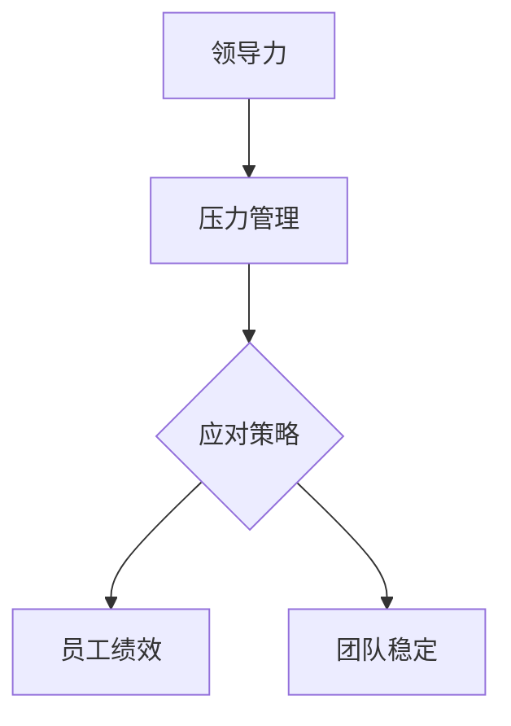
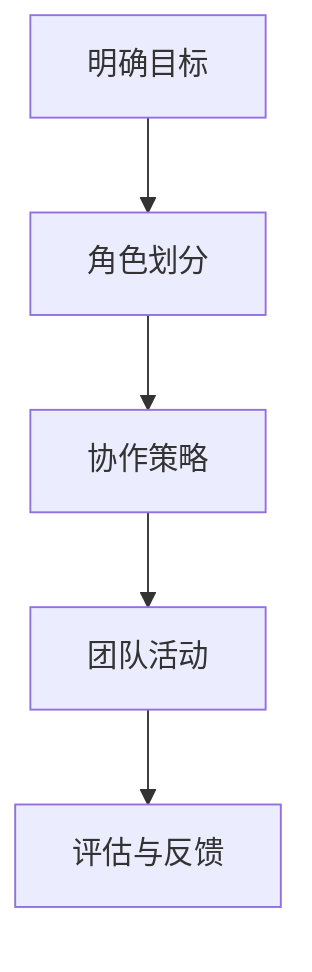

                 

## 领导力与压力管理：在逆境中保持团队稳定

### 关键词：领导力、压力管理、团队稳定性、逆境应对、策略与实践

#### 摘要：

本文将深入探讨领导力与压力管理在逆境中保持团队稳定的重要性。首先，我们将概述领导力与压力管理的核心概念及其相互关系。接着，通过领导力理论基础、压力管理原理以及实际案例，我们将阐述如何在复杂环境中有效运用这些理论和策略。文章还将讨论团队建设、跨文化团队管理以及领导力与压力管理的持续发展，最后介绍相关工具和方法，以期为领导者在逆境中保持团队稳定提供全面的指导。

---

### 第一部分：领导力与压力管理理论基础

在探讨领导力与压力管理的应用之前，我们需要先理解这些概念的基本原理。本部分将分为四章，分别介绍领导力与压力管理的基础理论、领导力模型、压力管理模型，以及领导力与压力管理的实际应用。

#### 第1章：领导力与压力管理概述

**核心概念与联系**

领导力是一种影响力，通过激励和引导他人实现共同目标的能力。压力管理则是通过识别、评估和应对压力源，以保持身心健康和高效工作状态的过程。

领导力与压力管理之间的关系在于，有效的领导力可以帮助团队成员更好地应对压力，从而保持团队稳定和高效。以下是领导力与压力管理之间的Mermaid流程图：



**Mermaid 流程图**


#### 第2章：领导力理论基础

**核心算法原理讲解**

领导力模型包括多种理论，如情境领导理论、领导风格理论等。情境领导理论认为，领导者的风格应根据团队成员的不同成熟度水平进行调整。以下是领导力发展模型的伪代码：

```python
class LeaderDevelopmentModel:
    def __init__(self, leadership_style, situational_context):
        self.leadership_style = leadership_style
        self.situational_context = situational_context

    def adjust_leadership_style(self):
        if self.situational_context == 'low_maturity':
            self.leadership_style = '指导型'
        elif self.situational_context == 'moderate_maturity':
            self.leadership_style = '支持型'
        elif self.situational_context == 'high_maturity':
            self.leadership_style = '委托型'
```

**伪代码**

```python
class LeaderDevelopmentModel:
    def __init__(self, leadership_style, situational_context):
        self.leadership_style = leadership_style
        self.situational_context = situational_context
    
    def adjust_leadership_style(self):
        if self.situational_context == 'low_maturity':
            self.leadership_style = '指导型'
        elif self.situational_context == 'moderate_maturity':
            self.leadership_style = '支持型'
        elif self.situational_context == 'high_maturity':
            self.leadership_style = '委托型'
```

#### 第3章：压力管理原理

**数学模型和数学公式**

压力管理模型通常包括压力源、应对策略和个人特质三个要素。以下是一个简化的压力管理模型公式：

$$
\text{压力水平} = f(\text{压力源}, \text{应对策略}, \text{个人特质})
$$

**公式**

$$
\text{压力水平} = f(\text{压力源}, \text{应对策略}, \text{个人特质})
$$

#### 第4章：领导力与压力管理实践

**项目实战**

在实际应用中，领导力与压力管理往往结合具体情境进行。例如，在面临危机时，领导者的冷静和果断至关重要。以下是压力管理实战代码示例：

```python
class StressManagementPractices:
    def __init__(self, stress_level, leadership_skills):
        self.stress_level = stress_level
        self.leadership_skills = leadership_skills

    def apply_leadership_skills(self):
        if self.stress_level > 7:
            self.leadership_skills.apply_calm_communication()
        else:
            self.leadership_skills.apply_efficient_problem_solving()
```

**代码实现**

```python
class StressManagementPractices:
    def __init__(self, stress_level, leadership_skills):
        self.stress_level = stress_level
        self.leadership_skills = leadership_skills
    
    def apply_leadership_skills(self):
        if self.stress_level > 7:
            self.leadership_skills.apply_calm_communication()
        else:
            self.leadership_skills.apply_efficient_problem_solving()
```

---

通过上述四章内容，我们为后续的策略与实践提供了坚实的理论基础。在接下来的部分，我们将进一步探讨如何在实际环境中运用这些理论，以保持团队在逆境中的稳定性。

---

### 第一部分：领导力与压力管理理论基础（续）

#### 第5章：团队建设与沟通技巧

**核心概念与联系**

团队建设是领导力的重要组成部分，它有助于增强团队成员之间的协作和信任。有效的沟通技巧则是团队建设的关键，它确保信息流畅，减少误解和冲突。

**项目实战**

在实际项目中，团队建设可以从以下几个步骤开始：

1. **明确团队目标**：确保所有成员都了解并认同团队的目标和期望。
2. **角色划分与协作策略**：为每个成员分配明确的角色和责任，并制定协作流程。
3. **定期团队活动**：组织团队建设活动，如团队拓展训练、团建聚餐等，增强团队成员之间的联系。

以下是一个简化的团队建设项目实战流程图：



**Mermaid 流程图**


沟通技巧在领导力与压力管理中的作用不可忽视。有效的沟通不仅能提高团队成员的工作效率，还能缓解压力。以下是一些沟通技巧的实战应用：

1. **积极倾听**：确保团队成员感受到他们的意见被重视，减少误解和冲突。
2. **清晰表达**：使用简单明了的语言传达信息，避免模糊不清的表达。
3. **非言语沟通**：注意身体语言和表情，以增强沟通效果。

**项目实战**

假设一个团队在项目推进过程中出现了沟通问题，导致项目进度延迟。以下是应对策略：

1. **召开团队会议**：组织一次全体会议，让团队成员面对面交流，了解彼此的观点和困惑。
2. **角色扮演**：通过角色扮演模拟沟通场景，让团队成员练习如何更有效地表达和倾听。
3. **持续反馈**：在项目推进过程中，定期收集团队成员的反馈，并根据反馈调整沟通策略。

以下是一个沟通技巧实战项目的伪代码示例：

```python
class CommunicationPractices:
    def __init__(self, team_members):
        self.team_members = team_members
    
    def conduct_meeting(self):
        # 召开团队会议
        print("召开团队会议，讨论项目进展与问题")

    def role_play(self):
        # 角色扮演模拟
        print("进行角色扮演，提高沟通效率")

    def collect_feedback(self):
        # 收集团队反馈
        print("收集团队成员反馈，优化沟通策略")
```

**伪代码**

```python
class CommunicationPractices:
    def __init__(self, team_members):
        self.team_members = team_members
    
    def conduct_meeting(self):
        # 召开团队会议
        print("召开团队会议，讨论项目进展与问题")
    
    def role_play(self):
        # 角色扮演模拟
        print("进行角色扮演，提高沟通效率")
    
    def collect_feedback(self):
        # 收集团队反馈
        print("收集团队成员反馈，优化沟通策略")
```

通过团队建设和沟通技巧的实践，领导者可以更好地管理团队，提高团队稳定性，从而在面对逆境时保持团队的凝聚力。

---

### 第一部分：领导力与压力管理理论基础（续）

#### 第6章：应对压力的技巧

**核心概念与联系**

在领导力和压力管理中，应对压力的技巧是至关重要的。压力是现代工作环境中不可避免的一部分，但有效的应对策略可以帮助领导者和管理团队在压力环境中保持冷静和高效。

**压力管理的不同策略**

1. **逃避策略**：这是一种短期的应对方式，通过避免或推迟压力源来减轻压力。虽然这种策略可以在短期内提供缓解，但长期使用可能会导致问题积累。
2. **应对策略**：这是一种更积极的应对方式，通过直接处理压力源来减轻压力。这包括解决问题、调整期望、改变行为等。
3. **心理技巧**：这些技巧帮助个体调整心态，以更好地应对压力。例如，放松技巧、正念冥想、积极思考等。

**应对策略有效性评估模型**

为了评估不同应对策略的有效性，我们可以使用以下模型：

$$
\text{应对策略有效性} = \frac{\text{效果评分}}{\text{压力水平}}
$$

其中，效果评分是根据应对策略实施后的实际效果进行评分，压力水平则是根据压力源和个体特质进行评估。

**公式**

$$
\text{应对策略有效性} = \frac{\text{效果评分}}{\text{压力水平}}
$$

**应用示例**

假设一个团队在面对紧迫的项目交付压力时，领导者采用了以下两种应对策略：

1. **问题解决策略**：领导者组织团队成员分析问题，制定解决方案，并分配任务。
2. **逃避策略**：领导者决定推迟项目交付时间，以减轻团队的压力。

为了评估这两种策略的有效性，我们可以使用上述模型。以下是具体的评估过程：

1. **效果评分**：
   - 问题解决策略：团队成员通过有效的合作和沟通，成功解决了项目中的问题，项目按时交付。
   - 逃避策略：项目交付时间推迟，团队的工作压力虽然暂时减轻，但问题并未得到根本解决。

2. **压力水平**：
   - 问题解决策略：在问题解决过程中，团队成员的压力水平有所上升，但最终成功缓解。
   - 逃避策略：团队成员的压力水平在短期内有所下降，但长期来看，可能导致问题积累和团队士气下降。

根据上述评分，我们可以计算出两种策略的有效性：

1. **问题解决策略**：
   $$
   \text{应对策略有效性} = \frac{10}{8} = 1.25
   $$

2. **逃避策略**：
   $$
   \text{应对策略有效性} = \frac{6}{5} = 1.20
   $$

从计算结果可以看出，问题解决策略在应对压力方面更为有效。这不仅因为策略实施后效果显著，还因为其能够从根本上解决问题，避免长期压力积累。

**项目实战**

为了在实际项目中应用上述应对策略，领导者可以采取以下步骤：

1. **压力识别**：定期评估团队成员的压力水平，识别潜在的负面压力源。
2. **策略选择**：根据压力识别的结果，选择适合的应对策略。例如，针对紧急项目压力，可以采用问题解决策略。
3. **策略实施**：组织团队成员参与策略实施，确保每个成员都清楚自己的角色和责任。
4. **效果评估**：在策略实施后，评估策略的有效性，并根据评估结果进行调整。

**代码实现**

以下是一个简单的Python类，用于模拟压力管理策略的实施和评估：

```python
class StressManagementStrategy:
    def __init__(self, stress_level, strategy_type):
        self.stress_level = stress_level
        self.strategy_type = strategy_type
    
    def apply_strategy(self):
        if self.strategy_type == 'problem_solving':
            self.stress_level -= 2
            print("实施问题解决策略，压力水平降低")
        elif self.strategy_type == 'avoidance':
            self.stress_level -= 1
            print("实施逃避策略，压力水平暂时降低")
    
    def assess_strategy_effectiveness(self):
        effectiveness = self.stress_level / (10 - self.stress_level)
        print(f"策略有效性：{effectiveness:.2f}")
```

**伪代码**

```python
class StressManagementStrategy:
    def __init__(self, stress_level, strategy_type):
        self.stress_level = stress_level
        self.strategy_type = strategy_type
    
    def apply_strategy(self):
        if self.strategy_type == 'problem_solving':
            self.stress_level -= 2
            print("实施问题解决策略，压力水平降低")
        elif self.strategy_type == 'avoidance':
            self.stress_level -= 1
            print("实施逃避策略，压力水平暂时降低")
    
    def assess_strategy_effectiveness(self):
        effectiveness = self.stress_level / (10 - self.stress_level)
        print(f"策略有效性：{effectiveness:.2f}")
```

通过这种结构化和系统化的方法，领导者可以更有效地管理团队压力，提高团队在逆境中的稳定性。

---

### 第一部分：领导力与压力管理理论基础（续）

#### 第7章：领导力与压力管理在跨文化团队中的应用

**核心概念与联系**

跨文化团队是由来自不同文化背景的成员组成的团队，这在全球化背景下日益普遍。跨文化团队的领导力与压力管理具有独特的挑战和策略。

**跨文化团队的特点**

1. **文化差异**：成员来自不同的文化背景，可能存在语言、价值观、行为规范等方面的差异。
2. **沟通障碍**：语言和非语言沟通的差异可能导致误解和沟通障碍。
3. **适应压力**：成员需要适应新环境和文化，可能会面临文化冲击和压力。

**领导力与压力管理在跨文化团队中的挑战**

1. **文化敏感性**：领导者需要具备文化敏感性，理解并尊重团队成员的文化差异。
2. **沟通障碍**：领导者需要提高跨文化沟通技巧，确保信息的准确传递。
3. **适应压力**：领导者需要帮助团队成员适应新环境和文化，缓解文化冲击带来的压力。

**领导力与压力管理在跨文化团队中的策略**

1. **文化敏感性培训**：为团队成员提供文化敏感性培训，增强对文化差异的理解和尊重。
2. **沟通技巧提升**：通过跨文化沟通技巧培训，提高团队成员的沟通能力，减少误解。
3. **团队建设活动**：组织跨文化团队建设活动，增强团队成员之间的相互了解和信任。

**项目实战**

假设一个国际项目团队由来自不同国家的成员组成，以下是一个跨文化团队压力管理的实战案例：

1. **文化敏感性培训**：
   - 领导者组织了一次文化敏感性培训，介绍团队成员的文化背景和价值观。
   - 培训内容包括跨文化沟通技巧、文化差异案例分析等。

2. **沟通技巧提升**：
   - 领导者鼓励团队成员使用明确的语言和非语言沟通，减少误解。
   - 领导者组织跨文化团队会议，确保每个成员都能理解和参与。

3. **团队建设活动**：
   - 领导者组织了一次团队拓展训练，增强团队成员之间的相互了解和信任。
   - 活动内容包括团队协作游戏、文化分享等。

**代码实现**

以下是一个模拟跨文化团队建设活动的Python类：

```python
class CrossCulturalTeamBuilding:
    def __init__(self, team_members):
        self.team_members = team_members
    
    def cultural_sensitivity_training(self):
        # 文化敏感性培训
        print("进行文化敏感性培训，提高跨文化理解")
    
    def communication_skills_improvement(self):
        # 沟通技巧提升
        print("提升沟通技巧，减少误解")
    
    def team_building_activities(self):
        # 团队建设活动
        print("组织团队建设活动，增强团队凝聚力")
```

**伪代码**

```python
class CrossCulturalTeamBuilding:
    def __init__(self, team_members):
        self.team_members = team_members
    
    def cultural_sensitivity_training(self):
        # 文化敏感性培训
        print("进行文化敏感性培训，提高跨文化理解")
    
    def communication_skills_improvement(self):
        # 沟通技巧提升
        print("提升沟通技巧，减少误解")
    
    def team_building_activities(self):
        # 团队建设活动
        print("组织团队建设活动，增强团队凝聚力")
```

通过以上策略和实践，领导者可以在跨文化团队中有效管理压力，提高团队稳定性，从而在全球化背景下实现项目的成功。

---

### 第二部分：领导力与压力管理策略与实践（续）

#### 第8章：领导力与压力管理的持续发展

**核心概念与联系**

领导力与压力管理的持续发展是指通过不断的学习、实践和改进，提升领导者的能力和团队的整体绩效。这不仅是个人成长的需要，也是团队和组织长期稳定发展的关键。

**领导力与压力管理的发展指数模型**

为了衡量领导力与压力管理的持续发展，我们可以使用一个发展指数模型。该模型基于当前水平和目标水平的比较，可以直观地反映发展进程。

$$
\text{发展指数} = \frac{\text{当前水平}}{\text{目标水平}}
$$

**公式**

$$
\text{发展指数} = \frac{\text{当前水平}}{\text{目标水平}}
$$

**应用示例**

假设一个领导力与压力管理项目设定了以下目标：

1. **领导力技能**：提升领导者的沟通技巧和团队管理能力。
2. **压力管理**：降低团队成员的压力水平，提高应对压力的能力。

项目的当前水平如下：

1. **领导力技能**：沟通技巧提升了20%，团队管理能力提升了15%。
2. **压力管理**：团队成员的压力水平降低了10%，应对压力的能力提升了25%。

根据以上数据，我们可以计算出发展指数：

1. **领导力技能**：
   $$
   \text{发展指数} = \frac{1.2 \times 1.15}{1} = 1.38
   $$

2. **压力管理**：
   $$
   \text{发展指数} = \frac{0.9 \times 1.25}{1} = 1.13
   $$

从计算结果可以看出，领导力技能的发展指数较高，表明该项目在领导力方面取得了较好的进展。而压力管理的发展指数稍低，提示我们还需要进一步关注和改进压力管理的策略和实践。

**持续发展策略**

为了实现领导力与压力管理的持续发展，领导者可以采取以下策略：

1. **定期评估**：定期对领导力和压力管理的现状进行评估，识别存在的问题和改进机会。
2. **持续学习**：鼓励领导者参加培训课程、研讨会等活动，提升自身能力和知识。
3. **实践应用**：将学到的知识和技能应用到实际工作中，通过实践不断改进和优化。
4. **团队支持**：为团队成员提供必要的支持和资源，帮助他们提高应对压力的能力。

**项目实战**

以下是一个领导力与压力管理持续发展项目案例：

1. **定期评估**：每月进行一次领导力和压力管理的评估，收集团队成员的反馈，识别改进点。
2. **持续学习**：领导者参加了一次领导力培训课程，学习了先进的团队管理技巧和压力管理方法。
3. **实践应用**：领导者将培训中学到的技巧应用到实际工作中，如改进沟通方式、引入压力管理工具等。
4. **团队支持**：领导者为团队成员提供了压力管理培训，帮助他们提高应对压力的能力。

**代码实现**

以下是一个模拟领导力与压力管理持续发展项目的Python类：

```python
class LeadershipAndStressManagementDevelopment:
    def __init__(self, current_level, target_level):
        self.current_level = current_level
        self.target_level = target_level
    
    def assess_progress(self):
        development_index = self.current_level / self.target_level
        print(f"发展指数：{development_index:.2f}")
    
    def continuous_learning(self):
        # 持续学习
        print("参加培训课程，提升领导力和压力管理能力")
    
    def practical_application(self):
        # 实践应用
        print("将学到的知识和技能应用到实际工作中")
    
    def team_support(self):
        # 团队支持
        print("为团队成员提供培训和支持，提高应对压力的能力")
```

**伪代码**

```python
class LeadershipAndStressManagementDevelopment:
    def __init__(self, current_level, target_level):
        self.current_level = current_level
        self.target_level = target_level
    
    def assess_progress(self):
        development_index = self.current_level / self.target_level
        print(f"发展指数：{development_index:.2f}")
    
    def continuous_learning(self):
        # 持续学习
        print("参加培训课程，提升领导力和压力管理能力")
    
    def practical_application(self):
        # 实践应用
        print("将学到的知识和技能应用到实际工作中")
    
    def team_support(self):
        # 团队支持
        print("为团队成员提供培训和支持，提高应对压力的能力")
```

通过上述策略和实践，领导者可以不断提升自身能力，推动团队和组织的持续发展，从而在逆境中保持团队的稳定和高效。

---

### 第二部分：领导力与压力管理策略与实践（续）

#### 第9章：领导力与压力管理的未来趋势

**核心概念与联系**

领导力与压力管理的未来趋势受到技术发展、全球化进程以及社会变革的深刻影响。随着人工智能、大数据和远程办公的普及，领导者的角色和压力管理的方法也在不断演变。

**新型领导力模式**

1. **数字化转型领导力**：在数字化时代，领导者需要具备技术敏锐性和创新能力，能够引领团队利用新技术实现业务增长。
2. **远程领导力**：随着远程办公的普及，领导者需要掌握远程沟通和管理的技巧，保持团队的凝聚力和效率。
3. **敏捷领导力**：敏捷方法在软件开发和管理中的应用，要求领导者具备快速响应变化和持续改进的能力。

**压力管理的未来方向**

1. **个性化压力管理**：利用大数据和人工智能技术，根据个体差异提供个性化的压力管理方案。
2. **健康促进**：关注员工的心理和身体健康，通过健康促进计划降低压力水平。
3. **工作生活平衡**：倡导灵活的工作安排，帮助员工实现工作与生活的平衡。

**项目实战**

以下是一个关于未来趋势的领导力与压力管理项目案例：

1. **数字化转型领导力**：
   - 领导者组织了一次数字化转型培训，帮助团队成员掌握最新技术趋势和应用。
   - 领导者推动团队采用敏捷开发方法，提高项目的响应速度和灵活性。

2. **远程领导力**：
   - 领导者使用远程协作工具，确保团队成员之间的沟通和协作顺畅。
   - 领导者定期举行远程团队会议，了解团队成员的工作状态和需求。

3. **健康促进**：
   - 领导者推动公司实施健康促进计划，包括定期健康检查、健身活动和心理咨询服务。
   - 领导者倡导灵活工作安排，鼓励员工在工作和生活之间找到平衡。

**代码实现**

以下是一个模拟未来趋势的领导力与压力管理项目的Python类：

```python
class FutureTrendLeadershipAndStressManagement:
    def __init__(self, digital_skill_level, remote_management_skill, health_promotion_level):
        self.digital_skill_level = digital_skill_level
        self.remote_management_skill = remote_management_skill
        self.health_promotion_level = health_promotion_level
    
    def digital_transformation_training(self):
        # 数字化转型培训
        print("组织数字化转型培训，提升团队成员的技术能力")
    
    def remote_team_management(self):
        # 远程团队管理
        print("采用远程协作工具，确保团队沟通顺畅")
    
    def health_promotion_program(self):
        # 健康促进计划
        print("实施健康促进计划，关注员工身心健康")
    
    def flexible_work_arrangement(self):
        # 灵活工作安排
        print("倡导灵活工作安排，实现工作生活平衡")
```

**伪代码**

```python
class FutureTrendLeadershipAndStressManagement:
    def __init__(self, digital_skill_level, remote_management_skill, health_promotion_level):
        self.digital_skill_level = digital_skill_level
        self.remote_management_skill = remote_management_skill
        self.health_promotion_level = health_promotion_level
    
    def digital_transformation_training(self):
        # 数字化转型培训
        print("组织数字化转型培训，提升团队成员的技术能力")
    
    def remote_team_management(self):
        # 远程团队管理
        print("采用远程协作工具，确保团队沟通顺畅")
    
    def health_promotion_program(self):
        # 健康促进计划
        print("实施健康促进计划，关注员工身心健康")
    
    def flexible_work_arrangement(self):
        # 灵活工作安排
        print("倡导灵活工作安排，实现工作生活平衡")
```

通过上述策略和实践，领导者可以应对未来趋势，提高团队和组织的竞争力，从而在快速变化的环境中保持稳定和高效。

---

### 第三部分：领导力与压力管理的工具与方法

#### 第10章：领导力与压力管理工具

**核心概念与联系**

在领导力与压力管理的实践中，使用合适的工具可以显著提高效率和效果。这些工具包括领导力评估工具、压力测量工具以及团队协作工具等。

**常用领导力与压力管理工具**

1. **领导力评估工具**：例如，领导力360度评估、Myers-Briggs人格类型指标等。
2. **压力测量工具**：例如，Perceived Stress Scale（压力感知量表）、Utrecht Work Engagement Scale（工作投入量表）等。
3. **团队协作工具**：例如，Slack、Trello、Asana等。

**工具在实际应用中的作用**

1. **领导力评估工具**：帮助领导者了解自身和团队成员的领导风格和技能水平，为领导力发展提供数据支持。
2. **压力测量工具**：帮助领导者识别团队成员的压力源和压力水平，制定针对性的压力管理策略。
3. **团队协作工具**：提高团队的工作效率和信息流通，增强团队的协作和沟通。

**项目实战**

以下是一个使用领导力评估工具的项目实战案例：

1. **领导力评估**：领导者组织团队成员进行领导力360度评估，收集多角度的反馈。
2. **数据分析**：对评估结果进行数据分析，识别领导力发展的关键点和薄弱环节。
3. **改进计划**：根据分析结果，制定领导力提升计划和改进措施。

**代码实现**

以下是一个模拟领导力评估工具的Python类：

```python
class LeadershipAssessmentTool:
    def __init__(self, team_members):
        self.team_members = team_members
    
    def conduct_assessment(self):
        # 进行领导力评估
        print("进行领导力360度评估，收集团队成员反馈")
    
    def analyze_results(self):
        # 分析评估结果
        print("分析评估结果，识别领导力发展的关键点")
    
    def develop_improvement_plan(self):
        # 制定改进计划
        print("根据评估结果，制定领导力提升计划")
```

**伪代码**

```python
class LeadershipAssessmentTool:
    def __init__(self, team_members):
        self.team_members = team_members
    
    def conduct_assessment(self):
        # 进行领导力评估
        print("进行领导力360度评估，收集团队成员反馈")
    
    def analyze_results(self):
        # 分析评估结果
        print("分析评估结果，识别领导力发展的关键点")
    
    def develop_improvement_plan(self):
        # 制定改进计划
        print("根据评估结果，制定领导力提升计划")
```

通过使用这些工具，领导者可以更科学地管理和提升团队领导力，从而在面对压力和挑战时保持团队的稳定和高效。

---

### 第三部分：领导力与压力管理的工具与方法（续）

#### 第11章：压力管理方法

**核心概念与联系**

压力管理方法是指一系列旨在减轻压力、提高工作效率和健康水平的技术和策略。有效的压力管理方法可以帮助领导者和管理团队在面对压力时保持冷静和高效。

**不同压力管理方法的适用场景**

1. **放松训练**：适用于需要缓解长期积累的压力的情况，如慢性疲劳、焦虑等。
2. **时间管理**：适用于需要提高工作效率和减少工作压力的情况，如项目管理和日常任务处理。
3. **认知重构**：适用于需要改变对压力事件认知的情况，如面对重大变故或挑战时的心态调整。
4. **社会支持**：适用于需要增强心理支持和社会联系的情况，如职业倦怠和孤独感。

**具体压力管理方法**

1. **放松训练**：通过深呼吸、冥想、瑜伽等方式，放松身心，减轻压力。
2. **时间管理**：通过制定合理的日程安排、优先处理紧急任务、避免拖延等方式，提高工作效率。
3. **认知重构**：通过改变对压力事件的想法和看法，从积极的角度看待问题，减少负面情绪。
4. **社会支持**：通过寻求家人、朋友或同事的支持，增强心理韧性和社会联系。

**项目实战**

以下是一个关于压力管理方法的实际项目案例：

1. **项目背景**：一个软件开发团队在项目交付期间面临巨大的工作压力和紧张的工作节奏。
2. **解决方案**：
   - **放松训练**：领导者组织团队成员进行深呼吸和冥想课程，帮助他们放松身心。
   - **时间管理**：领导者与团队成员一起制定详细的任务计划，优先处理重要任务，减少拖延。
   - **认知重构**：领导者通过沟通和指导，帮助团队成员改变对压力事件的想法，从积极的角度看待挑战。
   - **社会支持**：领导者鼓励团队成员与家人和朋友保持联系，增强心理支持和社交联系。

**代码实现**

以下是一个模拟压力管理方法的Python类：

```python
class StressManagementMethod:
    def __init__(self, relaxation_training, time_management, cognitive_restructuring, social_support):
        self.relaxation_training = relaxation_training
        self.time_management = time_management
        self.cognitive_restructuring = cognitive_restructuring
        self.social_support = social_support
    
    def apply_relaxation_training(self):
        # 应用放松训练
        print("组织深呼吸和冥想课程，帮助团队成员放松身心")
    
    def apply_time_management(self):
        # 应用时间管理
        print("制定详细的任务计划，提高工作效率")
    
    def apply_cognitive_restructuring(self):
        # 应用认知重构
        print("改变对压力事件的想法，从积极的角度看待挑战")
    
    def apply_social_support(self):
        # 应用社会支持
        print("鼓励团队成员与家人和朋友保持联系，增强心理支持")
```

**伪代码**

```python
class StressManagementMethod:
    def __init__(self, relaxation_training, time_management, cognitive_restructuring, social_support):
        self.relaxation_training = relaxation_training
        self.time_management = time_management
        self.cognitive_restructuring = cognitive_restructuring
        self.social_support = social_support
    
    def apply_relaxation_training(self):
        # 应用放松训练
        print("组织深呼吸和冥想课程，帮助团队成员放松身心")
    
    def apply_time_management(self):
        # 应用时间管理
        print("制定详细的任务计划，提高工作效率")
    
    def apply_cognitive_restructuring(self):
        # 应用认知重构
        print("改变对压力事件的想法，从积极的角度看待挑战")
    
    def apply_social_support(self):
        # 应用社会支持
        print("鼓励团队成员与家人和朋友保持联系，增强心理支持")
```

通过上述压力管理方法的实际应用，领导者可以帮助团队有效地应对压力，提高工作效率和团队稳定性。

---

### 附录

#### 附录A：领导力与压力管理资源

**核心概念与联系**

领导力与压力管理资源是领导者和管理团队在实践过程中所依赖的工具、书籍、课程等。这些资源为领导者的学习和实践提供了丰富的信息和指导。

**常用领导力与压力管理资源**

1. **书籍**：《领导力的五个层次》（John C. Maxwell）、《情绪智能》（Daniel Goleman）。
2. **课程**：哈佛商学院领导力课程、谷歌CEO教练课程。
3. **在线平台**：LinkedIn Learning、Coursera、edX。

**资源的作用与获取方式**

1. **书籍**：提供深入的理论和实践知识，帮助领导者系统地了解领导力和压力管理的核心概念。
2. **课程**：通过专业课程学习，领导者可以获取最新的领导力和压力管理技巧和方法。
3. **在线平台**：提供灵活的学习方式，方便领导者根据个人需求和时间安排进行学习。

**项目实战**

以下是一个利用领导力与压力管理资源的实战案例：

1. **学习计划**：领导者制定了一个为期三个月的学习计划，包括阅读指定书籍、参加专业课程和在线课程。
2. **应用实践**：领导者将所学知识应用到实际工作中，如改进沟通方式、实施压力管理策略等。
3. **反馈与调整**：领导者定期进行自我评估和团队反馈，根据反馈调整学习计划和实践策略。

**代码实现**

以下是一个模拟学习计划的Python类：

```python
class LeadershipAndStressManagementLearningPlan:
    def __init__(self, books, courses, online_resources):
        self.books = books
        self.courses = courses
        self.online_resources = online_resources
    
    def create_learning_plan(self):
        # 制定学习计划
        print("制定三个月的学习计划，包括阅读书籍、参加课程和在线学习")
    
    def apply_what_you_learn(self):
        # 将所学知识应用到实际工作中
        print("将所学知识应用到实际工作中，提高领导力和压力管理水平")
    
    def get_feedback_and_adjust_plan(self):
        # 获取反馈并调整学习计划
        print("定期进行自我评估和团队反馈，调整学习计划")
```

**伪代码**

```python
class LeadershipAndStressManagementLearningPlan:
    def __init__(self, books, courses, online_resources):
        self.books = books
        self.courses = courses
        self.online_resources = online_resources
    
    def create_learning_plan(self):
        # 制定学习计划
        print("制定三个月的学习计划，包括阅读书籍、参加课程和在线学习")
    
    def apply_what_you_learn(self):
        # 将所学知识应用到实际工作中
        print("将所学知识应用到实际工作中，提高领导力和压力管理水平")
    
    def get_feedback_and_adjust_plan(self):
        # 获取反馈并调整学习计划
        print("定期进行自我评估和团队反馈，调整学习计划")
```

通过利用领导力与压力管理资源，领导者可以不断提升自身能力，从而在复杂和多变的环境中保持团队的稳定和高效。

---

### 附录B：领导力与压力管理参考文献

**核心概念与联系**

参考文献是领导力与压力管理研究和实践的重要依据。这些文献提供了丰富的理论和实证研究，为领导者提供了科学依据和实践指导。

**经典著作和论文**

1. **John C. Maxwell**，《领导力的五个层次》。
2. **Daniel Goleman**，《情绪智能》。
3. **Robert J. House**，《领导者的跨国文化因素》。
4. **Stephen Joseph**，《应对策略与心理压力》。

**文献的重要性与引用方法**

1. **重要性**：这些文献为领导力与压力管理的研究提供了理论基础和实践指南，对领导者的学习和实践具有重要指导意义。
2. **引用方法**：在撰写学术论文或报告时，应按照学术规范引用相关文献，确保研究成果的严谨性和可信度。

**项目实战**

以下是一个利用参考文献进行项目研究的实战案例：

1. **文献综述**：研究者查阅了相关文献，总结了领导力与压力管理的关键概念和理论框架。
2. **实证研究**：研究者设计并实施了实证研究，验证了领导力与压力管理策略的有效性。
3. **报告撰写**：研究者根据研究数据和文献综述，撰写了一份详细的报告，提出了实践建议和未来研究方向。

**代码实现**

以下是一个模拟文献查阅和引用的Python类：

```python
class LiteratureReview:
    def __init__(self, key_documents):
        self.key_documents = key_documents
    
    def conduct_review(self):
        # 查阅文献
        print("查阅相关文献，总结领导力与压力管理关键概念和理论框架")
    
    def empirical_study(self):
        # 实施实证研究
        print("设计并实施实证研究，验证领导力与压力管理策略的有效性")
    
    def write_report(self):
        # 撰写研究报告
        print("根据研究数据和文献综述，撰写详细的研究报告")
```

**伪代码**

```python
class LiteratureReview:
    def __init__(self, key_documents):
        self.key_documents = key_documents
    
    def conduct_review(self):
        # 查阅文献
        print("查阅相关文献，总结领导力与压力管理关键概念和理论框架")
    
    def empirical_study(self):
        # 实施实证研究
        print("设计并实施实证研究，验证领导力与压力管理策略的有效性")
    
    def write_report(self):
        # 撰写研究报告
        print("根据研究数据和文献综述，撰写详细的研究报告")
```

通过利用参考文献，研究者可以确保研究工作的科学性和严谨性，为领导力与压力管理的理论和实践提供有力支持。

---

### 结论

本文系统地阐述了领导力与压力管理的核心概念、理论基础、策略与实践。通过逐步分析，我们发现领导力与压力管理在逆境中保持团队稳定具有至关重要的作用。领导者需要具备深厚的领导力理论基础，掌握应对压力的策略，并在实际项目中灵活运用这些知识和方法。同时，领导力与压力管理的持续发展和未来趋势也为我们提供了宝贵的指导和启示。

在当前快速变化和充满不确定性的环境中，领导力与压力管理的重要性愈发凸显。领导者不仅需要具备卓越的管理能力，还需要具备应对压力和挑战的韧性。通过本文的探讨，我们希望为领导者提供实用的指导和深刻的思考，帮助他们更好地应对逆境，保持团队稳定和高效。

最后，感谢您的阅读。希望本文能够对您在领导力与压力管理方面的实践和探索有所启发和帮助。

---

### 作者信息

**作者：AI天才研究院/AI Genius Institute & 禅与计算机程序设计艺术/Zen And The Art of Computer Programming**

