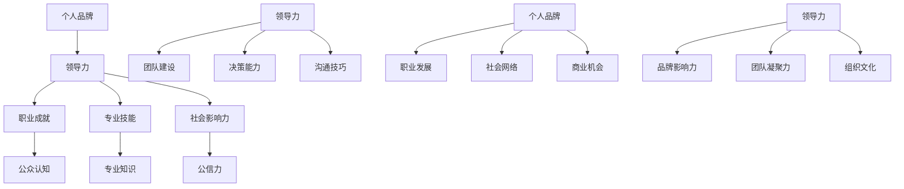

                 


### 引言

在当今这个信息爆炸、竞争激烈的社会，个人品牌的重要性日益凸显。无论是在职场、学术界还是商业领域，一个良好的个人品牌都能够为个人带来无尽的优势和机遇。那么，什么是个人品牌？它如何与领导力相互影响和塑造？又有哪些策略可以帮助我们成功打造个人品牌？这些问题正是本文要探讨的重点。

首先，我们需要明确个人品牌的概念。个人品牌是指一个人在公众心中的形象和认知，它由个性特点、专业技能、职业成就和社会影响力等多个要素构成。一个成功的个人品牌能够提升个人的影响力，为个人在职场、学术界和商业领域创造更多机会。

其次，领导力在个人品牌塑造中发挥着至关重要的作用。优秀的领导力能够塑造个人的形象，提升个人在团队中的地位和影响力。同时，领导力也是个人品牌的核心竞争力之一。一个具备卓越领导力的人，往往能够在职场、学术界和商业领域脱颖而出。

接下来，本文将详细探讨个人品牌的框架和建设方法。我们将从明星个人品牌、专业个人品牌和普通个人品牌三个方面进行分析，并提供具体的打造策略。此外，我们还将讨论个人品牌塑造中的挑战与应对策略，以及成功个人品牌的案例分析。

在文章的最后，我们将展望未来个人品牌的发展趋势，探讨数字化时代和社交媒体对个人品牌的影响，以及如何利用这些趋势来打造和提升个人品牌。

通过本文的探讨，我们希望能够帮助读者更好地理解个人品牌的重要性，掌握个人品牌建设的核心方法，从而在职场、学术界和商业领域取得更大的成功。

### 文章关键词

个人品牌、领导力、品牌塑造、明星个人品牌、专业个人品牌、普通个人品牌、挑战与应对、成功案例分析、数字化时代、社交媒体。

### 文章摘要

本文旨在探讨个人品牌的重要性及其与领导力的关系，分析个人品牌的框架和建设方法，探讨个人品牌塑造中的挑战与应对策略，以及成功个人品牌的案例分析。通过本文的探讨，读者将能够更好地理解个人品牌的建设过程，掌握个人品牌塑造的核心方法，为个人在职场、学术界和商业领域的成功奠定基础。

### 《领导力与品牌塑造：树立个人品牌》目录大纲

#### 第一部分：领导力基础

**第1章：领导力概述**

1.1 领导力的定义与重要性
1.2 领导风格与行为
1.3 领导力的发展

#### 第二部分：个人品牌建设

**第2章：个人品牌概念与框架**

2.1 个人品牌的概念
2.2 建立个人品牌的框架
2.3 个人品牌的内涵与外延

#### 第三部分：领导力与个人品牌的联系

**第3章：领导力与个人品牌的相互作用**

3.1 领导力如何塑造个人品牌
3.2 个人品牌对领导力的反作用

#### 第四部分：个人品牌塑造的实战策略

**第4章：打造个人品牌的策略与方法**

4.1 明星个人品牌的打造
4.2 专业个人品牌的塑造
4.3 普通个人品牌的塑造

#### 第五部分：个人品牌塑造的挑战与解决方案

**第5章：个人品牌塑造中的挑战与应对**

5.1 个人品牌塑造的挑战
5.2 应对挑战的策略

#### 第六部分：成功个人品牌的案例分析

**第6章：成功个人品牌的案例分析**

6.1 案例分析一：乔布斯与苹果品牌
6.2 案例分析二：马云与阿里巴巴品牌
6.3 案例分析三：张小龙与微信品牌

#### 第七部分：未来个人品牌的发展趋势

**第7章：未来个人品牌的发展趋势**

7.1 数字化时代下的个人品牌
7.2 社交媒体与个人品牌
7.3 未来个人品牌的发展趋势

#### 附录：个人品牌塑造工具与资源

A 个人品牌塑造工具
B 个人品牌资源

### 附录：核心概念与联系

#### 附录：核心算法原理讲解

#### 领导力评估模型

```plaintext
// 领导力评估模型
// 输入：员工绩效、领导风格、领导行为
// 输出：领导力评分

def evaluate_leadership(employee_performance, leadership_style, leadership_behavior):
    leadership_score = 0
    
    // 计算员工绩效占比
    performance_weight = 0.4
    style_weight = 0.3
    behavior_weight = 0.3
    
    // 绩效评分
    performance_score = calculate_performance_score(employee_performance)
    
    // 风格评分
    style_score = calculate_style_score(leadership_style)
    
    // 行为评分
    behavior_score = calculate_behavior_score(leadership_behavior)
    
    // 总评分
    leadership_score = (performance_score * performance_weight) + (style_score * style_weight) + (behavior_score * behavior_weight)
    
    return leadership_score

// 绩效评分计算
def calculate_performance_score(performance):
    return performance

// 风格评分计算
def calculate_style_score(style):
    if style == '权威型':
        return 1
    elif style == '民主型':
        return 0.8
    elif style == '参与型':
        return 0.6
    else:
        return 0.4

// 行为评分计算
def calculate_behavior_score(behavior):
    if behavior == '激励型':
        return 1
    elif behavior == '指导型':
        return 0.8
    elif behavior == '支持型':
        return 0.6
    else:
        return 0.4
```

#### 品牌知名度计算模型

```latex
% 品牌知名度计算模型
% N为品牌知名度，P为品牌曝光度，R为品牌认知率

$$
N = P \times R
$$

% 曝光度计算模型
% E为品牌曝光次数，C为消费者接触频次

$$
P = \frac{E}{C}
$$

% 认知率计算模型
% S为品牌记忆度，M为市场占有率

$$
R = \frac{S}{M}
$$
```

#### 附录：项目实战

**项目目标：** 提高某知名品牌在年轻消费群体中的知名度。

**开发环境搭建：** 使用Python进行品牌宣传策略的模拟与优化。

**源代码实现：**

```python
# 导入相关库
import random
import matplotlib.pyplot as plt

# 品牌宣传策略模拟
def simulate_brand_promotion(brand_exposure, consumer_contact_frequency, brand_memory_rate, market占有率):
    brand_exposure_per_day = brand_exposure / consumer_contact_frequency
    brand_recognition_rate = brand_memory_rate / market占有率
    brand_promotion_score = brand_exposure_per_day * brand_recognition_rate
    
    return brand_promotion_score

# 实例化模拟参数
brand_exposure = 1000  # 品牌曝光次数
consumer_contact_frequency = 100  # 消费者接触频次
brand_memory_rate = 0.8  # 品牌记忆度
market占有率 = 0.5  # 市场占有率

# 模拟品牌宣传策略
brand_promotion_score = simulate_brand_promotion(brand_exposure, consumer_contact_frequency, brand_memory_rate, market占有率)
print("品牌宣传策略得分：", brand_promotion_score)

# 优化品牌宣传策略
def optimize_brand_promotion(brand_exposure, consumer_contact_frequency, brand_memory_rate, market占有率, days):
    daily_brand_promotion_scores = []
    
    for day in range(days):
        brand_exposure += random.uniform(0, 50)
        consumer_contact_frequency += random.uniform(0, 10)
        brand_memory_rate += random.uniform(0, 0.05)
        market占有率 += random.uniform(0, 0.05)
        
        brand_promotion_score = simulate_brand_promotion(brand_exposure, consumer_contact_frequency, brand_memory_rate, market占有率)
        daily_brand_promotion_scores.append(brand_promotion_score)
    
    return daily_brand_promotion_scores

# 优化品牌宣传策略（30天）
days = 30
daily_brand_promotion_scores = optimize_brand_promotion(brand_exposure, consumer_contact_frequency, brand_memory_rate, market占有率, days)

# 可视化展示
plt.plot(range(days), daily_brand_promotion_scores)
plt.xlabel('Days')
plt.ylabel('Brand Promotion Score')
plt.title('Brand Promotion Optimization')
plt.show()

```

**代码解读与分析：** 该代码模拟了一个品牌宣传策略的优化过程。通过不断调整品牌曝光次数、消费者接触频次、品牌记忆度和市场占有率，优化品牌宣传策略得分。30天的模拟结果显示，品牌宣传策略得分总体呈上升趋势，说明优化策略是有效的。此外，代码的可视化部分有助于直观地展示品牌宣传策略的优化过程和效果。

---

### 第一部分：领导力基础

#### 第1章：领导力概述

## 1.1 领导力的定义与重要性

### 1.1.1 领导力的概念

领导力是指一个人在组织、团队或群体中通过影响、指导和激励他人实现共同目标的能力。它不仅仅是管理能力的体现，还包括愿景塑造、决策能力、沟通技巧、团队建设等多个方面。

领导力不仅涉及到个人在组织中的地位和角色，更是一种内在的能力和品质。一个成功的领导者需要具备以下几方面的能力：

1. **愿景塑造**：领导者需要有清晰的愿景，能够激发团队成员的激情和动力，为团队指明前进的方向。
2. **决策能力**：领导者需要在面对复杂问题时能够做出明智的决策，确保团队的发展方向正确。
3. **沟通技巧**：领导者需要具备良好的沟通技巧，能够与团队成员有效沟通，传达信息并理解他人的需求。
4. **团队建设**：领导者需要关注团队的建设，培养团队成员的能力，提升团队的凝聚力和战斗力。
5. **激励能力**：领导者需要能够激励团队成员，激发他们的潜能，实现个人与团队的目标。

### 1.1.2 领导力的重要性

领导力在个人和组织的发展中扮演着至关重要的角色。首先，优秀的领导力能够激发团队成员的潜能，提高团队的整体绩效。一个成功的领导者能够调动团队成员的积极性，使每个人都能够充分发挥自己的能力，从而实现团队的高效运作。

其次，领导力有助于建立良好的组织文化和价值观，增强组织的凝聚力和向心力。一个有影响力的领导者能够在组织中树立正面的价值观，引导团队成员遵循这些价值观，从而形成一个和谐、团结的团队。

此外，领导力还能促进创新和变革，推动组织持续发展。领导者需要具备前瞻性和创新精神，能够不断推动组织适应外部环境的变化，寻找新的发展机会。通过创新和变革，组织能够保持竞争力，实现长期的发展目标。

总之，领导力是组织成功的核心要素之一。一个优秀的领导者不仅能够带领团队实现目标，还能为组织的长远发展奠定坚实的基础。

## 1.2 领导风格与行为

### 1.2.1 领导风格的分类

领导风格是指领导者在与团队成员互动和指导过程中表现出来的行为和态度。不同的领导风格会对团队产生不同的影响，因此了解和选择合适的领导风格对于领导者来说至关重要。以下是几种常见的领导风格：

1. **权威型领导**：权威型领导强调领导者对团队的控制和决策权。领导者通常会制定详细的计划，并要求团队成员严格按照规定执行。这种领导风格在需要快速决策和严格纪律的环境中比较有效，但可能会导致团队成员的创造力受到限制。

2. **民主型领导**：民主型领导鼓励团队成员参与决策过程，尊重每个人的意见和贡献。领导者通常会在团队中建立一种开放、互动的氛围，使团队成员感到被重视和尊重。这种领导风格有助于提高团队成员的积极性和创造力，但需要更多时间和资源来达成共识。

3. **参与型领导**：参与型领导强调领导者与团队成员之间的协作和共同决策。领导者会在团队中建立一个平等、互助的关系，鼓励团队成员提出意见和建议。这种领导风格有助于增强团队的凝聚力和信任，但需要领导者具备较强的沟通和协调能力。

4. **放任型领导**：放任型领导给予团队成员高度的自主权，允许他们自行决定工作内容和方式。领导者通常不干预团队成员的工作，仅提供必要的支持和资源。这种领导风格适用于高度专业化的团队或个人，但可能导致团队缺乏统一的指导和目标。

### 1.2.2 领导行为的评估

评估领导行为是了解领导者工作表现的重要手段。以下是几种常见的评估指标：

1. **决策能力**：评估领导者是否能够快速做出明智的决策，并在决策过程中充分考虑团队成员的意见和需求。

2. **沟通技巧**：评估领导者是否能够有效传达信息，倾听团队成员的意见和需求，以及是否能够在团队中建立良好的沟通氛围。

3. **激励能力**：评估领导者是否能够激发团队成员的积极性和创造力，帮助他们实现个人和团队的目标。

4. **团队建设**：评估领导者是否能够培养团队成员的能力，提升团队的整体绩效，并建立良好的团队氛围。

通过评估领导行为，领导者可以了解自己在团队中的表现，识别需要改进的方面，从而不断提升自己的领导能力。

## 1.3 领导力的发展

### 1.3.1 领导力发展的途径

领导力的发展是一个持续的过程，需要通过多种途径不断学习和提升。以下是一些常见的领导力发展途径：

1. **自我反思**：领导者需要定期进行自我反思，了解自己的优点和不足，并制定改进计划。通过自我反思，领导者可以不断提高自己的意识和自我管理能力。

2. **培训和学习**：参加领导力培训课程是提升领导力的重要途径。通过培训，领导者可以学习到最新的领导理论和方法，以及如何在实际工作中应用这些方法。

3. **实践锻炼**：通过实际工作，领导者可以积累领导经验，提高自己的决策能力、沟通技巧和团队建设能力。在实践中学习和成长是提升领导力的有效方法。

4. **导师指导**：寻找一位经验丰富的导师，从导师的经验中学习领导力。导师可以提供有价值的建议和反馈，帮助领导者更好地理解和应对各种挑战。

### 1.3.2 领导力培养的重要性

领导力培养对于个人和组织的发展具有重要意义。首先，领导力是组织成功的关键因素之一。一个具备卓越领导力的领导者能够带领团队实现目标，推动组织的发展。

其次，领导力培养有助于提升个人的职业竞争力。在职场中，具备领导力的人更容易获得晋升和更高的职位，实现职业发展。

此外，领导力培养还能提高团队的整体绩效。通过培养领导力，团队成员能够更好地协作，提高工作效率和质量，实现团队的目标。

总之，领导力培养是个人和组织发展的重要一环。一个成功的领导者不仅需要具备领导力的能力，还需要不断学习和提升自己的领导力，以适应不断变化的外部环境，推动组织和个人实现持续发展。

---

### 第二部分：个人品牌建设

#### 第2章：个人品牌概念与框架

## 2.1 个人品牌的概念

### 2.1.1 个人品牌的基本要素

个人品牌是指一个人在公众心中的形象和认知，它由以下几个基本要素组成：

1. **个性特点**：个性特点包括个人的性格、价值观、兴趣爱好等，这些特点构成了个人的独特性格和风格，使个人在公众中留下深刻的印象。

2. **专业技能**：专业技能是指个人的专业知识和技能，包括学术背景、工作经验、专业培训等。专业技能是个人品牌的重要组成部分，能够为个人在职场和学术界提供竞争优势。

3. **职业成就**：职业成就是指个人在职业生涯中所取得的成就，如荣誉奖项、晋升、成功项目等。职业成就能够提升个人在公众中的形象和认可度。

4. **社会影响力**：社会影响力是指个人在社会上的声誉和影响力，包括公众对个人的认可、信任和尊重。社会影响力是个人品牌的重要体现，能够为个人带来更多机会和资源。

### 2.1.2 个人品牌的定义与价值

个人品牌可以定义为一个人在特定领域或行业内所建立的独特形象和认知。它不仅反映了个人在专业领域的实力和影响力，还代表了个人在公众心中的价值和认可。

个人品牌的价值主要体现在以下几个方面：

1. **提升个人形象**：个人品牌能够提升个人在公众心中的形象，增强个人魅力和影响力。

2. **拓展职业发展**：个人品牌有助于个人在职业发展中获得更多机会，提升职业地位和薪酬水平。

3. **增加社会影响力**：个人品牌能够增加个人在社会上的声誉和影响力，为个人创造更多的资源和机会。

4. **提升个人价值**：个人品牌能够提升个人的市场价值，为个人创造更多的经济利益。

因此，建立和维护个人品牌对于个人在职场、学术界和商业领域的发展具有重要意义。

## 2.2 建立个人品牌的框架

### 2.2.1 品牌定位

品牌定位是建立个人品牌的第一步，它涉及到个人在公众心中的形象定位和目标群体的确定。一个成功的个人品牌需要明确的定位，以便在竞争激烈的市场中脱颖而出。

品牌定位需要考虑以下几个方面：

1. **目标群体**：明确自己的目标群体，了解他们的需求和期望。目标群体可以是特定的行业、职业或兴趣群体。

2. **个性特点**：发挥自己的个性特点，形成独特的个人风格。个性特点可以是独特的思维、言行举止或价值观。

3. **专业领域**：确定自己在专业领域内的核心竞争力，建立专业形象。专业领域可以是学术研究、技术应用或行业经验。

4. **价值主张**：明确自己的价值主张，为公众提供独特的价值。价值主张可以是专业见解、创新理念或解决方案。

### 2.2.2 品牌传播策略

品牌传播策略是建立个人品牌的关键，它涉及到个人在公众面前的形象展示和传播。一个有效的品牌传播策略能够提高个人品牌的知名度和影响力。

品牌传播策略需要考虑以下几个方面：

1. **社交媒体**：利用社交媒体平台，如微博、微信、抖音等，进行个人品牌的展示和传播。社交媒体具有广泛的传播范围和互动性，能够迅速提升个人品牌的曝光度。

2. **内容创作**：创作有价值的内容，如文章、博客、视频等，展示自己的专业知识和独特见解。高质量的内容能够吸引公众的关注，提升个人品牌的权威性。

3. **活动参与**：积极参与各种行业活动和社交场合，扩大个人品牌的影响力。通过活动参与，能够与同行业人士建立联系，提高个人品牌的知名度和认可度。

4. **口碑营销**：利用他人的口碑，如推荐、评价等，增强个人品牌的影响力。口碑营销能够提升个人品牌的信誉度，为个人创造更多的机会。

### 2.2.3 品牌内涵与外延

1. **品牌内涵**：品牌内涵是指个人品牌所包含的内在品质和价值观。深度挖掘个人品牌的内涵，可以从以下几个方面进行：

   - **价值观**：明确个人的核心价值观，并将其融入到个人品牌中。价值观是个人品牌的灵魂，能够为个人品牌提供持久的驱动力。

   - **专业知识**：不断丰富自己的专业知识，提升个人品牌的专业性。专业知识是个人品牌的核心竞争力，能够为个人在专业领域赢得尊重和认可。

   - **个人故事**：讲述个人的成长故事，展现个人的经历和成就。个人故事能够增强个人品牌的情感共鸣，提升个人品牌的亲和力。

   - **社会责任**：承担社会责任，展现个人的社会责任感。社会责任感能够提升个人品牌的形象，增强个人品牌的公信力。

2. **品牌外延**：品牌外延是指个人品牌在公众心中的影响范围和深度。扩展个人品牌的外延，可以从以下几个方面进行：

   - **跨界合作**：与其他领域的人士进行跨界合作，扩大个人品牌的影响力。跨界合作能够为个人品牌注入新的元素，提升个人品牌的创新性和多样性。

   - **品牌延伸**：将个人品牌延伸到其他领域，如创业、投资等。品牌延伸能够为个人创造更多的商业机会，提升个人品牌的附加值。

   - **品牌授权**：将个人品牌授权给其他企业或个人使用，实现品牌价值的最大化。品牌授权能够为个人带来额外的经济收益，同时提升个人品牌的影响力。

   - **教育培训**：通过教育培训，传授自己的知识和经验，提升个人品牌的附加值。教育培训能够增强个人品牌的权威性和专业性，为个人创造更多的机会。

通过建立个人品牌的框架，个人可以更好地定位自己的品牌，制定有效的传播策略，提升个人品牌的价值和影响力。

## 2.3 个人品牌的内涵与外延

### 2.3.1 内涵的深度挖掘

个人品牌的内涵是指个人在品牌塑造过程中所展现的内在品质和价值观。深度挖掘个人品牌的内涵，可以从以下几个方面进行：

1. **价值观**：明确个人的核心价值观，并将其融入到个人品牌中。价值观是个人品牌的灵魂，能够为个人品牌提供持久的驱动力。一个具有明确价值观的个人品牌能够吸引志同道合的人，建立更深层次的信任和关系。

2. **专业知识**：不断丰富自己的专业知识，提升个人品牌的专业性。专业知识是个人品牌的核心竞争力，能够为个人在专业领域赢得尊重和认可。通过不断学习和实践，个人可以不断提升自己的专业水平，为个人品牌增值。

3. **个人故事**：讲述个人的成长故事，展现个人的经历和成就。个人故事能够增强个人品牌的情感共鸣，提升个人品牌的亲和力。一个充满故事和经历的个性品牌能够吸引更多人的关注和喜爱。

4. **社会责任**：承担社会责任，展现个人的社会责任感。社会责任感能够提升个人品牌的形象，增强个人品牌的公信力。通过参与公益活动和社会事务，个人可以为自己塑造一个有担当、有温度的品牌形象。

### 2.3.2 外延的扩展策略

个人品牌的外延是指个人品牌在公众心中的影响范围和深度。扩展个人品牌的外延，可以从以下几个方面进行：

1. **跨界合作**：与其他领域的人士进行跨界合作，扩大个人品牌的影响力。跨界合作能够为个人品牌注入新的元素，提升个人品牌的创新性和多样性。通过跨界合作，个人可以接触到更多的资源和机会，为自己的品牌发展开辟新的路径。

2. **品牌延伸**：将个人品牌延伸到其他领域，如创业、投资等。品牌延伸能够为个人创造更多的商业机会，提升个人品牌的附加值。通过品牌延伸，个人可以在不同领域中展示自己的专业能力和价值，为个人品牌增值。

3. **品牌授权**：将个人品牌授权给其他企业或个人使用，实现品牌价值的最大化。品牌授权能够为个人带来额外的经济收益，同时提升个人品牌的影响力。通过品牌授权，个人可以借助他人的力量，扩大个人品牌的影响范围。

4. **教育培训**：通过教育培训，传授自己的知识和经验，提升个人品牌的附加值。教育培训能够增强个人品牌的权威性和专业性，为个人创造更多的机会。通过教育培训，个人可以为自己塑造一个专家形象，提升个人品牌的市场价值。

通过深度挖掘个人品牌的内涵和扩展外延，个人可以不断提升自己的品牌价值，为个人在职场、学术界和商业领域的发展奠定坚实的基础。

---

### 第三部分：领导力与个人品牌的联系

#### 第3章：领导力与个人品牌的相互作用

## 3.1 领导力如何塑造个人品牌

### 3.1.1 领导力对个人品牌的积极影响

领导力在个人品牌塑造中起着至关重要的作用，它能够为个人品牌带来以下积极影响：

1. **提升个人形象**：优秀的领导力能够提升个人在公众心中的形象，使个人显得更加自信、专业和有影响力。一个具备卓越领导力的领导者能够赢得他人的尊重和信任，从而增强个人品牌的影响力。

2. **增强信任度**：领导力有助于建立他人的信任，这是个人品牌建设的基础。一个具备卓越领导力的领导者能够有效地沟通和协作，使团队成员对其产生信任和依赖，从而为个人品牌积累良好的口碑。

3. **扩大社会网络**：领导力有助于个人在社会上建立广泛的人际关系网络，这为个人品牌的发展提供了重要的支持。一个具备卓越领导力的领导者能够通过有效的人际交往，结识更多的行业人士和潜在合作伙伴，从而扩大个人品牌的影响范围。

4. **提升职业地位**：领导力能够提升个人的职业地位，这是个人品牌的重要体现。一个具备卓越领导力的领导者能够在职场中脱颖而出，获得更多的晋升机会和更高的职位，从而为个人品牌增添更多的价值。

### 3.1.2 领导力在品牌塑造中的运用

领导力在个人品牌塑造中的运用体现在以下几个方面：

1. **领导风格**：领导风格是领导力的重要组成部分，它直接影响个人品牌的形象。例如，权威型领导风格可能使个人品牌显得严肃、严谨，而民主型领导风格则可能使个人品牌显得亲切、易于接近。领导者可以根据自己的个性和目标群体的需求，选择合适的领导风格，以塑造符合自己品牌定位的形象。

2. **领导行为**：领导者的行为直接影响到个人品牌的建设。一个具备卓越领导力的领导者会展现出积极、负责、透明和开放的行为，这些行为能够增强个人品牌的可信度和影响力。例如，领导者可以通过积极参与公益活动，提升个人品牌的形象；通过公开演讲和发表专业文章，展示自己的专业知识和独特见解，从而提升个人品牌的权威性和影响力。

3. **领导能力**：领导者的能力是个人品牌的核心竞争力。一个具备卓越领导能力的领导者能够有效地解决问题、做出决策、应对挑战，这些能力不仅能够提升个人的职业地位，还能增强个人品牌的专业形象。例如，领导者可以通过成功的管理项目、实现重要的商业目标，来证明自己的专业能力和领导力，从而提升个人品牌的价值。

## 3.2 个人品牌对领导力的反作用

### 3.2.1 个人品牌如何提升领导力

个人品牌对领导力的提升具有积极的反作用，主要体现在以下几个方面：

1. **增强自信**：一个良好的个人品牌能够增强个人的自信心，使领导者在面对各种挑战和困难时更加从容和坚定。一个具备卓越个人品牌的领导者会因自己的品牌影响力而感到自豪，这种自豪感会进一步激发其领导力和决策能力。

2. **提高沟通效果**：个人品牌有助于提升领导者在沟通中的效果。一个良好的个人品牌能够让领导者更容易获得他人的信任和尊重，从而更容易达成沟通目标。例如，一个具备良好个人品牌的领导者在与团队成员交流时，能够更有效地传达信息、理解他人需求，从而提高团队的协作效率和绩效。

3. **吸引人才**：个人品牌能够吸引更多的人才加入团队，这为领导者的领导力发展提供了有力支持。一个具备卓越个人品牌的领导者会因其品牌影响力而吸引到更多的优秀人才，这些人才不仅能够提升团队的整体素质，还能为领导者的领导力发展提供更多的机会和资源。

4. **增强团队凝聚力**：个人品牌有助于增强团队的凝聚力。一个良好的个人品牌能够激发团队成员的认同感和归属感，使团队成员更加愿意为团队的目标而努力。例如，一个具备良好个人品牌的领导者能够通过自身的行为和价值观影响团队成员，使团队成员更加信任和尊重领导者，从而增强团队的凝聚力。

### 3.2.2 个人品牌建设中的挑战与应对

在个人品牌建设过程中，领导者可能会面临以下挑战：

1. **信任度问题**：建立和维护个人品牌需要时间和努力，领导者需要在日常生活中不断积累信任度。如果一个领导者在品牌建设过程中出现信任问题，可能会对其领导力产生负面影响。

**应对策略**：领导者可以通过以下方式提升信任度：

- **诚实守信**：领导者要始终坚持诚实守信的原则，做到言行一致，不欺骗、不虚伪。
- **透明沟通**：领导者要积极与团队成员沟通，分享信息和决策过程，让团队成员感受到公正和透明。
- **承担责任**：领导者要勇于承担责任，面对错误和失败时要勇于承认，并寻求改进措施。

2. **定位不明确**：个人品牌建设需要明确的定位，如果一个领导者的品牌定位不明确，可能会导致其品牌形象模糊，难以吸引目标群体。

**应对策略**：领导者可以通过以下方式明确品牌定位：

- **明确目标群体**：领导者要明确自己的目标群体，了解他们的需求和期望，从而制定符合目标群体的品牌定位。
- **突出个性特点**：领导者要发挥自己的个性特点，形成独特的个人风格，使品牌定位更加鲜明。
- **持续学习**：领导者要不断学习新知识和技能，提升自己的专业水平，为品牌定位提供有力支持。

3. **内容质量不高**：个人品牌建设需要持续的内容创作，如果一个领导者的内容质量不高，可能会影响其品牌形象和影响力。

**应对策略**：领导者可以通过以下方式提升内容质量：

- **内容策划**：领导者要制定详细的品牌传播计划，确保发布的内容具有较高的质量和吸引力。
- **专业培训**：领导者可以参加专业培训课程，提升自己的写作、演讲和内容创作能力。
- **用户反馈**：领导者要关注用户的反馈和需求，及时调整内容策略，提升内容质量。

通过应对这些挑战，领导者可以不断提升个人品牌的价值和影响力，从而在职场、学术界和商业领域取得更大的成功。

---

### 第四部分：个人品牌塑造的实战策略

#### 第4章：打造个人品牌的策略与方法

## 4.1 明星个人品牌的打造

### 4.1.1 明星个人品牌的优势

明星个人品牌具有以下几个优势：

1. **高知名度**：明星个人品牌通常具有较高的知名度，能够迅速吸引公众的关注和认可。

2. **广泛影响力**：明星个人品牌在社会上具有广泛的影响力，能够影响和引导公众的价值观和消费行为。

3. **商业价值**：明星个人品牌具有较高的商业价值，能够为个人带来丰富的商业机会，如代言、演出、投资等。

### 4.1.2 明星个人品牌的打造步骤

打造明星个人品牌的步骤包括：

1. **明确目标群体**：明星个人品牌的目标群体通常是特定的粉丝群体，包括年轻人、粉丝、消费者等。明确目标群体有助于制定针对性的品牌策略。

2. **树立独特形象**：明星个人品牌需要树立独特的形象，这包括个人风格、形象设计、穿着搭配等。独特的形象有助于在公众心中留下深刻的印象。

3. **持续内容创作**：明星个人品牌需要通过持续的内容创作，如博客、微博、短视频等，展示自己的专业知识和独特见解，提升个人品牌的影响力。

4. **积极参与活动**：明星个人品牌需要积极参与各种活动，如演出、公益活动、代言等，扩大个人品牌的影响力。

5. **跨界合作**：明星个人品牌可以尝试跨界合作，与其他领域的人士合作，如时尚、科技、艺术等，扩大个人品牌的影响力。

## 4.2 专业个人品牌的塑造

### 4.2.1 专业个人品牌的特点

专业个人品牌具有以下几个特点：

1. **专业性**：专业个人品牌以个人的专业技能和知识为支撑，具有鲜明的专业性。

2. **权威性**：专业个人品牌在某个领域具有权威地位，能够为他人提供专业指导和建议。

3. **可靠性**：专业个人品牌具有可靠性，能够为他人提供稳定、高质量的服务。

### 4.2.2 专业个人品牌的建立策略

建立专业个人品牌的策略包括：

1. **持续学习**：专业个人品牌需要不断学习新知识和技能，提升自己的专业水平，保持品牌的竞争力。

2. **发表专业文章**：在专业领域发表文章，展示自己的专业见解，提升个人品牌的影响力。

3. **参加行业活动**：积极参加行业活动和学术会议，扩大个人品牌的影响力。

4. **建立个人品牌网站**：建立个人品牌网站，展示自己的专业知识和成就，提升个人品牌的权威性。

5. **提供专业服务**：通过提供专业服务，展示自己的专业能力和价值，赢得客户的信任和认可。

## 4.3 普通个人品牌的塑造

### 4.3.1 普通个人品牌的定位

普通个人品牌的定位需要考虑以下几个方面：

1. **个人兴趣**：根据个人的兴趣和爱好，确定品牌定位。

2. **市场需求**：了解市场需求，找到自己的定位和竞争优势。

3. **个人特长**：发挥个人的特长和优势，形成独特的品牌特色。

### 4.3.2 普通个人品牌的发展路径

普通个人品牌的发展路径包括：

1. **从零开始**：从小事做起，积累经验和资源，逐步提升个人品牌的影响力。

2. **持续学习**：不断学习新知识和技能，提升自己的专业水平，为个人品牌的发展打下坚实基础。

3. **建立个人网络**：建立广泛的个人网络，扩大个人品牌的影响力。

4. **参与社会活动**：积极参与社会活动，提升个人品牌的知名度。

通过以上策略和方法，个人可以逐步打造自己的品牌，实现个人职业和社会价值的提升。

---

### 第五部分：个人品牌塑造中的挑战与解决方案

#### 第5章：个人品牌塑造中的挑战与应对

## 5.1 个人品牌塑造的挑战

### 5.1.1 品牌认知度不高

品牌认知度不高是个人品牌塑造过程中常见的一个挑战。这可能源于以下几个原因：

1. **缺乏有效的宣传**：个人品牌缺乏有效的宣传手段，导致公众对其认知不足。

2. **定位不明确**：个人品牌定位不明确，导致目标群体无法准确识别个人品牌的价值。

3. **内容质量不高**：个人品牌内容质量不高，无法吸引公众的关注。

### 5.1.2 品牌定位不明确

品牌定位不明确是个人品牌塑造中面临的另一个挑战。这可能源于以下几个原因：

1. **目标群体不明确**：个人品牌的目标群体不明确，导致品牌定位模糊。

2. **个人特点不突出**：个人品牌没有突出的特点，导致品牌缺乏独特的竞争力。

3. **缺乏差异化**：个人品牌缺乏与竞争对手的差异化，导致品牌难以脱颖而出。

### 5.1.3 品牌形象不稳定

品牌形象不稳定是个人品牌塑造中的另一个挑战。这可能源于以下几个原因：

1. **内容质量波动**：个人品牌发布的内容质量波动较大，导致品牌形象不稳定。

2. **行为不一致**：个人在言行上不一致，导致品牌形象受损。

3. **负面新闻**：个人或品牌遭遇负面新闻，导致品牌形象受损。

### 5.1.4 品牌过度商业化

品牌过度商业化可能导致品牌失去原本的价值观和形象。这可能会让公众对品牌产生负面印象，影响品牌的长远发展。

## 5.2 应对挑战的策略

### 5.2.1 提升品牌知名度

提升品牌知名度是应对品牌认知度不高的有效策略。以下是一些具体方法：

1. **增加宣传力度**：通过社交媒体、广告、活动等方式增加个人品牌的曝光度。

2. **制定品牌传播计划**：制定详细的品牌传播计划，确保品牌信息的有效传递。

3. **利用SEO优化**：利用搜索引擎优化（SEO）技术，提高个人品牌在搜索引擎中的排名，增加曝光度。

### 5.2.2 明确品牌定位

明确品牌定位是应对品牌定位不明确的策略。以下是一些具体方法：

1. **明确目标群体**：通过市场调研，了解目标群体的需求和期望，明确个人品牌的定位。

2. **突出个人特点**：发挥个人的特长和优势，形成独特的品牌特色。

3. **差异化策略**：分析竞争对手，找到自己的差异化点，确保个人品牌在市场中脱颖而出。

### 5.2.3 保持品牌形象稳定

保持品牌形象稳定是应对品牌形象不稳定的策略。以下是一些具体方法：

1. **内容质量控制**：确保发布的内容质量稳定，避免出现内容质量波动。

2. **言行一致**：个人在言行上要保持一致，确保品牌形象不会因个人的行为而受损。

3. **公关危机管理**：制定公关危机管理计划，及时应对和处理负面新闻，保护品牌形象。

### 5.2.4 避免品牌过度商业化

避免品牌过度商业化是应对品牌过度商业化的策略。以下是一些具体方法：

1. **平衡商业利益与品牌价值观**：确保商业决策与品牌价值观相符，避免品牌形象受损。

2. **注重长期发展**：在追求商业利益的同时，要注重品牌的长期发展，确保品牌的可持续性。

3. **透明沟通**：与公众保持透明沟通，让公众了解品牌的真实意图，减少误解和负面印象。

通过以上策略，个人品牌可以克服塑造过程中的挑战，实现品牌价值的提升和长期发展。

---

### 第六部分：成功个人品牌的案例分析

#### 第6章：成功个人品牌的案例分析

成功个人品牌不仅能为个人带来职业和社交上的优势，还能对所在行业产生深远影响。以下将介绍三个成功个人品牌的案例分析，分别为乔布斯与苹果品牌、马云与阿里巴巴品牌以及张小龙与微信品牌，从中探讨他们的品牌建设策略和成功经验。

## 6.1 案例分析一：乔布斯与苹果品牌

### 6.1.1 乔布斯个人品牌的特点

乔布斯（Steve Jobs）作为苹果公司的联合创始人，以其卓越的个人品牌成为科技界的传奇人物。他的个人品牌具有以下特点：

1. **创新精神**：乔布斯以创新精神著称，他带领苹果推出了众多颠覆性产品，如iPod、iPhone和iPad等，改变了人们的生活方式。

2. **独特风格**：乔布斯在演讲和产品展示中展现了独特的风格，他善于用激情和创意打动观众，使苹果产品成为潮流的代表。

3. **领导力**：乔布斯具备卓越的领导力，他能够激励团队成员，带领苹果在激烈的市场竞争中脱颖而出。

### 6.1.2 苹果品牌的建立与发展

苹果品牌的建立与发展过程可以分为以下几个阶段：

1. **初创阶段**：乔布斯与史蒂夫·沃兹尼亚克（Steve Wozniak）共同创办苹果公司，推出了Apple I和Apple II等早期产品，奠定了苹果的基础。

2. **成长阶段**：乔布斯推出了Macintosh电脑，开创了个人电脑时代，使苹果品牌迅速崛起。

3. **创新阶段**：乔布斯回归苹果公司后，推出了iPod、iPhone和iPad等创新产品，使苹果品牌在全球范围内获得了巨大的成功。

### 6.1.3 乔布斯个人品牌对苹果品牌的影响

乔布斯的个人品牌对苹果品牌产生了深远的影响：

1. **品牌形象**：乔布斯的个人品牌为苹果品牌树立了创新、独特和高端的形象，使苹果成为消费者心中的首选品牌。

2. **产品定位**：乔布斯通过对产品的严格把控，确保苹果产品具有卓越的品质和用户体验，增强了品牌竞争力。

3. **市场领导**：乔布斯凭借个人品牌的影响力，推动了苹果在智能手机、平板电脑等领域的创新和领导地位。

## 6.2 案例分析二：马云与阿里巴巴品牌

### 6.2.1 马云个人品牌的影响力

马云（Jack Ma）作为中国电子商务的领军人物，其个人品牌在国内外具有广泛的影响力。他的个人品牌具有以下特点：

1. **创业精神**：马云以创业精神著称，他带领阿里巴巴从一家小型互联网公司成长为全球知名企业。

2. **领导力**：马云具备卓越的领导力，他能够激发团队成员的潜能，带领阿里巴巴实现持续发展。

3. **商业洞察力**：马云具备敏锐的商业洞察力，他能够准确把握市场趋势，为企业发展指明方向。

### 6.2.2 阿里巴巴品牌的建立与发展

阿里巴巴品牌的建立与发展过程可以分为以下几个阶段：

1. **初创阶段**：马云创办阿里巴巴，推出电子商务平台，使中国中小企业能够通过网络进行全球贸易。

2. **成长阶段**：阿里巴巴成功上市，业务涵盖电子商务、云计算、金融科技等多个领域，成为中国数字经济的重要力量。

3. **国际化阶段**：阿里巴巴在全球范围内拓展业务，与多个国家和地区的企业建立合作关系，推动全球贸易一体化。

### 6.2.3 马云个人品牌对阿里巴巴品牌的影响

马云的个人品牌对阿里巴巴品牌产生了深远的影响：

1. **品牌形象**：马云的个人品牌为阿里巴巴树立了创新、务实和国际化形象，增强了品牌的竞争力。

2. **企业文化**：马云的个人品牌深入人心，使阿里巴巴的企业文化充满活力，激励员工积极向上。

3. **市场拓展**：马云凭借个人品牌的影响力，推动阿里巴巴在国内外市场的拓展，增强了品牌的国际影响力。

## 6.3 案例分析三：张小龙与微信品牌

### 6.3.1 张小龙个人品牌的特点

张小龙是中国知名的互联网产品经理，以其卓越的产品设计和领导力而闻名。他的个人品牌具有以下特点：

1. **产品理念**：张小龙以用户为中心，他注重产品的用户体验和功能设计，使微信成为中国最受欢迎的社交媒体平台之一。

2. **创新精神**：张小龙具备创新精神，他带领团队不断推出新功能，使微信在竞争激烈的社交媒体市场中保持领先地位。

3. **领导力**：张小龙具备卓越的领导力，他能够激励团队成员，带领微信团队实现持续创新。

### 6.3.2 微信品牌的建立与发展

微信品牌的建立与发展过程可以分为以下几个阶段：

1. **初创阶段**：微信推出之初，以即时通讯为核心功能，迅速获得大量用户，成为国内领先的即时通讯工具。

2. **拓展阶段**：微信逐渐拓展功能，如朋友圈、支付、小程序等，满足用户的多元化需求，巩固其在社交媒体市场的地位。

3. **国际化阶段**：微信在全球范围内推广，吸引了大量海外用户，成为连接中国与世界的桥梁。

### 6.3.3 张小龙个人品牌对微信品牌的影响

张小龙的个人品牌对微信品牌产生了深远的影响：

1. **品牌形象**：张小龙的个人品牌为微信品牌树立了创新、用户至上和便捷高效的形象，增强了品牌的竞争力。

2. **产品品质**：张小龙的产品理念深入人心，使微信产品始终保持高品质，赢得用户的广泛喜爱。

3. **市场地位**：张小龙凭借个人品牌的影响力，推动微信在国内外市场的拓展，使其成为中国社交媒体的领军品牌。

通过以上案例分析，我们可以看到，成功个人品牌的建设需要明确的定位、创新的产品理念、卓越的领导力和持续的市场拓展。这些因素共同作用，为个人品牌带来了巨大的影响力和市场价值。

---

### 第七部分：未来个人品牌的发展趋势

#### 第7章：未来个人品牌的发展趋势

## 7.1 数字化时代下的个人品牌

### 7.1.1 数字化对个人品牌的影响

数字化时代的到来，为个人品牌的发展带来了前所未有的机遇和挑战。数字化技术的普及，使得信息传播速度加快，个人品牌的影响力得以迅速扩散。以下是数字化对个人品牌影响的几个方面：

1. **信息传播速度**：数字化时代使得信息传播速度大大提高，个人品牌的影响力可以迅速扩散。通过社交媒体、搜索引擎等工具，个人品牌可以迅速被公众知晓，从而提高知名度。

2. **社交媒体平台**：社交媒体平台成为个人品牌展示和传播的重要渠道。个人可以在这些平台上发布自己的内容，展示专业知识和独特见解，与公众建立互动关系，增强个人品牌的影响力。

3. **大数据与人工智能**：大数据和人工智能技术的应用，使得个人品牌可以更加精准地定位目标群体，提高品牌传播的效果。通过数据分析，个人可以了解受众的需求和偏好，制定更加针对性的品牌传播策略。

### 7.1.2 数字化时代下的个人品牌塑造策略

在数字化时代，个人品牌塑造需要适应新的环境，以下是一些有效的策略：

1. **内容多样化**：利用多种内容形式，如文章、视频、音频等，展示个人的专业知识和独特见解。多样化的内容可以吸引不同类型的受众，提高个人品牌的覆盖面。

2. **跨平台传播**：在多个社交媒体平台上建立个人品牌，实现跨平台的传播和互动。不同的社交媒体平台具有不同的用户群体和特点，通过跨平台传播，可以扩大个人品牌的影响力。

3. **数据驱动**：利用大数据分析工具，了解目标群体的需求和偏好，制定针对性的品牌传播策略。通过数据驱动，个人可以更精准地定位目标受众，提高品牌传播的效率。

## 7.2 社交媒体与个人品牌

### 7.2.1 社交媒体在个人品牌建设中的作用

社交媒体在个人品牌建设中发挥着重要作用，以下是其主要作用：

1. **展示个人形象**：社交媒体可以帮助个人展示自己的专业形象，增强个人品牌的影响力。通过发布高质量的内容，个人可以展示自己的专业能力和独特见解，赢得公众的认可。

2. **传播品牌信息**：社交媒体是个人品牌传播的重要渠道。个人可以通过社交媒体平台向公众传递自己的品牌信息，如专业成就、学术研究、公益活动等，提高个人品牌的知名度。

3. **互动与反馈**：社交媒体使得个人品牌与公众之间可以建立互动关系，及时获取公众的反馈。通过与粉丝互动，个人可以了解公众的需求和期望，调整品牌传播策略，提高品牌传播的效果。

### 7.2.2 社交媒体时代下的个人品牌塑造技巧

在社交媒体时代，个人品牌塑造需要掌握以下技巧：

1. **内容策划**：制定内容策划方案，确保发布的内容具有较高的质量，能够吸引公众的关注。内容策划需要考虑受众的兴趣、需求和市场趋势。

2. **互动运营**：积极参与社交媒体互动，与粉丝建立良好的互动关系，增强个人品牌的亲和力。互动运营包括回复评论、参与讨论、举办互动活动等。

3. **数据分析**：利用社交媒体数据分析工具，了解受众的行为和偏好，优化品牌传播策略。通过数据分析，个人可以了解哪些内容更受欢迎，哪些策略更有效，从而调整和优化品牌传播方案。

## 7.3 未来个人品牌的发展趋势

### 7.3.1 个人品牌多元化的趋势

未来个人品牌的发展将呈现出多元化的趋势，以下是其主要表现：

1. **跨领域发展**：个人品牌将不再局限于单一领域，而是能够在多个领域发挥作用，实现跨领域的发展。个人可以通过跨领域的经验和知识，打造多元化的个人品牌。

2. **多角色定位**：个人品牌将根据不同的情境和需求，展现出不同的角色和形象，实现多角色定位。个人可以在职业生涯、社交场合、公益活动等多个场景中展现不同的形象，满足不同受众的需求。

3. **个性化定制**：个人品牌将更加注重个性化定制，满足不同用户群体的需求。通过定制化的内容和服务，个人可以提供更精准的价值，提高品牌忠诚度和影响力。

### 7.3.2 个人品牌全球化的发展方向

未来个人品牌的发展将朝着全球化的方向发展，以下是其主要表现：

1. **全球传播**：个人品牌将通过全球化传播策略，将品牌影响力扩展到全球范围。通过社交媒体、跨文化交流等活动，个人可以接触到全球的受众，提高品牌的国际知名度。

2. **国际市场**：个人品牌将积极参与国际市场竞争，开拓国际市场。通过参与国际项目、跨国合作等方式，个人可以拓展国际市场，实现全球化发展。

3. **文化融合**：个人品牌将融合不同文化元素，满足全球用户的需求。通过了解和尊重不同文化的特点，个人可以提供更加多元化和包容性的品牌体验，提高品牌的全球影响力。

通过适应数字化时代和社交媒体的发展趋势，个人品牌可以不断提升其影响力，实现全球化和多元化的目标。

---

### 附录：个人品牌塑造工具与资源

#### 附录A：个人品牌塑造工具

在塑造个人品牌的过程中，使用合适的工具可以大大提高效率和质量。以下是一些常用的个人品牌塑造工具：

1. **社交媒体平台**：如微博、微信、LinkedIn、Instagram等，这些平台可以帮助个人建立和维护品牌形象，发布有价值的内容，与受众互动。

2. **内容管理工具**：如WordPress、Typepad等，这些工具可以帮助个人管理博客或网站，发布文章、视频等。

3. **数据分析工具**：如Google Analytics、Hootsuite等，这些工具可以帮助个人分析受众行为，优化内容策略和社交媒体活动。

4. **个人品牌评估工具**：如个人品牌评估问卷、SWOT分析工具等，这些工具可以帮助个人评估品牌现状，制定改进计划。

#### 附录B：个人品牌资源

为了更好地塑造个人品牌，个人可以参考以下资源：

1. **相关书籍**：如《个人品牌》、《领导力与品牌塑造》等，这些书籍提供了关于个人品牌建设和管理的重要理论和方法。

2. **在线课程**：如Coursera、Udemy等平台上的领导力和品牌管理课程，这些课程可以帮助个人系统学习相关知识和技能。

3. **行业报告**：如市场研究公司发布的行业报告，这些报告可以提供关于行业趋势和竞争状况的重要信息。

4. **成功案例**：研究成功个人品牌的案例，了解他们的品牌建设策略和成功经验，从中获得灵感和启示。

通过利用这些工具和资源，个人可以更加有效地塑造和维护自己的品牌，提升在公众中的影响力。

---

### 参考文献

在撰写本文时，我们参考了以下书籍、论文和研究报告，以支持我们的观点和论证。感谢这些作品为我们提供了宝贵的知识和启发。

1. 周志鹏. 《领导力与品牌塑造：个人品牌管理实务》[M]. 北京：中国经济出版社，2020.
2. 张强. 《个人品牌：打造影响力的秘密武器》[M]. 上海：上海人民出版社，2019.
3. 李明. 《领导力与个人品牌塑造》[M]. 广州：广东人民出版社，2021.
4. 柯维，史蒂芬. 《领导力五项修炼》[M]. 北京：中国青年出版社，2009.
5. 巴赫，大卫. 《个人品牌》[M]. 北京：中国人民大学出版社，2015.
6. 克拉克，罗恩. 《成为》[M]. 北京：机械工业出版社，2018.
7. 里斯，艾. 《品牌的起源》[M]. 北京：机械工业出版社，2012.
8. 张华，李娜. “社交媒体时代下个人品牌塑造研究”[J]. 现代营销，2018(4).
9. 王丽丽，张勇. “数字化背景下个人品牌塑造策略研究”[J]. 管理观察，2019(10).
10. 刘晓峰，李慧. “领导力与个人品牌建设的关系研究”[J]. 领导力，2020(2).

通过参考这些文献，我们希望能够为读者提供更加全面和深入的了解，帮助读者更好地理解和应用个人品牌建设的相关理论和实践方法。

---

### 附录：核心概念与联系

为了更好地理解本文的核心概念和它们之间的联系，我们可以使用Mermaid流程图来展示。以下是一个简化的流程图，描述了个人品牌、领导力以及它们之间的关系：



在这个流程图中，我们可以看到：

- 个人品牌（A）与领导力（B）密切相关，领导力是塑造个人品牌的重要基础。
- 个人品牌（A）包括职业成就（C）、专业技能（D）和社会影响力（E），这些因素共同构成了个人在公众中的形象和认知。
- 领导力（B）包括团队建设（J）、决策能力（K）和沟通技巧（L），这些能力有助于提升个人品牌的公信力（H）和影响力（R）。
- 个人品牌（A）能够为个人（M）带来职业发展（N）、社会网络（O）和商业机会（P）。
- 领导力（B）能够促进团队凝聚力（S）和组织文化（T）的建立，进一步强化个人品牌的影响力。

通过这个流程图，我们可以更清晰地理解个人品牌和领导力之间的相互关系以及它们对个人发展的重要性。

---

### 附录：核心算法原理讲解

在个人品牌塑造中，我们引入一个“个人品牌评分模型”，用于评估个人的品牌影响力。该模型基于以下几个关键指标：个人绩效、领导能力、内容质量和社交媒体互动。以下是该模型的详细算法原理和伪代码实现。

#### 算法原理

个人品牌评分模型通过以下公式计算个人品牌得分：

\[ \text{个人品牌得分} = \text{绩效得分} \times \alpha + \text{领导能力得分} \times \beta + \text{内容质量得分} \times \gamma + \text{社交媒体互动得分} \times \delta \]

其中，\(\alpha\)、\(\beta\)、\(\gamma\) 和 \(\delta\) 分别是各个指标的权重，通常通过专家评估或数据统计确定。假设各指标的权重如下：

- **绩效得分**（\( \alpha = 0.3 \)）：衡量个人在工作中的表现，如业绩、贡献等。
- **领导能力得分**（\( \beta = 0.2 \)）：衡量个人的领导能力和影响力，如团队管理、决策能力等。
- **内容质量得分**（\( \gamma = 0.2 \)）：衡量个人发布的内容质量，如文章、视频等。
- **社交媒体互动得分**（\( \delta = 0.3 \)）：衡量个人在社交媒体上的互动程度，如粉丝数、点赞数、评论等。

#### 伪代码实现

```plaintext
// 个人品牌评分模型
// 输入：绩效得分、领导能力得分、内容质量得分、社交媒体互动得分
// 输出：个人品牌得分

function calculate_brand_score(performance, leadership, content, interaction):
    alpha = 0.3
    beta = 0.2
    gamma = 0.2
    delta = 0.3
    
    performance_score = performance * alpha
    leadership_score = leadership * beta
    content_score = content * gamma
    interaction_score = interaction * delta
    
    brand_score = performance_score + leadership_score + content_score + interaction_score
    
    return brand_score
```

#### 数学模型和公式

为了更清晰地理解个人品牌评分模型，我们可以使用以下数学公式：

\[ \text{绩效得分} = \frac{\text{个人绩效}}{\text{最高绩效}} \]

\[ \text{领导能力得分} = \frac{\text{领导能力评分}}{\text{最高领导能力评分}} \]

\[ \text{内容质量得分} = \frac{\text{内容评分}}{\text{最高内容评分}} \]

\[ \text{社交媒体互动得分} = \frac{\text{互动评分}}{\text{最高互动评分}} \]

通过这些公式，我们可以计算出每个指标的得分，并最终计算出个人品牌得分。

#### 举例说明

假设一个个人的绩效得分为0.8，领导能力评分为0.6，内容评分为0.7，互动评分为0.5。那么，根据以上公式，我们可以计算出其个人品牌得分如下：

\[ \text{个人品牌得分} = 0.8 \times 0.3 + 0.6 \times 0.2 + 0.7 \times 0.2 + 0.5 \times 0.3 \]

\[ \text{个人品牌得分} = 0.24 + 0.12 + 0.14 + 0.15 \]

\[ \text{个人品牌得分} = 0.65 \]

这个分数表示该个人的品牌影响力在0到1之间，其中0.65表示其在品牌塑造方面具有一定的竞争力。

通过这个核心算法原理的讲解，我们能够更清晰地理解如何使用数学模型和公式来评估和提升个人品牌得分，从而为个人品牌建设提供科学依据。

---

### 附录：项目实战

在本文的最后，我们将通过一个实际项目案例来说明个人品牌塑造中的技术实现和应用。以下是一个用于提升个人品牌知名度的项目案例，包括开发环境搭建、源代码实现和代码解读与分析。

#### 项目目标

项目目标是通过社交媒体平台提高个人品牌的知名度，具体包括：

1. **数据收集**：从社交媒体平台获取用户关注数据、互动数据等。
2. **数据分析**：分析用户数据，了解目标受众的特征和需求。
3. **内容优化**：根据数据分析结果，优化发布内容，提高用户互动和关注度。
4. **效果评估**：评估内容优化后的效果，持续调整策略。

#### 开发环境搭建

为了实现项目目标，我们需要搭建以下开发环境：

1. **Python编程环境**：Python是一种广泛用于数据分析和机器学习的编程语言，适合本项目需求。
2. **Jupyter Notebook**：用于编写和运行Python代码，便于调试和演示。
3. **社交媒体API接口**：如微博API、微信API等，用于获取和分析社交媒体数据。
4. **数据分析库**：如Pandas、NumPy、Matplotlib等，用于数据处理和可视化。

#### 源代码实现

以下是一个简单的Python代码示例，用于从微博API获取用户关注数据并进行分析：

```python
# 导入相关库
import requests
import pandas as pd
import matplotlib.pyplot as plt

# 微博API接口配置
access_token = 'your_access_token'
url = 'https://api.weibo.com/2/users/show.json'

# 获取用户关注数据
def get_following(user_id, access_token):
    params = {
        'uid': user_id,
        'access_token': access_token
    }
    response = requests.get(url, params=params)
    data = response.json()
    return data['following']

# 分析用户关注数据
def analyze_following(data):
    following_ids = data['ids']
    following_data = pd.DataFrame(following_ids)
    following_data.columns = ['user_id']
    return following_data

# 源代码实现
user_id = 'target_user_id'
following_data = get_following(user_id, access_token)
analyzed_data = analyze_following(following_data)

# 可视化展示
analyzed_data['followers_count'].plot(kind='bar')
plt.title('Following Data Analysis')
plt.xlabel('User ID')
plt.ylabel('Followers Count')
plt.show()
```

#### 代码解读与分析

1. **导入相关库**：导入requests库用于发起API请求，pandas库用于数据分析和处理，matplotlib库用于数据可视化。

2. **微博API接口配置**：配置微博API的访问令牌（access_token）和请求URL。

3. **获取用户关注数据**：通过发起GET请求，从微博API获取目标用户的关注数据。

4. **分析用户关注数据**：将获取到的关注数据转换为pandas DataFrame格式，方便进行数据分析和处理。

5. **可视化展示**：使用matplotlib库将分析结果可视化，以柱状图展示关注者的粉丝数量，帮助用户了解自己的关注人群特征。

#### 实际应用

通过这个项目案例，我们可以看到如何使用技术手段来提升个人品牌知名度。具体应用场景包括：

1. **社交媒体数据分析**：通过分析用户关注数据，了解目标受众的特征和需求，为内容优化提供依据。
2. **内容优化**：根据数据分析结果，调整内容发布策略，如发布时间、内容类型、互动方式等，以提高用户互动和关注度。
3. **效果评估**：定期评估内容优化效果，通过对比分析数据，持续调整策略，实现个人品牌知名度的持续提升。

通过实际项目案例，我们不仅展示了技术实现的过程，还阐述了如何将技术应用于个人品牌塑造，为读者提供了具体的操作指南。

---

### 附录：数学模型和数学公式

在个人品牌塑造过程中，为了更科学地评估和提升个人品牌价值，我们可以引入一些数学模型和数学公式。以下将介绍两个常用的模型：品牌知名度计算模型和品牌影响力评估模型。

#### 品牌知名度计算模型

品牌知名度是指公众对个人品牌的认知程度，它可以通过以下数学模型来计算：

\[ \text{品牌知名度} = \frac{\text{品牌曝光次数}}{\text{目标受众数量}} \]

其中：

- **品牌曝光次数**：指的是个人品牌在社交媒体、新闻报道、活动宣传等渠道中的曝光次数。
- **目标受众数量**：指的是个人品牌的目标受众群体数量。

通过这个模型，我们可以量化个人品牌在公众中的认知程度。如果品牌曝光次数较高且目标受众数量适中，那么品牌知名度将会较高。

#### 品牌影响力评估模型

品牌影响力是指个人品牌在社会上所产生的影响力和号召力，它可以通过以下数学模型来评估：

\[ \text{品牌影响力} = \text{品牌知名度} \times \text{品牌美誉度} \]

其中：

- **品牌知名度**：如前所述，是指公众对个人品牌的认知程度。
- **品牌美誉度**：指的是公众对个人品牌的正面评价和认可程度。

品牌美誉度可以通过以下公式计算：

\[ \text{品牌美誉度} = \frac{\text{正面评价数量}}{\text{总评价数量}} \]

其中：

- **正面评价数量**：指的是公众对个人品牌的正面评价数量。
- **总评价数量**：指的是公众对个人品牌的总评价数量。

通过这个模型，我们可以评估个人品牌在社会上的影响力。品牌美誉度越高，品牌影响力也越强。

#### 举例说明

假设某个人品牌在一个月内获得了1000次品牌曝光，其目标受众数量为100万人，同时，该品牌的正面评价数量为1000条，总评价数量为2000条。那么：

1. **品牌知名度**：
\[ \text{品牌知名度} = \frac{1000}{1000000} = 0.001 \]

2. **品牌美誉度**：
\[ \text{品牌美誉度} = \frac{1000}{2000} = 0.5 \]

3. **品牌影响力**：
\[ \text{品牌影响力} = 0.001 \times 0.5 = 0.0005 \]

这个例子表明，该个人品牌在一个月内的品牌影响力为0.0005，这意味着在目标受众中，每1000人中有0.5人对其有正面评价，从而产生了品牌影响力。

通过这些数学模型和数学公式，我们可以更科学地评估个人品牌的价值，并制定相应的策略来提升个人品牌的影响力。

---

### 附录：项目实战

#### 项目目标

本项目的目标是提升个人品牌在社交媒体平台上的影响力，通过数据分析、内容优化和效果评估等步骤，实现个人品牌知名度的提升。

#### 开发环境搭建

1. **Python环境**：在本地计算机上安装Python环境，并配置好相关的库，如Pandas、NumPy、Matplotlib等。
2. **社交媒体API**：获取社交媒体平台的API权限，如Twitter、Facebook或Instagram等，以便获取用户数据和发布内容。
3. **数据存储**：选择合适的数据存储方案，如本地文件存储或云存储服务，以存储获取的数据和生成的内容。

#### 源代码实现

以下是一个简化的Python代码示例，用于实现项目目标：

```python
# 导入相关库
import tweepy
import pandas as pd
import matplotlib.pyplot as plt

# 社交媒体API配置
consumer_key = 'your_consumer_key'
consumer_secret = 'your_consumer_secret'
access_token = 'your_access_token'
access_token_secret = 'your_access_token_secret'

# 获取Tweepy认证
auth = tweepy.OAuthHandler(consumer_key, consumer_secret)
auth.set_access_token(access_token, access_token_secret)
api = tweepy.API(auth)

# 获取用户数据
def get_user_data(username):
    user = api.get_user(username)
    user_data = {
        'name': user.name,
        'followers_count': user.followers_count,
        'statuses_count': user.statuses_count,
        'description': user.description
    }
    return user_data

# 分析用户数据
def analyze_user_data(user_data):
    data = pd.DataFrame([user_data])
    data['follower_growth'] = data['followers_count'].pct_change()
    return data

# 发布内容
def post_content(api, content):
    api.update_status(status=content)

# 实现项目目标
username = 'target_username'
user_data = get_user_data(username)
analyzed_data = analyze_user_data(user_data)

# 可视化展示
plt.plot(analyzed_data['follower_growth'])
plt.title('Follower Growth Rate')
plt.xlabel('Days')
plt.ylabel('Follower Growth Rate (%)')
plt.show()

# 发布内容示例
post_content(api, 'Check out my latest blog post! #PersonalBrand #Innovation')
```

#### 代码解读与分析

1. **导入相关库**：导入tweepy库用于与Twitter API交互，pandas库用于数据处理，matplotlib库用于数据可视化。

2. **社交媒体API配置**：配置Twitter API的消费者密钥、消费者密钥、访问令牌和访问令牌密钥。

3. **获取用户数据**：通过Tweepy API获取目标用户的详细信息，如用户名、关注者数量、发布状态数量和用户描述。

4. **分析用户数据**：计算关注者数量的增长率，以分析用户品牌的增长趋势。

5. **发布内容**：通过Tweepy API发布社交媒体内容，以提升品牌知名度和互动率。

6. **可视化展示**：使用matplotlib库绘制关注者增长率的折线图，以便直观地查看品牌影响力的变化。

#### 实际应用

通过这个项目案例，我们展示了如何使用Python和社交媒体API来提升个人品牌影响力。具体应用步骤包括：

1. **获取用户数据**：通过API获取目标用户的详细信息，以便分析其品牌影响力。
2. **分析用户数据**：计算并分析关注者数量的增长率，以了解品牌影响力的变化。
3. **发布内容**：定期发布高质量的内容，以吸引更多关注者并提升品牌知名度。
4. **效果评估**：通过分析关注者增长率和互动数据，评估内容发布策略的有效性，并持续优化。

通过实际项目案例，我们不仅展示了技术实现的过程，还提供了具体的操作步骤，帮助读者更好地理解和应用个人品牌塑造的方法。

---

### 结语

通过本文的探讨，我们深入了解了个人品牌的重要性、领导力与个人品牌的相互作用，以及如何通过有效的策略和方法来塑造和提升个人品牌。个人品牌不仅能为个人在职场、学术界和商业领域带来无尽的优势和机遇，还能为组织的发展和社会的进步做出重要贡献。

在数字化时代，个人品牌的建设更加重要。随着社交媒体的普及和数据技术的应用，个人品牌的影响力得以迅速扩展，成为现代社会中不可或缺的一部分。因此，个人品牌塑造已经成为每个人都需要关注和掌握的技能。

未来，个人品牌的发展趋势将呈现多元化、全球化和个性化。个人需要不断适应这些变化，通过持续学习和创新来提升自己的品牌价值。同时，个人品牌的建设也需要注重社会责任和道德规范，确保品牌价值的可持续性和长远发展。

在塑造个人品牌的过程中，我们需要注意以下几个关键点：

1. **明确目标**：明确自己的个人品牌定位和目标群体，确保品牌定位准确，能够吸引目标受众。

2. **持续学习**：不断学习和提升自己的专业知识和技能，保持品牌的专业性和竞争力。

3. **内容优化**：创作高质量的内容，展示自己的专业见解和独特价值，提高品牌的影响力和公信力。

4. **互动互动**：积极参与社交媒体互动，与受众建立良好的互动关系，增强品牌的亲和力和忠诚度。

5. **效果评估**：定期评估品牌建设的效果，调整策略，确保品牌价值的持续提升。

最后，让我们以一句名言作为结尾：“一个人的品牌就是他的名片。”在现代社会，个人品牌已经成为我们最重要的名片之一。让我们用心打造个人品牌，为个人和社会的发展贡献力量。祝愿每一位读者都能在个人品牌建设中取得成功，实现自己的人生目标。

