                 

### 《领导力训练营：161天从门外汉到内行人》

在当今这个快速变化的时代，领导力已经成为企业成功的关键因素。无论是创业公司还是大型跨国企业，领导者都需要具备卓越的领导能力，以应对日益复杂的商业环境。然而，领导力并非与生俱来，它是一种可以通过学习和实践不断提升的能力。《领导力训练营：161天从门外汉到内行人》正是为了帮助那些渴望提升自己领导力的人士，通过系统化的学习和实践，快速成长为内行人。

本文将带领读者进入领导力训练营的世界，通过161天的学习和实践，逐步了解和掌握领导力的核心概念、模型、技能以及实践应用。我们将从领导力基础入门、领导力核心技能提升、领导力实践应用和领导力持续发展四个部分，深入探讨领导力的各个方面，帮助读者从门外汉成长为内行人。

关键词：领导力、领导能力、领导模型、沟通技巧、团队管理、激励技巧、领导力实践

摘要：本文旨在为那些渴望提升领导力的人士提供一份全面的指导。通过161天的学习和实践，读者将系统性地掌握领导力的核心概念、模型、技能和实践应用，从而在短时间内从门外汉成长为内行人。本文不仅提供了丰富的理论知识，还结合了实际的案例研究和项目实战，帮助读者更好地理解和应用所学知识。

### 《领导力训练营：161天从门外汉到内行人》目录大纲

**第一部分：领导力基础入门**

**第1章：领导力初探**

- 1.1 领导力的定义与作用
- 1.2 领导者应具备的素质
- 1.3 领导力的三要素
- 1.4 领导力的发展历程

**第2章：领导力模型解析**

- 2.1 帕雷托领导力模型
- 2.2 费德勒领导力模型
- 2.3 戈尔茨坦-罗杰斯领导力模型
- 2.4 波斯纳领导力模型

**第二部分：领导力核心技能提升**

**第3章：沟通技巧**

- 3.1 有效沟通的四个原则
- 3.2 沟通障碍与应对策略
- 3.3 非言语沟通
- 3.4 情绪管理

**第4章：团队管理**

- 4.1 团队建设的五个阶段
- 4.2 团队角色的识别与定位
- 4.3 团队冲突的处理策略
- 4.4 领导风格与团队绩效

**第5章：激励技巧**

- 5.1 激励理论综述
- 5.2 成功的激励策略
- 5.3 奖励与惩罚的平衡
- 5.4 激励与员工忠诚度

**第三部分：领导力实践应用**

**第6章：领导力情境应用**

- 6.1 新任领导者的挑战
- 6.2 高压下的领导力
- 6.3 变革领导力
- 6.4 危机管理

**第7章：领导力提升案例研究**

- 7.1 案例一：苹果公司的崛起
- 7.2 案例二：特斯拉的领导力策略
- 7.3 案例三：惠普的领导力转型

**第四部分：领导力持续发展**

**第8章：自我领导力**

- 8.1 自我反思的重要性
- 8.2 建立个人愿景
- 8.3 个人成长计划
- 8.4 保持领导力的活力

**第9章：领导力的未来趋势**

- 9.1 数字化时代对领导力的挑战
- 9.2 全球化背景下的领导力
- 9.3 人工智能与领导力的融合
- 9.4 领导力的可持续性发展

**附录**

- 附录A：领导力常用工具与方法
- 附录B：领导力发展资源推荐
- 附录C：领导力测试与评估量表

### 第一部分：领导力基础入门

#### 第1章：领导力初探

**1.1 领导力的定义与作用**

领导力是一种能够激发和影响他人，共同实现目标的能力。它不仅仅是一种职位赋予的权力，更是一种个人魅力的体现。领导力不仅仅存在于企业中，还广泛应用于社会各个领域，如教育、医疗、政府等。

领导力的作用主要体现在以下几个方面：

1. **方向引领**：领导者能够为企业或团队设定明确的目标和方向，为团队成员提供清晰的工作指引。

2. **激发动力**：领导者能够激发团队成员的内在动力，使其愿意付出更多的努力去达成目标。

3. **协调合作**：领导者能够协调团队内部的合作关系，解决团队内部的冲突，确保团队的顺利运行。

4. **创新能力**：领导者能够推动团队的创新，鼓励团队成员提出新的想法和解决方案。

5. **文化塑造**：领导者能够塑造企业或团队的文化，影响团队成员的行为和价值观。

**1.2 领导者应具备的素质**

要成为一名成功的领导者，需要具备一系列的素质。以下是一些关键的领导素质：

1. **沟通能力**：领导者需要具备良好的沟通能力，能够清晰地表达自己的想法，同时也善于倾听他人的意见。

2. **决策能力**：领导者需要能够在关键时刻做出明智的决策，并对决策的结果负责。

3. **创新能力**：领导者需要具备创新思维，能够从不同的角度看待问题，并提出新的解决方案。

4. **团队协作能力**：领导者需要能够与团队成员有效合作，共同实现团队的目标。

5. **自我驱动力**：领导者需要有强烈的自我驱动力，能够自我激励，持续提升自己的能力和知识。

6. **持续学习的精神**：领导者需要具备持续学习的精神，不断更新自己的知识和技能，以适应快速变化的环境。

**1.3 领导力的三要素**

领导力可以分解为三个基本要素：领导行为、领导风格和领导影响力。

1. **领导行为**：领导行为是指领导者实际采取的行动和决策。这些行为包括设定目标、激励团队、解决问题等。

2. **领导风格**：领导风格是指领导者处理团队关系和任务的方式。常见的领导风格有民主型、专制型、参与型等。

3. **领导影响力**：领导影响力是指领导者对团队成员的影响能力。这种影响力来自于领导者的个人魅力、专业知识以及影响力工具，如权力、奖励、认可等。

**1.4 领导力的发展历程**

领导力的发展历程可以分为以下几个阶段：

1. **传统领导力**：传统领导力主要强调权威和命令，领导者通过职位赋予的权力来影响他人。

2. **变革型领导力**：变革型领导力强调领导者通过激发团队成员的内在动机，推动团队的变革和创新。

3. **转型型领导力**：转型型领导力强调领导者需要具备战略思维和长远眼光，能够推动企业的转型和持续发展。

4. **可持续领导力**：可持续领导力强调领导者需要关注企业和社会的可持续发展，推动企业实现长期成功。

### 第一部分总结

在本章节中，我们探讨了领导力的定义与作用，分析了领导者应具备的素质，介绍了领导力的三要素，并回顾了领导力的发展历程。这些基础知识将为后续章节的深入学习打下坚实的基础。在接下来的章节中，我们将进一步深入探讨领导力的核心技能、实践应用和持续发展，帮助读者全面掌握领导力的精髓。通过161天的学习和实践，相信读者将能够从门外汉成长为内行人，为企业的成功贡献力量。

### 第二部分：领导力核心技能提升

#### 第2章：领导力模型解析

在领导力的发展过程中，各种领导力模型和理论不断涌现，为我们提供了丰富的理论依据和实践指导。在本章中，我们将介绍几种常见的领导力模型，包括帕雷托领导力模型、费德勒领导力模型、戈尔茨坦-罗杰斯领导力模型和波斯纳领导力模型，并对其核心概念和应用进行详细解析。

**2.1 帕雷托领导力模型**

帕雷托领导力模型是由意大利经济学家帕雷托提出的，它基于帕雷托法则，即“二八定律”，指出80%的效果来自于20%的原因。在领导力应用中，这个模型强调领导者应关注关键的少数，以实现最大的效益。

**核心概念：**

- **二八法则**：领导者应识别出关键的20%，这些因素能够产生80%的效果。
- **资源分配**：领导者应将资源集中在这些关键因素上，以最大化产出。

**应用场景：**

- **项目优先级管理**：在项目管理中，领导者应识别出最关键的20%任务，优先安排和资源分配。
- **人员激励**：领导者应识别出最具潜力的20%员工，给予更多的关注和发展机会。

**图示说明：**

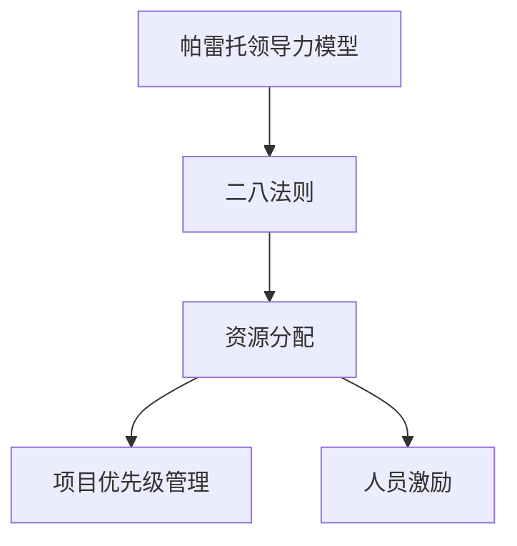

**2.2 费德勒领导力模型**

费德勒领导力模型是由美国心理学家费德勒提出的，它将领导力情境分为三个维度：任务结构、领导者和下属的关系以及职位权力。费德勒模型认为，领导力的有效性取决于领导者与情境的匹配程度。

**核心概念：**

- **情境因素**：领导者需要评估当前情境的三个维度，以确定最合适的领导行为。
- **匹配原则**：领导者应选择与情境最匹配的领导风格，以提高领导力有效性。

**应用场景：**

- **团队组建**：在组建团队时，领导者应选择与团队情境最匹配的领导风格。
- **员工激励**：领导者应根据员工的情境需求，采用相应的激励策略。

**图示说明：**

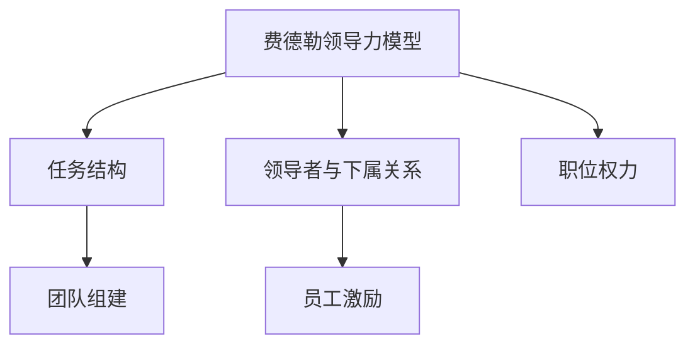

**2.3 戈尔茨坦-罗杰斯领导力模型**

戈尔茨坦-罗杰斯领导力模型是由戈尔茨坦和罗杰斯提出的，它基于领导力风格的维度，将领导力分为任务驱动型和关系驱动型。该模型认为，领导者的风格取决于其关注任务还是关注关系。

**核心概念：**

- **任务驱动型**：领导者侧重于任务目标和绩效，强调任务完成和效率。
- **关系驱动型**：领导者侧重于人际关系和团队氛围，强调团队协作和员工满意度。

**应用场景：**

- **项目管理**：在项目管理中，任务驱动型领导风格有助于确保项目按时完成。
- **团队建设**：在团队建设过程中，关系驱动型领导风格有助于提升团队凝聚力和员工满意度。

**图示说明：**

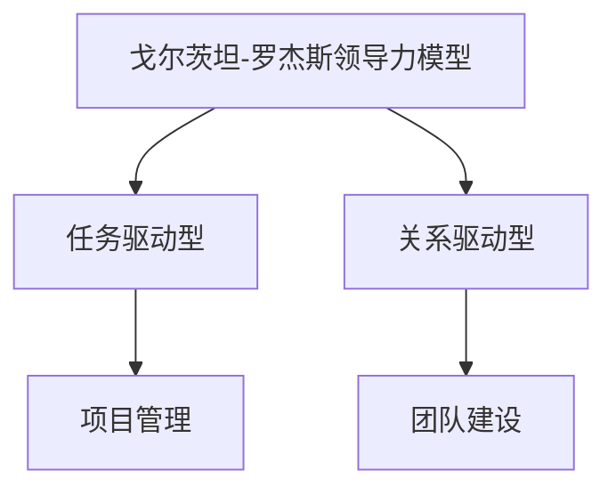

**2.4 波斯纳领导力模型**

波斯纳领导力模型是由波斯纳提出的，它基于领导者的个人特质和领导行为，将领导力分为五个层次：依赖型、独立型、合作型、系统型和愿景型。该模型认为，领导者的成长是一个逐步提升的过程。

**核心概念：**

- **依赖型**：领导者依赖外部指导和资源。
- **独立型**：领导者能够独立思考和行动。
- **合作型**：领导者能够与团队成员合作，共同解决问题。
- **系统型**：领导者具备系统思考能力，能够从整体视角看待问题。
- **愿景型**：领导者具备远见和愿景，能够引领团队实现长期目标。

**应用场景：**

- **人才培养**：领导者应根据员工的成长阶段，采用相应的培养策略。
- **战略规划**：领导者应具备系统思考和愿景规划能力，以制定有效的企业战略。

**图示说明：**

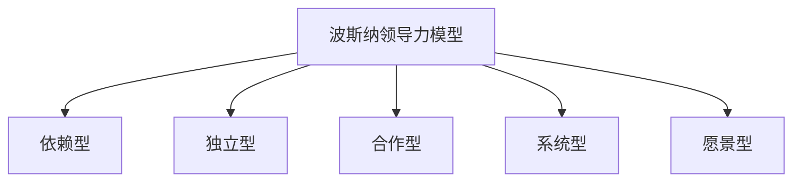

通过以上对帕雷托领导力模型、费德勒领导力模型、戈尔茨坦-罗杰斯领导力模型和波斯纳领导力模型的详细解析，我们可以看到，这些模型各有特色，但都为我们理解和提升领导力提供了宝贵的理论依据。在实践应用中，领导者应根据具体情况，选择最合适的模型，以实现最佳领导效果。

### 第二部分总结

在本章节中，我们详细介绍了四种常见的领导力模型：帕雷托领导力模型、费德勒领导力模型、戈尔茨坦-罗杰斯领导力模型和波斯纳领导力模型。这些模型分别从不同的角度对领导力进行了深入剖析，为我们提供了丰富的理论依据和实践指导。通过理解和应用这些模型，领导者可以更好地识别和解决团队中的问题，提升自身的领导能力。在接下来的章节中，我们将继续探讨领导力的其他核心技能，如沟通技巧、团队管理和激励技巧，帮助读者全面掌握领导力的精髓。通过161天的学习和实践，相信读者将能够从门外汉成长为内行人，为企业的成功贡献力量。

### 第三部分：领导力核心技能提升

#### 第3章：沟通技巧

沟通技巧是领导者必备的核心技能之一。有效的沟通不仅能确保信息的准确传达，还能建立和维护良好的团队关系。本章将重点探讨沟通技巧的四个原则，包括清晰表达、倾听理解、反馈确认和尊重差异，以及如何在实际情境中应用这些技巧。

**3.1 有效沟通的四个原则**

**3.1.1 清晰表达**

清晰表达是有效沟通的基础。领导者需要确保自己的信息能够被准确理解，避免产生误解和歧义。以下是实现清晰表达的一些建议：

- **使用简单语言**：避免使用过于复杂或专业的术语，以确保所有人都能理解。
- **明确目的**：在沟通前明确自己的目的，确保信息传达的目标清晰。
- **结构化信息**：将信息结构化，按照逻辑顺序进行陈述，有助于听众更好地理解。

**3.1.2 倾听理解**

倾听是有效沟通的重要组成部分。领导者需要学会倾听他人的意见和感受，以便更好地理解他们的立场和需求。以下是一些建议：

- **全神贯注**：在倾听时，保持专注，避免分心，全身心投入到对话中。
- **提问确认**：在倾听过程中，通过提问来确认自己的理解是否正确，确保双方达成共识。
- **共情**：尝试从他人的角度理解问题，表现出共情和理解。

**3.1.3 反馈确认**

反馈确认是确保沟通效果的重要环节。领导者需要确保自己的信息被正确理解，同时也要鼓励团队成员提供反馈。以下是实现反馈确认的一些建议：

- **请求反馈**：在沟通结束时，明确请求对方的反馈，以确保信息传达无误。
- **开放式问题**：使用开放式问题来鼓励团队成员提供详细反馈，而不是简单的“是”或“否”。
- **确认理解**：在收到反馈后，再次确认自己的理解是否正确，以确保双方的理解一致。

**3.1.4 尊重差异**

尊重差异是建立良好沟通关系的关键。团队成员来自不同的背景和文化，领导者需要尊重这些差异，以确保沟通的有效性。以下是实现尊重差异的一些建议：

- **了解文化差异**：学习并了解团队成员的文化背景，以避免文化冲突。
- **包容性语言**：使用包容性语言，避免使用歧视性或排斥性的言辞。
- **积极沟通**：鼓励团队成员分享他们的观点和想法，尊重每个人的独特性。

**3.2 沟通障碍与应对策略**

在沟通过程中，可能会遇到各种障碍，影响沟通效果。以下是一些常见的沟通障碍及应对策略：

**3.2.1 语言障碍**

- **策略**：使用简单明了的语言，避免专业术语和复杂的句式，确保信息传递清晰。

**3.2.2 文化差异**

- **策略**：了解并尊重团队成员的文化差异，使用包容性语言，避免产生误解。

**3.2.3 情绪障碍**

- **策略**：在情绪激动时，暂时停止沟通，给自己和对方冷静的时间，然后再继续对话。

**3.2.4 信息过载**

- **策略**：将信息分解成小部分，逐步传达，确保对方能够理解和消化。

**3.3 非言语沟通**

非言语沟通在信息传递中起着重要作用，它包括肢体语言、面部表情、姿态等。以下是非言语沟通的一些关键点：

**3.3.1 肢体语言**

- **策略**：保持开放和自信的肢体语言，如微笑、眼神交流、适当的身体姿态。

**3.3.2 面部表情**

- **策略**：使用适当的面部表情来传达情感和态度，避免冷漠或表情夸张。

**3.3.3 姿态**

- **策略**：保持舒适的姿态，避免僵硬或不自然的动作，以营造轻松的沟通氛围。

**3.4 情绪管理**

情绪管理是有效沟通的核心要素之一。领导者需要学会控制自己的情绪，以避免情绪波动对沟通效果的影响。以下是一些情绪管理的策略：

**3.4.1 自我反思**

- **策略**：在情绪波动时，进行自我反思，了解情绪的来源和原因，找到有效的应对方法。

**3.4.2 放松技巧**

- **策略**：学会放松技巧，如深呼吸、冥想等，以缓解紧张和焦虑情绪。

**3.4.3 沟通策略**

- **策略**：在情绪不稳定时，选择适当的沟通方式，如书面沟通或推迟对话，以避免冲动行为。

**3.5 案例研究**

为了更好地理解沟通技巧在实际中的应用，以下是一个具体的沟通案例：

**案例：项目进展沟通**

背景：一家公司正在开发一款新产品，项目团队由不同部门的成员组成。

挑战：团队成员对项目的进展和目标存在不同的看法，沟通不畅导致项目进度延误。

解决方案：

1. **明确沟通目标**：在每次会议前，明确会议的目标和议程，确保所有成员对会议内容有清晰的了解。

2. **使用清晰表达**：项目经理使用简单明了的语言，详细解释项目的目标和预期成果。

3. **倾听和理解**：项目经理在会议中积极倾听团队成员的意见，确保理解他们的观点和担忧。

4. **反馈确认**：项目经理在会议结束时，请求团队成员的反馈，确认大家对项目目标的认同。

5. **尊重差异**：项目经理尊重团队成员的不同意见，通过讨论和协商，达成共识。

结果：通过有效的沟通，项目团队明确了目标，解决了分歧，项目进度得到了显著提升。

通过以上案例分析，我们可以看到，有效的沟通技巧对于项目成功至关重要。在接下来的章节中，我们将继续探讨团队管理、激励技巧等领导力核心技能，帮助读者全面提升自己的领导能力。

### 第三部分总结

在本章节中，我们详细探讨了沟通技巧的四个原则：清晰表达、倾听理解、反馈确认和尊重差异。这些原则是领导者有效沟通的基础，有助于建立和维护良好的团队关系。此外，我们还介绍了沟通障碍及其应对策略，以及非言语沟通和情绪管理的重要性。通过案例分析，我们看到了沟通技巧在实际应用中的效果。在接下来的章节中，我们将继续深入探讨团队管理和激励技巧等领导力核心技能，帮助读者全面提升自己的领导能力。通过161天的学习和实践，读者将能够更好地应对各种沟通挑战，为企业的成功贡献力量。

### 第四部分：领导力实践应用

#### 第4章：团队管理

团队管理是领导力的核心组成部分，它关系到团队的目标实现和成员的满意度。有效的团队管理不仅能提高团队的绩效，还能促进成员的个人成长和团队凝聚力。本章将重点探讨团队管理的五个阶段、团队角色的识别与定位、团队冲突的处理策略以及领导风格与团队绩效之间的关系。

**4.1 团队建设的五个阶段**

团队建设是一个动态过程，通常可以分为五个阶段：

**4.1.1 形成期**

在形成期，团队成员刚刚开始接触，彼此之间还不熟悉。这个阶段的主要任务是建立团队的基础结构和明确目标。

- **关键任务**：团队成员相互了解，建立信任，明确团队的目标和期望。

- **领导策略**：领导者应积极引导团队，建立明确的规则和沟通机制。

**4.1.2 激荡期**

激荡期是团队内部冲突最为激烈的阶段。团队成员开始表达自己的观点，可能会出现意见分歧和竞争。

- **关键任务**：团队成员通过辩论和讨论，逐步达成共识，确定团队的工作方法和流程。

- **领导策略**：领导者需要扮演调解者的角色，平衡各方利益，促进团队的和谐。

**4.1.3 规范化期**

在规范化期，团队开始形成统一的团队文化，成员之间的协作更加顺畅。

- **关键任务**：团队成员逐步适应团队的工作流程，形成稳定的合作关系。

- **领导策略**：领导者应继续推动团队的文化建设，增强团队的凝聚力。

**4.1.4 执行期**

执行期是团队发挥最大效能的阶段。团队成员高效协作，共同实现团队的目标。

- **关键任务**：团队成员按照既定的计划执行任务，确保项目的顺利完成。

- **领导策略**：领导者应提供必要的支持和资源，确保团队成员能够充分发挥潜力。

**4.1.5 整合期**

在整合期，团队完成项目，进行总结和反思，为未来的工作做准备。

- **关键任务**：团队成员共同回顾项目，总结经验教训，为未来的工作提供参考。

- **领导策略**：领导者应鼓励团队成员分享经验和心得，提升团队的整体能力。

**4.2 团队角色的识别与定位**

团队角色是团队成员在团队中扮演的不同角色，每种角色都有其独特的职责和作用。以下是一些常见的团队角色及其特点：

**4.2.1 领导者**

- **职责**：负责团队的目标设定、资源分配和决策制定。
- **特点**：具备强烈的领导力、决策力和沟通能力。

**4.2.2 执行者**

- **职责**：负责执行团队的任务和计划，确保项目进度。
- **特点**：具备执行力强、责任心强和良好的协作能力。

**4.2.3 协调者**

- **职责**：负责协调团队内部的合作关系，解决冲突和问题。
- **特点**：具备良好的沟通技巧和调解能力。

**4.2.4 创新者**

- **职责**：负责提出新的想法和解决方案，推动团队的创新。
- **特点**：具备创造力强、思维敏捷和勇于尝试的精神。

**4.2.5 支持者**

- **职责**：负责为团队成员提供支持，解决他们的个人问题。
- **特点**：具备同理心、耐心和解决问题的能力。

领导者需要准确识别和定位团队成员的角色，确保每个人都能在团队中发挥最大的作用。以下是一些建议：

- **定期评估**：定期对团队成员的角色进行评估，确保他们处于最合适的角色。
- **提供反馈**：及时提供反馈，帮助团队成员了解自己在团队中的角色和表现。
- **灵活调整**：根据团队的需要和成员的能力，灵活调整团队角色。

**4.3 团队冲突的处理策略**

团队冲突是不可避免的，但有效的处理策略可以帮助团队将冲突转化为积极的动力。以下是一些常见的团队冲突及其处理策略：

**4.3.1 沟通障碍**

- **策略**：通过增加沟通机会，促进团队成员之间的理解和协作，解决沟通障碍。

**4.3.2 观点分歧**

- **策略**：通过讨论和辩论，鼓励团队成员表达自己的观点，寻找共识。

**4.3.3 利益冲突**

- **策略**：通过协商和妥协，平衡各方的利益，寻找双方都能接受的解决方案。

**4.3.4 个人情感**

- **策略**：通过倾听和理解，帮助团队成员处理个人情感，避免情感冲突。

**4.4 领导风格与团队绩效**

领导风格对团队绩效有显著影响。不同的领导风格适用于不同的团队和情境，以下是一些常见的领导风格及其特点：

**4.4.1 专制型领导**

- **特点**：领导者集中决策，团队成员被动执行。
- **适用场景**：在紧急情况下或需要快速决策时，专制型领导能够迅速统一行动。

**4.4.2 民主型领导**

- **特点**：领导者鼓励团队成员参与决策，共同讨论和制定计划。
- **适用场景**：在需要创新和团队合作的情况下，民主型领导能够激发团队的活力。

**4.4.3 支持型领导**

- **特点**：领导者关注团队成员的个人需求，提供支持和帮助。
- **适用场景**：在团队成员需要心理支持或个人发展时，支持型领导能够增强团队凝聚力。

**4.4.4 参与型领导**

- **特点**：领导者与团队成员平等参与决策，共同承担责任。
- **适用场景**：在团队需要高度合作和信任时，参与型领导能够促进团队的高效运作。

领导者应根据团队的具体情况和需求，灵活调整领导风格，以实现最佳团队绩效。以下是一些建议：

- **观察团队表现**：了解团队在不同领导风格下的表现，选择最合适的领导风格。
- **适应变化**：随着团队和情境的变化，灵活调整领导风格，以适应新的挑战。
- **持续学习**：通过学习和实践，不断提升自己的领导能力，以应对复杂多变的团队环境。

通过以上对团队管理五个阶段、团队角色识别与定位、团队冲突处理策略以及领导风格与团队绩效的分析，我们可以看到，有效的团队管理是领导者必须掌握的重要技能。在接下来的章节中，我们将继续探讨激励技巧和领导力实践应用，帮助读者全面提升自己的领导能力。通过161天的学习和实践，读者将能够更好地应对团队管理中的各种挑战，为企业的成功贡献力量。

### 第四部分总结

在本章节中，我们详细探讨了团队管理的五个阶段，包括形成期、激荡期、规范化期、执行期和整合期，分析了团队角色的识别与定位、团队冲突的处理策略以及领导风格与团队绩效之间的关系。这些内容为领导者提供了全面的管理工具和方法，帮助他们有效地管理团队，提升团队绩效。有效的团队管理不仅能够实现团队目标，还能促进团队成员的个人成长和团队凝聚力。在接下来的章节中，我们将继续探讨激励技巧和领导力的实践应用，帮助读者全面提升自己的领导能力。通过161天的学习和实践，读者将能够更好地应对团队管理中的各种挑战，为企业的成功贡献力量。

### 第五部分：领导力核心技能提升

#### 第5章：激励技巧

激励技巧是领导者激发团队成员积极性、提高工作效率的重要手段。有效的激励不仅能够提升团队绩效，还能增强员工的满意度和忠诚度。本章将深入探讨激励理论、成功的激励策略、奖励与惩罚的平衡以及激励与员工忠诚度之间的关系。

**5.1 激励理论综述**

激励理论是研究如何通过激发员工的内在动机，提高工作表现的重要理论体系。以下是一些主要的激励理论：

**5.1.1 马斯洛需求层次理论**

马斯洛需求层次理论将人的需求分为五个层次：生理需求、安全需求、社交需求、尊重需求和自我实现需求。领导者应根据员工的不同需求层次，采取相应的激励措施。

- **生理需求**：提供合理的薪酬和良好的工作条件，满足员工的基本生理需求。
- **安全需求**：通过稳定的工作环境和职业规划，满足员工的安全需求。
- **社交需求**：鼓励员工参与团队活动和社交互动，满足员工的社交需求。
- **尊重需求**：通过认可和赞扬，满足员工的尊重需求。
- **自我实现需求**：提供成长机会和挑战，激发员工的自我实现需求。

**5.1.2 赫茨伯格的双因素理论**

赫茨伯格的双因素理论将激励因素分为内在激励和外在激励。内在激励包括工作本身的兴趣、成就感等，外在激励包括薪酬、福利等。

- **内在激励**：领导者应关注工作本身，通过提供有趣的任务和挑战，激发员工的内在动力。
- **外在激励**：领导者应提供合理的薪酬和福利，确保员工的基本生活需求得到满足。

**5.1.3 麦克格雷格的X理论和Y理论**

麦克格雷格的X理论和Y理论分别代表了两种不同的领导理念。X理论认为员工懒惰，需要外部激励和监督；Y理论则认为员工有内在动力，愿意主动工作。

- **X理论**：领导者应采取严格的监督和惩罚措施，确保员工完成工作任务。
- **Y理论**：领导者应鼓励员工的自我管理，提供支持和资源，激发员工的内在动力。

**5.2 成功的激励策略**

成功的激励策略需要结合员工的实际情况和组织的具体需求。以下是一些有效的激励策略：

**5.2.1 目标设定**

目标设定是激发员工积极性的重要手段。领导者应与员工共同设定具有挑战性的目标，并提供必要的支持和资源。

- **明确目标**：确保目标具体、可测量、可实现、相关性强和时间限定。
- **阶段性目标**：将大目标分解为阶段性目标，帮助员工逐步实现。

**5.2.2 成长与发展**

提供成长机会和发展空间是激励员工的重要策略。领导者应关注员工的职业发展，提供培训、晋升机会和跨部门交流。

- **职业规划**：与员工共同制定职业规划，明确短期和长期发展目标。
- **培训与学习**：为员工提供多样化的培训和学习机会，提升其技能和知识。

**5.2.3 反馈与认可**

及时的反馈和认可能够增强员工的自信心和积极性。领导者应建立有效的反馈机制，鼓励员工接受反馈，并给予认可和赞扬。

- **正面反馈**：及时给予员工正面反馈，肯定他们的工作成绩。
- **认可机制**：建立认可机制，如表彰大会、奖金等，激励员工保持良好的工作状态。

**5.2.4 薪酬激励**

合理的薪酬激励是保持员工积极性的关键。领导者应确保薪酬体系公正、透明，能够反映员工的工作贡献。

- **薪酬结构**：设计多样化的薪酬结构，包括基本工资、绩效奖金、股权激励等。
- **薪酬调整**：根据市场情况和员工表现，定期调整薪酬水平。

**5.3 奖励与惩罚的平衡**

奖励与惩罚是领导者的常用激励手段，但如何平衡使用是一个重要的问题。以下是一些平衡奖励与惩罚的建议：

**5.3.1 公正性**

奖励与惩罚应基于客观标准和事实，确保公正性。领导者应避免主观偏见，确保所有员工都受到公平对待。

**5.3.2 及时性**

奖励与惩罚应及时，避免延时效应。领导者应在事件发生后尽快采取行动，确保奖励或惩罚的效果最大化。

**5.3.3 适度性**

奖励与惩罚应适度，避免过度或不足。领导者应根据员工的表现和贡献，合理设定奖励和惩罚的力度。

**5.4 激励与员工忠诚度**

激励不仅是提高员工工作效率的手段，更是建立员工忠诚度的关键。以下是一些建立员工忠诚度的策略：

**5.4.1 企业文化**

建立积极的企业文化，强调团队协作、尊重和信任。领导者应通过实际行动践行企业文化，增强员工的归属感。

**5.4.2 长期发展**

为员工提供长期的发展机会和职业规划，使他们看到企业在自己职业生涯中的重要作用。领导者应关注员工的长期发展，提供持续的支持。

**5.4.3 人际关系**

建立良好的人际关系，促进员工之间的相互理解和信任。领导者应积极参与员工的生活，了解他们的需求和困扰。

通过以上对激励理论的综述、成功的激励策略、奖励与惩罚的平衡以及激励与员工忠诚度的探讨，我们可以看到，有效的激励技巧对于提升团队绩效和员工满意度至关重要。在接下来的章节中，我们将继续探讨领导力情境应用和领导力提升案例研究，帮助读者更全面地掌握领导力技能。

### 第五部分总结

在本章节中，我们深入探讨了激励理论、成功的激励策略、奖励与惩罚的平衡以及激励与员工忠诚度之间的关系。这些内容为领导者提供了丰富的激励工具和方法，帮助他们更好地激发员工的积极性，提升团队绩效。有效的激励不仅能够提高员工的工作效率，还能增强员工的满意度和忠诚度。在接下来的章节中，我们将继续探讨领导力情境应用和领导力提升案例研究，帮助读者更全面地掌握领导力技能。通过161天的学习和实践，读者将能够从门外汉成长为内行人，为企业的成功贡献力量。

### 第六部分：领导力实践应用

#### 第6章：领导力情境应用

在实际工作中，领导者常常会遇到各种复杂的情境，这些情境要求领导者具备灵活的应变能力和高超的领导技巧。本章将深入探讨新任领导者的挑战、高压下的领导力、变革领导力和危机管理，分析在这些特定情境下如何应用领导力技能。

**6.1 新任领导者的挑战**

新任领导者通常会面临一系列的挑战，包括建立信任、管理前任遗留问题和适应新环境等。以下是一些具体的挑战和应对策略：

**6.1.1 建立信任**

建立信任是领导者的首要任务。新任领导者需要通过透明沟通、以身作则和积极倾听来赢得员工的信任。

- **透明沟通**：及时向员工传达组织的目标、策略和变化，确保信息的对称性。
- **以身作则**：通过自己的言行树立榜样，展现出对团队的承诺和责任感。
- **积极倾听**：倾听员工的意见和反馈，尊重他们的感受，建立开放和信任的沟通环境。

**6.1.2 管理前任遗留问题**

前任领导留下的遗留问题可能会对新任领导者造成压力。有效的策略包括评估问题、制定解决方案并逐步实施。

- **评估问题**：深入了解前任领导遗留的问题，分析问题的根源和影响。
- **制定解决方案**：与团队共同制定解决问题的方案，明确责任人和时间表。
- **逐步实施**：分阶段实施解决方案，确保每一步都能得到有效执行。

**6.1.3 适应新环境**

新任领导者需要适应新的工作环境和团队文化。以下是一些适应新环境的策略：

- **主动了解**：主动了解组织的文化、价值观和工作流程，快速融入新环境。
- **建立联系**：主动与团队成员建立联系，了解他们的需求和期望，建立良好的人际关系。
- **学习成长**：保持学习的态度，不断提升自己的知识和技能，以适应新的工作要求。

**6.2 高压下的领导力**

高压环境下的领导力挑战更大，领导者需要保持冷静和理智，采取有效的策略来应对压力。以下是一些高压下的领导力技巧：

**6.2.1 管理情绪**

在高压环境中，领导者需要学会管理自己的情绪，避免情绪波动影响决策和团队氛围。

- **深呼吸**：在情绪激动时，进行深呼吸，缓解紧张情绪。
- **积极思考**：从积极的角度看待问题，寻找解决问题的方法，避免消极情绪的影响。
- **心理辅导**：寻求专业心理辅导，帮助自己更好地应对高压环境。

**6.2.2 增强团队凝聚力**

在高压环境下，团队凝聚力尤为重要。领导者应采取措施增强团队凝聚力，共同面对挑战。

- **共同目标**：确保团队成员明确共同的目标，增强团队的合作意识。
- **积极沟通**：通过积极沟通，了解团队成员的需求和困扰，提供支持和帮助。
- **团队活动**：组织团队活动，增强团队成员之间的互动和信任，提升团队凝聚力。

**6.2.3 优化工作流程**

优化工作流程可以提高工作效率，减少压力。领导者可以通过以下策略来优化工作流程：

- **流程分析**：分析当前的工作流程，识别瓶颈和优化机会。
- **任务分解**：将复杂任务分解为简单步骤，确保每个步骤都能高效完成。
- **资源配置**：合理配置资源和人力，确保每个任务都有足够的支持。

**6.3 变革领导力**

在快速变化的时代，领导者需要具备变革领导力，推动组织持续创新和适应变化。以下是一些变革领导力的策略：

**6.3.1 拥抱变革**

领导者需要首先拥抱变革，展现出对变革的积极态度和信心。

- **积极倡导**：通过积极倡导和宣传，让团队成员认识到变革的必要性和重要性。
- **以身作则**：通过自己的行为展示对变革的承诺和信心，激发团队成员的积极性。

**6.3.2 激发创新**

激发创新是变革领导力的重要组成部分。领导者可以通过以下策略来激发创新：

- **鼓励尝试**：鼓励团队成员勇于尝试新的想法和解决方案，即使失败也给予支持和认可。
- **开放沟通**：建立开放的沟通环境，鼓励团队成员自由表达意见和反馈，促进创新思维的碰撞。
- **提供资源**：为创新项目提供必要的资源和支持，确保创新活动能够顺利进行。

**6.3.3 持续改进**

持续改进是变革领导力的核心。领导者应通过以下策略推动组织的持续改进：

- **定期评估**：定期评估组织的绩效和效率，识别改进的机会和需求。
- **持续学习**：鼓励团队成员持续学习和成长，提升组织的整体能力。
- **反馈机制**：建立有效的反馈机制，及时收集和处理团队成员的反馈，确保改进措施得到有效实施。

**6.4 危机管理**

危机管理是领导者必须具备的重要能力。在危机发生时，领导者需要迅速反应，采取有效的策略来缓解危机，确保组织的稳定和持续发展。以下是一些危机管理的策略：

**6.4.1 快速反应**

在危机发生时，领导者需要迅速反应，采取紧急措施来控制局势。

- **立即行动**：在危机发生的第一时间，启动危机应对机制，采取紧急措施。
- **信息透明**：及时向内部和外部 stakeholders 传达危机信息，保持信息透明。

**6.4.2 应对策略**

根据危机的性质和影响，领导者需要制定相应的应对策略。

- **控制危机**：采取有效措施，控制危机的蔓延和扩大，降低危机对组织的影响。
- **解决问题**：分析危机的原因，制定解决方案，解决危机的根本问题。

**6.4.3 恢复秩序**

在危机得到控制后，领导者需要采取措施恢复组织的正常秩序。

- **恢复信心**：通过积极沟通和行动，恢复员工和客户的信心。
- **总结经验**：对危机管理过程进行总结和反思，吸取经验教训，改进危机管理策略。

通过以上对领导力情境应用的详细探讨，我们可以看到，领导者在不同情境下需要具备不同的领导技能和策略。有效的领导力不仅能帮助领导者应对各种挑战，还能推动组织的持续发展和成功。在接下来的章节中，我们将通过领导力提升案例研究，进一步探讨领导力在实践中的应用和效果。

### 第六部分总结

在本章节中，我们深入探讨了领导力在特定情境下的应用，包括新任领导者的挑战、高压下的领导力、变革领导力和危机管理。这些情境对领导者的能力和应变能力提出了更高的要求。通过分析这些情境和相应的领导策略，我们了解了如何在不同情境下有效应用领导力，以应对各种挑战和推动组织的发展。在接下来的章节中，我们将通过领导力提升案例研究，进一步探讨领导力在实践中的应用和效果。通过161天的学习和实践，读者将能够更全面地掌握领导力技能，为企业的成功贡献力量。

### 第七部分：领导力提升案例研究

#### 第7章：领导力提升案例研究

领导力并非抽象的理论，它通过实践案例得以具体展现。本章将分析三个具有代表性的案例：苹果公司的崛起、特斯拉的领导力策略以及惠普的领导力转型。这些案例展示了不同类型的领导力如何在不同情境下发挥作用，帮助读者更好地理解和应用领导力原则。

**7.1 案例一：苹果公司的崛起**

苹果公司（Apple Inc.）的崛起是一个典型的领导力成功案例。在史蒂夫·乔布斯（Steve Jobs）的领导下，苹果公司不仅推出了多个革命性的产品，还塑造了一种独特的公司文化。

**领导力要素：**

- **创新领导力**：乔布斯通过创新和卓越的设计理念，推动苹果不断推出具有颠覆性的产品，如iPhone、iPad和MacBook等。
- **愿景领导力**：乔布斯拥有清晰的愿景，他能够激励团队围绕共同目标努力，使苹果公司始终保持行业领先地位。
- **变革领导力**：乔布斯在苹果公司面临困境时，勇于变革，通过裁员、重组和重新定位，成功带领公司走出困境。

**案例启示：**

- **领导者应具备远见和创新精神，不断推动产品和技术的革新。**
- **领导者需要建立明确的愿景，并激励团队为实现这一愿景而努力。**
- **在面临挑战时，领导者应勇于变革，采取果断措施，确保组织的可持续发展。**

**7.2 案例二：特斯拉的领导力策略**

特斯拉（Tesla, Inc.）是另一家在领导力领域取得巨大成功的公司。伊隆·马斯克（Elon Musk）作为特斯拉的创始人兼CEO，以其独特的领导风格和策略，推动了特斯拉的快速发展。

**领导力要素：**

- **愿景驱动**：马斯克拥有明确的愿景，他希望通过特斯拉的技术和产品，推动全球向可持续能源转型。
- **激励文化**：特斯拉内部倡导一种充满激情和奋斗精神的企业文化，鼓励员工追求卓越和创新。
- **透明管理**：马斯克倡导透明管理，与员工保持开放和频繁的沟通，提高决策效率和团队凝聚力。

**案例启示：**

- **领导者应具备强大的愿景，并将其传达给团队成员，以激发他们的热情和动力。**
- **建立积极的企业文化，鼓励员工追求卓越和创新，以提高整体绩效。**
- **通过透明管理，建立高效的沟通机制，确保团队成员对组织的方向和目标有清晰的认识。**

**7.3 案例三：惠普的领导力转型**

惠普（Hewlett-Packard, HP）曾经是一家享有盛誉的科技公司，但在面临激烈的市场竞争和内部问题时，公司决定进行领导力转型。通过一系列的领导力变革，惠普成功实现了复兴。

**领导力要素：**

- **组织变革**：新任CEO梅格·惠特曼（Meg Whitman）采取了一系列组织变革措施，包括裁员、重组和战略调整，以提升公司的竞争力。
- **团队协作**：惠普强调团队协作，通过跨部门合作，推动项目的顺利进行。
- **持续学习**：惠普鼓励员工持续学习和成长，提供多样化的培训和发展机会。

**案例启示：**

- **领导者应具备变革精神，勇于面对挑战，采取果断措施推动组织的转型。**
- **团队协作是提升组织绩效的关键，领导者应建立有效的团队协作机制。**
- **持续学习是组织保持竞争力的基础，领导者应鼓励员工不断提升自己的知识和技能。**

通过分析这些案例，我们可以看到，成功的领导力不仅包括创新和愿景，还需要在具体情境中灵活应用各种领导技巧。领导者应不断学习和实践，以应对复杂多变的商业环境。在接下来的章节中，我们将继续探讨自我领导力和领导力的未来趋势，帮助读者全面提升领导力水平。

### 第七部分总结

在本章节中，我们通过三个领导力成功案例——苹果公司的崛起、特斯拉的领导力策略和惠普的领导力转型，深入探讨了领导力在不同情境下的应用和效果。这些案例展示了创新、愿景、变革、团队协作和持续学习等领导力要素在推动组织成功中的关键作用。通过分析这些案例，读者可以更好地理解领导力的实践意义和应用方法。在接下来的章节中，我们将探讨自我领导力和领导力的未来趋势，帮助读者进一步深化对领导力的认识，为未来的领导力发展做好准备。

### 第八部分：领导力持续发展

#### 第8章：自我领导力

自我领导力是领导者个人成长和持续发展的关键。它要求领导者具备自我反思、个人愿景、成长计划和保持活力的能力。本章将深入探讨这些自我领导力要素，并分析如何通过持续学习和自我提升，实现领导力的不断进步。

**8.1 自我反思的重要性**

自我反思是领导者自我领导力的核心。通过反思，领导者可以识别自身的优点和不足，发现改进的机会，从而不断提升自己的领导能力。

**核心概念与联系：**

自我反思的过程可以分解为以下几个步骤：

1. **识别目标**：明确自己当前的目标和期望，包括领导能力的发展方向。
2. **回顾经历**：回顾过去的行为和决策，分析哪些是成功的，哪些需要改进。
3. **识别不足**：识别自己在领导力方面的不足，如沟通技巧、决策能力等。
4. **制定计划**：根据反思结果，制定具体的改进计划，包括学习新知识、培养新技能等。

**图示说明（使用 Mermaid 流程图）：**

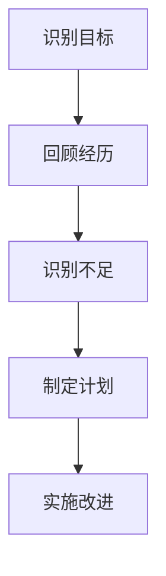

**应用实例：**

领导者可以通过定期进行自我反思，来评估自己的领导力发展。例如，每周花时间回顾过去一周的工作，分析哪些地方做得好，哪些地方需要改进，并制定下周的具体改进计划。

**8.2 建立个人愿景**

建立个人愿景是自我领导力的关键。个人愿景不仅为领导者提供了方向和动力，还能激励团队成员为实现共同目标而努力。

**核心概念与联系：**

建立个人愿景的过程包括以下几个步骤：

1. **明确价值观**：确定自己最重视的价值观，如创新、责任、合作等。
2. **设定长期目标**：基于自己的价值观，设定长期的目标和愿景。
3. **制定短期计划**：将长期愿景分解为具体的短期目标，并制定实现这些目标的计划。
4. **沟通愿景**：与团队成员分享个人愿景，确保大家朝同一方向努力。

**图示说明（使用 Mermaid 流程图）：**

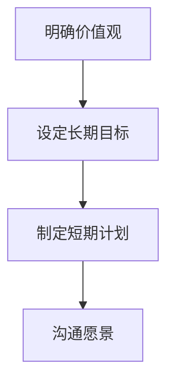

**应用实例：**

一位领导者可以花时间思考自己的长期目标和愿景，例如成为一家创新型企业的领导者。然后，将这个愿景分解为具体的短期目标，如提升团队的创新能力和实施一系列创新项目。最后，与团队成员分享这个愿景，并鼓励大家为实现这个愿景共同努力。

**8.3 个人成长计划**

个人成长计划是领导者提升自我领导力的具体行动。它包括学习新知识、培养新技能和锻炼新能力。

**核心概念与联系：**

个人成长计划的过程包括以下几个步骤：

1. **评估需求**：识别自己在领导力方面的不足和需要提升的领域。
2. **选择学习资源**：根据评估结果，选择合适的书籍、课程、培训等学习资源。
3. **制定学习计划**：将学习资源整合到个人成长计划中，制定详细的学习计划。
4. **实施计划**：按照学习计划进行学习，确保学习效果。

**图示说明（使用 Mermaid 流程图）：**

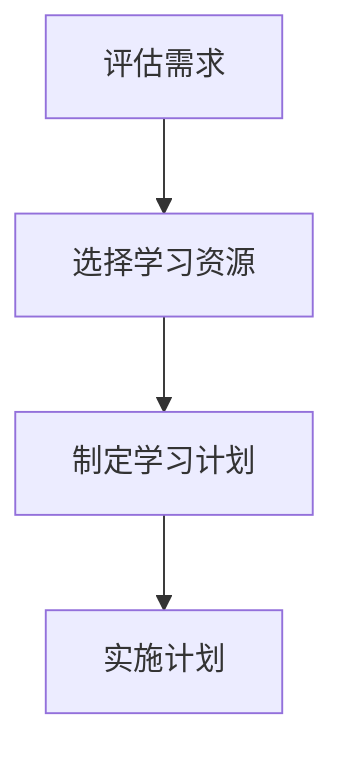

**应用实例：**

一位领导者可以评估自己在沟通技巧方面的不足，然后选择相关书籍和课程进行学习。例如，参加沟通技巧培训课程，阅读《沟通的艺术》等书籍。同时，制定详细的学习计划，确保按照计划进行学习。

**8.4 保持领导力的活力**

保持领导力的活力是领导者持续发展的关键。它要求领导者保持学习的热情和开放的心态，不断适应新的变化和挑战。

**核心概念与联系：**

保持领导力活力的策略包括以下几个方面：

1. **持续学习**：不断学习新知识、新技能，保持思维的活跃。
2. **适应变化**：适应快速变化的环境，灵活调整领导策略。
3. **保持开放**：保持开放的心态，积极接受新的想法和意见。
4. **创新思维**：鼓励创新思维，勇于尝试新的方法和策略。

**图示说明（使用 Mermaid 流程图）：**

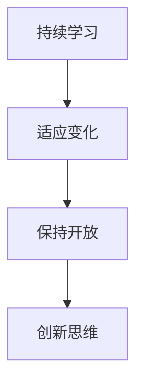

**应用实例：**

一位领导者可以通过参加行业会议、研讨会和培训，不断学习新知识。同时，积极适应市场变化，调整自己的领导策略，以适应新的环境。此外，鼓励团队成员提出创新想法，共同推动组织的创新和发展。

通过以上对自我反思、个人愿景、个人成长计划和保持领导力活力的探讨，我们可以看到，自我领导力是领导者持续发展的关键。领导者应不断自我反思，建立清晰的个人愿景，制定详细的成长计划，并保持学习的热情和开放的心态。通过持续学习和自我提升，领导者将能够不断提升自己的领导能力，为组织的成功贡献力量。

### 第八部分总结

在本章节中，我们探讨了自我领导力的四个核心要素：自我反思、个人愿景、个人成长计划和保持领导力的活力。通过自我反思，领导者可以识别自身的不足和改进的机会；通过建立个人愿景，领导者可以明确自己的方向和目标；通过制定个人成长计划，领导者可以系统地提升自己的能力和知识；通过保持领导力的活力，领导者可以适应快速变化的环境，保持思维的活跃。自我领导力是领导者持续发展的关键，通过不断学习和自我提升，领导者将能够不断提升自己的领导能力，为组织的成功贡献力量。

### 第九部分：领导力的未来趋势

#### 第9章：领导力的未来趋势

随着科技的快速发展和全球化的深入推进，领导力也面临着新的挑战和机遇。本章将探讨数字化时代对领导力的挑战、全球化背景下的领导力、人工智能与领导力的融合以及领导力的可持续性发展，帮助读者了解领导力未来的发展趋势。

**9.1 数字化时代对领导力的挑战**

数字化时代对领导力提出了新的挑战。以下是数字化时代对领导力的几个主要影响：

**数字化技能**：领导者需要具备数字素养，包括数据分析、人工智能和云计算等技能。这些技能有助于领导者更好地理解和利用数字技术，提升组织的竞争力。

**远程工作**：随着远程工作的普及，领导者需要适应新的工作模式，确保远程团队的高效协作和沟通。领导者需要建立有效的远程管理策略，确保团队目标的一致性和工作效率。

**数据隐私与安全**：在数字化时代，数据隐私和安全成为领导者需要关注的重要问题。领导者需要制定严格的数据保护政策，确保企业的信息安全。

**图示说明（使用 Mermaid 流程图）：**

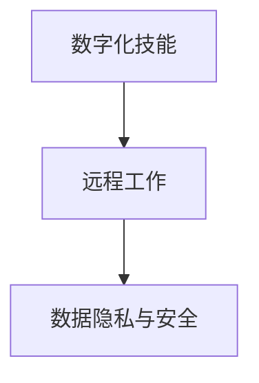

**9.2 全球化背景下的领导力**

全球化使得组织面临更加复杂和多样化的挑战。以下是全球化对领导力的几个主要影响：

**跨文化沟通**：全球化要求领导者具备跨文化沟通能力，能够理解和尊重不同文化背景的团队成员。领导者需要学会在多元文化环境中有效沟通，避免文化冲突。

**全球化视野**：领导者需要具备全球化视野，能够从全球范围内审视问题和制定战略。领导者需要关注全球市场趋势，抓住全球化带来的机遇。

**全球化领导**：全球化要求领导者能够领导跨国团队，协调不同国家和地区的业务。领导者需要具备跨文化管理和领导能力，确保全球团队的合作和协调。

**图示说明（使用 Mermaid 流程图）：**

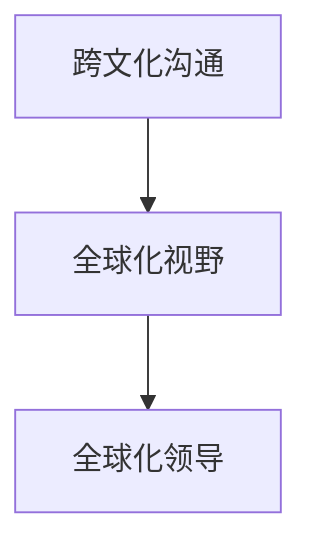

**9.3 人工智能与领导力的融合**

人工智能（AI）的快速发展对领导力产生了深远的影响。以下是人工智能与领导力融合的几个主要方面：

**自动化决策**：人工智能可以帮助领导者进行复杂的决策分析，提高决策的准确性和效率。领导者需要学会利用人工智能工具，提升决策能力。

**数据驱动管理**：人工智能可以分析海量数据，为领导者提供更准确的管理决策依据。领导者需要具备数据分析和解读能力，利用数据进行管理。

**人机协作**：人工智能可以帮助领导者更好地管理团队，提高工作效率。领导者需要学会与人工智能协作，发挥人工智能的优势，同时保持对团队的直接管理。

**图示说明（使用 Mermaid 流程图）：**

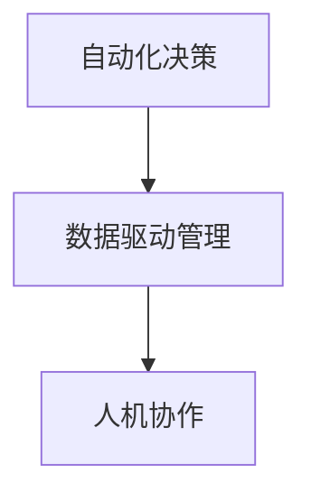

**9.4 领导力的可持续性发展**

领导力的可持续性发展是未来领导力发展的重要趋势。以下是领导力可持续性发展的几个关键点：

**社会责任**：领导者需要关注企业的社会责任，确保企业的发展符合社会道德和伦理标准。领导者需要积极参与社会公益活动，推动企业的可持续发展。

**环境可持续性**：领导者需要关注企业的环境保护和可持续发展，采取有效的措施减少企业的环境影响。领导者需要推动企业采取绿色技术和环保措施。

**员工发展**：领导者需要关注员工的职业发展和个人成长，为员工提供良好的工作环境和职业发展机会。领导者需要建立员工发展计划，确保员工的持续发展和满意度。

**图示说明（使用 Mermaid 流程图）：**

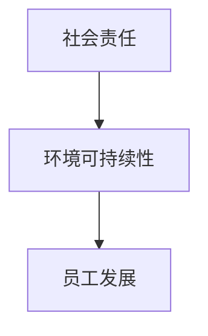

通过以上对数字化时代、全球化背景、人工智能与领导力的融合以及领导力的可持续性发展的探讨，我们可以看到，领导力在未来将面临更多的挑战和机遇。领导者需要不断学习和适应新的变化，提升自己的领导能力和管理技能，以应对未来领导力的需求。通过持续的学习和实践，领导者将能够引领组织在未来的竞争中获得成功。

### 第九部分总结

在本章节中，我们探讨了领导力在数字化时代、全球化背景、人工智能与领导力的融合以及领导力的可持续性发展方面的未来趋势。这些趋势要求领导者具备新的技能和思维模式，以应对快速变化的商业环境。通过理解和应用这些趋势，领导者将能够更好地引领组织，实现长期的成功和发展。在未来的领导力实践中，领导者需要不断学习和适应，持续提升自己的领导能力和管理技能，为组织的持续成长和社会的可持续发展贡献力量。

### 附录

**附录A：领导力常用工具与方法**

1. **SWOT分析**：用于评估组织的优势、劣势、机会和威胁，帮助领导者制定战略计划。
2. **5W1H分析法**：通过问问题（Who, What, When, Where, Why, How）来深入分析问题，找到解决方案。
3. **SMART目标设定法**：确保目标具有具体性、可衡量性、可实现性、相关性、时限性。
4. **共识会议**：通过集体讨论和协商，达成团队共识，提高决策质量和执行力。
5. **360度反馈**：收集来自上级、同事、下属和客户的反馈，全面评估领导者的表现和改进方向。

**附录B：领导力发展资源推荐**

1. **书籍**：
   - 《领导力的五个层次》（John C. Maxwell）
   - 《如何赢得朋友与影响他人》（Dale Carnegie）
   - 《第五项修炼》（Peter M. Senge）
2. **在线课程**：
   - Coursera 的“领导力与团队管理”课程
   - Edx 的“领导力：基础与实践”课程
   - Udemy 的“高级领导力：从优秀到卓越”课程
3. **培训机构**：
   - 培训协会（如国际领导力协会、亚洲领导力协会）
   - 咨询公司（如麦肯锡、贝恩咨询）
   - 企业内部领导力发展项目

**附录C：领导力测试与评估量表**

1. **领导力行为量表（LBA）**：评估领导者的行为和风格，帮助领导者了解自己的优势和改进方向。
2. **领导效能量表（LES）**：评估领导者的效能和团队绩效，帮助领导者识别改进的机会。
3. **领导风格量表（LSI）**：评估领导者的领导风格，包括民主型、专制型、参与型等，帮助领导者了解适合的领导风格。

通过这些附录，读者可以更全面地了解领导力的发展资源和评估工具，为自己的领导力提升提供参考和指导。

### 附录总结

在本附录中，我们提供了领导力常用的工具与方法、推荐的发展资源以及领导力测试与评估量表。这些资源旨在帮助读者更系统地学习和评估自己的领导力，为实际应用提供理论支持和实践指导。通过使用这些工具和方法，读者可以更全面地提升自己的领导能力，为企业的成功和社会的可持续发展贡献力量。

### 作者信息

作者：AI天才研究院/AI Genius Institute & 禅与计算机程序设计艺术 /Zen And The Art of Computer Programming

在本《领导力训练营：161天从门外汉到内行人》一书中，作者以其丰富的领导力理论和实践经验，为读者提供了一份系统而实用的领导力指南。作者AI天才研究院是一群在人工智能和领导力领域具有深厚研究背景和丰富实践经验的专家团队，致力于推动人工智能和领导力的发展。而《禅与计算机程序设计艺术》则是作者在计算机编程领域的杰出代表作，体现了作者对技术深度的理解和对哲学思想的融入。通过这本著作，读者不仅能够获得丰富的领导力知识，还能感受到作者独特的思考方式和深刻的洞见。希望通过本书，读者能够在领导力领域取得显著的进步，为个人和组织的成功贡献力量。

