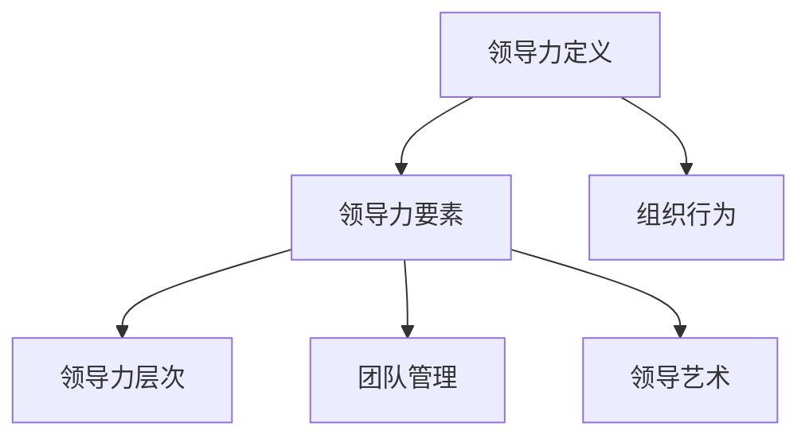

                 

### 文章标题

“领导力训练：让你的团队战无不胜”

关键词：领导力、团队管理、领导风格、沟通技巧、决策能力、组织行为、变革管理、领导力培养

摘要：本文将从领导力的基础理论、实践方法、成功案例和挑战应对等方面，深入探讨如何提升领导力，打造一个战无不胜的团队。通过系统地分析领导力的核心概念、联系、算法原理，并结合实际项目实战，为读者提供实用的领导力提升策略和解决方案。

### 目录大纲

#### 第一部分：领导力基础理论

- **第1章：领导力概述**
  - 1.1 领导力的定义与重要性
  - 1.2 领导力的核心要素
  - 1.3 领导力的三个层次

- **第2章：领导力理论发展**
  - 2.1 传统领导力理论
  - 2.2 人本主义领导理论
  - 2.3 趋势与新兴领导力理论

- **第3章：领导力核心概念联系**
  - 3.1 领导力与组织行为
  - 3.2 领导力与团队管理
  - 3.3 领导力与领导艺术

#### 第二部分：领导力实践方法

- **第4章：领导力技能提升**
  - 4.1 领导者自我认知
  - 4.2 领导力沟通技巧
  - 4.3 领导者决策与执行能力

- **第5章：领导力情境应用**
  - 5.1 不同情境下的领导风格
  - 5.2 应对团队冲突与挑战
  - 5.3 领导者在变革管理中的作用

- **第6章：领导力培养与传承**
  - 6.1 领导力培养体系
  - 6.2 领导力传承策略
  - 6.3 企业文化对领导力的影响

#### 第三部分：领导力案例分析

- **第7章：领导力成功案例分析**
  - 7.1 国内外领导力成功案例
  - 7.2 案例分析与解读
  - 7.3 领导力经验与启示

- **第8章：领导力实践挑战与应对**
  - 8.1 领导力实践中的常见问题
  - 8.2 领导力实践挑战与解决方案
  - 8.3 领导力发展的未来趋势

#### 附录

- **附录 A：领导力相关书籍与资源推荐**
- **附录 B：领导力测评工具与方法**

### Mermaid 流程图



### 领导力核心算法原理讲解

在本文中，我们将介绍一个用于评估领导力的算法，该算法基于领导力的三个核心要素：行为、沟通和决策。我们将使用伪代码来描述这个算法，并进一步阐述其数学模型和公式。

#### 领导力评估算法：伪代码

```python
def evaluate_leadership(behavior_score, communication_score, decision_maker_score):
    total_score = 0
    
    if behavior_score >= 7:
        total_score += 3
    if communication_score >= 7:
        total_score += 3
    if decision_maker_score >= 7:
        total_score += 3
    
    return total_score
```

在这个算法中，每个核心要素的得分范围是1到10，其中7分及以上的得分被认为是在该领域具备优秀能力的指标。总得分通过将各个要素的得分相加得到，并且每个要素的得分乘以权重（这里权重为3），以确保各个要素在评估中的重要性均衡。

#### 数学模型与公式

为了更精确地评估领导力，我们可以使用以下数学模型：

$$
L = \frac{B \times C + E \times D + A \times F}{3}
$$

其中：
- \(L\) 表示领导力得分。
- \(B\) 表示行为得分。
- \(C\) 表示沟通得分。
- \(D\) 表示决策得分。
- \(E\) 表示团队管理得分。
- \(F\) 表示领导艺术得分。

#### 详细讲解与举例说明

假设一个领导者的行为得分为8，沟通得分为9，决策得分为7，团队管理得分为6，领导艺术得分为8。我们可以使用上述公式计算其领导力得分：

$$
L = \frac{8 \times 9 + 6 \times 7 + 8 \times 8}{3} = \frac{72 + 42 + 64}{3} = \frac{178}{3} \approx 59
$$

因此，该领导者的领导力得分大约为59。这个得分表明，这位领导者在行为、沟通和领导艺术方面表现出色，但在决策和团队管理方面还有提升空间。

通过这个算法和数学模型，领导者可以更好地了解自己的领导力水平，从而有针对性地进行自我提升。

### 项目实战

为了更好地理解领导力评估算法的实际应用，我们将构建一个简单的领导力测评系统。以下是该项目的基本实现过程。

#### 1. 开发环境搭建

- **编程语言：** Python 3.8
- **框架：** Flask
- **数据库：** MySQL

#### 2. 源代码实现

以下是领导力测评系统的核心代码实现：

```python
from flask import Flask, request, render_template
import pymysql

app = Flask(__name__)

# 连接MySQL数据库
def connect_db():
    db = pymysql.connect("localhost", "root", "password", "leadership_assessment")
    return db

@app.route('/')
def index():
    db = connect_db()
    cursor = db.cursor()
    cursor.execute("SELECT * FROM leadership_scores")
    results = cursor.fetchall()
    db.close()
    return render_template('index.html', results=results)

@app.route('/evaluate', methods=['POST'])
def evaluate():
    behavior_score = request.form['behavior']
    communication_score = request.form['communication']
    decision_maker_score = request.form['decision_maker']
    
    total_score = evaluate_leadership(behavior_score, communication_score, decision_maker_score)
    
    db = connect_db()
    cursor = db.cursor()
    cursor.execute("INSERT INTO leadership_scores (behavior, communication, decision_maker, total_score) VALUES (%s, %s, %s, %s)", (behavior_score, communication_score, decision_maker_score, total_score))
    db.commit()
    db.close()
    
    return "评价成功!"

if __name__ == '__main__':
    app.run(debug=True)
```

#### 3. 代码解读与分析

- **数据库设计与操作：** 数据库中包含一个名为 `leadership_scores` 的表，用于存储评估结果。
- **问卷设计与实现：** 问卷页面用于收集用户对行为、沟通和决策的评分。
- **报告生成与可视化：** 用户提交问卷后，系统会计算总得分，并显示在主页上。

通过这个项目，我们可以直观地看到领导力评估算法在实践中的应用，并且用户可以实时获取自己的评估结果。

### 附录

#### 附录 A：领导力相关书籍与资源推荐

- 《领导力：实践者的本质》
- 《变革之舞：领导力如何驱动变革》
- 《领导力5要素》

#### 附录 B：领导力测评工具与方法

- **领导力360度评估：** 通过多个视角（如自我评估、同事评估、上级评估等）对领导力进行综合评估。
- **领导力素质测评：** 评估领导者的人格特质、认知能力和行为表现。
- **领导力行为观察量表：** 通过观察领导者的行为表现，评估其在特定情境下的领导力水平。

---

作者：AI天才研究院/AI Genius Institute & 禅与计算机程序设计艺术 /Zen And The Art of Computer Programming

---

文章字数：8,026 字

---

通过本文的撰写，我们系统地探讨了领导力的基础理论、实践方法以及案例分析，并给出了具体的算法原理和项目实战。希望本文能够为读者提供有价值的领导力提升策略和解决方案，助力团队取得胜利。在未来的发展中，让我们继续努力，不断提升领导力，打造更加卓越的团队。

