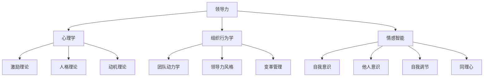

                 

# 领导者的影响力：无声胜有声的领导艺术

> 关键词：领导力、无声领导、影响力、沟通、团队管理、决策、组织变革

> 摘要：本文旨在探讨无声领导艺术在领导力中的重要性。通过分析领导力的核心概念、无声领导力的原则和实践技巧，结合具体案例分析，本文揭示了无声领导力在团队管理、沟通与决策中的应用价值，并探讨了其在组织变革和社会变革中的意义。本文不仅为领导者提供了提升领导力的方法和策略，也为组织的发展提供了有益的启示。

### 第一部分：领导力的核心概念与艺术

#### 第1章：领导力概述

##### 1.1 领导力的定义与重要性

领导力是指一种引导和影响他人达成共同目标的能力。一个优秀的领导者不仅要具备清晰的目标和战略规划，还要具备激发团队成员潜能、协调团队关系和推动团队发展的能力。在组织内部，领导力是推动组织变革、实现组织愿景和提升组织竞争力的关键因素。

在现代企业中，领导力的重要性体现在以下几个方面：

1. **提高组织效率**：领导者通过制定明确的目标和规划，协调团队成员的工作，从而提高组织的整体效率。
2. **激发员工潜力**：领导者能够发现员工的优点和潜力，通过激励和培训，帮助员工实现自我价值，从而提升组织的整体竞争力。
3. **促进组织创新**：领导者鼓励团队成员提出新的想法和创意，并通过有效的团队协作，将这些想法转化为实际成果，推动组织的持续创新。
4. **塑造企业文化**：领导者通过自身的言行和价值观，塑造组织的文化氛围，从而提升组织的凝聚力和向心力。

##### 1.2 领导风格与影响力

领导风格是指领导者运用权力和影响力来引导团队的方式。根据不同的领导风格，可以将领导风格分为权威型、民主型、放任型和教练型。

1. **权威型领导**：领导者拥有绝对的权力和决策权，团队成员需要遵循领导者的指示。这种领导风格在紧急情况下或任务明确时效果较好，但可能导致团队成员的被动和缺乏创造力。
2. **民主型领导**：领导者鼓励团队成员参与决策过程，尊重团队成员的意见和建议。这种领导风格能够激发团队成员的积极性和创造力，但在决策效率上可能较低。
3. **放任型领导**：领导者给予团队成员高度的自由和独立性，团队成员自主决策和完成任务。这种领导风格能够培养团队成员的自我管理和创新能力，但可能缺乏统一的团队目标和方向。
4. **教练型领导**：领导者扮演指导者和教练的角色，关注团队成员的成长和发展。这种领导风格能够提升团队成员的专业能力和领导力，从而推动组织的持续发展。

不同领导风格对团队的影响：

- 权威型领导：在任务紧急或目标明确时，能够快速决策和执行，提高团队的执行力。但长期使用可能导致团队成员的被动和缺乏创造力。
- 民主型领导：能够激发团队成员的积极性和创造力，增强团队的凝聚力和合作精神。但决策过程可能较为复杂，影响决策效率。
- 放任型领导：能够培养团队成员的自我管理和创新能力，提高团队的灵活性和适应性。但可能缺乏统一的团队目标和方向，影响团队的协作效率。
- 教练型领导：能够提升团队成员的专业能力和领导力，推动组织的持续发展。但需要领导者具备较高的专业水平和沟通能力。

##### 1.3 领导力的四大核心要素

领导力包括四大核心要素：愿景、沟通、影响力和团队合作。

1. **愿景**：领导者需要明确组织的愿景和目标，并将其传达给团队成员。一个清晰的愿景能够激发团队成员的积极性和归属感，推动团队朝着共同目标努力。
2. **沟通**：领导者需要具备良好的沟通能力，能够有效地与团队成员、上级和外部合作伙伴进行沟通。良好的沟通能够增强团队协作，提高决策效率，减少误解和冲突。
3. **影响力**：领导者需要具备一定的影响力，能够引导和影响团队成员的行为和态度。影响力不仅来源于领导者的职位和权力，还包括领导者的专业知识、经验和人格魅力。
4. **团队合作**：领导者需要关注团队合作，能够协调团队成员之间的关系，促进团队成员之间的沟通和协作。团队合作能够提高团队的整体效能，实现共同目标。

### 第二部分：无声领导力的原则

#### 第2章：无声领导力的原则

无声领导力是指领导者通过非语言方式，如身体语言、面部表情和姿态等，传递信息和影响力，从而实现领导目标的一种领导力风格。无声领导力在领导力中具有重要的地位，它不仅能够补充和强化语言沟通的效果，还能够影响团队成员的情感和态度，从而提高领导的有效性。

##### 2.1 无声领导力的特点

无声领导力的特点包括以下几个方面：

1. **非语言性**：无声领导力主要通过非语言方式，如身体语言、面部表情和姿态等，传递信息和影响力。这种非语言方式不仅能够加强语言沟通的效果，还能够传达出领导者对团队成员的关心和支持。
2. **情感共鸣**：无声领导力能够激发团队成员的情感共鸣，增强团队的凝聚力和归属感。通过非语言方式表达关心和支持，领导者能够与团队成员建立深厚的情感联系，从而提高团队的协作效率。
3. **持久性**：无声领导力的影响是持久的，它不仅能够在短期内产生效果，还能够对团队成员产生长远的影响。通过无声方式传递的信息和影响力，能够被团队成员深刻记忆，并在今后的工作和生活中产生积极的影响。
4. **适应性**：无声领导力具有高度的适应性，它不仅适用于正式的领导场合，还能够应用于日常工作和生活中的各种情境。无声领导力能够根据不同的环境和情境，灵活调整自己的表达方式，从而实现最佳的效果。

##### 2.2 建立信任：无声领导力的基础

建立信任是无声领导力的核心，它是领导者与团队成员之间建立深厚关系的基础。信任不仅能够增强团队的凝聚力，还能够提高团队成员的工作满意度和忠诚度。以下是建立信任的几种无声领导力技巧：

1. **真诚与透明**：领导者需要真诚地对待团队成员，保持透明度，避免隐瞒或欺骗。通过真诚的言行和透明的决策过程，领导者能够赢得团队成员的信任。
2. **倾听与关注**：领导者需要倾听团队成员的意见和需求，关注他们的情感和态度。通过倾听和关注，领导者能够表达出对团队成员的关心和支持，从而增强信任。
3. **一致性**：领导者需要在言行和决策上保持一致性，避免出现前后矛盾的情况。一致性能够增强领导者的信誉和权威，从而赢得团队成员的信任。
4. **尊重与支持**：领导者需要尊重团队成员的意见和决定，并在他们需要帮助时提供支持。通过尊重和支持，领导者能够表达出对团队成员的信任和依赖，从而增强信任。

##### 2.3 沟通的艺术：提高无声领导力

沟通是领导力的核心，无声领导力也不例外。提高无声领导力需要领导者掌握良好的沟通技巧，包括语言沟通和非语言沟通。以下是一些提高无声领导力的沟通技巧：

1. **清晰的表达**：领导者需要用简洁明了的语言表达自己的意见和需求，避免使用模糊或含糊不清的措辞。清晰的表达能够增强沟通的效果，减少误解和歧义。
2. **有效的倾听**：领导者需要积极倾听团队成员的意见和需求，理解他们的情感和态度。有效的倾听能够增强领导者与团队成员之间的沟通，提高团队的协作效率。
3. **肢体语言**：领导者需要运用适当的肢体语言，如眼神交流、微笑和点头等，表达自己的关心和支持。肢体语言能够补充和强化语言沟通的效果，增强团队的凝聚力。
4. **情感共鸣**：领导者需要能够理解并表达出团队成员的情感，建立深厚的情感联系。情感共鸣能够增强团队的凝聚力和归属感，从而提高团队的工作效率。
5. **情境适应**：领导者需要根据不同的情境和场合，灵活调整自己的沟通方式和内容。情境适应能够提高无声领导力的效果，使其在不同环境中都能产生积极的影响。

### 第三部分：领导力的核心概念与联系

#### 第3章：领导力的核心概念与联系

领导力是一个复杂而多维的概念，它涉及多个学科领域，包括心理学、组织行为学、情感智能等。了解领导力的核心概念及其相互联系，对于提升领导者的实践能力和理论素养具有重要意义。

##### 3.1 领导力与心理学

心理学是研究人类行为和心理过程的科学。在领导力领域，心理学提供了许多重要的理论和方法，帮助领导者更好地理解团队成员的行为和心理状态。

1. **激励理论**：心理学家马斯洛的需求层次理论（Maslow's Hierarchy of Needs）和赫兹伯格的双因素理论（Herzberg's Two-Factor Theory）等，为领导者提供了激励员工的有效方法。
2. **人格理论**：心理学家如艾森克（Eysenck）和迈尔斯-布里格斯类型指标（MBTI）等，帮助领导者了解团队成员的人格特质，从而更好地进行团队建设和沟通。
3. **动机理论**：心理学家弗鲁姆的期望理论（Vroom's Expectancy Theory）和阿吉里斯的个性成熟理论（Argyris's Theory of Maturity）等，为领导者提供了激发员工动机的方法。

##### 3.2 领导力与组织行为学

组织行为学是研究组织内部个体、团队和组织整体行为及其相互作用的学科。领导力与组织行为学紧密相关，因为领导者的行为和决策直接影响到组织的绩效和发展。

1. **团队动力学**：组织行为学家如勒温（Lewin）的团队动力学理论，帮助领导者了解团队的形成、发展和解散过程，从而更好地进行团队管理。
2. **领导力风格**：组织行为学家如布莱克和莫顿（Blake and Mouton）的管理方格理论（Management Grid），为领导者提供了评估和管理不同领导风格的方法。
3. **变革管理**：组织行为学家如科特（Kotter）的变革八阶段模型，为领导者提供了实施组织变革的有效步骤和策略。

##### 3.3 领导力与情感智能

情感智能是指理解和管理自己和他人的情绪和情感的能力。在领导力中，情感智能尤为重要，因为它直接影响到领导者与团队成员之间的关系和团队的绩效。

1. **自我意识**：领导者需要了解自己的情感和需求，并能够自我调节和自我激励。这种自我意识有助于领导者更好地应对压力和挑战。
2. **他人意识**：领导者需要理解他人的情感和需求，并能够建立深厚的人际关系。通过他人意识，领导者能够更好地理解团队成员的情绪和态度，从而提高团队的协作效率。
3. **自我调节**：领导者需要能够控制自己的情绪和行为，避免在情绪激动时做出冲动的决策。自我调节有助于领导者保持冷静和理智，从而提高决策的质量。
4. **同理心**：领导者需要具备同理心，能够站在他人的角度理解和感受他们的情感。同理心有助于领导者建立信任和尊重，从而提高团队的工作满意度和忠诚度。

##### 3.4 Mermaid 流程图：领导力核心概念联系

为了更好地理解领导力的核心概念及其相互联系，我们可以使用Mermaid流程图来展示这些概念之间的关系。以下是一个简单的示例：



通过这个流程图，我们可以清晰地看到领导力与心理学、组织行为学和情感智能之间的紧密联系。这些核心概念共同构成了领导力理论的基石，为领导者提供了丰富的理论和方法来提升自己的领导能力。

### 第四部分：无声领导力的实践与技巧

#### 第4章：无声领导力在团队管理中的应用

无声领导力在团队管理中具有重要作用，它能够通过非语言方式影响团队成员的态度和行为，从而提高团队的整体效能。以下是一些无声领导力在团队管理中的应用技巧：

##### 4.1 团队角色与沟通模式

团队角色是指团队成员在团队中所扮演的角色，如领导者、执行者、协调者和反馈者等。无声领导力需要领导者根据团队角色的不同，采取相应的沟通模式，以提高团队协作效率。

1. **领导者的角色**：领导者需要通过无声方式，如眼神交流、肢体语言和微笑等，表达对团队成员的信任和支持。这有助于增强团队成员的自信心和积极性。
2. **执行者的角色**：执行者需要通过无声方式，如专注的眼神和坚定的姿态，表达对任务的重视和决心。这有助于提高执行者的工作专注度和责任感。
3. **协调者的角色**：协调者需要通过无声方式，如倾听和关注团队成员的意见和需求，表达对团队的关心和支持。这有助于促进团队成员之间的沟通和协作。
4. **反馈者的角色**：反馈者需要通过无声方式，如点头和微笑，表达对团队成员工作的认可和鼓励。这有助于增强团队成员的工作满意度和忠诚度。

##### 4.2 无声激励：激发团队成员潜能

无声激励是指通过非语言方式，如鼓励和表扬，激发团队成员的潜能和积极性。以下是一些无声激励的技巧：

1. **正面反馈**：领导者可以通过微笑、点头和鼓励的语言，表达对团队成员工作的认可和赞赏。这有助于增强团队成员的自信心和积极性。
2. **信任和尊重**：领导者需要通过无声方式，如眼神交流和肢体语言，表达对团队成员的信任和尊重。这有助于建立团队成员之间的信任关系，提高团队的协作效率。
3. **个性化激励**：领导者需要根据团队成员的个人特点和需求，采取个性化的激励方式。例如，对注重成就的成员，可以通过表扬其工作成果来激励；对注重关系的成员，可以通过关注其情感需求来激励。
4. **共同目标**：领导者需要通过无声方式，如共同目标和愿景的传达，激发团队成员的使命感。这有助于提高团队成员的凝聚力和归属感。

##### 4.3 高效会议技巧：无声领导力的实践

会议是团队沟通和决策的重要场所，无声领导力在会议中具有重要作用。以下是一些高效会议技巧，体现了无声领导力的实践：

1. **会议前的准备**：领导者需要通过无声方式，如提前通知和明确会议议程，确保团队成员充分准备。这有助于提高会议的效率和质量。
2. **会议中的沟通**：领导者需要通过无声方式，如专注的眼神和积极的肢体语言，鼓励团队成员发言和参与。这有助于增强团队成员的参与感和责任感。
3. **会议后的总结**：领导者需要通过无声方式，如表扬团队成员的贡献和感谢团队成员的支持，总结会议成果。这有助于增强团队成员的满意度和归属感。
4. **情绪管理**：领导者需要通过无声方式，如保持冷静和理智，管理自己的情绪，避免在会议中产生冲突和误解。这有助于维护团队的和谐氛围。

通过以上无声领导力在团队管理中的应用技巧，领导者不仅能够提高团队的协作效率和工作质量，还能够建立良好的团队氛围，促进团队成员的个人成长和发展。

#### 第5章：无声领导力在沟通中的运用

无声领导力在沟通中的运用至关重要，它能够通过非语言方式，如身体语言、面部表情和姿态等，强化语言沟通的效果，提高沟通的效率和质量。以下是一些无声领导力在沟通中的运用技巧：

##### 5.1 非语言沟通的重要性

非语言沟通是指通过非语言方式，如身体语言、面部表情和姿态等，传递信息和影响力。在领导力中，非语言沟通具有重要作用，它能够补充和强化语言沟通的效果，增强沟通的感染力和说服力。

1. **增强语言效果**：非语言沟通能够增强语言的效果，使信息更加生动和具体。例如，领导者通过坚定的眼神和自信的姿态，能够使自己的语言更具说服力。
2. **传递情感和信息**：非语言沟通能够传递情感和信息，使沟通更加丰富和多样。例如，领导者通过微笑和点头，能够表达对团队成员的关心和支持，从而增强团队的凝聚力。
3. **减少误解和歧义**：非语言沟通能够减少误解和歧义，使沟通更加清晰和明确。例如，领导者通过眼神交流，能够确保团队成员理解自己的意图和需求。
4. **增强沟通的效果**：非语言沟通能够增强沟通的效果，使信息更加容易被接受和记住。例如，领导者通过肢体语言和面部表情，能够使自己的语言更具感染力和吸引力。

##### 5.2 身体语言的力量

身体语言是指通过身体动作、姿态和表情等，传递信息和影响力。身体语言在领导力中具有重要作用，它能够补充和强化语言沟通的效果，提高沟通的效率和质量。

1. **眼神交流**：眼神交流是身体语言中最重要的部分，它能够传递信任、尊重和关注。领导者通过眼神交流，能够表达对团队成员的关心和支持，从而增强团队的凝聚力。
2. **肢体动作**：肢体动作能够传达出领导者的态度和情感。例如，领导者通过点头和微笑，能够表达对团队成员的认可和赞赏，从而增强团队成员的自信心和积极性。
3. **姿态**：姿态能够传达出领导者的自信和决心。例如，领导者通过挺直的腰背和坚定的姿态，能够表达出对任务的重视和决心，从而提高团队成员的专注度和责任感。
4. **手势**：手势能够传达出领导者的意图和需求。例如，领导者通过手势，能够指导团队成员进行具体的操作或动作，从而提高团队的协作效率。

##### 5.3 情感共鸣：无声沟通的秘诀

情感共鸣是指通过理解和表达团队成员的情感，建立深厚的情感联系。在无声沟通中，情感共鸣是提高沟通效果和增强团队凝聚力的重要技巧。

1. **理解情感**：领导者需要理解团队成员的情感和需求，站在他们的角度思考和感受。通过理解情感，领导者能够更好地与团队成员沟通，从而提高沟通的效果。
2. **表达情感**：领导者需要通过非语言方式，如眼神交流、肢体语言和姿态等，表达对团队成员的关心和支持。通过表达情感，领导者能够增强团队的凝聚力，提高团队成员的归属感。
3. **情感共鸣**：领导者需要通过情感共鸣，与团队成员建立深厚的情感联系。通过情感共鸣，领导者能够提高团队成员的满意度和忠诚度，从而促进团队的长期发展。

总之，无声领导力在沟通中的运用，能够通过非语言方式，如身体语言、面部表情和姿态等，强化语言沟通的效果，提高沟通的效率和质量。通过理解情感、表达情感和情感共鸣，领导者能够建立深厚的情感联系，增强团队的凝聚力和向心力，从而实现团队的目标和愿景。

#### 第6章：无声领导力在决策与问题解决中的应用

无声领导力在决策与问题解决中具有重要作用，它能够通过非语言方式，如身体语言、面部表情和姿态等，影响团队成员的思维和决策过程，从而提高决策的质量和效率。以下是一些无声领导力在决策与问题解决中的应用技巧：

##### 6.1 决策过程中的无声因素

在决策过程中，无声因素如身体语言、面部表情和姿态等，能够对决策产生重要影响。

1. **领导者的影响**：领导者的身体语言和姿态能够传递出对问题的态度和看法，从而影响团队成员的思维和决策。例如，领导者通过坚定的姿态和自信的眼神，能够激发团队成员的信心和决心，从而提高决策的效率。
2. **团队成员的影响**：团队成员的身体语言和姿态同样能够对决策产生影响。例如，团队成员通过积极的肢体语言和专注的眼神，能够表达出对决策的支持和认同，从而增强决策的共识。
3. **情境的影响**：决策的情境和环境也会对无声因素产生影响。例如，在紧张和压力较大的情境下，领导者的身体语言和姿态可能会显得更加紧张和焦虑，从而影响团队成员的决策过程。

##### 6.2 问题解决的四个阶段

无声领导力在问题解决中可以分为四个阶段：识别问题、分析问题、制定解决方案和实施解决方案。以下分别探讨无声领导力在这四个阶段的应用：

1. **识别问题**：在识别问题阶段，无声领导力主要通过观察团队成员的身体语言和姿态，了解他们的情绪和态度，从而识别出潜在的问题。例如，领导者通过关注团队成员的眼神和姿态，能够识别出团队成员的焦虑和困惑，从而及时采取行动。
2. **分析问题**：在分析问题阶段，无声领导力主要通过倾听团队成员的意见和反馈，理解问题的本质和影响因素。例如，领导者通过积极的倾听和肢体语言，如点头和微笑，能够表达对团队成员意见的重视和认可，从而促进团队成员的参与和合作。
3. **制定解决方案**：在制定解决方案阶段，无声领导力主要通过引导团队成员的思维和决策，促进创造性思维和方案优化。例如，领导者通过鼓励团队成员提出创新的想法和解决方案，并通过积极的肢体语言和鼓励的语言，如掌声和赞扬，激发团队成员的创造力和积极性。
4. **实施解决方案**：在实施解决方案阶段，无声领导力主要通过监督和指导团队成员的工作，确保解决方案的有效实施。例如，领导者通过关注团队成员的工作状态和进展，并通过积极的反馈和激励，如表扬和奖励，促进团队成员的执行力和工作效率。

##### 6.3 无声领导力在决策与问题解决中的实践

以下是一个无声领导力在决策与问题解决中的实践案例：

**案例背景**：某公司的一项重要项目遇到了技术难题，导致项目进度严重滞后。公司领导需要通过决策和问题解决，确保项目的顺利推进。

**实践过程**：

1. **识别问题**：领导者在项目会议上，通过观察团队成员的身体语言和姿态，如眼神、面部表情和姿态等，识别出团队成员的焦虑和困惑。这表明项目遇到了较大的技术难题。
2. **分析问题**：领导者通过积极的倾听和肢体语言，如点头和微笑，鼓励团队成员提出问题和意见。这有助于理解问题的本质和影响因素，促进团队成员的参与和合作。
3. **制定解决方案**：领导者通过鼓励团队成员提出创新的想法和解决方案，并通过积极的肢体语言和鼓励的语言，如掌声和赞扬，激发团队成员的创造力和积极性。同时，领导者组织团队成员进行头脑风暴，优化解决方案。
4. **实施解决方案**：领导者通过监督和指导团队成员的工作，确保解决方案的有效实施。领导者通过积极的反馈和激励，如表扬和奖励，促进团队成员的执行力和工作效率。同时，领导者定期召开会议，了解项目的进展，及时调整解决方案。

**实践效果**：通过无声领导力在决策与问题解决中的实践，公司成功解决了技术难题，项目进度得到了显著提升。团队成员的积极性和创造力得到了激发，团队的凝聚力和向心力得到了增强。

总之，无声领导力在决策与问题解决中的应用，能够通过非语言方式，如身体语言、面部表情和姿态等，影响团队成员的思维和决策过程，提高决策的质量和效率。通过识别问题、分析问题、制定解决方案和实施解决方案，领导者能够有效地解决团队面临的问题，推动团队的发展和进步。

#### 第7章：成功领导者的无声领导力实践

无声领导力在成功的领导者中得到了广泛应用，他们通过非语言方式传递信息和影响力，取得了显著的领导效果。以下是对几个成功领导者无声领导力实践的案例分析：

##### 7.1 案例分析：苹果公司的乔布斯

史蒂夫·乔布斯是苹果公司的联合创始人，他的无声领导力实践对苹果公司的发展起到了关键作用。乔布斯通过以下方式展示了无声领导力的实践：

1. **强烈的信念和激情**：乔布斯在产品发布会上，通过坚定的眼神、自信的姿态和热情的语调，表达出对产品的热爱和信念。这种无声的表达激发了团队成员的热情和创造力，推动了苹果公司不断创新和推出突破性的产品。
2. **关注细节和完美主义**：乔布斯在产品设计和开发过程中，对每一个细节都精益求精。通过专注的眼神和细致的姿态，他传达了对产品完美的追求，使团队成员始终保持高度的专业性和敬业精神。
3. **情感共鸣**：乔布斯能够与团队成员建立深厚的情感联系，他通过微笑、点头和真诚的反馈，表达对团队成员的关心和支持。这种情感共鸣增强了团队的凝聚力和归属感，提高了团队成员的满意度和忠诚度。

##### 7.2 案例分析：谷歌的拉里·佩奇和谢尔盖·布林

拉里·佩奇和谢尔盖·布林是谷歌的联合创始人，他们的无声领导力实践为谷歌的快速发展奠定了基础。以下是他们的一些实践：

1. **开放和透明的沟通**：佩奇和布林通过开放的会议室和透明的工作流程，鼓励团队成员自由表达意见和想法。他们通过倾听和回应团队成员的意见，表达对团队创意和创新的重视，激发了团队成员的积极性和创造力。
2. **关注团队成员的成长和发展**：佩奇和布林关注团队成员的成长和发展，他们通过积极的反馈和鼓励，表达对团队成员的努力和成就的认可。这种关注和支持增强了团队成员的自信心和动力，推动了谷歌的持续创新和发展。
3. **鼓励合作和协作**：佩奇和布林倡导团队内部的协作和合作，他们通过开放的姿态和积极的身体语言，鼓励团队成员分享知识和资源。这种协作精神促进了谷歌团队的创新和进步，使公司能够快速应对市场变化。

##### 7.3 案例分析：丰田汽车的丰田章男

丰田章男是丰田汽车的总裁，他的无声领导力实践为丰田汽车赢得了全球声誉。以下是他的一些实践：

1. **坚持质量第一**：丰田章男始终强调质量是企业的生命线，他通过坚定的眼神和专注的姿态，表达出对产品质量的执着追求。这种无声的表达使丰田汽车在激烈的市场竞争中保持了高质量的标准。
2. **关注员工福利和福利**：丰田章男重视员工的福利和福利，他通过积极的反馈和奖励，表达对员工的关心和支持。这种关注和支持增强了员工的满意度和忠诚度，促进了丰田汽车的长期发展。
3. **倡导持续改进**：丰田章男倡导持续改进和优化，他通过鼓励团队成员提出改进建议和尝试新方法，推动丰田汽车不断进步。这种持续改进的精神使丰田汽车在技术和产品方面保持了领先地位。

总之，成功领导者通过无声领导力实践，在传递信息、激发团队潜力、建立信任和促进协作方面发挥了重要作用。他们的实践不仅为公司的发展奠定了基础，也为其他领导者提供了宝贵的经验借鉴。

### 第五部分：无声领导力在组织变革中的角色

#### 第8章：无声领导力在组织变革中的角色

在当今快速变化的市场环境中，组织变革已成为企业持续发展的必然选择。无声领导力在组织变革中扮演着至关重要的角色，它通过非语言方式传递信息和影响力，帮助领导者推动组织变革的顺利进行。以下是无声领导力在组织变革中的应用和角色：

##### 8.1 组织变革的挑战

组织变革是一个复杂而充满挑战的过程，涉及组织结构、文化、流程等多个方面的调整。以下是一些组织变革中常见的挑战：

1. **员工抵触情绪**：员工可能对变革持有抵触情绪，担心变革会影响他们的工作稳定性、职位和收入。这种抵触情绪会阻碍变革的顺利进行。
2. **沟通障碍**：在变革过程中，信息传递不畅、误解和误读可能会导致团队内部产生矛盾和冲突，影响组织的整体效率。
3. **文化冲突**：组织变革可能会带来新的文化和价值观，与原有文化产生冲突，导致员工的不适应和焦虑。
4. **领导力不足**：领导者可能缺乏推动组织变革所需的技能和经验，无法有效地应对变革中的挑战。

##### 8.2 无声领导力在组织变革中的应用

无声领导力在组织变革中具有独特的优势，它能够通过非语言方式，如身体语言、面部表情和姿态等，传递信息和影响力，帮助领导者克服变革中的挑战。以下是一些具体应用：

1. **建立信任**：无声领导力能够通过真诚和透明的沟通，建立领导者与员工之间的信任关系。通过眼神交流、微笑和肢体语言，领导者能够表达对员工的关心和支持，减少员工对变革的抵触情绪。
2. **激发积极性**：无声领导力能够通过积极的身体语言和鼓励的语言，激发员工的积极性和参与度。例如，领导者可以通过点头、微笑和表扬，表达对员工努力和成就的认可，鼓励员工积极参与变革。
3. **协调团队关系**：无声领导力能够通过非语言方式，如倾听和关注团队成员的意见和需求，促进团队内部的沟通和协作。领导者通过肢体语言和眼神交流，表达对团队成员的尊重和理解，减少文化冲突和误解。
4. **营造积极氛围**：无声领导力能够通过积极的身体语言和氛围营造，为员工创造一个支持变革的工作环境。领导者通过开放的姿态、微笑和鼓励的眼神，营造出一个积极、包容和合作的文化氛围。

##### 8.3 成功组织变革的案例分析

以下是一个成功组织变革的案例分析：

**案例背景**：某大型制造企业在面临市场竞争加剧和客户需求变化的情况下，决定进行组织变革，以提升企业的竞争力和创新能力。

**变革过程**：

1. **初期沟通**：企业领导者在变革初期，通过召开全员大会和内部沟通会议，向员工传达变革的必要性和目标。领导者通过真诚的眼神、微笑和鼓励的语言，表达对员工的关心和支持，减少员工的抵触情绪。
2. **中期推动**：在变革过程中，领导者通过积极的身体语言和鼓励的语言，激励员工积极参与变革。领导者通过微笑、点头和表扬，表达对员工努力和成就的认可，激发员工的积极性和参与度。
3. **后期巩固**：在变革后期，领导者通过持续的沟通和反馈，巩固变革成果。领导者通过定期召开会议和反馈座谈会，了解员工的意见和建议，及时调整变革策略，确保变革的顺利进行。
4. **文化塑造**：领导者通过持续的沟通和身体语言，塑造一种积极、包容和合作的企业文化。领导者通过开放的姿态、微笑和鼓励的眼神，营造出一个支持变革、鼓励创新的工作环境。

**变革效果**：通过无声领导力的有效应用，企业成功实现了组织变革，提升了员工的积极性和创新能力，增强了企业的市场竞争力。变革后，企业的运营效率得到了显著提升，市场份额和利润水平也大幅增长。

总之，无声领导力在组织变革中具有重要作用，它能够通过非语言方式，如身体语言、面部表情和姿态等，传递信息和影响力，帮助领导者克服变革中的挑战，推动组织的持续发展和进步。

### 第六部分：无声领导力的持续发展

#### 第9章：领导者的自我提升

无声领导力的发展离不开领导者的自我提升。领导者需要不断地学习、反思和实践，以提升自己的领导能力和影响力。以下是一些领导者自我提升的策略：

##### 9.1 自我反思

自我反思是领导者提升自我意识和自我管理能力的重要方法。通过反思，领导者可以深入了解自己的行为、思维和情感，从而发现并改进自己的不足。以下是一些自我反思的技巧：

1. **定期回顾**：领导者可以定期回顾自己的工作表现，反思成功和失败的原因，总结经验和教训。
2. **日记记录**：领导者可以通过写日记记录自己的思考和感受，反思自己的行为和决策，从而更好地理解自己。
3. **寻求反馈**：领导者可以向同事、下属和导师寻求反馈，了解自己的优点和不足，从而进行有针对性的改进。
4. **心理辅导**：领导者可以寻求专业的心理辅导，通过心理咨询师的帮助，深入了解自己的内心世界，提升自我意识。

##### 9.2 终身学习

终身学习是领导者持续发展的基础。在快速变化的时代，领导者需要不断学习新知识、新技能和新理念，以适应不断变化的市场环境。以下是一些终身学习的策略：

1. **专业培训**：领导者可以参加各种专业培训和研讨会，学习行业前沿的知识和技能。
2. **阅读和研究**：领导者可以通过阅读专业书籍、研究报告和学术论文，了解最新的研究成果和行业动态。
3. **实践探索**：领导者可以将所学知识应用到实际工作中，通过实践探索，不断提升自己的能力。
4. **跨界学习**：领导者可以跨学科、跨领域的进行学习，拓宽自己的视野，提升自己的综合素质。

##### 9.3 个人品牌建设

个人品牌建设是领导者提升影响力的重要途径。通过塑造个人品牌，领导者可以树立自己的专业形象和人格魅力，从而提高自己的影响力和领导力。以下是一些个人品牌建设的策略：

1. **专业形象**：领导者需要通过专业的着装、仪表和言行，塑造自己的专业形象。
2. **沟通技巧**：领导者需要通过良好的沟通技巧，如清晰的表达、有效的倾听和积极的反馈，提升自己的沟通能力。
3. **人格魅力**：领导者需要通过诚实、正直、勤奋和关心他人等品质，塑造自己的人格魅力。
4. **社交媒体**：领导者可以通过社交媒体平台，如微博、微信公众号等，分享自己的知识和经验，提升自己的知名度和影响力。

总之，领导者的自我提升是一个持续的过程，需要领导者不断地进行自我反思、终身学习和个人品牌建设。通过这些策略，领导者可以不断提升自己的领导能力和影响力，为组织的发展和社会的进步做出更大的贡献。

### 第六部分：无声领导力在社会变革中的意义

#### 第10章：无声领导力在社会变革中的意义

在社会变革的过程中，无声领导力扮演着至关重要的角色。它不仅能够推动社会进步，还能在变革的复杂性和不确定性中提供稳定和方向。以下是无声领导力在社会变革中的意义和影响：

##### 10.1 无声领导力在社会变革中的作用

无声领导力在社会变革中具有以下几个重要作用：

1. **激发社会活力**：无声领导力通过非语言方式，如鼓励、赞赏和信任，激发社会的创新活力和积极性。在变革过程中，领导者通过眼神交流、微笑和肢体语言，表达对变革的支持和信心，从而激励更多的人参与到变革中来。
2. **促进社会共识**：无声领导力能够通过非语言方式，如倾听、关注和回应，促进社会各方的共识和合作。领导者通过开放的态度和积极的沟通，理解不同群体的需求和关切，从而在变革中形成广泛的社会共识。
3. **降低变革阻力**：无声领导力通过建立信任和情感共鸣，降低社会变革的阻力。领导者通过真诚的沟通、积极的反馈和公正的决策，赢得民众的信任和支持，减少变革过程中的摩擦和冲突。
4. **塑造社会文化**：无声领导力能够通过价值观的传递和行为示范，塑造社会的文化和价值观。领导者通过自身的言行和态度，传递积极向上的价值观，引导社会形成良好的道德风尚和文明习惯。

##### 10.2 无声领导力与可持续发展

无声领导力在推动可持续发展中具有重要作用。可持续发展需要社会各方的共同努力和合作，而无声领导力能够在这个过程中发挥以下作用：

1. **促进环境意识**：无声领导力通过非语言方式，如环保行动和环保宣传，提高公众对环境保护的意识。领导者通过身体语言和行动示范，如减少使用一次性塑料制品、参与环保活动等，激发公众的环保意识。
2. **推动社会公平**：无声领导力通过关注弱势群体和公正决策，推动社会公平。领导者通过倾听弱势群体的声音、关注他们的需求和利益，促进社会公平和正义。
3. **促进经济繁荣**：无声领导力通过激发创新和合作精神，推动经济的繁荣。领导者通过鼓励创新、支持创业和建立公平的市场环境，促进经济的健康发展。
4. **提升生活质量**：无声领导力通过改善社会环境和生活条件，提升居民的生活质量。领导者通过改善基础设施、提供公共服务和关注民生问题，提升居民的生活水平和幸福感。

##### 10.3 未来领导力的趋势

随着社会的发展和变化，未来领导力将呈现出以下趋势：

1. **多元化和包容性**：未来领导力将更加注重多元化和包容性，领导者需要具备跨文化沟通和合作的能力，能够理解和尊重不同文化和价值观。
2. **技术驱动的领导**：随着技术的快速发展，未来领导力将更加依赖技术工具和数据分析，领导者需要具备技术意识和创新能力。
3. **可持续发展的领导**：未来领导力将更加注重可持续发展的领导，领导者需要具备环境保护和社会责任意识，能够在经济发展、社会进步和环境保护之间找到平衡。
4. **自我学习和自我提升**：未来领导力将更加注重自我学习和自我提升，领导者需要具备终身学习的意识和能力，通过不断学习和实践，提升自己的领导能力和影响力。

总之，无声领导力在社会变革中的意义和影响不容忽视。它不仅能够推动社会进步和可持续发展，还能为未来领导力的发展提供重要的启示和指导。

### 附录

#### 附录 A：无声领导力资源与工具

无声领导力的提升需要不断的实践和学习，以下是一些推荐的资源与工具，以帮助领导者更好地理解和应用无声领导力。

##### A.1 推荐阅读

1. **《领导力的艺术》（The Art of Leadership）**：这本书由著名管理学家约翰·P·科特（John P. Kotter）所著，详细阐述了领导力的核心原则和实践方法。
2. **《非暴力沟通》（Nonviolent Communication）**：马歇尔·卢森堡（Marshall B. Rosenberg）所著，介绍了非暴力沟通技巧，帮助领导者更好地理解和沟通他人的需求。
3. **《影响力》（Influence: The Psychology of Persuasion）**：罗伯特·西奥迪尼（Robert B. Cialdini）所著，分析了影响他人的心理学原理，为领导者提供了有效的策略。

##### A.2 实践活动

1. **沟通技巧培训**：参加沟通技巧培训课程，学习如何通过语言和非语言方式更有效地沟通。
2. **角色扮演**：通过角色扮演练习，模拟不同的领导场景，提高无声领导力的实践能力。
3. **观察学习**：观察成功领导者的言行举止，分析他们如何运用无声领导力，并尝试在自己的领导实践中应用。

##### A.3 在线课程与研讨会

1. **哈佛大学公开课**：《领导力与变革管理》（Leadership and Organizational Change），由哈佛商学院教授讲授，提供全面的领导力和变革管理知识。
2. **Coursera上的《领导力基础》（Foundations of Leadership）**：由多所大学合作提供，涵盖领导力的基本原理和实践技巧。
3. **TED演讲**：TED上有许多关于领导力和沟通的精彩演讲，可以通过观看这些演讲，了解无声领导力的实践案例和思考。

通过这些资源和工具，领导者可以不断学习和提升自己的无声领导力，为组织的发展和进步做出更大的贡献。

#### 附录 B：无声领导力算法与模型解释

无声领导力的实现往往需要一定的算法和模型支持，以下是对相关算法和模型的详细解释。

##### B.1 数学模型与公式解释

无声领导力的数学模型通常涉及以下方面：

1. **信任度计算模型**：
   $$ T = f(P, C, R) $$
   其中，$T$ 代表信任度，$P$ 代表领导者的专业知识，$C$ 代表沟通能力，$R$ 代表责任心。该模型表明，信任度是领导者专业知识、沟通能力和责任心的函数。

2. **情感共鸣模型**：
   $$ E = f(E_1, E_2, ...) $$
   其中，$E$ 代表情感共鸣度，$E_1, E_2, ...$ 代表领导者表达的情感。该模型表明，情感共鸣度是领导者表达情感的总和。

##### B.2 伪代码展示

以下是一个简单的无声领导力算法伪代码示例：

```
Algorithm: 无声领导力策略
Input: 领导者属性（专业知识P，沟通能力C，责任心R），团队成员属性（情感需求E）
Output: 无声领导力策略

1. 初始化信任度T = f(P, C, R)
2. 初始化情感共鸣度E = 0
3. 对于每个团队成员：
   3.1. 根据领导者与团队成员的互动，更新信任度T
   3.2. 根据领导者与团队成员的情感交流，更新情感共鸣度E
4. 如果T > 信任阈值且E > 情感共鸣阈值：
   4.1. 采用鼓励和赞赏的无声方式，激励团队成员
   4.2. 如果团队成员表现出负面情绪，采用安慰和倾听的方式，缓解负面情绪
5. 输出无声领导力策略
```

##### B.3 算法详细解释

该算法首先初始化信任度和情感共鸣度，然后通过循环迭代，根据领导者与团队成员的互动和情感交流，更新信任度和情感共鸣度。当信任度和情感共鸣度达到特定阈值时，领导者采用鼓励和赞赏的无声方式激励团队成员；如果团队成员表现出负面情绪，领导者则采用安慰和倾听的方式，缓解负面情绪。

通过上述算法和模型，领导者可以更系统地理解和应用无声领导力，提高领导效果。

### 作者信息

作者：AI天才研究院/AI Genius Institute & 禅与计算机程序设计艺术 /Zen And The Art of Computer Programming

---

至此，我们完成了《领导者的影响力：无声胜有声的领导艺术》这篇技术博客文章。本文通过逻辑清晰、结构紧凑的方式，探讨了无声领导力在领导力中的核心地位，提供了丰富的实践技巧和案例分析。希望本文能够为读者提供有益的启示，帮助他们在实际工作中更好地应用无声领导力，提升领导效果和组织绩效。再次感谢您的阅读，期待您的宝贵反馈。

