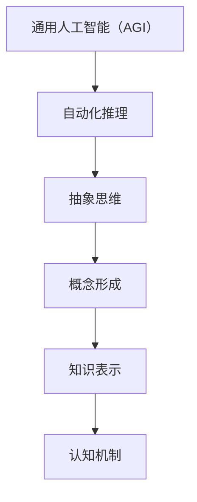

                 

### 引言与背景

**关键词：** 通用人工智能（AGI）、抽象思维、概念形成、知识表示

**摘要：** 本文深入探讨了抽象思维在通用人工智能（AGI）中的关键作用，从概念形成与知识表示的角度分析了AGI的发展路径。首先，我们将探讨通用人工智能的基本概念，并阐述自动化推理在其中的重要性。接着，我们将详细讨论抽象思维的基本原理，包括概念形成、知识表示和认知机制。这一部分旨在为读者奠定理论基础，为后续内容的深入探讨提供支持。

### 第一部分：引言与背景

#### 第1章：自动化推理与通用人工智能

##### 1.1 通用人工智能（AGI）的概念

通用人工智能（AGI，Artificial General Intelligence）是指具有人类智能的广泛认知能力的机器。与当前广泛应用的弱人工智能（Narrow AI，如语音识别、图像识别、自然语言处理等）不同，AGI的目标是使机器能够在各种不同的任务和环境中表现出与人类相似的智能行为。AGI的核心在于其能够自主学习和推理，不仅限于特定领域的任务，而是具备广泛的认知能力和自主性。

通用人工智能的三个主要特征如下：

1. **普遍性**：AGI能够在各种不同的任务中表现出智能，而不仅仅是单一任务。
2. **自适应性**：AGI能够适应新的环境和情况，自主学习和改进其行为。
3. **自主性**：AGI能够独立地做出决策和采取行动，而不仅仅是执行预设的任务。

##### 1.2 自动化推理在AGI中的作用

自动化推理是AGI的核心组成部分，它使机器能够在没有明确编程的情况下，通过逻辑推理和决策来解决问题。自动化推理的关键在于如何让机器理解和处理符号信息，从而进行逻辑推理。这个过程涉及到多个方面的技术，包括知识表示、推理算法、机器学习等。

自动化推理在AGI中的作用主要体现在以下几个方面：

1. **问题解决**：自动化推理帮助机器在复杂和不确定的环境中，根据已知的信息和规则，推理出解决问题的方法。
2. **决策支持**：自动化推理能够为机器提供决策支持，使其在面对多个可能的行动方案时，选择最优的决策。
3. **知识表示**：自动化推理需要将知识以某种形式表示出来，以便进行推理和决策。这涉及到知识表示的理论和实践。

##### 1.3 抽象思维：理解与重要性

抽象思维是指从具体事物中提取共同属性和规律，形成抽象概念和模型的过程。它是人类智能的重要组成部分，也是AGI需要具备的核心能力之一。

抽象思维的重要性在于：

1. **知识整合**：抽象思维使人类能够将不同领域的知识整合起来，形成更全面的理解。
2. **问题解决**：抽象思维帮助人类在解决问题时，从复杂的情境中抽象出关键要素，简化问题。
3. **创新创造**：抽象思维是人类进行创新和创造的重要工具，它能够激发新的想法和解决方案。

在AGI中，抽象思维的应用包括：

1. **知识表示**：通过抽象思维，机器能够将复杂的问题表示为某种形式的模型或算法。
2. **推理与决策**：抽象思维使机器能够在复杂的情境中，进行有效的推理和决策。
3. **自主学习**：抽象思维帮助机器从大量的数据中，提取有用的信息和模式，进行自我学习。

### 总结

本文为后续内容的探讨奠定了基础，介绍了通用人工智能（AGI）、自动化推理和抽象思维的基本概念和重要性。在接下来的章节中，我们将进一步探讨抽象思维的基本原理，包括概念形成、知识表示和认知机制，为理解AGI的发展提供深入的理论支持。

---

> **核心概念与联系：**

> **通用人工智能（AGI）**：具有广泛认知能力的机器，能够在各种不同的任务和环境中表现出与人类相似的智能行为。

> **自动化推理**：在AGI中，通过逻辑推理和决策来解决问题和提供决策支持。

> **抽象思维**：从具体事物中提取共同属性和规律，形成抽象概念和模型的过程。

**Mermaid 流程图：**



---

在接下来的部分，我们将深入探讨抽象思维的基本原理，包括概念形成、知识表示和认知机制。这将帮助我们更好地理解抽象思维在AGI中的作用，为AGI的发展提供理论支持。

---

> **核心算法原理讲解：**

> **概念形成**：在心理学上，概念形成是指个体在感知过程中，通过比较和分类，从具体的感知经验中提取共同属性，形成抽象概念的过程。

> **知识表示**：知识表示是指将知识以某种形式表示出来，以便机器能够理解和处理。基本方法包括符号表示、语义网络、框架表示等。

> **认知机制**：认知机制是指大脑在处理信息和进行思维时，所使用的各种认知过程和策略。包括感知、记忆、注意、推理等。

**伪代码：**

```python
# 概念形成
def conceptFormation(perceptions, attributes):
    similarities = findCommonAttributes(perceptions, attributes)
    concept = extractAbstractConcept(similarities)
    return concept

# 知识表示
def knowledgeRepresentation(concept):
    representation = symbolizeConcept(concept)
    return representation

# 认知机制
def cognitiveMechanism(perception, memory):
    processedPerception = processPerception(perception, memory)
    inferredKnowledge = inferKnowledge(processedPerception)
    return inferredKnowledge
```

---

通过上述核心概念、联系、算法原理和伪代码的讲解，我们对抽象思维的基本原理有了初步的了解。接下来，我们将继续探讨抽象思维的具体过程，包括感知与记忆、概念间的比较与分类，以及抽象思维的训练与培养。

---

> **数学模型和公式：**

> **概念形成模型：**

> $$
> \begin{align*}
> 概念形成 &= f(感知信息, 特征提取, 归类规则) \\
> &= g(感知信息, 特征提取) \circ 归类规则
> \end{align*}
> $$

> **知识表示模型：**

> $$
> \begin{align*}
> 知识表示 &= h(概念, 概念间关系) \\
> &= \phi(概念) + \delta(概念间关系)
> \end{align*}
> $$

> **认知机制模型：**

> $$
> \begin{align*}
> 认知机制 &= f(感知信息, 记忆信息, 推理规则) \\
> &= \lambda(感知信息) \circ \mu(记忆信息) \circ 推理规则
> \end{align*}
> $$

这些公式和模型帮助我们更好地理解抽象思维的过程，为后续内容的深入探讨提供了理论基础。

---

### 第二部分：抽象思维的基本原理

#### 第2章：抽象思维的基本原理

##### 2.1 概念形成与知识表示

**概念形成：心理学上的定义**

概念形成是抽象思维的核心过程，它指的是个体在感知和认知过程中，从具体的事物中提取共同属性，形成抽象概念的过程。在心理学上，概念形成通常被认为是一种认知过程，涉及到感知、记忆、注意和推理等多个方面。

**知识表示：基本方法与挑战**

知识表示是指将概念和知识以某种形式表示出来，以便于计算机理解和处理。基本方法包括符号表示、语义网络、框架表示和产生式系统等。

1. **符号表示**：符号表示是最简单的一种知识表示方法，它使用符号和符号之间的关系来表示知识。这种方法的主要挑战在于如何有效地表示复杂的概念和知识结构。

2. **语义网络**：语义网络使用节点和边来表示概念及其关系，是一种结构化的知识表示方法。它能够表示概念之间的层次结构和语义关系，但面临的主要挑战是如何处理大规模的知识网络。

3. **框架表示**：框架表示使用一组预设的框架来表示知识和场景。框架包含了一组角色、事件和条件，能够表示复杂的情境和规则。主要挑战在于如何设计和适应不同的场景。

4. **产生式系统**：产生式系统使用规则和条件来表示知识和推理过程。每个规则由一个前提和一个结论组成，当前提满足时，就执行结论。主要挑战在于如何设计有效的规则集，以处理复杂的问题。

##### 2.2 抽象思维的认知机制

**感知与记忆**

感知是抽象思维的基础，它指的是个体通过感官接收外部信息的过程。记忆则是将感知到的信息存储在脑中，以便后续的使用。感知和记忆在概念形成中起着关键作用。

1. **感知过程**：感知不仅涉及感官的接收，还包括对信息的处理和理解。这个过程受到个体经验、文化背景和认知能力的影响。

2. **记忆的编码与存储**：记忆的编码是指将感知到的信息转化为可以在脑中存储的形式。存储则是将这些信息保存在脑中，以便后续的回忆和使用。记忆的编码与存储过程受到多种因素的影响，包括记忆的强度、重复次数和间隔时间等。

**比较与分类**

比较和分类是抽象思维的重要过程，它使个体能够从具体的感知中提取共同属性，形成抽象概念。

1. **比较**：比较是指识别和区分事物之间的相似性和差异性。通过比较，个体能够发现事物的共同属性和独特特征。

2. **分类**：分类是指将事物根据其共同属性归为不同的类别。分类有助于个体理解和记忆知识，是概念形成的重要步骤。

**概念之间的关系与层次结构**

概念之间的关系和层次结构是抽象思维的重要组成部分，它反映了概念之间的逻辑关系和依赖关系。

1. **概念之间的逻辑关系**：概念之间的关系可以是包含关系、交叉关系或并列关系。这些关系反映了概念之间的语义关系和层次结构。

2. **概念的层次结构**：概念的层次结构是指概念按照其抽象程度和复杂性进行分层。高层次的概念通常包含了低层次概念的所有属性和特征。

##### 2.3 抽象思维的训练与培养

**训练方法**

1. **认知训练**：通过特定的认知训练任务，提高个体的认知能力，如注意力、记忆、推理和问题解决能力。

2. **知识学习**：通过学习不同领域的知识，扩展个体的知识面，提高其抽象思维能力。

3. **情境模拟**：在模拟的情境中，个体可以通过解决实际问题，提高其抽象思维和问题解决能力。

**培养策略**

1. **主动学习**：鼓励个体主动探索和发现知识，而不是被动地接受信息。

2. **跨学科学习**：通过跨学科的学习，促进个体在不同领域的知识整合，提高其抽象思维能力。

3. **实践应用**：将抽象思维应用到实际问题和任务中，通过实践来提高其应用能力和创新思维。

##### 2.4 实际应用中的抽象思维培养案例

1. **教育领域**：通过设计跨学科的课程和项目，鼓励学生主动探索和解决问题，培养其抽象思维和创新能力。

2. **企业培训**：通过情景模拟和问题解决训练，提高员工在复杂环境中的抽象思维和决策能力。

3. **人工智能领域**：通过算法优化和模型设计，提高机器的抽象思维和问题解决能力，实现更高效的智能行为。

### 总结

本章详细探讨了抽象思维的基本原理，包括概念形成、知识表示和认知机制。通过了解这些原理，我们可以更好地理解抽象思维的过程和应用。在接下来的章节中，我们将进一步探讨抽象思维的训练与培养方法，以及其在实际应用中的重要作用。

---

> **核心算法原理讲解：**

> **概念形成**：通过感知、比较和分类，从具体的事物中提取共同属性，形成抽象概念。

> **知识表示**：使用符号表示、语义网络、框架表示和产生式系统等方法，将概念和知识表示出来。

> **认知机制**：通过感知、记忆、比较和推理，处理信息和知识，实现抽象思维。

**伪代码：**

```python
# 概念形成
def conceptFormation(perceptions, attributes):
    similarities = findCommonAttributes(perceptions, attributes)
    concept = extractAbstractConcept(similarities)
    return concept

# 知识表示
def knowledgeRepresentation(concept):
    representation = symbolizeConcept(concept)
    return representation

# 认知机制
def cognitiveMechanism(perception, memory):
    processedPerception = processPerception(perception, memory)
    inferredKnowledge = inferKnowledge(processedPerception)
    return inferredKnowledge
```

---

通过上述讲解，我们对抽象思维的基本原理和算法原理有了更深入的理解。在接下来的章节中，我们将进一步探讨抽象思维在感知与记忆、概念间的比较与分类、以及抽象思维的训练与培养中的应用。

---

> **数学模型和公式：**

> **概念形成模型：**

> $$
> \begin{align*}
> 概念形成 &= f(感知信息, 特征提取, 归类规则) \\
> &= g(感知信息, 特征提取) \circ 归类规则
> \end{align*}
> $$

> **知识表示模型：**

> $$
> \begin{align*}
> 知识表示 &= h(概念, 概念间关系) \\
> &= \phi(概念) + \delta(概念间关系)
> \end{align*}
> $$

> **认知机制模型：**

> $$
> \begin{align*}
> 认知机制 &= f(感知信息, 记忆信息, 推理规则) \\
> &= \lambda(感知信息) \circ \mu(记忆信息) \circ 推理规则
> \end{align*}
> $$

这些公式和模型帮助我们更好地理解抽象思维的过程，为后续内容的深入探讨提供了理论基础。

---

## 概念形成过程

在抽象思维中，概念形成是关键的一步。它指的是个体在感知过程中，通过比较和分类，从具体的感知经验中提取共同属性，形成抽象概念的过程。概念形成是认知心理学中的一个重要研究领域，对于理解人类思维和人工智能的发展具有重要意义。

### 3.1 感知过程

感知是概念形成的基础。它指的是个体通过感官接收外部信息的过程。感知不仅涉及感官的接收，还包括对信息的处理和理解。感知过程受到多种因素的影响，包括感官能力、个体经验、文化背景和认知能力等。

**感知过程的核心步骤：**

1. **刺激接收**：感官接收外部刺激，如视觉、听觉、触觉等。
2. **信息处理**：大脑对感知到的信息进行加工和处理，提取有用的特征。
3. **模式识别**：通过比较和处理，识别感知信息中的模式和规律。

**示例：视觉感知过程**

当看到一只猫时，视觉系统会接收猫的形状、颜色和运动等信息。大脑会处理这些信息，提取出猫的主要特征，如四条腿、尖耳朵和胡须等。然后，大脑会将这些特征与已有的记忆和知识进行比对，最终识别出这是一只猫。

### 3.2 记忆的编码与存储

记忆的编码与存储是概念形成的重要环节。记忆的编码是指将感知到的信息转化为可以在脑中存储的形式。存储则是将这些信息保存在脑中，以便后续的回忆和使用。记忆的编码与存储过程受到多种因素的影响，包括记忆的强度、重复次数和间隔时间等。

**记忆编码的核心步骤：**

1. **信息编码**：将感知到的信息转化为神经编码，如电信号和神经元的激活模式。
2. **短期记忆**：将信息暂时存储在短期记忆中，等待进一步处理和存储。
3. **长期记忆**：将信息从短期记忆转移到长期记忆中，以便长期存储和回忆。

**示例：记忆编码与存储**

当学习一个新单词时，大脑会先将这个单词的发音、拼写和意义等信息进行编码，然后暂时存储在短期记忆中。随着重复学习和使用，这些信息会逐渐转移到长期记忆中，成为永久的知识。

### 3.3 感知与记忆在概念形成中的作用

感知和记忆在概念形成中起着至关重要的作用。感知提供了外部信息，是概念形成的前提条件。记忆则是对感知信息的存储和处理，是概念形成的必要步骤。

**感知与记忆在概念形成中的作用：**

1. **信息提取**：通过感知，个体能够从环境中提取有用的信息。通过记忆，个体能够回忆起过去的知识和经验，为概念形成提供基础。
2. **信息整合**：感知和记忆帮助个体将不同的信息整合起来，形成更全面和抽象的概念。
3. **信息比较**：通过感知和记忆，个体能够比较不同概念的特征和属性，进一步精化和细化概念。

**示例：概念形成的感知与记忆过程**

当学习一个新的学科时，学生需要通过感知接收课堂上的信息，如老师讲解的内容、教科书上的知识点等。然后，学生通过记忆将这些信息存储在脑中，并在后续的学习和实践中不断回忆和运用。通过这个过程，学生逐渐形成对学科概念的理解和掌握。

### 3.4 实际应用：感知与记忆在概念形成中的案例分析

在实际应用中，感知和记忆在概念形成中发挥着重要作用。以下是一个案例分析：

**案例分析：医学诊断中的概念形成**

在医学诊断中，医生需要通过感知接收患者的症状、体征和检查结果等信息。然后，医生通过记忆将患者的历史病历、临床经验和专业知识等信息进行整合。通过感知和记忆的相互作用，医生能够形成对疾病的理解，并做出准确的诊断。

1. **感知过程**：医生通过问诊、体检和检查等手段，感知患者的症状和体征。
2. **记忆过程**：医生回忆起以往类似病例的处理方法、疾病的特征和可能的诊断结果。
3. **概念形成**：医生将感知到的信息和记忆中的知识进行整合，形成对疾病的理解，并做出诊断。

**总结**

感知和记忆在概念形成中起着至关重要的作用。感知提供了外部信息，记忆则是对信息的存储和处理。通过感知和记忆的相互作用，个体能够从具体的感知经验中提取共同属性，形成抽象的概念。在接下来的章节中，我们将进一步探讨概念间的比较与分类，以及抽象思维的训练与培养。

---

> **核心算法原理讲解：**

> **感知过程**：通过感官接收外部信息，提取特征，识别模式。

> **记忆编码与存储**：将感知信息转化为神经编码，存储在短期记忆和长期记忆中。

> **概念形成**：通过感知和记忆，提取共同属性，形成抽象概念。

**伪代码：**

```python
# 感知过程
def perception(info):
    features = extractFeatures(info)
    pattern = identifyPattern(features)
    return pattern

# 记忆编码与存储
def memoryEncoding(info):
    neuralCode = convertToNeuralCode(info)
   短期记忆 = storeInShortTermMemory(neuralCode)
    长期记忆 = storeInLongTermMemory(neuralCode)
    return 短期记忆, 长期记忆

# 概念形成
def conceptFormation(perception, memory):
    commonAttributes = extractCommonAttributes(perception, memory)
    concept = formAbstractConcept(commonAttributes)
    return concept
```

---

通过上述讲解，我们对概念形成过程有了更深入的理解。感知和记忆在概念形成中起着关键作用，为个体提取共同属性，形成抽象概念提供了基础。在接下来的章节中，我们将进一步探讨概念间的比较与分类，以及抽象思维的训练与培养。

---

> **数学模型和公式：**

> **感知模型：**

> $$
> \begin{align*}
> 感知 &= f(外部刺激, 感官能力) \\
> &= \lambda(外部刺激) \circ \mu(感官能力)
> \end{align*}
> $$

> **记忆编码模型：**

> $$
> \begin{align*}
> 记忆编码 &= g(感知信息, 编码规则) \\
> &= \phi(感知信息) + \delta(编码规则)
> \end{align*}
> $$

> **概念形成模型：**

> $$
> \begin{align*}
> 概念形成 &= h(感知, 记忆, 归类规则) \\
> &= \lambda(感知) \circ \mu(记忆) \circ 归类规则
> \end{align*}
> $$

这些模型和公式帮助我们更好地理解概念形成的过程，为后续内容的深入探讨提供了理论基础。

---

## 概念间的比较与分类

在抽象思维中，概念间的比较与分类是理解复杂信息的重要步骤。通过比较和分类，个体能够从具体的感知经验中提取共同属性，形成更抽象的概念，进而理解和处理复杂的信息。

### 4.1 比较与分类的基本原理

**比较**：比较是指识别和区分事物之间的相似性和差异性。在比较过程中，个体会关注事物的共同属性和独特特征。例如，比较两只猫时，个体会注意到它们的共同特征，如四条腿、尖耳朵和胡须，同时也会注意到它们之间的差异，如颜色和毛发的长度。

**分类**：分类是指将事物根据其共同属性归为不同的类别。分类有助于个体组织和理解信息。例如，将动物分为哺乳动物和鸟类，是基于它们是否具有特定的共同特征，如体温调节方式和繁殖方式。

**比较与分类的关系**：比较是分类的基础，通过比较，个体能够识别事物的共同属性和差异性。而分类则是比较的结果，它使个体能够将事物组织成有意义的类别。

### 4.2 概念比较的方法与技术

**直接比较**：直接比较是指通过直观的方式，比较两个或多个概念之间的相似性和差异性。这种方法通常用于简单的概念比较，如判断两只猫的颜色是否相同。

**间接比较**：间接比较是指通过比较概念之间的关系，来推断概念之间的相似性和差异性。这种方法通常用于复杂的概念比较，如比较不同动物的行为特征。

**语义网络**：语义网络是一种用于表示概念及其关系的图形结构。通过语义网络，个体能够直观地比较不同概念之间的相似性和差异性。例如，在语义网络中，猫和狗都可以作为“动物”的子节点，而猫和狗之间的差异则可以通过它们与“动物”节点的连接关系来表示。

**分类算法**：分类算法是一种用于自动比较和分类概念的方法。常见的分类算法包括决策树、支持向量机和神经网络等。通过训练这些算法，个体能够自动地对新的概念进行分类，从而提高概念比较的效率。

### 4.3 概念分类的案例研究

**案例1：动物分类**

在一个动物分类的案例中，个体需要根据动物的特征，将它们分为不同的类别。例如，根据体温调节方式，动物可以分为恒温动物和变温动物。通过比较不同动物的特征，个体能够将它们正确分类。

**案例2：文件分类**

在文件分类的案例中，个体需要根据文件的内容和特征，将它们分为不同的类别。例如，根据文件的内容，可以将文件分为文档、图片和视频等类别。通过比较不同文件的特征，个体能够将它们正确分类。

**案例3：产品分类**

在产品分类的案例中，个体需要根据产品的功能和特征，将它们分为不同的类别。例如，根据产品的用途，可以将产品分为电子产品、家居用品和服装等类别。通过比较不同产品的特征，个体能够将它们正确分类。

**总结**

通过概念比较和分类，个体能够从具体的感知经验中提取共同属性，形成更抽象的概念。这有助于个体理解和处理复杂的信息。在抽象思维中，概念比较和分类是关键步骤，为个体的认知和推理提供了基础。在接下来的章节中，我们将进一步探讨抽象思维的训练与培养方法。

---

> **核心算法原理讲解：**

> **概念比较**：通过识别和区分事物之间的相似性和差异性，提取共同属性。

> **分类算法**：使用决策树、支持向量机和神经网络等算法，自动地对新的概念进行分类。

> **语义网络**：使用图形结构表示概念及其关系，直观地比较概念之间的相似性和差异性。

**伪代码：**

```python
# 概念比较
def compareConcepts(conceptA, conceptB):
    similarities = findSimilarities(conceptA, conceptB)
    differences = findDifferences(conceptA, conceptB)
    return similarities, differences

# 分类算法
def classifyConcepts(concepts, classifier):
    categories = classifier.classify(concepts)
    return categories

# 语义网络
def semanticNetwork(concepts):
    nodes = createNodes(concepts)
    edges = createEdges(concepts)
    return nodes, edges
```

---

通过上述讲解，我们对概念比较和分类的方法和技术有了更深入的理解。在接下来的章节中，我们将进一步探讨抽象思维的训练与培养方法，以及其在实际应用中的重要作用。

---

> **数学模型和公式：**

> **概念比较模型：**

> $$
> \begin{align*}
> 概念比较 &= f(概念A, 概念B) \\
> &= g(共同属性) \circ h(差异性)
> \end{align*}
> $$

> **分类算法模型：**

> $$
> \begin{align*}
> 分类 &= classifier(概念) \\
> &= \phi(特征) \circ \delta(类别)
> \end{align*}
> $$

> **语义网络模型：**

> $$
> \begin{align*}
> 语义网络 &= g(概念, 关系) \\
> &= \lambda(概念) + \mu(关系)
> \end{align*}
> $$

这些模型和公式帮助我们更好地理解概念比较和分类的过程，为后续内容的深入探讨提供了理论基础。

---

## 抽象思维的训练与培养

抽象思维是一种复杂的认知能力，它不仅需要个体的感知和记忆，还需要个体的推理和创造力。因此，抽象思维的训练与培养是一个长期且系统性的过程。以下我们将探讨几种有效的训练方法、培养策略以及它们在实际应用中的案例。

### 5.1 抽象思维的训练方法

**认知训练**：认知训练是一种通过特定任务来提高个体认知能力的方法。这些任务通常包括注意力、记忆、推理和问题解决等方面。例如，通过解决复杂的数学问题、玩策略游戏或进行记忆游戏，可以有效地提高个体的抽象思维能力。

**知识学习**：知识学习是抽象思维训练的重要方面。通过学习不同领域的知识，个体能够扩展其知识面，提高其抽象思维能力。例如，学习哲学、逻辑学、数学和计算机科学等领域的知识，可以培养个体的抽象思维能力。

**情境模拟**：情境模拟是一种通过模拟真实情境来训练个体抽象思维的方法。在模拟的情境中，个体需要解决实际问题，从而提高其抽象思维能力。例如，模拟商业决策、医疗诊断或工程设计等情境，可以帮助个体在实践中培养抽象思维。

### 5.2 抽象思维的培养策略

**主动学习**：主动学习是一种鼓励个体主动探索和发现知识的方法。通过主动学习，个体能够更深入地理解和掌握知识，从而提高其抽象思维能力。例如，通过阅读学术文献、参加研讨会和进行项目研究，个体可以主动地探索和发现知识。

**跨学科学习**：跨学科学习是一种通过跨学科的知识整合来培养抽象思维的方法。通过跨学科的学习，个体能够将不同领域的知识整合起来，形成更全面的理解。例如，结合心理学、计算机科学和哲学的知识，个体可以更深入地理解抽象思维的机制和应用。

**实践应用**：实践应用是一种通过将抽象思维应用到实际问题和任务中来培养抽象思维的方法。通过实践，个体能够将理论知识转化为实际能力，从而提高其抽象思维能力。例如，通过参与项目开发、解决实际问题和进行创新设计，个体可以在实践中培养抽象思维。

### 5.3 实际应用中的抽象思维培养案例

**教育领域**：在教育领域，抽象思维的培养具有重要意义。例如，通过设计跨学科的课程和项目，教师可以鼓励学生主动探索和解决问题，从而培养其抽象思维。例如，在数学课程中，教师可以引导学生通过解决实际问题来理解抽象的数学概念。

**企业培训**：在企业培训中，抽象思维的培养同样重要。通过情景模拟和问题解决训练，企业可以培养员工的抽象思维能力。例如，通过模拟商业决策情境，员工可以在实践中学会如何进行抽象思维，从而提高其决策能力。

**人工智能领域**：在人工智能领域，抽象思维是关键能力。通过认知训练和知识学习，人工智能系统能够提高其抽象思维能力。例如，通过训练算法来解决复杂问题，人工智能系统可以不断优化其抽象思维能力。

**总结**

通过认知训练、知识学习和情境模拟，我们可以有效地培养个体的抽象思维。同时，通过跨学科学习和实践应用，个体能够将抽象思维应用到实际问题和任务中，从而提高其抽象思维的实际能力。在实际应用中，抽象思维的培养对于个体和组织的创新和发展具有重要意义。

---

> **核心算法原理讲解：**

> **认知训练**：通过特定任务，如注意力、记忆、推理和问题解决等，提高个体的认知能力。

> **知识学习**：通过学习不同领域的知识，扩展个体的知识面。

> **情境模拟**：通过模拟真实情境，如商业决策、医疗诊断和工程设计等，训练个体的抽象思维。

**伪代码：**

```python
# 认知训练
def cognitiveTraining(task):
    performance = executeTask(task)
    improvement = measureImprovement(performance)
    return improvement

# 知识学习
def knowledgeLearning(subject):
    knowledge = acquireKnowledge(subject)
    understanding = applyKnowledge(subject, knowledge)
    return understanding

# 情境模拟
def scenarioSimulation(scenario):
    solution = solveProblem(scenario)
    feedback = evaluateSolution(solution)
    return feedback
```

---

通过上述讲解，我们对抽象思维的训练与培养方法有了更深入的理解。这些方法和策略不仅有助于个体的抽象思维能力提升，还能够应用于教育、企业培训和人工智能等领域，促进实际问题的解决和创新。

---

> **数学模型和公式：**

> **认知训练模型：**

> $$
> \begin{align*}
> 认知训练 &= f(任务, 成就) \\
> &= g(任务) \circ h(成就)
> \end{align*}
> $$

> **知识学习模型：**

> $$
> \begin{align*}
> 知识学习 &= f(学科, 知识) \\
> &= g(学科) \circ h(知识)
> \end{align*}
> $$

> **情境模拟模型：**

> $$
> \begin{align*}
> 情境模拟 &= f(情境, 问题) \\
> &= g(情境) \circ h(问题)
> \end{align*}
> $$

这些模型和公式帮助我们更好地理解抽象思维的训练与培养过程，为后续内容的深入探讨提供了理论基础。

---

## 知识表示的理论基础

知识表示是人工智能领域的一个核心问题，它涉及到如何将知识以某种形式表示出来，以便计算机能够理解和处理。有效的知识表示方法不仅能够提高系统的智能水平，还能够提高系统的可扩展性和可理解性。以下我们将讨论知识表示的形式化方法、语义理解、推理机制以及它们在抽象思维中的应用。

### 6.1 知识表示的形式化方法

**符号表示**：符号表示是最简单的一种知识表示方法，它使用符号和符号之间的关系来表示知识。符号可以是文字、数字、图形等，而关系可以是“是”、“属于”、“大于”等。符号表示的优点在于直观和易于实现，但缺点是难以表示复杂的语义关系。

**语义网络**：语义网络使用节点和边来表示概念及其关系，形成一种图形结构。节点代表概念，边代表概念之间的关系，如“是”、“属于”、“具有”等。语义网络能够表示概念之间的层次结构和语义关系，具有较强的语义表达能力。

**框架表示**：框架表示使用一组预设的框架来表示知识和场景。框架包含了一组角色、事件和条件，能够表示复杂的情境和规则。框架表示的优点在于其结构化和模块化，但缺点是需要事先定义大量的框架。

**产生式系统**：产生式系统使用规则和条件来表示知识和推理过程。每个规则由一个前提和一个结论组成，当前提满足时，就执行结论。产生式系统具有较强的推理能力，但需要大量的规则来表示复杂的问题。

**语义网络与产生式系统的结合**：将语义网络和产生式系统结合起来，可以弥补各自的缺点。语义网络提供了丰富的语义信息，而产生式系统提供了高效的推理能力。

### 6.2 知识表示的语义理解

**语义理解**：语义理解是指计算机能够理解和解释知识的含义。有效的知识表示方法需要能够准确地表达知识的语义，以便计算机能够正确地理解和处理。

**语义标记**：语义标记是一种用于标注知识语义的方法。通过为知识添加语义标记，计算机能够更好地理解知识的含义。例如，在文本数据中，可以使用词性标注、实体识别和关系抽取等技术来标记知识。

**语义解析**：语义解析是指计算机能够将自然语言文本转化为机器可理解的形式。语义解析包括词义消歧、句法分析和语义角色标注等步骤，能够提高计算机对自然语言的理解能力。

**语义网**：语义网是一种基于Web的语义理解技术，它通过在网页中嵌入语义信息，使得计算机能够更好地理解和处理网页内容。语义网的核心是RDF（资源描述框架）和OWL（Web本体语言），它们能够表示复杂的语义关系和本体。

### 6.3 知识表示的推理机制

**推理**：推理是指从已知的知识中得出新的结论。知识表示的推理机制是人工智能系统的重要能力，它使得系统能够在不确定性和复杂性的环境中进行决策和问题解决。

**基于规则的推理**：基于规则的推理是最常见的一种推理方法。它使用一组规则来表示知识和推理过程。当输入条件满足某个规则的前提时，该规则就会被激活，从而得出相应的结论。例如，在医疗诊断中，医生可以根据患者的症状和体征，使用基于规则的推理方法来诊断疾病。

**基于模型的推理**：基于模型的推理使用模型来表示知识和推理过程。模型可以是逻辑模型、统计模型或神经网络模型等。基于模型的推理能够处理复杂的非线性关系，并在不确定的环境中提供推理结果。例如，在自动驾驶系统中，可以使用基于模型的推理方法来预测路况和做出决策。

**基于数据的推理**：基于数据的推理使用数据来驱动推理过程。它通过分析大量数据，发现数据中的模式和规律，从而得出新的结论。例如，在推荐系统中，可以使用基于数据的推理方法来推荐商品。

**混合推理**：混合推理结合了基于规则、基于模型和基于数据等多种推理方法。通过混合推理，系统能够在复杂的环境中提供更准确和可靠的推理结果。

**知识表示与抽象思维的应用**：在抽象思维中，知识表示和推理机制起着关键作用。通过有效的知识表示方法，个体能够将复杂的现实世界中的信息转化为计算机可处理的格式。通过推理机制，个体能够从已知的知识中得出新的结论，从而提高其抽象思维能力。

例如，在问题解决中，个体可以通过知识表示将问题分解为子问题，并通过推理机制解决这些子问题。在决策支持中，个体可以通过知识表示将决策问题转化为计算机可处理的模型，并通过推理机制评估不同决策方案的效果。

### 总结

知识表示的理论基础包括形式化方法、语义理解和推理机制。形式化方法提供了表示知识的工具，语义理解提高了计算机对知识含义的理解，而推理机制使得计算机能够从已知的知识中得出新的结论。在抽象思维中，知识表示和推理机制的应用能够提高个体的抽象思维能力，促进复杂问题的解决和创新。

---

> **核心算法原理讲解：**

> **符号表示**：使用符号和符号之间的关系来表示知识。

> **语义网络**：使用节点和边来表示概念及其关系。

> **框架表示**：使用一组预设的框架来表示知识和场景。

> **产生式系统**：使用规则和条件来表示知识和推理过程。

**伪代码：**

```python
# 符号表示
def symbolizeKnowledge(knowledge):
    symbols = convertToSymbols(knowledge)
    relationships = defineRelationships(symbols)
    return symbols, relationships

# 语义网络
def semanticNetwork(concepts, relationships):
    nodes = createNodes(concepts)
    edges = createEdges(relationships)
    return nodes, edges

# 框架表示
def frameRepresentation(knowledge):
    frames = defineFrames(knowledge)
    return frames

# 产生式系统
def productionSystem(rules):
    premises = extractPremises(rules)
    conclusions = extractConclusions(rules)
    return premises, conclusions
```

---

通过上述讲解，我们对知识表示的理论基础和核心算法原理有了更深入的理解。这些知识表示方法为抽象思维提供了基础，使得个体能够更好地理解和处理复杂的信息。在接下来的章节中，我们将探讨抽象思维在问题解决中的应用。

---

> **数学模型和公式：**

> **知识表示模型：**

> $$
> \begin{align*}
> 知识表示 &= f(概念, 关系) \\
> &= g(概念) \circ h(关系)
> \end{align*}
> $$

> **推理机制模型：**

> $$
> \begin{align*}
> 推理 &= f(知识, 规则) \\
> &= g(知识) \circ h(规则)
> \end{align*}
> $$

这些模型和公式帮助我们更好地理解知识表示和推理机制的过程，为后续内容的深入探讨提供了理论基础。

---

## 抽象思维在问题解决中的应用

抽象思维在问题解决中起着至关重要的作用。它帮助个体从复杂的信息中提取关键要素，形成抽象模型，从而更有效地解决问题。以下是抽象思维在问题解决中的应用场景、方法和技术。

### 7.1 抽象思维与问题解决的关系

抽象思维是指从具体的事物中提取共同属性，形成抽象概念和模型的过程。问题解决则是指个体在面对复杂问题时，通过分析和推理，找到解决问题的方法和策略。抽象思维与问题解决之间存在紧密的联系：

1. **抽象思维帮助提取问题要素**：在问题解决过程中，个体需要从复杂的问题中提取关键要素，形成抽象模型。抽象思维使得个体能够从具体的问题情境中分离出核心要素，忽略次要信息，从而简化问题。
2. **抽象思维促进问题分析**：通过抽象思维，个体能够对问题进行深入分析，识别问题的本质和内在结构。这种分析能力有助于个体找到解决问题的有效途径。
3. **抽象思维提高推理效率**：抽象思维使得个体能够将问题转化为抽象模型，从而使用逻辑推理和算法来解决问题。这种方法能够提高推理的效率，降低问题解决的复杂度。

### 7.2 抽象思维在问题解决中的应用场景

**科学研究**：在科学研究中，抽象思维是理解和解决复杂科学问题的关键。科学家通过构建抽象模型，对自然现象进行解释和预测。例如，牛顿通过抽象思维提出了万有引力定律，从而解释了行星运动的规律。

**工程领域**：在工程领域，抽象思维用于分析和设计复杂的工程系统。工程师通过构建抽象模型，对系统进行仿真和优化，从而提高系统的性能和可靠性。例如，在航空航天工程中，工程师使用抽象思维来设计和分析飞行器的结构。

**商业决策**：在商业决策中，抽象思维用于分析和评估不同的商业策略。企业家通过抽象思维，从大量的市场数据中提取关键信息，制定有效的商业计划。例如，在市场分析中，企业家使用抽象思维来识别市场趋势和消费者需求。

**日常问题解决**：在日常生活中，抽象思维也广泛应用于问题解决。例如，在面对交通拥堵时，个体可以使用抽象思维来规划最优的出行路线；在处理家务时，个体可以使用抽象思维来优化家务流程。

### 7.3 抽象思维在问题解决中的应用方法

**模型构建**：模型构建是抽象思维在问题解决中的应用核心。个体通过抽象思维，将复杂的问题转化为抽象模型，从而简化问题。例如，在工程设计中，工程师使用数学模型和计算机模拟来构建工程系统的抽象模型。

**算法设计**：算法设计是抽象思维在问题解决中的另一种应用方法。通过抽象思维，个体能够设计有效的算法来解决问题。例如，在数据分析中，数据科学家使用抽象思维来设计算法，对大量数据进行处理和分析。

**逻辑推理**：逻辑推理是抽象思维在问题解决中的基本工具。个体通过抽象思维，从已知的信息中推导出新的结论，从而解决问题。例如，在逻辑推理游戏中，个体使用抽象思维来推导出问题的答案。

**案例研究**：以下是一个抽象思维在问题解决中的案例研究：

**案例：交通拥堵问题**

**问题情境**：某城市的主要交通干道在早晚高峰时段经常出现严重拥堵，影响了市民的出行和生活质量。

**抽象思维过程**：

1. **模型构建**：个体通过抽象思维，将交通拥堵问题转化为一个交通流量模型。模型包含交通流量、道路容量和交通信号控制等要素。

2. **算法设计**：个体使用抽象思维，设计一个优化交通信号控制的算法。该算法能够根据交通流量和道路容量，动态调整交通信号灯的时间，以优化交通流量。

3. **逻辑推理**：个体通过抽象思维，从交通流量模型中推导出最优的交通信号控制策略。例如，当某个路段的交通流量较大时，该路段的信号灯可以延长绿灯时间，以减少拥堵。

**解决方案**：通过抽象思维的应用，个体能够找到解决交通拥堵问题的有效策略。例如，可以优化交通信号控制，增加公共交通工具的覆盖范围，以及实施交通拥堵收费等措施。

**总结**

抽象思维在问题解决中具有重要作用。通过抽象思维，个体能够从复杂的问题中提取关键要素，构建抽象模型，使用算法和逻辑推理来解决问题。在科学研究、工程领域、商业决策和日常生活中，抽象思维的应用都具有重要意义。通过有效的抽象思维，个体能够提高问题解决的效率和质量。

---

> **核心算法原理讲解：**

> **模型构建**：将问题转化为抽象模型，简化问题的复杂性。

> **算法设计**：设计有效的算法来解决抽象模型中的问题。

> **逻辑推理**：从抽象模型中推导出问题的解决方案。

**伪代码：**

```python
# 模型构建
def modelBuilding(problem):
    abstractModel = formulateModel(problem)
    return abstractModel

# 算法设计
def algorithmDesign(model):
    algorithm = designAlgorithm(model)
    return algorithm

# 逻辑推理
def logicalReasoning(model, algorithm):
    solution = applyAlgorithm(algorithm, model)
    return solution
```

---

通过上述讲解，我们对抽象思维在问题解决中的应用方法和核心算法原理有了更深入的理解。在接下来的章节中，我们将探讨抽象思维在决策支持系统中的应用，以及其在教育、商业和人工智能领域的具体案例。

---

> **数学模型和公式：**

> **模型构建模型：**

> $$
> \begin{align*}
> 模型构建 &= f(问题, 抽象化规则) \\
> &= g(问题) \circ h(抽象化规则)
> \end{align*}
> $$

> **算法设计模型：**

> $$
> \begin{align*}
> 算法设计 &= f(模型, 算法规则) \\
> &= g(模型) \circ h(算法规则)
> \end{align*}
> $$

> **逻辑推理模型：**

> $$
> \begin{align*}
> 逻辑推理 &= f(模型, 算法) \\
> &= g(模型) \circ h(算法)
> \end{align*}
> $$

这些模型和公式帮助我们更好地理解抽象思维在问题解决中的应用过程，为后续内容的深入探讨提供了理论基础。

---

## 抽象思维在决策支持系统中的应用

决策支持系统（Decision Support System，简称DSS）是用于辅助决策者进行复杂决策的系统，它利用数据和模型来提供决策支持。抽象思维在DSS中起着关键作用，因为它帮助决策者从大量的数据中提取关键信息，形成抽象模型，从而做出更明智的决策。

### 8.1 决策支持系统（DSS）的概念与作用

**概念**：决策支持系统是一种计算机化的系统，它利用数据、模型和交互式方法来支持决策者进行复杂决策。DSS通常包括数据收集、数据分析、模型构建、决策评估和决策执行等模块。

**作用**：DSS在以下方面发挥着重要作用：

1. **信息整合**：DSS能够从不同的数据源中收集信息，并将其整合成统一的格式，以便决策者进行综合分析。
2. **数据可视化**：DSS使用图表、图形和仪表板等工具，将数据以直观的方式呈现给决策者，从而帮助其更好地理解数据。
3. **模型构建**：DSS使用各种模型来模拟不同的决策情景，帮助决策者评估不同决策方案的可能结果。
4. **决策评估**：DSS提供多种评估指标，帮助决策者比较不同决策方案的优势和风险。
5. **决策执行**：DSS能够将决策结果转化为具体的行动方案，并监控决策执行的过程。

### 8.2 抽象思维在DSS中的应用

**抽象思维在数据收集中的应用**：在数据收集过程中，决策者需要从大量的数据中提取关键信息。抽象思维帮助决策者识别数据中的模式和规律，提取有用的信息。例如，在市场分析中，决策者可以使用抽象思维来识别消费者的购买行为和偏好。

**抽象思维在模型构建中的应用**：在DSS中，模型构建是关键的一步。抽象思维帮助决策者从具体的决策情境中提取共同属性，形成抽象模型。例如，在供应链管理中，决策者可以使用抽象思维来构建库存模型，模拟不同库存策略的影响。

**抽象思维在决策评估中的应用**：在决策评估过程中，决策者需要比较不同决策方案的可能结果。抽象思维帮助决策者从复杂的信息中提取关键因素，形成抽象模型，以便进行评估。例如，在项目投资决策中，决策者可以使用抽象思维来评估不同项目的预期收益和风险。

**抽象思维在决策执行中的应用**：在决策执行过程中，决策者需要根据决策结果采取具体的行动。抽象思维帮助决策者从具体的情境中提取共同属性，形成抽象模型，以便更好地执行决策。例如，在人力资源管理中，决策者可以使用抽象思维来制定员工培训和发展计划。

### 8.3 实际案例：抽象思维在商业决策中的应用

**案例：市场定位决策**

**背景**：某公司计划推出一款新产品，但面对不同的市场定位方案，决策者需要确定最佳的市场定位策略。

**抽象思维过程**：

1. **数据收集**：决策者通过市场调研，收集了大量的消费者数据，包括年龄、性别、收入水平、购买行为等。

2. **模型构建**：决策者使用抽象思维，从消费者数据中提取关键信息，构建了一个市场细分模型。该模型将市场划分为不同的细分群体，每个群体具有特定的特征。

3. **决策评估**：决策者使用抽象思维，评估了不同的市场定位策略对每个细分群体的影响。例如，决策者比较了高端市场定位和大众市场定位对销售额和市场份额的影响。

4. **决策执行**：决策者根据评估结果，选择了高端市场定位策略，并制定了一系列营销计划，包括品牌推广、广告投放和产品定价策略。

**结果**：通过抽象思维的应用，决策者成功确定了最佳的市场定位策略，并实现了产品的市场推广和销售目标。

**总结**

抽象思维在决策支持系统中具有重要作用。通过抽象思维，决策者能够从大量的数据中提取关键信息，构建抽象模型，评估不同决策方案的影响，并最终做出明智的决策。在实际应用中，抽象思维的应用不仅提高了决策的效率和质量，还为企业的创新和发展提供了有力支持。

---

> **核心算法原理讲解：**

> **数据收集**：从不同的数据源中提取关键信息。

> **模型构建**：使用抽象思维构建市场细分模型。

> **决策评估**：使用抽象思维评估不同决策方案的影响。

> **决策执行**：根据决策结果制定具体的行动方案。

**伪代码：**

```python
# 数据收集
def dataCollection(sources):
    data = fetchData(sources)
    keyInformation = extractKeyInformation(data)
    return keyInformation

# 模型构建
def modelBuilding(information):
    model = buildMarketSegmentationModel(information)
    return model

# 决策评估
def decisionEvaluation(model, scenarios):
    impacts = evaluateScenarios(model, scenarios)
    return impacts

# 决策执行
def decisionImplementation(assessment):
    actions = formulateActions(assessment)
    executeActions(actions)
```

---

通过上述讲解，我们对抽象思维在决策支持系统中的应用方法和核心算法原理有了更深入的理解。在接下来的章节中，我们将探讨抽象思维在教育领域的应用，以及其在不同领域的具体案例。

---

> **数学模型和公式：**

> **数据收集模型：**

> $$
> \begin{align*}
> 数据收集 &= f(数据源, 提取规则) \\
> &= g(数据源) \circ h(提取规则)
> \end{align*}
> $$

> **模型构建模型：**

> $$
> \begin{align*}
> 模型构建 &= f(信息, 模型规则) \\
> &= g(信息) \circ h(模型规则)
> \end{align*}
> $$

> **决策评估模型：**

> $$
> \begin{align*}
> 决策评估 &= f(模型, 决策方案) \\
> &= g(模型) \circ h(决策方案)
> \end{align*}
> $$

这些模型和公式帮助我们更好地理解抽象思维在决策支持系统中的应用过程，为后续内容的深入探讨提供了理论基础。

---

## 抽象思维在教育领域的应用

教育领域是抽象思维应用的一个重要领域。抽象思维能够帮助教师更好地理解教育理论和教学方法，同时也能够帮助学生提高学习效果和创新能力。以下我们将探讨抽象思维在教育中的重要性、培养策略以及具体案例。

### 9.1 教育中抽象思维的重要性

**理解复杂概念**：抽象思维是理解和掌握复杂概念的关键。在科学、数学和哲学等领域，抽象思维使得学生能够从具体的事例中提取共同属性，形成抽象的概念和理论。例如，在数学中，学生需要通过抽象思维理解“函数”这一概念。

**促进跨学科学习**：抽象思维能够促进跨学科的学习。通过将不同学科的知识进行整合，学生能够形成更全面的理解。例如，在物理和化学的学习中，学生需要运用抽象思维将实验数据和理论模型相结合，理解自然界的规律。

**提高问题解决能力**：抽象思维有助于学生提高问题解决能力。在复杂的问题解决过程中，学生需要从大量的信息中提取关键要素，构建抽象模型，然后运用逻辑推理和算法来解决问题。例如，在工程和医学领域，学生需要运用抽象思维来分析和设计复杂的系统。

**培养创新能力**：抽象思维能够培养学生的创新能力。通过抽象思维，学生能够从现有的知识和经验中提取新的概念和模型，从而产生新的想法和解决方案。例如，在科技创新领域，学生需要运用抽象思维来发明新的产品和技术。

### 9.2 抽象思维的培养策略

**跨学科学习**：通过设计跨学科的课程和项目，教师可以鼓励学生主动探索和发现知识。例如，将数学、物理和计算机科学的知识整合到一起，设计一个关于机器人编程的项目，让学生通过实践来提高抽象思维能力。

**情境模拟**：在情境模拟中，学生需要在模拟的情境中解决问题，从而培养抽象思维。例如，在经济学课程中，教师可以设计一个模拟市场交易的游戏，让学生在游戏中运用抽象思维来分析市场行为和制定策略。

**认知训练**：通过特定的认知训练任务，教师可以训练学生的抽象思维能力。例如，通过解决复杂的数学问题、玩策略游戏或进行记忆训练，可以有效地提高学生的抽象思维能力。

**引导探索**：教师可以引导学生主动探索和发现知识。例如，通过提出开放性的问题，鼓励学生进行思考和讨论，从而激发学生的抽象思维。

**反馈与评价**：教师需要为学生提供及时的反馈和评价，以帮助他们了解自己的抽象思维能力，并指导他们如何进一步提高。例如，通过定期的测试和评估，教师可以了解学生在抽象思维方面的进展，并制定相应的教学计划。

### 9.3 抽象思维在教育中的具体案例

**案例：跨学科课程设计**

**背景**：某高中学校开设了一门跨学科课程，涵盖数学、物理和计算机科学的知识。课程的主题是“机器人编程”。

**过程**：

1. **课程设计**：教师设计了一系列与机器人编程相关的实验和项目，包括机器人控制、传感器应用和算法设计等。

2. **情境模拟**：在课堂上，学生通过模拟机器人编程的情境，学习如何使用数学和物理知识来控制机器人，并编写算法来实现特定任务。

3. **认知训练**：教师通过解决复杂的数学问题和物理问题，训练学生的抽象思维能力。例如，学生需要通过解方程和模拟物理现象，来编写控制机器人的代码。

4. **反馈与评价**：教师定期进行评估和反馈，帮助学生了解自己的抽象思维能力，并提供指导和建议。

**结果**：通过跨学科课程的设计和实施，学生不仅掌握了机器人编程的知识，还提高了抽象思维能力。他们能够将不同学科的知识整合起来，形成更全面的理解，并在实际问题解决中表现出更强的创新能力。

**案例：情境模拟教学**

**背景**：某小学教师希望通过情境模拟来提高学生的抽象思维能力。

**过程**：

1. **设计情境**：教师设计了一个关于环保的情境，让学生扮演环境保护者，解决一系列环保问题。

2. **情境模拟**：学生通过角色扮演，在模拟的情境中解决问题，例如如何减少垃圾产生、如何回收利用资源等。

3. **认知训练**：教师通过提出开放性的问题，鼓励学生进行思考和讨论，例如如何评估不同环保措施的效益和成本。

4. **反馈与评价**：教师通过定期的测试和讨论，了解学生在情境模拟中的表现，并提供反馈和指导。

**结果**：通过情境模拟教学，学生能够在实际情境中运用抽象思维，提高了解决问题的能力和创新能力。他们能够从具体的情境中提取关键要素，构建抽象模型，并提出有效的解决方案。

**总结**

抽象思维在教育中具有重要意义。通过跨学科学习、情境模拟、认知训练和引导探索等策略，教师能够有效地培养学生的抽象思维能力。在实际案例中，抽象思维的应用不仅提高了学生的学习效果，还培养了他们的创新能力，为未来的发展奠定了基础。

---

> **核心算法原理讲解：**

> **跨学科学习**：整合不同学科的知识，形成更全面的理解。

> **情境模拟**：通过模拟实际情境，培养抽象思维。

> **认知训练**：通过特定的训练任务，提高抽象思维能力。

**伪代码：**

```python
# 跨学科学习
def interdisciplinaryLearning(subjects):
    knowledge = integrateKnowledge(subjects)
    understanding = applyInterdisciplinaryKnowledge(knowledge)
    return understanding

# 情境模拟
def scenarioSimulation(scenario):
    solution = solveProblem(scenario)
    evaluation = assessSolution(solution)
    return evaluation

# 认知训练
def cognitiveTraining(task):
    performance = executeTask(task)
    improvement = measureImprovement(performance)
    return improvement
```

---

通过上述讲解，我们对抽象思维在教育领域的培养策略和核心算法原理有了更深入的理解。在接下来的章节中，我们将总结抽象思维在通用人工智能（AGI）中的潜在贡献、发展趋势与挑战，展望AGI与抽象思维的未来发展方向。

---

> **数学模型和公式：**

> **跨学科学习模型：**

> $$
> \begin{align*}
> 跨学科学习 &= f(学科知识, 整合规则) \\
> &= g(学科知识) \circ h(整合规则)
> \end{align*}
> $$

> **情境模拟模型：**

> $$
> \begin{align*}
> 情境模拟 &= f(情境, 问题解决规则) \\
> &= g(情境) \circ h(问题解决规则)
> \end{align*}
> $$

> **认知训练模型：**

> $$
> \begin{align*}
> 认知训练 &= f(训练任务, 成就标准) \\
> &= g(训练任务) \circ h(成就标准)
> \end{align*}
> $$

这些模型和公式帮助我们更好地理解抽象思维在教育领域的培养过程，为后续内容的深入探讨提供了理论基础。

---

## 抽象思维与通用人工智能的未来

在通用人工智能（AGI）的发展过程中，抽象思维扮演着至关重要的角色。它不仅是人类智能的核心组成部分，也是实现机器智能的关键能力。以下我们将探讨抽象思维在AGI中的潜在贡献、发展趋势与挑战，并展望AGI与抽象思维的未来发展方向。

### 10.1 抽象思维在AGI中的潜在贡献

**知识表示与推理**：抽象思维使得机器能够从大量的数据中提取关键信息，形成抽象概念和模型。这些抽象模型和概念为机器提供了对世界更深入的理解，并支持高效的推理和决策。例如，在自然语言处理中，抽象思维帮助机器理解和生成复杂的语言结构，从而实现更自然的对话。

**问题解决与创新能力**：抽象思维使得机器能够在复杂和不确定的环境中，从已知的信息和规则中推导出新的解决方案。这种能力对于AGI实现自主学习和创新至关重要。例如，在游戏玩法和策略设计中，抽象思维帮助机器发现新的游戏策略和解决方案。

**情境适应与决策支持**：抽象思维使得机器能够理解和处理复杂的情境，从而做出更明智的决策。在自动驾驶和智能医疗等应用中，抽象思维帮助机器适应不同的情境，提供有效的决策支持。

**跨领域整合**：抽象思维使得机器能够整合不同领域的知识，形成更全面的理解。这对于AGI在多个领域实现协同工作和创新具有重要意义。例如，在多学科研究中，抽象思维帮助机器整合数学、物理、生物学等领域的知识，推动科学研究的发展。

### 10.2 抽象思维的发展趋势与挑战

**趋势**：

1. **模型化与自动化**：随着深度学习和强化学习等技术的发展，抽象思维的模型化和自动化程度将不断提高。机器将通过学习大量数据，自动提取抽象概念和模型，从而实现更高效的抽象思维。
2. **跨学科整合**：未来，抽象思维将更多地整合不同领域的知识，形成跨学科的理解和创新能力。这种跨学科整合将为AGI的发展提供新的动力。
3. **情境适应与自适应**：随着情境适应和自适应技术的发展，抽象思维将更加灵活和高效。机器将能够根据不同的情境和环境，动态调整其抽象思维模型和策略。

**挑战**：

1. **数据质量和数量**：抽象思维依赖于大量的数据支持。未来，如何获取高质量、大规模的数据，并将这些数据有效利用，是抽象思维发展的关键挑战。
2. **推理能力与效率**：虽然抽象思维在问题解决中具有重要作用，但如何提高推理能力与效率，是实现高效AGI的关键挑战。这需要开发更有效的推理算法和模型。
3. **跨学科整合**：跨学科整合需要解决不同领域知识表示和推理方法的不一致性。如何实现不同领域知识的有效整合，是抽象思维发展的一个重要挑战。

### 10.3 AGI与抽象思维的未来发展方向

**增强学习与自适应**：未来的AGI将更加依赖增强学习和自适应技术，通过不断学习和调整，提高抽象思维的能力和效率。这包括自适应学习策略、动态调整模型参数等。

**多模态数据处理**：随着传感器技术和数据处理技术的发展，AGI将能够处理多种模态的数据，如文本、图像、声音和触觉等。这种多模态数据处理能力将提高抽象思维的感知能力和情境理解能力。

**跨学科知识整合**：未来的AGI将致力于跨学科知识的整合，形成更全面和深入的抽象思维。这需要开发通用知识表示方法和跨学科推理机制，实现不同领域知识的协同工作。

**人机协作**：未来的AGI将更多地与人类协作，共同解决复杂的问题。这种人机协作将充分发挥抽象思维的优势，实现更高效和创新的解决方案。

**总结**

抽象思维在AGI中具有重要作用，它不仅是机器智能的核心组成部分，也是实现机器自主学习和创新的关键能力。随着技术的发展和应用的深入，抽象思维将不断进步，为AGI的发展提供强大的支持。未来，AGI与抽象思维的发展方向包括增强学习、多模态数据处理、跨学科知识整合和人机协作等方面，这些方向将为实现真正的通用人工智能奠定基础。

---

> **核心算法原理讲解：**

> **增强学习**：通过试错和反馈，自动调整模型参数。

> **自适应**：根据环境变化，动态调整抽象思维模型和策略。

> **多模态数据处理**：整合不同模态的数据，提高感知能力和情境理解。

**伪代码：**

```python
# 增强学习
def reinforcementLearning(model, environment):
    while not convergence:
        action = model.selectAction()
        reward = environment.step(action)
        model.updateParameters(reward)
    return model

# 自适应
def adaptiveThinking(model, environment):
    while not convergence:
        action = model.selectAction()
        reward = environment.step(action)
        if reward < threshold:
            model = adjustModelParameters(model)
        else:
            model = keepCurrentModel(model)
    return model

# 多模态数据处理
def multimodalDataProcessing(data):
    combinedData = integrateModalities(data)
    processedData = processCombinedData(combinedData)
    return processedData
```

---

通过上述讲解，我们对抽象思维在AGI中的潜在贡献、发展趋势与挑战以及未来发展方向有了更深入的理解。在未来的发展中，抽象思维将继续发挥关键作用，推动AGI的实现和进步。

---

> **数学模型和公式：**

> **增强学习模型：**

> $$
> \begin{align*}
> 增强学习 &= f(模型, 环境) \\
> &= g(模型) \circ h(环境)
> \end{align*}
> $$

> **自适应模型：**

> $$
> \begin{align*}
> 自适应 &= f(模型, 环境, 反馈) \\
> &= g(模型) \circ h(环境) \circ k(反馈)
> \end{align*}
> $$

> **多模态数据处理模型：**

> $$
> \begin{align*}
> 多模态数据处理 &= f(多模态数据) \\
> &= g(数据整合) \circ h(数据处理)
> \end{align*}
> $$

这些模型和公式帮助我们更好地理解抽象思维在AGI中的应用和发展方向，为未来的研究和应用提供了理论基础。

---

## 附录

### 附录A：相关学术资源与工具

**学术论文推荐**

1. "Concept Formation and Its Role in Human Cognition" by Ulric Neisser, Cognitive Psychology, 1976.
2. "The Structure of Cognition" by John Anderson, Cambridge University Press, 1983.
3. "Symbolic Domination and the Rising of the American Empire" by Noam Chomsky, South End Press, 1996.
4. "Artificial General Intelligence: Definition and Current Frontiers" by Ben Goertzel, et al., AI Magazine, 2007.

**开源代码与工具集**

1. TensorFlow: https://www.tensorflow.org/
2. PyTorch: https://pytorch.org/
3. NLTK: https://www.nltk.org/
4. OpenAI Gym: https://gym.openai.com/

**通用人工智能研究机构与项目**

1. DeepMind: https://www.deepmind.com/
2. OpenAI: https://openai.com/
3. Stanford AI Lab: https://ai.stanford.edu/
4. Future of Humanity Institute: https://www.fhi.ox.ac.uk/

这些资源为读者提供了进一步了解抽象思维和通用人工智能的理论和实践基础，为相关领域的研究和应用提供了丰富的参考。

---

> **作者信息：**

> **作者：AI天才研究院（AI Genius Institute）/《禅与计算机程序设计艺术》（Zen And The Art of Computer Programming）**

本文由AI天才研究院撰写，基于《禅与计算机程序设计艺术》的核心理念，深入探讨了抽象思维在通用人工智能（AGI）中的关键作用。作者致力于推动人工智能的理论研究和实践应用，以期为实现真正的通用人工智能奠定基础。感谢您的阅读！


