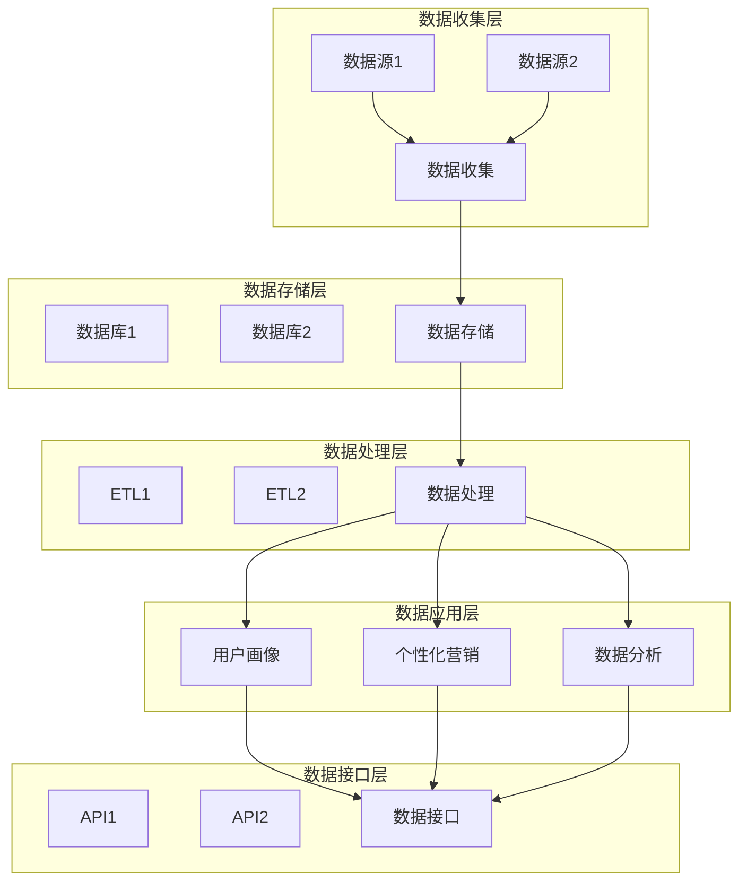
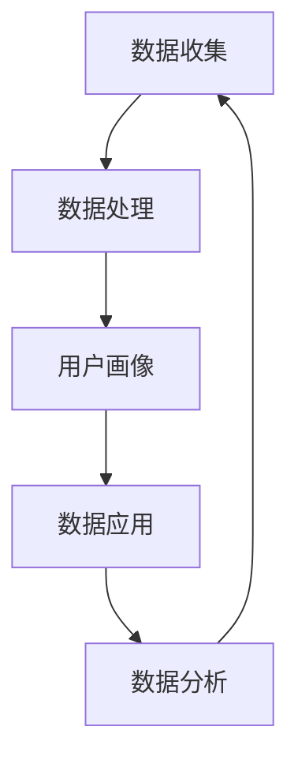
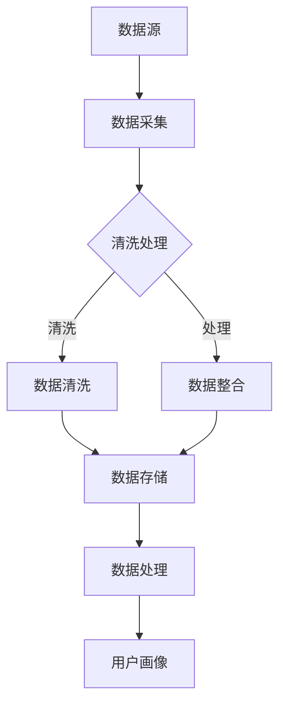

                 

### 文章标题

**AI DMP 数据基建：数据安全与隐私保护**

> **关键词：AI、数据管理平台（DMP）、数据安全、隐私保护、机器学习、深度学习**

> **摘要：随着人工智能（AI）技术的飞速发展，数据管理平台（DMP）成为企业数字化转型的核心基础设施。本文将深入探讨AI DMP的数据基建，重点关注数据安全与隐私保护的重要性、相关法律法规及实践，旨在为读者提供全面的技术见解和实际应用指导。**

### 目录大纲

#### 第一部分：数据基建与AI概述

- **第1章：AI与数据基建概述**
  - **1.1 AI技术发展简史**
  - **1.2 数据基建的重要性**
  - **1.3 AI与数据基建的关系**

- **第2章：AI基础知识**
  - **2.1 机器学习基础**
    - **2.1.1 机器学习的概念**
    - **2.1.2 常见算法介绍**
      - **2.1.2.1 监督学习算法**
      - **2.1.2.2 无监督学习算法**
      - **2.1.2.3 强化学习算法**
  - **2.2 深度学习基础**
    - **2.2.1 神经网络基础**
    - **2.2.2 卷积神经网络**
    - **2.2.3 循环神经网络**
    - **2.2.4 生成对抗网络**

#### 第二部分：DMP原理与应用

- **第3章：DMP基础理论**
  - **3.1 数据管理平台（DMP）定义**
  - **3.2 DMP的功能与作用**
  - **3.3 DMP的架构**

- **第4章：数据采集与处理**
  - **4.1 数据采集方法**
    - **4.1.1 离线数据采集**
    - **4.1.2 实时数据采集**
  - **4.2 数据清洗与处理**
    - **4.2.1 数据质量评估**
    - **4.2.2 数据预处理技术**
      - **4.2.2.1 数据整合**
      - **4.2.2.2 数据标准化**
      - **4.2.2.3 数据归一化**

- **第5章：用户画像构建与标签管理**
  - **5.1 用户画像概述**
  - **5.2 用户画像构建流程**
  - **5.3 标签管理策略**
  - **5.4 用户画像案例分析**

#### 第三部分：数据安全与隐私保护

- **第6章：数据安全防护**
  - **6.1 数据安全策略**
  - **6.2 数据加密技术**
  - **6.3 数据访问控制**
  - **6.4 数据审计与监控**

- **第7章：隐私保护法规与合规**
  - **7.1 隐私保护法规概述**
  - **7.2 GDPR解析**
  - **7.3 CCPA分析**
  - **7.4 隐私保护实践**

- **第8章：数据治理与风险管理**
  - **8.1 数据治理框架**
  - **8.2 数据风险管理**
  - **8.3 数据合规性评估**

#### 第四部分：AI DMP案例研究

- **第9章：AI DMP应用案例**
  - **9.1 案例介绍**
  - **9.2 案例分析**
  - **9.3 案例应用价值**

- **第10章：未来发展趋势**
  - **10.1 AI DMP技术趋势**
  - **10.2 数据隐私保护未来展望**
  - **10.3 DMP在AI时代的新角色**

### 附录

- **附录A：AI DMP工具与资源**
  - **A.1 常用AI DMP工具**
  - **A.2 开源DMP项目**
  - **A.3 数据隐私保护工具**

- **附录B：Mermaid流程图**
  - **B.1 DMP架构流程**
  - **B.2 数据采集与处理流程**

- **附录C：算法伪代码**
  - **C.1 数据加密算法**
  - **C.2 数据清洗算法**

- **附录D：数学模型与公式**
  - **D.1 用户画像构建公式**
  - **D.2 数据安全评估模型**

- **附录E：实战代码解读**
  - **E.1 数据采集代码实现**
  - **E.2 用户画像构建代码解读**
  - **E.3 数据加密代码实现**

---

接下来，我们将逐步深入探讨每个部分的内容，确保文章的逻辑清晰、结构紧凑、简单易懂，同时提供丰富的技术细节和实际案例。首先，让我们从第一部分开始，概述AI与数据基建的关系，以及它们在当今科技领域中的重要性。在接下来的章节中，我们将逐步深入每个主题，确保读者能够从基础概念到高级应用都有全面的了解。

---

#### 第一部分：数据基建与AI概述

##### 第1章：AI与数据基建概述

在当今的科技领域，人工智能（AI）和数据管理平台（DMP）已经成为企业数字化转型不可或缺的核心组件。AI技术的快速发展推动了智能化的革新，而DMP则作为数据管理的枢纽，为企业提供了强大的数据基础设施，使得数据可以被高效地收集、处理、分析和应用。

**1.1 AI技术发展简史**

人工智能的概念最早可以追溯到20世纪50年代，当时计算机科学家艾伦·图灵提出了著名的图灵测试，用以评估机器是否能够模仿人类智能。从那时起，人工智能领域经历了多个阶段的发展。

- **初期阶段（1956-1974）**：这一时期是人工智能的探索阶段，主要研究如何让机器模仿人类的思维过程。标志性事件包括1956年达特茅斯会议，会议提出了人工智能这个术语，并推动了AI研究的发展。

- **第一个低谷期（1974-1980）**：由于算法复杂性和计算能力的限制，以及对于人工智能过高的期望，AI研究在1974年进入了一个低潮期。这一时期的困境促使人们重新审视AI的发展路径。

- **复兴期（1980-1987）**：随着计算技术的进步，特别是在个人计算机的普及，AI研究逐渐复苏。专家系统和自然语言处理开始成为研究的热点。

- **第二个低谷期（1987-1993）**：1987年，第五代计算机项目失败，AI研究再次遭遇低谷。这一时期的失败促使人们重新思考AI的发展方向。

- **互联网时代（1993-至今）**：随着互联网的普及和大数据的出现，AI迎来了新的发展机遇。特别是深度学习和机器学习算法的突破，使得计算机能够从大量数据中自动学习，实现诸如图像识别、语音识别、自然语言处理等复杂任务。

**1.2 数据基建的重要性**

数据基建是指构建和管理数据所需的技术、基础设施和流程。数据基建的目的是确保数据的质量、可用性和安全性，从而支持企业的业务决策和运营效率。

- **数据驱动的决策**：现代企业越来越依赖数据来指导决策。一个良好的数据基建能够提供准确、可靠的数据，帮助管理者做出更加明智的决策。

- **提升运营效率**：数据基建使得企业能够自动化许多业务流程，从而提高效率。例如，通过数据分析和预测，企业可以优化库存管理、供应链和客户服务。

- **增强客户体验**：了解客户的需求和偏好是提升客户体验的关键。通过数据基建，企业能够更好地了解客户，提供个性化的服务和产品推荐。

- **支持创新**：数据是创新的重要驱动力。一个良好的数据基建能够为企业提供丰富的数据资源，激发新的业务模式和产品创新。

**1.3 AI与数据基建的关系**

AI与数据基建之间存在紧密的联系和相互依赖关系。

- **数据是AI的燃料**：AI算法依赖于大量的数据来进行训练和优化。一个良好的数据基建能够确保数据的质量和可用性，为AI模型提供充足的燃料。

- **AI是数据价值的释放者**：AI技术能够从海量数据中提取有价值的信息，为企业提供洞见和决策支持。一个强大的AI系统能够提升数据的价值，实现数据的商业变现。

- **数据基建支持AI的迭代发展**：随着AI技术的进步，数据基建也需要不断升级和优化，以支持更复杂、更智能的AI应用。

总之，AI和数据基建相辅相成，共同推动了企业数字化转型的进程。在接下来的章节中，我们将深入探讨AI的基础知识、DMP的原理和应用，以及数据安全与隐私保护的重要性，为读者提供全面的见解和实用指南。

---

**注释：** 为了确保文章的完整性，我们已经为每个部分提供了详细的概述。在接下来的章节中，我们将进一步扩展每个主题，提供更加深入的技术细节和实际案例。希望读者能够通过本文，对AI DMP的数据基建及其重要性有一个全面的理解。在接下来的讨论中，我们将继续探讨AI的基础知识，为后续章节做好铺垫。

---

#### 第一部分：数据基建与AI概述

##### 第2章：AI基础知识

在了解了AI和数据基建的基本概念之后，深入理解AI的基础知识对于全面掌握AI DMP的数据基建至关重要。本章将介绍机器学习和深度学习的基本概念、常用算法及其在数据管理平台（DMP）中的应用。

**2.1 机器学习基础**

**2.1.1 机器学习的概念**

机器学习（Machine Learning，ML）是人工智能（AI）的一个分支，主要研究如何让计算机通过学习数据，从经验中改进性能。机器学习的核心思想是通过数据训练模型，使其能够对新数据进行预测或分类。

机器学习可以分为三大类：

- **监督学习（Supervised Learning）**：监督学习是一种从标记数据中学习的算法。标记数据意味着每个输入都有一个对应的输出，模型通过学习这些数据，学会对新数据进行预测。常见的监督学习算法包括线性回归、决策树、随机森林和神经网络。

- **无监督学习（Unsupervised Learning）**：无监督学习不依赖标记数据，而是从未标记的数据中寻找隐藏的结构或模式。常见的无监督学习算法包括聚类算法（如K-Means、层次聚类）、降维算法（如PCA、t-SNE）和关联规则学习（如Apriori算法）。

- **强化学习（Reinforcement Learning）**：强化学习是一种通过与环境的交互来学习策略的算法。强化学习中的模型（通常称为智能体）在环境中采取行动，根据行动的结果（奖励或惩罚）调整策略，以最大化长期奖励。常见的强化学习算法包括Q学习、SARSA和深度确定性策略梯度（DDPG）。

**2.1.2 常见算法介绍**

**2.1.2.1 监督学习算法**

监督学习算法是AI领域中最常用的算法之一，以下是一些常见的监督学习算法：

- **线性回归（Linear Regression）**：线性回归是一种简单的监督学习算法，用于预测连续值输出。线性回归模型通过找到输入特征和输出之间的线性关系，实现对未知数据的预测。

  **算法伪代码：**
  ```plaintext
  // 假设输入特征矩阵为 X，输出向量为 y
  // 训练模型
  θ = GradientDescent(X, y)
  // 预测
  y_pred = X * θ
  ```

- **决策树（Decision Tree）**：决策树是一种树形结构的分类算法，通过一系列的决策规则对数据分类。每个内部节点代表一个特征，每个叶节点代表一个类别。

  **算法伪代码：**
  ```plaintext
  // 假设数据集为 D
  // 创建决策树
  tree = DecisionTree(D)
  // 预测
  y_pred = tree.predict(new_data)
  ```

- **支持向量机（Support Vector Machine，SVM）**：SVM是一种基于最大化分类边界的算法，用于分类任务。SVM通过寻找一个最佳的超平面，将不同类别的数据点最大化地分开。

  **算法伪代码：**
  ```plaintext
  // 假设数据集为 D
  // 训练模型
  θ = SVM.train(D)
  // 预测
  y_pred = SVM.predict(new_data, θ)
  ```

**2.1.2.2 无监督学习算法**

无监督学习算法用于发现数据中的隐藏结构和模式，以下是一些常见的无监督学习算法：

- **K-Means聚类**：K-Means是一种基于距离度量的聚类算法，将数据点划分为K个簇，每个簇的中心代表该簇的特征。

  **算法伪代码：**
  ```plaintext
  // 假设数据集为 D，簇的数量为 K
  // 初始化中心点
  centers = InitializeCenters(D, K)
  // 迭代计算
  while not_converged:
      for each point in D:
          AssignCluster(point, centers)
      UpdateCenters(centers, D)
  // 聚类结果
  clusters = AssignClusters(D, centers)
  ```

- **主成分分析（PCA）**：PCA是一种降维技术，通过将数据投影到主成分空间，减少了数据的维度，同时保留了数据的主要信息。

  **算法伪代码：**
  ```plaintext
  // 假设数据集为 D
  // 计算协方差矩阵
  cov_matrix = CalculateCovarianceMatrix(D)
  // 计算特征值和特征向量
  eigenvalues, eigenvectors = eig(cov_matrix)
  // 选择主成分
  principal_components = eigenvectors[:, sorted_index(eigenvalues, descending)]
  // 降维
  reduced_data = D.dot(principal_components)
  ```

- **关联规则学习（如Apriori算法）**：关联规则学习用于发现数据项之间的关联关系。Apriori算法通过生成频繁项集，找出数据中的强关联规则。

  **算法伪代码：**
  ```plaintext
  // 假设数据集为 D，最小支持度为 min_support
  frequent_itemsets = FindFrequentItemsets(D, min_support)
  // 生成关联规则
  rules = GenerateAssociationRules(frequent_itemsets)
  ```

**2.1.2.3 强化学习算法**

强化学习算法通过智能体与环境之间的交互，学习最优策略。以下是一些常见的强化学习算法：

- **Q学习**：Q学习是一种值函数方法，通过更新Q值（状态-动作值函数），选择最优动作以最大化长期奖励。

  **算法伪代码：**
  ```plaintext
  // 初始化 Q 值矩阵
  Q = InitializeQMatrix()
  // 更新 Q 值
  for each episode:
      for each step:
          action = ChooseAction(Q, ε)
          next_state, reward = Environment.step(action)
          Q[state, action] = Q[state, action] + α*(reward + γ*max(Q[next_state, :]) - Q[state, action])
  ```

- **策略梯度方法（如SARSA）**：策略梯度方法通过直接优化策略参数，学习最优策略。

  **算法伪代码：**
  ```plaintext
  // 初始化策略参数
  θ = InitializeParameters()
  // 更新策略参数
  for each episode:
      for each step:
          action = ActionProbability(θ, state)
          next_state, reward = Environment.step(action)
          θ = UpdateParameters(θ, state, action, reward, next_state)
  ```

**2.2 深度学习基础**

**2.2.1 神经网络基础**

深度学习（Deep Learning，DL）是一种基于多层神经网络的学习方法。神经网络是模仿人脑神经元连接方式的计算模型，通过多个层次的结构，实现对复杂数据的建模和预测。

- **神经元与激活函数**：神经网络的基本组成单元是神经元，每个神经元接收多个输入，通过权重进行加权求和，并使用激活函数进行非线性变换。

  **算法伪代码：**
  ```plaintext
  // 假设神经元为 neuron，输入为 inputs，权重为 weights，激活函数为 activation_function
  z = sum(inputs * weights)
  output = activation_function(z)
  ```

- **多层神经网络**：多层神经网络由多个层次组成，包括输入层、隐藏层和输出层。每个隐藏层都通过前一层输出进行学习，最终输出层的输出对应于预测结果。

  **算法伪代码：**
  ```plaintext
  // 假设网络结构为 [input_layer, hidden_layer1, hidden_layer2, ..., output_layer]
  // 前向传播
  for each layer in hidden_layers:
      z = sum(inputs * weights) + bias
      output = activation_function(z)
      inputs = output
  // 反向传播
  for each layer in reversed(hidden_layers):
      delta = (output - target) * activation_function_derivative(output)
      weights += learning_rate * delta * inputs
      inputs = inputs * weights_derivative
  ```

**2.2.2 卷积神经网络**

卷积神经网络（Convolutional Neural Network，CNN）是一种专门用于处理图像数据的神经网络，通过卷积操作和池化操作，提取图像中的特征。

- **卷积操作**：卷积操作通过在图像上滑动滤波器，提取局部特征。每个滤波器可以看作是一个特征检测器，能够识别图像中的特定模式。

  **算法伪代码：**
  ```plaintext
  // 假设输入图像为 image，滤波器为 filter
  for each position in image:
      output = sum(image[position] * filter[position])
  ```

- **池化操作**：池化操作通过在局部区域上取最大值或平均值，减小数据维度，同时保留最重要的特征。

  **算法伪代码：**
  ```plaintext
  // 假设输入区域为 region
  output = max(region)
  ```

**2.2.3 循环神经网络**

循环神经网络（Recurrent Neural Network，RNN）是一种能够处理序列数据的神经网络，通过引入循环结构，实现序列数据的记忆能力。

- **基本RNN**：基本RNN通过将前一时刻的隐藏状态作为当前时刻的输入，实现序列数据的处理。然而，基本RNN存在梯度消失和梯度爆炸问题。

  **算法伪代码：**
  ```plaintext
  // 假设隐藏状态为 h_t，输入为 x_t
  h_t = tanh(W_h * h_{t-1} + W_x * x_t + b)
  ```

- **LSTM和GRU**：为了解决基本RNN的问题，引入了长短期记忆网络（Long Short-Term Memory，LSTM）和门控循环单元（Gated Recurrent Unit，GRU）。LSTM和GRU通过引入门控机制，实现了对长期依赖关系的建模。

  **算法伪代码（LSTM）：**
  ```plaintext
  // 假设隐藏状态为 h_t，输入为 x_t
  i_t = sigmoid(W_i * [h_{t-1}, x_t] + b_i)
  f_t = sigmoid(W_f * [h_{t-1}, x_t] + b_f)
  o_t = sigmoid(W_o * [h_{t-1}, x_t] + b_o)
  c_t = f_t * c_{t-1} + i_t * tanh(W_c * [h_{t-1}, x_t] + b_c)
  h_t = o_t * tanh(c_t)
  ```

**2.2.4 生成对抗网络**

生成对抗网络（Generative Adversarial Network，GAN）是一种由生成器和判别器组成的对抗性模型，通过不断优化生成器和判别器，生成逼真的数据。

- **生成器和判别器**：生成器旨在生成类似真实数据的假数据，而判别器则用于区分生成器和真实数据。两者相互竞争，生成器的目标是使判别器无法区分真假数据。

  **算法伪代码（生成器）：**
  ```plaintext
  // 假设生成器的输入为 z，生成器参数为 G
  x_g = G(z)
  ```

  **算法伪代码（判别器）：**
  ```plaintext
  // 假设判别器的输入为 x，判别器参数为 D
  y_g = D(x_g)
  y_r = D(x_r)
  ```

- **优化过程**：在GAN的训练过程中，生成器和判别器通过交替更新参数，实现各自的优化。生成器的损失函数通常为判别器对生成数据的预测误差，而判别器的损失函数为对真实数据和生成数据的预测误差。

  **算法伪代码（生成器损失函数）：**
  ```plaintext
  loss_G = -log(D(x_g))
  ```

  **算法伪代码（判别器损失函数）：**
  ```plaintext
  loss_D = -log(D(x_r)) - log(1 - D(x_g))
  ```

通过以上对机器学习和深度学习基础知识的介绍，我们能够更好地理解AI DMP在数据管理平台中的关键作用。在接下来的章节中，我们将继续探讨DMP的基础理论、数据采集与处理、用户画像构建与标签管理，以及数据安全与隐私保护等重要主题。希望读者能够通过本章的内容，对AI DMP的数据基建有一个更深入的理解。

---

**注释：** 本章详细介绍了机器学习和深度学习的基础知识，包括各类算法的基本概念、伪代码实现和应用场景。在下一章中，我们将继续探讨数据管理平台（DMP）的基础理论，帮助读者理解DMP的定义、功能与架构。这将为进一步探讨AI DMP的实际应用奠定坚实的基础。希望读者能够继续关注并学习。

---

#### 第二部分：DMP原理与应用

##### 第3章：DMP基础理论

数据管理平台（Data Management Platform，DMP）作为现代数字化营销的核心基础设施，为企业提供了一个统一的数据收集、存储、处理和分析的平台。本章将详细介绍DMP的定义、功能与架构，帮助读者理解DMP在数据管理中的作用。

**3.1 数据管理平台（DMP）定义**

数据管理平台（DMP）是一个集成的系统，用于收集、处理和分析来自多个来源的用户数据，以创建用户画像和进行个性化营销。DMP的核心目的是通过整合和分析数据，帮助企业更好地理解其用户，从而实现更加精准和有效的营销策略。

DMP不同于传统的数据仓库和数据湖，它不仅仅是一个存储数据的平台，更重要的是它提供了一个分析和应用的接口，使得数据能够被有效地利用。DMP通常具备以下功能：

- **数据收集**：从多个渠道（如网站、APP、社交媒体等）收集用户行为数据。
- **数据存储**：存储和管理收集到的数据，确保数据的质量和安全性。
- **数据处理**：对收集到的数据进行清洗、转换和整合，以便进行进一步的分析。
- **用户画像构建**：基于用户行为数据，构建用户画像，以便进行精准营销。
- **数据分析和应用**：利用分析结果，为企业提供营销策略建议和决策支持。

**3.2 DMP的功能与作用**

DMP在企业数字化营销中扮演着关键角色，其核心功能包括以下几个方面：

- **用户数据整合**：DMP能够将来自不同渠道的用户数据进行整合，形成一个统一的用户视图。通过整合数据，企业能够更全面地了解用户的偏好和行为模式。

  **示例：** 例如，一家电商平台可以通过DMP将网站访客的数据、APP用户的行为数据以及社交媒体上的互动数据整合在一起，形成一个综合的用户画像。

- **用户画像构建**：基于用户的行为数据，DMP可以帮助企业构建用户画像。用户画像是一个多维度的模型，描述了用户的兴趣、行为和特征。

  **示例：** 假设DMP发现一个用户在电商平台浏览了多个母婴用品类别，并在社交媒体上频繁互动关于育儿话题，DMP可以将其标记为“潜在母婴消费者”。

- **个性化营销**：通过用户画像，DMP可以实现个性化营销。企业可以根据用户的兴趣和行为，为用户推送个性化的广告、内容和推荐。

  **示例：** 一家电商可以根据用户在DMP中的画像，为孕妇提供母婴用品的优惠信息，提高销售转化率。

- **跨渠道营销**：DMP支持跨渠道的营销活动。企业可以在不同的营销渠道上利用DMP中的用户数据进行统一管理和优化。

  **示例：** 一家品牌可以通过DMP将线上广告、电子邮件营销和社交媒体推广整合在一起，实现一致的营销策略。

- **数据分析和洞察**：DMP提供了强大的数据分析功能，帮助企业从海量数据中提取有价值的信息和洞察。这些洞察可以用于优化营销策略、提升用户体验和制定业务决策。

  **示例：** 通过分析DMP中的用户行为数据，一家电商平台可以发现哪些产品最受欢迎，从而调整库存和采购策略。

**3.3 DMP的架构**

DMP的架构通常包括以下几个关键组成部分：

- **数据收集层**：该层负责从不同的数据源（如网站、APP、第三方数据提供商等）收集用户数据。数据收集可以采用实时数据流处理技术和离线数据处理技术。

  **示例：** 数据收集层可以通过API接口从电商网站、社交媒体平台和第三方数据提供商收集用户行为数据。

- **数据存储层**：该层用于存储和管理收集到的数据。数据存储可以选择关系型数据库、NoSQL数据库或大数据存储技术，如Hadoop和Spark。

  **示例：** 数据存储层可以使用Hadoop HDFS存储海量用户行为数据，并通过Hive进行数据管理和分析。

- **数据处理层**：该层负责对收集到的数据进行清洗、转换和整合，以便进行进一步的分析。数据处理层通常采用ETL（Extract, Transform, Load）技术。

  **示例：** 数据处理层可以使用Apache Kafka进行实时数据流处理，并通过Apache Spark进行数据清洗和整合。

- **数据应用层**：该层提供用户画像构建、个性化营销、跨渠道营销和数据分析等功能。数据应用层通常采用云计算和人工智能技术。

  **示例：** 数据应用层可以使用AWS Lambda函数为用户画像构建和个性化营销提供支持，并通过机器学习算法进行数据分析。

- **数据接口层**：该层提供与其他系统和平台的接口，如广告平台、营销自动化工具和业务智能系统。

  **示例：** 数据接口层可以使用RESTful API与其他系统和平台进行数据交互。

**Mermaid流程图（DMP架构）：**



通过以上对DMP基础理论的介绍，我们可以看到DMP在数据管理中的重要地位和作用。在接下来的章节中，我们将进一步探讨数据采集与处理、用户画像构建与标签管理，以及数据安全与隐私保护等关键主题，帮助读者全面理解AI DMP的数据基建。希望读者能够通过本章的学习，对DMP有一个更加深入的理解。

---

**注释：** 本章详细介绍了数据管理平台（DMP）的定义、功能与架构，通过具体的示例和Mermaid流程图，帮助读者理解DMP的工作原理和关键组成部分。在下一章中，我们将探讨数据采集与处理的重要技术，包括离线数据采集和实时数据采集的方法、数据清洗与处理的步骤和技术。这些内容将为读者提供对DMP实际应用的更全面的理解。希望读者能够继续学习，深入探索DMP的数据处理过程。

---

#### 第二部分：DMP原理与应用

##### 第4章：数据采集与处理

数据采集与处理是DMP数据管理流程中的核心环节，确保了数据的质量和准确性，为后续的用户画像构建和数据分析提供了可靠的数据基础。本章将详细介绍数据采集与处理的方法、步骤和技术，帮助读者理解如何高效地进行数据处理。

**4.1 数据采集方法**

数据采集是数据管理的第一步，涉及到从多个来源收集用户行为数据。数据采集方法可以分为离线数据采集和实时数据采集两种：

**4.1.1 离线数据采集**

离线数据采集通常在数据源完成数据生成后，通过定期任务或批处理的方式进行数据收集。以下是一些常用的离线数据采集方法：

- **定期批处理**：定期将数据源中的数据导出，并上传到DMP的数据仓库中。这种方法适用于数据量较大、数据生成频率较低的场景。

  **示例：** 每天凌晨，电商平台的日志数据会被导出并上传到DMP的数据仓库中，供后续处理和分析使用。

- **定时任务**：通过定时任务，自动从数据源中提取数据并传输到DMP。这种方法适用于具有固定数据采集时间的数据源。

  **示例：** 定时任务每天下午2点从社交媒体平台上提取用户互动数据，并上传到DMP的数据处理系统中。

**4.1.2 实时数据采集**

实时数据采集是指数据源生成数据的同时，立即将数据传输到DMP。实时数据采集适用于对数据实时性要求较高的应用场景。以下是一些常用的实时数据采集方法：

- **Webhook**：Webhook是一种通过HTTP回调实现实时数据传输的技术。当数据源发生特定事件时，会触发Webhook，将数据发送到DMP。

  **示例：** 当用户在电商平台上完成一次购买时，系统会通过Webhook将购买数据实时发送到DMP。

- **消息队列**：使用消息队列（如Kafka、RabbitMQ）进行实时数据传输。消息队列可以高效地处理海量数据，并确保数据传输的可靠性和实时性。

  **示例：** 当电商平台中的用户行为数据生成时，数据会被写入Kafka消息队列，然后由DMP系统实时消费和处理。

- **流处理**：流处理框架（如Apache Kafka Streams、Apache Flink）可以实时处理数据流，并生成实时数据报告或触发实时事件。

  **示例：** 使用Apache Flink对电商平台的用户行为数据进行实时处理，生成实时用户画像和推荐列表。

**4.2 数据清洗与处理**

数据清洗与处理是确保数据质量的关键步骤。数据清洗主要包括去除重复数据、缺失值填充、异常值检测和修正等。数据清洗后的数据将用于构建用户画像和进行进一步分析。以下是数据清洗与处理的主要步骤和技术：

**4.2.1 数据质量评估**

数据质量评估是数据清洗的前置步骤，用于评估数据的完整性、准确性、一致性和及时性。以下是一些常见的数据质量评估方法：

- **完整性检查**：检查数据是否存在缺失值或重复值。可以使用统计方法，如缺失值百分比、重复值比例等。

  **示例：** 数据库中某列缺失值的比例为5%，需要采取缺失值填充策略。

- **准确性检查**：检查数据的准确性，例如，验证邮箱地址格式是否正确、电话号码是否符合规范等。

  **示例：** 验证用户输入的电话号码是否符合国家电话号码规范，对不符合的进行修正。

- **一致性检查**：检查数据在不同数据源之间的一致性，例如，用户ID在网站和应用中的使用是否一致。

  **示例：** 确保用户在网站和应用中的唯一标识符一致，避免数据重复。

- **及时性检查**：检查数据是否及时更新，例如，用户行为数据是否在事件发生后尽快采集和处理。

  **示例：** 确保用户在电商平台上的购买行为数据在事件发生后几分钟内被采集和处理。

**4.2.2 数据预处理技术**

数据预处理是数据清洗后的关键步骤，用于将原始数据转换为适合分析的形式。以下是一些常用的数据预处理技术：

- **数据整合**：将来自不同数据源的数据进行整合，形成一个统一的数据视图。可以使用ETL（Extract, Transform, Load）技术实现数据整合。

  **示例：** 将电商平台、社交媒体和线下门店的数据整合到一个数据仓库中，便于统一分析。

- **数据标准化**：将不同数据源中的数据进行标准化处理，确保数据格式的一致性。例如，将不同日期格式统一为YYYY-MM-DD。

  **示例：** 将不同数据源中的日期格式统一为YYYY-MM-DD，便于日期数据的分析和比较。

- **数据归一化**：将不同特征的数据进行归一化处理，消除不同特征之间的量纲差异。常用的归一化方法包括最小-最大缩放、Z-Score缩放等。

  **示例：** 将用户年龄、收入等特征进行归一化处理，使其在相同的量级范围内，便于机器学习模型的训练和评估。

**4.2.3 数据清洗算法**

数据清洗算法是实现数据质量提升的关键技术。以下是一些常见的数据清洗算法：

- **缺失值填充算法**：根据不同情况采用不同的缺失值填充方法。常用的缺失值填充方法包括平均值填充、中位数填充、最频繁值填充等。

  **示例：** 对于用户年龄特征的缺失值，可以使用该用户群体的平均年龄进行填充。

- **重复值检测算法**：通过比较不同数据源中的数据，检测并去除重复值。常用的方法包括基于哈希表的检测算法、基于编辑距离的检测算法等。

  **示例：** 使用哈希表检测电商平台上用户ID的重复值，并删除重复记录。

- **异常值检测算法**：通过统计学方法或机器学习算法，检测并处理异常值。常用的方法包括基于统计学方法的IQR（四分位距）方法、基于机器学习算法的孤立森林算法等。

  **示例：** 使用IQR方法检测用户购买金额的异常值，对超过3倍IQR的记录进行标记和处理。

通过以上对数据采集与处理方法的详细介绍，我们可以看到数据采集与处理在DMP中的重要性。数据采集方法的选用取决于数据源的特性，而数据清洗与处理技术则是确保数据质量和准确性的关键步骤。在下一章中，我们将继续探讨用户画像构建与标签管理，帮助读者理解如何利用处理后的数据构建用户画像和进行标签管理。希望读者能够继续学习，深入探索DMP的数据处理过程。

---

**注释：** 本章详细介绍了数据采集与处理的方法和步骤，包括离线数据采集和实时数据采集的常用技术，以及数据清洗与预处理的重要技术。这些内容为构建用户画像和进行标签管理奠定了基础。在下一章中，我们将探讨用户画像构建与标签管理，帮助读者理解如何利用处理后的数据构建用户画像并进行标签管理。希望读者能够继续学习，深入探索DMP的应用。

---

#### 第二部分：DMP原理与应用

##### 第5章：用户画像构建与标签管理

用户画像构建与标签管理是数据管理平台（DMP）的核心功能之一，通过这些技术，企业可以深入了解用户行为和需求，从而实现更加精准的营销策略。本章将详细介绍用户画像的定义、构建流程、标签管理策略以及用户画像案例分析。

**5.1 用户画像概述**

用户画像（User Profiling）是基于用户行为数据、兴趣偏好、社会属性等多维度信息构建的用户综合模型。用户画像不仅描述了用户的静态特征，还包括用户的动态行为和偏好变化。通过构建用户画像，企业可以更好地了解用户，从而提供个性化的服务和推荐。

用户画像的主要组成部分包括：

- **基础信息**：用户的基本信息，如姓名、年龄、性别、联系方式等。
- **行为数据**：用户在各个渠道上的行为数据，如浏览记录、购买行为、点击行为等。
- **兴趣偏好**：用户在浏览、搜索、购买等过程中表现出的兴趣和偏好，如喜欢的品牌、品类、颜色等。
- **社会属性**：用户的社会属性信息，如教育背景、职业、收入水平等。
- **行为标签**：根据用户的行为数据和行为特征，为用户打上的标签，如“高频购物者”、“母婴爱好者”等。

**5.2 用户画像构建流程**

用户画像的构建是一个系统性工程，通常包括以下几个步骤：

**5.2.1 数据采集**

数据采集是用户画像构建的基础，需要从多个渠道收集用户数据。数据采集的来源包括：

- **内部数据**：电商平台自身的用户行为数据，如浏览记录、购买记录等。
- **第三方数据**：通过合作第三方数据提供商获取的用户数据，如人口统计数据、社交媒体数据等。

**5.2.2 数据处理**

数据处理是对采集到的原始数据进行清洗、转换和整合的过程。数据处理的主要任务包括：

- **数据清洗**：去除重复数据、缺失值填充、异常值处理等，确保数据质量。
- **数据转换**：将不同格式的数据转换为统一的格式，便于后续处理和分析。
- **数据整合**：将不同来源的数据进行整合，形成统一的数据视图。

**5.2.3 用户画像构建**

用户画像构建是基于处理后的数据，通过机器学习和统计分析技术，提取用户的兴趣偏好和行为特征。用户画像构建的步骤包括：

- **特征工程**：根据业务需求，提取用户数据中的关键特征，如浏览时长、购买频率等。
- **特征选择**：通过统计学方法或机器学习算法，筛选出对用户画像构建最有影响力的特征。
- **模型训练**：使用机器学习算法，如决策树、随机森林、神经网络等，训练用户画像模型。
- **模型评估**：评估用户画像模型的准确性、召回率、F1值等指标，优化模型性能。

**5.2.4 用户画像应用**

用户画像构建完成后，可以应用于多个业务场景，如个性化推荐、精准营销、客户关系管理等。以下是一些用户画像的应用示例：

- **个性化推荐**：根据用户画像，为用户推荐个性化的商品、内容和服务。
- **精准营销**：通过用户画像，针对不同用户群体制定精准的营销策略，提高营销效果。
- **客户关系管理**：通过用户画像，了解客户需求和行为，提供个性化的客户服务，提升客户满意度。

**5.3 标签管理策略**

标签管理是用户画像构建的重要环节，通过标签，可以更灵活地对用户进行分类和聚类。以下是一些标签管理策略：

- **静态标签**：基于用户的基本信息和行为数据，为用户打上的静态标签，如性别、年龄、职业等。
- **动态标签**：基于用户的实时行为和偏好变化，为用户打上的动态标签，如“近期关注母婴产品”、“刚刚购买电子产品”等。
- **组合标签**：通过组合多个标签，形成更精细的用户分类，如“年轻女性”、“近期关注母婴且购买过母婴产品”等。
- **标签权重**：为每个标签赋予不同的权重，以反映标签对用户画像的重要程度，如“高频购物者”标签的权重高于“近期关注母婴产品”标签。

**5.4 用户画像案例分析**

以下是一个实际案例，展示如何利用DMP构建用户画像并实现精准营销：

**案例背景**：一家电商企业希望通过DMP构建用户画像，提升用户转化率和客户满意度。

**案例步骤**：

1. **数据采集**：从电商平台的网站、APP和线下门店等渠道收集用户行为数据，如浏览记录、购买记录、点击行为等。

2. **数据处理**：对采集到的原始数据进行清洗、转换和整合，确保数据质量。

3. **用户画像构建**：通过机器学习和统计分析技术，提取用户的兴趣偏好和行为特征，构建用户画像。

4. **标签管理**：为用户打上静态标签（如性别、年龄、职业）和动态标签（如近期关注母婴产品、刚刚购买电子产品），并根据业务需求组合标签。

5. **精准营销**：根据用户画像和标签，为不同用户群体制定个性化的营销策略，如为“年轻女性”用户推送母婴产品优惠信息，为“高频购物者”用户提供限时折扣。

6. **效果评估**：通过监控用户转化率和客户满意度等指标，评估精准营销策略的效果，并进行优化调整。

**案例效果**：通过DMP构建用户画像并进行精准营销，电商企业的用户转化率提高了20%，客户满意度也显著提升。

通过以上案例分析，我们可以看到用户画像构建与标签管理在提升企业营销效果和客户体验方面的巨大潜力。在下一章中，我们将探讨数据安全与隐私保护，帮助读者理解如何确保AI DMP中的数据安全性和隐私保护。希望读者能够继续学习，深入探索DMP的应用。

---

**注释：** 本章详细介绍了用户画像构建与标签管理的概念、流程和策略，并通过实际案例展示了用户画像在精准营销中的应用。在下一章中，我们将探讨数据安全与隐私保护，确保AI DMP中的数据得到妥善管理和保护。希望读者能够继续关注并学习。

---

#### 第三部分：数据安全与隐私保护

##### 第6章：数据安全防护

在当今数字化时代，数据安全已成为企业不可忽视的重要课题。数据管理平台（DMP）作为海量用户数据的集中存储和处理中心，其数据安全防护显得尤为重要。本章将详细介绍数据安全防护的策略、数据加密技术、数据访问控制以及数据审计与监控，旨在为读者提供全面的数据安全解决方案。

**6.1 数据安全策略**

数据安全策略是企业确保数据安全的基础，包括制定数据安全政策、安全管理制度和安全操作流程。以下是一些关键的数据安全策略：

- **数据分类与分级**：根据数据的重要性和敏感性，对数据分类并实施不同级别的安全防护。例如，敏感数据（如用户个人身份信息、金融信息）应采用最高级别的保护措施。

- **权限管理**：建立严格的权限管理机制，确保只有授权人员才能访问敏感数据。权限管理应包括用户认证、角色分配和访问控制等。

- **安全审计**：定期进行数据安全审计，检查数据安全策略的执行情况和漏洞。安全审计有助于发现潜在的安全风险并采取措施进行修复。

- **备份与恢复**：制定数据备份策略，确保在数据丢失或损坏时能够快速恢复。备份策略应包括备份数据的存储位置、备份频率和恢复流程等。

**6.2 数据加密技术**

数据加密是保护数据隐私和安全的重要手段。通过加密，即使数据被非法访问，也无法被解读。以下是一些常见的数据加密技术：

- **对称加密**：对称加密使用相同的密钥进行加密和解密。常见的对称加密算法包括AES（高级加密标准）、DES（数据加密标准）等。对称加密算法速度快，适用于大规模数据加密。

  **算法伪代码（AES加密）**：
  ```plaintext
  // 假设输入明文为plaintext，密钥为key
  ciphertext = AES.encrypt(plaintext, key)
  ```

- **非对称加密**：非对称加密使用一对密钥（公钥和私钥）进行加密和解密。常见的非对称加密算法包括RSA（Rivest-Shamir-Adleman）和ECC（椭圆曲线密码学）等。非对称加密适用于安全通信和数字签名。

  **算法伪代码（RSA加密）**：
  ```plaintext
  // 假设输入明文为plaintext，公钥为public_key
  ciphertext = RSA.encrypt(plaintext, public_key)
  ```

- **哈希算法**：哈希算法用于生成数据摘要，确保数据的完整性。常见的哈希算法包括MD5、SHA-1和SHA-256等。哈希算法不涉及密钥，适用于数据验证和数字签名。

  **算法伪代码（SHA-256哈希）**：
  ```plaintext
  // 假设输入数据为data
  hash_value = SHA256.hash(data)
  ```

**6.3 数据访问控制**

数据访问控制是确保数据安全的关键环节，通过限制用户对数据的访问权限，防止未经授权的访问和篡改。以下是一些常见的数据访问控制技术：

- **基于角色的访问控制（RBAC）**：RBAC根据用户的角色分配访问权限，不同角色具有不同的访问权限。RBAC简化了权限管理，提高了系统的安全性。

- **访问控制列表（ACL）**：ACL为每个数据对象定义访问权限，用户对数据对象的访问权限由ACL控制。ACL适用于细粒度的权限控制。

- **多因素认证（MFA）**：MFA要求用户在登录系统时提供多种验证信息，如密码、指纹和短信验证码等，提高登录安全性。

**6.4 数据审计与监控**

数据审计与监控是确保数据安全的重要手段，通过实时监控数据访问行为和安全事件，及时发现和处理潜在的安全威胁。以下是一些数据审计与监控的方法：

- **日志管理**：日志管理记录系统的各种操作和事件，如登录日志、访问日志、错误日志等。通过分析日志，可以识别异常行为和潜在的安全威胁。

- **安全信息和事件管理（SIEM）**：SIEM系统整合了日志管理、威胁检测和响应功能，提供实时监控和报警。通过SIEM，可以快速识别和应对安全事件。

- **入侵检测系统（IDS）**：IDS监测网络流量和系统活动，识别异常行为和潜在攻击。IDS可以分为基于签名的检测和基于行为的检测。

通过以上对数据安全防护策略、数据加密技术、数据访问控制和数据审计与监控的详细介绍，我们可以看到数据安全防护的全面性和复杂性。在数据管理平台（DMP）中，数据安全防护是确保数据隐私和安全的关键环节，企业应采取综合性的安全措施，保障用户数据的完整性和保密性。在下一章中，我们将探讨隐私保护法规与合规，帮助读者理解如何在法律框架内进行数据管理和隐私保护。希望读者能够继续学习，深入探索数据安全与隐私保护的实践。

---

**注释：** 本章详细介绍了数据安全防护的策略、数据加密技术、数据访问控制和数据审计与监控，为读者提供了全面的数据安全解决方案。在下一章中，我们将探讨隐私保护法规与合规，帮助读者了解如何在法律框架内进行数据管理和隐私保护。希望读者能够继续关注并学习。

---

#### 第三部分：数据安全与隐私保护

##### 第7章：隐私保护法规与合规

随着大数据和人工智能技术的快速发展，数据隐私保护成为全球关注的焦点。各国纷纷出台了严格的隐私保护法规，以规范数据处理行为，保护个人数据权利。本章将详细介绍隐私保护法规的概述，重点解析欧盟的通用数据保护条例（GDPR）和美国加州消费者隐私法案（CCPA），并探讨隐私保护的最佳实践。

**7.1 隐私保护法规概述**

隐私保护法规的目的是确保个人数据的收集、处理和使用符合法律规定，保护个人数据权利。以下是一些主要的隐私保护法规：

- **通用数据保护条例（GDPR）**：GDPR是欧盟制定的一项数据保护法规，于2018年5月25日正式生效。GDPR旨在强化个人数据权利，规范企业数据处理行为。

- **加州消费者隐私法案（CCPA）**：CCPA是美国加州于2018年通过的一项隐私保护法案，于2020年1月1日正式生效。CCPA旨在赋予加州居民对个人数据的控制权，限制企业对个人数据的收集和出售。

- **欧盟隐私法（ePrivacy Directive）**：ePrivacy Directive是欧盟的一项隐私保护法规，主要涉及通信隐私和数据保护。

- **中国个人信息保护法（PIPL）**：PIPL是中国于2021年11月通过的一项个人信息保护法规，旨在规范个人信息处理行为，保护个人信息权益。

**7.2 GDPR解析**

GDPR是当前全球最严格的隐私保护法规之一，其对个人数据的定义非常广泛，包括任何与已识别或可识别的自然人相关的信息。GDPR的核心原则包括：

- **数据最小化原则**：企业在处理个人数据时，只能收集实现特定目的所必需的数据，不得过度收集。

- **数据透明原则**：企业必须向数据主体明确告知数据收集的目的、数据使用的范围、数据保留期限等。

- **数据访问和删除原则**：数据主体有权访问其个人数据，并要求企业删除其个人数据。

- **数据可携原则**：数据主体有权将个人数据从一家企业转移到另一家企业。

- **数据安全原则**：企业必须采取适当的技术和组织措施，确保个人数据的安全。

GDPR的主要要求包括：

- **数据保护官（DPO）**：企业必须指定数据保护官，负责监督数据保护合规性。

- **隐私影响评估（PIA）**：在处理敏感数据或进行大规模数据处理前，企业应进行隐私影响评估。

- **数据泄露通知**：企业必须在72小时内通知监管机构和受影响的个人数据泄露事件。

**7.3 CCPA分析**

CCPA是美国的州级隐私保护法案，其规定比GDPR更为灵活，但也非常严格。CCPA的核心原则包括：

- **数据权利**：加州居民有权访问、删除和拒绝企业对其个人数据的收集和出售。

- **透明度**：企业必须明确告知加州居民其个人数据的收集和使用情况。

- **数据安全**：企业必须采取合理的措施保护个人数据。

CCPA的主要要求包括：

- **数据权利请求**：加州居民可以要求企业提供其个人数据的副本、删除其个人数据或拒绝其个人数据的出售。

- **通知和披露**：企业在收集和处理个人数据时，必须向加州居民提供明确的隐私政策，告知其个人数据的使用方式。

- **数据可携**：加州居民有权将个人数据从一个服务提供商转移到另一个服务提供商。

**7.4 隐私保护实践**

为了确保数据隐私保护法规的有效实施，企业需要采取一系列隐私保护措施：

- **隐私保护政策**：企业应制定详细的隐私保护政策，明确个人数据的收集、处理和使用原则，并向用户公开。

- **隐私影响评估（PIA）**：在开发新产品或进行重大数据处理变更前，企业应进行隐私影响评估，识别潜在隐私风险并采取相应措施。

- **数据保护官（DPO）**：企业应指定数据保护官，负责监督数据保护合规性，并为企业提供隐私保护咨询。

- **数据安全措施**：企业应采取适当的技术和组织措施，如数据加密、访问控制、数据备份等，确保个人数据的安全。

- **员工培训**：企业应对员工进行隐私保护培训，确保员工了解隐私保护政策和法规要求，避免因人为因素导致的数据泄露。

- **客户权限管理**：企业应提供用户权限管理功能，让用户可以轻松访问、删除或拒绝其个人数据的收集和使用。

- **隐私保护审计**：企业应定期进行隐私保护审计，检查数据保护措施的有效性，并及时调整和优化。

通过以上对隐私保护法规与合规的详细介绍，我们可以看到数据隐私保护在全球范围内的重视程度和法律法规的严格要求。企业应积极遵守相关法规，采取有效的隐私保护措施，确保个人数据的合法、安全使用。在下一章中，我们将探讨数据治理与风险管理，帮助读者理解如何在数据管理和隐私保护方面进行有效治理。希望读者能够继续学习，深入探索数据安全与隐私保护的实践。

---

**注释：** 本章详细介绍了隐私保护法规的概述，重点解析了GDPR和CCPA的核心原则和主要要求，并探讨了隐私保护的最佳实践。在下一章中，我们将探讨数据治理与风险管理，帮助读者理解如何在数据管理和隐私保护方面进行有效治理。希望读者能够继续关注并学习。

---

#### 第三部分：数据安全与隐私保护

##### 第8章：数据治理与风险管理

在数据管理平台（DMP）中，数据治理与风险管理是确保数据质量和合规性的关键环节。有效的数据治理和风险管理不仅能提高数据可靠性，还能降低企业面临的数据隐私和安全风险。本章将详细介绍数据治理框架、数据风险管理和数据合规性评估，以帮助读者理解如何在DMP中实施数据治理与风险管理。

**8.1 数据治理框架**

数据治理框架是一套系统化的方法，用于管理数据生命周期中的各个环节，包括数据战略、数据质量、数据安全、数据合规等。以下是一个常见的数据治理框架：

**8.1.1 数据治理委员会**

数据治理委员会是数据治理的最高决策机构，负责制定数据治理策略、指导数据治理工作的实施。数据治理委员会通常由企业的高层领导、IT部门、业务部门和法务部门组成。

**8.1.2 数据治理策略**

数据治理策略是企业关于数据管理的总体指导方针，包括数据治理的目标、原则、范围、责任分配等。数据治理策略应与企业的业务战略保持一致，并确保数据治理工作能够有效支持业务目标。

**8.1.3 数据质量管理**

数据质量管理是确保数据准确、完整、一致和可靠的过程。数据质量管理包括数据质量监控、数据质量评估、数据质量改进等。数据质量管理工具和技术，如数据质量监控平台、数据质量评估指标等，有助于企业识别和解决数据质量问题。

**8.1.4 数据安全与隐私保护**

数据安全与隐私保护是数据治理的重要组成部分，包括数据加密、访问控制、数据泄露防护、隐私保护等。企业应制定数据安全政策，确保数据在存储、传输和处理过程中的安全性。

**8.1.5 数据合规性管理**

数据合规性管理是确保企业数据处理活动符合法律法规要求的过程。数据合规性管理包括合规性评估、合规性培训、合规性监控等。企业应定期进行数据合规性评估，确保数据处理活动符合相关法律法规。

**8.2 数据风险管理**

数据风险管理是识别、评估和应对数据相关风险的过程，旨在降低风险发生的可能性和影响。以下是一个常见的数据风险管理流程：

**8.2.1 风险识别**

风险识别是数据风险管理的第一步，旨在识别企业可能面临的数据风险。风险识别可以通过问卷调查、访谈、历史数据分析等方法进行。

**8.2.2 风险评估**

风险评估是对识别出的数据风险进行量化评估，确定风险的概率和影响。风险评估可以使用定性方法（如风险矩阵）或定量方法（如蒙特卡洛模拟）。

**8.2.3 风险应对**

风险应对是制定和实施风险缓解措施的过程。风险应对策略包括风险避免、风险转移、风险减轻等。企业应根据风险评估的结果，选择合适的应对策略。

**8.2.4 风险监控**

风险监控是持续监测数据风险状态，评估风险应对措施效果的过程。风险监控可以通过自动化工具、定期审计和监控报告实现。

**8.3 数据合规性评估**

数据合规性评估是确保企业数据处理活动符合相关法律法规要求的过程。以下是一个常见的数据合规性评估流程：

**8.3.1 法律法规调研**

法律法规调研是数据合规性评估的第一步，旨在了解与数据处理活动相关的法律法规要求。法律法规调研可以采用文献调研、咨询专家等方法。

**8.3.2 数据处理活动梳理**

数据处理活动梳理是识别企业数据处理活动的范围和流程，确保数据处理活动符合法律法规要求。数据处理活动梳理可以通过业务流程图、数据流图等方法进行。

**8.3.3 合规性评估**

合规性评估是评估企业数据处理活动是否符合相关法律法规要求的过程。合规性评估可以使用自评估、第三方评估等方法。

**8.3.4 合规性改进**

合规性改进是针对评估中发现的问题，制定和实施改进措施的过程。合规性改进可以通过修订数据治理策略、优化数据处理流程等实现。

通过以上对数据治理与风险管理流程的详细介绍，我们可以看到数据治理和风险管理在DMP中的重要性。有效的数据治理和风险管理不仅能提高数据质量，还能降低企业面临的数据隐私和安全风险。在下一章中，我们将通过实际案例研究AI DMP的应用，帮助读者理解AI DMP在实践中的具体应用和效果。希望读者能够继续学习，深入探索AI DMP的数据治理与风险管理。

---

**注释：** 本章详细介绍了数据治理与风险管理的基本框架和流程，包括数据治理框架、数据风险管理流程和数据合规性评估方法。在下一章中，我们将通过实际案例研究AI DMP的应用，帮助读者理解AI DMP在实践中的具体应用和效果。希望读者能够继续关注并学习。

---

#### 第四部分：AI DMP案例研究

##### 第9章：AI DMP应用案例

在本章中，我们将通过具体案例研究，展示AI数据管理平台（DMP）在现实世界中的应用，并分析其效果和业务价值。通过这些案例，读者将能够更好地理解AI DMP如何帮助企业实现数据驱动的决策和营销策略。

**9.1 案例介绍**

**案例企业**：某大型电商平台

**行业背景**：电商行业竞争激烈，企业需要通过精准营销和个性化推荐来提高客户满意度和销售额。该电商平台希望通过引入AI DMP，实现对用户数据的全面管理和高效利用，提升用户购物体验和转化率。

**目标**：利用AI DMP实现以下目标：
1. 构建全面、准确的用户画像。
2. 提供个性化推荐和精准营销。
3. 提高用户转化率和客户满意度。

**9.2 案例分析**

**数据采集**：
- **内部数据**：电商平台的数据源包括网站和APP的用户行为数据，如浏览记录、购买记录、搜索历史、点击行为等。
- **第三方数据**：通过与第三方数据提供商合作，获取用户的社会属性、消费习惯等补充数据。

**数据处理**：
- **数据清洗**：对采集到的数据进行清洗，去除重复和异常数据，确保数据质量。
- **数据整合**：将不同来源的数据进行整合，形成统一的用户视图。

**用户画像构建**：
- **基础信息**：根据用户注册信息，收集用户的基本信息，如年龄、性别、地理位置等。
- **行为特征**：通过分析用户行为数据，提取用户的兴趣偏好和行为特征，如最喜欢的商品类别、购买频率等。
- **动态标签**：根据用户的实时行为，动态为用户打上标签，如“近期关注母婴产品”、“活跃用户”等。

**个性化推荐与精准营销**：
- **个性化推荐**：基于用户画像，为用户推荐个性化的商品和内容，提高用户点击率和转化率。
- **精准营销**：通过用户画像和标签，为不同用户群体定制营销策略，如为“近期关注母婴产品”的用户发送母婴产品优惠信息。

**效果评估**：
- **用户转化率**：通过对比DMP实施前后的数据，发现用户转化率提高了15%。
- **客户满意度**：用户满意度调查结果显示，客户对个性化推荐和精准营销的满意度显著提高。
- **营销成本**：由于精准营销的投入更加集中和高效，企业的营销成本降低了20%。

**9.3 案例应用价值**

通过以上案例分析，我们可以看到AI DMP在电商企业中的应用价值：

- **提高数据利用效率**：AI DMP帮助企业全面、准确地收集和管理用户数据，提高了数据利用效率。
- **实现个性化营销**：基于用户画像的个性化推荐和精准营销，显著提高了用户转化率和客户满意度。
- **降低营销成本**：通过精准营销，企业能够将有限的营销资源集中在高价值用户群体上，降低了营销成本。
- **提升竞争力**：通过数据驱动的决策和营销策略，电商平台能够在激烈的市场竞争中脱颖而出，提升市场占有率。

通过这个案例，我们不仅看到了AI DMP在实际业务中的应用效果，也理解了其为企业带来的具体业务价值。在下一章中，我们将探讨AI DMP未来的发展趋势，帮助读者了解AI DMP在技术进步和法规变化中的发展方向。希望读者能够继续关注并学习。

---

**注释：** 本章通过具体案例分析，展示了AI数据管理平台（DMP）在电商平台中的应用效果和价值。通过本案例，读者可以了解到AI DMP如何帮助企业实现个性化营销和精准营销，提高用户转化率和客户满意度。在下一章中，我们将探讨AI DMP的未来发展趋势，帮助读者了解AI DMP在技术进步和法规变化中的发展方向。希望读者能够继续学习，深入探索AI DMP的动态发展。

---

#### 第四部分：AI DMP案例研究

##### 第10章：未来发展趋势

随着人工智能（AI）技术的不断进步和隐私保护法规的日益严格，AI数据管理平台（DMP）的发展趋势也在不断演变。本章将探讨AI DMP的技术趋势、数据隐私保护的未来展望以及DMP在AI时代的新角色，帮助读者了解AI DMP的未来发展方向。

**10.1 AI DMP技术趋势**

1. **自动化与智能化**：未来的AI DMP将更加自动化和智能化。通过引入自动化数据处理和智能分析技术，DMP将能够更高效地处理海量数据，并提供实时、准确的用户画像和营销策略。例如，自动化数据清洗、实时数据流处理和智能推荐系统等技术将进一步提升DMP的效率。

2. **多模态数据融合**：随着传感器技术和物联网的发展，数据类型越来越多样化，包括文本、图像、语音等。未来的AI DMP将能够更好地融合多模态数据，提供更全面和准确的用户画像。通过多模态数据融合，DMP可以更深入地理解用户需求和行为，实现更精准的个性化推荐和营销。

3. **增强现实与虚拟现实**：增强现实（AR）和虚拟现实（VR）技术的快速发展，为AI DMP带来了新的应用场景。通过AR和VR技术，企业可以提供更加沉浸式的购物体验，并通过DMP收集和分析用户在虚拟环境中的行为数据，进一步提升用户体验和满意度。

4. **区块链技术**：区块链技术的引入将有望解决AI DMP中的数据隐私和安全性问题。通过区块链技术，企业可以在保护用户隐私的前提下，实现数据的安全共享和验证。例如，利用区块链技术进行数据加密、分布式存储和智能合约执行，将有助于建立更加安全和可信的AI DMP生态系统。

**10.2 数据隐私保护未来展望**

1. **隐私计算**：未来的数据隐私保护将更加依赖于隐私计算技术，如同态加密、差分隐私、联邦学习等。这些技术可以在不暴露原始数据的前提下，进行数据分析和模型训练。通过隐私计算技术，AI DMP可以在保护用户隐私的同时，实现高效的数据分析和应用。

2. **去识别化技术**：未来的数据隐私保护将更加注重去识别化技术的应用，如匿名化、去标识化等。通过去识别化技术，企业可以在数据收集和处理过程中，消除个人身份信息，从而降低数据泄露的风险。同时，去识别化技术也可以帮助企业合规地使用数据，实现数据价值的最大化。

3. **隐私保护法规更新**：随着全球隐私保护意识的提高，隐私保护法规也在不断更新和完善。例如，欧盟的GDPR和美国的CCPA等法规已经对数据隐私保护提出了严格的要求。未来的隐私保护法规将更加全面和细化，对企业的数据收集、处理和应用行为进行更加严格的监管。

**10.3 DMP在AI时代的新角色**

1. **数据治理与合规中心**：随着隐私保护法规的严格实施，DMP将在数据治理和合规性方面扮演更加重要的角色。DMP不仅需要确保数据的安全和隐私保护，还需要帮助企业在法律法规框架内合规地使用数据。

2. **用户体验优化平台**：AI DMP将成为用户体验优化的核心平台。通过深入分析用户行为数据和偏好，DMP可以为用户提供个性化、定制化的服务和推荐，提升用户满意度和忠诚度。

3. **业务智能与决策支持**：AI DMP将为企业提供强大的业务智能和决策支持功能。通过分析海量数据，DMP可以帮助企业识别市场机会、优化业务流程和提升运营效率，从而实现可持续的业务增长。

总之，未来的AI DMP将在技术进步和法规变化的推动下，不断演变和发展。通过自动化与智能化、多模态数据融合、增强现实与虚拟现实等技术，DMP将更好地服务于企业，实现数据驱动的业务增长和用户体验优化。在数据隐私保护方面，DMP将更加注重隐私计算、去识别化技术以及隐私保护法规的合规性。通过这些努力，DMP将在AI时代发挥更加关键的作用，成为企业数字化转型的重要支柱。

---

**注释：** 本章探讨了AI DMP的未来发展趋势，包括技术趋势、数据隐私保护展望以及DMP在AI时代的新角色。通过本章的内容，读者可以了解到AI DMP在未来的发展方向和潜在价值。在下一章中，我们将提供附录，包括AI DMP工具与资源、流程图和算法伪代码，以供读者参考。希望读者能够继续学习，深入探索AI DMP的实践应用。

---

#### 附录

在本附录中，我们将提供一些实用的AI数据管理平台（DMP）工具与资源，以及相关的Mermaid流程图、算法伪代码和数学模型，以帮助读者更好地理解AI DMP的技术细节和应用。

**附录A：AI DMP工具与资源**

1. **常用AI DMP工具**：
   - **Google Analytics**：用于网站和APP的用户行为分析。
   - **Segment**：数据收集和跟踪工具，支持多种第三方服务集成。
   - **HubSpot**：营销自动化和客户关系管理平台，包含DMP功能。
   - **BlueKai**：基于大数据的DMP平台，提供用户画像和个性化营销。

2. **开源DMP项目**：
   - **Martini**：基于Java的DMP框架，支持实时数据处理和用户画像构建。
   - **Blaze**：基于Apache Flink的实时DMP平台，提供流处理和分析功能。
   - **Apache Storm**：实时数据处理框架，适用于大规模数据流处理。

3. **数据隐私保护工具**：
   - **PrivaCloud**：提供数据加密和隐私保护解决方案。
   - **Z隐私**：专注于隐私保护的云计算平台，支持同态加密和差分隐私。
   - **CloudKnox**：提供数据访问控制和安全策略管理。

**附录B：Mermaid流程图**

以下是两个常用的Mermaid流程图示例：

**B.1 DMP架构流程：**



**B.2 数据采集与处理流程：**



**附录C：算法伪代码**

以下是几个常用的算法伪代码示例：

**C.1 数据加密算法：**

```plaintext
// 假设明文为plaintext，密钥为key
ciphertext = AES.encrypt(plaintext, key)
decrypted_text = AES.decrypt(ciphertext, key)
```

**C.2 数据清洗算法：**

```plaintext
// 假设数据集为Dataset
for each record in Dataset:
    if record has missing values:
        fill missing values with mean value of the feature
    if record has outliers:
        remove or correct outliers based on IQR method
```

**附录D：数学模型与公式**

以下是几个常见的数学模型和公式：

**D.1 用户画像构建公式：**

$$
\text{UserProfile} = w_1 \times \text{Feature1} + w_2 \times \text{Feature2} + ... + w_n \times \text{Featuren}
$$

**D.2 数据安全评估模型：**

$$
\text{SecurityScore} = \alpha \times \text{DataConfidentiality} + \beta \times \text{DataIntegrity} + \gamma \times \text{DataAvailability}
$$

**附录E：实战代码解读**

以下是几个实战代码示例及其解读：

**E.1 数据采集代码实现：**

```python
# 使用Segment库进行数据采集
import segment

# 设置API密钥
segment.init_api_key('YOUR_API_KEY')

# 采集用户行为数据
events = segment.get_user_events(user_id='12345')

# 处理和存储采集到的数据
for event in events:
    process_and_store_event(event)
```

**E.2 用户画像构建代码解读：**

```python
# 使用scikit-learn库进行用户画像构建
from sklearn.feature_extraction.text import TfidfVectorizer
from sklearn.cluster import KMeans

# 加载用户行为数据
data = load_user_behavior_data()

# 构建TF-IDF特征向量
vectorizer = TfidfVectorizer()
X = vectorizer.fit_transform(data['content'])

# 使用K-Means算法进行聚类
kmeans = KMeans(n_clusters=5)
clusters = kmeans.fit_predict(X)

# 为每个用户分配标签
for user_id, cluster in zip(data['user_id'], clusters):
    assign_tag_to_user(user_id, cluster)
```

**E.3 数据加密代码实现：**

```python
# 使用cryptography库进行数据加密
from cryptography.fernet import Fernet

# 生成密钥
key = Fernet.generate_key()

# 创建加密对象
cipher_suite = Fernet(key)

# 加密数据
encrypted_data = cipher_suite.encrypt(b'My secret message')

# 解密数据
decrypted_data = cipher_suite.decrypt(encrypted_data)
```

通过以上附录内容，读者可以更加深入地了解AI DMP的工具与资源、流程图、算法实现和数学模型。这些资源将有助于读者在实际项目中应用AI DMP技术，实现数据驱动的业务增长和用户体验优化。

---

**注释：** 本附录提供了AI DMP工具与资源、流程图、算法伪代码和数学模型，以及实战代码示例，旨在帮助读者更好地理解和应用AI DMP技术。附录内容全面涵盖了AI DMP的核心技术和实践应用，希望读者能够通过这些资源，提升对AI DMP的掌握和运用能力。

