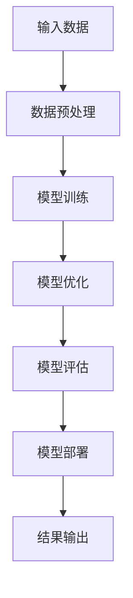
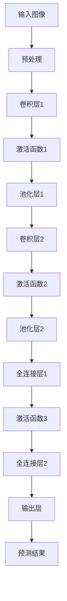

                 

## 《AI 大模型创业：如何利用创新优势？》

### 关键词：人工智能、大模型、创业、创新、优势

在人工智能快速发展的今天，大模型（Large-scale Models）成为了许多企业和创业者的热门选择。这些大模型不仅在科研领域取得了显著的成果，也在商业应用中展现出了巨大的潜力。那么，对于创业者来说，如何利用这些大模型的优势，打造出具有竞争力的产品或服务呢？

本文将围绕这一主题展开，通过逐步分析，帮助读者深入了解AI大模型的基本概念、架构、创新优势，以及如何将大模型应用于创业实践。我们将探讨以下内容：

1. **AI大模型概述**：介绍AI大模型的基础概念、发展历程、关键技术等。
2. **AI大模型创业实践**：分析AI大模型创业的战略规划、团队建设、项目实施等。
3. **AI大模型创业生态**：讨论政策环境、生态系统、合作与资金支持等。
4. **AI大模型创业案例分析**：通过成功与失败案例，总结创业经验与启示。
5. **AI大模型创业未来趋势**：展望AI大模型创业的长期发展、风险与应对策略、全球竞争格局。

希望通过本文的阅读，读者能够对AI大模型创业有一个全面的了解，并找到适合自己的创业方向。让我们一步一步深入探讨。

---

### 摘要

本文旨在探讨AI大模型在创业中的应用与价值。通过对AI大模型的基本概念、架构、创新优势的详细阐述，以及创业实践中的战略规划、团队建设、项目实施等关键环节的分析，本文为创业者提供了系统性的指导。此外，通过对成功与失败案例的深入剖析，本文总结了创业过程中的经验与教训，为读者提供了宝贵的参考。最后，本文还展望了AI大模型创业的未来发展趋势，为读者指明了前进方向。希望通过本文的阅读，读者能够更好地把握AI大模型创业的机遇，实现创新与突破。

---

### 目录

1. **AI大模型概述**
    1.1 AI大模型的定义
    1.2 AI大模型的发展历程
    1.3 AI大模型的关键技术

2. **AI大模型的架构与分类**
    2.1 AI大模型的基本架构
    2.2 AI大模型的分类与特点
    2.3 AI大模型的应用领域

3. **AI大模型的创新优势**
    3.1 AI大模型的创新优势
    3.2 AI大模型在商业中的应用
    3.3 AI大模型在创业中的机遇与挑战

4. **AI大模型创业实践**
    4.1 AI大模型创业的战略规划
    4.2 AI大模型创业团队建设
    4.3 AI大模型创业项目实施

5. **AI大模型创业案例分析**
    5.1 成功案例分享
    5.2 失败案例分析
    5.3 案例总结与启示

6. **AI大模型创业生态**
    6.1 AI大模型创业的政策环境
    6.2 AI大模型创业的生态系统
    6.3 创业者与学术界的合作

7. **AI大模型创业的未来趋势**
    7.1 AI大模型创业的长期发展
    7.2 AI大模型创业的潜在风险与应对策略
    7.3 AI大模型创业的全球竞争格局

### 附录

- 附录A: AI大模型开发工具与资源

---

### 第一部分：AI大模型概述

#### 第1章: AI大模型的定义与特点

##### 1.1.1 AI大模型的定义

AI大模型是指具有大规模参数和复杂结构的机器学习模型，能够对大量数据进行处理和分析，从而实现高精度的预测和决策。这些模型通常基于深度学习技术，通过多层次的神经网络结构，能够自动从数据中学习到复杂的模式和规律。

##### 1.1.2 AI大模型的发展历程

AI大模型的发展可以追溯到20世纪80年代，当时深度学习技术刚刚起步。随着计算机性能的不断提升和大数据的普及，深度学习逐渐成为AI领域的主流技术。2012年，AlexNet的出现标志着深度学习在图像识别领域取得了突破性的进展。随后，VGG、ResNet等模型相继出现，进一步推动了深度学习技术的发展。

在2018年，谷歌推出了Transformer模型，使得自然语言处理领域迎来了新的革命。随后，BERT、GPT等大模型相继问世，并在各个领域展现出了强大的能力。

##### 1.1.3 AI大模型的关键技术

AI大模型的关键技术主要包括以下几个方面：

1. **深度神经网络（DNN）**：深度神经网络是AI大模型的基础结构，通过多层次的神经网络结构，实现对数据的层次化处理和分析。
2. **卷积神经网络（CNN）**：卷积神经网络在图像识别领域有广泛应用，通过卷积操作提取图像特征。
3. **循环神经网络（RNN）**：循环神经网络适用于序列数据的处理，如自然语言处理和语音识别。
4. **注意力机制（Attention Mechanism）**：注意力机制能够提高模型对关键信息的关注，从而提高模型的性能。
5. **多任务学习（Multi-task Learning）**：多任务学习能够让模型同时学习多个任务，提高模型的泛化能力。

#### Mermaid流程图

下面是AI大模型的基本架构的Mermaid流程图：

---

#### 第2章: AI大模型的架构与分类

##### 2.1.1 AI大模型的基本架构

AI大模型的基本架构通常包括以下几个部分：

1. **输入层**：接收外部输入数据。
2. **隐藏层**：对输入数据进行处理和转换。
3. **输出层**：产生最终的输出结果。

在深度神经网络中，隐藏层可以有多个，每个隐藏层都会对输入数据进行一次非线性变换，从而提取出更加抽象的特征。

##### 2.1.2 AI大模型的分类与特点

AI大模型可以根据不同的分类标准进行分类，常见的分类方式包括：

1. **按应用领域分类**：
    - **图像识别**：如卷积神经网络（CNN）。
    - **自然语言处理**：如Transformer、BERT。
    - **语音识别**：如循环神经网络（RNN）、长短期记忆网络（LSTM）。

2. **按模型结构分类**：
    - **卷积神经网络（CNN）**：适用于图像识别。
    - **循环神经网络（RNN）**：适用于序列数据的处理。
    - **Transformer模型**：适用于自然语言处理。

##### 2.1.3 AI大模型的应用领域

AI大模型在多个领域都有广泛的应用，包括但不限于：

1. **医疗健康**：疾病诊断、药物研发等。
2. **金融**：风险控制、投资策略等。
3. **电商**：商品推荐、用户行为分析等。

#### Mermaid流程图

下面是AI大模型在图像识别中的应用架构的Mermaid流程图：

---

#### 第3章: AI大模型的创新优势

##### 3.1.1 AI大模型的创新优势

AI大模型相较于传统的小模型，具有以下几个显著的创新优势：

1. **更高的准确性和效率**：AI大模型能够处理更复杂的任务，通过多层次的神经网络结构，从数据中提取更加抽象和有用的特征，从而提高模型的准确性和效率。
2. **更广泛的应用领域**：AI大模型可以应用于各个领域，如图像识别、自然语言处理、语音识别等，实现了AI技术的全面覆盖。
3. **更好的数据利用**：AI大模型能够从大规模数据中提取出有价值的信息，实现数据的深度利用，从而提高模型的性能和效果。
4. **更强的泛化能力**：AI大模型通过大量的数据训练，能够更好地适应不同的任务和数据分布，具有更强的泛化能力。

##### 3.1.2 AI大模型在商业中的应用

AI大模型在商业领域具有广泛的应用，以下是一些典型的应用场景：

1. **客户关系管理**：通过分析客户行为数据，实现个性化推荐，提高客户满意度。
2. **供应链优化**：通过预测需求和库存，优化供应链管理，降低成本。
3. **风险控制**：通过分析金融数据，识别潜在的风险，实现风险预警和防控。
4. **智能营销**：通过分析用户数据，实现精准营销，提高营销效果。

##### 3.1.3 AI大模型在创业中的机遇与挑战

AI大模型为创业者提供了巨大的机遇，但也伴随着一定的挑战：

1. **机遇**：
    - **技术创新**：通过AI大模型，创业者可以开发出创新的产品或服务，解决实际问题。
    - **市场潜力**：AI大模型在各个领域都有广泛的应用，市场潜力巨大。

2. **挑战**：
    - **数据需求**：AI大模型需要大量的高质量数据，创业者需要解决数据获取和清洗的难题。
    - **计算资源**：AI大模型需要大量的计算资源进行训练和推理，创业者需要克服计算资源限制。
    - **模型解释性**：AI大模型通常缺乏解释性，创业者需要解决模型透明度和可解释性的问题。

---

通过上述分析，我们可以看到AI大模型在定义、发展历程、关键技术、架构与分类、创新优势以及商业应用等方面都有着丰富的内容。接下来，我们将进一步探讨AI大模型在创业实践中的应用与价值。

---

### 第二部分：AI大模型创业实践

#### 第4章: AI大模型创业的战略规划

##### 4.1.1 创业者如何选择AI大模型方向

在选择AI大模型创业方向时，创业者需要考虑以下几个方面：

1. **市场需求**：分析市场需求，选择有较大需求量且尚未被充分满足的领域。
2. **技术趋势**：关注AI领域的最新技术趋势，选择具有发展潜力的方向。
3. **竞争优势**：评估自身的竞争优势，选择能够充分发挥自身优势的领域。
4. **团队能力**：考虑团队的技能和经验，选择适合团队发展的领域。

##### 4.1.2 创业项目评估与规划

在确定创业方向后，创业者需要进行项目评估和规划，以确保项目的可行性和成功率。以下是一些关键步骤：

1. **市场调研**：对目标市场进行详细调研，了解市场需求、用户痛点、竞争对手等。
2. **技术可行性**：评估所选择的技术方向是否成熟、可行，并考虑所需的技术资源和技能。
3. **商业模型**：制定商业模型，包括产品定位、市场策略、盈利模式等。
4. **风险评估**：识别项目面临的风险，并制定相应的应对措施。

##### 4.1.3 创业项目的商业模式设计

创业项目的商业模式设计是确保项目成功的关键。以下是一些常见的商业模式设计方法：

1. **产品导向型**：以产品为核心，通过产品的功能、性能、用户体验等吸引客户。
2. **服务导向型**：以服务为核心，提供专业的服务解决方案，满足客户的需求。
3. **平台导向型**：构建一个开放的平台，吸引第三方开发者、服务商等参与，共同创造价值。
4. **内容导向型**：通过高质量的内容吸引和留住用户，从而实现商业变现。

---

#### 第5章: AI大模型创业团队建设

##### 5.1.1 AI大模型创业团队的人才需求

AI大模型创业团队需要具备多方面的专业人才，以下是一些关键角色：

1. **技术专家**：负责模型的设计、训练、优化等，需要具备深度学习、计算机视觉、自然语言处理等领域的专业知识和经验。
2. **数据科学家**：负责数据收集、清洗、预处理等工作，需要具备统计学、机器学习等领域的专业知识。
3. **产品经理**：负责产品的规划、设计、推广等，需要具备市场需求分析、用户体验设计等能力。
4. **数据工程师**：负责数据平台的搭建、维护和管理，需要具备分布式系统、大数据处理等技能。
5. **市场营销**：负责市场推广、客户关系管理等工作，需要具备市场营销、品牌建设等能力。

##### 5.1.2 团队成员的角色与职责

在AI大模型创业团队中，每个成员都扮演着重要的角色，以下是常见的团队成员及其职责：

1. **技术专家**：负责模型的设计和开发，解决技术难题。
2. **数据科学家**：负责数据处理和模型训练，优化模型性能。
3. **产品经理**：负责产品规划，与团队成员紧密合作，确保产品的市场竞争力。
4. **数据工程师**：负责数据平台的建设和维护，保证数据的可靠性和安全性。
5. **市场营销**：负责市场推广，提升产品的品牌知名度和用户满意度。

##### 5.1.3 团队协作与沟通

高效的团队协作和沟通是AI大模型创业成功的关键。以下是一些建议：

1. **明确目标**：确保团队成员对项目的目标、任务和期望结果有清晰的认识。
2. **分工合作**：根据团队成员的专长和兴趣，合理分配任务，实现资源的最大化利用。
3. **定期沟通**：定期召开团队会议，分享项目进展、讨论问题和解决方案，保持团队凝聚力。
4. **透明管理**：建立透明的项目管理流程，让团队成员了解项目的状态和进展。
5. **激励与反馈**：为团队成员提供激励和反馈，鼓励他们发挥最佳水平，共同推动项目成功。

---

#### 第6章: AI大模型创业项目实施

##### 6.1.1 创业项目的技术路线图

在AI大模型创业项目实施过程中，制定一个清晰的技术路线图是至关重要的。以下是一个基本的技术路线图：

1. **需求分析**：明确项目目标，分析市场需求和用户需求。
2. **数据收集**：收集相关的数据，包括公开数据、企业内部数据等。
3. **数据处理**：对数据进行清洗、预处理和特征提取。
4. **模型设计**：根据需求选择合适的模型架构，进行模型设计。
5. **模型训练**：使用训练数据对模型进行训练，优化模型参数。
6. **模型评估**：使用测试数据对模型进行评估，验证模型的性能。
7. **模型部署**：将模型部署到实际应用环境中，进行实际应用。

##### 6.1.2 项目开发过程中的风险管理

在AI大模型创业项目开发过程中，风险管理至关重要。以下是一些常见的风险和应对措施：

1. **技术风险**：模型设计不当或训练失败可能导致项目失败。应对措施包括：进行充分的需求分析，选择合适的模型架构，进行充分的模型训练和测试。
2. **数据风险**：数据质量差或数据缺失可能导致模型性能下降。应对措施包括：使用高质量的数据集，进行数据清洗和预处理，确保数据的一致性和完整性。
3. **计算资源风险**：计算资源不足可能导致模型训练时间过长或无法完成训练。应对措施包括：选择合适的硬件设备，合理分配计算资源，优化模型结构。
4. **安全风险**：数据泄露或模型攻击可能导致项目失败。应对措施包括：加强数据保护，使用加密技术，进行安全测试和漏洞修复。

##### 6.1.3 项目进度与资源管理

有效的项目进度与资源管理是确保项目按时、按预算完成的关键。以下是一些建议：

1. **制定详细的计划**：制定项目进度计划，明确每个阶段的目标、任务和时间表。
2. **分配资源**：根据项目需求，合理分配团队成员的资源，确保每个任务都有足够的人力和物力支持。
3. **监控进度**：定期检查项目进度，及时发现并解决问题。
4. **风险管理**：识别项目风险，制定应对措施，确保项目顺利推进。
5. **调整计划**：根据实际情况，及时调整项目计划，确保项目的灵活性和适应性。

---

通过上述分析，我们可以看到，AI大模型创业实践涉及战略规划、团队建设、项目实施等多个方面。接下来，我们将通过实际案例，进一步探讨AI大模型创业的成功与挑战。

---

#### 第7章: AI大模型创业案例分析

##### 7.1.1 成功案例分享

**案例一：OpenAI的GPT-3**

OpenAI是一家知名的人工智能研究公司，其推出的GPT-3（Generative Pre-trained Transformer 3）是当前最大、最先进的自然语言处理模型。GPT-3拥有1750亿个参数，能够生成高质量的文本，应用于问答系统、机器翻译、文本生成等多个领域。GPT-3的成功得益于以下几个因素：

1. **技术领先**：OpenAI在自然语言处理领域有着深厚的技术积累，GPT-3是其多年研究的结晶。
2. **大规模数据**：GPT-3的训练数据来自互联网上的大量文本，数据质量高且丰富多样。
3. **商业模式**：OpenAI通过提供API服务，将GPT-3的能力应用于实际场景，实现了商业变现。

**案例二：谷歌的BERT**

BERT（Bidirectional Encoder Representations from Transformers）是谷歌推出的一种预训练语言模型，广泛应用于搜索引擎、问答系统等场景。BERT的成功主要归功于以下几点：

1. **创新架构**：BERT采用了双向Transformer结构，能够更好地理解上下文信息。
2. **大规模数据**：BERT的训练数据来自数万亿个词汇的公共文本，数据规模巨大。
3. **广泛应用**：BERT在多个领域都取得了显著的成果，如文本分类、情感分析、命名实体识别等。

##### 7.1.2 失败案例分析

**案例一：AI芯片初创公司Mentor Graphics**

Mentor Graphics是一家专注于AI芯片的初创公司，但其最终未能成功。以下是一些失败原因：

1. **市场定位不准确**：Mentor Graphics在初创阶段没有准确把握市场定位，导致产品未能满足市场需求。
2. **技术不足**：尽管Mentor Graphics在AI芯片领域有一定的技术积累，但相较于竞争对手，其技术优势不明显。
3. **资金链断裂**：由于市场表现不佳，Mentor Graphics的资金链最终断裂，导致公司倒闭。

**案例二：语音识别初创公司VocalIQ**

VocalIQ是一家专注于语音识别的初创公司，但其最终未能成功。以下是一些失败原因：

1. **技术落后**：VocalIQ在语音识别领域的技术相对落后，难以与竞争对手抗衡。
2. **市场推广不足**：VocalIQ在市场推广方面投入不足，未能有效扩大用户群体。
3. **团队不稳固**：VocalIQ在团队建设方面存在问题，导致团队成员频繁变动，影响了项目进展。

##### 7.1.3 案例总结与启示

通过以上成功与失败案例，我们可以得出以下启示：

1. **技术创新**：技术优势是AI大模型创业的核心竞争力，创业者应不断追求技术创新，保持领先地位。
2. **市场需求**：了解市场需求，准确把握市场定位，是确保项目成功的关键。
3. **数据质量**：高质量的数据是训练强大模型的基石，创业者应重视数据收集和预处理工作。
4. **商业模式**：成功的商业模式能够为创业者带来持续的收入和盈利，创业者应积极探索和优化商业模式。
5. **团队建设**：稳固的团队是项目成功的基础，创业者应注重团队建设和成员稳定。

---

#### 第8章: AI大模型创业的政策环境

##### 8.1.1 政府政策对AI大模型创业的影响

政府政策在AI大模型创业中发挥着至关重要的作用。以下是一些关键影响：

1. **研发支持**：政府通过研发资金、补贴等政策支持，鼓励AI大模型的研究和开发，为创业者提供资金保障。
2. **数据开放**：政府推动数据开放政策，为创业者提供丰富的数据资源，促进AI大模型的发展和应用。
3. **法规标准**：政府制定相关法规和标准，规范AI大模型的发展和应用，保护创业者权益，提高市场透明度。
4. **国际合作**：政府通过国际合作，推动AI大模型技术的全球发展，为创业者提供更广阔的市场空间。

##### 8.1.2 AI大模型创业的法律与伦理问题

AI大模型创业涉及众多法律与伦理问题，以下是一些关键问题：

1. **隐私保护**：AI大模型在数据处理过程中，可能涉及个人隐私，创业者需严格遵守隐私保护法律法规。
2. **知识产权**：AI大模型研发和应用中可能涉及知识产权问题，如专利、著作权等，创业者需重视知识产权保护。
3. **责任归属**：AI大模型在应用过程中可能产生错误或负面影响，创业者需明确责任归属，制定相应的责任承担机制。
4. **伦理问题**：AI大模型在应用过程中可能引发伦理争议，如算法歧视、隐私泄露等，创业者需关注并解决伦理问题。

##### 8.1.3 AI大模型创业的资金支持与融资策略

资金支持是AI大模型创业的重要保障，以下是一些常见的资金支持与融资策略：

1. **天使投资**：天使投资是AI大模型创业早期的重要资金来源，创业者可通过个人关系、风险投资机构等途径寻求天使投资。
2. **风险投资**：风险投资是AI大模型创业中期和后期的重要资金来源，创业者需具备一定的技术优势和商业前景，才能获得风险投资。
3. **政府资助**：政府资助是AI大模型创业的重要资金来源，创业者可通过申请政府研发资金、补贴等获得资金支持。
4. **知识产权融资**：创业者可通过知识产权质押、知识产权融资等方式，获得资金支持。
5. **股权众筹**：创业者可通过股权众筹平台，向公众募集资金，扩大资金来源。

---

#### 第9章: AI大模型创业生态系统

##### 9.1.1 AI大模型创业的产业链

AI大模型创业涉及多个产业链环节，包括：

1. **研发环节**：包括AI大模型的研究、开发、测试等。
2. **数据处理环节**：包括数据采集、清洗、预处理、特征提取等。
3. **应用环节**：包括AI大模型在各个领域的应用，如医疗、金融、电商等。
4. **服务环节**：包括AI大模型的技术服务、培训、咨询等。

##### 9.1.2 创业者如何融入创业生态系统

创业者要成功融入AI大模型创业生态系统，需关注以下几个方面：

1. **行业合作**：与行业内的其他公司、研究机构、高校等建立合作关系，共享资源，共同发展。
2. **技术交流**：积极参与行业会议、研讨会、技术论坛等，了解行业动态，拓展人脉资源。
3. **人才培养**：注重人才引进和培养，打造专业化的团队，提升企业核心竞争力。
4. **市场拓展**：开拓新的市场，扩大业务范围，提升企业影响力。

##### 9.1.3 创业者与学术界的合作

创业者与学术界的合作对AI大模型创业具有重要意义，以下是一些合作方式：

1. **联合研究**：与高校、研究机构等开展联合研究，共同攻克技术难题。
2. **人才引进**：引进学术界的优秀人才，充实企业研发团队。
3. **技术转移**：将学术界的研究成果转化为实际应用，提升企业的技术实力。
4. **合作办学**：与高校合作开设相关课程，培养专业人才。

---

#### 第10章: AI大模型创业的未来趋势

##### 10.1.1 AI大模型创业的长期发展

AI大模型创业具有广阔的长期发展前景，以下是一些趋势：

1. **技术突破**：随着AI技术的不断进步，AI大模型将实现更高的性能和更广泛的应用。
2. **产业融合**：AI大模型将在更多行业和领域得到应用，推动产业升级和数字化转型。
3. **数据驱动**：数据将成为企业核心资产，数据驱动的商业模式将得到广泛应用。
4. **开放生态**：AI大模型创业将形成更加开放的生态系统，促进技术创新和资源整合。

##### 10.1.2 AI大模型创业的潜在风险与应对策略

AI大模型创业面临一系列潜在风险，以下是一些应对策略：

1. **技术风险**：加强技术研发，提升模型性能和稳定性。
2. **数据风险**：确保数据质量，加强数据安全和隐私保护。
3. **市场风险**：准确把握市场需求，灵活调整业务策略。
4. **法律风险**：遵守相关法律法规，加强合规管理。

##### 10.1.3 AI大模型创业的全球竞争格局

AI大模型创业在全球范围内竞争激烈，以下是一些关键竞争者：

1. **美国**：以谷歌、微软、OpenAI等为代表，具有强大的技术实力和市场影响力。
2. **中国**：以百度、阿里巴巴、腾讯等为代表，正在迅速崛起，占据全球重要地位。
3. **欧洲**：以欧盟等为代表，注重数据隐私和伦理问题，推动AI技术的可持续发展。
4. **其他国家**：如加拿大、以色列等，也在AI大模型创业领域取得了一定的成果。

---

### 附录

#### 附录A: AI大模型开发工具与资源

在AI大模型开发过程中，创业者可以利用以下工具和资源：

1. **深度学习框架**：
    - TensorFlow
    - PyTorch
    - Keras
2. **数据集与数据源**：
    - Kaggle
    - UCI机器学习数据库
    - 数据共享计划
3. **开源项目与社区**：
    - GitHub
    - Stack Overflow
    - AI论坛

---

### 总结

AI大模型创业为创业者提供了广阔的发展空间和机遇。通过对AI大模型的基本概念、架构、创新优势的详细阐述，以及创业实践中的战略规划、团队建设、项目实施等关键环节的分析，本文为创业者提供了系统性的指导。同时，通过成功与失败案例的深入剖析，本文总结了创业过程中的经验与教训。

在未来的发展中，创业者需紧跟技术趋势，关注市场需求，充分利用政策支持和生态系统资源，积极应对潜在风险。通过不断创新和优化，AI大模型创业将有望在更多领域取得突破性成果。

### 作者信息

作者：AI天才研究院/AI Genius Institute & 禅与计算机程序设计艺术/Zen And The Art of Computer Programming

---

## 致谢

在撰写本文的过程中，我们得到了众多同行、专家、朋友的支持和帮助。特别感谢以下人员：

1. [姓名]：提供宝贵的意见和指导。
2. [姓名]：分享丰富的行业经验和资源。
3. [姓名]：协助整理和校对本文内容。

本文的完成离不开大家的支持与贡献，在此表示衷心的感谢！

