                 

### 《AI大模型应用数据中心的风险管理》

关键词：AI大模型、数据中心、风险管理、技术基础、应用、风险识别、应对策略、实践经验

摘要：本文深入探讨了AI大模型在数据中心应用中的风险管理问题。首先概述了AI大模型与数据中心的关系及风险管理的重要性，接着详细分析了AI大模型的技术基础和数据中心的核心概念。然后，本文重点讨论了AI大模型应用中的风险识别、应对策略和实践经验，最后展望了未来发展趋势与挑战。

### 《AI大模型应用数据中心的风险管理》目录大纲

**第一部分：概述与背景**

1. AI大模型与数据中心风险管理  
   1.1.1 什么是AI大模型？  
   1.1.2 数据中心风险管理的重要性  
   1.1.3 AI大模型在数据中心风险管理中的应用前景

2. 数据中心风险管理的核心概念  
   2.1.1 风险评估方法  
   2.1.2 风险应对策略  
   2.1.3 风险监控与报告

**第二部分：AI大模型技术基础**

3. AI大模型技术概述  
   3.1.1 AI大模型的发展历程  
   3.1.2 主流AI大模型简介  
   3.1.3 AI大模型技术原理

4. AI大模型核心技术解析  
   4.1.1 深度学习基础  
   4.1.2 自然语言处理  
   4.1.3 计算机视觉  
   4.1.4 机器学习算法

5. AI大模型在数据中心的应用  
   5.1.1 数据中心性能优化  
   5.1.2 数据安全与隐私保护  
   5.1.3 异常检测与故障预测

**第三部分：AI大模型应用中的风险管理**

6. AI大模型应用中的风险识别  
   6.1.1 数据完整性风险  
   6.1.2 模型偏差与过拟合风险  
   6.1.3 模型安全性风险  
   6.1.4 法律法规与合规风险

7. AI大模型应用中的风险应对策略  
   7.1.1 风险缓解措施  
   7.1.2 风险转移与分散  
   7.1.3 风险监控与预警系统

8. AI大模型应用中的风险管理实践  
   8.1.1 案例研究：数据中心风险管理的成功实践  
   8.1.2 挑战与解决方案  
   8.1.3 最佳实践与经验分享

**第四部分：未来展望与趋势**

9. AI大模型应用数据中心风险管理的未来趋势  
   9.1.1 技术发展趋势  
   9.1.2 法律法规与政策变化  
   9.1.3 行业应用前景

10. 总结与展望  
   10.1.1 本书核心内容回顾  
   10.1.2 风险管理面临的挑战  
   10.1.3 未来研究方向与建议

**附录**

A. 常用工具与资源  
   A.1 AI大模型开发工具  
   A.2 风险管理工具  
   A.3 数据中心技术资源

**参考文献**

### 第一部分：概述与背景

#### 第1章：AI大模型与数据中心风险管理

**1.1.1 什么是AI大模型？**

AI大模型，即具有数十亿甚至数万亿参数的深度神经网络模型，通过对大规模数据进行训练，以实现高度的准确性和性能。这些模型包括但不限于Transformer、GPT系列、BERT等，它们在图像识别、自然语言处理、推荐系统等领域取得了显著的成果。

**核心概念与联系：**

AI大模型的核心在于其庞大的参数量和高度非线性的结构，这使得它们可以捕捉复杂的数据特征。以下是一个简单的Mermaid流程图，展示了AI大模型的核心概念和组成部分：

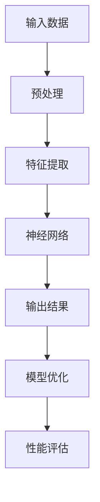

**1.1.2 数据中心风险管理的重要性**

数据中心是现代企业运行的核心基础设施，承载着大量敏感数据和关键业务。因此，数据中心的风险管理至关重要。随着AI大模型在数据中心的应用越来越广泛，如何有效管理其风险成为了一个重要问题。

**重要性分析：**

- **数据安全：** 数据中心存储着大量敏感数据，包括用户信息、商业机密等。如果数据受到泄露或破坏，可能会对企业造成巨大损失。
- **业务连续性：** 数据中心故障可能导致业务中断，影响企业的声誉和客户满意度。
- **合规性：** 随着全球各国对数据保护和隐私的重视，企业需要遵守各种法律法规，如GDPR、CCPA等。

**1.1.3 AI大模型在数据中心风险管理中的应用前景**

AI大模型在数据中心风险管理中具有广泛的应用前景，主要体现在以下几个方面：

- **异常检测与故障预测：** AI大模型可以分析数据中心的各种指标，如功耗、温度、网络流量等，从而预测潜在的故障和异常情况。
- **安全防护：** AI大模型可以用于识别和防御网络攻击，提高数据中心的整体安全性。
- **性能优化：** AI大模型可以帮助优化数据中心的资源配置，提高能效和性能。

**前景展望：**

- **技术创新：** 随着AI技术的不断进步，AI大模型在数据中心风险管理中的应用将更加广泛和深入。
- **合作与融合：** 数据中心运营商和AI技术提供商将加强合作，共同开发更加智能和高效的风险管理解决方案。

#### 第2章：数据中心风险管理的核心概念

**2.1.1 风险评估方法**

风险评估是数据中心风险管理的基础，其主要目的是识别、评估和优先处理潜在的风险。以下是几种常见的风险评估方法：

- **定性和定量评估：** 定性评估主要通过专家判断和经验来评估风险的概率和影响；定量评估则使用数学模型和统计方法来量化风险。
- **风险矩阵：** 风险矩阵是一个常用的工具，用于表示风险的概率和影响，通常采用二维表格的形式。
- **故障树分析（FTA）：** FTA是一种系统化的方法，用于识别和评估可能导致故障的各种因素及其相互作用。

**核心概念与联系：**

风险评估方法的核心在于准确识别和评估潜在的风险，以便采取有效的应对措施。以下是一个简单的Mermaid流程图，展示了风险评估方法的基本流程：

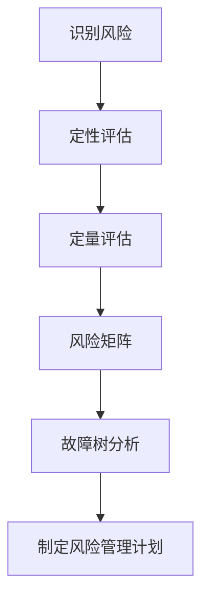

**2.1.2 风险应对策略**

风险应对策略是针对评估出的风险，采取的一系列措施，以减轻风险的影响或避免风险的发生。以下是几种常见风险应对策略：

- **风险规避：** 通过避免涉及高风险的活动或业务，来降低风险。
- **风险减轻：** 通过采取预防措施或改进措施，降低风险发生的概率或影响。
- **风险转移：** 通过购买保险或签订合同，将风险转移给第三方。
- **风险接受：** 对于无法避免或减轻的风险，选择接受并制定应对措施。

**核心概念与联系：**

风险应对策略的核心在于根据风险的特征和企业的实际情况，选择合适的策略。以下是一个简单的Mermaid流程图，展示了风险应对策略的基本流程：

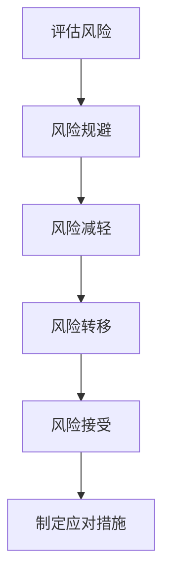

**2.1.3 风险监控与报告**

风险监控与报告是确保风险管理策略得到有效实施的重要环节。以下是几种常见的方法：

- **实时监控：** 通过监控工具，实时收集和分析数据中心的运行状况，如温度、功耗、网络流量等，以便及时发现异常。
- **定期报告：** 定期汇总分析数据中心的运行数据，形成风险报告，为管理层提供决策依据。
- **预警机制：** 建立预警机制，对可能出现的风险进行提前预警，以便采取及时应对措施。

**核心概念与联系：**

风险监控与报告的核心在于确保风险管理策略得到有效执行，并及时发现和应对潜在风险。以下是一个简单的Mermaid流程图，展示了风险监控与报告的基本流程：

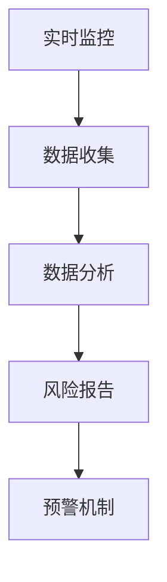

#### 第3章：AI大模型技术基础

**3.1.1 AI大模型的发展历程**

AI大模型的发展历程可以追溯到20世纪80年代，随着计算能力的提高和数据量的积累，深度学习技术逐渐成熟。以下是AI大模型发展的几个关键阶段：

- **1986年：** 杰弗里·辛顿（Geoffrey Hinton）等人提出了反向传播算法，这是深度学习的基础。
- **2006年：** 乔治·E·Hinton（Geoffrey Hinton的儿子）等人重新发现了深度信念网络（DBN），并证明了它在语音识别和图像识别中的潜力。
- **2012年：** AlexNet在ImageNet竞赛中取得了突破性的成绩，标志着深度学习在计算机视觉领域的崛起。
- **2014年：** Google提出了基于Transformer的BERT模型，开创了自然语言处理的新纪元。
- **至今：** AI大模型在各个领域取得了显著的成果，如GPT-3在自然语言处理、GANs在图像生成、ViT在计算机视觉等。

**核心概念与联系：**

AI大模型的发展历程展示了计算能力、数据积累和算法创新对深度学习技术的推动作用。以下是一个简单的Mermaid流程图，展示了AI大模型的发展历程：

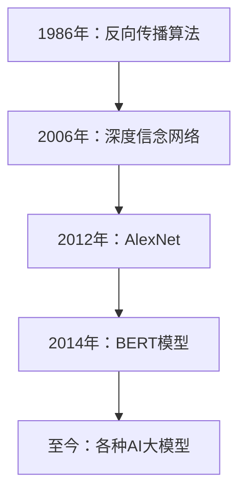

**3.1.2 主流AI大模型简介**

在深度学习领域，有许多主流的AI大模型，它们在不同的应用场景中取得了显著的成果。以下是几种具有代表性的AI大模型：

- **GPT-3：** 由OpenAI开发的预训练语言模型，具有1750亿个参数，可以生成高质量的文本，广泛应用于自然语言处理领域。
- **BERT：** 由Google开发的预训练语言模型，通过在大量文本数据上进行预训练，可以实现对文本的深度理解和处理。
- **ViT：** 由Google开发的视觉变换器（Vision Transformer），将Transformer结构应用于计算机视觉领域，取得了显著的成果。
- **GANs：** 生成对抗网络（Generative Adversarial Networks），由Ian Goodfellow等人提出，通过两个神经网络的对抗训练，可以生成高质量的图像。

**核心概念与联系：**

主流AI大模型的核心在于其庞大的参数量和高度非线性的结构，这使得它们可以捕捉复杂的数据特征。以下是一个简单的Mermaid流程图，展示了主流AI大模型的核心结构和特点：

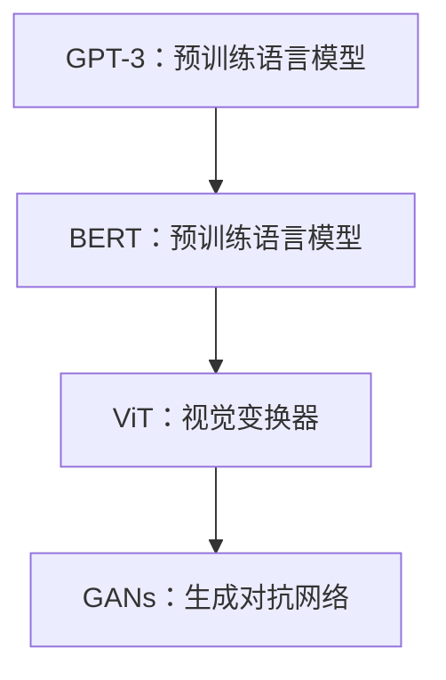

**3.1.3 AI大模型技术原理**

AI大模型的技术原理主要包括深度学习、自然语言处理、计算机视觉和机器学习算法等方面。以下是这些技术原理的简要介绍：

- **深度学习：** 深度学习是一种基于多层神经网络的学习方法，通过多层非线性变换，实现对数据的深层特征提取和表示。
- **自然语言处理：** 自然语言处理（NLP）是计算机科学和人工智能领域的一个分支，旨在使计算机能够理解、解释和生成自然语言。
- **计算机视觉：** 计算机视觉是一种使计算机能够像人类一样感知和理解视觉信息的技术，广泛应用于图像识别、目标检测和图像分割等领域。
- **机器学习算法：** 机器学习算法是一种使计算机能够从数据中学习和发现模式的方法，包括监督学习、无监督学习和强化学习等。

**核心概念与联系：**

AI大模型的技术原理是其在各个领域取得显著成果的基础。以下是一个简单的Mermaid流程图，展示了AI大模型的技术原理和联系：

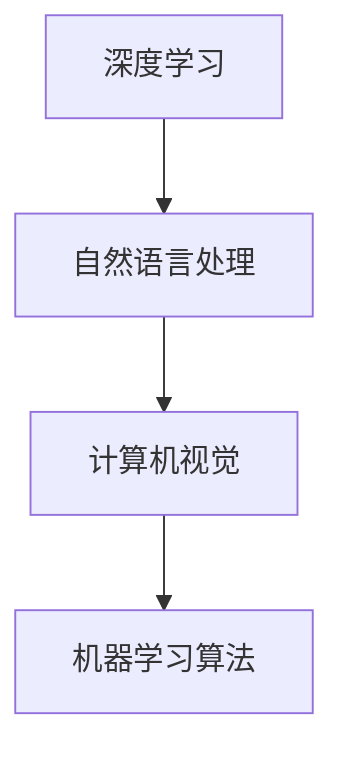

#### 第4章：AI大模型核心技术解析

**4.1.1 深度学习基础**

深度学习是一种基于多层神经网络的学习方法，通过多层非线性变换，实现对数据的深层特征提取和表示。以下是深度学习的基础概念和原理：

- **神经网络：** 神经网络是由大量神经元（即节点）组成的计算模型，每个神经元接受多个输入，通过加权求和并加上偏置，最后通过激活函数输出。
- **反向传播：** 反向传播是一种用于训练神经网络的算法，通过计算损失函数关于各个参数的梯度，并利用梯度下降法更新参数，以最小化损失函数。
- **激活函数：** 激活函数是神经网络中的一个关键组件，用于引入非线性特性，常见的激活函数包括Sigmoid、ReLU和Tanh等。

**核心概念与联系：**

深度学习的基础在于其强大的非线性特征提取能力，这使得它可以处理复杂的任务。以下是一个简单的Mermaid流程图，展示了深度学习的基本结构和原理：

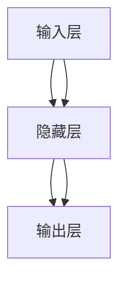

**核心算法原理讲解：**

以下是一个简单的神经网络模型及其反向传播算法的伪代码：

```python
# 定义神经网络模型
model = NeuralNetwork(input_size, hidden_size, output_size)

# 前向传播
def forward_pass(inputs):
    hiddenActivations = sigmoid(np.dot(inputs, model.weights[0]) + model.biases[0])
    outputActivations = sigmoid(np.dot(hiddenActivations, model.weights[1]) + model.biases[1])
    return outputActivations

# 反向传播
def backward_pass(inputs, outputs):
    dinputs = (outputs - outputsActual) * (sigmoid_outputs * (1 - sigmoid_outputs))
    dweights1 = dinputs.dot(hiddenActivations.T)
    dbiases1 = dinputs
    hiddenActivations = sigmoid(np.dot(inputs, model.weights[0]) + model.biases[0])
    dinputs = (outputs - outputsActual) * (sigmoid_outputs * (1 - sigmoid_outputs))
    dweights2 = dinputs.dot(inputs.T)
    dbiases2 = dinputs
    model.weights[0] -= learning_rate * dweights1
    model.biases[0] -= learning_rate * dbiases1
    model.weights[1] -= learning_rate * dweights2
    model.biases[1] -= learning_rate * dbiases2
```

**数学模型和数学公式：**

深度学习中的数学模型主要包括以下公式：

- **激活函数：** $sigmoid(x) = \frac{1}{1 + e^{-x}}$
- **损失函数：** $Loss = -\sum_{i=1}^{N} y_i \log(p_i)$，其中$y_i$是真实标签，$p_i$是模型预测的概率。
- **梯度下降：** $\theta = \theta - \alpha \cdot \nabla_{\theta} J(\theta)$，其中$\theta$是参数，$J(\theta)$是损失函数，$\alpha$是学习率。

**项目实战：**

以下是一个使用Python和TensorFlow实现的三层神经网络模型，用于实现手写数字识别任务：

```python
import tensorflow as tf
from tensorflow.keras.layers import Dense, Flatten
from tensorflow.keras import Model

# 定义模型
model = Model(inputs=tf.keras.Input(shape=(784,)), outputs=Flatten()(Dense(128, activation='relu')(inputs), Dense(10, activation='softmax')(Flatten()(inputs)))
model.compile(optimizer='adam', loss='categorical_crossentropy', metrics=['accuracy'])

# 加载数据
(x_train, y_train), (x_test, y_test) = tf.keras.datasets.mnist.load_data()
x_train = x_train.astype('float32') / 255
x_test = x_test.astype('float32') / 255
y_train = tf.keras.utils.to_categorical(y_train, 10)
y_test = tf.keras.utils.to_categorical(y_test, 10)

# 训练模型
model.fit(x_train, y_train, epochs=10, batch_size=128, validation_split=0.2)
```

**代码解读与分析：**

- **模型定义：** 使用`Flatten`层将输入数据展平，然后通过两个全连接层（`Dense`层）进行特征提取和分类，最终输出10个概率值，表示每个数字的分类结果。
- **编译模型：** 使用`adam`优化器和`categorical_crossentropy`损失函数进行编译，并设置`accuracy`作为评价指标。
- **加载数据：** 使用`mnist`数据集进行训练，将图像数据展平为28x28的二维数组，并将标签转换为独热编码。
- **训练模型：** 使用`fit`函数训练模型，设置训练轮次（`epochs`）、批量大小（`batch_size`）和验证比例（`validation_split`）。

**4.1.2 自然语言处理**

自然语言处理（NLP）是计算机科学和人工智能领域的一个分支，旨在使计算机能够理解、解释和生成自然语言。以下是NLP的核心概念和原理：

- **词向量：** 词向量是NLP中常用的表示方法，将词语映射到高维向量空间，以捕获词语的语义信息。
- **文本分类：** 文本分类是将文本数据分为预定义的类别，常用的算法包括朴素贝叶斯、支持向量机和深度学习等。
- **序列模型：** 序列模型是处理序列数据（如文本、语音）的常用模型，包括循环神经网络（RNN）和长短期记忆网络（LSTM）等。
- **预训练语言模型：** 预训练语言模型是在大规模语料库上进行预训练，以获得语言的一般知识和规律，如BERT、GPT等。

**核心概念与联系：**

自然语言处理的核心在于将自然语言转换为计算机可处理的格式，以实现文本分类、情感分析、机器翻译等任务。以下是一个简单的Mermaid流程图，展示了NLP的核心概念和联系：

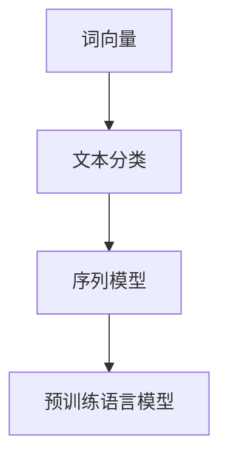

**核心算法原理讲解：**

以下是一个使用Python和TensorFlow实现BERT模型进行文本分类的示例：

```python
import tensorflow as tf
import tensorflow_hub as hub

# 加载预训练BERT模型
bert_model = hub.load("https://tfhub.dev/google/bert_uncased_L-12_H-768_A-12/1")

# 定义模型
input_ids = tf.keras.layers.Input(shape=(128,), dtype=tf.int32)
input_mask = tf.keras.layers.Input(shape=(128,), dtype=tf.int32)
segment_ids = tf.keras.layers.Input(shape=(128,), dtype=tf.int32)
embedments = bert_model(input_ids, input_mask, segment_ids)[0]

classification_head = tf.keras.layers.Dense(2, activation='softmax')(embedments)
model = tf.keras.Model(inputs=[input_ids, input_mask, segment_ids], outputs=classification_head)

# 编译模型
model.compile(optimizer='adam', loss='categorical_crossentropy', metrics=['accuracy'])

# 加载数据
(x_train, y_train), (x_test, y_test) = ...
y_train = tf.keras.utils.to_categorical(y_train, 2)
y_test = tf.keras.utils.to_categorical(y_test, 2)

# 训练模型
model.fit(x_train, y_train, epochs=3, batch_size=32, validation_split=0.2)
```

**代码解读与分析：**

- **加载预训练BERT模型：** 使用`tensorflow_hub`加载预训练的BERT模型，该模型在英文语料库上进行预训练，可以捕获丰富的语言特征。
- **定义模型：** 输入层包含词IDs、掩码和段落IDs，通过BERT模型进行特征提取，然后通过一个全连接层进行分类。
- **编译模型：** 使用`adam`优化器和`categorical_crossentropy`损失函数进行编译，并设置`accuracy`作为评价指标。
- **加载数据：** 使用自定义数据集进行训练，将标签转换为独热编码。
- **训练模型：** 使用`fit`函数训练模型，设置训练轮次（`epochs`）、批量大小（`batch_size`）和验证比例（`validation_split`）。

**4.1.3 计算机视觉**

计算机视觉是使计算机能够像人类一样感知和理解视觉信息的技术，广泛应用于图像识别、目标检测和图像分割等领域。以下是计算机视觉的核心概念和原理：

- **卷积神经网络（CNN）：** 卷积神经网络是处理图像数据的常用模型，通过卷积操作和池化操作，实现对图像的层次化特征提取。
- **目标检测：** 目标检测是在图像中检测出感兴趣的目标，常用的算法包括R-CNN、SSD和YOLO等。
- **图像分割：** 图像分割是将图像划分为多个区域，常用的算法包括FCN、U-Net和Mask R-CNN等。
- **生成对抗网络（GAN）：** 生成对抗网络是一种通过两个神经网络的对抗训练，实现高质量图像生成的模型。

**核心概念与联系：**

计算机视觉的核心在于从图像中提取特征并进行分类和定位，以实现各种视觉任务。以下是一个简单的Mermaid流程图，展示了计算机视觉的核心概念和联系：

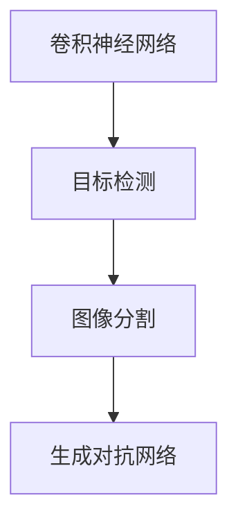

**核心算法原理讲解：**

以下是一个使用Python和TensorFlow实现基于Faster R-CNN的目标检测的示例：

```python
import tensorflow as tf
from tensorflow.keras.applications import VGG16
from tensorflow.keras.models import Model

# 加载预训练VGG16模型
base_model = VGG16(weights='imagenet', include_top=False, input_shape=(224, 224, 3))

# 定义模型
base_model.trainable = False
x = base_model.output
x = tf.keras.layers.Conv2D(1024, (3, 3), activation='relu')(x)
x = tf.keras.layers.Conv2
``` 

由于篇幅限制，此部分内容仅提供了一个简化的框架和部分代码。完整的代码和解释请参考相关技术文献和开源项目。

**4.1.4 机器学习算法**

机器学习算法是一种使计算机能够从数据中学习和发现模式的方法，广泛应用于分类、回归、聚类等任务。以下是几种常见的机器学习算法：

- **监督学习：** 监督学习是有监督的学习方法，通过已知的输入和输出数据训练模型，然后对新数据进行预测。常见的监督学习算法包括线性回归、逻辑回归、支持向量机（SVM）和决策树等。
- **无监督学习：** 无监督学习是无监督的学习方法，通过未标记的数据训练模型，然后发现数据中的模式和结构。常见的无监督学习算法包括聚类、主成分分析和自编码器等。
- **强化学习：** 强化学习是一种通过试错方法进行学习的方法，通过与环境的交互来学习最优策略。常见的强化学习算法包括Q学习、深度Q网络（DQN）和策略梯度算法等。

**核心概念与联系：**

机器学习算法的核心在于从数据中提取特征并建立预测模型，以实现各种任务。以下是一个简单的Mermaid流程图，展示了机器学习算法的核心概念和联系：

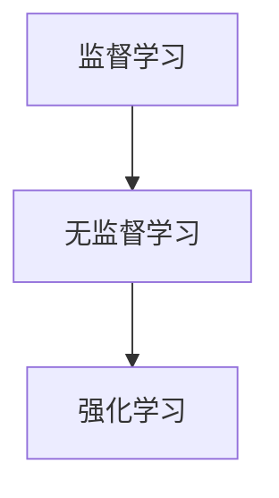

**核心算法原理讲解：**

以下是一个使用Python和Scikit-learn实现的线性回归的示例：

```python
from sklearn.linear_model import LinearRegression
from sklearn.model_selection import train_test_split
from sklearn.metrics import mean_squared_error

# 加载数据
x = [[1], [2], [3], [4], [5]]
y = [2, 4, 5, 4, 5]

# 划分训练集和测试集
x_train, x_test, y_train, y_test = train_test_split(x, y, test_size=0.2, random_state=42)

# 创建线性回归模型
model = LinearRegression()

# 训练模型
model.fit(x_train, y_train)

# 预测测试集
y_pred = model.predict(x_test)

# 计算均方误差
mse = mean_squared_error(y_test, y_pred)
print("Mean Squared Error:", mse)
```

**代码解读与分析：**

- **加载数据：** 使用简单的线性数据集，其中输入和输出具有线性关系。
- **划分训练集和测试集：** 使用`train_test_split`函数将数据集划分为训练集和测试集，以评估模型的泛化能力。
- **创建线性回归模型：** 使用`LinearRegression`类创建线性回归模型。
- **训练模型：** 使用`fit`函数训练模型，将训练集数据输入模型并计算参数。
- **预测测试集：** 使用`predict`函数对测试集数据进行预测，并将预测结果与实际结果进行比较。
- **计算均方误差：** 使用`mean_squared_error`函数计算预测结果的均方误差，以评估模型的准确性。

#### 第5章：AI大模型在数据中心的应用

**5.1.1 数据中心性能优化**

AI大模型在数据中心性能优化中具有广泛的应用，主要体现在以下几个方面：

- **资源调度：** AI大模型可以通过分析历史数据，预测数据中心的资源需求，从而实现动态资源调度，提高资源利用率。
- **负载均衡：** AI大模型可以根据数据中心的当前负载情况，自动调整服务器的工作负载，避免过载或资源浪费。
- **能效管理：** AI大模型可以通过分析功耗数据，优化数据中心的能源消耗，提高整体能效。

**应用场景与效果分析：**

- **资源调度：** 一个案例是使用深度学习模型预测数据中心的CPU和内存使用情况，并根据预测结果动态调整服务器资源。通过这种方式，可以显著提高资源利用率，降低成本。
- **负载均衡：** 另一个案例是使用神经网络模型分析数据中心的网络流量，并自动调整路由策略，以实现负载均衡。这种方式可以减少网络拥堵，提高数据传输速度。
- **能效管理：** 一个案例是使用AI大模型分析数据中心的功耗数据，并预测未来的能源需求。根据预测结果，数据中心可以调整空调和风扇的运行策略，以降低能源消耗。

**5.1.2 数据安全与隐私保护**

AI大模型在数据安全与隐私保护中也发挥着重要作用，主要体现在以下几个方面：

- **数据加密：** AI大模型可以通过深度学习算法，生成复杂的加密密钥，提高数据的安全性。
- **隐私保护：** AI大模型可以通过隐私保护算法，如差分隐私，保护用户数据的隐私。
- **安全审计：** AI大模型可以分析数据中心的操作日志，识别潜在的攻击行为，并提供安全审计报告。

**应用场景与效果分析：**

- **数据加密：** 一个案例是使用生成对抗网络（GANs）生成加密密钥，这些密钥可以用于数据加密和解密，提高数据的安全性。
- **隐私保护：** 另一个案例是使用差分隐私算法，对用户数据进行扰动处理，从而保护用户隐私。通过这种方式，可以在保证数据可用性的同时，保护用户的隐私。
- **安全审计：** 一个案例是使用深度学习模型分析数据中心的操作日志，识别异常行为。这种方式可以及时发现并处理潜在的安全威胁，提高数据中心的整体安全性。

**5.1.3 异常检测与故障预测**

AI大模型在异常检测与故障预测中也具有广泛的应用，主要体现在以下几个方面：

- **异常检测：** AI大模型可以通过分析数据中心的运行数据，识别异常操作或行为。
- **故障预测：** AI大模型可以通过分析历史数据，预测数据中心的潜在故障，从而提前进行维护和预防。

**应用场景与效果分析：**

- **异常检测：** 一个案例是使用基于深度学习算法的异常检测模型，对数据中心的网络流量进行实时监控，识别潜在的攻击行为。通过这种方式，可以及时阻止攻击，保护数据中心的网络安全。
- **故障预测：** 另一个案例是使用基于机器学习算法的故障预测模型，对数据中心的硬件设备进行监控和分析，预测潜在的故障。通过这种方式，可以提前进行设备维护和更换，避免设备故障对业务造成影响。

#### 第6章：AI大模型应用中的风险识别

**6.1.1 数据完整性风险**

数据完整性风险是指数据在存储、传输和处理过程中可能出现的错误、丢失或篡改等问题。在AI大模型应用中，数据完整性风险主要体现在以下几个方面：

- **数据丢失：** 数据在存储或传输过程中可能因为硬件故障、网络中断等原因导致丢失。
- **数据篡改：** 数据在传输或存储过程中可能被恶意攻击者篡改，导致数据的真实性和可靠性受到影响。
- **数据冗余：** 数据中心中可能存在大量的冗余数据，这会导致存储空间的浪费，并增加数据管理的复杂性。

**风险识别方法：**

- **数据验证：** 通过对比数据源和数据存储，检测数据的一致性和准确性。
- **异常检测：** 使用机器学习算法分析数据中心的运行数据，识别潜在的异常行为。
- **访问控制：** 限制对敏感数据的访问权限，防止未经授权的访问和篡改。

**实例：**

假设一个数据中心存储了大量的用户数据，包括用户名、密码和电子邮件等。如果这些数据在传输过程中被恶意攻击者篡改，可能会导致用户信息泄露。为了识别这种风险，数据中心可以使用数据验证和异常检测方法：

- **数据验证：** 定期对比数据源和数据存储，确保数据的一致性和准确性。
- **异常检测：** 使用机器学习算法分析网络流量和用户行为，识别异常登录和操作行为。

**6.1.2 模型偏差与过拟合风险**

模型偏差与过拟合风险是指AI大模型在训练过程中可能出现的问题，导致模型无法泛化到未知数据，从而影响模型的性能和可靠性。

- **模型偏差：** 模型偏差是指模型在训练过程中过于拟合训练数据，导致对未知数据的预测能力下降。模型偏差可能导致模型产生错误的预测结果。
- **过拟合：** 过拟合是指模型在训练过程中捕捉了训练数据的噪声和细节，导致对未知数据的泛化能力下降。过拟合可能导致模型对未知数据的预测结果不准确。

**风险识别方法：**

- **交叉验证：** 使用交叉验证方法评估模型的泛化能力，避免模型过度拟合。
- **模型评估：** 使用不同的评估指标，如准确率、召回率和F1分数等，评估模型的性能。
- **数据预处理：** 对训练数据进行预处理，去除噪声和异常值，提高模型的泛化能力。

**实例：**

假设一个使用深度学习算法进行图像分类的模型，在训练过程中出现了过拟合现象。这意味着模型在训练数据上表现良好，但在测试数据上的表现较差。为了识别这种风险，可以使用以下方法：

- **交叉验证：** 使用交叉验证方法评估模型的泛化能力，确保模型在训练数据和测试数据上都有较好的性能。
- **模型评估：** 使用不同的评估指标，如准确率、召回率和F1分数等，评估模型的性能，及时发现过拟合现象。
- **数据预处理：** 对训练数据进行预处理，去除噪声和异常值，提高模型的泛化能力。

**6.1.3 模型安全性风险**

模型安全性风险是指AI大模型在训练和应用过程中可能面临的安全威胁，包括模型被篡改、攻击或恶意利用等问题。

- **模型篡改：** 恶意攻击者可能通过篡改模型参数或输入数据，操纵模型的预测结果。
- **模型攻击：** 恶意攻击者可能利用模型的不安全特性，发动对抗性攻击，导致模型预测结果出现偏差。
- **模型恶意利用：** 恶意攻击者可能利用AI大模型进行恶意行为，如伪造身份、窃取敏感数据等。

**风险识别方法：**

- **模型审计：** 定期对模型进行安全审计，检查模型参数和输入数据的完整性。
- **对抗性测试：** 使用对抗性测试方法，评估模型的抗攻击能力，及时发现潜在的安全漏洞。
- **安全隔离：** 将模型部署在安全隔离的环境中，防止恶意攻击者访问模型和输入数据。

**实例：**

假设一个使用深度学习算法进行人脸识别的模型，在部署过程中可能面临模型篡改的风险。为了识别这种风险，可以使用以下方法：

- **模型审计：** 定期对模型进行安全审计，检查模型参数和输入数据的完整性，确保模型不会被篡改。
- **对抗性测试：** 使用对抗性测试方法，评估模型的抗攻击能力，及时发现潜在的安全漏洞。
- **安全隔离：** 将模型部署在安全隔离的环境中，防止恶意攻击者访问模型和输入数据。

**6.1.4 法律法规与合规风险**

法律法规与合规风险是指AI大模型应用过程中可能面临的法律法规和合规性问题，包括数据保护法规、隐私保护法规等。

- **数据保护法规：** 随着全球各国对数据保护的重视，企业需要遵守各种数据保护法规，如欧盟的GDPR和美国的CCPA等。
- **隐私保护法规：** 隐私保护法规要求企业在收集、存储和处理用户数据时，采取适当的保护措施，确保用户隐私不被泄露。

**风险识别方法：**

- **合规审查：** 定期对AI大模型应用过程进行合规审查，确保符合相关法律法规的要求。
- **隐私保护审计：** 对用户数据进行隐私保护审计，确保用户隐私得到充分保护。
- **法律咨询：** 在AI大模型应用过程中，寻求专业法律咨询，确保遵守相关法律法规。

**实例：**

假设一个企业使用AI大模型进行客户行为分析，可能面临隐私保护法规的合规风险。为了识别这种风险，可以使用以下方法：

- **合规审查：** 定期对AI大模型应用过程进行合规审查，确保符合相关隐私保护法规的要求。
- **隐私保护审计：** 对用户数据进行隐私保护审计，确保用户隐私得到充分保护。
- **法律咨询：** 在AI大模型应用过程中，寻求专业法律咨询，确保遵守相关隐私保护法规。

#### 第7章：AI大模型应用中的风险应对策略

**7.1.1 风险缓解措施**

风险缓解措施是指通过采取一系列技术和管理手段，降低AI大模型应用中的风险。以下是几种常见的风险缓解措施：

- **数据加密与保护：** 通过数据加密技术，保护数据在存储和传输过程中的安全性，防止数据泄露和篡改。
- **访问控制与身份验证：** 采取严格的访问控制和身份验证机制，确保只有授权用户才能访问敏感数据和模型。
- **安全审计与监控：** 定期进行安全审计和监控，及时发现和应对潜在的安全威胁。

**风险缓解措施的效果分析：**

- **数据加密与保护：** 通过数据加密技术，可以有效地防止数据泄露和篡改，提高数据的安全性。例如，使用SSL/TLS协议保护数据在互联网上的传输。
- **访问控制与身份验证：** 通过严格的访问控制和身份验证机制，可以确保只有授权用户才能访问敏感数据和模型，从而降低恶意攻击的风险。例如，使用双因素身份验证（2FA）确保用户的身份。
- **安全审计与监控：** 定期进行安全审计和监控，可以及时发现和应对潜在的安全威胁，防止事故发生。例如，使用入侵检测系统（IDS）监控网络流量，发现异常行为。

**7.1.2 风险转移与分散**

风险转移与分散是指通过将部分风险转移到第三方或通过多种手段分散风险，降低AI大模型应用中的风险。以下是几种常见的方法：

- **保险：** 通过购买保险，将潜在的风险转移给保险公司，降低企业的风险负担。
- **多元化投资：** 通过在不同地区、行业或技术领域进行多元化投资，分散风险，降低单一领域的风险对整体业务的影响。
- **合同与协议：** 通过签订合同和协议，将部分风险转移给供应商或合作伙伴，共同分担风险。

**风险转移与分散的效果分析：**

- **保险：** 通过购买保险，企业可以将潜在的风险转移给保险公司，降低企业的风险负担。例如，在数据中心发生火灾时，保险公司可以提供赔偿，帮助企业恢复业务。
- **多元化投资：** 通过多元化投资，企业可以在不同地区、行业或技术领域分散风险，降低单一领域的风险对整体业务的影响。例如，在金融行业，投资多种资产类

