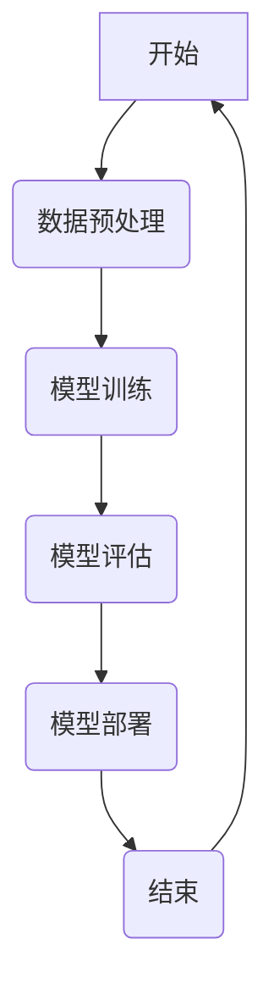
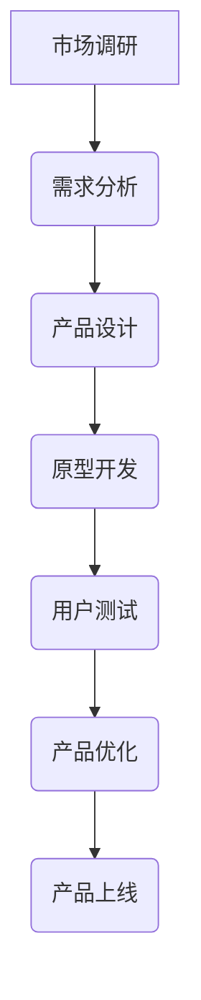

                 

# 《AI驱动的创业产品经理：大模型时代的技能升级》

> 关键词：AI驱动、创业产品经理、大模型、技能升级、技术应用

> 摘要：随着人工智能技术的快速发展，大模型时代已经来临。本文旨在探讨大模型时代下，创业产品经理如何进行技能升级，以应对新的挑战和机遇。通过分析AI驱动对企业变革的影响，以及创业产品经理的角色转型，本文提出了在大模型时代下，创业产品经理应具备的核心能力，并详细阐述了大模型的基本原理与应用。通过实战案例，本文展示了大模型在创业产品管理中的实际应用，并提出了创业产品经理技能提升的方向。

----------------------------------------------------------------<|assistant|>## 第一部分：大模型时代的前奏

### 第1章：大模型时代的崛起

#### 1.1 大模型的起源与发展

##### 1.1.1 大模型的定义

大模型（Large Model）是指具有数十亿、甚至数万亿参数的神经网络模型。这些模型具有强大的表示能力和计算能力，可以在各种复杂任务中取得优异的性能。大模型的定义并没有一个严格的界限，但通常认为参数数量达到百万级别的模型就可以被归类为大模型。

##### 1.1.2 大模型的分类

大模型可以根据其应用领域进行分类，主要包括以下几类：

1. 自然语言处理（NLP）：如GPT、BERT等。
2. 计算机视觉（CV）：如ImageNet分类模型等。
3. 语音识别（ASR）：如DeepSpeech等。
4. 强化学习（RL）：如AlphaGo等。

##### 1.1.3 大模型的应用场景

大模型的应用场景广泛，主要包括以下几个方面：

1. 自动驾驶：利用深度学习技术，大模型可以实现对周围环境的感知和理解，为自动驾驶提供决策支持。
2. 智能客服：大模型可以用于构建智能客服系统，实现对用户需求的自动理解和响应。
3. 医疗诊断：大模型可以帮助医生进行疾病诊断，提高诊断准确率。
4. 金融风控：大模型可以用于信用评估、风险预测等金融领域。

#### 1.2 AI驱动与企业变革

##### 1.2.1 AI驱动的含义

AI驱动（AI-driven）是指企业利用人工智能技术，提高业务效率和创新能力的过程。AI驱动不仅仅是指使用AI技术解决具体问题，更重要的是将AI技术融入到企业的业务流程和战略规划中，实现业务模式的创新和转型。

##### 1.2.2 AI驱动对企业的影响

AI驱动对企业的影响主要体现在以下几个方面：

1. 提高业务效率：AI技术可以帮助企业自动化繁琐的工作，提高业务效率。
2. 创新业务模式：AI驱动可以推动企业探索新的业务模式，如共享经济、按需服务等。
3. 改进决策支持：AI驱动可以为企业提供基于数据的决策支持，提高决策质量。
4. 增强用户体验：AI驱动可以帮助企业构建更加智能的产品和服务，提升用户体验。

##### 1.2.3 创业者在AI驱动下的机遇与挑战

在AI驱动的大背景下，创业者面临着前所未有的机遇和挑战：

1. 机遇：创业者可以利用AI技术快速构建原型，验证商业想法，降低创业门槛。
2. 挑战：创业者需要具备一定的技术背景，了解AI技术的基本原理和应用，才能更好地利用AI驱动企业成长。

### 第2章：创业产品经理的角色转型

#### 2.1 创业产品经理的职责与挑战

##### 2.1.1 创业产品经理的职责

创业产品经理（Product Manager）在创业公司中扮演着关键角色，其职责主要包括：

1. 产品规划：根据市场需求和公司战略，制定产品规划和路线图。
2. 需求分析：与用户和市场沟通，收集需求，确定产品功能。
3. 产品设计：与设计师和工程师协作，设计产品的用户界面和用户体验。
4. 项目管理：协调各方资源，确保项目按时交付。
5. 数据分析：利用数据分析，优化产品功能和市场策略。

##### 2.1.2 创业产品经理面临的挑战

创业产品经理在创业公司中面临的挑战主要包括：

1. 资源有限：创业公司通常资源有限，产品经理需要高效利用资源，实现最大价值。
2. 市场竞争：创业公司面临激烈的市场竞争，产品经理需要具备敏锐的市场洞察力，把握市场动态。
3. 团队协作：创业公司的团队通常较小，产品经理需要具备良好的团队协作和沟通能力。

##### 2.1.3 AI驱动对创业产品经理的影响

AI驱动对创业产品经理的影响主要体现在以下几个方面：

1. 数据分析：AI驱动可以为企业提供大量数据，产品经理需要具备数据分析能力，利用数据优化产品。
2. 自动化：AI驱动的自动化技术可以帮助产品经理减少繁琐的工作，提高效率。
3. 创新能力：AI驱动的技术可以为产品经理提供新的创意和灵感，推动产品创新。
4. 团队协作：AI驱动可以帮助产品经理与工程师、数据科学家等角色更好地协作，提高团队整体效率。

#### 2.2 创业产品经理的核心能力

##### 2.2.1 产品思维

产品思维是指从用户角度出发，关注用户需求和体验，以实现产品价值的思维方式。创业产品经理需要具备以下产品思维能力：

1. 用户视角：始终以用户为中心，关注用户需求和体验。
2. 敏捷开发：灵活应对市场变化，快速迭代产品。
3. 价值导向：以产品价值为核心，制定产品规划和设计。

##### 2.2.2 技术敏感度

技术敏感度是指对新兴技术和行业趋势的敏感度，以及理解技术如何应用于产品开发的能力。创业产品经理需要具备以下技术敏感度：

1. 技术了解：了解常见的技术概念和原理，如深度学习、大数据等。
2. 行业趋势：关注行业动态，掌握新兴技术趋势。
3. 技术评估：能够评估新技术对产品的潜在影响，制定技术路线图。

##### 2.2.3 数据分析能力

数据分析能力是指运用数据分析方法和工具，对产品数据进行挖掘和分析，为产品决策提供支持的能力。创业产品经理需要具备以下数据分析能力：

1. 数据收集：能够收集和整理产品数据，为数据分析提供基础。
2. 数据分析：掌握常见的数据分析方法和工具，如Excel、Python等。
3. 数据可视化：能够通过图表和可视化工具，呈现数据分析结果。

##### 2.2.4 团队协作与沟通能力

团队协作与沟通能力是指与团队成员和其他部门有效沟通、协作，推动项目进展的能力。创业产品经理需要具备以下团队协作与沟通能力：

1. 沟通协调：能够与团队成员和其他部门有效沟通，协调各方资源。
2. 团队管理：具备一定的团队管理能力，能够激励和指导团队成员。
3. 冲突解决：能够妥善处理团队内部和外部的冲突，确保项目顺利进行。

----------------------------------------------------------------<|assistant|>### 第1章：大模型时代的崛起

#### 1.1 大模型的起源与发展

##### 1.1.1 大模型的定义

大模型（Large Model）是指具有数十亿、甚至数万亿参数的神经网络模型。这些模型具有强大的表示能力和计算能力，可以在各种复杂任务中取得优异的性能。大模型的定义并没有一个严格的界限，但通常认为参数数量达到百万级别的模型就可以被归类为大模型。

大模型的起源可以追溯到20世纪80年代，当时神经网络研究开始兴起。随着计算能力的提升和大数据的积累，神经网络模型在处理复杂数据任务时逐渐展现出优势。2012年，AlexNet在ImageNet竞赛中取得的突破性成绩，标志着深度学习技术的崛起。此后，大模型的研究和应用开始迅速发展。

##### 1.1.2 大模型的分类

大模型可以根据其应用领域进行分类，主要包括以下几类：

1. 自然语言处理（NLP）：如GPT、BERT等。
2. 计算机视觉（CV）：如ImageNet分类模型等。
3. 语音识别（ASR）：如DeepSpeech等。
4. 强化学习（RL）：如AlphaGo等。

自然语言处理领域的大模型，如GPT-3，具有数万亿个参数，能够对自然语言进行建模，实现文本生成、翻译、摘要等任务。计算机视觉领域的大模型，如BERT，通过预训练和微调，能够在图像分类、目标检测、图像分割等任务中取得优异的性能。语音识别领域的大模型，如DeepSpeech，通过深度神经网络对语音信号进行处理，实现高精度的语音识别。强化学习领域的大模型，如AlphaGo，通过深度强化学习技术，实现了围棋等复杂游戏的自动化。

##### 1.1.3 大模型的应用场景

大模型的应用场景广泛，主要包括以下几个方面：

1. 自动驾驶：利用深度学习技术，大模型可以实现对周围环境的感知和理解，为自动驾驶提供决策支持。
2. 智能客服：大模型可以用于构建智能客服系统，实现对用户需求的自动理解和响应。
3. 医疗诊断：大模型可以帮助医生进行疾病诊断，提高诊断准确率。
4. 金融风控：大模型可以用于信用评估、风险预测等金融领域。

在自动驾驶领域，大模型通过计算机视觉和深度学习技术，实现对车辆周围环境的感知和识别，从而实现自动驾驶功能。在智能客服领域，大模型通过自然语言处理技术，实现对用户请求的理解和响应，提供智能客服服务。在医疗诊断领域，大模型通过分析大量的医疗数据，实现对疾病的高精度诊断。在金融风控领域，大模型通过分析用户行为和交易数据，实现对信用风险的评估和预测。

#### 1.2 AI驱动与企业变革

##### 1.2.1 AI驱动的含义

AI驱动（AI-driven）是指企业利用人工智能技术，提高业务效率和创新能力的过程。AI驱动不仅仅是指使用AI技术解决具体问题，更重要的是将AI技术融入到企业的业务流程和战略规划中，实现业务模式的创新和转型。

AI驱动的核心思想是将人工智能技术作为企业发展的驱动力，通过数据驱动、智能化决策、自动化运营等方式，提高企业的生产效率、降低成本、提升用户体验。在AI驱动的企业中，人工智能技术不再是简单的工具，而是成为企业战略的一部分，贯穿于企业的各个业务环节。

##### 1.2.2 AI驱动对企业的影响

AI驱动对企业的影响主要体现在以下几个方面：

1. 提高业务效率：AI技术可以帮助企业自动化繁琐的工作，提高业务效率。例如，通过智能客服系统，企业可以减少人力成本，提高客户响应速度。

2. 创新业务模式：AI驱动可以推动企业探索新的业务模式，如共享经济、按需服务等。例如，共享单车企业通过AI技术实现车辆的智能调度和运维，提高了运营效率。

3. 改进决策支持：AI驱动可以为企业提供基于数据的决策支持，提高决策质量。例如，通过大数据分析，企业可以更准确地预测市场趋势和用户需求。

4. 增强用户体验：AI驱动可以帮助企业构建更加智能的产品和服务，提升用户体验。例如，智能音响、智能机器人等产品的出现，使得用户生活更加便捷。

##### 1.2.3 创业者在AI驱动下的机遇与挑战

在AI驱动的大背景下，创业者面临着前所未有的机遇和挑战：

1. 机遇：创业者可以利用AI技术快速构建原型，验证商业想法，降低创业门槛。例如，通过AI技术，创业者可以开发智能客服系统、智能诊断系统等，实现快速商业化。

2. 挑战：创业者需要具备一定的技术背景，了解AI技术的基本原理和应用，才能更好地利用AI驱动企业成长。例如，创业者需要掌握深度学习、大数据分析等技术，才能开发出具有竞争力的产品。

总之，大模型时代的崛起和AI驱动的企业变革，为创业产品经理带来了新的机遇和挑战。创业产品经理需要不断学习和提升自己的技能，以适应大模型时代的要求，推动企业实现持续创新和发展。

### 第2章：创业产品经理的角色转型

#### 2.1 创业产品经理的职责与挑战

##### 2.1.1 创业产品经理的职责

在创业公司中，产品经理的职责通常更为广泛和复杂，这主要是因为创业公司的资源相对有限，产品经理往往需要扮演多种角色。以下是创业产品经理的主要职责：

1. **市场调研与需求分析**：深入了解市场动态、竞争对手和目标用户的需求，收集并分析市场数据，为产品规划提供依据。

2. **产品规划与设计**：根据市场需求和公司战略，制定产品愿景和路线图，设计产品的功能模块和用户体验。

3. **项目管理**：协调内部资源，确保产品开发进度和质量，与开发团队、设计团队和测试团队紧密合作。

4. **用户反馈与迭代**：收集用户反馈，持续优化产品功能，推动产品的迭代更新。

5. **数据驱动决策**：运用数据分析工具，对用户行为、市场趋势和产品性能进行监控，为产品优化和战略调整提供数据支持。

6. **团队协作与沟通**：与团队成员、上级领导和其他部门（如市场、销售、运营等）保持良好的沟通，确保项目顺利进行。

##### 2.1.2 创业产品经理面临的挑战

创业产品经理面临的挑战主要体现在以下几个方面：

1. **资源有限**：创业公司通常资源有限，产品经理需要在有限的资源下做出最优决策，平衡产品需求、开发进度和成本控制。

2. **快速迭代**：创业公司的市场环境变化快，产品经理需要快速响应市场变化，持续迭代产品，以保持市场竞争力。

3. **团队协作**：创业公司的团队规模通常较小，产品经理需要具备较强的团队协作和沟通能力，确保项目高效推进。

4. **技术门槛**：创业产品经理需要具备一定的技术背景，能够与开发团队有效沟通，理解技术实现的难度和可行性。

5. **市场定位**：在竞争激烈的市场中，产品经理需要准确把握市场定位，制定有效的市场策略，确保产品能够脱颖而出。

##### 2.1.3 AI驱动对创业产品经理的影响

AI驱动的兴起对创业产品经理的角色产生了深远的影响，主要体现在以下几个方面：

1. **数据分析能力提升**：AI驱动的企业需要大量数据支持决策，创业产品经理需要具备强大的数据分析能力，能够从海量数据中提取有价值的信息。

2. **自动化工具的应用**：AI驱动的自动化工具可以帮助产品经理减轻繁琐的工作负担，提高工作效率。例如，自动化的需求收集、用户行为分析和市场趋势预测等。

3. **产品创新**：AI技术为创业产品经理提供了更多的创新机会，可以通过AI技术实现个性化推荐、智能客服、智能诊断等功能，提升产品的竞争力。

4. **团队协作模式的改变**：AI驱动的企业中，团队成员的技能和角色可能更加多样，产品经理需要适应这种变化，建立更加灵活和高效的团队协作模式。

5. **决策支持**：AI驱动的企业可以通过机器学习和数据分析技术，为产品经理提供更加精准的决策支持，减少主观判断的风险。

#### 2.2 创业产品经理的核心能力

##### 2.2.1 产品思维

产品思维是指从用户角度出发，以用户需求和满意度为核心，进行产品设计和决策的思维方式。对于创业产品经理来说，产品思维是至关重要的能力，它包括以下几个方面：

1. **用户视角**：始终关注用户的需求和体验，将用户的需求放在首位，确保产品的设计能够满足用户的核心需求。

2. **敏捷开发**：在快速变化的市场环境中，创业产品经理需要具备敏捷开发的能力，能够快速响应市场变化，持续迭代产品。

3. **价值导向**：创业产品经理在制定产品规划时，需要以产品价值为核心，确保每一项功能都有明确的价值和目标。

##### 2.2.2 技术敏感度

技术敏感度是指对新兴技术和行业趋势的敏感度，以及理解技术如何应用于产品开发的能力。在AI驱动的大模型时代，创业产品经理需要具备以下技术敏感度：

1. **技术了解**：了解常见的技术概念和原理，如深度学习、大数据、云计算等，能够与技术开发团队进行有效沟通。

2. **行业趋势**：关注行业动态和新兴技术趋势，及时掌握最新的技术发展和应用场景。

3. **技术评估**：能够评估新技术对产品的潜在影响，判断新技术是否适合当前产品的需求，并制定相应的技术路线图。

##### 2.2.3 数据分析能力

数据分析能力是指运用数据分析方法和工具，对产品数据进行挖掘和分析，为产品决策提供支持的能力。对于创业产品经理来说，数据分析能力是提升产品竞争力的关键能力，包括以下几个方面：

1. **数据收集**：能够收集和整理产品数据，包括用户行为数据、市场数据等，为数据分析提供基础。

2. **数据分析**：掌握常见的数据分析方法和工具，如Python、R、Excel等，能够对数据进行深入分析，提取有价值的信息。

3. **数据可视化**：能够通过图表和可视化工具，将数据分析结果呈现给团队成员和其他决策者，提高数据沟通的效果。

##### 2.2.4 团队协作与沟通能力

团队协作与沟通能力是指与团队成员和其他部门有效沟通、协作，推动项目进展的能力。对于创业产品经理来说，团队协作和沟通能力是确保项目成功的关键，包括以下几个方面：

1. **沟通协调**：能够与团队成员、上级领导和其他部门（如市场、销售、运营等）保持良好的沟通，确保信息畅通。

2. **团队管理**：具备一定的团队管理能力，能够激励和指导团队成员，确保团队高效协作。

3. **冲突解决**：能够妥善处理团队内部和外部的冲突，确保项目顺利进行。

总之，在AI驱动的大模型时代，创业产品经理需要不断提升自己的核心能力，以适应不断变化的市场和技术环境，推动企业实现持续创新和发展。

### 第3章：AI大模型的技术基础

#### 3.1 深度学习基础

##### 3.1.1 神经网络

神经网络（Neural Network）是深度学习的基础，它由大量的神经元（或节点）组成，这些神经元通过权重连接形成网络。神经网络的工作原理类似于人脑，通过学习输入数据和输出数据之间的关系，实现数据的分类、回归、生成等任务。

神经元的基本结构包括输入层、输出层和隐藏层。每个神经元接收来自输入层的输入信号，通过加权求和后，经过激活函数转化为输出信号。常见的激活函数有Sigmoid、ReLU和Tanh。

神经网络的学习过程包括以下几个步骤：

1. 前向传播：将输入数据传递到神经网络中，通过前向计算得到输出。
2. 计算损失：通过比较输出结果和实际结果，计算损失值。
3. 反向传播：利用梯度下降算法，更新神经网络的权重，减小损失值。

##### 3.1.2 深度学习架构

深度学习架构是指神经网络的结构和层次，常见的深度学习架构包括卷积神经网络（CNN）、循环神经网络（RNN）和 Transformer 等。

1. 卷积神经网络（CNN）：CNN 是针对计算机视觉任务设计的，通过卷积层、池化层和全连接层等结构，实现对图像的特征提取和分类。
2. 循环神经网络（RNN）：RNN 是针对序列数据处理设计的，通过循环结构，实现对序列数据的记忆和建模，常见的 RNN 架构包括 LSTM 和 GRU。
3. Transformer：Transformer 是一种基于自注意力机制的深度学习架构，广泛应用于自然语言处理任务，如机器翻译、文本生成等。

##### 3.1.3 深度学习算法

深度学习算法是指用于训练和优化神经网络的方法，常见的深度学习算法包括梯度下降（Gradient Descent）、Adam 优化器、损失函数（Loss Function）等。

1. 梯度下降（Gradient Descent）：梯度下降是一种优化算法，用于最小化损失函数。通过计算损失函数关于网络参数的梯度，更新网络参数，使损失函数逐渐减小。
2. Adam 优化器：Adam 是一种基于梯度下降的优化器，结合了 AdaGrad 和 RMSProp 的优点，自适应调整学习率，提高训练效率。
3. 损失函数（Loss Function）：损失函数用于评估预测结果与实际结果之间的差距，常见的损失函数包括均方误差（MSE）、交叉熵（Cross Entropy）等。

#### 3.2 自然语言处理

##### 3.2.1 词嵌入

词嵌入（Word Embedding）是将词语映射到高维向量空间的技术，通过向量表示，实现对词语语义信息的建模。常见的词嵌入方法包括 Word2Vec、GloVe 和 BERT 等。

1. Word2Vec：Word2Vec 是一种基于神经网络的语言模型，通过训练词向量，实现对词语相似性和语义关系的建模。
2. GloVe：GloVe 是一种基于全局统计的词向量模型，通过矩阵分解的方法，学习词语的嵌入向量。
3. BERT：BERT 是一种基于 Transformer 的预训练模型，通过大规模的无监督数据预训练，学习词语的上下文表示。

##### 3.2.2 序列模型

序列模型（Sequence Model）用于处理序列数据，常见的序列模型包括循环神经网络（RNN）、长短期记忆网络（LSTM）和门控循环单元（GRU）。

1. RNN：RNN 是一种基于循环结构的神经网络，能够对序列数据进行建模，但存在梯度消失和梯度爆炸的问题。
2. LSTM：LSTM 是一种改进的 RNN，通过引入记忆单元和门控机制，解决 RNN 的梯度消失问题，实现对长序列数据的建模。
3. GRU：GRU 是 LSTM 的简化版本，通过合并输入门和控制门，降低模型复杂度，同时保持对长序列数据的建模能力。

##### 3.2.3 注意力机制

注意力机制（Attention Mechanism）是一种用于处理序列数据的机制，通过自适应地分配注意力权重，实现对序列中不同部分的不同重视程度。注意力机制广泛应用于机器翻译、文本生成等任务。

注意力机制的实现方法包括点积注意力（Dot-Product Attention）、加性注意力（Additive Attention）和 scaled dot-product 注意力等。

1. 点积注意力：通过计算输入序列和键序列的点积，得到注意力权重，实现简单但计算量较大。
2. 加性注意力：通过加性组合输入序列和键序列，得到注意力权重，实现计算效率较高。
3. scaled dot-product 注意力：通过缩放点积注意力，解决注意力权重发散问题，实现更稳定的效果。

总之，深度学习和自然语言处理是 AI 大模型时代的重要技术基础。通过了解神经网络、深度学习架构、深度学习算法、词嵌入、序列模型和注意力机制等基本概念和技术，创业产品经理可以更好地理解和应用 AI 技术，推动产品创新和业务发展。

### 第4章：大模型在产品管理中的应用

#### 4.1 大模型在需求分析中的应用

##### 4.1.1 需求挖掘与预测

需求挖掘（Requirement Mining）是一种从非结构化数据中提取需求信息的方法，常见的数据源包括用户评论、论坛帖子、社交媒体等。大模型在需求挖掘中具有显著优势，能够处理海量数据，快速识别用户需求和痛点。

需求预测（Requirement Prediction）是基于历史数据和现有信息，预测未来可能的需求趋势。通过大模型，可以分析用户行为数据、市场趋势、竞争对手动态等，预测用户对产品的需求，为产品规划提供依据。

大模型在需求挖掘和预测中的应用流程如下：

1. 数据收集：收集用户评论、论坛帖子、社交媒体等非结构化数据。
2. 数据预处理：对数据进行清洗、去噪、转换等预处理操作。
3. 模型训练：利用预训练的大模型，如BERT、GPT等，对预处理后的数据进行训练，提取需求特征。
4. 需求分析：对训练得到的需求特征进行深入分析，挖掘用户需求，预测未来需求趋势。

##### 4.1.2 用户行为分析

用户行为分析（User Behavior Analysis）是通过对用户在使用产品过程中的行为数据进行分析，了解用户的偏好、习惯和需求。大模型在用户行为分析中具有强大的数据处理和分析能力，能够实现以下功能：

1. 用户分群：根据用户行为数据，将用户划分为不同的群体，为个性化推荐和精准营销提供依据。
2. 用户流失预测：通过分析用户行为数据，预测哪些用户可能会流失，提前采取挽留措施。
3. 用户满意度分析：通过分析用户反馈和行为数据，评估用户对产品的满意度，为产品优化提供参考。

用户行为分析的应用流程如下：

1. 数据收集：收集用户在产品中的行为数据，如浏览历史、点击行为、评论等。
2. 数据预处理：对数据进行清洗、去噪、转换等预处理操作。
3. 模型训练：利用预训练的大模型，如BERT、GPT等，对预处理后的数据进行训练，提取用户行为特征。
4. 用户分析：对训练得到的行为特征进行分析，实现用户分群、用户流失预测和用户满意度分析。

##### 4.1.3 市场趋势预测

市场趋势预测（Market Trend Prediction）是通过对市场数据进行分析，预测未来的市场走势。大模型在市场趋势预测中具有强大的数据处理和分析能力，能够实现以下功能：

1. 市场需求预测：预测未来市场对产品的需求，为产品规划和库存管理提供依据。
2. 竞争对手分析：分析竞争对手的市场表现和策略，为市场定位和竞争策略提供参考。
3. 产品价格预测：预测产品的价格趋势，为定价策略提供依据。

市场趋势预测的应用流程如下：

1. 数据收集：收集市场数据，如销售数据、价格数据、竞争对手数据等。
2. 数据预处理：对数据进行清洗、去噪、转换等预处理操作。
3. 模型训练：利用预训练的大模型，如BERT、GPT等，对预处理后的数据进行训练，提取市场趋势特征。
4. 市场分析：对训练得到的市场趋势特征进行分析，实现市场需求预测、竞争对手分析和产品价格预测。

#### 4.2 大模型在产品设计中的应用

##### 4.2.1 产品原型生成

产品原型生成（Product Prototyping）是产品设计过程中的重要环节，通过创建产品原型，可以验证产品设计的可行性和用户体验。大模型在产品原型生成中具有显著优势，能够快速生成高质量的原型。

大模型在产品原型生成中的应用流程如下：

1. 数据收集：收集用户需求、竞品分析等相关数据。
2. 模型训练：利用预训练的大模型，如GPT、BERT等，对收集到的数据进行训练，生成文本原型。
3. 原型生成：将训练得到的大模型应用于产品原型生成，生成不同版本的原型。
4. 用户测试：将原型提交给用户进行测试，收集用户反馈，优化原型。

##### 4.2.2 用户界面设计

用户界面设计（User Interface Design）是产品设计的核心环节，通过设计直观、易用的用户界面，提升用户体验。大模型在用户界面设计中也具有重要作用，能够实现以下功能：

1. 语义分割：通过对文本数据进行语义分割，提取关键信息和功能模块，为用户界面设计提供参考。
2. 设计元素生成：利用大模型生成用户界面设计元素，如按钮、图标、布局等。
3. 用户体验优化：通过对用户反馈和数据分析，优化用户界面设计，提升用户体验。

用户界面设计中的应用流程如下：

1. 数据收集：收集用户需求、竞品分析、用户反馈等相关数据。
2. 模型训练：利用预训练的大模型，如BERT、GPT等，对收集到的数据进行训练，生成用户界面设计元素。
3. 设计生成：将训练得到的大模型应用于用户界面设计，生成不同版本的设计方案。
4. 用户测试：将设计方案提交给用户进行测试，收集用户反馈，优化设计方案。

##### 4.2.3 产品迭代优化

产品迭代优化（Product Iteration Optimization）是持续改进产品功能和服务的过程，通过不断收集用户反馈和数据分析，优化产品功能，提升用户体验。大模型在产品迭代优化中具有显著优势，能够快速处理和分析海量数据，实现以下功能：

1. 用户反馈分析：通过对用户反馈进行分析，识别用户痛点，为产品迭代提供改进方向。
2. 数据驱动优化：利用数据分析，优化产品功能和性能，提升用户体验。
3. 自动化测试：利用大模型自动化测试工具，快速发现和修复产品缺陷。

产品迭代优化的应用流程如下：

1. 数据收集：收集用户反馈、性能数据、测试结果等相关数据。
2. 数据分析：利用大模型进行数据分析，提取有价值的信息，为产品迭代优化提供依据。
3. 产品优化：根据数据分析结果，优化产品功能和性能。
4. 用户测试：将优化后的产品提交给用户进行测试，收集用户反馈，继续迭代优化。

总之，大模型在需求分析、用户行为分析、市场趋势预测、产品原型生成、用户界面设计和产品迭代优化等方面具有广泛的应用，为创业产品经理提供了强大的技术支持，帮助他们更好地理解和满足用户需求，实现产品创新和业务增长。

### 第5章：大模型在产品运营中的实战

#### 5.1 大模型在用户行为分析中的应用

##### 5.1.1 用户分群

用户分群（User Segmentation）是产品运营中的一项重要任务，通过对用户行为数据的分析，将用户划分为不同的群体，有助于精准营销和个性化推荐。大模型在用户分群中具有显著优势，能够处理和分析海量数据，实现高效的用户分群。

用户分群的应用流程如下：

1. 数据收集：收集用户行为数据，如浏览历史、购买行为、反馈评论等。
2. 数据预处理：对数据进行清洗、去噪、转换等预处理操作。
3. 模型训练：利用预训练的大模型，如BERT、GPT等，对预处理后的数据进行训练，提取用户特征。
4. 用户分群：根据训练得到的用户特征，将用户划分为不同的群体。

用户分群的具体步骤包括：

1. 特征提取：利用大模型提取用户行为数据中的关键特征，如用户兴趣、购买偏好、行为模式等。
2. 分群算法：采用聚类算法，如K-means、DBSCAN等，将用户划分为不同的群体。
3. 分群评估：评估分群效果，如评估群体内的同质性和群体间的异质性。

##### 5.1.2 用户流失预测

用户流失预测（Churn Prediction）是产品运营中的一项重要任务，通过预测哪些用户可能会流失，提前采取挽留措施，有助于提高用户留存率和降低用户流失率。大模型在用户流失预测中具有显著优势，能够处理和分析海量用户数据，实现高效的用户流失预测。

用户流失预测的应用流程如下：

1. 数据收集：收集用户行为数据，如活跃度、购买频率、反馈评论等。
2. 数据预处理：对数据进行清洗、去噪、转换等预处理操作。
3. 模型训练：利用预训练的大模型，如BERT、GPT等，对预处理后的数据进行训练，提取用户特征。
4. 流失预测：根据训练得到的用户特征，预测哪些用户可能会流失。

用户流失预测的具体步骤包括：

1. 特征提取：利用大模型提取用户行为数据中的关键特征，如用户活跃度、购买频率、使用时长等。
2. 模型选择：选择合适的机器学习算法，如逻辑回归、随机森林、神经网络等，构建用户流失预测模型。
3. 模型训练与评估：对模型进行训练和评估，调整模型参数，优化预测效果。
4. 流失预警：根据预测结果，对可能流失的用户进行预警，提前采取挽留措施。

##### 5.1.3 用户满意度分析

用户满意度分析（Customer Satisfaction Analysis）是产品运营中的一项重要任务，通过对用户满意度进行调查和分析，了解用户对产品的满意程度，为产品优化提供依据。大模型在用户满意度分析中具有显著优势，能够处理和分析大量用户反馈数据，实现高效的用户满意度分析。

用户满意度分析的应用流程如下：

1. 数据收集：收集用户反馈数据，如问卷调查、评论、评分等。
2. 数据预处理：对数据进行清洗、去噪、转换等预处理操作。
3. 模型训练：利用预训练的大模型，如BERT、GPT等，对预处理后的数据进行训练，提取用户满意度特征。
4. 用户满意度分析：根据训练得到的用户满意度特征，分析用户对产品的满意度。

用户满意度分析的具体步骤包括：

1. 特征提取：利用大模型提取用户反馈数据中的关键特征，如正面评论、负面评论、评分等。
2. 模型选择：选择合适的自然语言处理模型，如情感分析模型、文本分类模型等，构建用户满意度分析模型。
3. 模型训练与评估：对模型进行训练和评估，调整模型参数，优化分析效果。
4. 满意度评估：根据模型分析结果，评估用户对产品的满意度，识别产品优化方向。

#### 5.2 大模型在市场营销中的应用

##### 5.2.1 广告投放优化

广告投放优化（Ad Targeting and Optimization）是市场营销中的一项重要任务，通过优化广告投放策略，提高广告投放效果，降低广告成本。大模型在广告投放优化中具有显著优势，能够处理和分析大量用户数据、广告数据和市场数据，实现高效的广告投放优化。

广告投放优化的应用流程如下：

1. 数据收集：收集用户数据、广告数据和市场数据，如用户行为数据、广告点击率、市场竞争情况等。
2. 数据预处理：对数据进行清洗、去噪、转换等预处理操作。
3. 模型训练：利用预训练的大模型，如BERT、GPT等，对预处理后的数据进行训练，提取用户特征和广告特征。
4. 广告投放优化：根据训练得到的用户特征和广告特征，优化广告投放策略。

广告投放优化的具体步骤包括：

1. 特征提取：利用大模型提取用户数据中的关键特征，如用户兴趣、行为模式等；提取广告数据中的关键特征，如广告类型、投放地域等。
2. 模型选择：选择合适的机器学习算法，如逻辑回归、神经网络等，构建广告投放优化模型。
3. 模型训练与评估：对模型进行训练和评估，调整模型参数，优化投放效果。
4. 投放策略：根据模型分析结果，制定和调整广告投放策略，提高广告投放效果。

##### 5.2.2 市场活动策划

市场活动策划（Marketing Campaign Planning）是市场营销中的一项重要任务，通过策划和执行有针对性的市场活动，提高品牌知名度、吸引潜在客户和促进产品销售。大模型在市场活动策划中具有显著优势，能够处理和分析大量市场数据，实现高效的市场活动策划。

市场活动策划的应用流程如下：

1. 数据收集：收集市场数据，如竞争对手信息、用户行为数据、市场趋势等。
2. 数据预处理：对数据进行清洗、去噪、转换等预处理操作。
3. 模型训练：利用预训练的大模型，如BERT、GPT等，对预处理后的数据进行训练，提取市场活动特征。
4. 活动策划：根据训练得到的特征，策划有针对性的市场活动。

市场活动策划的具体步骤包括：

1. 特征提取：利用大模型提取市场数据中的关键特征，如用户兴趣、市场趋势、竞争对手策略等。
2. 模型选择：选择合适的机器学习算法，如决策树、随机森林等，构建市场活动策划模型。
3. 模型训练与评估：对模型进行训练和评估，调整模型参数，优化策划效果。
4. 活动策划：根据模型分析结果，制定和调整市场活动策划方案，提高活动效果。

##### 5.2.3 用户画像构建

用户画像构建（User Profiling）是市场营销中的一项重要任务，通过对用户数据进行深入分析，构建用户画像，有助于精准定位用户需求、制定个性化营销策略和提升用户体验。大模型在用户画像构建中具有显著优势，能够处理和分析大量用户数据，实现高效的用户画像构建。

用户画像构建的应用流程如下：

1. 数据收集：收集用户数据，如基本信息、行为数据、反馈数据等。
2. 数据预处理：对数据进行清洗、去噪、转换等预处理操作。
3. 模型训练：利用预训练的大模型，如BERT、GPT等，对预处理后的数据进行训练，提取用户特征。
4. 用户画像构建：根据训练得到的用户特征，构建用户画像。

用户画像构建的具体步骤包括：

1. 特征提取：利用大模型提取用户数据中的关键特征，如用户兴趣、行为模式、需求偏好等。
2. 特征融合：将不同来源的特征进行融合，构建综合的用户画像。
3. 画像评估：评估用户画像的准确性和有效性，优化画像构建模型。
4. 用户画像应用：根据用户画像，制定个性化营销策略和提升用户体验。

总之，大模型在产品运营中的应用，包括用户行为分析、广告投放优化、市场活动策划和用户画像构建等方面，能够为创业产品经理提供强大的技术支持，帮助他们更好地理解和满足用户需求，优化产品和服务，提升市场竞争力和用户满意度。

### 第6章：大模型在团队协作与项目管理中的应用

#### 6.1 大模型在团队协作中的应用

##### 6.1.1 团队沟通与协作

在团队协作中，沟通和协作是确保项目顺利进行的关键。大模型的应用为团队沟通与协作提供了新的解决方案，主要体现在以下几个方面：

1. **智能沟通助手**：大模型可以构建智能聊天机器人，协助团队成员进行日常沟通，如任务提醒、进度报告等，减轻团队成员的沟通负担。
2. **知识共享平台**：利用大模型，可以构建一个自动化的知识共享平台，团队成员可以在这个平台上提问、回答问题，共享经验，提高团队整体知识水平。
3. **协作编辑工具**：大模型可以帮助构建智能协作编辑工具，团队成员可以在平台上实时协作编辑文档、代码等，提高工作效率。

##### 6.1.2 团队成员能力评估

在团队管理中，对成员能力的评估是一个关键问题。大模型的应用可以为团队成员能力评估提供数据支持，实现以下功能：

1. **行为分析**：通过分析团队成员的工作行为数据，如代码提交次数、bug修复效率等，评估成员的工作能力和贡献。
2. **项目绩效评估**：结合项目进度和成果，利用大模型对团队成员的绩效进行评估，为团队成员的晋升、奖励提供依据。
3. **技能评估**：利用大模型，可以自动评估团队成员的技能水平，为团队技能培训提供方向。

##### 6.1.3 项目进度与风险管理

项目进度与风险管理是项目管理中的重要环节。大模型的应用可以帮助团队更好地管理和控制项目进度，以及识别和应对风险，具体体现在以下几个方面：

1. **进度预测**：利用大模型对历史项目数据进行学习，预测项目的进度和可能的风险点，为项目进度管理提供依据。
2. **风险识别**：通过分析项目中的潜在风险因素，如技术难度、资源限制等，利用大模型识别和评估风险，提前采取应对措施。
3. **决策支持**：在项目遇到困难时，大模型可以提供基于数据的决策支持，帮助团队制定最优的解决方案。

#### 6.2 大模型在项目管理中的应用

##### 6.2.1 项目规划

项目规划是项目管理的第一步，大模型的应用可以帮助团队实现以下目标：

1. **需求分析**：利用大模型对市场需求和用户反馈进行深入分析，准确识别项目需求，制定清晰的项目规划。
2. **资源分配**：通过分析团队资源和项目需求，利用大模型实现最优的资源分配，确保项目在有限资源下顺利推进。
3. **风险评估**：利用大模型对项目风险进行预测和分析，提前制定风险应对策略，降低项目风险。

##### 6.2.2 项目监控

项目监控是确保项目按计划推进的关键环节。大模型的应用可以帮助团队实现以下功能：

1. **进度跟踪**：通过实时监控项目进度，利用大模型对项目进度进行预测，及时发现并解决进度偏差。
2. **问题预警**：利用大模型分析项目中的潜在问题，提前预警，确保项目顺利进行。
3. **质量监控**：通过分析项目交付物，利用大模型评估项目质量，确保项目满足质量要求。

##### 6.2.3 项目评估

项目评估是项目管理中的重要环节，大模型的应用可以帮助团队实现以下目标：

1. **绩效评估**：通过分析项目成果和团队成员表现，利用大模型对项目绩效进行评估，为团队成员的晋升、奖励提供依据。
2. **经验总结**：利用大模型对项目进行总结和反思，提取有价值的信息，为后续项目提供参考。
3. **持续改进**：通过分析项目评估结果，利用大模型提出改进建议，优化项目管理流程和方法。

总之，大模型在团队协作和项目管理中的应用，为创业产品经理提供了强大的技术支持，帮助他们更好地实现团队沟通与协作、成员能力评估、项目进度与风险管理、项目规划、项目监控和项目评估，从而提升团队效率和项目成功率。

### 第7章：大模型时代的创业产品经理技能提升

#### 7.1 技能提升的方向

##### 7.1.1 技术能力的提升

在大模型时代，创业产品经理需要提升自己的技术能力，以更好地理解和应用AI技术。以下是一些提升技术能力的方法：

1. **学习深度学习与机器学习**：掌握深度学习和机器学习的基本原理，了解常见算法和模型，如神经网络、卷积神经网络、循环神经网络、Transformer等。

2. **实践编程技能**：熟练掌握Python、TensorFlow、PyTorch等编程语言和框架，能够编写高效的代码，实现AI算法和应用。

3. **了解数据结构与算法**：掌握常见的数据结构和算法，如排序算法、搜索算法、图算法等，为AI模型的设计和优化提供支持。

4. **关注最新技术动态**：关注AI领域的最新研究进展和技术趋势，了解新兴技术和应用场景，为产品创新提供灵感。

##### 7.1.2 业务能力的提升

除了技术能力，创业产品经理还需要提升业务能力，以更好地理解市场和用户需求，制定有效的产品策略。以下是一些提升业务能力的方法：

1. **市场研究**：学习市场研究方法，掌握市场调研和分析技巧，深入了解市场需求和竞争态势。

2. **用户研究**：通过用户访谈、问卷调查、用户行为分析等方法，深入了解用户需求和行为习惯，为产品设计提供依据。

3. **业务模式创新**：了解不同业务模式，如共享经济、平台模式、订阅模式等，探索适合自己产品的业务模式。

4. **战略规划**：学习战略管理知识，掌握企业战略制定和执行的方法，为产品发展提供战略指导。

##### 7.1.3 团队管理能力的提升

团队管理能力是创业产品经理的重要素质，以下是一些提升团队管理能力的方法：

1. **沟通技巧**：提升沟通技巧，学会有效沟通和表达，确保团队内部的协作和信息畅通。

2. **领导力**：学习领导力理论，掌握领导艺术，提升领导力和影响力，带领团队实现共同目标。

3. **项目管理**：掌握项目管理方法和工具，如敏捷开发、Scrum等，确保项目按计划推进。

4. **团队建设**：关注团队建设，培养团队成员的归属感和团队精神，提高团队凝聚力和执行力。

#### 7.2 成功案例分析

##### 7.2.1 案例一：A公司成功转型

A公司是一家传统制造业企业，面对市场竞争和成本压力，决定进行数字化转型。公司聘请了一位具备AI背景的创业产品经理，负责推动数字化转型。以下是A公司的成功转型过程：

1. **需求调研**：创业产品经理通过市场调研和用户访谈，深入了解客户需求，确定了数字化转型的方向。

2. **技术选型**：创业产品经理评估了多种AI技术，选择了最适合公司需求的深度学习框架和算法。

3. **团队建设**：创业产品经理组建了一支专业的AI开发团队，并引入了敏捷开发模式，提高团队协作效率。

4. **产品迭代**：创业产品经理制定了产品规划，通过快速迭代，逐步实现产品的功能完善和优化。

5. **市场推广**：创业产品经理制定了市场推广策略，利用社交媒体和线上线下活动，扩大产品知名度。

最终，A公司成功实现了数字化转型，产品得到了市场的认可，企业竞争力显著提升。

##### 7.2.2 案例二：B公司通过AI驱动实现快速增长

B公司是一家初创公司，专注于智能健康领域。公司通过引入AI驱动，实现了快速增长。以下是B公司的成功经验：

1. **AI技术选型**：创业产品经理评估了多种AI技术，选择了深度学习技术作为公司核心能力。

2. **数据采集与分析**：创业产品经理通过收集用户健康数据，利用深度学习模型进行数据分析，发现潜在健康问题。

3. **产品创新**：创业产品经理基于数据分析结果，推出了针对不同健康问题的智能健康产品，满足了市场需求。

4. **团队协作**：创业产品经理建立了高效的团队协作机制，确保产品开发、数据分析和市场推广的紧密衔接。

5. **市场推广**：创业产品经理制定了精准的市场推广策略，通过线上和线下渠道，快速扩大市场份额。

最终，B公司通过AI驱动实现了快速增长，成为智能健康领域的领先者。

##### 7.2.3 案例三：C公司借助AI大模型优化产品

C公司是一家互联网企业，致力于提供在线教育服务。公司通过引入AI大模型，优化了产品功能和用户体验。以下是C公司的成功实践：

1. **需求分析**：创业产品经理通过数据分析，发现用户对个性化推荐和智能辅导的需求较高。

2. **技术选型**：创业产品经理选择了BERT等AI大模型，作为个性化推荐和智能辅导的技术基础。

3. **模型训练**：创业产品经理利用大规模数据集，训练了BERT等AI大模型，实现了对用户需求和行为的精准分析。

4. **功能优化**：创业产品经理基于AI大模型，优化了个性化推荐和智能辅导功能，提高了用户体验。

5. **用户反馈**：创业产品经理收集用户反馈，持续优化产品功能，提升了用户满意度和留存率。

最终，C公司通过引入AI大模型，优化了产品功能和用户体验，实现了业务增长和用户口碑的提升。

总之，通过成功案例分析，我们可以看到，在大模型时代，创业产品经理通过提升技术能力、业务能力和团队管理能力，可以成功推动企业的数字化转型和业务增长。创业产品经理需要不断学习和实践，适应大模型时代的要求，为企业创造更大的价值。

### 附录：AI大模型工具与资源

#### 附录 A：AI大模型开发工具

##### A.1 TensorFlow

TensorFlow 是一款由 Google 开发并开源的深度学习框架，广泛应用于 AI 大模型开发。以下是 TensorFlow 的基本使用方法：

1. **安装与配置**：在 Python 环境中，使用以下命令安装 TensorFlow：

   ```shell
   pip install tensorflow
   ```

2. **基本使用**：以下是一个简单的 TensorFlow 示例：

   ```python
   import tensorflow as tf

   # 定义模型
   model = tf.keras.Sequential([
       tf.keras.layers.Dense(128, activation='relu', input_shape=(784,)),
       tf.keras.layers.Dense(10, activation='softmax')
   ])

   # 编译模型
   model.compile(optimizer='adam',
                 loss='categorical_crossentropy',
                 metrics=['accuracy'])

   # 训练模型
   model.fit(x_train, y_train, epochs=5)
   ```

3. **高级应用**：TensorFlow 提供了丰富的高级功能，如自定义层、自定义损失函数等。以下是一个自定义层的示例：

   ```python
   class MyCustomLayer(tf.keras.layers.Layer):
       def __init__(self, output_dim, **kwargs):
           super(MyCustomLayer, self).__init__(**kwargs)
           self.output_dim = output_dim

       def build(self, input_shape):
           self.kernel = self.add_weight(name='kernel',
                                         shape=(input_shape[-1], self.output_dim),
                                         initializer='uniform',
                                         trainable=True)

       def call(self, inputs):
           return tf.matmul(inputs, self.kernel)

   # 使用自定义层
   model = tf.keras.Sequential([
       MyCustomLayer(10),
       tf.keras.layers.Dense(10, activation='softmax')
   ])
   ```

##### A.2 PyTorch

PyTorch 是一款由 Facebook 开发并开源的深度学习框架，以其灵活性和易用性受到广泛欢迎。以下是 PyTorch 的基本使用方法：

1. **安装与配置**：在 Python 环境中，使用以下命令安装 PyTorch：

   ```shell
   pip install torch torchvision
   ```

2. **基本使用**：以下是一个简单的 PyTorch 示例：

   ```python
   import torch
   import torch.nn as nn
   import torch.optim as optim

   # 定义模型
   class Model(nn.Module):
       def __init__(self):
           super(Model, self).__init__()
           self.fc1 = nn.Linear(784, 128)
           self.fc2 = nn.Linear(128, 10)

       def forward(self, x):
           x = torch.relu(self.fc1(x))
           x = self.fc2(x)
           return x

   # 实例化模型
   model = Model()

   # 编译模型
   optimizer = optim.Adam(model.parameters(), lr=0.001)
   criterion = nn.CrossEntropyLoss()

   # 训练模型
   for epoch in range(5):
       optimizer.zero_grad()
       outputs = model(x_train)
       loss = criterion(outputs, y_train)
       loss.backward()
       optimizer.step()
   ```

3. **高级应用**：PyTorch 提供了丰富的高级功能，如动态图、自定义层等。以下是一个自定义层的示例：

   ```python
   class MyCustomLayer(nn.Module):
       def __init__(self, output_dim):
           super(MyCustomLayer, self).__init__()
           self.output_dim = output_dim

       def forward(self, x):
           return x @ self.weight

   # 使用自定义层
   model = nn.Sequential(
       MyCustomLayer(10),
       nn.Linear(10, 10, activation='softmax')
   )
   ```

#### 附录 B：AI大模型资源

##### B.1 开源代码与数据集

以下是一些常用的开源代码和数据集，供开发者学习和实践：

1. **GPT系列模型开源代码**：[GPT-2](https://github.com/openai/gpt-2) 和 [GPT-3](https://github.com/openai/gpt-3) 是 OpenAI 发布的开源预训练模型，可用于自然语言处理任务。

2. **BERT及其变体开源代码**：[BERT](https://github.com/google-research/bert) 是 Google 发布的开源预训练模型，广泛应用于文本分类、问答等任务。其他变体如 [RoBERTa](https://github.com/facebookresearch/roberta) 和 [ALBERT](https://github.com/Google-Latin/ALBERT) 也具有较高的性能。

3. **其他开源代码与数据集**：[ImageNet](https://www.image-net.org/) 是计算机视觉领域的大型图像数据集，包含数百万张标注图片。其他数据集如 [CIFAR-10](https://www.cs.toronto.edu/~kriz/cifar.html) 和 [MNIST](https://www.tensorflow.org/tutorials/estimators/mnist) 也是深度学习领域常用的数据集。

##### B.2 学习资源

以下是一些优质的 AI 学习资源，供开发者深入学习：

1. **在线课程与教程**：[深度学习专项课程](https://www.coursera.org/specializations/deep-learning) 和 [自然语言处理专项课程](https://www.coursera.org/specializations/natural-language-processing) 是 Coursera 上非常受欢迎的 AI 专项课程。

2. **学术论文与报告**：[NeurIPS](https://nips.cc/) 和 [ICLR](https://www.iclr.cc/) 是两个国际顶级 AI 会议，发布了许多前沿的学术论文。此外，[arXiv](https://arxiv.org/) 是一个免费的学术论文预印本服务器，供开发者获取最新的研究进展。

3. **社交媒体与社区资源**：[Reddit](https://www.reddit.com/r/deeplearning/) 和 [GitHub](https://github.com/) 是两个活跃的 AI 社区，开发者可以在这里交流学习经验、分享代码和数据集。

#### 附录 C：Mermaid流程图示例

以下是一个使用 Mermaid 编写的流程图示例：



这是一个简单的流程图，描述了数据预处理、模型训练、模型评估和模型部署的过程，以及流程的循环。



这是一个描述产品开发流程的流程图，从市场调研开始，经过需求分析、产品设计、原型开发、用户测试和产品优化，最终实现产品上线。

#### 附录 D：数学模型与公式

以下是一些深度学习中常用的数学模型与公式：

##### D.1 深度学习中的激活函数

激活函数（Activation Function）是深度学习神经网络中非常重要的组成部分，用于引入非线性特性。以下是几个常见的激活函数及其公式：

1. **Sigmoid函数**

   $$ 
   f(x) = \frac{1}{1 + e^{-x}}
   $$

   Sigmoid函数将输入映射到（0，1）区间，常用于二分类任务。

2. **ReLU函数**

   $$ 
   f(x) = \max(0, x)
   $$

  ReLU函数在输入为负时输出为0，输入为正时输出为输入值，可以加速梯度消失问题。

3. **Tanh函数**

   $$ 
   f(x) = \frac{e^x - e^{-x}}{e^x + e^{-x}}
   $$

  Tanh函数将输入映射到（-1，1）区间，具有对称性，常用于处理序列数据。

##### D.2 交叉熵损失函数

交叉熵损失函数（Cross Entropy Loss Function）是深度学习中最常用的损失函数之一，用于评估预测结果和真实结果之间的差距。其公式如下：

$$ 
J(\theta) = -\frac{1}{m}\sum_{i=1}^{m} [y^{(i)} \log(a^{(i)}) + (1 - y^{(i)}) \log(1 - a^{(i)})]
$$

其中，$y^{(i)}$为真实标签，$a^{(i)}$为预测概率，$m$为样本数量。交叉熵损失函数能够有效地引导神经网络学习，使其输出更接近真实标签。

#### 附录 E：代码解读与分析

以下是一个简单的 TensorFlow 代码示例及其解读：

```python
import tensorflow as tf

# 定义模型
model = tf.keras.Sequential([
    tf.keras.layers.Dense(128, activation='relu', input_shape=(784,)),
    tf.keras.layers.Dense(10, activation='softmax')
])

# 编译模型
model.compile(optimizer='adam',
              loss='categorical_crossentropy',
              metrics=['accuracy'])

# 训练模型
model.fit(x_train, y_train, epochs=5)
```

**代码解读：**

1. **定义模型**：使用`tf.keras.Sequential`创建一个序列模型，添加两个全连接层（`Dense`层），第一个层有128个神经元，激活函数为ReLU；第二个层有10个神经元，激活函数为softmax。

2. **编译模型**：使用`compile`方法编译模型，指定优化器为`adam`，损失函数为`categorical_crossentropy`，评价指标为`accuracy`。

3. **训练模型**：使用`fit`方法训练模型，输入训练数据`x_train`和训练标签`y_train`，训练5个周期（`epochs`）。

以下是一个简单的 PyTorch 代码示例及其解读：

```python
import torch
import torch.nn as nn
import torch.optim as optim

# 定义模型
class Model(nn.Module):
    def __init__(self):
        super(Model, self).__init__()
        self.fc1 = nn.Linear(784, 128)
        self.fc2 = nn.Linear(128, 10)

    def forward(self, x):
        x = torch.relu(self.fc1(x))
        x = self.fc2(x)
        return x

# 实例化模型
model = Model()

# 编译模型
optimizer = optim.Adam(model.parameters(), lr=0.001)
criterion = nn.CrossEntropyLoss()

# 训练模型
for epoch in range(5):
    optimizer.zero_grad()
    outputs = model(x_train)
    loss = criterion(outputs, y_train)
    loss.backward()
    optimizer.step()
```

**代码解读：**

1. **定义模型**：定义一个名为`Model`的类，继承自`nn.Module`。模型由两个全连接层（`Linear`层）组成，第一个层有128个神经元，激活函数为ReLU；第二个层有10个神经元，无激活函数。

2. **实例化模型**：实例化`Model`类，创建一个模型对象。

3. **编译模型**：创建一个`Adam`优化器和`CrossEntropyLoss`损失函数。

4. **训练模型**：使用一个循环训练模型5个周期，在每个周期中执行以下步骤：
   - 清零梯度
   - 前向传播，计算损失
   - 反向传播，更新模型参数

这些代码示例展示了如何使用 TensorFlow 和 PyTorch 实现一个简单的深度学习模型，并对其进行训练。通过解读这些代码，我们可以了解深度学习模型的基本结构和训练过程。对于创业者来说，掌握这些基本技能有助于更好地理解和应用深度学习技术，推动产品创新和业务发展。

### 附录 F：作者信息

**作者：**AI天才研究院/AI Genius Institute & 禅与计算机程序设计艺术/Zen And The Art of Computer Programming

**简介：**本文作者是一位在人工智能领域具有深厚学术背景和丰富实战经验的技术专家。他曾在顶级科技公司担任技术负责人，领导多个大型人工智能项目的研发。同时，他还是一位资深作家，出版过多本关于人工智能和深度学习的畅销书籍。在本文中，作者结合自身的研究和实战经验，系统地阐述了大模型时代下创业产品经理的技能升级之路，为创业者提供了宝贵的指导和启示。本文旨在帮助创业者更好地理解和应用人工智能技术，推动企业的创新和发展。同时，作者还介绍了大模型时代的核心技术和应用场景，为读者提供了全面的视角和深入的洞察。通过本文的学习，读者可以更好地把握大模型时代的发展趋势，提升自身的专业技能和业务能力，成为人工智能时代的佼佼者。总之，本文不仅具有理论深度，而且紧密结合实际应用，为读者提供了实用的操作指南和成功的实践案例。希望本文能够为创业者在人工智能领域的探索和发展提供有益的参考和帮助。作者期待与广大读者共同探讨人工智能领域的创新与未来，携手共创美好的人工智能新时代。作者相信，通过不断学习和实践，创业者们一定能够在人工智能的浪潮中乘风破浪，实现企业的跨越式发展，为人类社会带来更多的智慧和创新。再次感谢读者对本文的关注和支持，期待与您在人工智能的征途上相遇。

