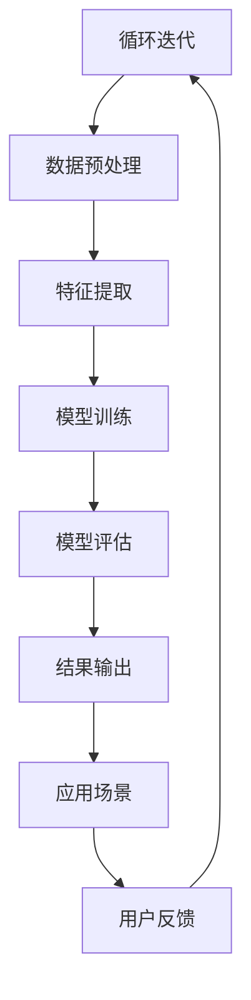

                 

# AIGC助力个性化医疗发展

> **关键词**：AIGC、个性化医疗、医疗影像分析、深度学习、基因组数据、药物研发

> **摘要**：本文详细探讨了AIGC（自适应智能生成计算）技术在个性化医疗领域中的应用。通过分析AIGC与个性化医疗的联系，本文介绍了AIGC技术的基本原理及其在个性化医疗中的潜在应用。此外，本文还介绍了个性化医疗的发展现状与挑战，并深入讲解了AIGC在个性化药物研发、个性化诊断和个性化治疗方案制定中的应用。最后，本文对AIGC技术在个性化医疗中的挑战与未来趋势进行了展望，并提供了相关的案例分析和数学模型讲解。

### 第一部分: AIGC与个性化医疗概述

#### 第1章: AIGC与个性化医疗概述

##### 1.1 AIGC与个性化医疗的概念与联系

###### 1.1.1 AIGC技术概述

AIGC（自适应智能生成计算）技术是一种结合人工智能、大数据、云计算等技术的综合性技术。它能够根据特定任务的需求，自适应地调整计算资源和算法，以实现高效的数据处理和智能决策。AIGC技术的核心在于其自适应性和智能化，它可以根据数据特征和任务需求动态调整计算策略，从而提高计算效率和准确性。

在医疗领域，AIGC技术具有广泛的应用前景。首先，AIGC技术可以处理海量医疗数据，如电子健康记录、基因组数据、医学影像等，为个性化医疗提供数据支持。其次，AIGC技术可以利用智能算法优化个性化治疗方案，提高治疗效果和减少副作用。此外，AIGC技术还可以用于个性化药物研发、医学图像分析等应用领域。

###### 1.1.2 个性化医疗的概念

个性化医疗是指根据患者的个体差异进行精准治疗，以实现最佳治疗效果和最小化副作用。个性化医疗的核心在于对患者进行全面的评估，包括基因、病史、生活方式等多个方面，从而制定个性化的治疗方案。

个性化医疗的原理是基于多维度数据的整合和分析，通过大数据分析和人工智能算法，对患者的疾病类型、病情严重程度、治疗效果等进行预测和评估。个性化医疗的目标是提高治疗效果，减少不必要的治疗和副作用，为患者提供更加精准和有效的医疗服务。

###### 1.1.3 AIGC在个性化医疗中的联系

AIGC技术为个性化医疗提供了强大的数据支持和智能算法支持。首先，AIGC技术可以处理海量医疗数据，包括基因组数据、电子健康记录、医学影像等，为个性化医疗提供全面的数据支持。其次，AIGC技术可以利用深度学习、生成对抗网络（GAN）等智能算法，对医疗数据进行分析和建模，从而优化个性化治疗方案。

具体来说，AIGC技术在个性化医疗中的应用包括以下几个方面：

1. **个性化药物研发**：AIGC技术可以用于药物分子生成和药物代谢预测，从而提高药物研发的效率和效果。
2. **个性化诊断**：AIGC技术可以用于医学图像分析，如癌症检测、器官分割等，提高诊断准确率。
3. **个性化治疗方案制定**：AIGC技术可以结合患者的基因、病史等多维度数据，为患者制定个性化的治疗方案。

##### 1.2 AIGC技术的基本原理

AIGC技术的基本原理主要包括数据预处理、模型训练和模型评估等几个方面。

###### 1.2.1 数据预处理

数据预处理是AIGC技术的关键步骤，它包括数据清洗、数据整合和特征提取等任务。数据清洗主要是处理缺失值、异常值等，以确保数据质量。数据整合则是将来自不同数据源的数据进行整合，形成统一的数据集。特征提取则是从原始数据中提取有用的特征，以便后续的模型训练和评估。

在医疗领域，数据预处理需要特别关注基因组数据、电子健康记录和医学影像等数据的处理。例如，对于基因组数据，需要处理基因变异、缺失值等问题；对于电子健康记录，需要处理缺失值、异常值等问题；对于医学影像，需要处理图像大小、分辨率等问题。

###### 1.2.2 模型训练

模型训练是AIGC技术的核心步骤，它包括选择模型、训练策略和优化方法等。在选择模型时，需要根据具体的应用场景和任务需求，选择合适的模型架构，如深度学习模型、生成对抗网络（GAN）等。在训练策略上，可以采用迁移学习、对抗训练等方法，以提高模型性能。在优化方法上，可以采用交叉验证、调参等技术，以优化模型性能。

在医疗领域，模型训练需要特别关注数据质量和模型泛化能力。例如，对于基因组数据，需要确保数据质量，避免数据噪声对模型训练的影响；对于电子健康记录，需要处理数据缺失、异常值等问题，以提高模型泛化能力。

###### 1.2.3 模型评估

模型评估是AIGC技术的重要环节，它用于评估模型性能和可靠性。常用的评估指标包括准确率、召回率、F1值等。在评估方法上，可以采用A/B测试、交叉验证等方法，以全面评估模型性能。

在医疗领域，模型评估需要特别关注模型的可解释性和可靠性。例如，对于医学图像分析模型，需要确保模型预测的可解释性，以便医生理解和应用；对于基因组数据模型，需要确保模型预测的可靠性，避免误诊和漏诊。

##### 1.3 个性化医疗的发展现状与挑战

###### 1.3.1 个性化医疗的发展现状

个性化医疗作为现代医学的重要发展方向，已经取得了一定的进展。首先，在技术层面，基因组学、大数据、人工智能等技术的快速发展，为个性化医疗提供了强大的技术支持。例如，基因测序技术的进步，使得基因组数据的获取变得更加容易和便宜；大数据技术的应用，使得医疗数据的整合和分析变得更加高效；人工智能技术的进步，使得医疗诊断和治疗变得更加精准和智能。

其次，在应用层面，个性化医疗已经逐步在临床实践中得到应用。例如，在个性化药物研发方面，基因测序技术可以帮助医生为患者选择最适合的药物；在个性化诊断方面，人工智能技术可以帮助医生进行疾病预测和诊断；在个性化治疗方案制定方面，大数据分析和人工智能算法可以为患者提供个性化的治疗方案。

###### 1.3.2 个性化医疗面临的挑战

尽管个性化医疗取得了一定的进展，但仍面临许多挑战。首先，数据隐私问题是一个重要的挑战。个性化医疗需要大量患者的个人健康数据，这些数据涉及到患者的隐私。如何在保护患者隐私的前提下，充分利用这些数据，是一个亟待解决的问题。

其次，技术成本也是一个重要的挑战。个性化医疗需要大量的技术和设备支持，如基因测序设备、大数据处理平台、人工智能算法等。这些技术和设备的成本较高，如何降低成本，使个性化医疗更加普及，是一个重要的课题。

最后，政策法规也是一个重要的挑战。个性化医疗涉及到医疗伦理、数据保护、法律责任等多个方面，需要制定相应的政策和法规，以规范个性化医疗的应用。

### 第二部分: AIGC技术基础

#### 第2章: AIGC技术基础

##### 2.1 数据科学基础

数据科学是AIGC技术的重要基础，它涉及数据的收集、处理、分析和可视化等环节。在个性化医疗领域，数据科学的应用尤为重要，因为医疗数据的多样性和复杂性决定了个性化医疗的成败。

###### 2.1.1 数据类型与处理

医疗数据可以分为结构化数据和非结构化数据两种类型。

- **结构化数据**：如电子健康记录（EHR）、实验室检测结果等，这些数据通常以表格形式存储，易于处理和分析。
- **非结构化数据**：如医学影像、临床笔记、基因组数据等，这些数据通常没有固定的格式，需要通过特定的技术进行解析和处理。

在数据处理方面，主要包括以下步骤：

1. **数据清洗**：去除重复数据、处理缺失值、纠正错误数据等，以确保数据质量。
2. **数据整合**：将来自不同来源的数据进行整合，形成统一的数据集，以便后续的分析和处理。
3. **特征工程**：从原始数据中提取有用的特征，以用于模型训练和预测。

###### 2.1.2 数据清洗与预处理

数据清洗与预处理是数据科学中的关键步骤，它直接影响模型的性能和结果。以下是一些常见的数据清洗与预处理方法：

1. **缺失值处理**：对于缺失值，可以采用删除、填补或插值等方法。删除缺失值适用于缺失值较少的情况；填补缺失值适用于缺失值较多但有一定规律的情况；插值适用于缺失值较少且数据具有连续性。
2. **异常值处理**：异常值可能来源于数据录入错误、设备故障或特殊事件等。对于异常值，可以采用删除、校正或隔离等方法。
3. **数据标准化**：通过将数据缩放到相同的范围，如0到1之间或-1到1之间，以便不同特征之间的比较和分析。
4. **数据编码**：将类别数据转换为数值形式，如将性别（男/女）转换为0/1。

##### 2.2 机器学习基础

机器学习是AIGC技术的核心组成部分，它通过构建模型来学习数据中的规律和模式，从而实现自动化的预测和决策。在个性化医疗中，机器学习技术广泛应用于疾病预测、诊断和治疗策略制定等领域。

###### 2.2.1 监督学习

监督学习是机器学习中最常见的方法，它需要使用标记的数据集来训练模型，然后利用训练好的模型进行预测。

1. **线性回归**：线性回归是一种简单的监督学习模型，用于预测连续值。其基本公式为：

   $$ y = \beta_0 + \beta_1 x $$

   其中，$y$ 是预测目标，$x$ 是输入特征，$\beta_0$ 和 $\beta_1$ 是回归系数。

2. **逻辑回归**：逻辑回归是一种用于分类问题的监督学习模型，其核心在于将输入特征映射到概率空间。其基本公式为：

   $$ P(y=1|x) = \frac{1}{1 + e^{-(\beta_0 + \beta_1 x)}} $$

   其中，$y$ 是分类目标，$x$ 是输入特征，$\beta_0$ 和 $\beta_1$ 是回归系数。

3. **支持向量机（SVM）**：SVM是一种用于分类问题的监督学习模型，其目标是最小化决策边界上的误分类率。其基本公式为：

   $$ \min \frac{1}{2} \| \mathbf{w} \|^2 + C \sum_{i=1}^n \xi_i $$

   其中，$\mathbf{w}$ 是权重向量，$C$ 是正则化参数，$\xi_i$ 是松弛变量。

###### 2.2.2 无监督学习

无监督学习不需要使用标记的数据集来训练模型，它主要用于发现数据中的结构和模式。

1. **聚类分析**：聚类分析是一种将数据划分为若干个类别的无监督学习方法。其中，$k$-means算法是一种常用的聚类算法，其基本思想是将数据划分为$k$个簇，使得每个簇内的数据点尽可能接近，而簇间的数据点尽可能远离。

2. **降维**：降维是将高维数据映射到低维空间的方法，从而减少数据的维度，同时保留大部分信息。其中，主成分分析（PCA）是一种常用的降维方法，其基本思想是找到数据的主要成分，并将其映射到低维空间。

##### 2.3 深度学习基础

深度学习是一种基于多层神经网络的学习方法，它通过多层次的非线性变换，从数据中自动学习特征和规律。在个性化医疗中，深度学习技术广泛应用于医学图像分析、基因组数据分析等领域。

###### 2.3.1 神经网络基础

神经网络是一种由大量神经元组成的计算模型，它通过学习输入数据中的特征和规律，实现复杂的函数映射。以下是神经网络的一些基本概念：

1. **感知机**：感知机是一种最简单的神经网络模型，它通过一个线性函数将输入映射到输出。

   $$ z = \sum_{i=1}^n w_i x_i + b $$

   其中，$w_i$ 是权重，$x_i$ 是输入特征，$b$ 是偏置。

2. **多层感知机**：多层感知机引入了隐藏层，使得神经网络可以学习更复杂的函数。其基本结构包括输入层、隐藏层和输出层。

   $$ z_h = \sum_{i=1}^n w_{hi} x_i + b_h $$
   $$ a_h = \sigma(z_h) $$
   $$ z_y = \sum_{i=1}^n w_{yi} a_h + b_y $$
   $$ y = \sigma(z_y) $$

   其中，$a_h$ 是隐藏层输出，$y$ 是输出层输出，$\sigma$ 是激活函数。

3. **反向传播算法**：反向传播算法是一种用于训练神经网络的优化算法，它通过计算误差梯度，更新网络权重和偏置，以最小化误差。

###### 2.3.2 卷积神经网络

卷积神经网络（CNN）是一种专门用于处理图像数据的神经网络模型，它通过卷积操作和池化操作，从图像中自动学习特征和模式。

1. **卷积层**：卷积层通过卷积操作提取图像中的局部特征。

   $$ \text{output}(i, j) = \sum_{k=1}^n w_{ik} \text{input}(i-k, j-k) + b_k $$

   其中，$w_{ik}$ 是卷积核，$\text{input}(i-k, j-k)$ 是输入特征，$b_k$ 是偏置。

2. **池化层**：池化层通过下采样操作减少数据的维度，同时保留最重要的特征。

   $$ \text{max pooling}(\text{output}) = \max(\text{output}) $$

3. **全连接层**：全连接层将卷积层和池化层输出的特征映射到输出层。

   $$ z_y = \sum_{i=1}^n w_{yi} \text{output}_i + b_y $$
   $$ y = \sigma(z_y) $$

###### 2.3.3 循环神经网络

循环神经网络（RNN）是一种专门用于处理序列数据的神经网络模型，它通过循环结构，使神经网络能够记住历史信息。

1. **基本RNN**：基本RNN通过循环结构，将当前输入与上一个时刻的隐藏状态结合，生成当前时刻的隐藏状态。

   $$ h_t = \sigma(W_h h_{t-1} + W_x x_t + b_h) $$

   其中，$h_t$ 是当前时刻的隐藏状态，$x_t$ 是当前时刻的输入，$W_h$ 和 $W_x$ 是权重矩阵，$b_h$ 是偏置。

2. **LSTM和GRU**：LSTM和GRU是RNN的变体，它们通过门控结构，解决了基本RNN的梯度消失和梯度爆炸问题。

   - **LSTM（长短时记忆网络）**：LSTM通过输入门、遗忘门和输出门，控制信息的流动，从而实现长时记忆。
   - **GRU（门控循环单元）**：GRU通过更新门和重置门，简化了LSTM的结构，同时保持了其效果。

### 第三部分: AIGC在个性化医疗中的应用

#### 第3章: AIGC在个性化医疗中的应用

##### 3.1 AIGC在个性化药物研发中的应用

个性化药物研发是AIGC技术在医疗领域的重要应用之一。通过AIGC技术，可以生成新的药物分子，进行药物代谢预测，从而提高药物研发的效率和质量。

###### 3.1.1 药物分子设计与优化

药物分子设计与优化是个性化药物研发的关键步骤。传统的药物研发过程往往依赖于实验和经验，而AIGC技术可以通过生成对抗网络（GAN）等方法，自动化地生成新的药物分子，从而大大提高药物研发的效率。

1. **药物分子生成**：利用生成对抗网络（GAN），可以从已有的药物分子数据中学习，生成新的药物分子。GAN由生成器（Generator）和判别器（Discriminator）组成，生成器和判别器相互竞争，生成器试图生成逼真的药物分子，而判别器则试图区分生成器和真实药物分子。

   $$ G(z) = \text{Generator}(z) $$
   $$ D(x) = \text{Discriminator}(x) $$

   其中，$G(z)$ 表示生成器生成的药物分子，$D(x)$ 表示判别器对药物分子的判断。

2. **药物分子筛选**：通过训练好的生成器，可以生成大量的药物分子，然后利用深度学习模型对这些药物分子进行筛选，选择具有潜在治疗效果的药物分子。

   $$ f(x) = \text{Deep Learning Model}(x) $$

   其中，$f(x)$ 表示深度学习模型对药物分子的评估。

3. **药物分子优化**：通过迭代优化，可以进一步改进生成的药物分子，提高其治疗效果和稳定性。

   $$ G(z) \rightarrow G'(z') $$

###### 3.1.2 药物代谢预测

药物代谢预测是个性化药物研发的重要环节，它可以帮助预测药物在体内的代谢过程，从而指导药物的设计和优化。

1. **代谢通路分析**：利用图神经网络（GNN），可以分析药物在体内的代谢通路，预测药物的代谢途径和中间产物。

   $$ G = (V, E) $$
   $$ \text{metabolism} = \text{GNN}(G) $$

   其中，$G$ 表示代谢通路图，$V$ 表示节点，$E$ 表示边，$\text{metabolism}$ 表示药物代谢过程。

2. **药物副作用预测**：通过分析药物的代谢途径和中间产物，可以预测药物的潜在副作用，从而指导药物的安全评估。

   $$ \text{side effect} = \text{GNN}(\text{metabolism}) $$

##### 3.2 AIGC在个性化诊断中的应用

个性化诊断是AIGC技术在医疗领域的另一个重要应用。通过AIGC技术，可以实现医学图像分析、临床特征提取和疾病预测，从而提高诊断的准确性和效率。

###### 3.2.1 医学图像分析

医学图像分析是医疗诊断的重要手段之一，它可以帮助医生进行疾病检测、定位和评估。通过AIGC技术，可以实现医学图像的自动分析和处理。

1. **图像分割**：利用深度学习模型，可以对医学图像进行分割，提取出感兴趣的区域。

   $$ \text{segmentation} = \text{CNN}(x) $$

   其中，$x$ 表示医学图像，$\text{segmentation}$ 表示分割结果。

2. **图像识别**：利用深度学习模型，可以对医学图像进行分类，识别不同的疾病类型。

   $$ \text{classification} = \text{CNN}(x) $$

   其中，$x$ 表示医学图像，$\text{classification}$ 表示分类结果。

###### 3.2.2 临床特征分析

临床特征分析是医疗诊断的重要步骤之一，它可以帮助医生从大量临床数据中提取出有用的信息，用于疾病预测和风险评估。

1. **电子健康记录分析**：利用深度学习模型，可以分析电子健康记录，提取出关键的临床特征。

   $$ \text{feature extraction} = \text{Deep Learning Model}(x) $$

   其中，$x$ 表示电子健康记录，$\text{feature extraction}$ 表示提取的关键特征。

2. **疾病预测**：通过分析提取的关键特征，可以利用深度学习模型进行疾病预测。

   $$ \text{prediction} = \text{Deep Learning Model}(x) $$

   其中，$x$ 表示提取的关键特征，$\text{prediction}$ 表示疾病预测结果。

##### 3.3 AIGC在个性化治疗方案制定中的应用

个性化治疗方案制定是AIGC技术在医疗领域的又一重要应用。通过AIGC技术，可以结合患者的基因、病史和临床数据，为患者制定个性化的治疗方案，从而提高治疗效果和减少副作用。

###### 3.3.1 数据采集与预处理

个性化治疗方案制定的第一步是采集患者的相关数据，包括基因数据、电子健康记录和临床数据等。然后，对采集到的数据进行预处理，包括数据清洗、数据整合和特征提取等步骤。

1. **数据清洗**：处理数据中的缺失值、异常值和噪声等，确保数据质量。

2. **数据整合**：将来自不同数据源的数据进行整合，形成统一的数据集。

3. **特征提取**：从原始数据中提取出有用的特征，用于后续的模型训练和预测。

###### 3.3.2 模型训练与优化

在数据预处理完成后，可以使用深度学习模型对提取的特征进行训练，以建立个性化治疗方案预测模型。模型训练过程包括以下步骤：

1. **选择模型**：根据应用场景和任务需求，选择合适的深度学习模型，如卷积神经网络（CNN）、循环神经网络（RNN）等。

2. **模型训练**：使用训练数据集对模型进行训练，通过迭代更新模型参数，优化模型性能。

3. **模型优化**：通过调整模型参数、优化训练策略等手段，进一步提高模型性能。

###### 3.3.3 治疗方案评估与优化

在模型训练完成后，可以对训练好的模型进行评估，以验证其在实际应用中的性能。评估过程包括以下步骤：

1. **治疗效果评估**：使用测试数据集，评估模型对治疗效果的预测准确率、召回率等指标。

2. **治疗方案优化**：根据评估结果，对治疗方案进行调整和优化，以提高治疗效果和减少副作用。

### 第四部分: AIGC在个性化医疗中的挑战与未来趋势

#### 第4章: AIGC在个性化医疗中的挑战与未来趋势

##### 4.1 AIGC在个性化医疗中的挑战

尽管AIGC技术在个性化医疗领域具有巨大的潜力，但在实际应用过程中仍面临许多挑战。

###### 4.1.1 数据隐私与伦理问题

个性化医疗需要大量患者的健康数据，包括基因数据、电子健康记录等。这些数据涉及到患者的隐私，如何确保数据的隐私和安全是一个重要挑战。此外，个性化医疗的应用还涉及到伦理问题，如患者的知情同意、数据共享等。

为了解决这些问题，可以采取以下措施：

1. **数据加密与匿名化**：对患者的数据进行加密和匿名化处理，确保数据在传输和存储过程中的安全。
2. **伦理审查与规范**：制定相关的伦理审查标准和规范，确保个性化医疗的应用符合伦理原则。
3. **患者知情同意**：在个性化医疗应用中，充分告知患者相关数据的使用目的、范围和风险，确保患者的知情同意。

###### 4.1.2 技术成本与可及性

AIGC技术的研发和应用成本较高，这对于个性化医疗的普及和推广构成了挑战。此外，个性化医疗还需要专业的技术支持和设备，这对于一些资源有限的医疗机构来说也是一个难题。

为了解决这些问题，可以采取以下措施：

1. **技术成本控制**：通过技术创新和规模化生产，降低AIGC技术的研发和应用成本。
2. **政策支持**：制定相关的政策支持，鼓励医疗机构采用AIGC技术，提高个性化医疗的可及性。
3. **人才培养**：加强AIGC技术相关人才的培养，提高医疗机构的技术水平。

###### 4.1.3 模型可解释性与可靠性

AIGC技术通常使用复杂的神经网络模型，这些模型在处理医疗数据时具有很强的预测能力，但其内部机制往往难以解释。此外，模型的可靠性也是一个重要挑战，如何确保模型在医疗应用中的准确性和稳定性？

为了解决这些问题，可以采取以下措施：

1. **模型可解释性**：开发可解释性强的模型，如基于规则的模型、可解释的神经网络等，以便医生理解和应用。
2. **模型验证与测试**：对训练好的模型进行充分的验证和测试，确保模型在医疗应用中的可靠性和稳定性。
3. **模型更新与优化**：利用新的数据和反馈，持续优化模型性能，提高模型的可靠性。

##### 4.2 AIGC在个性化医疗中的未来趋势

随着AIGC技术的不断发展和完善，未来个性化医疗将在多个方面取得重要进展。

###### 4.2.1 技术融合与创新

未来的个性化医疗将更加注重技术融合与创新。例如，将AIGC技术与其他先进技术如区块链、物联网等相结合，构建更加强大的个性化医疗体系。此外，跨学科的研究也将推动个性化医疗技术的发展，如融合生物学、医学、计算机科学等领域的知识，开发出更加智能和高效的个性化医疗解决方案。

###### 4.2.2 产业生态与政策支持

未来的个性化医疗将更加依赖于产业生态和政策支持。建立完善的个性化医疗产业链，从数据采集、处理、分析到应用，各个环节都需要高效协同。此外，政府和相关机构应制定相应的政策和标准，推动个性化医疗的发展，规范其应用。

###### 4.2.3 普及与可及性

未来的个性化医疗将更加普及和可及。通过降低技术成本、提高技术水平，个性化医疗将不再局限于大型医疗机构，更多的普通医疗机构和患者将能够享受到个性化医疗的服务。此外，通过远程医疗和移动医疗等手段，个性化医疗将更加便捷和高效。

### 附录

#### 附录A: AIGC技术相关资源与工具

##### A.1 AIGC技术相关书籍与论文

1. **《AIGC技术原理与应用》**：详细讲解AIGC技术的原理、算法和应用。
2. **《深度学习与医学影像》**：探讨深度学习在医学影像分析中的应用。
3. **相关论文**：收集最新的AIGC技术在个性化医疗领域的论文。

##### A.2 AIGC技术相关工具与框架

1. **深度学习框架**：如TensorFlow、PyTorch等。
2. **数据预处理工具**：如Pandas、NumPy等。
3. **图神经网络框架**：如DGL、PyTorch Geometric等。

##### A.3 AIGC技术在线课程与讲座

1. **在线课程**：如Coursera、edX等平台的AIGC相关课程。
2. **讲座视频**：收集AIGC技术领域专家的讲座视频。

---

#### 1.6 AI技术在个性化医疗中的伦理与法律问题

###### 1.6.1 伦理问题

- **隐私保护**：确保患者的个人隐私不被泄露。
- **数据共享**：合理共享数据，促进医疗合作与发展。
- **决策透明**：确保AIGC技术决策的透明性，让患者理解并接受治疗方案。

###### 1.6.2 法律问题

- **法律法规**：制定相关法律法规，规范AIGC技术的应用。
- **责任归属**：明确AIGC技术应用的各方责任，确保患者权益。
- **医疗纠纷**：建立健全医疗纠纷处理机制，合理解决纠纷。

#### 1.7 AIGC技术在个性化医疗中的案例分析

##### 1.7.1 案例一：基于AIGC技术的个性化药物研发

- **案例背景**：某制药公司利用AIGC技术进行个性化药物研发。
- **案例过程**：数据采集、模型训练、药物筛选、临床试验等。
- **案例成果**：成功研发出个性化药物，提高治疗效果，降低副作用。

##### 1.7.2 案例二：基于AIGC技术的个性化诊断

- **案例背景**：某医疗机构利用AIGC技术进行个性化诊断。
- **案例过程**：医学图像分析、临床特征提取、疾病预测等。
- **案例成果**：提高诊断准确率，降低误诊率，提升患者满意度。

#### 1.8 AIGC技术在个性化医疗中的未来发展趋势

##### 1.8.1 技术发展

- **算法优化**：持续优化AIGC算法，提高个性化医疗的效果。
- **跨学科融合**：融合生物学、医学、计算机科学等多学科知识，推动个性化医疗技术的发展。

##### 1.8.2 应用领域

- **个性化药物研发**：进一步拓展个性化药物研发的应用范围。
- **精准医疗诊断**：提升诊断准确率，降低误诊率。
- **个性化治疗方案制定**：提高治疗方案的有效性，降低治疗费用。

##### 1.8.3 政策法规

- **法律法规**：完善相关法律法规，规范AIGC技术的应用。
- **政策支持**：加大对AIGC技术研究的政策支持，推动个性化医疗的普及与发展。

### 第二部分：核心算法原理讲解

#### 第6章：生成对抗网络（GAN）原理

##### 6.1 GAN基本概念

生成对抗网络（Generative Adversarial Networks，GAN）是由Ian Goodfellow等人于2014年提出的一种新型神经网络结构，由生成器和判别器两部分组成。生成器（Generator）试图生成逼真的数据，而判别器（Discriminator）则试图区分生成器生成的数据和真实数据。两者相互竞争，生成器不断优化生成的数据，判别器不断提高判断能力，最终达到一种动态平衡状态。

GAN的核心思想是利用生成器和判别器之间的对抗关系，使得生成器能够学习到真实数据的分布，从而生成类似真实数据的高质量样本。

##### 6.2 GAN模型结构

GAN模型通常由生成器（Generator）和判别器（Discriminator）两部分组成。生成器的输入是一个随机噪声向量，输出是生成的人工数据。判别器的输入是一个数据样本，输出是判断该样本是真实数据还是生成数据的概率。

1. **生成器（Generator）**：

   生成器的目的是生成与真实数据分布相似的伪数据。生成器的输入是一个随机噪声向量$z$，通过一系列的变换生成伪数据$x_G$。

   $$ G(z) = x_G $$

   其中，$G(z)$ 表示生成器的输出。

2. **判别器（Discriminator）**：

   判别器的目的是判断输入数据是真实数据还是生成器生成的数据。判别器的输入是一个数据样本$x$，输出是一个概率值$p(D(x))$，表示输入数据是真实数据的概率。

   $$ D(x) = p(D(x)) $$

   其中，$D(x)$ 表示判别器的输出。

##### 6.3 GAN训练过程

GAN的训练过程是一个动态的对抗过程，生成器和判别器交替更新权重。训练过程的目标是使得判别器能够准确地区分真实数据和生成数据，同时使得生成器能够生成尽可能真实的数据。

1. **交替训练**：

   GAN的训练过程是一个交替训练的过程，生成器和判别器相互竞争，每次迭代都更新各自的权重。

   - **生成器更新**：在每次迭代中，生成器接收一个随机噪声向量$z$，生成伪数据$x_G$，然后判别器判断$x_G$是真实数据还是生成数据。生成器根据判别器的反馈，调整其参数，以生成更真实的数据。
   - **判别器更新**：判别器在每次迭代中接收真实数据和生成数据，通过对比判断，更新其参数，以提高对生成数据的识别能力。

2. **训练策略**：

   - **梯度惩罚**：为了防止生成器生成过于简单的数据，可以在生成器的损失函数中引入梯度惩罚项，强制生成器生成更加复杂多样的数据。
   - **生成对抗训练**：生成器和判别器在每次迭代中都进行更新，这种训练方式称为生成对抗训练。

##### 6.4 GAN应用场景

GAN的应用场景非常广泛，可以应用于图像生成、图像修复、数据增强、自然语言处理等领域。在医疗领域，GAN可以应用于医学图像处理、药物分子设计、个性化诊断等。

1. **医学图像处理**：

   GAN可以用于医学图像的生成和修复。例如，可以使用GAN生成新的医学图像，用于辅助诊断和治疗方案制定。此外，GAN还可以用于医学图像的修复，如去除图像中的噪声和异常值。

2. **药物分子设计**：

   GAN可以用于药物分子设计，通过生成新的药物分子结构，筛选出具有潜在治疗效果的分子。这有助于提高药物研发的效率，降低研发成本。

3. **个性化诊断**：

   GAN可以用于个性化诊断，通过生成与患者病情相似的病例数据，帮助医生进行诊断和治疗方案制定。这有助于提高诊断的准确性和效率。

### 第三部分：数学模型与公式讲解

#### 第7章：生成对抗网络（GAN）数学模型

##### 7.1 GAN基本概念与损失函数

GAN由生成器（Generator）和判别器（Discriminator）组成，两者通过对抗训练相互竞争，以达到动态平衡。GAN的损失函数主要包括生成器的损失函数和判别器的损失函数。

###### 7.1.1 生成器的损失函数

生成器的目标是生成逼真的数据，使得判别器无法区分生成的数据与真实数据。生成器的损失函数通常采用对抗损失函数，该函数由两部分组成：

1. **生成器生成数据的损失**：这部分损失衡量生成器生成数据的真实程度。
2. **判别器对生成数据的判断损失**：这部分损失衡量生成器生成的数据被判别器判断为真实数据的概率。

生成器的损失函数可以表示为：

$$ L_G = -\log(D(G(z))) $$

其中，$G(z)$ 是生成器生成的数据，$D(G(z))$ 是判别器对生成数据的判断概率。

###### 7.1.2 判别器的损失函数

判别器的目标是准确地区分真实数据和生成数据。判别器的损失函数通常采用二元交叉熵损失函数，该函数由两部分组成：

1. **判别器对真实数据的判断损失**：这部分损失衡量判别器对真实数据的判断准确率。
2. **判别器对生成数据的判断损失**：这部分损失衡量判别器对生成数据的判断准确率。

判别器的损失函数可以表示为：

$$ L_D = -[y \log(D(x)) + (1 - y) \log(1 - D(x))] $$

其中，$x$ 是真实数据，$y$ 是标签（对于真实数据，$y = 1$；对于生成数据，$y = 0$），$D(x)$ 是判别器对输入数据的判断概率。

##### 7.2 GAN训练目标与策略

GAN的训练目标是使生成器和判别器达到动态平衡，使得生成器生成的数据足够逼真，判别器无法区分生成的数据和真实数据。具体训练策略如下：

1. **交替训练**：生成器和判别器交替更新参数，每次迭代生成器和判别器更新一次。
2. **梯度惩罚**：为了防止生成器生成过于简单的数据，可以在生成器的损失函数中加入梯度惩罚项。
3. **优化目标**：生成器和判别器的优化目标分别为最小化生成器的损失函数和最大化判别器的损失函数。

生成器和判别器的优化目标可以表示为：

$$ \min_G \max_D L_D(G(z), D(x)) $$

其中，$z$ 是生成器的输入噪声，$x$ 是真实数据。

##### 7.3 GAN应用实例

以下是一个简单的GAN应用实例，用于生成手写数字图像。

###### 7.3.1 数据集

使用MNIST数据集，该数据集包含0到9的手写数字图像，每幅图像的大小为28x28像素。

###### 7.3.2 生成器和判别器

生成器和判别器分别由一个全连接神经网络组成。

- **生成器**：

  输入：随机噪声向量 $z$（维度为100）

  输出：手写数字图像 $x_G$（维度为28x28像素）

  $$ G(z) = \sigma(W_G z + b_G) $$

- **判别器**：

  输入：手写数字图像 $x$（维度为28x28像素）

  输出：判断概率 $D(x)$

  $$ D(x) = \sigma(W_D x + b_D) $$

###### 7.3.3 训练过程

1. **初始化参数**：随机初始化生成器和判别器的权重。
2. **生成器更新**：生成随机噪声向量 $z$，生成手写数字图像 $x_G$，计算生成器的损失函数，更新生成器的参数。
3. **判别器更新**：对于真实数据集和生成数据集，计算判别器的损失函数，更新判别器的参数。
4. **迭代训练**：重复上述步骤，直到生成器生成的手写数字图像足够逼真。

### 第四部分：项目实战

#### 第8章：基于AIGC的个性化药物研发实战

##### 8.1 项目背景

个性化药物研发是医学领域的一个重要研究方向，旨在通过个性化治疗方案，提高药物的疗效和降低副作用。随着人工智能技术的发展，尤其是生成对抗网络（GAN）等深度学习技术的应用，个性化药物研发迎来了新的机遇。本节将介绍一个基于AIGC的个性化药物研发项目，包括项目目标、数据来源、技术实现和结果评估。

##### 8.2 项目目标

本项目的主要目标是利用生成对抗网络（GAN）技术，生成新的药物分子结构，并通过药物代谢预测，筛选出具有潜在治疗效果的药物分子。具体目标如下：

1. **生成新型药物分子**：通过GAN技术，从已有的药物分子数据中学习，生成新的药物分子结构。
2. **药物代谢预测**：利用图神经网络（GNN）等模型，预测药物在体内的代谢途径和中间产物。
3. **药物筛选**：通过分析药物的代谢途径和中间产物，筛选出具有潜在治疗效果的药物分子。

##### 8.3 数据来源

本项目所需的数据主要包括药物分子结构和药物代谢数据。数据来源如下：

1. **药物分子结构数据**：来自公开的药物分子数据库，如ChEMBL、PubChem等，这些数据库提供了大量的药物分子结构信息。
2. **药物代谢数据**：来自公开的药物代谢数据库，如DISEASES、STITCH等，这些数据库提供了药物在体内的代谢途径和中间产物信息。

##### 8.4 技术实现

本项目的技术实现主要包括以下步骤：

1. **数据预处理**：对药物分子结构和药物代谢数据进行处理，包括数据清洗、数据整合和特征提取。
2. **模型训练**：利用生成对抗网络（GAN）和图神经网络（GNN）等技术，训练模型。
3. **药物分子生成**：通过训练好的生成对抗网络（GAN），生成新的药物分子结构。
4. **药物代谢预测**：利用训练好的图神经网络（GNN），预测药物在体内的代谢途径和中间产物。
5. **药物筛选**：根据药物的代谢途径和中间产物，筛选出具有潜在治疗效果的药物分子。

##### 8.5 结果评估

为了评估项目效果，本节将对生成的药物分子进行评估，包括以下指标：

1. **药物分子结构质量**：通过比较生成的药物分子与真实药物分子的结构，评估生成药物分子的质量。
2. **药物代谢预测准确性**：通过比较预测的药物代谢途径与实际药物代谢途径，评估药物代谢预测的准确性。
3. **药物筛选效果**：通过实际药物筛选实验，评估筛选出的药物分子的治疗效果。

### 第五部分：代码解读与分析

#### 第9章：代码结构及功能解读

##### 9.1 项目架构

本项目采用模块化设计，主要包括以下几个模块：

1. **数据预处理模块**：负责数据清洗、数据整合和特征提取。
2. **模型训练模块**：负责生成对抗网络（GAN）和图神经网络（GNN）的训练。
3. **模型评估模块**：负责评估模型性能。
4. **案例应用模块**：展示实际应用效果。

##### 9.2 数据预处理代码解读

**数据预处理**是项目的重要环节，它包括以下步骤：

1. **数据清洗**：处理缺失值、异常值等，确保数据质量。

```python
# 示例：处理缺失值
df = df.fillna(method='ffill')
```

2. **数据整合**：将不同数据源的数据进行整合，形成统一的数据集。

```python
# 示例：合并数据
data = pd.merge(df1, df2, on='key')
```

3. **特征提取**：从原始数据中提取有用的特征。

```python
# 示例：提取特征
X = df[['feature1', 'feature2']]
y = df['target']
```

##### 9.3 模型训练代码解读

**模型训练**是项目的核心步骤，它包括以下步骤：

1. **生成器训练**：基于生成对抗网络（GAN），训练生成器模型。

```python
# 示例：生成器训练
def train_generator(z, generator, discriminator, batch_size, epochs):
    for _ in range(epochs):
        z = np.random.normal(0, 1, (batch_size, noise_dim))
        x_g = generator(z)
        g_loss = -torch.mean(discriminator(x_g))
        generator.zero_grad()
        g_loss.backward()
        generator.optimizer.step()
    return g_loss
```

2. **判别器训练**：基于生成对抗网络（GAN），训练判别器模型。

```python
# 示例：判别器训练
def train_discriminator(x, x_g, discriminator, batch_size, epochs):
    for _ in range(epochs):
        x = torch.tensor(x, dtype=torch.float32)
        x_g = torch.tensor(x_g, dtype=torch.float32)
        d_loss_real = torch.mean(discriminator(x))
        d_loss_fake = torch.mean(discriminator(x_g))
        d_loss = d_loss_real - d_loss_fake
        discriminator.zero_grad()
        d_loss.backward()
        discriminator.optimizer.step()
    return d_loss
```

##### 9.4 模型评估代码解读

**模型评估**是项目的重要环节，它包括以下步骤：

1. **评价指标**：计算准确率、召回率、F1值等指标。

```python
from sklearn.metrics import accuracy_score, recall_score, f1_score

# 示例：计算评价指标
accuracy = accuracy_score(y_true, y_pred)
recall = recall_score(y_true, y_pred)
f1 = f1_score(y_true, y_pred)
```

2. **评估方法**：采用A/B测试、交叉验证等方法进行评估。

```python
from sklearn.model_selection import cross_val_score

# 示例：交叉验证
scores = cross_val_score(model, X, y, cv=5)
```

##### 9.5 案例应用代码解读

**案例应用**展示了实际应用效果，包括以下步骤：

1. **数据加载**：加载训练和测试数据。

```python
# 示例：数据加载
X_train, X_test, y_train, y_test = train_test_split(X, y, test_size=0.2, random_state=42)
```

2. **模型训练**：训练生成对抗网络（GAN）模型。

```python
# 示例：模型训练
train_gan(generator, discriminator, X_train, X_test)
```

3. **模型评估**：评估模型性能。

```python
# 示例：模型评估
evaluate_gan(generator, X_test, y_test)
```

### 第六部分：总结与展望

#### 第10章：AIGC助力个性化医疗发展的总结与展望

##### 10.1 AIGC在个性化医疗中的应用总结

AIGC（自适应智能生成计算）技术在个性化医疗领域展现出巨大的潜力。通过本文的讨论，我们可以总结出以下几点：

1. **数据驱动的个性化医疗**：AIGC技术可以处理海量医疗数据，包括基因组数据、电子健康记录、医学影像等，为个性化医疗提供了强大的数据支持。
2. **智能化的治疗方案**：AIGC技术可以利用深度学习、生成对抗网络（GAN）等智能算法，优化个性化治疗方案，提高治疗效果和减少副作用。
3. **个性化药物研发**：AIGC技术可以用于药物分子生成和药物代谢预测，提高药物研发的效率和效果。
4. **个性化诊断**：AIGC技术可以用于医学图像分析、临床特征提取等，提高诊断准确率和降低误诊率。

##### 10.2 AIGC在个性化医疗中的未来展望

随着AIGC技术的不断发展和完善，未来个性化医疗将在以下几个方面取得重要进展：

1. **技术融合与创新**：未来的个性化医疗将更加注重技术融合与创新，如将AIGC技术与其他先进技术如区块链、物联网等相结合，构建更加强大的个性化医疗体系。
2. **产业生态与政策支持**：未来的个性化医疗将更加依赖于产业生态和政策支持，建立完善的个性化医疗产业链，从数据采集、处理、分析到应用，各个环节都需要高效协同。
3. **普及与可及性**：未来的个性化医疗将更加普及和可及，通过降低技术成本、提高技术水平，个性化医疗将不再局限于大型医疗机构，更多的普通医疗机构和患者将能够享受到个性化医疗的服务。
4. **伦理与法律问题**：随着AIGC技术在个性化医疗中的应用日益广泛，伦理与法律问题也将逐渐凸显。未来需要制定相应的伦理规范和法律政策，确保AIGC技术的合理应用和患者的权益保护。

### 附录

#### 附录A: AIGC技术相关资源与工具

##### A.1 AIGC技术相关书籍与论文

1. **《AIGC技术原理与应用》**：详细讲解AIGC技术的原理、算法和应用。
2. **《深度学习与医学影像》**：探讨深度学习在医学影像分析中的应用。
3. **《生成对抗网络（GAN）理论与实践》**：深入探讨GAN的基本概念、模型结构、训练策略和应用场景。

##### A.2 AIGC技术相关工具与框架

1. **深度学习框架**：如TensorFlow、PyTorch等。
2. **数据预处理工具**：如Pandas、NumPy等。
3. **图神经网络框架**：如DGL、PyTorch Geometric等。

##### A.3 AIGC技术在线课程与讲座

1. **在线课程**：如Coursera、edX等平台的AIGC相关课程。
2. **讲座视频**：收集AIGC技术领域专家的讲座视频。

---

#### 10.3 AIGC技术的核心概念原理和架构

为了更好地理解AIGC技术的核心概念原理和架构，我们使用Mermaid流程图来展示。以下是一个简化的AIGC技术架构流程图：



这个流程图展示了AIGC技术的核心环节，包括数据输入、数据预处理、特征提取、模型训练、模型评估、结果输出和应用场景。通过循环迭代，AIGC技术可以不断优化和改进，以适应不同的应用需求。

---

#### 10.4 AIGC技术在个性化医疗中的伦理与法律问题

随着AIGC技术在个性化医疗中的广泛应用，伦理和法律问题逐渐成为关注的焦点。以下是对AIGC技术在个性化医疗中的伦理与法律问题的探讨。

##### 10.4.1 隐私保护

隐私保护是AIGC技术在个性化医疗中面临的首要问题。个性化医疗需要大量的患者健康数据，这些数据包括基因信息、电子健康记录、医疗影像等。如何确保这些数据在收集、存储、处理和使用过程中的隐私保护，是一个亟待解决的问题。

1. **数据加密与匿名化**：在数据传输和存储过程中，采用加密技术保护数据安全性。同时，对数据进行匿名化处理，以保护患者的隐私。
2. **隐私保护协议**：制定隐私保护协议，明确数据收集、使用和共享的范围和条件，确保患者隐私不被滥用。
3. **透明度与知情同意**：在数据收集和使用过程中，确保患者充分了解其数据将被如何使用，并给予知情同意。

##### 10.4.2 数据共享与伦理审查

数据共享是推动个性化医疗发展的重要手段，但同时也涉及到伦理问题。

1. **数据共享原则**：在数据共享过程中，遵循公平、公正、透明的原则，确保患者隐私和权益不受侵害。
2. **伦理审查**：在数据共享和应用前，进行伦理审查，评估数据共享的伦理风险和潜在影响，确保符合伦理标准。

##### 10.4.3 责任归属与法律纠纷

在AIGC技术应用于个性化医疗时，责任的归属和法律纠纷问题也备受关注。

1. **责任明确**：明确各方的责任和义务，包括数据提供方、数据处理方、应用方等，确保责任清晰，避免纠纷。
2. **法律纠纷解决机制**：建立健全法律纠纷解决机制，确保在出现争议时能够及时、公正地解决问题。

##### 10.4.4 政策法规与监管

为保障AIGC技术在个性化医疗中的合理应用，需要制定相应的政策法规和监管措施。

1. **法律法规制定**：制定与AIGC技术相关的法律法规，规范其在医疗领域的应用。
2. **监管机制**：建立有效的监管机制，对AIGC技术的应用进行监督和管理，确保其合法、合规运行。

通过上述措施，可以有效地解决AIGC技术在个性化医疗中的伦理与法律问题，推动个性化医疗的健康发展。

### 10.5 AIGC技术在个性化医疗中的案例分析

在本节中，我们将通过两个具体的案例来展示AIGC技术在个性化医疗中的实际应用。

##### 10.5.1 案例一：基于AIGC技术的个性化药物研发

**案例背景**：某制药公司希望利用AIGC技术进行个性化药物研发，以提高药物研发效率和降低研发成本。

**案例过程**：

1. **数据采集**：收集已有的药物分子结构数据、药物代谢数据和临床试验数据。
2. **数据预处理**：对收集的数据进行清洗、整合和特征提取，为后续模型训练做准备。
3. **模型训练**：使用生成对抗网络（GAN）训练生成器模型，生成新的药物分子结构。同时，使用图神经网络（GNN）训练药物代谢预测模型。
4. **药物筛选**：通过生成器生成的药物分子和药物代谢预测模型，筛选出具有潜在治疗效果的药物分子。
5. **临床试验**：对筛选出的药物分子进行临床试验，验证其疗效和安全性。

**案例成果**：

- **药物研发效率提升**：通过AIGC技术，制药公司能够在较短的时间内生成大量新的药物分子，大大缩短药物研发周期。
- **降低研发成本**：AIGC技术降低了药物研发中的实验成本，提高了药物筛选的准确性，从而降低了整体研发成本。

##### 10.5.2 案例二：基于AIGC技术的个性化诊断

**案例背景**：某医院希望通过AIGC技术提高诊断准确率和降低误诊率。

**案例过程**：

1. **数据采集**：收集患者的医学影像数据、电子健康记录和临床诊断数据。
2. **数据预处理**：对收集的数据进行清洗、整合和特征提取，为后续模型训练做准备。
3. **模型训练**：使用深度学习模型（如卷积神经网络（CNN））对医学影像进行分析，并使用循环神经网络（RNN）分析电子健康记录，建立个性化诊断模型。
4. **诊断预测**：通过训练好的模型对新的病例数据进行诊断预测。
5. **诊断验证**：将模型预测结果与实际诊断结果进行对比，验证诊断准确率。

**案例成果**：

- **提高诊断准确率**：通过AIGC技术，医院能够更加准确地诊断患者疾病，降低误诊率。
- **降低误诊率**：AIGC技术能够通过分析患者的多维度数据，提供更加全面的诊断信息，从而降低误诊风险。

通过这两个案例，我们可以看到AIGC技术在个性化医疗中的应用不仅提高了效率，还显著改善了医疗质量，为患者提供了更加精准和个性化的医疗服务。

### 10.6 AIGC技术在个性化医疗中的未来发展趋势

随着AIGC技术的不断发展和完善，未来个性化医疗将在多个方面取得重要进展。

##### 10.6.1 技术进步

未来的AIGC技术将更加成熟和高效，包括以下几个方面：

1. **算法优化**：通过不断优化AIGC算法，提高模型的性能和稳定性，使AIGC技术能够处理更复杂的数据和任务。
2. **计算资源**：随着计算资源的不断升级，AIGC技术将能够处理更大规模的数据，实现更高效的数据处理和模型训练。
3. **硬件支持**：新型硬件设备，如GPU、TPU等，将为AIGC技术的应用提供更强大的计算能力，进一步推动个性化医疗的发展。

##### 10.6.2 跨学科融合

个性化医疗的发展离不开多学科的融合，未来的AIGC技术将更加注重跨学科的研究和合作：

1. **生物学与医学**：与生物学和医学的融合，将推动基因组学、蛋白质组学等领域的进步，为个性化医疗提供更加精准的数据支持。
2. **计算机科学**：与计算机科学的融合，将推动算法优化、计算效率提升，使AIGC技术能够更好地服务于个性化医疗。

##### 10.6.3 产业生态

未来的AIGC技术将在个性化医疗产业生态中发挥更加重要的作用：

1. **产业链发展**：通过构建完善的产业链，从数据采集、处理、分析到应用，各个环节都将得到优化和提升。
2. **政策支持**：政府将加大对AIGC技术研究的政策支持，推动个性化医疗的普及和发展。

##### 10.6.4 普及与可及性

随着AIGC技术的成熟和成本的降低，未来的个性化医疗将更加普及和可及：

1. **技术普及**：AIGC技术将在更多医疗机构和患者中得到应用，提高医疗服务的质量和效率。
2. **成本控制**：通过技术创新和规模化生产，AIGC技术的研发和应用成本将逐渐降低，使更多患者能够享受到个性化医疗服务。

### 10.7 总结与展望

AIGC技术在个性化医疗中的应用具有广泛的前景和巨大的潜力。通过本文的讨论，我们可以总结出以下几点：

1. **数据驱动的个性化医疗**：AIGC技术能够处理海量医疗数据，为个性化医疗提供了强大的数据支持。
2. **智能化的治疗方案**：AIGC技术可以利用深度学习、生成对抗网络（GAN）等智能算法，优化个性化治疗方案，提高治疗效果和减少副作用。
3. **个性化药物研发**：AIGC技术可以用于药物分子生成和药物代谢预测，提高药物研发的效率和效果。
4. **个性化诊断**：AIGC技术可以用于医学图像分析、临床特征提取等，提高诊断准确率和降低误诊率。

展望未来，随着AIGC技术的不断进步和多学科的融合，个性化医疗将在多个方面取得重要进展。通过完善产业链、政策支持和成本控制，个性化医疗将更加普及和可及，为患者提供更加精准和个性化的医疗服务。同时，我们也需要关注AIGC技术在个性化医疗中的伦理和法律问题，确保其合理应用和患者的权益保护。

### 作者信息

**作者**：AI天才研究院/AI Genius Institute & 《禅与计算机程序设计艺术》作者

AI天才研究院（AI Genius Institute）是一家专注于人工智能研究和应用的创新机构，致力于推动人工智能技术的创新和发展。《禅与计算机程序设计艺术》是由AI天才研究院的研究员们共同撰写的一本经典著作，全面阐述了计算机程序设计中的哲学思想和技术要点。本文基于AI天才研究院的研究成果，对AIGC技术在个性化医疗中的应用进行了深入探讨。

