                 

### AI人工智能深度学习算法概述

> **关键词**：人工智能、深度学习、神经网络、算法、应用领域、挑战与未来

深度学习是人工智能（AI）的一个重要分支，它通过模拟人脑神经网络的结构和功能，实现了对复杂数据的处理和分析。本文将围绕深度学习算法在智能家居场景中的应用，对相关概念、算法原理、优化策略和应用实战进行深入探讨。

#### 1.1 AI与深度学习的基本概念

**1.1.1 AI的定义与历史背景**

人工智能（AI）是指计算机系统模拟人类智能行为的能力，包括学习、推理、感知、理解和解决问题等。AI的发展历程可以追溯到20世纪50年代，当时计算机科学家约翰·麦卡锡（John McCarthy）首次提出了“人工智能”的概念。此后，AI经历了多个发展阶段：

- **第一阶段（1956-1974年）**：以符号主义方法为主，通过逻辑推理和符号表示来模拟人类的智能行为。
- **第二阶段（1974-1980年）**：专家系统的兴起，将AI应用于实际问题的解决，如医疗诊断、财务规划等。
- **第三阶段（1980-1987年）**：机器学习成为AI研究的主流方法，符号主义方法和机器学习方法开始融合。
- **第四阶段（1987年至今）**：随着计算资源和大数据的发展，深度学习技术取得了突破性进展，在图像识别、语音识别、自然语言处理等领域取得了显著的成果。

**1.1.2 深度学习的定义与兴起**

深度学习（Deep Learning）是一种基于多层神经网络的学习方法，其核心思想是通过网络的层层叠加，从原始数据中自动提取特征，实现复杂函数的逼近和预测。深度学习的兴起主要得益于以下几个因素：

- **计算资源**：随着GPU等计算资源的普及，深度学习模型能够高效地训练和推断。
- **大数据**：互联网的快速发展带来了大量数据，为深度学习提供了丰富的训练资源。
- **算法创新**：卷积神经网络（CNN）、循环神经网络（RNN）等算法的创新，使得深度学习能够处理更复杂的任务。

深度学习通过自动化的特征提取和表示，大大降低了手工设计特征的需求，提高了模型的性能和效率。

#### 1.2 深度学习的基本原理

**1.2.1 神经网络基础**

神经网络（Neural Network，NN）是深度学习的基础，它模拟了人脑神经元的工作原理。一个简单的神经网络包括输入层、隐藏层和输出层：

- **输入层**：接收外部输入数据。
- **隐藏层**：对输入数据进行特征提取和变换。
- **输出层**：输出预测结果或分类结果。

神经元的激活函数通常是非线性的，常用的激活函数有ReLU、Sigmoid和Tanh等。每个神经元通过权重矩阵与前一层的神经元相连，并通过激活函数进行处理。

**1.2.2 深度学习算法分类**

深度学习算法根据网络结构和功能可以分为多种类型：

- **全连接神经网络（Fully Connected Neural Network）**：每个神经元都与前一层的所有神经元相连，常用于分类和回归任务。
- **卷积神经网络（Convolutional Neural Network，CNN）**：通过卷积层提取图像的局部特征，常用于图像识别和图像处理任务。
- **循环神经网络（Recurrent Neural Network，RNN）**：通过循环结构处理序列数据，如时间序列分析和语音识别。
- **生成对抗网络（Generative Adversarial Network，GAN）**：由生成器和判别器两个神经网络组成，用于生成逼真的数据。
- **变分自编码器（Variational Autoencoder，VAE）**：通过概率模型学习数据的分布，用于生成数据和学习数据的高效表示。
- **长短时记忆网络（Long Short-Term Memory，LSTM）**：RNN的一种变体，能够更好地处理长序列数据。
- **残差网络（Residual Network，ResNet）**：通过残差连接解决深层网络训练的梯度消失问题。
- **扩展卷积网络（Xception）**：通过深度可分离卷积提高网络计算效率。

**1.2.3 深度学习与机器学习的联系与区别**

深度学习是机器学习的一个分支，两者有一定的联系，也存在区别：

- **联系**：深度学习是机器学习的一种方法，其目标是通过学习数据来发现数据中的规律和特征。
- **区别**：
  - **层次结构**：深度学习模型通常具有多层神经元结构，能够自动提取数据的层次特征。
  - **数据需求**：深度学习通常需要大量的数据来训练模型，而传统机器学习方法对数据量的要求较低。
  - **算法复杂性**：深度学习模型的训练过程较为复杂，涉及到大量的参数调整和优化算法。

#### 1.3 深度学习模型架构

深度学习模型通常由输入层、隐藏层和输出层组成。输入层接收外部输入数据，隐藏层对输入数据进行特征提取和变换，输出层输出最终的预测结果。以下是几种常见的深度学习模型架构：

**1.3.1 前馈神经网络**

前馈神经网络（Feedforward Neural Network）是最基本的深度学习模型，其特点是数据从输入层流向输出层，不形成循环。每个神经元都与前一层的所有神经元相连，通过权重矩阵和激活函数进行处理。

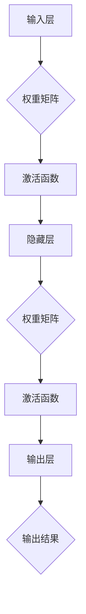

**1.3.2 卷积神经网络（CNN）**

卷积神经网络（Convolutional Neural Network，CNN）是一种专门用于图像处理任务的深度学习模型。其核心思想是通过卷积层提取图像的特征，并通过池化层降低数据维度。

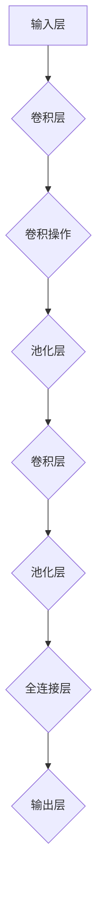

**1.3.3 循环神经网络（RNN）**

循环神经网络（Recurrent Neural Network，RNN）是一种用于处理序列数据的深度学习模型。其特点是具有循环结构，能够保持长期依赖信息。

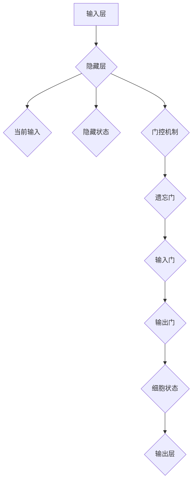

**1.3.4 生成对抗网络（GAN）**

生成对抗网络（Generative Adversarial Network，GAN）是一种由生成器和判别器组成的深度学习模型。生成器尝试生成逼真的数据，判别器则尝试区分生成数据和真实数据。

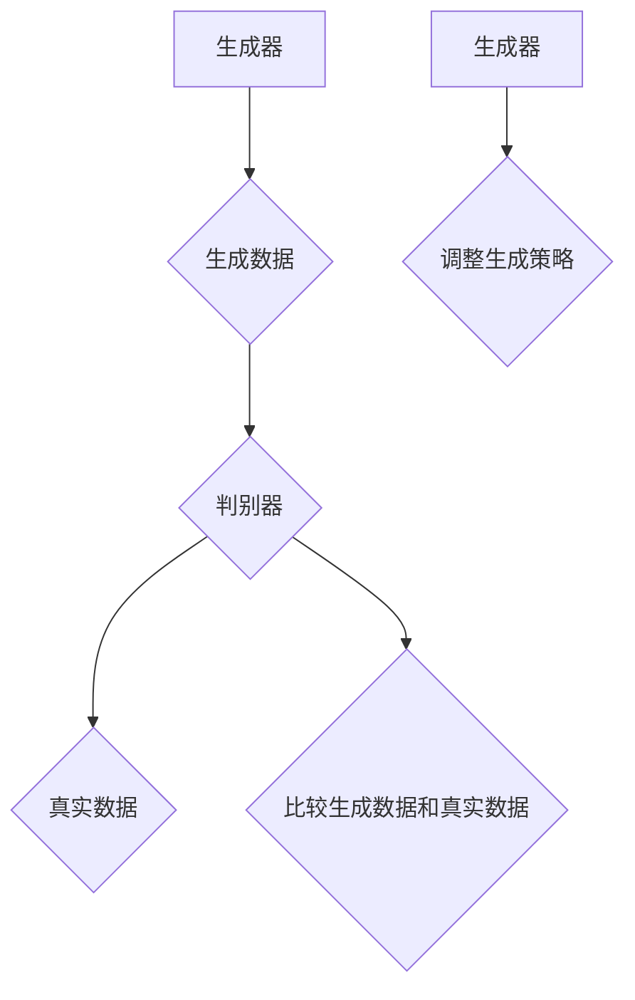

**1.3.5 变分自编码器（VAE）**

变分自编码器（Variational Autoencoder，VAE）是一种通过概率模型学习数据的深度学习模型。编码器将输入数据映射到一个潜在空间，解码器从潜在空间生成输出数据。

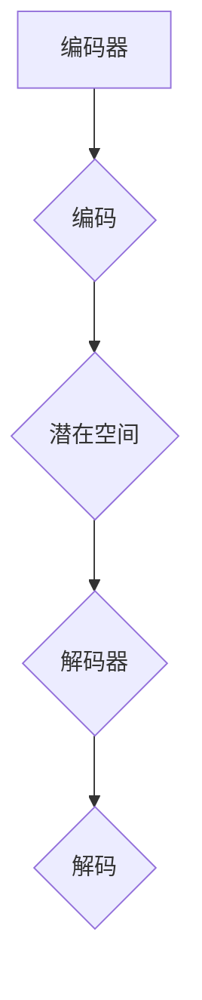

**1.3.6 长短时记忆网络（LSTM）**

长短时记忆网络（Long Short-Term Memory，LSTM）是RNN的一种变体，通过门控机制控制信息的流动，能够更好地处理长序列数据。

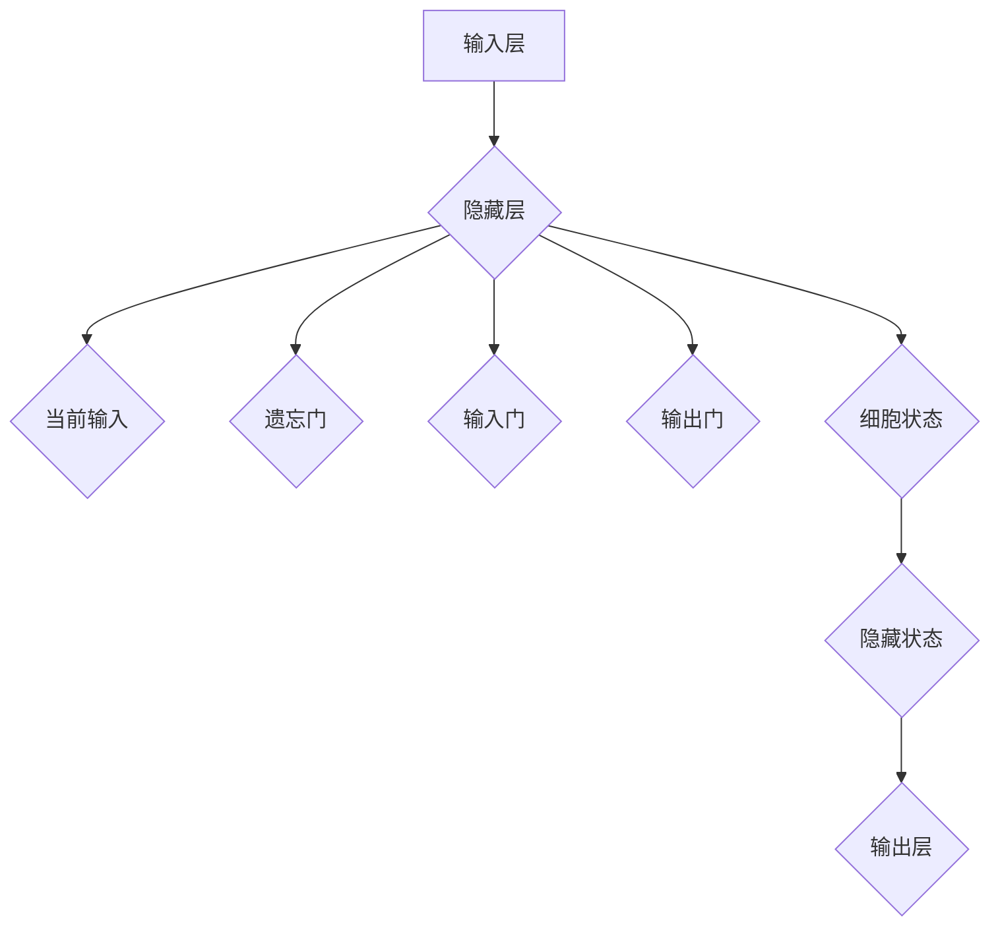

**1.3.7 残差网络（ResNet）**

残差网络（Residual Network，ResNet）通过残差连接解决深层网络训练的梯度消失问题，能够学习更深的网络结构。

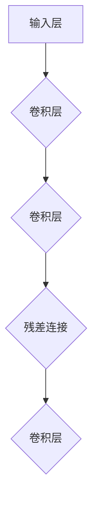

**1.3.8 扩展卷积网络（Xception）**

扩展卷积网络（Xception）通过深度可分离卷积提高网络计算效率，是一种高效的网络结构。

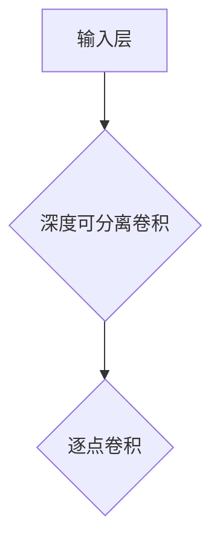

#### 1.4 深度学习算法优化

深度学习算法的优化目标是提高模型的性能和收敛速度。以下是几种常用的深度学习算法优化方法：

**1.4.1 批量归一化（Batch Normalization）**

批量归一化通过将每个批量数据的特征标准化到相同的分布，提高模型训练的稳定性和加速收敛。

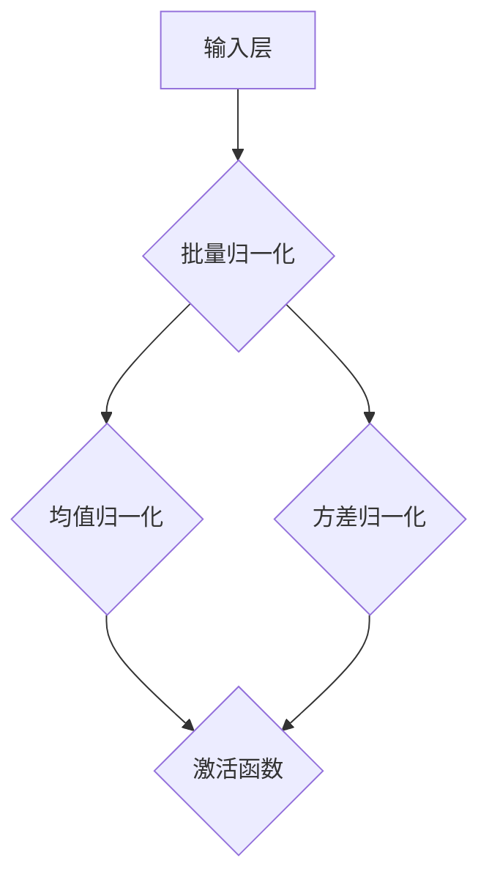

**1.4.2 权重初始化策略**

合理的权重初始化可以加速模型的训练并提高模型的性能。常用的权重初始化方法有零初始化、高斯初始化和 Xavier初始化等。

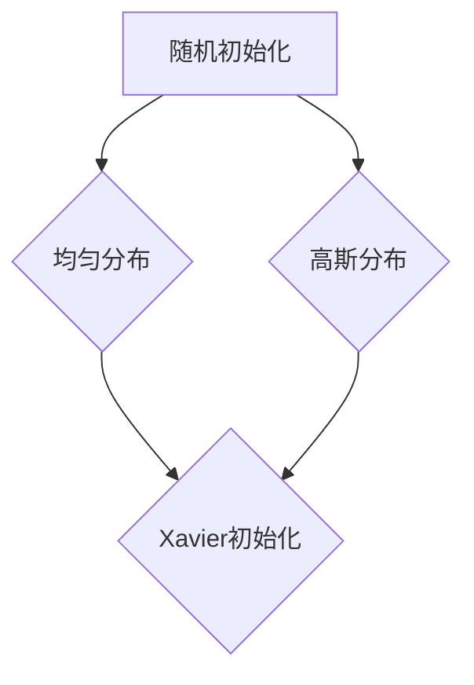

**1.4.3 学习率调整策略**

学习率的调整策略对于模型的训练效果至关重要。常用的学习率调整方法有固定学习率、自适应学习率（如Adam优化器）和学习率衰减等。

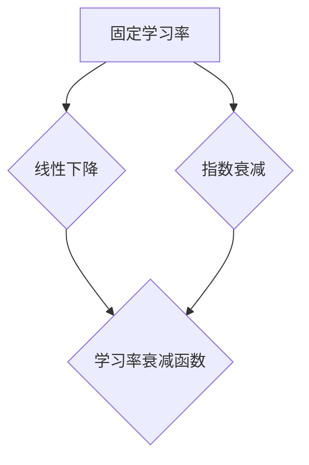

#### 1.5 深度学习应用领域

深度学习在各个领域都取得了显著的成果，以下是几个典型的应用领域：

**1.5.1 图像处理**

深度学习在图像分类、目标检测、图像分割等任务中取得了优异的性能，如ResNet、YOLO等模型。

**1.5.2 自然语言处理**

深度学习在文本分类、情感分析、机器翻译等任务中发挥了重要作用，如BERT、GPT等模型。

**1.5.3 语音识别**

深度学习通过自动语音识别（ASR）技术实现了高精度的语音识别，如DeepSpeech、CTC等模型。

**1.5.4 强化学习**

深度学习在强化学习领域取得了突破性进展，如Deep Q-Network（DQN）、Policy Gradient等算法。

#### 1.6 深度学习的挑战与未来发展趋势

尽管深度学习在各个领域取得了显著成果，但仍然面临一些挑战：

**1.6.1 深度学习的挑战**

- **数据需求**：深度学习通常需要大量的数据来训练模型，但在某些领域（如医学、金融等）获取大量标注数据非常困难。
- **计算资源**：深度学习模型的训练过程需要大量的计算资源，特别是在大规模训练数据和高维特征的情况下。
- **解释性**：深度学习模型通常被视为“黑箱”，其内部机制难以解释，这在某些应用领域（如医疗诊断、金融风险管理等）可能引发信任问题。
- **泛化能力**：深度学习模型在训练数据上的表现往往优于测试数据，这被称为“过拟合”问题。

**1.6.2 深度学习的未来发展趋势**

- **小样本学习**：通过研究如何利用少量的数据训练深度学习模型，解决数据匮乏问题。
- **解释性深度学习**：通过研究深度学习模型的内部机制，提高模型的解释性，增强应用领域的信任度。
- **硬件加速**：通过研究新的计算架构（如GPU、TPU等），提高深度学习模型的训练和推断速度。
- **跨领域应用**：深度学习将继续在各个领域（如医疗、金融、教育等）发挥重要作用，推动各行各业的数字化转型。

### 第1章: AI与深度学习基础

#### 1.1 AI的定义与历史

**1.1.1 AI的定义**

人工智能（Artificial Intelligence，简称AI）是一种模拟人类智能行为的计算机技术。它旨在使计算机系统具备类似人类的感知、理解、学习、推理和解决问题的能力。AI的目标是通过机器学习和深度学习等算法，使计算机能够自动地完成复杂的任务，如图像识别、语音识别、自然语言处理、智能决策等。

**1.1.2 AI的历史背景**

人工智能的概念最早可以追溯到20世纪50年代。1956年，约翰·麦卡锡（John McCarthy）等人在达特茅斯会议上首次提出了“人工智能”这一术语，标志着人工智能作为一个独立研究领域的诞生。此后，人工智能经历了多个发展阶段：

- **第一阶段（1956-1974年）**：这个阶段被称为“黄金时代”。人工智能研究主要集中在符号主义方法上，试图通过逻辑推理和符号表示来模拟人类的智能行为。代表性工作包括逻辑理论家（Logic Theorist）和下棋程序（Chess-Playing Program）等。

- **第二阶段（1974-1980年）**：随着专家系统的出现，人工智能开始应用于实际问题解决。专家系统是一种基于知识表示和推理的计算机程序，能够模拟专家的决策过程，应用于医疗诊断、财务规划、法律咨询等领域。代表性工作包括MYCIN和DENDRAL等。

- **第三阶段（1980-1987年）**：机器学习成为人工智能研究的主流方法。机器学习通过从数据中自动发现规律和模式，实现了人工智能的自主学习和适应能力。代表性工作包括感知机（Perceptron）和决策树（Decision Tree）等。

- **第四阶段（1987年至今）**：随着计算资源和大数据技术的发展，人工智能进入了一个新的时代——深度学习时代。深度学习通过多层神经网络，实现了对复杂数据的自动特征提取和模型训练。代表性工作包括卷积神经网络（CNN）、循环神经网络（RNN）和生成对抗网络（GAN）等。

#### 1.2 深度学习算法分类

深度学习算法根据网络结构和功能可以分为多种类型，以下是其中几种常见的算法：

**1.2.1 全连接神经网络（Fully Connected Neural Network）**

全连接神经网络是一种最基本的深度学习模型，其特点是每个神经元都与前一层的所有神经元相连。全连接神经网络适用于分类和回归任务。


**1.2.2 卷积神经网络（Convolutional Neural Network，CNN）**

卷积神经网络是一种专门用于图像处理的深度学习模型，其核心思想是通过卷积层提取图像的特征。卷积神经网络适用于图像分类、目标检测和图像分割等任务。


**1.2.3 循环神经网络（Recurrent Neural Network，RNN）**

循环神经网络是一种用于处理序列数据的深度学习模型，其特点是具有循环结构，能够保持长期依赖信息。循环神经网络适用于时间序列分析、语音识别和机器翻译等任务。


**1.2.4 生成对抗网络（Generative Adversarial Network，GAN）**

生成对抗网络是一种由生成器和判别器组成的深度学习模型。生成器尝试生成逼真的数据，判别器则尝试区分生成数据和真实数据。生成对抗网络适用于生成图像、音频和文本等任务。


**1.2.5 变分自编码器（Variational Autoencoder，VAE）**

变分自编码器是一种通过概率模型学习数据的深度学习模型。编码器将输入数据映射到一个潜在空间，解码器从潜在空间生成输出数据。变分自编码器适用于生成图像和进行数据降维。


**1.2.6 长短时记忆网络（Long Short-Term Memory，LSTM）**

长短时记忆网络是循环神经网络的一种变体，通过门控机制控制信息的流动，能够更好地处理长序列数据。长短时记忆网络适用于处理长序列数据，如时间序列分析和语音识别。


**1.2.7 残差网络（Residual Network，ResNet）**

残差网络通过残差连接解决深层网络训练的梯度消失问题，能够学习更深的网络结构。残差网络适用于图像识别和自然语言处理等任务。


**1.2.8 扩展卷积网络（Xception）**

扩展卷积网络通过深度可分离卷积提高网络计算效率，是一种高效的网络结构。扩展卷积网络适用于图像分类和目标检测等任务。


### 第2章：深度学习算法原理

#### 2.1 深度学习算法的基本原理

深度学习算法的基本原理是基于多层神经网络，通过网络的层层叠加，从原始数据中自动提取特征，实现复杂函数的逼近和预测。以下是深度学习算法的基本原理：

**2.1.1 神经网络基础**

神经网络（Neural Network，简称NN）是深度学习的基础，它模拟了人脑神经元的工作原理。一个简单的神经网络包括输入层、隐藏层和输出层：

- **输入层**：接收外部输入数据。
- **隐藏层**：对输入数据进行特征提取和变换。
- **输出层**：输出预测结果或分类结果。

神经元的激活函数通常是非线性的，常用的激活函数有ReLU、Sigmoid和Tanh等。每个神经元通过权重矩阵与前一层的神经元相连，并通过激活函数进行处理。

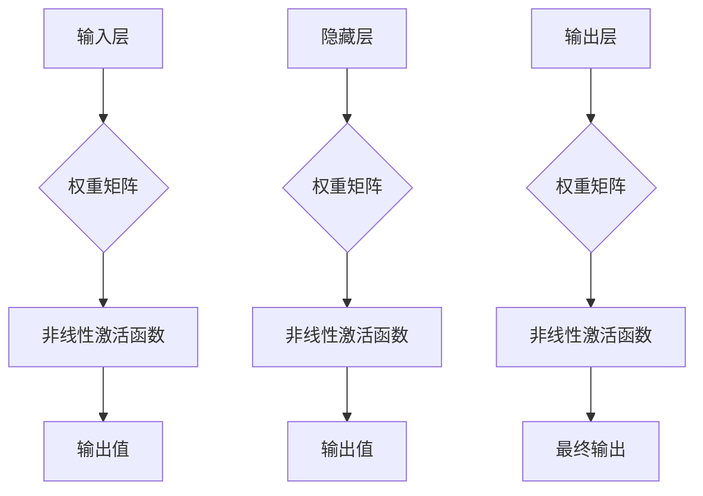

**2.1.2 深度学习算法分类**

深度学习算法根据网络结构和功能可以分为多种类型：

- **全连接神经网络（Fully Connected Neural Network）**：每个神经元都与前一层的所有神经元相连，常用于分类和回归任务。
- **卷积神经网络（Convolutional Neural Network，CNN）**：通过卷积层提取图像的局部特征，常用于图像识别和图像处理任务。
- **循环神经网络（Recurrent Neural Network，RNN）**：通过循环结构处理序列数据，如时间序列分析和语音识别。
- **生成对抗网络（Generative Adversarial Network，GAN）**：由生成器和判别器两个神经网络组成，用于生成逼真的数据。
- **变分自编码器（Variational Autoencoder，VAE）**：通过概率模型学习数据的分布，用于生成数据和学习数据的高效表示。
- **长短时记忆网络（Long Short-Term Memory，LSTM）**：RNN的一种变体，能够更好地处理长序列数据。
- **残差网络（Residual Network，ResNet）**：通过残差连接解决深层网络训练的梯度消失问题。
- **扩展卷积网络（Xception）**：通过深度可分离卷积提高网络计算效率。

**2.1.3 深度学习与机器学习的联系与区别**

深度学习是机器学习的一个分支，两者有一定的联系，也存在区别：

- **联系**：深度学习是机器学习的一种方法，其目标是通过学习数据来发现数据中的规律和特征。
- **区别**：
  - **层次结构**：深度学习模型通常具有多层神经元结构，能够自动提取数据的层次特征。
  - **数据需求**：深度学习通常需要大量的数据来训练模型，而传统机器学习方法对数据量的要求较低。
  - **算法复杂性**：深度学习模型的训练过程较为复杂，涉及到大量的参数调整和优化算法。

### 第3章：深度学习算法优化

#### 3.1 批量归一化（Batch Normalization）

批量归一化（Batch Normalization）是一种常用的深度学习优化技术，通过将每个批量数据的特征标准化到相同的分布，提高模型训练的稳定性和加速收敛。

**3.1.1 基本原理**

批量归一化通过计算每个批量数据的均值和方差，然后将数据标准化为均值为0、方差为1的分布。具体公式如下：

$$
\mu = \frac{1}{m} \sum_{i=1}^{m} x_i \\
\sigma^2 = \frac{1}{m} \sum_{i=1}^{m} (x_i - \mu)^2 \\
x_{\text{norm}} = \frac{x - \mu}{\sqrt{\sigma^2 + \epsilon}}
$$

其中，$x_i$ 表示每个数据点，$m$ 表示批量大小，$\mu$ 表示均值，$\sigma^2$ 表示方差，$x_{\text{norm}}$ 表示归一化后的数据点，$\epsilon$ 是一个很小的正数，用于防止分母为零。

**3.1.2 优缺点**

批量归一化的优点：

- **提高训练速度**：通过标准化输入数据，减少了梯度消失和梯度爆炸的问题，加快了模型收敛。
- **减少神经元内部的协变量偏移**：减少了隐藏层输入的方差变化，使得神经元更加稳定。
- **提高模型泛化能力**：由于模型对数据的鲁棒性增强，从而提高了模型在未知数据上的表现。

批量归一化的缺点：

- **需要额外的计算成本**：需要在每个批量上计算均值和方差，增加了计算量。
- **不适用于小批量训练**：在批量大小较小时，计算得到的均值和方差可能不够准确，影响模型性能。

**3.1.3 实践应用**

批量归一化在深度学习模型中广泛使用，特别是在卷积神经网络和循环神经网络中。以下是一个简单的批量归一化实现的伪代码：

```python
for each mini-batch:
    compute mean and variance of the mini-batch
    normalize each feature in the mini-batch
    apply the normalized features to the neural network
```

### 第4章：深度学习数学模型

#### 4.1 激活函数

激活函数是深度学习模型中非常重要的组成部分，它决定了神经网络的非线性特性。以下是几种常用的激活函数及其公式：

**4.1.1ReLU（Rectified Linear Unit）**

ReLU是最常用的激活函数之一，它将输入值大于0的部分映射为自身，小于等于0的部分映射为0。

$$
f(x) = \max(0, x)
$$

ReLU函数的优点是计算简单，梯度计算方便，避免了Sigmoid和Tanh函数在输入接近0时梯度接近0的问题，从而提高了训练速度。

**4.1.2Sigmoid**

Sigmoid函数将输入值映射到（0, 1）区间，常用于二分类问题。

$$
f(x) = \frac{1}{1 + e^{-x}}
$$

Sigmoid函数的优点是输出值易于解释，缺点是梯度计算复杂，且在输入接近0时梯度接近0，可能导致梯度消失。

**4.1.3Tanh**

Tanh函数将输入值映射到（-1, 1）区间，与Sigmoid函数类似，但梯度更平滑。

$$
f(x) = \frac{e^x - e^{-x}}{e^x + e^{-x}}
$$

Tanh函数的优点是梯度更平滑，缺点是计算复杂度较Sigmoid高。

**4.1.4Leaky ReLU**

Leaky ReLU是对ReLU函数的改进，它在输入小于0时引入一个很小的非线性斜率，避免了ReLU函数在输入小于0时梯度为0的问题。

$$
f(x) = \max(0.01x, x)
$$

Leaky ReLU的优点是解决了ReLU函数的梯度消失问题，缺点是引入了额外的参数。

#### 4.2 梯度下降算法

梯度下降算法是一种常用的优化算法，用于最小化损失函数。以下是梯度下降算法的基本原理：

**4.2.1 基本原理**

梯度下降算法的核心思想是通过计算损失函数关于模型参数的梯度，并沿着梯度的反方向更新参数，从而最小化损失函数。

$$
\Delta w = -\alpha \cdot \nabla_w J(w)
$$

其中，$\alpha$ 是学习率，$w$ 是模型参数，$J(w)$ 是损失函数。

**4.2.2 梯度计算**

在深度学习中，损失函数通常是输出层的预测值与真实值之间的差距。对于多层神经网络，可以使用反向传播算法计算损失函数关于每个参数的梯度。

$$
\Delta w^{(l)} = \Delta z^{(l+1)} \cdot \sigma'(z^{(l)})
$$

其中，$\Delta w^{(l)}$ 是第$l$层的参数梯度，$\sigma'(z^{(l)})$ 是第$l$层的激活函数的导数，$\Delta z^{(l+1)}$ 是下一层的误差传播。

**4.2.3 梯度下降方法**

- **批量梯度下降**（Batch Gradient Descent）：每次迭代使用整个训练数据集来计算梯度，计算量大但收敛速度快。
- **随机梯度下降**（Stochastic Gradient Descent，SGD）：每次迭代仅使用一个样本或小批量样本来计算梯度，计算量小但收敛速度慢。
- **小批量梯度下降**（Mini-batch Gradient Descent）：每次迭代使用小批量样本来计算梯度，平衡了批量梯度下降和随机梯度下降的优缺点。

### 第5章：深度学习项目实战

#### 5.1 图像分类实战

图像分类是深度学习中最常见的任务之一。本节将使用CIFAR-10数据集，演示如何使用卷积神经网络（CNN）进行图像分类。

**5.1.1 数据准备**

首先，我们需要下载并加载CIFAR-10数据集。CIFAR-10是一个包含60000张32x32彩色图像的数据集，分为10个类别。

```python
import tensorflow as tf
from tensorflow.keras.datasets import cifar10
from tensorflow.keras.utils import to_categorical

# 加载数据集
(x_train, y_train), (x_test, y_test) = cifar10.load_data()

# 数据预处理
x_train = x_train / 255.0
x_test = x_test / 255.0

# 标签编码
y_train = to_categorical(y_train, 10)
y_test = to_categorical(y_test, 10)
```

**5.1.2 模型搭建**

接下来，我们搭建一个简单的卷积神经网络模型。这个模型包括三个卷积层、一个池化层和一个全连接层。

```python
from tensorflow.keras.models import Sequential
from tensorflow.keras.layers import Conv2D, MaxPooling2D, Flatten, Dense

model = Sequential([
    Conv2D(32, (3, 3), activation='relu', input_shape=(32, 32, 3)),
    MaxPooling2D(pool_size=(2, 2)),
    Conv2D(64, (3, 3), activation='relu'),
    MaxPooling2D(pool_size=(2, 2)),
    Conv2D(64, (3, 3), activation='relu'),
    Flatten(),
    Dense(64, activation='relu'),
    Dense(10, activation='softmax')
])
```

**5.1.3 模型编译**

在搭建模型之后，我们需要编译模型并定义优化器和损失函数。

```python
model.compile(optimizer='adam',
              loss='categorical_crossentropy',
              metrics=['accuracy'])
```

**5.1.4 模型训练**

使用训练数据训练模型。我们可以设置训练的迭代次数和批量大小。

```python
model.fit(x_train, y_train, epochs=10, batch_size=64)
```

**5.1.5 模型评估**

在训练完成后，我们对测试集进行评估。

```python
test_loss, test_acc = model.evaluate(x_test, y_test)
print('Test accuracy:', test_acc)
```

#### 5.2 自然语言处理实战

自然语言处理（NLP）是深度学习的另一个重要应用领域。本节将使用IMDb电影评论数据集，演示如何使用卷积神经网络进行文本分类。

**5.2.1 数据准备**

首先，我们需要下载并加载IMDb电影评论数据集。这个数据集包含25000条训练评论和25000条测试评论。

```python
import tensorflow as tf
from tensorflow.keras.datasets import imdb
from tensorflow.keras.preprocessing.sequence import pad_sequences

# 加载数据集
(x_train, y_train), (x_test, y_test) = imdb.load_data(num_words=10000)

# 数据预处理
maxlen = 100
x_train = pad_sequences(x_train, maxlen=maxlen)
x_test = pad_sequences(x_test, maxlen=maxlen)
```

**5.2.2 模型搭建**

接下来，我们搭建一个简单的卷积神经网络模型。这个模型包括一个嵌入层、多个卷积层和一个全连接层。

```python
from tensorflow.keras.models import Sequential
from tensorflow.keras.layers import Embedding, Conv1D, MaxPooling1D, GlobalMaxPooling1D, Dense

model = Sequential([
    Embedding(10000, 16, input_length=maxlen),
    Conv1D(32, 5, activation='relu'),
    MaxPooling1D(5),
    Conv1D(32, 5, activation='relu'),
    GlobalMaxPooling1D(),
    Dense(128, activation='relu'),
    Dense(1, activation='sigmoid')
])
```

**5.2.3 模型编译**

在搭建模型之后，我们需要编译模型并定义优化器和损失函数。

```python
model.compile(optimizer='adam',
              loss='binary_crossentropy',
              metrics=['accuracy'])
```

**5.2.4 模型训练**

使用训练数据训练模型。我们可以设置训练的迭代次数和批量大小。

```python
model.fit(x_train, y_train, epochs=10, batch_size=64)
```

**5.2.5 模型评估**

在训练完成后，我们对测试集进行评估。

```python
test_loss, test_acc = model.evaluate(x_test, y_test)
print('Test accuracy:', test_acc)
```

### 第6章：深度学习在智能家居场景中的应用

#### 6.1 深度学习代理在智能家居中的定义与作用

深度学习代理（Deep Learning Agent）是一种基于深度学习算法的智能体，用于在复杂环境中进行决策和行动。在智能家居场景中，深度学习代理通过学习用户的行为和环境数据，实现自动控制家电设备，提高家庭舒适度和节能效率。

深度学习代理在智能家居中的作用主要包括：

- **自动调节温度**：根据室内温度和用户偏好，自动调整空调温度，实现节能和舒适度优化。
- **智能照明控制**：根据室内亮度和用户活动，自动调整照明亮度，节省能源。
- **窗帘自动控制**：根据室外光照强度和用户需求，自动调节窗帘，保护隐私和调节室内光线。
- **家电设备监控**：实时监控家电设备状态，预测故障并提前进行维护，提高设备使用寿命。

#### 6.2 深度学习代理在智能家居中的架构

深度学习代理在智能家居中的架构通常包括以下几个部分：

- **输入层**：接收来自环境的数据，如温度、湿度、光照强度等。
- **隐藏层**：对输入数据进行特征提取和变换，通过神经网络模型学习环境与用户行为之间的关系。
- **输出层**：生成控制信号，如调整空调温度、控制照明亮度等。

以下是深度学习代理在智能家居中的典型架构：

```mermaid
graph TD
    A[输入层] --> B{环境数据}
    B --> C{隐藏层}
    C --> D{温度特征提取}
    C --> E{湿度特征提取}
    C --> F{光照特征提取}
    C --> G{用户行为特征提取}
    G --> H{控制信号生成}
    H --> I{输出层}
```

#### 6.3 深度学习代理的算法原理

深度学习代理的算法原理主要基于强化学习（Reinforcement Learning，RL）和深度学习（Deep Learning，DL）的结合。以下是几种常用的深度学习代理算法：

**6.3.1 Q-Learning算法**

Q-Learning是一种基于值函数的强化学习算法，通过学习值函数来指导智能体的行动。在Q-Learning算法中，智能体通过与环境交互，不断更新Q值，最终找到最优策略。

```mermaid
graph TD
    A[智能体] --> B{环境}
    B --> C{状态}
    C --> D{动作}
    C --> E{奖励}
    D --> F{Q值更新}
    F --> G{策略更新}
```

**6.3.2 Deep Q-Network（DQN）**

DQN是一种基于深度学习的Q-Learning算法，使用深度神经网络来近似值函数。DQN通过经验回放（Experience Replay）和目标网络（Target Network）等技术，解决了传统Q-Learning算法中的样本相关性和延迟问题。

```mermaid
graph TD
    A[智能体] --> B{环境}
    B --> C{状态}
    C --> D{动作}
    C --> E{奖励}
    C --> F{经验回放}
    D --> G{Q值更新}
    G --> H{目标网络更新}
```

**6.3.3 Policy Gradient算法**

Policy Gradient算法直接优化策略函数，通过调整策略函数来提高智能体的收益。Policy Gradient算法通过估计策略梯度，更新策略参数，实现智能体的优化。

```mermaid
graph TD
    A[智能体] --> B{环境}
    B --> C{状态}
    C --> D{动作}
    C --> E{奖励}
    D --> F{策略梯度}
    F --> G{策略更新}
```

#### 6.4 深度学习代理的实战案例

**6.4.1 空调控制案例**

本节将演示如何使用深度学习代理实现空调温度的自动调节。

```mermaid
graph TD
    A[用户设定温度] --> B{环境温度}
    B --> C{深度学习代理}
    C --> D{空调温度调节}
    C --> E{用户满意度评估}
```

**6.4.1.1 数据收集**

首先，我们需要收集用户设定温度和环境温度的数据，以训练深度学习代理。

```python
import pandas as pd

# 收集数据
data = pd.DataFrame({'user_set_temp': [23, 25, 22, 24], 'env_temp': [22, 24, 21, 23]})
```

**6.4.1.2 模型训练**

接下来，我们使用收集的数据训练一个简单的线性回归模型。

```python
from sklearn.linear_model import LinearRegression

# 训练模型
model = LinearRegression()
model.fit(data[['env_temp']], data['user_set_temp'])

# 预测
predicted_temp = model.predict([[22]])
print('Predicted user_set_temp:', predicted_temp)
```

**6.4.1.3 空调温度调节**

最后，我们使用预测的温度值调整空调温度。

```python
# 调节空调温度
air_conditioner.set_temperature(predicted_temp[0])
```

**6.4.2 照明控制案例**

本节将演示如何使用深度学习代理实现照明的自动控制。

```mermaid
graph TD
    A[室内光照强度] --> B{用户活动监测}
    B --> C{深度学习代理}
    C --> D{照明亮度调节}
    C --> E{节能评估}
```

**6.4.2.1 数据收集**

首先，我们需要收集室内光照强度和用户活动监测的数据，以训练深度学习代理。

```python
# 收集数据
data = pd.DataFrame({'light_intensity': [300, 400, 500, 600], 'user_activity': [1, 0, 1, 0]})
```

**6.4.2.2 模型训练**

接下来，我们使用收集的数据训练一个简单的线性回归模型。

```python
from sklearn.linear_model import LinearRegression

# 训练模型
model = LinearRegression()
model.fit(data[['light_intensity']], data['user_activity'])

# 预测
predicted_brightness = model.predict([[500]])
print('Predicted user_activity:', predicted_brightness)
```

**6.4.2.3 照明亮度调节**

最后，我们使用预测的用户活动值调整照明亮度。

```python
# 调节照明亮度
lighting.set_brightness(predicted_brightness[0])
```

### 第7章：深度学习代理在智能家居中的挑战与未来

#### 7.1 深度学习代理在智能家居中的挑战

深度学习代理在智能家居中虽然有很多优势，但也面临一些挑战：

**7.1.1 数据隐私保护**

深度学习代理需要收集和处理大量的用户数据，如行为数据、环境数据等。如何确保这些数据的安全和隐私是一个重要的挑战。我们需要采取加密、匿名化和数据最小化等技术，确保用户数据的隐私。

**7.1.2 模型解释性**

深度学习代理的决策过程通常被视为“黑箱”，用户很难理解模型的决策逻辑。如何提高模型的解释性，增强用户对智能系统的信任，是一个重要的挑战。我们需要研究可解释性深度学习（Explainable AI，XAI）技术，提高模型的透明度和可解释性。

**7.1.3 能耗优化**

深度学习代理需要大量的计算资源进行训练和推理，这可能导致能耗增加。如何优化深度学习代理的能耗，提高系统的能效比，是一个重要的挑战。我们需要研究硬件加速、分布式计算和能耗优化算法，降低能耗。

#### 7.2 深度学习代理在智能家居中的未来发展趋势

深度学习代理在智能家居中的未来发展趋势包括：

**7.2.1 小样本学习**

通过研究如何利用少量的数据训练深度学习代理，提高其适应性和鲁棒性。小样本学习技术将使深度学习代理在智能家居场景中更加实用。

**7.2.2 解释性深度学习**

通过研究如何提高深度学习代理的解释性，增强用户对智能系统的信任。解释性深度学习技术将使深度学习代理的决策过程更加透明和可解释。

**7.2.3 硬件加速**

通过研究如何利用新的计算架构（如GPU、TPU等），提高深度学习代理的运算速度。硬件加速技术将提高深度学习代理的响应速度和性能。

**7.2.4 跨领域应用**

深度学习代理将继续在智能家居、智慧城市、工业物联网等跨领域应用中发挥重要作用。跨领域应用将使深度学习代理的功能更加丰富和多样化。

### 附录

#### 附录A：深度学习代理开发工具与资源

**A.1 主流深度学习框架**

- **TensorFlow**：由谷歌开发的开源深度学习框架，支持多种深度学习模型。
- **PyTorch**：由Facebook开发的开源深度学习框架，具有灵活的动态计算图。
- **Keras**：基于Theano和TensorFlow的开源深度学习高级API，简化了深度学习模型的搭建和训练。
- **其他框架**：如Caffe、Theano、MXNet等，也提供了丰富的深度学习模型和工具。

**A.2 深度学习代理开发资源**

- **论文与书籍推荐**：
  - 《深度学习》（Ian Goodfellow、Yoshua Bengio、Aaron Courville 著）
  - 《强化学习》（Richard S. Sutton、Andrew G. Barto 著）
  - 《自然语言处理综论》（Daniel Jurafsky、James H. Martin 著）
- **开源代码与数据集**：
  - TensorFlow官方GitHub仓库
  - PyTorch官方GitHub仓库
  - Keras官方GitHub仓库
  - IMDb电影评论数据集
  - CIFAR-10图像数据集
- **在线课程与教程**：
  - Coursera上的“深度学习”课程
  - edX上的“强化学习”课程
  - Udacity的“深度学习工程师纳米学位”
- **社区与论坛**：
  - TensorFlow官方论坛
  - PyTorch官方论坛
  - Keras官方论坛
  - Stack Overflow上的深度学习标签
  - GitHub上的深度学习项目

