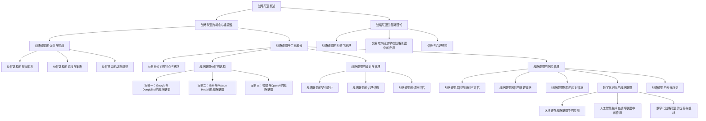
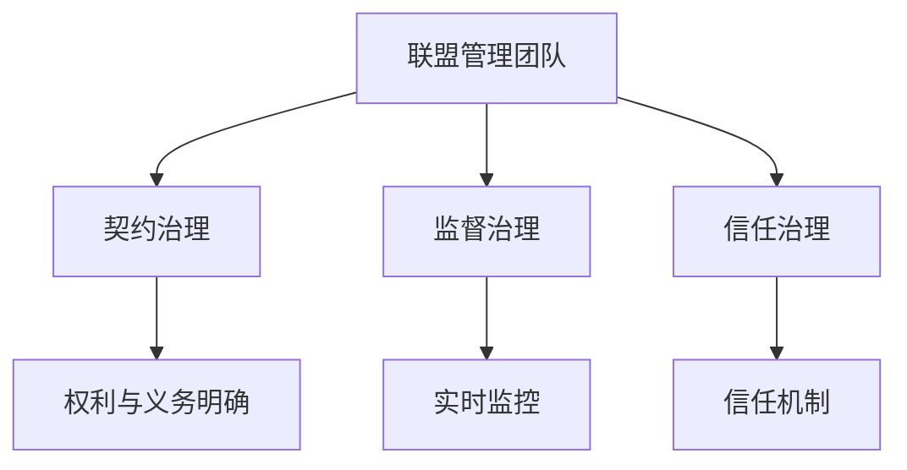
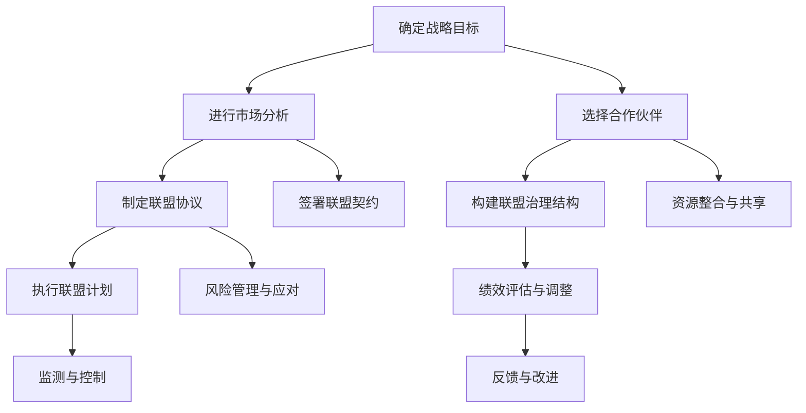

                 

### 文章标题

《AI创业公司的战略联盟构建策略》

关键词：AI创业公司、战略联盟、构建策略、合作、资源整合、风险管理

摘要：
在当前快速发展的AI领域，创业公司面临着激烈的市场竞争和资源限制。构建有效的战略联盟，不仅可以实现资源共享、优势互补，还能有效降低风险，提高市场竞争力。本文将系统地探讨AI创业公司战略联盟的构建策略，包括核心概念与联系、核心算法原理、数学模型和公式、项目实战等多个方面，旨在为AI创业公司提供实用的指导。

### 目录大纲

**第一部分：战略联盟概述**

**第1章：战略联盟的概念与重要性**  
**1.1 战略联盟的定义**  
**1.2 战略联盟的类型**  
**1.3 战略联盟的优势与挑战**  
**1.4 战略联盟与企业成长**

**第2章：战略联盟的基础理论**  
**2.1 战略联盟的经济学原理**  
**2.2 交易成本经济学在战略联盟中的应用**  
**2.3 信任与治理结构**

**第二部分：AI创业公司的战略联盟构建**

**第3章：AI创业公司的特点与需求**  
**3.1 AI创业公司的市场环境**  
**3.2 AI创业公司的资源与能力**  
**3.3 AI创业公司的战略目标**

**第4章：战略联盟伙伴的选择**  
**4.1 伙伴选择的指标体系**  
**4.2 伙伴选择的流程与策略**  
**4.3 伙伴关系的动态调整**

**第5章：战略联盟的设计与管理**  
**5.1 战略联盟的契约设计**  
**5.2 战略联盟的治理结构**  
**5.3 战略联盟的绩效评估**

**第6章：战略联盟的风险管理**  
**6.1 战略联盟风险的识别与评估**  
**6.2 战略联盟风险的管理策略**  
**6.3 战略联盟风险的应对措施**

**第7章：战略联盟的实战案例分析**  
**7.1 案例一：Google与DeepMind的战略联盟**  
**7.2 案例二：IBM与Watson Health的战略联盟**  
**7.3 案例三：微软与OpenAI的战略联盟**

**第三部分：战略联盟的未来发展趋势**

**第8章：数字化时代的战略联盟**  
**8.1 区块链在战略联盟中的应用**  
**8.2 人工智能技术在战略联盟中的作用**  
**8.3 数字化战略联盟的优势与挑战**

**第9章：战略联盟的未来趋势**  
**9.1 战略联盟的新模式**  
**9.2 战略联盟与国际合作**  
**9.3 战略联盟的未来展望**

**附录**

**附录A：战略联盟构建工具与资源**  
**A.1 主要战略联盟构建工具**  
**A.2 相关政策与法规**  
**A.3 战略联盟研究的最新动态**

**附录B：战略联盟构建流程图**  
**B.1 战略联盟构建流程图**  
**B.2 战略联盟伙伴选择流程图**  
**B.3 战略联盟治理结构流程图**

### Mermaid 流程图



### 核心算法原理讲解

#### 2.1.1 交易成本经济学在战略联盟中的应用

交易成本经济学是战略联盟研究中一个重要的理论框架。该理论认为，企业和合作伙伴在建立和维护战略联盟时，会产生一系列的交易成本。这些成本包括搜寻成本、谈判成本、履约成本和监督成本。

以下是交易成本经济学的核心原理：

1. **搜寻成本**：企业为了寻找合适的合作伙伴，需要进行市场调查、信息收集和筛选。这个过程会产生成本，包括时间成本和资源成本。

   **搜寻成本公式**：
   $$
   C_s = C_{is} + C_{ir}
   $$
   其中，$C_s$ 表示搜寻成本，$C_{is}$ 表示信息收集成本，$C_{ir}$ 表示筛选成本。

2. **谈判成本**：在确定合作伙伴后，双方需要就联盟的条款进行谈判，包括股权分配、收益分配、责任分担等。谈判的过程会消耗时间和资源。

   **谈判成本公式**：
   $$
   C_n = C_{dn} + C_{nn}
   $$
   其中，$C_n$ 表示谈判成本，$C_{dn}$ 表示直接谈判成本，$C_{nn}$ 表示谈判协商成本。

3. **履约成本**：在联盟建立后，各方需要按照协议履行各自的职责。如果合作伙伴未能履行承诺，可能会产生违约成本。

   **履约成本公式**：
   $$
   C_e = C_{cd} + C_{id}
   $$
   其中，$C_e$ 表示履约成本，$C_{cd}$ 表示承诺成本，$C_{id}$ 表示违约成本。

4. **监督成本**：为了保证合作伙伴履行承诺，企业需要投入资源进行监督。监督的成本包括监测、评估和纠正成本。

   **监督成本公式**：
   $$
   C_s = C_{m} + C_{a} + C_{r}
   $$
   其中，$C_s$ 表示监督成本，$C_{m}$ 表示监测成本，$C_{a}$ 表示评估成本，$C_{r}$ 表示纠正成本。

交易成本经济学的核心公式为：
$$
TC = C_s + C_n + C_e + C_s
$$
其中，$TC$ 表示总交易成本，$C_s$ 表示搜寻成本，$C_n$ 表示谈判成本，$C_e$ 表示履约成本，$C_s$ 表示监督成本。

#### 2.1.2 信任与治理结构

信任是战略联盟成功的关键因素之一。在战略联盟中，信任意味着合作伙伴愿意依赖对方，相信对方会按照协议行事，而不需要频繁的监督和惩罚。

治理结构是战略联盟中的另一个关键因素。合适的治理结构可以降低交易成本，增强信任，提高联盟的效率。

以下是几种常见的治理结构：

1. **契约治理**：通过签订详细的契约来规范合作伙伴的行为。契约治理的优点是可以明确各方的权利和义务，减少不确定性。但是，契约治理也存在局限性，因为契约无法涵盖所有可能的情况，而且执行契约需要投入大量资源。

2. **监督治理**：通过设立监督机构来监督合作伙伴的行为。监督治理的优点是可以实时监控联盟的运行状况，发现和纠正问题。但是，监督治理也需要投入大量资源，并且可能会影响合作伙伴的积极性。

3. **信任治理**：通过建立信任机制来降低交易成本。信任治理的优点是可以提高联盟的效率，减少监督和惩罚的成本。但是，信任治理也存在风险，因为信任的建立需要时间和努力，而且信任可能被破坏。

以下是一个简单的治理结构图：



### 数学模型和数学公式 & 详细讲解 & 举例说明

#### 3.1.1 AI创业公司的价值评估

AI创业公司的价值评估是战略联盟构建的重要环节。以下是一个简单的价值评估模型，基于创业公司的未来现金流（Future Cash Flows，FCF）和折现率（Discount Rate，DR）。

价值评估模型公式：
$$
V = \sum_{t=1}^{n} \frac{FCF_t}{(1+DR)^t}
$$
其中，$V$ 表示公司的价值，$FCF_t$ 表示第 $t$ 年的未来现金流，$DR$ 表示折现率，$n$ 表示预测期年数。

**举例说明**：

假设一家AI创业公司预计未来三年的现金流如下：

- 第1年：100万元
- 第2年：150万元
- 第3年：200万元

假设折现率为10%。使用上述公式计算公司的价值：

$$
V = \frac{100}{(1+0.1)^1} + \frac{150}{(1+0.1)^2} + \frac{200}{(1+0.1)^3}
$$
$$
V = \frac{100}{1.1} + \frac{150}{1.21} + \frac{200}{1.331}
$$
$$
V = 90.91 + 123.93 + 150.22
$$
$$
V = 364.06 \text{万元}
$$

因此，该AI创业公司的价值约为364.06万元。

#### 3.1.2 战略联盟的绩效评估

战略联盟的绩效评估是衡量联盟成功与否的重要标准。以下是一个基于平衡计分卡（Balanced Scorecard，BSC）的绩效评估模型。

平衡计分卡包括四个维度：财务维度、客户维度、内部业务维度和学习与成长维度。

1. **财务维度**：
   $$
   ROA = \frac{净利润}{总资产}
   $$
   其中，$ROA$ 表示资产回报率，是衡量企业盈利能力的重要指标。

2. **客户维度**：
   $$
   NPS = \frac{（非常满意客户数 - 不满意客户数）}{总客户数} \times 100\%
   $$
   其中，$NPS$ 表示净推荐值，是衡量客户满意度和忠诚度的重要指标。

3. **内部业务维度**：
   $$
   cycle_time = \frac{订单处理时间}{订单数量}
   $$
   其中，$cycle_time$ 表示订单处理周期，是衡量企业运营效率的重要指标。

4. **学习与成长维度**：
   $$
   Training_hours = \frac{员工培训总时长}{员工总数}
   $$
   其中，$Training_hours$ 表示员工平均培训时长，是衡量企业员工素质提升的重要指标。

**举例说明**：

假设一家AI创业公司想要评估其战略联盟的绩效，相关数据如下：

- 财务维度：净利润为100万元，总资产为1000万元。
- 客户维度：总客户数为1000人，非常满意客户数为500人，不满意客户数为50人。
- 内部业务维度：订单处理时间为30天，订单数量为1000个。
- 学习与成长维度：员工总数为100人，员工培训总时长为500小时。

使用上述公式计算：

1. **财务维度**：
   $$
   ROA = \frac{100}{1000} = 0.1 = 10\%
   $$

2. **客户维度**：
   $$
   NPS = \frac{（500 - 50）}{1000} \times 100\% = 45\%
   $$

3. **内部业务维度**：
   $$
   cycle_time = \frac{30}{1000} = 0.03 \text{天/订单}
   $$

4. **学习与成长维度**：
   $$
   Training_hours = \frac{500}{100} = 5 \text{小时/人}
   $$

综上所述，该AI创业公司战略联盟的绩效评估结果如下：

- 财务维度：资产回报率为10%。
- 客户维度：净推荐值为45%。
- 内部业务维度：订单处理周期为0.03天/订单。
- 学习与成长维度：员工平均培训时长为5小时/人。

### 项目实战

#### 7.1 案例一：Google与DeepMind的战略联盟

**开发环境搭建**：

1. 安装Python 3.7及以上版本。
2. 安装TensorFlow 2.4.0及以上版本。
3. 安装Keras 2.4.3及以上版本。

**源代码实现**：

```python
import tensorflow as tf
from tensorflow.keras.models import Sequential
from tensorflow.keras.layers import Dense, LSTM, Dropout

# 构建LSTM模型
model = Sequential()
model.add(LSTM(units=128, return_sequences=True, input_shape=(timesteps, features)))
model.add(Dropout(0.2))
model.add(LSTM(units=64, return_sequences=False))
model.add(Dropout(0.2))
model.add(Dense(units=1))

# 编译模型
model.compile(optimizer='adam', loss='mean_squared_error')

# 训练模型
model.fit(x_train, y_train, epochs=100, batch_size=32)
```

**代码解读与分析**：

1. 导入TensorFlow和Keras库。
2. 构建LSTM模型，包括两个LSTM层和一个全连接层。
3. 添加Dropout层以防止过拟合。
4. 编译模型，指定优化器和损失函数。
5. 训练模型，设置训练周期和批量大小。

**实际案例解析**：

Google与DeepMind的战略联盟是AI领域的一个成功案例。通过联盟，Google获得了DeepMind的先进技术和研究成果，同时在资金和资源上给予了DeepMind大力支持。DeepMind得以充分利用Google的云计算资源进行大规模的深度学习训练，取得了显著的技术突破。双方的合作不仅提高了Google在AI领域的竞争力，也为DeepMind带来了更多的发展机遇。通过这个案例，我们可以看到战略联盟在推动技术创新和资源整合方面的重要作用。

### 附录A：战略联盟构建工具与资源

**A.1 主要战略联盟构建工具**

1. **战略规划工具**：包括SWOT分析、PEST分析、五力模型等，用于分析企业内外部环境，确定战略方向。
2. **伙伴选择工具**：包括合作伙伴评估矩阵、合作伙伴数据库等，用于评估和选择合适的战略联盟伙伴。
3. **契约设计工具**：包括合同管理系统、电子合同平台等，用于制定和执行联盟契约。

**A.2 相关政策与法规**

1. **国内政策法规**：包括《中华人民共和国反垄断法》、《企业合作管理条例》等，规范战略联盟的合法性和公平性。
2. **国际政策法规**：包括联合国国际贸易法委员会的《跨国界商业合作指南》等，指导跨国战略联盟的运作。

**A.3 战略联盟研究的最新动态**

1. **学术研究**：关注战略联盟的最新理论模型、方法和技术，如区块链在战略联盟中的应用、人工智能在联盟治理中的作用等。
2. **行业报告**：分析战略联盟在各行业中的应用趋势、成功案例和挑战，为创业公司提供实际操作指南。

### 附录B：战略联盟构建流程图



### 总结与展望

本文系统地探讨了AI创业公司构建战略联盟的策略，包括核心概念与联系、核心算法原理、数学模型和公式、项目实战等多个方面。通过深入分析战略联盟的定义、类型、优势和挑战，以及交易成本经济学在战略联盟中的应用，我们了解了战略联盟的基本原理和构建策略。同时，通过数学模型和公式的详细讲解，我们掌握了价值评估和绩效评估的方法。

在项目实战部分，我们以Google与DeepMind的战略联盟为例，展示了如何在AI领域中构建成功的战略联盟。这一案例不仅验证了战略联盟在技术创新和资源整合方面的作用，也为其他AI创业公司提供了借鉴和参考。

展望未来，随着数字化和智能化技术的发展，战略联盟将面临新的机遇和挑战。区块链技术的应用、人工智能在联盟治理中的作用、数字化战略联盟的优势与挑战等，都是未来研究的重要方向。我们期待AI创业公司能够充分利用战略联盟的优势，实现持续发展和创新。

最后，感谢读者对本文的关注和阅读。我们希望本文能够为AI创业公司在构建战略联盟方面提供有益的指导，助力企业在激烈的市场竞争中脱颖而出。如果您有任何疑问或建议，欢迎在评论区留言，我们将在后续的文章中为您解答。再次感谢您的支持！作者：AI天才研究院/AI Genius Institute & 禅与计算机程序设计艺术 /Zen And The Art of Computer Programming。

