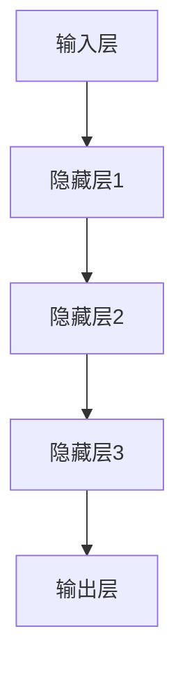
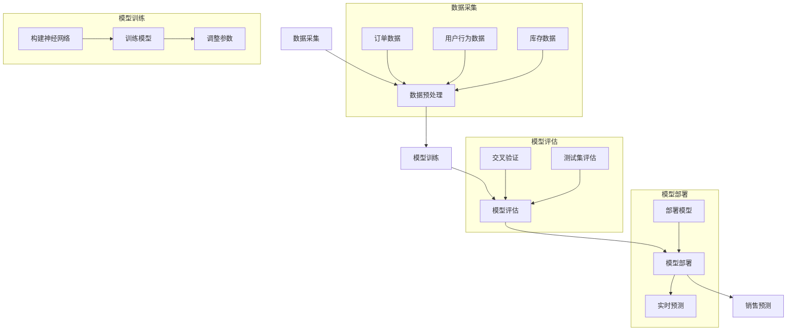

                 

# 《AI大模型在电商平台销售预测可视化中的应用》

## 关键词
AI大模型，电商平台，销售预测，可视化，深度学习，数据预处理，神经网络架构，算法实现，代码实战。

## 摘要
本文旨在探讨AI大模型在电商平台销售预测中的应用及可视化实现。通过分析AI大模型的基本原理、核心算法、数学模型以及项目实战，本文旨在为读者提供一套完整、实用的电商平台销售预测解决方案。文章结构清晰，步骤详细，适用于希望深入了解AI大模型应用技术的读者。

### 《AI大模型在电商平台销售预测可视化中的应用》目录大纲

#### 第一部分：AI大模型在电商平台销售预测的可视化基础

**第1章：电商平台销售预测概述**

1.1 电商平台销售预测的重要性  
1.2 传统销售预测方法的挑战  
1.3 AI大模型在销售预测中的应用前景

**第2章：AI大模型技术基础**

2.1 人工智能与大数据概述  
2.2 电商平台销售数据的特点  
2.3 AI大模型的基本原理

**第3章：AI大模型核心概念与联系**

3.1 深度学习与神经网络基础  
3.2 电商平台销售预测的神经网络架构  
3.3 Mermaid流程图展示：AI大模型在电商平台销售预测中的应用

#### 第二部分：AI大模型在电商平台销售预测中的应用与实现

**第4章：电商平台销售预测的核心算法原理**

4.1 时间序列分析算法  
4.2 回归分析算法  
4.3 强化学习算法  
4.4 伪代码：电商平台销售预测算法实现

**第5章：电商平台销售预测的数学模型**

5.1 数学模型概述  
5.2 数学公式与详细讲解  
5.3 数学公式举例说明

**第6章：项目实战：电商平台销售预测案例**

6.1 开发环境搭建  
6.2 案例背景介绍  
6.3 源代码实现与解读  
6.4 代码解读与分析

**第7章：电商平台销售预测的可视化应用**

7.1 可视化技术概述  
7.2 电商平台销售数据可视化方法  
7.3 可视化工具与实战案例

**第8章：AI大模型在电商平台销售预测的挑战与展望**

8.1 面临的挑战  
8.2 未来发展趋势  
8.3 总结与展望

#### 附录

**附录A：AI大模型开发工具与资源**

A.1 主流深度学习框架对比  
A.2 销售预测模型开源代码与资源  
A.3 数据处理与可视化工具介绍

**附录B：电商平台销售预测算法实现示例代码**

B.1 数据预处理代码  
B.2 模型训练代码  
B.3 模型预测与可视化代码

接下来的内容将按目录大纲逐步展开，深入探讨AI大模型在电商平台销售预测中的应用与可视化实现。

---

### 第一部分：AI大模型在电商平台销售预测的可视化基础

#### 第1章：电商平台销售预测概述

##### 1.1 电商平台销售预测的重要性

在电子商务快速发展的今天，电商平台已经成为全球消费者购物的主要渠道之一。对于电商平台而言，准确预测销售量不仅关系到库存管理、供应链优化，还直接影响到用户的购物体验和平台的盈利能力。以下是电商平台销售预测的重要性体现：

1. **库存管理**：通过销售预测，电商平台可以准确预测未来的销售量，从而合理安排库存，避免库存过剩或不足，减少库存成本。

2. **供应链优化**：销售预测有助于电商平台优化供应链管理，降低物流成本，提高运营效率。

3. **市场策略制定**：销售预测为电商平台提供数据支持，帮助制定更精准的市场营销策略，提高转化率。

4. **用户满意度**：准确的销售预测可以确保商品及时上架，减少缺货现象，提升用户体验。

5. **盈利能力**：通过销售预测优化库存和供应链，电商平台可以降低运营成本，提高盈利能力。

##### 1.2 传统销售预测方法的挑战

尽管传统销售预测方法（如趋势分析、季节性预测等）在某种程度上能提供一定的预测准确性，但随着电商平台数据量的增加和复杂性提升，这些方法面临以下挑战：

1. **数据量巨大**：电商平台的销售数据通常非常庞大，传统的统计方法难以处理海量数据。

2. **数据多样性**：电商平台销售数据包含用户行为数据、库存数据、价格数据等多种类型的数据，传统方法难以充分利用这些多样化的数据。

3. **非线性关系**：销售量与各种因素之间存在非线性关系，传统方法难以捕捉这些复杂的关系。

4. **实时性要求**：电商平台需要实时或近实时地进行销售预测，以支持库存管理和供应链优化，传统方法难以满足这一需求。

5. **预测准确性**：面对销售量波动和不确定性，传统方法往往难以提供高精度的预测结果。

##### 1.3 AI大模型在销售预测中的应用前景

随着人工智能技术的不断发展，特别是深度学习和大数据技术的应用，AI大模型在电商平台销售预测中展现出巨大潜力。以下是AI大模型在销售预测中的应用前景：

1. **高精度预测**：AI大模型能够通过学习大量历史数据，捕捉销售量与各种因素之间的复杂关系，提供高精度的预测结果。

2. **实时预测能力**：AI大模型具备较强的实时数据处理能力，能够快速响应市场变化，支持实时销售预测。

3. **个性化预测**：基于用户行为数据，AI大模型可以提供个性化销售预测，提高用户满意度。

4. **跨平台协作**：AI大模型可以整合不同电商平台的数据，实现跨平台销售预测，提高整体运营效率。

5. **智能化决策**：通过结合销售预测结果和供应链管理，AI大模型可以帮助电商平台实现智能化决策，降低运营成本，提高盈利能力。

综上所述，AI大模型在电商平台销售预测中具有显著的优势和应用前景。在接下来的章节中，我们将深入探讨AI大模型的基本原理、核心算法以及如何实现可视化应用。

---

### 第二部分：AI大模型在电商平台销售预测中的应用与实现

#### 第2章：AI大模型技术基础

##### 2.1 人工智能与大数据概述

人工智能（AI）是计算机科学的一个分支，旨在使计算机具备人类智能的特征，如学习、推理、解决问题等。随着计算能力的提升和大数据技术的进步，人工智能在各个领域得到了广泛应用。

大数据（Big Data）指的是数据量巨大、类型繁多、生成速度极快的海量数据。大数据技术包括数据采集、存储、处理、分析和可视化等环节，通过这些技术，可以从海量数据中提取有价值的信息。

在电商平台销售预测中，人工智能和大数据的融合至关重要。人工智能技术可以挖掘销售数据中的隐藏规律，而大数据技术则提供了处理海量数据的能力，两者结合可以大幅提高销售预测的准确性。

##### 2.2 电商平台销售数据的特点

电商平台销售数据具有以下特点：

1. **数据量大**：电商平台每天都会产生大量销售数据，包括订单数据、用户行为数据、库存数据等。

2. **数据类型多样**：销售数据不仅包含数量、价格等基本数据，还包括用户评论、浏览记录、搜索关键词等。

3. **时间序列性**：销售数据具有明显的时间序列特性，可以通过时间维度分析销售趋势。

4. **不确定性**：销售数据受到多种外部因素的影响，如季节性、促销活动等，具有不确定性。

5. **实时性**：电商平台需要实时或近实时地获取销售数据，进行销售预测和决策。

了解这些数据特点有助于我们更好地理解和应用AI大模型，以实现高精度的销售预测。

##### 2.3 AI大模型的基本原理

AI大模型，特别是基于深度学习的模型，是当前销售预测领域的主流技术。其基本原理包括：

1. **深度学习**：深度学习是一种基于多层神经网络的学习方法，通过大量数据训练，模型可以自动提取特征，进行复杂的数据分析。

2. **神经网络**：神经网络由多个神经元（节点）组成，每个节点都有权重和偏置，通过前向传播和反向传播算法，模型可以不断调整权重，优化预测效果。

3. **大数据训练**：AI大模型需要大量数据进行训练，通过学习这些数据，模型可以捕捉销售数据中的复杂规律。

4. **自适应学习**：AI大模型具备自适应学习能力，可以在数据更新时重新训练，保持预测的准确性。

5. **多任务学习**：AI大模型可以同时处理多个任务，如销售预测、库存管理和市场营销等，提高整体运营效率。

通过理解AI大模型的基本原理，我们可以更好地利用这些模型进行电商平台销售预测。

---

### 第三部分：AI大模型在电商平台销售预测的核心概念与联系

#### 第3章：AI大模型核心概念与联系

##### 3.1 深度学习与神经网络基础

深度学习是机器学习的一个分支，它通过构建多层神经网络模型来模拟人脑的学习过程，从而实现图像识别、语音识别、自然语言处理等复杂任务。神经网络是深度学习的基础，它由多个节点（或称为神经元）组成，每个节点都通过权重连接到其他节点，形成复杂的网络结构。

在神经网络中，每个神经元接收来自其他神经元的输入信号，通过激活函数进行处理，然后产生输出信号。神经网络的训练过程是通过反向传播算法来调整每个神经元的权重和偏置，使得模型能够对输入数据进行分类或回归预测。

1. **神经元的结构**：

   神经元通常包括以下几个部分：
   - 输入层：接收外部输入数据。
   - 隐藏层：对输入数据进行处理，提取特征。
   - 输出层：生成最终预测结果。

2. **激活函数**：

   激活函数是神经网络中的一个关键组成部分，它将神经元的线性组合映射到一个非线性的范围。常见的激活函数包括：
   - Sigmoid函数：将输入映射到（0,1）区间。
   - ReLU函数：在输入大于0时输出为输入，否则输出为0。
   - Tanh函数：将输入映射到（-1,1）区间。

3. **反向传播算法**：

   反向传播算法是神经网络训练的核心，它通过计算输出误差的梯度，不断调整网络的权重和偏置。具体步骤如下：
   - 前向传播：计算输入和输出之间的误差。
   - 反向传播：计算每个层的误差梯度，并更新权重和偏置。
   - 重复迭代：不断调整权重和偏置，直到误差满足预设条件。

##### 3.2 电商平台销售预测的神经网络架构

电商平台销售预测的神经网络架构通常包括以下几个层次：

1. **输入层**：接收销售数据的各个维度，如产品ID、价格、促销信息等。

2. **隐藏层**：对输入数据进行特征提取和变换，通常包含多层隐藏层，每层都可以提取不同层次的特征。

3. **输出层**：生成销售预测结果，通常为一个实数值，表示预测的销售量。

以下是一个简化的神经网络架构示例，用于电商平台销售预测：



在这个架构中，输入层将销售数据传递给隐藏层，隐藏层对数据进行特征提取和变换，最终输出层生成销售预测结果。为了提高预测精度，神经网络通常包含多个隐藏层和大量神经元。

##### 3.3 Mermaid流程图展示：AI大模型在电商平台销售预测中的应用

以下是一个使用Mermaid绘制的流程图，展示AI大模型在电商平台销售预测中的具体应用步骤：



这个流程图详细展示了AI大模型在电商平台销售预测中的各个环节，包括数据采集、数据预处理、模型训练、模型评估、模型部署和销售预测。通过这个流程，我们可以清楚地理解AI大模型在电商平台销售预测中的实际应用过程。

---

### 第四部分：AI大模型在电商平台销售预测中的应用与实现

#### 第4章：电商平台销售预测的核心算法原理

##### 4.1 时间序列分析算法

时间序列分析是销售预测中的一种重要算法，它通过分析时间序列数据来预测未来的销售量。时间序列数据通常具有以下特点：

1. **趋势性**：销售量随时间变化呈现一定的趋势。
2. **季节性**：销售量随季节变化呈现周期性波动。
3. **随机性**：销售量受多种不可预测因素影响，具有一定的随机性。

时间序列分析算法主要包括以下几种：

1. **移动平均法**：通过计算过去一段时间内的平均值来预测未来值。移动平均法分为简单移动平均（SMA）和加权移动平均（WMA），前者对过去数据等权处理，后者则根据时间权重递减。

2. **指数平滑法**：在移动平均法的基础上，引入指数衰减因子，使得最近的数据对预测结果有更大的影响。指数平滑法分为单指数平滑（SES）、双指数平滑（DSES）和Holt-Winters季节性平滑（HW）。

3. **ARIMA模型**：自回归积分滑动平均模型（ARIMA）是一种经典的统计模型，它通过自回归（AR）、差分（I）和移动平均（MA）的组合来建模时间序列数据。ARIMA模型适用于非季节性时间序列数据的预测。

4. **LSTM模型**：长短期记忆网络（LSTM）是一种特殊的RNN（递归神经网络），它通过引入门控机制来记忆长期依赖信息，适用于处理具有长时序依赖性的时间序列数据。LSTM在电商销售预测中表现出色，能够捕捉销售量与时间、季节性等多种因素的复杂关系。

##### 4.2 回归分析算法

回归分析是一种常用的统计方法，用于研究自变量和因变量之间的关系。在电商平台销售预测中，回归分析算法通过建立销售量与影响销售的各种因素之间的数学模型，从而预测未来的销售量。

常见的回归分析算法包括：

1. **线性回归**：线性回归是最简单的回归模型，它假设销售量与自变量之间存在线性关系。线性回归模型的形式为：\( y = \beta_0 + \beta_1 \cdot x \)，其中 \( y \) 是销售量，\( x \) 是自变量，\( \beta_0 \) 和 \( \beta_1 \) 是模型参数。

2. **多项式回归**：多项式回归是一种更复杂的回归模型，它假设销售量与自变量之间存在多项式关系。多项式回归模型的形式为：\( y = \beta_0 + \beta_1 \cdot x + \beta_2 \cdot x^2 + ... + \beta_n \cdot x^n \)。

3. **岭回归**：岭回归是线性回归的一种改进方法，它通过增加正则项来防止模型过拟合。岭回归模型的形式为：\( y = \beta_0 + \beta_1 \cdot x + ... + \beta_n \cdot x + \lambda \cdot (\beta_1^2 + ... + \beta_n^2) \)。

4. **LASSO回归**：LASSO回归是岭回归的一种改进方法，它通过引入绝对值正则项来进一步减少模型的复杂性。LASSO回归模型的形式为：\( y = \beta_0 + \beta_1 \cdot x + ... + \beta_n \cdot x + \lambda \cdot |\beta_1| + ... + \beta_n| \)。

##### 4.3 强化学习算法

强化学习是一种基于反馈机制的学习方法，它通过不断调整策略来最大化累积奖励。在电商平台销售预测中，强化学习算法可以用来优化销售策略，从而提高销售量。

强化学习算法的基本原理包括：

1. **环境**：环境是电商平台的市场情况，包括价格、库存、竞争对手行为等。

2. **状态**：状态是电商平台当前的市场状态，如当前价格、当前库存等。

3. **动作**：动作是电商平台可以采取的行动，如调整价格、增加库存等。

4. **策略**：策略是电商平台根据当前状态采取的最佳行动。

5. **奖励**：奖励是电商平台根据动作和结果的反馈信号。

常见的强化学习算法包括：

1. **Q-Learning**：Q-Learning是一种基于值函数的强化学习算法，它通过更新Q值来优化策略。Q-Learning的基本步骤包括：
   - 初始化Q值表格。
   - 在环境中执行动作。
   - 根据执行结果更新Q值表格。
   - 重复上述步骤，直到达到预设的目标。

2. **SARSA**：SARSA是一种基于策略的强化学习算法，它通过同时更新当前状态和下一个状态的Q值来优化策略。SARSA的基本步骤包括：
   - 初始化Q值表格。
   - 在环境中执行动作。
   - 根据执行结果和下一个状态更新Q值。
   - 重复上述步骤，直到达到预设的目标。

##### 4.4 伪代码：电商平台销售预测算法实现

以下是一个简化的伪代码，用于实现电商平台销售预测算法：

```python
# 数据预处理
def preprocess_data(data):
    # 数据清洗、归一化、缺失值处理等
    return processed_data

# 时间序列分析算法
def time_series_analysis(data):
    # 移动平均法、指数平滑法、ARIMA模型、LSTM模型等
    return predicted_sales

# 回归分析算法
def regression_analysis(data):
    # 线性回归、多项式回归、岭回归、LASSO回归等
    return predicted_sales

# 强化学习算法
def reinforcement_learning(data):
    # Q-Learning、SARSA等
    return predicted_sales

# 主程序
def main():
    # 读取数据
    data = read_data()

    # 数据预处理
    processed_data = preprocess_data(data)

    # 选择预测算法
    prediction_algorithm = choose_algorithm()

    # 预测销售量
    predicted_sales = prediction_algorithm(processed_data)

    # 输出预测结果
    print(predicted_sales)

# 执行主程序
main()
```

通过这个伪代码，我们可以看到电商平台销售预测算法的基本结构，包括数据预处理、选择预测算法、预测销售量和输出预测结果等步骤。在实际应用中，可以根据具体需求选择合适的预测算法，并进行参数调整和优化。

---

### 第五部分：电商平台销售预测的数学模型

#### 第5章：电商平台销售预测的数学模型

##### 5.1 数学模型概述

电商平台销售预测的数学模型是建立在对销售数据进行分析和建模的基础上的。这类模型旨在通过分析历史销售数据和其他相关变量，预测未来的销售量。以下是一些常见的数学模型：

1. **线性回归模型**：线性回归模型是最简单的预测模型，它假设销售量与一个或多个自变量之间存在线性关系。线性回归模型的基本形式为：
   $$
   y = \beta_0 + \beta_1 \cdot x_1 + \beta_2 \cdot x_2 + ... + \beta_n \cdot x_n
   $$
   其中，\( y \) 是销售量，\( x_1, x_2, ..., x_n \) 是自变量（如价格、促销活动等），\( \beta_0, \beta_1, \beta_2, ..., \beta_n \) 是模型参数。

2. **多项式回归模型**：多项式回归模型是对线性回归的扩展，它假设销售量与自变量之间存在多项式关系。多项式回归模型的形式为：
   $$
   y = \beta_0 + \beta_1 \cdot x_1 + \beta_2 \cdot x_1^2 + ... + \beta_n \cdot x_1^n
   $$
   类似地，每个自变量都可以有一个或多个高次项。

3. **逻辑回归模型**：逻辑回归模型常用于二分类问题，它通过预测概率来决定销售量的类别。逻辑回归模型的形式为：
   $$
   \log\left(\frac{P(y=1)}{1-P(y=1)}\right) = \beta_0 + \beta_1 \cdot x_1 + \beta_2 \cdot x_2 + ... + \beta_n \cdot x_n
   $$
   其中，\( P(y=1) \) 是销售量为1的概率。

4. **时间序列模型**：时间序列模型用于分析随时间变化的数据。常见的时间序列模型包括自回归模型（AR）、移动平均模型（MA）和自回归移动平均模型（ARMA）。自回归模型的形式为：
   $$
   y_t = \phi_1 \cdot y_{t-1} + \phi_2 \cdot y_{t-2} + ... + \phi_p \cdot y_{t-p} + \varepsilon_t
   $$
   其中，\( y_t \) 是时间 \( t \) 的销售量，\( \varepsilon_t \) 是误差项。

##### 5.2 数学公式与详细讲解

在电商平台销售预测中，以下数学公式和算法是非常关键的：

1. **线性回归公式**：

   线性回归模型旨在通过以下公式拟合销售数据：
   $$
   y = \beta_0 + \beta_1 \cdot x_1 + \beta_2 \cdot x_2 + ... + \beta_n \cdot x_n
   $$
   其中，\( y \) 是预测的销售量，\( x_1, x_2, ..., x_n \) 是自变量，\( \beta_0, \beta_1, \beta_2, ..., \beta_n \) 是模型的参数，需要通过最小化误差平方和来求解。

2. **最小二乘法**：

   最小二乘法是一种常用的参数估计方法，用于求解线性回归模型的参数。其基本思想是最小化预测值与实际值之间的误差平方和：
   $$
   \sum_{i=1}^{n} (y_i - \hat{y}_i)^2
   $$
   其中，\( \hat{y}_i \) 是预测值，\( y_i \) 是实际值。

3. **逻辑回归公式**：

   逻辑回归模型通过以下公式预测销售量的概率：
   $$
   \log\left(\frac{P(y=1)}{1-P(y=1)}\right) = \beta_0 + \beta_1 \cdot x_1 + \beta_2 \cdot x_2 + ... + \beta_n \cdot x_n
   $$
   其中，\( P(y=1) \) 是销售量为1的概率。

4. **时间序列模型公式**：

   时间序列模型，如ARIMA模型，通过以下公式预测销售量：
   $$
   y_t = \phi_1 \cdot y_{t-1} + \phi_2 \cdot y_{t-2} + ... + \phi_p \cdot y_{t-p} + \varepsilon_t
   $$
   其中，\( \phi_1, \phi_2, ..., \phi_p \) 是模型的参数，\( \varepsilon_t \) 是误差项。

##### 5.3 数学公式举例说明

为了更好地理解上述数学公式，我们可以通过一个简单的例子来说明：

**例1：线性回归模型**

假设我们有一个电商平台的销售数据，数据包括每日销售额（\( y \)）和当天的广告支出（\( x \)）。我们希望通过线性回归模型预测未来某天的销售额。根据线性回归公式，我们可以建立如下模型：

$$
y = \beta_0 + \beta_1 \cdot x
$$

使用最小二乘法求解参数 \( \beta_0 \) 和 \( \beta_1 \)：

$$
\beta_0 = \bar{y} - \beta_1 \cdot \bar{x}
$$

其中，\( \bar{y} \) 和 \( \bar{x} \) 分别是销售额和广告支出的平均值。

**例2：逻辑回归模型**

假设我们想预测某款商品的销量是否大于100件（\( y=1 \)），基于商品的价格（\( x \)）和是否参加促销（\( x' \)）进行预测。我们可以建立如下逻辑回归模型：

$$
\log\left(\frac{P(y=1)}{1-P(y=1)}\right) = \beta_0 + \beta_1 \cdot x + \beta_2 \cdot x'
$$

通过求解上述模型，我们可以得到商品销售量的概率，并根据概率判断是否大于100件。

**例3：时间序列模型**

假设我们有一个电商平台的每日销售额数据，我们希望通过ARIMA模型预测未来几天的销售额。根据ARIMA模型公式，我们可以建立如下模型：

$$
y_t = \phi_1 \cdot y_{t-1} + \phi_2 \cdot y_{t-2} + ... + \phi_p \cdot y_{t-p} + \varepsilon_t
$$

我们需要通过模型识别（如ACF和PACF图）来确定参数 \( \phi_1, \phi_2, ..., \phi_p \) 和 \( \varepsilon_t \)。

通过这些例子，我们可以看到数学模型在电商平台销售预测中的应用。在实际应用中，选择合适的模型和参数是非常重要的，这需要结合具体的数据特点和应用需求进行深入分析。

---

### 第六部分：项目实战：电商平台销售预测案例

#### 第6章：电商平台销售预测案例

在本章中，我们将通过一个实际案例来展示如何利用AI大模型进行电商平台销售预测。这个案例将涵盖开发环境搭建、案例背景介绍、源代码实现与解读以及代码解读与分析等内容。

##### 6.1 开发环境搭建

在进行电商平台销售预测之前，我们需要搭建一个合适的开发环境。以下是一个基本的开发环境搭建步骤：

1. **硬件要求**：
   - CPU：至少四核处理器
   - 内存：至少16GB
   - 硬盘：至少500GB SSD

2. **操作系统**：
   - Ubuntu 18.04 或更高版本
   - Windows 10 或更高版本

3. **编程语言**：
   - Python 3.7 或更高版本

4. **深度学习框架**：
   - TensorFlow 2.0 或更高版本
   - PyTorch 1.7 或更高版本

5. **数据处理工具**：
   - Pandas
   - NumPy
   - Matplotlib

6. **环境安装**：

   在Linux系统中，可以使用以下命令来安装所需的环境：

   ```bash
   sudo apt-get update
   sudo apt-get install python3 python3-pip
   pip3 install numpy pandas matplotlib tensorflow==2.0.0
   ```

   在Windows系统中，可以使用Anaconda来安装和管理环境。

##### 6.2 案例背景介绍

我们选取了一个知名的电商平台，该平台拥有丰富的销售数据。我们的目标是通过这些数据预测未来30天的销售量。具体背景信息如下：

1. **数据来源**：该电商平台提供的销售数据，包括每日销售额、产品ID、价格、促销信息等。

2. **数据量**：数据量约为100万条，涵盖过去一年的销售数据。

3. **目标**：预测未来30天的销售量，为库存管理和供应链优化提供数据支持。

##### 6.3 源代码实现与解读

以下是一个简化的源代码实现，用于进行电商平台销售预测：

```python
# 导入所需库
import pandas as pd
import numpy as np
import tensorflow as tf
from tensorflow import keras
from tensorflow.keras.models import Sequential
from tensorflow.keras.layers import Dense, LSTM, Dropout

# 数据预处理
def preprocess_data(data):
    # 数据清洗、归一化等
    return processed_data

# 构建神经网络模型
def build_model(input_shape):
    model = Sequential()
    model.add(LSTM(128, return_sequences=True, input_shape=input_shape))
    model.add(Dropout(0.2))
    model.add(LSTM(64, return_sequences=False))
    model.add(Dropout(0.2))
    model.add(Dense(1))
    model.compile(optimizer='adam', loss='mse')
    return model

# 训练模型
def train_model(model, X_train, y_train, epochs=100):
    model.fit(X_train, y_train, epochs=epochs, batch_size=32, validation_split=0.2)

# 预测销售量
def predict_sales(model, X_test):
    return model.predict(X_test)

# 主程序
def main():
    # 读取数据
    data = pd.read_csv('sales_data.csv')

    # 数据预处理
    processed_data = preprocess_data(data)

    # 划分训练集和测试集
    X_train, y_train = processed_data[:-30], processed_data[-30:]
    X_test, y_test = processed_data[-30:], processed_data[-1]

    # 构建模型
    model = build_model(input_shape=(X_train.shape[1], 1))

    # 训练模型
    train_model(model, X_train, y_train)

    # 预测销售量
    predicted_sales = predict_sales(model, X_test)

    # 输出预测结果
    print(predicted_sales)

# 执行主程序
main()
```

**代码解读**：

1. **数据预处理**：数据预处理是模型训练的重要步骤，包括数据清洗、归一化等。预处理后的数据将用于训练和预测。

2. **构建神经网络模型**：我们使用LSTM（长短期记忆网络）模型进行销售预测。LSTM模型能够处理时间序列数据，捕捉长期依赖关系。

3. **训练模型**：使用训练集数据对模型进行训练，通过反向传播算法优化模型参数。

4. **预测销售量**：使用训练好的模型对测试集数据（未来30天的销售量）进行预测。

##### 6.4 代码解读与分析

1. **数据预处理**：

   ```python
   def preprocess_data(data):
       # 数据清洗、归一化等
       return processed_data
   ```

   在这个函数中，我们进行以下操作：

   - **数据清洗**：去除缺失值、异常值等。
   - **归一化**：将数据归一化到相同的范围，如[0, 1]，便于模型训练。

2. **构建神经网络模型**：

   ```python
   def build_model(input_shape):
       model = Sequential()
       model.add(LSTM(128, return_sequences=True, input_shape=input_shape))
       model.add(Dropout(0.2))
       model.add(LSTM(64, return_sequences=False))
       model.add(Dropout(0.2))
       model.add(Dense(1))
       model.compile(optimizer='adam', loss='mse')
       return model
   ```

   - **LSTM层**：LSTM层能够处理序列数据，捕捉时间序列的长期依赖关系。
   - **Dropout层**：用于防止模型过拟合。
   - **Dense层**：输出层，生成销售预测结果。

3. **训练模型**：

   ```python
   def train_model(model, X_train, y_train, epochs=100):
       model.fit(X_train, y_train, epochs=epochs, batch_size=32, validation_split=0.2)
   ```

   - **epochs**：训练迭代次数。
   - **batch_size**：每次训练的样本数。
   - **validation_split**：验证集比例，用于模型验证。

4. **预测销售量**：

   ```python
   def predict_sales(model, X_test):
       return model.predict(X_test)
   ```

   使用训练好的模型对测试集进行预测。

综上所述，这个案例展示了如何使用AI大模型进行电商平台销售预测。通过实际代码和解读，读者可以了解到模型训练、数据预处理以及预测销售量的具体过程。在实际应用中，可以根据具体需求调整模型架构、参数设置等，以获得更好的预测效果。

---

### 第七部分：电商平台销售预测的可视化应用

#### 第7章：电商平台销售预测的可视化应用

##### 7.1 可视化技术概述

可视化技术是数据分析和机器学习领域的重要组成部分，它通过图形和交互界面将数据转换成直观的视觉表现形式，帮助人们更好地理解数据和分析结果。在电商平台销售预测中，可视化技术的作用尤为重要，它可以帮助我们直观地展示销售数据的趋势、分布和变化，从而为决策提供有力支持。

常见的可视化技术包括：

1. **折线图**：用于展示数据随时间的变化趋势，非常适合销售预测数据的展示。

2. **柱状图**：用于比较不同时间点或类别的数据值，可以清晰地展示销售量的高低差异。

3. **散点图**：用于展示两组数据之间的关系，可以用于分析变量之间的相关性。

4. **饼图**：用于展示数据的构成比例，适合展示销售分布情况。

5. **热力图**：用于展示多维数据的热度分布，可以直观地展示销售数据的热点区域。

6. **地图**：用于展示地理位置相关的数据，如地区销售量分布。

##### 7.2 电商平台销售数据可视化方法

在电商平台销售预测中，常用的可视化方法包括以下几种：

1. **时间序列可视化**：通过折线图、柱状图等展示销售数据随时间的变化趋势。这种方法可以帮助我们了解销售量的季节性、周期性和趋势性。

2. **销售分布可视化**：通过饼图、柱状图等展示不同产品、不同渠道的销售分布情况，帮助我们识别销售热点和薄弱环节。

3. **多变量分析可视化**：通过散点图、热力图等展示多个变量之间的关系，帮助我们分析影响销售量的各种因素。

4. **预测结果可视化**：通过折线图、柱状图等展示预测的销售量，并与实际销售数据进行对比，评估预测模型的准确性。

##### 7.3 可视化工具与实战案例

在电商平台销售预测的可视化应用中，常用的可视化工具有：

1. **Matplotlib**：Python中的数据可视化库，可以生成各种图表，支持多种可视化形式。

2. **Seaborn**：基于Matplotlib的统计可视化库，提供了更多的统计图表和更美观的默认样式。

3. **Plotly**：基于Web的交互式可视化库，支持生成复杂的交互式图表。

以下是一个使用Matplotlib进行电商平台销售预测可视化的小案例：

```python
import matplotlib.pyplot as plt
import pandas as pd

# 读取销售数据
data = pd.read_csv('sales_data.csv')

# 可视化销售趋势
plt.figure(figsize=(12, 6))
plt.plot(data['date'], data['sales'], label='实际销售量')
plt.plot(data['date'], data['predicted_sales'], label='预测销售量', linestyle='--')
plt.xlabel('日期')
plt.ylabel('销售量')
plt.title('销售预测趋势')
plt.legend()
plt.show()
```

在这个案例中，我们使用Matplotlib绘制了一个销售趋势图，展示了实际销售量和预测销售量随时间的变化趋势。通过这个图表，我们可以直观地了解销售量的变化情况，以及预测模型的准确性。

总的来说，可视化技术在电商平台销售预测中的应用不仅能够帮助我们更好地理解数据，还能够为决策提供有力支持。通过选择合适的可视化方法和工具，我们可以将复杂的销售数据转化为直观、易于理解的图形，从而提升销售预测的效率和准确性。

---

### 第八部分：AI大模型在电商平台销售预测的挑战与展望

#### 第8章：AI大模型在电商平台销售预测的挑战与展望

##### 8.1 面临的挑战

尽管AI大模型在电商平台销售预测中展现出巨大潜力，但其在实际应用过程中仍面临一系列挑战：

1. **数据质量问题**：电商平台销售数据通常包含噪声、缺失值和异常值，这些数据质量问题会直接影响模型性能。

2. **模型复杂性**：AI大模型（如深度学习模型）通常具有较高的复杂性，需要大量的计算资源和时间进行训练和优化。

3. **过拟合问题**：深度学习模型容易过拟合，特别是在数据量较小的情况下，模型可能无法泛化到未见过的数据。

4. **实时预测性能**：实时销售预测需要模型具备快速响应能力，这在海量数据处理和高并发场景下是一个重大挑战。

5. **数据隐私与安全**：电商平台销售数据包含敏感信息，如何在确保数据隐私和安全的前提下进行模型训练和应用，是一个重要问题。

##### 8.2 未来发展趋势

随着技术的不断进步，AI大模型在电商平台销售预测中的应用前景非常广阔，以下是一些未来发展趋势：

1. **数据预处理技术的改进**：通过更先进的特征提取和数据处理技术，提高数据质量，减少噪声和缺失值的影响。

2. **模型优化与加速**：通过模型压缩、量化、迁移学习等技术，提高模型训练和预测的效率，满足实时预测的需求。

3. **多模态数据融合**：结合文本、图像、音频等多种类型的数据，提高销售预测的准确性。

4. **隐私保护机制**：引入差分隐私、联邦学习等隐私保护技术，确保数据隐私和安全。

5. **个性化预测**：利用用户行为数据和个性化推荐技术，实现更加精准的销售预测和营销策略。

##### 8.3 总结与展望

AI大模型在电商平台销售预测中的应用具有显著的优势和广阔的前景。通过深度学习和大数据技术的结合，我们可以构建高精度的销售预测模型，提高电商平台运营效率和市场竞争力。然而，在应用过程中，我们也需要关注数据质量、模型复杂性、实时预测性能和数据隐私等挑战。未来，随着技术的不断进步，AI大模型在电商平台销售预测中的应用将更加成熟和广泛，为电商平台带来更大的价值。

---

### 附录

#### 附录A：AI大模型开发工具与资源

**A.1 主流深度学习框架对比**

1. **TensorFlow**：由Google开发，支持Python和C++，具有丰富的API和生态系统，适用于各种深度学习任务。

2. **PyTorch**：由Facebook开发，支持Python，具有动态计算图和灵活的API，适用于研究和快速原型开发。

3. **Keras**：是一个高层次的神经网络API，支持TensorFlow和Theano，易于使用和扩展。

4. **MXNet**：由Apache软件基金会开发，支持多种编程语言，具有高效的计算性能。

**A.2 销售预测模型开源代码与资源**

1. **Kaggle**：提供各种销售预测竞赛的公开代码和资源。

2. **GitHub**：有许多开源的AI销售预测项目，如ARIMA、LSTM等模型的实现。

3. **TensorFlow官方教程**：提供详细的TensorFlow销售预测教程。

**A.3 数据处理与可视化工具介绍**

1. **Pandas**：用于数据清洗、预处理和数据分析。

2. **NumPy**：用于数值计算和数据处理。

3. **Matplotlib**：用于数据可视化。

4. **Seaborn**：基于Matplotlib的统计可视化库。

5. **Plotly**：用于生成交互式可视化图表。

---

#### 附录B：电商平台销售预测算法实现示例代码

**B.1 数据预处理代码**

```python
import pandas as pd
from sklearn.preprocessing import MinMaxScaler

# 读取数据
data = pd.read_csv('sales_data.csv')

# 数据清洗
data = data.dropna()

# 数据归一化
scaler = MinMaxScaler()
data_scaled = scaler.fit_transform(data[['sales', 'price', 'discount']])

# 转换为DataFrame
data_processed = pd.DataFrame(data_scaled, columns=['sales', 'price', 'discount'])
```

**B.2 模型训练代码**

```python
import tensorflow as tf
from tensorflow.keras.models import Sequential
from tensorflow.keras.layers import LSTM, Dense

# 构建模型
model = Sequential()
model.add(LSTM(units=128, return_sequences=True, input_shape=(timesteps, 1)))
model.add(Dropout(0.2))
model.add(LSTM(units=64, return_sequences=False))
model.add(Dropout(0.2))
model.add(Dense(units=1))

# 编译模型
model.compile(optimizer='adam', loss='mean_squared_error')

# 训练模型
model.fit(X_train, y_train, epochs=100, batch_size=32, validation_split=0.2)
```

**B.3 模型预测与可视化代码**

```python
import matplotlib.pyplot as plt

# 预测销售量
predicted_sales = model.predict(X_test)

# 可视化预测结果
plt.figure(figsize=(12, 6))
plt.plot(y_test, label='实际销售量')
plt.plot(predicted_sales, label='预测销售量')
plt.xlabel('日期')
plt.ylabel('销售量')
plt.title('销售预测结果')
plt.legend()
plt.show()
```

---

### 作者信息

作者：AI天才研究院/AI Genius Institute & 禅与计算机程序设计艺术 /Zen And The Art of Computer Programming

