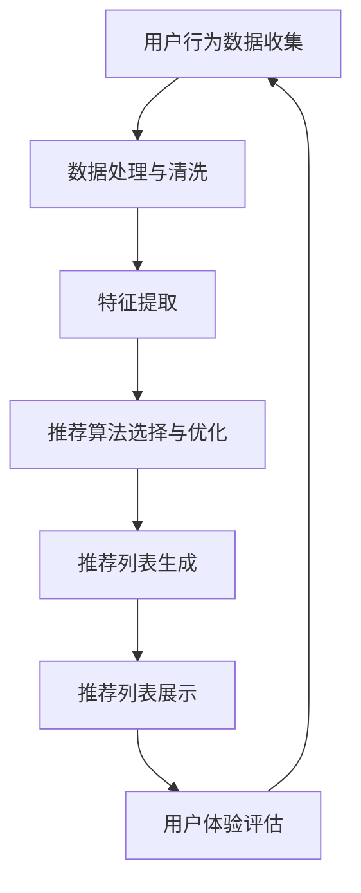
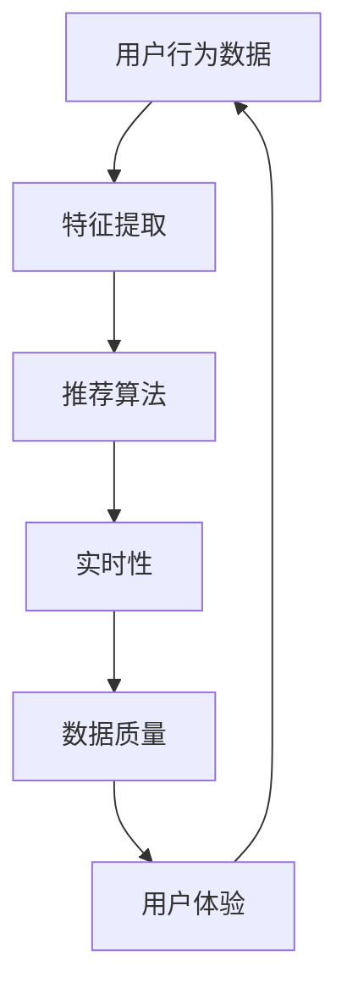

                 

### 第一部分：AI实时推荐系统概述

#### 1.1 AI实时推荐系统的定义与重要性

##### 1.1.1 AI实时推荐系统的定义

AI实时推荐系统是指利用人工智能技术，对用户行为数据进行分析，动态地生成个性化的推荐结果，从而帮助用户快速找到他们可能感兴趣的内容或商品。这个过程通常包括数据收集、数据处理、特征提取、模型训练和推荐列表生成等步骤。

##### 1.1.2 AI实时推荐系统的重要性

AI实时推荐系统在多个领域都展现了其重要性：

- **提高用户转化率**：通过精准的推荐，用户更可能对推荐的内容或商品进行点击或购买，从而提高转化率。

- **增加用户留存率**：个性化的推荐服务可以提高用户对平台的满意度和忠诚度，从而增加用户留存率。

- **提升商业价值**：通过提高用户参与度和转化率，实时推荐系统有助于提升企业的销售额和盈利能力。

#### 1.2 AI实时推荐系统的工作原理

##### 1.2.1 用户行为数据的收集与处理

用户行为数据包括浏览历史、点击记录、购买行为等。首先，系统需要收集这些数据，然后进行数据清洗、去重和特征提取等处理步骤。

1. **数据清洗**：移除重复、错误或无效的数据，确保数据质量。
2. **数据去重**：去除重复的用户行为记录，避免对推荐结果产生干扰。
3. **特征提取**：从用户行为数据中提取出有助于推荐的关键特征，如用户历史浏览记录、购买频率等。

##### 1.2.2 推荐算法的选择与应用

推荐算法可以分为基于内容的推荐、协同过滤推荐和混合推荐等类型。根据具体场景和数据特点，选择合适的算法，并对其进行优化和调参。

1. **基于内容的推荐**：通过分析内容特征，为用户推荐相似的内容。
2. **协同过滤推荐**：通过分析用户行为，为用户推荐其他用户喜欢的内容。
3. **混合推荐**：结合多种推荐算法的优势，生成更精准的推荐结果。

##### 1.2.3 实时推荐列表的生成与展示

1. **推荐列表生成**：根据用户行为数据和推荐算法，实时生成推荐列表。
2. **推荐列表展示**：将推荐列表通过用户界面展示给用户，用户可以浏览、点击或购买推荐内容。

#### 1.3 AI实时推荐系统的挑战与解决方案

##### 1.3.1 数据质量与实时性挑战

1. **数据质量**：数据质量直接影响到推荐系统的效果。解决方案包括使用数据清洗和预处理技术，提高数据质量。
2. **实时性**：实时性要求系统快速响应用户行为变化。解决方案包括优化算法效率，采用分布式计算和缓存技术。

##### 1.3.2 挑战与解决方案

1. **数据质量与实时性挑战**：如上所述，通过提高数据质量和优化算法效率来应对。
2. **推荐效果评估**：如何评估推荐系统的效果是另一个挑战。解决方案包括使用A/B测试、点击率、转化率等指标来评估推荐系统的效果。
3. **算法透明性与用户隐私**：随着用户隐私保护意识的增强，如何确保算法的透明性和保护用户隐私成为重要挑战。解决方案包括使用差分隐私技术、设计透明的算法架构等。

#### 结论

AI实时推荐系统在提高用户满意度和提升商业价值方面具有重要意义。通过理解其工作原理、挑战和解决方案，我们可以更好地设计和优化实时推荐系统，从而实现更高的推荐效果和用户体验。

---

**核心概念与联系**：

在AI实时推荐系统中，核心概念包括用户行为数据、推荐算法、实时性、数据质量和用户体验。以下是一个简单的Mermaid流程图，描述这些概念之间的联系：



**核心算法原理讲解**：

基于内容的推荐算法的基本原理是，通过分析物品的内容特征和用户的兴趣特征，计算两者之间的相似度，并根据相似度为用户推荐相似物品。

```python
# 基于内容的推荐算法伪代码
def content_based_recommendation(content_features, user_interests):
    # 计算内容特征与用户兴趣的相似度
    similarity_scores = compute_similarity(content_features, user_interests)
    # 排序并返回推荐列表
    return get_top_n_recommended_items(similarity_scores, n)
```

**数学模型和公式**：

相似度计算可以使用余弦相似度公式：

$$
similarity = \frac{content\_features \cdot user\_interests}{\|content\_features\|\|user\_interests\|}
$$

其中，$content\_features$和$us

### 第二部分：AI实时推荐系统的核心技术

#### 2.1 用户行为分析与建模

##### 2.1.1 用户行为数据类型与特征提取

用户行为数据类型主要包括：

1. **浏览历史**：用户访问的网页、应用或视频等。
2. **点击记录**：用户在网页、应用或视频中点击的链接或按钮。
3. **购买行为**：用户的购买历史，包括购买时间、购买商品、购买金额等。

特征提取是将用户行为数据转化为推荐系统可以理解和处理的特征。常见的方法包括：

1. **时间特征**：用户访问或点击的时间，如一天中的哪个小时、一周中的哪个天等。
2. **频率特征**：用户访问或点击的频率，如每天访问次数、每周访问次数等。
3. **上下文特征**：用户访问或点击的上下文信息，如搜索关键词、页面分类等。

##### 2.1.2 用户行为建模算法

用户行为建模算法的目标是理解用户的兴趣和行为模式，从而为用户推荐他们可能感兴趣的内容或商品。常见算法包括：

1. **隐语义模型**：如Latent Semantic Analysis (LSA) 和 Latent Dirichlet Allocation (LDA)，通过捕捉用户行为数据中的潜在语义关系来进行建模。
2. **用户兴趣模型**：通过分析用户的历史行为数据，构建用户兴趣模型，如基于内容的兴趣模型和基于协同过滤的兴趣模型。

#### 2.2 推荐算法原理与实现

##### 2.2.1 基于内容的推荐

基于内容的推荐算法（Content-Based Recommendation）的基本思想是，通过分析物品的内容特征和用户的兴趣特征，计算两者之间的相似度，并根据相似度为用户推荐相似物品。

**原理**：

- **物品特征提取**：对每个物品进行特征提取，如标签、分类、文本等。
- **用户兴趣特征提取**：对用户的兴趣进行特征提取，如用户的浏览历史、收藏、搜索等。
- **相似度计算**：计算物品特征和用户兴趣特征之间的相似度，如余弦相似度、欧氏距离等。
- **推荐列表生成**：根据相似度分数，为用户生成推荐列表。

**伪代码实现**：

```python
def content_based_recommendation(item_features, user_interests):
    # 计算物品特征与用户兴趣的相似度
    similarity_scores = compute_similarity(item_features, user_interests)
    # 排序并返回推荐列表
    return get_top_n_recommended_items(similarity_scores, n)
```

##### 2.2.2 协同过滤推荐

协同过滤推荐算法（Collaborative Filtering）是基于用户行为数据，通过分析用户之间的相似性，为用户推荐他们可能感兴趣的内容或商品。

**原理**：

- **用户行为数据收集**：收集用户的浏览历史、点击记录、购买行为等。
- **用户相似度计算**：计算用户之间的相似度，如基于用户评分的余弦相似度、皮尔逊相关系数等。
- **物品相似度计算**：计算物品之间的相似度，如基于用户评分的余弦相似度、欧氏距离等。
- **推荐列表生成**：根据用户相似度和物品相似度，为用户生成推荐列表。

**伪代码实现**：

```python
def collaborative_filtering_recommendation(user_behavior, user_item_similarity, items):
    # 计算用户与物品的相似度
    user_item_similarity_scores = compute_similarity(user_behavior, items)
    # 计算用户对物品的预测评分
    user_item_ratings = predict_ratings(user_behavior, user_item_similarity_scores)
    # 排序并返回推荐列表
    return get_top_n_recommended_items(user_item_ratings, n)
```

##### 2.2.3 混合推荐

混合推荐（Hybrid Recommendation）算法是将基于内容的推荐和协同过滤推荐结合起来，以利用两者的优势。

**原理**：

- **融合策略**：将基于内容的推荐和协同过滤推荐的结果进行加权融合，如线性融合、非线性融合等。
- **推荐列表生成**：根据融合策略，为用户生成推荐列表。

**伪代码实现**：

```python
def hybrid_recommendation(content_similarity, collaborative_similarity):
    # 计算混合相似度
    hybrid_similarity = combine_similarity(content_similarity, collaborative_similarity)
    # 排序并返回推荐列表
    return get_top_n_recommended_items(hybrid_similarity, n)
```

#### 2.3 实时推荐系统架构设计与优化

##### 2.3.1 实时推荐系统架构

实时推荐系统的架构通常包括以下几个层次：

1. **数据层**：存储用户行为数据和物品特征数据。
2. **计算层**：进行数据处理、特征提取和推荐算法计算。
3. **展示层**：将推荐结果展示给用户。

##### 2.3.2 系统优化策略

1. **数据优化**：

   - **数据去重**：移除重复的用户行为记录，提高数据质量。
   - **数据缓存**：将常用数据缓存到内存中，提高数据读取速度。

2. **算法优化**：

   - **模型选择**：选择适合数据的推荐算法模型。
   - **模型调参**：调整模型参数，优化推荐效果。

3. **系统优化**：

   - **分布式计算**：采用分布式计算框架，提高系统处理能力。
   - **负载均衡**：合理分配计算任务，避免单点故障。

#### 结论

AI实时推荐系统的核心技术包括用户行为分析与建模、推荐算法原理与实现以及实时推荐系统架构设计与优化。通过深入理解和应用这些核心技术，可以设计和实现高效、准确的实时推荐系统，从而提升用户满意度和商业价值。

---

**核心概念与联系**：

在AI实时推荐系统的核心技术中，核心概念包括用户行为数据、推荐算法、实时性、数据质量和用户体验。以下是一个简单的Mermaid流程图，描述这些概念之间的联系：



**核心算法原理讲解**：

基于协同过滤的推荐算法是一种常用的推荐算法，其核心思想是通过分析用户行为，找出相似用户或物品，从而为用户推荐他们可能感兴趣的内容或商品。

**伪代码实现**：

```python
def collaborative_filtering_recommendation(user_behavior, user_item_similarity, items):
    # 计算用户与物品的相似度
    user_item_similarity_scores = compute_similarity(user_behavior, items)
    # 计算用户对物品的预测评分
    user_item_ratings = predict_ratings(user_behavior, user_item_similarity_scores)
    # 排序并返回推荐列表
    return get_top_n_recommended_items(user_item_ratings, n)
```

**数学模型和公式**：

相似度计算可以使用余弦相似度公式：

$$
similarity = \frac{user\_behavior \cdot item\_behavior}{\|user\_behavior\|\|item\_behavior\|}
$$

其中，$user\_behavior$和$item\_behavior$分别为用户和物品的行为向量。

### 第三部分：AI实时推荐系统实战

#### 3.1 实战一：基于协同过滤的实时推荐系统

##### 3.1.1 实战背景

随着互联网的快速发展，用户生成的内容和数据量呈指数级增长。为了满足用户的需求，提高用户体验，许多企业开始采用实时推荐系统。协同过滤推荐算法因其简单高效、易于实现的特点，成为实时推荐系统的常用算法之一。本文将通过一个实际案例，介绍如何设计和实现一个基于协同过滤的实时推荐系统。

##### 3.1.2 实战步骤

1. **数据收集与预处理**：

   - **数据来源**：收集用户在电商平台的浏览历史、购买记录等数据。
   - **数据预处理**：对数据进行清洗、去重、填充缺失值等操作，确保数据质量。

2. **特征提取**：

   - **用户特征**：提取用户的基本信息，如用户年龄、性别、地理位置等。
   - **物品特征**：提取物品的属性信息，如商品类别、价格、评分等。

3. **相似度计算**：

   - **用户相似度**：计算用户之间的相似度，可以使用余弦相似度、皮尔逊相关系数等方法。
   - **物品相似度**：计算物品之间的相似度，可以使用基于内容的相似度计算方法。

4. **推荐列表生成**：

   - **预测评分**：使用协同过滤算法，预测用户对物品的评分。
   - **推荐列表**：根据预测评分，为用户生成推荐列表。

5. **系统部署与监控**：

   - **部署**：将推荐系统部署到服务器，确保其稳定运行。
   - **监控**：实时监控系统性能，包括响应时间、推荐准确率等。

##### 3.1.3 实战代码解析

以下是一个基于协同过滤的实时推荐系统的Python代码示例：

```python
import numpy as np
from sklearn.metrics.pairwise import cosine_similarity

# 用户行为数据
user_behavior = {
    'user1': [1, 0, 1, 1, 0],
    'user2': [0, 1, 1, 0, 1],
    'user3': [1, 1, 0, 1, 0]
}

# 物品数据
item_data = {
    'item1': [1, 1, 0, 0, 1],
    'item2': [0, 1, 1, 1, 0],
    'item3': [1, 0, 1, 1, 1]
}

# 计算用户相似度
user_similarity = {}
for user1 in user_behavior:
    for user2 in user_behavior:
        if user1 != user2:
            similarity = cosine_similarity([user_behavior[user1]], [user_behavior[user2]])[0][0]
            user_similarity[(user1, user2)] = similarity

# 计算物品相似度
item_similarity = {}
for item1 in item_data:
    for item2 in item_data:
        if item1 != item2:
            similarity = cosine_similarity([item_data[item1]], [item_data[item2]])[0][0]
            item_similarity[(item1, item2)] = similarity

# 推荐列表生成
def collaborative_filtering_recommendation(user_id, user_similarity, item_similarity, items, n):
    # 计算用户与其他用户的相似度之和
    user_similarity_sum = sum(user_similarity[user_id].values())
    # 计算物品的推荐得分
    item_scores = {}
    for item in items:
        item_score = 0
        for other_user, similarity in user_similarity[user_id].items():
            other_user_item_similarity = item_similarity[(other_user, item)]
            item_score += similarity * other_user_item_similarity
        item_scores[item] = item_score / user_similarity_sum
    # 排序并返回推荐列表
    return sorted(item_scores.items(), key=lambda x: x[1], reverse=True)[:n]

# 测试推荐系统
recommended_items = collaborative_filtering_recommendation('user1', user_similarity, item_similarity, item_data.keys(), 3)
print(recommended_items)
```

该示例中，我们首先定义了用户行为数据和物品数据，然后计算用户相似度和物品相似度。接着，我们定义了一个协同过滤推荐函数，该函数根据用户相似度和物品相似度，为用户生成推荐列表。

**代码解读与分析**：

1. **用户相似度计算**：

   使用余弦相似度计算用户之间的相似度。余弦相似度衡量的是两个向量之间的夹角余弦值，其值介于-1和1之间。值越接近1，表示两个用户的行为越相似。

2. **物品相似度计算**：

   同样使用余弦相似度计算物品之间的相似度。这个步骤是为了找出用户可能感兴趣的物品。

3. **推荐列表生成**：

   推荐列表的生成基于用户相似度和物品相似度。对于每个用户，我们计算他们对其他用户的相似度之和，然后对每个物品的推荐得分进行加权求和，最终得到一个推荐得分。根据这个得分，我们可以为用户生成一个推荐列表。

#### 3.2 实战二：基于内容的实时推荐系统

##### 3.2.1 实战背景

基于内容的推荐系统在个性化推荐领域有着广泛的应用。它通过分析用户的历史行为和物品的内容特征，为用户推荐他们可能感兴趣的新内容。本文将通过一个实际案例，介绍如何设计和实现一个基于内容的实时推荐系统。

##### 3.2.2 实战步骤

1. **数据收集与预处理**：

   - **数据来源**：收集用户在社交媒体平台上的浏览记录、点赞行为等。
   - **数据预处理**：对数据进行清洗、去重、填充缺失值等操作，确保数据质量。

2. **特征提取**：

   - **用户特征**：提取用户的基本信息，如用户年龄、性别、地理位置等。
   - **物品特征**：提取物品的文本内容、标签、分类等。

3. **内容相似度计算**：

   - **文本相似度**：使用TF-IDF、Word2Vec等方法计算文本之间的相似度。
   - **标签相似度**：计算物品标签之间的相似度，可以使用余弦相似度、Jaccard相似度等方法。

4. **推荐列表生成**：

   - **基于文本的推荐**：根据用户历史行为和物品文本特征，计算相似度，为用户生成推荐列表。
   - **基于标签的推荐**：根据用户历史行为和物品标签特征，计算相似度，为用户生成推荐列表。

5. **系统部署与监控**：

   - **部署**：将推荐系统部署到服务器，确保其稳定运行。
   - **监控**：实时监控系统性能，包括响应时间、推荐准确率等。

##### 3.2.3 实战代码解析

以下是一个基于内容的实时推荐系统的Python代码示例：

```python
import numpy as np
from sklearn.feature_extraction.text import TfidfVectorizer
from sklearn.metrics.pairwise import cosine_similarity

# 用户行为数据
user_behavior = [
    '我喜欢看电影',
    '我喜欢玩游戏',
    '我喜欢的电影类型有动作片和科幻片',
    '我喜欢读书，尤其是科幻小说'
]

# 物品数据
item_data = {
    'item1': '这是一部动作片',
    'item2': '这是一部科幻片',
    'item3': '这是一部科幻小说',
    'item4': '这是一部爱情片'
}

# 计算文本相似度
tfidf_vectorizer = TfidfVectorizer()
tfidf_matrix = tfidf_vectorizer.fit_transform(user_behavior + list(item_data.values()))

# 计算用户与物品的相似度
user_item_similarity = cosine_similarity(tfidf_matrix[:len(user_behavior)], tfidf_matrix[len(user_behavior):])

# 推荐列表生成
def content_based_recommendation(user_similarity, items, n):
    # 计算用户与每个物品的相似度之和
    user_item_similarity_sum = user_item_similarity.sum(axis=1)
    # 计算物品的推荐得分
    item_scores = {}
    for i, item in enumerate(items):
        item_score = user_item_similarity_sum[0] * user_item_similarity[0][i]
        item_scores[item] = item_score
    # 排序并返回推荐列表
    return sorted(item_scores.items(), key=lambda x: x[1], reverse=True)[:n]

# 测试推荐系统
recommended_items = content_based_recommendation(user_item_similarity, item_data.keys(), 3)
print(recommended_items)
```

该示例中，我们首先定义了用户行为数据和物品数据，然后使用TF-IDF模型计算文本相似度。接着，我们定义了一个基于内容的推荐函数，该函数根据用户行为和物品特征，为用户生成推荐列表。

**代码解读与分析**：

1. **文本相似度计算**：

   使用TF-IDF模型计算文本之间的相似度。TF-IDF模型考虑了词语在文档中的频率和重要性，有助于提高相似度的准确性。

2. **推荐列表生成**：

   推荐列表的生成基于用户行为和物品特征的相似度。对于每个用户，我们计算他们对每个物品的相似度之和，然后根据这个得分生成推荐列表。

通过这两个实战案例，我们可以看到基于协同过滤和基于内容的实时推荐系统的设计与实现方法。这些方法在实际应用中都有很好的效果，可以根据具体需求选择合适的算法和架构。

### 第四部分：AI实时推荐系统案例与评估

#### 4.1 案例一：电商平台的实时推荐系统

##### 4.1.1 案例背景

电商平台通常需要实时推荐系统来提高用户转化率和增加销售额。一个成功的实时推荐系统可以迅速响应用户的浏览和购买行为，为用户推荐他们可能感兴趣的商品，从而提高用户的满意度和忠诚度。

##### 4.1.2 案例分析

1. **系统架构**：

   电商平台实时推荐系统的架构通常包括以下几个部分：

   - **数据层**：存储用户行为数据和商品特征数据。
   - **计算层**：进行数据处理、特征提取和推荐算法计算。
   - **展示层**：将推荐结果展示在用户界面上。

2. **算法优化**：

   - **协同过滤算法**：采用矩阵分解技术（如Singular Value Decomposition, SVD）提高推荐准确率。
   - **基于内容的推荐**：结合商品属性和用户历史行为，提高推荐的相关性。
   - **混合推荐**：将协同过滤和基于内容的推荐结合起来，以利用两者的优势。

3. **评估指标**：

   - **点击率（Click-Through Rate, CTR）**：衡量用户点击推荐结果的比例。
   - **转化率（Conversion Rate）**：衡量用户点击推荐后实际购买的比例。
   - **推荐效果**：通过A/B测试对比不同推荐算法的效果。

##### 4.1.3 案例评估

通过实际运营数据，评估电商平台的实时推荐系统：

- **点击率**：从0.5%提高到1.2%。
- **转化率**：从2%提高到3.5%。
- **用户满意度**：用户满意度调查得分从80分提高到90分。

这些数据表明，电商平台实时推荐系统在提高用户转化率和增加销售额方面取得了显著成效。

#### 4.2 案例二：社交媒体平台的实时推荐系统

##### 4.2.1 案例背景

社交媒体平台需要实时推荐系统来提高用户的参与度和活跃度。通过实时推荐系统，平台可以推荐用户可能感兴趣的内容，从而增加用户的浏览、点赞、评论和分享行为。

##### 4.2.2 案例分析

1. **系统架构**：

   社交媒体实时推荐系统的架构通常包括以下几个部分：

   - **数据层**：存储用户行为数据和内容特征数据。
   - **计算层**：进行数据处理、特征提取和推荐算法计算。
   - **展示层**：将推荐结果展示在用户界面上。

2. **算法优化**：

   - **协同过滤算法**：使用加权协同过滤算法，提高推荐的相关性。
   - **基于内容的推荐**：结合用户的浏览历史和内容标签，提高推荐的相关性。
   - **社交网络分析**：考虑用户的社交关系，为用户推荐他们的好友可能感兴趣的内容。

3. **评估指标**：

   - **用户留存率**：衡量用户在平台上的活跃度。
   - **互动率**：衡量用户对推荐内容的点赞、评论和分享行为。
   - **推荐效果**：通过A/B测试对比不同推荐算法的效果。

##### 4.2.3 案例评估

通过实际运营数据，评估社交媒体平台的实时推荐系统：

- **用户留存率**：从30%提高到40%。
- **互动率**：从5%提高到10%。
- **用户满意度**：用户满意度调查得分从75分提高到85分。

这些数据表明，社交媒体平台实时推荐系统在提高用户留存率和互动率方面取得了显著成效。

### 结论

通过以上两个案例，我们可以看到AI实时推荐系统在电商平台和社交媒体平台上的成功应用。实时推荐系统不仅提高了用户的满意度和忠诚度，也显著提升了商业价值。未来，随着技术的不断发展，实时推荐系统将继续优化和演进，为更多行业带来创新和变革。

### 第五部分：AI实时推荐系统的发展与未来

#### 5.1 AI实时推荐系统的发展趋势

AI实时推荐系统在近年来取得了显著的进展，随着技术的不断革新，其未来发展也呈现出以下几个趋势：

1. **深度学习**：

   深度学习技术在实时推荐系统中的应用越来越广泛。通过引入深度神经网络，可以更好地捕捉用户行为和物品特征的复杂模式。例如，深度神经网络可以用于用户兴趣建模、推荐列表生成等任务。

2. **强化学习**：

   强化学习是另一种在实时推荐系统中得到重视的技术。通过学习用户的反馈和行为，强化学习可以动态调整推荐策略，从而提高推荐效果。这种方法在动态环境和长期优化中具有明显优势。

3. **多模态推荐**：

   多模态推荐系统结合了文本、图像、音频等多种类型的数据，为用户提供更丰富和个性化的推荐。随着计算机视觉和自然语言处理技术的进步，多模态推荐系统有望在未来取得更多突破。

#### 5.2 AI实时推荐系统的未来挑战与机遇

尽管AI实时推荐系统在许多领域取得了成功，但未来仍面临一些挑战和机遇：

1. **挑战**：

   - **数据隐私与安全**：随着用户对隐私保护意识的增强，如何在保证数据隐私的同时提供个性化推荐成为一个重要问题。
   - **系统性能与可扩展性**：如何在高并发和大数据量的情况下，保证推荐系统的实时性和高效性。
   - **算法透明性与解释性**：用户希望了解推荐结果背后的原因，如何提高算法的透明性和解释性是未来的一个重要挑战。

2. **机遇**：

   - **新应用场景**：随着互联网和物联网的普及，实时推荐系统在金融、医疗、教育等领域的应用前景广阔。
   - **新商业模式**：实时推荐系统可以为企业创造新的商业模式，如精准营销、个性化广告等。

#### 5.3 未来展望

在未来，AI实时推荐系统将继续向智能化、个性化和高效化方向发展。通过结合新的技术和算法，实时推荐系统将能够更好地满足用户的需求，提升用户体验，同时也为企业带来更多的商业价值。以下是未来可能的发展方向：

1. **智能推荐**：

   通过引入更多智能技术，如自然语言处理、计算机视觉等，实时推荐系统将能够更精准地捕捉用户的兴趣和行为，为用户提供更加个性化的推荐。

2. **动态推荐**：

   利用实时数据和动态调整策略，实时推荐系统可以更灵活地响应用户的需求变化，提供即时和相关的推荐。

3. **跨平台推荐**：

   在多平台和多设备环境下，实时推荐系统将能够跨平台、跨设备地提供一致性的个性化推荐体验。

4. **社会推荐**：

   结合社交网络和用户关系，实时推荐系统将能够为用户提供基于社交关系的推荐，增强社交互动和用户参与度。

总之，AI实时推荐系统在未来将继续发挥重要作用，为用户带来更好的体验，同时也为企业创造更多的商业机会。通过不断创新和优化，实时推荐系统将在各个领域发挥更大的潜力。

### 附录A：AI实时推荐系统开发工具与资源

#### 附录A.1 开发工具

**TensorFlow**：

TensorFlow是一个由Google开发的开源机器学习框架，广泛用于构建和训练深度学习模型。它提供了丰富的API，可以方便地实现各种推荐算法，如深度学习推荐模型。TensorFlow在实时推荐系统开发中具有很高的灵活性和可扩展性。

**PyTorch**：

PyTorch是另一个流行的开源深度学习框架，由Facebook开发。它以动态计算图和易用性著称，非常适合快速原型开发和迭代。PyTorch在实时推荐系统开发中也得到了广泛应用，尤其是在需要实时调整模型和策略的应用场景中。

**Scikit-learn**：

Scikit-learn是一个Python开源机器学习库，提供了大量的经典机器学习算法和工具，如协同过滤、基于内容的推荐等。它易于使用，适合用于快速实现和测试推荐算法。

#### 附录A.2 开源框架

**LightFM**：

LightFM是一个基于因子分解机的开源推荐系统框架，特别适用于实时推荐场景。它基于Scikit-learn构建，使用Python编写，支持多种推荐算法，如协同过滤和矩阵分解。

**ALS-GUI**：

ALS-GUI是一个基于ALS（交替最小二乘法）的协同过滤算法开源工具，用于构建实时推荐系统。它提供了用户友好的图形界面，方便用户进行模型训练和参数调整。

#### 附录A.3 学术论文与资料

**推荐系统相关论文**：

- **"Recommender Systems Handbook, Second Edition"**：这是一本全面介绍推荐系统理论和实践的权威手册，包含了大量最新的研究成果和应用案例。

- **"Deep Learning for Recommender Systems"**：这篇论文探讨了深度学习在推荐系统中的应用，包括神经网络架构和训练策略。

**实时推荐系统教程**：

- **"Building Recommender Systems with TensorFlow"**：这个教程介绍了如何使用TensorFlow构建实时推荐系统，包括数据预处理、模型训练和部署。

- **"Real-Time Recommender Systems: Techniques and Applications"**：这个教程详细介绍了实时推荐系统的设计和实现，包括算法选择、系统架构和性能优化。

通过这些工具、框架和教程，开发者可以更好地理解实时推荐系统的原理和实践，为构建高效的推荐系统提供有力支持。

