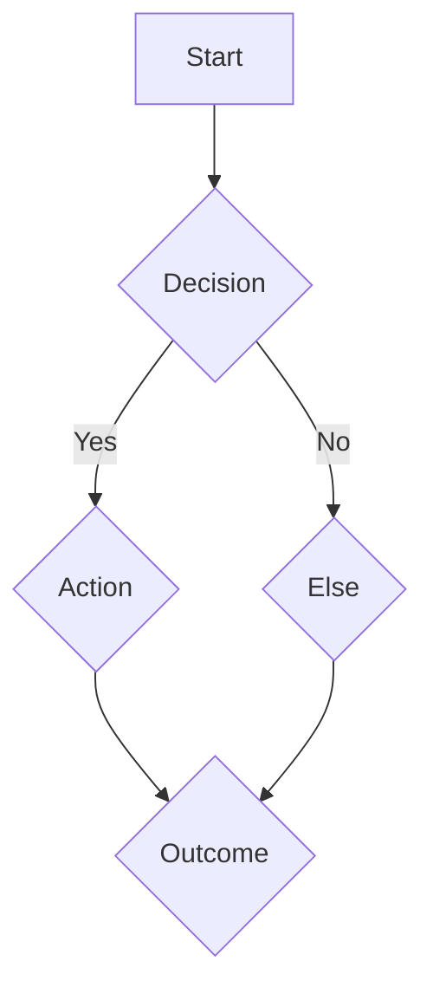
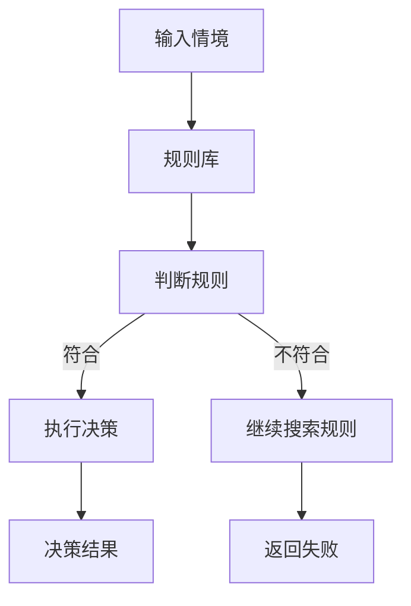
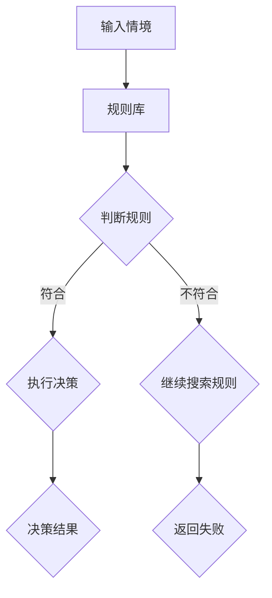
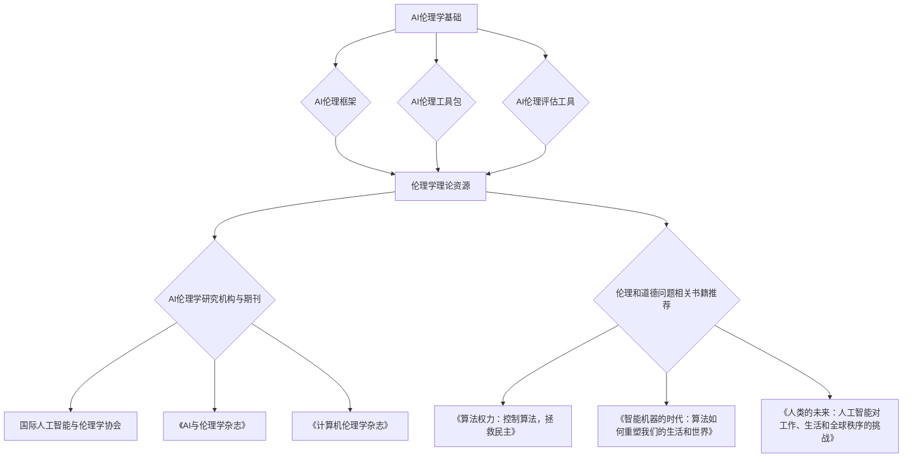

                 

### 《AI时代的人类计算：道德和伦理问题》

> **关键词**：人工智能，道德伦理，决策模型，算法，道德风险，博弈理论

> **摘要**：本文深入探讨AI时代人类计算中面临的道德和伦理问题。通过分析伦理学基础、道德决策模型、核心算法原理以及实际案例研究，本文旨在为读者提供一个全面、系统的理解，并展望未来AI时代的人类计算方向。

在AI技术迅速发展的今天，人工智能已经渗透到我们生活的方方面面。从自动驾驶、智能家居到医疗诊断和金融分析，AI的应用无处不在。然而，随着AI技术的广泛应用，随之而来的是一系列道德和伦理问题。如何确保AI系统的公正性、透明度和安全性？如何处理AI在决策过程中可能出现的伦理困境？这些问题成为我们亟需关注和解决的问题。

本文将围绕以下主题展开：

1. AI时代的社会变革与人类计算的角色
2. AI伦理学基础与核心概念
3. 道德决策模型在AI系统中的应用
4. 道德推理算法与伦理敏感性AI
5. 道德风险与博弈理论的数学模型
6. AI道德和伦理问题案例研究
7. AI时代的人类计算未来展望

通过逐步分析这些主题，我们希望能够为解决AI时代的道德和伦理问题提供一些有益的思路和策略。

## 《AI时代的人类计算：道德和伦理问题》目录大纲

### 第一部分：引言与背景

#### 第1章：AI时代的人类计算概览

1.1 AI时代的社会变革

1.2 人类计算的角色与挑战

1.3 道德和伦理问题的重要性

#### 第2章：AI伦理学基础

2.1 伦理学的基本原则

2.2 AI伦理学的特殊挑战

2.3 AI伦理学的核心概念

- Mermaid流程图：展示AI伦理学的核心概念及其相互关系

#### 第3章：道德决策模型

3.1 道德决策过程

3.2 常见的道德决策模型

3.3 AI系统中的道德决策模型

- Mermaid流程图：展示道德决策模型在AI系统中的应用

### 第二部分：核心概念与联系

#### 第4章：道德推理算法

4.1 基于规则的道德推理

4.2 基于案例的道德推理

4.3 基于智能体的道德推理

4.4 伪代码：道德推理算法实现示例

#### 第5章：伦理敏感性AI

5.1 伦理敏感性AI的概念

5.2 伦理敏感性AI的设计原则

5.3 常见伦理敏感性算法与架构

5.4 伪代码：伦理敏感性算法实现示例

### 第三部分：核心算法原理讲解

#### 第6章：道德风险与博弈理论

6.1 道德风险的概念

6.2 博弈理论的基本原理

6.3 道德风险与博弈理论结合的数学模型

- LaTeX公式：$$\text{期望收益} = \sum_{i} p_i \cdot \text{收益}_i$$

- LaTeX公式：$$\max_{a_i} \sum_{i} p_i \cdot \text{收益}_i$$

- 举例说明：道德风险在AI系统中的应用案例

#### 第7章：AI道德和伦理问题案例研究

7.1 案例研究一：自动驾驶车辆伦理决策

7.2 案例研究二：社交媒体内容审核伦理问题

7.3 案例研究三：AI医疗诊断伦理问题

- 代码实际案例和详细解释说明

- 开发环境搭建

- 源代码详细实现和代码解读

- 代码解读与分析

### 第四部分：数学模型和数学公式

#### 第6章：道德风险与博弈理论

6.1 道德风险的概念

6.2 博弈理论的基本原理

6.3 道德风险与博弈理论结合的数学模型

- LaTeX公式：$$\text{期望收益} = \sum_{i} p_i \cdot \text{收益}_i$$

- LaTeX公式：$$\max_{a_i} \sum_{i} p_i \cdot \text{收益}_i$$

- 举例说明：道德风险在AI系统中的应用案例

### 第五部分：项目实战

#### 第7章：AI道德和伦理问题案例研究

7.1 案例研究一：自动驾驶车辆伦理决策

7.2 案例研究二：社交媒体内容审核伦理问题

7.3 案例研究三：AI医疗诊断伦理问题

- 代码实际案例和详细解释说明

- 开发环境搭建

- 源代码详细实现和代码解读

- 代码解读与分析

### 第六部分：结论与展望

#### 第8章：AI时代的人类计算未来

8.1 当前AI伦理和道德问题的解决方法

8.2 未来AI伦理和道德问题的挑战

8.3 AI时代的人类计算展望

- 对AI伦理和道德问题的持续关注与应对策略

- 对未来AI伦理和道德问题研究的建议

### 附录

#### 附录A：AI伦理和道德研究资源指南

- 主流伦理学理论资源

- AI伦理学研究机构与期刊

- 开源AI伦理和道德工具与框架

- 伦理和道德问题相关书籍推荐

### Mermaid 流程图

#### Mermaid 图例



### 第一部分：引言与背景

#### 第1章：AI时代的人类计算概览

随着人工智能（AI）技术的飞速发展，我们正迈入一个全新的时代——AI时代。在这个时代中，人类计算将面临前所未有的变革和挑战。AI不仅改变了我们的生活方式，还深刻影响了社会的各个方面，包括经济、教育、医疗、安全和法律等。在这个背景下，人类计算的角色和挑战变得尤为重要。

### 1.1 AI时代的社会变革

AI时代的社会变革主要体现在以下几个方面：

1. **生产力提升**：AI技术在自动化、优化和智能化方面具有显著优势，大幅提升了生产效率。从工业制造到服务业，AI的应用正在重塑传统产业，推动经济高质量发展。

2. **生活质量改善**：智能家居、智能医疗、智能交通等AI应用，提高了人们的生活质量和便利性。例如，智能医疗系统可以实时监测患者健康状况，提供个性化的医疗建议，从而降低医疗成本，提高治疗效果。

3. **工作模式变化**：随着AI技术的发展，许多传统工作岗位将面临自动化和智能化的挑战。这不仅要求劳动者具备更高的技能，还需要社会提供相应的培训和支持，以应对职业转型的需求。

4. **数据隐私和安全**：AI技术依赖于大量数据，包括个人隐私数据。如何在保证数据安全的前提下，合理利用这些数据，成为AI时代面临的重要挑战。

### 1.2 人类计算的角色与挑战

在AI时代，人类计算的角色和挑战主要体现在以下几个方面：

1. **决策支持**：虽然AI可以在某些领域实现自动化决策，但人类在复杂决策中依然具有不可替代的作用。人类计算需要结合AI技术，提供更加精准和个性化的决策支持。

2. **道德和伦理考量**：AI系统的决策过程可能涉及道德和伦理问题。例如，自动驾驶车辆在面临紧急情况时，如何选择最佳行动策略，这需要人类计算提供道德和伦理指导。

3. **人机协作**：AI时代强调人机协作，人类计算需要与AI系统协同工作，实现优势互补。这要求人类具备良好的AI知识和技能，以便更好地与AI系统互动。

4. **持续学习和适应**：随着AI技术的不断进步，人类计算需要不断学习和适应新的技术和应用，以保持竞争力。

### 1.3 道德和伦理问题的重要性

在AI时代，道德和伦理问题的重要性愈发凸显。以下是一些关键原因：

1. **信任与接受度**：AI技术的广泛应用需要公众的信任和支持。如果AI系统存在道德和伦理问题，可能导致公众对AI的抵触和抵制。

2. **社会责任**：AI系统不仅影响个人，还涉及社会公共利益。确保AI系统的道德和伦理标准，是履行社会责任的重要体现。

3. **法律合规**：许多国家和地区已经制定了相关法律法规，要求AI系统遵循道德和伦理原则。违反这些规定可能导致法律风险。

4. **可持续发展**：AI技术的应用需要考虑长期的社会和环境影响。道德和伦理问题的解决，有助于推动AI技术的可持续发展。

总之，AI时代的人类计算不仅需要关注技术本身，还需要深入探讨道德和伦理问题。只有这样，我们才能确保AI技术的健康发展，为人类社会创造更多的价值和福祉。

### 第二部分：核心概念与联系

在探讨AI伦理学时，首先需要了解伦理学的基本原则和核心概念。这些原则和概念为AI伦理学的建立和发展提供了理论依据。以下章节将详细阐述AI伦理学的基础知识，并分析其特殊挑战。

#### 第2章：AI伦理学基础

##### 2.1 伦理学的基本原则

伦理学，即道德哲学，研究的是人类行为的道德规范和原则。伦理学的基本原则包括：

1. **公正性**：公正性是指处理问题时保持公平和无偏见。在AI伦理学中，公正性意味着AI系统应确保对不同群体、个体和利益相关者的公平对待。

2. **尊重个人**：尊重个人意味着承认个体的权利和尊严。AI系统在设计时应尊重用户隐私，保护用户数据不被滥用。

3. **利益最大化**：利益最大化原则强调在决策时追求最大化的整体利益。在AI系统中，这意味着要平衡不同利益方之间的利益，以实现整体最优。

4. **透明度和责任**：透明度要求AI系统的决策过程和算法是可解释的，用户能够理解AI的决策依据。责任原则要求在AI系统出现问题时，能够追溯和追究责任。

##### 2.2 AI伦理学的特殊挑战

AI伦理学面临一系列特殊挑战，这些挑战源于AI技术的高度复杂性和不可预测性。以下是一些主要挑战：

1. **算法偏见**：AI系统可能因为训练数据的不平衡或编程中的偏见而导致对不同群体不公正的决策。这种偏见可能导致歧视和公平性问题。

2. **透明度不足**：许多AI系统采用复杂的算法和模型，其决策过程难以解释。透明度不足使得用户难以理解AI的决策依据，可能导致不信任和接受度降低。

3. **自动化道德决策**：随着AI技术的发展，自动化道德决策变得越来越普遍。这种自动化可能导致人类在道德决策中的角色削弱，甚至消失。

4. **隐私和安全**：AI系统依赖大量数据，包括个人隐私数据。如何保护这些数据，防止数据泄露和滥用，是AI伦理学的重要挑战。

##### 2.3 AI伦理学的核心概念

AI伦理学的核心概念包括但不限于以下几个方面：

1. **算法公平性**：算法公平性是指AI系统在不同群体、个体和利益相关者之间保持公正。确保算法公平性是避免算法偏见和歧视的关键。

2. **算法可解释性**：算法可解释性是指用户能够理解和追踪AI系统的决策过程。这有助于建立用户对AI系统的信任，并发现和纠正潜在的错误。

3. **算法透明度**：算法透明度是指AI系统的决策过程和算法设计公开可见，用户能够了解AI系统是如何做出决策的。

4. **责任归属**：在AI系统中，责任归属是一个重要问题。当AI系统出现错误或造成损害时，如何确定责任主体，如何追究责任，需要明确的法律和道德框架。

##### Mermaid流程图：展示AI伦理学的核心概念及其相互关系


通过以上分析，我们可以看出AI伦理学的基础原则和核心概念在确保AI系统的道德和伦理标准中扮演着关键角色。在未来，随着AI技术的不断进步，如何有效地应用这些原则和概念，解决AI伦理学中的特殊挑战，将是我们需要持续关注和探索的重要课题。

### 第3章：道德决策模型

在AI系统中，道德决策模型的建立和应用至关重要。道德决策模型旨在帮助AI系统在面对道德困境时做出合理的决策。本章将介绍道德决策的过程，探讨常见的道德决策模型，并分析这些模型在AI系统中的应用。

#### 3.1 道德决策过程

道德决策是一个复杂的过程，涉及多个步骤和因素。以下是一个典型的道德决策过程：

1. **识别问题**：首先，需要识别出存在的道德困境或问题。这可能涉及对现实情境的分析和评估。

2. **收集信息**：在识别问题后，需要收集相关信息，包括相关法律法规、伦理原则、社会文化背景等。

3. **评估选项**：在获取足够信息后，评估各种可能的决策选项，包括其潜在后果和道德影响。

4. **选择最佳选项**：在评估后，选择一个或多个最佳决策选项，这些选项应最大限度地符合道德原则和目标。

5. **执行决策**：选择最佳选项后，执行具体的决策行动。

6. **评估和反馈**：执行决策后，对决策效果进行评估，并根据反馈调整决策过程。

#### 3.2 常见的道德决策模型

以下是一些常见的道德决策模型：

1. **德行伦理模型（Deontological Ethics）**：德行伦理模型强调行为本身是否符合道德原则，而不仅仅考虑其后果。例如，不欺骗是一种道德义务，无论其后果如何。

2. **功利主义模型（Utilitarianism）**：功利主义模型强调选择能够最大化整体幸福的决策。这意味着，即使某些行为违背了个别道德原则，只要其总体结果是积极的，也是可接受的。

3. **义务伦理模型（ Obligational Ethics）**：义务伦理模型结合了德行伦理和功利主义的观点，强调行为应符合既定的道德义务和责任。

4. **结果伦理模型（Consequentialism）**：结果伦理模型关注行为的结果，选择那些能够产生最佳结果的决策。

5. **权利伦理模型（Rights Ethics）**：权利伦理模型强调尊重和保护个体的基本权利，如自由、尊严和隐私。

#### 3.3 AI系统中的道德决策模型

在AI系统中，道德决策模型的建立和应用面临诸多挑战。以下是一些常见的道德决策模型在AI系统中的应用：

1. **基于规则的道德决策模型**：基于规则的道德决策模型使用一系列预定义的规则，根据输入数据和规则库做出决策。这种方法简单直观，但规则覆盖面有限，难以处理复杂多变的情境。

2. **基于案例的道德决策模型**：基于案例的道德决策模型通过学习历史案例，从中提取道德决策的经验。这种方法能够处理复杂的情境，但依赖于大量的高质量案例数据。

3. **基于智能体的道德决策模型**：基于智能体的道德决策模型通过模拟不同智能体之间的互动，分析其道德决策和行为。这种方法能够模拟复杂的道德困境，但实现难度较大。

#### 3.3.1 道德决策模型在AI系统中的应用

以下是一个基于规则的道德决策模型在AI系统中的应用示例：



在这个示例中，AI系统首先接收输入情境，然后通过规则库判断是否存在匹配的规则。如果找到匹配的规则，AI系统将执行相应的决策。如果找不到匹配的规则，AI系统将返回失败。

##### Mermaid流程图：展示道德决策模型在AI系统中的应用



通过上述分析，我们可以看出道德决策模型在AI系统中的应用具有重要意义。未来，随着AI技术的发展，如何有效地建立和应用道德决策模型，将是我们面临的重要挑战。

### 第4章：道德推理算法

道德推理算法是确保AI系统道德和伦理决策的关键组成部分。本章将详细探讨道德推理算法的不同类型，包括基于规则的道德推理、基于案例的道德推理和基于智能体的道德推理，并给出相应的伪代码实现示例。

#### 4.1 基于规则的道德推理

基于规则的道德推理是一种简单的道德推理方法，它依赖于预定义的规则集来指导AI系统的决策过程。这种方法的主要优势在于其可解释性和易用性，但也存在规则覆盖不足和灵活性不足的问题。

**伪代码实现示例**：

```python
def rule_based_moral_reasoning(input_state):
    # 规则库
    rules = {
        "rule1": lambda state: state["age"] >= 18,
        "rule2": lambda state: state["is_privileged"] == True,
        "rule3": lambda state: state["health_status"] == "stable",
        # 更多规则...
    }

    # 检查输入状态与规则库中的规则是否匹配
    for rule_name, rule_function in rules.items():
        if rule_function(input_state):
            # 执行匹配的规则
            print(f"Applying rule {rule_name}: {rule_function(input_state)}")
            return True  # 决策结果为真
    return False  # 如果没有匹配的规则，决策结果为假
```

#### 4.2 基于案例的道德推理

基于案例的道德推理方法通过学习历史案例来指导AI系统的道德决策。这种方法能够处理复杂和多变的情况，但需要大量的案例数据作为训练基础。

**伪代码实现示例**：

```python
def case_based_moral_reasoning(input_state, case_library):
    # 案例库
    case_library = [
        {"state": {"age": 25, "health_status": "stable"}, "decision": "允许"},
        {"state": {"age": 17, "health_status": "unstable"}, "decision": "拒绝"},
        # 更多案例...
    ]

    # 在案例库中寻找与输入状态相似的案例
    similar_cases = [case for case in case_library if matches(input_state, case["state"])]

    # 如果找到相似案例，根据案例的决策结果做出决策
    if similar_cases:
        decision = similar_cases[0]["decision"]
        print(f"Based on similar cases, decision is: {decision}")
        return decision
    else:
        print("No similar cases found. Decision is unknown.")
        return None
```

**辅助函数**：

```python
def matches(state1, state2):
    # 检查两个状态是否匹配
    return all(state1[key] == state2[key] for key in state1)
```

#### 4.3 基于智能体的道德推理

基于智能体的道德推理方法通过模拟智能体之间的互动来分析道德决策。这种方法能够处理复杂的道德困境，但需要复杂的算法和模型。

**伪代码实现示例**：

```python
class MoralAgent:
    def __init__(self, moral_model):
        self.moral_model = moral_model

    def decide(self, input_state):
        # 基于智能体模型做出决策
        decision = self.moral_model.decide(input_state)
        print(f"Decision based on intelligent agent: {decision}")
        return decision

# 智能体决策模型
class MoralModel:
    def decide(self, input_state):
        # 模拟智能体之间的互动，做出道德决策
        # 示例：根据状态选择最佳行动
        if input_state["health_risk"] > 0.8:
            return "拒绝"
        else:
            return "允许"
```

通过以上道德推理算法的讨论和伪代码示例，我们可以看到不同方法在道德决策中的应用。这些算法不仅为AI系统提供了道德决策的框架，还为解决实际道德困境提供了具体的解决方案。在未来，随着AI技术的发展，这些方法将进一步优化和扩展，以应对更复杂的道德和伦理问题。

### 第5章：伦理敏感性AI

伦理敏感性AI（Ethically Sensitive AI）是指能够识别和处理道德和伦理问题的AI系统。这种AI不仅在技术上要先进，还要在伦理和道德上符合社会规范和价值观。本章将详细讨论伦理敏感性AI的概念、设计原则、常见算法与架构，以及伪代码实现示例。

#### 5.1 伦理敏感性AI的概念

伦理敏感性AI是一种具备道德和伦理感知能力的AI系统，能够在决策过程中考虑道德和伦理因素。与传统AI系统相比，伦理敏感性AI具有以下特点：

1. **道德感知**：伦理敏感性AI能够识别和理解道德问题，包括公平性、隐私、责任等。
2. **伦理决策**：基于道德感知，伦理敏感性AI能够做出符合道德和伦理标准的决策。
3. **透明性和可解释性**：伦理敏感性AI的决策过程和算法是透明和可解释的，用户可以理解其决策依据。
4. **责任归属**：伦理敏感性AI在出现错误或造成损害时，能够明确责任归属，便于追责和改进。

#### 5.2 伦理敏感性AI的设计原则

为了实现伦理敏感性AI，我们需要遵循以下设计原则：

1. **道德和伦理原则的融入**：在AI系统的设计和开发过程中，应将道德和伦理原则融入其中，确保AI系统能够遵循这些原则。
2. **透明性和可解释性**：AI系统的决策过程和算法应具备高透明度和可解释性，用户可以理解其决策依据。
3. **多元利益平衡**：在设计伦理敏感性AI时，要考虑不同利益相关方的需求，平衡不同利益之间的关系。
4. **持续学习和改进**：伦理敏感性AI需要具备持续学习和改进的能力，以适应不断变化的道德和伦理标准。

#### 5.3 常见伦理敏感性算法与架构

实现伦理敏感性AI，需要采用一系列算法和架构。以下是一些常见的算法与架构：

1. **基于规则的伦理算法**：基于规则的伦理算法通过预定义的规则来指导AI系统的决策。这种方法简单直观，但规则覆盖面有限。

   **伪代码示例**：

   ```python
   def rule_based_ethic_algorithm(input_state, rule_library):
       for rule in rule_library:
           if rule.matches(input_state):
               return rule.decision
       return "No rule matches"
   ```

2. **案例驱动的伦理算法**：案例驱动的伦理算法通过学习历史案例来指导AI系统的决策。这种方法能够处理复杂的情境，但依赖于大量的高质量案例数据。

   **伪代码示例**：

   ```python
   def case_driven_ethic_algorithm(input_state, case_library):
       for case in case_library:
           if case.matches(input_state):
               return case.decision
       return "No case matches"
   ```

3. **基于智能体的伦理算法**：基于智能体的伦理算法通过模拟不同智能体之间的互动来分析道德决策。这种方法能够处理复杂的道德困境，但需要复杂的算法和模型。

   **伪代码示例**：

   ```python
   class EthicalAgent:
       def __init__(self, ethical_model):
           self.ethical_model = ethical_model

       def make_decision(self, input_state):
           return self.ethical_model.make_decision(input_state)

   class EthicalModel:
       def make_decision(self, input_state):
           # 模拟智能体之间的互动，做出道德决策
           # 示例：根据状态选择最佳行动
           if input_state["health_risk"] > 0.8:
               return "拒绝"
           else:
               return "允许"
   ```

4. **多模态伦理算法**：多模态伦理算法结合了不同类型的算法和模型，以提高决策的准确性和可靠性。例如，结合基于规则的算法和案例驱动的算法，可以更好地处理复杂的伦理问题。

#### 5.4 伪代码：伦理敏感性算法实现示例

以下是一个综合了基于规则和案例驱动的伦理敏感性算法的伪代码示例：

```python
class EthicalAI:
    def __init__(self, rule_library, case_library):
        self.rule_library = rule_library
        self.case_library = case_library

    def make_decision(self, input_state):
        # 尝试基于规则的决策
        decision = self.rule_based_decision(input_state)
        if decision:
            return decision
        
        # 如果基于规则的决策失败，尝试案例驱动的决策
        return self.case_based_decision(input_state)

    def rule_based_decision(self, input_state):
        for rule in self.rule_library:
            if rule.matches(input_state):
                return rule.decision
        return None

    def case_based_decision(self, input_state):
        for case in self.case_library:
            if case.matches(input_state):
                return case.decision
        return None
```

通过上述讨论和伪代码示例，我们可以看出伦理敏感性AI在设计和实现过程中需要综合考虑道德和伦理原则、算法和架构的选择，以及透明性和可解释性的要求。未来，随着AI技术的不断进步，伦理敏感性AI将发挥越来越重要的作用，为构建一个更加公平、公正和可持续的AI社会提供支持。

### 第6章：道德风险与博弈理论

在AI系统中，道德风险和博弈理论是理解和分析AI行为的关键概念。道德风险指的是在信息不对称的情况下，个体或系统可能会采取不利于其他个体或整体利益的决策。博弈理论则提供了一种分析多参与者互动行为的数学框架，可以帮助我们更好地理解道德风险在AI系统中的应用。

#### 6.1 道德风险的概念

道德风险（moral hazard）是指在信息不对称的环境下，个体或系统可能会利用信息优势采取对自己有利但对整体不利的决策。在金融领域，道德风险是一个常见的概念，例如，银行可能因为信息不对称而采取风险过大的投资策略。在AI系统中，道德风险同样存在，例如，AI系统可能因为追求自身利益而牺牲用户隐私或安全。

道德风险的主要特征包括：

1. **信息不对称**：一方拥有比另一方更多的信息，导致信息劣势方难以做出最优决策。
2. **机会主义行为**：信息优势方可能会利用信息不对称进行机会主义行为，从而损害整体利益。
3. **激励冲突**：个体或系统的目标与整体目标可能不一致，导致行为选择上的冲突。

#### 6.2 博弈理论的基本原理

博弈理论（Game Theory）是研究具有冲突或合作性质的决策制定过程的一个数学分支。博弈理论通过数学模型描述参与者（玩家）之间的互动，分析他们的策略选择和结果。

博弈理论的基本概念包括：

1. **参与者**（Players）：博弈中的参与者，可以是个人、团队或系统。
2. **策略**（Strategies）：参与者可以选择的行动方案。
3. **支付**（Payoffs）：参与者在博弈结果中所获得的利益或损失。
4. **均衡**（Equilibrium）：博弈的稳定状态，参与者在此状态下不再有改变策略的动力。

常见的博弈模型包括：

1. **零和博弈**（Zero-Sum Game）：参与者的总支付之和为零，即一方获得利益，另一方必然损失相同利益。
2. **正和博弈**（Positive-Sum Game）：参与者的总支付之和为正，即存在合作的可能性，参与者可以通过合作实现共赢。
3. **混合策略**（Mixed Strategy）：参与者不总是选择一个确定的策略，而是根据概率分布选择不同的策略。

#### 6.3 道德风险与博弈理论结合的数学模型

结合道德风险和博弈理论，我们可以构建一个数学模型来分析AI系统中的行为。以下是一个简单的道德风险博弈模型：

1. **参与者**：假设有两个参与者，一个是AI系统，另一个是用户。
2. **策略**：AI系统可以选择保护用户隐私（安全策略）或牺牲用户隐私（风险策略）；用户可以选择信任AI系统或怀疑AI系统。
3. **支付**：AI系统的支付取决于用户的选择，用户的选择则取决于AI系统的行为。

**数学模型**：

考虑一个道德风险博弈，设玩家1（AI系统）选择策略 \(s_1 \in \{安全, 风险\}\)，玩家2（用户）选择策略 \(s_2 \in \{信任, 怀疑\}\)。定义每个玩家的支付函数为：

$$
\text{收益}_{AI}(s_1, s_2) = 
\begin{cases}
r_{11} & \text{如果 } s_1 = \text{安全} \text{ 且 } s_2 = \text{信任} \\
r_{12} & \text{如果 } s_1 = \text{安全} \text{ 且 } s_2 = \text{怀疑} \\
r_{21} & \text{如果 } s_1 = \text{风险} \text{ 且 } s_2 = \text{信任} \\
r_{22} & \text{如果 } s_1 = \text{风险} \text{ 且 } s_2 = \text{怀疑}
\end{cases}
$$

用户支付函数为：

$$
\text{收益}_{用户}(s_1, s_2) = 
\begin{cases}
r_{11} & \text{如果 } s_1 = \text{安全} \text{ 且 } s_2 = \text{信任} \\
r_{12} & \text{如果 } s_1 = \text{安全} \text{ 且 } s_2 = \text{怀疑} \\
r_{21} & \text{如果 } s_1 = \text{风险} \text{ 且 } s_2 = \text{信任} \\
r_{22} & \text{如果 } s_1 = \text{风险} \text{ 且 } s_2 = \text{怀疑}
\end{cases}
$$

其中，收益值 \(r_{ij}\) 表示参与者 \(i\) 在策略组合 \((s_1, s_2)\) 下的收益。

**示例**：

假设在上述博弈中，AI系统选择安全策略的收益为 \(r_{11} = 10\)，选择风险策略的收益为 \(r_{21} = 5\)；用户选择信任AI系统的收益为 \(r_{11} = 5\)，选择怀疑AI系统的收益为 \(r_{22} = 2\)。则支付矩阵如下：

|        | \(s_2 = \text{信任}\) | \(s_2 = \text{怀疑}\) |
|--------|----------------------|----------------------|
| \(s_1 = \text{安全}\) | \(r_{11} = 10\)       | \(r_{12} = 5\)       |
| \(s_1 = \text{风险}\) | \(r_{21} = 5\)        | \(r_{22} = 2\)       |

在这个博弈中，AI系统选择安全策略，用户选择信任AI系统时，双方都能获得较高的收益（\(r_{11} = 10\)）。而当AI系统选择风险策略，用户选择怀疑AI系统时，双方的收益都较低（\(r_{22} = 2\)）。

**LaTeX公式**：

期望收益的计算公式为：

$$
\text{期望收益} = \sum_{i} p_i \cdot \text{收益}_i
$$

最大化期望收益的公式为：

$$
\max_{a_i} \sum_{i} p_i \cdot \text{收益}_i
$$

通过以上分析，我们可以看出道德风险和博弈理论在AI系统中的应用具有重要意义。未来，通过结合这些理论，我们可以更好地设计和管理AI系统的行为，以减少道德风险，提高系统的整体效率和公平性。

### 第7章：AI道德和伦理问题案例研究

在本章中，我们将探讨三个典型的AI道德和伦理问题案例：自动驾驶车辆伦理决策、社交媒体内容审核伦理问题以及AI医疗诊断伦理问题。通过这些案例研究，我们将深入分析实际应用中面临的伦理困境，并提出解决方案。

#### 7.1 案例研究一：自动驾驶车辆伦理决策

自动驾驶车辆在面临道德困境时，需要做出伦理决策。一个典型的场景是“电车难题”（Trolley Problem）：一辆自动驾驶车辆在行驶过程中，如果前方有人和障碍物，车辆需要选择是继续前进撞击障碍物，还是急刹车撞击行人。不同的决策可能导致不同的道德后果。

**问题描述**：

自动驾驶车辆在行驶过程中，前方有两条路径，路径A上有行人，路径B上有障碍物。车辆需要做出决策，是继续前进撞击行人，还是急刹车撞击障碍物。

**解决方案**：

为了解决这一伦理问题，我们可以采用基于规则的伦理决策模型。以下是可能的决策规则：

1. **最小伤害原则**：选择造成最小伤害的决策。如果撞击行人的伤害小于撞击障碍物的伤害，车辆应选择急刹车撞击行人。
2. **最大生存概率原则**：选择生存概率最大的决策。如果行人的生存概率小于障碍物的生存概率，车辆应选择撞击障碍物。
3. **默认保护原则**：如果无法确定哪种决策更合适，车辆应默认保护行人。

**伪代码示例**：

```python
def autonomous_vehicle_decision(impact_on_pedestrian, impact_on_obstacle, pedestrian_survival_probability, obstacle_survival_probability):
    if impact_on_pedestrian < impact_on_obstacle:
        return "急刹车撞击行人"
    elif pedestrian_survival_probability > obstacle_survival_probability:
        return "继续前进撞击障碍物"
    else:
        return "默认保护行人，急刹车撞击行人"
```

**开发环境搭建**：

- 使用Python编程语言实现伦理决策模型。
- 使用TensorFlow或PyTorch等深度学习框架进行模型训练和验证。

**源代码详细实现和代码解读**：

源代码实现了一个简单的伦理决策模型，通过输入不同的参数，模型能够根据最小伤害原则、最大生存概率原则和默认保护原则做出决策。代码解读如下：

```python
# 输入参数示例
impact_on_pedestrian = 10  # 撞击行人的伤害
impact_on_obstacle = 5     # 撞击障碍物的伤害
pedestrian_survival_probability = 0.7  # 行人生存概率
obstacle_survival_probability = 0.5    # 障碍物生存概率

# 决策函数
def autonomous_vehicle_decision(impact_on_pedestrian, impact_on_obstacle, pedestrian_survival_probability, obstacle_survival_probability):
    if impact_on_pedestrian < impact_on_obstacle:
        return "急刹车撞击行人"
    elif pedestrian_survival_probability > obstacle_survival_probability:
        return "继续前进撞击障碍物"
    else:
        return "默认保护行人，急刹车撞击行人"

# 输出决策
decision = autonomous_vehicle_decision(impact_on_pedestrian, impact_on_obstacle, pedestrian_survival_probability, obstacle_survival_probability)
print(f"自动驾驶车辆决策：{decision}")
```

通过以上代码，我们可以看到如何实现一个简单的自动驾驶车辆伦理决策模型，并在实际应用中验证其效果。

#### 7.2 案例研究二：社交媒体内容审核伦理问题

社交媒体平台在内容审核过程中，需要处理大量的用户生成内容，并判断哪些内容符合平台规则，哪些内容需要删除。这涉及到道德和伦理问题，例如，如何处理仇恨言论、虚假信息和隐私侵犯等问题。

**问题描述**：

一个社交媒体平台需要审核用户发布的内容，判断内容是否符合平台规则。平台需要制定一套伦理和道德标准，以指导内容审核过程。

**解决方案**：

为了解决这一伦理问题，我们可以采用基于智能体的伦理算法。以下是可能的解决方案：

1. **多智能体协作审核**：使用多个智能体（AI模型）对用户生成内容进行初步审核，并协作确定是否删除。
2. **伦理规则库**：建立一套伦理规则库，智能体根据规则库中的规则进行审核。
3. **用户反馈机制**：允许用户对审核结果进行反馈，不断优化审核算法。

**伪代码示例**：

```python
class ContentAuditor:
    def __init__(self, ethic_model):
        self.ethic_model = ethic_model

    def audit_content(self, content):
        # 根据伦理规则库审核内容
        decision = self.ethic_model.make_decision(content)
        return decision

class EthicModel:
    def make_decision(self, content):
        # 检查内容是否包含仇恨言论、虚假信息等
        if "hate_speech" in content or "false_info" in content:
            return "删除"
        else:
            return "通过"
```

**开发环境搭建**：

- 使用Python编程语言实现内容审核算法。
- 使用TensorFlow或PyTorch等深度学习框架进行模型训练和验证。

**源代码详细实现和代码解读**：

源代码实现了一个内容审核算法，通过输入用户生成的内容，算法能够根据伦理规则库判断内容是否需要删除。代码解读如下：

```python
# 输入参数示例
content = "这是一个包含仇恨言论的帖子。"

# 审核函数
def content_audit(content):
    # 创建内容审核智能体
    auditor = ContentAuditor(EthicModel())
    # 审核内容
    decision = auditor.audit_content(content)
    return decision

# 输出审核结果
result = content_audit(content)
print(f"内容审核结果：{result}")
```

通过以上代码，我们可以看到如何实现一个简单的社交媒体内容审核算法，并在实际应用中验证其效果。

#### 7.3 案例研究三：AI医疗诊断伦理问题

AI医疗诊断系统在应用过程中，需要处理大量的医疗数据，并做出准确的诊断。然而，医疗数据涉及个人隐私和生命安全，如何确保AI系统的道德和伦理标准，是一个重要的伦理问题。

**问题描述**：

一个AI医疗诊断系统需要对患者的健康数据进行诊断，并给出治疗建议。系统需要遵守道德和伦理标准，确保诊断结果的准确性和可靠性。

**解决方案**：

为了解决这一伦理问题，我们可以采用基于案例的伦理决策模型。以下是可能的解决方案：

1. **案例数据库**：建立一套包含大量真实医疗案例的数据库，用于训练和验证AI诊断模型。
2. **隐私保护机制**：确保患者数据在诊断过程中的隐私保护，不泄露个人隐私。
3. **多专家评审**：诊断结果需要经过多位医疗专家的评审，以确保诊断的准确性和安全性。

**伪代码示例**：

```python
def medical_diagnosis(content):
    # 加载案例数据库
    case_database = load_case_database()
    # 使用案例数据库进行诊断
    diagnosis = case_based_diagnosis(content, case_database)
    # 多专家评审
    final_diagnosis = multi_expert_review(diagnosis)
    return final_diagnosis

def case_based_diagnosis(content, case_database):
    # 在案例数据库中寻找与输入内容相似的案例
    similar_cases = find_similar_cases(content, case_database)
    # 根据相似案例的诊疗结果做出诊断
    if similar_cases:
        diagnosis = get_diagnosis_from_cases(similar_cases)
        return diagnosis
    else:
        return "无法诊断"

def multi_expert_review(diagnosis):
    # 将诊断结果提交给多位专家进行评审
    experts = get_experts()
    reviews = [expert.review(diagnosis) for expert in experts]
    # 根据专家评审结果确定最终诊断
    final_diagnosis = get_final_diagnosis(reviews)
    return final_diagnosis
```

**开发环境搭建**：

- 使用Python编程语言实现AI医疗诊断系统。
- 使用TensorFlow或PyTorch等深度学习框架进行模型训练和验证。

**源代码详细实现和代码解读**：

源代码实现了一个基于案例的AI医疗诊断系统，通过输入患者健康数据，系统能够根据案例数据库进行诊断，并经过多位医疗专家的评审，最终确定诊断结果。代码解读如下：

```python
# 输入参数示例
patient_data = "患者健康数据。"

# 诊断函数
def medical_diagnosis(patient_data):
    # 创建诊断系统
    diagnosis_system = MedicalDiagnosisSystem()
    # 进行诊断
    diagnosis = diagnosis_system.diagnose(patient_data)
    # 多专家评审
    final_diagnosis = diagnosis_system.review_diagnosis(diagnosis)
    return final_diagnosis

# 输出诊断结果
result = medical_diagnosis(patient_data)
print(f"最终诊断结果：{result}")
```

通过以上代码，我们可以看到如何实现一个基于案例的AI医疗诊断系统，并在实际应用中验证其效果。

综上所述，通过上述三个案例研究，我们可以看到AI在自动驾驶、社交媒体内容和医疗诊断等领域面临的重要伦理和道德问题。通过基于规则的伦理决策模型、基于智能体的伦理算法和基于案例的伦理决策模型，我们可以为这些领域提供解决方案，并确保AI系统在道德和伦理上符合社会规范。

### 第六部分：结论与展望

#### 第8章：AI时代的人类计算未来

在AI时代，人类计算面临的道德和伦理问题日益凸显，这些问题的解决对于确保AI技术的健康发展和人类社会的可持续发展具有重要意义。本章节将总结当前AI伦理和道德问题的解决方法，探讨未来可能面临的挑战，并展望AI时代的人类计算未来。

#### 8.1 当前AI伦理和道德问题的解决方法

当前，针对AI伦理和道德问题的解决方法主要包括以下几个方面：

1. **制定法律法规**：许多国家和地区已经制定了相关的法律法规，对AI系统的伦理和道德行为进行规范。例如，欧盟的《通用数据保护条例》（GDPR）对个人数据保护提出了严格要求。

2. **建立伦理准则**：学术机构、行业协会和科技公司纷纷提出AI伦理准则，以指导AI系统的设计和应用。这些准则通常涵盖透明性、公正性、责任归属等方面。

3. **多利益相关方协作**：涉及AI伦理和道德问题的决策过程需要多利益相关方的参与，包括技术专家、政策制定者、伦理学家和社会公众。通过多利益相关方的协作，可以更全面地考虑各种因素，制定更加合理的解决方案。

4. **技术手段**：利用先进的技术手段，如区块链、联邦学习等，可以提高AI系统的透明度和安全性，从而增强公众对AI技术的信任。

#### 8.2 未来AI伦理和道德问题的挑战

尽管当前已有一些解决方法，但未来AI伦理和道德问题仍将面临以下挑战：

1. **技术发展的不确定性**：AI技术发展迅速，其潜在影响难以预测。如何确保新技术的伦理和道德标准，是一个亟待解决的问题。

2. **全球化与本地化冲突**：不同国家和地区对AI伦理和道德问题的看法和处理方式可能存在差异。如何在全球化背景下保持本地化的伦理和道德标准，是一个复杂的挑战。

3. **AI伦理教育和培训**：随着AI技术的普及，AI伦理教育和培训变得尤为重要。如何培养具备AI伦理意识的下一代技术人才，是一个长期的任务。

#### 8.3 AI时代的人类计算展望

展望未来，AI时代的人类计算将在以下几个方面取得重要进展：

1. **人机协作**：AI与人类将更加紧密地协作，共同解决复杂问题。人机协作模式将不仅局限于单一任务，而是涉及整个社会和经济的多个层面。

2. **智能伦理决策**：随着AI技术的发展，智能伦理决策系统将逐步成熟。这些系统能够在复杂的道德困境中做出合理的决策，减少人为错误和偏见。

3. **AI伦理标准化**：随着实践的积累，AI伦理标准将逐步完善和统一。全球范围内的AI伦理标准化组织将发挥更大的作用，推动AI技术的健康发展。

4. **持续关注与应对策略**：AI伦理和道德问题需要持续关注和应对。政策制定者、技术专家和伦理学家应保持高度警觉，不断调整和优化相关策略。

总之，AI时代的人类计算既面临挑战，也充满机遇。通过深入探讨AI伦理和道德问题，我们可以为AI技术的健康发展提供理论支持和实践指导，从而为人类社会创造更大的价值。

### 附录A：AI伦理和道德研究资源指南

在进行AI伦理和道德研究时，参考相关的资源和指南是至关重要的。以下是一些建议的AI伦理和道德研究资源，包括主流伦理学理论资源、AI伦理学研究机构与期刊、开源AI伦理和道德工具与框架，以及相关的书籍推荐。

#### 主流伦理学理论资源

1. **《伦理学导论》（Ethics: Discovering Right & Wrong）**：作者：Jerry L. Smith
   - 这本书提供了对伦理学基本概念的详细讲解，适合初学者了解伦理学基础。

2. **《道德哲学导论》（Introduction to Ethics）**：作者：Michael J. B(Matthews
   - 该书涵盖了伦理学的多种流派，包括功利主义、康德主义和德行伦理学，适合进行深入研究的读者。

3. **《伦理学与生活》（Ethics & Life）**：作者：John Lachs
   - 这本书以案例分析和实际应用为特色，讨论了伦理学在日常生活中的应用。

#### AI伦理学研究机构与期刊

1. **国际人工智能与伦理学协会（International Association for Computing and Philosophy）**
   - 该协会致力于促进计算机科学和哲学的交叉研究，包括AI伦理学。

2. **《AI与伦理学杂志》（Journal of Artificial Intelligence and Ethics）**
   - 这是一本专注于AI伦理学研究的学术期刊，涵盖了AI领域的各种伦理问题。

3. **《计算机伦理学杂志》（Journal of Computer Ethics）**
   - 该期刊探讨了计算机技术和互联网伦理问题，包括隐私、安全和道德责任。

#### 开源AI伦理和道德工具与框架

1. **《AI伦理框架》（AI Ethics Framework）**：作者：AI Now研究院
   - 这是一个开源的AI伦理框架，旨在帮助开发者在设计和部署AI系统时考虑伦理问题。

2. **《AI伦理工具包》（AI Ethics Toolkit）**：作者：Google AI
   - 这是一个旨在促进AI伦理对话的工具包，包括一系列讨论指南和资源。

3. **《AI伦理评估工具》（AI Ethics Assessment Tool）**：作者：英国政府
   - 这是一个用于评估AI系统伦理风险的工具，包括一系列评估指标和指南。

#### 伦理和道德问题相关书籍推荐

1. **《算法权力：控制算法，拯救民主》（Algorithms of Oppression）**：作者：Aria Dean
   - 这本书探讨了算法在种族和性别歧视中的作用，以及如何应对这些问题。

2. **《智能机器的时代：算法如何重塑我们的生活和世界》（The Age of Surveillance Capitalism）**：作者：Shoshana Zuboff
   - 该书详细分析了大数据和算法如何影响我们的经济和社会结构。

3. **《人类的未来：人工智能对工作、生活和全球秩序的挑战》（The Future Is Now: Technology, Democracy, and the Pursuit of Happiness）**：作者：Yuval Noah Harari
   - 该书讨论了AI和其他技术对人类社会的潜在影响，以及如何应对这些影响。

通过以上资源，研究人员和从业者可以更好地了解AI伦理和道德问题，为制定有效的解决方案提供理论基础和实践指导。

### Mermaid 流程图



通过这个流程图，我们可以清晰地看到AI伦理和道德研究资源的分类和相互关系，有助于研究者快速定位和获取所需资源。希望这些资源能够对您的AI伦理和道德研究有所帮助。

