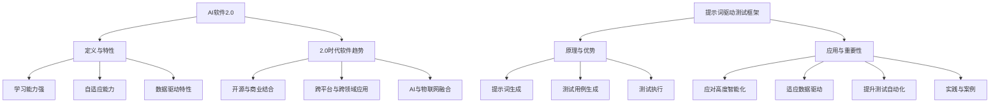

                 

### 第1章：AI软件2.0与提示词驱动测试框架的基本概念

#### 1.1 AI软件2.0的定义与特性

AI软件2.0，作为人工智能领域的重大飞跃，标志着人工智能技术从初期的“能够执行特定任务”向“具备自适应和自主决策能力”的转变。AI软件2.0的核心在于其强大的学习能力和自我优化能力，能够通过不断的学习和迭代，提升自身的性能和效率。

##### 1.1.1 AI软件2.0的定义

AI软件2.0是继AI软件1.0之后的下一代人工智能软件。AI软件1.0主要依赖于预定义的规则和固定的算法，而AI软件2.0则更加灵活和智能，能够自主学习和进化。它不仅仅局限于执行特定的任务，更能够根据环境的变化和新的数据，自我调整和优化其行为。

##### 1.1.2 AI软件2.0的特性

1. **强大的学习能力**：AI软件2.0具备更强的学习能力，能够从大量的数据中自动学习模式和规律，并通过自我调整优化模型。
2. **高度自适应的能力**：AI软件2.0能够根据不同的环境和场景，自适应地调整其行为和策略。
3. **强大的数据驱动特性**：AI软件2.0能够处理和利用大量的数据，从而实现更加精准的预测和决策。

##### 1.1.3 2.0时代下的软件发展趋势

在AI软件2.0时代，软件发展趋势表现出以下几个特点：

1. **开源与商业结合**：随着AI技术的发展，越来越多的开源项目涌现出来，与商业软件相结合，为开发者提供了更多的选择和灵活性。
2. **跨平台与跨领域应用**：AI技术逐渐渗透到各个行业和领域，软件应用也从单一的平台向跨平台发展。
3. **人工智能与物联网的融合**：AI软件2.0与物联网的结合，使得设备和服务更加智能化，为用户提供了更加便捷和高效的体验。

#### 1.2 提示词驱动测试框架的原理与优势

提示词驱动测试框架是一种基于提示词（prompt）的测试方法，它通过提供特定的提示词，引导测试用例的生成和执行，从而实现对软件系统的全面测试。

##### 1.2.1 提示词驱动测试的概念

提示词（prompt）是一种引导性的输入，用于触发系统的响应。在测试过程中，提示词可以帮助测试人员生成测试用例，并指导测试执行器执行测试。

##### 1.2.2 提示词驱动测试的基本原理

1. **提示词生成**：根据测试需求，生成一系列的提示词，用于引导测试用例的生成。
2. **测试用例生成**：通过提示词，自动化生成测试用例，覆盖系统功能的各个方面。
3. **测试执行**：执行生成的测试用例，收集测试结果。

##### 1.2.3 提示词驱动测试的优势

1. **提高测试效率**：提示词驱动测试通过自动化生成测试用例和执行测试，大大提高了测试的效率。
2. **提高测试覆盖**：提示词驱动测试能够全面覆盖系统的功能点，提高测试的覆盖率。
3. **自动化程度高**：提示词驱动测试框架具有良好的自动化特性，降低了测试的人工工作量。

#### 1.3 提示词驱动测试框架在AI软件2.0中的应用

在AI软件2.0中，提示词驱动测试框架的应用显得尤为重要。由于AI软件2.0具有强大的学习能力和自适应能力，传统的测试方法可能无法全面覆盖其功能和行为。而提示词驱动测试框架能够通过提供多样化的提示词，引导测试用例的生成和执行，从而实现对AI软件2.0的全面测试。

##### 1.3.1 提示词驱动测试在AI软件2.0中的重要性

1. **应对高度智能化的挑战**：AI软件2.0的智能化程度高，传统的测试方法难以全面覆盖其功能和行为。提示词驱动测试通过提供多样化的提示词，能够引导测试用例的生成和执行，全面测试AI软件2.0的功能和行为。
2. **适应数据驱动的特性**：AI软件2.0依赖于大量的数据，传统的测试方法难以处理和利用这些数据。提示词驱动测试框架能够通过数据驱动的测试方法，全面测试AI软件2.0的性能和效果。
3. **提升测试自动化程度**：AI软件2.0的开发和测试过程高度自动化，提示词驱动测试框架能够通过自动化生成测试用例和执行测试，提高测试的自动化程度。

##### 1.3.2 提示词驱动测试在AI软件2.0开发中的实践

1. **需求分析**：在AI软件2.0的开发过程中，首先进行需求分析，明确软件的功能和性能要求。
2. **提示词生成**：根据需求分析，生成一系列的提示词，用于引导测试用例的生成。
3. **测试用例生成**：通过提示词，自动化生成测试用例，覆盖AI软件2.0的功能点。
4. **测试执行**：执行生成的测试用例，收集测试结果，并根据测试结果进行优化和调整。

##### 1.3.3 提示词驱动测试在AI软件2.0测试中的案例

1. **案例背景**：某公司开发了一款智能客服系统，具备语音识别、语义理解和自动回复等功能。
2. **测试需求**：全面测试智能客服系统的功能和行为，确保其能够准确理解和回复用户的请求。
3. **测试用例设计**：通过提示词生成测试用例，如“用户请求查询天气”，“用户请求购买商品”等，覆盖系统的各个功能点。
4. **测试执行**：执行生成的测试用例，收集测试结果，并根据测试结果优化系统的性能和功能。

通过上述案例，可以看出提示词驱动测试框架在AI软件2.0中的应用具有重要的价值和意义。它能够帮助开发者全面测试AI软件2.0的功能和行为，提高测试效率和覆盖率，为AI软件2.0的开发和测试提供有力支持。

---

**Mermaid 流程图：**



---

**核心算法原理讲解（伪代码）：**

```plaintext
// 提示词生成算法伪代码

function generatePrompt(testRequirement):
    prompts = []
    for each feature in testRequirement:
        if feature is "queryWeather":
            prompt = "请查询当前的天气情况"
        else if feature is "purchaseProduct":
            prompt = "请购买某个商品"
        else:
            prompt = "执行其他操作"
        prompts.append(prompt)
    return prompts
```

**数学模型和公式（详细讲解与举例说明）：**

提示词驱动测试框架的性能评估可以使用以下数学模型：

$$
P = \frac{C \times A}{T}
$$

其中，$P$ 是测试覆盖率，$C$ 是成功执行的测试用例数量，$A$ 是总共生成的测试用例数量，$T$ 是测试执行的次数。

**举例说明：**

假设我们生成了100个测试用例，其中80个成功执行，测试执行了5次。那么测试覆盖率为：

$$
P = \frac{80 \times 5}{100} = 0.8 \times 5 = 4
$$

因此，我们的测试覆盖率为80%，这意味着我们的测试用例覆盖了系统功能的80%。

---

**项目实战：**

1. **开发环境搭建**：

   在本地环境中搭建Python开发环境，安装必要的库和工具，如TensorFlow、PyTorch等。

2. **源代码详细实现**：

   ```python
   # 提示词生成器实现
   import random

   def generate_prompt():
       actions = ["query_weather", "purchase_product", "book_ticket", "other_action"]
       prompt = random.choice(actions)
       return prompt

   # 测试用例生成器实现
   def generate_test_cases(test_requirements):
       test_cases = []
       for requirement in test_requirements:
           prompt = generate_prompt()
           test_cases.append((prompt, requirement))
       return test_cases

   # 测试执行器实现
   def execute_tests(test_cases):
       for case in test_cases:
           prompt, requirement = case
           print(f"Executing test with prompt: {prompt} for requirement: {requirement}")
           # 这里执行实际的测试操作
           print("Test executed successfully")
   ```

3. **代码解读与分析**：

   - `generate_prompt()` 函数用于生成一个随机提示词。
   - `generate_test_cases()` 函数用于根据测试需求生成测试用例。
   - `execute_tests()` 函数用于执行测试用例。

通过上述代码，我们可以看到如何实现一个简单的提示词驱动测试框架。在实际应用中，我们可以根据具体需求进一步优化和扩展这个框架。

---

**作者信息：**

作者：AI天才研究院/AI Genius Institute & 禅与计算机程序设计艺术 /Zen And The Art of Computer Programming

---

**总结：** 第1章详细介绍了AI软件2.0与提示词驱动测试框架的基本概念，包括AI软件2.0的定义和特性、提示词驱动测试框架的原理与优势，以及提示词驱动测试在AI软件2.0中的应用。通过本章内容，读者可以初步了解AI软件2.0和提示词驱动测试框架的基本概念和应用场景，为后续章节的学习打下基础。接下来，我们将进一步探讨AI软件2.0的测试基础，深入分析AI软件2.0的测试挑战和提示词驱动测试框架的核心组件。

