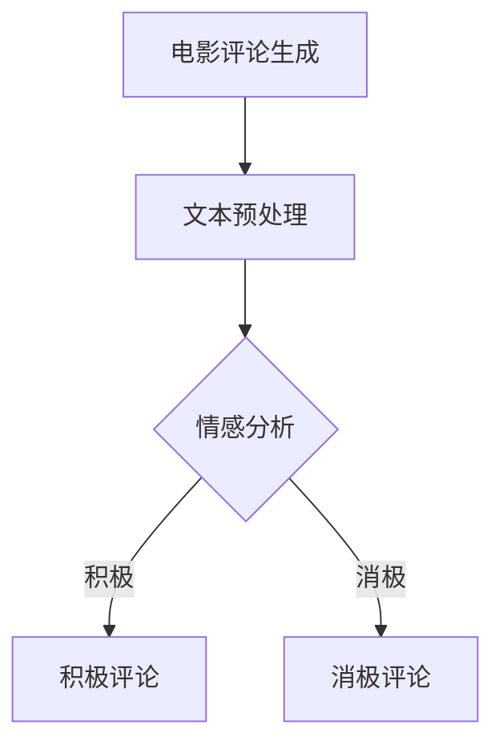
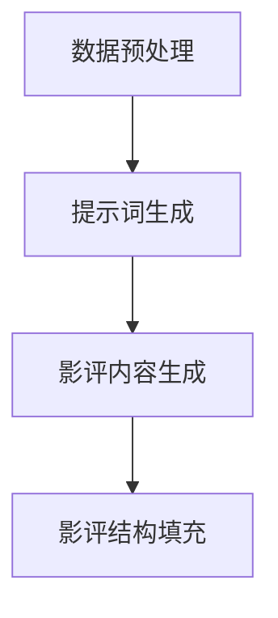
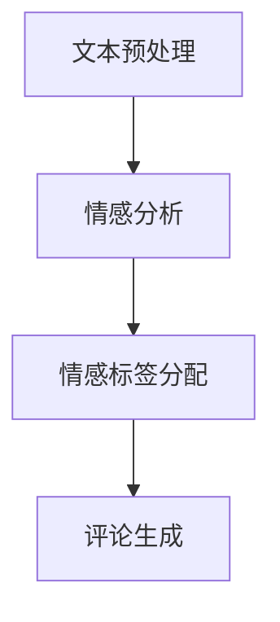
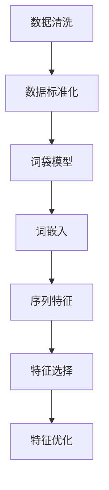
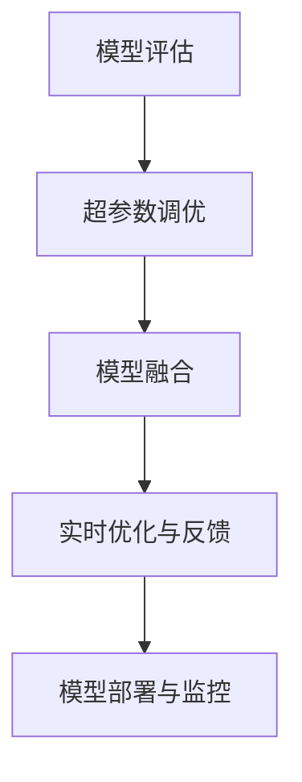
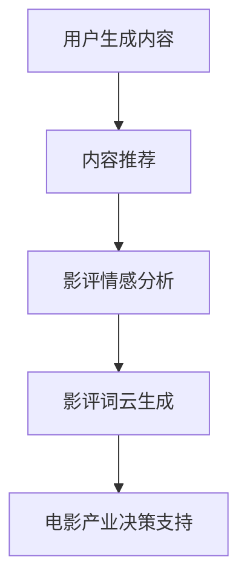
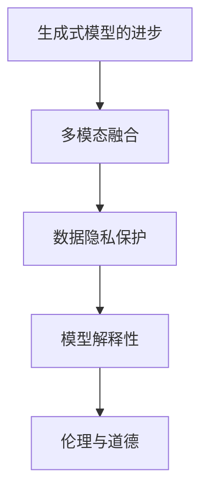

                 

# AI辅助电影评论：提示词生成影评框架

## 关键词
- AI电影评论
- 提示词生成
- 情感分析
- 影评框架
- 深度学习模型
- 数据预处理

## 摘要
本文旨在探讨如何利用人工智能技术辅助电影评论的生成，重点关注提示词生成和影评框架的设计。首先，我们将概述AI辅助电影评论的背景和优势，接着详细解释提示词生成算法的原理，并探讨影评框架的构建方法。随后，我们将深入讨论情感分析在电影评论生成中的应用，以及数据预处理和特征工程的重要性。最后，我们将介绍模型评估与优化策略，并展示AI辅助电影评论在实际应用中的效果，以及展望未来可能面临的挑战和解决方案。

### 第一部分: AI辅助电影评论概述

#### 第1章: AI辅助电影评论概述

##### 1.1 电影评论与AI的结合

电影评论在电影产业中扮演着至关重要的角色。它们不仅帮助观众选择观影内容，还能影响电影产业的相关决策，如电影制作、发行和营销策略。随着互联网和社交媒体的发展，用户生成内容（UGC）已成为电影评论的重要来源。然而，手工撰写高质量的电影评论既费时又费力，难以满足海量数据处理的需求。

AI的出现为电影评论的自动化生成提供了可能。通过利用自然语言处理（NLP）和深度学习技术，AI可以自动分析电影文本，生成情感分析、摘要和推荐。这使得电影评论不仅更快速、更准确，而且能够处理海量的用户评论，为电影产业提供更加全面和深入的数据支持。

##### 1.2 AI辅助电影评论的优势

AI辅助电影评论具有以下几个显著优势：

1. **提高评论生成效率**：传统的电影评论需要评论者花费大量时间进行撰写。而通过AI技术，可以自动化生成电影评论，大大提高了评论的生产效率。

2. **提升评论质量**：AI可以通过情感分析和文本生成技术，生成更加准确和丰富的电影评论。这不仅有助于提高评论的质量，还能为用户提供更加个性化的推荐。

3. **增强用户体验**：AI辅助电影评论可以根据用户的观影偏好和情感反馈，提供个性化的推荐和即时反馈，从而提升用户的观影体验。

##### 1.3 AI辅助电影评论的发展历程

AI辅助电影评论的发展历程可以分为两个阶段：

1. **早期模型**：早期的AI电影评论模型主要基于朴素文本分类和基于规则的方法。这些模型虽然能够实现基本的文本分类和情感分析，但效果有限。

2. **现代模型**：随着深度学习技术的发展，现代的AI电影评论模型开始采用词嵌入技术和深度学习模型，如循环神经网络（RNN）和变换器（BERT）。这些模型在情感分析和文本生成方面表现出了更高的准确性和灵活性。

##### 1.4 本书结构

本书分为两个主要部分：

1. **第一部分：AI辅助电影评论基础**：本部分将介绍AI辅助电影评论的基本理论和算法原理，包括提示词生成、情感分析、数据预处理和特征工程等。

2. **第二部分：实践与应用**：本部分将展示如何将AI辅助电影评论的理论应用于实际项目中，包括数据预处理、模型训练与评估，以及项目实战案例分析。

#### Mermaid 流程图



### 第一部分: AI辅助电影评论基础

#### 第2章: 提示词生成与影评框架

##### 2.1 提示词生成概述

在电影评论生成过程中，提示词起着关键作用。提示词是一种引导性词汇，用于帮助生成系统理解文本内容，并生成相应的影评。通过提示词，AI可以更好地捕捉电影的情感、剧情和角色，从而生成更具针对性和准确性的影评。

提示词生成的方法可以分为两大类：

1. **基于规则的方法**：这类方法通过预先定义的规则和模板，从电影文本中提取提示词。例如，可以使用正则表达式或关键字匹配技术，从电影剧情、角色和场景中提取相关信息。

2. **基于机器学习的方法**：这类方法利用机器学习算法，从大量的电影评论数据中学习并生成提示词。这种方法可以自动识别和提取电影文本中的关键信息，从而提高提示词的生成质量和效率。

##### 2.2 提示词生成算法原理

在本节中，我们将介绍两种常用的提示词生成算法：朴素贝叶斯算法和基于深度学习的LSTM（长短期记忆）模型。

###### 2.2.1 朴素贝叶斯算法

朴素贝叶斯算法是一种基于概率理论的分类算法，常用于文本分类和情感分析。在提示词生成中，朴素贝叶斯算法通过计算电影文本中每个词语的分布概率，生成对应的提示词。

**伪代码示例**：

```python
function generate_hint_words(text, vocabulary, probabilities):
    hint_words = []
    for word in text:
        if word in vocabulary:
            word_prob = probabilities[word]
            hint_words.append(word_prob)
    return hint_words
```

**数学模型解析**：

设V为词汇表，P(w|c)为在类别c下词语w的概率，P(c)为类别c的概率。则对于给定的电影文本T，可以计算每个词语w在T中的条件概率，并选择概率较高的词语作为提示词。

$$ P(w|c) = \frac{P(c) \cdot P(w \cap c)}{P(c)} $$

其中，$P(c)$表示类别c的概率，$P(w \cap c)$表示词语w和类别c同时出现的概率。

###### 2.2.2 基于深度学习的LSTM模型

LSTM模型是一种循环神经网络（RNN）的变体，能够有效地处理序列数据。在提示词生成中，LSTM模型可以捕捉电影文本中的时序信息，从而生成更加准确和自然的提示词。

**伪代码示例**：

```python
function generate_hint_words_lstm(text, model):
    hidden_state = model.init_state()
    hint_words = []
    for word in text:
        hidden_state = model.step(word, hidden_state)
        hint_word = model.predict(hidden_state)
        hint_words.append(hint_word)
    return hint_words
```

**数学模型解析**：

LSTM模型的核心是单元状态（cell state）和隐藏状态（hidden state）。在每一步，LSTM单元会接收输入词向量、隐藏状态和单元状态，并通过门控机制（gate）调整单元状态，从而生成新的隐藏状态。

$$
\begin{align*}
i_t &= \sigma(W_{ix}x_t + W_{ih}h_{t-1} + b_i) \\
f_t &= \sigma(W_{fx}x_t + W_{fh}h_{t-1} + b_f) \\
\text{new\_cell\_state} &= f_{t-1} \odot \text{cell\_state}_{t-1} + i_{t} \odot \text{sigmoid}(W_{cx}x_t + W_{ch}h_{t-1} + b_c) \\
o_t &= \sigma(W_{ox}x_t + W_{oh}h_{t-1} + b_o) \\
h_t &= o_{t} \odot \text{sigmoid}(\text{new\_cell\_state})
\end{align*}
$$`

其中，$i_t, f_t, o_t$分别表示输入门、遗忘门和输出门，$\sigma$表示sigmoid函数，$\odot$表示逐元素乘法。

##### 2.3 影评框架设计

一个良好的影评框架应该包含以下几个部分：

1. **引言**：简要介绍电影的基本信息，如导演、演员、上映时间等。

2. **剧情**：概述电影的主要情节，无需详细剧透。

3. **角色**：分析电影中的主要角色，描述他们的性格特点、动机和行为。

4. **情感分析**：对电影的整体情感进行评估，如是否令人感动、有趣或引人深思。

5. **综合评价**：对电影的整体表现进行评价，包括剧情、演技、视觉效果等。

6. **结尾**：总结电影的主要亮点和不足，提供观看建议。

**影评生成流程**：

1. **数据预处理**：清洗和标准化电影文本数据，提取关键词和短语。

2. **提示词生成**：利用机器学习算法生成提示词，用于引导影评的生成。

3. **影评内容生成**：基于提示词和情感分析结果，生成影评的各个部分。

4. **影评结构填充**：将生成的影评内容按照影评框架的结构进行填充，形成完整的影评。

#### Mermaid 流程图



### 第一部分: AI辅助电影评论基础

#### 第3章: 情感分析与评论生成

##### 3.1 情感分析概述

情感分析是AI辅助电影评论的重要组成部分，它旨在从电影文本中识别和评估情感倾向。情感分析不仅有助于生成更准确和自然的评论，还能为电影产业提供有价值的情感数据，用于优化营销策略和观众分析。

情感分析通常涉及以下步骤：

1. **文本预处理**：清洗和标准化文本数据，包括去除标点符号、停用词过滤和词干提取等。

2. **情感标签分配**：使用预训练的模型或自训练的模型，对文本中的情感进行分类，如积极、消极和中性。

3. **情感驱动的评论生成**：基于情感标签和电影文本，生成情感驱动的评论内容。

##### 3.2 基于文本的情感分析

基于文本的情感分析主要分为两种方法：情感词典法和基于机器学习的情感分析。

**情感词典法**：

情感词典法是一种基于规则的方法，通过定义一组情感词典，将文本中的词语与情感词典中的词语进行匹配，从而判断文本的情感倾向。这种方法简单高效，但依赖于情感词典的完整性和准确性。

**伪代码示例**：

```python
function sentiment_analysis_dict(text, sentiment_dict):
    sentiment_score = 0
    for word in text:
        if word in sentiment_dict:
            sentiment_score += sentiment_dict[word]
    return sentiment_score
```

**数学模型解析**：

设V为词汇表，S为情感词典，$s_i$为词语w在情感词典S中的情感得分。则对于给定的文本T，可以计算其整体的情感得分。

$$ S(T) = \sum_{w \in T} s_i $$

**基于机器学习的情感分析**：

基于机器学习的情感分析利用大量标注数据训练模型，从而自动识别和分类文本中的情感。常见的机器学习算法包括朴素贝叶斯、支持向量机和随机森林等。

**伪代码示例**：

```python
function sentiment_analysis_ml(text, model):
    features = extract_features(text)
    sentiment = model.predict(features)
    return sentiment
```

**数学模型解析**：

设X为特征空间，Y为情感标签集合，$f(x)$为特征函数，$y$为情感标签。则对于给定的文本T，可以计算其特征向量，并通过训练好的模型预测情感标签。

$$ y = \arg\max_y P(y|X) $$

##### 3.3 情感分析在评论生成中的应用

情感分析在评论生成中的应用主要体现在两个方面：情感标签分配和情感驱动的评论生成。

**情感标签分配**：

情感标签分配是评论生成的第一步，它通过对电影文本进行情感分析，为每个文本片段分配相应的情感标签。常见的情感标签包括积极、消极和中性。

**伪代码示例**：

```python
function assign_sentiment_tags(text, model):
    tags = []
    for sentence in text:
        sentiment = model.predict(sentence)
        tags.append(sentiment)
    return tags
```

**数学模型解析**：

设T为电影文本，$S(T)$为文本T的情感得分，$T_i$为文本中的第i个句子，$s_i$为句子i的情感得分。则可以计算每个句子的情感得分，并根据得分分配情感标签。

$$ s_i = \frac{1}{|T_i|} \sum_{t \in T_i} S(t) $$

**情感驱动的评论生成**：

基于情感标签分配的结果，可以生成情感驱动的评论内容。这种方法可以根据情感标签生成积极、消极或中性的评论，从而提高评论的多样性和准确性。

**伪代码示例**：

```python
function generate_sentiment_based_comment(sentiment_tags, model):
    comments = []
    for sentiment in sentiment_tags:
        if sentiment == 'positive':
            comment = model.generate_positive_comment()
        elif sentiment == 'negative':
            comment = model.generate_negative_comment()
        else:
            comment = model.generate_neutral_comment()
        comments.append(comment)
    return comments
```

**数学模型解析**：

设C为评论集合，$c_i$为第i条评论，$s_i$为评论i的情感得分，$g(s_i)$为根据情感得分生成的评论模板。则可以计算每个评论的情感得分，并使用模板生成相应的评论。

$$ c_i = g(s_i) $$

##### 3.4 生成式模型与评论生成

生成式模型是一种能够生成文本数据的模型，如生成对抗网络（GAN）和自回归模型。这些模型在评论生成中具有广泛的应用。

**生成对抗网络（GAN）**：

GAN由生成器和判别器组成，生成器生成文本数据，判别器判断文本数据是否真实。通过对抗训练，生成器逐渐生成更真实的文本数据。

**伪代码示例**：

```python
function generate_comment_gan(generator, discriminator):
    fake_comment = generator.sample()
    real_comment = discriminator.sample()
    return fake_comment
```

**数学模型解析**：

设G为生成器，D为判别器，$x$为真实文本数据，$z$为噪声向量，$g(z)$为生成器的生成过程，$d(x)$为判别器的判别过程。则生成器通过最小化生成文本数据与真实文本数据之间的差异，生成高质量的评论。

$$
\begin{align*}
\min_G & \quad \mathbb{E}_{x \sim p_{data}(x)}[\log D(x)] + \mathbb{E}_{z \sim p_z(z)}[\log (1 - D(g(z)))] \\
\max_D & \quad \mathbb{E}_{x \sim p_{data}(x)}[\log D(x)] + \mathbb{E}_{z \sim p_z(z)}[\log D(g(z))]
\end{align*}
$$`

**自回归模型**：

自回归模型是一种基于序列数据的生成模型，可以按照时间序列生成文本数据。自回归模型通常使用循环神经网络（RNN）或变换器（Transformer）实现。

**伪代码示例**：

```python
function generate_comment_auto_regression(model, start_token):
    comment = [start_token]
    for _ in range(max_length):
        token = model.predict(comment)
        comment.append(token)
    return ''.join(comment)
```

**数学模型解析**：

设T为时间序列，$t_i$为时间i的文本数据，$h_i$为隐藏状态，$g(h_i)$为生成过程。则自回归模型可以按照时间序列生成文本数据。

$$ t_{i+1} = g(h_i) $$

#### Mermaid 流程图



### 第一部分: AI辅助电影评论基础

#### 第4章: 数据预处理与特征工程

##### 4.1 数据预处理的重要性

在AI辅助电影评论系统中，数据预处理是确保模型性能和准确性的关键步骤。数据预处理包括以下几个重要方面：

1. **文本清洗**：清洗文本数据，去除无用信息和噪声，如HTML标签、特殊字符和停用词。

2. **标准化**：将文本转换为统一格式，如小写、去除标点符号和停用词过滤。

3. **分词**：将文本分割成单词或短语，以便后续处理。

4. **词干提取**：将单词还原为词干形式，以减少词汇量，提高特征表达能力。

5. **词嵌入**：将单词映射为向量表示，用于深度学习模型的输入。

##### 4.2 特征工程基础

特征工程是数据预处理的重要扩展，旨在从原始数据中提取对模型有用的特征。特征工程在AI辅助电影评论系统中具有以下几个关键作用：

1. **提高模型性能**：通过提取有效的特征，可以显著提高模型的预测准确性和泛化能力。

2. **降低数据噪声**：通过去除无关或噪声特征，可以减少模型训练的复杂性。

3. **增强模型解释性**：有效的特征可以使得模型更加透明和可解释。

常见的特征工程方法包括：

1. **词袋模型（Bag-of-Words, BoW）**：将文本表示为词频向量，忽略词的顺序信息。

2. **词嵌入（Word Embedding）**：将单词映射为稠密向量表示，如Word2Vec和GloVe。

3. **序列特征（Sequence Feature）**：基于文本序列的表征，如循环神经网络（RNN）和变换器（Transformer）。

##### 4.3 基于词向量的特征工程

词向量是文本数据的重要表征形式，可以显著提高模型的性能。在本节中，我们将介绍两种常用的词向量方法：Word2Vec和GloVe。

**Word2Vec**：

Word2Vec是一种基于神经网络的词向量生成方法，通过训练词的向量表示。Word2Vec主要有两种模型：连续词袋（CBOW）和Skip-gram。

**伪代码示例**：

```python
function train_word2vec corpus, size, window_size:
    vocabulary = create_vocabulary(corpus)
    model = Word2Vec(vocabulary, size, window_size)
    model.train(corpus)
    return model
```

**数学模型解析**：

设V为词汇表，$v_i$为单词w的向量表示，$c_i$为单词w的上下文，$p(w|c)$为在上下文c下单词w的条件概率。则可以通过最大边际化得到词向量：

$$
\begin{align*}
p(v|c) &= \frac{p(c|v) \cdot p(v)}{p(c)} \\
        &= \frac{1}{Z} \sum_{w \in C} p(w|c) \cdot p(w)
\end{align*}
$$`

其中，$Z$为归一化常数。

**GloVe**：

GloVe是一种基于全局词频的词向量生成方法，通过最小化词频和词向量之间的误差。GloVe通过引入嵌入维度和词频信息，生成高质量的词向量。

**伪代码示例**：

```python
function train_glove corpus, embedding_size, decay:
    vocabulary = create_vocabulary(corpus)
    model = GloVe(vocabulary, embedding_size, decay)
    model.train(corpus)
    return model
```

**数学模型解析**：

设V为词汇表，$f_i$为单词w的词频，$v_i$为单词w的向量表示，$f_j$为单词j的词频，$v_j$为单词j的向量表示。则GloVe的目标函数为：

$$
\begin{align*}
L &= \sum_{(w, c)} \frac{1}{f_w} \cdot \frac{1}{|c|} \cdot \sum_{j \in c} \frac{1}{f_j} \cdot \frac{1}{\sqrt{f_w \cdot f_j}} \cdot \frac{1}{1 + \exp(-\cos(v_w, v_j))}
\end{align*}
$$`

##### 4.4 特征选择与优化

特征选择是特征工程的重要环节，旨在从大量特征中选择最有用的特征，以提高模型性能并减少训练时间。常见的特征选择方法包括：

1. **相关性分析**：通过计算特征与目标变量之间的相关性，选择相关性较高的特征。

2. **主成分分析（PCA）**：通过降维技术，将高维特征映射到低维空间，保留主要特征。

3. **基于模型的特征选择**：利用模型自身筛选特征，如LASSO和随机森林。

特征优化是在特征选择的基础上，进一步调整和优化特征，以提高模型性能。常见的特征优化方法包括：

1. **特征组合**：将多个特征组合成新的特征，以增强特征表达能力。

2. **特征筛选**：通过交叉验证等方法，逐步筛选出最优特征。

3. **超参数调优**：通过调整模型的超参数，如学习率和隐藏层大小，优化模型性能。

#### Mermaid 流程图



### 第一部分: AI辅助电影评论基础

#### 第5章: 模型评估与优化

##### 5.1 模型评估指标

在AI辅助电影评论系统中，模型评估是确保模型性能和准确性的关键步骤。常用的模型评估指标包括：

1. **准确率（Accuracy）**：准确率是模型预测正确的样本数量与总样本数量的比例。公式为：

   $$ \text{Accuracy} = \frac{\text{预测正确数}}{\text{总样本数}} $$

   准确率简单直观，但可能受不平衡数据集的影响。

2. **召回率（Recall）**：召回率是模型预测正确的样本数量与实际为正类的样本数量的比例。公式为：

   $$ \text{Recall} = \frac{\text{预测正确数}}{\text{实际正类数}} $$

   召回率强调模型识别正类的能力，但可能牺牲准确率。

3. **精确率（Precision）**：精确率是模型预测正确的样本数量与预测为正类的样本数量的比例。公式为：

   $$ \text{Precision} = \frac{\text{预测正确数}}{\text{预测正类数}} $$

   精确率强调模型预测正类的可靠性，但可能低估召回率。

4. **F1 分数（F1 Score）**：F1 分数是精确率和召回率的调和平均值，用于综合评估模型性能。公式为：

   $$ \text{F1 Score} = 2 \cdot \frac{\text{Precision} \cdot \text{Recall}}{\text{Precision} + \text{Recall}} $$

##### 5.2 模型优化策略

模型优化是提高模型性能和准确性的关键步骤。以下是一些常见的模型优化策略：

1. **超参数调优**：通过调整模型超参数，如学习率、隐藏层大小和迭代次数，优化模型性能。常用的超参数调优方法包括网格搜索（Grid Search）和随机搜索（Random Search）。

   **网格搜索**：在给定的超参数范围内，逐个尝试所有可能的组合，选择最佳组合。

   **随机搜索**：从给定的超参数范围内随机选择组合，通过交叉验证选择最佳组合。

2. **模型融合**：通过融合多个模型的结果，提高模型性能和泛化能力。常见的模型融合方法包括投票法（Voting）和协同方法（Ensemble）。

   **投票法**：将多个模型的预测结果进行投票，选择多数模型一致的结果。

   **协同方法**：通过加权平均或加权求和的方式，将多个模型的预测结果进行融合。

3. **实时优化与反馈**：通过实时评估模型性能，并根据用户反馈进行调整。这种方法可以提高模型的适应性和准确性。

   **实时评估**：通过在线评估或离线评估，实时监测模型性能。

   **用户反馈**：收集用户反馈，如评论准确性、推荐满意度等，用于调整模型参数。

##### 5.3 模型部署与监控

模型部署是将训练好的模型应用到实际场景的过程。以下是一些关键的步骤：

1. **环境配置**：配置模型部署所需的环境，如计算资源、依赖库等。

2. **API接口设计**：设计用于模型调用的API接口，确保模型可以方便地与前端应用程序或其他系统进行集成。

3. **模型监控**：通过监控模型性能和资源消耗，确保模型稳定运行。

   **性能监控**：监控模型的预测速度、准确率等性能指标。

   **故障处理**：及时发现并处理模型故障，如预测错误、内存泄漏等。

#### Mermaid 流程图



### 第一部分: AI辅助电影评论基础

#### 第6章: AI辅助电影评论的实际应用

##### 6.1 电影评论平台应用

在电影评论平台中，AI辅助电影评论可以应用于多个方面，从而提升用户体验和平台功能。

1. **用户生成内容**：通过AI辅助电影评论，平台可以自动化生成用户的评论，减少人工撰写的负担。用户可以在观看电影后，快速生成自己的评论，与其他用户分享观影体验。

2. **内容推荐**：AI辅助电影评论可以分析用户的历史评论和观影偏好，为用户推荐感兴趣的电影和评论。这有助于提升用户参与度和平台黏性。

3. **情感分析**：通过情感分析，平台可以了解用户对电影的反馈和情感倾向。这有助于电影制作公司和发行公司了解观众需求，优化电影营销策略。

##### 6.2 影评数据分析

AI辅助电影评论还可以应用于影评数据分析，从而提供更深入的数据洞察。

1. **情感分布**：通过分析影评中的情感词汇和情感标签，可以了解电影的整体情感趋势。这有助于电影制作公司了解观众对电影的情感反应，优化剧本和导演策略。

2. **情感趋势**：通过分析不同时间段、不同地域的影评，可以了解观众对电影的长期情感变化。这有助于电影制作公司和发行公司了解观众的喜好变化，调整营销策略。

3. **词云生成**：通过分析影评中的高频词汇，可以生成词云，直观展示电影的讨论热点。这有助于电影制作公司和发行公司了解观众的关注点，优化电影营销和宣传策略。

##### 6.3 电影产业决策支持

AI辅助电影评论还可以为电影产业提供决策支持，从而优化电影制作、发行和营销策略。

1. **票房预测**：通过分析影评中的情感倾向和评论数量，可以预测电影的票房表现。这有助于电影制作公司和发行公司提前制定营销计划和预算。

2. **营销策略优化**：通过分析影评中的情感词汇和评论内容，可以了解观众的喜好和关注点。这有助于电影制作公司和发行公司优化营销策略，提高电影票房和口碑。

3. **用户画像**：通过分析用户评论和观影行为，可以生成用户画像，了解不同观众群体的特点和需求。这有助于电影制作公司和发行公司制定更个性化的推广策略。

#### Mermaid 流程图



### 第一部分: AI辅助电影评论基础

#### 第7章: 未来展望与挑战

##### 7.1 AI辅助电影评论的未来发展趋势

随着人工智能技术的不断发展，AI辅助电影评论在未来有望实现以下几个重要趋势：

1. **生成式模型的进步**：生成式模型如生成对抗网络（GAN）和自回归模型（AR）将继续发展，生成更加自然、高质量的影评。这些模型将能够更好地理解上下文和情感，生成更具创意和个性化的评论。

2. **多模态融合**：AI辅助电影评论将结合视频内容和文本内容，实现多模态融合。通过结合视觉情感分析和文本情感分析，可以更全面地评估电影的情感和主题。

3. **个性化推荐**：AI辅助电影评论将结合用户行为数据和观影偏好，实现更加个性化的推荐。这将有助于提升用户体验，满足不同用户的需求。

##### 7.2 挑战与解决方案

尽管AI辅助电影评论具有巨大的潜力，但在实际应用中仍然面临以下挑战：

1. **数据隐私保护**：电影评论数据通常包含用户隐私信息，如用户ID和观影记录。为了保护用户隐私，需要采用加密技术和数据去标识化方法。

2. **模型解释性**：深度学习模型如卷积神经网络（CNN）和变换器（Transformer）通常难以解释。为了提高模型的解释性，可以采用可解释性模型和模型可视化工具。

3. **伦理与道德**：AI辅助电影评论需要遵循伦理和道德规范。例如，需要避免生成虚假评论和偏见评论。此外，还需要关注AI在电影产业中的应用公平性和偏见问题。

为了应对这些挑战，可以采取以下解决方案：

1. **数据隐私保护**：采用数据加密技术和数据去标识化方法，确保用户隐私信息不被泄露。此外，可以建立隐私保护机制，如差分隐私和同态加密。

2. **模型解释性**：采用可解释性模型和模型可视化工具，提高模型的可解释性。例如，可以采用LIME（Local Interpretable Model-agnostic Explanations）和SHAP（SHapley Additive exPlanations）等方法。

3. **伦理与道德**：建立伦理和道德委员会，确保AI辅助电影评论的应用符合伦理和道德规范。此外，可以采用公平性评估方法，如公平性指标和偏见检测算法，确保模型应用公平性。

#### Mermaid 流�程图



### 作者信息

作者：AI天才研究院/AI Genius Institute & 禅与计算机程序设计艺术/Zen And The Art of Computer Programming

