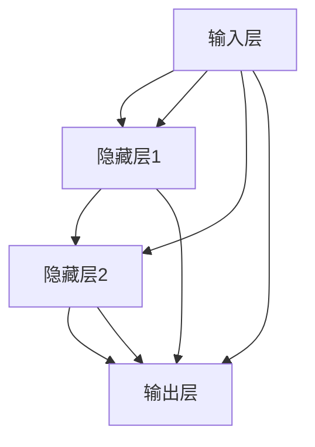
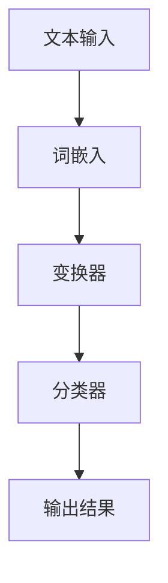
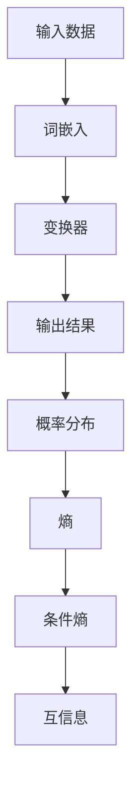

                 

## 文章标题

“Andrej Karpathy：人工智能的未来发展目标”

### 关键词：Andrej Karpathy，人工智能，未来发展，目标，核心技术，算法原理，数学模型，项目实战

### 摘要：

本文将深入探讨人工智能领域的杰出研究者Andrej Karpathy对于人工智能未来发展目标的独特见解。文章首先回顾了人工智能的定义与历史，随后详细介绍了人工智能的核心技术、数学基础和未来发展的可能方向。接着，通过几个具体的实战案例，对所学知识进行了实际应用和解读。最后，文章总结了人工智能对未来社会的影响，并探讨了其在人类生活中的潜在角色。通过这篇文章，读者将全面了解人工智能的核心概念和发展趋势，并对人工智能的未来充满期待。

## 引言

人工智能（AI）作为当今科技界最热门的话题之一，其快速发展已经引起了全球范围内的广泛关注。作为人工智能领域的杰出研究者，Andrej Karpathy以其对深度学习技术的深入理解和广泛应用而闻名。他的著作《Deep Learning Handbook》以及众多技术博客，为人工智能爱好者提供了宝贵的知识和实践经验。本文将围绕Andrej Karpathy对人工智能未来发展的目标进行探讨，旨在帮助读者理解人工智能的核心技术、数学基础及其在现实世界中的应用。

### 人工智能的定义与历史

人工智能是一门研究、开发和应用使计算机系统能够执行通常需要人类智能才能完成的任务的学科。它涵盖了计算机科学、心理学、认知科学和神经科学等多个领域。人工智能的发展历程可以追溯到20世纪50年代，当时，科学家们首次提出了“人工智能”这一概念。然而，早期的人工智能研究主要集中在规则推理和知识表示上，由于技术限制，这些方法在实际应用中效果不佳。

真正的突破出现在20世纪80年代，随着计算机性能的提升和大数据的出现，人工智能开始进入一个全新的时代。其中，深度学习成为了人工智能发展的重要推动力。深度学习是一种基于人工神经网络的学习方法，它通过模拟人脑神经元之间的连接和互动，实现从数据中自动学习和提取特征。这一技术的出现，使得人工智能在图像识别、语音识别和自然语言处理等领域的表现达到了前所未有的高度。

### 人工智能的分类

人工智能可以分为两类：弱人工智能（Narrow AI）和强人工智能（General AI）。弱人工智能是指专注于特定任务的人工智能系统，例如语音助手、自动驾驶汽车等。这类人工智能在特定领域表现出色，但缺乏跨领域的通用智能。强人工智能则是一种具备广泛认知能力的人工智能，能够在各种情境下表现出与人类相似的学习、推理和决策能力。目前，强人工智能尚未实现，但科学家们一直在努力研究和探索。

### Andrej Karpathy的贡献

Andrej Karpathy是一位在深度学习领域享有盛誉的研究者，他在自然语言处理、计算机视觉和人工智能系统设计等方面做出了卓越的贡献。他的研究成果不仅推动了深度学习技术的应用，也为人工智能的未来发展提供了宝贵的理论和实践经验。例如，他在2015年发布的《Deep Learning Handbook》一书，详细介绍了深度学习的原理和实践，成为深度学习爱好者和从业者的必备指南。

在自然语言处理领域，Karpathy研究了如何利用深度学习技术进行文本分类、机器翻译和情感分析等任务。他的实验结果显示，深度学习模型在这些任务上取得了显著的性能提升，为自然语言处理领域带来了新的突破。此外，在计算机视觉领域，Karpathy通过实验和理论分析，探讨了如何利用深度学习技术进行图像识别、图像生成和视频处理等任务，进一步推动了计算机视觉的发展。

总之，Andrej Karpathy的研究成果不仅为人工智能技术的发展提供了强有力的支持，也为人工智能的未来发展指明了方向。在接下来的章节中，我们将进一步探讨人工智能的核心技术、数学基础和未来发展的目标。

### Andrej Karpathy：人工智能的未来发展目标

在探讨了人工智能的定义、历史和分类之后，我们现在来关注Andrej Karpathy对人工智能未来发展的独特见解。Karpathy认为，人工智能的未来不仅仅在于技术上的突破，更在于其对社会和人类生活的影响。以下是他提出的几个关键发展目标。

#### 1. 通用人工智能的探索

首先，Karpathy强调了通用人工智能（AGI）的重要性。与弱人工智能不同，通用人工智能具有跨领域的智能，能够像人类一样学习和适应各种环境和任务。Karpathy认为，实现通用人工智能是人工智能发展的终极目标，也是人类智慧的延伸。虽然目前通用人工智能尚未实现，但通过不断的技术创新和跨学科合作，我们有理由相信，这一目标终将实现。

#### 2. 人机协同的工作方式

在人工智能的发展过程中，人机协同将成为重要趋势。Karpathy认为，人工智能应成为人类的辅助工具，帮助人们更高效地完成工作，而不是取代人类。通过结合人类的创造力和人工智能的计算能力，人机协同将带来新的工作方式和生产模式。例如，在医疗领域，人工智能可以通过分析大量患者数据，为医生提供诊断建议；在教育领域，人工智能可以为学生提供个性化的学习方案，提高学习效果。

#### 3. 人工智能的伦理与责任

随着人工智能技术的不断进步，其伦理和责任问题也日益凸显。Karpathy强调了人工智能发展的伦理问题，包括隐私保护、安全性和透明度等。他认为，人工智能系统应遵循道德规范，确保其应用不会对人类造成伤害。同时，人工智能企业也应承担社会责任，确保其产品和服务对社会有益。

#### 4. 人工智能的教育与普及

为了推动人工智能技术的发展，Karpathy认为，教育和普及至关重要。他呼吁全球范围内加强对人工智能教育的投入，培养更多具备人工智能知识和技能的人才。此外，他还倡导通过在线课程、研讨会和公开讲座等形式，普及人工智能知识，提高公众对人工智能的理解和接受度。

#### 5. 人工智能的可持续发展

最后，Karpathy提出了人工智能的可持续发展目标。他认为，人工智能技术的发展应兼顾经济效益和环境效益，避免过度消耗资源和能源。通过推动绿色人工智能技术，我们可以实现人工智能与可持续发展的双赢。

总之，Andrej Karpathy对人工智能未来发展的目标充满了期待和信心。他认为，通过技术创新、伦理责任和全球合作，人工智能有望在未来实现跨越式发展，为人类社会带来更多的机遇和挑战。在接下来的章节中，我们将进一步探讨人工智能的核心技术、数学基础和未来应用，为这一目标提供更多的理论支持和实践案例。

### 人工智能的核心技术

在探讨人工智能的未来发展目标之前，我们首先需要了解人工智能的核心技术。这些技术不仅构成了人工智能的基础，也是实现人工智能应用的关键。本文将详细讨论神经网络、深度学习优化算法和自然语言处理技术，帮助读者全面了解人工智能的技术原理和应用。

#### 神经网络

神经网络是人工智能的核心技术之一，其基本原理源于对人脑神经系统的模拟。神经网络由大量相互连接的神经元组成，每个神经元都通过突触与其他神经元连接。在信息传递过程中，神经元根据输入信号的强度和权重，产生输出信号，从而实现数据的处理和决策。

神经网络的架构可以分为输入层、隐藏层和输出层。输入层接收外部输入数据，隐藏层通过复杂的非线性变换提取特征，输出层则产生最终输出。神经网络通过不断调整权重，使网络能够从数据中学习并优化性能。

以下是一个简化的神经网络架构图，使用Mermaid流程图表示：



在神经网络中，每个神经元之间的连接权重是关键参数。通过反向传播算法，神经网络可以自动调整这些权重，以优化网络的性能。反向传播算法是一种基于梯度下降的优化方法，它通过计算误差的梯度，反向传播到网络的每个层，从而更新权重。

以下是一个反向传播算法的伪代码示例：

```python
# 前向传播
def forward_pass(x, weights):
    # 输入数据x经过网络，产生输出y
    return y

# 反向传播
def backward_pass(y, y_target, weights):
    # 计算误差
    error = y - y_target
    
    # 计算梯度
    gradient = compute_gradient(error, weights)
    
    # 更新权重
    weights -= learning_rate * gradient
    
    return weights
```

通过不断迭代前向传播和反向传播，神经网络可以逐渐优化其性能，达到所需的精度和效果。

#### 深度学习优化算法

深度学习优化算法是训练神经网络的重要工具，其目标是通过最小化损失函数，找到最优的权重和偏置。目前，常见的优化算法包括梯度下降、随机梯度下降（SGD）、批量梯度下降和Adam优化器等。

**梯度下降算法：** 梯度下降算法是最简单的优化算法之一，其基本思想是通过计算损失函数关于每个参数的梯度，沿着梯度的反方向更新参数。梯度下降算法的伪代码如下：

```python
# 梯度下降算法伪代码
def gradient_descent(x, learning_rate, epochs):
    for epoch in range(epochs):
        gradient = compute_gradient(x)
        x = x - learning_rate * gradient
    return x

# 计算梯度示例
def compute_gradient(x):
    # 示例：计算某个函数的梯度
    return 2 * x  # 线性函数的梯度为斜率

# 实例化梯度下降，并训练模型
x = 100  # 初始值
learning_rate = 0.1
epochs = 10
x_optimal = gradient_descent(x, learning_rate, epochs)
print(f"最优解为: {x_optimal}")
```

**随机梯度下降（SGD）：** 随机梯度下降是在梯度下降算法基础上的一种改进，其每次迭代只随机选择一部分样本计算梯度。这种方法的优点是可以加速收敛，但缺点是容易陷入局部最小值。随机梯度下降的伪代码如下：

```python
# 随机梯度下降伪代码
def stochastic_gradient_descent(x, learning_rate, epochs, batch_size):
    for epoch in range(epochs):
        for batch in range(0, len(x), batch_size):
            batch_x = x[batch:batch+batch_size]
            gradient = compute_gradient(batch_x)
            x = x - learning_rate * gradient
    return x
```

**批量梯度下降：** 批量梯度下降是在每次迭代中使用整个训练集计算梯度，这样可以减少随机梯度下降的方差，但计算成本较高。批量梯度下降的伪代码如下：

```python
# 批量梯度下降伪代码
def batch_gradient_descent(x, learning_rate, epochs):
    for epoch in range(epochs):
        gradient = compute_gradient(x)
        x = x - learning_rate * gradient
    return x
```

**Adam优化器：** Adam优化器是梯度下降算法的一种变体，它结合了SGD和批量梯度下降的优点，并引入了一阶矩估计和二阶矩估计，从而在训练过程中保持稳定的收敛速度。Adam优化器的伪代码如下：

```python
# Adam优化器伪代码
def adam(x, learning_rate, beta1, beta2, epsilon, epochs):
    m = 0
    v = 0
    for epoch in range(epochs):
        gradient = compute_gradient(x)
        m = beta1 * m + (1 - beta1) * gradient
        v = beta2 * v + (1 - beta2) * gradient ** 2
        m_hat = m / (1 - beta1 ** epoch)
        v_hat = v / (1 - beta2 ** epoch)
        x = x - learning_rate * m_hat / (np.sqrt(v_hat) + epsilon)
    return x
```

通过这些优化算法，我们可以训练神经网络，使其在各种任务上表现出色。

#### 自然语言处理技术

自然语言处理（NLP）是人工智能的一个重要分支，其目标是使计算机能够理解和处理人类语言。NLP技术广泛应用于机器翻译、情感分析、文本分类和信息提取等领域。

**词嵌入：** 词嵌入是将词汇映射到高维空间中的向量表示。通过词嵌入，我们可以利用向量运算来处理自然语言，提高模型的性能。常见的词嵌入技术包括Word2Vec、GloVe和BERT等。

**循环神经网络（RNN）：** 循环神经网络是一种能够处理序列数据的神经网络。它通过在时间步之间传递隐藏状态，实现对序列数据的建模。RNN在自然语言处理任务中取得了显著的效果，但存在梯度消失和梯度爆炸等问题。

**长短期记忆网络（LSTM）：** 长短期记忆网络是RNN的一种改进，它通过引入记忆单元，解决了梯度消失和梯度爆炸的问题。LSTM在机器翻译、语音识别等任务中表现优秀。

**变换器（Transformer）：** 变换器是近年来在自然语言处理领域取得突破的一种模型，它通过自注意力机制实现了对序列数据的全局建模。BERT和GPT-3等大型预训练模型都是基于变换器实现的。

以下是一个简单的自然语言处理任务（文本分类）的流程图：



通过这些技术，我们可以构建强大的自然语言处理系统，实现人机交互和信息处理的高效自动化。

总之，神经网络、深度学习优化算法和自然语言处理技术是人工智能的核心技术，它们共同推动了人工智能的发展。在接下来的章节中，我们将进一步探讨人工智能的数学基础和未来发展的目标，为人工智能的广泛应用提供更多的理论支持和实践案例。

### 人工智能的数学基础

在深入了解人工智能的核心技术之后，我们需要探讨其背后的数学基础。这些数学原理不仅为人工智能提供了理论支持，也为实际应用提供了工具和方法。本文将重点介绍线性代数、概率论和信息论在人工智能中的应用，以及如何使用数学公式和模型来解析和理解这些概念。

#### 线性代数在深度学习中的应用

线性代数是深度学习的基础之一，它在数据处理、特征提取和模型优化等方面发挥着重要作用。以下是一些关键的线性代数概念及其在深度学习中的应用。

**矩阵和向量：** 矩阵和向量是线性代数的基本元素。在深度学习中，矩阵用于表示数据集、权重和偏置，向量用于表示数据样本和神经元的状态。

**矩阵运算：** 线性代数中的矩阵运算包括矩阵乘法、矩阵加法和矩阵求逆等。这些运算在深度学习中的优化和变换过程中至关重要。例如，矩阵乘法用于计算神经网络中各个层的输出，矩阵求逆用于求解线性方程组。

以下是一个矩阵乘法的示例，假设我们有矩阵 A 和矩阵 B：

$$
\begin{bmatrix}
a_{11} & a_{12} \\
a_{21} & a_{22}
\end{bmatrix}
\begin{bmatrix}
b_{11} & b_{12} \\
b_{21} & b_{22}
\end{bmatrix}
=
\begin{bmatrix}
a_{11}b_{11} + a_{12}b_{21} & a_{11}b_{12} + a_{12}b_{22} \\
a_{21}b_{11} + a_{22}b_{21} & a_{21}b_{12} + a_{22}b_{22}
\end{bmatrix}
$$

**线性变换：** 线性变换是将一个向量空间映射到另一个向量空间的一种线性映射。在深度学习中，线性变换用于模型中的层与层之间的数据传递和特征提取。

以下是一个线性变换的公式：

$$
\mathbf{y} = \mathbf{Wx} + \mathbf{b}
$$

其中，$\mathbf{W}$ 是权重矩阵，$\mathbf{x}$ 是输入向量，$\mathbf{y}$ 是输出向量，$\mathbf{b}$ 是偏置向量。

**特征值和特征向量：** 特征值和特征向量用于描述线性变换的性质。在深度学习中，特征值和特征向量用于分析模型的稳定性和性能。

以下是一个特征值和特征向量的计算示例：

$$
\mathbf{W}\mathbf{v} = \lambda \mathbf{v}
$$

其中，$\mathbf{W}$ 是矩阵，$\mathbf{v}$ 是特征向量，$\lambda$ 是特征值。

#### 概率论在深度学习中的应用

概率论是深度学习中的重要工具，它用于描述数据的随机性和不确定性。以下是一些关键的概率论概念及其在深度学习中的应用。

**概率分布：** 概率分布用于描述随机变量的可能取值及其概率。在深度学习中，概率分布用于表示数据的特征和模型的预测结果。

以下是一些常见的概率分布：

- **正态分布：** 正态分布是一种连续概率分布，用于描述数据集的均值和方差。

$$
f(x|\mu, \sigma^2) = \frac{1}{\sqrt{2\pi\sigma^2}} e^{-\frac{(x-\mu)^2}{2\sigma^2}}
$$

- **伯努利分布：** 伯努利分布是一种离散概率分布，用于描述二分类问题。

$$
P(X=1) = p, \quad P(X=0) = 1-p
$$

**条件概率：** 条件概率用于描述在某个事件发生的条件下，另一个事件发生的概率。在深度学习中，条件概率用于描述输入和输出之间的关系。

以下是一个条件概率的公式：

$$
P(B|A) = \frac{P(A \cap B)}{P(A)}
$$

**贝叶斯定理：** 贝叶斯定理是概率论中的一个基本定理，用于计算后验概率。在深度学习中，贝叶斯定理用于更新模型的参数和预测结果。

以下是一个贝叶斯定理的公式：

$$
P(A|B) = \frac{P(B|A)P(A)}{P(B)}
$$

#### 信息论在深度学习中的应用

信息论是研究信息传输和处理的科学，它在深度学习中用于描述数据的复杂性和不确定性。以下是一些关键的信息论概念及其在深度学习中的应用。

**熵：** 熵是描述随机变量不确定性的度量。在深度学习中，熵用于评估模型的预测能力和数据的质量。

以下是一个熵的公式：

$$
H(X) = -\sum_{x} P(x) \log_2 P(x)
$$

**条件熵：** 条件熵是描述在某个事件发生的条件下，另一个事件的不确定性的度量。在深度学习中，条件熵用于描述输入和输出之间的依赖关系。

以下是一个条件熵的公式：

$$
H(X|Y) = -\sum_{y} P(y) \sum_{x} P(x|y) \log_2 P(x|y)
$$

**互信息：** 互信息是描述两个随机变量之间相关性的度量。在深度学习中，互信息用于评估特征的重要性。

以下是一个互信息的公式：

$$
I(X; Y) = H(X) - H(X|Y)
$$

#### 综合应用

在深度学习中，这些数学概念通常综合应用，以实现模型的优化和预测。例如，我们可以使用概率分布来描述数据的特征，使用熵来评估模型的预测能力，使用互信息来分析特征的重要性。

以下是一个简化的深度学习模型，展示了如何应用这些数学概念：



通过这些数学概念，我们可以构建强大的深度学习模型，实现复杂的数据处理和预测任务。

总之，线性代数、概率论和信息论是人工智能的数学基础，它们在深度学习中的应用为模型的构建和优化提供了有力的支持。在接下来的章节中，我们将进一步探讨人工智能的实际应用，为人工智能的发展提供更多的实践案例。

### 人工智能的未来发展目标：伦理与法律问题

随着人工智能技术的不断进步，其对社会和人类生活的影响日益显著。然而，人工智能的发展也带来了一系列伦理和法律问题，这些问题需要我们深入探讨和解决。在本文中，我们将围绕人工智能的伦理问题、法律挑战及其伦理标准的制定与实施进行讨论。

#### 人工智能的伦理问题

**隐私保护：** 隐私保护是人工智能发展中最突出的伦理问题之一。人工智能系统通常需要处理大量个人数据，这些数据可能包含敏感信息。如果不妥善保护这些数据，就会对个人隐私造成严重侵害。例如，人脸识别技术在公共安全领域广泛应用，但同时也可能被用于非法监视和追踪。

**算法偏见：** 算法偏见是指人工智能系统在决策过程中表现出对某些群体的偏见。这种偏见可能源于训练数据的不公平性或者算法设计上的缺陷。例如，某些招聘系统可能会对某些性别、种族或年龄的人群产生歧视。

**责任归属：** 当人工智能系统发生错误或造成损害时，责任归属问题变得复杂。是人工智能系统的开发者、运营者还是用户应承担主要责任？这个问题在法律和伦理上都没有明确的答案，需要我们进一步探讨和解决。

**道德决策：** 人工智能系统在某些情况下需要做出道德决策，例如自动驾驶汽车在发生交通事故时的决策。这些决策涉及到生命安全和道德伦理，需要我们在算法设计中充分考虑。

#### 人工智能的法律挑战

**数据保护：** 随着人工智能技术的发展，数据保护成为一个重要的法律挑战。许多国家已经制定了严格的数据保护法规，例如欧盟的《通用数据保护条例》（GDPR）。这些法规旨在保护个人数据的隐私和安全，但同时也对人工智能系统的开发和运营提出了更高的要求。

**算法监管：** 算法监管是另一个重要的法律挑战。由于人工智能系统的复杂性和不确定性，监管机构需要制定明确的规则和标准，以确保这些系统不会对社会造成负面影响。例如，美国和欧盟已经开始讨论对自动驾驶汽车进行立法监管。

**责任认定：** 在人工智能系统的责任认定方面，法律体系尚未形成完善的框架。当人工智能系统发生错误或造成损害时，如何确定责任归属是一个复杂的问题，需要法律界和科技界的共同努力。

#### 伦理标准的制定与实施

为了解决人工智能的伦理和法律问题，制定和实施伦理标准至关重要。以下是一些可能的伦理标准：

**公平性：** 人工智能系统应确保公平性，避免对特定群体产生歧视。这可以通过多样化的数据集和透明的算法设计实现。

**透明度：** 人工智能系统的决策过程应具备透明度，使人们能够理解和监督其运作。这可以通过公开算法和模型、提供解释工具等方式实现。

**隐私保护：** 人工智能系统应严格保护个人隐私，遵守数据保护法规。这可以通过加密技术、匿名化处理和权限管理等方式实现。

**责任明确：** 人工智能系统的责任应明确划分，确保各方在发生错误或损害时承担相应的责任。这可以通过建立责任保险、责任共享机制等方式实现。

**道德责任：** 开发者、运营者和用户都应承担道德责任，确保人工智能系统的应用符合伦理和法律标准。

总之，人工智能的未来发展目标不仅在于技术上的突破，还在于解决其伦理和法律问题。通过制定和实施伦理标准，我们可以确保人工智能的发展符合人类的利益，为人类社会带来更多的机遇和福祉。

### 人工智能的未来发展目标：社会影响与伦理

随着人工智能技术的快速发展，其对社会的各个方面产生了深远的影响，尤其是在经济、教育和医疗领域。本文将探讨人工智能在这些领域中的潜在应用，以及其带来的伦理挑战和社会责任。

#### 经济影响

人工智能在经济领域的影响是革命性的。首先，人工智能通过自动化和智能化技术，提高了生产效率和产品质量。例如，在制造业，人工智能可以帮助实现精准的生产计划和控制，减少浪费，提高生产线的灵活性。其次，人工智能在金融服务领域也发挥着重要作用，如智能投顾和自动化风控系统，能够为用户提供更个性化的服务，降低运营成本。此外，人工智能还催生了新的就业机会，如数据分析师、机器学习工程师和人工智能咨询师等。

然而，人工智能的发展也引发了一些伦理和社会责任问题。首先，自动化可能导致部分工作岗位的消失，尤其是那些重复性和低技能的工作。这可能会导致失业率的上升，进而影响社会稳定。其次，人工智能系统的决策过程可能存在偏见，如果不加以妥善管理，可能会导致不公平和歧视。例如，在招聘和信用评估中，人工智能系统可能会无意中放大现有社会偏见，导致某些群体受到不公平待遇。

#### 教育影响

人工智能在教育领域的影响也日益显著。首先，人工智能可以为学生提供个性化的学习方案，通过分析学生的学习数据，为每个学生量身定制学习计划，提高学习效果。其次，人工智能还可以帮助教师实现教学辅助，如自动批改作业、提供即时反馈等，从而减轻教师的工作负担。此外，人工智能还可以用于教育资源的优化配置，如智能推荐课程和学习材料，提高教育资源的利用效率。

在教育领域，人工智能的伦理挑战主要集中在数据隐私和保护方面。学生的个人信息和学习数据是敏感信息，必须确保其隐私得到保护。此外，教育人工智能系统的设计应遵循公平和透明的原则，避免对学生产生不公平的影响。

#### 医疗影响

人工智能在医疗领域的应用潜力巨大。首先，人工智能可以帮助医生进行诊断和治疗决策，如通过分析医学图像和病历数据，提供准确的诊断建议。其次，人工智能可以用于药物研发和临床试验，通过分析大量数据，加速新药的研发和上市。此外，人工智能还可以用于健康监测和疾病预防，如通过智能手表和手机应用程序，实时监测用户的健康数据，提供个性化的健康建议。

在医疗领域，人工智能的伦理挑战主要集中在患者隐私、数据安全和医疗责任等方面。患者的医疗数据必须得到严格保护，防止泄露和滥用。此外，人工智能系统在医疗决策中的责任归属也是一个复杂的问题，需要明确各方在医疗事故中的责任。

#### 社会责任

人工智能的发展不仅需要解决技术问题，还需要关注其社会责任。首先，人工智能企业应承担社会责任，确保其技术的应用不会对社会和环境造成负面影响。其次，政府和社会组织应加强对人工智能的监管，制定相关的法律法规和伦理标准，确保人工智能技术的安全、公平和透明。此外，公众教育和培训也是不可或缺的，通过提高公众对人工智能的理解和接受度，可以促进人工智能技术的健康发展。

总之，人工智能的未来发展目标不仅在于技术的突破，还在于解决其对社会的影响和伦理问题。通过技术创新和社会责任，我们可以确保人工智能为人类社会带来更多的机遇和福祉。

### 个人与人工智能的未来

在探讨了人工智能对未来社会和各领域的影响之后，我们接下来要关注的是人工智能对个人生活和工作方式的改变，以及个人在人工智能时代应承担的角色和责任。

#### 个人生活

人工智能在个人生活中的影响是全方位的。首先，智能助手和智能家居技术已经逐渐普及，它们可以帮助我们管理日常事务，提高生活质量。例如，智能音箱可以理解我们的语音指令，控制家中的灯光、空调和其他家电设备，使得我们的生活更加便捷。此外，人工智能在健康监测和健康管理方面的应用也日益成熟。智能手环和健康应用程序可以通过监测我们的心率、睡眠质量和运动数据，提供个性化的健康建议，帮助我们保持健康的生活方式。

然而，人工智能在个人生活中的应用也带来了一些挑战。首先，隐私保护问题变得越来越重要。随着人工智能技术的发展，我们的个人数据被收集和存储得越来越多，如何确保这些数据的安全和隐私成为了一个关键问题。其次，人工智能可能会加剧社会不平等。例如，智能助手和高科技设备可能只服务于经济条件较好的群体，而经济条件较差的群体可能无法享受到这些便利，这可能导致社会分层的加剧。

#### 工作方式

人工智能对工作方式的改变同样深远。自动化和智能化技术的普及，使得许多重复性和低技能的工作可以被机器取代，这为人们提供了更多的机会去从事更有创造性和挑战性的工作。例如，人工智能可以处理大量的数据分析和报告工作，使得专业人士可以更加专注于策略制定和创新。此外，人工智能还可以协助企业管理者进行人力资源管理和员工培训，提高企业的运营效率。

然而，人工智能对工作方式的影响也带来了一些挑战。首先，就业结构的改变可能导致部分工人失业或职业转型困难。为了应对这一挑战，个人需要不断提升自己的技能和知识，以适应新的工作环境。其次，人工智能可能会加剧工作中的不平等现象。例如，自动化技术可能会使得高技能工人获得更多的工作机会和更高的收入，而低技能工人则可能面临就业困难。

#### 个人角色和责任

在人工智能时代，个人应承担的角色和责任变得尤为重要。首先，个人需要成为人工智能的积极参与者和推动者，不断学习和掌握新技术，以适应快速变化的工作和生活环境。其次，个人需要成为人工智能的负责任使用者，遵守道德规范和法律法规，确保人工智能的应用不会对个人、社会和环境造成负面影响。最后，个人需要成为人工智能的监督者和批评者，对人工智能的发展进行客观、全面的评估，提出建设性的意见和建议。

总之，人工智能的未来发展离不开个人的积极参与和负责任的态度。通过提升自身技能、遵守道德规范和积极参与社会监督，个人可以更好地适应人工智能时代，为自身和社会创造更加美好的未来。

### 总结与展望

在本文中，我们围绕Andrej Karpathy对人工智能未来发展目标的见解进行了详细探讨。首先，我们回顾了人工智能的定义与历史，介绍了人工智能的分类，并简要介绍了Andrej Karpathy的贡献。接着，我们深入分析了人工智能的核心技术，包括神经网络、深度学习优化算法和自然语言处理技术。随后，我们探讨了人工智能的数学基础，如线性代数、概率论和信息论。在这一基础上，我们讨论了人工智能的伦理与法律问题，分析了人工智能在未来社会中的影响和伦理挑战。最后，我们探讨了人工智能对个人生活和工作方式的改变，以及个人在人工智能时代应承担的角色和责任。

通过本文的探讨，我们可以得出以下结论：

1. **人工智能的核心技术**：神经网络、深度学习优化算法和自然语言处理技术是人工智能的核心技术，这些技术不断推动人工智能的发展和应用。

2. **数学基础的重要性**：线性代数、概率论和信息论是人工智能的数学基础，它们为人工智能的建模和优化提供了强有力的工具。

3. **伦理与法律问题**：人工智能的发展不仅需要技术创新，还需要解决伦理和法律问题，确保人工智能技术的应用不会对人类和社会造成负面影响。

4. **人工智能的社会影响**：人工智能对未来社会、经济、教育和医疗领域产生了深远影响，同时也带来了诸多挑战，如就业结构变化、社会不平等加剧等。

5. **个人的角色与责任**：在人工智能时代，个人需要积极参与和负责任地使用人工智能，提升自身技能，遵守道德规范，并为社会监督提供意见和建议。

展望未来，人工智能的发展将继续在各个领域取得突破。随着技术的进步，人工智能将更加智能、高效和普及，为人类社会带来更多的机遇和挑战。同时，我们也需持续关注人工智能的伦理和法律问题，确保其发展符合人类的利益。通过技术创新、伦理规范和社会责任，人工智能有望成为推动社会进步的重要力量。

### 参考文献

1. **Deep Learning Handbook**，作者：Andrej Karpathy。本书详细介绍了深度学习的原理和实践，是深度学习爱好者和从业者的必备指南。

2. **《人工智能：一种现代的方法》**，作者：Stuart Russell和Peter Norvig。本书是人工智能领域的经典教材，全面涵盖了人工智能的理论和实践。

3. **《概率论与数理统计》**，作者：陈希孺。本书介绍了概率论和数理统计的基本概念和理论，为人工智能提供了重要的数学基础。

4. **《机器学习》**，作者：周志华。本书全面介绍了机器学习的基本理论和方法，是机器学习领域的重要参考书。

5. **《深度学习》**，作者：Ian Goodfellow、Yoshua Bengio和Aaron Courville。本书是深度学习领域的经典教材，详细介绍了深度学习的算法和实现。

### 附录：技术细节

1. **神经网络架构**：

   - **输入层**：接收外部输入数据。
   - **隐藏层**：通过复杂的非线性变换提取特征。
   - **输出层**：产生最终输出。

2. **深度学习优化算法**：

   - **梯度下降算法**：通过计算损失函数的梯度，反向传播到网络的每个层，更新权重。
   - **随机梯度下降（SGD）**：每次迭代只随机选择一部分样本计算梯度。
   - **批量梯度下降**：每次迭代使用整个训练集计算梯度。
   - **Adam优化器**：结合SGD和批量梯度下降的优点，引入了一阶矩估计和二阶矩估计。

3. **自然语言处理技术**：

   - **词嵌入**：将词汇映射到高维空间中的向量表示。
   - **循环神经网络（RNN）**：通过在时间步之间传递隐藏状态，实现对序列数据的建模。
   - **变换器（Transformer）**：通过自注意力机制实现了对序列数据的全局建模。

4. **数学模型与公式**：

   - **线性变换**：$\mathbf{y} = \mathbf{Wx} + \mathbf{b}$
   - **熵**：$H(X) = -\sum_{x} P(x) \log_2 P(x)$
   - **条件熵**：$H(X|Y) = -\sum_{y} P(y) \sum_{x} P(x|y) \log_2 P(x|y)$
   - **互信息**：$I(X; Y) = H(X) - H(X|Y)$

以上技术细节和公式为人工智能的发展提供了重要的理论支持，读者可以参考相关文献进一步学习。

