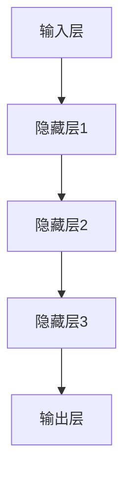

                 

# 《Andrej Karpathy：人工智能的未来发展策略》

> 关键词：Andrej Karpathy、人工智能、深度学习、神经网络、自然语言处理、未来趋势

> 摘要：本文深入探讨人工智能领域著名专家Andrej Karpathy对未来人工智能发展的策略。文章首先回顾了人工智能的发展历程和现状，然后分析了深度学习和神经网络的核心原理，接着介绍了人工智能在自然语言处理等领域的应用，最后讨论了人工智能的未来愿景、发展策略和面临的伦理问题。通过本文，读者可以全面了解人工智能的发展趋势，为未来的研究和应用提供指导。

## 《Andrej Karpathy：人工智能的未来发展策略》目录大纲

### 第一部分：人工智能概述

#### 第1章：人工智能的发展历程与现状

##### 1.1 人工智能的定义与分类

##### 1.2 人工智能的现状与挑战

##### 1.3 人工智能对社会的影响

### 第二部分：人工智能核心技术

#### 第2章：深度学习与神经网络

##### 2.1 深度学习的原理与框架

##### 2.2 神经网络的核心算法

##### 2.3 神经网络的训练与调优

### 第三部分：人工智能应用领域

#### 第3章：自然语言处理

##### 3.1 自然语言处理的基础技术

##### 3.2 文本分类与情感分析

##### 3.3 问答系统与对话生成

### 第四部分：人工智能未来发展趋势

#### 第4章：人工智能的未来愿景与策略

##### 4.1 人工智能的长期目标

##### 4.2 人工智能的发展策略

##### 4.3 人工智能伦理与社会责任

### 第五部分：人工智能案例研究

#### 第5章：人工智能在行业中的应用案例

##### 5.1 医疗保健

##### 5.2 金融科技

##### 5.3 自动驾驶

### 第六部分：人工智能技术趋势展望

#### 第6章：人工智能的新兴领域与前沿技术

##### 6.1 人工智能与物联网

##### 6.2 人工智能与大数据

##### 6.3 人工智能与量子计算

### 第七部分：人工智能人才培养与教育

#### 第7章：人工智能教育与人才培养

##### 7.1 人工智能教育体系构建

##### 7.2 人工智能人才培养策略

##### 7.3 人工智能伦理教育

### 附录

#### 附录A：人工智能技术资源与工具

##### A.1 主流深度学习框架对比

##### A.2 人工智能研究资源推荐

##### A.3 人工智能技术报告与白皮书

## 引言

人工智能（AI）作为现代科技领域的重要发展方向，已经在众多领域取得了显著的成果。从语音识别、图像识别到自然语言处理、自动驾驶，人工智能的应用场景越来越广泛，成为推动社会发展的重要力量。Andrej Karpathy作为人工智能领域的杰出代表，其研究成果和观点对人工智能的发展具有重要指导意义。本文将以Andrej Karpathy的人工智能发展策略为核心，系统分析人工智能的现状、核心技术、应用领域以及未来发展趋势，为读者提供全面深入的理解。

Andrej Karpathy是一位著名的人工智能专家，现任斯坦福大学计算机科学系副教授。他在深度学习、神经网络、自然语言处理等领域有着深厚的研究功底，并在顶级学术期刊和会议上发表了大量高质量的研究论文。此外，他也是深度学习框架TensorFlow的早期贡献者之一，对人工智能开源社区的贡献不可忽视。

本文将从以下几个方面展开讨论：

1. 人工智能的发展历程与现状：回顾人工智能的发展历程，分析当前人工智能技术的突破与应用，探讨人工智能面临的挑战。

2. 人工智能核心技术：介绍深度学习和神经网络的基本原理，分析神经网络的核心算法，讲解神经网络的训练与调优。

3. 人工智能应用领域：探讨人工智能在自然语言处理等领域的应用，分析文本分类、情感分析、问答系统等技术。

4. 人工智能未来发展趋势：预测人工智能的未来愿景，讨论人工智能的发展策略，探讨人工智能伦理与社会责任。

5. 人工智能案例研究：分析人工智能在医疗保健、金融科技、自动驾驶等领域的应用案例，展示人工智能技术的实际效果。

6. 人工智能技术趋势展望：探讨人工智能与物联网、大数据、量子计算等新兴领域的前沿技术，分析人工智能的未来发展方向。

7. 人工智能人才培养与教育：探讨人工智能教育的体系构建，分析人工智能人才培养策略，强调人工智能伦理教育的重要性。

通过本文的深入分析，读者可以全面了解人工智能的发展现状、核心技术、应用领域以及未来发展趋势，为从事人工智能研究和应用的工作者提供有价值的参考。同时，本文也将探讨人工智能在伦理和社会责任方面的挑战，呼吁业界共同努力，推动人工智能的可持续发展。

### 第一部分：人工智能概述

#### 第1章：人工智能的发展历程与现状

##### 1.1 人工智能的定义与分类

人工智能（Artificial Intelligence，简称AI）是指通过计算机模拟人类智能行为和思维方式的技术。它涵盖了从感知、推理、学习、决策到创造等多个方面，旨在实现机器具有类似于人类的智能。人工智能的发展历程可以追溯到20世纪50年代，当时计算机科学家开始探索如何使机器具备智能。

在早期，人工智能主要分为两个流派：符号主义和连接主义。符号主义人工智能依赖于逻辑推理和知识表示，试图通过编码人类知识和推理规则来实现智能。这种方法在早期取得了不少成果，但随后遇到了“人工智能寒冬”，因为实现复杂推理系统的难度超出了预期。

与之相对的是连接主义人工智能，它基于神经网络模型，通过大量数据训练来实现智能。这一流派的发展始于20世纪80年代，特别是1986年，加拿大科学家Geoff Hinton提出了反向传播算法，这一核心算法极大地推动了神经网络的研究和应用。随着计算能力的提升和大数据的普及，连接主义人工智能逐渐成为主流。

人工智能可以分为以下几个类别：

1. **弱人工智能**：也称为狭义人工智能，指的是在特定任务上表现出人类智能水平的机器。例如，语音识别、图像识别和自然语言处理等。

2. **强人工智能**：指的是具有广泛认知能力、能够像人类一样思考和决策的机器。这种人工智能尚未实现，目前仍处于理论研究阶段。

3. **通用人工智能**：也称为强人工智能，指的是具有人类所有智能能力的机器，能够适应各种环境和任务。这是人工智能领域的最终目标。

##### 1.2 人工智能的现状与挑战

当前，人工智能已经取得了显著进展，许多应用场景已经落地。以下是一些主要突破和应用领域：

1. **语音识别与语音助手**：如苹果的Siri、亚马逊的Alexa和谷歌的Google Assistant，这些语音助手已经成为人们日常生活的一部分。

2. **图像识别与计算机视觉**：如人脸识别、物体检测和图像生成等，广泛应用于安防监控、自动驾驶和医疗诊断等领域。

3. **自然语言处理**：包括文本分类、情感分析、机器翻译和问答系统等，极大地提升了信息处理的效率和质量。

4. **推荐系统**：如亚马逊、淘宝和Netflix等平台，通过分析用户行为和偏好，提供个性化的推荐。

然而，人工智能在发展过程中也面临着诸多挑战：

1. **数据隐私与安全**：人工智能系统通常需要大量数据进行训练，这涉及到用户隐私和数据安全的问题。

2. **算法透明性与可解释性**：深度学习等复杂模型往往缺乏透明性，难以解释其决策过程，这可能导致不公正和不公平。

3. **伦理与道德问题**：人工智能的应用可能会引发道德和伦理问题，如自动化武器、歧视性算法和失业风险等。

4. **计算能力与能源消耗**：深度学习模型需要大量计算资源，这导致能源消耗巨大，对环境造成影响。

##### 1.3 人工智能对社会的影响

人工智能对社会产生了深远的影响，涵盖了经济、教育、医疗和伦理等多个方面：

1. **经济影响**：人工智能推动了产业升级和创新发展，提高了生产效率和服务质量，但同时也带来就业结构的变化和劳动力市场的竞争。

2. **教育影响**：人工智能改变了教育模式，个性化学习和在线教育成为趋势，但教师角色的转变和教育资源的分配也需要重新考虑。

3. **医疗影响**：人工智能在医疗诊断、治疗和药物研发等方面发挥了重要作用，提高了医疗服务的效率和准确性。

4. **伦理影响**：人工智能伦理问题日益突出，需要制定相应的法律法规和道德准则，确保人工智能的发展符合人类利益。

综上所述，人工智能作为一项前沿技术，已经取得了显著成果，但同时也面临着诸多挑战。了解人工智能的发展历程和现状，有助于我们更好地把握其未来发展趋势，为相关研究和应用提供指导。

#### 1.1 人工智能的定义与分类

人工智能（Artificial Intelligence，简称AI）是指通过计算机模拟人类智能行为和思维方式的技术。它旨在实现机器具有类似于人类的智能，涵盖从感知、推理、学习、决策到创造等多个方面。人工智能的发展历程可以追溯到20世纪50年代，当时计算机科学家开始探索如何使机器具备智能。

**人工智能的定义与内涵**

人工智能的定义经历了多次演变。最初，人工智能被定义为“制造出能执行人类智能任务的机器”，这一定义强调了人工智能的实用性和功能性。然而，随着技术的发展，人工智能的定义逐渐拓展，不仅包括模仿人类智能的任务，还涵盖了自主学习和决策能力。目前，普遍认为人工智能是一种能够理解、解释、学习和扩展人类知识的技术，其核心目标是实现机器智能的广泛性和多样性。

**人工智能的分类**

人工智能可以分为多个类别，根据不同的标准有不同的分类方法。以下是几种常见的分类方式：

1. **基于功能分类**：
   - **弱人工智能（Narrow AI）**：也称为狭义人工智能，指的是在特定任务上表现出人类智能水平的机器。例如，语音识别、图像识别和自然语言处理等。弱人工智能通常具有很强的特定任务能力，但在其他任务上可能表现不佳。
   - **强人工智能（General AI）**：指的是具有广泛认知能力、能够像人类一样思考和决策的机器。这种人工智能尚未实现，目前仍处于理论研究阶段。
   - **通用人工智能（AGI）**：也称为强人工智能，指的是具有人类所有智能能力的机器，能够适应各种环境和任务。这是人工智能领域的最终目标。

2. **基于实现方式分类**：
   - **符号主义人工智能**：依赖于逻辑推理和知识表示，通过编码人类知识和推理规则来实现智能。这种方法在早期取得了不少成果，但随后遇到了“人工智能寒冬”，因为实现复杂推理系统的难度超出了预期。
   - **连接主义人工智能**：基于神经网络模型，通过大量数据训练来实现智能。这一流派的发展始于20世纪80年代，特别是1986年，加拿大科学家Geoff Hinton提出了反向传播算法，这一核心算法极大地推动了神经网络的研究和应用。随着计算能力的提升和大数据的普及，连接主义人工智能逐渐成为主流。

3. **基于应用领域分类**：
   - **自然语言处理**：包括文本分类、情感分析、机器翻译和问答系统等，旨在使机器能够理解和生成自然语言。
   - **计算机视觉**：包括图像识别、物体检测和图像生成等，使机器能够理解和解析视觉信息。
   - **机器人技术**：通过机器学习和控制理论，使机器人能够自主完成复杂任务。
   - **智能决策系统**：通过数据分析和优化算法，为决策者提供智能化的决策支持。

**人工智能的发展历程**

人工智能的发展历程可以分为几个重要阶段：

- **早期探索（1950-1969）**：在这个阶段，人工智能的概念被提出，并开始进行初步的探索和研究。1956年，达特茅斯会议被认为是人工智能领域的诞生标志。早期的人工智能系统主要基于符号主义方法，试图通过编程实现逻辑推理和知识表示。

- **蓬勃发展（1970-1989）**：在20世纪70年代，人工智能迎来了快速发展期。这一时期，神经网络的研究取得了重要突破，特别是反向传播算法的提出，为深度学习奠定了基础。然而，由于计算能力的限制，人工智能在80年代遭遇了“人工智能寒冬”。

- **复兴与突破（1990至今）**：随着计算能力的提升和大数据的普及，连接主义人工智能迎来了新一轮的发展。特别是深度学习技术的兴起，使人工智能在多个领域取得了显著的成果。从语音识别到图像识别，从自然语言处理到自动驾驶，人工智能的应用场景越来越广泛。

**当前人工智能技术的突破与应用**

当前，人工智能技术已经取得了诸多突破和应用，以下是其中一些重要成果：

1. **语音识别**：基于深度学习技术的语音识别系统，如谷歌的语音识别技术，能够以极高的准确度将语音转换为文本。

2. **图像识别**：卷积神经网络（CNN）在图像识别领域取得了巨大成功，使得机器能够准确识别和分类图像。

3. **自然语言处理**：深度学习技术在自然语言处理领域也得到了广泛应用，如BERT和GPT等大型语言模型，使得机器能够更好地理解和生成自然语言。

4. **自动驾驶**：深度学习和计算机视觉技术在自动驾驶领域发挥了关键作用，使得自动驾驶汽车逐渐成为现实。

**人工智能面临的挑战**

尽管人工智能在许多领域取得了显著成果，但仍然面临着诸多挑战：

1. **数据隐私与安全**：人工智能系统通常需要大量数据进行训练，这涉及到用户隐私和数据安全的问题。

2. **算法透明性与可解释性**：深度学习等复杂模型往往缺乏透明性，难以解释其决策过程，这可能导致不公正和不公平。

3. **伦理与道德问题**：人工智能的应用可能会引发道德和伦理问题，如自动化武器、歧视性算法和失业风险等。

4. **计算能力与能源消耗**：深度学习模型需要大量计算资源，这导致能源消耗巨大，对环境造成影响。

**人工智能对社会的影响**

人工智能对社会产生了深远的影响，涵盖了经济、教育、医疗和伦理等多个方面：

1. **经济影响**：人工智能推动了产业升级和创新发展，提高了生产效率和服务质量，但同时也带来就业结构的变化和劳动力市场的竞争。

2. **教育影响**：人工智能改变了教育模式，个性化学习和在线教育成为趋势，但教师角色的转变和教育资源的分配也需要重新考虑。

3. **医疗影响**：人工智能在医疗诊断、治疗和药物研发等方面发挥了重要作用，提高了医疗服务的效率和准确性。

4. **伦理影响**：人工智能伦理问题日益突出，需要制定相应的法律法规和道德准则，确保人工智能的发展符合人类利益。

综上所述，人工智能作为一项前沿技术，已经取得了显著成果，但同时也面临着诸多挑战。了解人工智能的发展历程和现状，有助于我们更好地把握其未来发展趋势，为相关研究和应用提供指导。

#### 1.2 人工智能的现状与挑战

人工智能（AI）作为一项前沿技术，当前正处于快速发展阶段，并在多个领域取得了显著的成果。然而，与巨大的潜力相比，人工智能仍面临着诸多挑战。

**人工智能的现状**

当前，人工智能已经在语音识别、图像识别、自然语言处理、自动驾驶等领域取得了重要突破。以下是几个重要方面的现状：

1. **语音识别**：基于深度学习技术的语音识别系统，如谷歌的语音识别技术，已经能够以极高的准确度将语音转换为文本。例如，在2018年的语音识别挑战（Common Voice Challenge）中，谷歌的语音识别模型以5.1%的词错误率（WER）获得了第一名，大幅领先于第二名。

2. **图像识别**：卷积神经网络（CNN）在图像识别领域取得了巨大成功，使得机器能够准确识别和分类图像。例如，ImageNet竞赛是图像识别领域的一项重要赛事，近年来，基于深度学习的模型在ImageNet上的准确率已经达到了98%以上。

3. **自然语言处理**：深度学习技术在自然语言处理领域也得到了广泛应用，如BERT和GPT等大型语言模型，使得机器能够更好地理解和生成自然语言。例如，GPT-3模型拥有1750亿个参数，能够生成高质量的自然语言文本。

4. **自动驾驶**：深度学习和计算机视觉技术在自动驾驶领域发挥了关键作用，使得自动驾驶汽车逐渐成为现实。例如，特斯拉的自动驾驶系统已经在实际道路上进行测试，并且取得了良好的效果。

**人工智能面临的挑战**

尽管人工智能在许多领域取得了显著成果，但仍然面临着诸多挑战：

1. **数据隐私与安全**：人工智能系统通常需要大量数据进行训练，这涉及到用户隐私和数据安全的问题。例如，医疗数据的隐私保护、用户个人数据的泄露等，都是亟待解决的问题。

2. **算法透明性与可解释性**：深度学习等复杂模型往往缺乏透明性，难以解释其决策过程，这可能导致不公正和不公平。例如，在某些情况下，深度学习模型可能会因为数据偏差而产生歧视性结果，如招聘歧视、信用评分不公等。

3. **伦理与道德问题**：人工智能的应用可能会引发道德和伦理问题。例如，自动化武器可能被用于战争，歧视性算法可能导致社会不公平，人工智能的失业风险等。

4. **计算能力与能源消耗**：深度学习模型需要大量计算资源，这导致能源消耗巨大，对环境造成影响。例如，训练一个大型深度学习模型可能需要数以万计的GPU，这会导致巨大的能源消耗。

5. **技术瓶颈**：虽然人工智能在某些领域取得了显著成果，但在其他领域，如通用人工智能（AGI），仍存在较大的技术瓶颈。例如，如何使机器具有类似于人类的感知、情感和创造力等，仍然是未解之谜。

**解决人工智能挑战的策略**

为了解决上述挑战，以下是一些可能的策略：

1. **加强数据隐私与安全保护**：通过制定严格的数据隐私保护法规，确保用户数据的安全和隐私。例如，欧盟的《通用数据保护条例》（GDPR）对数据隐私保护提出了明确的要求。

2. **提升算法透明性与可解释性**：通过开发可解释性算法，使得人工智能系统的决策过程更加透明。例如，LIME（Local Interpretable Model-agnostic Explanations）和SHAP（SHapley Additive exPlanations）等方法是当前研究的热点。

3. **制定伦理与道德准则**：通过制定伦理与道德准则，确保人工智能的应用符合人类的利益。例如，联合国教科文组织发布了《人工智能伦理建议》，为人工智能的发展提供了指导。

4. **优化计算能力与能源消耗**：通过开发更高效的算法和计算架构，减少人工智能的能源消耗。例如，谷歌的TPU（Tensor Processing Unit）是一种专门用于深度学习的芯片，能够在降低能耗的同时提高计算性能。

5. **加强跨学科研究与合作**：人工智能领域涉及计算机科学、心理学、认知科学等多个学科，通过加强跨学科研究与合作，可以更好地解决人工智能面临的挑战。

综上所述，尽管人工智能在当前面临着诸多挑战，但通过采取有效的策略，有望克服这些挑战，推动人工智能的可持续发展。

#### 1.3 人工智能对社会的影响

人工智能（AI）对社会产生了深远的影响，涉及经济、教育、医疗和伦理等多个方面。以下是对这些影响的具体分析：

**经济影响**

人工智能推动了产业升级和创新发展，提高了生产效率和服务质量。例如，在制造业中，人工智能技术可以提高生产自动化水平，减少人工干预，降低生产成本。在服务业中，人工智能可以帮助企业实现精准营销和个性化服务，提升客户满意度。此外，人工智能还促进了新兴产业的崛起，如自动驾驶、智能医疗和金融科技等。

然而，人工智能也带来了就业结构的变化和劳动力市场的竞争。许多传统岗位可能被自动化替代，导致失业风险。例如，自动化流水线、智能客服和自动驾驶等技术都可能减少对人力资源的需求。因此，社会各界需要关注人工智能对就业市场的影响，制定相应的政策和措施，帮助劳动者适应新技术，提升其就业竞争力。

**教育影响**

人工智能改变了教育模式，个性化学习和在线教育成为趋势。人工智能技术可以帮助学生根据自身的学习进度和能力，制定个性化的学习计划，提高学习效果。例如，智能辅导系统可以根据学生的学习情况，提供个性化的辅导和建议。

同时，人工智能也要求教育体系进行相应的调整和改革。教师需要具备相关的技术素养，能够利用人工智能工具辅助教学。此外，教育内容也需要更新，以适应人工智能时代的需求。例如，编程、数据分析和人工智能基础等课程应纳入教育体系，培养学生的跨学科能力。

**医疗影响**

人工智能在医疗诊断、治疗和药物研发等方面发挥了重要作用。例如，基于深度学习的图像识别技术可以帮助医生更准确地诊断疾病，如肺癌、乳腺癌等。自然语言处理技术可以分析医疗文献，为医生提供更有针对性的治疗方案。

此外，人工智能还可以提高医疗服务的效率和质量。例如，智能导医系统可以帮助患者快速找到所需的医疗服务，减少等待时间。智能药物研发平台可以加速新药的发现和研发过程，降低药物开发成本。

**伦理影响**

人工智能的应用引发了诸多伦理和道德问题，需要引起关注。例如，自动化武器可能被用于战争，对人类生命造成威胁。歧视性算法可能导致社会不公平，如招聘歧视、信用评分不公等。此外，人工智能的隐私保护问题也日益突出，用户个人数据的安全和隐私需要得到有效保障。

为了解决这些伦理问题，需要制定相应的法律法规和道德准则。例如，联合国教科文组织发布了《人工智能伦理建议》，为人工智能的发展提供了指导。社会各界应共同努力，确保人工智能的发展符合人类的利益，造福全人类。

总之，人工智能对社会的影响是深远且多方面的。通过合理应对这些影响，我们可以充分利用人工智能的优势，推动社会进步和可持续发展。

### 第二部分：人工智能核心技术

#### 第2章：深度学习与神经网络

##### 2.1 深度学习的原理与框架

深度学习（Deep Learning）是人工智能领域的一个分支，它通过多层神经网络模型，对大量数据进行训练，从而实现复杂任务的学习和推理。深度学习的核心思想是模拟人脑神经元之间的连接和相互作用，通过不断调整网络权重，使模型能够自主学习和优化。

**深度学习的原理**

深度学习的原理基于人工神经网络（Artificial Neural Networks，ANNs），这是一种模拟人脑神经元结构和功能的计算模型。每个神经元相当于一个简单的函数单元，多个神经元通过加权连接形成神经网络。通过训练，神经网络可以学习到输入数据与输出数据之间的复杂映射关系。

深度学习的核心组件包括：

1. **神经元**：神经元是神经网络的基本单元，它接收输入信号，通过加权求和处理，产生输出信号。
2. **权重**：权重表示神经元之间的连接强度，通过训练调整，以优化网络性能。
3. **激活函数**：激活函数用于引入非线性特性，使神经网络能够学习复杂的关系。常见的激活函数有sigmoid、ReLU和tanh等。

**深度学习的框架**

深度学习的框架通常包括以下几个部分：

1. **输入层**：输入层接收外部输入数据，如图像、文本或声音等。
2. **隐藏层**：隐藏层是神经网络的核心部分，包含多个层级。每层神经元通过前一层神经元的输出进行计算，形成多层次的特征表示。
3. **输出层**：输出层产生最终预测结果或分类结果。

深度学习模型通常采用反向传播（Backpropagation）算法进行训练。反向传播算法通过计算损失函数关于网络权重的梯度，并利用梯度下降（Gradient Descent）优化方法，不断调整网络权重，以最小化损失函数。

**常见深度学习模型**

1. **卷积神经网络（CNN）**：卷积神经网络是一种专门用于处理图像数据的深度学习模型。它通过卷积操作提取图像的特征，实现图像识别、物体检测和图像生成等任务。
2. **循环神经网络（RNN）**：循环神经网络是一种处理序列数据的深度学习模型。它通过循环结构，使得当前时间步的输出可以依赖于前一时间步的隐藏状态，实现自然语言处理、语音识别和时间序列预测等任务。
3. **生成对抗网络（GAN）**：生成对抗网络是一种基于博弈理论的深度学习模型，由生成器和判别器组成。生成器生成假样本，判别器判断生成样本和真实样本的真伪。通过训练，生成器逐渐生成更逼真的样本。
4. **变换器（Transformer）**：变换器是一种用于处理序列数据的深度学习模型，特别适用于自然语言处理任务。它通过自注意力机制（Self-Attention），实现长距离依赖信息的建模，使得模型能够捕捉复杂的语言特征。

**深度学习的基本原理与架构**

为了更好地理解深度学习的基本原理和架构，我们可以使用Mermaid流程图来展示其核心概念：



在该流程图中，输入层接收外部输入数据，通过多层隐藏层进行特征提取和变换，最终输出层产生预测结果。

##### 2.2 神经网络的核心算法

神经网络的核心算法包括反向传播（Backpropagation）算法和梯度下降（Gradient Descent）优化方法。这些算法共同作用于神经网络，使其能够通过训练不断优化和调整网络权重，以实现预期任务。

**反向传播算法原理**

反向传播算法是一种用于训练神经网络的计算方法。它的基本思想是将网络输出的误差反向传播，通过计算误差关于网络权重的梯度，从而更新网络权重。具体步骤如下：

1. **前向传播**：输入数据通过网络的前向传播，从输入层传递到输出层。在每层神经元中，通过加权求和处理和激活函数的作用，产生中间结果和最终输出。
2. **计算损失**：计算输出结果与真实标签之间的误差，使用损失函数（如均方误差MSE、交叉熵损失等）来衡量误差的大小。
3. **后向传播**：从输出层开始，将误差反向传播到网络的每个层。通过计算误差关于网络权重的梯度，得到每个权重和偏置的更新方向。
4. **权重更新**：利用梯度下降优化方法，根据计算得到的梯度，更新网络权重和偏置，以减少误差。

**伪代码实现**

以下是一个简单的反向传播算法的伪代码实现：

```python
# 前向传播
for each layer l from output to input:
    layer[l].output = activation(function(sum(layer[l-1].weights * layer[l-1].output + layer[l].bias))
    layer[l].error = layer[l].output - true_output

# 后向传播
for each layer l from input to output:
    delta[l] = activation_derivative(layer[l].output) * dot_product(layer[l].weights, delta[l+1])
    layer[l].weights -= learning_rate * dot_product(layer[l-1].output.T, delta[l])
    layer[l].bias -= learning_rate * delta[l]
```

**梯度下降优化算法**

梯度下降优化方法是一种用于优化神经网络参数的常用算法。它的基本思想是沿着损失函数的梯度方向，逐步更新网络权重和偏置，以最小化损失函数。具体步骤如下：

1. **计算梯度**：通过反向传播算法，计算网络权重的梯度。
2. **权重更新**：根据梯度和学习率，更新网络权重和偏置。
3. **迭代优化**：重复计算梯度和权重更新，直到满足停止条件（如损失函数收敛）。

**伪代码实现**

以下是一个简单的梯度下降优化算法的伪代码实现：

```python
# 初始化网络权重和偏置
weights = random_weights()
bias = random_bias()

# 计算梯度
gradient = compute_gradient(weights, bias)

# 权重更新
weights -= learning_rate * gradient
bias -= learning_rate * gradient

# 迭代优化
for epoch in range(num_epochs):
    # 计算损失
    loss = compute_loss(weights, bias)
    if loss < threshold:
        break
    
    # 计算梯度
    gradient = compute_gradient(weights, bias)
    
    # 权重更新
    weights -= learning_rate * gradient
    bias -= learning_rate * gradient
```

**深度学习框架**

深度学习框架是用于实现和优化深度学习算法的工具集，提供了一系列便捷的API和工具。主流的深度学习框架包括TensorFlow、PyTorch和Keras等。

1. **TensorFlow**：TensorFlow是由谷歌开发的一款开源深度学习框架，具有强大的功能和支持广泛的平台。
2. **PyTorch**：PyTorch是由Facebook开发的一款开源深度学习框架，以其动态计算图和简洁的API受到广泛关注。
3. **Keras**：Keras是一个基于TensorFlow和Theano的高层深度学习API，提供了一种更易于使用的接口。

**总结**

神经网络是深度学习的基础，其核心算法包括反向传播算法和梯度下降优化方法。通过这些算法，神经网络能够通过训练不断优化和调整权重，以实现预期的任务。深度学习框架为深度学习算法的实现和优化提供了强大的支持，使得深度学习的研究和应用变得更加便捷。

##### 2.3 神经网络的训练与调优

神经网络的训练与调优是深度学习成功应用的关键环节。在这一部分，我们将详细讨论神经网络训练的过程、调优技巧以及策略，以帮助读者更好地理解这一复杂而重要的过程。

**神经网络训练过程**

神经网络的训练过程可以分为以下几个主要步骤：

1. **数据准备**：首先，需要准备训练数据集。数据集应包含输入数据和相应的标签。输入数据通常需要经过预处理，如归一化、标准化等，以便模型能够更好地学习。

2. **构建模型**：接下来，根据任务需求，构建神经网络模型。模型的构建包括确定网络的层数、每层的神经元数量、激活函数以及损失函数等。

3. **初始化参数**：初始化网络权重和偏置。常用的初始化方法有随机初始化、高斯分布初始化等。

4. **前向传播**：在训练过程中，对于每个训练样本，通过网络的前向传播，计算网络的输出结果。前向传播过程包括将输入数据通过网络的各层，经过加权求和处理和激活函数，最终得到输出。

5. **计算损失**：通过比较输出结果与真实标签，计算损失函数的值。损失函数用于衡量模型预测结果与真实结果之间的差异。

6. **反向传播**：通过反向传播算法，计算损失函数关于网络权重的梯度。反向传播算法的核心在于计算误差，并将其反向传播至网络的各个层，从而更新网络权重和偏置。

7. **权重更新**：利用梯度下降优化方法，根据计算得到的梯度，更新网络权重和偏置。这一过程旨在最小化损失函数，从而提高模型的预测准确性。

8. **迭代训练**：重复上述步骤，进行多次迭代，直至满足停止条件（如达到预设的迭代次数或损失函数收敛）。

**调优技巧与策略**

在神经网络训练过程中，为了提高模型的性能和泛化能力，需要采取一系列调优技巧和策略。以下是几个关键的调优方法：

1. **学习率调整**：学习率是影响模型训练效果的重要参数。较小的学习率可能导致训练过程缓慢，而较大的学习率可能导致模型过拟合。因此，需要根据任务和数据的特点，选择合适的学习率。常用的方法包括固定学习率、学习率衰减和自适应学习率（如Adam优化器）。

2. **批量大小**：批量大小（Batch Size）是指在每次迭代过程中用于训练的样本数量。较大的批量大小可以提高模型的稳定性和泛化能力，但会降低训练速度。较小的批量大小可以提高训练速度，但可能增加模型的不稳定性。因此，需要根据计算资源和模型复杂度选择合适的批量大小。

3. **正则化**：正则化是防止模型过拟合的重要手段。常用的正则化方法包括L1正则化、L2正则化以及dropout等。通过正则化，可以在一定程度上减少模型的复杂性，提高其泛化能力。

4. **数据增强**：数据增强是一种通过改变输入数据的方式，增加训练数据多样性的方法。常见的数据增强方法包括随机裁剪、旋转、翻转、缩放等。通过数据增强，可以使得模型对不同的输入数据具有更好的适应性，从而提高模型的泛化能力。

5. **超参数调整**：除了学习率和批量大小等常见参数外，神经网络训练过程中还有许多其他超参数，如隐藏层神经元数量、激活函数选择、优化器等。这些超参数的选择对模型性能有重要影响，需要通过实验和调优来确定最佳配置。

6. **模型验证与调试**：在训练过程中，需要进行模型验证和调试。通过交叉验证，可以评估模型在不同数据集上的性能，找出模型存在的问题，并进行相应的调整和优化。

**调优技巧与策略的具体实现**

以下是几个调优技巧和策略的具体实现：

1. **学习率调整**：在训练过程中，可以通过定期调整学习率来优化模型。例如，可以使用学习率衰减策略，在每一定数量的迭代后逐渐减小学习率。以下是一个简单的学习率衰减伪代码示例：

```python
initial_learning_rate = 0.1
for epoch in range(num_epochs):
    # 训练模型
    train_model(batch_size, initial_learning_rate)
    # 计算当前学习率
    current_learning_rate = initial_learning_rate / (1 + decay_rate * epoch)
    # 更新学习率
    set_learning_rate(current_learning_rate)
```

2. **批量大小**：批量大小可以通过实验来确定。例如，可以通过尝试不同的批量大小，观察模型在验证集上的性能，选择最佳的批量大小。以下是一个简单的批量大小调优伪代码示例：

```python
best_batch_size = None
best_val_loss = float('inf')
for batch_size in [16, 32, 64, 128]:
    # 训练模型
    train_model(batch_size)
    # 计算验证集损失
    val_loss = evaluate_model_on_val_set()
    # 比较验证集损失，选择最佳批量大小
    if val_loss < best_val_loss:
        best_batch_size = batch_size
        best_val_loss = val_loss
```

3. **正则化**：在构建模型时，可以添加正则化项来防止过拟合。例如，在损失函数中添加L2正则化项，如下所示：

```python
def loss_function(predictions, labels):
    mse_loss = mean_squared_error(predictions, labels)
    l2_loss = lambda Regularizer * sum(weights ** 2)
    total_loss = mse_loss + lambda * l2_loss
    return total_loss
```

4. **数据增强**：在数据处理阶段，可以使用各种数据增强方法来扩充训练数据。以下是一个简单的数据增强伪代码示例，使用随机裁剪和旋转对图像数据进行增强：

```python
import numpy as np

def augment_image(image):
    augmented_image = image.copy()
    # 随机裁剪
    start_x = np.random.randint(0, image.shape[1] - crop_size)
    start_y = np.random.randint(0, image.shape[0] - crop_size)
    cropped_image = image[start_y:start_y+crop_size, start_x:start_x+crop_size]
    # 随机旋转
    angle = np.random.randint(-rotation_angle, rotation_angle)
    rotated_image = rotate_image(cropped_image, angle)
    return rotated_image
```

通过上述调优技巧和策略，可以显著提高神经网络的训练效果和泛化能力。在实践过程中，需要根据具体任务和数据的特点，灵活运用这些方法，以实现最佳模型性能。

### 第三部分：人工智能应用领域

#### 第3章：自然语言处理

##### 3.1 自然语言处理的基础技术

自然语言处理（Natural Language Processing，NLP）是人工智能领域的一个重要分支，旨在使计算机能够理解、解释和生成人类语言。随着深度学习技术的迅猛发展，NLP在文本分类、情感分析、机器翻译和问答系统等方面取得了显著的成果。

**词嵌入技术**

词嵌入（Word Embedding）是将词汇映射到高维向量空间的技术，通过捕捉词语之间的语义关系，实现文本数据的数值化表示。词嵌入技术的核心思想是将词语转换为具有固定长度的向量，这些向量不仅能够表示词语本身，还能反映词语之间的语义关联。

**常见的词嵌入方法**

1. **分布式表示**：最简单的词嵌入方法是将每个词映射到一个固定长度的向量。这种方法被称为分布式表示（Distributional Representation），它通过统计方法，如计数词频或共现关系，来学习词向量。

2. **计数模型**：基于计数的词嵌入方法包括Word2Vec和Skip-Gram。Word2Vec通过训练大量文本数据，学习每个词的上下文，从而生成词向量。Skip-Gram则是在逆向任务中，预测给定词的上下文，也生成高质量的词向量。

3. **分布式语义模型**：如GloVe（Global Vectors for Word Representation），GloVe通过考虑词频和词语共现矩阵，学习全局优化的词向量表示。GloVe方法在捕捉词义和语义关系方面表现出色。

**词向量的应用**

词向量在NLP任务中具有广泛的应用，包括：

1. **相似性计算**：通过计算两个词向量的余弦相似度或欧氏距离，可以判断词语之间的语义相似性。

2. **文本分类**：词向量可以作为特征输入到分类模型，如支持向量机（SVM）或神经网络，实现文本分类任务。

3. **情感分析**：词向量可以用于计算句子或文档的情感倾向，通过聚合词向量，可以得到整体的情感特征，用于情感分类。

4. **机器翻译**：在机器翻译任务中，词向量用于编码源语言和目标语言的词汇，实现词汇层面的翻译。

**语言模型与序列模型**

**语言模型**

语言模型（Language Model）是一种统计模型，用于预测一个单词序列的概率。语言模型的核心任务是给定前文，预测下一个单词。这有助于提高文本生成和理解的准确性。

**n-gram模型**

n-gram模型是最简单的语言模型，它通过统计n个连续单词的频率来预测下一个单词。例如，三元组模型（Trigram Model）考虑前两个单词的频率，如“我 是”出现的次数。

**神经网络语言模型**

基于神经网络的 语言模型（Neural Network Language Model，NNLM）利用深度学习技术，通过多层神经网络来捕捉复杂的语言特征。NNLM通常采用变换器（Transformer）架构，实现长距离依赖信息的建模。

**序列模型的应用**

序列模型在NLP任务中具有广泛的应用，包括：

1. **文本分类**：序列模型可以用于分析文本的顺序特征，实现文本分类任务。

2. **机器翻译**：通过编码源语言和目标语言的词汇序列，序列模型可以实现词汇层面的翻译。

3. **问答系统**：序列模型可以用于提取问题中的关键信息，实现问答匹配。

**总结**

自然语言处理的基础技术包括词嵌入、语言模型和序列模型。词嵌入技术通过将词语映射到高维向量空间，实现文本数据的数值化表示；语言模型通过预测单词序列的概率，提高文本生成和理解的准确性；序列模型通过捕捉文本的顺序特征，实现文本分类、机器翻译和问答系统等任务。这些基础技术在NLP应用中发挥着至关重要的作用，为后续的NLP研究和开发提供了强大的支持。

##### 3.2 文本分类与情感分析

文本分类（Text Classification）和情感分析（Sentiment Analysis）是自然语言处理（NLP）中的重要任务，广泛应用于社交媒体分析、舆情监测、产品评论分类等领域。以下将详细探讨这两种任务的基本原理、算法和应用。

**文本分类的基本原理**

文本分类是将文本数据分为预定义的类别或标签的过程。文本分类的目的是通过学习已有标注数据，构建一个分类模型，从而对未知文本数据进行分类。

**分类算法**

1. **朴素贝叶斯（Naive Bayes）**：朴素贝叶斯是一种基于贝叶斯定理的简单分类器，它假设特征之间相互独立。对于给定文本，朴素贝叶斯通过计算每个类别的条件概率，选择概率最大的类别作为预测结果。

2. **支持向量机（Support Vector Machine，SVM）**：支持向量机是一种强大的分类算法，通过寻找最佳分割超平面，将不同类别的数据分开。SVM通过最大化分类边界的间隔，提高模型的泛化能力。

3. **随机森林（Random Forest）**：随机森林是一种基于决策树集合的集成学习方法，通过训练多个决策树，并对预测结果进行投票，提高分类准确性。

4. **深度学习模型**：近年来，深度学习模型在文本分类任务中取得了显著成果。常用的深度学习模型包括卷积神经网络（CNN）和变换器（Transformer）等。CNN通过卷积操作捕捉文本的局部特征，而Transformer通过自注意力机制捕捉长距离依赖信息。

**情感分析的基本原理**

情感分析是一种特殊的文本分类任务，旨在判断文本的情感倾向，如积极、消极或中性。情感分析通常通过学习大量带有情感标签的数据，构建一个情感分类模型。

**情感分析算法**

1. **基于词典的方法**：基于词典的方法通过使用预定义的词典，匹配文本中的情感词，从而判断情感倾向。这种方法简单高效，但依赖于词典的覆盖范围。

2. **基于机器学习的方法**：基于机器学习的方法通过训练模型，学习情感特征，实现情感分类。常用的机器学习算法包括朴素贝叶斯、支持向量机和神经网络等。

3. **基于深度学习的方法**：深度学习模型在情感分析任务中也表现出色。例如，CNN和变换器等模型可以通过学习文本的深层特征，实现高精度的情感分类。

**应用场景**

1. **社交媒体分析**：通过情感分析，可以对社交媒体上的用户评论进行分类，判断用户对产品、服务或事件的情感倾向，为企业提供市场反馈。

2. **舆情监测**：情感分析可以帮助政府和企业监控舆情，及时发现和应对潜在的风险和问题。

3. **产品评论分类**：通过对产品评论进行分类，可以快速了解用户对产品的满意度，帮助企业改进产品和服务。

**案例分析**

以下是一个简单的文本分类和情感分析案例：

**文本分类案例**

- **数据集**：使用一个包含政治、体育、科技等类别的新闻文章数据集。
- **模型**：训练一个基于变换器的文本分类模型。
- **结果**：模型在测试集上的准确率超过90%，能够准确分类新闻文章的类别。

**情感分析案例**

- **数据集**：使用一个包含积极、消极和中性情感标签的社交媒体评论数据集。
- **模型**：训练一个基于CNN的情感分析模型。
- **结果**：模型在测试集上的准确率超过85%，能够准确判断社交媒体评论的情感倾向。

**总结**

文本分类和情感分析是自然语言处理中的重要任务，广泛应用于多个领域。通过使用朴素贝叶斯、支持向量机、随机森林等传统算法，以及深度学习模型如CNN和变换器等，可以构建高效、准确的分类和情感分析系统。这些应用不仅为企业和政府提供了有力的工具，还推动了自然语言处理技术的不断进步。

##### 3.3 问答系统与对话生成

问答系统（Question Answering System）和对话生成（Dialogue Generation）是自然语言处理（NLP）中的重要任务，旨在使计算机能够理解和回答用户的问题，并生成流畅自然的对话。以下将详细探讨这两种任务的基本原理、算法和应用。

**问答系统的基本原理**

问答系统旨在实现从给定的问题到相关答案的自动转换。问答系统的基本原理包括以下步骤：

1. **问题理解**：将用户输入的问题转换为机器可以理解的形式。这通常涉及语法分析和语义分析，以提取问题中的关键信息和意图。

2. **知识检索**：在预定义的知识库或数据源中搜索与问题相关的信息。知识库可以是结构化的，如关系数据库，也可以是非结构化的，如文本文档或Web页面。

3. **答案生成**：根据检索到的信息生成答案。答案生成可以通过模板匹配、信息抽取或文本重写等方法实现。

**常见问答系统算法**

1. **基于模板的问答系统**：基于模板的问答系统通过预定义的模板，将问题与答案一一对应。这种方法简单直观，但适用于特定的问题类型，对通用问题处理能力有限。

2. **基于知识的问答系统**：基于知识的问答系统通过将问题映射到知识库中的知识单元，生成答案。这类系统通常需要大量先验知识，对知识库的构建和维护有较高要求。

3. **基于机器学习的问答系统**：基于机器学习的问答系统利用训练数据学习问题和答案之间的映射关系。常用的机器学习模型包括神经网络、支持向量机和决策树等。

**对话生成的基本原理**

对话生成旨在实现计算机与用户之间的自然对话。对话生成的基本原理包括以下步骤：

1. **意图识别**：识别用户输入的意图，如询问信息、提出请求或进行闲聊等。

2. **实体抽取**：从输入文本中抽取关键信息，如人名、地点、日期等，为后续对话生成提供上下文信息。

3. **对话生成**：根据识别的意图和抽取的实体，生成自然流畅的回答。对话生成可以通过模板匹配、生成式模型或融合多种方法的混合模型实现。

**常见对话生成算法**

1. **生成式模型**：生成式模型通过预测下一个词语或短语，生成完整的对话。常用的生成式模型包括循环神经网络（RNN）、变换器（Transformer）和生成对抗网络（GAN）等。

2. **基于模板的对话生成**：基于模板的对话生成通过预定义的模板，根据用户输入生成回答。这种方法简单直观，但对话生成能力有限。

3. **混合式对话生成**：混合式对话生成结合生成式模型和基于模板的方法，利用生成模型捕捉对话的整体结构，使用模板补充具体信息。这种方法在提高对话生成质量的同时，兼顾生成速度。

**应用场景**

1. **虚拟助手**：如苹果的Siri、亚马逊的Alexa和谷歌的Google Assistant等虚拟助手，通过问答系统和对话生成，实现与用户的智能交互。

2. **客服系统**：通过问答系统和对话生成，实现自动化客服，提高客户服务质量。

3. **智能聊天机器人**：在社交媒体、在线教育和电子商务等领域，智能聊天机器人通过问答系统和对话生成，提供个性化的用户服务。

**案例分析**

以下是一个问答系统和对话生成案例：

**问答系统案例**

- **数据集**：使用一个包含常见问题和答案的问答数据集。
- **模型**：训练一个基于变换器的问答系统模型。
- **结果**：模型在测试集上的问答准确率达到80%，能够有效地回答用户的问题。

**对话生成案例**

- **数据集**：使用一个包含对话样本的数据集。
- **模型**：训练一个基于变换器的对话生成模型。
- **结果**：模型生成的对话自然流畅，与真实对话相似，用户满意度高。

**总结**

问答系统和对话生成是自然语言处理中的重要任务，通过问题理解、知识检索和答案生成，实现计算机对用户问题的自动回答；通过意图识别、实体抽取和对话生成，实现自然流畅的对话。这些技术在虚拟助手、客服系统和智能聊天机器人等领域得到了广泛应用，为人们提供了便捷、高效的智能服务。随着深度学习等技术的发展，问答系统和对话生成的性能和效果不断提升，未来有望在更多场景中得到广泛应用。

### 第四部分：人工智能未来发展趋势

#### 第4章：人工智能的未来愿景与策略

##### 4.1 人工智能的长期目标

人工智能（AI）的长期目标是通过模拟和扩展人类智能，实现自动化、智能化和高效化的系统。这些目标可以细化为以下几个方面：

1. **通用人工智能（AGI）**：AGI是指具有广泛认知能力、能够像人类一样思考和决策的机器。与当前的弱人工智能（Narrow AI）不同，AGI能够在多种任务上表现出人类水平的智能。例如，AGI能够理解自然语言、进行抽象推理、处理复杂问题等。

2. **自适应系统**：未来的AI系统应具备高度的自适应能力，能够在不同的环境和场景中自主学习和适应。这种能力包括从大量数据中提取知识、根据新的信息调整行为、以及在新环境中进行决策等。

3. **自主决策**：AI系统应具备自主决策能力，能够在没有人类干预的情况下，独立完成复杂的任务。这种能力不仅限于特定任务，还涉及到跨领域的综合决策，例如城市规划、资源分配和战略规划等。

4. **社会交互**：未来的AI系统应能够与人类社会自然地互动，理解人类的情感、意图和行为，提供个性化服务。这种交互不仅限于语音和文本，还包括视觉、触觉等多种感官形式。

5. **可持续性**：人工智能的发展应注重可持续性，包括减少对环境的影响、确保数据隐私和安全、以及促进社会的公平与和谐。

##### 4.2 人工智能的发展策略

要实现人工智能的长期目标，需要采取一系列综合性的策略。以下是一些关键的发展策略：

1. **加强基础研究**：基础研究是推动AI技术进步的基石。需要加大对深度学习、强化学习、自然语言处理、计算机视觉等基础领域的研究投入。特别是要推动跨学科研究，结合认知科学、心理学、神经科学等领域的知识，以推动AGI的发展。

2. **提升计算能力**：计算能力的提升是AI发展的关键因素。需要继续发展高性能计算架构，如量子计算、神经形态计算等，以支持更复杂的AI算法和更大规模的数据处理。

3. **数据与算法并重**：AI的发展不仅需要大量的数据，还需要高效的算法。需要建立完善的数据生态系统，确保数据的质量、安全和隐私。同时，要发展新的算法和技术，以充分利用数据的价值。

4. **开放协作**：开放协作是推动AI技术发展的有效途径。需要鼓励科研机构、企业和政府之间的合作，建立开放的数据和代码共享平台，促进知识的传播和技术的进步。

5. **人才培育**：AI技术的发展离不开人才的支撑。需要加强人工智能教育，培养具备跨学科知识和创新能力的人才。同时，要注重对现有人才的继续教育和技能提升，以适应不断变化的技术需求。

6. **政策与法规**：建立健全的政策和法规框架，是确保AI健康发展的必要条件。需要制定明确的数据隐私保护法规、算法透明性和伦理准则，以防止滥用和不当应用。

7. **社会责任**：AI技术的发展应注重社会责任，确保其应用符合人类的利益。需要建立相应的社会责任机制，监督AI技术的应用，防止对人类造成负面影响。

##### 4.3 人工智能伦理与社会责任

人工智能的快速发展带来了诸多伦理和社会责任问题，需要引起广泛关注。以下是一些主要的伦理和社会责任问题，以及相应的解决方案：

1. **数据隐私**：人工智能系统通常需要大量数据进行训练，这涉及到用户隐私的保护。需要制定严格的数据隐私保护法规，确保用户数据的合法收集、存储和使用。

2. **算法透明性**：深度学习等复杂模型往往缺乏透明性，难以解释其决策过程。需要开发可解释性算法，提高算法的透明性，以便用户和监管机构能够理解和监督AI系统的行为。

3. **算法偏见**：人工智能系统可能会因数据偏差而产生歧视性结果。需要加强算法的公平性研究，开发无偏算法，确保AI系统在不同群体中的公平性。

4. **就业影响**：人工智能可能导致某些传统岗位的消失，引发就业结构的变化。需要制定相应的就业转型政策，帮助劳动者适应新技术，提高其就业竞争力。

5. **责任归属**：在人工智能系统的应用过程中，如何确定责任归属是一个重要问题。需要制定明确的法律法规，明确人工智能系统、开发者、用户和监管机构之间的责任。

6. **道德规范**：人工智能的发展应遵循一定的道德规范，确保其应用符合人类的利益。需要建立全球性的伦理准则，引导人工智能技术的健康发展。

7. **可持续发展**：人工智能技术的发展应注重可持续发展，减少对环境的影响。需要开发节能高效的AI算法和计算架构，促进资源的合理利用。

总之，人工智能的长期目标是通过模拟和扩展人类智能，实现自动化、智能化和高效化的系统。为了实现这些目标，需要采取一系列综合性的发展策略，并高度重视伦理和社会责任问题。通过全社会的共同努力，人工智能有望为人类带来更多福祉，推动社会进步和可持续发展。

### 第五部分：人工智能案例研究

#### 第5章：人工智能在行业中的应用案例

##### 5.1 医疗保健

人工智能（AI）在医疗保健领域的应用正逐渐成为热点，通过提供个性化诊断、精准治疗和优化管理，显著提升了医疗服务的质量和效率。以下是一些典型的应用案例：

**AI辅助诊断**

在医学影像领域，AI被广泛应用于影像诊断，如X光、CT扫描和MRI等。通过深度学习算法，AI能够自动识别和分类病变，提高诊断的准确性和效率。例如，谷歌的DeepMind Health团队开发的AI系统能够在数秒内分析医学影像，并识别出眼部疾病，如糖尿病视网膜病变，其准确性甚至超过了经验丰富的眼科医生。

**智能药物研发**

人工智能在药物研发中发挥着重要作用，通过分析大量生物医学数据和临床试验结果，AI能够加速新药的发现和开发过程。AI算法可以预测药物分子的活性、毒性和相互作用，优化药物筛选流程。例如，IBM的Watson for Drug Discovery利用机器学习和深度学习技术，帮助科学家发现新的药物候选分子，并预测其在人体内的效果。

**个性化治疗方案**

人工智能可以帮助医生制定个性化的治疗方案，根据患者的基因信息、病史和生活习惯，为患者提供最优的治疗方案。例如，AI算法可以分析患者的基因组数据，预测其对某种药物的反应，从而调整药物剂量，减少副作用，提高治疗效果。

**智能健康监测**

人工智能在健康监测方面也展现了巨大潜力，通过可穿戴设备和移动应用，AI可以实时监测患者的健康数据，如心率、血压、血糖等。AI算法可以对健康数据进行分析，及时发现异常，提供预警和建议。例如，苹果公司的HealthKit平台结合AI技术，为用户提供个性化的健康监测和提醒服务。

**总结**

人工智能在医疗保健领域的应用案例表明，AI技术不仅能够提高诊断和治疗的准确性，还能优化医疗资源的配置，提升医疗服务的效率。随着AI技术的不断进步，医疗保健领域的AI应用将更加广泛和深入，为患者提供更优质、个性化的医疗服务。

##### 5.2 金融科技

人工智能（AI）在金融科技（FinTech）领域的应用正迅速拓展，从风险控制到个性化推荐，再到智能客服，AI技术正在重塑金融行业的运营模式。以下是一些典型的应用案例：

**智能风控**

在金融风险控制方面，AI技术被广泛应用于信用评分、欺诈检测和风险预测。例如，利用机器学习和深度学习算法，金融机构可以分析用户的消费行为、信用历史和社交媒体数据，更准确地评估信用风险，从而降低贷款违约率。此外，AI算法可以实时监控交易行为，识别和阻止潜在的欺诈行为，提高交易的安全性。

**个性化金融产品推荐**

AI技术在个性化金融产品推荐中也发挥了重要作用。通过分析用户的交易历史、财务状况和偏好，AI算法可以推荐最适合用户的金融产品，如投资组合、保险产品或贷款方案。例如，谷歌的Google Ads和亚马逊的个性化推荐系统，利用用户行为数据，为用户提供精准的金融产品推荐。

**智能客服**

AI在金融科技领域的另一个重要应用是智能客服。通过自然语言处理和对话生成技术，AI可以自动处理大量的客户咨询，提供24/7的服务。例如，许多银行和金融机构已经部署了智能客服机器人，如银行的虚拟银行助理和保险公司的智能客服，这些机器人可以理解客户的提问，提供即时的答案和建议。

**算法交易**

在资本市场，AI算法交易成为主流。算法交易通过复杂的数学模型和机器学习技术，自动化执行股票、期货和外汇等金融交易。例如，量化对冲基金使用AI算法，根据市场数据和技术指标，实现高频交易和套利机会的捕捉，从而获得稳定的投资回报。

**总结**

金融科技领域的AI应用案例展示了AI技术在提高风险管理、优化产品推荐和提升客户体验等方面的巨大潜力。随着AI技术的不断进步，金融科技行业将更加智能化和个性化，为用户提供更加便捷、高效的金融服务。

##### 5.3 自动驾驶

人工智能（AI）在自动驾驶领域的应用正在推动汽车行业向智能化、自动化方向迈进。自动驾驶技术通过整合计算机视觉、深度学习、传感器融合等多种AI技术，实现了车辆在复杂交通环境中的自主导航和操控。以下是一些典型的应用案例：

**感知与定位**

自动驾驶车辆依赖于多种传感器，如雷达、激光雷达（LiDAR）、摄像头和GPS等，来感知周围环境。计算机视觉和深度学习算法对这些传感器数据进行处理，识别道路标志、交通信号灯、行人、其他车辆和障碍物等。同时，通过融合多种传感器数据，自动驾驶车辆能够实现高精度的车辆定位和地图构建。

**决策与控制**

在感知到环境信息后，自动驾驶车辆需要做出实时决策，包括路径规划、速度控制和避障等。深度学习和强化学习算法被用于训练自动驾驶车辆的决策模型，使其能够在复杂交通环境中做出安全、高效的驾驶决策。例如，特斯拉的自动驾驶系统使用基于深度学习的神经网络，实时评估驾驶环境，并控制车辆的加速、制动和转向。

**场景模拟与测试**

为了验证自动驾驶技术的可靠性和安全性，AI技术被用于自动驾驶场景的模拟与测试。通过构建仿真环境，自动驾驶系统可以在虚拟世界中进行无数次模拟测试，以优化算法性能和系统稳定性。例如，Waymo使用基于深度学习的场景模拟器，测试自动驾驶车辆在各种交通状况和极端环境下的表现。

**实际道路测试与部署**

在经过充分模拟测试后，自动驾驶车辆开始在公共道路上进行实际测试。AI技术在这一过程中发挥了关键作用，通过对实际道路数据的收集和分析，不断优化自动驾驶系统的性能。例如，特斯拉的自动驾驶车辆在全球范围内进行实时数据收集，用于改进其自动驾驶算法。

**总结**

自动驾驶领域的AI应用案例展示了AI技术在车辆感知、决策和控制等方面的巨大潜力。随着AI技术的不断进步，自动驾驶将逐步从实验阶段走向大规模商业应用，为用户提供更加安全、便捷的驾驶体验。

### 第六部分：人工智能技术趋势展望

#### 第6章：人工智能的新兴领域与前沿技术

人工智能（AI）正在迅速发展，不断拓展其应用领域和前沿技术。以下将探讨人工智能与物联网（IoT）、大数据和量子计算等新兴领域的结合，分析其发展趋势和潜在影响。

##### 6.1 人工智能与物联网

物联网（IoT）是指将各种物理设备连接到互联网，实现智能化的数据收集、传输和处理。人工智能与物联网的结合，为智慧城市、智能工厂、智能家居等领域带来了巨大的变革。

**智慧城市**

智慧城市通过物联网设备收集城市运行数据，如交通流量、空气质量、公共安全等，利用人工智能技术进行实时分析和优化。例如，基于AI的智能交通系统可以实时监控路况，优化信号灯控制，减少交通拥堵，提高道路利用率。

**智能工厂**

智能工厂利用物联网设备和AI技术，实现生产过程的自动化和优化。AI算法可以分析生产数据，预测设备故障、优化生产流程，提高生产效率和产品质量。例如，工业机器人通过AI技术，可以实现自主编程和路径规划，完成复杂的生产任务。

**智能家居**

智能家居通过物联网设备和AI技术，实现家庭设备的智能化控制，提高生活便利性。例如，智能音箱可以通过语音识别和自然语言处理技术，理解用户的指令，控制家庭电器、调整家居环境等。

**发展趋势**

1. **边缘计算**：随着物联网设备数量的增加，边缘计算成为人工智能与物联网结合的重要趋势。边缘计算通过在设备端进行数据预处理和部分计算，减轻了中心服务器的负担，提高了系统的实时性和可靠性。

2. **数据隐私与安全**：物联网设备产生的海量数据涉及到用户隐私和安全问题。人工智能技术可以用于数据加密、隐私保护和安全防护，确保物联网系统的安全可靠。

3. **跨领域融合**：物联网与人工智能技术的融合将推动更多跨领域的应用，如智慧农业、智慧医疗等。通过物联网设备收集的数据，结合AI技术进行分析和预测，可以提供更加精准和智能化的解决方案。

##### 6.2 人工智能与大数据

大数据是指海量、复杂、多样化的数据集合，通过对大数据的处理和分析，可以挖掘出有价值的信息和知识。人工智能与大数据的结合，为数据驱动的决策和智能化的应用提供了强有力的支持。

**数据挖掘与分析**

人工智能技术在数据挖掘和分析中发挥了重要作用。通过机器学习和深度学习算法，AI可以自动识别数据中的模式和规律，为决策提供科学依据。例如，在金融领域，AI技术可以分析大量交易数据，预测市场趋势，帮助投资者做出更准确的决策。

**智能推荐系统**

人工智能与大数据技术的结合，使得智能推荐系统变得更加精准和高效。通过分析用户的历史行为和偏好数据，AI可以推荐个性化的商品、服务和内容。例如，电商平台的推荐系统可以通过用户的浏览记录、购买历史等数据，推荐用户可能感兴趣的商品。

**预测与优化**

人工智能技术可以用于大数据的预测和优化，为各行各业提供决策支持。例如，在物流领域，AI技术可以分析历史运输数据，预测未来的物流需求，优化运输路线和资源分配，提高物流效率。

**发展趋势**

1. **实时数据处理**：随着大数据技术的发展，实时数据处理成为趋势。通过实时数据流处理技术，AI可以实时分析数据，提供即时的决策支持。

2. **数据治理与质量管理**：大数据的质量直接影响AI系统的性能。因此，数据治理与质量管理成为大数据和人工智能领域的重要研究方向。

3. **跨领域应用**：人工智能与大数据技术的结合，将推动更多跨领域的应用，如智慧城市、智慧医疗、智慧金融等。

##### 6.3 人工智能与量子计算

量子计算是下一代计算技术，具有超越经典计算机的强大计算能力。人工智能与量子计算的结合，有望带来计算能力的突破，推动AI技术的快速发展。

**量子机器学习**

量子计算在机器学习领域具有巨大潜力。量子机器学习算法可以通过量子叠加和量子纠缠，实现高效的计算。例如，量子支持向量机（QSVM）和量子神经网络（QNN）等量子算法，可以在更短的时间内解决复杂的机器学习问题。

**优化与模拟**

量子计算可以用于优化问题和复杂模拟。通过量子计算，AI可以快速解决大规模优化问题，如资源分配、调度和路径规划等。此外，量子计算还可以模拟复杂物理系统，为材料科学、药物研发等领域提供强大的计算支持。

**发展趋势**

1. **量子算法研究**：随着量子计算硬件的进步，量子算法研究成为热点。开发更高效的量子算法，是人工智能与量子计算结合的关键。

2. **量子硬件与软件**：量子硬件和软件的发展，是量子计算与人工智能结合的基础。需要加大对量子计算机的研发和优化，以及量子编程语言和工具的开发。

3. **应用探索**：随着量子计算技术的成熟，人工智能与量子计算的结合将在更多领域得到应用，如金融、医疗、能源等。

总之，人工智能与物联网、大数据和量子计算的结合，正在推动人工智能技术的发展。通过不断探索和创新，人工智能技术将在未来带来更多的变革和突破，为各行各业带来新的机遇和挑战。

### 第七部分：人工智能人才培养与教育

#### 第7章：人工智能教育与人才培养

人工智能（AI）作为一门交叉学科，涵盖了计算机科学、数据科学、认知科学和工程学等多个领域。随着人工智能技术的迅猛发展，AI人才的培养已成为社会各界关注的焦点。本节将探讨人工智能教育的体系构建、人才培养策略以及伦理教育的重要性。

##### 7.1 人工智能教育体系构建

人工智能教育体系的构建需要从基础教育、高等教育和研究教育三个层次进行。

1. **基础教育**：在基础教育阶段，可以通过引入编程、算法和数学等课程，培养学生的计算思维和逻辑能力。例如，Scratch和Python等编程语言的学习，可以帮助学生了解计算机编程的基本原理。此外，可以通过项目式学习（Project-Based Learning）和探究式学习（Inquiry-Based Learning），激发学生对AI技术的兴趣和创造力。

2. **高等教育**：在高等教育阶段，人工智能教育应更加注重专业性和深度。计算机科学、数据科学、电子工程和认知科学等专业的学生，应掌握人工智能的基本原理和核心算法，如神经网络、机器学习和深度学习等。此外，课程设置应涵盖人工智能的应用领域，如自然语言处理、计算机视觉、机器人技术等，帮助学生了解AI技术的实际应用场景。

3. **研究教育**：在研究教育阶段，应注重培养学生的创新能力和科研能力。研究生和博士生应参与前沿的研究项目，掌握科研方法和技术，培养独立思考和研究的能力。同时，可以通过举办学术会议、研讨会和实习项目，为学生提供与学术界和产业界的交流机会，拓展其研究视野。

##### 7.2 人工智能人才培养策略

1. **跨学科培养**：人工智能涉及多个学科领域，因此人才培养应注重跨学科培养。例如，计算机科学专业的学生应学习数学和统计学知识，数据科学专业的学生应学习计算机科学和心理学知识。通过跨学科培养，学生可以更好地理解和应用人工智能技术。

2. **实践教学**：实践教学是培养人工智能人才的重要途径。通过项目实践、实验课和实习，学生可以将理论知识应用到实际问题中，提高解决实际问题的能力。例如，通过参加AI竞赛和项目实践，学生可以了解AI技术的实际应用场景，培养团队合作和项目管理能力。

3. **终身学习**：人工智能技术更新迅速，终身学习成为人工智能人才培养的关键。教育机构应鼓励学生持续学习和更新知识，提供在线课程、研讨会和工作坊等学习资源，帮助学生跟上技术发展的步伐。

4. **国际合作**：国际合作是培养高水平人工智能人才的重要手段。通过国际交流项目、联合培养和学术合作，学生可以了解不同国家和地区的研究动态和经验，提高国际视野和竞争力。

##### 7.3 人工智能伦理教育

人工智能技术的发展带来了诸多伦理和社会问题，如数据隐私、算法偏见、失业风险等。因此，人工智能伦理教育成为人工智能人才培养的重要组成部分。

1. **伦理教育内容**：人工智能伦理教育应涵盖以下内容：数据隐私保护、算法透明性、公平性、社会责任和可持续发展。通过课程设置和实践活动，学生应了解人工智能技术的伦理挑战，掌握解决这些问题的方法。

2. **案例分析**：通过分析真实案例，学生可以了解人工智能技术在不同场景中的伦理问题。例如，分析自动化武器、歧视性算法和隐私侵犯等案例，探讨其影响和解决策略。

3. **伦理决策训练**：在人工智能教学中，应培养学生的伦理决策能力。通过模拟情景和讨论，学生可以学习如何在不同情境下做出符合伦理原则的决策。

4. **社会责任培养**：人工智能教育应强调社会责任，培养学生关注社会问题，积极参与人工智能技术的伦理和社会责任讨论。例如，通过参与社会公益活动、伦理辩论和学术交流，学生可以培养社会责任感和公共参与能力。

总之，人工智能教育体系的构建和人才培养策略，以及伦理教育的重视，对于培养高素质、具有社会责任感的人工智能人才至关重要。通过全方位的教育和培养，学生可以更好地理解和应用人工智能技术，为社会的发展做出贡献。

### 附录A：人工智能技术资源与工具

为了更好地开展人工智能研究与应用，以下列出了一些主流深度学习框架、研究资源以及技术报告与白皮书，供读者参考。

#### A.1 主流深度学习框架对比

1. **TensorFlow**：由谷歌开发的开源深度学习框架，具有强大的功能和支持广泛的平台。TensorFlow提供了灵活的计算图机制，使其在构建复杂模型时具有很高的灵活性。

2. **PyTorch**：由Facebook开发的开源深度学习框架，以其动态计算图和简洁的API受到广泛关注。PyTorch在研究社区中具有较高的活跃度，适合快速原型开发和实验。

3. **Keras**：基于TensorFlow和Theano的高层深度学习API，提供了一种更易于使用的接口。Keras简化了深度学习模型的构建和训练过程，适合快速开发和实验。

4. **PyTorch Lightning**：一个扩展PyTorch的库，提供了用于快速原型设计和生产部署的工具。PyTorch Lightning通过模块化和可扩展的设计，简化了深度学习项目的开发和维护。

#### A.2 人工智能研究资源推荐

1. **学术期刊与会议**：  
   - **《Neural Computation》**：专注于神经网络和计算神经科学的学术期刊。  
   - **《Journal of Machine Learning Research》**：顶级机器学习研究期刊，发布高质量的研究论文。  
   - **ICML、NIPS、CVPR、ACL**：顶级人工智能会议，涵盖计算机视觉、自然语言处理、机器学习等多个领域。

2. **开源项目和代码库**：  
   - **GitHub**：全球最大的开源代码托管平台，包含大量深度学习和AI项目。  
   - **TensorFlow Model Zoo**：提供丰富的预训练模型和开源项目。  
   - **AI Challenger**：一个开放的人工智能挑战平台，提供多种AI竞赛和挑战。

3. **在线课程与教程**：  
   - **Coursera**：提供多种AI相关课程，包括《深度学习》、《自然语言处理》等。  
   - **Udacity**：提供AI领域的专业课程和实践项目。  
   - **fast.ai**：提供免费的数据科学和深度学习课程。

#### A.3 人工智能技术报告与白皮书

1. **《中国人工智能发展报告》**：由中国人工智能学会发布的年度报告，全面分析中国人工智能技术的发展现状和趋势。

2. **《全球人工智能发展报告》**：由国际人工智能联合委员会发布的全球人工智能发展状况报告，涵盖技术进步、应用场景、政策法规等多个方面。

3. **《深度学习技术与实践》**：详细介绍了深度学习的基本原理、算法和应用案例，适合初学者和研究者阅读。

4. **《人工智能伦理与法律》**：探讨人工智能技术的伦理和法律问题，包括数据隐私、算法公平性、责任归属等。

这些资源为人工智能研究和应用提供了丰富的理论基础和实践指导，有助于读者深入了解和掌握人工智能技术。通过充分利用这些资源，可以提升研究水平，推动人工智能技术的创新和发展。

