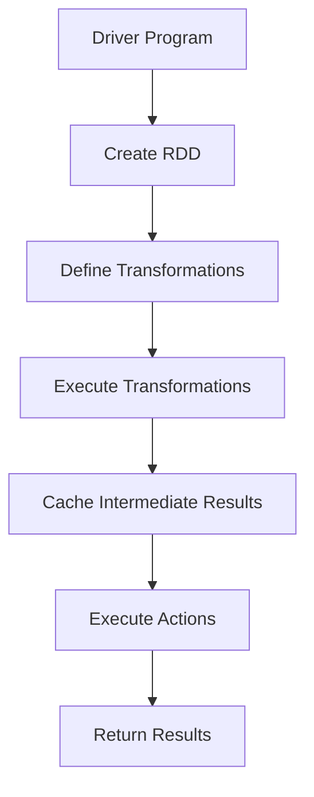

                 

### 《Apache Spark：大规模数据处理的利器》

> **关键词**：Apache Spark、分布式计算、大数据处理、内存计算、机器学习、实时流处理

**摘要**：
本文旨在深入探讨Apache Spark——这一在大数据处理领域广受欢迎的分布式计算框架。文章将从Spark的起源与背景、核心架构与组件、编程基础、核心概念与架构、核心算法原理、数学模型与公式，以及项目实战等方面进行详细讲解，帮助读者全面理解Spark的工作原理和实际应用。通过本文，读者将能够掌握如何利用Spark这一“大规模数据处理的利器”来高效地处理和分析海量数据。

### 《Apache Spark：大规模数据处理的利器》目录大纲

#### 第1章：Spark简介
1.1 Spark的起源与背景
1.2 Spark的核心架构
1.3 Spark的优势与适用场景
1.4 Spark生态系统概览
1.5 Spark版本演进与选择

#### 第2章：Spark编程基础
2.1 Spark编程模型
2.2 Spark的依赖管理
2.3 Spark的运行时环境
2.4 Spark配置与资源管理
2.5 Spark应用程序结构

#### 第3章：Spark核心组件
3.1 Spark Core
3.2 Spark SQL
3.3 Spark Streaming
3.4 MLlib
3.5 GraphX

#### 第4章：Spark核心概念与架构
4.1 RDD（弹性分布式数据集）
4.2 DataFrame与Dataset
4.3 Transformation与Action
4.4 Partitioning与Shuffle
4.5 Mermaid流程图：Spark执行流程

#### 第5章：Spark核心算法原理
5.1 分布式计算原理
5.2 内存管理原理
5.3 数据倾斜处理
5.4 伪代码：Shuffle过程详细实现

#### 第6章：Spark数学模型与公式
6.1 分布式算法数学模型
6.2 数据预处理的数学方法
6.3 聚类算法与优化
6.4 公式详解：
   $$ 
   \text{协方差矩阵} = \frac{1}{N}\sum_{i=1}^{N} (x_i - \bar{x})(y_i - \bar{y})
   $$

#### 第7章：Spark项目实战
7.1 Spark环境搭建与配置
7.2 数据采集与存储
7.3 数据处理与分析
7.4 代码解读与分析
7.5 实际案例实现：
   - 用户行为分析
   - 社交网络分析
   - 大规模日志处理

#### 附录
8.1 Spark常用工具与资源
8.2 Spark版本升级与兼容性
8.3 Spark社区与学习资源
8.4 伪代码示例：RDD操作实现

### Mermaid流程图：Spark执行流程

接下来，我们将逐一展开每个章节的内容，深入剖析Apache Spark的核心原理和应用实践。

---

### 第1章：Spark简介

#### 1.1 Spark的起源与背景

Apache Spark起源于2009年，由UC Berkeley的AMPLab（现在称为Berkeley DBLab）开发。最初，Spark作为一个用于大规模数据处理的研究项目，旨在解决传统Hadoop MapReduce在处理复杂数据分析和实时计算任务时的性能瓶颈。Spark的开发者们意识到，内存计算可以显著提高数据处理的速度，因此他们构建了一个基于内存计算的新型分布式计算框架。

2010年，Spark的首个公开版本发布，随后迅速获得了业界的关注和认可。2013年，Spark正式成为Apache软件基金会的孵化项目，并于2014年成为Apache软件基金会的一个顶级项目。Spark的快速发展得益于其出色的性能和丰富的功能，如今已成为大数据处理领域不可或缺的一部分。

#### 1.2 Spark的核心架构

Spark的核心架构由以下几个关键组件构成：

1. **Driver Program**：驱动程序是Spark应用程序的入口点，负责协调各个任务，并将任务分发到不同的Executor节点上执行。

2. **Executor**：Executor是Spark集群中的工作节点，负责执行由Driver Program分发来的任务，并返回执行结果。每个Executor都会在本地内存中存储和管理数据。

3. **Cluster Manager**：Cluster Manager负责分配资源和管理Executor节点。常见的Cluster Manager有YARN、Mesos和Stand

