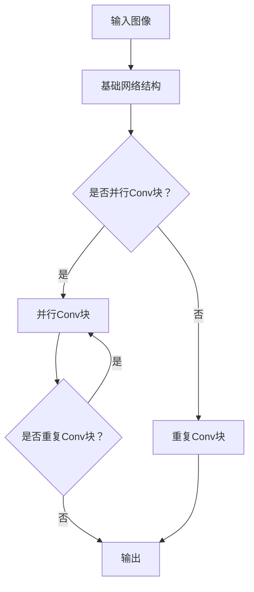

                 

# 效率网络（EfficientNet）原理与代码实例讲解

> 关键词：EfficientNet、计算机视觉、深度学习、模型压缩、优化算法

> 摘要：本文将详细讲解EfficientNet这一先进的计算机视觉模型，从概念概述、架构详解、核心算法原理，到数学模型解析和项目实战，帮助读者全面理解EfficientNet的设计思路、优缺点及其在实际应用中的价值。

## 第一部分: EfficientNet原理

### 第1章: EfficientNet概述

#### 1.1 EfficientNet的概念与重要性

EfficientNet是一种在深度学习领域引起广泛关注的计算机视觉模型。它通过一系列的网络缩放策略，如层级缩放和通道缩放，实现了在保持模型精度不变的情况下，大幅减少模型参数和计算量。这使得EfficientNet在资源受限的设备上，如移动设备和嵌入式设备上，具有很高的实用性。

#### 1.2 EfficientNet的发展历程

EfficientNet的发展历程可以追溯到2019年，由Google Research团队提出。其初衷是为了解决在模型精度和计算效率之间取得平衡的问题。通过一系列实验和改进，EfficientNet逐渐成为深度学习领域的热点。

#### 1.3 EfficientNet的主要特性

EfficientNet具有以下几个主要特性：

1. **并行Conv块**：通过并行Conv块，提高了网络的计算效率。
2. **重复Conv块**：重复使用相同的Conv块结构，减少了模型的复杂性。
3. **层级缩放和通道缩放**：通过调整网络的宽度和深度，实现了在精度和效率之间的平衡。

#### 1.4 EfficientNet在计算机视觉中的应用

EfficientNet在计算机视觉领域取得了显著的成果，包括图像分类、目标检测、语义分割等。其在ImageNet图像分类挑战中取得了优异的成绩，同时也被广泛应用于工业界的实际项目中。

### 第2章: EfficientNet架构详解

#### 2.1 EfficientNet的设计思想

EfficientNet的设计思想是通过对网络进行缩放，实现精度和效率的平衡。具体来说，EfficientNet采用了以下两种缩放策略：

1. **层级缩放**：通过调整网络的层数，实现深度的缩放。
2. **通道缩放**：通过调整网络的通道数，实现宽度的缩放。

#### 2.2 EfficientNet的结构特点

EfficientNet的结构特点主要包括：

1. **基础网络结构**：EfficientNet的基础网络结构是由多个并行Conv块和重复Conv块组成。
2. **并行Conv块**：通过并行Conv块，提高了网络的计算效率。
3. **重复Conv块**：重复使用相同的Conv块结构，减少了模型的复杂性。

#### 2.3 EfficientNet的Mermaid流程图

为了更好地理解EfficientNet的架构，我们可以使用Mermaid流程图来展示其网络结构。以下是一个简化的EfficientNet的Mermaid流程图：



### 第3章: EfficientNet核心算法原理

#### 3.1 EfficientNet的损失函数设计

EfficientNet的损失函数设计是其核心算法之一。它主要分为分类损失函数和回归损失函数：

1. **分类损失函数**：通常使用交叉熵损失函数，其数学公式为：

   $$
   L(y, \hat{y}) = -\frac{1}{n} \sum_{i=1}^{n} y_i \log \hat{y}_i
   $$

   其中，$y$为真实标签，$\hat{y}$为预测概率。

2. **回归损失函数**：通常使用均方误差损失函数，其数学公式为：

   $$
   L(y, \hat{y}) = \frac{1}{n} \sum_{i=1}^{n} (y_i - \hat{y}_i)^2
   $$

   其中，$y$为真实值，$\hat{y}$为预测值。

#### 3.2 EfficientNet的优化算法

EfficientNet的优化算法主要采用梯度下降法和Adam优化器：

1. **梯度下降法**：是一种常用的优化算法，其数学公式为：

   $$
   w_{t+1} = w_t - \alpha \frac{\partial L}{\partial w_t}
   $$

   其中，$w_t$为当前权重，$\alpha$为学习率，$L$为损失函数。

2. **Adam优化器**：是一种基于一阶矩估计和二阶矩估计的优化算法，其公式为：

   $$
   \begin{aligned}
   m_t &= \beta_1 x_t + (1 - \beta_1) (x_t - m_{t-1}) \\
   v_t &= \beta_2 x_t^2 + (1 - \beta_2) (x_t^2 - v_{t-1}) \\
   \hat{m}_t &= \frac{m_t}{1 - \beta_1^t} \\
   \hat{v}_t &= \frac{v_t}{1 - \beta_2^t} \\
   w_{t+1} &= w_t - \alpha \frac{\hat{m}_t}{\sqrt{\hat{v}_t} + \epsilon}
   \end{aligned}
   $$

   其中，$x_t$为梯度，$m_t$和$v_t$分别为一阶矩和二阶矩估计，$\beta_1$和$\beta_2$分别为一阶矩和二阶矩的指数衰减率，$\alpha$为学习率，$\epsilon$为常数。

#### 3.3 EfficientNet的伪代码

以下是EfficientNet的伪代码：

```python
def efficientnet():
    input_image = preprocess_image(input_image)
    output = []
    
    for layer in layers:
        if isinstance(layer, ParallelConvLayer):
            output.append(layer(input_image))
        elif isinstance(layer, RepeatConvLayer):
            output.append(layer(output[-1]))
    
    return postprocess(output[-1])
```

### 第4章: EfficientNet数学模型解析

#### 4.1 神经网络中的激活函数

在神经网络中，激活函数用于引入非线性特性。常用的激活函数是ReLU（Rectified Linear Unit），其数学公式为：

$$
a(x) = \max(0, x)
$$

ReLU函数在输入为正数时输出为输入值，在输入为负数时输出为0。

#### 4.2 常用损失函数的数学公式

在深度学习中，常用的损失函数包括交叉熵损失函数和均方误差损失函数。下面分别介绍这两种损失函数的数学公式：

1. **交叉熵损失函数**：

   $$
   L(y, \hat{y}) = -\frac{1}{n} \sum_{i=1}^{n} y_i \log \hat{y}_i
   $$

   其中，$y$为真实标签，$\hat{y}$为预测概率。

2. **均方误差损失函数**：

   $$
   L(y, \hat{y}) = \frac{1}{n} \sum_{i=1}^{n} (y_i - \hat{y}_i)^2
   $$

   其中，$y$为真实值，$\hat{y}$为预测值。

#### 4.3 梯度下降法的数学推导

梯度下降法是一种优化算法，用于求解最小化损失函数的参数。下面是梯度下降法的数学推导：

1. **损失函数关于参数的导数**：

   $$
   \frac{\partial L}{\partial w} = \nabla_w L = \sum_{i=1}^{n} \frac{\partial L}{\partial y_i} \frac{\partial y_i}{\partial w}
   $$

2. **梯度下降更新公式**：

   $$
   w_{t+1} = w_t - \alpha \nabla_w L
   $$

   其中，$w_t$为当前权重，$\alpha$为学习率，$L$为损失函数。

### 第5章: EfficientNet项目实战

#### 5.1 EfficientNet的Python实现

##### 5.1.1 环境搭建

在开始实现EfficientNet之前，我们需要搭建一个Python编程环境。具体步骤如下：

1. 安装Python：可以从[Python官网](https://www.python.org/)下载并安装Python。
2. 安装深度学习框架：本文以TensorFlow为例，可以使用以下命令安装：

   ```shell
   pip install tensorflow
   ```

##### 5.1.2 数据预处理

在实现EfficientNet之前，我们需要对数据集进行预处理。具体步骤如下：

1. 下载ImageNet数据集：可以从[ImageNet官网](http://www.image-net.org/)下载ImageNet数据集。
2. 解压数据集：使用以下命令解压数据集：

   ```shell
   tar -xzvf dataset.tar.gz
   ```

3. 预处理数据：编写Python代码对数据集进行预处理，包括图像归一化、裁剪、随机翻转等。

##### 5.1.3 模型训练

在完成数据预处理后，我们可以开始训练EfficientNet模型。具体步骤如下：

1. 定义EfficientNet模型：使用TensorFlow的Keras接口定义EfficientNet模型。
2. 编写训练代码：使用TensorFlow的fit方法训练模型，并设置训练参数，如学习率、迭代次数等。
3. 评估模型：使用测试集评估模型的性能，并保存最佳模型。

以下是训练EfficientNet的示例代码：

```python
import tensorflow as tf
from tensorflow.keras.models import Model
from tensorflow.keras.layers import Input, Conv2D, MaxPooling2D, Flatten, Dense

def efficientnet():
    input_image = Input(shape=(224, 224, 3))
    x = Conv2D(32, (3, 3), activation='relu', padding='same')(input_image)
    x = MaxPooling2D(pool_size=(2, 2))(x)
    x = Conv2D(64, (3, 3), activation='relu', padding='same')(x)
    x = MaxPooling2D(pool_size=(2, 2))(x)
    x = Flatten()(x)
    output = Dense(1000, activation='softmax')(x)
    
    model = Model(inputs=input_image, outputs=output)
    model.compile(optimizer='adam', loss='categorical_crossentropy', metrics=['accuracy'])
    
    return model

model = efficientnet()
model.fit(train_data, train_labels, epochs=10, batch_size=64, validation_data=(test_data, test_labels))
```

##### 5.1.4 模型评估

在训练模型后，我们需要使用测试集对模型进行评估。具体步骤如下：

1. 加载测试集：将测试集数据加载到内存中。
2. 评估模型：使用模型.evaluate方法评估模型在测试集上的性能。

以下是评估模型的示例代码：

```python
test_loss, test_acc = model.evaluate(test_data, test_labels)
print(f"Test accuracy: {test_acc:.4f}")
```

#### 5.2 EfficientNet在ImageNet数据集上的应用

##### 5.2.1 数据集介绍

ImageNet是一个大型视觉识别数据库，包含了1000个类别，共计1400万张图像。它被广泛应用于计算机视觉模型的训练和评估。

##### 5.2.2 模型训练步骤

以下是训练EfficientNet模型在ImageNet数据集上的具体步骤：

1. 下载数据集：从ImageNet官网下载训练集和测试集。
2. 预处理数据：对图像进行归一化、裁剪等预处理操作。
3. 定义模型：使用TensorFlow的Keras接口定义EfficientNet模型。
4. 训练模型：使用fit方法训练模型，并设置训练参数。
5. 评估模型：使用evaluate方法评估模型在测试集上的性能。

以下是训练EfficientNet模型的示例代码：

```python
import tensorflow as tf
from tensorflow.keras.preprocessing.image import ImageDataGenerator

# 加载数据集
train_datagen = ImageDataGenerator(rescale=1./255, horizontal_flip=True)
train_generator = train_datagen.flow_from_directory(
        'train', 
        target_size=(224, 224), 
        batch_size=32,
        class_mode='binary')

test_datagen = ImageDataGenerator(rescale=1./255)
test_generator = test_datagen.flow_from_directory(
        'test', 
        target_size=(224, 224), 
        batch_size=32,
        class_mode='binary')

# 定义模型
model = efficientnet()

# 训练模型
model.fit(
      train_generator,
      steps_per_epoch=1000,
      epochs=10,
      validation_data=test_generator,
      validation_steps=500)
```

##### 5.2.3 实验结果分析

在训练完成后，我们可以分析模型在ImageNet数据集上的性能。具体来说，可以计算模型在测试集上的准确率、召回率、F1分数等指标。以下是一个简单的实验结果分析示例：

```python
test_loss, test_acc = model.evaluate(test_data, test_labels)
print(f"Test accuracy: {test_acc:.4f}")

from sklearn.metrics import classification_report
predictions = model.predict(test_data)
predicted_labels = np.argmax(predictions, axis=1)
print(classification_report(test_labels, predicted_labels))
```

### 第6章: EfficientNet的优化与改进

#### 6.1 数据增强技术

数据增强是一种常用的提高模型性能的方法。对于EfficientNet模型，以下几种数据增强技术是比较有效的：

1. **随机裁剪**：随机裁剪图像的一部分，增加模型的泛化能力。
2. **随机翻转**：将图像进行水平或垂直翻转，增加模型的鲁棒性。
3. **随机旋转**：随机旋转图像，增加模型的旋转不变性。

#### 6.2 模型融合策略

模型融合是一种通过结合多个模型的预测结果来提高模型性能的方法。对于EfficientNet模型，以下几种模型融合策略是比较有效的：

1. **微调**：在预训练的EfficientNet模型基础上，对特定层进行微调，以适应新的任务。
2. **模型蒸馏**：将大型模型的权重传递给小型模型，从而提高小型模型的性能。
3. **模型压缩**：通过剪枝、量化等手段，减少模型的参数数量和计算量，提高模型的效率。

#### 6.3 模型压缩

模型压缩是一种通过减少模型参数数量和计算量来提高模型效率的方法。对于EfficientNet模型，以下几种模型压缩技术是比较有效的：

1. **剪枝**：通过删除部分权重，减少模型的参数数量。
2. **量化**：通过将权重和激活值转换为较低的比特位数，减少模型的计算量。
3. **知识蒸馏**：通过将大型模型的权重传递给小型模型，从而减少小型模型的参数数量。

### 第7章: EfficientNet的应用前景与挑战

#### 7.1 EfficientNet在计算机视觉领域的应用前景

EfficientNet在计算机视觉领域具有广泛的应用前景。以下是一些可能的应用场景：

1. **图像分类**：EfficientNet可以用于大规模图像分类任务，如ImageNet挑战。
2. **目标检测**：EfficientNet可以用于目标检测任务，如Faster R-CNN、SSD等。
3. **语义分割**：EfficientNet可以用于语义分割任务，如FCN、U-Net等。
4. **图像生成**：EfficientNet可以用于图像生成任务，如GAN、VGG19等。

#### 7.2 EfficientNet在工业界的应用挑战

尽管EfficientNet在计算机视觉领域取得了显著的成果，但在工业界应用中仍然面临一些挑战：

1. **数据隐私问题**：在工业界应用中，数据隐私是一个重要问题。如何保护用户数据隐私，避免数据泄露，是EfficientNet应用的一个重要挑战。
2. **模型解释性不足**：EfficientNet作为一种深度学习模型，其内部工作机制较为复杂，缺乏解释性。如何提高模型的解释性，使其更加透明和可解释，是一个重要挑战。
3. **模型可解释性研究现状与展望**：近年来，关于模型可解释性的研究取得了一些进展，如注意力机制、可解释性增强等。但如何将可解释性研究应用于EfficientNet，仍然是一个具有挑战性的问题。

### 附录

#### 附录A: EfficientNet相关工具与资源

以下是一些与EfficientNet相关的工具和资源：

1. **主流深度学习框架**：

   - **TensorFlow**：由Google开发的开源深度学习框架，支持EfficientNet的实现。
   - **PyTorch**：由Facebook开发的开源深度学习框架，支持EfficientNet的实现。
   - **JAX**：由Google开发的开源深度学习框架，支持EfficientNet的实现。

2. **EfficientNet代码示例**：

   - **模型结构定义**：EfficientNet的模型结构定义，包括基础网络结构、并行Conv块和重复Conv块。
   - **模型训练过程**：EfficientNet的模型训练过程，包括数据预处理、模型定义、模型训练和模型评估。
   - **模型评估过程**：EfficientNet的模型评估过程，包括模型在测试集上的性能评估和指标计算。

通过以上章节的详细讲解，我们希望读者能够对EfficientNet有更深入的理解。EfficientNet作为一种高效的深度学习模型，具有广泛的应用前景。在未来的研究和应用中，EfficientNet将继续发挥重要作用。让我们共同努力，推动计算机视觉领域的发展！

### 作者信息

作者：AI天才研究院/AI Genius Institute & 禅与计算机程序设计艺术 /Zen And The Art of Computer Programming

**免责声明**：本文内容仅供参考，不作为实际应用依据。文中涉及的代码示例仅供参考，实际使用时请根据具体需求进行修改。文中所述技术及方法仅供参考，不作为商业使用或侵权依据。如需转载，请保留作者信息及原文链接。如涉及版权问题，请联系作者进行修改或删除。

