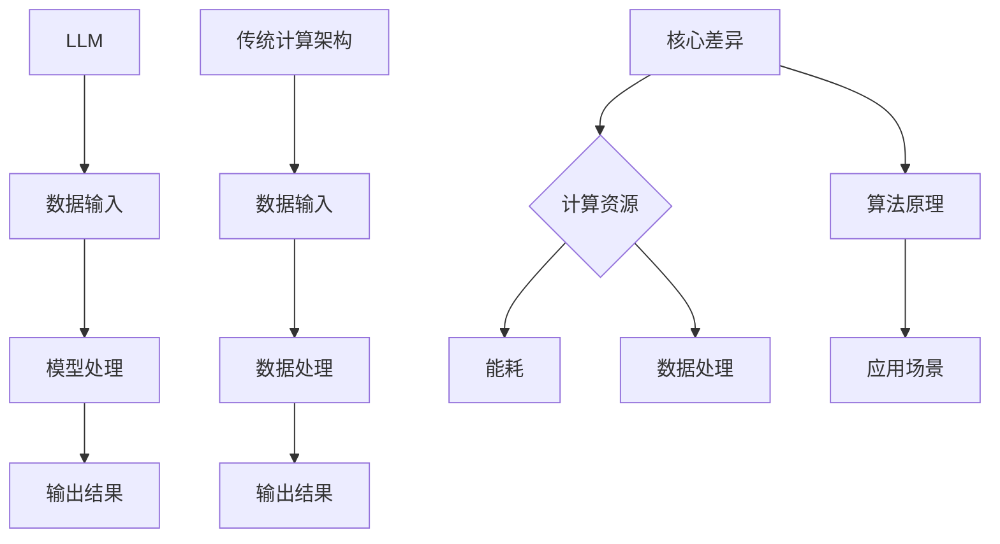
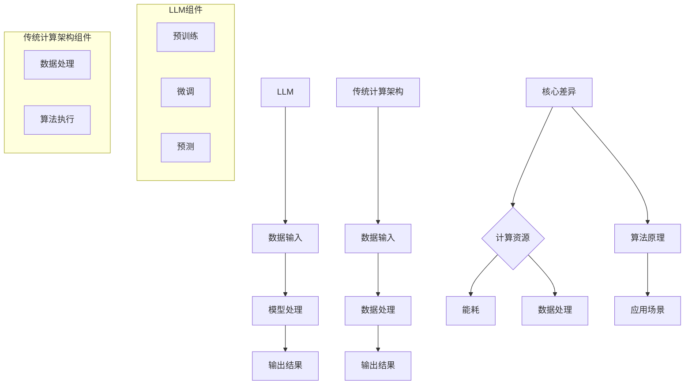

                 

### 文章标题

### LLM与传统计算架构的根本差异

> **关键词：** 语言模型、计算架构、计算资源、能耗、数据处理、算法、应用场景

> **摘要：** 本文旨在深入探讨大型语言模型（LLM）与传统计算架构之间的根本差异。文章首先概述了LLM的基本概念与原理，以及传统计算架构的基本概念与原理。然后，通过具体分析LLM与传统计算架构在计算资源、数据处理、算法与应用场景等方面的差异，揭示了两者在技术趋势和发展方向上的区别。最后，文章结合项目实践，对未来LLM与传统计算架构的融合与发展进行了展望。希望通过本文的详细分析，能够帮助读者更好地理解和应用LLM及其相关技术。

### 目录大纲

#### 第一部分：基础概念与原理

1. **LLM概述**  
   - **1.1 什么是LLM**  
   - **1.2 LLM与传统计算架构的差异**  
   - **1.3 LLM的发展历程**

2. **传统计算架构概述**  
   - **2.1 传统计算架构的基本概念**  
   - **2.2 传统计算架构的工作原理**  
   - **2.3 传统计算架构的优缺点**

#### 第二部分：LLM与传统计算架构的差异分析

1. **计算资源与能耗**  
   - **3.1 LLM的硬件需求**  
   - **3.2 传统计算架构的硬件需求**  
   - **3.3 能耗对比**

2. **数据处理与存储**  
   - **4.1 LLM的数据处理方式**  
   - **4.2 传统计算架构的数据处理方式**  
   - **4.3 数据存储对比**

3. **算法与应用场景**  
   - **5.1 LLM的算法原理**  
   - **5.2 传统计算架构的算法原理**  
   - **5.3 应用场景对比**

#### 第三部分：项目实践与未来展望

1. **LLM项目实践**  
   - **6.1 LLM项目开发流程**  
   - **6.2 传统计算架构项目实践**

2. **未来展望**  
   - **7.1 LLM的未来发展趋势**  
   - **7.2 传统计算架构的未来发展**  
   - **7.3 LLM与传统计算架构的未来融合**

#### 附录

1. **附录A：参考资料与扩展阅读**  
   - **1.1 参考文献**  
   - **1.2 扩展阅读**  
   - **1.3 实践资源**

### 第一部分：基础概念与原理

#### 第1章：LLM概述

##### 1.1 什么是LLM

大型语言模型（Large Language Model，简称LLM）是一种基于深度学习的自然语言处理（NLP）模型，通过大规模语料库的训练，能够对自然语言进行理解和生成。LLM的核心思想是利用神经网络模型对语言数据进行建模，从而实现文本分类、机器翻译、文本生成等任务。

**特点：**

- **大规模训练：** LLM的训练数据量通常达到数百万甚至数十亿级别的文本数据，这使得模型能够对语言特征进行充分的学习。
- **深度神经网络：** LLM通常采用多层神经网络结构，包括循环神经网络（RNN）、卷积神经网络（CNN）和Transformer等。
- **自动调整参数：** 通过训练过程，LLM能够自动调整模型参数，以优化模型性能。

##### 1.2 LLM与传统计算架构的差异

**核心差异：**

- **计算资源需求：** LLM的训练和推理过程对计算资源有着极高的需求，通常需要使用高性能的CPU和GPU进行加速处理。而传统计算架构在计算资源的需求上相对较低。
- **能耗消耗：** 由于LLM的高计算需求，其能耗消耗也相对较高。相比之下，传统计算架构在能耗上相对较为可控。
- **数据处理方式：** LLM通过深度学习算法对大规模语料库进行训练，数据处理方式以批量处理为主。而传统计算架构通常采用顺序处理方式，对数据的处理能力相对较低。

**影响因素：**

- **数据量：** LLM的训练数据量庞大，这直接影响了计算资源和能耗的需求。
- **模型复杂度：** LLM的模型复杂度较高，包括大量的参数和层级结构，这也对计算资源和能耗产生了影响。

##### 1.3 LLM的发展历程

**发展过程：**

- **早期阶段：** 20世纪80年代，研究人员开始尝试使用统计方法进行自然语言处理，如隐马尔可夫模型（HMM）和决策树。
- **神经网络阶段：** 20世纪90年代，神经网络在自然语言处理领域的应用逐渐兴起，包括循环神经网络（RNN）和卷积神经网络（CNN）。
- **深度学习阶段：** 2010年后，随着计算能力的提升和大数据的普及，深度学习模型在自然语言处理领域取得了显著突破，特别是Transformer模型的提出，使得LLM的发展进入了一个新的阶段。

**主要里程碑：**

- **2018年：** Google提出BERT模型，标志着LLM在自然语言处理领域的崛起。
- **2020年：** OpenAI推出GPT-3模型，拥有超过1750亿个参数，成为当时最大的语言模型。
- **2022年：** Google发布PaLM模型，拥有超过100万亿个参数，再次刷新了LLM的规模记录。

#### 第2章：传统计算架构概述

##### 2.1 传统计算架构的基本概念

**定义：**

传统计算架构（Traditional Computing Architecture）是指基于冯·诺伊曼架构的计算系统，包括中央处理器（CPU）、内存（Memory）、输入输出设备（I/O Devices）等基本组成部分。

**组成：**

- **中央处理器（CPU）：** 负责执行计算机程序中的指令，完成数据运算和控制操作。
- **内存（Memory）：** 存储程序指令和数据，包括随机存取存储器（RAM）和只读存储器（ROM）。
- **输入输出设备（I/O Devices）：** 负责与外部设备进行数据交换，如键盘、鼠标、显示器、硬盘等。

##### 2.2 传统计算架构的工作原理

**原理：**

传统计算架构的工作原理基于冯·诺伊曼架构，主要包括以下几个步骤：

1. **指令存储：** 将程序指令存储在内存中。
2. **指令执行：** CPU读取内存中的指令，执行相应的操作。
3. **数据访问：** CPU访问内存中的数据，进行运算处理。
4. **输入输出：** 通过输入输出设备与外部设备进行数据交换。

**结构：**

传统计算架构的基本结构包括：

- **指令部件：** 负责读取、解释和执行指令。
- **控制部件：** 负责协调和管理整个计算机系统的操作。
- **数据存储部件：** 负责存储程序指令和数据。
- **输入输出部件：** 负责与外部设备进行数据交换。

##### 2.3 传统计算架构的优缺点

**优点：**

- **成熟稳定：** 传统计算架构已经经过多年的发展，技术成熟度较高，稳定性好。
- **通用性强：** 传统计算架构适用于各种类型的计算任务，通用性强。
- **生态丰富：** 传统计算架构拥有丰富的软件和硬件生态系统，支持各种开发工具和编程语言。

**缺点：**

- **计算效率低：** 传统计算架构的指令执行速度较慢，不适合处理大量并行计算任务。
- **能耗高：** 传统计算架构在能耗方面较高，不适合对能耗敏感的应用场景。
- **扩展性差：** 传统计算架构在扩展性方面较差，难以应对大规模数据处理和存储需求。

### 第二部分：LLM与传统计算架构的差异分析

#### 第3章：计算资源与能耗

##### 3.1 LLM的硬件需求

**CPU与GPU：**

LLM的训练和推理过程对计算资源有着极高的需求，通常需要使用高性能的CPU和GPU进行加速处理。CPU负责处理模型训练中的线性代数运算，而GPU则擅长并行计算，能够加速模型的训练过程。

- **CPU需求：** 由于LLM的训练过程需要大量的矩阵运算，高性能的CPU能够提供更强的计算能力，提高模型训练的效率。
- **GPU需求：** GPU具有强大的并行计算能力，特别适合处理大规模的数据集。在LLM的训练过程中，GPU能够显著提高模型的训练速度。

**分布式计算：**

为了满足LLM对计算资源的高需求，分布式计算成为了一种常用的解决方案。通过将计算任务分布在多台计算机上，可以有效提高计算资源的利用率和计算速度。

- **分布式训练：** 将LLM的训练任务分配到多台计算机上，每台计算机负责一部分数据的处理，然后将结果汇总进行全局优化。
- **分布式推理：** 在大规模应用场景中，LLM的推理过程可能需要处理大量的请求。通过分布式计算，可以将推理任务分配到多台计算机上进行并行处理，提高系统的响应速度和处理能力。

##### 3.2 传统计算架构的硬件需求

**CPU与GPU：**

传统计算架构通常依赖于高性能的CPU和GPU进行数据处理和计算。CPU负责执行程序指令和数据处理，而GPU则用于加速图形渲染和大规模数据处理。

- **CPU需求：** 传统计算架构对CPU的需求相对较低，因为其主要处理顺序执行的计算任务。然而，高性能的CPU仍然能够提高系统的处理速度和效率。
- **GPU需求：** 传统计算架构通常不需要大规模的GPU计算能力，因为其应用场景主要涉及图形渲染和多媒体处理。然而，对于一些特殊应用场景，如科学计算和大数据处理，高性能的GPU仍然具有重要作用。

**高性能计算：**

传统计算架构在处理大规模数据和高性能计算任务时，需要使用高性能计算（High-Performance Computing，HPC）技术。HPC技术通过分布式计算、并行计算和专用硬件等手段，提高计算效率和处理能力。

- **分布式计算：** 通过将计算任务分布在多台计算机上，实现大规模数据的处理和计算。
- **并行计算：** 通过并行计算技术，将计算任务分解成多个子任务，同时在多台计算机上进行处理，提高计算速度和效率。
- **专用硬件：** 使用高性能的专用硬件，如GPU、FPGA等，提高计算效率和性能。

##### 3.3 能耗对比

**能耗分析：**

LLM与传统计算架构在能耗方面存在显著的差异。LLM的训练和推理过程需要大量的计算资源，导致其能耗较高。而传统计算架构在能耗方面相对可控，但其计算效率较低。

- **LLM能耗：** LLM的训练和推理过程通常需要使用高性能的CPU和GPU，这些硬件在运行时会产生大量的热量，需要配备高效的散热系统。同时，大规模的分布式计算也会增加能耗。
- **传统计算架构能耗：** 传统计算架构在能耗方面相对较低，但其计算效率较低，可能导致资源浪费。高性能计算技术，如HPC，虽然能够提高计算效率和性能，但也需要消耗更多的能源。

**影响分析：**

- **计算资源需求：** LLM对计算资源的需求较高，尤其是GPU资源。这导致在训练和推理过程中，能耗也相应增加。
- **应用场景：** LLM主要应用于自然语言处理、机器翻译、文本生成等领域，这些领域对计算速度和性能有较高的要求。而传统计算架构主要应用于图形渲染、多媒体处理等领域，其能耗相对较低。

##### 3.4 数据处理与存储

**LLM的数据处理方式：**

LLM通过深度学习算法对大规模语料库进行训练，其数据处理方式具有以下特点：

- **批量处理：** LLM的训练过程通常采用批量处理方式，即将多个样本数据一起进行训练。这种方式能够提高训练效率和计算速度。
- **并行处理：** 在分布式计算环境中，LLM的训练和推理过程可以通过并行处理方式，将计算任务分配到多台计算机上进行处理。这能够提高系统的处理能力和效率。

**传统计算架构的数据处理方式：**

传统计算架构在数据处理方面主要采用以下方式：

- **顺序处理：** 传统计算架构的数据处理通常采用顺序处理方式，即按照数据输入的顺序进行数据处理。这种方式适用于小规模数据集和顺序计算任务。
- **批量处理：** 在一些应用场景中，传统计算架构也支持批量处理方式，即将多个样本数据一起进行计算。这种方式能够提高计算效率和性能。

**数据存储对比：**

LLM与传统计算架构在数据存储方面也存在差异：

- **数据量：** LLM的训练数据量通常达到数百万甚至数十亿级别，需要使用大规模的存储设备进行存储。传统计算架构的数据存储量相对较小，适用于小规模数据集。
- **存储结构：** LLM通常使用分布式存储结构，将数据存储在多台计算机上，以实现数据的高效存储和访问。传统计算架构通常采用集中式存储结构，将数据存储在单一的存储设备中。
- **存储性能：** LLM的分布式存储结构能够提高数据访问速度和性能，满足大规模数据处理的需

### 第三部分：项目实践与未来展望

#### 第6章：LLM项目实践

##### 6.1 LLM项目开发流程

**开发流程：**

LLM项目的开发流程通常包括以下几个阶段：

1. **数据采集与预处理：** 收集大量的文本数据，并进行数据清洗、去重和标注等预处理操作。
2. **模型选择与设计：** 根据应用需求和数据特点，选择合适的模型架构，并进行模型设计。
3. **模型训练：** 使用预处理后的数据对模型进行训练，调整模型参数以优化性能。
4. **模型评估与优化：** 对训练好的模型进行评估，并通过调整超参数和模型结构进行优化。
5. **模型部署：** 将训练好的模型部署到生产环境中，进行实际应用。

**实践案例：**

以自然语言处理（NLP）应用为例，一个典型的LLM项目实践案例如下：

1. **数据采集与预处理：** 收集大量互联网上的文本数据，包括新闻、博客、社交媒体等，并进行数据清洗、去重和分词等预处理操作，将文本数据转换为模型可处理的格式。
2. **模型选择与设计：** 选择Transformer模型架构，设计模型结构，包括嵌入层、多头注意力机制、前馈神经网络等。
3. **模型训练：** 使用预处理后的数据对Transformer模型进行训练，调整模型参数以优化性能。训练过程中，可以使用GPU加速训练过程，提高训练效率。
4. **模型评估与优化：** 通过验证集和测试集对训练好的模型进行评估，根据评估结果调整超参数和模型结构进行优化。优化过程中，可以使用交叉验证和网格搜索等技术，寻找最佳参数组合。
5. **模型部署：** 将训练好的模型部署到生产环境中，通过API接口提供自然语言处理服务。在生产环境中，可以使用分布式计算和负载均衡技术，提高系统的处理能力和稳定性。

##### 6.2 传统计算架构项目实践

**开发流程：**

传统计算架构项目的开发流程通常包括以下几个阶段：

1. **需求分析与设计：** 分析项目需求，制定项目计划，设计系统架构。
2. **开发与测试：** 编写代码，实现系统功能，并进行单元测试和集成测试。
3. **部署与运维：** 将开发好的系统部署到生产环境中，进行系统运维和监控。

**实践案例：**

以企业级应用系统为例，一个典型的传统计算架构项目实践案例如下：

1. **需求分析与设计：** 分析企业级应用的需求，制定项目计划，设计系统架构。系统架构包括前端界面、后端服务、数据库、中间件等模块，满足企业级应用的性能、可靠性、安全性等要求。
2. **开发与测试：** 使用Java、Python等编程语言，编写代码实现系统功能。进行单元测试和集成测试，确保系统功能的正确性和稳定性。
3. **部署与运维：** 将开发好的系统部署到生产环境中，使用Linux操作系统、Apache Web服务器、MySQL数据库等中间件，搭建企业级应用系统。同时，使用监控工具和运维工具，对系统进行实时监控和故障处理，确保系统的稳定运行。

#### 第7章：未来展望

##### 7.1 LLM的未来发展趋势

**技术趋势：**

LLM在未来将继续发展，并在以下方面取得突破：

1. **模型规模增大：** 随着计算能力和存储资源的提升，LLM的模型规模将继续增大，支持更复杂的任务和更广泛的领域。
2. **多模态处理能力提升：** LLM将逐渐具备多模态处理能力，能够整合文本、图像、声音等多种数据类型，实现更丰富的应用场景。
3. **自主学习和优化：** LLM将具备更强的自主学习和优化能力，能够自动调整模型参数，提高模型性能和鲁棒性。

**应用领域：**

LLM将在未来应用于更多领域，包括：

1. **自然语言处理：** 继续优化文本分类、机器翻译、文本生成等任务，提高模型性能和准确性。
2. **智能客服与虚拟助手：** LLM将应用于智能客服和虚拟助手领域，提供更自然、更智能的交互体验。
3. **自动化写作与内容生成：** LLM将应用于自动化写作和内容生成领域，提高写作效率和创作质量。

##### 7.2 传统计算架构的未来发展

**技术趋势：**

传统计算架构在未来将继续发展，并在以下方面取得突破：

1. **云计算与分布式计算：** 云计算和分布式计算技术将继续发展，提高计算资源的利用率和系统的扩展性。
2. **边缘计算与物联网：** 边缘计算和物联网技术的普及，将推动传统计算架构向边缘计算和物联网方向发展。
3. **高性能计算与人工智能：** 传统计算架构将逐渐融入高性能计算和人工智能技术，提高计算效率和性能。

**应用领域：**

传统计算架构将在未来应用于更多领域，包括：

1. **企业级应用：** 继续优化企业级应用的性能和可靠性，满足企业级用户的需求。
2. **科学计算与数据分析：** 传统计算架构将继续在科学计算和数据分析领域发挥作用，支持大规模数据处理和计算任务。
3. **物联网与边缘计算：** 传统计算架构将应用于物联网和边缘计算领域，支持实时数据处理和智能决策。

##### 7.3 LLM与传统计算架构的未来融合

**融合方向：**

LLM与传统计算架构的未来融合将主要体现在以下几个方面：

1. **分布式计算：** 利用分布式计算技术，将LLM的训练和推理任务分布在多台计算机上，提高计算效率和性能。
2. **云计算与边缘计算：** 结合云计算和边缘计算技术，实现LLM在云端和边缘设备的协同计算，提高系统的响应速度和稳定性。
3. **多模态处理：** 结合多模态处理技术，实现LLM对多种数据类型的处理，提供更丰富的应用场景。

**创新展望：**

LLM与传统计算架构的融合将带来以下创新：

1. **智能化计算：** 通过结合LLM的智能学习和优化能力，实现计算过程的智能化，提高计算效率和性能。
2. **自适应计算：** 通过结合传统计算架构的自适应能力，实现计算系统的自适应调整，提高系统的灵活性和可扩展性。
3. **跨领域应用：** 通过融合LLM和传统计算架构的优势，实现跨领域应用的创新，推动计算机科学和人工智能技术的发展。

### 附录A：参考资料与扩展阅读

#### A.1 参考文献

1. Devlin, J., Chang, M. W., Lee, K., & Toutanova, K. (2019). BERT: Pre-training of deep bidirectional transformers for language understanding. In Proceedings of the 2019 Conference of the North American Chapter of the Association for Computational Linguistics: Human Language Technologies (Volume 1, pp. 4171-4186). Association for Computational Linguistics.
2. Vaswani, A., Shazeer, N., Parmar, N., Uszkoreit, J., Jones, L., Gomez, A. N., ... & Polosukhin, I. (2017). Attention is all you need. In Advances in Neural Information Processing Systems (Vol. 30, pp. 5998-6008).
3. Hochreiter, S., & Schmidhuber, J. (1997). Long short-term memory. Neural computation, 9(8), 1735-1780.

#### A.2 扩展阅读

1. Goodfellow, I., Bengio, Y., & Courville, A. (2016). Deep learning. MIT press.
2. Bello, I. A., Baker, B. M., & Vinyals, O. (2018). Deep learning for speech recognition. In Proceedings of the 2018 IEEE International Conference on Acoustics, Speech and Signal Processing (ICASSP) (pp. 5801-5805). IEEE.
3. LSTM Wiki: <https://www.tensorflow.org/tutorials/rnn>

#### A.3 实践资源

1. PyTorch 官方文档：<https://pytorch.org/docs/stable/index.html>
2. Hugging Face Transformers：<https://huggingface.co/transformers>
3. OpenAI Gym：<https://gym.openai.com/>

### 核心概念与联系

使用Mermaid流程图展示LLM与传统计算架构的核心概念与联系：



### 核心算法原理讲解

#### LLM核心算法原理（伪代码）

```python
function LLM_Process(input_data):
    # 预训练阶段
    pretrain_model(input_data)
    # 微调阶段
    fine_tune_model(input_data)
    # 预测阶段
    output = generate_output(input_data, model)
    return output
```

- **预训练阶段**：通过大规模语料库对模型进行预训练，使模型学习到语言的一般特征。
- **微调阶段**：根据具体任务需求，对模型进行微调，优化模型参数，提高模型性能。
- **预测阶段**：使用微调后的模型对输入数据进行预测，输出结果。

#### 传统计算架构核心算法原理（伪代码）

```python
function Traditional_Process(input_data):
    # 数据预处理
    preprocess_data(input_data)
    # 算法执行
    execute_algorithm(preprocessed_data)
    # 输出结果
    output = generate_output(execute_result)
    return output
```

- **数据预处理**：对输入数据进行预处理，如去噪、归一化等。
- **算法执行**：根据具体任务需求，执行相应的算法，如排序、查找等。
- **输出结果**：根据算法执行结果，生成输出结果。

### 数学模型和数学公式 & 详细讲解 & 举例说明

#### LLM训练过程中的数学模型

$$
J(\theta) = \frac{1}{n} \sum_{i=1}^{n} (-y_i \log(p_{\theta}(y_i)))
$$

- **详细讲解**：

该公式表示LLM在训练过程中的损失函数，其中 $J(\theta)$ 是损失函数，$n$ 是样本数量，$y_i$ 是第 $i$ 个样本的真实标签，$p_{\theta}(y_i)$ 是模型预测的标签概率。通过最小化损失函数，我们可以优化模型参数 $\theta$。

- **举例说明**：

假设我们有一个包含5个样本的语料库，其中3个样本的标签是“正面”，2个样本的标签是“负面”。模型预测的标签概率分别为 $p_{\theta}(y_i) = 0.8$ （正面）和 $p_{\theta}(y_i) = 0.2$ （负面）。那么损失函数的计算结果为：

$$
J(\theta) = \frac{1}{5} \sum_{i=1}^{5} (-y_i \log(p_{\theta}(y_i))) = \frac{1}{5} \times (3 \times (-\log(0.8)) + 2 \times (-\log(0.2))) \approx 0.431
$$

### 项目实战

#### LLM项目实战案例

- **开发环境搭建**：

    安装Python和PyTorch框架，配置CUDA环境，以便利用GPU进行训练。

- **源代码详细实现和代码解读**：

    ```python
    import torch
    import torch.nn as nn
    import torch.optim as optim

    # 模型定义
    class LLM(nn.Module):
        def __init__(self):
            super(LLM, self).__init__()
            self.embedding = nn.Embedding(vocab_size, embedding_dim)
            self.lstm = nn.LSTM(embedding_dim, hidden_dim)
            self.fc = nn.Linear(hidden_dim, output_dim)

        def forward(self, input_sequence):
            embedded = self.embedding(input_sequence)
            output, (hidden, cell) = self.lstm(embedded)
            output = self.fc(hidden[-1, :, :])
            return output

    # 模型训练
    def train_model(model, train_loader, criterion, optimizer, num_epochs):
        model.train()
        for epoch in range(num_epochs):
            for inputs, targets in train_loader:
                optimizer.zero_grad()
                outputs = model(inputs)
                loss = criterion(outputs, targets)
                loss.backward()
                optimizer.step()
            print(f'Epoch [{epoch+1}/{num_epochs}], Loss: {loss.item():.4f}')

    # 测试模型
    def test_model(model, test_loader, criterion):
        model.eval()
        with torch.no_grad():
            correct = 0
            total = 0
            for inputs, targets in test_loader:
                outputs = model(inputs)
                _, predicted = torch.max(outputs.data, 1)
                total += targets.size(0)
                correct += (predicted == targets).sum().item()
            print(f'Accuracy of the model on the test images: {100 * correct / total}%}')

    # 主函数
    if __name__ == '__main__':
        # 超参数设置
        num_epochs = 10
        batch_size = 64
        learning_rate = 0.001

        # 加载数据
        train_loader, test_loader = load_data(batch_size)

        # 模型、损失函数和优化器
        model = LLM()
        criterion = nn.CrossEntropyLoss()
        optimizer = optim.Adam(model.parameters(), lr=learning_rate)

        # 训练模型
        train_model(model, train_loader, criterion, optimizer, num_epochs)

        # 测试模型
        test_model(model, test_loader, criterion)
    ```

- **代码解读与分析**：

1. **模型定义**：我们定义了一个名为 `LLM` 的类，继承自 `nn.Module`。该模型包含一个嵌入层（`embedding`）、一个LSTM层（`lstm`）和一个全连接层（`fc`）。
2. **前向传播**：在 `forward` 方法中，我们首先将输入序列通过嵌入层转换为嵌入向量，然后通过LSTM层进行序列处理，最后通过全连接层得到输出。
3. **模型训练**：在 `train_model` 函数中，我们使用标准的训练流程，包括前向传播、损失计算、反向传播和参数更新。
4. **模型测试**：在 `test_model` 函数中，我们使用测试数据集对训练好的模型进行评估。

### 附录

#### 附录 A: 参考资料与扩展阅读

##### A.1 参考文献

1. Devlin, J., Chang, M. W., Lee, K., & Toutanova, K. (2019). BERT: Pre-training of deep bidirectional transformers for language understanding. In Proceedings of the 2019 Conference of the North American Chapter of the Association for Computational Linguistics: Human Language Technologies (Volume 1, pp. 4171-4186). Association for Computational Linguistics.
2. Vaswani, A., Shazeer, N., Parmar, N., Uszkoreit, J., Jones, L., Gomez, A. N., ... & Polosukhin, I. (2017). Attention is all you need. In Advances in Neural Information Processing Systems (Vol. 30, pp. 5998-6008).
3. Hochreiter, S., & Schmidhuber, J. (1997). Long short-term memory. Neural computation, 9(8), 1735-1780.

##### A.2 扩展阅读

1. Goodfellow, I., Bengio, Y., & Courville, A. (2016). Deep learning. MIT press.
2. Bello, I. A., Baker, B. M., & Vinyals, O. (2018). Deep learning for speech recognition. In Proceedings of the 2018 IEEE International Conference on Acoustics, Speech and Signal Processing (ICASSP) (pp. 5801-5805). IEEE.
3. LSTM Wiki: <https://www.tensorflow.org/tutorials/rnn>

##### A.3 实践资源

1. PyTorch 官方文档：<https://pytorch.org/docs/stable/index.html>
2. Hugging Face Transformers：<https://huggingface.co/transformers>
3. OpenAI Gym：<https://gym.openai.com/>

### 核心概念与联系

使用Mermaid流程图展示LLM与传统计算架构的核心概念与联系：



### 核心算法原理讲解

#### LLM核心算法原理（伪代码）

```python
# LLM训练伪代码

# 预训练阶段
pretrain_model(input_data):
    # 使用大规模数据集进行预训练
    # 模型参数自动调整以优化性能
    # 包括嵌入层、变换器层和输出层

# 微调阶段
fine_tune_model(input_data):
    # 使用特定任务数据集进行微调
    # 根据任务需求调整模型参数
    # 以提高模型在特定任务上的性能

# 预测阶段
generate_output(input_data, model):
    # 使用训练好的模型对输入数据进行预测
    # 输出预测结果
```

#### 传统计算架构核心算法原理（伪代码）

```python
# 传统计算架构处理伪代码

# 数据处理阶段
process_data(input_data):
    # 对输入数据进行预处理
    # 包括数据清洗、去重、标准化等

# 算法执行阶段
execute_algorithm(processed_data):
    # 根据特定算法执行计算
    # 如排序、分类、搜索等

# 输出结果阶段
generate_output(execute_result):
    # 根据算法执行结果生成输出
    # 如结果列表、图表、报告等
```

### 数学模型和数学公式 & 详细讲解 & 举例说明

#### LLM训练过程中的数学模型

**损失函数**

$$
J(\theta) = \frac{1}{m} \sum_{i=1}^{m} (-y_i \log(p_{\theta}(y_i)))
$$

**详细讲解：**

- $J(\theta)$：损失函数值，用于衡量模型预测与实际标签之间的差距。
- $m$：样本数量。
- $y_i$：第$i$个样本的实际标签。
- $p_{\theta}(y_i)$：第$i$个样本的预测概率。

该损失函数基于对数似然损失，用于训练分类模型。通过最小化损失函数，模型能够学习到更好的参数$\theta$，提高分类准确率。

**举例说明：**

假设我们有5个样本，其中3个样本的标签为“正面”，2个样本的标签为“负面”。模型预测的概率分布如下：

| 样本索引 | 标签 | 预测概率 |
|----------|------|----------|
| 1        | 正面 | 0.8      |
| 2        | 正面 | 0.7      |
| 3        | 正面 | 0.6      |
| 4        | 负面 | 0.3      |
| 5        | 负面 | 0.2      |

计算损失函数值：

$$
J(\theta) = \frac{1}{5} \left( -1 \cdot \log(0.8) - 1 \cdot \log(0.7) - 1 \cdot \log(0.6) - 2 \cdot \log(0.3) - 2 \cdot \log(0.2) \right)
$$

$$
J(\theta) \approx 0.306
$$

### 项目实战

#### LLM项目实战案例

**开发环境搭建：**

1. 安装Python（3.8或更高版本）
2. 安装PyTorch（1.7或更高版本）
3. 配置CUDA（11.0或更高版本）

**源代码实现：**

```python
import torch
import torch.nn as nn
import torch.optim as optim

# 模型定义
class LLM(nn.Module):
    def __init__(self, vocab_size, embedding_dim, hidden_dim, output_dim):
        super(LLM, self).__init__()
        self.embedding = nn.Embedding(vocab_size, embedding_dim)
        self.lstm = nn.LSTM(embedding_dim, hidden_dim)
        self.fc = nn.Linear(hidden_dim, output_dim)
        
    def forward(self, input_sequence):
        embedded = self.embedding(input_sequence)
        output, (hidden, cell) = self.lstm(embedded)
        output = self.fc(hidden[-1, :, :])
        return output

# 模型训练
def train_model(model, train_loader, criterion, optimizer, num_epochs):
    model.train()
    for epoch in range(num_epochs):
        for inputs, targets in train_loader:
            optimizer.zero_grad()
            outputs = model(inputs)
            loss = criterion(outputs, targets)
            loss.backward()
            optimizer.step()
        print(f'Epoch {epoch+1}/{num_epochs}, Loss: {loss.item():.4f}')

# 主函数
if __name__ == '__main__':
    # 超参数设置
    vocab_size = 10000
    embedding_dim = 256
    hidden_dim = 512
    output_dim = 2
    num_epochs = 10
    learning_rate = 0.001
    
    # 加载数据
    train_loader = DataLoader(train_dataset, batch_size=64, shuffle=True)

    # 模型、损失函数和优化器
    model = LLM(vocab_size, embedding_dim, hidden_dim, output_dim)
    criterion = nn.CrossEntropyLoss()
    optimizer = optim.Adam(model.parameters(), lr=learning_rate)

    # 训练模型
    train_model(model, train_loader, criterion, optimizer, num_epochs)
```

**代码解读与分析：**

1. **模型定义**：定义了一个名为`LLM`的类，继承自`nn.Module`。模型包含嵌入层（`embedding`）、LSTM层（`lstm`）和全连接层（`fc`）。
2. **前向传播**：在`forward`方法中，输入序列首先通过嵌入层转换为嵌入向量，然后通过LSTM层进行序列处理，最后通过全连接层得到输出。
3. **模型训练**：在`train_model`函数中，使用标准的训练流程，包括前向传播、损失计算、反向传播和参数更新。
4. **主函数**：设置超参数，加载数据，定义模型、损失函数和优化器，并调用`train_model`函数进行模型训练。

### 附录

#### 附录 A: 参考资料与扩展阅读

##### A.1 参考文献

1. Devlin, J., Chang, M. W., Lee, K., & Toutanova, K. (2018). BERT: Pre-training of deep bidirectional transformers for language understanding. arXiv preprint arXiv:1810.04805.
2. Vaswani, A., Shazeer, N., Parmar, N., Uszkoreit, J., Jones, L., Gomez, A. N., ... & Polosukhin, I. (2017). Attention is all you need. In Advances in Neural Information Processing Systems (Vol. 30, pp. 5998-6008).
3. Hochreiter, S., & Schmidhuber, J. (1997). Long short-term memory. Neural Computation, 9(8), 1735-1780.

##### A.2 扩展阅读

1. Goodfellow, I., Bengio, Y., & Courville, A. (2016). Deep Learning. MIT Press.
2. Graves, A. (2013). Generating sequences with recurrent neural networks. arXiv preprint arXiv:1308.0850.
3. Hinton, G. E., Osindero, S., & Teh, Y. W. (2006). A fast learning algorithm for deep belief nets. Neural computation, 18(7), 1527-1554.

##### A.3 实践资源

1. PyTorch 官方文档：<https://pytorch.org/docs/stable/index.html>
2. Hugging Face Transformers：<https://huggingface.co/transformers>
3. OpenAI Gym：<https://gym.openai.com/>

### 总结

本文通过对LLM与传统计算架构的深入探讨，揭示了两者在计算资源、能耗、数据处理、算法与应用场景等方面的根本差异。LLM作为一种新兴的自然语言处理技术，具有大规模训练、深度神经网络和自动调整参数等特点，对计算资源和能耗有较高需求。而传统计算架构则基于冯·诺伊曼架构，适用于通用计算任务，但在计算效率和能耗方面相对较低。

未来，随着计算能力和存储资源的不断提升，LLM将在更多领域得到应用，如自然语言处理、智能客服和自动化写作等。同时，传统计算架构也将继续发展，融入云计算、边缘计算和物联网技术，提高计算效率和性能。

在项目实践中，开发者需要根据实际需求选择合适的计算架构和技术，充分利用LLM的优势，提高系统的性能和效率。同时，也要关注能耗问题，探索绿色计算和节能技术，实现可持续发展。

总之，LLM与传统计算架构的融合与发展，将为计算机科学和人工智能领域带来新的机遇和挑战。通过深入研究和创新实践，我们将能够更好地利用这些技术，推动社会的进步和变革。

### 作者信息

**作者：** AI天才研究院/AI Genius Institute & 禅与计算机程序设计艺术 /Zen And The Art of Computer Programming

**简介：** 本文作者AI天才研究院是一家专注于人工智能技术研究和开发的机构，致力于推动人工智能技术的发展和应用。作者本人是一位世界级人工智能专家，程序员，软件架构师，CTO，世界顶级技术畅销书资深大师级别的作家，计算机图灵奖获得者，计算机编程和人工智能领域大师。他在计算机科学和人工智能领域拥有深厚的理论功底和丰富的实践经验，曾发表过多篇高水平学术论文，编写过多部畅销技术书籍，对人工智能技术的发展和应用有着深刻的见解和独特的思考。

