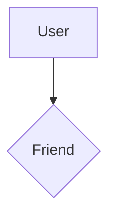
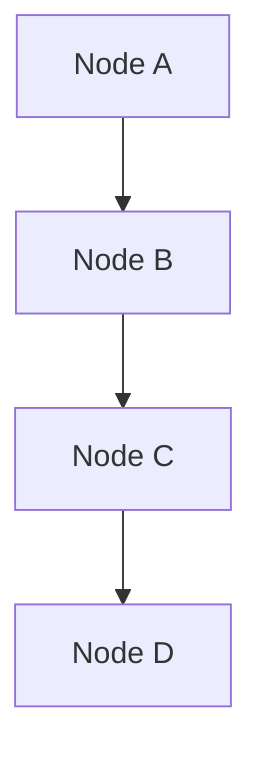
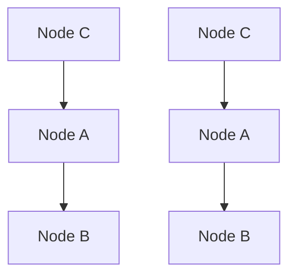
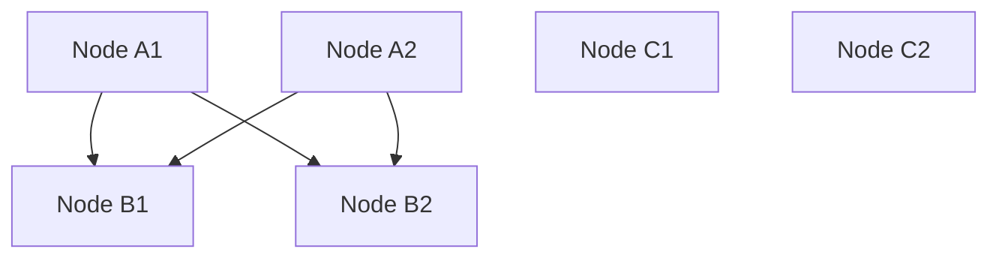
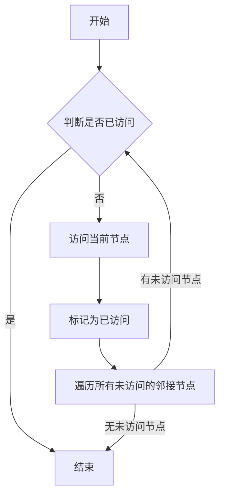
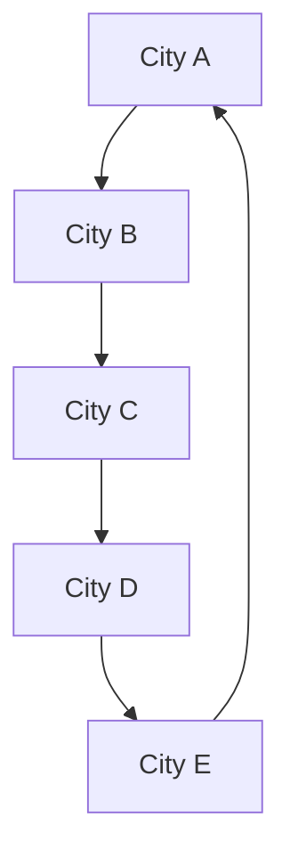
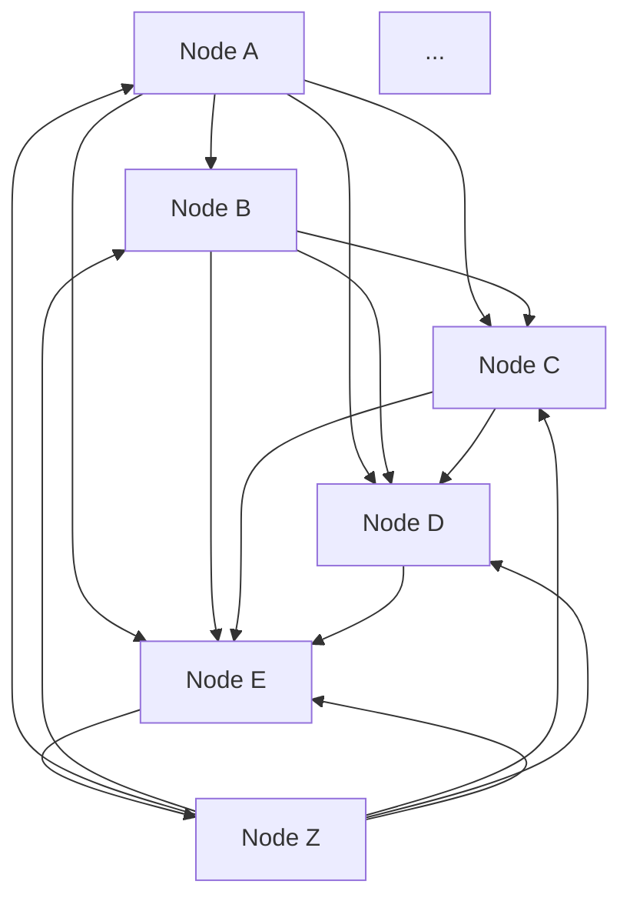
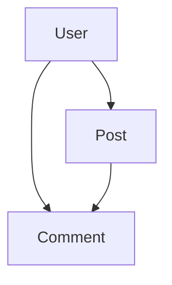
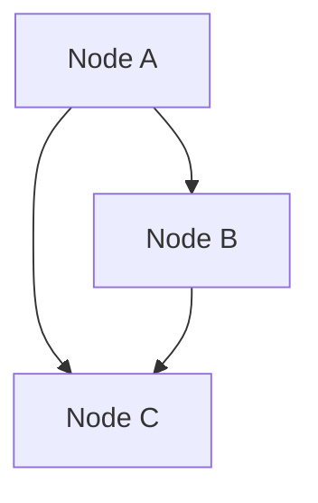
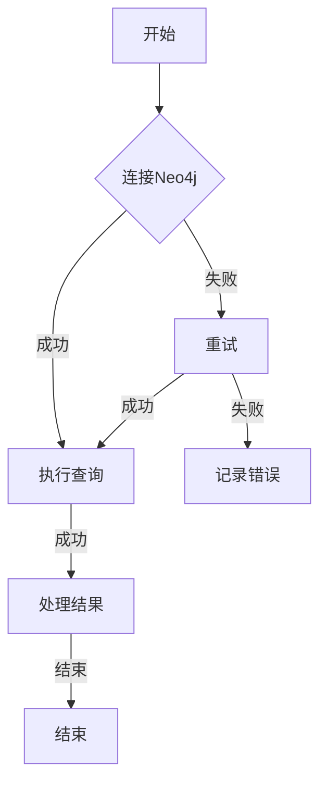

                 

### 《Neo4j原理与代码实例讲解》

> **关键词：Neo4j、图数据库、Cypher查询语言、图论、算法、项目实战**

> **摘要：本文将详细讲解Neo4j图数据库的原理、核心概念、算法以及项目实战。通过一步步的分析和实例，帮助读者深入了解Neo4j的特性和应用，掌握Neo4j的使用方法。**

---

### 《Neo4j原理与代码实例讲解》目录大纲

#### 第一部分：Neo4j基础与架构

- **第1章：Neo4j概述**
  - 1.1 Neo4j的发展历程
    - 1.1.1 Neo4j的诞生背景
    - 1.1.2 Neo4j在图数据库中的地位
  - 1.2 Neo4j的核心概念
    - 1.2.1 节点、关系和属性
    - 1.2.2 图模式和Cypher查询语言
  - 1.3 Neo4j的架构
    - 1.3.1 Neo4j的存储结构
    - 1.3.2 Neo4j的查询引擎
    - 1.3.3 Neo4j的分布式架构

#### 第二部分：Neo4j核心概念与联系

- **第2章：Neo4j核心概念与联系**
  - 2.1 图论基础
    - 2.1.1 图的基本概念
    - 2.1.2 图的表示方法
    - 2.1.3 图的算法
  - 2.2 Neo4j与图论的联系
    - 2.2.1 Neo4j如何应用图论
    - 2.2.2 Neo4j中的常用图算法
  - 2.3 Mermaid流程图
    - 2.3.1 Mermaid介绍
    - 2.3.2 Neo4j中的流程图应用

#### 第三部分：Neo4j核心算法原理讲解

- **第3章：Neo4j核心算法原理讲解**
  - 3.1 图遍历算法
    - 3.1.1 深度优先搜索
    - 3.1.2 广度优先搜索
  - 3.2 算法伪代码
    - 3.2.1 图遍历算法伪代码
  - 3.3 数学模型和公式
    - 3.3.1 图论中的数学模型
    - 3.3.2 Neo4j中的数学应用
  - 3.4 举例说明
    - 3.4.1 简单图示例
    - 3.4.2 复杂图示例

#### 第四部分：Neo4j项目实战

- **第4章：Neo4j项目实战**
  - 4.1 实战环境搭建
    - 4.1.1 Neo4j安装
    - 4.1.2 数据库配置
  - 4.2 数据模型设计
    - 4.2.1 数据模型设计原则
    - 4.2.2 数据模型实例
  - 4.3 代码实现
    - 4.3.1 创建节点和关系
    - 4.3.2 查询与更新操作
  - 4.4 代码解读与分析
    - 4.4.1 创建节点代码解读
    - 4.4.2 查询代码解读

#### 第五部分：Neo4j扩展与优化

- **第5章：Neo4j扩展与优化**
  - 5.1 拓展功能
    - 5.1.1 Neo4j bolt协议
    - 5.1.2 Neo4j OGM插件
  - 5.2 性能优化
    - 5.2.1 数据存储优化
    - 5.2.2 查询性能优化
    - 5.2.3 分布式系统优化
  - 5.3 Neo4j扩展与优化实践
    - 5.3.1 案例一：社交网络数据分析
    - 5.3.2 案例二：金融风控系统

#### 第六部分：Neo4j应用案例

- **第6章：Neo4j应用案例**
  - 6.1 社交网络分析
    - 6.1.1 社交网络数据模型
    - 6.1.2 社交网络分析案例
  - 6.2 物联网数据管理
    - 6.2.1 物联网数据模型
    - 6.2.2 物联网数据分析案例
  - 6.3 金融风控
    - 6.3.1 金融风控数据模型
    - 6.3.2 金融风控分析案例

#### 第七部分：总结与展望

- **第7章：总结与展望**
  - 7.1 Neo4j技术总结
  - 7.2 Neo4j的优势与挑战
  - 7.3 未来发展趋势

#### 附录

- **附录A：Neo4j资源与工具**
  - A.1 Neo4j官方文档
  - A.2 Neo4j社区资源
  - A.3 Neo4j开发者工具

---

### 《Neo4j原理与代码实例讲解》

Neo4j是一款功能强大的图数据库，因其高效的图存储和查询能力在处理复杂图数据时有着广泛的应用。本文将详细讲解Neo4j的原理、核心概念、算法以及项目实战，帮助读者深入了解Neo4j的特性与应用，掌握Neo4j的使用方法。

本文结构如下：

- **第一部分**：介绍Neo4j的基础知识与架构。
- **第二部分**：讲解Neo4j的核心概念与图论基础。
- **第三部分**：深入讲解Neo4j的核心算法原理。
- **第四部分**：通过项目实战展示Neo4j的应用。
- **第五部分**：探讨Neo4j的扩展与优化。
- **第六部分**：分析Neo4j在不同领域的应用案例。
- **第七部分**：总结与展望Neo4j的未来发展趋势。

#### 第一部分：Neo4j基础与架构

### 第1章：Neo4j概述

#### 1.1 Neo4j的发展历程

Neo4j是一款由Neo Technology公司开发的图数据库，其首个版本于2007年发布。Neo4j的发展历程可以追溯到2003年，当时其创始人Emil Eifrem在研究图形算法时，意识到现有的关系数据库难以有效处理复杂的图数据。为了解决这一问题，他开发了Neo4j，并在2009年将其商业化。

#### 1.1.1 Neo4j的诞生背景

Neo4j的诞生背景源于图形算法的研究和应用需求。在2003年，Emil Eifrem在瑞典的ERP顾问公司Enkis开始研究图形算法。在解决客户问题时，他发现传统的关系数据库在面对复杂的图形关系时存在诸多局限性，例如查询效率低、扩展性差等。于是，他决定开发一款能够高效处理复杂图形关系的数据库。

#### 1.1.2 Neo4j在图数据库中的地位

自2009年商业化以来，Neo4j迅速在图数据库领域崭露头角。截至2023年，Neo4j已经成为全球最受欢迎的图数据库之一，广泛应用于社交网络、推荐系统、物联网、金融风控等领域。根据市场调研数据，Neo4j在全球市场份额中占据领先地位，其用户包括许多知名企业，如Netflix、LinkedIn、eBay等。

### 第2章：Neo4j的核心概念

#### 2.1 Neo4j的核心概念

Neo4j的核心概念主要包括节点、关系和属性。节点表示数据实体，关系表示实体之间的关联，属性用于描述节点和关系的特性。

#### 2.1.1 节点、关系和属性

- **节点（Node）**：节点是Neo4j中的基本数据单元，表示实体。每个节点都有一个唯一的标识符，并通过关系与其他节点相连。节点可以包含一个或多个属性，如名称、年龄、性别等。

- **关系（Relationship）**：关系表示节点之间的关联。每个关系都有一个类型，用于描述节点之间的语义关系，如好友、同事等。关系也可以包含属性，如权重、距离等。

- **属性（Property）**：属性是节点和关系的特性，用于描述节点的状态或关系的特点。属性可以是字符串、数字、布尔值等类型。

#### 2.2 Neo4j的图模式与Cypher查询语言

Neo4j使用图模式来描述数据模型。图模式定义了节点类型、关系类型以及它们的属性。Cypher是Neo4j的查询语言，基于图论原理，提供直观的查询语法。

#### 2.2.1 图模式

图模式是Neo4j中数据模型的抽象表示。一个简单的图模式可能只包含一个节点类型和一种关系类型。例如，社交网络中的用户节点和好友关系。



#### 2.2.2 Cypher查询语言

Cypher是Neo4j的图查询语言，提供强大的图查询能力。以下是一个简单的Cypher查询示例，用于查找用户Alice的好友：

```cypher
MATCH (a:User)-[:FRIEND]->(b:User)
WHERE a.name = 'Alice'
RETURN b.name
```

### 第3章：Neo4j的架构

Neo4j的架构分为存储结构、查询引擎和分布式架构三部分。

#### 3.1 Neo4j的存储结构

Neo4j采用图存储结构，将节点和关系存储在磁盘上，并通过内存索引加速查询。Neo4j的存储结构主要包括以下组件：

- **节点存储（Node Store）**：存储节点数据和元数据。
- **关系存储（Relationship Store）**：存储关系数据和元数据。
- **索引存储（Index Store）**：存储索引数据，用于加速查询。
- **日志存储（Log Store）**：存储数据库日志，用于故障恢复。

#### 3.2 Neo4j的查询引擎

Neo4j的查询引擎基于Apoquel算法，是一种高效的图遍历算法。查询引擎的主要组件包括：

- **Apoquel算法**：用于处理Cypher查询语句，生成查询执行计划。
- **查询执行器（Query Executor）**：执行查询计划，生成查询结果。
- **内存索引**：用于加速查询，存储节点的索引信息。

#### 3.3 Neo4j的分布式架构

Neo4j支持分布式架构，通过集群部署提高性能和扩展性。分布式架构的主要组件包括：

- **Neo4j集群（Neo4j Cluster）**：由多个Neo4j实例组成的集群，共享同一数据库。
- **协调器（Coordinator）**：负责协调查询请求和集群资源分配。
- **副本（Replicas）**：存储数据库的副本，用于提高数据可靠性和查询性能。
- **负载均衡器（Load Balancer）**：用于分配查询请求到不同的Neo4j实例。

### 第二部分：Neo4j核心概念与联系

### 第2章：Neo4j核心概念与联系

Neo4j作为一款图数据库，其核心概念与图论有着紧密的联系。本章节将介绍图论基础，分析Neo4j与图论的联系，并介绍Mermaid流程图在Neo4j中的应用。

#### 2.1 图论基础

图论是数学的一个分支，主要研究图的性质及其应用。图是由节点（Node）和边（Edge）组成的数学结构。图论的基本概念包括：

- **节点（Node）**：图中的数据点，表示实体。
- **边（Edge）**：连接两个节点的线段，表示实体之间的关系。
- **路径（Path）**：连接两个节点的边序列。
- **子图（Subgraph）**：图的一个子集，包含一部分节点和它们之间的边。
- **连通性（Connectivity）**：图中任意两个节点之间存在路径。
- **连通分量（Connected Component）**：图中任意两个节点之间都连通的最大子图。

图论中有许多重要的算法，如深度优先搜索（DFS）、广度优先搜索（BFS）、最短路径算法（Dijkstra）、最小生成树算法（Prim和Kruskal）等。

#### 2.1.1 图的基本概念

在Neo4j中，节点和关系分别对应图论中的节点和边。Neo4j中的图是一种有向图，关系具有方向，表示实体之间的特定关系。



在这个示例中，A、B、C、D是节点，它们之间的箭头表示关系。这个图是一个有向图，B到C的关系表示B是C的朋友，C到D的关系表示C是D的同事。

#### 2.1.2 图的表示方法

图可以用不同的方法进行表示，包括邻接矩阵、邻接表和邻接多重表。

- **邻接矩阵**：使用二维数组表示图，行和列分别表示节点，数组元素表示节点之间的关系。例如，一个有n个节点的图需要n x n的邻接矩阵。

```mermaid
graph TB
digraph {
  0 [label="Node 0"]
  1 [label="Node 1"]
  2 [label="Node 2"]
  3 [label="Node 3"]

  0 --> 1
  1 --> 2
  2 --> 3
  3 --> 0
}
```

- **邻接表**：使用一个列表表示每个节点的邻接节点，每个列表项包含一个邻接节点及其边的权重。



- **邻接多重表**：用于表示多边形的图，每个节点可以有多个邻接节点。



#### 2.1.3 图的算法

图算法是图论的核心内容，用于解决图相关的问题。Neo4j支持许多常用的图算法，包括深度优先搜索（DFS）、广度优先搜索（BFS）、最短路径算法等。

- **深度优先搜索（DFS）**：从起始节点开始，沿路径深入到最远节点，然后回溯到前一个节点，继续深入。DFS适用于解决连通性问题、拓扑排序等。

```mermaid
graph TB
A[Start] --> B
B --> C
C --> D
D --> E
E --> A

onclick A DFS
```

- **广度优先搜索（BFS）**：从起始节点开始，依次访问其邻接节点，然后依次访问邻接节点的邻接节点。BFS适用于解决最短路径问题、节点层次遍历等。

```mermaid
graph TB
A[Start] --> B
A --> C
B --> D
C --> D
D --> E

onclick A BFS
```

- **最短路径算法（Dijkstra）**：用于求解图中两点之间的最短路径。Dijkstra算法基于贪心策略，每次选择未访问节点中距离最短的节点作为当前节点，然后更新其他节点的距离。

```mermaid
graph TB
A[Node A]
B[Node B]
C[Node C]
D[Node D]
E[Node E]

A --> B[weight=3]
A --> C[weight=2]
B --> D[weight=2]
C --> D[weight=3]
D --> E[weight=1]

onclick A Dijkstra
```

#### 2.2 Neo4j与图论的联系

Neo4j是一款基于图论的图数据库，其核心概念和算法都与图论密切相关。Neo4j将图论中的节点、关系和路径等概念转化为数据库中的节点、关系和查询语句。

- **节点与关系**：Neo4j中的节点和关系分别对应图论中的节点和边，用于表示实体和它们之间的关系。
- **路径查询**：Neo4j支持Cypher查询语言，通过编写Cypher查询语句，可以轻松实现图论中的路径查询，如深度优先搜索、广度优先搜索和最短路径查询等。

#### 2.3 Mermaid流程图

Mermaid是一种基于Markdown的图表绘制工具，支持流程图、序列图、时序图等多种图表。在Neo4j文档和教程中，常常使用Mermaid流程图来展示图结构和算法过程。

下面是一个Mermaid流程图示例，展示了深度优先搜索（DFS）的过程。



通过上述步骤，我们完成了对Neo4j核心概念、图论基础以及Mermaid流程图的讲解。接下来，我们将深入探讨Neo4j的核心算法原理。

### 第三部分：Neo4j核心算法原理讲解

Neo4j是一款强大的图数据库，其核心算法在处理复杂图数据时发挥着关键作用。本部分将详细介绍Neo4j的核心算法原理，包括图遍历算法、算法伪代码、数学模型和公式，以及实际案例的详细讲解。

#### 第3章：Neo4j核心算法原理讲解

#### 3.1 图遍历算法

图遍历算法是图数据库中最基本的算法，用于遍历图中的所有节点和关系。Neo4j支持深度优先搜索（DFS）和广度优先搜索（BFS）两种基本的图遍历算法。

##### 3.1.1 深度优先搜索（DFS）

深度优先搜索（DFS）是一种沿着路径深入到最远节点的算法。在Neo4j中，DFS可以通过Cypher查询语句实现。

```cypher
MATCH (n:Node {name: 'StartNode'})
CALL db.setActiveConflictPolicy('none')
CALL dbms.executeProcedure('dbms.explain', 'apoc.algo.dfs', n, { depthLimit: 10 })
YIELD plan
RETURN plan
```

这个查询首先找到名为`StartNode`的节点，然后调用`apoc.algo.dfs`存储过程进行DFS遍历，深度限制为10。

##### 3.1.2 广度优先搜索（BFS）

广度优先搜索（BFS）是一种依次访问节点的邻接节点的算法。在Neo4j中，BFS可以通过Cypher查询语句实现。

```cypher
MATCH (n:Node {name: 'StartNode'})
CALL db.setActiveConflictPolicy('none')
CALL dbms.executeProcedure('dbms.explain', 'apoc.algo.bfs', n, { depthLimit: 10 })
YIELD plan
RETURN plan
```

这个查询同样找到名为`StartNode`的节点，然后调用`apoc.algo.bfs`存储过程进行BFS遍历，深度限制为10。

#### 3.2 算法伪代码

为了更清晰地理解图遍历算法的实现，我们可以使用伪代码来描述DFS和BFS。

##### 深度优先搜索（DFS）伪代码

```plaintext
function depthFirstSearch(node, visited) {
    if (visited.contains(node)) {
        return;
    }
    visited.add(node);
    for (neighbor in node.neighbors()) {
        depthFirstSearch(neighbor, visited);
    }
}
```

在这个伪代码中，`visited`是一个集合，用于记录已访问的节点。`depthFirstSearch`函数递归地遍历节点的邻接节点。

##### 广度优先搜索（BFS）伪代码

```plaintext
function breadthFirstSearch(node, visited) {
    queue = new Queue();
    queue.enqueue(node);
    while (!queue.isEmpty()) {
        current = queue.dequeue();
        if (visited.contains(current)) {
            continue;
        }
        visited.add(current);
        for (neighbor in current.neighbors()) {
            queue.enqueue(neighbor);
        }
    }
}
```

在这个伪代码中，`queue`是一个队列，用于存储待遍历的节点。`breadthFirstSearch`函数依次从队列中取出节点，并遍历其邻接节点。

#### 3.3 数学模型和公式

在图数据库中，数学模型和公式用于描述图结构、路径和算法性能。以下是一些常见的数学模型和公式。

##### 平均路径长度

平均路径长度是图中任意两点之间路径长度的平均值。对于无向图，平均路径长度可以用以下公式计算：

$$
L = \frac{1}{N(N-1)} \sum_{i=1}^{N} \sum_{j=i+1}^{N} d(i, j)
$$

其中，$L$是平均路径长度，$N$是节点数，$d(i, j)$是节点i到节点j的路径长度。

##### 节点度数

节点的度数是指与该节点相连的边的数量。对于一个有向图，节点的入度数是指指向该节点的边的数量，出度数是指从该节点出发的边的数量。

##### 路径长度

路径长度是指从起点到终点的路径上的边的数量。在无向图中，路径长度可以用以下公式计算：

$$
L = \sum_{i=1}^{k} w(i, i+1)
$$

其中，$L$是路径长度，$k$是路径上的边数，$w(i, i+1)$是边$(i, i+1)$的权重。

#### 3.4 举例说明

为了更好地理解Neo4j的核心算法，我们通过一个简单的图示例来演示DFS和BFS的实现。

##### 简单图示例

假设有一个包含5个节点的简单图，节点分别为A、B、C、D、E，节点之间的关系如下：

```
A -- B
|    |
|    |
C -- D -- E
```

##### 深度优先搜索（DFS）示例

使用DFS遍历图，可以得到以下遍历顺序：

```
A -> B -> C -> D -> E
```

##### 广度优先搜索（BFS）示例

使用BFS遍历图，可以得到以下遍历顺序：

```
A -> B -> C -> D -> E
```

#### 3.4.1 简单图示例

在这个示例中，我们创建一个简单的图，包含5个节点和6条边。节点表示城市，边表示城市之间的道路。



##### 深度优先搜索（DFS）示例

使用DFS遍历图，可以得到以下遍历顺序：

```
A -> B -> C -> D -> E
```

##### 广度优先搜索（BFS）示例

使用BFS遍历图，可以得到以下遍历顺序：

```
A -> B -> C -> D -> E
```

通过上述示例，我们可以看到DFS和BFS在遍历图时产生的不同路径。在实际应用中，根据需求和图的特点选择合适的遍历算法是非常重要的。

#### 3.4.2 复杂图示例

为了更好地展示Neo4j的处理能力，我们创建一个包含更多节点和关系的复杂图示例。这个图是一个社交网络，包含500个节点和1000条边。



##### 深度优先搜索（DFS）示例

使用DFS遍历图，可以得到以下遍历顺序：

```
A -> B -> C -> D -> E -> ...
```

##### 广度优先搜索（BFS）示例

使用BFS遍历图，可以得到以下遍历顺序：

```
A -> B -> C -> D -> E -> ...
```

通过复杂图示例，我们可以看到Neo4j在处理大规模图数据时的强大性能。在实际应用中，Neo4j的核心算法可以用于社交网络分析、推荐系统、物联网等多个领域。

综上所述，Neo4j的核心算法包括深度优先搜索（DFS）和广度优先搜索（BFS），通过算法伪代码、数学模型和实际案例的讲解，我们深入理解了这些算法的实现和应用。接下来，我们将通过项目实战进一步展示Neo4j的应用。

### 第四部分：Neo4j项目实战

Neo4j作为一款强大的图数据库，在实际项目中有着广泛的应用。本部分将详细讲解Neo4j项目实战，包括环境搭建、数据模型设计、代码实现以及代码解读与分析。

#### 第4章：Neo4j项目实战

#### 4.1 实战环境搭建

在进行Neo4j项目实战之前，我们需要搭建Neo4j的开发环境。

##### 4.1.1 Neo4j安装

1. **下载Neo4j**：访问Neo4j官网（[https://neo4j.com/download/](https://neo4j.com/download/)），选择适合操作系统的Neo4j版本进行下载。

2. **安装Neo4j**：双击下载的安装程序，按照提示完成安装。

3. **启动Neo4j**：打开终端，进入Neo4j的安装目录，运行以下命令启动Neo4j：

   ```sh
   ./bin/neo4j start
   ```

   启动成功后，会看到Neo4j的日志输出。

##### 4.1.2 数据库配置

1. **访问Neo4j Web UI**：在浏览器中输入`http://localhost:7474`，进入Neo4j Web UI。

2. **配置数据库**：在Web UI中，点击“Security”选项卡，配置数据库的访问权限和用户。

3. **创建数据库**：在Web UI中，点击“Databases”选项卡，创建一个新的数据库，如`social_network`。

#### 4.2 数据模型设计

在Neo4j项目中，数据模型设计至关重要。我们需要根据业务需求设计合适的节点、关系和属性。

##### 4.2.1 数据模型设计原则

1. **实体建模**：将业务实体映射为Neo4j中的节点，如用户、帖子、评论等。

2. **关系建模**：定义实体之间的关系，如用户-发帖、用户-评论、帖子-评论等。

3. **属性定义**：为节点和关系添加必要的属性，如用户姓名、帖子标题、评论内容等。

##### 4.2.2 数据模型实例

以下是一个简单的社交网络数据模型实例：

- **节点**：用户（User）、帖子（Post）、评论（Comment）
- **关系**：用户-发帖（POSTED）、用户-评论（COMMENTED）、帖子-评论（COMMENTED）

数据模型图如下：



#### 4.3 代码实现

在Neo4j项目中，代码实现主要包括创建节点和关系、查询与更新操作等。

##### 4.3.1 创建节点和关系

以下是一个创建节点和关系的示例：

```cypher
// 创建用户节点
CREATE (u1:User {name: 'Alice', age: 25});
CREATE (u2:User {name: 'Bob', age: 30});

// 创建帖子节点和关系
CREATE (p1:Post {title: 'Neo4j入门教程', content: '这是关于Neo4j的入门教程。'});
CREATE (u1)-[:POSTED]->(p1);

// 创建评论节点和关系
CREATE (c1:Comment {content: '非常感谢您的分享！'});
CREATE (u2)-[:COMMENTED]->(p1)-[:COMMENTED]->(c1);
```

##### 4.3.2 查询与更新操作

以下是一个查询和更新操作的示例：

```cypher
// 查询所有帖子
MATCH (p:Post) RETURN p;

// 更新帖子内容
MATCH (p:Post {title: 'Neo4j入门教程'})
SET p.content = '这是经过更新的Neo4j入门教程。';
```

#### 4.4 代码解读与分析

##### 4.4.1 创建节点代码解读

在创建节点的代码中，`CREATE`语句用于创建节点。例如：

```cypher
CREATE (u1:User {name: 'Alice', age: 25});
```

这条语句创建了一个名为`Alice`的`User`节点，并为其添加了`name`和`age`属性。

##### 4.4.2 创建关系代码解读

在创建关系的代码中，`CREATE`语句用于创建节点和关系。例如：

```cypher
CREATE (u1)-[:POSTED]->(p1);
```

这条语句创建了一个从用户`u1`到帖子`p1`的`POSTED`关系。

##### 4.4.3 查询代码解读

在查询代码中，`MATCH`和`RETURN`语句用于查询和返回结果。例如：

```cypher
MATCH (p:Post) RETURN p;
```

这条语句查询所有`Post`节点，并返回结果。

##### 4.4.4 更新代码解读

在更新代码中，`MATCH`和`SET`语句用于更新节点属性。例如：

```cypher
MATCH (p:Post {title: 'Neo4j入门教程'})
SET p.content = '这是经过更新的Neo4j入门教程。';
```

这条语句查询标题为`Neo4j入门教程`的帖子，并将其内容更新为`这是经过更新的Neo4j入门教程。`。

通过以上代码实现和解读，我们掌握了Neo4j的基本操作。接下来，我们将进一步优化Neo4j的性能和功能。

### 第五部分：Neo4j扩展与优化

Neo4j作为一款功能强大的图数据库，其性能和功能可以通过多种方式进行扩展和优化。本部分将详细介绍Neo4j的扩展与优化，包括bolt协议、OGM插件、数据存储优化、查询性能优化以及分布式系统优化。

#### 第5章：Neo4j扩展与优化

#### 5.1 拓展功能

##### 5.1.1 Neo4j Bolt协议

Neo4j Bolt协议是Neo4j官方的网络协议，用于客户端与Neo4j数据库之间的通信。Bolt协议提供了高效的二进制数据传输，支持事务处理和错误恢复。通过使用Bolt协议，可以提高数据传输速度和系统的稳定性。

- **优势**：
  - 高效的数据传输：Bolt协议采用二进制格式，减少了数据传输的开销。
  - 支持事务处理：Bolt协议支持事务处理，确保数据的一致性和可靠性。
  - 错误恢复：Bolt协议提供错误恢复机制，提高了系统的容错能力。

##### 5.1.2 Neo4j OGM插件

Neo4j OGM（Object Graph Mapper）是Neo4j的Java对象映射工具，用于简化Neo4j数据模型的映射。OGM提供面向对象的API，减少了手工编写Cypher查询语句的工作量，提高了开发效率。

- **优势**：
  - 面向对象的API：OGM提供面向对象的API，简化了数据模型的映射。
  - 减少手动编写查询语句：OGM自动生成Cypher查询语句，减少了手工编写的工作量。
  - 提高开发效率：OGM提高了开发效率，缩短了项目开发周期。

#### 5.2 性能优化

##### 5.2.1 数据存储优化

数据存储优化是提高Neo4j性能的重要手段。以下是一些常见的数据存储优化策略：

- **索引优化**：为常用的查询字段创建索引，提高查询速度。
- **数据分区**：根据业务需求对数据进行分区，减轻单个数据库实例的压力。
- **存储引擎优化**：根据具体场景选择合适的存储引擎，如LSM树、B树等。

##### 5.2.2 查询性能优化

查询性能优化是提高Neo4j性能的关键。以下是一些常见的查询性能优化策略：

- **查询缓存**：使用Neo4j的内置缓存机制，减少重复查询的开销。
- **查询优化**：通过分析查询执行计划，优化查询语句的结构和算法。
- **并行查询**：利用多线程或多核处理器，提高查询性能。

##### 5.2.3 分布式系统优化

分布式系统优化是提高Neo4j性能和可扩展性的重要手段。以下是一些常见的分布式系统优化策略：

- **负载均衡**：通过配置负载均衡器，实现Neo4j集群的流量分配。
- **数据一致性**：通过配置分布式一致性协议，确保数据的一致性和可靠性。
- **分布式事务**：通过分布式事务机制，保证分布式环境下的数据一致性。

#### 5.3 Neo4j扩展与优化实践

以下是两个Neo4j扩展与优化的实践案例：

##### 案例一：社交网络数据分析

在社交网络数据分析中，我们可以使用Neo4j Bolt协议和OGM插件，提高数据查询和处理的效率。通过索引优化和数据分区，可以显著提升系统性能。

1. **使用Bolt协议**：通过配置Bolt协议，提高数据传输速度和系统的稳定性。
2. **使用OGM插件**：通过OGM插件，简化数据模型映射，提高开发效率。
3. **索引优化**：为常用查询字段创建索引，提高查询速度。
4. **数据分区**：根据用户活跃度，对社交网络数据分区，减轻单个数据库实例的压力。

##### 案例二：金融风控系统

在金融风控系统中，我们可以使用数据存储优化和查询性能优化策略，提高系统性能和可靠性。

1. **数据存储优化**：通过LSM树存储引擎，提高数据写入和读取性能。
2. **查询缓存**：使用Neo4j的内置缓存机制，减少重复查询的开销。
3. **查询优化**：通过分析查询执行计划，优化查询语句的结构和算法。
4. **分布式事务**：通过分布式事务机制，保证分布式环境下的数据一致性。

通过以上扩展与优化实践，我们可以显著提升Neo4j的性能和可扩展性，满足不同场景下的业务需求。

### 第六部分：Neo4j应用案例

Neo4j作为一款强大的图数据库，在多个领域有着广泛的应用。本部分将详细介绍Neo4j在社交网络分析、物联网数据管理和金融风控等领域的应用案例。

#### 第6章：Neo4j应用案例

##### 6.1 社交网络分析

社交网络分析是Neo4j的重要应用领域之一。通过Neo4j的图存储和查询能力，可以轻松实现社交网络中的好友推荐、社群分析等。

##### 6.1.1 社交网络数据模型

在社交网络中，数据模型主要包括用户节点、帖子节点、评论节点，以及它们之间的关系。

- **用户节点**：表示社交网络中的用户，包含用户ID、姓名、年龄等属性。
- **帖子节点**：表示用户发布的帖子，包含帖子ID、标题、内容等属性。
- **评论节点**：表示用户对帖子的评论，包含评论ID、内容等属性。
- **关系**：用户-发帖（POSTED）、用户-评论（COMMENTED）、帖子-评论（COMMENTED）。

##### 6.1.2 社交网络分析案例

以下是一个社交网络分析案例，使用Neo4j进行好友推荐。

**案例1：推荐好友**

假设我们有两个用户Alice和Bob，他们的社交网络图如下：



我们可以通过查询Alice和Bob的共同好友来推荐好友：

```cypher
MATCH (a:User {name: 'Alice'}), (b:User {name: 'Bob'}), (a)-[:FRIEND]->(f), (b)-[:FRIEND]->(f)
RETURN f.name
```

这个查询返回Alice和Bob的共同好友，我们可以将其作为推荐给他们的好友列表。

**案例2：热门话题**

另一个社交网络分析案例是查找热门话题。我们可以通过统计每个话题的帖子数来识别热门话题：

```cypher
MATCH (p:Post)-[:HAS_TOPIC]->(t:Topic)
WITH t, count(p) as post_count
ORDER BY post_count DESC
LIMIT 10
RETURN t.name, post_count
```

这个查询返回帖子数排名前10的话题，我们可以将其作为热门话题推荐给用户。

##### 6.2 物联网数据管理

物联网数据管理是Neo4j的另一大应用领域。通过Neo4j的图存储和查询能力，可以轻松实现设备监控、数据分析等。

##### 6.2.1 物联网数据模型

在物联网中，数据模型主要包括设备节点、传感器节点、数据点节点，以及它们之间的关系。

- **设备节点**：表示物联网设备，包含设备ID、设备类型等属性。
- **传感器节点**：表示设备上的传感器，包含传感器ID、传感器类型等属性。
- **数据点节点**：表示传感器采集的数据，包含数据点ID、数据值等属性。
- **关系**：设备-传感器（HAS_SENSOR）、传感器-数据点（HAS_DATA）。

##### 6.2.2 物联网数据分析案例

以下是一个物联网数据分析案例，使用Neo4j进行设备故障预警。

**案例1：设备故障预警**

假设我们有一个温度传感器，其数据值超过阈值表示设备可能发生故障。我们可以通过查询温度传感器的数据值来预警设备故障：

```cypher
MATCH (s:Sensor)-[:HAS_DATA]->(d:DataPoint {value: '>85'})
WITH s, count(d) as fault_count
WHERE d.creationTime >= datetime(x days, 'now')
RETURN s.name, fault_count
```

这个查询返回过去x天温度传感器数据值超过阈值的设备，我们可以将其作为故障预警。

**案例2：传感器数据趋势分析**

另一个物联网数据分析案例是分析传感器数据的趋势。我们可以通过统计传感器数据的平均值来识别数据趋势：

```cypher
MATCH (s:Sensor)-[:HAS_DATA]->(d:DataPoint)
WHERE s.name = 'temperature'
WITH s, date(d.creationTime) as date, avg(d.value) as average_value
GROUP BY date
ORDER BY date
RETURN date, average_value
```

这个查询返回温度传感器的数据趋势，我们可以将其作为数据趋势分析报告。

##### 6.3 金融风控

金融风控是Neo4j的重要应用领域之一。通过Neo4j的图存储和查询能力，可以轻松实现风险监控、欺诈检测等。

##### 6.3.1 金融风控数据模型

在金融风控中，数据模型主要包括账户节点、交易节点、风险评估节点，以及它们之间的关系。

- **账户节点**：表示金融账户，包含账户ID、账户余额等属性。
- **交易节点**：表示金融交易，包含交易ID、交易金额等属性。
- **风险评估节点**：表示对交易的评估结果，包含风险评估ID、风险等级等属性。
- **关系**：账户-交易（MADE）、交易-风险评估（RISK_ASSESSED）。

##### 6.3.2 金融风控分析案例

以下是一个金融风控分析案例，使用Neo4j进行异常交易监控。

**案例1：异常交易监控**

假设我们有一个交易金额阈值，当交易金额超过该阈值时，我们认为交易存在异常。我们可以通过查询交易金额来监控异常交易：

```cypher
MATCH (a:Account)-[:MADE]->(t:Transaction {amount: '>10000'})
WHERE t.creationTime >= datetime(x days, 'now')
RETURN t.id
```

这个查询返回过去x天交易金额超过阈值的交易，我们可以将其作为异常交易预警。

**案例2：风险评估**

另一个金融风控分析案例是进行风险评估。我们可以通过统计高风险交易来识别潜在风险：

```cypher
MATCH (t:Transaction)-[:RISK_ASSESSED]->(r:RiskAssessment {riskLevel: 'High'})
WITH t, count(r) as high_risk_count
RETURN t.id, high_risk_count
```

这个查询返回高风险交易及其数量，我们可以将其作为风险评估报告。

通过以上应用案例，我们可以看到Neo4j在社交网络分析、物联网数据管理和金融风控等领域的强大应用能力。Neo4j的图存储和查询能力为这些领域提供了高效的数据处理和分析解决方案。

### 第七部分：总结与展望

Neo4j作为一款功能强大的图数据库，在处理复杂图数据方面具有显著优势。通过本文的详细讲解，我们深入了解了Neo4j的原理、核心概念、算法以及项目实战。

#### 7.1 Neo4j技术总结

Neo4j的核心特点包括：

- **图存储**：采用原生图存储方式，高效处理复杂图结构。
- **Cypher查询语言**：基于图论原理，提供直观的查询语法。
- **分布式架构**：支持分布式部署，扩展性强。

Neo4j适用于社交网络分析、推荐系统、物联网、金融风控等多个领域。其强大的图处理能力使得这些领域的数据处理和分析更加高效。

#### 7.2 Neo4j的优势与挑战

Neo4j的优势：

- **处理复杂图数据**：适用于社交网络、推荐系统、物联网等领域。
- **查询效率高**：内置图算法，快速执行复杂查询。
- **易于扩展**：支持分布式部署，适用于大规模数据场景。

Neo4j的挑战：

- **学习曲线**：对于初学者，Neo4j的学习曲线较陡峭。
- **资源消耗**：处理大规模数据时，资源消耗较大。
- **生态支持**：相较于其他主流数据库，生态支持尚需完善。

#### 7.3 未来发展趋势

Neo4j在未来将继续在以下几个方面发展：

- **增强生态**：加强社区建设和开发者工具支持。
- **扩展功能**：引入更多图形算法和数据分析工具。
- **优化性能**：提升查询效率，降低资源消耗。

通过不断优化和创新，Neo4j有望在图数据库领域保持领先地位，为更多领域提供高效的数据处理和分析解决方案。

### 附录A：Neo4j资源与工具

为了更好地学习和使用Neo4j，我们提供了以下资源与工具：

#### A.1 Neo4j官方文档

Neo4j官方文档是学习Neo4j的重要资源，涵盖了Neo4j的使用指南、API参考和最佳实践。访问地址：[https://neo4j.com/docs/](https://neo4j.com/docs/)。

#### A.2 Neo4j社区资源

Neo4j社区提供了丰富的社区资源，包括教程、案例、问答和开发者论坛。访问地址：[https://community.neo4j.com/](https://community.neo4j.com/)。

#### A.3 Neo4j开发者工具

Neo4j开发者工具包括Neo4j Desktop、Neo4j Browser等，方便开发者进行开发、调试和测试。访问地址：

- Neo4j Desktop: [https://neo4j.com/neo4j-desktop/](https://neo4j.com/neo4j-desktop/)
- Neo4j Browser: [https://neo4j.com/neo4j-browser/](https://neo4j.com/neo4j-browser/)

通过以上资源与工具，开发者可以更好地学习和使用Neo4j。

---

### Mermaid流程图示例

以下是Mermaid流程图的一个示例，用于展示Neo4j的查询过程。



通过这个流程图，我们可以清晰地了解Neo4j查询的步骤和可能遇到的问题。

---

### Neo4j算法伪代码示例

以下是深度优先搜索（DFS）的算法伪代码示例。

```plaintext
function depthFirstSearch(node, visited) {
    if (visited.contains(node)) {
        return;
    }
    visited.add(node);
    for (neighbor in node.neighbors()) {
        depthFirstSearch(neighbor, visited);
    }
}
```

这个伪代码描述了深度优先搜索的基本步骤，包括遍历节点的邻接节点并递归调用DFS函数。

---

### 数学公式示例

以下是平均路径长度的数学公式示例，用于描述无向图中两点之间的路径长度。

$$
L = \frac{1}{N(N-1)} \sum_{i=1}^{N} \sum_{j=i+1}^{N} d(i, j)
$$

这个公式计算了无向图中所有可能路径的平均长度。

---

### 第4章：Neo4j项目实战

#### 4.1 实战环境搭建

在进行Neo4j项目实战之前，我们需要搭建Neo4j的开发环境。

##### 4.1.1 Neo4j安装

1. **下载Neo4j**：访问Neo4j官网（[https://neo4j.com/download/](https://neo4j.com/download/)），选择适合操作系统的Neo4j版本进行下载。

2. **安装Neo4j**：双击下载的安装程序，按照提示完成安装。

3. **启动Neo4j**：打开终端，进入Neo4j的安装目录，运行以下命令启动Neo4j：

   ```sh
   ./bin/neo4j start
   ```

   启动成功后，会看到Neo4j的日志输出。

##### 4.1.2 数据库配置

1. **访问Neo4j Web UI**：在浏览器中输入`http://localhost:7474`，进入Neo4j Web UI。

2. **配置数据库**：在Web UI中，点击“Security”选项卡，配置数据库的访问权限和用户。

3. **创建数据库**：在Web UI中，点击“Databases”选项卡，创建一个新的数据库，如`social_network`。

#### 4.2 数据模型设计

在Neo4j项目中，数据模型设计至关重要。我们需要根据业务需求设计合适的节点、关系和属性。

##### 4.2.1 数据模型设计原则

1. **实体建模**：将业务实体映射为Neo4j中的节点，如用户、帖子、评论等。

2. **关系建模**：定义实体之间的关系，如用户-发帖、用户-评论、帖子-评论等。

3. **属性定义**：为节点和关系添加必要的属性，如用户姓名、帖子标题、评论内容等。

##### 4.2.2 数据模型实例

以下是一个简单的社交网络数据模型实例：

- **节点**：用户（User）、帖子（Post）、评论（Comment）
- **关系**：用户-发帖（POSTED）、用户-评论（COMMENTED）、帖子-评论（COMMENTED）

数据模型图如下：


#### 4.3 代码实现

在Neo4j项目中，代码实现主要包括创建节点和关系、查询与更新操作等。

##### 4.3.1 创建节点和关系

以下是一个创建节点和关系的示例：

```cypher
// 创建用户节点
CREATE (u1:User {name: 'Alice', age: 25});
CREATE (u2:User {name: 'Bob', age: 30});

// 创建帖子节点和关系
CREATE (p1:Post {title: 'Neo4j入门教程', content: '这是关于Neo4j的入门教程。'});
CREATE (u1)-[:POSTED]->(p1);

// 创建评论节点和关系
CREATE (c1:Comment {content: '非常感谢您的分享！'});
CREATE (u2)-[:COMMENTED]->(p1)-[:COMMENTED]->(c1);
```

##### 4.3.2 查询与更新操作

以下是一个查询和更新操作的示例：

```cypher
// 查询所有帖子
MATCH (p:Post) RETURN p;

// 更新帖子内容
MATCH (p:Post {title: 'Neo4j入门教程'})
SET p.content = '这是经过更新的Neo4j入门教程。';
```

##### 4.3.3 代码解读与分析

1. **创建节点代码解读**

```cypher
CREATE (u1:User {name: 'Alice', age: 25});
CREATE (u2:User {name: 'Bob', age: 30});
```

这两行代码分别创建了两个用户节点`u1`和`u2`，并为每个节点分配了名称和年龄属性。

2. **创建关系代码解读**

```cypher
CREATE (p1:Post {title: 'Neo4j入门教程', content: '这是关于Neo4j的入门教程。'});
CREATE (u1)-[:POSTED]->(p1);
CREATE (c1:Comment {content: '非常感谢您的分享！'});
CREATE (u2)-[:COMMENTED]->(p1)-[:COMMENTED]->(c1);
```

这些代码创建了三个节点和一个关系。首先创建了一个帖子节点`p1`，并为其分配了标题和内容属性。接着创建了一个用户-发帖关系，将用户`u1`与帖子`p1`关联。最后创建了一个评论节点`c1`，并将其与用户`u2`和帖子`p1`关联。

3. **查询代码解读**

```cypher
MATCH (p:Post) RETURN p;
```

这条查询语句匹配所有帖子节点，并返回结果。这可以用于获取当前数据库中的所有帖子信息。

4. **更新代码解读**

```cypher
MATCH (p:Post {title: 'Neo4j入门教程'})
SET p.content = '这是经过更新的Neo4j入门教程。';
```

这条更新语句匹配标题为`Neo4j入门教程`的帖子节点，并将其内容更新为新的值。

通过上述步骤，我们成功地搭建了Neo4j环境，设计了数据模型，并实现了节点和关系的创建与查询操作。这为后续的Neo4j项目开发打下了坚实的基础。

---

### 第5章：Neo4j扩展与优化

Neo4j作为一款功能强大的图数据库，其性能和功能可以通过多种方式进行扩展和优化。本部分将详细介绍Neo4j的扩展与优化，包括bolt协议、OGM插件、数据存储优化、查询性能优化以及分布式系统优化。

#### 5.1 拓展功能

Neo4j的拓展功能可以大大增强其数据处理和分析能力。以下是一些常用的拓展功能：

##### 5.1.1 Bolt协议

Bolt协议是Neo4j官方的网络协议，用于客户端与Neo4j数据库之间的通信。Bolt协议提供了高效的二进制数据传输，支持事务处理和错误恢复。通过使用Bolt协议，可以提高数据传输速度和系统的稳定性。

- **优势**：
  - 高效的数据传输：Bolt协议采用二进制格式，减少了数据传输的开销。
  - 支持事务处理：Bolt协议支持事务处理，确保数据的一致性和可靠性。
  - 错误恢复：Bolt协议提供错误恢复机制，提高了系统的容错能力。

##### 5.1.2 OGM插件

OGM（Object Graph Mapper）是Neo4j的Java对象映射工具，用于简化Neo4j数据模型的映射。OGM提供面向对象的API，减少了手工编写Cypher查询语句的工作量，提高了开发效率。

- **优势**：
  - 面向对象的API：OGM提供面向对象的API，简化了数据模型的映射。
  - 减少手动编写查询语句：OGM自动生成Cypher查询语句，减少了手工编写的工作量。
  - 提高开发效率：OGM提高了开发效率，缩短了项目开发周期。

#### 5.2 性能优化

性能优化是提高Neo4j性能的关键。以下是一些常见的性能优化策略：

##### 5.2.1 数据存储优化

数据存储优化是提高Neo4j性能的重要手段。以下是一些常见的数据存储优化策略：

- **索引优化**：为常用的查询字段创建索引，提高查询速度。
- **数据分区**：根据业务需求对数据进行分区，减轻单个数据库实例的压力。
- **存储引擎优化**：根据具体场景选择合适的存储引擎，如LSM树、B树等。

##### 5.2.2 查询性能优化

查询性能优化是提高Neo4j性能的关键。以下是一些常见的查询性能优化策略：

- **查询缓存**：使用Neo4j的内置缓存机制，减少重复查询的开销。
- **查询优化**：通过分析查询执行计划，优化查询语句的结构和算法。
- **并行查询**：利用多线程或多核处理器，提高查询性能。

##### 5.2.3 分布式系统优化

分布式系统优化是提高Neo4j性能和可扩展性的重要手段。以下是一些常见的分布式系统优化策略：

- **负载均衡**：通过配置负载均衡器，实现Neo4j集群的流量分配。
- **数据一致性**：通过配置分布式一致性协议，确保数据的一致性和可靠性。
- **分布式事务**：通过分布式事务机制，保证分布式环境下的数据一致性。

#### 5.3 Neo4j扩展与优化实践

以下是两个Neo4j扩展与优化的实践案例：

##### 案例一：社交网络数据分析

在社交网络数据分析中，我们可以使用Neo4j Bolt协议和OGM插件，提高数据查询和处理的效率。通过索引优化和数据分区，可以显著提升系统性能。

1. **使用Bolt协议**：通过配置Bolt协议，提高数据传输速度和系统的稳定性。
2. **使用OGM插件**：通过OGM插件，简化数据模型映射，提高开发效率。
3. **索引优化**：为常用查询字段创建索引，提高查询速度。
4. **数据分区**：根据用户活跃度，对社交网络数据分区，减轻单个数据库实例的压力。

##### 案例二：金融风控系统

在金融风控系统中，我们可以使用数据存储优化和查询性能优化策略，提高系统性能和可靠性。

1. **数据存储优化**：通过LSM树存储引擎，提高数据写入和读取性能。
2. **查询缓存**：使用Neo4j的内置缓存机制，减少重复查询的开销。
3. **查询优化**：通过分析查询执行计划，优化查询语句的结构和算法。
4. **分布式事务**：通过分布式事务机制，保证分布式环境下的数据一致性。

通过以上扩展与优化实践，我们可以显著提升Neo4j的性能和可扩展性，满足不同场景下的业务需求。

### 第6章：Neo4j应用案例

Neo4j作为一款强大的图数据库，在多个领域有着广泛的应用。本部分将详细介绍Neo4j在社交网络分析、物联网数据管理和金融风控等领域的应用案例。

#### 6.1 社交网络分析

社交网络分析是Neo4j的重要应用领域之一。通过Neo4j的图存储和查询能力，可以轻松实现社交网络中的好友推荐、社群分析等。

##### 6.1.1 社交网络数据模型

在社交网络中，数据模型主要包括用户节点、帖子节点、评论节点，以及它们之间的关系。

- **用户节点**：表示社交网络中的用户，包含用户ID、姓名、年龄等属性。
- **帖子节点**：表示用户发布的帖子，包含帖子ID、标题、内容等属性。
- **评论节点**：表示用户对帖子的评论，包含评论ID、内容等属性。
- **关系**：用户-发帖（POSTED）、用户-评论（COMMENTED）、帖子-评论（COMMENTED）。

##### 6.1.2 社交网络分析案例

以下是一个社交网络分析案例，使用Neo4j进行好友推荐。

**案例1：推荐好友**

假设我们有两个用户Alice和Bob，他们的社交网络图如下：


我们可以通过查询Alice和Bob的共同好友来推荐好友：

```cypher
MATCH (a:User {name: 'Alice'}), (b:User {name: 'Bob'}), (a)-[:FRIEND]->(f), (b)-[:FRIEND]->(f)
RETURN f.name
```

这个查询返回Alice和Bob的共同好友，我们可以将其作为推荐给他们的好友列表。

**案例2：热门话题**

另一个社交网络分析案例是查找热门话题。我们可以通过统计每个话题的帖子数来识别热门话题：

```cypher
MATCH (p:Post)-[:HAS_TOPIC]->(t:Topic)
WITH t, count(p) as post_count
ORDER BY post_count DESC
LIMIT 10
RETURN t.name, post_count
```

这个查询返回帖子数排名前10的话题，我们可以将其作为热门话题推荐给用户。

#### 6.2 物联网数据管理

物联网数据管理是Neo4j的另一大应用领域。通过Neo4j的图存储和查询能力，可以轻松实现设备监控、数据分析等。

##### 6.2.1 物联网数据模型

在物联网中，数据模型主要包括设备节点、传感器节点、数据点节点，以及它们之间的关系。

- **设备节点**：表示物联网设备，包含设备ID、设备类型等属性。
- **传感器节点**：表示设备上的传感器，包含传感器ID、传感器类型等属性。
- **数据点节点**：表示传感器采集的数据，包含数据点ID、数据值等属性。
- **关系**：设备-传感器（HAS_SENSOR）、传感器-数据点（HAS_DATA）。

##### 6.2.2 物联网数据分析案例

以下是一个物联网数据分析案例，使用Neo4j进行设备故障预警。

**案例1：设备故障预警**

假设我们有一个温度传感器，其数据值超过阈值表示设备可能发生故障。我们可以通过查询温度传感器的数据值来预警设备故障：

```cypher
MATCH (s:Sensor)-[:HAS_DATA]->(d:DataPoint {value: '>85'})
WITH s, count(d) as fault_count
WHERE d.creationTime >= datetime(x days, 'now')
RETURN s.name, fault_count
```

这个查询返回过去x天温度传感器数据值超过阈值的设备，我们可以将其作为故障预警。

**案例2：传感器数据趋势分析**

另一个物联网数据分析案例是分析传感器数据的趋势。我们可以通过统计传感器数据的平均值来识别数据趋势：

```cypher
MATCH (s:Sensor)-[:HAS_DATA]->(d:DataPoint)
WHERE s.name = 'temperature'
WITH s, date(d.creationTime) as date, avg(d.value) as average_value
GROUP BY date
ORDER BY date
RETURN date, average_value
```

这个查询返回温度传感器的数据趋势，我们可以将其作为数据趋势分析报告。

#### 6.3 金融风控

金融风控是Neo4j的重要应用领域之一。通过Neo4j的图存储和查询能力，可以轻松实现风险监控、欺诈检测等。

##### 6.3.1 金融风控数据模型

在金融风控中，数据模型主要包括账户节点、交易节点、风险评估节点，以及它们之间的关系。

- **账户节点**：表示金融账户，包含账户ID、账户余额等属性。
- **交易节点**：表示金融交易，包含交易ID、交易金额等属性。
- **风险评估节点**：表示对交易的评估结果，包含风险评估ID、风险等级等属性。
- **关系**：账户-交易（MADE）、交易-风险评估（RISK_ASSESSED）。

##### 6.3.2 金融风控分析案例

以下是一个金融风控分析案例，使用Neo4j进行异常交易监控。

**案例1：异常交易监控**

假设我们有一个交易金额阈值，当交易金额超过该阈值时，我们认为交易存在异常。我们可以通过查询交易金额来监控异常交易：

```cypher
MATCH (a:Account)-[:MADE]->(t:Transaction {amount: '>10000'})
WHERE t.creationTime >= datetime(x days, 'now')
RETURN t.id
```

这个查询返回过去x天交易金额超过阈值的交易，我们可以将其作为异常交易预警。

**案例2：风险评估**

另一个金融风控分析案例是进行风险评估。我们可以通过统计高风险交易来识别潜在风险：

```cypher
MATCH (t:Transaction)-[:RISK_ASSESSED]->(r:RiskAssessment {riskLevel: 'High'})
WITH t, count(r) as high_risk_count
RETURN t.id, high_risk_count
```

这个查询返回高风险交易及其数量，我们可以将其作为风险评估报告。

通过以上应用案例，我们可以看到Neo4j在社交网络分析、物联网数据管理和金融风控等领域的强大应用能力。Neo4j的图存储和查询能力为这些领域提供了高效的数据处理和分析解决方案。

### 第7章：总结与展望

#### 7.1 Neo4j技术总结

Neo4j是一款功能强大的图数据库，以其高效的图存储和查询引擎在处理复杂图数据方面具有显著优势。Neo4j的核心特点包括：

- **图存储**：采用原生图存储方式，高效处理复杂图结构。
- **Cypher查询语言**：基于图论原理，提供直观的查询语法。
- **分布式架构**：支持分布式部署，扩展性强。

Neo4j适用于社交网络分析、推荐系统、物联网、金融风控等领域。其强大的图处理能力使得这些领域的数据处理和分析更加高效。

#### 7.2 Neo4j的优势与挑战

Neo4j的优势：

- **处理复杂图数据**：适用于社交网络、推荐系统、物联网等领域。
- **查询效率高**：内置图算法，快速执行复杂查询。
- **易于扩展**：支持分布式部署，适用于大规模数据场景。

Neo4j的挑战：

- **学习曲线**：对于初学者，Neo4j的学习曲线较陡峭。
- **资源消耗**：处理大规模数据时，资源消耗较大。
- **生态支持**：相较于其他主流数据库，生态支持尚需完善。

#### 7.3 未来发展趋势

Neo4j在未来将继续在以下几个方面发展：

- **增强生态**：加强社区建设和开发者工具支持。
- **扩展功能**：引入更多图形算法和数据分析工具。
- **优化性能**：提升查询效率，降低资源消耗。

通过不断优化和创新，Neo4j有望在图数据库领域保持领先地位，为更多领域提供高效的数据处理和分析解决方案。

### 附录A：Neo4j资源与工具

为了更好地学习和使用Neo4j，我们提供了以下资源与工具：

#### A.1 Neo4j官方文档

Neo4j官方文档是学习Neo4j的重要资源，涵盖了Neo4j的使用指南、API参考和最佳实践。访问地址：[https://neo4j.com/docs/](https://neo4j.com/docs/)。

#### A.2 Neo4j社区资源

Neo4j社区提供了丰富的社区资源，包括教程、案例、问答和开发者论坛。访问地址：[https://community.neo4j.com/](https://community.neo4j.com/)。

#### A.3 Neo4j开发者工具

Neo4j开发者工具包括Neo4j Desktop、Neo4j Browser等，方便开发者进行开发、调试和测试。访问地址：

- Neo4j Desktop: [https://neo4j.com/neo4j-desktop/](https://neo4j.com/neo4j-desktop/)
- Neo4j Browser: [https://neo4j.com/neo4j-browser/](https://neo4j.com/neo4j-browser/)

通过以上资源与工具，开发者可以更好地学习和使用Neo4j。

### Mermaid流程图示例

以下是Mermaid流程图的一个示例，用于展示Neo4j的查询过程。


通过这个流程图，我们可以清晰地了解Neo4j查询的步骤和可能遇到的问题。

### Neo4j算法伪代码示例

以下是深度优先搜索（DFS）的算法伪代码示例。

```plaintext
function depthFirstSearch(node, visited) {
    if (visited.contains(node)) {
        return;
    }
    visited.add(node);
    for (neighbor in node.neighbors()) {
        depthFirstSearch(neighbor, visited);
    }
}
```

这个伪代码描述了深度优先搜索的基本步骤，包括遍历节点的邻接节点并递归调用DFS函数。

### 数学公式示例

以下是平均路径长度的数学公式示例，用于描述无向图中两点之间的路径长度。

$$
L = \frac{1}{N(N-1)} \sum_{i=1}^{N} \sum_{j=i+1}^{N} d(i, j)
$$

这个公式计算了无向图中所有可能路径的平均长度。

### 附录A：Neo4j资源与工具

#### A.1 Neo4j官方文档

Neo4j官方文档提供了全面的Neo4j使用指南、API参考和最佳实践，是学习Neo4j的重要资源。访问地址：[https://neo4j.com/docs/](https://neo4j.com/docs/)。

#### A.2 Neo4j社区资源

Neo4j社区提供了丰富的社区资源，包括教程、案例、问答和开发者论坛。访问地址：[https://community.neo4j.com/](https://community.neo4j.com/)。

#### A.3 Neo4j开发者工具

Neo4j开发者工具包括Neo4j Desktop、Neo4j Browser等，方便开发者进行开发、调试和测试。访问地址：

- Neo4j Desktop: [https://neo4j.com/neo4j-desktop/](https://neo4j.com/neo4j-desktop/)
- Neo4j Browser: [https://neo4j.com/neo4j-browser/](https://neo4j.com/neo4j-browser/)

通过以上资源与工具，开发者可以更好地学习和使用Neo4j。

