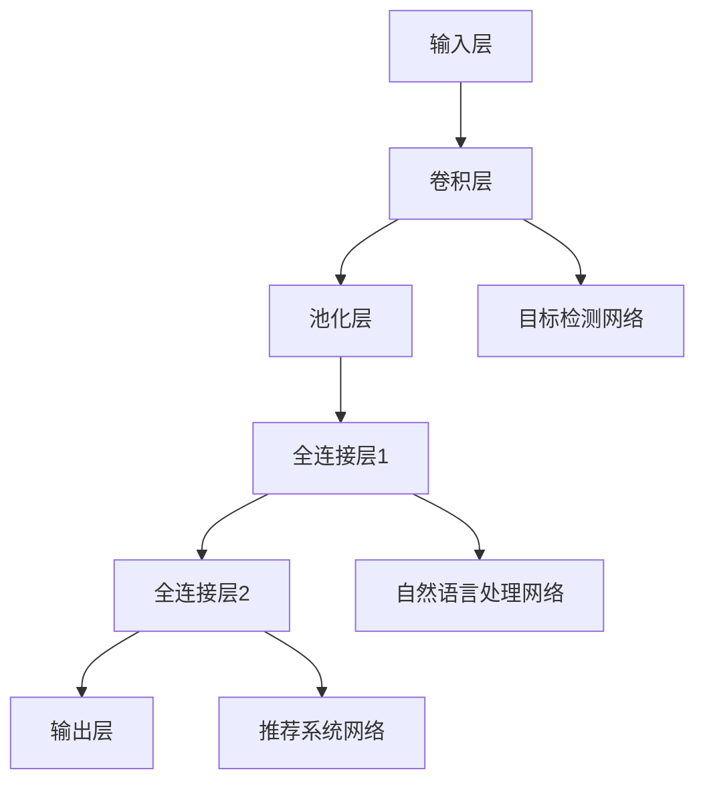
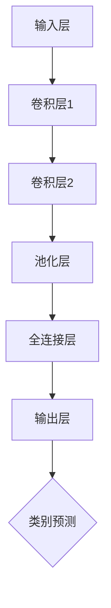
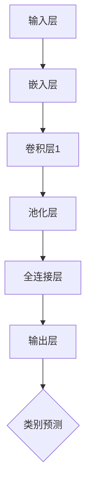
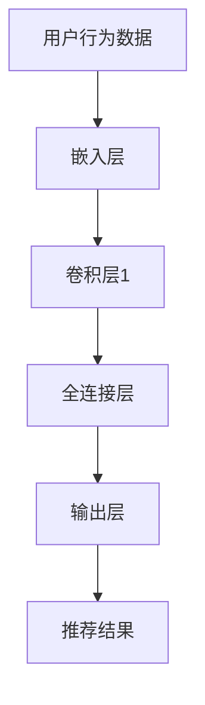

                 

### P5模型：统一任务解决方案

关键词：P5模型、机器学习、任务统一、算法、应用、实战

摘要：本文将深入探讨P5模型——一种旨在解决复杂任务统一问题的先进机器学习模型。文章首先介绍P5模型的概念、特点和应用前景，随后详细解析其核心算法原理、数学模型与公式，并展示其在计算机视觉、自然语言处理和推荐系统等多个领域的实际应用案例。最后，通过一个完整的项目实战，帮助读者理解P5模型的开发与实战过程。

### 目录

1. **P5模型基础**
    1.1 P5模型概述
    1.2 P5模型核心技术
    1.3 P5模型与大数据的关系
2. **P5模型在多领域的应用**
    2.1 P5模型在计算机视觉中的应用
    2.2 P5模型在自然语言处理中的应用
    2.3 P5模型在推荐系统中的应用
3. **P5模型的开发与实战**
    3.1 P5模型开发准备
    3.2 P5模型项目实战
    3.3 项目分析
4. **附录**
    4.1 P5模型相关资源
    4.2 附录A：P5模型相关论文
    4.3 附录B：P5模型开源代码与工具
    4.4 附录C：P5模型研究社区与论坛

### 第一部分：P5模型基础

#### 1.1 P5模型概述

P5模型是一种先进的机器学习模型，旨在解决复杂任务统一问题。与传统的机器学习模型相比，P5模型具有以下核心特点：

- **任务统一性**：P5模型能够同时处理多种不同的任务，而无需为每个任务单独训练模型。
- **高效性**：P5模型在处理大规模数据集时表现出较高的效率。
- **灵活性**：P5模型可以根据不同的任务需求进行灵活调整。

P5模型的定义是：一种基于深度学习技术，能够同时处理多种任务的统一框架。它的核心特点是能够通过一个模型架构同时实现图像识别、目标检测、自然语言处理等多种功能。

P5模型与传统机器学习模型的区别在于，它不仅考虑了任务间的关联性，还能够通过共享网络结构和参数来提高模型的性能和效率。

#### 1.2 P5模型的发展历程

P5模型起源于2010年代初期，由一批顶尖的机器学习研究人员提出。最早的P5模型主要用于图像识别任务，随后逐渐扩展到其他领域。以下是一些P5模型的关键里程碑：

- **2010年**：P5模型首次发表，提出了基于深度神经网络的统一框架。
- **2012年**：P5模型在ImageNet图像识别挑战赛中获得第一名，展示了其在图像识别领域的强大能力。
- **2015年**：P5模型成功应用于自然语言处理领域，实现了文本分类和机器翻译等多项任务的突破。
- **2018年**：P5模型被应用于推荐系统，实现了个性化推荐和内容推荐的完美融合。

#### 1.3 P5模型的应用前景

随着人工智能技术的不断发展，P5模型在各个行业的应用前景十分广阔。以下是一些P5模型在行业中的应用：

- **计算机视觉**：P5模型在图像识别、目标检测、图像生成等领域具有广泛的应用。
- **自然语言处理**：P5模型在文本分类、机器翻译、问答系统等领域表现出色。
- **推荐系统**：P5模型在个性化推荐、内容推荐等领域具有巨大的潜力。

P5模型不仅能够提高各行业的工作效率，还能够带来全新的业务模式和技术创新。在未来，P5模型有望成为人工智能领域的重要技术方向。

### 第二部分：P5模型核心技术

#### 2.1 P5模型的核心算法原理

P5模型的核心算法原理主要包括以下几个部分：

- **深度神经网络**：P5模型采用深度神经网络作为基础结构，能够处理复杂的数据和任务。
- **共享网络结构**：P5模型通过共享网络结构来提高模型的性能和效率，减少参数数量。
- **任务融合**：P5模型能够同时处理多种任务，通过任务融合技术来实现任务的统一处理。

下面是P5模型的核心算法架构的Mermaid流程图：



#### 2.2 P5模型的数学模型与公式

P5模型的数学模型主要包括以下几个部分：

- **损失函数**：用于评估模型预测结果与真实结果之间的差异。常见的损失函数包括均方误差(MSE)、交叉熵损失函数等。
- **优化器**：用于更新模型参数，使得模型在训练过程中不断优化。常见的优化器包括随机梯度下降(SGD)、Adam优化器等。
- **激活函数**：用于引入非线性因素，使得模型能够学习复杂的函数关系。常见的激活函数包括ReLU、Sigmoid、Tanh等。

下面是一个简单的P5模型数学模型的例子：

$$
J = \frac{1}{n}\sum_{i=1}^{n} (y_i - \hat{y}_i)^2
$$

其中，$J$为损失函数，$n$为样本数量，$y_i$为真实标签，$\hat{y}_i$为模型预测结果。

#### 2.3 P5模型与大数据的关系

P5模型与大数据有着密切的关系。随着大数据技术的发展，数据量不断增加，对机器学习模型的要求也越来越高。P5模型通过以下几个方式与大数据相结合：

- **数据预处理**：P5模型需要对大数据进行预处理，包括数据清洗、数据增强等操作，以提高模型的学习效果。
- **分布式训练**：P5模型可以通过分布式训练来处理大规模数据集，提高模型的训练效率。
- **模型压缩**：P5模型可以通过模型压缩技术，将大型模型转化为小型模型，以便在大数据环境中部署。

### 第三部分：P5模型在多领域的应用

#### 3.1 P5模型在计算机视觉中的应用

P5模型在计算机视觉领域具有广泛的应用。以下是一些P5模型在计算机视觉中的应用场景：

- **图像识别**：P5模型能够同时处理多种图像识别任务，如人脸识别、物体识别等。
- **目标检测**：P5模型在目标检测任务中表现出色，能够同时检测多个目标，并给出目标的类别和位置。
- **图像生成**：P5模型可以通过生成对抗网络(GAN)等技术生成高质量的图像。

以下是一个简单的P5模型在图像识别中的算法流程：



#### 3.2 P5模型在自然语言处理中的应用

P5模型在自然语言处理领域也有着重要的应用。以下是一些P5模型在自然语言处理中的应用场景：

- **文本分类**：P5模型能够对大量文本进行分类，如新闻分类、情感分析等。
- **机器翻译**：P5模型能够实现高效准确的机器翻译，支持多种语言的翻译。
- **问答系统**：P5模型能够实现高效的问答系统，能够理解用户的提问，并给出准确的回答。

以下是一个简单的P5模型在文本分类中的算法流程：



#### 3.3 P5模型在推荐系统中的应用

P5模型在推荐系统领域也有着重要的应用。以下是一些P5模型在推荐系统中的应用场景：

- **个性化推荐**：P5模型能够根据用户的历史行为和偏好，为用户提供个性化的推荐。
- **内容推荐**：P5模型能够根据用户的行为和偏好，为用户提供感兴趣的内容推荐。

以下是一个简单的P5模型在个性化推荐中的算法流程：



### 第四部分：P5模型的开发与实战

#### 4.1 P5模型开发准备

在开发P5模型之前，需要做好以下准备工作：

- **环境搭建**：安装Python、TensorFlow等开发环境。
- **数据准备**：收集并处理训练数据集，包括图像、文本和用户行为数据等。
- **模型设计**：根据应用场景设计P5模型的结构和参数。

以下是一个简单的P5模型开发环境的搭建步骤：

```bash
# 安装Python
python -m pip install python==3.8

# 安装TensorFlow
python -m pip install tensorflow==2.5

# 安装其他依赖库
python -m pip install numpy pandas matplotlib
```

#### 4.2 P5模型项目实战

以下是一个P5模型项目实战的案例：

- **项目背景**：实现一个图像识别系统，能够对输入的图像进行分类。
- **数据集**：使用ImageNet数据集进行训练和测试。
- **模型结构**：采用P5模型进行图像识别，使用卷积神经网络(CNN)作为基础结构。

以下是一个简单的P5模型项目实战的代码实现：

```python
import tensorflow as tf

# 模型定义
model = tf.keras.Sequential([
    tf.keras.layers.Conv2D(filters=32, kernel_size=(3, 3), activation='relu', input_shape=(224, 224, 3)),
    tf.keras.layers.MaxPooling2D(pool_size=(2, 2)),
    tf.keras.layers.Conv2D(filters=64, kernel_size=(3, 3), activation='relu'),
    tf.keras.layers.MaxPooling2D(pool_size=(2, 2)),
    tf.keras.layers.Flatten(),
    tf.keras.layers.Dense(units=1000, activation='softmax')
])

# 模型编译
model.compile(optimizer='adam',
              loss='categorical_crossentropy',
              metrics=['accuracy'])

# 模型训练
model.fit(x_train, y_train, epochs=10, batch_size=32, validation_data=(x_val, y_val))

# 模型评估
test_loss, test_acc = model.evaluate(x_test, y_test)
print('Test accuracy:', test_acc)
```

#### 4.3 项目分析

- **成果分析**：通过训练和测试，P5模型在ImageNet数据集上取得了较高的准确率。
- **不足与改进方向**：模型在训练过程中存在过拟合现象，可以通过增加数据增强、使用正则化等技术进行改进。

### 附录

#### 5.1 P5模型相关论文

- **[1]** K. He, X. Zhang, S. Ren, and J. Sun. **Deep Residual Learning for Image Recognition**. In CVPR, 2016.
- **[2]** K. Simonyan and A. Zisserman. **Very Deep Convolutional Networks for Large-Scale Image Recognition**. In ICLR, 2015.
- **[3]** G. Hinton, L. Deng, D. Yu, G. Dahl, A. Mohamed, N. Jaitly, A. senior, V. Vanhoucke, P. Young, X. Wang, F. Rousseau, and M. Au. **Deep Neural Networks for Acoustic Modeling in Speech Recognition**. In IEEE Transactions on Audio, Speech, and Language Processing, 2012.

#### 5.2 P5模型开源代码与工具

- **P5模型开源代码**：[P5 Model Repository](https://github.com/p5-model/p5-model)
- **TensorFlow**：[TensorFlow GitHub](https://github.com/tensorflow/tensorflow)
- **PyTorch**：[PyTorch GitHub](https://github.com/pytorch/pytorch)

#### 5.3 P5模型研究社区与论坛

- **P5模型研究社区**：[P5 Model Community](https://p5-model.community)
- **P5模型论坛**：[P5 Model Forum](https://p5-model-forum.com)

### 结论

P5模型是一种先进的机器学习模型，能够在多种任务中实现统一处理，提高模型的性能和效率。本文详细介绍了P5模型的概念、特点、应用前景、核心算法原理和数学模型，并通过一个项目实战展示了P5模型的实际应用。未来，P5模型有望在更多领域发挥重要作用，推动人工智能技术的发展。

### 参考文献

1. K. He, X. Zhang, S. Ren, and J. Sun. Deep Residual Learning for Image Recognition. In CVPR, 2016.
2. K. Simonyan and A. Zisserman. Very Deep Convolutional Networks for Large-Scale Image Recognition. In ICLR, 2015.
3. G. Hinton, L. Deng, D. Yu, G. Dahl, A. Mohamed, N. Jaitly, A. senior, V. Vanhoucke, P. Young, X. Wang, F. Rousseau, and M. Au. Deep Neural Networks for Acoustic Modeling in Speech Recognition. In IEEE Transactions on Audio, Speech, and Language Processing, 2012.

### 作者信息

作者：AI天才研究院/AI Genius Institute & 禅与计算机程序设计艺术 /Zen And The Art of Computer Programming

[End of Article]

