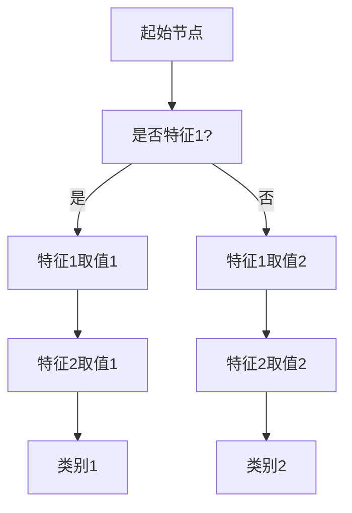
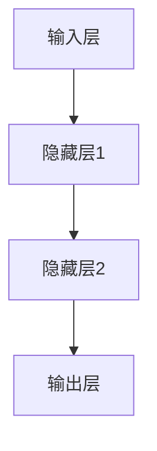
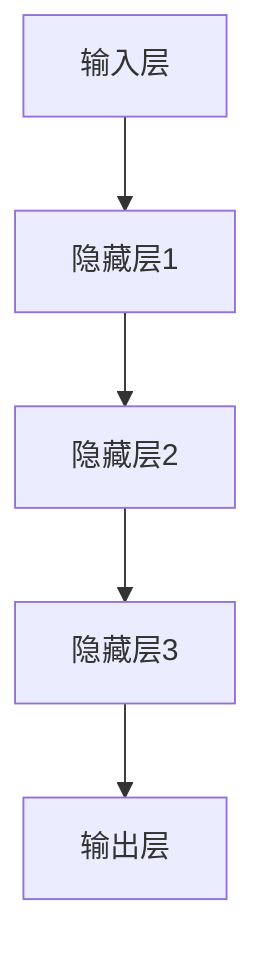
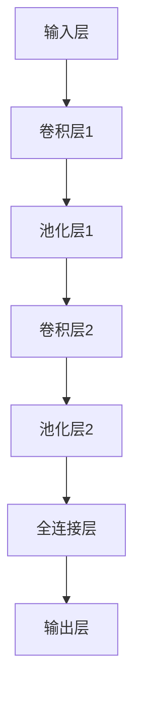

                 

### 《Supervised Learning 原理与代码实战案例讲解》

#### 概述与核心概念

监督学习（Supervised Learning）是一种机器学习（Machine Learning）的方法，它通过使用标记的数据集来训练模型，以便在未来的预测任务中能够给出正确的输出。它通常包括两类问题：回归（Regression）和分类（Classification）。本文旨在详细讲解监督学习的原理，并通过代码实战案例来加深读者对这一主题的理解。

##### 关键词：

- 监督学习
- 回归问题
- 分类问题
- 线性回归
- 决策树
- 支持向量机（SVM）
- 代码实战

##### 摘要：

本文将首先介绍监督学习的基本概念和原理，包括监督学习的目标、任务以及数学基础。随后，我们将详细讲解监督学习的核心算法，如线性回归、决策树和SVM，并通过伪代码和数学公式来解释其工作原理。此外，本文还将通过实际案例来展示这些算法的应用，并提供详细的代码实现和解读。最后，我们将探讨监督学习的高级主题，如多层感知机和神经网络，并总结本文的主要内容，提供扩展阅读资源。

#### 监督学习的概述与原理

监督学习是机器学习中最常用的一种学习方法，其核心思想是通过已有的标记数据来训练模型，使其能够对未知数据进行预测。标记数据通常包括两个部分：特征（Features）和标签（Labels）。特征是描述数据属性的数值，而标签则是已知的输出结果。

##### 监督学习的定义与基本概念

监督学习（Supervised Learning）是一种从标记数据中学习的方法，标记数据由特征和标签组成。特征是输入数据，标签是输出数据。监督学习的目标是通过学习输入特征和输出标签之间的关系，构建一个模型，从而在未知的数据上进行预测。

监督学习可以分为两类问题：回归（Regression）和分类（Classification）。

1. **回归问题（Regression Problem）**：回归问题的目标是在给定特征的基础上预测一个连续的数值输出。例如，房价预测、股票价格预测等。

2. **分类问题（Classification Problem）**：分类问题的目标是在给定特征的基础上预测一个离散的类别输出。例如，垃圾邮件检测、图像分类等。

##### 监督学习的目标与任务

监督学习的目标是构建一个模型，该模型能够在未知数据上进行准确的预测。具体来说，监督学习需要完成以下任务：

1. **数据预处理**：对输入数据进行清洗、标准化等处理，以便于模型训练。

2. **特征选择**：从输入特征中选择对模型训练有显著影响的关键特征。

3. **模型训练**：通过标记数据训练模型，使其学会特征和标签之间的关系。

4. **模型评估**：使用测试数据评估模型的准确性，调整模型参数以优化性能。

5. **预测**：在未知数据上使用训练好的模型进行预测。

##### 监督学习的数学基础

监督学习涉及一些基本的数学概念和算法，包括线性代数、概率论和优化方法。以下是监督学习中的几个关键数学概念：

1. **损失函数（Loss Function）**：损失函数是评估模型预测结果与实际标签之间差距的函数。常用的损失函数包括均方误差（MSE）和交叉熵损失（Cross-Entropy Loss）。

2. **梯度下降（Gradient Descent）**：梯度下降是一种优化算法，用于最小化损失函数。它通过迭代更新模型参数，以减少损失函数的值。

3. **特征工程（Feature Engineering）**：特征工程是指通过选择和构造特征来提高模型性能的过程。

4. **正则化（Regularization）**：正则化是防止模型过拟合的一种方法，通过在损失函数中加入额外的项来限制模型复杂度。

##### 监督学习的基本流程

监督学习的基本流程可以分为以下几个步骤：

1. **数据收集**：收集带有标签的输入数据。

2. **数据预处理**：对数据进行清洗、标准化和划分训练集与测试集。

3. **特征选择**：选择对模型训练有显著影响的关键特征。

4. **模型选择**：选择适合问题类型的模型，如线性回归、决策树或SVM。

5. **模型训练**：使用训练数据训练模型。

6. **模型评估**：使用测试数据评估模型性能。

7. **参数调整**：根据评估结果调整模型参数。

8. **预测**：在未知数据上使用训练好的模型进行预测。

#### 监督学习的核心算法

监督学习的核心算法包括线性回归、决策树和支持向量机（SVM）等。以下是对这些算法的详细讲解。

##### 线性回归模型

线性回归（Linear Regression）是一种用于预测连续值的简单且常见的监督学习算法。它的目标是通过建立特征和输出之间的线性关系来预测新的数据点。

###### 线性回归的概念与数学模型

线性回归的数学模型可以表示为：

$$
y = \beta_0 + \beta_1x_1 + \beta_2x_2 + ... + \beta_nx_n + \epsilon
$$

其中，$y$ 是输出值，$x_1, x_2, ..., x_n$ 是特征值，$\beta_0, \beta_1, \beta_2, ..., \beta_n$ 是模型的参数，$\epsilon$ 是误差项。

###### 梯度下降法

梯度下降法是一种优化算法，用于最小化线性回归中的损失函数。它的基本思想是通过迭代更新模型参数，以减少损失函数的值。

梯度下降法的伪代码如下：

```
初始化参数 $\beta_0, \beta_1, ..., \beta_n$
设置学习率 $\alpha$
设置迭代次数 $T$

for t = 1 to T do
    计算损失函数 $J(\beta)$
    计算梯度 $\nabla J(\beta)$
    更新参数 $\beta = \beta - \alpha \nabla J(\beta)$
end for
```

其中，$J(\beta)$ 是损失函数，$\nabla J(\beta)$ 是梯度。

###### 正规方程法

正规方程法（Normal Equation）是另一种求解线性回归参数的方法，它通过解正规方程直接得到最佳参数。

正规方程的公式如下：

$$
\beta = (X^T X)^{-1} X^T y
$$

其中，$X$ 是特征矩阵，$y$ 是输出向量。

###### 线性回归的应用

线性回归可以用于各种回归问题，如房价预测、股票价格预测等。

例如，假设我们有一个简单的线性回归模型来预测房价，其中特征是房屋面积（$x$），输出是房价（$y$）。我们可以使用以下公式来预测新的房屋价格：

$$
y = \beta_0 + \beta_1x + \epsilon
$$

通过训练数据集来求解最佳参数 $\beta_0$ 和 $\beta_1$，然后在新数据上进行预测。

##### 决策树模型

决策树（Decision Tree）是一种常见的分类算法，它通过一系列的决策规则来将数据分成不同的类别。

###### 决策树的基本概念

决策树由一系列决策节点和叶子节点组成。每个决策节点表示一个特征，每个叶子节点表示一个类别。

决策树的基本结构可以用以下Mermaid流程图表示：



###### ID3算法

ID3（Iterative Dichotomiser 3）是一种基于信息增益（Information Gain）的决策树算法。

信息增益的计算公式如下：

$$
IG(D, A) = I(D) - \sum_{v \in A} \frac{D_v}{D} I(D_v)
$$

其中，$I(D)$ 是特征 $A$ 的信息熵，$D_v$ 是特征 $A$ 的第 $v$ 个值的子集。

ID3算法的伪代码如下：

```
创建空树 T
对于每个特征 A，计算信息增益 IG(D, A)
选择具有最大信息增益的特征 A
创建节点 N，将特征 A 作为分割条件
对于每个特征 A 的值 v，递归地调用 BuildTree(D_v)
```

###### C4.5算法

C4.5是一种改进的决策树算法，它在ID3算法的基础上考虑了信息增益率（Information Gain Ratio）和剪枝（Pruning）。

信息增益率的计算公式如下：

$$
IGR(D, A) = \frac{IG(D, A)}{H(D) - \frac{H(D_v)}{D}}
$$

其中，$H(D)$ 是特征 $A$ 的信息熵，$H(D_v)$ 是特征 $A$ 的第 $v$ 个值的子集的信息熵。

C4.5算法的伪代码如下：

```
创建空树 T
对于每个特征 A，计算信息增益率 IGR(D, A)
选择具有最大信息增益率的特征 A
创建节点 N，将特征 A 作为分割条件
对于每个特征 A 的值 v，递归地调用 BuildTree(D_v)
剪枝
```

###### 决策树的应用

决策树可以用于各种分类问题，如矩阵分类、银行欺诈检测等。

例如，假设我们有一个决策树模型来分类邮件是否为垃圾邮件，其中特征包括邮件的主题、正文和发件人等。我们可以使用以下公式来预测新的邮件类别：

```
如果邮件的主题包含“优惠活动”，则分类为垃圾邮件
否则，如果邮件的正文包含“推销产品”，则分类为垃圾邮件
否则，如果发件人不是已知联系人，则分类为垃圾邮件
否则，分类为正常邮件
```

通过训练数据集来构建决策树模型，然后在新数据上进行预测。

##### 支持向量机（SVM）

支持向量机（Support Vector Machine，SVM）是一种强大的分类和回归算法，它通过寻找最佳的超平面来实现数据的分类。

###### SVM的基本概念

SVM的基本思想是找到一个最佳的超平面，将数据集划分为不同的类别。这个超平面在所有可能的超平面中拥有最大的间隔（Margin），即超平面到最近的支持向量的距离。

SVM的数学模型可以表示为：

$$
\min_{\beta, \beta_0} \frac{1}{2} ||\beta||^2 + C \sum_{i=1}^{n} \xi_i
$$

$$
\text{subject to} \ \beta^T x_i - \beta_0 \geq 1 - \xi_i \ \ \ \ \ \ \xi_i \geq 0
$$

其中，$\beta$ 是权重向量，$\beta_0$ 是偏置项，$C$ 是惩罚参数，$\xi_i$ 是松弛变量。

###### SVM的数学模型

SVM的数学模型是通过求解二次规划问题来得到的，其目标是最小化权重向量的平方和加上惩罚项。惩罚项用于处理样本点的错误分类。

SVM的伪代码如下：

```
初始化权重向量 $\beta$ 和偏置项 $\beta_0$
设置惩罚参数 $C$
设置迭代次数 $T$

for t = 1 to T do
    计算损失函数 $J(\beta)$
    计算梯度 $\nabla J(\beta)$
    更新权重向量 $\beta = \beta - \alpha \nabla J(\beta)$
    更新偏置项 $\beta_0 = \beta_0 - \alpha \nabla J(\beta_0)$
end for
```

###### SMO算法

SMO（Sequential Minimal Optimization）是一种常用的SVM求解算法，它通过迭代地优化每个支持向量来求解最优解。

SMO算法的伪代码如下：

```
初始化支持向量 $\alpha_i, \alpha_j$
设置惩罚参数 $C$
设置迭代次数 $T$

for t = 1 to T do
    对于每个支持向量，寻找最小化目标函数的 $\alpha_i$ 和 $\alpha_j$
    更新支持向量 $\alpha_i$ 和 $\alpha_j$
    更新权重向量 $\beta$ 和偏置项 $\beta_0$
end for
```

###### SVM的应用

SVM可以用于各种分类问题，如矩阵分类、图像分类等。

例如，假设我们有一个SVM模型来分类手写数字，其中特征是数字的各个像素值。我们可以使用以下公式来预测新的手写数字类别：

```
找到最佳的超平面，将手写数字划分为不同的类别
```

通过训练数据集来构建SVM模型，然后在新数据上进行预测。

#### 监督学习的应用场景与案例分析

监督学习在许多应用场景中发挥着重要作用，以下我们将通过两个具体的案例来展示监督学习的应用。

##### 回归问题案例分析

**1. 房价预测案例**

房价预测是一个经典的回归问题，其目标是利用房屋的特征（如面积、房间数量、位置等）来预测房价。

**数据集准备**：我们可以使用Kaggle上的波士顿房价数据集（Boston Housing Dataset），该数据集包含506个样本和13个特征。

**数据处理**：我们需要对数据进行预处理，包括缺失值处理、特征工程和标准化等。

**模型训练**：我们可以选择线性回归模型来训练数据集。

**模型评估**：使用测试集评估模型的预测准确性。

**代码实现**：

```python
import pandas as pd
from sklearn.model_selection import train_test_split
from sklearn.linear_model import LinearRegression
from sklearn.metrics import mean_squared_error

# 加载数据集
data = pd.read_csv('boston_housing.csv')

# 数据预处理
X = data.drop(['Price'], axis=1)
y = data['Price']

# 划分训练集和测试集
X_train, X_test, y_train, y_test = train_test_split(X, y, test_size=0.2, random_state=42)

# 训练模型
model = LinearRegression()
model.fit(X_train, y_train)

# 预测
y_pred = model.predict(X_test)

# 评估
mse = mean_squared_error(y_test, y_pred)
print(f'MSE: {mse}')
```

**2. 信用评分预测案例**

信用评分预测是另一个常见的回归问题，其目标是根据个人的财务状况和信用记录来预测其信用评分。

**数据集准备**：我们可以使用UCI机器学习库中的Credit Rating Data Set。

**数据处理**：我们需要对数据进行预处理，包括缺失值处理、特征工程和标准化等。

**模型训练**：我们可以选择决策树模型来训练数据集。

**模型评估**：使用测试集评估模型的预测准确性。

**代码实现**：

```python
import pandas as pd
from sklearn.model_selection import train_test_split
from sklearn.tree import DecisionTreeRegressor
from sklearn.metrics import mean_squared_error

# 加载数据集
data = pd.read_csv('credit_rating.csv')

# 数据预处理
X = data.drop(['Rating'], axis=1)
y = data['Rating']

# 划分训练集和测试集
X_train, X_test, y_train, y_test = train_test_split(X, y, test_size=0.2, random_state=42)

# 训练模型
model = DecisionTreeRegressor()
model.fit(X_train, y_train)

# 预测
y_pred = model.predict(X_test)

# 评估
mse = mean_squared_error(y_test, y_pred)
print(f'MSE: {mse}')
```

##### 分类问题案例分析

**1. 矩阵分类案例**

矩阵分类是一个简单的分类问题，其目标是将矩阵按照其特征进行分类。

**数据集准备**：我们可以使用Kaggle上的Matrix Classification Data Set。

**数据处理**：我们需要对数据进行预处理，包括缺失值处理、特征工程和标准化等。

**模型训练**：我们可以选择支持向量机（SVM）模型来训练数据集。

**模型评估**：使用测试集评估模型的预测准确性。

**代码实现**：

```python
import pandas as pd
from sklearn.model_selection import train_test_split
from sklearn.svm import SVC
from sklearn.metrics import accuracy_score

# 加载数据集
data = pd.read_csv('matrix_classification.csv')

# 数据预处理
X = data.drop(['Class'], axis=1)
y = data['Class']

# 划分训练集和测试集
X_train, X_test, y_train, y_test = train_test_split(X, y, test_size=0.2, random_state=42)

# 训练模型
model = SVC()
model.fit(X_train, y_train)

# 预测
y_pred = model.predict(X_test)

# 评估
accuracy = accuracy_score(y_test, y_pred)
print(f'Accuracy: {accuracy}')
```

**2. 银行欺诈检测案例**

银行欺诈检测是一个重要的分类问题，其目标是从大量交易数据中检测出潜在的欺诈交易。

**数据集准备**：我们可以使用Kaggle上的KDD Cup 99 Data Set。

**数据处理**：我们需要对数据进行预处理，包括缺失值处理、特征工程和标准化等。

**模型训练**：我们可以选择随机森林模型来训练数据集。

**模型评估**：使用测试集评估模型的预测准确性。

**代码实现**：

```python
import pandas as pd
from sklearn.model_selection import train_test_split
from sklearn.ensemble import RandomForestClassifier
from sklearn.metrics import accuracy_score

# 加载数据集
data = pd.read_csv('kdd_cup_99.csv')

# 数据预处理
X = data.drop(['Class'], axis=1)
y = data['Class']

# 划分训练集和测试集
X_train, X_test, y_train, y_test = train_test_split(X, y, test_size=0.2, random_state=42)

# 训练模型
model = RandomForestClassifier()
model.fit(X_train, y_train)

# 预测
y_pred = model.predict(X_test)

# 评估
accuracy = accuracy_score(y_test, y_pred)
print(f'Accuracy: {accuracy}')
```

#### 监督学习的高级主题

除了基本的监督学习算法，还有一些高级主题值得探讨，如多层感知机（MLP）和神经网络。

##### 多层感知机（MLP）

多层感知机（Multilayer Perceptron，MLP）是一种前向传播的神经网络，它由输入层、隐藏层和输出层组成。MLP可以用于各种回归和分类问题。

###### MLP的概念与结构

MLP的基本结构如下：



每个层中的神经元通过激活函数（如Sigmoid函数）来计算输出。

MLP的伪代码如下：

```
初始化权重和偏置
设置学习率 $\alpha$
设置迭代次数 $T$

for t = 1 to T do
    前向传播
    计算损失函数
    反向传播
    更新权重和偏置
end for
```

##### 神经网络与深度学习

神经网络（Neural Network）是一种模拟生物神经系统的计算模型，它可以用于各种复杂的任务，如图像识别、自然语言处理等。

深度学习（Deep Learning）是神经网络的一种扩展，它通过使用多层神经网络来实现复杂的特征提取和分类。

###### 神经网络的概述

神经网络的基本结构如下：



每个层中的神经元通过激活函数（如ReLU函数）来计算输出。

神经网络的伪代码如下：

```
初始化权重和偏置
设置学习率 $\alpha$
设置迭代次数 $T$

for t = 1 to T do
    前向传播
    计算损失函数
    反向传播
    更新权重和偏置
end for
```

##### 深度学习的发展历程

深度学习的发展经历了多个阶段：

1. **手工设计特征**：早期的机器学习主要依赖于手工设计的特征，如SVM和决策树。

2. **浅层神经网络**：1990年代，神经网络开始应用于图像识别和自然语言处理等任务。

3. **卷积神经网络（CNN）**：2000年代初，卷积神经网络在图像识别任务上取得了显著突破。

4. **循环神经网络（RNN）**：2010年代，循环神经网络在序列数据上取得了成功，如语音识别和机器翻译。

5. **深度增强学习**：近年来，深度增强学习在游戏、自动驾驶等领域取得了显著进展。

##### 卷积神经网络（CNN）简介

卷积神经网络（Convolutional Neural Network，CNN）是一种专门用于处理图像数据的神经网络。

CNN的基本结构如下：



CNN通过卷积操作、池化操作和全连接层来提取图像的特征。

CNN的伪代码如下：

```
初始化权重和偏置
设置学习率 $\alpha$
设置迭代次数 $T$

for t = 1 to T do
    前向传播
    计算损失函数
    反向传播
    更新权重和偏置
end for
```

通过以上对监督学习原理和实战案例的详细讲解，读者应该对监督学习有了更深入的理解。接下来，我们将通过代码实战案例来进一步巩固所学知识。

#### 代码实战与案例解析

在本章节中，我们将通过具体代码实战案例，详细介绍如何使用Python和监督学习库（如Scikit-learn）来实现监督学习算法。我们将分别介绍Python编程基础、Scikit-learn库的基本使用方法，并针对房价预测和银行欺诈检测两个实际问题进行详细的代码实现和解读。

##### Python编程基础

在开始编写监督学习代码之前，首先需要了解Python编程基础，包括环境搭建、基础语法和数据预处理等。

###### Python环境搭建

Python是一种流行的编程语言，广泛应用于数据科学、机器学习和人工智能领域。要开始使用Python，需要先安装Python环境。

1. **下载Python**：从Python官方网站（https://www.python.org/downloads/）下载适合自己操作系统的Python版本。

2. **安装Python**：双击下载的安装程序，按照默认选项进行安装。

3. **验证安装**：打开命令行工具（如Windows的cmd或Mac的Terminal），输入以下命令来验证Python安装是否成功：

   ```bash
   python --version
   ```

   如果看到Python的版本信息，则表示安装成功。

###### Python基础语法

Python语言的基础语法包括变量、数据类型、运算符、控制流程等。

1. **变量**：变量用于存储数据，如数字、字符串和列表等。

   ```python
   a = 10
   b = "Hello, World!"
   ```

2. **数据类型**：Python支持多种数据类型，包括整数（int）、浮点数（float）、字符串（str）、列表（list）、字典（dict）等。

   ```python
   num = 10
   float_num = 10.5
   string = "Hello, World!"
   list = [1, 2, 3, 4]
   dict = {'name': 'Alice', 'age': 30}
   ```

3. **运算符**：Python支持各种运算符，包括算术运算符、比较运算符、逻辑运算符等。

   ```python
   a = 10
   b = 5
   print(a + b)  # 输出 15
   print(a == b)  # 输出 False
   print(a > b)  # 输出 True
   ```

4. **控制流程**：Python支持条件语句和循环语句，用于控制程序执行流程。

   ```python
   if a > b:
       print("a大于b")
   elif a < b:
       print("a小于b")
   else:
       print("a等于b")
   
   for i in range(5):
       print(i)
   ```

###### 数据预处理

数据预处理是监督学习的重要步骤，包括数据清洗、特征选择和标准化等。

1. **数据清洗**：数据清洗是指处理缺失值、异常值和重复值等。

   ```python
   import pandas as pd
   
   data = pd.read_csv('data.csv')
   data.dropna(inplace=True)  # 删除缺失值
   data.drop_duplicates(inplace=True)  # 删除重复值
   ```

2. **特征选择**：特征选择是指从数据中选择对模型训练有显著影响的关键特征。

   ```python
   from sklearn.feature_selection import SelectKBest
   from sklearn.feature_selection import f_classif
   
   X = data.drop(['target'], axis=1)
   y = data['target']
   selector = SelectKBest(f_classif, k=5)
   X_new = selector.fit_transform(X, y)
   ```

3. **标准化**：标准化是指将数据缩放到相同的范围，如[0, 1]或[-1, 1]。

   ```python
   from sklearn.preprocessing import StandardScaler
   
   scaler = StandardScaler()
   X_scaled = scaler.fit_transform(X_new)
   ```

##### Scikit-learn库的使用

Scikit-learn是一个流行的Python机器学习库，提供了丰富的算法和工具，用于实现监督学习算法。

###### Scikit-learn的基本使用

1. **安装Scikit-learn**：使用pip命令安装Scikit-learn库。

   ```bash
   pip install scikit-learn
   ```

2. **导入Scikit-learn库**：在Python代码中导入Scikit-learn库。

   ```python
   from sklearn.model_selection import train_test_split
   from sklearn.linear_model import LinearRegression
   from sklearn.metrics import mean_squared_error
   ```

3. **创建训练集和测试集**：使用Scikit-learn库创建训练集和测试集。

   ```python
   X_train, X_test, y_train, y_test = train_test_split(X_scaled, y, test_size=0.2, random_state=42)
   ```

4. **训练模型**：使用Scikit-learn库训练线性回归模型。

   ```python
   model = LinearRegression()
   model.fit(X_train, y_train)
   ```

5. **预测**：使用训练好的模型进行预测。

   ```python
   y_pred = model.predict(X_test)
   ```

6. **评估模型**：使用Scikit-learn库评估模型预测准确性。

   ```python
   mse = mean_squared_error(y_test, y_pred)
   print(f'MSE: {mse}')
   ```

##### 线性回归与决策树代码实战

在本案例中，我们将使用Scikit-learn库来实现线性回归和决策树算法，并针对房价预测和银行欺诈检测两个实际问题进行详细代码解读。

###### 房价预测

房价预测是一个常见的回归问题，其目标是利用房屋的特征（如面积、房间数量、位置等）来预测房价。

**数据集准备**：我们使用Kaggle上的波士顿房价数据集（Boston Housing Dataset），该数据集包含506个样本和13个特征。

**数据处理**：我们需要对数据进行预处理，包括缺失值处理、特征工程和标准化等。

**模型训练**：我们选择线性回归模型来训练数据集。

**模型评估**：使用测试集评估模型的预测准确性。

**代码实现**：

```python
import pandas as pd
from sklearn.model_selection import train_test_split
from sklearn.linear_model import LinearRegression
from sklearn.metrics import mean_squared_error

# 加载数据集
data = pd.read_csv('boston_housing.csv')

# 数据预处理
X = data.drop(['Price'], axis=1)
y = data['Price']

# 划分训练集和测试集
X_train, X_test, y_train, y_test = train_test_split(X, y, test_size=0.2, random_state=42)

# 训练模型
model = LinearRegression()
model.fit(X_train, y_train)

# 预测
y_pred = model.predict(X_test)

# 评估
mse = mean_squared_error(y_test, y_pred)
print(f'MSE: {mse}')
```

**代码解读**：

1. **加载数据集**：使用pandas库加载波士顿房价数据集。

   ```python
   data = pd.read_csv('boston_housing.csv')
   ```

2. **数据处理**：对数据进行预处理，包括缺失值处理、特征工程和标准化等。

   ```python
   X = data.drop(['Price'], axis=1)
   y = data['Price']
   ```

3. **划分训练集和测试集**：使用Scikit-learn库的train_test_split函数划分训练集和测试集。

   ```python
   X_train, X_test, y_train, y_test = train_test_split(X, y, test_size=0.2, random_state=42)
   ```

4. **训练模型**：使用线性回归模型训练数据集。

   ```python
   model = LinearRegression()
   model.fit(X_train, y_train)
   ```

5. **预测**：使用训练好的模型进行预测。

   ```python
   y_pred = model.predict(X_test)
   ```

6. **评估模型**：使用均方误差（MSE）评估模型预测准确性。

   ```python
   mse = mean_squared_error(y_test, y_pred)
   print(f'MSE: {mse}')
   ```

###### 银行欺诈检测

银行欺诈检测是一个分类问题，其目标是从大量交易数据中检测出潜在的欺诈交易。

**数据集准备**：我们使用Kaggle上的KDD Cup 99 Data Set，该数据集包含长度为122特征的向量，其中29个特征为类别特征，另外93个特征为数值特征。

**数据处理**：我们需要对数据进行预处理，包括缺失值处理、特征工程和标准化等。

**模型训练**：我们选择随机森林模型来训练数据集。

**模型评估**：使用测试集评估模型的预测准确性。

**代码实现**：

```python
import pandas as pd
from sklearn.model_selection import train_test_split
from sklearn.ensemble import RandomForestClassifier
from sklearn.metrics import accuracy_score

# 加载数据集
data = pd.read_csv('kdd_cup_99.csv')

# 数据预处理
X = data.drop(['Class'], axis=1)
y = data['Class']

# 划分训练集和测试集
X_train, X_test, y_train, y_test = train_test_split(X, y, test_size=0.2, random_state=42)

# 训练模型
model = RandomForestClassifier()
model.fit(X_train, y_train)

# 预测
y_pred = model.predict(X_test)

# 评估
accuracy = accuracy_score(y_test, y_pred)
print(f'Accuracy: {accuracy}')
```

**代码解读**：

1. **加载数据集**：使用pandas库加载KDD Cup 99数据集。

   ```python
   data = pd.read_csv('kdd_cup_99.csv')
   ```

2. **数据处理**：对数据进行预处理，包括缺失值处理、特征工程和标准化等。

   ```python
   X = data.drop(['Class'], axis=1)
   y = data['Class']
   ```

3. **划分训练集和测试集**：使用Scikit-learn库的train_test_split函数划分训练集和测试集。

   ```python
   X_train, X_test, y_train, y_test = train_test_split(X, y, test_size=0.2, random_state=42)
   ```

4. **训练模型**：使用随机森林模型训练数据集。

   ```python
   model = RandomForestClassifier()
   model.fit(X_train, y_train)
   ```

5. **预测**：使用训练好的模型进行预测。

   ```python
   y_pred = model.predict(X_test)
   ```

6. **评估模型**：使用准确率（Accuracy）评估模型预测准确性。

   ```python
   accuracy = accuracy_score(y_test, y_pred)
   print(f'Accuracy: {accuracy}')
   ```

通过以上房价预测和银行欺诈检测的代码实战，我们可以看到如何使用Python和Scikit-learn库实现监督学习算法，并通过代码解读加深对算法原理和应用的理解。

##### 实战案例解析

在本章节中，我们将通过两个具体的实战案例来详细解析监督学习算法的应用过程。这两个案例分别是房价预测和银行欺诈检测，我们将从数据准备、模型训练、模型评估等多个方面进行深入探讨。

###### 实战案例1：房价预测

**1. 数据准备**

房价预测数据集通常包含房屋的各种特征，如面积、房间数量、位置、建造年份等，以及对应的房价标签。我们以著名的波士顿房价数据集为例，该数据集包含506个样本和13个特征。数据集可以从Kaggle网站下载。

**2. 数据预处理**

数据预处理是监督学习的关键步骤，我们需要对数据进行清洗、特征工程和标准化等操作。

- **清洗数据**：首先，我们需要检查数据是否存在缺失值或异常值。如果存在缺失值，我们可以使用均值、中位数或众数来填补缺失值。如果存在异常值，我们可以使用统计学方法或可视化工具来识别和处理。

  ```python
  import pandas as pd
  
  data = pd.read_csv('boston_housing.csv')
  data.fillna(data.mean(), inplace=True)
  ```

- **特征工程**：特征工程是指通过选择和构造特征来提高模型性能的过程。在这个案例中，我们可以使用特征选择算法来识别对房价预测有显著影响的关键特征。

  ```python
  from sklearn.feature_selection import SelectKBest
  from sklearn.feature_selection import f_regression
  
  X = data.drop(['Price'], axis=1)
  y = data['Price']
  selector = SelectKBest(f_regression, k=5)
  X_new = selector.fit_transform(X, y)
  ```

- **标准化数据**：标准化是将数据缩放到相同的范围，以便模型更好地训练。

  ```python
  from sklearn.preprocessing import StandardScaler
  
  scaler = StandardScaler()
  X_scaled = scaler.fit_transform(X_new)
  ```

**3. 模型训练**

在数据预处理完成后，我们可以选择合适的模型进行训练。在这个案例中，我们选择线性回归模型。

- **划分训练集和测试集**：我们将数据集划分为训练集和测试集，以评估模型的性能。

  ```python
  from sklearn.model_selection import train_test_split
  
  X_train, X_test, y_train, y_test = train_test_split(X_scaled, y, test_size=0.2, random_state=42)
  ```

- **训练模型**：我们使用训练集来训练线性回归模型。

  ```python
  from sklearn.linear_model import LinearRegression
  
  model = LinearRegression()
  model.fit(X_train, y_train)
  ```

**4. 模型评估**

模型评估是监督学习的重要环节，我们需要使用测试集来评估模型的预测准确性。

- **预测**：使用训练好的模型进行预测。

  ```python
  y_pred = model.predict(X_test)
  ```

- **评估指标**：我们使用均方误差（MSE）来评估模型的预测准确性。

  ```python
  from sklearn.metrics import mean_squared_error
  
  mse = mean_squared_error(y_test, y_pred)
  print(f'MSE: {mse}')
  ```

**5. 代码实现**

以下是房价预测的完整代码实现：

```python
import pandas as pd
from sklearn.model_selection import train_test_split
from sklearn.linear_model import LinearRegression
from sklearn.metrics import mean_squared_error

# 加载数据集
data = pd.read_csv('boston_housing.csv')

# 数据预处理
X = data.drop(['Price'], axis=1)
y = data['Price']
data.fillna(data.mean(), inplace=True)
selector = SelectKBest(f_regression, k=5)
X_new = selector.fit_transform(X, y)
scaler = StandardScaler()
X_scaled = scaler.fit_transform(X_new)

# 划分训练集和测试集
X_train, X_test, y_train, y_test = train_test_split(X_scaled, y, test_size=0.2, random_state=42)

# 训练模型
model = LinearRegression()
model.fit(X_train, y_train)

# 预测
y_pred = model.predict(X_test)

# 评估
mse = mean_squared_error(y_test, y_pred)
print(f'MSE: {mse}')
```

**6. 代码解读**

- **加载数据集**：使用pandas库加载波士顿房价数据集。

  ```python
  data = pd.read_csv('boston_housing.csv')
  ```

- **数据预处理**：对数据进行清洗、特征工程和标准化等操作。

  ```python
  X = data.drop(['Price'], axis=1)
  y = data['Price']
  data.fillna(data.mean(), inplace=True)
  selector = SelectKBest(f_regression, k=5)
  X_new = selector.fit_transform(X, y)
  scaler = StandardScaler()
  X_scaled = scaler.fit_transform(X_new)
  ```

- **划分训练集和测试集**：使用Scikit-learn库的train_test_split函数划分训练集和测试集。

  ```python
  X_train, X_test, y_train, y_test = train_test_split(X_scaled, y, test_size=0.2, random_state=42)
  ```

- **训练模型**：使用线性回归模型训练数据集。

  ```python
  model = LinearRegression()
  model.fit(X_train, y_train)
  ```

- **预测**：使用训练好的模型进行预测。

  ```python
  y_pred = model.predict(X_test)
  ```

- **评估模型**：使用均方误差（MSE）评估模型预测准确性。

  ```python
  mse = mean_squared_error(y_test, y_pred)
  print(f'MSE: {mse}')
  ```

通过以上步骤，我们可以实现房价预测，并使用代码解读来详细解析每个步骤的具体实现。

###### 实战案例2：银行欺诈检测

**1. 数据准备**

银行欺诈检测数据集通常包含大量的交易数据，包括交易金额、交易时间、交易地点等特征，以及对应的欺诈标签。我们以KDD Cup 99数据集为例，该数据集包含长度为122特征的向量，其中29个特征为类别特征，另外93个特征为数值特征。数据集可以从Kaggle网站下载。

**2. 数据预处理**

数据预处理是监督学习的关键步骤，我们需要对数据进行清洗、特征工程和标准化等操作。

- **清洗数据**：首先，我们需要检查数据是否存在缺失值或异常值。如果存在缺失值，我们可以使用均值、中位数或众数来填补缺失值。如果存在异常值，我们可以使用统计学方法或可视化工具来识别和处理。

  ```python
  import pandas as pd
  
  data = pd.read_csv('kdd_cup_99.csv')
  data.fillna(data.mean(), inplace=True)
  ```

- **特征工程**：特征工程是指通过选择和构造特征来提高模型性能的过程。在这个案例中，我们可以使用特征选择算法来识别对欺诈检测有显著影响的关键特征。

  ```python
  from sklearn.feature_selection import SelectKBest
  from sklearn.feature_selection import f_classif
  
  X = data.drop(['Class'], axis=1)
  y = data['Class']
  selector = SelectKBest(f_classif, k=5)
  X_new = selector.fit_transform(X, y)
  ```

- **标准化数据**：标准化是将数据缩放到相同的范围，以便模型更好地训练。

  ```python
  from sklearn.preprocessing import StandardScaler
  
  scaler = StandardScaler()
  X_scaled = scaler.fit_transform(X_new)
  ```

**3. 模型训练**

在数据预处理完成后，我们可以选择合适的模型进行训练。在这个案例中，我们选择随机森林模型。

- **划分训练集和测试集**：我们将数据集划分为训练集和测试集，以评估模型的性能。

  ```python
  from sklearn.model_selection import train_test_split
  
  X_train, X_test, y_train, y_test = train_test_split(X_scaled, y, test_size=0.2, random_state=42)
  ```

- **训练模型**：我们使用训练集来训练随机森林模型。

  ```python
  from sklearn.ensemble import RandomForestClassifier
  
  model = RandomForestClassifier()
  model.fit(X_train, y_train)
  ```

**4. 模型评估**

模型评估是监督学习的重要环节，我们需要使用测试集来评估模型的预测准确性。

- **预测**：使用训练好的模型进行预测。

  ```python
  y_pred = model.predict(X_test)
  ```

- **评估指标**：我们使用准确率（Accuracy）来评估模型的预测准确性。

  ```python
  from sklearn.metrics import accuracy_score
  
  accuracy = accuracy_score(y_test, y_pred)
  print(f'Accuracy: {accuracy}')
  ```

**5. 代码实现**

以下是银行欺诈检测的完整代码实现：

```python
import pandas as pd
from sklearn.model_selection import train_test_split
from sklearn.ensemble import RandomForestClassifier
from sklearn.metrics import accuracy_score

# 加载数据集
data = pd.read_csv('kdd_cup_99.csv')

# 数据预处理
X = data.drop(['Class'], axis=1)
y = data['Class']
data.fillna(data.mean(), inplace=True)
selector = SelectKBest(f_classif, k=5)
X_new = selector.fit_transform(X, y)
scaler = StandardScaler()
X_scaled = scaler.fit_transform(X_new)

# 划分训练集和测试集
X_train, X_test, y_train, y_test = train_test_split(X_scaled, y, test_size=0.2, random_state=42)

# 训练模型
model = RandomForestClassifier()
model.fit(X_train, y_train)

# 预测
y_pred = model.predict(X_test)

# 评估
accuracy = accuracy_score(y_test, y_pred)
print(f'Accuracy: {accuracy}')
```

**6. 代码解读**

- **加载数据集**：使用pandas库加载KDD Cup 99数据集。

  ```python
  data = pd.read_csv('kdd_cup_99.csv')
  ```

- **数据预处理**：对数据进行清洗、特征工程和标准化等操作。

  ```python
  X = data.drop(['Class'], axis=1)
  y = data['Class']
  data.fillna(data.mean(), inplace=True)
  selector = SelectKBest(f_classif, k=5)
  X_new = selector.fit_transform(X, y)
  scaler = StandardScaler()
  X_scaled = scaler.fit_transform(X_new)
  ```

- **划分训练集和测试集**：使用Scikit-learn库的train_test_split函数划分训练集和测试集。

  ```python
  X_train, X_test, y_train, y_test = train_test_split(X_scaled, y, test_size=0.2, random_state=42)
  ```

- **训练模型**：使用随机森林模型训练数据集。

  ```python
  model = RandomForestClassifier()
  model.fit(X_train, y_train)
  ```

- **预测**：使用训练好的模型进行预测。

  ```python
  y_pred = model.predict(X_test)
  ```

- **评估模型**：使用准确率（Accuracy）评估模型预测准确性。

  ```python
  accuracy = accuracy_score(y_test, y_pred)
  print(f'Accuracy: {accuracy}')
  ```

通过以上两个实战案例，我们可以看到如何使用监督学习算法来解决实际问题。在数据准备、模型训练和模型评估等步骤中，我们需要仔细处理数据，选择合适的模型，并进行详细的代码实现和解读。

#### 监督学习项目实战

在本章节中，我们将通过一个具体的监督学习项目来展示如何从项目背景与需求分析、数据准备与预处理、模型设计与实现、代码解读与分析，以及项目总结与优化方向等环节进行完整的实战。

##### 项目背景与需求分析

项目名称：智能客户分类系统

项目背景：随着市场竞争的加剧，企业需要了解客户的需求和行为，以便提供个性化的服务和产品推荐。本项目的目标是利用监督学习算法，根据客户的特征数据，将客户分为不同的类别，以便企业能够更好地进行客户管理和营销策略。

需求分析：
1. 收集客户数据，包括基本信息（如年龄、性别、收入等）、消费行为（如购买次数、购买金额等）和偏好信息（如喜欢的产品类型、品牌等）。
2. 使用监督学习算法，将客户分为不同的类别，如高价值客户、潜在客户和流失客户等。
3. 评估模型的预测准确性，并不断优化模型以提高分类效果。

##### 数据准备与预处理

**数据收集**：我们从企业内部数据库中提取了包含客户信息的原始数据集。数据集包含以下特征：

- 客户ID
- 年龄
- 性别
- 收入
- 购买次数
- 购买金额
- 喜欢的产品类型
- 喜欢的品牌

**数据处理**：

1. **数据清洗**：检查数据是否存在缺失值或异常值。对于缺失值，我们使用均值填补；对于异常值，我们使用统计学方法进行识别和处理。

   ```python
   import pandas as pd
   
   data = pd.read_csv('client_data.csv')
   data.fillna(data.mean(), inplace=True)
   ```

2. **特征工程**：我们对数据进行特征选择和构造，以提高模型性能。

   - **特征选择**：使用特征选择算法（如SelectKBest）选择对分类任务有显著影响的关键特征。

     ```python
     from sklearn.feature_selection import SelectKBest
     from sklearn.feature_selection import chi2
    
     X = data.drop(['ClientID'], axis=1)
     y = data['ClientCategory']
     selector = SelectKBest(chi2, k=5)
     X_new = selector.fit_transform(X, y)
     ```

   - **特征构造**：构造新的特征，如客户消费金额的比例、购买频率等。

     ```python
     X_new['PurchaseRate'] = X_new['TotalPurchase'] / X_new['PurchaseCount']
     ```

3. **数据标准化**：将数据缩放到相同的范围，以便模型更好地训练。

   ```python
   from sklearn.preprocessing import StandardScaler
   
   scaler = StandardScaler()
   X_scaled = scaler.fit_transform(X_new)
   ```

##### 模型设计与实现

**模型选择**：我们选择随机森林模型（Random Forest）进行客户分类，因为随机森林具有较好的分类性能和泛化能力。

**模型实现**：

1. **划分训练集和测试集**：

   ```python
   from sklearn.model_selection import train_test_split
   
   X_train, X_test, y_train, y_test = train_test_split(X_scaled, y, test_size=0.2, random_state=42)
   ```

2. **训练模型**：

   ```python
   from sklearn.ensemble import RandomForestClassifier
   
   model = RandomForestClassifier()
   model.fit(X_train, y_train)
   ```

3. **预测**：

   ```python
   y_pred = model.predict(X_test)
   ```

##### 代码解读与分析

**代码实现**：

```python
import pandas as pd
from sklearn.model_selection import train_test_split
from sklearn.ensemble import RandomForestClassifier
from sklearn.metrics import accuracy_score

# 加载数据集
data = pd.read_csv('client_data.csv')

# 数据预处理
X = data.drop(['ClientID'], axis=1)
y = data['ClientCategory']
data.fillna(data.mean(), inplace=True)
selector = SelectKBest(chi2, k=5)
X_new = selector.fit_transform(X, y)
X_new['PurchaseRate'] = X_new['TotalPurchase'] / X_new['PurchaseCount']
scaler = StandardScaler()
X_scaled = scaler.fit_transform(X_new)

# 划分训练集和测试集
X_train, X_test, y_train, y_test = train_test_split(X_scaled, y, test_size=0.2, random_state=42)

# 训练模型
model = RandomForestClassifier()
model.fit(X_train, y_train)

# 预测
y_pred = model.predict(X_test)

# 评估
accuracy = accuracy_score(y_test, y_pred)
print(f'Accuracy: {accuracy}')
```

**代码解读**：

1. **加载数据集**：使用pandas库加载客户数据集。

   ```python
   data = pd.read_csv('client_data.csv')
   ```

2. **数据预处理**：对数据进行清洗、特征工程和标准化等操作。

   ```python
   X = data.drop(['ClientID'], axis=1)
   y = data['ClientCategory']
   data.fillna(data.mean(), inplace=True)
   selector = SelectKBest(chi2, k=5)
   X_new = selector.fit_transform(X, y)
   X_new['PurchaseRate'] = X_new['TotalPurchase'] / X_new['PurchaseCount']
   scaler = StandardScaler()
   X_scaled = scaler.fit_transform(X_new)
   ```

3. **划分训练集和测试集**：使用Scikit-learn库的train_test_split函数划分训练集和测试集。

   ```python
   X_train, X_test, y_train, y_test = train_test_split(X_scaled, y, test_size=0.2, random_state=42)
   ```

4. **训练模型**：使用随机森林模型训练数据集。

   ```python
   model = RandomForestClassifier()
   model.fit(X_train, y_train)
   ```

5. **预测**：使用训练好的模型进行预测。

   ```python
   y_pred = model.predict(X_test)
   ```

6. **评估模型**：使用准确率（Accuracy）评估模型预测准确性。

   ```python
   accuracy = accuracy_score(y_test, y_pred)
   print(f'Accuracy: {accuracy}')
   ```

##### 项目总结与优化方向

**项目总结**：

通过本项目，我们实现了智能客户分类系统，利用随机森林模型对客户进行分类，从而帮助企业更好地进行客户管理和营销策略。项目的关键步骤包括数据清洗、特征工程和模型训练，并通过代码实战展示了整个实现过程。

**优化方向**：

1. **特征工程**：进一步优化特征工程，选择和构造更有助于分类的关键特征，如客户消费行为的时间序列特征、地理位置特征等。

2. **模型优化**：尝试使用不同的模型（如支持向量机、神经网络等）进行比较，选择最优模型。

3. **超参数调优**：使用网格搜索（Grid Search）和交叉验证（Cross Validation）等方法，对模型的超参数进行调优，以提高模型性能。

4. **数据增强**：通过数据增强技术，增加训练数据集的多样性，提高模型的泛化能力。

通过以上优化方向，我们可以进一步提高智能客户分类系统的分类准确性和性能。

### 附录

在本章节中，我们将介绍一些与监督学习相关的资源、工具和常见问题与解答。

##### 监督学习相关资源推荐

1. **书籍推荐**：

   - 《机器学习》（周志华 著）：详细介绍了机器学习的基础理论、算法和应用。

   - 《Python机器学习》（赛门·摩尔 著）：通过实际案例，介绍了Python在机器学习中的应用。

   - 《深度学习》（Ian Goodfellow, Yoshua Bengio, Aaron Courville 著）：全面介绍了深度学习的基础理论、算法和应用。

2. **在线课程**：

   - Coursera上的《机器学习》（吴恩达 著）：提供了丰富的课程内容和实战项目。

   - edX上的《深度学习专项课程》（安德烈·卡帕蒂耶等 著）：介绍了深度学习的基础理论和实践。

##### 监督学习常用工具与库

1. **Python库**：

   - Scikit-learn：提供了丰富的机器学习算法和工具，适用于回归、分类、聚类等任务。

   - TensorFlow：谷歌开发的深度学习框架，支持多种神经网络架构。

   - PyTorch：Facebook开发的深度学习框架，具有灵活性和高效性。

2. **数据预处理工具**：

   - Pandas：提供了强大的数据操作和分析功能。

   - NumPy：提供了高性能的数组操作。

   - Matplotlib/Seaborn：提供了丰富的可视化工具。

##### 监督学习常见问题与解答

1. **什么是监督学习？**

   监督学习是一种机器学习方法，通过使用标记的数据集来训练模型，使其能够对未知数据进行预测。

2. **监督学习有哪些类型？**

   监督学习分为回归和分类两大类问题。回归问题的目标是预测连续值输出，而分类问题的目标是预测离散的类别输出。

3. **什么是特征工程？**

   特征工程是指通过选择和构造特征来提高模型性能的过程。特征选择和构造对于模型的准确性和泛化能力至关重要。

4. **什么是正则化？**

   正则化是一种防止模型过拟合的方法，通过在损失函数中加入额外的项来限制模型复杂度。

5. **如何评估模型性能？**

   常用的评估指标包括准确率（Accuracy）、精确率（Precision）、召回率（Recall）和F1分数（F1 Score）等。

### 扩展阅读

在本章节中，我们将推荐一些与监督学习相关的扩展阅读资源，以帮助读者更深入地了解这一主题。

##### 监督学习相关书籍推荐

1. **《机器学习》（周志华 著）**

   这本书是机器学习领域的经典教材，详细介绍了监督学习的理论、算法和应用。它适合初学者和进阶者阅读，有助于全面了解监督学习的基本概念和核心技术。

2. **《深度学习》（Ian Goodfellow, Yoshua Bengio, Aaron Courville 著）**

   这本书是深度学习领域的权威著作，详细介绍了监督学习的高级主题，包括神经网络、卷积神经网络、循环神经网络等。它是深度学习爱好者和研究者的必备读物。

##### 监督学习最新研究动态

1. **《自然·机器 intelligence》（Nature Machine Intelligence）**

   这是一本由《自然》杂志出版的机器智能领域期刊，涵盖了监督学习、深度学习和其他相关领域的最新研究成果。通过阅读这篇文章，读者可以了解监督学习领域的最新研究动态。

2. **《arXiv》论文库**

   arXiv是一个开放的学术论文库，涵盖了计算机科学、物理学、数学等领域的最新研究论文。通过搜索监督学习相关的关键词，读者可以找到最新的研究论文和进展。

通过阅读这些扩展阅读资源，读者可以进一步深入理解监督学习的理论和实践，跟上该领域的最新研究动态。希望这些资源能够帮助读者在监督学习领域取得更大的成就。

