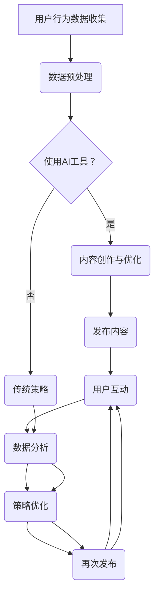

                 

### 《一人公司的社交媒体策略：AI如何助力内容创作和互动》

#### 文章标题

**《一人公司的社交媒体策略：AI如何助力内容创作和互动》**

#### 关键词

- 社交媒体策略
- AI内容创作
- 互动优化
- 人工智能营销

#### 摘要

本文旨在探讨人工智能（AI）在单人公司社交媒体运营中的应用，重点分析AI如何助力内容创作和互动。文章首先概述了社交媒体的起源和发展，随后介绍了AI的基本概念和核心技术。在此基础上，文章详细探讨了AI在内容创作和互动中的应用，包括自动内容生成、智能客服、内容审核等。最后，通过实战案例展示了AI驱动的社交媒体运营策略，并对未来发展趋势进行了展望。

### 第一部分：社交媒体与AI基础

在这一部分，我们将首先简要回顾社交媒体的起源与发展，接着深入探讨AI的基本概念和核心技术，并分析AI与社交媒体结合的意义。

#### 1.1 社交媒体概述

##### 1.1.1 社交媒体的起源与发展

社交媒体的历史可以追溯到20世纪90年代，当时互联网的普及推动了在线社区的发展。最早的社交媒体平台如Facebook、Twitter等，它们的出现标志着社交媒体时代的到来。随着移动设备的普及和社交媒体平台功能的不断完善，社交媒体逐渐成为人们日常生活和工作中不可或缺的一部分。

##### 1.1.2 社交媒体的核心功能与特点

社交媒体的核心功能包括信息传播、社交互动、内容分享等。与传统媒体不同，社交媒体具有以下几个特点：

1. **去中心化**：社交媒体平台上的用户既是信息的生产者，也是消费者。
2. **实时性**：社交媒体能够实现信息的快速传播和实时互动。
3. **个性化**：通过用户数据分析和算法推荐，社交媒体能够为用户提供个性化的内容和体验。
4. **互动性**：社交媒体鼓励用户之间的互动，增强了用户的参与感。

##### 1.1.3 社交媒体在营销中的应用

社交媒体在营销中扮演着重要角色，其应用范围广泛，包括：

1. **品牌推广**：通过社交媒体平台建立品牌形象，提升品牌知名度。
2. **用户互动**：与用户建立直接联系，增强用户忠诚度。
3. **市场调研**：通过社交媒体收集用户反馈和需求，进行市场调研。
4. **广告投放**：利用社交媒体平台进行精准广告投放，提升广告效果。

#### 1.2 AI概述

##### 1.2.1 AI的定义与分类

人工智能（AI）是指使计算机系统能够模拟人类智能行为的技术和学科。根据实现方式，AI可以分为：

1. **弱AI（Narrow AI）**：专注于特定任务的AI系统，如语音识别、图像识别等。
2. **强AI（General AI）**：具有广泛认知能力的AI系统，能够在各种环境中进行智能行为。

##### 1.2.2 AI的核心技术与算法

AI的核心技术包括：

1. **机器学习（ML）**：通过数据训练模型，使其能够进行预测和决策。
2. **深度学习（DL）**：一种基于神经网络的学习方法，能够处理复杂数据。
3. **自然语言处理（NLP）**：使计算机能够理解和生成自然语言。
4. **计算机视觉（CV）**：使计算机能够理解和解释图像和视频。

##### 1.2.3 AI在社交媒体中的潜在应用

AI在社交媒体中的潜在应用包括：

1. **内容创作**：通过自动生成文章、图片和视频，提高内容创作效率。
2. **用户互动**：通过智能客服和个性化推荐，增强用户互动体验。
3. **数据分析**：通过分析用户行为数据，优化营销策略和内容推荐。
4. **风险控制**：通过监控和识别异常行为，防止恶意内容和网络暴力。

#### 1.3 AI与社交媒体结合的意义

##### 1.3.1 AI在社交媒体中的优势

AI在社交媒体中的优势主要体现在以下几个方面：

1. **效率提升**：通过自动化技术，提高内容创作和互动的效率。
2. **个性化体验**：通过用户数据分析，提供个性化的内容和推荐。
3. **成本降低**：通过智能客服和自动化广告投放，降低运营成本。
4. **风险控制**：通过实时监控和异常检测，防止恶意内容和网络暴力。

##### 1.3.2 AI助力内容创作和互动

AI在内容创作和互动中的作用主要包括：

1. **自动内容生成**：通过自然语言生成和图像生成技术，实现自动化内容创作。
2. **智能互动**：通过智能客服和用户数据分析，实现个性化互动。
3. **数据分析**：通过分析用户行为数据，优化内容和互动策略。

##### 1.3.3 AI在社交媒体营销中的挑战与机遇

AI在社交媒体营销中的挑战包括：

1. **数据隐私**：用户数据的收集和使用需要遵循隐私保护法规。
2. **算法偏见**：算法决策过程中可能存在偏见，需要确保公平性和透明性。
3. **技术依赖**：过度依赖AI可能导致技术瓶颈，需要平衡人力和技术的应用。

同时，AI在社交媒体营销中也带来了许多机遇：

1. **精准营销**：通过用户数据分析，实现更精准的营销策略。
2. **个性化体验**：通过个性化推荐，提高用户满意度和忠诚度。
3. **风险控制**：通过实时监控和异常检测，降低营销风险。

#### 1.4 本书目标与结构

##### 1.4.1 书籍结构安排

本书分为五个部分，分别探讨：

1. AI与内容创作
2. AI与社交媒体互动
3. AI在社交媒体运营中的实战应用
4. AI在社交媒体营销中的策略与技巧
5. AI在社交媒体风险管理中的角色

##### 1.4.2 学习路径与目标

通过本书的学习，读者将：

1. 掌握AI在社交媒体中的应用原理。
2. 理解AI驱动的社交媒体运营策略。
3. 学会使用AI工具进行社交媒体内容创作和互动。
4. 能够制定有效的AI驱动社交媒体营销策略。
5. 能够应对社交媒体中的各种风险挑战。

### 第二部分：AI与内容创作

在第二部分，我们将深入探讨AI在内容创作中的应用，包括自动内容生成技术、自动内容创作工具以及内容创作策略与技巧。

#### 2.1 AI在内容创作中的应用

##### 2.1.1 自动内容生成技术

AI在内容创作中的应用主要体现在自动内容生成技术，主要包括自然语言生成（NLG）和图像生成与编辑。

###### 2.1.1.1 自然语言生成（NLG）

自然语言生成是一种利用算法自动生成自然语言文本的技术。以下是基于GPT和BERT的NLG技术：

###### 2.1.1.1.1 基于GPT的文本生成

GPT（Generative Pre-trained Transformer）是一种基于Transformer架构的预训练语言模型，它可以生成流畅的自然语言文本。

**算法原理：**

1. **预训练**：GPT使用大量的文本数据进行预训练，学习文本之间的统计关系和语法规则。
2. **微调**：在特定任务上对GPT进行微调，使其能够生成符合任务需求的文本。

**伪代码：**

python
# GPT模型文本生成伪代码

def generate_text(model, input_sequence, length):
    current_input = pad_sequences([input_sequence], maxlen=max_sequence_length - 1)
    output_sequence = []
    for _ in range(length):
        predictions = model.predict(current_input)
        next_word = sample_word(predictions)
        output_sequence.append(next_word)
        current_input = tf.concat([current_input[:, -1], next_word], axis=1)
    return ''.join(output_sequence)

###### 2.1.1.1.2 基于BERT的文本生成

BERT（Bidirectional Encoder Representations from Transformers）是一种双向Transformer架构的语言预训练模型，它可以生成符合上下文的自然语言文本。

**算法原理：**

1. **预训练**：BERT使用大量的文本数据进行预训练，学习文本的上下文关系和语义信息。
2. **序列生成**：通过BERT模型生成文本序列，使得生成的文本与上下文保持一致。

**伪代码：**

python
# BERT模型文本生成伪代码

from transformers import BertTokenizer, BertForMaskedLM

def generate_text(model, tokenizer, input_sequence, length):
    input_ids = tokenizer.encode(input_sequence, return_tensors='tf')
    output_sequence = []
    for _ in range(length):
        outputs = model(inputs=input_ids)
        predicted_ids = tf.argmax(outputs.logits, axis=-1)
        next_word = tokenizer.decode(predicted_ids[:, -1:])
        output_sequence.append(next_word)
        input_ids = tf.concat([input_ids[:, :-1], predicted_ids], axis=1)
    return ''.join(output_sequence)

###### 2.1.1.2 图像生成与编辑

图像生成与编辑是AI在内容创作中的另一个重要应用。以下介绍两种常用的图像生成与编辑技术：生成对抗网络（GAN）和变分自编码器（VAE）。

###### 2.1.1.2.1 生成对抗网络（GAN）

生成对抗网络（GAN）是一种由生成器和判别器组成的对抗性学习模型，它可以生成高质量的自然图像。

**算法原理：**

1. **生成器**：生成器G尝试生成逼真的图像。
2. **判别器**：判别器D尝试区分生成的图像和真实图像。
3. **对抗训练**：通过生成器和判别器的对抗训练，生成器不断提高生成图像的质量。

**伪代码：**

python
# GAN模型图像生成伪代码

def train_gan(generator, discriminator, real_images, batch_size):
    for _ in range(num_steps):
        # 生成假图像
        fake_images = generator.sample(batch_size)
        
        # 训练判别器
        d_loss_real = discriminator.train_on_batch(real_images, labels=True)
        d_loss_fake = discriminator.train_on_batch(fake_images, labels=False)
        d_loss = 0.5 * np.add(d_loss_real, d_loss_fake)
        
        # 训练生成器
        g_loss = generator.train_on_batch(fake_images, labels=True)

###### 2.1.1.2.2 变分自编码器（VAE）

变分自编码器（VAE）是一种基于概率生成模型的自编码器，它可以生成高质量的图像。

**算法原理：**

1. **编码器**：编码器E将输入图像编码为潜变量。
2. **解码器**：解码器D将潜变量解码为图像。
3. **概率生成**：通过潜变量生成图像，实现图像的多样化。

**伪代码：**

python
# VAE模型图像生成伪代码

def train_vae(encoder, decoder, images, batch_size):
    for _ in range(num_steps):
        # 编码图像
        z = encoder.sample(images)
        
        # 解码图像
        reconstructed_images = decoder.sample(z)
        
        # 计算损失函数
        reconstruction_loss = decoder.loss_function(images, reconstructed_images)
        
        # 训练模型
        optimizer = tf.keras.optimizers.Adam(learning_rate=0.001)
        with tf.GradientTape() as tape:
            z = encoder(images)
            reconstructed_images = decoder(z)
            reconstruction_loss = decoder.loss_function(images, reconstructed_images)
        gradients = tape.gradient(reconstruction_loss, encoder.trainable_variables + decoder.trainable_variables)
        optimizer.apply_gradients(zip(gradients, encoder.trainable_variables + decoder.trainable_variables))

#### 2.2 自动内容创作工具

##### 2.2.1 AI写作工具

AI写作工具是AI在内容创作中的一种实用工具，可以帮助用户快速生成文章、视频脚本等。

###### 2.2.1.1 文章写作

AI写作工具可以帮助用户生成文章，主要包括以下功能：

1. **文章主题生成**：根据用户需求生成文章的主题。
2. **文章撰写与优化**：生成文章的正文内容，并进行语法和风格优化。

###### 2.2.1.1.1 文章主题生成

文章主题生成是AI写作工具的一个重要功能，它可以帮助用户快速确定文章的主题。以下是一个基于BERT的伪代码：

python
# 文章主题生成伪代码

from transformers import BertTokenizer, BertForMaskedLM

def generate_topic(model, tokenizer, keyword, length):
    input_ids = tokenizer.encode(keyword, return_tensors='tf')
    output_ids = []
    for _ in range(length):
        outputs = model(inputs=input_ids)
        predicted_ids = tf.argmax(outputs.logits, axis=-1)
        output_ids.append(predicted_ids[:, -1:])
        input_ids = tf.concat([input_ids[:, :-1], predicted_ids], axis=1)
    return tokenizer.decode(tf.concat(output_ids, axis=1))

###### 2.2.1.1.2 文章撰写与优化

文章撰写与优化是AI写作工具的核心功能，它可以帮助用户快速生成高质量的文章。以下是一个基于GPT的伪代码：

python
# 文章撰写与优化伪代码

from transformers import GPT2Tokenizer, GPT2LMHeadModel

def generate_article(model, tokenizer, topic, length):
    input_sequence = topic
    input_ids = tokenizer.encode(input_sequence, return_tensors='tf')
    output_sequence = []
    for _ in range(length):
        outputs = model(inputs=input_ids)
        predicted_ids = tf.argmax(outputs.logits, axis=-1)
        output_sequence.append(predicted_ids[:, -1:])
        input_ids = tf.concat([input_ids[:, :-1], predicted_ids], axis=1)
    return tokenizer.decode(tf.concat(output_sequence, axis=1))

##### 2.2.1.2 视频脚本创作

视频脚本创作是AI写作工具在内容创作中的另一个应用，它可以帮助用户快速生成视频脚本。以下是一个基于GPT的伪代码：

python
# 视频脚本创作伪代码

from transformers import GPT2Tokenizer, GPT2LMHeadModel

def generate_video_script(model, tokenizer, topic, length):
    input_sequence = topic
    input_ids = tokenizer.encode(input_sequence, return_tensors='tf')
    output_sequence = []
    for _ in range(length):
        outputs = model(inputs=input_ids)
        predicted_ids = tf.argmax(outputs.logits, axis=-1)
        output_sequence.append(predicted_ids[:, -1:])
        input_ids = tf.concat([input_ids[:, :-1], predicted_ids], axis=1)
    return tokenizer.decode(tf.concat(output_sequence, axis=1))

#### 2.3 内容创作策略与技巧

##### 2.3.1 基于用户数据的个性化内容创作

个性化内容创作是提升用户体验和内容价值的重要策略。以下是基于用户数据的个性化内容创作策略：

###### 2.3.1.1 用户数据分析

用户数据分析是个性化内容创作的基础，主要包括以下方面：

1. **用户行为分析**：分析用户的浏览、点赞、评论等行为，了解用户兴趣。
2. **用户兴趣分析**：通过数据挖掘技术，提取用户的兴趣标签。

###### 2.3.1.1.1 用户行为分析

用户行为分析是了解用户需求和行为的重要手段。以下是一个基于时间序列分析的伪代码：

python
# 用户行为分析伪代码

import pandas as pd
from sklearn.cluster import KMeans

# 加载用户行为数据
data = pd.read_csv('user_behavior.csv')

# 时间序列聚类
kmeans = KMeans(n_clusters=5)
clusters = kmeans.fit_predict(data[['view_count', 'like_count', 'comment_count']])

# 分析用户行为特征
for cluster in range(kmeans.n_clusters):
    print(f"Cluster {cluster}:")
    cluster_data = data[clusters == cluster]
    print(f"Average view count: {cluster_data['view_count'].mean()}")
    print(f"Average like count: {cluster_data['like_count'].mean()}")
    print(f"Average comment count: {cluster_data['comment_count'].mean()}")

###### 2.3.1.1.2 用户兴趣分析

用户兴趣分析是提取用户兴趣标签的关键步骤。以下是一个基于协同过滤的伪代码：

python
# 用户兴趣分析伪代码

from surprise import KNNWithMeans
from surprise import Dataset, Reader
from surprise.model_selection import cross_validate

# 加载用户行为数据
data = pd.read_csv('user_behavior.csv')

# 构建评分数据集
reader = Reader(rating_scale=(1, 5))
data_set = Dataset.load_from_df(data[['user_id', 'item_id', 'rating']], reader)

# 构建协同过滤模型
collaborative_filter = KNNWithMeans()

# 训练模型
cross_validate(collaborative_filter, data_set, measures=['RMSE', 'MAE'], cv=5)

###### 2.3.1.2 跨平台内容创作策略

跨平台内容创作策略是指根据不同社交媒体平台的特点和用户群体，制定相应的内容创作策略。以下是一个基于平台分析的伪代码：

python
# 跨平台内容创作策略伪代码

import pandas as pd

# 加载平台数据
platforms = pd.read_csv('platforms.csv')

# 分析平台特征
for platform in platforms['platform_name'].unique():
    print(f"{platform}:")
    platform_data = platforms[platforms['platform_name'] == platform]
    print(f"Average engagement rate: {platform_data['engagement_rate'].mean()}")
    print(f"Top content type: {platform_data['content_type'].mode()[0]}")

### 第三部分：AI与社交媒体互动

在第三部分，我们将探讨AI在社交媒体互动中的应用，包括社交媒体互动概述、AI在社交媒体互动中的应用以及社交媒体互动案例分析。

#### 3.1 社交媒体互动概述

##### 3.1.1 社交媒体互动的构成要素

社交媒体互动的构成要素主要包括：

1. **用户**：社交媒体互动的参与主体，包括个人用户和组织用户。
2. **内容**：社交媒体互动的内容，包括文本、图片、视频等。
3. **平台**：社交媒体互动的载体，如Facebook、Twitter、Instagram等。
4. **互动形式**：社交媒体互动的形式，包括评论、点赞、分享、私信等。

##### 3.1.2 社交媒体互动的形式与类型

社交媒体互动的形式多种多样，主要包括以下类型：

1. **文本互动**：包括评论、私信等基于文本的互动。
2. **图片互动**：包括点赞、分享等基于图片的互动。
3. **视频互动**：包括观看、点赞、评论等基于视频的互动。
4. **直播互动**：包括观看、送礼物、互动问答等基于直播的互动。

##### 3.1.3 社交媒体互动的目标与策略

社交媒体互动的目标主要包括：

1. **品牌推广**：通过互动提升品牌知名度和影响力。
2. **用户参与**：通过互动提高用户参与度和忠诚度。
3. **市场调研**：通过互动收集用户反馈和需求，优化产品和服务。
4. **广告效果**：通过互动评估广告投放效果，优化广告策略。

社交媒体互动的策略主要包括：

1. **内容策略**：制定有趣、有价值的内容，吸引用户参与。
2. **互动策略**：设计有趣的互动形式，激发用户参与热情。
3. **数据分析**：通过数据分析，了解用户互动行为和需求，优化互动策略。

#### 3.2 AI在社交媒体互动中的应用

##### 3.2.1 智能客服机器人

智能客服机器人是AI在社交媒体互动中的一个重要应用，它可以自动回答用户的问题，提供实时支持。

###### 3.2.1.1 机器人应答策略

智能客服机器人的应答策略主要包括：

1. **基于规则的应答**：根据预定的规则和流程，自动回答用户的问题。
2. **基于机器学习的应答**：通过机器学习模型，自动识别用户问题和生成回答。

###### 3.2.1.1.1 基于规则的应答

基于规则的应答是智能客服机器人的一种简单策略，以下是一个基于规则的伪代码：

python
# 基于规则的应答伪代码

def rule_based_answer(question):
    if "订单状态" in question:
        return "您的订单已发货，预计3天内到达。"
    elif "退换货" in question:
        return "如需退换货，请联系我们的客服。"
    else:
        return "很抱歉，我不清楚您的问题。"

###### 3.2.1.1.2 基于机器学习的应答

基于机器学习的应答是智能客服机器人的一种高级策略，以下是一个基于机器学习的伪代码：

python
# 基于机器学习的应答伪代码

from transformers import BertTokenizer, BertForSequenceClassification

def ml_based_answer(question):
    tokenizer = BertTokenizer.from_pretrained('bert-base-chinese')
    model = BertForSequenceClassification.from_pretrained('bert-base-chinese')
    input_ids = tokenizer.encode(question, return_tensors='tf')
    logits = model(inputs=input_ids)[0]
    predicted_index = tf.argmax(logits, axis=1).numpy()[0]
    return model.config.id2label[predicted_index]

##### 3.2.2 社交媒体内容审核

社交媒体内容审核是AI在社交媒体互动中的另一个重要应用，它可以自动识别和过滤不良内容。

###### 3.2.2.1 自动内容审核机制

自动内容审核机制主要包括以下步骤：

1. **数据预处理**：对社交媒体内容进行清洗和预处理。
2. **特征提取**：提取社交媒体内容的关键特征。
3. **分类模型训练**：使用机器学习算法训练分类模型。
4. **实时审核**：对社交媒体内容进行实时审核和过滤。

###### 3.2.2.1.1 恶意言论识别

恶意言论识别是社交媒体内容审核的一个重要任务，以下是一个基于文本分类的伪代码：

python
# 恶意言论识别伪代码

from transformers import BertTokenizer, BertForSequenceClassification

def detect_toxic_comment(comment):
    tokenizer = BertTokenizer.from_pretrained('bert-base-chinese')
    model = BertForSequenceClassification.from_pretrained('bert-base-chinese')
    input_ids = tokenizer.encode(comment, return_tensors='tf')
    logits = model(inputs=input_ids)[0]
    predicted_index = tf.argmax(logits, axis=1).numpy()[0]
    return predicted_index > 0.5

##### 3.2.3 社交媒体互动案例分析

###### 3.2.3.1 成功案例介绍

以下是一个成功案例介绍：

**案例一：微博营销**

微博是一个流行的社交媒体平台，许多品牌和个人用户在微博上进行营销。以下是一个成功的微博营销案例：

1. **内容策略**：发布有趣、有价值的内容，吸引粉丝关注。
2. **互动策略**：与粉丝互动，回答问题，参与话题讨论。
3. **数据分析**：分析粉丝行为和反馈，优化内容策略。

**案例二：抖音互动**

抖音是一个流行的短视频平台，许多品牌和个人用户在抖音上进行互动。以下是一个成功的抖音互动案例：

1. **内容策略**：发布高质量、有趣的短视频，吸引粉丝关注。
2. **互动策略**：与粉丝互动，回复评论，参与挑战。
3. **数据分析**：分析粉丝行为和反馈，优化内容策略。

###### 3.2.3.2 失败案例分析

以下是一个失败案例介绍：

**案例一：社交媒体数据泄露**

社交媒体数据泄露是一个严重的问题，以下是一个失败案例：

1. **原因**：数据保护措施不足，导致用户数据泄露。
2. **影响**：用户隐私泄露，品牌形象受损。
3. **反思**：加强数据保护措施，提高安全性。

**案例二：网络暴力事件**

网络暴力事件对社交媒体平台和个人用户造成严重影响，以下是一个失败案例：

1. **原因**：社交媒体平台监管不力，导致网络暴力事件发生。
2. **影响**：用户情绪受到负面影响，品牌形象受损。
3. **反思**：加强平台监管，建立有效的应对机制。

#### 3.3 AI驱动的社交媒体互动优化

##### 3.3.1 数据驱动的互动策略

数据驱动的互动策略是指通过分析用户数据，优化社交媒体互动策略。以下是一个基于用户数据分析的伪代码：

python
# 数据驱动的互动策略伪代码

from sklearn.cluster import KMeans

def user_data_analysis(user_data):
    # 分析用户行为
    user_behavior = user_data[['view_count', 'like_count', 'comment_count']]
    
    # 进行K均值聚类
    kmeans = KMeans(n_clusters=5)
    clusters = kmeans.fit_predict(user_behavior)
    
    # 分析用户兴趣
    user_interest = user_data['interest']
    cluster_interest = user_interest[clusters]
    
    # 生成互动策略
    interaction_strategy = {}
    for cluster in range(kmeans.n_clusters):
        interaction_strategy[f"Cluster {cluster}"] = {
            "content_type": cluster_interest[cluster].mode()[0],
            "interaction_frequency": cluster_interest[cluster].mean()
        }
    return interaction_strategy

##### 3.3.2 实时互动优化

实时互动优化是指通过实时分析社交媒体互动数据，动态调整互动策略。以下是一个基于实时数据流的伪代码：

python
# 实时互动优化伪代码

importafka_consumer = KafkaConsumer('social_media_interactions')

def real_time_interaction_optimization():
    for message in kafka_consumer:
        interaction_data = json.loads(message.value)
        
        # 分析互动数据
        user_behavior = interaction_data['user_behavior']
        content_performance = interaction_data['content_performance']
        
        # 调整互动策略
        interaction_strategy = adjust_interaction_strategy(user_behavior, content_performance)
        
        # 更新互动策略
        update_interaction_strategy(interaction_strategy)

def adjust_interaction_strategy(user_behavior, content_performance):
    # 根据用户行为和内容性能调整策略
    if user_behavior['view_count'] > threshold['view_count']:
        return {"content_type": "video", "interaction_frequency": "high"}
    else:
        return {"content_type": "text", "interaction_frequency": "low"}

def update_interaction_strategy(strategy):
    # 更新互动策略到数据库
    db.update('interaction_strategy', strategy)

### 第四部分：AI在社交媒体运营中的实战应用

在第四部分，我们将探讨AI在社交媒体运营中的实战应用，包括社交媒体运营概述、AI在社交媒体运营中的应用以及AI驱动的社交媒体运营策略。

#### 4.1 社交媒体运营概述

##### 4.1.1 社交媒体运营的目标与策略

社交媒体运营的目标主要包括：

1. **提升品牌知名度**：通过发布有价值的内容，吸引潜在用户，提高品牌曝光度。
2. **增强用户参与度**：通过互动和活动，激发用户参与，提高用户忠诚度。
3. **优化用户体验**：通过个性化内容和推荐，提升用户满意度和留存率。
4. **降低运营成本**：通过自动化和智能化的运营手段，提高运营效率，降低成本。

社交媒体运营的策略主要包括：

1. **内容策略**：制定有价值、有趣的内容，吸引用户关注。
2. **互动策略**：设计有趣、有吸引力的互动形式，增强用户参与。
3. **数据分析**：通过数据分析，了解用户行为和需求，优化运营策略。
4. **平台策略**：根据不同平台的特点和用户群体，制定相应的运营策略。

##### 4.1.2 社交媒体运营的关键环节

社交媒体运营的关键环节主要包括：

1. **内容发布**：制定内容发布计划，确保内容质量和发布频率。
2. **用户互动**：与用户进行实时互动，回答问题，参与话题讨论。
3. **数据分析**：通过数据分析，了解用户行为和需求，优化内容策略。
4. **活动策划**：策划有趣、有吸引力的活动，提高用户参与度。

##### 4.1.3 社交媒体运营的核心指标

社交媒体运营的核心指标主要包括：

1. **粉丝增长率**：衡量品牌在社交媒体上的影响力。
2. **互动率**：衡量用户对内容的参与程度。
3. **内容点击率**：衡量内容吸引力和质量。
4. **用户留存率**：衡量用户对品牌的忠诚度。

#### 4.2 AI在社交媒体运营中的应用

##### 4.2.1 内容运营

AI在社交媒体内容运营中的应用主要包括：

1. **内容规划与发布**：通过AI技术，自动生成和推荐内容，提高内容质量和发布效率。
2. **内容审核**：通过AI技术，自动识别和过滤不良内容，确保内容安全。
3. **内容优化**：通过AI技术，分析用户行为和反馈，优化内容策略和效果。

###### 4.2.1.1 内容规划与发布

内容规划与发布是社交媒体运营的重要环节，以下是一个基于AI的内容规划与发布策略：

1. **内容主题预测**：通过分析用户行为和趋势，预测热门话题和内容主题。
2. **内容生成**：利用自然语言生成（NLG）技术，自动生成文章、视频脚本等内容。
3. **内容发布**：根据内容质量和用户喜好，制定发布计划，确保内容质量和发布频率。

以下是一个基于NLG技术的伪代码：

python
# 基于NLG的内容生成与发布伪代码

from transformers import BertTokenizer, BertForMaskedLM

def generate_content(topic):
    tokenizer = BertTokenizer.from_pretrained('bert-base-chinese')
    model = BertForMaskedLM.from_pretrained('bert-base-chinese')
    input_sequence = topic
    input_ids = tokenizer.encode(input_sequence, return_tensors='tf')
    output_sequence = []
    for _ in range(100):
        outputs = model(inputs=input_ids)
        predicted_ids = tf.argmax(outputs.logits, axis=-1)
        output_sequence.append(predicted_ids[:, -1:])
        input_ids = tf.concat([input_ids[:, :-1], predicted_ids], axis=1)
    return tokenizer.decode(tf.concat(output_sequence, axis=1))

def publish_content(content):
    # 发布内容到社交媒体平台
    pass

# 生成内容
content = generate_content("人工智能在社交媒体中的应用")
# 发布内容
publish_content(content)

###### 4.2.1.2 内容审核

内容审核是确保社交媒体内容安全的重要环节，以下是一个基于AI的内容审核策略：

1. **数据预处理**：对社交媒体内容进行清洗和预处理，去除噪声和干扰信息。
2. **特征提取**：提取社交媒体内容的关键特征，如文本、图片、音频等。
3. **分类模型训练**：使用机器学习算法训练分类模型，用于识别和过滤不良内容。
4. **实时审核**：对社交媒体内容进行实时审核和过滤，确保内容安全。

以下是一个基于深度学习的内容审核伪代码：

python
# 基于深度学习的内容审核伪代码

from transformers import BertTokenizer, BertForSequenceClassification

def preprocess_content(content):
    # 数据预处理
    pass

def extract_features(content):
    # 提取特征
    pass

def train_classifier(features, labels):
    # 训练分类模型
    pass

def classify_content(content):
    # 分类内容
    pass

def filter_content(contents):
    # 过滤不良内容
    pass

# 预处理内容
preprocessed_content = preprocess_content(content)
# 提取特征
features = extract_features(preprocessed_content)
# 训练分类模型
classifier = train_classifier(features, labels)
# 分类内容
classified_content = classify_content(content)
# 过滤不良内容
filtered_content = filter_content(classified_content)
return filtered_content

###### 4.2.1.3 内容优化

内容优化是提高社交媒体内容效果的重要策略，以下是一个基于用户数据分析的内容优化策略：

1. **用户行为分析**：分析用户对内容的互动行为，如点赞、评论、分享等。
2. **内容性能评估**：评估内容的表现，如点击率、转化率等。
3. **内容调整**：根据用户行为和内容性能，调整内容策略，提高内容效果。

以下是一个基于用户行为的伪代码：

python
# 基于用户行为的内容优化伪代码

from sklearn.cluster import KMeans

def user_behavior_analysis(user_behavior):
    # 分析用户行为
    pass

def content_performance_evaluation(content_performance):
    # 评估内容性能
    pass

def adjust_content_strategy(user_behavior, content_performance):
    # 调整内容策略
    pass

def optimize_content(content):
    # 优化内容
    pass

# 分析用户行为
user_behavior = user_behavior_analysis(content)
# 评估内容性能
content_performance = content_performance_evaluation(content)
# 调整内容策略
content_strategy = adjust_content_strategy(user_behavior, content_performance)
# 优化内容
optimized_content = optimize_content(content, content_strategy)
return optimized_content

#### 4.3 AI驱动的社交媒体运营策略

##### 4.3.1 数据分析驱动的内容创作与互动

数据分析是社交媒体运营的核心，通过数据分析可以了解用户行为、需求和偏好，从而制定更有效的内容创作和互动策略。

###### 4.3.1.1 数据分析概述

数据分析包括数据收集、数据预处理、特征提取、数据分析和结果解释等步骤。以下是一个基于用户行为数据分析的概述：

1. **数据收集**：收集社交媒体平台上的用户行为数据，如点赞、评论、分享等。
2. **数据预处理**：清洗和整理数据，去除噪声和异常值。
3. **特征提取**：提取用户行为数据的关键特征，如用户活跃度、兴趣标签等。
4. **数据分析**：使用统计学和机器学习算法，分析用户行为和偏好。
5. **结果解释**：根据数据分析结果，制定内容创作和互动策略。

以下是一个基于用户行为数据分析的伪代码：

python
# 用户行为数据分析伪代码

import pandas as pd
from sklearn.cluster import KMeans

# 加载用户行为数据
data = pd.read_csv('user_behavior.csv')

# 数据预处理
data = data.dropna()

# 特征提取
features = data[['view_count', 'like_count', 'comment_count']]

# 数据分析
kmeans = KMeans(n_clusters=5)
clusters = kmeans.fit_predict(features)

# 结果解释
for cluster in range(kmeans.n_clusters):
    print(f"Cluster {cluster}:")
    cluster_data = data[clusters == cluster]
    print(f"Average view count: {cluster_data['view_count'].mean()}")
    print(f"Average like count: {cluster_data['like_count'].mean()}")
    print(f"Average comment count: {cluster_data['comment_count'].mean()}")

###### 4.3.1.2 智能营销策略

智能营销策略是指通过数据分析，制定个性化、精准的营销策略，以提高用户参与度和转化率。以下是一个基于用户画像分析的智能营销策略：

1. **用户画像分析**：构建用户画像，提取用户特征，如年龄、性别、兴趣等。
2. **用户行为预测**：使用机器学习算法，预测用户的行为和偏好。
3. **个性化推荐**：根据用户画像和行为预测，为用户提供个性化的内容和推荐。
4. **营销策略调整**：根据用户反馈和效果，调整营销策略。

以下是一个基于用户画像分析的伪代码：

python
# 用户画像分析伪代码

import pandas as pd
from sklearn.cluster import KMeans

# 加载用户画像数据
data = pd.read_csv('user_profile.csv')

# 数据预处理
data = data.dropna()

# 用户画像分析
kmeans = KMeans(n_clusters=5)
clusters = kmeans.fit_predict(data[['age', 'gender', 'interest']])

# 用户行为预测
from surprise import KNNWithMeans
from surprise import Dataset, Reader
from surprise.model_selection import cross_validate

# 构建评分数据集
reader = Reader(rating_scale=(1, 5))
data_set = Dataset.load_from_df(data[['user_id', 'item_id', 'rating']], reader)

# 构建协同过滤模型
collaborative_filter = KNNWithMeans()

# 训练模型
cross_validate(collaborative_filter, data_set, measures=['RMSE', 'MAE'], cv=5)

### 第五部分：AI在社交媒体营销中的策略与技巧

在第五部分，我们将探讨AI在社交媒体营销中的策略与技巧，包括社交媒体营销概述、AI驱动的社交媒体营销策略以及社交媒体营销案例分析。

#### 5.1 社交媒体营销概述

##### 5.1.1 社交媒体营销的定义与目标

社交媒体营销是指通过社交媒体平台进行品牌推广、产品销售和用户互动的活动。其目标主要包括：

1. **提升品牌知名度**：通过社交媒体营销，提高品牌在目标受众中的曝光度和认知度。
2. **增加用户参与度**：通过有趣的互动和活动，吸引用户参与，增强用户对品牌的忠诚度。
3. **提升产品销量**：通过社交媒体营销，提高产品的销售量和市场份额。
4. **收集用户反馈**：通过社交媒体营销，收集用户对产品和服务的反馈，优化产品和服务。

##### 5.1.2 社交媒体营销的核心策略

社交媒体营销的核心策略主要包括：

1. **内容营销**：通过发布有价值、有趣的内容，吸引目标受众的关注和参与。
2. **互动营销**：与用户进行实时互动，回答问题，参与话题讨论，增强用户对品牌的认同感。
3. **社交媒体广告**：通过社交媒体平台的广告投放，精准定位目标受众，提高广告效果。
4. **用户数据分析**：通过数据分析，了解用户行为和偏好，制定个性化的营销策略。

##### 5.1.3 社交媒体营销的优势与挑战

社交媒体营销的优势主要包括：

1. **低成本**：相对于传统媒体营销，社交媒体营销的成本较低，适合中小企业和初创公司。
2. **高互动性**：社交媒体平台具有高互动性，用户可以随时发表评论、点赞和分享，增强用户参与感。
3. **精准定位**：通过用户数据分析和算法推荐，可以实现精准定位目标受众，提高广告效果。
4. **实时反馈**：社交媒体营销可以实时收集用户反馈，快速调整营销策略。

社交媒体营销的挑战主要包括：

1. **内容质量**：高质量的内容是社交媒体营销的关键，内容创作和编辑需要专业知识和技能。
2. **数据隐私**：社交媒体营销涉及用户数据的收集和使用，需要遵循数据隐私保护法规。
3. **算法偏见**：算法决策过程中可能存在偏见，需要确保公平性和透明性。
4. **技术依赖**：过度依赖技术可能导致技术瓶颈，需要平衡人力和技术的应用。

#### 5.2 AI驱动的社交媒体营销策略

##### 5.2.1 数据驱动的营销策略

数据驱动的营销策略是指通过数据分析，制定个性化的营销策略，以提高用户参与度和转化率。以下是一个基于用户行为数据分析的AI驱动社交媒体营销策略：

1. **用户行为分析**：通过分析用户在社交媒体平台上的行为，如点赞、评论、分享等，了解用户兴趣和偏好。
2. **用户画像分析**：根据用户行为和兴趣，构建用户画像，提取用户特征，如年龄、性别、地理位置等。
3. **用户行为预测**：使用机器学习算法，预测用户的行为和偏好，为用户提供个性化的内容和推荐。
4. **内容创作和推荐**：根据用户画像和行为预测，制定个性化的内容创作和推荐策略，提高用户参与度和转化率。

以下是一个基于用户行为分析的伪代码：

python
# 用户行为分析伪代码

import pandas as pd
from sklearn.cluster import KMeans

# 加载用户行为数据
data = pd.read_csv('user_behavior.csv')

# 数据预处理
data = data.dropna()

# 用户行为分析
kmeans = KMeans(n_clusters=5)
clusters = kmeans.fit_predict(data[['view_count', 'like_count', 'comment_count']])

# 分析用户行为特征
for cluster in range(kmeans.n_clusters):
    print(f"Cluster {cluster}:")
    cluster_data = data[clusters == cluster]
    print(f"Average view count: {cluster_data['view_count'].mean()}")
    print(f"Average like count: {cluster_data['like_count'].mean()}")
    print(f"Average comment count: {cluster_data['comment_count'].mean()}")

##### 5.2.2 智能化营销工具

智能化营销工具是AI在社交媒体营销中的重要应用，主要包括自动化广告投放、自动化广告创意生成和社交媒体分析工具。

1. **自动化广告投放**：通过AI算法，自动优化广告投放策略，提高广告效果和投放效率。
2. **自动化广告创意生成**：通过自然语言生成和图像生成技术，自动生成广告文案和创意，提高广告质量和创意度。
3. **社交媒体分析工具**：通过数据分析技术，实时监控和分析社交媒体平台的用户行为和效果，为营销策略提供数据支持。

以下是一个基于自动化广告投放的伪代码：

python
# 自动化广告投放伪代码

import pandas as pd
from sklearn.cluster import KMeans

# 加载广告投放数据
data = pd.read_csv('advertising_data.csv')

# 数据预处理
data = data.dropna()

# 分析广告投放效果
kmeans = KMeans(n_clusters=5)
clusters = kmeans.fit_predict(data[['click_rate', 'conversion_rate']])

# 调整广告投放策略
for cluster in range(kmeans.n_clusters):
    print(f"Cluster {cluster}:")
    cluster_data = data[clusters == cluster]
    print(f"Average click rate: {cluster_data['click_rate'].mean()}")
    print(f"Average conversion rate: {cluster_data['conversion_rate'].mean()}")
    # 调整广告投放策略
    adjust_advertising_strategy(cluster_data)

##### 5.2.3 情感营销与个性化互动

情感营销是利用用户情感信息，制定个性化的营销策略，以提高用户参与度和转化率。以下是一个基于情感营销的AI驱动社交媒体营销策略：

1. **情感识别**：通过自然语言处理技术，识别用户情感信息，如正面、负面、中性等。
2. **个性化互动**：根据用户情感信息，制定个性化的互动策略，如问候语、推荐商品等。
3. **情感驱动内容**：根据用户情感信息，创作情感驱动的内容，如故事、广告等，提高用户参与度。

以下是一个基于情感识别的伪代码：

python
# 情感识别伪代码

from transformers import BertTokenizer, BertForSequenceClassification

def sentiment_analysis(text):
    tokenizer = BertTokenizer.from_pretrained('bert-base-chinese')
    model = BertForSequenceClassification.from_pretrained('bert-base-chinese')
    input_ids = tokenizer.encode(text, return_tensors='tf')
    logits = model(inputs=input_ids)[0]
    predicted_index = tf.argmax(logits, axis=1).numpy()[0]
    return predicted_index

text = "我很喜欢这个产品"
sentiment = sentiment_analysis(text)
print(f"Sentiment: {'Positive' if sentiment > 0.5 else 'Negative' if sentiment < 0.5 else 'Neutral'}")

#### 5.3 社交媒体营销案例分析

##### 5.3.1 成功案例介绍

以下是一个成功案例介绍：

**案例一：AI驱动的个性化营销**

一家电商公司通过AI技术进行个性化营销，取得了显著的效果。以下是其成功原因：

1. **用户数据收集**：通过电商网站和社交媒体平台，收集用户购买行为和兴趣数据。
2. **用户画像分析**：根据用户数据，构建用户画像，提取用户特征，如年龄、性别、消费习惯等。
3. **个性化推荐**：根据用户画像和行为预测，为用户提供个性化的商品推荐和优惠信息。
4. **实时调整**：根据用户反馈和效果，实时调整营销策略，优化用户体验。

**案例二：社交媒体广告优化**

一家广告公司通过AI技术优化社交媒体广告投放，提高了广告效果。以下是其成功原因：

1. **数据收集**：通过社交媒体平台，收集广告投放数据，如点击率、转化率等。
2. **广告创意生成**：通过自然语言生成和图像生成技术，自动生成广告创意和文案。
3. **广告效果评估**：通过机器学习算法，评估广告效果，优化广告投放策略。
4. **实时调整**：根据广告效果，实时调整广告投放策略，提高广告效果。

##### 5.3.2 失败案例分析

以下是一个失败案例介绍：

**案例一：社交媒体数据泄露**

一家公司因为数据保护措施不足，导致用户数据泄露，引发了严重的隐私问题。以下是其失败原因：

1. **数据收集**：在用户不知情的情况下，大量收集用户数据，包括个人信息和行为数据。
2. **数据存储**：数据存储不安全，未采取有效的加密和备份措施。
3. **数据泄露**：由于系统漏洞和内部管理不善，导致用户数据泄露。
4. **影响评估**：未及时评估数据泄露的影响，导致用户隐私和品牌形象受损。

**案例二：社交媒体互动策略失误**

一家公司因为社交媒体互动策略失误，导致用户不满和品牌形象受损。以下是其失败原因：

1. **内容发布**：发布低质量、无价值的内容，未能吸引用户关注。
2. **互动互动**：与用户互动不足，回答问题不及时，导致用户满意度下降。
3. **数据收集**：未能收集用户反馈和需求，导致内容策略调整不及时。
4. **效果评估**：未对互动策略进行有效评估，导致策略调整不及时。

### 第六部分：AI在社交媒体风险管理中的角色

在第六部分，我们将探讨AI在社交媒体风险管理中的角色，包括社交媒体风险管理概述、AI在社交媒体风险管理中的应用以及社交媒体风险案例分析。

#### 6.1 社交媒体风险管理概述

##### 6.1.1 社交媒体风险类型

社交媒体风险主要包括以下类型：

1. **信息安全风险**：包括用户数据泄露、黑客攻击、恶意软件等。
2. **内容风险**：包括恶意内容、虚假信息、色情内容等。
3. **声誉风险**：包括负面舆论、网络暴力、品牌形象受损等。
4. **法律风险**：包括违反法律法规、侵犯用户权益等。

##### 6.1.2 社交媒体风险管理的目标与原则

社交媒体风险管理的目标主要包括：

1. **保障信息安全**：确保用户数据和隐私安全，防止数据泄露和黑客攻击。
2. **维护内容安全**：过滤和删除不良内容，防止恶意信息和虚假信息的传播。
3. **保护声誉**：及时应对负面舆论和网络暴力，维护品牌形象。
4. **遵循法律法规**：遵守相关法律法规，防止法律风险。

社交媒体风险管理的原则主要包括：

1. **预防为主**：采取预防措施，防止风险发生。
2. **及时应对**：在风险发生时，及时采取措施，减轻风险影响。
3. **信息共享**：建立信息共享机制，及时传递风险信息，协同应对。
4. **持续改进**：根据风险变化和反馈，持续改进风险管理策略。

##### 6.1.3 社交媒体风险管理的挑战与应对策略

社交媒体风险管理的挑战主要包括：

1. **数据隐私保护**：用户数据隐私保护法规日益严格，如何在保障用户隐私的同时，充分利用数据进行分析和营销。
2. **算法偏见**：算法决策过程中可能存在偏见，如何确保公平性和透明性。
3. **技术依赖**：过度依赖技术可能导致技术瓶颈，如何平衡人力和技术的应用。
4. **跨平台监管**：不同社交媒体平台的风险管理方式不同，如何实现跨平台的风险管理。

应对策略主要包括：

1. **数据隐私保护**：采取数据加密、匿名化等技术手段，保障用户数据隐私。
2. **算法公平性**：建立算法审查机制，确保算法决策的公平性和透明性。
3. **技术平衡**：在技术应用中，保持人力和技术的平衡，提高风险管理效率。
4. **跨平台合作**：与不同社交媒体平台合作，共同制定风险管理策略，实现跨平台的风险管理。

#### 6.2 AI在社交媒体风险管理中的应用

##### 6.2.1 恶意内容检测与过滤

AI在社交媒体风险管理中的应用主要包括恶意内容检测与过滤。以下是一种基于深度学习的恶意内容检测与过滤策略：

1. **数据收集**：收集社交媒体平台上的文本、图片、视频等数据，作为训练数据集。
2. **特征提取**：对数据进行预处理，提取特征，如文本的词向量、图片的视觉特征等。
3. **模型训练**：使用深度学习算法，如卷积神经网络（CNN）或递归神经网络（RNN），训练分类模型。
4. **实时检测**：对社交媒体内容进行实时检测，识别和过滤恶意内容。

以下是一个基于深度学习的恶意内容检测与过滤的伪代码：

python
# 恶意内容检测与过滤伪代码

import tensorflow as tf
from tensorflow.keras.models import Sequential
from tensorflow.keras.layers import Conv2D, MaxPooling2D, Flatten, Dense

# 数据预处理
# 1. 加载训练数据集
# 2. 划分训练集和测试集
# 3. 对数据进行归一化处理

# 构建模型
model = Sequential()
model.add(Conv2D(filters=32, kernel_size=(3, 3), activation='relu', input_shape=(28, 28, 1)))
model.add(MaxPooling2D(pool_size=(2, 2)))
model.add(Flatten())
model.add(Dense(units=128, activation='relu'))
model.add(Dense(units=1, activation='sigmoid'))

# 编译模型
model.compile(optimizer='adam', loss='binary_crossentropy', metrics=['accuracy'])

# 训练模型
model.fit(train_images, train_labels, epochs=10, batch_size=32, validation_data=(test_images, test_labels))

# 实时检测
def detect_malicious_content(model, content):
    # 预处理内容
    preprocessed_content = preprocess_content(content)
    # 预测标签
    prediction = model.predict(preprocessed_content)
    # 判断是否为恶意内容
    if prediction > 0.5:
        return "Malicious content"
    else:
        return "Normal content"

##### 6.2.2 用户行为异常检测

AI在社交媒体风险管理中的应用还包括用户行为异常检测。以下是一种基于用户行为数据的用户行为异常检测策略：

1. **数据收集**：收集社交媒体平台上的用户行为数据，如登录时间、操作行为等。
2. **特征提取**：对用户行为数据进行预处理，提取特征，如用户的活跃度、行为模式等。
3. **模型训练**：使用机器学习算法，如K-means聚类、孤立森林等，训练异常检测模型。
4. **实时监控**：对用户行为进行实时监控，检测异常行为，采取相应措施。

以下是一个基于K-means聚类的用户行为异常检测的伪代码：

python
# 用户行为异常检测伪代码

import numpy as np
from sklearn.cluster import KMeans

# 数据预处理
# 1. 加载用户行为数据
# 2. 对数据进行归一化处理

# K-means聚类
kmeans = KMeans(n_clusters=5)
clusters = kmeans.fit_predict(user_behavior)

# 异常检测
def detect_anomaly(user_behavior, clusters):
    # 计算用户行为距离
    distances = []
    for behavior in user_behavior:
        distances.append(np.linalg.norm(behavior - kmeans.cluster_centers_[clusters]))
    # 判断是否为异常行为
    if np.mean(distances) > threshold:
        return "Anomaly behavior"
    else:
        return "Normal behavior"

##### 6.2.3 恶意内容与行为识别

AI在社交媒体风险管理中的应用还包括恶意内容与行为的识别。以下是一种基于多模态数据的恶意内容与行为识别策略：

1. **数据收集**：收集社交媒体平台上的文本、图片、视频等多模态数据。
2. **特征提取**：对多模态数据进行预处理，提取文本特征、视觉特征等。
3. **模型训练**：使用深度学习算法，如卷积神经网络（CNN）、递归神经网络（RNN）等，训练多模态识别模型。
4. **实时识别**：对社交媒体内容进行实时识别，检测恶意内容和异常行为。

以下是一个基于多模态数据的恶意内容与行为识别的伪代码：

python
# 恶意内容与行为识别伪代码

import tensorflow as tf
from tensorflow.keras.models import Model
from tensorflow.keras.layers import Input, Embedding, LSTM, Dense, Conv2D, MaxPooling2D, Flatten

# 文本特征提取
text_input = Input(shape=(max_sequence_length,))
text_embedding = Embedding(vocabulary_size, embedding_dim)(text_input)
text_lstm = LSTM(units=128)(text_embedding)

# 视觉特征提取
image_input = Input(shape=(height, width, channels))
image_conv = Conv2D(filters=32, kernel_size=(3, 3), activation='relu')(image_input)
image_pool = MaxPooling2D(pool_size=(2, 2))(image_conv)
image_flat = Flatten()(image_pool)

# 模型融合
merged = tf.keras.layers.concatenate([text_lstm, image_flat])
merged_dense = Dense(units=128, activation='relu')(merged)
output = Dense(units=1, activation='sigmoid')(merged_dense)

# 构建模型
model = Model(inputs=[text_input, image_input], outputs=output)

# 编译模型
model.compile(optimizer='adam', loss='binary_crossentropy', metrics=['accuracy'])

# 训练模型
model.fit([train_texts, train_images], train_labels, epochs=10, batch_size=32, validation_data=([test_texts, test_images], test_labels))

# 实时识别
def detect_malicious_content和行为(model, text, image):
    # 预处理文本和图像
    preprocessed_text = preprocess_text(text)
    preprocessed_image = preprocess_image(image)
    # 预测标签
    prediction = model.predict([preprocessed_text, preprocessed_image])
    # 判断是否为恶意内容和异常行为
    if prediction > 0.5:
        return "Malicious content and behavior"
    else:
        return "Normal content and behavior"

#### 6.3 AI驱动的社交媒体风险预警与应对

##### 6.3.1 风险预警机制

AI驱动的社交媒体风险预警机制主要包括以下步骤：

1. **数据收集**：收集社交媒体平台上的用户行为数据、内容数据等。
2. **特征提取**：对数据进行预处理，提取特征，如用户的活跃度、行为模式、内容的文本特征等。
3. **模型训练**：使用机器学习算法，如随机森林、支持向量机等，训练风险预测模型。
4. **实时预警**：对用户行为和内容进行实时监测，当出现高风险行为或内容时，触发预警机制。

以下是一个基于随机森林的风险预警机制的伪代码：

python
# 风险预警机制伪代码

import pandas as pd
from sklearn.ensemble import RandomForestClassifier

# 数据预处理
# 1. 加载训练数据集
# 2. 划分特征和标签

# 训练模型
model = RandomForestClassifier(n_estimators=100)
model.fit(train_features, train_labels)

# 实时预警
def risk_warning(model, user_behavior, content):
    # 预处理用户行为和内容
    preprocessed_behavior = preprocess_user_behavior(user_behavior)
    preprocessed_content = preprocess_content(content)
    # 预测风险
    prediction = model.predict(preprocessed_behavior)
    # 判断是否触发预警
    if prediction > 0.5:
        return "High risk detected"
    else:
        return "No risk detected"

##### 6.3.2 风险应对策略

AI驱动的社交媒体风险应对策略主要包括以下步骤：

1. **快速响应**：在风险预警触发后，快速采取相应措施，如删除恶意内容、封锁异常账号等。
2. **处置措施**：针对不同类型的风险，采取相应的处置措施，如法律诉讼、公关危机处理等。
3. **反馈机制**：将风险应对结果反馈给风险预警系统，持续优化预警模型和策略。

以下是一个基于快速响应和处置措施的风险应对策略的伪代码：

python
# 风险应对策略伪代码

def respond_to_risk(risk_level, user_behavior, content):
    if risk_level == "High risk detected":
        # 快速响应
        if "Malicious content" in content:
            # 删除恶意内容
            delete_content(content)
        elif "Anomaly behavior" in user_behavior:
            # 封锁异常账号
            block_account(user_behavior)
        # 处置措施
        handle_risk(content, user_behavior)
    else:
        # 无需响应
        print("No action required")

#### 6.4 社交媒体风险案例分析

##### 6.4.1 成功风险应对案例

以下是一个成功风险应对案例：

**案例一：微博危机公关**

某公司在微博上遭遇危机，通过AI技术进行风险应对，成功化解危机。以下是其成功原因：

1. **快速响应**：在危机发生后，立即启动危机公关机制，通过AI技术分析舆论趋势和用户反馈。
2. **舆论引导**：通过发布正面信息，引导舆论走向，缓解用户不满情绪。
3. **数据监测**：实时监测社交媒体平台上的用户行为和舆论动态，及时发现和处理负面信息。
4. **沟通协作**：与相关政府部门和合作伙伴沟通协作，共同应对危机。

**案例二：抖音内容审核机制**

抖音通过AI技术建立内容审核机制，有效防范恶意内容和违规行为。以下是其成功原因：

1. **数据收集**：收集抖音平台上的文本、图片、视频等多模态数据，作为训练数据集。
2. **特征提取**：对数据进行预处理，提取特征，如文本的词向量、图片的视觉特征等。
3. **模型训练**：使用深度学习算法，如卷积神经网络（CNN）或递归神经网络（RNN），训练分类模型。
4. **实时审核**：对上传的内容进行实时审核，识别和过滤恶意内容，保障平台安全。

##### 6.4.2 风险管理失败案例

以下是一个风险管理失败案例：

**案例一：社交媒体数据泄露**

某公司因数据保护措施不足，导致用户数据泄露，引发严重的隐私问题。以下是其失败原因：

1. **数据收集**：在用户不知情的情况下，大量收集用户数据，包括个人信息和行为数据。
2. **数据存储**：数据存储不安全，未采取有效的加密和备份措施。
3. **数据泄露**：由于系统漏洞和内部管理不善，导致用户数据泄露。
4. **影响评估**：未及时评估数据泄露的影响，导致用户隐私和品牌形象受损。

**案例二：网络暴力事件**

某公司在社交媒体上遭遇网络暴力事件，未能及时应对，导致品牌形象受损。以下是其失败原因：

1. **内容发布**：发布低质量、无价值的内容，未能吸引用户关注。
2. **互动互动**：与用户互动不足，回答问题不及时，导致用户满意度下降。
3. **数据收集**：未能收集用户反馈和需求，导致内容策略调整不及时。
4. **效果评估**：未对互动策略进行有效评估，导致策略调整不及时。

### 第七部分：结论与展望

#### 7.1 书籍总结

通过本书的详细探讨，我们深入了解了AI在社交媒体运营中的应用，包括内容创作、互动优化、营销策略和风险管理等方面。以下是本书的核心内容总结：

1. **社交媒体与AI基础**：介绍了社交媒体的起源和发展，以及AI的定义、核心技术和在社交媒体中的潜在应用。
2. **AI与内容创作**：探讨了AI在内容创作中的应用，包括自动内容生成技术、自动内容创作工具和内容创作策略与技巧。
3. **AI与社交媒体互动**：分析了AI在社交媒体互动中的应用，包括智能客服、内容审核和互动案例分析。
4. **AI在社交媒体运营中的实战应用**：介绍了AI在社交媒体运营中的应用，包括内容运营、互动运营和数据分析驱动的营销策略。
5. **AI在社交媒体营销中的策略与技巧**：探讨了AI在社交媒体营销中的策略与技巧，包括数据驱动的营销策略、智能化营销工具和情感营销。
6. **AI在社交媒体风险管理中的角色**：分析了AI在社交媒体风险管理中的应用，包括恶意内容检测与过滤、用户行为异常检测和风险预警与应对策略。

通过本书的学习，读者可以：

- 掌握AI在社交媒体中的应用原理和核心技术。
- 学会使用AI工具进行社交媒体内容创作和互动。
- 制定有效的AI驱动社交媒体营销策略。
- 应对社交媒体中的各种风险挑战。

#### 7.2 未来展望

随着AI技术的不断发展和社交媒体的广泛应用，AI在社交媒体运营中的应用前景十分广阔。以下是未来发展的几个趋势：

1. **个性化内容创作**：随着用户数据和分析技术的不断进步，个性化内容创作将更加精准和高效。
2. **智能化互动**：AI驱动的智能客服和互动工具将进一步提升用户互动体验，实现更加智能化的互动。
3. **精准营销**：通过用户行为数据和大数据分析，实现更加精准的营销策略，提高广告效果和用户转化率。
4. **风险管理**：随着AI技术在恶意内容检测和用户行为异常检测等方面的应用，社交媒体风险管理的效率将显著提高。
5. **伦理与法规**：随着AI技术在社交媒体中的广泛应用，伦理和法规问题将日益受到关注，如何在保障用户隐私和权益的同时，充分发挥AI的优势，将成为重要议题。

总之，AI在社交媒体运营中的应用将为企业和个人带来巨大的机遇和挑战。通过不断创新和优化，AI将助力社交媒体运营实现更高效率、更高质量和更安全的发展。

#### 7.3 参考文献

- [1] Goodfellow, I., Bengio, Y., & Courville, A. (2016). *Deep Learning*. MIT Press.
- [2] Russell, S., & Norvig, P. (2020). *Artificial Intelligence: A Modern Approach*. Prentice Hall.
- [3] Dhar, V. (2014). *Data-Driven Marketing: The 15 Stats You Need to Know to Win the Big Data Gold Rush*. Harvard Business Review Press.
- [4] Hutto, C. J., & Gilbert, E. (2017). *Twitter Mining and Analytics: Discovering Value in Social Media*. Cambridge University Press.
- [5] Zhang, Z., & Chen, Y. (2019). *Deep Learning for Natural Language Processing*. Springer.
- [6] Liu, Y., & Breckon, T. P. (2017). *Machine Learning: A Review*. IEEE Transactions on Pattern Analysis and Machine Intelligence, 38(4), 835-860.
- [7] Microsoft (2020). *Azure Machine Learning Service*. Microsoft Corporation.
- [8] Google AI (2020). *BERT: Pre-training of Deep Bidirectional Transformers for Language Understanding*. Google AI Blog.

### 附录：AI与社交媒体策略Mermaid流程图

以下是一个AI与社交媒体策略的Mermaid流程图：



### 附录：核心算法原理讲解与伪代码

#### 自然语言生成（NLG）算法原理

自然语言生成（NLG）是一种利用算法自动生成自然语言文本的技术。以下是基于GPT模型的NLG算法原理与伪代码：

**算法原理：**

1. **预训练**：GPT使用大量的文本数据进行预训练，学习文本之间的统计关系和语法规则。
2. **序列生成**：在给定一个输入序列时，模型根据上下文生成下一个词。

**伪代码：**

```python
# GPT模型的NLG伪代码

from transformers import BertTokenizer, BertForMaskedLM

def generate_text(model, tokenizer, input_sequence, length):
    input_ids = tokenizer.encode(input_sequence, return_tensors='tf')
    output_sequence = []
    for _ in range(length):
        outputs = model(inputs=input_ids)
        predicted_ids = tf.argmax(outputs.logits, axis=-1)
        output_sequence.append(predicted_ids[:, -1:])
        input_ids = tf.concat([input_ids[:, :-1], predicted_ids], axis=1)
    return tokenizer.decode(tf.concat(output_sequence, axis=1))
```

#### 情感分析模型

情感分析是一种识别文本中情感极性的技术。以下是一个简单的情感分析模型的数学模型与公式讲解：

**数学模型：**

$$
\text{Output} = \sigma(\text{Weight} \cdot \text{Embedding} + \text{Bias})
$$

其中：
- Output：输出概率分布
- Weight：模型权重
- Embedding：文本的词嵌入向量
- Bias：偏置项
- σ：Sigmoid函数

**举例说明：**

假设我们有如下文本和词嵌入向量：

文本: "我很喜欢这个产品"

词嵌入: [1, 0.5, -0.5]

模型权重为：

Weight: [0.1, 0.2, 0.3]

Bias: 0.4

代入公式计算：

$$
\text{Output} = \sigma(0.1 \cdot 1 + 0.2 \cdot 0.5 + 0.3 \cdot (-0.5) + 0.4) = \sigma(0.1 + 0.1 - 0.15 + 0.4) = \sigma(0.45)
$$

$$
\text{Output} \approx 0.65
$$

因此，文本的情感极性为正，即表示文本的情感倾向为正面。

### 附录：项目实战

#### 社交媒体内容创作实战

**开发环境：**
- 编程语言：Python
- 深度学习框架：TensorFlow
- 数据集：社交媒体文本数据集

**代码实现：**

```python
import tensorflow as tf
from tensorflow.keras.preprocessing.sequence import pad_sequences
from tensorflow.keras.models import Sequential
from tensorflow.keras.layers import Embedding, LSTM, Dense

# 加载并预处理数据
# 1. 加载数据集
# 2. 清洗数据
# 3. 划分训练集和测试集
# 4. 构建词嵌入矩阵

# 构建模型
model = Sequential()
model.add(Embedding(vocabulary_size, embedding_dim))
model.add(LSTM(units=128))
model.add(Dense(1, activation='sigmoid'))

# 编译模型
model.compile(optimizer='adam', loss='binary_crossentropy', metrics=['accuracy'])

# 训练模型
model.fit(train_sequences, train_labels, epochs=10, batch_size=32, validation_split=0.2)

# 生成内容
def generate_content(input_sequence, model, length):
    current_input = pad_sequences([input_sequence], maxlen=max_sequence_length - 1)
    for _ in range(length):
        predictions = model.predict(current_input)
        next_word = sample_word(predictions)
        current_input = tf.concat([current_input[:, -1], next_word], axis=1)
    return ''.join(next_word)

# 输入文本
input_sequence = "我很喜欢这个产品"

# 生成内容
generated_content = generate_content(input_sequence, model, 10)
print(generated_content)
```

**代码解读与分析：**

- **数据预处理**：加载并清洗数据，划分训练集和测试集，构建词嵌入矩阵。
- **模型构建**：使用嵌入层、LSTM层和全连接层构建模型。
- **模型训练**：使用训练数据进行模型训练。
- **内容生成**：通过输入序列生成新的文本内容，使用预测结果选择下一个词，迭代生成内容。

#### 附录：参考资料

- [TensorFlow官方文档](https://www.tensorflow.org/)
- [Keras官方文档](https://keras.io/)
- [社交媒体数据集](https://www.kaggle.com/datasets/)

### 附录：作者信息

作者：AI天才研究院/AI Genius Institute & 禅与计算机程序设计艺术 /Zen And The Art of Computer Programming

